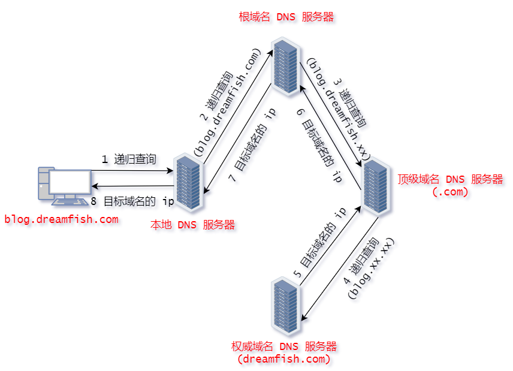
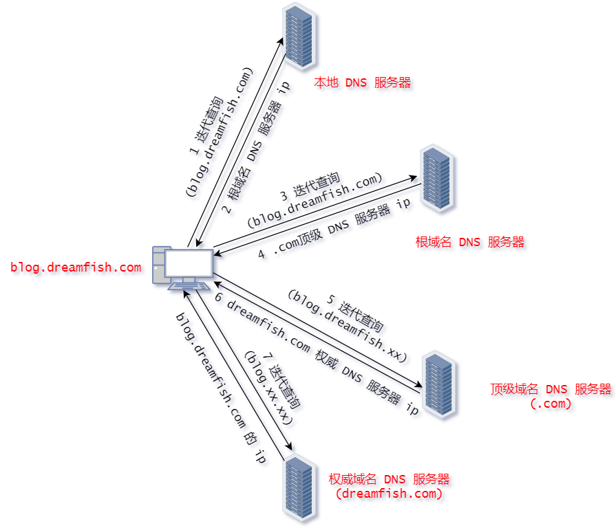
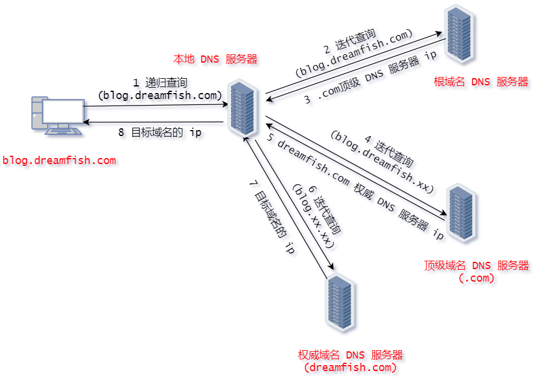

#### DNS解析

##### 基础概念

1. IP 地址是互联网上计算机唯一的逻辑地址，通过IP地址实现不同计算机之间的相互通信，每台联网计算机都需要通过IP地址来互相联系和分别。但 IP 很难记忆，人们在IP地址的基础上又发展出了一种更易识别的符号化标识，这种标识由人们自行选择的字母和数字构成，相比IP地址更易被识别和记忆，这种符号化标识就是域名。
2. 域名虽然更易被用户所接受和使用，但计算机只能识别纯数字构成的IP地址，不能直接读取域名。因此要想达到访问效果，就需要将域名翻译成IP地址，而 DNS 域名解析承担的就是这种翻译效果。
3. 域名结构：
   1. 域名由多个分量组成，用点（`.`）隔开，形成不同级别的域名。
   2. 级别最低的域名在左，顶级域名在右。
   3. 每个分量由英文字母和数字组成，不超过63个字符，完整域名不超过255个字符。
4. 域名管理方式:
   1. 不同级别的域名由其上一级管理机构管理，顶级域名由ICANN管理。
   2. 域名的具体意义和结构没有统一规定。
5. DNS 服务器的类型:(blog.dreamfish.com)
   1. 根域名服务器: 最高层次的服务器，了解所有顶级域名服务器的信息,存在多个不同IP的根域名服务器。(可找到 .com 顶级 DNS 服务器)
   2. 顶级域名服务器: 管理注册的二级域名，响应DNS查询请求，提供最终结果或下级权限域名服务器的IP地址。(可找到 dreamfish.com 权威 DNS 服务器)
   3. 权威域名服务器(存在不同叫法): 管理特定区域的域名，记录域名与IP地址的映射关系，了解下级域名服务器的地址。(可找到 blog.dreamfish.com 的 ip)
   4. 本地域名服务器: 不属于上述等级结构，用户的DNS请求首先送到本地域名服务器。代理角色，将请求转发到其他域名服务器，通常位于用户局域网内。 

##### dns查询

1. 递归查询和迭代查询是DNS解析中两种不同的查询方式，主要区别在于它们如何处理DNS查询请求。
2. 递归查询:我们不妨定义，发送 DNS 查询请求的一方为客户端，不论其是 DNS 服务器还是电脑、手机等
   1. 在递归查询中，接收查询请求的 DNS 服务器会代为进行所有必要的查询，直到找到最终的IP地址或返回错误。
   2. 例如: 当一个客户端(例如电脑或手机)向 DNS 服务器(通常是你的本地 DNS 服务器或 ISP 的 DNS 服务器)发送请求时，如果该服务器没有所需的信息，那么它有责任自己去其他 DNS 服务器中查找这些信息。服务器会代表客户端执行所有必要的进一步查询，直到它获得答案。然后，它将答案返回给客户端。(客户端得到的是一个最终结果，简化了操作。但是增加了本地域名服务器的负担，因为它需要处理所有查询步骤。)
   3. 不妨考虑所有服务器采用递归查询的情况(一般不会): 
3. 迭代查询:
   1. 在迭代查询中，DNS 服务器接收到请求后，会返回可以继续查询的下一个DNS服务器的地址，而不是直接返回最终结果。
   2. 例如: 当一个客户端(例如电脑或手机)向本地 DNS 服务器收到查询请求后，本地的 DNS 返回给客户端根域名服务器。然后客户端转而向根域名服务器发送查询请求，依此类推，直至客户端得到最终的IP地址或返回错误。(减少了本地域名服务器的负担，因为它不需要处理所有步骤。但是客户端需要处理多个步骤，可能需要等待更长时间才能获得最终结果。) 
4. 发送 DNS 查询时，DNS 请求报头部的 RD 字段默认为 1，默认为递归查询。
   1. RD 为 1 : 递归查询(默认)
   2. RD 为 0 : 迭代查询

5. 通常情况下，主机向本地名称服务器的查询一般都是采用递归查询，而本地名称服务器向 DNS(一级、二级...)名称服务器采用迭代查询。 

> 递归查询：由接收请求的 DNS 服务器处理所有查询，客户端得到最终结果。
>
> 迭代查询：客户端自己处理查询过程，服务器提供下一个可查询的地址。

##### 高速缓存

1. 为了提高DNS的查询效率，并减轻根域名服务器的负荷，在域名服务器中广泛地使用了高速缓存。高速缓存用来存放最近查询过的域名以及从何处获得域名映射信息的记录。同时，为保持高速缓存中的内容正确，每项缓存的内容都应有一个计时器，用于跟踪其有效性。一旦超过设定的时间(如48小时)，该项将被删除，以防止使用过时的信息。
2. 在客户端访问之后，递归服务器和客户端都会缓存到该域名的解析记录，并设置相应的缓存生存时间 TTL ，在 TTL 有效期内，客户再次对同域名发起访问时，直接通过客户端缓存和本地 DNS 服务器高速缓存解析，不再需要经过迭代查询过程。DNS 缓存可极大提升 DNS 域名解析的效率，一定程度上减少了服务器到用户之间环境对 DNS 域名解析的影响。
3. 许多用户主机在启动时从本地域名服务器下载域名和IP地址的全部数据库，维护存放自己最近使用的域名的高速缓存，并且只在从缓存中找不到域名时才向域名服务器查询。

> 据GPT回应: 
>
> - 本地 DNS 服务器通常指的是用户设备所配置的 DNS 服务器，例如 ISP 提供的 DNS 服务器,它们不在用户的本地网络中，通常是由用户的互联网服务提供商（ISP）提供，这些 DNS 服务器通常位于ISP的数据中心，用户的计算机通过网络连接到这些服务器。
> - 当你在配置文件中使用谷歌(8.8.8.8)或阿里云的 DNS 服务器时，这些也可以视为“本地 DNS 服务器”，因为你的设备会向这些服务器发送 DNS 查询请求。它们被称为“公共 DNS 服务器”，可以被任何人使用。这些公共 DNS 服务器提供了更快的解析速度和更高的可靠性，常常用作替代 ISP 提供的 DNS 服务器。

##### dns解析流程

> 按照(主机向本地名称服务器的查询采用递归查询，而本地名称服务器向 DNS名称服务器采用迭代查询)策略进行流程分析

1. 用户发起请求: 当用户在浏览器中输入一个域名(例如 `www.example.com`)并按下回车时，浏览器会首先检查本地缓存，看看是否已经有该域名的IP地址。

2. 查询本地DNS缓存: 如果缓存中存在相应的IP地址，浏览器直接使用该地址与服务器建立连接。如果缓存中没有，浏览器会向本地DNS服务器(通常是用户网络服务提供商提供的DNS服务器)发出查询请求。

3. 本地DNS服务器查询: 本地DNS服务器接收到请求后，也会检查其缓存。如果本地DNS服务器有缓存的结果，它将直接返回给用户的设备。如果没有，查询过程将继续。

4. 迭代查询到根域名服务器: 本地DNS服务器会向根域名服务器发送请求。根域名服务器是DNS系统的最高层次，它不直接提供IP地址，但会告知本地DNS服务器该域名所属的顶级域名服务器（例如 .com、.net 等)。

5. 查询顶级域名服务器: 本地DNS服务器接收到根服务器的响应后，会向相应的顶级域名服务器（如 .com 服务器）发送请求。顶级域名服务器同样不提供最终结果，但会返回下一级的权威DNS服务器的地址。

6. 查询权威DNS服务器: 本地DNS服务器会向权威DNS服务器发送请求。权威DNS服务器存储着该域名的真实IP地址。比如，它会返回 `www.example.com` 的实际IP地址。

7. 返回结果给本地DNS服务器: 权威DNS服务器返回IP地址后，本地DNS服务器会将其存储在缓存中，以便将来使用，然后将结果返回给用户的设备。

8. 返回结果给用户: 用户的设备接收到IP地址后，浏览器可以使用该IP地址与目标服务器建立连接，加载所请求的网页。

9. 本地DNS服务器和用户设备会在缓存中保存查询结果，并为每个条目设置过期时间（TTL，生存时间）。一旦TTL到期，相应的条目将被删除，下一次查询时会重新发起解析过程。

---

#### 域名解析

##### 域名解析

1. 泛解析是指将一个域名的子域名指向同一 IP 地址，而不需要为每个子域名单独配置 DNS 记录。通常使用星号`*`作为通配符。如设置 `*.dreamfish.cc` 指向某个 IP 地址，那么 `a.dreamfish.cc`、`b.dreamfish.cc`、`anything.dreamfish.cc` 等都将解析到同一个 IP 地址。

2. 当有多个子域名需要指向同一服务时，使用泛解析可以避免为每个子域名单独配置。

3. 域名解析就是将域名(地址)与你的网站服务器 ip 地址进行绑定。

   > 在查看视频教程的时候发现一件很有意思的事情，讲师将一个域名绑定到一个局域网 ip，引起很多人的讨论。
   >
   > 1. 实际上当通过浏览器访问该域名时，通过 DNS 解析返回一个内网地址，然后浏览器就会访问该内网地址。因此这个域名只能在局域网内访问。外部网络(如互联网)无法直接访问局域网的 IP，因此只有在同一局域网内的设备才能通过该域名访问对应的服务。
   > 2. 这种方式，对于身处不同局域网的主机，虽然得到的 ip 地址是一样的，但是访问的主机是不一样的( 就像你在 M78 星云读书，有一个同学叫 A ,他在赛博坦星当汽车人，有个同事叫 A 。)，甚至可能某个局域网里没有该 ip ，无法访问。
   > 3. 这种设置通常用于内部服务，比如公司内部的网站、文件服务器或其他应用。它可以提高内部访问的便利性，而不需要记住局域网的 IP 地址。

##### 域名解析记录
1. 主要分为 A 记录、MX 记录、CNAME 记录、 NS 记录和 TXT 记录(其他不常用的略)：
   1. A 记录: 将域名直接映射到一个 IPv4 地址，可以将多个域名解析到一个IP地址，但是不能将一个域名解析到多个IP地址。
   2. AAAA记录: 将域名直接映射到一个 IPv6 地址。
   3. MX 记录: Mail Exchange，就是可以将某个域名下的邮件服务器指向自己的Mail Server。
   4. CNAME 记录: Canonical Name，即别名解析，可以为一个域名设置一个或者多个别名。
   5. NS 记录: 为某个域名指定DNS解析服务器，也就是这个域名由指定的IP地址的DNS服务器取解析。
   6. TXT 记录: 为某个主机名或域名设置说明。
2. 需要说明: A 记录和 MX 记录可以指向同一个 IP。例如 dreamfish 的 A 记录和 MX 记录都指向 60.xxx.xxx.xxx ，xxx@dreamfish.cc 的邮件路由，DNS会将邮件发送到 60.xxx.xxx.xxx 所在的服务器，而正常通过Web请求的话仍然解析到A记录的IP地址。
3. 后续尝试一下 MX 记录: 待补！