##### 创建虚拟机

1. 这里选择 ubuntu24.04 的服务器版本,[下载地址](https://ubuntu.com/download/server#how-to-install-lts)(以后建立写熟悉各种linux发行版的安装，哈哈)。
2. 开始安装，选择自定义模式(<font color=red>下面是学习 nginx 的配置，其他用途需要适当调整参数。</font>):<br>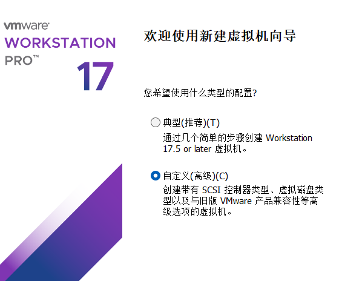
3. 配置 ios 镜像:<br>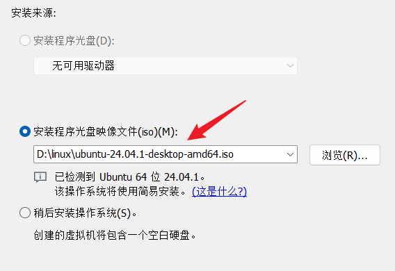
4. 设置用户名和密码:<br>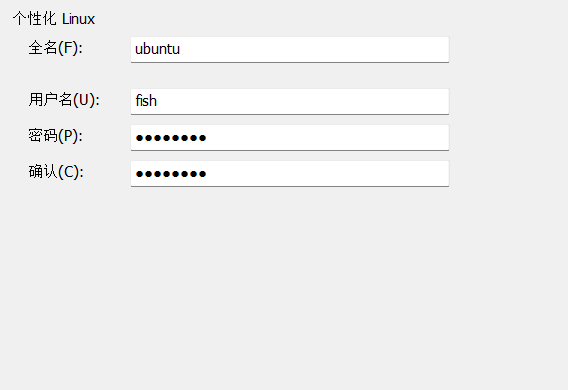
5. 配置存储位置:<br>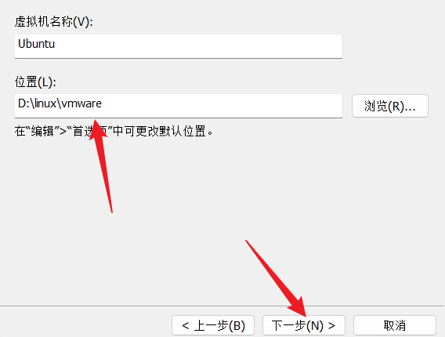
6. 配置处理器和内核数:<br>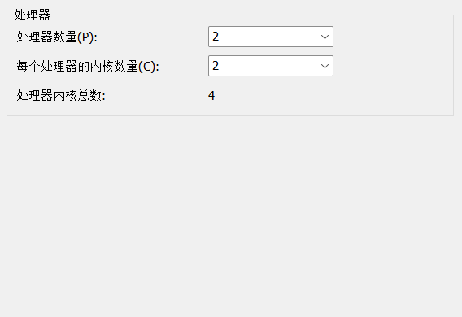
7. 配置内存大小:<br>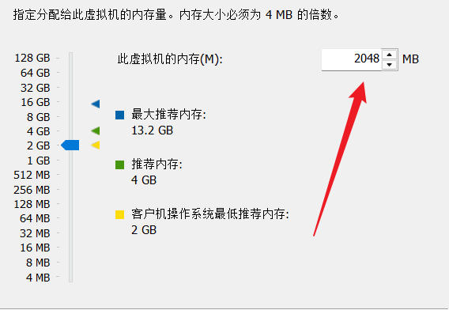
8. 配置网络模式:<br>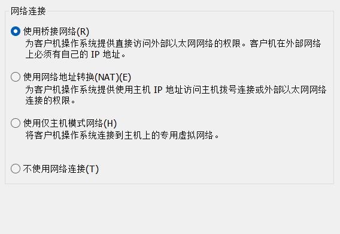
9. 后续基本选择推荐的默认配置:<br>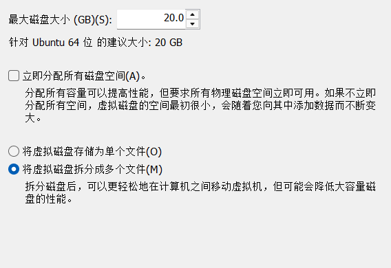
10. 自定义硬件:按照需要配置即可<br>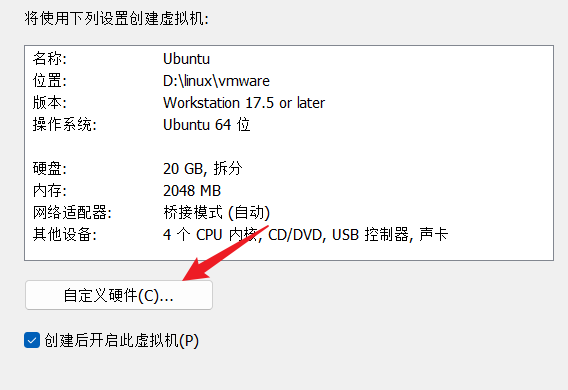<br>


##### 网络模式

VMware 提供了几种网络模式，每种模式适用于不同的场景。以下是主要的网络模式及其详细介绍：

1. 桥接模式 Bridged
   1. 在这种模式下，VMware 虚拟出来的操作系统就像是局域网中的一台独立的主机，它可以访问网内任何一台机器。需要手工为虚拟系统配置 IP 地址、子网掩码，而且还要和宿主机器处于同一网段，这样虚拟系统才能和宿主机器进行通信。同时，由于这个虚拟系统是局域网中的一个独立的主机系统，那么就可以手工配置它的 TCP/IP 配置信息，以实现通过局域网的网关或路由器访问互联网。
   2. 在一台连接到公司网络的主机上，启动桥接模式的虚拟机，它可以直接与公司网络中的其他计算机和打印机进行通信。
2. NAT模式 Network Address Translation
   1. 让虚拟系统借助 NAT（网络地址转换）功能，通过宿主机器所在的网络来访问公网，使用 NAT 模式实现在虚拟系统里访问互联网的前提是主机可以访问互联网。NAT 模式下的虚拟系统的 TCP/IP 配置信息是由 VMnet8（NAT）虚拟网络的 DHCP 服务器提供的，无法进行手工修改，因此虚拟系统也就无法和本局域网中的其他真实主机进行通讯。采用 NAT 模式最大的优势是虚拟系统接入互联网非常简单，不需要进行任何其他的配置，只需要主机器能访问互联网即可。这种情况下，主机可以 ping 通虚拟机，虚拟机也能 ping 通主机。
   2. 适用于需要访问外部互联网，但不需要被外部访问的场景。
   3. 如果你在家使用 NAT 模式的虚拟机，它可以访问互联网，但外部设备无法直接访问它。
3. 仅主机模式Host-only
   1. 虚拟机与主机之间可以进行通信，但虚拟机不能访问外部网络。它创建了一个隔离的网络环境，适合用于测试和开发。
   2. 在 Host-only 模式下，虚拟网络是一个全封闭的网络，它唯一能够访问的就是主机，当然多个虚拟机之间也可以互相访问。其实 Host-only 网络和 NAT 网络很相似，不同的地方就是 Host-only 网络没有 NAT 服务，所以虚拟网络不能连接到 Internet。主机和虚拟机之间的通信是通过 VMware Network Adepter VMnet1 虚拟网卡来实现的。此时如果想要虚拟机上外网则需要主机联网并且网络共享。
4. 修改虚拟机网络模式:<font color=red>右键虚拟机，选择设置，在弹出的设置窗口中选择网络适配器，就可以更改网络连接模式</font><br>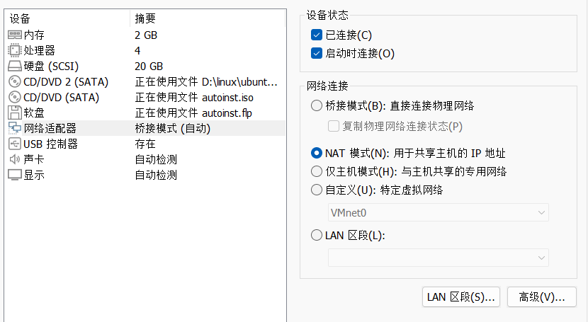
5. VMware的网络编辑器:<font color=red>在WMware的菜单栏选择编辑，点击虚拟网络编辑器即可(需要修改配置则点击更改设置)</font><br>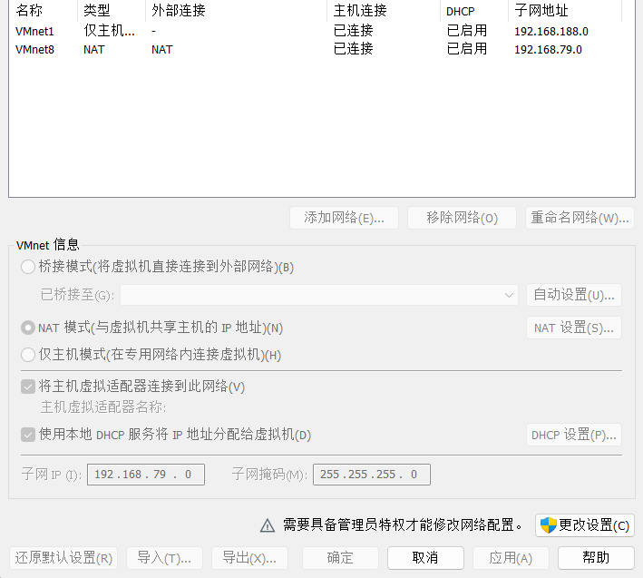
6. 最重要的一点:<font color=red>上述所谓的局域网和内网是指宿主机。对于NAT模式，同一网络中的虚拟机可以通过虚拟网卡（VMware Network Adapter VMnet8）相互访问，因为它们共享同一个 NAT 网络。但是这些虚拟机无法访问主机所在网络的机器(主机除外)，并且外界机器也无法直接访问 NAT 模式下的虚拟机，这样安全性就有一定的保障。</font>


##### 网络配置(NAT)

> 实际上这部分笔记晚于**网络配置(Bridged)**，部分解释内容可在**网络配置(Bridged)**查看！

1. 实际上在之前安装虚拟机的时候，我们选用的是桥接模式，在安装完成虚拟机之后无法连接网络,此时我们修改网络模式为NAT(不要忘记确认)，然后重启虚拟机，就可以正常连接网络。<br>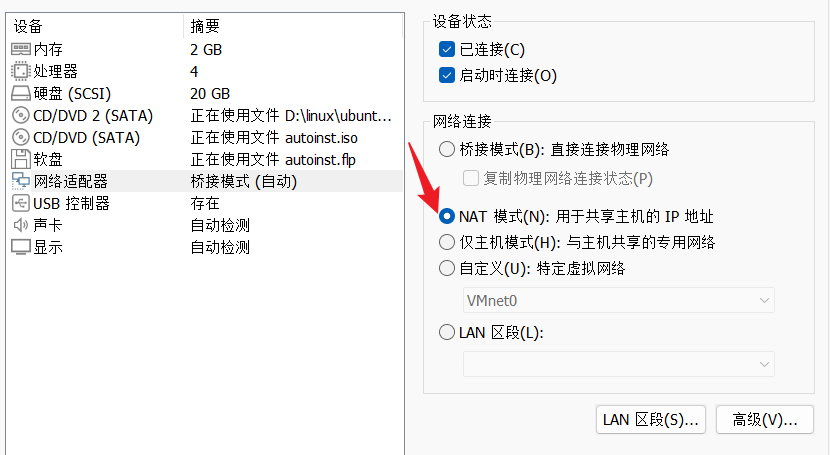

2. 我们先对虚拟机进行一些配置，安装一些必要的软件供后续使用:

   1. 修改镜像源:在系统菜单(点击左下角dock栏中的ubuntu图标)中打开软件和系统更新,然后选择中国的服务器即可。<br>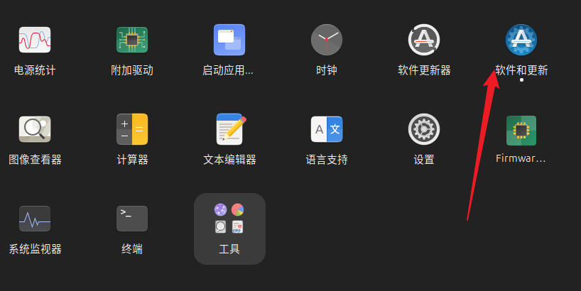

      <br>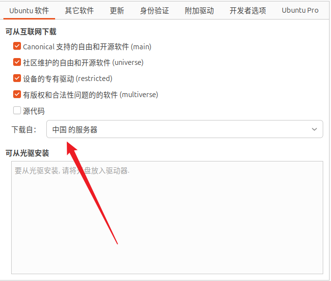

   2. 安装必要软件:

      ```bash
      # 更新源
      sudo apt-get update
      
      #虚拟机提示要安装(似乎是很VMware的功能有关)(后续发现不安装无法复制粘贴，安装完成后重启虚拟机就可以复制粘贴)
      sudo apt-get install open-vm-tools  
      sudo apt install open-vm-tools-desktop
      
      # 安装ifconfig命令
      sudo apt install net-tools
      
      # 安装vim
      sudo apt install vim
      ```

3. 接下来就是配置静态 ip ,打开 VMware 的虚拟网络编辑器，然后点击更改设置:<br>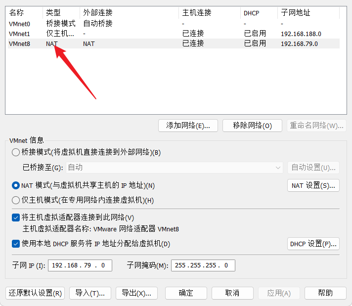

4. 查看网关和子网掩码:<br>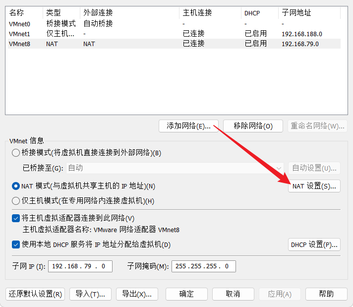<br>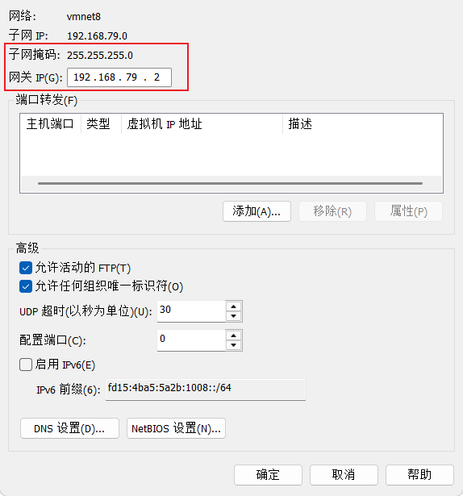

5. 查看 ip 地址范围:<br>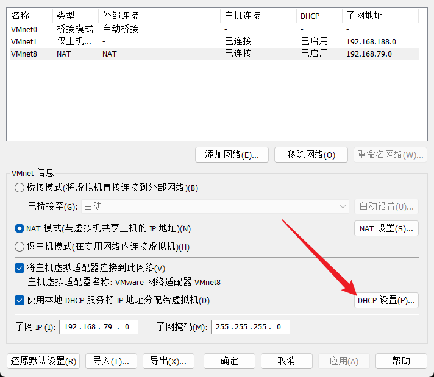<br>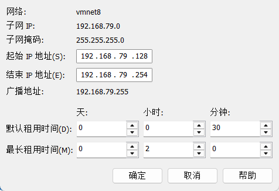

6. 开始为虚拟机分配静态 ip ,编辑 `sudo vim /etc/netplan/01-network-manager-all.yaml`

   ```yaml
   # Let NetworkManager manage all devices on this system
   network:
     version: 2
     renderer: NetworkManager
     ethernets:
       ens33:                      # 替换为你的网卡名称
         dhcp4: no                 # 关闭 DHCP
         dhcp6: no                 
         addresses:
           - 192.168.79.11/24       # 设置静态 IP 地址
         routes:                   # 使用 routes 来设置默认路由
           - to: 0.0.0.0/0
             via: 192.168.79.2      # 网关
         nameservers:              
           addresses: [223.6.6.6, 8.8.8.8, 114.114.114.114, 1.1.1.1]
   ```

7. 应用配置网络:`sudo netplan apply`，不行就重启虚拟机。

8. 实际上在宿主机中通过 `ipconfig `可以看到 VMnet8 的 ip 地址。VMware 创建的 VMnet8 虚拟网络适配器负责管理虚拟机的网络流量，它在虚拟网段中有一个 IP 地址，比如下面的 `192.168.79.1`，这个地址其实就可以看做宿主机在虚拟网段中的“假身份”。<br>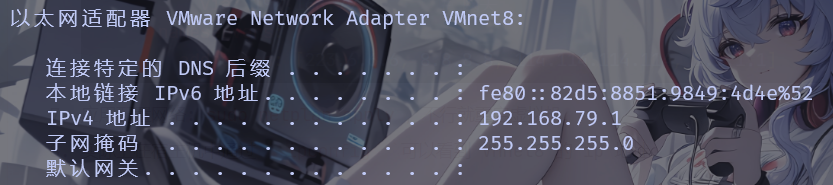


##### 网络配置(Bridged)

1. 但是，NAT模式下的虚拟机无法与局域网中的其他主机通信，所以一般而言不采用这用方式(依照需要而定吧),接下来将网络改回桥接模式，重启虚拟机。

2. 打开VMware的虚拟网络编辑器，点击更改设置，这里就可以看到桥接模式的虚拟网络接口(刚开始可能无法看到VMnet0，需要点击更改设置获取管理员权限)。<br>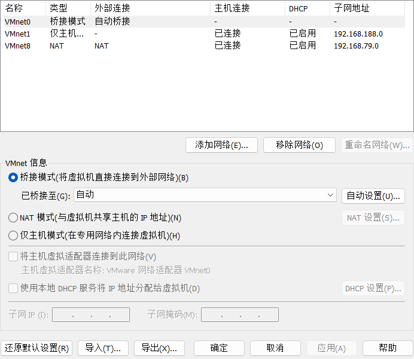

3. 配置VMnet0的网络适配器(这里有教程说选择当前正在使用的，也有的说选自动):我选自动试试<br>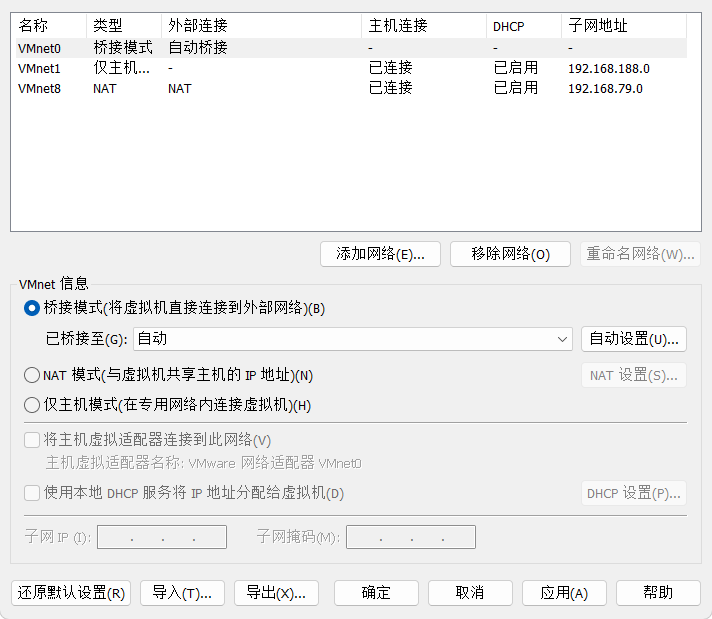

4. 在window使用`ipconfig`查看当前主机的网关:记住这里的默认网关和ip地址<br>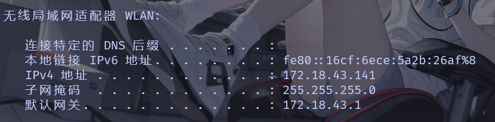

   > 这里是使用校园网，顺便补一下计网的知识(欠的总会还)
   >
   > 1. 内网地址(私有IP地址)是指在局域网(LAN)内部使用的IP地址，通常用于设备之间的通信。
   > 2. 根据互联网工程任务组（IETF）RFC 1918，以下地址范围被指定为私有地址，可以在局域网中自由使用：
   >    - `10.0.0.0` 到 `10.255.255.255`
   >    - `172.16.0.0` 到 `172.31.255.255`
   >    - `192.168.0.0` 到 `192.168.255.255`
   > 3. 10.x.x.x
   >    - 范围: 10.0.0.0 到 10.255.255.255
   >    - 子网掩码: 通常使用 255.0.0.0（/8）
   >    - 可用地址数量: 约 1,670万个地址
   >    - 适用场景: 适用于大型网络，特别是在需要大量 IP 地址的企业环境中。
   > 4. 172.16.x.x 到 172.31.x.x
   >    - 范围: 172.16.0.0 到 172.31.255.255
   >    - 子网掩码: 通常使用 255.240.0.0（/12）
   >    - 可用地址数量: 约 1,048,576个地址
   >    - 适用场景: 适用于中型网络，通常在企业或校园网络中使用。
   > 5. 192.168.x.x
   >    - 范围: 192.168.0.0 到 192.168.255.255
   >    - 子网掩码: 通常使用 255.255.255.0（/24）
   >    - 可用地址数量: 约 65,536个地址
   >    - 适用场景: 适用于小型网络，如家庭和小型办公室，最常用的私有地址范围。

5. 我们现在需要尝试为 ubuntu 虚拟机分配一个 ip 地址(172.18.43.161)，并设置静态 ip 。

6. 首先在 ubuntu 虚拟机中运行 `ip a` 查看一下网卡名称,我这里是 `ens33` :

   ```bash
   1: lo: <LOOPBACK,UP,LOWER_UP> mtu 65536 qdisc noqueue state UNKNOWN group default qlen 1000
       link/loopback 00:00:00:00:00:00 brd 00:00:00:00:00:00
       inet 127.0.0.1/8 scope host lo
          valid_lft forever preferred_lft forever
       inet6 ::1/128 scope host noprefixroute 
          valid_lft forever preferred_lft forever
   2: ens33: <BROADCAST,MULTICAST,UP,LOWER_UP> mtu 1500 qdisc pfifo_fast state UP group default qlen 1000
       link/ether 00:0c:29:fc:0c:71 brd ff:ff:ff:ff:ff:ff
       altname enp2s1
       inet 172.18.43.176/24 brd 172.18.43.255 scope global dynamic noprefixroute ens33
          valid_lft 2080sec preferred_lft 2080sec
       inet6 fe80::1987:60d7:67d1:5a10/64 scope link noprefixroute 
          valid_lft forever preferred_lft forever
   ```

7. 配置网络，编辑(其实ubunt自带一个文本编辑器 gedit ) `sudo vim /etc/netplan/01-network-manager-all.yaml`

   ```yaml
   # Let NetworkManager manage all devices on this system
   network:
     version: 2
     renderer: NetworkManager
     ethernets:
       ens33:                      # 替换为你的网卡名称
         dhcp4: no                 # 关闭 DHCP
         dhcp6: no                 
         addresses:
           - 172.18.43.161/24       # 设置静态 IP 地址
         routes:                   # 使用 routes 来设置默认路由
           - to: 0.0.0.0/0
             via: 172.18.43.1      # 路由器的 IP 地址
         nameservers:              
           addresses: [223.6.6.6, 8.8.8.8, 114.114.114.114, 1.1.1.1]
   ```

   > 关于这里还是解释一下:由于 `gateway4` 字段已被弃用，ubuntu建议使用默认路由配置。
   >
   > - 这里`to`指定了要路由到的目标网络。在这里，`0.0.0.0/0` 是一个特殊的表示法，表示所有 IP 地址，也就是说这是一个默认路由。默认路由用于将不在其他路由表中的数据包转发到指定的下一跳。
   > - `via` 指定了数据包应该发送到的下一跳(通常是路由器的 IP 地址)。在这个例子中，`172.18.43.1` 是路由器的 IP 地址，数据包将通过这个地址转发到外部网络。
   > - Netplan 配置文件 `/etc/netplan/01-network-manager-all.yaml` 的权限设置过于宽松,尝试修改权限 `sudo chmod 600 /etc/netplan/01-network-manager-all.yaml`。

8. 应用配置网络:`sudo netplan apply`，不行就重启虚拟机。

9. 本来事情到这里就结束了，但是由于在学校只能使用校园网，需要登录。在上面步骤中，我使用路由器作为网关，后续虚拟机联网需要登录。本来这也没什么，后续我搭建 docker 集群的时候，六个虚拟机都需要联网，但是校园网最多允许两个设备登录。我想过将网关设置为宿主机，但是宿主机每次重启会重新分配 ip ,推荐 NAT 模式。


##### 克隆和快照

1. 右键虚拟机，选择快照就可以:<br>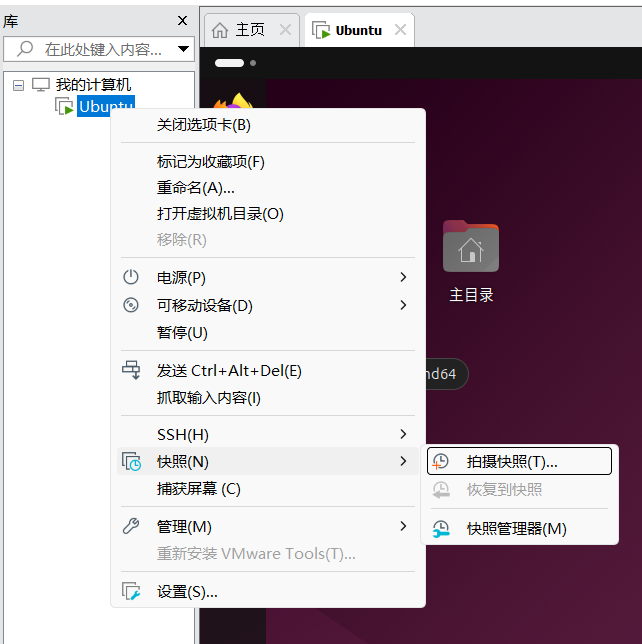
2. 右键虚拟机，选择设置，然后就可以克隆虚拟机(克隆虚拟机前需要关闭虚拟机)，一般选择创建链接克隆:<br>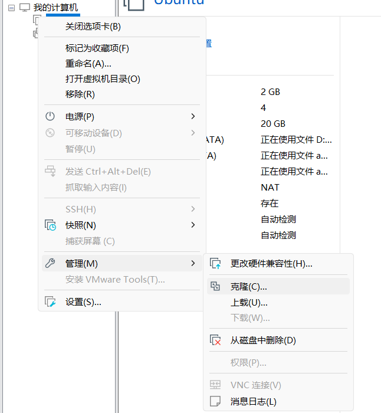<br>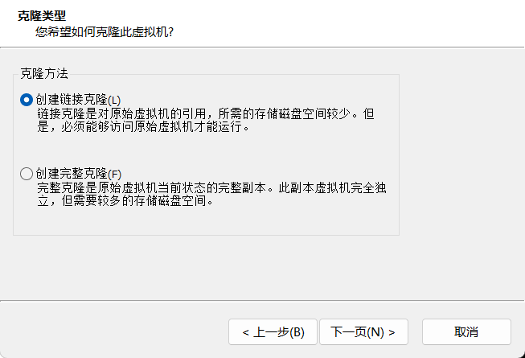
3. 对于克隆还是有一些细节问题:
   1. 修改主机名: `sudo vim /etc/hostname`
   2. 修改 ip 地址:` sudo vim /etc/netplan/01-network-manager-all.yaml`

