#### 1-虚拟化

Docker容器的本质就是通过容器虚拟技术虚拟出的一台主机，就像虚拟机一样。可以将应用及其运行环境部署在这台虚拟出的主机上运行。但容器与虚拟机又有着本质的不同。


##### a-传统程序运行

<br>

1.   下面是传统程序运行示意图，但是注意现在的`windows`已经不是这种运行情况了。

2.   传统程序运行，会去调用提供好的库(`bins、libs`)，通过这些库调用操作系统，操作系统又调用硬件。

<br>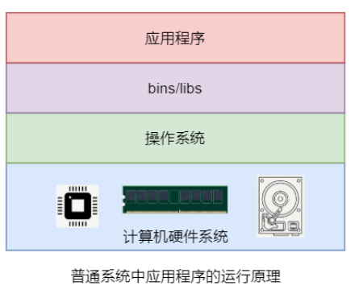


##### b-虚拟机虚拟技术

<br>

1.   传统的虚拟技术是在物理机的操作系统之上安装一个虚拟机管理程序，例如 VMware、VirtualBox 等。在其管理下可以创建很多个虚拟机。每个虚拟机需要安装自己独立的操作系统，而应用就是安装在虚拟机操作系统之上的程序，应用程序通过调用各种命令或库函数来使用其需要的各种系统资源。
2.   对于完全相同的两个应用，其若需要运行在两个虚拟机中，则就需要两套完全相同的虚拟机操作系统与 `bins/libs`，存在大量的资源占用冗余。形成资源浪费。
3.   如图：<br>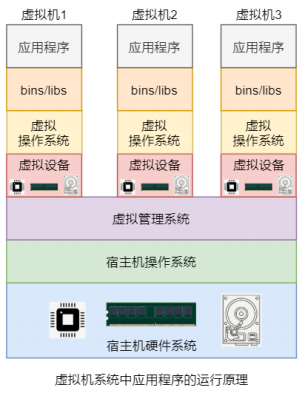


##### c-容器虚拟技术

<br>

1.   Docker 容器运行在 Docker 引擎之上，所有 Docker 容器共享同一个 Docker 引擎，但它们的运行又是相互隔离、互不干扰的。由于 Docker 容器不需要进行虚拟硬件及操作系统，而是共享的宿主机的硬件与操作系统，所以 Docker 容器对系统资源的占用很少，其仅包含运行时必须的一些资源。
2.   所有 Docker 容器对于系统资源的使用都是由 Docker 引擎统一进行管理，所以对系统资源的利用率很高。无论是应用执行速度、内存损耗或者文件存储速度，都要比传统虚拟机技术更高效。
3.   如图：<br>


#### 2-window虚拟

##### a-Hypervisor

<br>

1.   Hypervisor是一种运行在基础物理服务器和操作系统之间的中间软件层，可允许多个操作系统和应用共享硬件。也可叫做 VMM(virtual machine monitor)，即虚拟机监视器。
2.   Hypervisors 是一种在虚拟环境中的"元"操作系统。他们可以访问服务器上包括磁盘和内存在内的所有物理设备。Hypervisors不但协调着这些硬件资源的访问，也同时在各个虚拟机之间施加防护。
3.   当服务器启动并执行 Hypervisor 时，它会加载所有虚拟机客户端的操作系统同时会分配给每一台虚拟机适量的内存，CPU，网络和磁盘。


##### b-Hyper-V

<br>

1.   Hyper-V 是微软的一款虚拟化产品，是微软第一个采用类似 Vmware ESXi 和 Citrix Xen 的基于hypervisor的技术。
2.   Hyper-V 是微软提出的一种系统管理程序虚拟化技术，能够实现桌面虚拟化。
3.   Hyper-V 是微软提供的商业化的 Hypervisor。而KVM 与 Xen 都是 Linux 系统之上的开源的Hypervisor。


##### c-window虚拟化

<br>

1.   现在的 Windows 系统并不是一个"纯洁"的windows了，而是运行在Hyper-V上的虚拟机。
2.   而原来的应用层现在也是一个运行在Hyper-V上的虚拟机。系统上运行的一个个的应用，其实就是运行在应用层虚拟机之中。
3.   此外还存在一个操作系统虚拟机，能够管理应用层虚拟机。
4.   如图：<br>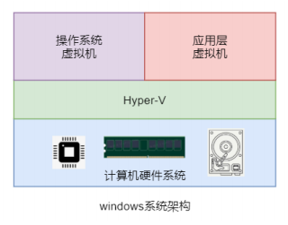
5.   windows系统的启动顺序如图：<br>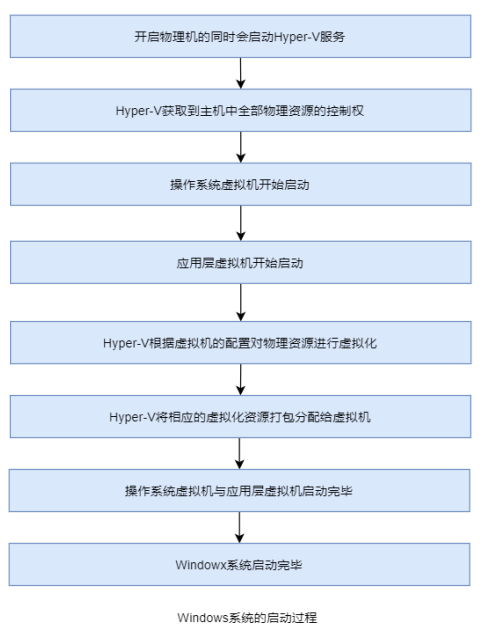


##### d-VMware不兼容

<br>

1.   VMware采用的是VMM虚拟化技术，该技术要求直接访问CPU硬件的虚拟化功能。但VMware作为 windows 系统中的应用，是运行在应用层虚拟机中的。导致VMware无法直接访问CPU硬件虚拟化功能。所以在安装VMware Workstation时会出现VMware Workstation与Hyper-V不兼容的问题。
2.   从VMware Workstation 15.5.5版本开始，VMware重构 VMM技术，使其不需要直接访问 CPU 硬件，而是通过调用Windows10系统的WHP的API来运行。这样就解决了不兼容的问题。


#### 3-docker简介

​			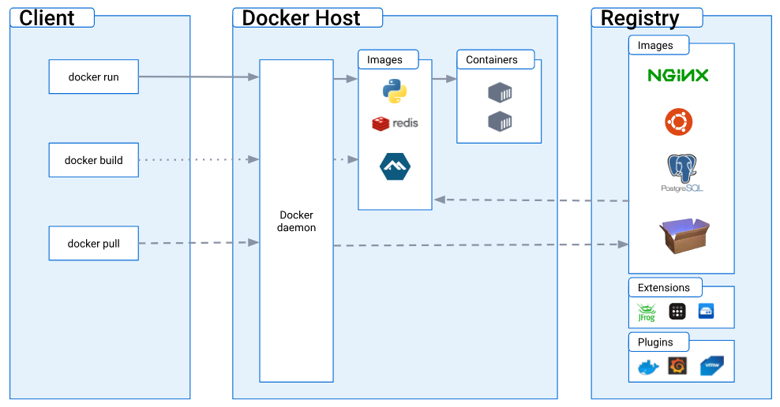


##### a-为什么是docker

<br>

>   1.   在生产环境中，很多时候的开发、测试及上线环境都是不一样的，从而导致项目(war或 jar)在不同阶段出现很多其它阶段所不存在的奇怪的问题。而Docker容器除了可以提供相同的应用外，还提供了该应用的统一运行环境，确保在任何宿主机上都可以跑出相同的结果。
>   2.   由于Docker确保了统一的运行环境，使得应用的迁移更加便捷。无论是物理机、虚拟机、公有云、私有云，Docker镜像的运行结果都是相同的。用户可以很方便地将一个平台上运行的应用，迁移到另一个平台上，而无需担心运行环境的变化导致应用无法正常运行。
>   3.   传统的虚拟机技术启动应用一般需要数分钟：首先需要启动虚拟机，然后再加载虚拟机操作系统，最后还需要再手工启动应用。而 Docker 容器应用，由于直接运行于宿主机系统中，无需启动操作系统，因此可以做到秒级、甚至毫秒级的启动。
>   4.   Docker 公司及各个开源项目团队一起维护了一大批高质量的官方镜像，既可以直接在生产环境使用，又可以作为基础进一步定制，大大的降低了应用服务的镜像制作成本。Docker使用的分层存储以及镜像的技术，使得应用重复部分的复用更为容易，也使得应用的维护更新更加简单，基于基础镜像进一步扩展镜像也变得非常简单。
>   5.   Docker LOGO由来：`Container`这个单词的意思不仅有"容器"，还有"集装箱"的意思。这就是为什么 LOGO 中出现很多集装箱的原因。至于鲸鱼，是在众多LOGO方案中由网友投票投出的结果，Docker 的本义为码头工人，即操作集装箱的人。


##### b-docker架构

<br>

>   1.   `Docker Daemon`：即 `Dockerd`，Docker守护进程，其监听着 Docker API请求并管理Docker对象，例如镜像、容器、网络和卷。守护进程还可以与其他守护进程通信以管理Docker服务。
>   2.   `Docker镜像`：用于创建 Docker 容器的模板。就像面向对象编程中的类。
>   3.   `Container(容器)`：Docker容器是镜像运行时的实体。就像面向对象编程中类的实例。一个类可以创建出 N多个实例，那么一个镜像同样也可以创建出 N 多个容器。每个处于运行状态的容器中都包含着一个或多个相关的应用，且它的运行不会干扰到其它容器。因为它们之间是相互隔离的。
>   4.   ` Repository(仓库)`：Docker镜像仓库用来保存相关的一组镜像，这组镜像具有相同的镜像名称，都与镜像仓库名称相同。仓库根据其中的镜像是否可以被公开共享，可以分为公开库与私有库。
>   5.    `Tag(标签)`：通过`<repository>:<tag>`即可唯一定位一个镜像。即镜像标签其实就是镜像仓库中用于区分各个镜像的一种标识，同一仓库中的镜像具有不同的标签。
>   6.   `Registry(镜像中心)`：Docker 的镜像中心中存放着很多由官方、其他机构或个人创建的 Docker 仓库，Docker用户可以直接从这些仓库中 pull 需要的镜像，也可以将自己制作的镜像 push 到 Docker 镜像中心相应的仓库中。最常用的镜像中心是Docker官方的[Docker Hub](https://hub.docker.com)。
>   7.   温馨提示，谨记docker官方镜像中心网址`https://hub.docker.com`。<br>


##### c-docker引擎版本迭代

<br>

>   1.   Docker在首次发布时，其引擎由两个核心组件构成：LXC(Linux Container)与 Docker Daemon。
>        1.   该架构依赖于LXC，使得 Docker 存在严重的问题：
>             1.   依赖于外部工具，对 Docker 来说，存在着巨大的生存风险。
>             2.    LXC 使得Docker无法实现跨平台。
>        2.   Docker Daemon 的"大而全"也带来了严重的问题：
>             1.   版本更新与功能扩展较难。
>             2.   运行较慢，带来性能问题。
>             3.   Docker Daemon 运行出现问题，会直接影响容器的运行。
>             4.   不符合软件哲学(unix提出)--"小而精"。
>   2.   从Docker0.8版本开始，Docker使用自研的Libcontainer工具替换了LXC。
>   3.   2017 年 7 月OCI 基金会发布了两个规范（镜像规范与容器运行时规范）的OCI1.0版本。2016 年底发布的Docker1.1版本基本遵循了OCI1.0版本。从Docker1.1版本开始，Docker Daemon 中不再包含任何容器运行时代码，而是将容器运行时单独剥离了出来，形成了`Runc`项目。


##### d-docker引擎架构

<br>

>   1.   Docker 引擎是用来运行和管理容器的核心软件，其现代架构由四部分主要组件构成：`Docker Client`，`Dockerd`、`Containerd `与 `Runc`。
>
>        1.   `Docker Client`：Docker 客户端，Docker引擎提供的CLI工具，用于用户向Docker提交命令请求。
>
>        2.   `Dockerd`：即 `Docker Daemon`。在现代 `Dockerd `中的主要包含的功能有镜像构建、镜像管理、REST API、核心网络及编排等。其通过 `gRPC `与 `Containerd `进行通信。
>
>        3.   `Containerd`，即 `Container Daemon`，该项目的主要功能是管理容器的生命周期。不过，其本身并不会去创建容器，而是调用Runc来完成容器的创建。Docker公司后来将 Containerd 项目捐献给了CNCF(云原生基金会)。
>
>        4.   `Runc`：即`Run Container`，是`OCI`(开放容器倡议基金会)容器运行时规范的实现，`Runc`项
>
>             目的目标之一就是与`OCI`规范保持一致。所以，`Runc `所在层也称为`OCI`层。这使得`Docker Daemon` 中不用再包含任何容器运行时的代码了，简化了`Docker Daemon`。`Runc `只有一个作用—创建容器，其本质是一个独立的容器运行时CLI工具。其在 fork出一个容器子进程后会启动该容器进程。在容器进程启动完毕后，`Runc `会自动退出。
>
>        5.   `Shim`：垫片是实现Daemonless Container(无 Docker Daemon与Container Daemon容器)不可或缺的工具，使容器与` Docker Daemon` 解耦，使得 `Docker Daemon` 的维护与升级不会影响到运行中的容器。每次创建容器时，`Containerd `同时会fork出 `Runc `进程与 `Shim `进程。当 `Runc `自动退出之前，会先将新容器进程的父进程指定为相应的 `Shim `进程。除了作为容器的父进程外，Shim 进程还具有两个重要功能：
>
>             1.   保持所有 STDIN 与 STDOUT 流的开启状态，从而使得当 `Docker Daemon` 重启时，容器不会因为`Pipe`的关闭而终止。
>             2.   将容器的退出状态反馈给`Docker Daemon`。
>
>        6.   关系如图：<br>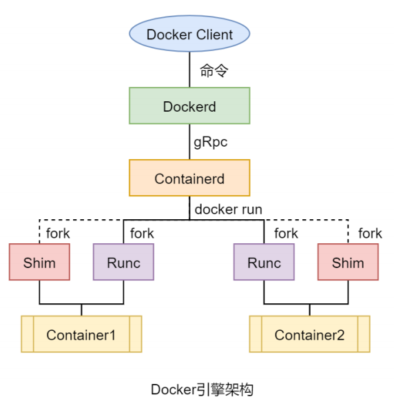
>
>   2.   Docker 从大版本来说，分为三类：`Moby`、社区版 `Docker-CE`（Community Edition）和企业版`Docker-EE`（Enterprise Edition）。
>
>   3.   我们这里要安装的是 `Docker CE` 版。


#### 4-安装docker

##### a-虚拟机准备

<br>

>   1.   教程使用的`centos`，但是我想用`ubuntu`。
>   2.   安装`ubuntu`虚拟机时，不要一开始选择安装程序驱动映像文件`ios`，而是选择稍后安装操作系统，最后在自定义硬件时再选择`ios`文件。不然`VMware`会自动帮你简化安装。其实安装过程与`deepin`类似。
>   3.   注意这里由于是虚拟机，出于内存考虑，安装`ubuntu`时选择最小安装就可以满足需要了。
>   4.   下面是虚拟机的一些配置：

1.   配置系统的软件源:

     1.      点击菜单(左下角)：<br>
     2.   选择如软件与更新：<br>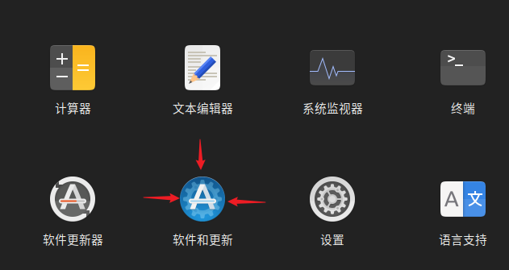
     3.   修改下载软件源。<br>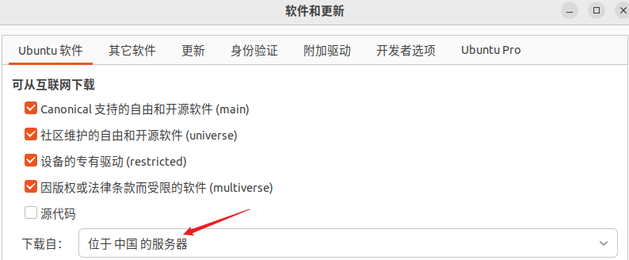
     4.   选择一个中国的服务器，点击选择服务器即可。<br>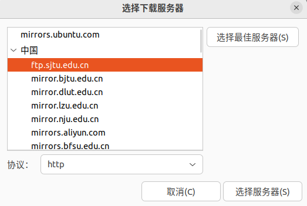
     5.   输入密码，重新载入即可。

2.   `ubuntu`系统不自带`vim`，需要手动安装：

     1.   运行`sudo apt-get install vim-gtk`安装。

     2.   刚下载的`vim`界面可能不友好，我们使用`sudo vim /etc/vim/vimrc`修改一下它的配置文件。

          ```text
           if has("syntax")
              syntax on
            endif
            "语法高亮，注释了就要放开
            
            "设置左侧行号
            set nu
            "设置tab键长度为4
            set tabstop=4
            "突出显示当前行
            set cursorline
            "在右下角显示光标位置的状态行
            set ruler
            "自动缩进
            set autoindent
            "覆盖文件时不备份
            set nobackup
          ```

     3.   使用`:wq!`强制退出保存即可。

3.   配置网络静态`ip`(类似于`deepin`配置)：

     1.   `Ubuntu `从17.10开始，已放弃在 `/etc/network/interfaces` 里固定`IP`的配置，`interfaces`文件不复存在，即使配置也不会生效，而是改成 `netplan `方式 ，配置写在` /etc/netplan/00-netcfg.yaml `或者类似名称的 `yaml `文件里。

     2.   使用`ip a`查看网卡名称：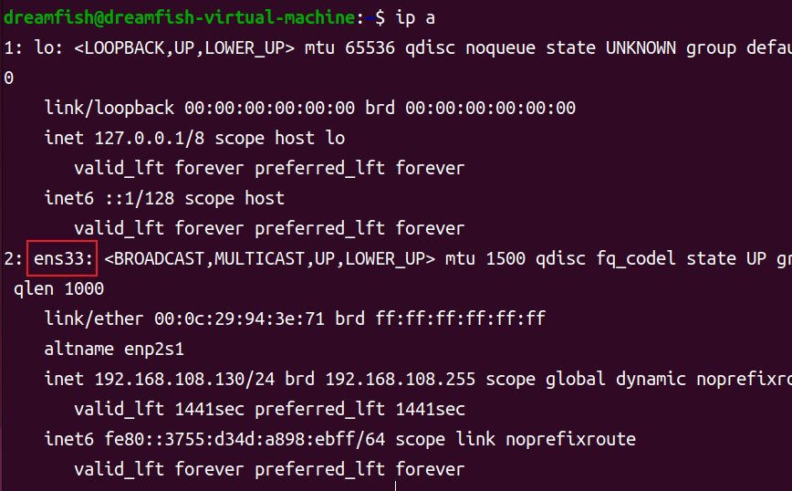

     3.   使用`sudo`权限编辑文件，即` sudo vim /etc/netplan/00-installer-config.yaml`。不会配置则参考`deepin`的相关配置。

          ```yam
          network:
            ethernets:
              ens33:     #配置的网卡名称
                addresses: [192.168.108.100/24]    #配置的静态ip地址和掩码
                dhcp4: no    #关闭DHCP(启用yes)
                optional: true
                # gateway4: 192.168.108.2  网关地址(已弃用)
                routes:
                  - to: default
                    via: 192.168.108.2
                nameservers:
                   addresses: [192.168.108.2]    #DNS服务器地址
            version: 2
            renderer: networkd    
            #指定后端采用systemd-networkd或Network Manager，不写则默认用systemd-workd
          ```

     4.   使用`:wq!`强制退出保存即可。

     5.   运行`sudo netplan apply`使配置生效，最后重启系统。

     6.   如若上述配置不行，则继续配置`interfaces`试一试。

4.   `ubuntu`无法通过`ssh`连接，需要安装`openssh-server`:

     1.   运行命令，更新源`sudo apt-get update`。
     2.   运行`sudo apt-get install openssh-server`安装`openssh-server`。
     3.   运行`sudo apt-get install ufw`安装防火墙。
     4.   运行`sudo ufw enable`开启防火墙。
     5.   运行`sudo ufw allow 22 `设置防火墙充许22端口对外开放。
     6.   通过`ssh`连接，运行`whoami`查看用户，以检查配置是否成功。

5.   安装搜狗输入法：

     1.   `Ubuntu`上默认只能输入英文，如果想通过第三方输入法输入中文的话，需要安装键盘输入法系统，`Ubuntu`的键盘输入法系统通常有以下三种：`fcitx`、`IBUS`、`XIM`。而我们的一般要在`Ubuntu`上安装的谷歌输入法或者搜狗输入法，是需要在`fcitx`输入法系统的基础上进行安装的。

     2.   运行` sudo apt install fcitx-bin fcitx-table `安装`fcitx`键盘系统。

     3.   在设置中，打开区域与语言，点击管理已安装的语言。<br>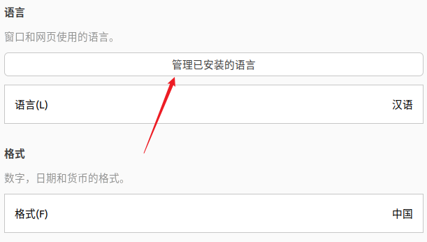

     4.   设置键盘系统为`fcitx`。<br>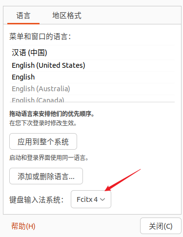

     5.    运行`uname -a`查看系统体系。例如`arm64、X86_64、adm64`。`adm64`和`x86_64`兼容。

     6.   在浏览器访问`http://pinyin.sogou.com/linux/`下载搜狗浏览器。

     7.   到对应的下载目录下，打开终端。为啥不直接使用命令行？他喵的输入不了中文，但是默认下载到`/home/用户/下载/`目录下，你说气不气。

     8.   运行`sudo dpkg -i 安装包名`，安装搜狗输入法安装包。

     9.   运行下面的命令，安装相关依赖(不知道有啥用)。

          ```shell
          sudo apt install libqt5qml5 libqt5quick5 libqt5quickwidgets5 qml-module-qtquick2
          sudo apt install libgsettings-qt1
          ```

     10.   重启电脑，配置一个搜狗输入法。<br>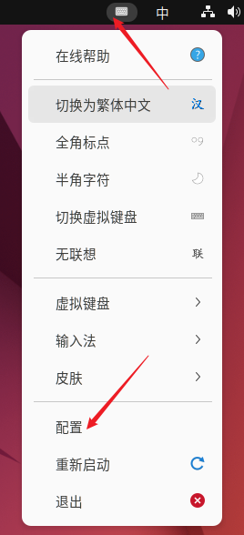

     11.     将搜狗输入法移至首位。<br>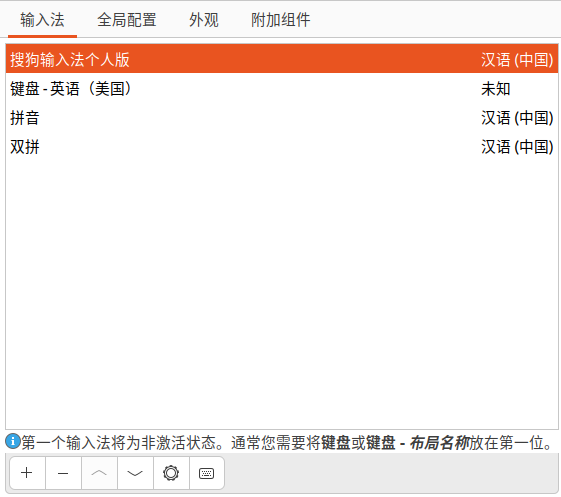

     12.   搜狗输入法一些配置：<br>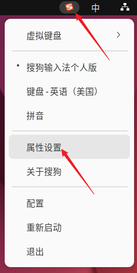

6.   无法更新`snap store`，自己无法更新自己。

     1.   杀死`snap store`的线程，`kill pid`，`pid`一般报错时会给。
     2.   运行命令`sudo snap refresh snap-store`即可。

7.   修改背景，使用`xftp`工具传输背景图。使用`mv xx yy`一定图片到`/home/用户/图片/`目录，设置为背景图即可。

8.   删除打印机。首先关闭虚拟机、打开`ubuntu`虚拟机设置，干掉打印机后确认即可。<br>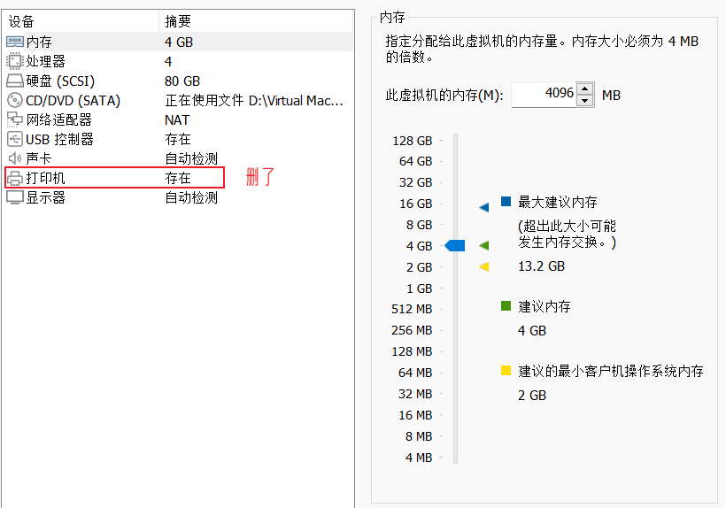

     >   1.   随着 `apt install package` 命令的使用频率和普遍性逐步超过 `apt-get install package`，越来越多的其它 Linux 发行版也开始遵循 `Ubuntu `的脚步，开始鼓励用户使用 `apt` 而不是 `apt-get`。
     >   2.   `apt `是`apt-get`和`apt-cache`的子集，为包管理提供必要的命令。


##### b-安装docker

<br>

1.   进入官网，即`https://www.docker.com/`。注意不要下载`docker desktop`，这是桌面应用。我们点击右上角的`Developers`，然后选择查看文档`Docs`去找安装docker引擎的介绍：<br>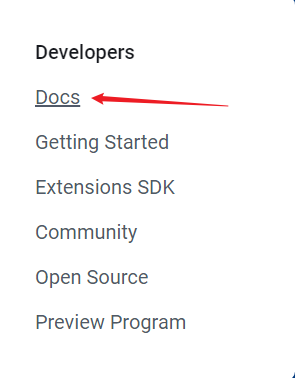

2.   文档中选择下载安装。<br>

     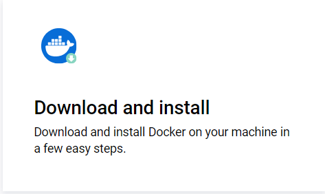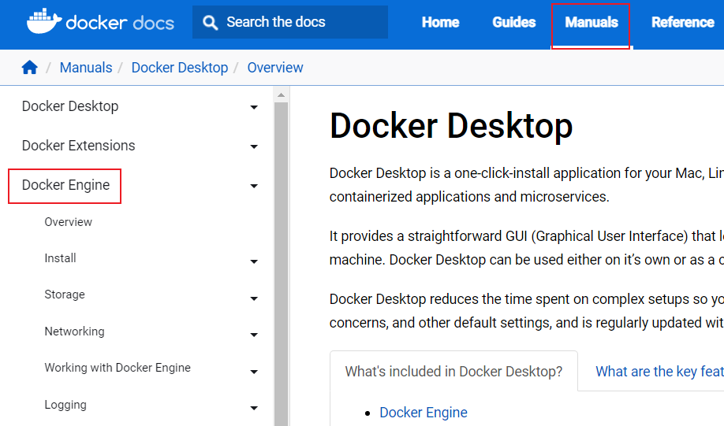

4.   文档中有许多系统的安装方式，我这里使用`ubuntu`，其他类型参考对应文档。<br>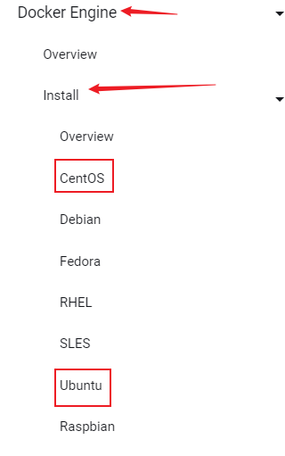

5.   官方提供多种方式安装`docker`，我们采用先安装仓库的方式安装最新版。

     ```shell
     # 卸载旧版本
     sudo apt-get remove docker docker-engine docker.io containerd runc
     
     # 更新apt包索引并安装包以允许apt通过HTTPS使用存储库
     sudo apt-get update
     sudo apt-get install ca-certificates curl gnupg
     
     # 添加Docker的官方GPG密钥
     sudo install -m 0755 -d /etc/apt/keyrings
     curl -fsSL https://download.docker.com/linux/ubuntu/gpg | sudo gpg --dearmor -o /etc/apt/keyrings/docker.gpg
     sudo chmod a+r /etc/apt/keyrings/docker.gpg
     
     # 使用以下命令设置存储库
     echo "deb [arch="$(dpkg --print-architecture)" signed-by=/etc/apt/keyrings/docker.gpg] https://download.docker.com/linux/ubuntu "$(. /etc/os-release && echo "$VERSION_CODENAME")" stable" |  sudo tee /etc/apt/sources.list.d/docker.list > /dev/null
     
     # 更新apt包索引
     sudo apt-get update
     
     # 安装最新版本
     sudo apt-get install docker-ce docker-ce-cli containerd.io docker-buildx-plugin docker-compose-plugin
     
     # 通过运行hello-world映像验证Docker引擎安装是否成功
     sudo docker run hello-world
     ```


5.   当然也可以安装指定版本，参考官方文档即可。

     > archlinux安装`docker`：
     >
     > 1. 安装`sudo pacman -S docker`
     >
     > 2. 配置启动服务：
     >
     >    ```bash
     >    sudo systemctl enable --now docker.service
     >
     >    sudo systemctl start docker.service
     >
     >    sudo systemctl status docker.service
     >
     >    sudo systemctl stop docker.service
     >    ```
     >
     > 3. 添加当前用户到用户组,以便使用`docker`命令：
     >
     >    ```bash
     >    sudo gpasswd -a $USER docker
     >    reboot
     >    ```
     >
     > 4. 配置镜像加速:编辑文件`vim /etc/docker/daemon.json`配置清华镜像加速
     >
     >    ```bash
     >    {
     >        "registry-mirrors": ["https://docker.mirrors.ustc.edu.cn"]
     >    }
     >    ```
     >
     > 5. 重启服务：
     >
     >    ```bash
     >    sudo systemctl daemon-reload
     >    sudo systemctl restart docker.service
     >    ```
     
     

#### 5-docker基本命令

>   1.   注意，非`root`用户是无法运行`docker`命令的。
>        1.   在`ubuntu`系统运行`sudo gpasswd -a $USER docker`添加当前用户到docker组。
>        2.     运行`sudo newgrp docker`或者注销用户使生效。
>        3.   还不行，重启系统。
>   2.   但是存在安全隐患，仅用于开发环境。生产环境中请在`root`下运行。
>   3.   由于已经配置上述内容，此后`docker`命令均省略`sudo`提权。

<br>

##### a-启停

>   1.   Docker 是以服务的形式运行在系统中，所以使用`systemctl`来对其进行各种操作。
>        1.   `systemctl start docker`：启动docker。
>        2.   `systemctl restart docker`：重启docker。
>        3.   `systemctl stop docker`：关闭docker。
>        4.   `systemctl enable docker `：设置docker开机自启。
>        5.   `systemctl disable docker`：关闭docker开机自启。
>        6.   `systemctl status docker`：查看docker状态。
>   2.   `docker version`：查看当前 docker 的版本信息，主要包括Docker的Client与Server的信息。

1.   运行`systemctl status docker`可以查看是否开机自启：<br>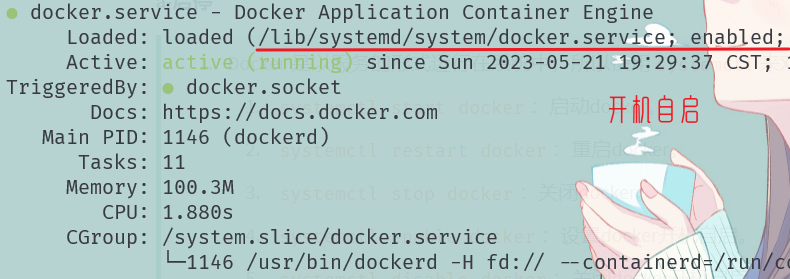
2.   运行`docker version`查看版本信息：<br>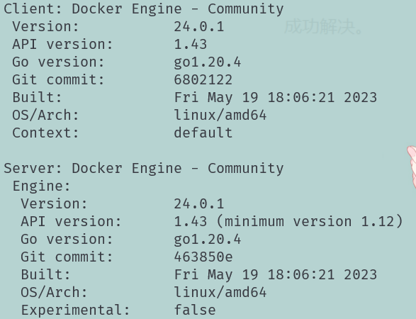


##### b-配置镜像加速器

<br>

1.   国内镜像中心常用的为阿里云与网易云。在本地 Docker 中指定要使用的国内加速器地址后，就可以直接从国内镜像中心下载镜像。

2.   下面采用阿里云镜像中心，首先进入阿里云官网`https://www.aliyun.com/`注册并登录。

3.   搜索容器镜像服务，进入容器镜像服务控制台。<br>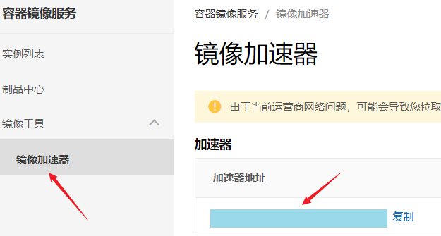

4.    通过修改daemon配置文件`/etc/docker/daemon.json`来使用加速器。顺便提一下，下面的`eof` 标记可以是任何字符序列，只要保证在输入中不会出现该字符序列即可。在使用该命令时，你需要先输入要写入文件的文本内容，然后在另起一行输入 `eof` 标记，以告知命令输入已经结束。

      ```shell
      sudo mkdir -p /etc/docker  # 创建文件夹
      sudo tee /etc/docker/daemon.json <<-'EOF'
      {
      "registry-mirrors": ["https://xxxxx.mirror.aliyuncs.com"]
      }
      EOF
      sudo systemctl daemon-reload	# 重新加载服务配置文件
      sudo systemctl restart docker	# 重启docker
      ```

      <br>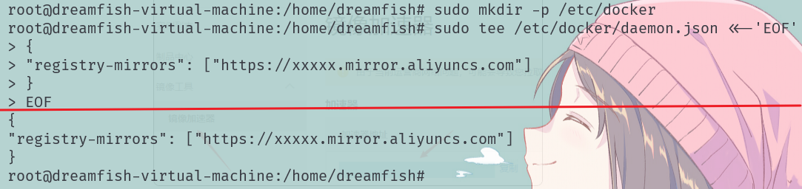

5. 其实也可以直接编辑`/etc/docker/daemon.json`。

   ```shell
   sudo mkdir -p /etc/docker  # 创建文件夹
   vim /etc/docker/daemon.json	 # 编辑json文件
   # ...编辑json文件
   sudo systemctl daemon-reload	# 重新加载服务配置文件
   sudo systemctl restart docker	# 重启docker
   ```

   <br>

   ```bash
   # 清华镜像
   {
   "registry-mirrors": ["https://docker.mirrors.ustc.edu.cn"]
   }
   
   # 网易镜像
   {
   "registry-mirrors":["https://hub-mirror.c.163.com"]
   }
   ```

   

6.   此外，对于网易云加速器，只需将json文件中的`registry-mirrors`即可。也即`registry-mirrors:["https://hub-mirror.c.163.com"]`。

7.   运行命令`docker pull mysql:latest`，安装一个`mysql`镜像测试一下。

     


>   关于`linux`的`tee`命令：
>
>   1.   想手动跟踪命令的输出内容，同时又想将输出的内容写入文件，确保之后可以用来参考。可以使用`tee`。
>   2.   命令格式`tee [OPTION]... [FILE]...`。
>   3.   `OPTION`的一些配置：
>
>        1.   `-a`，也即`--append` 向文件中重定向时使用追加模式。 
>
>        1.   `-i`， 也即`--ignore-interrupts` 忽略中断(interrupt)信号。
>
>        1.   `--help` 显示帮助信息并退出。
>
>        1.   ` --version` 显示版本信息并退出。
>   4.   默认情况下，在同一个文件下再次使用 `tee` 命令会覆盖之前的信息。
>   5.   举例：
>        1.   如`[command] | tee [OPTION] [file1] [file2] ...`将前一个命令的输出写入一个或者多个文件。
>
>        2.   如`tee [OPTION] [file1] [file2] ... `将终端的输入写入一个或者多个文件。
>


##### c-卸载docker引擎

<br>

1.   同样参考官方文档，卸载docker引擎。[文档](https://docs.docker.com/engine/install/ubuntu/)位置与安装时一致。<br>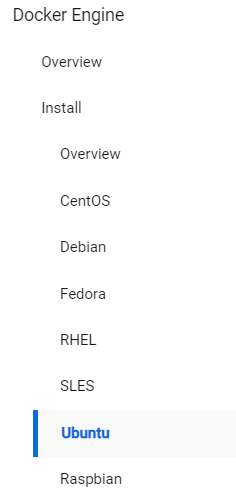

2.   具体运行命令：

     ```shell
     # 卸载docker引擎
     sudo apt-get purge docker-ce docker-ce-cli containerd.io docker-buildx-plugin docker-compose-plugin docker-ce-rootless-extras  
     
     # 主机上的映像、容器、卷或自定义配置文件不会自动删除。要删除所有映像、容器和卷
     sudo rm -rf /var/lib/docker
     sudo rm -rf /var/lib/containerd
     
     #删除自定义配置文件...
     ```

3.   最后不要忘记手动一下删除自定义的配置文件。


