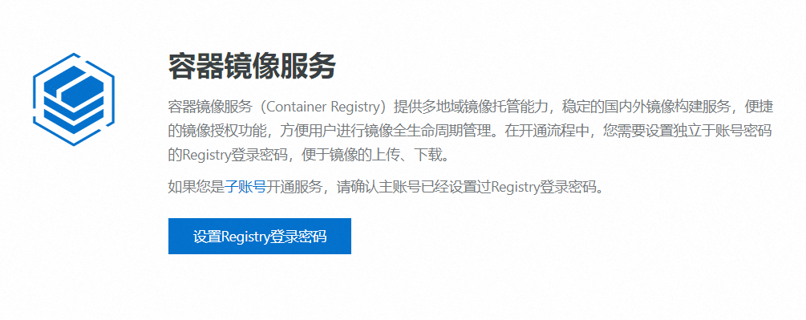

#### 镜像推送

##### docker hub

1. 准备一个镜像，这里我使用自己编写的一个镜像。

2. 首先需要创建一个 docker hub 账号，对于 dockerhub ，存在两种登录方式:(需要网络保障)

   1. 运行`docker login`然后打开验证链接，输入验证码即可。
   2. 运行`docker login -u`指定登录账号，然后输入密码即可。

3. 登录账号后需要通过 `docker tag` 命令可以对原有镜像进行复制并重命名。这个重命名的镜像的 repository 中必须采用`<username>/<software-name>`格式，且username 必须是登录 Docker Hub 的用户名。例如:

   ```bash
   docker tag random-image-api:latest dreamfishyx/random-image-api:1.0
   ```

4. 使用 `docker push`将对应镜像推送到镜像中心。例如:

   ```bash
   $ docker push dreamfishyx/random-image-api:1.0
   The push refers to repository [docker.io/dreamfishyx/random-image-api]
   e879f5b8746e: Pushed
   b5becf2d59f9: Pushed
   b6138c1f34d1: Pushed
   0c1dc0e3e9c1: Pushed
   b37145d52b36: Mounted from library/python
   5b2bbb7d3a14: Mounted from library/python
   1eae3090c894: Mounted from library/python
   8d853c8add5d: Mounted from library/python
   1.0: digest: sha256:a13f6d097591a4cce76b80d0f20ec140ba72131181b1d860ec89885f3404b0ae size: 1997
   ```

5. 通过 `docker logout` 命令可以从 Docker 引擎中退出登录的 Docker Hub 账号。

   


##### 阿里云镜像中心

1. 关于阿里云镜像中心和 docker hub 的对比，阿里云不同于docker hub 使用用户名，而是改用命名空间，可以很好的保护用户隐私。<br><br>
2. 阿里云这里对个人用户是有免费的使用额度的。
   1. 首先需要一个已经实名的阿里云账号
   2. 登录阿里云后，打开阿里云的容器镜像服务的控制台,找到“实例列表”并创建个人实例:<br>
   3. 设置密码:<br>
   4. 先创建命名空间:<br>
   5. 后创建镜像仓库(镜像仓库也可以不创建，在创建命名空间时开启自动创建命名空间即可):<br>
   6. 后面在镜像仓库的基本信息中存在登录和推送教程。
3. 登录到阿里云镜像:` docker login --username=<user_name> <url>`,用户名是阿里云账户的名称。
4. 登录账号后需要通过 `docker tag` 命令可以对原有镜像进行复制并重命名。这个重命名的镜像的 repository 中必须采用`<namespace>/<software-name>`格式，且 namespace 必须是创建的命名空间。
5. 推送:`docker pull xxx`。
6. 退出:`docker logout`。


#### 搭建镜像中心

##### htpasswd

1. htpasswd命令是Apache的Web服务器内置工具，用于创建和更新储存用户名、域和用户基本认证的密码文件。registry 私有镜像中心中默认是没有用户认证功能的，可通过 htpasswd 来实现用户认证。

2. htpasswd 命令在 Linux 中默认是没有的，需要先行安装。而该工具在 httpd-tools 工具包中，所以需要先安装该工具包。

   ```bash
   # centos8
   yum install -y httpd-tools
   
   # archlinux
   pacman -S apache-tools
   ```

3. 使用参数：

   1. -c 创建一个加密文件。
   2. -n 不更新加密文件，只将加密后的用户名密码显示在标准输出。
   3. -m 默认采用MD5算法对密码进行加密(默认)。
   4. -2 强制对密码进行 SHA-256 哈希处理（安全）。
   5. -5 强制对密码进行 SHA-512 哈希处理（安全）。
   6. -B 强制对密码进行 bcrypt 哈希处理（非常安全）。
   7. -d 采用CRYPT算法对密码进行加密。
   8. -p 不对密码进行进行加密，即明文密码。
   9. -s 采用SHA算法对密码进行加密。
   10. -b 在命令行中一并输入用户名和密码而不是根据提示输入密码。
   11. -D 删除指定的用户。
   12. -i 从标准输入读取密码而不进行验证（用于脚本使用）。
   13. -v 验证指定用户的密码。

4. 使用举例:

   1. 我们在用户目录下创建一个 auth 目录，在其中存放生成的认证文件`htpasswd.user`。

      ```bash
      # 创建目录
      mkdir ~/auth
      
      # 进入目录
      cd ~/auth
      
      # 生成认证文件
      htpasswd -Bbc htpasswd.user dreamfish abc123
      
      # 查看生成的认证文件                                                                               15:48:44
      cat htpasswd.user
      ```

   2. 向文件中再次加入用户 fish :

      ```bash
      htpasswd -Bb htpasswd.user fish abc123
      ```

   3. 修改 fish 的密码: 修改密码与添加密码使用方式相同：若指定的用户名不存在，则为添加；若指定的用户名存在，则为密码修改。

      ```bash
      htpasswd -Bb htpasswd.user fish ABC123
      ```

   4. 删除用户:

      ```bash
      htpasswd -D htpasswd.user fish
      ```

   5. 此外:实际上我们还可以通过 -n 选项配合重定向符号将用户密码写入认证文件，而修改或者添加时则使用 追加重定向符号。

      ```bash
      # 创建
      htpasswd -Bbn dreamfish abc123 > htpasswd.user
      
      # 删除
      htpasswd -Bbn fish abc123 >> htpasswd.user
      ```

> 其实在 httpd-tools 工具包中还存在一个压力测试的工具` ab` ，例如`ab -n 100 -c 10 http://localhost:8080/`发送100个请求，每次发送10次，进行压力测试。


##### distribution私有镜像中心

1. 安装 docker-distribution :

   ```bash
   # centos 
   yum install -y docker-distribution
   
   # archlinux 
   yay -S distribution
   ```

2. 可以通过 rpm 命令可查看到该安装包安装的内容:`rpm -ql docker-distribution`。

3. 启动: docker-distribution 是作为服务出现的，所以使用服务启动方式来启动它,即使用`systemctl enable --now docker-distribution.service`

4. 默认情况下，为了保证安全，Docker 客户端都采用的是 https 提交各种请求，例如，登录请求、pull 请求、push 请求等。但私有镜像中心默认不支持 https 协议。所以需要修改 Docker客户端，使其提交 http 请求。修改方式是：在 Docker 客户端的/etc/docker/daemon.json 文件中添加如下内容，指定镜像中心的地址是安全的:

   ```json
   {
       ...
       "insecure-registries": ["<docker-distribution_ip:port>"]
   }
   ```

5. 重启 docker 引擎，以加载新的配置,Docker 客户端就可以向其中 push 或 pull 镜像了。

6. archlinux 下载不下来,不再进行尝试(还是要提一下，这种方式不支持https和用户认证),<font color=red>此外 docker-distribution 的使用方式和下面的 registry 基本一致(少刻一些登录验证的步骤而已)</font>。

7. 后续有需要，参考[博客](https://www.cnblogs.com/qiuhom-1874/p/13058338.html)


##### registry私有镜像中心(HTTP)

1. 首先在docker hub的registry中你会看到这样一行介绍：您可以在[github.com/distribution/distribution ⁠](https://github.com/distribution/distribution)中找到完整的源代码，所以这玩意和上面的似乎是一个东西？

2. Registry 私有镜像中心的本质其实就是一个运行中的容器，该容器的镜像为 registry,故而首先要拉取 registry 镜像到本地。当然不拉取的话，构建容器时也会自动拉取镜像:`docker pull registry`。

3. 创建并启动容器:详情参考官方[文档](https://distribution.github.io/distribution/about/deploying/#native-basic-auth)

   ```bash
   docker run --name registry \
   --restart always \
   -v /var/lib/registry:/var/lib/registry \
   -v /root/auth:/auth \
   -e "REGISTRY_AUTH=htpasswd" \
   -e "REGISTRY_AUTH_HTPASSWD_REALM=Registry Realm" \
   -e "REGISTRY_AUTH_HTPASSWD_PATH=/auth/htpasswd.user" \
   -dp 5000:5000 \
   registry
   ```

   > 1. 和 docker-distribution 一样，镜像内容存储在容器的 `/var/lib/registry/` 。
   > 2. `/root/auth`存储用户的认证文件，并绑定到容器的 `/auth` 下。
   > 3. `-e "REGISTRY_AUTH=htpasswd"`启用基于 htpasswd 的身份验证。
   > 4. `-e "REGISTRY_AUTH_HTPASSWD_REALM=Registry Realm"`设置认证的领域。
   > 5. `-e "REGISTRY_AUTH_HTPASSWD_PATH=/auth/htpasswd.user"`指定存放用户凭据的文件路径。

4. 然后在 /root/auth 下创建用户认证信息。

   ```bash
   htpasswd -Bbc htpasswd.user dreamfish abc123
   ```

   > 这里可能存在权限问题,可以尝试换为 root 用户访问，或者将创建认证文件这一步骤放到创建容器之前(非长久之计)。

5. 判断是否搭建成功: 浏览器访问[localhost:5000/v2/_catalog](http://localhost:5000/v2/_catalog),弹窗登录界面就算部署成功。<br>

6. 默认情况下，Docker 客户端与镜像仓库的通信是通过 HTTPS 进行的。这是出于安全考虑，以防止中间人攻击和数据泄露。上述过程我们没有配置HTTPS,在这种情况下，需要再docker中配置不安全的注册表（insecure registry），即在 Docker 客户端的 /etc/docker/daemon.json 文件中添加如下内容，指定镜像中心的ip和port:<font color=red>注意别忘逗号！</font>

   ```json
   {
       ...,
       "insecure-registries": ["<docker-distribution_ip:port>"]
   }
   ```

7. 重启 docker 引擎，以加载新的配置,Docker 客户端就可以向其中 push 或 pull 镜像了。(`sudo systemctl restart docker.service`)


##### 错误处理

1. 登录警告`WARNING! Your password will be stored unencrypted in /home/fish/.docker/config.json.`:

   1. 通过官方[文档](https://docs.docker.com/reference/cli/docker/login/#configure-credential-helpers)大致知道身份验证凭据存储在已配置的 [凭据存储](https://docs.docker.com/reference/cli/docker/login/#credential-stores)中，默认情况下，Docker 会在每个平台上查找本机二进制文件。一种特殊情况是，在 Linux 上，`secretservice`如果找不到`pass`二进制文件，Docker 将回退到二进制文件。如果这些二进制文件都不存在，它会将 base64 编码的凭据存储在`config.json`配置文件中。也就是说我们需要配置一个 pass 登录凭据存储。

   2. 尝试运行 `sudo pacman -S pass docker-credential-pass gnupg` 安装必要软件。 

   3. 使用生成一个新的 GPG 密钥(若没有密钥):<font color=red>期间会需要配置密码，使用tab键切换输入位置</font>

      ```bash
      ❯ gpg --full-generate-key
      gpg (GnuPG) 2.4.5; Copyright (C) 2024 g10 Code GmbH
      This is free software: you are free to change and redistribute it.
      There is NO WARRANTY, to the extent permitted by law.
      
      Please select what kind of key you want:
         (1) RSA and RSA
         (2) DSA and Elgamal
         (3) DSA (sign only)
         (4) RSA (sign only)
         (9) ECC (sign and encrypt) *default*
        (10) ECC (sign only)
        (14) Existing key from card
      Your selection? 1
      RSA keys may be between 1024 and 4096 bits long.
      What keysize do you want? (3072) 4096
      Requested keysize is 4096 bits
      Please specify how long the key should be valid.
               0 = key does not expire
            <n>  = key expires in n days
            <n>w = key expires in n weeks
            <n>m = key expires in n months
            <n>y = key expires in n years
      Key is valid for? (0) 0
      Key does not expire at all
      Is this correct? (y/N) y
      
      GnuPG needs to construct a user ID to identify your key.
      
      Real name: dreamfish
      Email address: yxlumengyu@qq.com
      Comment: docker_pass_config
      You selected this USER-ID:
          "dreamfish (docker_pass_config) <yxlumengyu@qq.com>"
      
      Change (N)ame, (C)omment, (E)mail or (O)kay/(Q)uit? o
      We need to generate a lot of random bytes. It is a good idea to perform
      some other action (type on the keyboard, move the mouse, utilize the
      disks) during the prime generation; this gives the random number
      generator a better chance to gain enough entropy.
      We need to generate a lot of random bytes. It is a good idea to perform
      some other action (type on the keyboard, move the mouse, utilize the
      disks) during the prime generation; this gives the random number
      generator a better chance to gain enough entropy.
      gpg: /home/fish/.gnupg/trustdb.gpg: trustdb created
      gpg: directory '/home/fish/.gnupg/openpgp-revocs.d' created
      gpg: revocation certificate stored as '/home/fish/.gnupg/openpgp-revocs.d/F0046DA29ECEB5C78BA7B9E595FD4F818A767EBB.rev'
      public and secret key created and signed.
      
      pub   rsa4096 2024-10-24 [SC]
            F0046DA29ECEB5C78BA7B9E595FD4F818A767EBB
      uid                      dreamfish (docker_pass_config) <yxlumengyu@qq.com>
      sub   rsa4096 2024-10-24 [E]
      ```

   4. 生成完密钥后，可以使用以下命令查看你的密钥及其 ID:`gpg --list-secret-keys`。

      ```bash
      $ gpg --list-secret-keys
      gpg: checking the trustdb
      gpg: marginals needed: 3  completes needed: 1  trust model: pgp
      gpg: depth: 0  valid:   1  signed:   0  trust: 0-, 0q, 0n, 0m, 0f, 1u
      [keyboxd]
      ---------
      sec   rsa4096 2024-10-24 [SC]
            F0046DA29ECEB5C78BA7B9E595FD4F818A767EBB
      uid           [ultimate] dreamfish (docker_pass_config) <yxlumengyu@qq.com>
      ssb   rsa4096 2024-10-24 [E]
      ```

   5. 使用这个 GPG ID 来初始化 pass :`pass init "XXXXXXXX"`

      ```bash
      $ pass init "F0046DA29ECEB5C78BA7B9E595FD4F818A767EBB"
      mkdir: created directory '/home/fish/.password-store/'
      Password store initialized for F0046DA29ECEB5C78BA7B9E595FD4F818A767EBB
      ```

   6. 编辑`v ~/.docker/config.json`:

      ```bash
      {
          "credsStore": "pass"
      }
      ```

2. `"docker-credential-pass": executable file not found in $PATH, out:`:`yay -S docker-credential-pass`即可。

3. (<font color=red>后续用到再深入研究!</font>)对于上述配置，后续可能存在无法 push 的情况，此时需要执行执行 `export GPG_TTY=$(tty)`(建议直接添加到环境变量中),然后重新登录。执行 `export GPG_TTY=$(tty)` 是为了确保 `pass` 在输入密码时能够正确识别终端。这是因为`pass` 使用 GPG 来加密和解密密码，而 GPG 需要知道哪个终端正在请求输入。这一命令将当前终端的设备名称设置为 `GPG_TTY` 环境变量，从而确保密码输入顺利进行。

   ```bash
   echo 'export GPG_TTY=$(tty)' >> ~/.zshrc
   source ~/.bashrc
   ```

   ```bash
   ❯ docker push localhost:5000/dream/random-image-api:2.0
   The push refers to repository [localhost:5000/dream/random-image-api]
   242833bd6a86: Preparing
   6d87cc70efef: Preparing
   43368209b7c2: Preparing
   53fadd2c954e: Preparing
   865cca643298: Preparing
   317c644d5100: Waiting
   835db2ba7b13: Waiting
   98b5f35ea9d3: Waiting
   no basic auth credentials
   
   
   ❯ export GPG_TTY=$(tty)
   
   
   ❯ docker logout
   Removing login credentials for https://index.docker.io/v1/
   WARNING: could not erase credentials:
   https://index.docker.io/v1/: error erasing credentials - err: exit status 1, out: `exit status 1: Error: docker-credential-helpers/aHR0cHM6Ly9pbmRleC5kb2NrZXIuaW8vdjEv is not in the password store.`
   
   
   ❯ docker login -u dream localhost:5000
   Password:
   Login Succeeded
   
   
   ❯ docker push localhost:5000/dream/random-image-api:2.0
   The push refers to repository [localhost:5000/dream/random-image-api]
   242833bd6a86: Mounted from dreamfish/random-image-api
   6d87cc70efef: Mounted from dreamfish/random-image-api
   43368209b7c2: Mounted from dreamfish/random-image-api
   53fadd2c954e: Mounted from dreamfish/random-image-api
   865cca643298: Mounted from dreamfish/random-image-api
   317c644d5100: Mounted from dreamfish/random-image-api
   835db2ba7b13: Mounted from dreamfish/random-image-api
   98b5f35ea9d3: Mounted from dreamfish/random-image-api
   2.0: digest: sha256:3ab00da2bea02f47a9e2f7a2fa36a17487dc9ce5c18e116f55dbc379094dd293 size: 1993
   ```

   

   

##### registry基本操作

> 这里还是有一些前置操作需要镜像,例如 registry 的基础镜像是啥，它的默认 shell 是啥，需要查看它的 dockerfile:
>
> - 底层使用的基础镜像是 alpine ，其安装 vim 的命令为
> - 其默认使用的 shell 是 sh 。

1. 登录:`docker login -u <user> <ip>:<port>`，例如` docker login -u dreamfish localhost:5000`

2. 推送:
   1. 首先通过 docker tag 命令可以对原有镜像进行复制并重命名。这个重命名的镜像的`<repository>`中需要采用`<domain-name>/<username>/<software-name>`格式，且 `<username>` 是登录镜像中心的用户名,而 `<domain-name>` 其实就是镜像中心的 `ip:port` 的格式。
   2. 使用`docker push xxx`推送即可。
   3. 在浏览器访问[localhost:5000/v2/_catalog](http://localhost:5000/v2/_catalog)就可以看到相关信息。

3. 拉取:似乎需要先登录后才能拉取。

4. 删除镜像:

   1. 默认的配置是不支持删除镜像的，需要修改配置文件 `/etc/docker/registry/config.yml` 添加如下内容。

      ```bash
      # 进入容器
      docker exec -it  registry sh
      
      # 安装vim
      apk update && apk add vim
      
      # 修改配置文件
      vim /etc/docker/registry/config.yml
      ```

      ```yaml
      version: 0.1
      log:
        fields:
          service: registry
      storage:
        delete: # 添加允许删除
          enabled: true
        cache:
          blobdescriptor: inmemory
        filesystem:
          rootdirectory: /var/lib/registry
      http:
        addr: :5000
        headers:
          X-Content-Type-Options: [nosniff]
      health:
        storagedriver:
          enabled: true
          interval: 10s
          threshold: 3
      ```

   2. 删除操作仅支持根据镜像的 Digest 删除，所以首先要获取到该镜像的 digest(<font color=red>注意: 也就是说 digest 一样的都会被删除</font>)。当然，获取镜像 digest 的方式有两种：

      1. 一种是先将镜像下载到本地，在本地通过命令查看: `docker images --digests` 。

      2. 一种是直接通过 Http 请求获取: 通过 `http://<ip>:<port>/v2/<software-name>/manifests/<tag>`可查看，但该请求在提交时需要携带 `--header "Accept:application/vnd.docker.distribution.manifest.v2+json"` 请求头信息。在响应头的 `Docker-Content-Digest` 属性中携带着有镜像的 Digest。

         ```bash
         curl -u <user>:<password> \
         --header "Accept: application/vnd.docker.distribution.manifest.v2+json" \
         -I -XGET \
         http://<ip>:<port>/v2/<software-name>/manifests/<tag>
         
         # 示例
         curl -u dream:abc123 \
         --header "Accept: application/vnd.docker.distribution.manifest.v2+json" \
         -I -XGET \
         http://localhost:5000/v2/dream/random-image-api/manifests/2.0
         ```

   3. 通过url访问删除镜像:通过提交 Delete 请求 `http:///<ip>:<port>/v2/<software-name>/manifests/<digest>`删除指定的镜像。不过需要注意的是，该`<digest>`镜像可能有多个`<tag>`，其会删除所有该`<digest>`的镜像。

      ```bash
      curl -u <user>:<password> \
      -I -XDELETE \
      http://localhost:5000/v2/dream/random-image-api/manifests/sha256:3ab00da2bea02f47a9e2f7a2fa36a17487dc9ce5c18e116f55dbc379094dd293
      
      
      # 示例
      curl -u dream:abc123 \
      -I -XDELETE \
      http://localhost:5000/v2/dream/random-image-api/manifests/sha256:3ab00da2bea02f47a9e2f7a2fa36a17487dc9ce5c18e116f55dbc379094dd293
      ```

5. 镜像查看:

   1. 浏览器访问[localhost:5000/v2/_catalog](http://localhost:5000/v2/_catalog)查看全部镜像列表。

   2. 执行命令查看全部镜像列表。

      ```bash
      curl -u <user>:<password> -XGET http://localhost:5000/v2/_catalog
      
      # 示例
      $ curl -u dreamfish:abc123 -XGET http://localhost:5000/v2/_catalog
      {"repositories":["dream/random-image-api","dreamfish/random-image-api"]}
      ```

   3. 当然也可以查看某个镜像仓库的具体信息(浏览器也是一样的): `<software-name>` 就是之前镜像重命名和打标签时的 `<software-name>` 。

      ```bash
      curl -u <user>:<passwd> -X GET http://localhost:5000/v2/<user>/<software-name>/tags/list
       
      # 示例
      $ curl -u dreamfish:abc123 -X GET http://localhost:5000/v2/dreamfish/random-image-api/tags/list
      {"name":"dreamfish/random-image-api","tags":["3.0"]}
      ```

6. 文件内容:

   1. 配置文件位置: `/etc/docker/registry/config.yml`
   2. 容器存储位置: `/var/lib/registry/`,可以尝试用命令`tree /var/lib/registry/`查看一下结构。

7. 在删除过镜像后，在镜像存放目录下的 docker/registry/v2/blobs 目录下仍保留了大量删除镜像相关的数据，形成了垃圾数据。这些数据最好清理掉。而清理这些数据，需要使用 registry 容器内部提供的 registry garbage-collect 命令，且该命令需要提供 registry 的配置文件 config.yml 作为参数。

   ```bash
   docker exec -it  myregistry registry garbage-collect /etc/docker/registry/config.yml
   ```


##### openssl生成CA证书

1. 这里我们需要先用到后面的 harbor 的[文档](https://goharbor.io/docs/2.11.0/install-config/configure-https/)，里面详细描述如何去使用 openssl 生成 CA 证书。

2. OpenSSL 是一个开源的软件库，SSL 标准的工业化实现。其安装方式如下:(`openssl version` 命令来查看)

   ```bash
   # centos
   yum install -y openssl-devel
   
   # archlinux
   sudo pacman -S openssl
   ```

3. 参考前面的 HTTPS 原理，其实就可以大致知道生成 CA 证书的步骤，这里我们先建立一个目录`mkdir ~/ca`，后续的步骤都在该文件下进行。<font color=red>这里就使用本人的博客域名 dreamfish.cc 演示</font>

4. 首先肯定是要生成CA证书私钥:

   ```bash
   # 通过rsa算法生成4096位长度的秘钥(当然也可以2048位)
   openssl genrsa -out ca.key  4096
   ```

5. 生成 CA 机构的证书:

   ```bash
   openssl req -x509 -new -nodes -sha512 -days 3650 \
   -subj "/C=CN/ST=Tianjin/L=Tianjin/O=Dream Unit/OU=Dream CA Unit/CN=dreamfish.cc" \
   -key ca.key \
   -out ca.crt
   ```

   > `-x509`：指示生成自签名的 X.509 证书，而不是证书签名请求（CSR）。
   >
   > `-new`：创建一个新的证书请求。
   >
   > `-nodes`：表示生成的私钥不应被加密。即，私钥将以明文形式保存，不需要输入密码。
   >
   > `-sha512`：使用 SHA-512 哈希算法来签名证书。SHA-512 是一种更安全的哈希算法。
   >
   > `-days 3650`：设置证书的有效期为 3650 天（约 10 年）。这是证书在到期前有效的天数。
   >
   > `-subj "/C=CN/ST=Beijing/L=Beijing/O=example/OU=Personal/CN=MyPersonal Root CA"`：指定证书的主题信息，包括：
   >
   > - `/C=CN`：国家 (Country)，这里是中国 (CN)。
   > - `/ST=Beijing`：省份 (State)，这里是北京。
   > - `/L=Beijing`：城市 (Locality)，这里也是北京。
   > - `/O=example`：组织 (Organization)，这里是示例组织 (example)。
   > - `/OU=Personal`：组织单位 (Organizational Unit)，这里是个人 (Personal)。
   > - `/CN=MyPersonal Root CA`：通用名称 (Common Name)，通常是域名或证书名称，这里是 "MyPersonal Root CA"。
   >
   > `-key ca.key`：指定用于生成证书的私钥文件，这里是 `ca.key`。
   >
   > `-out ca.crt`：指定输出文件，生成的证书将保存为 `ca.crt`。

6. 接下来就可以生成服务器证书:证书通常包含一个`.crt`文件和一个`.key`文件，例如`yourdomain.com.crt`和`yourdomain.com.key`。

7. 生成服务器私钥:

   ```bash
   openssl genrsa -out dreamfish.cc.key 4096
   ```

   > `openssl genrsa`：生成 RSA 私钥。
   >
   > `-out yourdomain.com.key`：指定私钥文件的名称。
   >
   > `4096`：设置私钥的位数为 4096 位，增加安全性。

8. 生成证书签名请求(CSR)

   ```bash
   # 方式一:(参数式)
   openssl req -sha512 -new \
       -subj "/C=CN/ST=Tianjin/L=Tianjin/O=Dream Sea/OU=Dream Sea/CN=dreamfish.cc" \
       -key dreamfish.cc.key \
       -out dreamfish.cc.csr
       
   # 方式二:(交互式)
   openssl req -sha512 –new -key dreamfish.cc.key -out dreamfish.cc.csr
   ```

   > `openssl req -sha512 -new`：创建新的证书签名请求，并使用 SHA-512 哈希算法。
   >
   > `-subj`：指定证书的主题信息。
   >
   > `-key yourdomain.com.key`：使用之前生成的私钥。
   >
   > `-out yourdomain.com.csr`：指定输出的 CSR 文件名。

   > 生成证书签名请求 (CSR) 不是直接的服务器证书，而是用来申请服务器证书的一种请求。具体过程如下：
   >
   > 1. 生成 CSR：您生成 CSR 时，会提供一些关于组织的信息和要申请的域名。这份请求文件包含了公钥和主题信息，但不包含最终的证书。
   > 2. 提交 CSR：将生成的 CSR 提交给证书颁发机构 (CA)，以申请签名的服务器证书。
   > 3. CA 签名：CA 会验证您的信息，并根据 CSR 签名生成最终的服务器证书（如 `.crt` 文件）。
   > 4. 使用证书：您可以将获得的服务器证书与私钥（`.key` 文件）一起使用，以便为您的服务器提供 SSL/TLS 加密。

9. 生成 x509 v3 扩展文件(这一步是 harbor 需要)。无论您使用 FQDN 还是 IP 地址连接到 Harbor 主机，都必须创建此文件，以便为 Harbor 主机生成符合主题备用名称 (SAN) 和 x509 v3 扩展要求的证书。替换条目`DNS`以反映您的域。<font color=red>修改subjectAltName，要指定为当前的主机 IP。</font>

   ```bash
   cat > v3.ext <<-EOF
   authorityKeyIdentifier=keyid,issuer
   basicConstraints=CA:FALSE
   keyUsage = digitalSignature, nonRepudiation, keyEncipherment, dataEncipherment
   extendedKeyUsage = serverAuth
   subjectAltName = IP:127.0.0.1, DNS:dreamfish.cc
   
   [alt_names]
   DNS.1=dreamfish.cc
   EOF
   ```

   >`authorityKeyIdentifier`：指示证书的密钥标识符和发行者。
   >
   >`basicConstraints`：设置该证书为非 CA 证书（`CA:FALSE`）。
   >
   >`keyUsage`：定义证书的用途，包括数字签名、非否认性、密钥加密和数据加密。
   >
   >`extendedKeyUsage`：指定证书的扩展用途，通常用于服务器身份验证。
   >
   >`subjectAltName`：用于指定主题备用名称（SAN），支持多种形式的名称，如 DNS 和 IP 地址。

10. 使用 v3.ext 文件生成服务器证书:

    ```bash
    openssl x509 -req -sha512 -days 3650 \
        -extfile v3.ext \
        -CA ca.crt -CAkey ca.key -CAcreateserial \
        -in dreamfish.cc.csr \
        -out dreamfish.cc.crt
    ```

    > `openssl x509 -req -sha512 -days 3650`：生成自签名的 X.509 证书。
    >
    > `-extfile v3.ext`：指定使用的扩展文件。
    >
    > `-CA ca.crt -CAkey ca.key -CAcreateserial`：指定 CA 证书和私钥，并创建序列号文件。
    >
    > `-in yourdomain.com.csr`：使用生成的 CSR 文件。
    >
    > `-out yourdomain.com.crt`：指定输出的证书文件名。

11. 这里大致步骤其实就完成，不妨查看一下 `ll ~/ca` 目录下的文件结构:

    ```bash
    $ ll ~/ca
    total 36
    drwxr-xr-x  2 fish fish 4096 Oct 25 15:18 .
    drwx------ 13 fish fish 4096 Oct 25 15:21 ..
    -rw-r--r--  1 fish fish 2069 Oct 25 14:53 ca.crt
    -rw-------  1 fish fish 3272 Oct 25 14:42 ca.key
    -rw-r--r--  1 fish fish   41 Oct 25 15:18 ca.srl
    -rw-r--r--  1 fish fish 2147 Oct 25 15:18 dreamfish.cc.crt
    -rw-r--r--  1 fish fish 1708 Oct 25 15:02 dreamfish.cc.csr
    -rw-------  1 fish fish 3268 Oct 25 14:57 dreamfish.cc.key
    -rw-r--r--  1 fish fish  250 Oct 25 15:18 v3.ext
    ```

12. 其实这里还有一点小问题没有说明，就是上述过程中都是使用私钥，没有见过公钥。这是否与之前 HTTPS 原理中的分析内容相悖。实际山在上海过程中，参数是私钥，但是内部 openssl 会通过私钥计算出公钥。例如下面演示的:

    ```bash
    $ openssl rsa -in dreamfish.cc.key -pubout -out dreamfish.cc.pub_key
    writing RSA key
    
    
    $ cat dreamfish.cc.pub_key
    -----BEGIN PUBLIC KEY-----
    MIICIjANBgkqhkiG9w0BAQEFAAOCAg8AMIICCgKCAgEAyPeSF6PhsPEwWoHL1kyV
    EEk8hOASlStJdvH5tZmJYKuG4qm/lRSQtJenAqEkOf3b6KMFnlQFtQFhShbQLYFf
    SKewWkQoCWMJtMzl7Y2qyYnj+NxQ8Y28ADEtXQEwBXOwSjlN8md9cfvfl8cX5mSG
    /YlR83JUN24Z+QRYIT/gRqP1fCEoPE6iIBEesg1R7vGt45YDUXH3yalZh8gYxpZR
    56zomIL/Mxkb5YxKbwZR0y1w6yO0boGBe8pOlZOQ3Wae0O9iy3TAVw80Hql3xv3u
    O7gOV+HkaqrjTCkcYwdw2ZZQcF6bk5QHuisau5FZzdo8Uo4TqOzvx5nLhTvE1JYp
    2BeVZJgofrKYuJHFlKm8XkIsqW9YJfhUOpx0aiCQJOz89Pl4norcjM0ztiEbfMyP
    xhaKblImAlQyKI6GQIH5nrC5IX2wsVIzUGzZn5CUAIHxzLPfJHZSNz2KfDN6lfqM
    VfPMV58jKiaYDqJD6s/HzgHhUzWv4mWh6fb2O3U1ydk0QhkpKSwk0bW1XZ9/EVGr
    viEq+K7kx4X++49FKLoWOp3fmIo8p6wfHJmSERnuTRILnC+HqOQecggbzbOLA8bb
    nkwSOHk0EUyg1YfCkZtNPkGyqa3eRglPbzaWN/uQfLpRinbTHMsQtP2JtOOGfPex
    FxFluMgpXjjUfwtvCFlNnvsCAwEAAQ==
    -----END PUBLIC KEY-----
    ```

    


##### registry私有镜像中心(HTTPS)

1. 在此之前，需要先使用 openssl 生成 CA 证书。

2. Docker 守护进程将`.crt`文件解释为 CA 证书，`.cert`将文件解释为客户端证书。因此需要转换`yourdomain.com.crt`为`yourdomain.com.cert`，以供Docker 使用。

   ```bash
   openssl x509 -inform PEM -in dreamfish.cc.crt -out dreamfish.cc.cert
   ```

3. 将服务器证书、密钥和 CA 文件复制到 Harbor 主机上的 Docker 证书文件夹中。您必须先创建相应的文件夹,即在 `/etc/docker` 目录下创建 `certs.d/<域名>` 目录:

   ```bash
   sudo mkdir -p /etc/docker/certs.d/dreamfish.cc/
   sudo cp dreamfish.cc.cert /etc/docker/certs.d/dreamfish.cc/		# 服务器证书
   sudo cp dreamfish.cc.key /etc/docker/certs.d/dreamfish.cc/       # 服务器私钥
   sudo cp ca.crt /etc/docker/certs.d/dreamfish.cc/					# CA 机构证书(内含CA公钥)
   ```

4. 此外，docker 默认会查看 `/etc/pki/tls/certs/ca-bundle.crt` 证书中心的证书。所以，需要将 CA 证书复制到该目录下，并重命名为 ca-bundle.crt 。建议先将原本的 ca-bundle.crt 备份:

   ```bash
   sudo mv /etc/pki/tls/certs/ca-bundle.crt /etc/pki/tls/certs/ca-bundle.crt.bak  # 不存在就使用 mkdir -p 创建
   sudo cp ca.crt /etc/pki/tls/certs/ca-bundle.crt
   ```

5. 重启 docker 即可 `sudo systemctl restart docker.service`,让后创建并启动容器即可(注意配置证书和密钥的位置):

   ```bash
   docker run --name registry \
   --restart always \
   -v /etc/docker/certs.d/dreamfish.cc:/cert \
   -v /var/lib/registry:/var/lib/registry \
   -v /root/auth:/auth \
   -e "REGISTRY_HTTP_TLS_CERTIFICATE=/cert/dreamfish.cc.cert" \
   -e "REGISTRY_HTTP_TLS_KEY=/cert/dreamfish.cc.key" \
   -e "REGISTRY_AUTH=htpasswd" \
   -e "REGISTRY_AUTH_HTPASSWD_REALM=Registry Realm" \
   -e "REGISTRY_AUTH_HTPASSWD_PATH=/auth/htpasswd.user" \
   -dp 5000:5000 \
   registry
   ```

6. 在 /etc/docker/daemon.json 文件中的不安全注册表中删除当前镜像中心:

   ```json
   {
       ...,
       "insecure-registries": ["<docker-distribution_ip:port>"]
   }
   ```

7. 重启 docker 即可(但是这里我似乎无法验证是否成功为镜像中心开启https，我创建证书使用的是我的博客域名，我尝试过修改本地的 host 文件但是仍然有些问题）


##### Harbor

