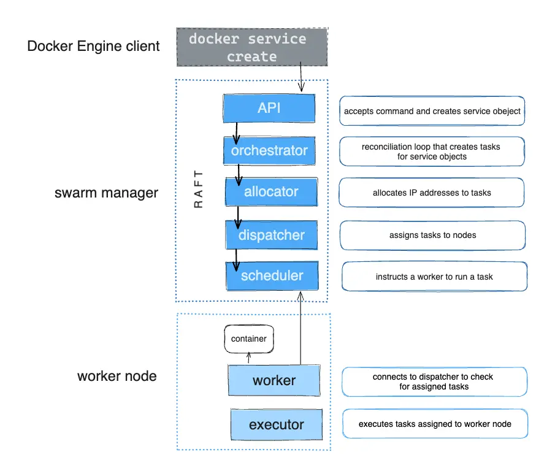
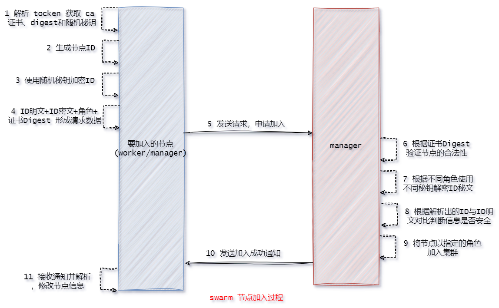
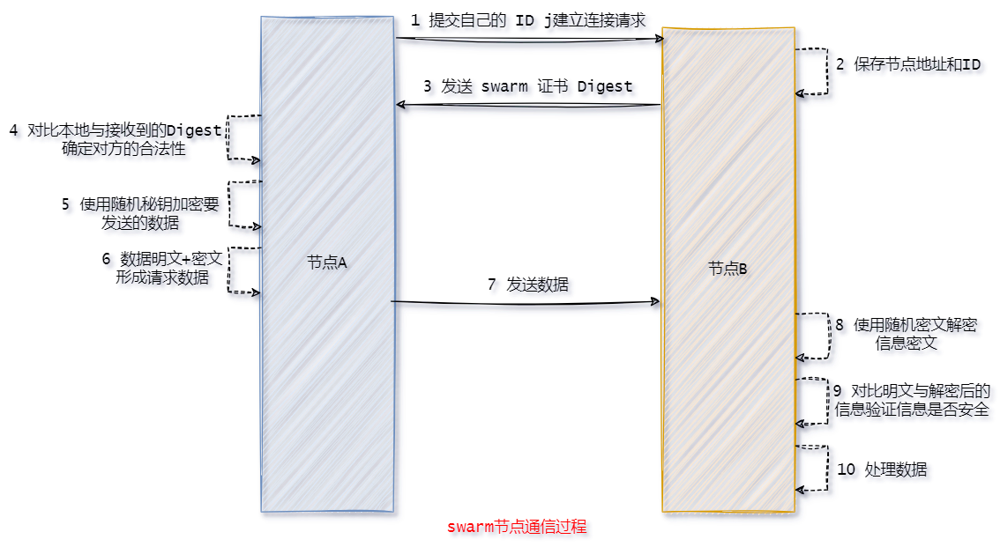

#### 简介

##### 介绍

1. Docker Swarm 是由 Docker 公司推出的 Docker 的原生集群管理系统，它将一个 Docker 主机池变成了一个单独的虚拟主机，用户只需通过简单的 API 即可实现与 Docker 集群的通信。
2. Docker Swarm 使用 GO 语言开发。从 Docker 1.12.0 版本开始，Docker Swarm 已经内置于 Docker 引擎中，无需再专门的进行安装配置。
3. Docker Swarm 在 Docker 官网的地址为：[官网](https://docs.docker.com/engine/swarm/)。


##### 节点架构

1. 架构图:<br>

2. swarm node:

   1. 从物理上讲，一个 Swarm 是由若干安装了 Docker Engine 的物理机或者虚拟机组成，这些主机上的 Docker Engine 都采用 Swarm模式运行。
   2. 从逻辑上讲，一个 Swarm 由若干节点 node 构成，每个 node 最终会落实在一个物理 Docker 主机上，但一个物理 Docker 主机并不一定就是一个 node。即 <font color=red><swarm node 与 Docker主机并不是一对一的关系</font>。

3. swarm node 共有两种类型：manager 与 worker。

   1. Manager: Manager 节点用于维护 swarm 集群状态、调试 servcie、处理 swarm 集群管理任务。为了防止单点故障问题，一个 Swarm 集群一般都会包含多个 manager。这些 manager 间通过Raft 算法维护着一致性。
   2. Worker: Worker 节点用于在其 Contiainer 中运行 task 任务，即对外提供 service 服务。默认情况下，manager 节点同时也充当着 worker 角色，可以运行 task 任务。

4. 角色转换: manager 节点与 worker 节点角色并不是一成不变的，它们之间是可以相互转换的。

   1. manager 转变为 worker 称为节点降级。
   2. worker 转变为 manager 称为节点升级。

5. 还是要再强调以一下: 每个 node 最终会落实在一个物理 Docker 主机上，但一个物理 Docker 主机并不一定就是一个 node。即 <font color=red><swarm node 与 Docker主机并不是一对一的关系</font>。

   

   

##### 服务架构

1. 架构图:<br><br>

2. service: 搭建 docker swarm 集群的目的是为了能够在 swarm 集群中运行应用，为用户提供具备更强抗压能力的服务。docker swarm 中的服务 service 就是一个逻辑概念，表示 swarm 集群对外提供的服务。

3. task: 一个 service 最终是通过任务 task 的形式出现在 swarm 的各个节点中，而每个节点中的 task 又都是通过具体的运行着应用进程的容器对外提供的服务。

4. 编排器: 在 swarm manager 中具有一个编排器，用于管理副本 task 任务的创建与停止。例如，当在 swarm manager 中定义一个具有 3 个 task 副本任务的 service 时，编排器首先会创建 3 个 task，为每个 task 分配一个 taskID，并通过分配器为每个 task 分配一个虚拟 IP，即 VIP。然后再将该 task 注册到内置的 DNS 中。当 service 的某 task 不可用时，编排器会在 DNS 中注销该 task。

5. 分发器: 在 swarm manager 中具有一个分发器，用于完成对副本 task 任务的监听、调度等操作。在前面的例子中，当编排器创建了 3 个 task 副本任务后，会调用分发器为每个 task 分配节点。分发器首先会在 swarm 集群的所有节点中找到 3 个 available node 可用节点，每个节点上分配一个 task。而每个 task 就像是一个“插槽”，分发器会在每个“插槽”中放入一个应用容器。每个应用容器其实就是一个具体的 task 实例。一旦应用容器运行起来，分发器就可以监测到其运行状态，即 task 的运行状态。如果容器不可用或被终止，task 也将被终止。此时编排器会立即在内置 DNS 中注销该task，然后编排器会再生成一个新的 task，并在 DNS 中进行注册，然后再调用分发器为之分配一个新的 available node，然后再该节点上再运行应用容器。编排器始终维护着 3 个 task副本任务。分发器除了为 task 分配节点外，还实现了对访问请求的负载均衡。当有客户端来访问swarm 提供的 service 服务时，该请求会被 manager 处理：根据其内置 DNS，实现访问的负载均衡。

6. 在 Swarm 中创建服务时，流程大致如下：

   1. 编排器接收创建服务的请求，确定所需的任务数量。
   2. 编排器创建任务，并为每个任务分配唯一的 ID 和虚拟 IP（VIP）。
   3. 分发器查找可用的工作节点，将任务分配到这些节点。
   4. 一旦任务被分配，分发器监控任务的运行状态，并在需要时进行故障恢复。

   


##### 服务部署模式

1. 示意图:<br>
2. service 以副本任务 task 的形式部署在 swarm 集群节点上。根据 task 数量与节点数量的关系，常见的 service 部署模式有两种：replicated 模式与 global 模式。
   1. replicated 模式: 副本模式，service 的默认部署模式。需要指定 task 的数量。当需要的副本任务 task 数量不等于 swarm 集群的节点数量时，就需要使用 replicated 模式。manager 中的分发器会找到指定 task 个数的 available node 可用节点，然后为这些节点中的每个节点分配一个或若干个 task。
   2. global 模式: 全局模式。分发器会为每个 swarm 集群节点分配一个 task，不能指定 task 的数量。swarm 集群每增加一个节点，编排器就会创建一个 task，并通过分发器分配到新的节点上。
3. 对于含有 5 个节点的集群， replicated 模式下，若是服务存在 6 个 task，那么就会存在一个节点分到两个 task 。但是对于 global 模式下，就只会创建 5 个 task。


#### 搭建集群

> 此处采用ubuntu虚拟机搭建，wsl 导入导出不如虚拟机克隆来得快。我们搭建一个 docker swarm 集群(提前安装好 docker ，并配置加速镜像)，包含 5 个 swarm 节点。这 5 个 swarm 节点的 IP 与暂时的角色分配如下:
>
> | hostname | ip            | role    |
> | -------- | ------------- | ------- |
> | docker1  | 192.168.79.11 | manager |
> | docker2  | 192.168.79.12 | manager |
> | docker3  | 192.168.79.13 | manager |
> | docker4  | 192.168.79.14 | worker  |
> | docker5  | 192.168.79.15 | worker  |


##### 集群初始化

1. 首先我们需要知道:在任意 docker 主机上通过 `docker info` 命令可以查看到当前 docker 引擎 Server 端对于 swarm 的激活状态。

   ```bash
   $ docker info
   Client:
    ...
   Server:
    ...
    Swarm: inactive(未激活)
    ...
   ```

2. 在主机名为 docker1 的主机上运行 docker swarm init 命令，创建并初始化一个 swarm。执行初始化的节点会作为 manager 节点。

   ```bash
   $ docker swarm init 
   Swarm initialized: current node (nn36lc1bs25erh4399ik46le1) is now a manager.
   To add a worker to this swarm, run the following command:
       docker swarm join --token SWMTKN-1-1xfpzxk3cl8d8rxdqixdy5strk1y16j6aa5qn7u87ner6mljq2-cznpgopqwzk3ujjqqd4p0f8eo 192.168.79.11:2377
   To add a manager to this swarm, run 'docker swarm join-token manager' and follow the instructions.
   ```

3. 其实通过上述输出结果，可以知道它给出一条添加 worker 节点的方法，就是在其他节点中执行它给出的命令。但是显然我们不可能每次及加入节点都去初始化查看这条命令，我们采用下面的方式查看添加节点的命令。

4. 添加 manager 节点:

   1. 在 docker1 中 运行命令 `docker swarm join-token manager` 获取添加节点命令:

      ```bash
      $ docker swarm join-token manager 
      To add a manager to this swarm, run the following command:
      
          docker swarm join --token SWMTKN-1-1xfpzxk3cl8d8rxdqixdy5strk1y16j6aa5qn7u87ner6mljq2-558rr1ezi2n0377ne5cqmtnri 192.168.79.11:2377
      ```

   2. 在 docker2、docker3 中运行上述命令，从而将它们设置为 manager 节点:

      ```bash
      docker swarm join --token SWMTKN-1-1xfpzxk3cl8d8rxdqixdy5strk1y16j6aa5qn7u87ner6mljq2-558rr1ezi2n0377ne5cqmtnri 192.168.79.11:2377
      
      This node joined a swarm as a manager.
      ```

5. 添加 worker 节点:

   1. 在 docker1 (其实只要是 manager 节点就可)中 运行命令 `docker swarm join-token worker` 获取添加节点命令:

      ```bash
      $ docker swarm join-token worker
      To add a worker to this swarm, run the following command:
      
          docker swarm join --token SWMTKN-1-1xfpzxk3cl8d8rxdqixdy5strk1y16j6aa5qn7u87ner6mljq2-cznpgopqwzk3ujjqqd4p0f8eo 192.168.79.11:2377
      ```

   2. 在 docker4、docker5 中运行上述命令，从而将它们设置为 manager 节点:

      ```bash
      $ docker swarm join --token SWMTKN-1-1xfpzxk3cl8d8rxdqixdy5strk1y16j6aa5qn7u87ner6mljq2-cznpgopqwzk3ujjqqd4p0f8eo 192.168.79.11:2377
      
      This node joined a swarm as a worker.
      ```

6. 在任意的 manager 节点中运行 `docker node ls` 命令可以查看到当前swarm 集群所包含的节点状态数据。<font color=red>需要注意的是: woeker 节点无法运行该命令。</font>

   ```bash
   $ docker node ls
   ID                            HOSTNAME   STATUS    AVAILABILITY   MANAGER STATUS   ENGINE VERSION
   nn36lc1bs25erh4399ik46le1     docker1    Ready     Active         Leader           24.0.7
   cyp9sza17yg11uo6v9ftqwyvt     docker2    Ready     Active         Reachable        24.0.7
   hy84w4kr921dls0y0sk182dcp *   docker3    Ready     Active         Reachable        24.0.7
   pzwo3upnqf8my0hqc3j0cajiw     docker4    Ready     Active                          24.0.7
   sbeo4p9wnw3f3h7m8at256tpl     docker5    Ready     Active                          24.0.7
   ```

   > 在 Docker Swarm 中，管理节点（Manager Node）可以分为两种角色：**Leader** 和 **Follower**。
   >
   > 1. Leader 节点是集群中负责决策和管理的主节点。它负责处理所有的管理请求，包括服务创建、更新和删除等操作。
   >    1. 接收来自客户端的请求并进行处理。
   >    2. 维护集群的状态，并将其保存到 Raft 日志中。
   >    3. 负责调度任务到工作节点。
   >    4. 在发生故障时，Leader 节点会重新分配任务，并确保集群的可用性。
   >    5. 当集群中的 Leader 节点出现故障时，其他管理节点会进行选举，选出一个新的 Leader，以确保集群继续正常运作。
   > 2. Follower 节点是集群中的其他管理节点，它们跟随 Leader 节点的指令。
   >    1. 接收 Leader 节点的指令，并将其状态更新与 Leader 节点保持一致。
   >    2. 负责对外提供管理请求的响应，但这些请求会被转发到 Leader 节点处理。
   >    3. 在 Leader 节点失效时，Follower 节点会参与选举，争取成为新的 Leader。
   > 3. 在上述输出中，docker1 是 leader ，而 docker2、docker3 是 follower。而 Reachable 表示当前节点是可以到达的，能访问的。


##### 节点退出

1. 当一个 worker 节点想从 swarm 集群中退出时，可以通过 `docker swarm leave` 命令。例如将 docker5 退出集群。

2. 此时在 manager 节点中实用 docker node ls 查看发现 docker5 状态变为 Down 。

   ```bash
   $ docker node ls
   ID                            HOSTNAME   STATUS    AVAILABILITY   MANAGER STATUS   ENGINE VERSION
   nn36lc1bs25erh4399ik46le1     docker1    Ready     Active         Leader           24.0.7
   cyp9sza17yg11uo6v9ftqwyvt *   docker2    Ready     Active         Reachable        24.0.7
   hy84w4kr921dls0y0sk182dcp     docker3    Ready     Active         Reachable        24.0.7
   pzwo3upnqf8my0hqc3j0cajiw     docker4    Ready     Active                          24.0.7
   sbeo4p9wnw3f3h7m8at256tpl     docker5    Down      Active                          24.0.7
   ```

3. 此时尝试在将 docker5 加入到集群中: 即在 manager 节点上运行 docker swarm join-token worker 命令，生成加入 worker 节点的命令，然后在 docker5 中运行。

4. 此时在 manager 节点中实用 docker node ls 查看发现存在两个 docker5:

   ```bash
   $ docker node ls
   ID                            HOSTNAME   STATUS    AVAILABILITY   MANAGER STATUS   ENGINE VERSION
   nn36lc1bs25erh4399ik46le1     docker1    Ready     Active         Leader           24.0.7
   cyp9sza17yg11uo6v9ftqwyvt *   docker2    Ready     Active         Reachable        24.0.7
   hy84w4kr921dls0y0sk182dcp     docker3    Ready     Active         Reachable        24.0.7
   pzwo3upnqf8my0hqc3j0cajiw     docker4    Ready     Active                          24.0.7
   sbeo4p9wnw3f3h7m8at256tpl     docker5    Down      Active                          24.0.7
   xx2ikztjp5ygd4m43fxrhv9jq     docker5    Ready     Active                          24.0.7
   ```

   > 这一幕其实就很好的证明 docker 主机和节点不是一一对应的关系，一个 docker 主机可以对应多个节点。

5. 对于 Down 状态的节点是完全可以将其删除的。通过在manager节点运行 `docker node rm <ID>` 命令完成。

   ```bash
   $ docker node rm sbeo4p9wnw3f3h7m8at256tpl
   sbeo4p9wnw3f3h7m8at256tpl
   ```

   > 实际上这里的 `<id>` 也可以换成主机名，但是当一个主机存在多个节点，此时就会报错，因为无法通过主机名定位到一个唯一的节点。

6. 对于 manager 节点，原则上是不推荐直接退群的，这样会导致 swarm 集群的一致性受到损坏。如果 manager 执意要退群，可在 docker swarm leave 命令后添加-f 或--force 选项进行强制退群。此时需要需要彻底清理和重新初始化 Swarm。

   ```bash
   $ docker swarm leave
   Error response from daemon: You are attempting to leave the swarm on a node that is participating as a manager. The only way to restore a swarm that has lost consensus is to reinitialize it with `--force-new-cluster`. Use `--force` to suppress this message.
   ```

   ```bash
   # 强制退群
   docker swarm leave --force
   
   # 清理和重新初始化
   docker swarm init --force-new-cluster
   ```

   > 虽然不建议这么做，但是有些时候我们不得不这么做，例如后面这种情况。


##### swarm自动锁定

1. 在 manager 集群中，swarm 通过 Raft 日志方式维护了 manager 集群中数据的一致性。即在 manager 集群中每个节点通过 manager 间通信方式维护着自己的 Raft 日志。

2. 但在通信过程中存在有一种风险：Raft 日志攻击者会通过 Raft 日志数据的传递来访问、篡改 **manager** 节点中的配置或数据。<font color=red>为了防止被攻击，swarm 开启了一种集群自动锁定功能，为 **manager** 间的通信启用了 TLS 加密。用于加密和解密的公钥与私钥，全部都维护在各个节点的 Docker 内存中。一旦节点的 Docker 重启，则密钥丢失</font>。

3. swarm 中通过 `autolock `标志来设置集群的自动锁定功能：为 true 则开启自动锁定，为false 则关闭自动锁定:

   ```bash
   fish@docker1:~$ docker info
   Client:
    ...
   
   Server:
    ...
    Swarm: active
     NodeID: nn36lc1bs25erh4399ik46le1
     Is Manager: true
     ClusterID: fxew3qri89196d6jwdkapa4oc
     Managers: 3
     Nodes: 5
     Default Address Pool: 10.0.0.0/8  
     SubnetSize: 24
     Data Path Port: 4789
     Orchestration:
      Task History Retention Limit: 5
     Raft:
      Snapshot Interval: 10000
      Number of Old Snapshots to Retain: 0
      Heartbeat Tick: 1
      Election Tick: 10
     Dispatcher:
      Heartbeat Period: 5 seconds
     CA Configuration:
      Expiry Duration: 3 months
      Force Rotate: 0
     Autolock Managers: false
     Root Rotation In Progress: false
     Node Address: 192.168.79.11			# here
     Manager Addresses:
      192.168.79.11:2377
      192.168.79.12:2377
      192.168.79.13:2377
   ```

   > `docker info`在任意节点中均可查看集群信息，但是在 manager 节点中展示的信息更为丰富。例如的上面的 Autolock 信息，在 worker 节点不输出显示(实际上只显示当前节点信息和 manager 节点 ip等寥寥无几的信息)。

4. 开启集群的自动锁定功能:

   1. 在初始话时使用参数 `--autolock`开启，即`docker swarm init --autolock`。

      > 实际上，初始化时可以配置很多参数，可以使用`docker swarm init --help`查看。

   2. manager 节点通过 `docker swarm update --autolock=true` 命令可以开启当前 swarm 集群的自动锁定功能。

      ```bash
      $ docker swarm update --autolock=true
      Swarm updated.
      To unlock a swarm manager after it restarts, run the `docker swarm unlock`
      command and provide the following key:
      
          SWMKEY-1-I96eIcDKiY87AEAAb/MOXXduTp9HE64RMoxbKF2phvQ
      
      Please remember to store this key in a password manager, since without it you
      will not be able to restart the manager.
      ```

      > 关闭自动锁定，只需要设置成 false 就行，`docker swarm update --autolock=false`。

5. 在开启自动锁定后，会给一个秘钥 key ,这个秘钥用于后续解锁使用，我们可以通过命令再次查看秘钥 `docker swarm unlock-key`:

   ```bash
   $ docker swarm unlock-key
   To unlock a swarm manager after it restarts, run the `docker swarm unlock`
   command and provide the following key:
   
       SWMKEY-1-I96eIcDKiY87AEAAb/MOXXduTp9HE64RMoxbKF2phvQ
   
   Please remember to store this key in a password manager, since without it you
   will not be able to restart the manager.
   ```

6. 此时我们关闭 docker3 上的 docker，模拟 docker5 宕机，即执行 `sudo systemctl stop docker`。然后我们再启动 docker:

   ```bash
   sudo systemctl stop docker
   
   sudo systemctl start docker
   ```

7. 此时在 manager 节点中使用 `docker node ls` 发现 docker5 一直处于 Down 状态。

   ```bash
   $ docker node ls
   ID                            HOSTNAME   STATUS    AVAILABILITY   MANAGER STATUS   ENGINE VERSION
   nn36lc1bs25erh4399ik46le1     docker1    Ready     Active         Leader           24.0.7
   cyp9sza17yg11uo6v9ftqwyvt *   docker2    Ready     Active         Reachable        24.0.7
   hy84w4kr921dls0y0sk182dcp     docker3    Down      Active         Unreachable      24.0.7
   pzwo3upnqf8my0hqc3j0cajiw     docker4    Ready     Active                          24.0.7
   j462egsc4xhugiykzvesr6x3f     docker5    Ready     Active                          24.0.7
   ```

   > 实际上，没有开启集群的自动锁定时，节点宕机后，重新启动是会自动加入集群的。

8. 并且在 docker3 中运行 `docker info` 查看状态，会发现其 Swarm 模式处于锁定状态: 

   ```bash
   fish@docker3:~$ docker info
   Client:
    ...
   Server:
    ...
    Swarm: locked
    ...
   ```

9. 要想解锁，我们需要在 docker3 中运行 `docker swarm unlock` 命令，解锁 swarm, 该过程需要输入之前的秘钥。解锁完成后，节点就会自动加入集群中。

   ```bash
   $ docker swarm unlock
   Please enter unlock key: 
   ```

   > 需要说明:
   >
   > - 在 Docker Swarm 中，用于加密和解密的公钥与私钥存储在各个节点的内存中。当节点的 Docker 守护进程重启时，这些密钥会丢失。如果在同一时间所有节点都重启或宕机，密钥将不可用，即使你记住了密钥，节点也无法验证。这种情况下，整个集群将无法恢复，必须重新初始化和搭建( `docker swarm init --force-new-cluster` )，当然此时或许会用上之前不推荐的 manager 节点强制退群操作也说不定。这就是为什么启用自动锁定功能非常重要，以确保在节点重启时能够安全地管理密钥。
   > - 为了后续学习过程的顺利进行，需要使用`docker swarm update --autolock=false`关闭自动锁定。


##### 角色变换

1. Swarm 集群中节点的角色只有 manager 与 worker，所以其角色也只是在 manager 与 worker 间的转换。即 worker 升级为 manager，或 manager 降级为 worker。

2. ( manager 节点中)通过 docker node promote 命令可以将 worker 升级为 manager。例如，下面的命令是将 docker4 节点升级为了 manager 。

   ```bash
   $ docker node ls
   ID                            HOSTNAME   STATUS    AVAILABILITY   MANAGER STATUS   ENGINE VERSION
   nn36lc1bs25erh4399ik46le1 *   docker1    Ready     Active         Leader           24.0.7
   cyp9sza17yg11uo6v9ftqwyvt     docker2    Ready     Active         Reachable        24.0.7
   hy84w4kr921dls0y0sk182dcp     docker3    Ready     Active         Reachable        24.0.7
   pzwo3upnqf8my0hqc3j0cajiw     docker4    Ready     Active                          24.0.7
   j462egsc4xhugiykzvesr6x3f     docker5    Ready     Active                          24.0.7
   
   $ docker node promote j462egsc4xhugiykzvesr6x3f
   Node j462egsc4xhugiykzvesr6x3f promoted to a manager in the swarm.
   ```

   > 这里 `<id>` 也可以换成主机名，但是当一个主机存在多个节点，此时就会报错，因为无法通过主机名定位到一个唯一的节点。例如 `docker node promote docker4`。

3. ( manager 节点中)通过 docker node demote 命令可以将 manager 降级为 worker。例如，下面的命令是将 docker4 节点降级为了 worker。

   ```bash
   $ docker node ls
   ID                            HOSTNAME   STATUS    AVAILABILITY   MANAGER STATUS   ENGINE VERSION
   nn36lc1bs25erh4399ik46le1 *   docker1    Ready     Active         Leader           24.0.7
   cyp9sza17yg11uo6v9ftqwyvt     docker2    Ready     Active         Reachable        24.0.7
   hy84w4kr921dls0y0sk182dcp     docker3    Ready     Active         Reachable        24.0.7
   pzwo3upnqf8my0hqc3j0cajiw     docker4    Ready     Active                          24.0.7
   j462egsc4xhugiykzvesr6x3f     docker5    Ready     Active         Reachable        24.0.7
   
   $ docker node demote j462egsc4xhugiykzvesr6x3f
   Manager j462egsc4xhugiykzvesr6x3f demoted in the swarm.
   ```

   > 同理 `<id>` 也可以换成主机名，但是当一个主机存在多个节点，此时就会报错，因为无法通过主机名定位到一个唯一的节点。例如 `docker node demote docker4`。

4. 此外，还可以通过 `docker node update --role [manager|worker] [node]`变更指定节点的角色。

   ```bash
   $ docker node ls
   ID                            HOSTNAME   STATUS    AVAILABILITY   MANAGER STATUS   ENGINE VERSION
   nn36lc1bs25erh4399ik46le1 *   docker1    Ready     Active         Leader           24.0.7
   cyp9sza17yg11uo6v9ftqwyvt     docker2    Ready     Active         Reachable        24.0.7
   hy84w4kr921dls0y0sk182dcp     docker3    Ready     Active         Reachable        24.0.7
   pzwo3upnqf8my0hqc3j0cajiw     docker4    Ready     Active                          24.0.7
   j462egsc4xhugiykzvesr6x3f     docker5    Ready     Active         Reachable        24.0.7
   
   $ docker node update --role manager j462egsc4xhugiykzvesr6x3f
   j462egsc4xhugiykzvesr6x3f
   
   $ docker node update --role worker docker5
   docker5
   ```

   


##### 节点标签

1. ( manager 节点中)通过 `docker node update --label-add <key>=<value> <id/hostname>` 命令可以为指定 node 添加指定的 key=value 的标签。若该标签的 key 已经存在，则会使用新的 value 替换掉该 key 的原 value。不过需要注意的是，若要添加或修改多个标签，则需要通过多个 `--label-add` 选项指定。

   ```bash
   $ docker node update --label-add created_by=dreamfish --label-add used_for=test docker5
   docker5
   ```

2. ( manager 节点中)通过 `docker node inspect <id/hostname>` 在查看该节点详情时可看到添加的标签。此外使用参数选项 `--pretty` 可以 key:value 的形式显示信息。

   ```bash
   $ docker node inspect docker5
   [
       {
           ...
           "Spec": {
               "Labels": {
                   "created_by": "dreamfish",
                   "used_for": "test"
               },
               "Role": "worker",
               "Availability": "active"
           },
           ...
       }
   ]
   
   
   $ docker node inspect --pretty docker5
   ID:			j462egsc4xhugiykzvesr6x3f
   Labels:
    - created_by=dreamfish
    - used_for=test
   Hostname:              	docker5
   ...
   ```

3. ( manager 节点中)通过 `docker node update --label-rm <key> <id/hostname>` 命令可以为指定的 node 删除指定 key 的标签。同样，若要删除多个标签，则需要通过多个` --label-rm` 选项指定要删除 key 的标签。

   ```bash
   $ docker node ls
   ID                            HOSTNAME   STATUS    AVAILABILITY   MANAGER STATUS   ENGINE VERSION
   nn36lc1bs25erh4399ik46le1 *   docker1    Ready     Active         Leader           24.0.7
   cyp9sza17yg11uo6v9ftqwyvt     docker2    Ready     Active         Reachable        24.0.7
   hy84w4kr921dls0y0sk182dcp     docker3    Ready     Active         Reachable        24.0.7
   pzwo3upnqf8my0hqc3j0cajiw     docker4    Ready     Active                          24.0.7
   j462egsc4xhugiykzvesr6x3f     docker5    Ready     Active                          24.0.7
   
   $ docker node update --label-rm created_by --label-rm used_for j462egsc4xhugiykzvesr6x3f
   j462egsc4xhugiykzvesr6x3f
   ```

   


##### 节点删除

1. manager 节点可以通过 `docker node rm` 命令可以删除一个 Down 状态的、指定的 worker 节点。注意，该命令只能删除 worker 节点，不能删除 manager 节点。

2. 对于 Ready 状态的 worker 节点是无法直接删除的，首先要将该节点的 Docker 关闭，使该节点变为 Down 状态，然后再进行删除。

3. 其实对于 Ready 状态的 worker 节点也可以通过添加 -f 选项来实现强制删除。

   ```bash
   $ docker node ls
   ID                            HOSTNAME   STATUS    AVAILABILITY   MANAGER STATUS   ENGINE VERSION
   nn36lc1bs25erh4399ik46le1 *   docker1    Ready     Active         Leader           24.0.7
   cyp9sza17yg11uo6v9ftqwyvt     docker2    Ready     Active         Reachable        24.0.7
   hy84w4kr921dls0y0sk182dcp     docker3    Ready     Active         Reachable        24.0.7
   pzwo3upnqf8my0hqc3j0cajiw     docker4    Ready     Active                          24.0.7
   j462egsc4xhugiykzvesr6x3f     docker5    Down      Active                          24.0.7
   
   $ docker node rm docker5
   docker5
   
   $ docker node  rm -f docker4
   docker4
   ```

4. 但是，对于 manager 节点，无论其处于何种状态，都无法通过 `docker node rm [-f]`删除。

5. `docker node rm –f` 命令会使一个节点强制退群，而 `docker swarm leave` 命令是使当前的 docker 主机关闭 swarm 模式。

   > 还是需要对比一下二者的区别:
   >
   > 1. `docker node rm -f` 是直接删除节点，不管其当前状态。删除节点可能导致数据丢失，特别是在节点上还有运行中的服务时。
   > 2. `docker swarm leave` 是让节点主动退出集群，更加温和，通常可以保持集群的稳定性。
   > 3. 此外在测试中发现，对应强制删除的节点，需要执行 `docker swarm leave` 后才能再次加入到集群。


#### swarm安全(PKI)

> Docker 内置了 PKI(public key infrastructure，公钥基础设施)，使得保障发布容器化的业务流程系统的安全性变得很简单。


##### TLS安全保障

1. Swarm 节点之间采用 TLS 来鉴权、授权和加密通信。

2. 当运行 docker swarm init 命令时，Docker 指定当前节点为一个 manager节点。默认情况下，manager 节点会生成一个新的 swarm 的 CA 根证书以及一对密钥。同时，manager 节点还会生成两个 token，一个用于添加 worker 节点，一个用于添加 manager 节点。每个 token 包含上了 CA 根证书的 digest 和一个随机密钥。CA 根证书、一对密钥和随机密钥都将会被用在节点之间的通信上。

   >  此外，在初始化集群时可以使用`--external-ca` 参数指定您自己生成的外部根 CA。

3. 每次有新节点加入 Swarm 时，管理器都会向节点颁发证书。证书包含随机生成的节点 ID，用于在证书公用名 (CN) 下标识节点，以及角色。节点 ID 充当节点在当前 Swarm 中生命周期的加密安全节点标识。<br>

   > 我在网上查阅了一些资料，也看了一下官网(上面似乎说节点的 ID 是由 manager 随机生成并同 ca 证书一同发送给新节点)。似乎上述流程存在一些问题，但是目前并未找到详细描述该部分步骤的参考资料，后续若存在问题再更正。

4. 节点加密通信示意图: <br>

5. 一旦节点加入了 Swarm 集群，那么它们间的通信全部都是通过 TLS 加密方式进行的。首先是通过 CA 证书对通信对方的身份进行验证，在验证通过后再进行数据通信。而通信的数据则是通过随机密钥加密过的。<br>

   

   


##### CA证书轮转

1. Swarm 的 CA 数字证书也是有可能被攻击、篡改的。为了保证 swarm 的数字证书的安全性，Swarm 提供了 CA 数字证书轮换机制，定期更换 CA 数字证书。默认 swarm 的 CA 数字证书 90 天轮换一次。

2. 用于轮换的新的 CA 数字证书来自于哪里呢？通过 docker swarm ca 命令可以指定外部 CA 数字证书，或生成新的 CA 数字证书。无论哪种数字证书变更方式，都需要 CA 根证书的加密/解密。而根证书也是会发生变化的，具体见“轮转过程”。

3. 轮转过程: 当 manager 运行了 `docker swarm ca --rotate` 命令后，会按顺序发生下面的事情：

   1. Docker 会生成一个交叉签名（cross-signed）根证书，即新根证书是由旧的根证书签署生成的，这个交叉签名根证书将作为一个过渡性的根证书。这是为了确保节点仍然能够信任旧的根证书，也能使用新的根证书验证签名。

   2. 在 Docker 17.06 或者更高版本中，Docker 会通知所有节点立即更新根证书，根据 swarm中节点数量多少，这个过程可能会花费几分钟时间。

   3. 在所有的节点都更新了新 CA 根证书后，manager 会通知所有节点仅信任新的根证书，不再信任旧根证书及交叉签名根证书。

   4. 所有节点使用新根证书签发自己的数字证书。如果直接使用外部的 CA 根证书，那么就不存在交叉签名根证书的生成过程，直接由运行 `docker swarm ca`命令的节点通知所有节点立即更新根证书。后续过程与前面的就相同了。

      > 命令 `docker swarm ca --ratate` 用来来生成新的CA证书和密钥，也可以通过参数 `--ca-cert` 和 `--external-ca` 来指定外部的根CA证书。此外也可通过 `docker ca --help` 查看一些其他参数的使用。

4. 此外，在`docker swarm init` 命令中存在 `--external-ca` 选项用于配置外部证书颁发机构来管理 Swarm 集群的 TLS 证书。而参数选项 `--cert-expiry` 则可以配置证书有效时间。

5. 其实通过 `docker node inspect` 命令可以查看到一些TLS的相关信息:例如根证书、公钥机构信息等。

   ```bash
   $ docker node inspect docker1
   [
       {
               "TLSInfo": {
                   "TrustRoot": "-----BEGIN CERTIFICATE-----\nMIIBajCCARCgAwIBAgIUUf2+ez5Ap/3HuCppQzaSSDLsAoEwCgYIKoZIzj0EAwIw\nEzERMA8GA1UEAxMIc3dhcm0tY2EwHhcNMjQxMDI3MDkwNzAwWhcNNDQxMDIyMDkw\nNzAwWjATMREwDwYDVQQDEwhzd2FybS1jYTBZMBMGByqGSM49AgEGCCqGSM49AwEH\nA0IABBLfFitblZLyyA4t3OA6ze64Fn17QEnhqsByokfX3MSA40pgIaYd8Oh25D6s\nnckQL+44PzbpcJcIm5bIabCOShSjQjBAMA4GA1UdDwEB/wQEAwIBBjAPBgNVHRMB\nAf8EBTADAQH/MB0GA1UdDgQWBBTSjkWkFK6Wca7NQCtUTtkI1KXiFzAKBggqhkjO\nPQQDAgNIADBFAiAGq6zJFo8pgskVQ4pQu+EWFalffD2uUik9lggYsbNTwAIhAP06\nwLiTmeu1RAvP5t0zo8+YVUs6I0kDNuU1NSk5Z/lC\n-----END CERTIFICATE-----\n",
                   "CertIssuerSubject": "MBMxETAPBgNVBAMTCHN3YXJtLWNh",
                   "CertIssuerPublicKey": "MFkwEwYHKoZIzj0CAQYIKoZIzj0DAQcDQgAEEt8WK1uVkvLIDi3c4DrN7rgWfXtASeGqwHKiR9fcxIDjSmAhph3w6HbkPqydyRAv7jg/NulwlwiblshpsI5KFA=="
               }
       }
   ]
   
   ```

6. 对于 `docker swarm update`中同样存在参数选项`--external-ca` 选项用于配置外部证书颁发机构来管理 Swarm 集群的 TLS 证书，参数选项 `--cert-expiry` 则可以配置证书有效时间。


##### 热备选举

1. Swarm 的 manager 节点集群采用的是热备方式来提升集群的容灾能力。即在 manager 集群中只有一个处于 leader 状态，用于完成 swarm 节点的管理，其余 manager 处于热备状态。当 manager leader 宕机，其余 manager 就会自动发起 leader 选举，重新选举产生一个新的 manager leader。

   > 热备、冷备和温备是指在信息系统和数据保护中，对备份和恢复策略的不同分类。
   >
   > 1. 热备(Hot Backup): 热备是指在系统正常运行的状态下进行的数据备份。这意味着在备份过程中，系统和应用程序仍然可以继续操作和处理请求。
   >    - 实时性高: 数据备份几乎是即时的，能够快速恢复。
   >    - 数据一致性: 通常使用事务日志或快照技术，确保备份数据的一致性。
   >    - 适用场景: 适用于对可用性要求极高的系统，如金融、电子商务等。
   > 2. 冷备(Cold Backup): 冷备是指在系统关闭或不活跃的状态下进行的数据备份。在备份过程中，系统无法进行任何操作。
   >    - 安全性高: 由于系统不在运行状态，数据备份的完整性和一致性通常更高。
   >    - 恢复时间长: 恢复过程可能需要重新启动系统，时间较长。
   >    - 适用场景: 适用于对可用性要求较低的系统，如定期维护或更新的环境。
   > 3. 温备(Warm Backup): 温备是介于热备和冷备之间的一种备份方式。在温备中，备份系统可以保持在线状态，但不是所有功能都在运行。
   >    - 可用性适中: 备份可以在某种程度上提供服务，但可能不支持所有功能。
   >    - 数据同步: 通常会定期进行数据同步，以确保备份的数据尽可能接近实时。
   >    - 适用场景: 适用于对可用性有一定要求，但又不需要像热备那样完全实时的系统。

2. manager 集群的 leader 选举采用的是 Raft 算法。Raft 算法是一种比较复杂的一致性算法，具体见后面“Raft 算法”。其选举 leader 的简单思路是，所有可用的 manager 全部具有选举权与被选举权。最终获得过半选票的 manager 当选新的 leader。为了保证一次性可以选举出

   新的 leader ，官方推荐使用奇数个 manager 。

   > 并不是说偶数个manager就无法选举出leader，而是偶数和奇数其容灾能力是一致的。例如存在 5 个节点，要能选出 leader (即选票过半)，则最多只能损坏 2 个节点，而若存在 6 个节点，要能选出 leader ，则最多可以损坏 2 个节点。至于选票过半原则和 raft 算法后续再研究。

3. 下面我们不妨具体模拟一下容灾过程:

   1. 目前是 docker、docker2、docker3 三个 manager，其中 docker 节点为 leader。

      ```bash
      $ docker node ls
      ID                            HOSTNAME   STATUS    AVAILABILITY   MANAGER STATUS   ENGINE VERSION
      nn36lc1bs25erh4399ik46le1 *   docker1    Ready     Active         Reachable        24.0.7
      cyp9sza17yg11uo6v9ftqwyvt     docker2    Ready     Active         Leader           24.0.7
      hy84w4kr921dls0y0sk182dcp     docker3    Ready     Active         Reachable        24.0.7
      slfcvldiujdqxwvz7bbq190j6     docker4    Ready     Active                          24.0.7
      v8tmogsv8rtqbfed8vei3dkst     docker5    Ready     Active                          24.0.7
      ```

   2. 现在关闭 docker1 主机的 docker daemon，模拟其宕机,即执行 `sudo systemctl stop docker.service`

   3. 此时在 manager 中查看节点信息，发现 docker2 成为 leader :

      ```bash
      $ docker node ls
      ID                            HOSTNAME   STATUS    AVAILABILITY   MANAGER STATUS   ENGINE VERSION
      nn36lc1bs25erh4399ik46le1     docker1    Unknown   Active         Unreachable      24.0.7
      cyp9sza17yg11uo6v9ftqwyvt *   docker2    Ready     Active         Leader           24.0.7
      hy84w4kr921dls0y0sk182dcp     docker3    Unknown   Active         Reachable        24.0.7
      slfcvldiujdqxwvz7bbq190j6     docker4    Unknown   Active                          24.0.7
      v8tmogsv8rtqbfed8vei3dkst     docker5    Ready     Active                          24.0.7
      ```

   4. 此时如果再使某个 manager 宕机，例如使 docker2 的 docker daemon 关闭，那么整个 swarm 就会瘫痪。因为剩下的 manager 已经无法达成过半的选票，无法选举出新的 leader。

      ```bash
      $ docker node ls
      Error response from daemon: rpc error: code = DeadlineExceeded desc = context deadline exceeded
      ```

   5. 重新启动 docker2 和 docker1 ，集群重新选举出 leader。

      


##### Raft 算法

redis 中再学习: 待补


---


#### 服务service


##### 创建服务

1. `docker service create` 命令用于创建 service，需要在 manager 中运行。

   > - `--name`指定服务的名称。
   > - `--replicas`设置服务的副本数量，指定要运行的任务实例数。
   > - `--image`指定要使用的容器镜像。
   > - `--update-delay`设置更新服务时的延迟时间，控制更新任务的速率。
   > - `--update-parallelism`设置在服务更新过程中并行更新的任务数量。
   > - `--publish`发布服务的端口，以便外部访问。格式为 `--publish <host-port>:<container-port>`。
   > - `--env`设置环境变量。可以使用多个 `--env` 选项。
   > - `--limit-cpu`设置每个任务的 CPU 限制。
   > - `--limit-memory`设置每个任务的内存限制。
   > - `--mount`挂载卷或目录，指定卷的类型(如 volume、bind)和相关选项
   > - `--constraint`设置服务的节点约束，控制服务可以运行在哪些节点上。
   > - `--mode`指定服务的运行模式，可以是 `replicated`（默认）或 `global`（在每个节点上运行一个任务）。
   > - `--health-cmd`设置健康检查命令，确定服务任务是否健康。
   > - `--restart-condition`：指定任务重启的条件（如 `none`、`on-failure`、`any`）。
   > - `--network`指定服务要连接的网络。
   > - `--log-driver`指定日志驱动程序。

2. 例如: 在 swarm 中创建一个运行 tomcat:8.5.49 镜像的 service，服务名称为 toms，包含 3 个副本 task，对外映射端口号为 9000。并且还会给出一个服务 ID 。

   ```bash
   $ docker service create  --name toms --replicas 3 -p 9000:8080 tomcat:8.5.49
   uydx7bxs207byv0p4t9kuqkae
   overall progress: 3 out of 3 tasks 
   1/3: running   [==================================================>] 
   2/3: running   [==================================================>] 
   3/3: running   [==================================================>] 
   verify: Service converged 
   ```


##### 查看服务信息

1. 通过 `docker service ls` 命令可以查看当前集群的服务列表:

   ```bash
   $ docker service ls
   ID             NAME      MODE         REPLICAS   IMAGE           PORTS
   uydx7bxs207b   toms      replicated   3/3        tomcat:8.5.49   *:9000->8080/tcp
   ```

2. 通过 `docker service inspect [service name|service ID]` 命令可以查看指定 service 的详情,这里可以看到网络、容器、任务模板等信息。

   ```bash
   fish@docker1:~$ docker service inspect toms 
   [
       {
           "ID": "uydx7bxs207byv0p4t9kuqkae",
           "Version": {
               "Index": 176
           },
           "CreatedAt": "2024-11-02T07:48:22.717116761Z",
           "UpdatedAt": "2024-11-02T07:48:22.72072826Z",
           "Spec": {
               "Name": "toms",
               "Labels": {},
               "TaskTemplate": {
                   "ContainerSpec": {
                       "Image": "tomcat:8.5.49@sha256:996d406c509a4ebe2f4e96eeda331a354f1663b7ec0ff06685b75c4decef7325",
                       "Init": false,
                       "StopGracePeriod": 10000000000,
                       "DNSConfig": {},
                       "Isolation": "default"
                   },
                   "Resources": {
                       "Limits": {},
                       "Reservations": {}
                   },
                   "RestartPolicy": {
                       "Condition": "any",
                       "Delay": 5000000000,
                       "MaxAttempts": 0
                   },
                   "Placement": {
                       "Platforms": [
                           {
                               "Architecture": "amd64",
                               "OS": "linux"
                           }
                       ]
                   },
                   "ForceUpdate": 0,
                   "Runtime": "container"
               },
               "Mode": {
                   "Replicated": {
                       "Replicas": 3
                   }
               },
               "UpdateConfig": {
                   "Parallelism": 1,
                   "FailureAction": "pause",
                   "Monitor": 5000000000,
                   "MaxFailureRatio": 0,
                   "Order": "stop-first"
               },
               "RollbackConfig": {
                   "Parallelism": 1,
                   "FailureAction": "pause",
                   "Monitor": 5000000000,
                   "MaxFailureRatio": 0,
                   "Order": "stop-first"
               },
               "EndpointSpec": {
                   "Mode": "vip",
                   "Ports": [
                       {
                           "Protocol": "tcp",
                           "TargetPort": 8080,
                           "PublishedPort": 9000,
                           "PublishMode": "ingress"
                       }
                   ]
               }
           },
           "Endpoint": {
               "Spec": {
                   "Mode": "vip",
                   "Ports": [
                       {
                           "Protocol": "tcp",
                           "TargetPort": 8080,
                           "PublishedPort": 9000,
                           "PublishMode": "ingress"
                       }
                   ]
               },
               "Ports": [
                   {
                       "Protocol": "tcp",
                       "TargetPort": 8080,
                       "PublishedPort": 9000,
                       "PublishMode": "ingress"
                   }
               ],
               "VirtualIPs": [
                   {
                       "NetworkID": "qyd5j8jzl81cuj2xw2rfbte0a",
                       "Addr": "10.0.0.5/24"
                   }
               ]
           }
       }
   ]
   ```

3. 当服务创建完毕后，该服务也就运行了起来，此时用户就可通过浏览器进行访问了。<font color=red>哪怕docker主机中没有 task，但是只要身处集群中，就可以访问。此外需要注意的是，通过 docker1 的 IP 访问服务，但是处理请求的不一定就是 docker1 的节点，这一点我们在后续会演示。</font>

4. `docker service ps [service name|service ID]`命令可以查看指定服务的各个 task 所分配的节点信息。

   ```bash
   $ docker service ps toms
   ID             NAME      IMAGE           NODE      DESIRED STATE   CURRENT STATE        
   papd9t6kf7cd   toms.1    tomcat:8.5.49   docker5   Running         Running 18 minutes ago             
   v5rqod82yot3   toms.2    tomcat:8.5.49   docker2   Running         Running 18 minutes ago             
   85zyd3wswejo   toms.3    tomcat:8.5.49   docker4   Running         Running 18 minutes ago   
   ```

5. 此外通过 `docker node ps [node]`可以查看指定节点中运行的 task 的信息,默认查看的是当前节点的 task 信息。

   ```bash
   $ docker node ps docker5
   ID             NAME      IMAGE           NODE      DESIRED STATE   CURRENT STATE   
   papd9t6kf7cd   toms.1    tomcat:8.5.49   docker5   Running         Running 20 minutes ago             
   ```

   > 需要注意的是 `docker ps `只能查到当前节点的容器列表，但是`docker node ps` 可以查看其他节点 task ，但是仅可以在 manageer 节点下使用。<font color=red>一个查看容器，一个查看 task！</font>

6. 通过` docker service logs` 命令可以查看指定 service 或 task 的日志。通过 `docker service logs –f` 命令可动态监听指定 service 或 task 的日志。

   ```bash
   $ docker service ps toms 
   ID             NAME      IMAGE           NODE      DESIRED STATE   CURRENT STATE     
   papd9t6kf7cd   toms.1    tomcat:8.5.49   docker5   Running         Running 26 minutes ago             
   v5rqod82yot3   toms.2    tomcat:8.5.49   docker2   Running         Running 26 minutes ago             
   85zyd3wswejo   toms.3    tomcat:8.5.49   docker4   Running         Running 26 minutes ago             
   
   $ docker service logs papd9t6kf7cd 
   toms.1.papd9t6kf7cd@docker5    | 02-Nov-2024 07:50:05.015 INFO [main] org.apache.catalina.startup.VersionLoggerListener.log Server version name:   Apache Tomcat/8.5.49
   toms.1.papd9t6kf7cd@docker5    | 02-Nov-2024 07:50:05.019 INFO [main] org.apache.catalina.startup.VersionLoggerListener.log Server built:          Nov 17 2019 18:45:30 UTC
   ```

   > 有一点需要着重声明:<font color=red> task 的 name (不唯一)无法唯一的标识一个 task ，只有 task 的 ID 才可以，也就是上述命令包括洽谈一些命令，不能通过 task 的 name 去指定一个 task 。</font>

7. 容器的 NAME 是由 task name 后添加 task ID 形成的。例如:

   ```bash
   $ docker service ps toms 
   ID             NAME      IMAGE           NODE      DESIRED STATE   CURRENT STATE            ERROR     PORTS
   papd9t6kf7cd   toms.1    tomcat:8.5.49   docker5   Running         Running 30 minutes ago             
   v5rqod82yot3   toms.2    tomcat:8.5.49   docker2   Running         Running 30 minutes ago             
   85zyd3wswejo   toms.3    tomcat:8.5.49   docker4   Running         Running 30 minutes ago  
   
   $ docker ps
   CONTAINER ID   IMAGE           COMMAND             CREATED          STATUS          PORTS      NAMES
   c1554f2b01c8   tomcat:8.5.49   "catalina.sh run"   30 minutes ago   Up 30 minutes   8080/tcp   toms.2.v5rqod82yot3i9tnqewsoqpjm
   ```


##### 负载均衡

1. 当一个 service 包含多个 task 时，用户对 service 的访问最终会通过负载均衡方式转发给各个 task 处理。这个负载均衡为轮询策略，且无法通过修改 service 的属性方式进行变更。但由于该负载均衡为三层负载均衡，所以其可以通过第三方实现负载均衡策略的变更，例如通过 Nginx、HAProxy 等

2. 关于负载均衡分层:

   1. 第二层（L2）负载均衡: 在数据链路层进行操作，基于 MAC 地址进行流量分发，适用于局域网环境。
   2. 第三层（L3）负载均衡: 在网络层进行操作，基于 IP 地址进行流量转发，适用于路由器和多播场景。
   3. 第四层（L4）负载均衡: 在传输层进行操作，根据 TCP/UDP 端口和 IP 地址进行流量分发，适用于 TCP/UDP 应用。
   4. 第七层（L7）负载均衡: 在应用层进行操作，根据 HTTP 请求的内容（如 URL、HTTP 头等）进行流量分配，支持更复杂的路由和内容识别。

3. Docker Swarm 的负载均衡

   1. Docker Swarm 自动提供内置的负载均衡功能，能够将请求在服务的多个任务之间分发。每个服务会被分配一个虚拟 IP 地址，所有对该服务的请求都将通过这个 IP 地址进行负载均衡。
   2. Docker Swarm 使用 DNS 进行服务发现和负载均衡。当你在 Swarm 中创建一个服务时，Docker 会为该服务分配一个 DNS 名称。集群中的其他服务可以通过该名称访问该服务，Docker 会自动将请求路由到可用的任务。
   3. Swarm 使用<font color=red>轮询策略(nginx中有提到)</font>在可用的任务之间分发请求。每次请求都会被分配到一个可用的任务，确保负载均匀分布。
   4. 在进行服务更新时，Swarm 会智能地管理流量，确保在更新期间不会影响服务的可用性。通过使用更新延迟和并行更新的配置，Swarm 可以逐步更新任务，确保总是有可用的实例处理请求。
   5. Docker Swarm 支持多种网络模式（如 Overlay 网络），允许跨多个主机进行负载均衡。通过 Overlay 网络，服务的任务可以在不同的 Docker 主机上运行，同时保持网络的连通性。
   6. 虽然 Docker Swarm 提供了内置的负载均衡功能，但在一些复杂的场景中，你可能需要使用外部负载均衡器（如 Nginx、HAProxy、Traefik 等）来进行更高级的流量管理和路由。

4. 为了更好的进行下面的演示，需要了解一个镜像 `containous/whoami` ，它可以返回处理请求的 IP 等信息，但是似乎对于浏览器访问不太友好，作者推荐使用 `curl <url>`访问。

5. 使用 `containous/whoami` 构建一个副本数为 5 的服务如下，然后使用`curl` 命令访问服务，会发现处理的 ip 一直在变化:

   ```bash
   $ docker service create  --name web --replicas 5 -p 8080:80 containous/whoami
   i6fk16d1b8dmv7w584m9z841i
   overall progress: 5 out of 5 tasks 
   1/5: running   [==================================================>] 
   2/5: running   [==================================================>] 
   3/5: running   [==================================================>] 
   4/5: running   [==================================================>] 
   5/5: running   [==================================================>] 
   verify: Service converged 
   
   fish@docker1:~$ curl "192.168.79.11:8080"
   Hostname: 89fc89726ac2
   IP: 127.0.0.1
   IP: 10.0.0.12
   IP: 172.19.0.4
   RemoteAddr: 10.0.0.2:51154
   GET / HTTP/1.1
   Host: 192.168.79.11:8080
   User-Agent: curl/8.5.0
   Accept: */*
   
   fish@docker1:~$ curl "192.168.79.11:8080"
   Hostname: f08e339b120a
   IP: 127.0.0.1
   IP: 10.0.0.15
   IP: 172.19.0.3
   RemoteAddr: 10.0.0.2:51164
   GET / HTTP/1.1
   Host: 192.168.79.11:8080
   User-Agent: curl/8.5.0
   Accept: */*
   
   fish@docker1:~$ curl "192.168.79.11:8080"
   Hostname: 7ba3c750bfe4
   IP: 127.0.0.1
   IP: 10.0.0.14
   IP: 172.19.0.4
   RemoteAddr: 10.0.0.2:46802
   GET / HTTP/1.1
   Host: 192.168.79.11:8080
   User-Agent: curl/8.5.0
   Accept: */*
   ```

   ```bash
   $ docker ps
   CONTAINER ID   IMAGE                      COMMAND     CREATED          STATUS          PORTS     NAMES
   b780b6e97aac   containous/whoami:latest   "/whoami"   11 minutes ago   Up 11 minutes   80/tcp    web.5.krjp0hm9aceil4gefny34vu5f
   
   $ docker ps
   CONTAINER ID   IMAGE                      COMMAND     CREATED          STATUS          PORTS      NAMES
   fc22b679b31b   containous/whoami:latest   "/whoami"   11 minutes ago   Up 11 minutes   80/tcp     web.2.pw40gt78t231wxwoe7weh6k0s
   
   $ docker ps
   CONTAINER ID   IMAGE                      COMMAND     CREATED          STATUS          PORTS     NAMES
   f08e339b120a   containous/whoami:latest   "/whoami"   12 minutes ago   Up 12 minutes   80/tcp    web.4.husuxdh5ysgzg3jtb9mjcy0cn
   
   $ docker ps
   CONTAINER ID   IMAGE                      COMMAND     CREATED          STATUS          PORTS      NAMES
   7ba3c750bfe4   containous/whoami:latest   "/whoami"   12 minutes ago   Up 12 minutes   80/tcp     web.3.9ij9sxetzz2abinf7tano2gdm
   
   
   fish@docker5:~$ docker ps
   CONTAINER ID   IMAGE                      COMMAND      CREATED         STATUS         PORTS      NAMES
   89fc89726ac2   containous/whoami:latest   "/whoami"    5 minutes ago   Up 5 minutes   80/tcp     web.1.r9u7cll5okgtc4whuhprjexkb
   ```

   > 在返回结果中的 Hostname 值就是处理该请求的容器的 ID，第 2 个 IP 为该节点在 Swarm 集群局域网中的 IP，不难看出处理请求的是不同的节点。


##### service操作

1. 根据访问量的变化，需要在不停止服务的前提下对服务的 task 进行扩容/缩容，即对服务进行伸缩变化。有两种实现方式:

   1. 通过` docker service update --replicas <num> <service>`命令可以实现对指定服务的 task 数量进行变更。

      ```bash
      $ docker service update --replicas 6 toms 
      toms
      overall progress: 6 out of 6 tasks 
      1/6: running   [==================================================>] 
      2/6: running   [==================================================>] 
      3/6: running   [==================================================>] 
      4/6: running   [==================================================>] 
      5/6: running   [==================================================>] 
      6/6: running   [==================================================>] 
      verify: Service converged 
      ```

   2. 通过 `docker service scale <service>=<num>`  命令可以为指定的服务变更 task 数量。

      ```bash
      $ docker service scale toms=7
      toms scaled to 7
      overall progress: 7 out of 7 tasks 
      1/7: running   [==================================================>] 
      2/7: running   [==================================================>] 
      3/7: running   [==================================================>] 
      4/7: running   [==================================================>] 
      5/7: running   [==================================================>] 
      6/7: running   [==================================================>] 
      7/7: running   [==================================================>] 
      verify: Service converged 
      ```

2. 生产环境下，可能由于某主机性能不高，在进行 task 扩容时，不想再为该主机再分配更多的 task，此时可通过 pause 暂停该主机节点的可用性来达到此目的。<font color=red>需要说明，只是暂停扩容，但是节点仍然对外外提供服务！</font>

   1. `docker node update --availability pause <node>` 命令修改节点的可用性。

   2. 此时我们对服务进行扩容和缩容，但是<font color=red>实际上暂停会无法对该节点进行扩容，但是仍然可以缩容。实际上这是符合逻辑的，当我们发现某台主机的配置不行，不能处理太多任务时，我们会尽可能不再为其增加任务，但是为其减少任务则是允许的，可以参考 nginx 部分的理解。</font>:

      ```bash
      $ docker service ps toms 
      ID             NAME      IMAGE           NODE      DESIRED STATE   CURRENT STATE            ERROR     PORTS
      cu1shooh3wyq   toms.1    tomcat:8.5.49   docker5   Running         Running 31 minutes ago             
      cbe4ev585ny6   toms.2    tomcat:8.5.49   docker2   Running         Running 31 minutes ago             
      ohrcqu9f2lp8   toms.3    tomcat:8.5.49   docker4   Running         Running 31 minutes ago             
      et709wplqnwl   toms.4    tomcat:8.5.49   docker3   Running         Running 30 minutes ago             
      yyntw4lpt2qw   toms.5    tomcat:8.5.49   docker1   Running         Running 30 minutes ago             
      
      $ docker node update --availability pause docker2
      docker2
      
      $ docker service scale toms=10
      toms scaled to 10
      overall progress: 10 out of 10 tasks 
      1/10: running   [==================================================>] 
      2/10: running   [==================================================>] 
      3/10: running   [==================================================>] 
      4/10: running   [==================================================>] 
      5/10: running   [==================================================>] 
      6/10: running   [==================================================>] 
      7/10: running   [==================================================>] 
      8/10: running   [==================================================>] 
      9/10: running   [==================================================>] 
      10/10: running   [==================================================>] 
      verify: Service converged 
      
      $ docker service ps toms 
      ID             NAME      IMAGE           NODE      DESIRED STATE   CURRENT STATE            ERROR     PORTS
      cu1shooh3wyq   toms.1    tomcat:8.5.49   docker5   Running         Running 31 minutes ago             
      cbe4ev585ny6   toms.2    tomcat:8.5.49   docker2   Running         Running 31 minutes ago             
      ohrcqu9f2lp8   toms.3    tomcat:8.5.49   docker4   Running         Running 31 minutes ago             
      et709wplqnwl   toms.4    tomcat:8.5.49   docker3   Running         Running 30 minutes ago             
      yyntw4lpt2qw   toms.5    tomcat:8.5.49   docker1   Running         Running 30 minutes ago             
      orwvk42tcisq   toms.6    tomcat:8.5.49   docker1   Running         Running 13 seconds ago             
      klo26s7nkwu1   toms.7    tomcat:8.5.49   docker4   Running         Running 14 seconds ago             
      tbc5itlfrc9u   toms.8    tomcat:8.5.49   docker5   Running         Running 11 seconds ago             
      b5q3ad6n38ty   toms.9    tomcat:8.5.49   docker3   Running         Running 14 seconds ago             
      hw1nqmwdtczw   toms.10   tomcat:8.5.49   docker1   Running         Running 13 seconds ago             
      
      $ docker service scale toms=1
      toms scaled to 1
      overall progress: 1 out of 1 tasks 
      1/1: running   [==================================================>] 
      verify: Service converged 
      
      $ docker service ps toms
      ID             NAME      IMAGE           NODE      DESIRED STATE   CURRENT STATE            ERROR     PORTS
      cu1shooh3wyq   toms.1    tomcat:8.5.49   docker5   Running         Running 35 minutes ago     
      ```

      > 实际上，`--availability` 的参数除暂停(pause)之外，还有激活(active)和排空(drain), 可以使用 `docker node update --help` 查看到相关说明。

3. 默认情况下，manager 节点同时也具备 worker 节点的功能，可以由分发器为其分配 task。但 manager 节点使用 raft 算法来达成 manager 间数据的一致性，对资源较敏感。因此，阻止 manager 节点接收 task 是比较好的选择。或者，由于某节点出现了性能问题，需要停止服务进行维修，此时最好是将该节点上的 task 清空，以不影响 service 的整体性能。通过 `docker node update –availability drain` 命令可以清空指定节点中的所有 task。<font color=red>一般而言，除非更改 task 数，否则一些操作不会导致 task 数量发生改变，这种情况是由编排器和分发器共同维护的。</font>

   ```bash
   $ docker service ps toms 
   ID             NAME      IMAGE           NODE      DESIRED STATE   CURRENT STATE            ERROR     PORTS
   cu1shooh3wyq   toms.1    tomcat:8.5.49   docker5   Running         Running 45 minutes ago             
   
   $  docker node update  --availability drain docker5
   docker5
   
   $ docker service  ps toms 
   ID             NAME         IMAGE           NODE      DESIRED STATE   CURRENT STATE            ERROR     PORTS
   pxuvoc0736g9   toms.1       tomcat:8.5.49   docker4   Ready           Ready 11 seconds ago               
   cu1shooh3wyq    \_ toms.1   tomcat:8.5.49   docker5   Shutdown        Running 11 seconds ago 
   ```

   > 实际上，若是再对任务扩容，shutdown 的 task 数量也不会发生改变，并且有趣的是，后续使用 `docker node update –availability active` 激活这些节点时，你会发现,呀哈，激活失败。这主要是要保证 task 的数量不变(表面原因)。实际上前面提到过，一个服务存在多个节点，<font color=red>一个 docker 主机存在多个节点，这些节点中可以存在多个节点属于同一个集群，但是处于同一集群的节点只能有一个处于激活状态(active)(真正原因)</font>，之所以这样，是因为只有一个节点处于 `active` 状态，可以避免资源冲突和管理复杂性。

   ```bash
   $ docker service update --replicas 6 toms 
   toms
   overall progress: 6 out of 6 tasks 
   1/6: running   [==================================================>] 
   2/6: running   [==================================================>] 
   3/6: running   [==================================================>] 
   4/6: running   [==================================================>] 
   5/6: running   [==================================================>] 
   6/6: running   [==================================================>] 
   verify: Service converged 
   
   $ docker service ps toms 
   ID             NAME         IMAGE           NODE      DESIRED STATE   CURRENT STATE            ERROR     PORTS
   pxuvoc0736g9   toms.1       tomcat:8.5.49   docker4   Running         Running 8 minutes ago              
   cu1shooh3wyq    \_ toms.1   tomcat:8.5.49   docker5   Shutdown        Shutdown 8 minutes ago             
   pfwl9kj0t5l4   toms.2       tomcat:8.5.49   docker1   Running         Running 11 seconds ago             
   cokc7w2pn1xx   toms.3       tomcat:8.5.49   docker1   Running         Running 12 seconds ago             
   vt4sqxb5gc4i   toms.4       tomcat:8.5.49   docker3   Running         Running 11 seconds ago             
   obe5ot41upk7   toms.5       tomcat:8.5.49   docker3   Running         Running 11 seconds ago             
   c642qtrza263   toms.6       tomcat:8.5.49   docker4   Running         Running 13 seconds ago             
   
   $ docker node update --availability active docker5
   docker5
   
   $ docker service ps toms 
   ID             NAME         IMAGE           NODE      DESIRED STATE   CURRENT STATE            ERROR     PORTS
   pxuvoc0736g9   toms.1       tomcat:8.5.49   docker4   Running         Running 8 minutes ago              
   cu1shooh3wyq    \_ toms.1   tomcat:8.5.49   docker5   Shutdown        Shutdown 8 minutes ago             
   pfwl9kj0t5l4   toms.2       tomcat:8.5.49   docker1   Running         Running 37 seconds ago             
   cokc7w2pn1xx   toms.3       tomcat:8.5.49   docker1   Running         Running 37 seconds ago             
   vt4sqxb5gc4i   toms.4       tomcat:8.5.49   docker3   Running         Running 37 seconds ago             
   obe5ot41upk7   toms.5       tomcat:8.5.49   docker3   Running         Running 37 seconds ago             
   c642qtrza263   toms.6       tomcat:8.5.49   docker4   Running         Running 39 seconds ago        
   ```

   > 其实会有一个知识点可以得到验证，那就是 task 的名称无法唯一确认一个 task ， 上面的 toms.1 就是一个很好的例子。

4. task 容错: 某个 task 所在的主机或容器出现了问题时，manager 的编排器会自动再创建出新的 task，然后分发器会再选择出一台 available node 可用节点，并将该节点分配给新的 task。

   ```bash
   $ docker service ps toms 
   ID             NAME         IMAGE           NODE      DESIRED STATE   CURRENT STATE             ERROR     PORTS
   pxuvoc0736g9   toms.1       tomcat:8.5.49   docker4   Running         Running 25 minutes ago              
   cu1shooh3wyq    \_ toms.1   tomcat:8.5.49   docker5   Shutdown        Shutdown 25 minutes ago             
   pfwl9kj0t5l4   toms.2       tomcat:8.5.49   docker1   Running         Running 17 minutes ago              
   vt4sqxb5gc4i   toms.4       tomcat:8.5.49   docker3   Running         Running 17 minutes ago              
   
   # 对 docerk4 执行 sudo systemctl stop docker 
   
   $ docker service ps toms 
   ID             NAME         IMAGE           NODE      DESIRED STATE   CURRENT STATE             ERROR     PORTS
   t4tjf0sen8ns   toms.1       tomcat:8.5.49   docker2   Running         Running less than a second ago       
   pxuvoc0736g9    \_ toms.1   tomcat:8.5.49   docker4   Shutdown        Running 26 minutes ago               
   cu1shooh3wyq    \_ toms.1   tomcat:8.5.49   docker5   Shutdown        Shutdown 26 minutes ago             
   pfwl9kj0t5l4   toms.2       tomcat:8.5.49   docker1   Running         Running 17 minutes ago               
   vt4sqxb5gc4i   toms.4       tomcat:8.5.49   docker3   Running         Running 17 minutes ago  
   ```

5. 通过 `docker service rm [service name|service ID]`可以删除指定的一个或多个 service。删除后，该 service 消失，当然，该 service 的所有 task 也全部删除，task 相关的节点容器全部消失。

   ```bash
   $ docker service rm toms 
   toms
   ```

   


##### 滚动更新 

1. 当一个 service 的 task 较多时，为了不影响对外提供的服务，在对 service 进行更新时可 采用滚动更新方式。
1. 

