PS：linux命令行快捷键


|     快捷键     | 操作                                                  |
| :------------: | ----------------------------------------------------- |
|    `Ctrl+s`    | 锁定终端，使之无法输入内容                            |
|    `Ctrl+q`    | 解锁执行`Ctrl+s`的锁定状态                            |
|  `Ctrl – a `   | 移到行首                                              |
|   `Ctrl – e`   | 移到行尾                                              |
|    `Ctrl+0`    | 恢复默认大小                                          |
|    `Ctrl+k`    | 删除当前光标后面的文字(还有剪切功能)                  |
|    `Ctrl+u`    | 删除当前光标前面的文字 (还有剪切功能)(可用于删除整行) |
|    `Ctrl+y`    | 粘贴`Ctrl+u`或`ctrl+k`剪切的内容                      |
|    `Ctrl+a`    | 跳到本行的行首                                        |
|    `ctrl+e`    | 跳到页尾                                              |
| `Shift+Insert` | 粘贴命令行内容                                        |
| `Ctrl+Insert`  | 复制命令行内容                                        |
|    `Ctrl+w`    | 删除一个单词 (知道碰到空格)                           |
|    `Ctrl+H`    | 退格键，向前删除一个字符                              |
| `ctrl+shift+-` | 撤销、回退                                            |
| `ctrl+左右键`  | 在单词之间跳转                                        |
|    `Ctrl+L`    | 进行清屏操作，相当于`clear`命令                       |
| `Shift+Ctrl+V` | 复制                                                  |
| `Shift+Ctrl+C` | 粘贴                                                  |

---


<br>

#### 1-镜像

##### a-简介

   1.   镜像是一种轻量级、可执行的独立软件包，也可以说是一个精简的操作系统。镜像中包含应用软件及应用软件的运行环境。具体来说镜像包含运行某个软件所需的所有内容，包括代码、库、环境变量和配置文件等。几乎所有应用，直接打包为Docker镜像后就可以运行。由于镜像的运行时是容器，容器的设计初衷就是快速和小巧，所以镜像通常都比较小，镜像中不包含内核，其共享宿主机的内核；镜像中只包含简单的Shell，或没有Shell。

   2.   补充一下：`busybox`是一个集成了一百多个最常用 Linux 命令和工具（如 `cat`、`echo`、`grep`、`mount`、`telnet` 等)的精简工具箱，它只需要几MB的大小，很方便进行各种快速验证，被誉为“Linux 系统的瑞士军刀”。`BusyBox` 可运行于多款 `POSIX` 环境的操作系统中，后续将大量使用。

   3.   镜像中心中存储着大量的镜像仓库`Image Repository`，每个镜像仓库中包含着大量相关镜像。根据这些镜像发布者的不同，形成了四类不同的镜像仓库。

           1.   `Docker Official ImageDocker` :官方镜像仓库。该类仓库中的镜像由 Docker 官方构建发布，代码质量较高且安全，有较完善的文档。该类仓库中的镜像会及时更新。一般常用的系统、工具软件、中间件都有相应的官方镜像仓库。例如，Zookeeper、Redis、Nginx 等。官方镜像仓库的名称`<repository>`一般直接为该类软件的名称`<software-name>`。
           2.   `Verified Publisher`:已验证发布者仓库。该类仓库中的镜像由非Docker官方的第三方发布。但该第三方是由 Docker 公司审核认证过的，一般为大型企业、团体或组织。审核通过后，Docker公司会向其颁发“VERIFIED PUBLISHER”标识。这种仓库中镜像的质量还有有保证的。除了官方镜像仓库，其它都是非官方镜像仓库。非官方镜像仓库名称`<repository>`一般由发布者用户名与软件名称两部分构成，形式为：`<username>/<software-name>`。
           3.    `Sponsored OSS`:由Docker公司赞助开发的镜像仓库。该类仓库中的镜像也由非 Docker 官方的第三方发布，但该镜像的开发是由 Docker 公司赞助的。该类型的第三方一般为个人、团队或组织。这种仓库中镜像的质量也是有保证的。<br>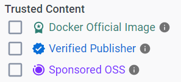
           4.   `无认证仓库`：没有以上任何标识的仓库。这种仓库中镜像的质量良莠不齐，质量上无法保证，在使用时需谨慎。

   4.   对于任何镜像，都可通过`<repository>:<tag>`进行唯一定位。其中`<tag>`一般称为镜像的版本号。`<tag>`中有一个比较特殊的版本——latest。如果不指定，默认`<tag>`即为 latest。不过，虽然其字面意思是最新版，一般其也的确存放的是最新版，但并不能保证其真的就是最新版。

        

        <br>


#####  b-命令帮助

1.   后面学习中不可能将所有的`docker`命令学习到位，对与未知命令，存在三种方式查询：

2.   通过官方文档：打开官方文档，选择`reference`后，之后选择`Command-line reference-->Docker CLI`即可；[-->传送门<--](https://docs.docker.com/engine/reference/commandline/images/)。<br>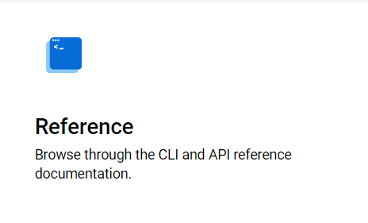

     <br>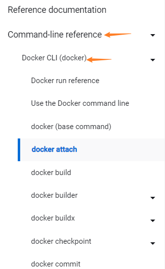

3.   通过`xxx --help`命令查询。例如下面查询`docker --help`(省略绝大多数输出)。

     ```shell
     dreamfish@dreamfish/~ docker --help
     
         Usage:  docker [OPTIONS] COMMAND
     
         A self-sufficient runtime for containers
     
         Common Commands:
           run         Create and run a new container from an image
           exec        Execute a command in a running container
           ps          List containers
           build       Build an image from a Dockerfile
           pull        Download an image from a registry
           push        Upload an image to a registry
           images      List images
           login       Log in to a registry
           logout      Log out from a registry
           search      Search Docker Hub for images
           version     Show the Docker version information
           info        Display system-wide information    
     ```

4.   还可以使用`man xxx`查看命令使用文档，更加详细。


##### c-待补

1. 自动化镜像：…


---


<br>

#### 2-docker pull

*   在学习`docker pull`之前选看一下官方解释，运行`docker pull --help`。

     ```shell
     $ docker pull --help
     
     Usage:  docker pull [OPTIONS] NAME[:TAG|@DIGEST]
     
     Download an image from a registry
     
     Aliases:
       docker image pull, docker pull
     
     Options:
       -a, --all-tags                Download all tagged images in the repository
           --disable-content-trust   Skip image verification (default true)
           --platform string         Set platform if server is multi-platform capable
       -q, --quiet                   Suppress verbose output
     ```


<br>

##### a-默认使用

1.   通过 `docker pull` 命令可以将指定的镜像从[docker hub](https://hub.docker.com/)拉取到本地。如果没有指定镜像则会抛出一个 Error。

2.   pull 命令中一般使用`docker pull <repository>:<tag>`的`<tag>`也可以不写，此时默认的`<tag>`为 `latest`。但是不一定最新，所以一般我们都会指定。

3.   `docker pull `可通过镜像的 digest 进行拉取。语法格式为 `docker pull <repository>@<digest>`,这样下载的镜像没有`tag`。

     1.   digest，是镜像内容的一个Hash值，即所谓的Content Hash(内容散列）。只要镜像内容发生了变更，其内容散列值就一定会发生改变。注意，digest 是包含前面的 sha256 的，表示该 digest 的产生所采用的 Hash 算法是 SHA256。

     2.   我们可以在docker hub点开具体镜像版本查看其`digest`。而且`docker pull`在不用`-q`就可以看见`digest`。<br>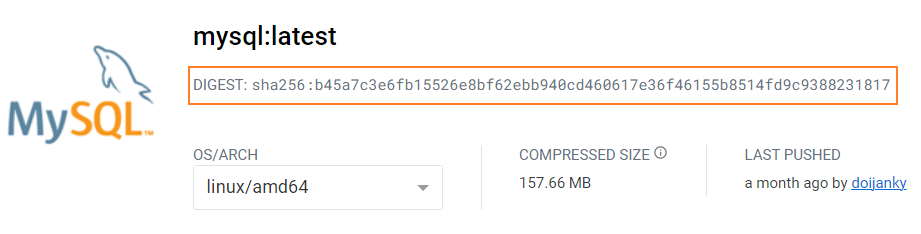

     3.   例如：`docker pull redis@sha256:a2b5e4899c5c9080c9c2b3c7c5b715e5db85286b9c243b8e5f77c38b8647b6b6`安装redis。

          ```tex
          docker.io/library/redis@sha256:a2b5e4899c5c9080c9c2b3c7c5b715e5db85286b9c243b8e5f77c38b8647b6b6: Pulling from library/redis
          f03b40093957: Pull complete
          8db26c5e8435: Pull complete
          37e84c7a626f: Pull complete
          806c192e0375: Pull complete
          08769906aa59: Pull complete
          635073d8ccd5: Pull complete
          Digest: sha256:a2b5e4899c5c9080c9c2b3c7c5b715e5db85286b9c243b8e5f77c38b8647b6b6
          Status: Downloaded newer image for redis@sha256:a2b5e4899c5c9080c9c2b3c7c5b715e5db85286b9c243b8e5f77c38b8647b6b6
          docker.io/library/redis@sha256:a2b5e4899c5c9080c9c2b3c7c5b715e5db85286b9c243b8e5f77c38b8647b6b6
          ```

4.   众所周知，pull 命令默认从 Docker hub 下载镜像，但是，我们可以从我们的私有仓库或任何不同的仓库中拉取镜像。此时使用`docker pull ip:port/<repository>xxxx`即可。通过`ip:port`指定主机端口号。


<br>

##### b-选项-a

1.   使用`-a`会从仓库中下载所有标签(版本)的镜像，特别大，一般用于个人镜像仓库。
2.   例如`docker pull -a mysql`下载mysql仓库的所有镜像。


<br>

##### c-选项 -q

1.   使用`-q`会在下载镜像是简化输出日志。

2.   例如使用`docker pull mysql`下载`mysql`，其输出日志如下：

     ```tex
     latest: Pulling from library/mysql
     72a69066d2fe: Pull complete
     93619dbc5b36: Pull complete
     99da31dd6142: Pull complete
     626033c43d70: Pull complete
     37d5d7efb64e: Pull complete
     ac563158d721: Pull complete
     d2ba16033dad: Pull complete
     688ba7d5c01a: Pull complete
     00e060b6d11d: Pull complete
     1c04857f594f: Pull complete
     4d7cfa90e6ea: Pull complete
     e0431212d27d: Pull complete
     Digest: sha256:e9027fe4d91c0153429607251656806cc784e914937271037f7738bd5b8e7709
     Status: Downloaded newer image for mysql:latest
     docker.io/library/mysql:latest
     ```

3.   但使用`docker pull mysql -q`下载`mysql`，其输出日志如下：

     ```text
     docker.io/library/mysql:latest
     ```


<br>

##### d-其他选项

1.   ` --disable-content-trust `是跳过镜像分析检查。主要用于拉取未签名且启用内容信任的Docker镜像。
2.   `--platform string`选择平台，例如`x86、adm64`等。


---


#### 3-docker images

*   在学习`docker images`之前选看一下官方解释，运行`docker images --help`。通过文档知道`-a`参数是默认的。

    ```shell
    $ docker images --help
    
    Usage:  docker images [OPTIONS] [REPOSITORY[:TAG]]
    
    List images
    
    Aliases:
      docker image ls, docker image list, docker images
    
    Options:
      -a, --all             Show all images (default hides intermediate images)
          --digests         Show digests
      -f, --filter filter   Filter output based on conditions provided
          --format string   Format output using a custom template:
                            'table':            Print output in table format with column
                            headers (default)
                            'table TEMPLATE':   Print output in table format using the given
                            Go template
                            'json':             Print in JSON format
                            'TEMPLATE':         Print output using the given Go template.
                            Refer to https://docs.docker.com/go/formatting/ for more
                            information about formatting output with templates
          --no-trunc        Don't truncate output
      -q, --quiet           Only show image IDs
    ```


<br>

##### a-默认使用

1.   通过`docker images`命令可查看本地所有镜像资源信息。这些镜像会按照镜像被创建的时间由近及远排序。

     ```shell
     $ docker images
     
     REPOSITORY             TAG       IMAGE ID       CREATED         SIZE
     redis                  <none>    0ec8ab59a35f   20 hours ago    117MB
     hello-world            latest    9c7a54a9a43c   2 weeks ago     13.3kB
     mysql                  latest    3218b38490ce   17 months ago   516MB
     redislabs/redisearch   latest    dabe38ef4f00   17 months ago   152MB
     ```

2.    通过`docker images <repository>[:<tag> | @<digest>]`  命令也可以查看某个具体镜像资源信息。当然也可以直接使用`docker images <repository>`查看本地拉取的某个仓库的所有镜像。

      ```shell
      $ docker images redis
      
      REPOSITORY   TAG       IMAGE ID       CREATED        SIZE
      redis        <none>    0ec8ab59a35f   20 hours ago   117MB
      ```

3.   关于输出的一些标签解释：
     1.   `REPOSITORY`：镜像仓库名称。
     2.   `TAG`：镜像版本号。
     3.   `IMAGE ID`：镜像的唯一标识。
     4.   `CREATE`：镜像的创建时间。
     5.   `SIZE`：镜像大小。


<br>

##### b-选项 --no-trunc

1.   默认的 docker images 显示的镜像id是经过截取后的显示结果，仅显示了前12位。使

     用` --no-trunc`参数后显示的是完成的镜像id。


<br>

##### c-选项--digests

1.   `--digests`选项可以查看所有镜像或指定镜像的digest信息。关于digest后面会详细学习。


<br>

##### d-选项-q

1.   `-q `选项可仅显示本地所有镜像的ImageID。该主要是将来与其它命令联合使用(例如删除命令`docker rmi`)。

2.   例如：`docker images -q`，其输出如下：

     ```shell
     $ docker images -q
     
     0ec8ab59a35f
     9c7a54a9a43c
     3218b38490ce
     dabe38ef4f00
     ```

<br>

##### e-选项-f

1.   `-f dangling=true` 用于过滤出悬虚镜像，即没有Repository与Tag的镜像。对于悬虚镜像的REPOSITORY与TAG，显示的是`<none>`。例如`docker images -f dangling=true`。

2.   顺便提一嘴，`-f label=xxx`可以按照`label`过滤，但是目前用不到。

3.   `-f before= <repository>[:<tag> | @<digest>] `(`=`两边无空格，这里是由于md语法，不得不加空格)用于列举出本地镜像中指定镜像创建时间之前创建的所有镜像。

4.   `-f since= <repository>[:<tag> | @<digest>]` (`=`两边无空格，这里是由于md语法，不得不加空格)用于列举出本地镜像中指定镜像创建时间之后的创建的所有镜像。

     ```shell
     $ docker images
     
     REPOSITORY             TAG       IMAGE ID       CREATED         SIZE
     redis                  <none>    0ec8ab59a35f   20 hours ago    117MB
     hello-world            latest    9c7a54a9a43c   2 weeks ago     13.3kB
     mysql                  latest    3218b38490ce   17 months ago   516MB
     redislabs/redisearch   latest    dabe38ef4f00   17 months ago   152MB
     
     $ docker images -f since=mysql
     
     REPOSITORY    TAG       IMAGE ID       CREATED        SIZE
     redis         <none>    0ec8ab59a35f   20 hours ago   117MB
     hello-world   latest    9c7a54a9a43c   2 weeks ago    13.3kB
     ```

5.   `-f reference=xxx `用于列举出`<repository>:<tag>`与指定表达式相匹配的所有镜像，其中可以使用通配符`*`。(但是似乎含`/`是无法使用；也有人说是只对官方镜像生效)。

     ```shell
     $ docker images
     
     REPOSITORY             TAG       IMAGE ID       CREATED         SIZE
     redis                  <none>    0ec8ab59a35f   20 hours ago    117MB
     hello-world            latest    9c7a54a9a43c   2 weeks ago     13.3kB
     mysql                  latest    3218b38490ce   17 months ago   516MB
     redislabs/redisearch   latest    dabe38ef4f00   17 months ago   152MB
     
     $ docker images -f reference=*redis*:*
     
     REPOSITORY   TAG       IMAGE ID       CREATED        SIZE
     redis        <none>    0ec8ab59a35f   20 hours ago   117MB
     ```

     

<br>

##### f-选项--format

1.   `--format`用于使用go语言语法格式化输出。即使用`{{.Xxx}}`。

2.   具体可使用占位符：

     | Placeholder     | Description                              |
     | :-------------- | :--------------------------------------- |
     | `.ID`           | Image ID                                 |
     | `.Repository`   | Image repository                         |
     | `.Tag`          | Image tag                                |
     | `.Digest`       | Image digest                             |
     | `.CreatedSince` | Elapsed time since the image was created |
     | `.CreatedAt`    | Time when the image was created          |
     | `.Size`         | Image disk size                          |

3.   例如：`docker images --format {{.Repository}}:{{.Tag}}:{{.Size}}`。

     ```shell
     $ docker images --format {{.Repository}}:{{.Tag}}:{{.Size}}
     redis:<none>:117MB
     hello-world:latest:13.3kB
     mysql:latest:516MB
     redislabs/redisearch:latest:152MB
     ```

     

---


####  4-docker search

*   在学习`docker search`之前选看一下官方解释，运行`docker search --help`。通过文档知道`-a`参数是默认的。

    ```shell
    $ docker search --help
    
    Usage:  docker search [OPTIONS] TERM
    
    Search Docker Hub for images
    
    Options:
      -f, --filter filter   Filter output based on conditions provided
          --format string   Pretty-print search using a Go template
          --limit int       Max number of search results
          --no-trunc        Don't truncate output
    ```


<br>

##### a-默认使用

1.   通过` docker search` 命令可以从docker hub上查看指定名称的镜像。例如`docker search python`:

     ```shell
     $ docker search python
     
     NAME             DESCRIPTION                  STARS     OFFICIAL   AUTOMATED
     python           Python is an interpreted,…   8708      [OK]
     pypy             PyPy is a fast, compliant…   367       [OK]
     hylang           Hy is a Lisp dialect that…   54        [OK]
     circleci/python  Python is an interpreted…    76
     cimg/python                                   8
     bitnami/python   Bitnami Python Docker Image  26                     [OK]
     okteto/python                                 0
     ```

2.   执行结果各列的含义：

     1.   `NAME`:名称。
     
     2.   `DESCRIPTION`:描述。
     
     3.   `STARS`:类似Github里面的 star，表示点赞、喜欢的意思。
     
     4.   `OFFICIAL`:是否是官方。
     
     5.   `AUTOMATED`:表示当前镜像是否是“自动化镜像”。
     
          > 什么是自动化镜像？就是使用Docker Hub连接一个包含Dockerfile文件(专门构建镜像用的文件)的GitHub仓库或Bitbucket仓库的源码托管平台，然后Docker Hub就会自动根据 Dockerfile 内容构建镜像。这种构建出的镜像会被标记为`AUTOMATED`，这种构建镜像的方式称为Trusted Build(受信构建)。只要Dockerfile文件内容发生变化，那么Docker Hub就会构建出新的镜像。

<br>

##### b-过滤-f

1.   `-f`选项用于过滤查询结果。例如，下面的是仅查询出官方提供的镜像。

2.   `-f is-official=true`：过滤官方镜像。

3.   `-f -f is-automated=true`：过滤自动化镜像。

4.   `-f -f stars=num`：点赞收藏数大于`num`的镜像。

5.   举例：

     ```shell
     docker search -f is-official=true python 	# 找官方python镜像
     docker search -f is-automated=true python	# 找python自动化镜像
     docker search -f is-automated=true -f stars=10 python # 找star大于10的python自动化镜像
     ```
     
     

<br>

##### c-选项--limit

1.   默认`docker search`显示25条检索结果，可通过`--limit `选项来指定显示的结果数量。

2.   例如`docker search python --limit 5`，结果如下：

     ```shell
     $ docker search python --limit 5
     
     NAME              DESCRIPTION                                     STARS     OFFICIAL   AUTOMATED
     python            Python is an interpreted, interactive, objec…   8708      [OK]
     pypy              PyPy is a fast, compliant alternative implem…   367       [OK]
     hylang            Hy is a Lisp dialect that translates express…   54        [OK]
     circleci/python   Python is an interpreted, interactive, objec…   76
     ```


<br>

##### d-选项--no-trunc

1.   默认`docker search`显示的描述是截取的，使用`--no-trunc`显示全部描述。
2.   例如`docker search python --no-trunc`。


<br>

##### e-选项--format

1.   `--format`用于使用go语言语法格式化输出。即使用`{{.Xxx}}`。

2.   具体可使用属性如下：

     | 占位符         | 介绍           |
     | :------------- | :------------- |
     | `.Name`        | 名称           |
     | `.Description` | 描述           |
     | `.StarCount`   | 点赞收藏数     |
     | `.IsOfficial`  | 是否官方镜像   |
     | `.IsAutomated` | 是否自动化镜像 |

3.   例如：` docker search python --format {{.Name}}:{{.StarCount}} --limit 5`。结果如下：

     ```shell
     $ docker search python --format {{.Name}}:{{.StarCount}} --limit 5
     
     python:8708
     pypy:367
     hylang:54
     circleci/python:76
     cimg/python:8
     ```

     

#### 5-docker  rmi

*   在学习`docker rmi`之前选看一下官方解释，运行`docker rmi --help`。通过文档知道`-a`参数是默认的。

    ```shell
    $ docker rmi --help
    
    Usage:  docker rmi [OPTIONS] IMAGE [IMAGE...]
    
    Remove one or more images
    
    Aliases:
      docker image rm, docker image remove, docker rmi
    
    Options:
      -f, --force      Force removal of the image
          --no-prune   Do not delete untagged parents
    ```


<br>

##### a-默认使用

1.   `docker rmi xxx`该命令用于删除指定的本地镜像。

     1.   镜像通过`<repository>:<tag>`指定。如果省略要删除镜像的 `tag`，默认删除的是`lastest`版本。
     2.   镜像通过`<repository>@<digest>`指定。
     3.   镜像也可以通过`IMAGE ID`指定。

2.   `docker rmi x1 x2 ...`可以批量删除多个镜像，多个要删除的镜像间使用空格分隔。

3.   举例：

     ```shell
     docker rmi mysql hello-world:latest # 删除mysql和hello-world镜像
     ```

     

<br>

##### b-强制删除

1.   默认情况下，对于已经运行了容器的镜像是不能删除的，必须要先停止并删除了相关容器然后才能删除其对应的镜像。不过，也可以通过添加`-f`选项进行强制删除。
2.   使用组合命令`docker rmi -f $(docker images -q)`删除所有镜像。当然，如果不携带`-f `选项，则不会删除已打开容器的镜像。这里的`$()`是shell语法。


----


<br>

#### 6-镜像导入和导出

<br>

##### a-导出

1.   ``docker save`` 命令用于将一个或多个镜像导出为`tar`文件。

     1.   `docker save xxx -o aaa.tar`使用`-o`或者`--output`将镜像输出为`aaa.tar`文件。
     2.   会linux命令很容易知道，可以使用`>`重定向。所以我们也可以使用`docker save xxx > aaa.tar`将镜像输出为`aaa.tar`文件。

2.   举例如下：

     ```shell
     $ pwd  # 显示当前位置
     /home/dreamfish
     
     $ docker save redis > redis.tar
     
     $ docker save redis mysql:latest -o all.tar  # 将redis和mysql:latest导出
     ```


<br>

##### b-导入

1.   `docker load` 用于将一个`tar`文件导入并加载为一个或多个镜像。

     1.   `docker load -i aaa.tar`使用`-oi`或者`--input`从`aaa.tar`文件导入镜像。
     2.   会linux命令很容易知道，可以使用`<`重定向。所以我们也可以使用`docker load < aaa.tar`从`aaa.tar`文件导入镜像。

2.   此外，还有`-q,-quiet`，可以简化导入过程的日志输出。当`-q、-i`选项一起使用时，可以省略为`docker load -qi aaa.tar`。

3.   举例如下：

     ```shell
     $ docker rmi -f $(docker images -q)  # 删除所以镜像
     
     $ docker load -qi ~/all.tar  # 导入镜像(docker load -q < ~/all.tar)
     
     Loaded image: redis:latest
     Loaded image: mysql:latest
     
     $ docker image ls  # 查看镜像(docker images)
     ```

     

#### 7-镜像分层

<br>

##### a-镜像分层

1. Docker镜像由一些松耦合的只读镜像层组成，Docker Daemon负责堆叠这些镜像层，并将它们关联为一个统一的整体，即对外表现出的是一个独立的对象。通过`docker pull`命令拉取指定的镜像时，每个Pull complete结尾的行就代表下载完毕了一个镜像层。

2. 例如下面的`redis:latest`就包含下面六个分层。

   ```shell
   $ docker pull redis
   
   Using default tag: latest
   latest: Pulling from library/redis
   a2abf6c4d29d: Pull complete
   c7a4e4382001: Pull complete
   4044b9ba67c9: Pull complete
   c8388a79482f: Pull complete
   413c8bb60be2: Pull complete
   1abfd3011519: Pull complete
   Digest: sha256:db485f2e245b5b3329fdc7eff4eb00f913e09d8feb9ca720788059fdc2ed8339
   Status: Downloaded newer image for redis:latest
   docker.io/library/redis:latest
   ```

   > 其实从docker hub中也能看出镜像分层,下面是某版本redis的镜像分层:<br>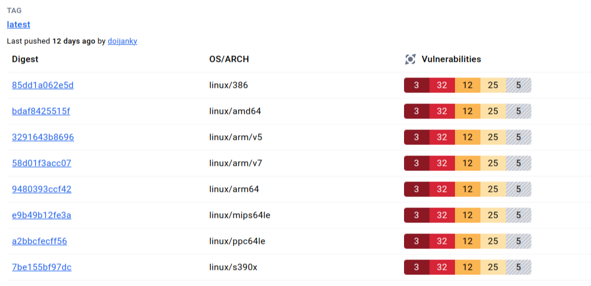

3. 其中镜像分层结构如下：<br>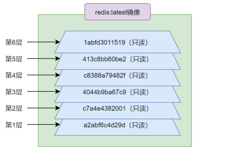


<br>

##### b-分层原因

1.   采用这种分层结构的优势很多,如：<span style="color:red">每个分层都是只读的,所有对分层的修改都是以新分层的形式出现,并不会破坏原分层内容</span>。再如，每个分层只记录变更内容,所以有利于节省存储空间等。

2.   不过,分层结构的最大的好处是，在不同镜像间实现资源共享，即不同镜像对相同下层镜像的复用。对于 `docker pull `命令，其在拉取之前会先获取到其要拉取镜像的所有ImageID，然后在本地查找是否存在这些分层。如果存在，则不再进行拉取，而是共享本地的该分层。大大节点的存储空间与网络带宽，提升了拉取效率。

3.   这里演示一下，我们在已经安装`redis:latest`的前提下，再次通过`docker pull redis:7.2-rc `。会发现很多镜像层显示` Already exists`已经存在，这些镜像层就无须拉取，从而提升拉取效率。

     ```shell
     $ docker pull redis:7.2-rc
     
     7.2-rc: Pulling from library/redis
     f03b40093957: Already exists
     8db26c5e8435: Already exists
     37e84c7a626f: Already exists
     cd72a70101ed: Pull complete
     b3ff5bea39bd: Pull complete
     637ec8eb9e33: Pull complete
     Digest: sha256:42d4fb3cbf4b6e546108fb1d2a7c43a02780ba7801f7d1dde63d82374f374b15
     Status: Downloaded newer image for redis:7.2-rc
     docker.io/library/redis:7.2-rc
     ```


<br>

##### c-镜像层组成

1.   每个镜像层由两部分构成：镜像文件系统与镜像json文件。这两部分具有相同的ImageID。

2.   镜像文件系统(FS)就是对镜像占有的磁盘空间进行管理的文件系统，拥有该镜像所有镜像层的数据内容。

3.   而镜像json文件则是用于描述镜像的相关属性的集合，通过`docker inspect [镜像]`就可以直观看到。

     ```shell
     $ docker inspect redis
     
     [
     {
     "Id": "sha256:7614ae9453d1d87e740a2056257a6de7135c84037c367e1fffa92ae922784631",
     "RepoTags": [
     "redis:latest"
     ],
     "RepoDigests": [
     "redis@sha256:db485f2e245b5b3329fdc7eff4eb00f913e09d8feb9ca720788059fdc2ed8339"
     ],
     "Parent": "",
     "Comment": "",
     "Created": "2021-12-21T12:42:49.755107412Z",
     "Container": "13d25f53410417c5220c8dfe8bd49f06abdbcd69faa62a9b877de02464bb04a3",
     "ContainerConfig": {
     "Hostname": "13d25f534104",
     ....
     ```
     
     

<br>

##### d-镜像FS

1. 一个docker镜像的文件系统FS由多层只读的镜像层组成，每层都完成了特定的功能。而这些只读镜像层根据其位置与功能的不同可分为两类：基础镜像层与扩展镜像层。

2. 基础镜像层:所有镜像的最下层都具有一个可以看得到的基础镜像层Base Image，基础镜像层的文件系统称为根文件系统 `rootfs`。而`rootfs`则是建立在Linux系统中看不到的"引导文件系统"`bootfs `之上。

3. 扩展镜像层：在基础镜像层之上的镜像层称为扩展镜像层。顾名思义,其是对基础镜像层功能的扩展。在 Dockerfile 中，每条指令都是用于完成某项特定功能的,而每条指令都会生成一个扩展镜像层。

4. 容器层：<font color=red>一旦镜像运行了起来就形成了容器，而容器就是一个运行中的Linux系统，其也是具有文件系统的。容器的这个文件系统是在docker镜像最外层之上增加了一个可读写的容器层,对文件的任何更改都只存在于容器层。因此任何对容器的操作都不会影响到镜像本身。容器层如果需要修改某个文件,系统会从容器层开始向下一层层的查找该文件,直到找到为止。任何对于文件的操作都会记录在容器层。例如，要修改某文件，容器层会首先把在镜像层找到的文件copy到容器层,然后再进行修改。删除文件也只会将存在于容器层中的文件副本删除。</font>可以看出，Docker容器就是一个叠加后的文件系统，而这个容器层称为Union File System,联合文件系统。

5. 各层次示意图如下：<br>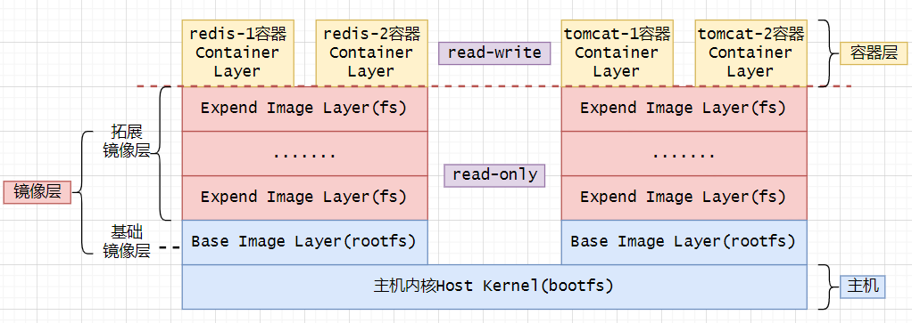

6. 联合文件系统(Union File System)UnionFS是docker制作镜像和容器文件的主要技术。通过联合文件系统，可以将多个路径挂载到同一个挂载点上，实现多个path的合并操作(上层同名文件会将下层文件覆盖),最后通过挂载点向上层应用/用户呈现一个合并之后的视图。联合文件系统有多种实现,ubuntu采用AUFS实现，centos采用`overlay/overlay2`来实现。<br>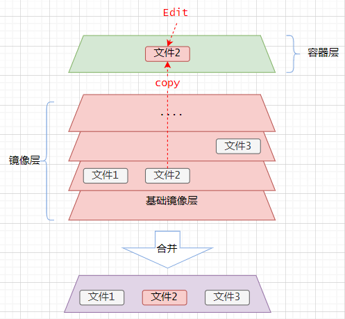

   > 1. 联合文件系统(Union File System是一种允许将多个文件系统挂载到一个统一的视图中的文件系统技术。它的主要目的是提供一种将多个文件系统的内容合并在一起的机制，这样用户就可以像使用一个普通的文件系统一样访问这些合并后的内容。
   > 2. Ubuntu在早期版本中确实使用AUFS,特别是在Ubuntu12.04及其之前的版本。然而,从Ubuntu 16.04 LTS开始,Ubuntu改用OverlayFS，作为联合文件系统的主要技术。OverlayFS提供了更好的性能和稳定性,并且成为了容器化技术的默认选择。
   > 3. centos和archlinux也默认使用OverlayFS。
   > 4. overlay2是OverlayFS的一个增强版本，用于Linux容器，特别是在Docker 中。它改进了overlay的原始实现，提供了更好的性能和更高的可靠性。


<br>

##### e-linux启动过程(拓展)

1.   现代操作系统都是C/S模式的微内核架构的，由两大部分构成：内核(Server)与服务模块(Client)。Linux的 `bootfs`文件系统由两部分构成：bootloader与kernel。<br>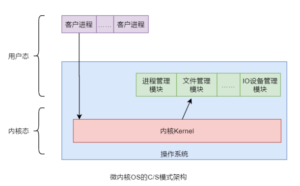
2.   `bootloader `主要负责将`kernel`加载到内存，并引导`kernel`启动。当`kernel`启动后，内存的使用权就由`bootfs`完全转交给了`kernel`，然后`kernel `就会将`bootfs `卸载。
3.   而docker中的各个容器中的rootft就是由宿主机的kernel驱动的。
4.   linux启动过程示意图(详细过程可参考[博客](https://developer.aliyun.com/article/47675))：<br>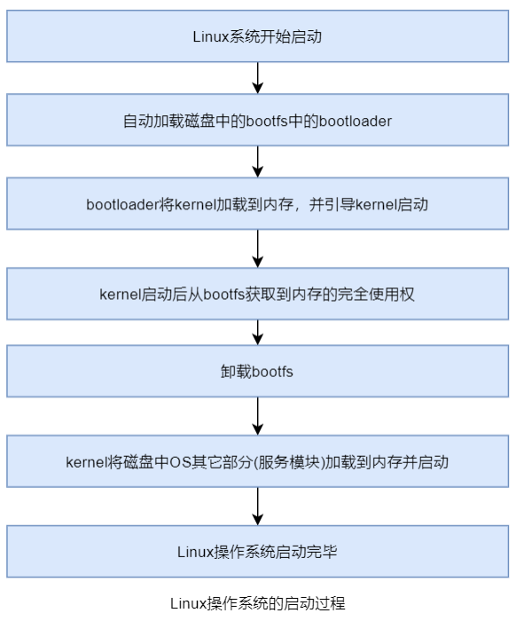

> Linux的启动流程可以分为几个主要阶段,每个阶段都有特定的任务和目的。以下是详细的Linux启动流程：
>
> 1. BIOS/UEFI阶段
>
> - 电源开机:计算机接通电源后,BIOS(基本输入输出系统)或 UEFI(统一可扩展固件接口)开始运行。
> - 自检:BIOS/UEFI执行POST(电源自检),检查硬件组件是否正常。
> - 引导选择:BIOS/UEFI查找并加载引导加载程序(Boot Loader),通常从硬盘的引导扇区(MBR或GPT)中读取。
>
> 2. 引导加载程序阶段
>
> - GRUB(或其他引导加载程序):GRUB(GRand Unified Bootloader)是最常用的Linux引导加载程序。它加载并显示启动菜单,允许用户选择操作系统或内核。
> - 加载内核:GRUB读取并加载Linux内核到内存中,并传递控制权给内核。
>
> 3. 内核阶段
>
> - 内核初始化：Linux内核开始初始化,检测硬件,加载驱动程序,并进行内存管理。
> - 文件系统挂载：内核挂载根文件系统(root filesystem),通常是从初始化的磁盘分区或镜像文件中挂载。
> - 执行初始化进程：内核启动第一个用户空间进程,通常是 `init`(或在较新的系统中是`systemd`)。
>
> 4. 初始化进程阶段
>
> - init或systemd：init是传统的初始化进程,负责启动其他系统服务和进程。systemd是现代系统中较常用的初始化系统,负责服务管理和并发启动。
> - 加载系统服务：systemd或init加载并启动系统服务(如网络、登录、图形界面等),根据配置文件(如`/etc/systemd/system`或`/etc/init.d`)进行管理。
>
> 5. 用户空间初始化阶段
>
> - 运行级别或目标：根据系统的运行级别(如传统的 SysV init)或目标(在`systemd`中,如`graphical.target`),系统进入多用户模式,并启动相应的服务和应用程序。
> - 登录提示：系统启动完成后,提供登录提示,允许用户登录到系统。
>
> 6. 用户登录
>
> - 用户登录：用户通过终端、图形界面或网络远程登录系统。
> - 会话启动：用户登录后，启动用户会话，并运行用户的默认桌面环境或终端会话。

---

<br>

#### 8-镜像摘要

<br>

##### a-简介

1.   摘要，即digest，是镜像内容的一个Hash值，即所谓的Content Hash(内容散列)。只要镜像内容发生了变更，其内容散列值就一定会发生改变。也就是说，一个镜像一旦创建完毕，其 digest 就不会发生改变了，因为镜像是只读的。
2.   Docker 默认采用的Hash算法是`SHA256`，即Hash值是一个长度为 256 位的二进制值。Docker 使用16进制表示，即变为了长度为 64 位的字符串。


<br>

 ##### b-摘要的作用

1.   摘要的主要作用是区分相同`<repository>:<tag>`的不同镜像。
2.   例如镜像 xxx:2.8 在生产运行过程中发现存在一个 BUG。现对其进行了修复，并使用原标签将其push回了仓库，那么原镜像被覆盖。但生产环境中遗留了大量运行中的修复前镜像的容器。此时，通过镜像标签已经无法区分镜像是修复前的还是修复后的了，因为它们的标签是相同的。此时通过查看镜像的digest就可以区分出修改前后版本，因为内容发生了变化，digest 一定会变。为了确保再次拉取到的是修复后的镜像，可通过digest进行镜像拉取。其用法是：`docker pull <repository>@<digest>`下面的例子是，先查出zookeeper:3.8 镜像的digest，然后将该镜像删除，然后再通过digest对其进行拉取。
3.   不过，不方便的是，镜像的摘要需要由运维人员在本地进行手工维护。

<br>

##### c-分发散列值

1.   在push或pull镜像时，都会对镜像进行压缩以减少网络带宽和传输时长。但压缩会改变镜像内容，会导致经过网络传输后，镜像内容与其digest不相符。出现问题。
2.   为了避免该问题，Docker又为镜像配置了Distribution Hash(分发散列值)。在镜像被压缩后立即计算分发散列值，然后使该值随压缩过的镜像一同进行发送。在接收方接收后，立即计算压缩镜像的分发散列值，再与携带的分发散列值对比。如果相同，则说明传输没有问题。
3.   综上所述：也就是说，维护镜像后`push`过程中，至少要传输三种东西：维护后的镜像、镜像的摘要、分发散列值。

---


<br>

#### 9-多架构镜像

<br>

##### a-简介

1.   `Multi-architecture Image`，即多架构镜像，是某`<repository>`中的某`<tag>`镜像针对不同操作系统/系统架构的不同镜像实现。即多架构镜像中包含的镜像的`<repository>:<tag>`都是相同的，但它们针对的操作系统/系统架构是不同的。
1.   对此可以在docker hut中查看。<br>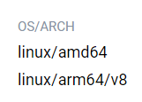


<br>

##### b-多镜像架构原理

1.   无论用户使用的是什么操作系统/系统架构，其通过`docker pull`命令拉取到的一定是针对该操作系统/系统架构的镜像，无需用户自己考虑操作系统/系统架构问题。Docker Hub能够根据提交pull请求的Docker系统的架构自动选择其对应的镜像。
2.   在Docker Hub中，镜像的多架构信息保存在`Manifest`文件中。在拉取镜像时，Docker会随着 pull 命令将当前Docker系统的OS与架构信息一并提交给Docker Hub。Docker Hub 首先会根据镜像的`<repository>:<tag>`查找是否存在`Manifest`。如果不存在，则直接查找并返回`<repository>:<tag>`镜像即可；如果存在，则会在`Manifest`中查找是否存在指定系统/架构的镜像。如果存在该系统/架构，则根据`Manifest`中记录的地址找到该镜像的位置。
3.   具体示意图如下：<br>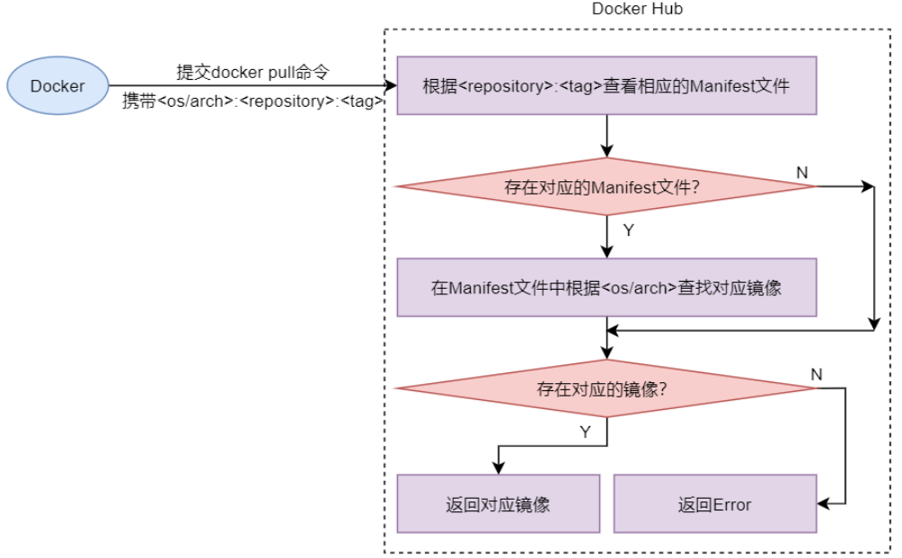

4.   此外可以使用`docker manifest inspect xxx`查看镜像的`manifest`文件。由于其实是从docker hub获取文件，所以速度较慢(本地不存在`manifest`文件)。

     ```shell
     $ docker manifest inspect redis:
     
     {
     "schemaVersion": 2,
     "mediaType": "application/vnd.docker.distribution.manifest.list.v2+json",
     "manifests": [
     {
     "mediaType": "application/vnd.docker.distribution.manifest.v2+json",
     "size": 1573,
     "digest": "sha256:a2b5e4899c5c9080c9c2b3c7c5b715e5db85286b9c243b8e5f77c38b8647b6b6",
     "platform": {
     "architecture": "amd64",
     "os": "linux"
     }
     },
     {
     "mediaType": "application/vnd.docker.distribution.manifest.v2+json",
     "size": 1573,
     "digest": "sha256:24cf55495a5ae796a214f49e8419452566145ab1e8d84e1d4b6ca6bd90f51ca7",
     "platform": {
     "architecture": "arm",
     "os": "linux",
     "variant": "v5"
     }
     },
     ...
     ]
     }
     ```

     
