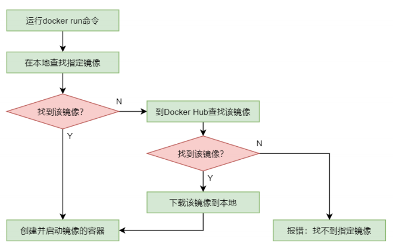
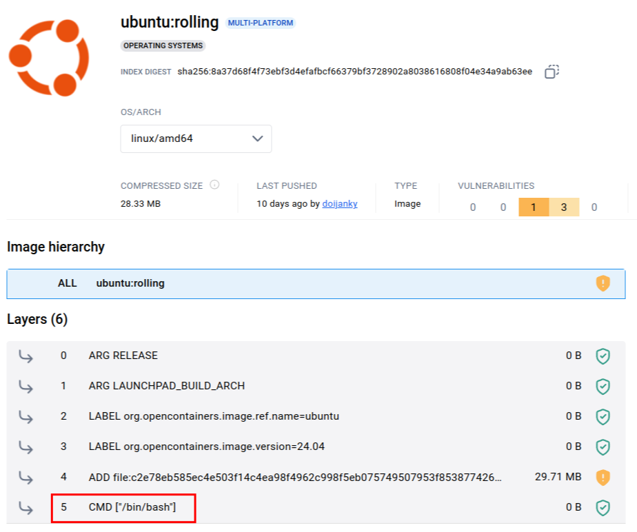
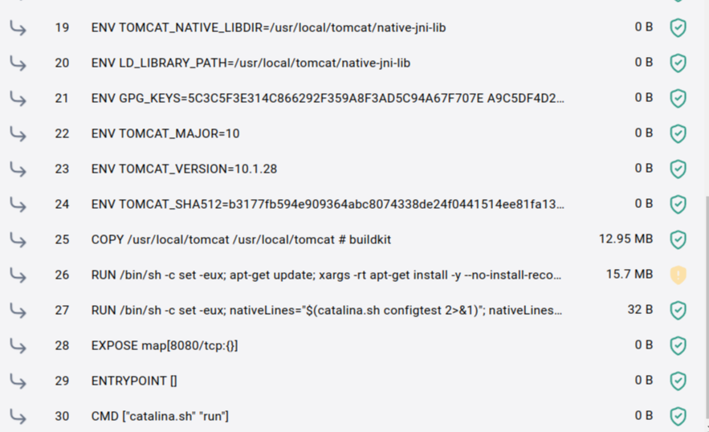
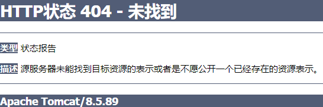
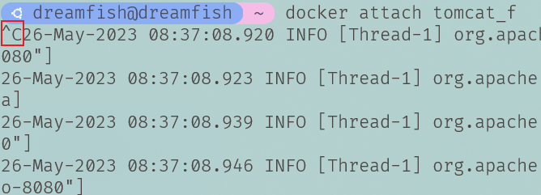
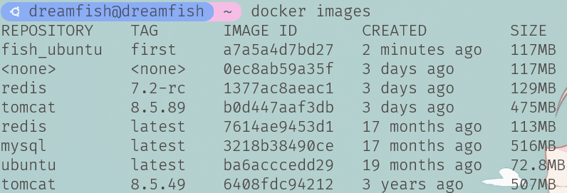

#### 容器基础

<br>

##### a-容器启动流程

1.   通过`docker run`命令可以启动运行一个容器。该命令在执行时首先会在本地查找指定的镜像，如果找到了，则直接启动，否则会到镜像中心查找。如果镜像中心存在该镜像，则会下载到本地并启动，如果镜像中心也没有，则直接报错。如果再与多架构镜像原理相整合，则就形成了完整的容器启动流程。
2.   过程示意如下：<br>


<br>

##### b-容器运行本质

1.   Docker容器存在的意义就是为了运行容器中的应用，对外提供服务，所以启动容器的目的就是启动运行该容器中的应用。容器中的应用运行完毕后，容器就会自动终止。所以，如果不想让容器启动后立即终止运行，则就需要使容器应用不能立即结束。通常采用的方式有两种：使应用处于与用户交互的状态或等待状态。

2.   <font color=red>这里是一个非常重要的部分,容器的本质就是为了运行应用,应用停止那么容器就没有存在的必要的,容器也就会终止</font>。

3.   我们以装`docker`的测试镜像`hello-world`为例。通过`docker ps -a `查看容器运行情况(暂不详解)，发现容器状态显示已退出(结果显示难看，处理了一下)。

     ```shell
     $ docker run hello-world
     
     $ docker ps -a
     
     CONTAINER ID   IMAGE          COMMAND    CREATED          STATUS                      
     b3540d34fb9f   hello-world    "/hello"   13 seconds ago   Exited (0) 12 seconds ago 
     PORTS     NAMES
     youthful_cartwright
     ```


<br>

##### c-交互模式运行ubuntu

1.   对于容器的运行，有两种运行模式：交互模式与分离模式。下面通过运行`ubuntu`与`tomcat`来演示这两种运行模式的不同。

2. 通过`docker run --name ubuntu_f -it ubuntu /bin/bash`运行ubuntu镜像。

   1.   `docker run` 不需要解释，启动运行容器命令。
   2.   `--name xxx`为当前创建的容器起一个名称，不指定则随机(建议指定)。
   3.   `-it`其实就是`-i -t`的缩写。其中`-i`是表示以交互模式运行容器(官方说法：激活标准输入STDIN)，`-t`表示为容器分配一个伪终端(TTY 终端)。
   4.   后面的`/bin/bash `用于指定容器启动后需要运行的命令为`/bin`下的`bash `命令，而该命令会启动一个 `bash`终端。
   5.   对于这里还是要说明一下，后面学习中会发现有些运行容器需要加`/bin/bash`，而有些不需要。这主要是由于`dockerfile`的配置原因。这里我们看另一个地方，在docker hub中点开具体的镜像版本就可以看到一下信息。存在`CMD ["/bin/bash"]`(表示默认打开`/bin/bash`)则不需要使用`/bin/bash`。<br>
   6.   显然`docker run --name ubuntu_s -it ubuntu`也可以运行ubuntu。

3.   运行示意(结果显示难看，处理了一下)：

     ```shell
     $ docker run --name ubuntu_s -it ubuntu
     $ /# exit
     exit
     $ docker ps -a
     
     CONTAINER ID   IMAGE          COMMAND       CREATED          
     0c342637e23a   ubuntu         "bash"        28 seconds ago   
     
     STATUS                      PORTS     NAMES
     Exited (0) 18 seconds ago 			  ubuntu_s
     ```
     
     

<br>

##### d-交互模式运行tomcat

1.   首先说明，测试的tomcat版本不宜太高，后续说明。这里使用` docker pull tomcat:8.5.49`安装较低版本tomcat。

2.   `docker run --name ubuntu_f -it tomcat /bin/bash`无法启动tomcat，而是以命令行形式进入其文件目录。可以使用`ls -l`查看文件。

3.   `docker run --name ubuntu_f -it tomcat `启动tomcat，但是无法访问tomcat。这主要是由于没有设置端口号的原因。

4.   `docker run --name ubuntu_f -it -p 8081:8080 tomcat`启动tomcat，可以通过`localhost:8081`访问tomcat。

     1.   首先我们要知道，容器也是一个小的linux系统，在其里面运行tomcat会有一个端口号，我们假设其为`tomcat_port`(其实dockerfile中还配置了一个的端口号)。
     2.   而对于`-p host_port:tomcat_port`，该配置使docker把容器中tomcat的端口号`tomcat_port`暴露出去，或者说其实就是提供一种映射，访问主机的`host_post`端口会映射到容器的`tomcat_port`端口。
     3.   其实还存在一个写法`-P`,无需提供参数。docker会自动将容器的tomcat的默认端口(`dockerfile`中配置的)与主机自动分配的可以端口建立映射。
     4.   此外先提一嘴，想要容器继续运行但是在shell命令行中退出。`ctrl+p+q`即可。

5.   下面提供演示过程(显示较乱，对输出处理了一下)，分别访问`localhost:8081`、`localhost:32768`即可，且使用`ctl+q+p`后tomcat均处于运行状态：

     ```shell
     $ docker run --name tomcat_f -it -p 8081:8080 tomcat:8.5.49
     # ctrl+q+p
     
     $ docker run --name tomcat_s -it -P tomcat:8.5.49
     # ctrl+q+p
     
     $ docker ps -a 
     CONTAINER ID   IMAGE           COMMAND             CREATED             
     71eb6314659f   tomcat:8.5.49   "catalina.sh run"   About a minute ago   
     413caeaca1ec   tomcat:8.5.49   "catalina.sh run"   2 minutes ago        
     
     STATUS       			PORTS                                        NAMES
     Up About a minute     0.0.0.0:32768->8080/tcp, :::32768->8080/tcp   tomcat_s
     Up 2 minutes          0.0.0.0:8081->8080/tcp, :::8081->8080/tcp     tomcat_f
     ```

6.   关于为什么tomcat查看其文件目录要使用`/bin/bash`?我们通过docker hub查看它的dockerfile，发现默认使用的不是`/bin/bash`<br>

     >   1.   这里还是要提一嘴，`docker run`的完整命令格式为`docker run [OPTIONS] IMAGE [COMMAND] [ARG...]`。
     >   2.   其中`COMMAND`是启动容器后要执行的命令。像`/bin/bash`或者`ls -l`等等。如果不指定的话，默认会执行`dockerfile`中配置的`CMD ["XXXX"]`。
     >   3.   那么这里就可以解释一件事：
     >        1.   ubuntu镜像的`dockerfile`中配置的是`CMD ["/bin/bash"]`，默认执行`/bin/bash`，所以无需指定。
     >        2.   tomcat镜像的`dockerfile`中配置的是`CMD ["catalina.sh" "run"]`，这配置的才是是tomcat的执行命令。这就是为什么当tomcat指定`/bin/bash`后，不会启动tomcat，而是进入其文件目录。(是否可以手动指明运行`catalina.sh`?)

<br>

##### e-**分离模式运行** tomcat

1.   除了交互模式，我们还可以使用分离模式运行`docker run --name tomcat_f -dp 8081:8080 tomcat:8.5.49`

     1.   `-dp`选项其实是`-d -p`的缩写形式。
     2.   `-d`选项表示以分离模式(detached mode)运行容器，即命令在后台运行，命令的运行与宿主机的运行分离开来。
     3.   既然存在`-dp`那么自然存在`-dP`。也即`docker run --name tomcat_f -dP tomcat:8.5.49`。<font color=red>但是需要注意：这种使用默认的端口号并不意味着你可以通过8080端口访问,而是将主机的可行端口映射到8080端口,具体访问哪个端口,使用`docker ps -a`查看即可。</font>

2.   演示如下(不好显示，对输出处理了一下)：

     ```shell
     $ docker run --name tomcat_f -dp 8081:8080 tomcat:8.5.49
     
     c979a71932b73efe29c63adac5413fb15300c2e2067c4626747da7c2b6cc7360
     
     $ docker ps -a
     
     CONTAINER ID   IMAGE           COMMAND             CREATED         
     c979a71932b7   tomcat:8.5.49   "catalina.sh run"   2 minutes ago
     
     STATUS         PORTS                                       NAMES
     Up 2 minutes   0.0.0.0:8081->8080/tcp, :::8081->8080/tcp   tomcat_f
     ```

3.   但是需要说明的是，ubuntu是无法使用分离模式运行的，因为它需要一个伪终端(它需要交互)，但是分离模式不提供伪终端。以分离模式运行ubuntu会自动退出。

> 后续在运行使发现tomcat一经启动就立即退出：
>
> 1. 使用`docker logs tomcat_f`查看容器日志,经`gpt`分析为内存不足(Java运行环境JRE由于内存不足,导致出现段错误SIGSEGV,进而导致Tomcat服务器崩溃。),后续配置用户和进程的资源限制,但是问题未得到解决。
> 2. 但是根据下述内容,运行较高版本一切正常。
> 3. <font color=red>需要注意：`-dP`使用默认的端口号并不意味着你可以通过8080端口访问tomcat,而是将主机的可行端口映射到8080端口,具体访问哪个端口,使用`docker ps -a`查看即可。</font>


##### f-高版本tomcat的使用

1.   前面已经提到，我们初学时不适用较高版本的tomcat，这主要是因为其内部文件发生了一些变化。下面以`tomcat8.5.89`为例。

2.   我们直接使用`docker run --name tomcat_f -dP tomcat:8.5.89`运行tomcat发现容器启动且处于运行状态。但是我们通过`localhost:xxxx`却无法访问到默认页面，浏览器会显示找不到404资源。<br>

3.   这主要是由于高版本的tomcat镜像的目录存在一些差异。高版本tomcat镜像的欢迎页文件资源不是不是放在`webapp`下，而是在`webapp.dist`目录中，故而浏览器找不到资源。

4.   这时我们需要使用后续命令`docker exec -it tomcat_f /bin/bash`进入对应容器，将其 `webapp.dist`目录中文件移入`webapp`下即可。

     ```shell
     $ docker exec -it tomcat_f /bin/bash  # 进入运行的容器tomcat_f
     
     ~ ls -l  # 查看tomcat的文件目录
     
     total 156
     drwxr-xr-x 2 root root  4096 May 23 00:24 bin
     -rw-r--r-- 1 root root 19992 May  9 16:21 BUILDING.txt
     drwxr-xr-x 1 root root  4096 May 26 01:48 conf
     -rw-r--r-- 1 root root  6210 May  9 16:21 CONTRIBUTING.md
     drwxr-xr-x 2 root root  4096 May 23 00:24 lib
     -rw-r--r-- 1 root root 57011 May  9 16:21 LICENSE
     drwxrwxrwt 1 root root  4096 May 26 01:48 logs
     drwxr-xr-x 2 root root  4096 May 23 00:24 native-jni-lib
     -rw-r--r-- 1 root root  1726 May  9 16:21 NOTICE
     -rw-r--r-- 1 root root  3398 May  9 16:21 README.md
     -rw-r--r-- 1 root root  7139 May  9 16:21 RELEASE-NOTES
     -rw-r--r-- 1 root root 16505 May  9 16:21 RUNNING.txt
     drwxrwxrwt 2 root root  4096 May 23 00:24 temp
     drwxr-xr-x 2 root root  4096 May 23 00:24 webapps
     drwxr-xr-x 7 root root  4096 May  9 16:21 webapps.dist
     drwxrwxrwt 2 root root  4096 May  9 16:21 work
     ```

5.   `webapps.dist->webapps`的具体修改步骤具体步骤：

     ```shell
     $ docker run --name tomcat_f -dP tomcat:8.5.89
     $ docker exec -it tomcat_f /bin/bash
         ~ ls -l	 # 查看tomcat文件目录
         ~ rm -f ./webapps  # 删除webapps文件夹(空的目录)
         ~ mv ./webapps.dist/ ./webapps/  # 重命名webapps.dist文件夹为webapps
     ```

6.通过`docker ps -a `查看端口号之后,就可以通过`localhost:xxxx`访问到欢迎页面。

---

<br>

#### 容器命令(1)

<br>

##### a-创建容器

1.   `docker create`命令仅创建容器但不启动，其用法与`docker run`非常相似。注意`docker create`命令没有`-d`选项。因为`docker create`命令创建的容器默认都是以后台方式来运行的(必须要通过`docker start 容器`来启动)，除非在创建时指定配置选项`-it`。

2.   具体举例如下：

     ```shell
      docker create --name myubuntu -it ubuntu /bin/bash # 创建ubuntu容器
      docker start -i myubuntu  # 运行ubuntu容器
      
      docker create --name mytomcat -P tomcat:8.5.89 # 创建tomcat容器
      docker start mytomcat # 运行tomcat容器
     ```

3.   实际上对于已经运行结束的i容器1也可以使用`docker start`再次启动,例如`docker start -i my_archlinux`。

<br>

##### b-退出容器

1.   在容器命令行中再运行`exit`命令后，通过 `docker ps –a `可以查看到该容器已经退出了。但其实后面学习了`docker exec`，就会知道，`exit`说是退出进程更加合适。
2.   使用快捷键` Ctrl+P+Q`(先按`Ctrl+P`，再按 `Q`) 能够返回到了宿主机命令行。再通过`docker ps -a`  可以查看到其是UP状态，说明容器退出了但并没有停止。


<br>

##### c-容器再进入

1.   先提一下，下面命令的容器可以通过容器ID或者容器名称指定。

2.   当我们以分离模式运行了一个容器，或以交互模式运行了一个容器，但容器内部执行的命令占用了交互命令行，而此时我们又想进入到容器中对容器内部进行一些操作，此时就需要用到`exec/attach`命令了。

3.   但是请注意，`docker exec/attach ...`只能对正在运行的容器进行操作。

4.   `docker exec`命令会创建一个新的独立于容器的进程，而在`docker exec`中使用`exit`命令仅用于结束该新建进程。

     1.   `docker exec [OPTIONS] CONTAINER COMMAND [ARG...]`常用选项如下：

          | 参数名         | 简写 | 描述                                 |
          | :------------- | :--- | :----------------------------------- |
          | `–detach`      | -d   | 分离模式：在后台运行命令             |
          | `–detach-keys` |      | 重写分离容器的键序列(默认`ctrl+q+p`) |
          | `–env=`        | -e   | 设置环境变量                         |
          | `--env-file=`  |      | 读取环境变量文件                     |
          | `–interactive` | -i   | 即使没有连接，也要保持STDIN开启      |
          | `–privileged`  |      | 赋予命令扩展特权                     |
          | `–tty`         | -t   | 分配一个伪终端                       |
          | `–user`        | -u   | 用户名或UID                          |
          | `–workdir`     | -w   | 指定容器内的工作目录                 |

     2.   上述的`COMMAND`，可以是`/bin/bash`，也可以使其他可执行的命令，例如`ls -l`。

     3.   提到这里，就不得不提到之前打开tomcat的文件目录，可以直接使用`docker run --name tomcat_f tomcat:8.5.89 ls -l`创建容器列出所有文件(但是无法运行tomcat，顶替了默认的`CMD ["catalina.sh" "run"]`)。其实就是之前创建容器启动后会行`catalina.sh`，现在我让它启动后执行`ls -l`命令。当然了，不写`COMMAND`会默认执行`dockerfile`中规定的命令。

     4.   `docker start`命令是用来启动一个已经存在的容器，它不需要`-t`参数，因为它不会重新分配一个伪终端给容器，而是沿用之前的终端设置。

     5.   下面演示一下`-workdir`的使用`docker exec -it -w /root tomcat_f  ls -l`。进入容器后在`-w`指定的工作区`/root`中运行指定的COMMAND`ls -l`。

          ```shell
          $ docker exec -it -w /root tomcat_f ls -l
          total 0
          
          $ docker exec -d -w /root tomcat_f ls -l
          # 无输出
          ```

5.   下面介绍一下`docker attach [OPTIONS] CONTAINER`,也是进入正在运行的容器中(不严谨，准确来说机标准输入输到容器中)。

     | 名称，简写      | 默认值 | 描述                                     |
     | --------------- | ------ | ---------------------------------------- |
     | `--detach-keys` | -      | 指定attach退出时的快捷键(默认`ctrl+q+p`) |
     | `--no-stdin`    | -      | 不要附上STDIN                            |
     | `--sig-proxy`   | true   | 代理所有接收到的信号到进程               |

6.   `docker attach`使用容器的 ID 或名称将终端的标准输入(STDIN)、标准输出(STDOUT)和标准错误(STDERR)(或这三者的任意组合)附加到正在运行的容器上。这使您可以查看其正在进行的输出或以交互方式控制它，就像命令直接在您的终端中运行一样，即登录正在运行的容器。

7.   `docker attach`不会创建新的进程，而是附着在原有进程上。所有在`docker attach`中输入`exit`,会导致容器(被附着进程)的停止。

8.   `docker attach`可以从Docker主机上的不同终端会话同时多次附加到相同的容器。当有多个终端同时连接时，输入输出会在多个终端进行同步，类似屏幕共享(前提是`-sig-proxy=true`)。

9.   下面我们交代一下`docker attach tomcat_f`无任何输出的问题。

     1.   在解释这个问题之前，我们需要了解一下`/tomcat/logs/`目录下的两个文件。`catalina.xx-xx-xx.log`文件是保存tomcat启动日志的文件。`localhost_access_log.xx-xx-xx.txt`文件是保存tomcat访问日志的文件。
     2.   此外我们知道tomcat镜像`dockerfile`中配置的默认命令就是`CMD ["catalina.sh" "run"]`，也就是启动命令。
     3.   启动时，启动日志默认保存在`catalina.xx-xx-xx.log`日志中，当然它也会输出到命令行。但是你访问tomcat时，控制台不会有输出，但是日志会保存在`localhost_access_log.xx-xx-xx.txt`中。
     4.   我们知道了在运行`docker attach`前tomcat就已经启动，此后只要tomcat不关闭就不会有启动日志输出。这时附加标准输出流到容器，自然不会显示任何输出。
     5.   但是使用`ctl+c`结束容器运行，或者说结束`docker attach`时，会有启动日志。这时`docker attach`会有日志输出。<br>

     

<br>

##### d-查看容器运行

1.   容器状态有7种：created(已创建)、restarting(重启中)、running(运行中)、removing(迁移中)、paused(暂停)、exited(停止)、dead(死亡)。

2.   `docker ps`:默认只显示正在运行的容器。

3.   `docker ps`命令的一些配置选项如下：

     | 选项                 | 描述                                                   |
     | -------------------- | ------------------------------------------------------ |
     | `-a, --all`          | 列出所有状态的容器，不带`-a`则输出当前正在运行的容器。 |
     | `-f, --filter=[]`    | 根据条件过滤显示的内容。                               |
     | `--format xx`        | 指定返回值的模板文件。即使用go语法，格式化输出。       |
     | `-n xx, --last xx`   | 列出最近创建的 `xx`个容器，包含所有状态。              |
     | `-l, --latest=false` | 列出最后创建的容器，  包含所有状态。                   |
     | `--no-trunc`         | 默认输出中容器ID会截断，使用该配置会显示完整容器ID。   |
     | `-q, --quiet=false`  | 静默模式，只显示容器编号                               |
     | `-s, --size`         | 显示总的文件大小                                       |

4.   当然上述配置可以联合使用，例如`docker ps -qa`显示所有运行状态的容器ID。

5.   我们后续也可以使用`docker rm -f $(docker ps -qa)`或者`docker rm -f $(docker ps -a)`删除所有容器。

6.   对于`-f`的使用详情省略，可参考官网。


<br>

#####  f-容器内进程查看

1.   首先提一下，下面命令的容器可以通过容器ID或者容器名称指定。

2.   `docker top`命令用于查看指定的正在运行的容器中正在运行的进程详情，这个详情包括当前这个进程正在运行的命令。

3.   我们通过`docker top --help`发现只显示`docker top CONTAINER [ps OPTIONS]`。其实就是说可以使用linux的`ps`命令的配置选项。这里不详细叙述。

4.   `docker top`还可以使用`grap`进行过滤。例如下面：

     ```shell
     $ docker top tomcat_f
     UID                 PID                 PPID                C                   STIME               
     root                2577                2556                8                   17:25     
     
     TTY                 TIME                CMD
     ?                   00:00:02            /opt/java/openjdk/bin/java -Djava.util.logging.config.file=/usr/local/tomcat/conf/logging.properties -Djava.util.logging.manager=org.apache.juli.ClassLoaderLogManager -Djdk.tls.ephemeralDHKeySize=2048 -Djava.protocol.handler.pkgs=org.apache.catalina.webresources -Dorg.apache.catalina.security.SecurityListener.UMASK=0027 -Dignore.endorsed.dirs= -classpath /usr/local/tomcat/bin/bootstrap.jar:/usr/local/tomcat/bin/tomcat-juli.jar -Dcatalina.base=/usr/local/tomcat -Dcatalina.home=/usr/local/tomcat -Djava.io.tmpdir=/usr/local/tomcat/temp org.apache.catalina.startup.Bootstrap start
     
     $ docker top tomcat_f | grep 2556
     root                2577                2556                4                   17:25  
     
     ?                   00:00:02            /opt/java/openjdk/bin/java -Djava.util.logging.config.file=/usr/local/tomcat/conf/logging.properties -Djava.util.logging.manager=org.apache.juli.ClassLoaderLogManager -Djdk.tls.ephemeralDHKeySize=2048 -Djava.protocol.handler.pkgs=org.apache.catalina.webresources -Dorg.apache.catalina.security.SecurityListener.UMASK=0027 -Dignore.endorsed.dirs= -classpath /usr/local/tomcat/bin/bootstrap.jar:/usr/local/tomcat/bin/tomcat-juli.jar -Dcatalina.base=/usr/local/tomcat -Dcatalina.home=/usr/local/tomcat -Djava.io.tmpdir=/usr/local/tomcat/temp org.apache.catalina.startup.Bootstrap start
     ```

5.   此外，`docker top`可以查看tomcat是否启动，例如下面的tomcat的CMD就只有`/bin/bash`：

     ```shell
     $ docker run --name tomcat_s -it tomcat:8.5.89 /bin/bash  # 使用 ctrl+q+p退出容器
     
     $ docker top tomcat_s
     UID                 PID                 PPID                C                   STIME               
     root                3321                3299                0                   17:34  
     TTY                 TIME                CMD
     pts/0               00:00:00            /bin/bash
     ```


<br>

##### g-容器日志

1.   容器的日志访问无需关注容器的启停。

2.   `docker logs 容器`可以查看指定容器中应用的运行日志，无论该容器是运行还是停止状态。指定容器的方式可以是容器ID或者容器名称。

3.   ​    关于`docker logs`的一些配置选项如下：

     | 选项               | 默认值 | 描述|
     | ------------------ | ------ | ------------------------------------------------------------ |
     | `--details`        | -      | 显示更详细的信息(对于高版本来说就是默认)                     |
     | `-f, --follow`     | -      | 实时跟踪容器的output日志输出                                 |
     | `--since="xx"`     | -      | 显示自某个timestamp及其之后的日志(e.g. 2013-01-02T13:23:37)，或相对时间，(e.g. 42m for 42 minutes) |
     | `-n, --tail xx`    | all    | 从日志末尾显示`xx`行日志， 默认是`all`                       |
     | `-t, --timestamps` | -      | 显示时间戳                                                   |
     | `--until="xx"`     | -      | 显示自某个timestamp之前的日志 (e.g. 2013-01-02T13:23:37) ，或相对时间(e.g. 42m for 42 minutes) |

4.   `docker logs` 查看的是所有容器中应用的运行日志。这个日志对于不同的容器来说，其日志内容是不同的。由`docker run`命令的`[command]`决定（如果没有则由`Dockerfile `中的`CMD`指令决定）。

     1.     `docker run --name tomcat_f -dP tomcat:8.5.89`，默认使用`dockerfile`中的`CMD`。即启动命令。这时使用`docker logs tomcat_f`查看日志，发现是tomcat的启停日志。
     2.   `docker run --name tomcat_t -it -P tomcat:8.5.89`，默认使用`dockerfile`中的`CMD`。即启动命令。这时使用`docker logs tomcat_f`查看日志，发现是tomcat的启停日志。
     3.   `docker run --name tomcat_s -dP tomcat:8.5.89 /bin/bash`，使用的是`/bin/bash`。这时使用`docker logs tomcat_s`查看日志，发现是`/bin/bash`的运行历史记录。
     4.     对于ubuntu镜像的容器来说，它的`docker logs`查看的日志也是`/bin/bash`的运行历史记录。。

5.   举例如下：

     ```shell
     docker logs --since="2023-05-26" tomcat_t # 查看2023-5-26及其之后的日志
     docker logs --util="2023-05-26" tomcat_t # 查看2023-5-26之前的日志
     docker logs --since="12h" -t 6 tomcat_t  # 查看从12小时前开始日志，但只显示尾部6条
     ```

6.   关于`docker logs -f`可以查看运行中容器的动态日志。其会占用命令行，一直等待日志的输出，<span style="color:red">但是容器停止后会结束动态追踪</span>。举例`docker logs -f --tail 3 tomcat_f`，动态显示tomcat_f容器后五条日志。


---

#### 容器命令(2)

<br>

##### a-容器启停

1.   下面命令中容器可以通过容器名称指定，也可以通过容器ID指定。

2.   `docker start 容器`命令可以启动已经停止的指定容器。

     | 选项                    | 描述   |
     | ----------------------- | -----------------------------------|
     | `--attach , -a`         | 将标准输出/标准错误连接到容器，传递所有信号 |
     | `--checkpoint string`   | 从某一个切入点还原 |
     | `--checkpoint-dir string` | 使用一个自定义的切入点目录 |
     | `--detach-keys string`  | 覆盖默认的后台运行命令 |
     | `-i, --interactive`     | <span style="color:red">激活标准输入，连接容器终端</span> |

3.   `docker restart 容器`  命令可以重启处于运行状态的指定容器。

4.   `docker pause 容器` 命令可以暂停容器对外提供服务。

5.    `docker unpause 容器` 命令可解除容器的暂停服务状态。

6.   `docker stop 容器 `命令可以优雅停止指定容器。所谓优雅停止是指，若当前容器正在被其它进程访问，则在访问结束后再停止。

7.   `docker kill 容器 `命令可以强制停止指定容器。所谓强制停止是指，无论容器当前是否被其它进程访问都直接停止。

8.   `docker kill $(docker ps -qa)`或者`docker kill $(docker ps -a)`杀死所有容器。

9.   `docker stop $(docker ps -qa)`或者`docker stop $(docker ps -a)`停止所有容器。

10.   其实`start`、`restart`、`pause`、`unpause`也都支持对全部请求操作，参考上述命令。

11.   对于`docker pause `暂停的是容器对外提供服务，而不是暂停容器。所以容器日志中并不会记录。

12.   关于ubuntu容器无法通过`docker start xx`启动：建议使用` sudo start -i xx`创建启动容器(需要激活标准输入流)。

      ```shell
      docker run --name fish_ubuntu_f -ti fish_ubuntu:first  # 创建容器
      docker start fish_ubuntu_f  # 未启动(没有提供交互) 
      docker start -i fish_ubuntu_f # 启动并直接交互
      ```


12.   关于ubuntu容器可以通过`docker create--name ubuntu_s -itd ubuntu`创建分离的交互模式。

      ```shell
      docker create --name ubuntu_s -itd ubuntu  # 创建容器
      docker start ubuntu_s # 启动但无法交互
      docker start -i ubuntu_s # 启动并可以交互
      ```

>   1.   关于上述两种情况，试着理解了一下：
>   2.   采用`-ti`创建的容器`ubuntu_f`(可以省略`-i`参数，创建容器没必要激活标准输入流)，我们使用`docker start`启动时，若不提供`-i`,就无法交互(容器有伪终端，但是无法后台运行，又无法交互)，ubuntu会停止导致容器会停止。
>        1.   我们使用`docker exec ubuntu_s /bin/bash`无法进入容器(没有激活标准输入)。
>        2.   我们使用`docker exec -ti ubuntu_s /bin/bash`可以进入容器(激活标准输入，为当前进程分配伪终端)。
>        3.   我们使用`docker attach ubuntu_f`可以进入容器(给容器附着标准输入)。
>   3.   采用`-itd`创建的容器`ubuntu_s`(可以省略`-i`参数，创建容器没必要激活标准输入流)，我们使用`docker start`启动时，会在后台启动(容器的伪终端在后台运行)，提供`-i`参数就激活标准输入流进行交互。
>        1.   我们使用`docker exec ubuntu_s /bin/bash`无法进入容器(没有激活标准输入)。
>        2.   我们使用`docker exec -ti ubuntu_s /bin/bash`可以进入容器(激活标准输入，为当前进程分配伪终端)。
>        3.   我们使用`docker attach ubuntu_f`可以进入容器(给容器附着标准输入)。
>   4.   <font color=red>`docker start`命令是用来启动一个已经存在的容器，它不需要`-t`参数，因为它不会重新分配一个伪终端给容器，而是沿用之前的终端设置。</font>


<br>

##### b-容器删除

1.   下面命令中容器可以通过容器名称指定，也可以通过容器ID指定。

2.   `docker rm `删除一个或多个容器。

3.   `docker rm -f`强制删除 一个或多个容器。

4.    如果Docker容器正在运行，你在删除它们之前需要*先*停止运行。

5.   也可以使用`docker rm -f $(docker ps -qa)`或者`docker rm -f $(docker ps -a)`删除所有容器。

6.   使用举例：

     ```shell
     docker kill $(docker ps -q) # 停止所有运行中的容器
     docker rm -f $(docker ps -aq) # 删除所以容器
     ```


<br>

##### c-容器与宿主机文件传递。

1.   `docker cp aa bb`命令可以完成容器与宿主机中文件/目录的相互复制，无论该容器是否处于运行状态。

2.   在此命令中，宿主机直接使用文件路径即可。但是容器需要使用`容器:文件路径`指明文件位置。

3.   `docker cp`命令不支持容器间的文件复制。

4.   `docker cp`命令类似于UNIX中的`cp -a`命令，递归复制目录下的所有子目录和文件。

5.   经过测试发现，`docker cp`暂时无法支持文件路径中使用`*`。

6.   使用举例如下，前面提到较高版本tomcat的欢迎页面资源在`webapps.dist`，需要移动到`webapps`中。

     ```shell
     docker run --name tomcat_f -dP tomcat:8.5.89  			# 创建一个新tomcat容器
     
     docker cp tomcat_f:/usr/local/tomcat/webapps.dist ~/	# 将webapps.dist移动到宿主机用户目录
     
     mkdir ~/webapps/										# 在宿主机创建webapps文件夹
     cp ~/webapps.dist/* ~/webapps/							# 将用户下webapps.dist中资源复制到~/webapps/中
     
     docker cp ~/webapps tomcat_f:/usr/local/tomcat/			# 将~/webapps复制到tomcat_f容器即可
     ```


<br>

##### d-提交容器为镜像

1.   通过`docker commit`命令可以将一个容器文件系统的当前快照生成为一个新的镜像。

2.   完整命令格式为`docker commit [OPTIONS] CONTAINER [REPOSITORY[:TAG]]`，其中配置选项有：

     | 名称，简写      | 默认值 | 描述                                                         |
     | --------------- | ------ | ------------------------------------------------------------ |
     | `--author, -a`  |        | 提交镜像的作者。(e.g., `"John Hannibal Smith <hannibal@a-team.com>"`) |
     | `--change, -c`  |        | 使用`Dockerfile`指令来创建镜像，可以多次指定指令。会将`Dockerfile`说明应用于创建的镜像。支持的`Dockerfile`指令有CMD、ENTRYPOINT、ENV、EXPOSE、LABEL、ONBUILD、USER、VOLUME、WORKDIR。(一般不用) |
     | `--message, -m` |        | 提交时的说明文字信息。                                       |
     | `--pause, -p`   | true   | 在执行commit时，将容器暂停。默认情况下，在提交映像时，将暂停提交的容器及其进程。这减少了在创建提交过程中遇到数据损坏的可能性，但会影响正在运行的服务。如果不希望出现这种情况，可以将 --pause 选项设置为false。 |

3.   下面通过ubuntu来测试。

     1.   通过`docker run --name myUbuntu -ti ubuntu`创建容器并运行。

     2.   运行`ifconfig`无法使用，说明不含`net-tools`。使用下面命令安装`net-tools`即可。

          ```shell
          apt update # 更新源
          apt install net-tools # 安装net-tools
          apt install -y iproute2 #不然无法使用ip命令，顺便装了
          ```

     3.   我们使用`docker commit -a "dreamfish<xxx@123.com>" -m "included net-tools" myUbuntu fish_ubuntu:first `提交容器为镜像(生成镜像的`<repository>`为 `fish_ubuntu`，`<tag>`为`first`)。这时我们可以通过`docker images`看见提交的镜像。

          ```shell
          # 提交镜像
          $ docker commit -a "dreamfish<xxx@123.com>" -m "included net-tools" myUbuntu fish_ubuntu:first
          
          # 查看镜像
          $ docker images
          ```

          <br>

     4.   我们使用新镜像创建一个容器，运行`ifconfig`检查是否含有`ney-tools`:

          ```shell
          docker run --name fish_ubuntu_f -ti fish_ubuntu:first # 创建容器并运行
          ifconfig  # 验证存在net-tools
          ip a   # 验证存在iproute2
          ```

     5.   在上述过程中发现了一点小细节，`REPOSITORY`仓库名要求全小写。

4.   此外需要说明`docker commit [OPTIONS] CONTAINER [REPOSITORY[:TAG]]`中`[REPOSITORY[:TAG]]`省略就会提交为悬虚镜像。即没有`<repository>`与`<tag>`的镜像。悬虚镜像一般都是由于某些失误操作或其它一些操作而生成的副产物，一般是要被清除掉的。如果非要使用悬虚镜像，那只能通过其`ImageID`来使用。


<br>

##### e-容器导入和导出

1.   之前的`docker save`与`docker load`命令,分别用于导出/导入镜像。这里要学习的 `docker export `与` docker import` 命令分别用于导出/导入容器。

2.   `docker export`导出容器的文件系统，将文件系统作为一个`.tar`归档文件导出到STDOUT或文件中。

     | 选项           | 描述                                 |
     | -------------- | ------------------------------------ |
     | `-o, --output` | 将出内容写到文件，而不是输出到STDOUT |

     ```shell
     docker export -o ~/my_ubuntu.tar ubuntu_f  # 将容器ubuntu_f导出为镜像
     
     docker export ubuntu_f > my_ubuntu.tar  # 等效的
     ```

3.   `docker import [OPTIONS] file|URL|- [REPOSITORY[:TAG]]`使用tar归档中的内容创建镜像的文件系统。除了直接指定`.tar`文件外，还可以使用一个URL或者`-` (短横线) 直接从标准输入STDIN获取数据内容。`[REPOSITORY[:TAG]]`不写就会创建悬虚镜像。

     | 选项             | 描述                                                         |
     | ---------------- | ------------------------------------------------------------ |
     | `--change , -c`  | 将Dockerfile指令应用于创建的映像。该选项会将Dockerfile说明应用于创建的镜像。支持的Dockerfile指令： `CMD/ENTRYPOINT/ENV/EXPOSE/ONBUILD/USER/VOLUME/WORKDIR` |
     | `--message , -m` | 为本次创建镜像添加注释提交相关的信息。                       |

     ```shell
     docker import ~/my_ubuntu.tar my_ubun:first  # 导入为镜像
     cat ~/my_ubuntu.tar | docker import - my_ubun:first  # 等效
     ```

> 在shell中,`-`通常用作特殊标识符，表示标准输入(stdin)或标准输出(stdout)的位置,具体取决于所使用的命令和上下文。

<br>

##### f-区分(查看历史镜像docker history)

1.   镜像导出`save`与容器导出`export`的异同：

     1.   `export `作用于容器，`save`作用于镜像，但它们导出的结果都为 tar 文件
     2.   `export `一次只能对一个容器进行导出，`save `一次可以对多个镜像进行导出
     3.   `export `只是对当前容器的文件系统快照进行导出，其会丢弃原镜像的所有历史记录与元数据信息，`save `则是保存了原镜像的完整记录。

2.   镜像导入`load`与容器导入`import`的异同：

     1.   <font color=red>`import `导入的是容器包，`load `加载的是镜像包，但最终都会恢复为镜像</font>
     2.    `import `恢复为的镜像只包含当前镜像一层,`load` 恢复的镜像与原镜像的分层是完全相同的
     3.   `import `恢复的镜像就是新构建的镜像，与原镜像的`ImageID`不同;`load` 恢复的镜像与原镜像是同一个镜像，即 `ImageID` 相同
     4.   `import `可以为导入的镜像指定`<repository>`与`<tag>`,`load `加载的镜像不能指定`<repository>`与`<tag>`，与原镜像的相同

3.   镜像导入导出与`docker commit`的异同：

     1.   相同点：`docker export + docker import `会将一个容器变为一个镜像，`docker commit `也可以将一个容器变一个镜像。
     2.   不同点：`docker export + docker import `恢复的镜像仅包含原容器生成的一层分层,`docker commit`生成的镜像中包含容器的原镜像的所有分层信息。

4.   关于`docker export`和`docker import`一层，可以通过`docker history xxx`查看镜像的历史(发现只有一层)。其实就是把原容器各镜像层合并。

     ```shell
     $ docker history my_ubun:latest
     
     IMAGE          CREATED          CREATED BY   SIZE      COMMENT
     f0512c5246fa   14 minutes ago                116MB     Imported from -
     ```


<br>

##### g-system命令集

1.   `docker system df`用于查看docker各部分磁盘占用情况。

     | 参数              | 描述                           |
     | ----------------- | ------------------------------ |
     | `--format string` | 使用 Go 模板渲染较为美观的输出 |
     | `-v, --verbose`   | 显示较为详细的磁盘使用情况     |

     ```shell
     $ docker system  df
     
     TYPE            TOTAL     ACTIVE    SIZE      RECLAIMABLE
     Images          4         1         1.171GB   1.098GB (93%)
     Containers      1         0         44.38MB   44.38MB (100%)
     Local Volumes   0         0         0B        0B
     Build Cache     0         0         0B        0B
     ```

2.   `docker system events`命令造价于`docker events` 命令，可查看指定日间之内(--since)或之外(--until)在 docker 上所发生的所有事件。这些事件包含运行过的命令有 docker 内部执行的一些操作。

     | 选项,简写      | 描述                                       |
     | -------------- | ------------------------------------------ |
     | `-f, --filter` | 根据条件过滤 output 输出信息               |
     | `--format`     | 使用 Go 模板的方式格式显示 output 输出信息 |
     | `--since`      | 显示从指定时间戳之后的所有的事件           |
     | `--until`      | 显示到指定时间戳为止的所有事件             |

     ```shell
     $ docker events # 默认是实时监听
     $ docker system events -since 10m  # 查看10min间事件
     $ docker system events -f "event=start" # 查看所有start事件
     ```

3.   `docker system info`命令等价于`docker info`，用于查看当前docker的详情。包括dockerClient与 docker Server 详情。其中docker server包含镜像、容器情况，docker所在系统的软硬件情况等。

4.   `docker system prune `命令用于删除docker中的无用数据，这些无用数据包含已经停止的容器、没有任何连接容器的网络、悬空镜像，及悬空镜像的构建缓存。此外还可以使用`-f`配置选项，删除过程中无需确认。


#### 状态码和重启策略

##### 状态码

1. Docker Daemon 通过退出状态码向用户反馈容器中应用的退出方式。容器退出状态码是[0, 255]范围内的整数，分为三类：0、[1,128]与[129,255]，其状态码具体分类如下:

   1. 状态码0表示容器中应用是正常退出，例如通过 `docker stop` 命令退出 `/bin/bash` ，或 docker 引擎关闭后引发的容器退出 `/bin/bash` 等。
   2. [1,128]范围内的状态码，非正常退出状态，表示容器内部运行错误引发的容器无法启动，或应用运行出错。
   3. [129,255]范围内的状态码，非正常退出状态，表示容器接收到终止信号而退出。

2. 常见的状态码如下:

   | 状态码 | 情景                                                         |
   | ------ | ------------------------------------------------------------ |
   | 0      | 表示命令或应用程序成功退出，如正常终止( /bin/bash 的正常退出)、成功执行任务(执行完 cat test.log )、Docker 停止命令(使用 docker stop 命令来优雅地停止一个容器)。 |
   | 1      | 应用程序内部错误(分母为 0，内存溢出，数组下标越界等)或者Dockerfile 中的无效引用，即 Dockerfile 中引用了不存在的文件，导致容器无法启动。 |
   | 125    | 容器启动后要执行指定的 command ，但 command 没有运行成功。没有成功的原因通常是 command 引用了未定义的变量，或执行了没有权限的命令等。 |
   | 126    | 容器启动后要执行指定的 command ，但 command 没有运行成功。没有成功的原因通常是该 command 的执行缺少依赖。例如，Dockerfile 中要运行 CMD 为[“java”,”-jar”,”demo.jar”]，而该容器中没有 JDK。 |
   | 127    | 容器启动后要执行指定的 command ，但 command 没有运行成功。没有成功的原因通常是该 command 中引用了不存在的文件或目录。 |
   | 128    | 由自己开发的容器内的代码触发了退出命令并给出了退出状态码，但状态码不在 0-255 内。 |
   | 130    | 当容器中的应用接收到来自操作系统(容器内的操作系统？)的终止信号时，应用会立即退出，并返回给用户130状态码。例如 tomcat 容器在前台运行中使用 ctrl+c 终止执行。 |
   | 137    | 当容器中的应用接收到来自 dockerd 的强制终止信号时会立即退出，并返回给用户 137 状态码。 |
   | 143    | 当容器接收到来自 dockerd 的优雅终止信号时，如果当前容器并没有用户访问，那么容器会立即退出，并返回给用户 143 状态码。如果容器正好有用户访问，那么 dockerd 会等待10s。10s 后会向容器发送 kill 信号，此时返回给用户 137 状态码。 |

   > `docker stop` 命令用于优雅地停止正在运行的容器。当你执行 `docker stop <container_id>` 时，Docker 会向容器发送 SIGTERM 信号，允许容器中的应用程序进行清理并正常退出。命令的返回值通常是以下几种情况：
   >
   > - 状态码 0: 如果容器中的应用程序成功处理了 SIGTERM 信号，进行了必要的清理，并正常退出，`docker stop` 会返回状态码 0。
   > - 状态码 143：如果容器成功接收到 SIGTERM 信号并正常退出(无用户访问等情况)，则返回状态码 143。
   > - 状态码 137：如果容器在发送 SIGTERM 信号后仍未在指定的时间内正常退出，Docker 会在超时后向容器发送 SIGKILL 信号强制终止，此时返回状态码 137。

3. 查看容器的状态码:`docker ps –a` 与 `docker inspcet`: 下面只展示部分输出信息。

   ```bash
   ❯ docker run --name api dreamfishyx/random-image-api:3.0
   FileNotFoundError: [Errno 2] No such file or directory: '/app/log/app.log'
   
   
   ❯ docker ps -a
   CONTAINER ID     COMMAND           CREATED         STATUS        						NAMES
   8ea415a15738     "python app.py"   9 seconds ago   Exited (1) 8 seconds ago             api
   
   
   ❯ docker inspect api
   [
       {
           "Id": "8ea415a157384f0233da98b3271a5395ff56199b0c577307dcd6cfff440a7c44",
           "Created": "2024-10-22T08:58:19.334563073Z",
           "Path": "python",
           "Args": [
               "app.py"
           ],
           "State": {
               "Status": "exited",
               "Running": false,
               "Paused": false,
               "Restarting": false,
               "OOMKilled": false,
               "Dead": false,
               "Pid": 0,
               "ExitCode": 1,
               "Error": "",
               "StartedAt": "2024-10-22T08:58:19.427583987Z",
               "FinishedAt": "2024-10-22T08:58:20.176032083Z"
           },
       }
   ]
   ```

   


##### 重启策略

1. docker 容器启动后并不会永远处于运行状态，各种意外都可能会导致容器退出。在生产环境下容器退出后采用手动重启方式肯定是非常低效或不可行的。
2. 而 Docker 引擎提供了容器的重启策略，通过在容器创建时指定--restart 选项不同的值，来达到不同的重启效果。其取值有以下几种
   1. `no`: 默认策略，在容器退出时不重启容器。
   2. `on-failure[:n]`: 在容器非正常退出时，即退出状态码非 0 的情况下才会重启容器。其后还可以跟一个整型数，表示重启的次数。
   3. `always`: 只要容器退出就会重启容器。
   4. `unless-stopped`: 只要容器退出就会重启容器，除非通过 docker stop 或 docker kill 命令停止容器。
3. 在 docker compose 中也可通过 restart 设置重启策略(后续会详细介绍)。
