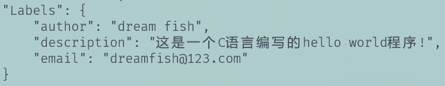
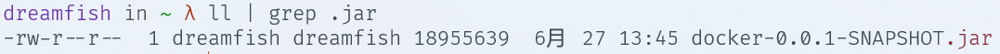
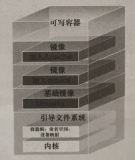
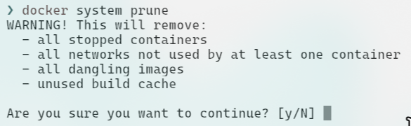

#### 1-简介

<br>

##### a-dockerfile简介

1.    `Dockerfile`是用于构建Docker镜像的脚本文件,由一系列指令构成。通过`docker build`命令构建镜像时，`Dockerfile`中的指令会由上到下依次执行,每条指令都将会构建出一个镜像。这就是镜像的分层。因此,指令越多,层次就越多,创建的镜像就越多,效率就越低。所以在定义`Dockerfile`时，能在一个指令完成的动作就不要分为两条。
1.    使用docker build构建docker镜像时，可以通过`-f`参数指定dockerfile的名称和位置。

​     

<br>

##### b-第一个dockerfile

1.   我们想创建一个镜像，其中能够使用C语言运行`hello world!`。

2. 首先在`ubuntu`宿主机运行命令下面命令安装gcc，用于编译C语言程序。此外还需要安装c的静态库。

   ```shell
   sudo apt update & suod apt install gcc # 安装gcc
   
   sudo apt-get install libc6-dev # 安装C语言静态库(ubuntu)
   yum install -y glibc-static  # 安装C语言静态库(centos7)
   sudo pacman -S glibc   # 安装C语言静态库(archlinux)
   ```

3.   我们创建一个文件夹`mkdir ~/dream_sea`存放C语言文件。然后使用`vim ~/dream_sea/hello.c`创建编辑C语言文件如下：

     ```c
     # include<stdio.h>
     void main(){
         printf("hello world!");    
     }
     ```

4.   运行`cd ~/dream_sea`进入文件夹，使用命令`gcc --static -o hello hello.c`编译hello.c文件，生成hello可执行文件。

5.   运行`~/dream_sea/hello`检查是否可执行。

6.   在当前目录(`~/dream_sea/`)使用命令`vim Dockerfile`创建并编辑Dockerfile文件(必须叫这个名)，声明`CMD、FROM、ADD`等后面均有空格：

     ```dockerfile
     # 继承空镜像
     FROM scratch
     # 添加hello可执行文件到容器/
     ADD hello /
     # 默认运行/hello命令
     CMD ["/hello"]  
     ```

7.   运行`docker build -t dream_sea:1.0 .`构建镜像：

     1.   `-t` 用于指定要生成的镜像的`<repository>`与`<tag>`。若省略` tag`，则默认为`latest`。
     2.   最后的点(`.`)是一个宿主机的URL路径，构建镜像时会从该路径中查找Dockerfile文件。同时该路径也是在Dockerfile中 ADD、COPY指令中若使用的是相对路径，那个相对路径就相对的这个路径。不过需要注意，即使 ADD、COPY 指令中使用绝对路径来指定源文件，该源文件所在路径也必须要在这个URL指定目录或子目录内，否则将无法找到该文件。

8.   运行`docker images`查看镜像，使用`docker run --name dream dream_sea `。

> 1. 一定要使用c语言静态库编译`hello.c`,不然无法运行。当然也可以将`scratch`空镜像换为瑞士军刀`busybox`,此时无需使用c语言静态库编译。如果你的`hello`文件不是静态链接的,它可能依赖于某些动态库。`busybox` 提供了一些基本的动态库,而 `scratch` 则完全没有这些库。如果你使用 `busybox`,这些库可能会被包含在内，从而使你的二进制文件能够正常运行。
> 2. <font color=red>`busybox`是一个集成了一百多个最常用 Linux 命令和工具（如 `cat`、`echo`、`grep`、`mount`、`telnet` 等)的精简工具箱，它只需要几MB的大小，很方便进行各种快速验证，被誉为"Linux 系统的瑞士军刀"。`BusyBox` 可运行于多款 `POSIX` 环境的操作系统中，后续将大量使用。</font>


#####  c-dockerfile命令

1.   关于`Dockerfile`的指令，需要注意以下几点：

     1.   指令是大小不敏感的，但惯例是写为全大写。
     2.   指令后至少会携带一个参数。
     3.   以`#`号开头的行表示该行注释。`#`出现在其他位置不作注释意味。

2.   `FROM`命令：

     1.   格式：`FROM <image>[:<tag>]`，其实完整使用格式为：

          ```dockerfile
          FROM [--platform=<platform>] <image> [AS <name>]
          FROM [--platform=<platform>] <image>[:<tag>] [AS <name>]
          FROM [--platform=<platform>] <image>[@<digest>] [AS <name>]
          ```

     2.   用于指定基础镜像，且<span style="color:red">必须是第一条指令</span>；若省略了`tag`，则默认为`latest`。

     3.   常用的就是`FROM scratch`。`scratch`镜像是一个空镜像，是所有镜像的Base Image(相当于面向对象编程中的 Object类)。scratch 镜像只能在`Dockerfile`中被继承，不能通过pull命令拉取，不能run，也没有tag。并且它也不会生成镜像中的文件系统层。在Docker 中，scratch是一个保留字，用户不能作为自己的镜像名称使用。

3.   `MAINTAINER`命令：

     1.   格式：`MAINTAINER <name>`
     2.   其参数填写的一般是维护者姓名和信箱(格式：`姓名 邮箱`)。不过，该指令官方已不建议使用，而是使用LABEL指令代替。

4.   `LABEL`命令：

     1.   格式：`LABEL <key>=<value> <key>=<value> ... `

     2.   该指令中可以以键值对的方式包含任意镜像的元数据信息，用于替代`MAINTAINER` 指令。通过`docker inspect 镜像 `可查看到`LABEL `与 `MAINTAINER `的内容。

     3.   具体示例如下：

          ```dockerfile
          FROM scratch                                                                                
          MAINTAINER "dreamfish dreamfish@123.com"
          LABEL description="这是一个hello world程序!" author="dream fish" email="dreamfish@123.com"
          ADD hello /
          CMD ["/hello"]
          ```

     4.   我们通过`docker inspect xxx`查看镜像的信息：<br>

5.   `ENV`命令:

     1.   格式1：`ENV <key> <value>`：可以设置单个变量。
     2.   格式2：`ENV <key1>=<value1> <key2>=<value2> ...`：可以设置多个变量，每个变量为一对`<key>=<value>`。
     3.   用于指定环境变量，这些环境变量，后续可以被`RUN`指令使用，容器运行起来之后，也可以在容器中获取这些环境变量。

6.   `WORKDIR`命令:

     1.   格式：`WORKDIR path`。
     2.   容器打开后默认进入的目录，一般在后续的`RUN、CMD、ENTRYPOINT、ADD `等指令中会引用该目录。可以设置多个`WORKDIR` 指令。后续 `WORKDIR` 指令若用的是相对路径，则会基于之前 `WORKDIR` 指令指定的路径。在使用 `docker run `运行容器时，可以通过`-w` 参数覆盖构建时所设置的工作目录。

7.   `RUN`命令：

     1.   格式1：`RUN <command>`，这里的`<command>`就是shell命令。`docker build `执行过程中，会使用shell运行指定

          的`command`。

     2.   格式2：`RUN ["EXECUTABLE","PARAM1","PARAM2", ...]`，在 `docker build` 执行过程中，会调用第一个参数`"EXECUTABLE"`指定的应用程序运行(可以是shell)，并使用后面第二、三等参数作为应用程序的运行参数。

8.   `CMD`命令：

     1.   格式1：`CMD ["EXECUTABLE","PARAM1","PARAM2", ...]`，在容器启动后，即在执行完 `docker run` 后会立即调用执行"EXECUTABLE"指定的可执行文件(可以是shell)，并使用后面第二、三等参数作为应用程序的运行参数。
     2.   格式2：`CMD command param1 param2, ...`，这里的command就是shell命令。在容器启动后会立即运行指定的shell命令。
     3.   格式3：`CMD ["PARAM1","PARAM2", ...]`，提供给 `ENTERYPOINT `的默认参数。

9.   `ENTRYPOINT`命令:

     1.   格式1：`ENTRYPOINT ["EXECUTABLE","PARAM1","PARAM2", ...]，`在容器启动过程中，即在执行 `docker run` 时，会调用执行`"EXECUTABLE"`指定的应用程序，并使用后面第二、三等参数作为应用程序的运行参数。
     2.   格式2：`ENTRYPOINT command param1 param2, ...`，这里的 `command `就是 `shell `命令。在容器启动过程中，即在执行 `docker run` 时，会运行指定的 `shell` 命令。

10.   `EXPOSE`命令：

      1.   格式：`EXPOSE <port> [<port>...]`
      2.   指定容器准备对外暴露的端口号，但该端口号并不会真正的对外暴露。若要真正暴露，则需要在执行 `docker run `命令时使用`-p`(当然`-P`也行)来指定说要真正暴露出的端口号。

11.   `ARG`命令：

      1.   格式：`ARG < varname >[=<default value>]`

      2.   定义一个变量，该变量将会使用于镜像构建运行时。若要定义多个变量，则需要定义多个ARG指令。

      3.   `ARG`定义的变量可以在`docker build`时使用配置选项`--build-arg key=value`来重写。

           ```dockerfile
           FROM ubuntu:22.04
           ARG name=fish
           RUN echo $name
           ```

           ```
           docker build -t myecho:1.0 .	#构建镜像
           docker run mycal:1.0 --build-arg name=dream # 运行并覆盖name变量。
           ```

12.   `ADD`命令：

      1.   格式1：`ADD <src> <dest>`
      2.   格式2：`ADD ["<src>", "<dest>"]` ，路径中存在空格时使用双引号引起来。
      3.   该指令将复制当前宿主机中指定文件 src 到容器中的指定目录 dest 中。src 可以是宿主机中的绝对路径，也可以时相对路径。但相对路径是相对于 `docker build` 命令所指定的路径的。<span style="color:red">src 指定的文件可以是一个压缩文件，压缩文件复制到容器后会自动解压为目录；src 也可以是一个 URL，此时的 ADD 指令相当于 wget 命令</span>；src 最好不要是目录，其会将该目录中所有内容复制到容器的指定目录中。dest 是一个绝对路径，其最后面的路径必须要加上斜杠，否则系统会将最后的目录名称当做是文件名的。

13.   `COPY`命令：

      1.   功能与`ADD`指令相同，只不过src不能是URL。若src为压缩文件，复制到容器后不会自动解压。

14.   `ONBUILD`命令：

      1.   格式：`ONBUILD [INSTRUCTION] `

      2.   该指令用于指定当前镜像的子镜像进行构建时要执行的指令(子镜像即构建镜像是`FROM`当前镜像)。

      3.   使用示例：

           ```dockerfile
           # my:latest
           FROM scratch
           ONBUILD RUN echo "I'm from ..."
           ```

           ```dockerfile
           FROM my:latest
           ```

           cd lllllllll

15.   `VOLUME`命令：

      1.   格式：`VOLUME ["dir1", "dir2", ...]`
      2.   在容器创建可以挂载的数据卷。


<br>

##### cmd与enterpypoint

1.   `CMD`中的命令可以在使用`docker run`中被覆盖，但是`ENTERPYPOINT`中的命令无法被覆盖。每个 `Dockerfile `中都

     只能有一个 `CMD/ENTERYPOINT` 指令，多个 `CMD/ENTERYPOINT` 指令只会执行最后一个。

2.   当然在介绍这些之前，需要说明在linux中`date`会输出当前时间信息，`cal`输出当前月份的日历，`cal -y`输出全年日历。

3.   我的是`wsl`安装的`ubuntu-22.04`没有，`sudo apt install ncal`安装。

4.   对于如下的`Dockerfile`使用`CMD`，我们的测试结果如下：

     ```dockerfile
     FROM ubuntu:22.04                                                                           
     RUN apt-get clean \
         && apt-get update \
         && apt-get install ncal
     CMD ["cal"]
     ```

     ```shell
     docker build -t mycal:1.0 .	#构建镜像
     docker run mycal:1.0 # 正常运行cal命令
     docker run mycal:1.0 date # 正常运行date命令
     docker run mycal:1.0 -y  # 报错
     ```

     ```dockerfile
     # 另一种Dockerfile写法(运行结果同上):
     FROM ubuntu:22.04                                                                           
     RUN apt-get clean \
         && apt-get update \
         && apt-get install ncal
     CMD ["/bin/bash","-c","cal"] 
     # 运行的是/bin/bash,-c和cal作为参数出现。
     ```

     ```dockerfile
     # 另一种Dockerfile写法(运行结果同上):
     FROM ubuntu:22.04                                                                           
     RUN apt-get clean \
         && apt-get update \
         && apt-get install ncal
     CMD cal 
     ```

5.   对于如下的`Dockerfile`使用`ENTRYPOINT`，我们的测试结果如下：

     ```dockerfile
     FROM ubuntu:22.04
     RUN apt-get clean \
     && apt-get update \
     && apt-get install ncal
     ENTRYPOINT ["cal"] 
     ```

     ```shell
     docker build -t mycal:2.0 .	#构建镜像
     docker run mycal:2.0 # 正常运行cal命令
     docker run mycal:2.0 date # 报错
     docker run mycal:2.0 -y  # 正常运行cal -y
     ```

     ```dockerfile
     # 另一种Dockerfile写法(docker run mycal:2.0 -y无法运行):
     FROM ubuntu:22.04
     RUN apt-get clean \
     && apt-get update \
     && apt-get install ncal
     ENTRYPOINT cal
     ```

     ```dockerfile
     # 另一种Dockerfile写法(docker run mycal:2.0 -y无法运行):
     FROM ubuntu:22.04
     RUN apt-get clean \
     && apt-get update \
     && apt-get install ncal
     ENTRYPOINT ["bash","-t","cal"]
     ```

6.   `Dockerfile`中的`[command]`或`["EXECUTABLE"]`如果是通过 `CMD `指定的，则该镜像的启动命令` docker run` 中是不能添加参数`[ARG]`的。因为 `Dockerfile` 中的 `CMD `是可以被命令中的`[COMMAND]`替代的。如果命令中的 IMAGE 后仍有内容，此时对于 `docker daemon` 来说，其首先认为是替代用的`[COMMAND]`，如果有两个或两个以上的内容，后面的内容才会认为是`[ARG]`。所以，添加的`-y `会报错，因为没有`-y` 这样的`[COMMAND]`。

7.   `Dockerfile `中的`[command]`或`["EXECUTABLE"]`如果是通过 `ENTRYPOINT `指定的，则该镜像的启动命令 `docker run` 中是可以添加参数`[ARG]`的(但是...)。因为 `Dockerfile `中的 `ENTRYPOINT `是不能被命令中的`[COMMAND]`替代的。如果命令中的 IMAGE 后仍有内容，此时对于 docker daemon来说，其只能是`[ARG]`。不过，`docker daemon` 对于 `ENTRYPOINT `指定的`[command]`与`["EXECUTABLE"]`的处理方式是不同的。<span style="color:red">如果是`[command]`指定的`shell`，`daemon`会直接运行，而不会与 `docker run`中的`[ARG]`进行拼接后运行；如果是`[“EXECUTABLE”]`指定的命令，`daemon`则会先与` docker run `中的`[ARG]`进行拼接，然后再运行拼接后的结果。</span>

8.   无论是 `CMD `还是 `ENTRYPOINT`，使用`["EXECUTABLE"]`方式的通用性会更强些。

9.   `CMD`和`ENTRYPOINT`联用：

     ```dockerfile
     FROM ubuntu:22.04
     
     # 作为参数
     CMD ["dreamfish"]  
     
     # 实际运行的命令
     ENTRYPOINT ["echo"]
     ```

 

<br>

##### add与copy

1.   `ADD`和`COPY`最大的区别就是`AND`可以自动解压`tar`文件按，但是`COPY`不行(此外ADD可以接一个url)。

2.   使用`tar -cvf sea.tar ~/dream`创建一个`tar`文件。

3.   创建`Dockerfile`文件：

     ```dockerfile
     FROM ubuntu:22.04
     RUN mkdir /boot/fish/
     ADD ./sea.tar /boot/fish/
     COPY ./sea.tar /boot/
     CMD ["/bin/bash"]  
     ```

4.   创建镜像，创建容器运行会发现`/boot/`下存在`sea.tar`文件，但是`/boot/fish`中的却是解压后的文件夹。

5.   如果`Dockerfile`如下：

     ```dockerfile
     # /boot文件夹选的不合适
     FROM ubuntu:22.04
     RUN mkdir /boot/fish/
     ADD ./sea.tar /boot/fish
     COPY ./sea.tar /boot
     CMD ["/bin/bash"]  
     
     # 你将看到(理论上，不考虑先后问题及其他因素)(由于缺失/,docker不认为是文件夹,而认为是重命名):
     # /boot/fish/  (解压出来的dream/被重命名为fish/)
     # /boot.bar		(sea.tar更名为boot.tar)
     ```
     


<br>


##### arg和env

1. `ARG`指令用于定义构建参数，它允许在构建映像时从外部传递参数。此后可以通过`docker build`命令的`--build-arg`参数传递值，而一旦镜像构建完成，`ARG` 的值不会被保留，也不会出现在运行容器的环境变量中。

   ```dockerfile
   ARG BASE_VERSION=3.10
   FROM python:${BASE_VERSION}
   ```

2. `ENV`指令用于定义环境变量。这些变量在容器运行时是可用的，并且可以在容器内部的任何进程中使用。

   ```dockerfile
   ENV APP_HOME=/usr/src/app
   WORKDIR $APP_HOME
   ```

   


<br>

##### d-构建指令

1.   `docker build -t repository:tag [-f dockerfile_path] path` ：按照`Dockerfile`中命令构建镜像。
     1.   `-t` 用于指定要生成的镜像的`<repository>`与`<tag>`。若省略` tag`，则默认为`latest`。
     2.   `-f`用于指定`Dockerfile`文件路径以及名称，可以使用相对路径(相对于`path`)。不提供该选项配置则默认在`path`路径下寻找`Dockerfile`名称的文件。
     3.   `path`是一个宿主机的URL路径(一般使用当前路径`.`)，构建镜像时会从该路径中查找`Dockerfile`文件。同时该路径也是在`Dockerfile`中 ADD、COPY指令中若使用的是相对路径，那个相对路径就相对的这个路径。不过需要注意，即使 ADD、COPY 指令中使用绝对路径来指定源文件，该源文件所在路径也必须要在这个URL指定目录或子目录内，否则将无法找到该文件。
     4.   `--build-arg key=value`，覆盖`Dockerfile`中使用`ARG`命令定义(`key`必须被定义)的变量的值。
2.   `docker tag old_xx:xx new_xx:xx`某镜像被指定为`latest `后，后期又出现了更新的版本需要被指定为 `latest`，那么原 `latest`镜像就应被重打`<tag>`标签，否则，当最新版被发布为 `latest `后，原镜像就会变为悬虚镜像。通过 `docker tag `命令可对镜像重打标签。所谓重打标签，<span style="color:red">实际是复制了一份原镜像</span>，并为新的镜像指定新的`<tag>`。当然，重新指定`<repository>`也是可以的。所以，新镜像的 `ImageID`、`Digest `都有原镜像的相同。
3.   悬虚镜像是一种无用镜像，其存在只能是浪费存储空间，所以一般都是要删除的。对于悬虚镜像的删除，除了可以通过 `docker rmi <imageID>`进行删除外，还有专门的删除命令` docker image prune`。该命令能够一次性删除本地全部的悬空镜像。不过有个前提，就是这些悬虚镜像不能是已经启动了容器的，无论容器是否是退出状态。当然，如果再加上`-a`选项，则会同时再将没有被任何容器使用的镜像也删除。另外，还有一个命令` docker system prune `也可以删除悬虚镜像。只不过，其不仅删除的是悬虚镜像，还有其它系统“无用”内容。在删除这个悬虚镜像之前，首先查看其是否启动了容器。如果启动了，则先将容器删除。


---


####  2-创建一个应用

1.   使用idea创建一个简单的springboot应用。使用maven打包为jar包。

     ```java
     @RestController
     public class HelloController {
         @RequestMapping("/hello")
         public String hello(){
             System.out.println("Hello Docker!"); // 打印到控制台
             return "Hello Docker!";
         }
     }
     ```

2.   将springboot项目的jar导入到ubuntu子系统中。

     <br>

3.   在linux子系统中创建一个myboot目录，并将jar包移动到该目录。

     ```shell
     mkdir ./myboot/
     mv ./docker-0.0.1-SNAPSHOT.jar  ./myboot/
     ```

4.   配置一下Dockerfile文件，如下：

     ```dockerfile
     FROM openjdk:17
     LABEL author="dreamfish" email="yxlumengyu@qq.com"
     COPY docker-0.0.1-SNAPSHOT.jar myboot.jar
     ENTRYPOINT ["java", "-jar", "myboot.jar"]
     EXPOSE 8080   
     # 默认端口号
     ```

5.   使用`docker build -t myboot:1.0 .`构建镜像。并且使用`docker run --name boot -dp 8888:8080 myboot:1.0`运行。

6.   这时就可以在`localhost:8888/hello`访问到了。此外还可以使用`docker exec -it boot /bin/bash`查看内部文件结构。


---


#### 3-build cache

##### a-分析容器构建过程

1.   如图存在以下的一个Dockerfile，其内容如下。我们来分析一下它的镜像构建过程。

     ```dockerfile
     FROM ubuntu:latest
     LABEL name="dream fish"
     COPY log.txt /var/log/
     RUN apt update && apt install -y vim                                                              
     CMD /bin/bash
     ```

2.   先回忆一下：每个镜像层由镜像文件系统和镜像json文件构成。且`docker history`可以查看指定镜像的分层。承担cdcd

3.   `FROM` 指令是 `Dockerfile `中唯一不可缺少的指令，它为最终构建出的镜像设定了一个基础镜像(Base Image)。该语句并不会产生新的镜像层，它是使用指定的镜像作为基础镜像层的。`docker build` 命令解析 `Dockerfile` 的 `FROM` 指令时，可以立即获悉在哪一个镜像基础上完成下一条指令镜像层构建。对于本例，`Docker Daemon` 首先从 `ubuntu:latest` 镜像的文件系统获取到该镜像的` ID`，然后再根据镜像` ID` 提取出该镜像的 `json` 文件内容，以备下一条指令镜像层构建时使用。

4.   `LABEL `指令仅修改上一步中提取出的镜像 `json `文件内容，在 `json `中添加 `LABEL name="dream fish"`，无需更新镜像文件系统。但也会生成一个新的镜像层，只不过该镜像层中只记录了 `json `文件内容的修改变化，没有文件系统的变化。如果该指令就是最后一条指令，那么此时形成的镜像的文件系统其实就是原来 `FROM `后指定镜像的文件系统，只是 `json `文件发生了变化。但由于 `json `文件内容发生了变化，所以产生了新的镜像层。

5.   `COPY `指令会将宿主机中的指定文件复制到容器中的指定目录，所以会改变该镜像层文件系统大小，并生成新的镜像层文件系统内容。所以 `json `文件中的镜像 `ID `也就发生了变化，产生了新的镜像层。

6.   `RUN `指令本身并不会改变镜像层文件系统大小，但由于其 `RUN `的命令是 `apt install`，而该命令运行的结果是下载并安装一个工具，所以导致 `RUN `命令最终也改变了镜像层文件系统大小，所以也就生成了新的镜像层文件系统内容。所以 `json `文件中的镜像ID也就发生了变化，产生了新的镜像层。

7.   对于 `CMD `或 `ENTRYPOINT `指令，其是不会改变镜像层文件系统大小的，因为其不会在`docker build` 过程中执行。所以该条指令没有改变镜像层文件系统大小。但对于 `CMD `或 `ENTRYPOINT `指令，由于其是将来容器启动后要执行的命令，所以会将该条指令写入到 `json `文件中，会引发 `json `文件的变化。所以 json 文件中的镜像 ID 也就发生了变化，产生了新的镜像层。

>   关于父镜像、基础镜像：
>
>   1.   父镜像(parent image)是指在`dockerfile`中用`FROM`指令指定的镜像，它是构建当前镜像的基础。所有后续的命令都是基于父镜像进行的。一个镜像可以有多个父镜像，形成一个镜像层级结构。
>   2.   基础镜像(base image)是指没有父镜像的镜像，它是使用`FROM scratch`指令创建的。它是最底层的镜像，没有任何依赖。一般来说，操作系统镜像都是基础镜像，比如`ubuntu`、`centos`、`alpine`等。
>   3.   Docker 镜像的构建过程，大量应用了镜像间的父子关系。即下层镜像是作为上层镜像的父镜像出现，下层镜像是作为上层镜像的输入出现；上层镜像是在下层镜像的基础之上变化而来。
>   4.   一个镜像可以放到另一个镜像的顶部。位于下面的镜像称为父镜像(parent image)，可以依次类推，直到镜像栈的最底部，最底部的镜像称为基础镜像(base image)。例如：$ubuntu->cmacs->apache$<br>


##### b-build cache

1. Docker Daemnon 通过 `Dockerfile `构建镜像时，当发现即将新构建出的镜像(层)与本地已存在的某镜像(层)重复时，默认会复用已存在镜像(层)而不是重新构建新的镜像(层)，这种机制称为 `docker build cache` 机制。该机制不仅加快了镜像的构建过程，同时也大量节省了Docker 宿主机的空间。docker build cache 并不是占用内存的 cache，而是一种对磁盘中相应镜像层的检索、复用机制。所以，无论是关闭 Docker 引擎，还是重启 Docker 宿主机，只要该镜像(层)存在于本地，那么就会复用。

2. 这种机制是一种本地磁盘镜像层的检索复用技术，用于加快镜像的构建过程，节省 docker 宿主机的磁盘空间。

3. 关于build cache：

   1.   `Dockerfile `文件中某个指令内容发生变化：从发生变化的这个指令层开始的所有镜像层 cache 全部失效。即从该指令行开始的镜像层将构建出新的镜像层，而不再使用 build cache，即使后面的指令并未发生变化。因为镜像关系本质上是一种树状关系，只要其上层节点变了，那么该发生变化节点的所有下层节点也就全部变化了。
   2.    `ADD `或 `COPY`指令内容变化：`Dockerfile `文件内容没有变化，但ADD或COPY指令所复制的文件内容发生了变化，同样会使从该指令镜像层开始的后面所有镜像层的 build cache 失效。
   3.    `RUN`指令外部依赖变化：与` ADD/COPY` 指令相似。`Dockerfile `文件内容没有变化，但RUN命令的外部依赖发生了变化，例如本例中要安装的 `vim `软件源发生了变更(版本变化、下载地址变化等)，那么从发生变化的这个指令层开始的所有镜像层 cache 全部失效。

4. 不使用`build cache`构建镜像：有些时候为了确保在镜像构建过程中使用到新的数据，在镜像构建 `docker build` 时，通过`--no-cache `选项指定不使用 build cache。例如：

   ```bash
   docker build --no-cache -t sea:latest .
   ```

5. 清理dangling build cache，即悬虚build cache，指的是无法使用的build cache。一般为悬虚镜像 dangling image 所产生的 build cache。通过` docker system prune` 命令可以清除。我们不妨通过下面这张图看一看该命令具体会干啥:<br>

6. 一般镜像层缓存失效是从某一层开始，此后所有的镜像缓存全部失效。


