#### 1-数据持久化

##### a-存在问题

在容器层的UnionFS(联合文件系统)中对文件/目录的任何修改，无论是手工修改还是容器在运行过程中的修改，在该容器丢失或被删除后这些修改将全部丢失。即这些修改是无法保存下来的。若要保存下来这些修改，通常有两种方式：

1.   定制镜像持久化：将这个修改过的容器生成一个新的镜像，让这些修改变为只读的镜像。
2.   数据卷持久化：将这些修改通过数据卷同步到宿主机
     1.   数据卷
     2.   Bind mounts(绑定挂载)
     3.   tmpfs(临时文件系统)


##### b-定制镜像持久化

1.   所谓定制镜像持久化就是将容器提交为镜像。

2.   这里通过`tomcat:8.5.89`为例，前面已经提到过这个版本的tomcat的欢迎页文件在`webapps.dist`目录中而不是`webapps`中。我们通过以下命令:

     ```bash
     docker pull tomcat:8.5.89  #安装tomcat镜像
     
     docker run --name tomcat -dp 8080:8080 tomcat:8.5.89  # 创建并且运行tomcat容器
     
     docker exec -it tomcat /bin/bash  # 运行/bin/bash进入文件目录
     
     rm -rf webapps/
     mv webapps.dist webapps
     
     docker commit -a "dreamfish<www.dreamfish.cc>" -m "webapps edit" tomcat mytomcat:1.0  #提交为镜像
     ```

3.   此后我们可以直接使用当前这个新建的镜像`mytomcat:1.0`。


##### c-数据卷

1.   数据卷是<span style="color:red">宿主机中的一个特殊的文件/目录</span>，这个文件/目录与容器中的另一个文件/目录进行了直接关联，在任何一端对文件/目录的写操作，在另一端都会同时发生相应变化。在宿主中的这个文件/目录就称为数据卷，而容器中的这个关联文件/目录则称为该数据卷在该容器中的挂载点。数据卷的设计目的就是为了实现数据持久化，其完全独立于容器的生命周期，属于宿主机文件系统，但不属于 UnionFS。因此，容器被删除时，不会删除其挂载的数据卷。
2.   数据卷具有如下明显特性：
     1.   数据卷在容器启动时初始化，如果容器启动后容器本身已经包含了数据，那么，这些数据会在容器启动后直接出现在数据卷中，反之亦然(数据卷中的数据也会出现在容器中)。
     2.   可以对数据卷或挂载点中的内容直接修改，修改后对方立即可看到。
     3.   数据卷会一直存在，即使挂载数据卷的容器已经被删除。
     4.   数据卷可以在容器之间共享和重用。
3.   数据卷的原理：通过linux的硬链接实现的。


##### d-创建读写数据卷

1.   读写数据卷指的是容器对挂载点具有读写权限(而数据卷对挂载点始终可读可写)。
2.   数据卷是在使用 docker run 启动容器时指定的，其语法格式为：`docker run –it –v /宿主机目录绝对路径:/容器内目录绝对路径 镜像`。无论是宿主机中的数据卷还是容器中的挂载点，如果指定的目录不存在，那么 docker引擎都会自动创建。即使是多级目录不存在。
3.   举例如下：
     1.   我们通过`docker run --name myubuntu -it -v /root/host_mount:/opt/ub_mount ubuntu:latest`运行一个ubuntu镜像。
     2.   这时通过另一个新建终端访问主机，发现创建了`/boot/host_mount`目录。
     3.   同样的在ubuntu容器中也创建了`/opt/ub_mount`目录。
     4.   这时候在宿主机创建文件`/root/host_mount/hello.txt`。ubuntu镜像容器中也会出现`/opt/ub_mount/hello.txt`。并且修改这个文件内容主机中对应文件也会修改。
     5.   我们通过`docker inspect myubuntu`查看容器文件发现：<br>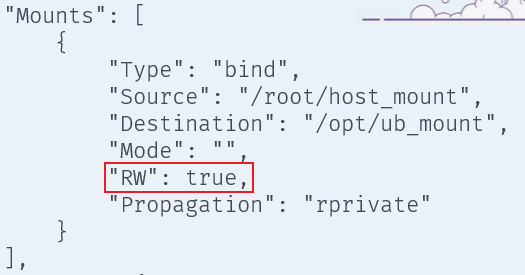
     6.   此外，当我们停止ubuntu容器后，操作数据卷。此后启动容器，挂载点中对应数据也会变化。
4.   实际上`docker volume create <volume_name>`也可以创建数据卷。但是此时数据卷的位置是不知道的，你可以通过`docker volume inspect <volume_name>`的位置，此后就可以使用数据卷名称挂载到容器上，例如`docker run --name myubuntu -it -v <volume_name>:/opt/ub_mount ubuntu:latest`。


##### e-创建只读数据卷

1.   只读数据卷，指的是容器对挂载点的操作权限是只读的。宿主机对数据卷的操作权限始终是读写的。有些情况下，为了防止容器在运行过程中对文件产生修改，就需要创建只读数据卷。
2.   该命令仅比之前的命令仅多了`:ro`，具体语法如下：`docker run –it –v /宿主机目录绝对路径:/容器内目录绝对路径:ro 镜像`。
3.   举例如下：
     1.   我们通过`docker run --name myubuntu -it -v /root/host_mount:/opt/ub_mount:ro ubuntu:latest`运行一个ubuntu镜像。
     2.   这时通过另一个新建终端访问主机，发现创建了`/boot/host_mount`目录。
     3.   同样的在ubuntu容器中也创建了`/opt/ub_mount`目录。
     4.   这时候在宿主机创建文件`/root/host_mount/hello.txt`。ubuntu镜像容器中也会出现`/opt/ub_mount/hello.txt`。
     5.   但是在容器中修改时，会报错`Read-only file system`。
     6.   我们通过`docker inspect myubuntu`查看容器文件发现：<br>


##### f-数据卷共享

1.   当一个容器与另一个容器使用相同的数据卷时，就称这两个容器实现了“数据卷共享”。这时候你是不是想到了一个实现方式，对了，就是把一个数据卷挂载到多个容器的挂载点。

2.   数据卷容器是实现数据卷共享的一种非常有效的方案。当一个容器C启动运行时创建并挂载了数据卷，若其它容器也需要共享该容器C挂载的数据卷，这些容器只需在docker run 启动时通过`--volumes-from[容器 C] `选项即可实现数据卷共享。此时容器 C 就称为数据卷容器。

3.   <span style="color:red">一般来说，共享数据卷不向外提供服务</span>，仅作为数据容器使用(不作为应用容器)。

4.   下面举例说明(在e创建只读数据卷的基础上)：这时centos容器中也存在`/opt/ub_mount/log.txt`。

     ```bash
      docker pull centos:7
      docker run --name centos -it --volumes-from myubuntu centos:7 #通过myubuntu共享数据卷
     ```


##### g-Dockerfile持久化

1.   `VOLUME `指令可以在容器中创建可以挂载数据卷的挂载点。其参数可以是字符串数组，也可以是使用空格隔开的多个纯字符串。例如：`VOLUME ["/var/www", "/etc/apache"] `或`VOLUME /var/www /etc/apache`。

2. 我们可以在Dokcerfile中使用`VOLUME`指令指定挂载点。例如下面的：

   ```dockerfile
   FROM centos:7                                                                                2 
   LABEL name="dream fish" email="yxlumengyu@qq.com"
   VOLUME /opt/cen_mount /opt/ub_mount
   COPY hello.log /var/log/
   RUN yum install -y vim
   CMD /bin/bash
   ```

3.   在`VOLUME`指令中指定的都是挂载点，而不是数据卷。那么与挂载点对应的数据卷在哪儿？使用`docker inspect 容器`即可。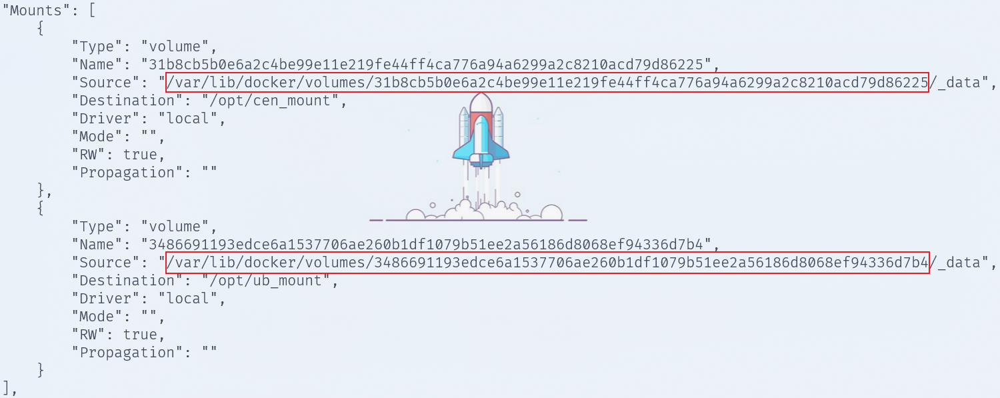

4.   其实观察上述图片可以知道`Dockerfile`中持久化，数据卷默认在`/var/lib/docker/volumes/mount_name/_data`中。

5.   对于已经使用`Dockerfile`中配置类持久化后，同样可以使用`docker build -v /xxx/xxx:/xxx/xxx`追加数据卷。


> 对于`busybox`,一直跳到的瑞士军刀，存在两种运行方式：注意busybox的bash是/bin/sh
>
> 1. 死机式(哈哈)：`docker run --name busy -d busybox /bin/sh -c "while true;do sleep 3600;done"`然后通过` docker exec -it busy /bin/sh`进入。 
> 2. 正常式：`docker run --name busy -it busybox`

#### 2-docker网络

##### a-前置知识

1. 网桥主要用于在同一网络中的多个局域网（LAN）之间传输数据。它工作在数据链路层（OSI模型的第2层），根据MAC地址进行数据的转发。网桥通常用于扩展网络或将两个相对较小的局域网连接在一起，它能减少网络冲突域，但不会隔离广播域。
2. 路由器用于连接不同的网络，并且根据网络层的IP地址来转发数据包。它工作在网络层（OSI模型的第3层），通过选择最佳路径将数据包从一个网络传送到另一个网络。路由器通常用于连接不同的网络，如家庭局域网和互联网，能够隔离广播域，并能够跨多个网络转发数据。
3. linux网络：待补。


##### b-network namespace

1. Network Namespace 是 Linux 内核提供的用于实现网络虚拟化的重要功能，它能创建多个隔离的网络空间，每个独立的网络空间内的防火墙、网卡、路由表、邻居表、协议栈都是独立的。不管是虚拟机还是容器，当运行在独立的命名空间时，就像是一台单独的主机一样。Docker 网络的底层原理是 Linux 的 Network Namespace，所以对于 Linux Network Namespace 的理解对 Docker 网络底层原理的理解非常重要。下面我们不妨实现一下下面的功能: <br>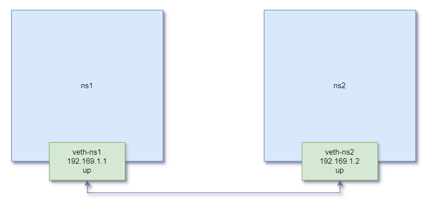

2. 我们通过`ip netns add <namespace>`(删除:`ip netns delete <namespace>`)创建 ns1 和 ns2 两个命名空间(`ip netns`命令创建的 network namespace 会出现在 /var/run/netns/ 目录下)。可以通过`ip netns list`查看所以创建的network namespace。

   ```bash
   ❯ sudo ip netns add ns1
   
   ❯ sudo ip netns add ns2
   
   ❯ sudo ip netns list
   ```

3. 对于每个 network namespace 来说，它会有自己独立的网卡、路由表、ARP 表、iptables 等和网络相关的资源。ip 命令提供了`ip netns exec <namespace> <shell>`子命令可以在对应的 network namespace 中执行命令。例如我们执行``

4. 有了不同 network namespace 之后，也就有了网络的隔离，但是如果它们之间没有办法通信，也没有实际用处。要把两个网络连接起来，linux 提供了 veth pair(虚拟以太网对) 。可以把 veth pair 当做是双向的管道，从一个方向发送的网络数据，可以直接被另外一端接收到；或者也可以想象成两个 namespace 直接通过一个特殊的虚拟网卡连接起来，可以直接通信。veth pair 无法单独存在，删除其中一个，另一个也会自动消失。

5. 而gpt对虚拟以太对的描述是:`veth pair` 的两个接口之间是点对点的传输链路，一个接口的输入会被直接转发到配对的另一个接口。典型的用法是将其中一个接口放入某个 Network Namespace 中，另一个接口留在主机的默认命名空间中，从而实现主机和命名空间之间的通信。

6. 此时，我们可以通过`ip link add type veth`创建一对 veth pair(通过 `ip link` 查看)，当然创建 veth pair 的时候可以自己指定它们的名字，比如 `ip link add veth-ns1 type veth peer name veth-ns2` 创建出来的两个虚拟网络接口的名字就是 veth-ns1 和 veth-ns2 。

   ```bash
   ❯ sudo ip link add veth-ns1 type veth peer name veth-ns2
   
   ❯ sudo ip link
   ...
   10: veth-ns2@veth-ns1: <BROADCAST,MULTICAST,M-DOWN> mtu 1500 qdisc noop state DOWN mode DEFAULT group default qlen 1000
       link/ether 02:fb:48:38:bd:3c brd ff:ff:ff:ff:ff:ff
   11: veth-ns1@veth-ns2: <BROADCAST,MULTICAST,M-DOWN> mtu 1500 qdisc noop state DOWN mode DEFAULT group default qlen 1000
       link/ether ca:1a:10:ec:44:aa brd ff:ff:ff:ff:ff:ff
   ```

7. 要做的是把这对 veth pair 分别放到已经两个 namespace 里面，这个可以使用 `ip link set <接口名> netns <namespace>` 来实现。然后可以通过`ip netns exec <namespace> ip a`查看，就可以发现虚拟网络接口。

   ```bash
   ❯ sudo ip link set veth-ns1 netns ns1
   
   ❯ sudo ip link set veth-ns2 netns ns2
   
   ❯ sudo ip netns exec ns1 ip a
   1: lo: <LOOPBACK> mtu 65536 qdisc noop state DOWN group default qlen 1000
       link/loopback 00:00:00:00:00:00 brd 00:00:00:00:00:00
   11: veth-ns1@if10: <BROADCAST,MULTICAST> mtu 1500 qdisc noop state DOWN group default qlen 1000
       link/ether ca:1a:10:ec:44:aa brd ff:ff:ff:ff:ff:ff link-netns ns2
   
   ❯ sudo ip netns exec ns2 ip a
   1: lo: <LOOPBACK> mtu 65536 qdisc noop state DOWN group default qlen 1000
       link/loopback 00:00:00:00:00:00 brd 00:00:00:00:00:00
   10: veth-ns2@if11: <BROADCAST,MULTICAST> mtu 1500 qdisc noop state DOWN group default qlen 1000
       link/ether 02:fb:48:38:bd:3c brd ff:ff:ff:ff:ff:ff link-netns ns1
   ```

8. 接下来我们需要给这对 veth pair 配置上 ip 地址(`ip addr add <IP地址>/<子网掩码> dev <接口名>`)，并启用它们(`ip link set dev <接口名> up`)。

   ```bash
   # 分配ip
   ❯ sudo ip netns exec ns1 ip addr add 192.168.1.1/24 dev veth-ns1
   
   ❯ sudo ip netns exec ns2 ip addr add 192.168.1.2/24 dev veth-ns2
   
   # 启用虚拟网络接口
   ❯ sudo ip netns exec ns1 ip link set dev veth-ns1 up
   
   ❯ sudo ip netns exec ns2 ip link set dev veth-ns2 up
   ```

9. 此时可以通过在两个命名空间中执行 ping 命令来与对方进行连通性测试了。<br>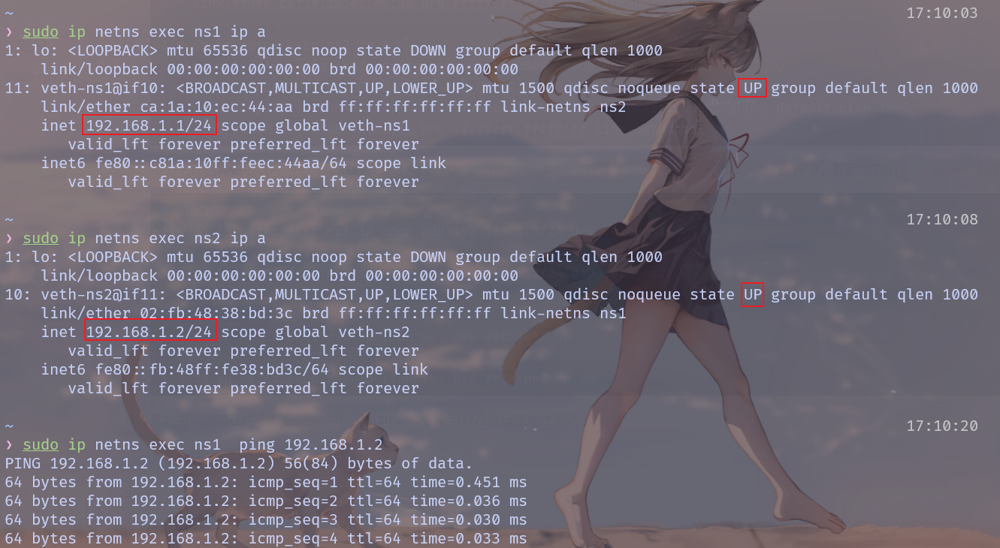

   10. veth pair 可以实现两个 network namespace 之间的通信，但是当多个 namespace 需要通信的时候，就有点麻烦。多个网络设备通信，我们想到的交换机和路由器。因为这里要考虑的只是同个网络，所以只用到交换机的功能。<br>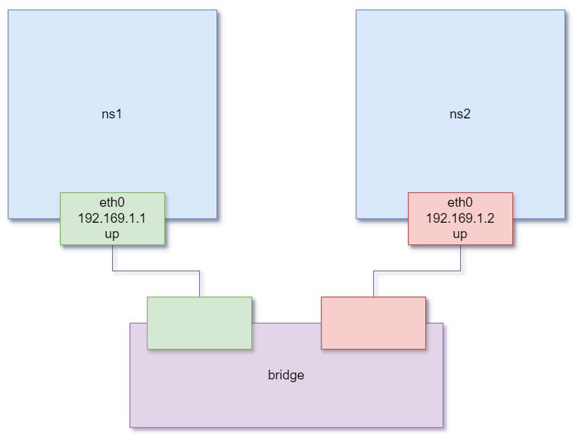

   11. 我们使用`ip link add <bridge_name> type bridge`创建交换机并启用它`ip link set dev <bridge_name> up`。

       ```bash
       ❯ sudo ip link add bridge_0 type bridge
       
       ❯ sudo ip link set dev  bridge_0 up
       ```

   12. 删除之前的虚拟网络接口和network namespace：

       ```bash
       ❯  sudo ip link delete veth-ns1
       
       ❯  sudo ip netns delete ns1
       
       ❯  sudo ip netns delete ns2
       ```

   13. 接下来就是创建两个namespace 和一对  veth pair ，并将其中一个虚拟网络接口连接在 bridge_0 上。

       ```bash
       ❯ sudo ip netns add ns1
       
       ❯ sudo ip link add type veth   # 创建一对虚拟网络接口
       
       ❯ sudo ip link	 # 查看虚拟网络接口名称
       ...
       13: veth0@veth1: <BROADCAST,MULTICAST,M-DOWN> mtu 1500 qdisc noop state DOWN mode DEFAULT group default qlen 1000
           link/ether ca:21:87:5e:29:51 brd ff:ff:ff:ff:ff:ff
       14: veth1@veth0: <BROADCAST,MULTICAST,M-DOWN> mtu 1500 qdisc noop state DOWN mode DEFAULT group default qlen 1000
           link/ether 66:e1:c7:bc:76:34 brd ff:ff:ff:ff:ff:ff
       
       # ns1
       ❯ sudo ip link set veth1 netns ns1  # veth1虚拟接口分配给ns1命名空间
       ❯ sudo ip netns exec ns1 ip link set dev veth1 name eth0 # 将虚拟接口veth1改名为eth0
       ❯ sudo ip netns exec ns1 ip addr add 192.168.1.1/24 dev eth0  # 分配ip
       ❯ sudo ip netns exec ns1 ip link set dev eth0 up  # 启用
       
       
       # bridge_0
       ❯ sudo ip link set veth0 master  bridge_0  # veth0虚拟接口分配给bridge_0
       ❯ sudo ip link set dev veth0 up  # 开启
       ```

       ```bash
       ❯ sudo ip netns add ns2
       ❯ sudo ip link add type veth   # 创建一对虚拟网络接口
       
       ❯ sudo ip link	 # 查看虚拟网络接口名称(注意前面的序号15、16)
       ...
       15: veth1@veth2: <BROADCAST,MULTICAST,M-DOWN> mtu 1500 qdisc noop state DOWN mode DEFAULT group default qlen 1000
           link/ether 66:e1:c7:bc:76:34 brd ff:ff:ff:ff:ff:ff
       16: veth2@veth1: <BROADCAST,MULTICAST,M-DOWN> mtu 1500 qdisc noop state DOWN mode DEFAULT group default qlen 1000
           link/ether f6:c3:81:85:8e:19 brd ff:ff:ff:ff:ff:ff
       
       # ns1
       ❯ sudo ip link set veth2 netns ns2  # veth2虚拟接口分配给ns2命名空间
       ❯ sudo ip netns exec ns2 ip link set dev veth2 name eth0 # 将虚拟接口veth1改名为eth0
       ❯ sudo ip netns exec ns2 ip addr add 192.168.1.2/24 dev eth0  # 分配ip
       ❯ sudo ip netns exec ns2 ip link set dev eth0 up  # 启用
       
       
       # bridge_0
       ❯ sudo ip link set veth1 master  bridge_0  # veth1虚拟接口分配给bridge_0
       ❯ sudo ip link set dev veth1 up  # 开启
       ```

   14. `bridge link`命令来查看 bridge 管理的 link 信息。

   15. 一个专门用于网桥控制管理的命令 brctl。由于该命令默认在 Linux 中没有安装，所以需要首先安装一个网桥的工具包 bridge-utils。但是archlinux似乎已经预装了。可以使用 `brctl show` 命令可以查看本机当前所有网桥及其连接情况。
   
   16. 然后就是测试连接`sudo ip netns exec ns1 ping 192.168.1.2 `,但是这里出了一些问题(没有连接上)，目前猜测可能和wsl的一些默认网络规则配置有关(尚未解决，但是既然docker可以使用，那就应该是可以解决的，~~尝试使用docker0网桥代替自建网桥bridge_0试试(不建议乱试)~~)，待补。


##### c-docker网络

1. <font color=red>首先需要强调一点，在 Docker 容器中，localhost(127.0.0.1)指的是容器本身，即容器内部的回环地址。这一点从上面linux 的 networknamespace 不难看出，每一个network namespace 存在一个默认的回环地址。</font>

2. Docker主要采用的架构由三部分组成：CNM、Libnetwork 和Driver。

3. CNM(Container Network Model)，容器网络模型，其是一种网络连接的解决方案，是一种设计规范、设计标准，其规定了 Docker 网络的基础组成要素。CNM 中定义了三个基本要素：沙盒 Sandbox，终端 Endpoint 与网络 Network。

   1. 沙盒：一个独立的网络栈，其中包括以太网接口、端口号、路由表、DNS 配置等。Linux Network Namespace 是沙盒的标准实现。
   2. 终端：虚拟网络接口，主要负责创建连接，即将沙盒连接到网络上。一个终端只能接入某一个网络。
   3. 网络：802.1d 网桥的软件实现，是需要交互的终端的集合。<br>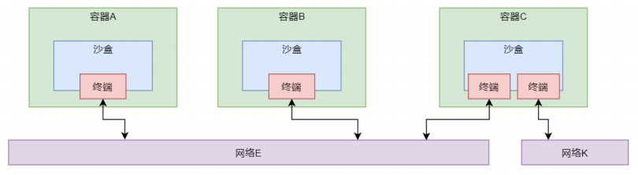

4. CNM 是设计规范，而 Libnetwork 是开源的、由 Go 语言编写的、跨平台的 CNM 的标准实现。Libnetwork 除了实现了 CNM 的三个组件，还实现了本地服务发现、容器负载均衡，以及网络控制层与管理层功能。

5. Driver:每种不同的网络类型都有对应的不同的底层 Driver，这些 Driver 负责在主机上真正实现需要的网络功能，例如创建 veth pair 设备等。不过，无论哪种网络类型，其工作方式都是类似的。通过调用 Docker 引擎的 API 发出请求，然后由 Libnetwork 做出框架性的处理，然后将请求转发给相应的 Driver。<br>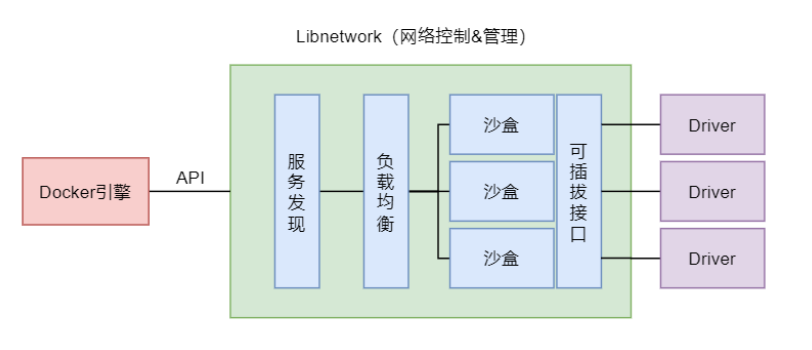

6. 通过 `docker network ls` 命令可以查看当前主机所连接的网络及网络类型。

   ```bash
   ❯ docker network ls
   NETWORK ID     NAME      DRIVER    SCOPE
   25a7c56f9aa8   bridge    bridge    local
   1cb8a87d95bb   host      host      local
   ea8050c786a8   none      null      local
   ```

7. docker网络一些成分：

   1. 网络驱动（Network Drivers）： Docker 提供了几种不同的网络驱动，以适应不同的用例和需求。网络驱动决定了容器如何相互连接以及如何与外部网络进行通信。
   2. 网络命名空间（Network Namespace）： 每个 Docker 容器都有一个独立的网络命名空间，提供了网络隔离。在命名空间中，容器具有自己的网络接口、IP 地址、路由表等。
   3. 虚拟网络接口（veth pairs）： Docker 使用虚拟网络接口来连接容器和主机或其他容器。这些接口以成对的方式工作，其中一个接口在容器内，另一个接口在主机或网络桥接中。
   4. 桥接网络（Bridge Networks）： 默认情况下，Docker 使用桥接网络，允许容器通过虚拟网络接口进行通信。容器可以通过桥接网络与同一 Docker 主机上的其他容器通信。


##### docker网络命令

| 命令                                         | 参数                                                      | 功能             |
| -------------------------------------------- | --------------------------------------------------------- | ---------------- |
| `docker network create`                      | -d 选项用于指定要创建网络时所使用的驱动，即创建的网络类型 | 创建网络         |
| `docker network connect`                     |                                                           | 连接网络         |
| `docker network disconnect`                  |                                                           | 断开网络         |
| `docker network ls`(`docker network list`)   |                                                           | 列出网络         |
| `docker network prune`                       |                                                           | 删除不使用的网络 |
| `docker network inspect`                     |                                                           | 查看网络详情     |
| `docker network rm`(`docker network remove`) |                                                           | 删除若干个网络   |

1. 创建连接指定网络的容器：`docker run --name busybox_0  --network bridge_0 -it busybox`

2. 创建定向连接容器(在默认的 bridge 网络上实现通过容器名进行的连接,但是是单向的)：`docker run --name busybox_3 --link busybox_1 -d busybox`

3. 在创建容器时可以指定其与某已经存在的容器共享 Network Namespace，但要求该已经存在的容器采用的是 bridge 网络模式:`docker run --name busybox_5 --network container:busybox_1 -d busybox `。实际上此时查看容器 busybox_5 的详情，可以发现，其没有自身的网络设置。因为其共享的 busybox_5 容器的

   网络设置(甚至在 busybox_1 和 busybox_5 中执行`ip a`得到相同结果)。

   ```bash
   ❯ docker inspect busybox_5
   [
       {
       	...
           "NetworkSettings": {
               "Bridge": "",
               "SandboxID": "",
               "SandboxKey": "",
               "Ports": {},
               "HairpinMode": false,
               "LinkLocalIPv6Address": "",
               "LinkLocalIPv6PrefixLen": 0,
               "SecondaryIPAddresses": null,
               "SecondaryIPv6Addresses": null,
               "EndpointID": "",
               "Gateway": "",
               "GlobalIPv6Address": "",
               "GlobalIPv6PrefixLen": 0,
               "IPAddress": "",
               "IPPrefixLen": 0,
               "IPv6Gateway": "",
               "MacAddress": "",
               "Networks": {}
           }
       }
   ]
   ```

4. 

​	

##### bridge模式

1. bridge 网络，也称为单机桥接网络，是 Docker 默认的网络模式。该网络模式只能存在于单个 Docker 主机上，其只能用于连接所在 Docker 主机上的容器。

2. bridge 网络模式中具有一个默认的虚拟网桥 docker0，通过 `ip a` 或 `ifconfig `命令都可查看到。<br>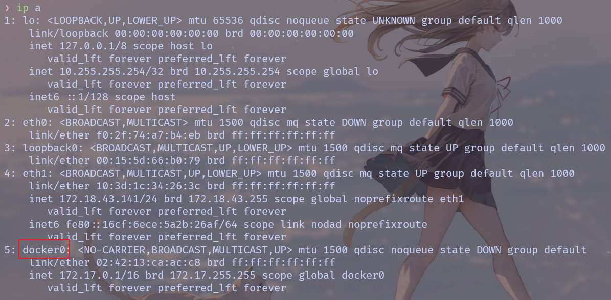

3. 通过 `docker network ls` 命令可以查看当前主机所连接的网络及网络类型,此外通过 `docker network inspect bridge`也可以查看到网络名称为 bridge 的网络的详情(这里我们还未运行任何容器，故Containers字段为空):

   ```bash
   ❯ docker network ls
   NETWORK ID     NAME      DRIVER    SCOPE
   25a7c56f9aa8   bridge    bridge    local
   1cb8a87d95bb   host      host      local
   ea8050c786a8   none      null      local
   
   ❯ docker network inspect bridge
   [
       {
           "Name": "bridge",
           "Id": "25a7c56f9aa812bf38135fc0ffe49e608b741da68f1d76d25881e39b5d3859ac",
           "Created": "2024-10-11T18:15:37.805867402+08:00",
           "Scope": "local",
           "Driver": "bridge",
           "EnableIPv6": false,
           "IPAM": {
               "Driver": "default",
               "Options": null,
               "Config": [
                   {
                       "Subnet": "172.17.0.0/16",
                       "Gateway": "172.17.0.1"
                   }
               ]
           },
           "Internal": false,
           "Attachable": false,
           "Ingress": false,
           "ConfigFrom": {
               "Network": ""
           },
           "ConfigOnly": false,
           "Containers": {},
           "Options": {
               "com.docker.network.bridge.default_bridge": "true",
               "com.docker.network.bridge.enable_icc": "true",
               "com.docker.network.bridge.enable_ip_masquerade": "true",
               "com.docker.network.bridge.host_binding_ipv4": "0.0.0.0",
               "com.docker.network.bridge.name": "docker0",
               "com.docker.network.driver.mtu": "1500"
           },
           "Labels": {}
       }
   ]
   ```

4. 在 Linux 主机上，Docker 的 bridge 网络由 Bridge 驱动创建，其在创建时会创建一个默认的网桥 docker0。容器与网桥间是通过 veth pair 技术实现的连接，网桥与外网间是通过”网络地址转换 NAT 技术”实现的连接，即将通信的数据包中的内网地址转换为外网地址。<br>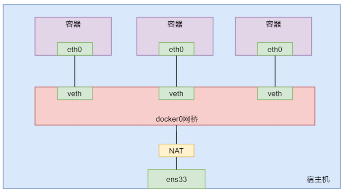

5. 此时我们运行一个 busybox 容器，再次通过`docker network inspect`查看网络信息,可以发现 Containers 字段存在容器信息：

   ```bash
   ❯ docker run --name busybox_0 -it busybox:latest
   / # %(ctrl +p +q)                                                                                                        
   
   ❯ docker network inspect bridge
   [
       {
           "Name": "bridge",
           "Id": "25a7c56f9aa812bf38135fc0ffe49e608b741da68f1d76d25881e39b5d3859ac",
           "Created": "2024-10-11T18:15:37.805867402+08:00",
           "Scope": "local",
           "Driver": "bridge",
           "EnableIPv6": false,
           "IPAM": {
               "Driver": "default",
               "Options": null,
               "Config": [
                   {
                       "Subnet": "172.17.0.0/16",
                       "Gateway": "172.17.0.1"
                   }
               ]
           },
           "Internal": false,
           "Attachable": false,
           "Ingress": false,
           "ConfigFrom": {
               "Network": ""
           },
           "ConfigOnly": false,
           "Containers": {
               "833d89df7e4d5248b2d51e96d72c9c27152963d9eb958a23ddf07e658d3d78c4": {
                   "Name": "busybox_0",
                   "EndpointID": "d1cf3404f46d86fae0794f08d560bc6ea94ff1a6582cf1f7e3062b9555f892b9",
                   "MacAddress": "02:42:ac:11:00:02",
                   "IPv4Address": "172.17.0.2/16",
                   "IPv6Address": ""
               }
           },
           "Options": {
               "com.docker.network.bridge.default_bridge": "true",
               "com.docker.network.bridge.enable_icc": "true",
               "com.docker.network.bridge.enable_ip_masquerade": "true",
               "com.docker.network.bridge.host_binding_ipv4": "0.0.0.0",
               "com.docker.network.bridge.name": "docker0",
               "com.docker.network.driver.mtu": "1500"
           },
           "Labels": {}
       }
   ]
   ```

6. 此时在宿主机上运行`ip a`发现多了一个`veth`开头的虚拟接口，通过`bridge link`命令可以知道这个接口是在 docker0中。同样的进入 busybox 容器中运行`ip a`也存在一个`eth0`。这二者正好是一对 veth pair ，这和我们之前使用linux模拟的效果是一致的。

   ```bash
   ❯ ip a
   ...
   7: veth09a5f65@if6: <BROADCAST,MULTICAST,UP,LOWER_UP> mtu 1500 qdisc noqueue master docker0 state UP group default
       link/ether 0a:9f:fc:ad:74:9d brd ff:ff:ff:ff:ff:ff link-netnsid 0
     
   ❯ bridge link
   7: veth09a5f65@if6: <BROADCAST,MULTICAST,UP,LOWER_UP> mtu 1500 master docker0 state forwarding priority 32 cost 2
   
   
   ❯ docker exec busybox_0 ip a
   1: lo: <LOOPBACK,UP,LOWER_UP> mtu 65536 qdisc noqueue qlen 1000
       link/loopback 00:00:00:00:00:00 brd 00:00:00:00:00:00
       inet 127.0.0.1/8 scope host lo
          valid_lft forever preferred_lft forever
       inet6 ::1/128 scope host
          valid_lft forever preferred_lft forever
   6: eth0@if7: <BROADCAST,MULTICAST,UP,LOWER_UP,M-DOWN> mtu 1500 qdisc noqueue
       link/ether 02:42:ac:11:00:02 brd ff:ff:ff:ff:ff:ff
       inet 172.17.0.2/16 brd 172.17.255.255 scope global eth0
          valid_lft forever preferred_lft forever
   ```

7. 这时我们可以使用`docekr inspect busybox_0`查看该容器的一些信息,很显然可以看到网关( Gateway )和 ip 地址( IPAddress )：

   ```bash
   ❯ docker inspect busybox_0
   [
       {
       	...
           "NetworkSettings": {
               "Bridge": "",
               "SandboxID": "839a9bdee59d30a36cc0fbad5b6b5ff3ddf8521b6ef2a022da7c26948e4f77f0",
               "SandboxKey": "/var/run/docker/netns/839a9bdee59d",
               "Ports": {},
               "HairpinMode": false,
               "LinkLocalIPv6Address": "",
               "LinkLocalIPv6PrefixLen": 0,
               "SecondaryIPAddresses": null,
               "SecondaryIPv6Addresses": null,
               "EndpointID": "d1cf3404f46d86fae0794f08d560bc6ea94ff1a6582cf1f7e3062b9555f892b9",
               "Gateway": "172.17.0.1",
               "GlobalIPv6Address": "",
               "GlobalIPv6PrefixLen": 0,
               "IPAddress": "172.17.0.2",
               "IPPrefixLen": 16,
               "IPv6Gateway": "",
               "MacAddress": "02:42:ac:11:00:02",
               "Networks": {
                   "bridge": {
                       "IPAMConfig": null,
                       "Links": null,
                       "Aliases": null,
                       "MacAddress": "02:42:ac:11:00:02",
                       "DriverOpts": null,
                       "NetworkID": "25a7c56f9aa812bf38135fc0ffe49e608b741da68f1d76d25881e39b5d3859ac",
                       "EndpointID": "d1cf3404f46d86fae0794f08d560bc6ea94ff1a6582cf1f7e3062b9555f892b9",
                       "Gateway": "172.17.0.1",
                       "IPAddress": "172.17.0.2",
                       "IPPrefixLen": 16,
                       "IPv6Gateway": "",
                       "GlobalIPv6Address": "",
                       "GlobalIPv6PrefixLen": 0,
                       "DNSNames": null
                   }
               }
           }
       }
   ]
   ```

   

   

##### 网络创建

1. 我们不妨尝试完成下面这样一个网络结构:<br>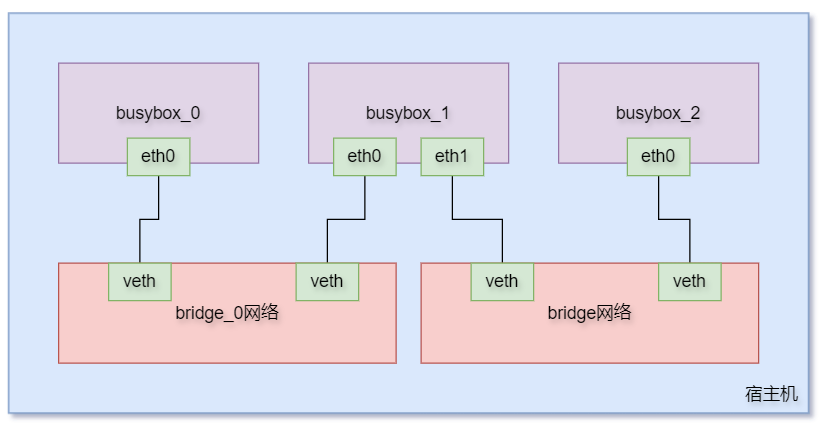

2. ` docker network create -d bridge bridge_0`: 创建一个名为 bridge_0 且类型为 bridge 的 docker 网络。

3. 通过 `docker network ls` 可查看到新创建的网络。

4. 使用 `brctl show` 命令就可以看到我们创建的网桥 br-xxx 。

   ```bash
   ❯ brctl show
   bridge name     bridge id               STP enabled     interfaces
   br-03f0c94c4f75         8000.02423f393768       no
   docker0         8000.024213caacc8       no              veth09a5f65
   ```

5. 接下来我们创建一个busybox容器，连接到这个网络 bridge_0 。此时我们就可以通过 `docker network inspect bridge_0` 查看网络里的容器：

   ```bash
   ❯ docker run --name busybox_0  --network bridge_0 -d busybox /bin/sh -c "while true;do sleep 3600;done"
   
   ❯ docker network inspect bridge_0
   [
       {
           "Name": "bridge_0",
           "Id": "03f0c94c4f757773d34082c721fb9ca1d659105397f99e88debfe8ec9f37940c",
           "Created": "2024-10-11T19:29:43.74033+08:00",
           "Scope": "local",
           "Driver": "bridge",
           "EnableIPv6": false,
           "IPAM": {
               "Driver": "default",
               "Options": {},
               "Config": [
                   {
                       "Subnet": "172.19.0.0/16",
                       "Gateway": "172.19.0.1"
                   }
               ]
           },
           "Internal": false,
           "Attachable": false,
           "Ingress": false,
           "ConfigFrom": {
               "Network": ""
           },
           "ConfigOnly": false,
           "Containers": {
               "460cc4d255ea61ccd3799623debb1eb5de85e8565d6ca9f380c3ee84847a7e50": {
                   "Name": "busybox_0",
                   "EndpointID": "6fabb888873c1e921f754048f64207ea51e49893dedca2479232989399d77627",
                   "MacAddress": "02:42:ac:13:00:02",
                   "IPv4Address": "172.19.0.2/16",
                   "IPv6Address": ""
               }
           },
           "Options": {},
           "Labels": {}
       }
   ]
   ```

6. 此时我们不用看也知道宿主机 `ip a` 会多出一个虚拟接口，并且通过 `bridge link` 知道这个新增的虚拟接口归属 bridge_0。当然使用 `brctl show` 命令也可以看到一些新的信息。

7. 接下来们仿照上述方式创建两个 busybox 容器，但是二中都是使用默认的网络，即 bridge 。

   ```bash
   ❯ docker run --name busybox_1 -d busybox /bin/sh -c "while true;do sleep 3600;done"
   e266587c7bd25bcd63e42e60e2526a74b26011dfb402b234e42243c0cfa815be
   
   ❯ docker run --name busybox_2 -d busybox /bin/sh -c "while true;do sleep 3600;done"
   ec9b9503faf5b297a272c9f5eba15b1fec9ac5a611a2167bff69e77a11161e7b
   ```

8. 也就是说此时 busybox_1 和 busybox_2属于 bridge ， 而 busybox_0 属于 bridge_0。此时我们让 busybox_1 连接到 bridge_0 上。即运行 `docker network connect bridge_0 busybox_1`。此时我们实际上就完成了上述目标。

9. 此时我们使用 `docker inspect busybox_1` 就会发现其 存在两个网桥信息，也就存在两个网关和 ip 地址：

   ```bash
   ❯ docker inspect busybox_1
   [
       {		
       		...
               "Networks": {
                   "bridge": {
                       "IPAMConfig": null,
                       "Links": null,
                       "Aliases": null,
                       "MacAddress": "02:42:ac:11:00:02",
                       "DriverOpts": null,
                       "NetworkID": "25a7c56f9aa812bf38135fc0ffe49e608b741da68f1d76d25881e39b5d3859ac",
                       "EndpointID": "661187e24e3b011b08b6c60e367c8bd1eba9aa97154091a59283c1196ad18905",
                       "Gateway": "172.17.0.1",
                       "IPAddress": "172.17.0.2",
                       "IPPrefixLen": 16,
                       "IPv6Gateway": "",
                       "GlobalIPv6Address": "",
                       "GlobalIPv6PrefixLen": 0,
                       "DNSNames": null
                   },
                   "bridge_0": {
                       "IPAMConfig": {},
                       "Links": null,
                       "Aliases": [],
                       "MacAddress": "02:42:ac:13:00:03",
                       "DriverOpts": {},
                       "NetworkID": "03f0c94c4f757773d34082c721fb9ca1d659105397f99e88debfe8ec9f37940c",
                       "EndpointID": "1114572bc9fd64162553b55f1fb165ec8db4192ce4bc8c0f556c1ceee5fd95da",
                       "Gateway": "172.19.0.1",
                       "IPAddress": "172.19.0.3",
                       "IPPrefixLen": 16,
                       "IPv6Gateway": "",
                       "GlobalIPv6Address": "",
                       "GlobalIPv6PrefixLen": 0,
                       "DNSNames": [
                           "busybox_1",
                           "e266587c7bd2"
                       ]
                   }
               }
           }
       }
   ]
   ```

10. 这时候 busybox_0 和 busy_1之间， busybix_1 和 busybox_2之间可以相互 ping 。但是显然 busybox_0 和 busybox_2无法相互访问。当然了 busybox_1 可以 ping 自己的两个 ip 。

11. 除了可以直接 ping 通指定的 IP 外，还可以直接去 ping 对方的容器名称。该方式在生产中非常重要。因为生产中容器的 IP 可能会发生变化，但容器名称一般是不会变的。如果某服务总是直接通过 IP 与容器相连接，那么一旦容器 IP 变化，则该服务将连接不上容器。但如果是通过容器名称相连接的，那么无论容器 IP 如何变化，都将不影响服务与容器的连接。<font color=red>但是实际上这种 ping 容器名的方式，默认只对于自定义网络生效。</font>

    ```bash
    ❯ docker exec busybox_1  ping busybox_0
    PING busybox_0 (172.19.0.2): 56 data bytes
    64 bytes from 172.19.0.2: seq=0 ttl=64 time=0.525 ms
    64 bytes from 172.19.0.2: seq=1 ttl=64 time=0.077 ms
    64 bytes from 172.19.0.2: seq=2 ttl=64 time=0.087 ms
    ^Ccontext canceled
    
    ❯ docker exec busybox_1  ping busybox_2
    ping: bad address 'busybox_2'
    ```

12. 对于自定义的 bridge 网络，其具有一个特性：该网络上的容器可以通过容器名互 ping。但默认的 bridge 网络是不行的。如果在默认的 bridge 网络上实现通过容器名进行的连接，则需要创建容器时通过 `--link` 选项指定(<font color=red>但是这种定向连接是单向的。</font>):

    ```bash
    ❯ docker run --name busybox_3 --link busybox_1 -d busybox /bin/sh -c "while true;do sleep 3600;done"
    5dcac2567d64d074b1cb05064e7dcf15560c1d83b4bd9f689990accdfb6932b6
    
    ❯ docker exec busybox_3  ping busybox_1
    PING busybox_1 (172.17.0.2): 56 data bytes
    64 bytes from 172.17.0.2: seq=0 ttl=64 time=0.325 ms
    64 bytes from 172.17.0.2: seq=1 ttl=64 time=0.107 ms
    64 bytes from 172.17.0.2: seq=2 ttl=64 time=0.115 ms
    ^Ccontext canceled
    
    ❯ docker exec busybox_1  ping busybox_3
    ping: bad address 'busybox_3'
    ```


##### host模式

1. host 网络，即与宿主机 host 共用一个 Network Namespace。该网络类型的容器没有独立的网络空间，没有独立的 IP，全部与 host 共用。

2. 我们通过`--network host`创建一个指定网络类型为 host 的容器: `docker run --name busybox_6 --network host -d busybox /bin/sh -c "while true;do sleep 3600;done"`。

3. 通过 `docker network inspect host` 命令查看网络详情，发现容器 busybox_6 连接在该网络上，但容器 busybox_6 却没有 IP、MAC，并且该网络模式中居然没有网关 Gateway。因为该网络模式实际相当于没有网络，容器与宿主机共用 Network Namespace，根本就不需要网络连接。

   ```bash
   ❯ docker network inspect host
   [
       {
           "Name": "host",
           "Id": "1cb8a87d95bb0d31f8b7bf15e4c82149439b474ab127232996cb855f41742537",
           "Created": "2024-10-06T17:45:20.105527793+08:00",
           "Scope": "local",
           "Driver": "host",
           "EnableIPv6": false,
           "IPAM": {
               "Driver": "default",
               "Options": null,
               "Config": null
           },
           "Internal": false,
           "Attachable": false,
           "Ingress": false,
           "ConfigFrom": {
               "Network": ""
           },
           "ConfigOnly": false,
           "Containers": {
               "0b4ab542348c8e1e2b433682b952ffdb183c0a78173ac036c1cec565cab65bcb": {
                   "Name": "busybox_6",
                   "EndpointID": "7e6ed4f09b2c0325f46e5e741e4f4bacf921dd3a5a2cecd45f56b26cd1cb7d9d",
                   "MacAddress": "",
                   "IPv4Address": "",
                   "IPv6Address": ""
               }
           },
           "Options": {},
           "Labels": {}
       }
   ]
   ```

4. 通过 `ip a` 与 `docker exec busybox_6 ip a` 命令分别查看宿主机与容器 bb6 的网络接口，发现是一样的。因为它们共用一个 Network Namespace，所以也就共用了所有网络接口。

5. <font color=red>使用 host 网络，由于容器与宿主机共用一个 Network Namespace，所以无论是 IP 还是应用程序的 Port，容器与宿主机的都是相同的，所以对于容器中应用程序的 Port 不存在映射的问题，host 中的 Port 与容器中的 Port 相同。</font>

6. 在启动时指定的端口映射不会起作用，若是非要设置映射，系统会给出 WARNING 信息：当使用 host 网络模式时，已发布的端口号被丢弃。<br>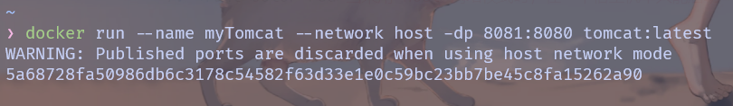

7. <font color=red>当采用 host 网络模式时，在一个宿主机中只能启动一个应用的一个容器，否则会出现端口号冲突问题。</font>

   


##### none模式

1. none 网络，即没有网络。容器仍是一个独立的 Network Namespace，但没有网络接口，没有 IP。

2. 我们通过`--network none`创建一个指定网络类型为 none 的容器，查看容器信息就可以发现 `docker inspect busybox_7` ,其网络信息中网关和 ip 地址为空。

   ```bash
   ❯ docker run --name busybox_7 --network none -d busybox /bin/sh -c "while true;do sleep 3600;done"
   
   ❯ docker inspect busybox_7
   [
       {
       		...
               "Networks": {
                   "none": {
                       "IPAMConfig": null,
                       "Links": null,
                       "Aliases": null,
                       "MacAddress": "",
                       "DriverOpts": null,
                       "NetworkID": "ea8050c786a864753d0652516d45e9c5d3851be334a345080590c407ed936ec7",
                       "EndpointID": "14ad0835190fa830f618aff486a18294b14684d6c1f4ae3e1e7a32113f2f500b",
                       "Gateway": "",
                       "IPAddress": "",
                       "IPPrefixLen": 0,
                       "IPv6Gateway": "",
                       "GlobalIPv6Address": "",
                       "GlobalIPv6PrefixLen": 0,
                       "DNSNames": null
                   }
               }
           }
       }
   ]
   ```

3. 运行 `ip a` 也找不到除路径回环之外的其他虚拟接口：

   ```bash
   ❯ docker exec busybox_7 ip a
   1: lo: <LOOPBACK,UP,LOWER_UP> mtu 65536 qdisc noqueue qlen 1000
       link/loopback 00:00:00:00:00:00 brd 00:00:00:00:00:00
       inet 127.0.0.1/8 scope host lo
          valid_lft forever preferred_lft forever
       inet6 ::1/128 scope host
          valid_lft forever preferred_lft forever
   ```

   

<font color=white>2024.10.11 二面挂了，有点难受，打算回南方了，离家近点。</font >

