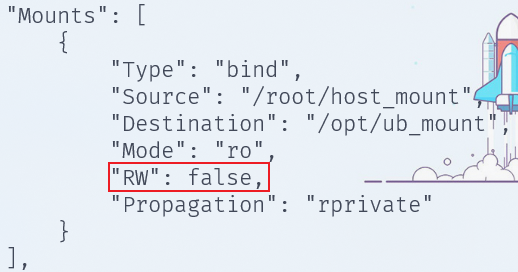

#### 1-数据持久化

##### a-存在问题

在容器层的UnionFS(联合文件系统)中对文件/目录的任何修改，无论是手工修改还是容器在运行过程中的修改，在该容器丢失或被删除后这些修改将全部丢失。即这些修改是无法保存下来的。若要保存下来这些修改，通常有两种方式：

1.   定制镜像持久化：将这个修改过的容器生成一个新的镜像，让这些修改变为只读的镜像。
2.   数据卷持久化：将这些修改通过数据卷同步到宿主机
     1.   数据卷
     2.   Bind mounts(绑定挂载)
     3.   tmpfs(临时文件系统)


##### b-定制镜像持久化

1.   所谓定制镜像持久化就是将容器提交为镜像。

2.   这里通过`tomcat:8.5.89`为例，前面已经提到过这个版本的tomcat的欢迎页文件在`webapps.dist`目录中而不是`webapps`中。我们通过以下命令:

     ```bash
     docker pull tomcat:8.5.89  #安装tomcat镜像
     
     docker run --name tomcat -dp 8080:8080 tomcat:8.5.89  # 创建并且运行tomcat容器
     
     docker exec -it tomcat /bin/bash  # 运行/bin/bash进入文件目录
     
     rm -rf webapps/
     mv webapps.dist webapps
     
     docker commit -a "dreamfish<www.dreamfish.cc>" -m "webapps edit" tomcat mytomcat:1.0  #提交为镜像
     ```

3.   此后我们可以直接使用当前这个新建的镜像`mytomcat:1.0`。


##### c-数据卷

1.   数据卷是<span style="color:red">宿主机中的一个特殊的文件/目录</span>，这个文件/目录与容器中的另一个文件/目录进行了直接关联，在任何一端对文件/目录的写操作，在另一端都会同时发生相应变化。在宿主中的这个文件/目录就称为数据卷，而容器中的这个关联文件/目录则称为该数据卷在该容器中的挂载点。数据卷的设计目的就是为了实现数据持久化，其完全独立于容器的生命周期，属于宿主机文件系统，但不属于 UnionFS。因此，容器被删除时，不会删除其挂载的数据卷。
2.   数据卷具有如下明显特性：
     1.   数据卷在容器启动时初始化，如果容器启动后容器本身已经包含了数据，那么，这些数据会在容器启动后直接出现在数据卷中，反之亦然(数据卷中的数据也会出现在容器中)。
     2.   可以对数据卷或挂载点中的内容直接修改，修改后对方立即可看到。
     3.   数据卷会一直存在，即使挂载数据卷的容器已经被删除。
     4.   数据卷可以在容器之间共享和重用。
3.   数据卷的原理：通过linux的硬链接实现的。


##### d-创建读写数据卷

1.   读写数据卷指的是容器对挂载点具有读写权限(而数据卷对挂载点始终可读可写)。
2.   数据卷是在使用 docker run 启动容器时指定的，其语法格式为：`docker run –it –v /宿主机目录绝对路径:/容器内目录绝对路径 镜像`。无论是宿主机中的数据卷还是容器中的挂载点，如果指定的目录不存在，那么 docker引擎都会自动创建。即使是多级目录不存在。
3.   举例如下：
     1.   我们通过`docker run --name myubuntu -it -v /root/host_mount:/opt/ub_mount ubuntu:latest`运行一个ubuntu镜像。
     2.   这时通过另一个新建终端访问主机，发现创建了`/boot/host_mount`目录。
     3.   同样的在ubuntu容器中也创建了`/opt/ub_mount`目录。
     4.   这时候在宿主机创建文件`/root/host_mount/hello.txt`。ubuntu镜像容器中也会出现`/opt/ub_mount/hello.txt`。并且修改这个文件内容主机中对应文件也会修改。
     5.   我们通过`docker inspect myubuntu`查看容器文件发现：<br>
     6.   此外，当我们停止ubuntu容器后，操作数据卷。此后启动容器，挂载点中对应数据也会变化。


##### e-创建只读数据卷

1.   只读数据卷，指的是容器对挂载点的操作权限是只读的。宿主机对数据卷的操作权限始终是读写的。有些情况下，为了防止容器在运行过程中对文件产生修改，就需要创建只读数据卷。
2.   该命令仅比之前的命令仅多了`:ro`，具体语法如下：`docker run –it –v /宿主机目录绝对路径:/容器内目录绝对路径:ro 镜像`。
3.   举例如下：
     1.   我们通过`docker run --name myubuntu -it -v /root/host_mount:/opt/ub_mount:ro ubuntu:latest`运行一个ubuntu镜像。
     2.   这时通过另一个新建终端访问主机，发现创建了`/boot/host_mount`目录。
     3.   同样的在ubuntu容器中也创建了`/opt/ub_mount`目录。
     4.   这时候在宿主机创建文件`/root/host_mount/hello.txt`。ubuntu镜像容器中也会出现`/opt/ub_mount/hello.txt`。
     5.   但是在容器中修改时，会报错`Read-only file system`。
     6.   我们通过`docker inspect myubuntu`查看容器文件发现：<br>


##### f-数据卷共享

1.   当一个容器与另一个容器使用相同的数据卷时，就称这两个容器实现了“数据卷共享”。这时候你是不是想到了一个实现方式，对了，就是把一个数据卷挂载到多个容器的挂载点。

2.   数据卷容器是实现数据卷共享的一种非常有效的方案。当一个容器C启动运行时创建并挂载了数据卷，若其它容器也需要共享该容器C挂载的数据卷，这些容器只需在docker run 启动时通过`--volumes-from[容器 C] `选项即可实现数据卷共享。此时容器 C 就称为数据卷容器。

3.   <span style="color:red">一般来说，共享数据卷不向外提供服务</span>，仅作为数据容器使用(不作为应用容器)。

4.   下面举例说明(在e创建只读数据卷的基础上)：这时centos容器中也存在`/opt/ub_mount/log.txt`。

     ```bash
      docker pull centos:7
      docker run --name centos -it --volumes-from myubuntu centos:7 #通过myubuntu共享数据卷
     ```

     

##### g-Dockerfile持久化

1.   `VOLUME `指令可以在容器中创建可以挂载数据卷的挂载点。其参数可以是字符串数组，也可以是使用空格隔开的多个纯字符串。例如：`VOLUME ["/var/www", "/etc/apache"] `或`VOLUME /var/www /etc/apache`。

2. 我们可以在Dokcerfile中使用`VOLUME`指令指定挂载点。例如下面的：

   ```dockerfile
   FROM centos:7                                                                                2 
   LABEL name="dream fish" email="yxlumengyu@qq.com"
   VOLUME /opt/cen_mount /opt/ub_mount
   COPY hello.log /var/log/
   RUN yum install -y vim
   CMD /bin/bash
   ```

3.   在`VOLUME`指令中指定的都是挂载点，而不是数据卷。那么与挂载点对应的数据卷在哪儿？使用`docker inspect 容器`即可。

4.   其实观察上述图片可以知道`Dockerfile`中持久化，数据卷默认在`/var/lib/docker/volumes/mount_name/_data`中。

5.   对于已经使用`Dockerfile`中配置类持久化后，同样可以使用`docker build -v /xxx/xxx:/xxx/xxx`追加数据卷。


> 对于`busybox`,一直跳到的瑞士军刀，存在两种运行方式：注意busybox的bash是/bin/sh
>
> 1. 死机式(哈哈)：`docker run --name busy -d busybox /bin/sh -c "while true;do sleep 3600;done"`然后通过` docker exec -it busy /bin/sh`进入。 
> 2. `docker run --name busy -it busybox`

#### 2-docker网络