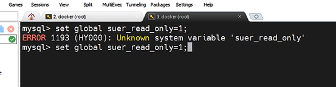

#### mysql

##### mysql容器配置

1. `docker pull mysql` 拉取最新版的 mysql 镜像( 9.0.1 )。

2. 参考官方[文档](https://hub.docker.com/_/mysql)启动容器`docker run --name <container_name> -e MYSQL_ROOT_PASSWORD=<password> -d mysql:<tag>`，其中 `-e MYSQL_ROOT_PASSWORD`指定运行时的环境变量 MYSQL_ROOT_PASSWORD ，即 root 用户的密码。当然通过文档也可以知道还可以在创建容器时新增用户，即通过环境变量`-e MYSQL_USER=<user_name> \ -e MYSQL_PASSWORD=<user_password>`。

3. 然后就可以通过`docker exec -it <container_name> /bin/bash`进入容器中，并且使用 `mysql -uroot -p`使用密码登录。

4. 对于 mysql 镜像而言，其中存在以下几个重要位置：

   1. 数据文件位置：`/var/lib/mysql`。

      ```bash
      bash-5.1# ls -l /var/lib/mysql
      total 112528
      -rw-r----- 1 mysql mysql  6291456 Oct 12 10:47 '#ib_16384_0.dblwr'
      -rw-r----- 1 mysql mysql 14680064 Oct 12 10:45 '#ib_16384_1.dblwr'
      drwxr-x--- 2 mysql mysql     4096 Oct 12 10:45 '#innodb_redo'
      drwxr-x--- 2 mysql mysql     4096 Oct 12 10:45 '#innodb_temp'
      -rw-r----- 1 mysql mysql       56 Oct 12 10:45  auto.cnf
      -rw-r----- 1 mysql mysql  2943051 Oct 12 10:45  binlog.000001
      -rw-r----- 1 mysql mysql      158 Oct 12 10:45  binlog.000002
      -rw-r----- 1 mysql mysql       32 Oct 12 10:45  binlog.index
      -rw------- 1 mysql mysql     1705 Oct 12 10:45  ca-key.pem
      -rw-r--r-- 1 mysql mysql     1108 Oct 12 10:45  ca.pem
      -rw-r--r-- 1 mysql mysql     1108 Oct 12 10:45  client-cert.pem
      -rw------- 1 mysql mysql     1705 Oct 12 10:45  client-key.pem
      -rw-r----- 1 mysql mysql     5642 Oct 12 10:45  ib_buffer_pool
      -rw-r----- 1 mysql mysql 12582912 Oct 12 10:45  ibdata1
      -rw-r----- 1 mysql mysql 12582912 Oct 12 10:45  ibtmp1
      drwxr-x--- 2 mysql mysql     4096 Oct 12 10:45  mysql
      -rw-r----- 1 mysql mysql 32505856 Oct 12 10:45  mysql.ibd
      lrwxrwxrwx 1 mysql mysql       27 Oct 12 10:45  mysql.sock -> /var/run/mysqld/mysqld.sock
      -rw-r----- 1 mysql mysql      131 Oct 12 10:45  mysql_upgrade_history
      drwxr-x--- 2 mysql mysql     4096 Oct 12 10:45  performance_schema
      -rw------- 1 mysql mysql     1705 Oct 12 10:45  private_key.pem
      -rw-r--r-- 1 mysql mysql      452 Oct 12 10:45  public_key.pem
      -rw-r--r-- 1 mysql mysql     1108 Oct 12 10:45  server-cert.pem
      -rw------- 1 mysql mysql     1705 Oct 12 10:45  server-key.pem
      drwxr-x--- 2 mysql mysql     4096 Oct 12 10:45  sys
      -rw-r----- 1 mysql mysql 16777216 Oct 12 10:47  undo_001
      -rw-r----- 1 mysql mysql 16777216 Oct 12 10:47  undo_002
      
      bash-5.1# ls -l /var/lib/mysql/sys
      total 112
      -rw-r----- 1 mysql mysql 114688 Oct 12 10:45 sys_config.ibd
      ```

   2. 日志文件位置：`/var/log/mysql`。

   3. 配置文件位置：`/etc/mysql/`(使用较多的还是 `/etc/mysql/conf.d` 目录)。

5. 实际上，对于上述运行的容器，我们通过 `show variables like 'char%';` 查询，发现其字符编码并不全是我们期望的 utf8 或 utf8mb4 。

   ```bash
   mysql> show variables like 'char%';
   +--------------------------+--------------------------------+
   | Variable_name            | Value                          |
   +--------------------------+--------------------------------+
   | character_set_client     | latin1                         |
   | character_set_connection | latin1                         |
   | character_set_database   | utf8mb4                        |
   | character_set_filesystem | binary                         |
   | character_set_results    | latin1                         |
   | character_set_server     | utf8mb4                        |
   | character_set_system     | utf8mb3                        |
   | character_sets_dir       | /usr/share/mysql-9.0/charsets/ |
   +--------------------------+--------------------------------+
   8 rows in set (0.04 sec)
   ```

6. 此外，如果容器被不小心删除了，那么无论是数据文件、日志文件，还是设置字符编码的 my.cnf 文件，都将消失。在生产中，这是绝对不允许的，所以要保证数据的安全性。

> 关于 utf8 和 utf8mb4 :
>
> 1. utf8 和 utf8mb4 是两种字符集编码方式，它们之间的区别在于能够存储的字符范围和最大字节长度。
> 2.  utf8 是 MySQL 中最常用的字符集编码方式，它使用1到3个字节来存储字符。 utf8 能够存储大部分的中文汉字，但对于一些特殊的字符，如表情符号、一些较新的 Unicode 字符等， utf8 无法存储。
> 3. 而 utf8mb4 是 utf8 的超集，它使用1到4个字节来存储字符。 utf8mb4 可以存储任何 Unicode 字符，包括表情符号和一些较新的字符。因此，当需要存储这些特殊字符时，需要使用 utf8mb4 编码。
> 4. 在 MySQL 8.0 及更高版本中，utf8mb4 已成为默认字符集。对于新项目，特别是需要存储表情符号或其他特殊字符的项目，应该使用 utf8mb4 编码。需要注意的是，使用 utf8mb4 编码会占用更多的存储空间，因为它使用的字节长度更长。因此，在选择字符集编码时，需要根据实际需求和存储空间的考虑来决定使用 utf8 还是 utf8mb4 。


##### 补充

1. `general_log` (通用查询日志)是 MySQL 中的一种日志类型，用于记录所有发送到 MySQL 服务器的SQL查询(不论是否执行成功)。它可以帮助你调试和监控系统，跟踪数据库收到的每一个请求。在开发中可能用得上，记录一下。

2. 查看是否开启和开启：

   ```bash
   mysql> SHOW VARIABLES LIKE "general_log%";
   +------------------+---------------------------------+
   | Variable_name    | Value                           |
   +------------------+---------------------------------+
   | general_log      | OFF                             |
   | general_log_file | /var/lib/mysql/07bf4b52e83a.log |
   +------------------+---------------------------------+
   2 rows in set (0.01 sec)
   
   mysql> set global general_log=on;
   Query OK, 0 rows affected (0.02 sec)
   
   mysql> show variables like 'general_log%';
   +------------------+---------------------------------+
   | Variable_name    | Value                           |
   +------------------+---------------------------------+
   | general_log      | ON                              |
   | general_log_file | /var/lib/mysql/07bf4b52e83a.log |
   +------------------+---------------------------------+
   2 rows in set (0.01 sec)
   ```

   ```bash
   mysql> create database test;
   mysql> use test;
   mysql> create table  user(id int, name varchar(20), age int);
   mysql> insert into user values(1,'dreamfish',20);
   ```

   


##### 生产环境配置

1. 为了保证数据的安全性，在生产环境下安装的 mysql 容器，在启动时都会使用数据卷来持久化数据:

   ```bash
   docker run --name mysql_c \
   -e MYSQL_ROOT_PASSWORD=<password> \
   -v ~/mysql/data:/var/lib/mysql \
   -v ~/mysql/log:/var/log/mysql \
   -v ~/mysql/conf:/etc/mysql/conf.d \
   -dp 3306:3306 \
   mysql:<tag>
   ```

2. 解决字符编码的问题(尤其是 mysql5.x )，在宿主机的 `~/mysql/conf` 目录(这是配置文件对应的数据卷目录)中新建 my.cnf 文件，并在其中键入如下内容(当然其实也可以后面在容器中创建)：

   ```toml
   [client]
   default_character_set=utf8mb4
   
   [mysql]
   default_character_set=utf8mb4
   
   [mysqld]
   character_set_server=utf8mb4
   ```

3.  `docker restart mysql_c `重启容器并 `docker exec -it mysql /bin/bash` 进入容器，查看是否生效：

   ```bash
   mysql> show variables like 'character%';
   +--------------------------+--------------------------------+
   | Variable_name            | Value                          |
   +--------------------------+--------------------------------+
   | character_set_client     | utf8mb4                        |
   | character_set_connection | utf8mb4                        |
   | character_set_database   | utf8mb4                        |
   | character_set_filesystem | binary                         |
   | character_set_results    | utf8mb4                        |
   | character_set_server     | utf8mb4                        |
   | character_set_system     | utf8mb3                        |
   | character_sets_dir       | /usr/share/mysql-9.0/charsets/ |
   +--------------------------+--------------------------------+
   8 rows in set (0.01 sec)
   ```

   

   


##### 搭建mysql集群

1. <font color=red>由于mysql版本差异性，所以可能存在配置文件错误导致容器无法运行，使用`docker logs <container_name>` 查看。</font>

2. 单机版的 MySQL 存在单点问题，且在高并发场景下性能会急剧下降。所以，生产中对于 MySQL 都是使用读写分离的主从集群。既保证了数据的安全性，又提升了性能。下面要使用 Docker 搭建一个“一主一从”的 MySQL 读写分离集群。

3. 首先我们需要创建一个 Docker 网络，使 MySQL 主库和从库能够在同一个网络中通信:`docker network create mysql-cluster-net`。

   > chatgpt推荐创建 Docker 网络(其实感觉基本上可以通过`--link`参数配置定向连接解决)：
   >
   > 1. **容器间通信便捷**： 当容器在同一个 Docker 网络中时，它们可以通过容器名称相互通信。例如，`mysql-slave` 可以通过容器名 `mysql-master` 来访问主库，而不需要通过 IP 地址。这极大地简化了配置。
   > 2. **避免使用动态 IP**： Docker 分配给容器的 IP 地址可能会变化。使用容器名称而不是硬编码的 IP 地址可以确保容器即使重新启动后也能保持连接，避免 IP 地址的管理问题。
   > 3. **网络隔离和安全性**： Docker 网络可以为容器提供额外的隔离。通过创建一个专用的网络（如 `mysql-cluster-net`），可以确保你的 MySQL 主从实例与外部服务隔离，防止非预期访问和数据泄露。
   > 4. **简化主从复制配置**： 在主从配置时，你需要指定 `MASTER_HOST`，如果没有 Docker 网络，你必须使用主库的 IP 地址。而通过 Docker 网络，主库和从库可以通过名称互相访问，简化了配置。

4. 启动主库容器拉取并启动 MySQL 主库容器，并配置好主库的必要参数。

   ```bash
   docker run --name mysql-master \
     --network mysql-cluster-net \
     -e MYSQL_ROOT_PASSWORD=<password> \
     -v ~/mysql/master/log:/var/log/mysql \
     -v ~/mysql/master/conf:/etc/mysql/conf.d \
     -v ~/mysql/master/data:/var/lib/mysql \
     -dp 3316:3306 \
     mysql:<tag>
   ```

5. 编辑主库的配置文件 `my.cnf`(位于 `~/mysql/master/conf/my.cnf`），配置以下内容：

   ```toml
   [client]
   default_character_set=utf8
   [mysql]
   default_character_set=utf8
   [mysqld]
   [mysqld]
   character_set_server=utf8
   
   server_id=01			
   binlog-ignore-db=mysql   
   log-bin=master-log-bin
   binlog_cache_size=1M
   binlog_format=mixed
   #expire_logs_days=7(mysql8.x不在支持) 
   binlog_expire_logs_seconds=604800
   slave_skip_errors=1062
   #binlog-do-db=mydb  
   ```
   
6. 由于修改了 mysql 配置，所以需要重启 master 容器，以使新配置生效：`docker restart mysql-master `。

7. 接着，启动 MySQL 从库容器，并配置好从库的相关参数。

   ```bash
   docker run --name mysql-slave \
     --network mysql-cluster-net \
     -e MYSQL_ROOT_PASSWORD=<password> \
     -v ~/mysql/slave/log:/var/log/mysql \
     -v ~/mysql/slave/conf:/etc/mysql/conf.d \
     -v ~/mysql/slave/data:/var/lib/mysql \
     -dp 3326:3306 \
     mysql:<tag>
   ```

8. 编辑从库的配置文件 `my.cnf`(位于`~/mysql/slave/conf/my.cnf`)，确保包含以下内容：

   ```toml
   [client]
   default_character_set=utf8
   [mysql]
   default_character_set=utf8
   [mysqld]
   character_set_server=utf8
    
   server_id=02
   binlog-ignore-db=mysql
   log-bin=slave-log-bin
   binlog_cache_size=1M
   binlog_format=mixed
   #expire_logs_days=7 (mysql8.x不在支持) 
   binlog_expire_logs_seconds=604800
   slave_skip_errors=1062
   
   relay_log=relay-log-bin
   log_slave_updates=1
   read_only=1   # 确保从库是只读的
   # super_read_only=1
   ```

9. 完成配置后，重启从库容器：`docker restart mysql-slave`

10. 在主库( mysql-master )上创建复制用户:进入主库容器，创建用于主从复制的用户并赋予它权限。

    ```bash
    docker exec -it mysql-master mysql -uroot -p
    
    -- drop user 'slave'@'%';
    create user 'slave'@'%' identified by '<password>';
    grant replication slave , replication client on *.* to 'slave'@'%';
    flush privileges;
    ```

    > 1. `grant replication slave, replication client`：授予用户 `slave` 两个复制相关的权限：
    >    - `replication slave`：允许该用户读取二进制日志（用于复制）。
    >    - `replication client`：允许该用户执行查看复制状态的命令，如 `SHOW SLAVE STATUS`。
    > 2. `on *.*  to 'slave'@'%'`：其中`on *.* `表示这些权限适用于所有数据库和所有表。`to 'slave'@'%'`表明授予这些权限给 `slave` 用户，`'%'` 表示该用户可以从任意 IP 地址访问。
    > 3. `flush privileges`：刷新 MySQL 的权限表，使得新创建的用户和权限更改立即生效。

11. 执行以下命令来获取当前二进制日志文件的名称和位置，这些信息将用于配置从库：`show master status;`(<font color=red>在mysql8.4中命令更改为</font>`show binary log status;`,参考官方文档:[1](https://dev.mysql.com/doc/refman/8.4/en/show-master-status.html)、[2](https://dev.mysql.com/doc/refman/8.4/en/show-binary-log-status.html))，记下 File 和 Position 的值(如下面 `mysql-bin.000001` 和 `879`)。<font color=red>注意：每次重启数据库都会导致下面的数据发生改变！！！</font>

    ```bash
    mysql> SELECT VERSION();
    +-----------+
    | VERSION() |
    +-----------+
    | 9.0.1     |
    +-----------+
    1 row in set (0.00 sec)
    
    mysql> show binary log status;
    +-----------------------+----------+--------------+------------------+-------------------+
    | File                  | Position | Binlog_Do_DB | Binlog_Ignore_DB | Executed_Gtid_Set |
    +-----------------------+----------+--------------+------------------+-------------------+
    | master-log-bin.000001 |      879 |              | mysql            |                   |
    +-----------------------+----------+--------------+------------------+-------------------+
    1 row in set (0.00 sec)
    ```

12. 进入从库( mysql-slave )容器，设置从库复制：`docker exec -it mysql-slave mysql -uroot -p`

13. 在从库的 MySQL 命令行中，使用主库的 IP 地址、日志文件和位置配置复制(<font color=red>目前命令已发生修改，参考官方文档:[1](https://mysql.net.cn/doc/refman/8.0/en/change-replication-source-to.html)、[2](https://dev.mysql.com/doc/refman/8.0/en/start-slave.html)</font>)：

    ```bash
    # mysql8.0.23之前
    CHANGE MASTER TO
      MASTER_HOST='mysql-master', 				-- 也可以直接使用主库ip(若是使用bridge网络，可以使用参数--link实现定向连接)
      MASTER_USER='slave',						-- 用户名
      MASTER_PASSWORD='slave_password',    		-- 密码(slave用户的)
      MASTER_PORT=3306,					   		-- 主库端口
      MASTER_LOG_FILE='master-log-bin.000001', 	-- 从主库获取的文件名
      MASTER_LOG_POS=879,                  		-- 从主库获取的位置
      MASTER_CONNECT_RETY=30,					-- 重新尝试连接时间间隔
      MASTER_RETRY_COUNT=3;						-- 尝试连接次数				
    
    -- 开启同步(# mysql8.0.22之前)
    START SLAVE;
    ```

    ```bash
    # mysql8.0.23之后
    CHANGE REPLICATION SOURCE TO SOURCE_HOST='mysql-master>', SOURCE_USER='slave', SOURCE_PASSWORD='<slave_password>', SOURCE_PORT=3306, SOURCE_LOG_FILE='master-log-bin.000001', SOURCE_LOG_POS=879, SOURCE_CONNECT_RETRY=30, SOURCE_RETRY_COUNT=3;
      
    -- 开启同步(# mysql8.0.22之后)
    START REPLICA;
    -- 关闭同步
    STOP REPLICA;
    
    CHANGE REPLICATION SOURCE TO SOURCE_HOST='mysql-master', SOURCE_USER='slave', SOURCE_PASSWORD='yx198973', SOURCE_PORT=3306, SOURCE_LOG_FILE='master-log-bin.000001', SOURCE_LOG_POS=879, SOURCE_CONNECT_RETRY=30, SOURCE_RETRY_COUNT=3;
    ```
    
    <br>
    
14. 查看从库的状态，以确保配置成功：`SHOW SLAVE STATUS \G;`(8.0.22之后请使用`SHOW REPLICA STATUS \G;`，[官方说明](https://dev.mysql.com/doc/refman/8.0/en/show-slave-status.html)),确保 `Slave_IO_Running` 和 `Slave_SQL_Running` 均为 `Yes`。

    ```mysql
    mysql> SHOW REPLICA STATUS \G;
    *************************** 1. row ***************************
                 Replica_IO_State: Waiting for source to send event
                      Source_Host: 172.19.0.2
                      Source_User: slave
                      Source_Port: 3306
                    Connect_Retry: 30
                  Source_Log_File: master-log-bin.000001
              Read_Source_Log_Pos: 2095
                   Relay_Log_File: relay-log-bin.000003
                    Relay_Log_Pos: 333
            Relay_Source_Log_File: master-log-bin.000001
               Replica_IO_Running: Yes
              Replica_SQL_Running: Yes
                  Replicate_Do_DB:
              Replicate_Ignore_DB:
               Replicate_Do_Table:
           Replicate_Ignore_Table:
          Replicate_Wild_Do_Table:
      Replicate_Wild_Ignore_Table:
                       Last_Errno: 0
                       Last_Error:
                     Skip_Counter: 0
              Exec_Source_Log_Pos: 2095
                  Relay_Log_Space: 1933
                  Until_Condition: None
                   Until_Log_File:
                    Until_Log_Pos: 0
               Source_SSL_Allowed: No
               Source_SSL_CA_File:
               Source_SSL_CA_Path:
                  Source_SSL_Cert:
                Source_SSL_Cipher:
                   Source_SSL_Key:
            Seconds_Behind_Source: 0
    Source_SSL_Verify_Server_Cert: No
                    Last_IO_Errno: 0
                    Last_IO_Error:
                   Last_SQL_Errno: 0
                   Last_SQL_Error:
      Replicate_Ignore_Server_Ids:
                 Source_Server_Id: 1
                      Source_UUID: 2c4c17ee-896f-11ef-a149-0242ac130002
                 Source_Info_File: mysql.slave_master_info
                        SQL_Delay: 0
              SQL_Remaining_Delay: NULL
        Replica_SQL_Running_State: Replica has read all relay log; waiting for more updates
               Source_Retry_Count: 3
                      Source_Bind:
          Last_IO_Error_Timestamp:
         Last_SQL_Error_Timestamp:
                   Source_SSL_Crl:
               Source_SSL_Crlpath:
               Retrieved_Gtid_Set:
                Executed_Gtid_Set:
                    Auto_Position: 0
             Replicate_Rewrite_DB:
                     Channel_Name:
               Source_TLS_Version:
           Source_public_key_path:
            Get_Source_public_key: 0
                Network_Namespace:
    1 row in set (0.00 sec)
    
    ERROR:
    No query specified
    ```
    
15. 此外后面也可以尝试使用 docker-compose 搭建 mysql 主从集群: 待补


##### Replica_IO_Running: Connecting解决

> 其实这个错误的原因很简单，就是我直接参考b站的教学视频搭建主从服务器。但是老师使用的是虚拟机

1. 使用`SHOW REPLICA STATUS \G;`查看从库的状态时，我得到：

   ```mysql
   mysql> SHOW REPLICA STATUS \G;
   *************************** 1. row ***************************
                Replica_IO_State: Waiting for source to send event
                     Source_Host: 172.19.0.2
                     Source_User: slave
                     Source_Port: 3306
                   Connect_Retry: 30
                 Source_Log_File: master-log-bin.000001
             Read_Source_Log_Pos: 2095
                  Relay_Log_File: relay-log-bin.000003
                   Relay_Log_Pos: 333
           Relay_Source_Log_File: master-log-bin.000001
             Replica_IO_Running: Connecting
             Replica_SQL_Running: Yes
   ```

2. 首先就是考虑用户和权限问题：

   1. 使用 root 用户登录主库并查看 slave 权限是否足够，这里显然足够：

      ```bash
      ❯  docker exec -it mysql-master mysql -uroot -p
      
      
      mysql> SHOW GRANTS FOR 'slave'@'%';
      +-------------------------------------------------------------------+
      | Grants for slave@%                                                |
      +-------------------------------------------------------------------+
      | GRANT REPLICATION SLAVE, REPLICATION CLIENT ON *.* TO `slave`@`%` |
      +-------------------------------------------------------------------+
      1 row in set (0.01 sec)
      
      
      mysql> GRANT REPLICATION SLAVE, REPLICATION CLIENT ON *.* TO 'slave'@'%';
      Query OK, 0 rows affected (0.13 sec)
      ```

   2. 在主库使用 slave 用户登录验证密码无错误: `docker exec -it mysql-master mysql -u slave -p`

3. 查看网桥信息 `docker network inspect mysql-cluster-net`,这里显然存在两个容器,没有问题。注意记录主库ip地址。

   ```bash
   ❯ docker network inspect mysql-cluster-net
   [
       {
           "Name": "mysql-cluster-net",
           "Id": "4de32a46590940d80e369d2e2bf19c8f2b8190f6b94f1c6826011d2ac52569ea",
           "Created": "2024-10-12T20:18:19.797535031+08:00",
           "Scope": "local",
           "Driver": "bridge",
           "EnableIPv6": false,
           "IPAM": {
               "Driver": "default",
               "Options": {},
               "Config": [
                   {
                       "Subnet": "172.19.0.0/16",
                       "Gateway": "172.19.0.1"
                   }
               ]
           },
           "Internal": false,
           "Attachable": false,
           "Ingress": false,
           "ConfigFrom": {
               "Network": ""
           },
           "ConfigOnly": false,
           "Containers": {
               "1f6dd732c5f416c8a3d0dd5fa0a6bb7e458915f232785da41b46935d7cd71061": {
                   "Name": "mysql-master",
                   "EndpointID": "07e322deb6e77a5ea74983d51181ec410c53c0399bc8ee6fa82f4c11f85f34af",
                   "MacAddress": "02:42:ac:13:00:02",
                   "IPv4Address": "172.19.0.2/16",
                   "IPv6Address": ""
               },
               "83a8972261075ea75e0c8f618fbe9437f9f4f8a21f5021cffb2e332856dd0b1b": {
                   "Name": "mysql-slave",
                   "EndpointID": "93847761f19b3163a04c53b65ae0848db26b9e95f41c63c500138330e850fdd5",
                   "MacAddress": "02:42:ac:13:00:03",
                   "IPv4Address": "172.19.0.3/16",
                   "IPv6Address": ""
               }
           },
           "Options": {},
           "Labels": {}
       }
   ]
   ```

4. 查阅资料得知，可能是UUID重复。查阅 auto.cnf 的 UUid 配置(但其实只要 server-id 正确配置，并且使用 docker 不存在虚拟机的复制的情况，一般不会有问题):

   ```bash
   ❯ docker exec -it mysql-slave cat /var/lib/mysql/auto.cnf
   [auto]
   server-uuid=1d578f34-88ae-11ef-9fbb-0242ac130003
   
   
   ❯ docker exec -it mysql-master cat /var/lib/mysql/auto.cnf
   [auto]
   server-uuid=fb62f56d-88ad-11ef-9f75-0242ac130002
   ```

5. 尝试在从库中连接主库：

   1. 查看官方 dockerfile ，得知 mysql 镜像 使用的基础镜像为`oraclelinux:9-slim`,其安装部分软件包的命令如下：

      ```bash
      # 安装ip命令工具
      microdnf install -y iproute
          
      # 安装ping命令工具
      microdnf install -y iputils
      ```

   2. 在从库中使用 ip 连接主库数据库,连接失败：

      ```bash
      ❯ docker exec -it mysql-slave  /bin/bash
      
      bash-5.1#  mysql -uroot -P 3316 -h 172.19.0.2 -p
      Enter password:
      ERROR 2003 (HY000): Can't connect to MySQL server on '172.19.0.2:3316' (111)
      ```

   3. 这时候就要判断是 ip 无法连接，还是端口号出现问题，在从库中使用 ping 连接主库，连接成功：

      ```bash
      ❯ docker exec -it mysql-slave  /bin/bash
      
      bash-5.1# microdnf install -y iputils
      
      bash-5.1# ping 172.19.0.2
      PING 172.19.0.2 (172.19.0.2) 56(84) bytes of data.
      64 bytes from 172.19.0.2: icmp_seq=1 ttl=64 time=0.689 ms
      64 bytes from 172.19.0.2: icmp_seq=2 ttl=64 time=0.050 ms
      64 bytes from 172.19.0.2: icmp_seq=3 ttl=64 time=0.051 ms
      ```

6. 此时大致可以猜测为端口号的原因，于是乎脑子一抽，我认为是 window 的 3316 端口被占用(但是实际上这和 windows 没有半毛钱关系，这里是在wsl内部，不会经过windows)。没有端口被占用。

   ```bash
   yxlum@Dream-sea ~  netstat -aon|findstr "3316"
   
   yxlum@Dream-sea ~  netstat -aon|findstr "3326"
   ```

7. 这时，退而求其次，怀疑是 wsl 的 archlinux 的端口被占用 ` netstat -tunlp | grep 3316`。确实占用了，但是是 mysql 容器占用的。

8. 然后就是百思不得其解，只到某次在从库中连接主库的时候，尝试把端口号由3316改成3306,然后就成了。

9. 实际上，上述的错误本质上还是对docker、wsl(archlinux)、windows三种之间的网络和端口映射没有捋清楚。docker中的每个容器都运行在自己独立的网络命名空间，。容器之间的通信通过 Docker 网络进行，此时相当于是不经过主机( archlinux )。我们在从库中通过 ip 访问主库，是否可以认为主库和从库是在局域网中的两台主机，二者通过网桥交流，此时访问 主库中的数据库，端口仍然为 3306 。其端口映射应该是主机( archlinux ) 访问 3316 经过 docker 内部的处理逻辑，将访问转发到对应容器的 3306 端口。(但是其实这里还有一个问题没有解决:对于一个docker中运行的mysql容器(3316->3306)，我在 wsl 中发现3316被监听占用，但是在windows中并未对 3316 端口监听）


##### 其他错误解决

1. 补充(万一哪天用上了): skip-networking 启用时，MySQL 将禁用网络功能，只允许本地连接。skip-name-resolve 启用时禁用 DNS 解析，MySQL 只能使用 IP 地址进行连接。可以直接在 MySQL 中使用 `SHOW VARIABLES` 命令来查看当前的配置项。对于 `skip-networking` 和 `skip-name-resolve`，你可以运行以下 SQL 查询：

   1. 查看 `skip-networking` 是否启用：`SHOW VARIABLES LIKE 'skip_networking';`

   2. 查看 `skip-name-resolve` 是否启用：`SHOW VARIABLES LIKE 'skip_name_resolve';`

   3. 修改配置。开启或者关闭上述功能：

      ```bash
      ❯ docker exec -it mysql-slave  /bin/bash
      
      # 安装vim
      bash-5.1# microdnf install -y vim       
      
      # 修改/etc/my.cnf 添加或者注释掉skip-name-resolve、skip-networking
      bash-5.1# vim /etc/my.cnf
      
      # 重启从库
      docker restart mysql-slave
      ```

2. `ERROR 3021 (HY000): This operation cannot be performed with a running replica io thread; run STOP REPLICA IO_THREAD FOR CHANNEL '' first.`解决措施：

   ```bash
   # mysql8.0.22之前
   STOP SLAVE IO_THREAD;
   START SLAVE IO_THREAD;
   
   # mysql8.0.22之后
   STOP REPLICA IO_THREAD;
   START REPLICA IO_THREAD;
   ```

3. `SHOW REPLICA STATUS` 输出``Replica_SQL_Running: No`，意味着 SQL 线程没有运行，通常是因为有错误导致复制暂停。若是不在乎该错误，可以尝试跳过该错误并继续复制:

   ```bash
   SET GLOBAL sql_slave_skip_counter = 1;
   START SLAVE; #START REPLICA;
   ```

4. `Message: Authentication plugin 'caching_sha2_password' reported error: Authentication requires secure connection.`这个错误表明在尝试连接到主服务器时，使用的身份验证插件 caching_sha2_password 要求建立一个安全连接（SSL/TLS），但当前的连接未启用安全连接。解决措施：在主库mysql中运行`ALTER USER 'slave'@'%' IDENTIFIED WITH mysql_native_password BY '<your_password>';`，使主服务器的 `slave` 用户使用 `mysql_native_password` 插件，这个插件不要求 SSL 连接。但是实际上还是会报错显示 `mysql_native_password` 插件未加载，最终解决措施:[参考文章](https://www.cnblogs.com/zgrey/p/15398633.html)

   ```bash
   ❯ docker exec -it mysql-slave mysql -u slave -h 172.19.0.2 -P 3306 -p  --get-server-public-key
   ```

   


##### 说明(gpt总结，待验证)

1. 主库配置文件常用配置：

   ```toml
   [client]
   default_character_set=utf8
   [mysql]
   default_character_set=utf8
   [mysqld]
   character_set_server=utf8
   
   
   server_id=01			
   binlog-ignore-db=mysql   
   log-bin=master-log-bin
   binlog_cache_size=1M
   binlog_format=mixed
   expire_logs_days=7 # mysql8.x不在支持改用：binlog_expire_logs_seconds=604800
   slave_skip_errors=1062
   binlog-do-db=mydb
   
   max_connections = 200
   auto_increment_increment = 2
   auto_increment_offset = 1  
   innodb_flush_log_at_trx_commit = 1  
   sync_binlog = 1 
   ```

2. 关于主库配置文件的介绍：

   1. `erver_id`定义 MySQL 服务器的唯一标识符。在主从复制环境中，每个服务器必须有一个唯一的 `server_id`，以便于区分不同的服务器。
   2. `binlog-ignore-db`：用于指定不记录到二进制日志的数据库。此处 mysql 数据库不会被记录到二进制日志中，因此从库不会复制该数据库中的操作。
   3. `log-bin`：启用二进制日志记录，并将二进制日志文件命名为 `master-log-bin`。二进制日志用于记录所有写操作(INSERT、UPDATE、DELETE等)，这些日志可以用于从库同步和数据恢复。
   4. `binlog_cache_size`：设置二进制日志缓存的大小。如果一个事务在写入二进制日志时生成的数据超过了这个大小，MySQL 会将日志写入磁盘。较大的值可以提升性能，特别是在执行大事务时。
   5. `binlog_format`：定义二进制日志的格式，有三种可选格式：
      - `STATEMENT`：基于语句的日志记录，每个 SQL 语句都会被记录。
      - `ROW`：基于行的日志记录，记录每行数据的具体更改。
      - `MIXED`：混合模式，通常使用基于语句的日志，但在某些需要更高精度的情况下(如存储过程)会自动切换到基于行的日志。`MIXED` 提供了较好的兼容性和性能平衡。
   6. `expire_logs_days`：<font color=red>mysql8.x不在支持改用：`binlog_expire_logs_seconds=604800`</font>设置二进制日志的保留天数。这里设置为 7 天，表示二进制日志文件超过 7 天后将被自动删除，避免日志占用过多的磁盘空间。
   7. `slave_skip_errors`：设置从库在同步时跳过特定错误，这里跳过的是错误代码 `1062`，即重复键错误（Duplicate Entry）。在某些情况下，可能主从库之间的数据不完全一致，使用该配置可以让从库跳过重复键错误，继续执行同步。但需要谨慎使用，以避免数据不同步的问题。
   8. `binlog-do-db`：指定二进制日志只记录特定数据库的更改。在此配置下，只有 `mydb` 数据库的操作会被记录到二进制日志中，从而被从库复制。如果要记录多个数据库的更改，可以多次使用此选项。
   9. `max_connections` 参数定义 MySQL 允许的最大并发客户端连接数。在这里设置为 `200`，表示主库可以同时处理 200 个客户端连接。
   10. `auto_increment_increment` 定义了自增字段的步长(增量)，即每次生成自增值时，数值增大的幅度。这里设置为 `2`。在主从复制环境下，多个服务器可能同时进行写操作，而自增字段（如 `AUTO_INCREMENT` 主键）可能会发生冲突。通过设置不同的 `auto_increment_increment` 和 `auto_increment_offset` 值，可以避免这种冲突。
   11. `auto_increment_offset` 定义自增字段的起始值偏移量。在主库中设置为 `1`，表示主库从 1 开始生成自增主键值。
   12. `innodb_flush_log_at_trx_commit` 控制 InnoDB 如何将事务日志（redo log）写入磁盘。其值为 `1` 表示每次事务提交时，InnoDB 都会将日志立即写入磁盘并进行同步（即物理写盘）。
   13. `sync_binlog` 控制 MySQL 二进制日志（binlog）写入磁盘的同步频率。值为 `1` 表示每次事务提交后，二进制日志都会被同步到磁盘。

3. 从库配置文件常用配置：

   ```toml
   [client]
   default_character_set=utf8
   [mysql]
   default_character_set=utf8
   [mysqld]
   character_set_server=utf8
    
   # 作为主库的一些配置
   server_id=02
   binlog-ignore-db=mysql
   log-bin=slave-log-bin
   binlog_cache_size=1M
   binlog_format=mixed
   expire_logs_days=7 # mysql8.x不在支持改用：binlog_expire_logs_seconds=604800
   slave_skip_errors=1062
   # ...
   
   # 作为从库的一些配置
   relay_log=relay-log-bin
   log_slave_updates=1
   read_only=1   # 确保从库是只读的
   super_read_only=1
   auto_increment_increment = 2
   auto_increment_offset = 2 
   max_connections = 100
   replicate-do-db = mydb  
   replicate-ignore-db = test_db
   innodb_buffer_pool_size = 512M
   relay_log_purge = 1
   ```

4. 关于从库配置文件的介绍：

   1. 首先需要说明一点，从库也可以作为其它从库的主库，故而是可以配置主库的一些配置。此外作为从库，它也存在一些自己的配置。
   2. `relay_log`：启用从库的中继日志。中继日志记录从主库接收到的二进制日志事件，从库使用这些日志来执行相同的更改。中继日志文件的前缀为       relay-log-bin 。
   3. `log_slave_updates`：确保从库将自己接收到的更改写入二进制日志。这个配置对多级复制（链式复制）至关重要。如果启用此选项，从库会将自己从主库接收到的更改记录到二进制日志，从而允许其他从库继续复制。
   4. `read_only`：将从库设置为只读，防止直接修改数据库中的数据。这个设置确保了从库仅作为读取数据的副本存在，不能在从库上执行写入操作。
   5. `super_read_only：与 `read_only` 相似，但更加严格。即使是具有超级用户权限的账户也无法在从库上执行写操作。这个设置确保从库不会在任何情况下发生写操作，进一步加强了数据的一致性。
   6. `auto_increment_increment 和 `auto_increment_offset：这些设置用于在多主环境或主从复制中防止自增主键冲突。
   7. `max_connections`：限制 MySQL 允许的最大连接数。在这个配置中，最多允许 100 个客户端连接到数据库。这个设置用于控制并发连接的数量，避免过多的连接消耗过多的系统资源。
   8. `replicate-do-db`和 `replicate-ignore-db`：这些配置控制从库应该复制哪些数据库的数据。
      - `replicate-do-db=mydb`：仅复制 `mydb` 数据库的内容。
      - `replicate-ignore-db=test_db`：忽略 `test_db` 数据库的内容，不将其复制到从库。
   9. `relay_log_purge`：设置是否自动清除过期的中继日志。启用此选项（`1`）时，MySQL 会自动删除已经应用过的中继日志文件。这样可以节省磁盘空间。

5. 关于只读从库：`read_only=1`可以将从库设置为只读，防止直接修改数据库中的数据。但是改配置对于具有超级用户权限的账户是无效的；并且一般也不建议使用`super_read_only=1`。


```
docker volume create 待补 https://www.cnblogs.com/goloving/p/15087746.html
```




#### redis

学完redis7再补充(109集)
