#### Docker UI

1. DockerUI 是一个开源的基于 Docker API 的 web 应用程序，提供等同 Docker 命令行的大部分功能，支持 container 管理，image 管理。它最值得称道的是它华丽的设计和用来运行和管理 docker 的简洁的操作界面。其支持容器的批量操作，支持镜像管理。但不支持多集群管理。
2. 拉取镜像: `docker pull uifd/ui-for-docker`。
3. 构建并运行容器: ` docker run -dp 9000:9000 -v /var/run/docker.sock:/var/run/docker.sock uifd/ui-for-docker`。
4. 访问:[localhost:9000](localhost:9000)即可<br>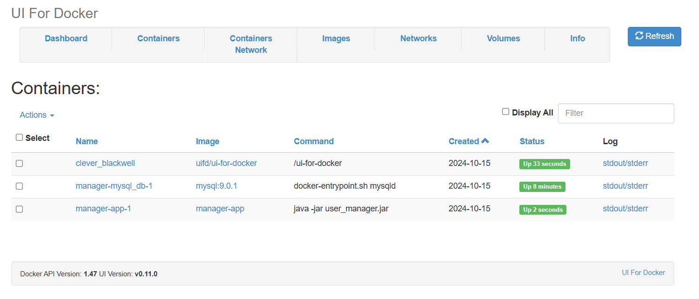
5. 但实际上，在官方镜像仓库可以看到，这个镜像已经长达 8 年没有更新过。


##### Portainer(推荐)

1. Portainer([官网](https://www.portainer.io/)) 是一个可视化的容器镜像的图形管理工具，利用 Portainer 可以轻松构建，管理和维护 Docker 环境。 而且完全免费，基于容器化的安装方式，方便高效部署。这里说一下，Portainer-be 是商业版，而 Portainer-ce 是免费的社区版。

2. 参照官方的安装文档:[文档](https://docs.portainer.io/start/install-ce/server/docker/linux)

   > 如果由于遗留原因需要`9000`开放 HTTP 端口，请将以下内容添加到`docker run`命令中：`-p 9000:9000`

   ```bash
   # 拉取镜像
   docker pull portainer/portainer-ce
   
   # 创建数据卷
   docker volume create portainer_data
   
   # 创建并启动容器
   docker run -dp 8000:8000 -p 9443:9443 -p 9000:9000 \
   --name portainer --restart=always \
   -v /var/run/docker.sock:/var/run/docker.sock \
   -v portainer_data:/data \
   portainer/portainer-ce
   ```

3. 然后访问:[localhost:9443(https)](https://localhost:9443)或者[localhost:9000(http)](http://localhost:9000)。

4. 初次使用需要设置用户名和密码:<br>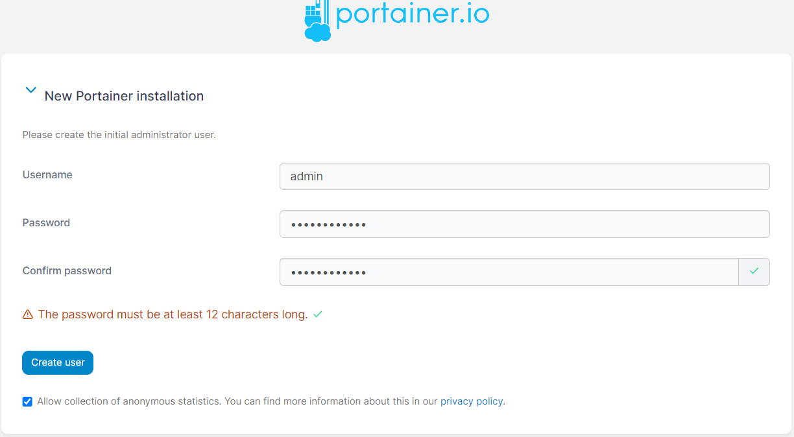

5. 打开后选择环境，可以添加远程环境，这里直接选择开始，使用本地环境：<br>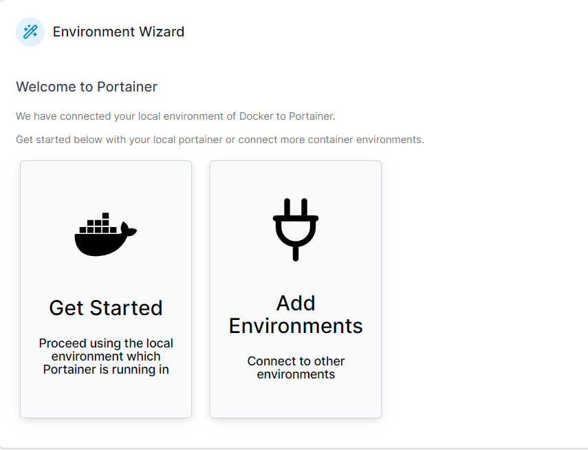<br>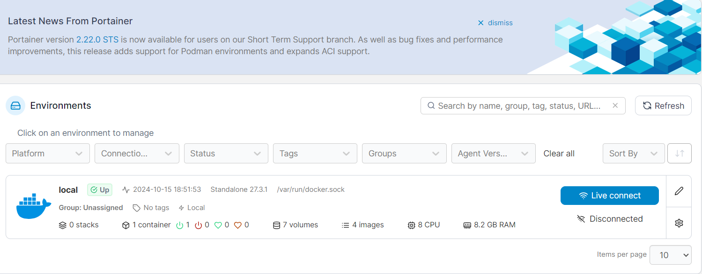


##### shipyard

1. shipyard([官网](https://shipyard-project.com)) 是 docker 的 web 可视化界面管理工具，是建立在 docker 集群管理工具 Citadel 之上，可以管理镜像、容器、主机等资源的 web 图形化工具，包括 core 和 extension 两个版本，core 即 shipyard 主要是把多个 Docker host 上的 containers 统一管理（支持跨越多个host），extension 即 shipyard-extensions 添加了应用路由和负载均衡、集中化日志、部署等。Shipyard 是在 Docker Swarm 实现对容器、镜像、docker 集群、仓库、节点进行管理的 web 系统。
2. 安装比较麻烦: 略


##### CIG监控系统

1. `docker stats` 命令可以实时性地查看到当前 Docker 主机中所有容器的 CPU 占用率、内存占用量、及网络流量使用量等数据。

   ```bash
   ❯ docker stats
   CONTAINER ID   NAME        CPU %     MEM USAGE / LIMIT     MEM %     NET I/O          BLOCK I/O        PIDS
   434a82d707dc   portainer   0.04%     23.26MiB / 7.609GiB   0.30%     959kB / 4.17MB   1.06MB / 803kB   11
   ```

2. 但 docker stats 统计结果只能是瞬时显示实时性数据，无法存储和查询历史数据，没有健康指标预警功能。而 CIG 解决了这些问题。

3. CIG，即 CAdvisor、InfluxDB 与 Grafana，被称为 Docker 监控三剑客。其中 CAdvisor 用于监控数据的收集，InfluxDB 用于数据存储，Grafana 用于数据展示。

   1. cAdvisor 是谷歌公司用来分析运行中的 Docker 容器的资源占用以及性能特性的工具，包括对容器的内存、CPU、网络、磁盘 IO 等监控，同时提供了 WEB 页面用于展示监控数据。cAdvisor 使用一个运行中的守护进程来收集、聚合、处理和导出运行容器相关的信息，为每个容器保存独立的参数、历史资源使用情况和完整的资源使用数据。默认情况下，CAdvisor 可以针对单个主机存储 2 分钟的监控数据。不过其提供了很多的数据集成接口用于存储监控数据，支持 InfluxDB，Redis，Kafka，Elasticsearch 等，官方推荐InfluxDB。
   2. InfluxDB 是一个由 InfluxData 用 GO 语言开发的、开源的、高性能的、时序型数据库，专注于海量时序数据的高性能读、高性能写、高效存储与实时分析等，无需外部依赖。
   3. Grafana 是一款采用 GO 语言编写的、开源的、数据监控分析可视化平台，主要用于大规模指标数据的可视化展示，是网络架构和应用分析中最流行的时序数据展示工具，目前已经支持绝大部分常用的时序数据库。拥有丰富的插件及模板功能支持图表权限控制和报警。

4. 安装:

   1. 在任意目录下创建任意名称的目录。这里在 ~/ 下创建 cig 目录。

   2. 在 cig 目录中创建 compose.yml，内容如下<font color=red>B站教程是使用如下的配置，但是似乎有些镜像有点老，不太想用，要学就学最新的!!!</font>：

      ```yaml
      volumes:
        grafana_data: {}
      
      services:
       influxdb:
        image: tutum/influxdb:1.8
        container_name: my_influxdb
        restart: always
        environment:
          - PRE_CREATE_DB=cadvisor
        ports:
          - "8083:8083"
          - "8086:8086"
        volumes:
          - ./data/influxdb:/data
      
       cadvisor:
        image: google/cadvisor
        container_name: my_cadvisor
        links:
          - influxdb:influxsrv
        command: -storage_driver=influxdb -storage_driver_db=cadvisor -storage_driver_host=influxsrv:8086
        restart: always
        ports:
          - "8080:8080"
        volumes:
          - /:/rootfs:ro
          - /var/run:/var/run:rw
          - /sys:/sys:ro
          - /var/lib/docker/:/var/lib/docker:ro
      
       grafana:
        user: "104"
        image: grafana/grafana
        container_name: my_grafana
        restart: always
        links:
          - influxdb:influxsrv
        ports:
          - "3000:3000"
        volumes:
          - grafana_data:/var/lib/grafana
        environment:
          - HTTP_USER=admin
          - HTTP_PASS=admin
          - INFLUXDB_HOST=influxsrv
          - INFLUXDB_PORT=8086
          - INFLUXDB_NAME=cadvisor
          - INFLUXDB_USER=root
          - INFLUXDB_PASS=root
      ```

   3. 个人觉得上述配置文件已经不太适合使用，links 配置比较老。且 `tutum/influxdb:1.8` 镜像已经弃用(但是 cadvisor 连influxdb:1.8都不支持,凑合用)。下面尝试给出新的搭建配置:

      ```yaml
      volumes:
        grafana_data: {}
      
      services:
        influxdb:
          image: tutum/influxdb
          container_name: my_influxdb
          restart: always
          environment:
            - PRE_CREATE_DB=cadvisor
          ports:
            - "8083:8083"
            - "8086:8086"
          volumes:
            - ./data/influxdb:/data
      
        cadvisor:
          image: google/cadvisor
          container_name: my_cadvisor
          command: -storage_driver=influxdb -storage_driver_db=cadvisor -storage_driver_host=influxdb:8086 # 修改为服务名
          restart: always
          ports:
            - "8080:8080"
          volumes:
            - /:/rootfs:ro
            - /var/run:/var/run:rw
            - /sys:/sys:ro
            - /var/lib/docker/:/var/lib/docker:ro
      
        grafana:
          image: grafana/grafana
          container_name: my_grafana
          restart: always
          ports:
            - "3000:3000"
          volumes:
            - grafana_data:/var/lib/grafana
          environment:
            - HTTP_USER=admin
            - HTTP_PASS=admin
            - INFLUXDB_HOST=influxdb # 修改为服务名
            - INFLUXDB_PORT=8086
            - INFLUXDB_NAME=cadvisor
            - INFLUXDB_USER=root
            - INFLUXDB_PASS=root
      ```

   > 1. 指定 `user: "104"`是为了使容器内的 Grafana 进程以特定用户身份运行(默认情况下会以 root 运行)。

   4. 通过 `docker-compose up –d` 启动所有容器。显示报错`Failed to create a Container Manager: mountpoint for cpu not found` 说 cAdvisor 在尝试创建容器管理器时无法找到 `cpu` 的挂载点。可以使用 `mount | grep cgroup` 命令检查系统是否支持 cgroup。这里显示系统已经挂载了 `cgroup2`，而我们使用的 cAdvisor 可能依赖的是 `cgroup v1`，因此它无法找到 `cpu` 的挂载点。这在运行 cAdvisor 时会导致 `Failed to create a Container Manager` 的错误。

   5. 对于这个问题，有两种解决方式:

      1. 方式一: 修改系统配置(对我的 wsl 似乎无效，显示找不到命令，实际上我也不想改)

         1. 编辑 `sudo vim /etc/default/grub` 文件添加:`GRUB_CMDLINE_LINUX="cgroup_enable=memory swapaccount=0 systemd.unified_cgroup_hierarchy=0"`
         2. 保存文件并更新 grub：`sudo update-grub`
         3. 重启系统，重新启动项目。

      2. 方式二: 使用最新镜像

         1. 实际上如果去官方镜像仓库查看 `google/cadvisor`,发现提示：已弃用，不会推送新图像，请改用 `gcr.io/cadvisor/cadvisor`。

         2. 接下来就简单，乖乖听话改用最新镜像 `gcr.io/cadvisor/cadvisor` ,但是随之而来的新问题也出现，无法访问 gcr.io 。这点通过配置 docker 代理解决。

         3. 于是乎给出最新的 compose 文件:

            ```yaml
            volumes:
              grafana_data: {}
            
            services:
              influxdb:
                image: tutum/influxdb:1.8
                container_name: my_influxdb
                restart: always
                environment:
                  - PRE_CREATE_DB=cadvisor
                ports:
                  - "8083:8083"
                  - "8086:8086"
                volumes:
                  - ./data/influxdb:/data
            
              cadvisor:
                image: gcr.io/cadvisor/cadvisor
                container_name: my_cadvisor
                command: -storage_driver=influxdb -storage_driver_db=cadvisor -storage_driver_host=influxdb:8086 # 修改为服务名
                restart: always
                ports:
                  - "8080:8080"
                volumes:
                  - /:/rootfs:ro
                  - /var/run:/var/run:rw
                  - /sys:/sys:ro
                  - /var/lib/docker/:/var/lib/docker:ro
            
              grafana:
                image: grafana/grafana
                container_name: my_grafana
                restart: always
                ports:
                  - "3000:3000"
                volumes:
                  - grafana_data:/var/lib/grafana
                environment:
                  - HTTP_USER=admin
                  - HTTP_PASS=admin
                  - INFLUXDB_HOST=influxdb # 修改为服务名
                  - INFLUXDB_PORT=8086
                  - INFLUXDB_NAME=cadvisor
                  - INFLUXDB_USER=root
                  - INFLUXDB_PASS=root
            ```

5. 通过 `docker-compose up –d` 启动所有容器,部署成功(上面的环境变量有很多坑，容器无法启动则使用 `docker logs <container_name> `查看日志)。<br>

6. 查看 cadvisor 页面：由于其完成的是原始数据收集功能，所以该页面在打开时会较慢，有一个收集、展示的过程。在浏览器输入[localhost:8080](http://localhost:8080/)即可访问。在首页可以看见主机的一些数据情况。我们点击容器( docker containers),查看各个容器的资源使用情况<br>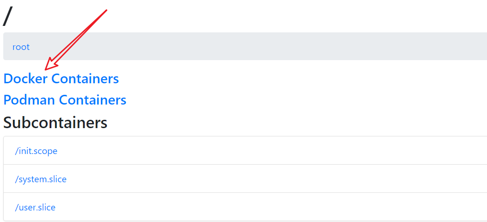<br>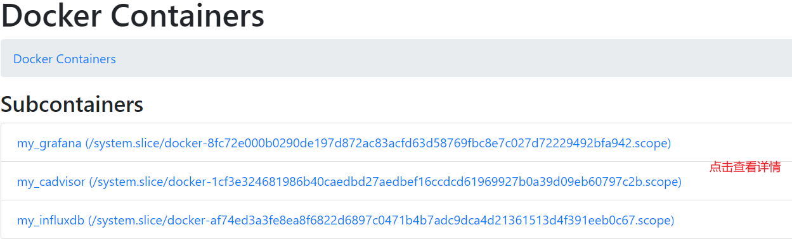

7. 查看 influxdb 页面: 在浏览器输入[localhost:8083](http://localhost:8083/)即可访问。<br>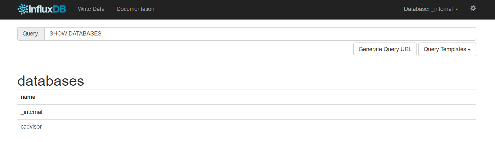

8. 查看 grafana 页面: 在浏览器输入[localhost:3000](http://localhost:3000/)即可访问。

   1. 首先进入需要登录：用户名和密码在 Compose 文件中配置过的。首次登录会让修改密码，不需要修改直接跳过即可。<br><br>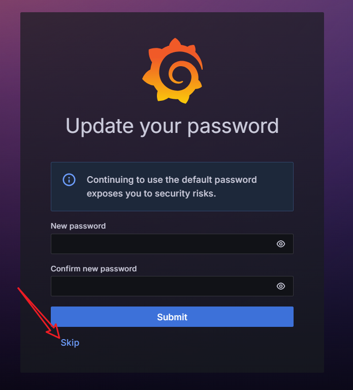
   2. 添加数据源: 点击添加数据源后，数据库类型选择 influxDB 即可。<br>
   3. 配置  influxDB 数据源:用户名与密码也都是 compose.yml 中配置的 root:root ( 这里是在 grafana 服务中配置的 )。 <br>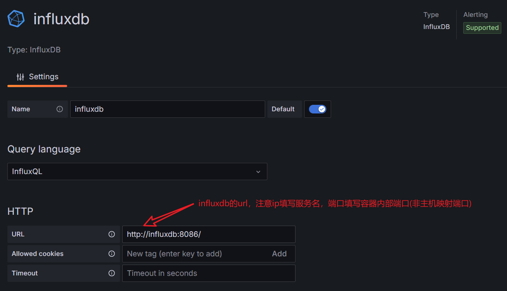<br><br>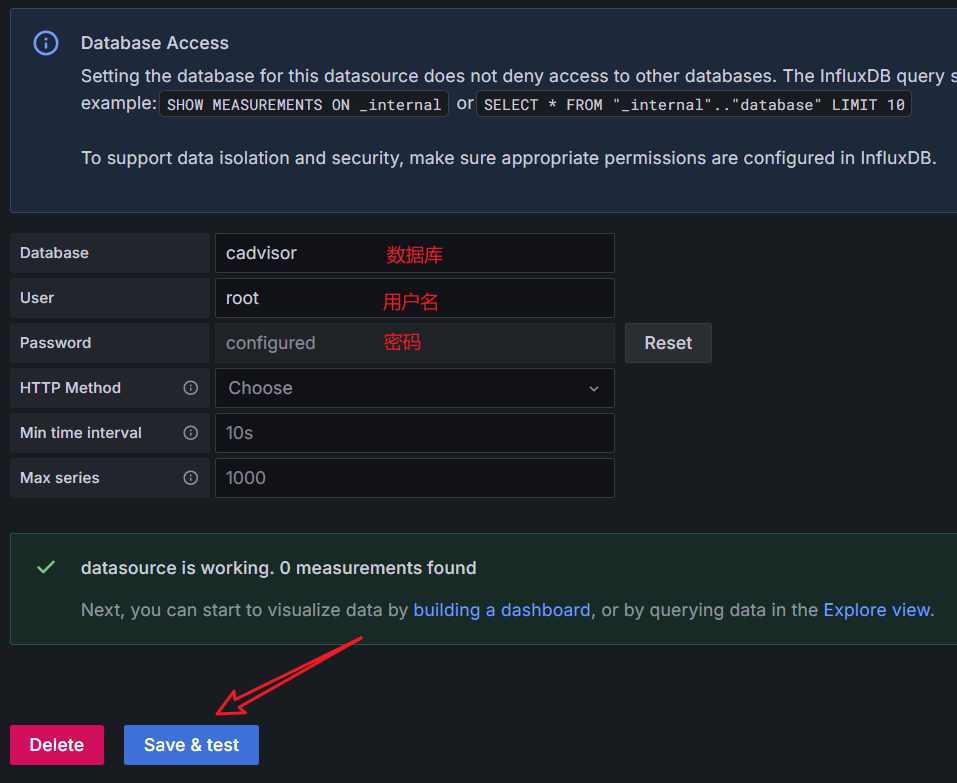
   4. 配置数据的展示仪表盘：
      1. 创建仪表盘:<br>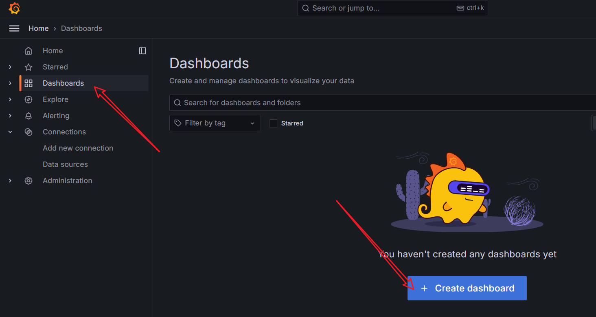<br>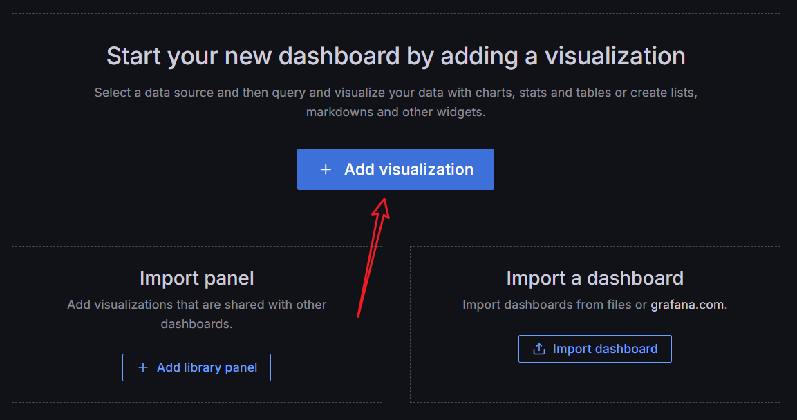<br>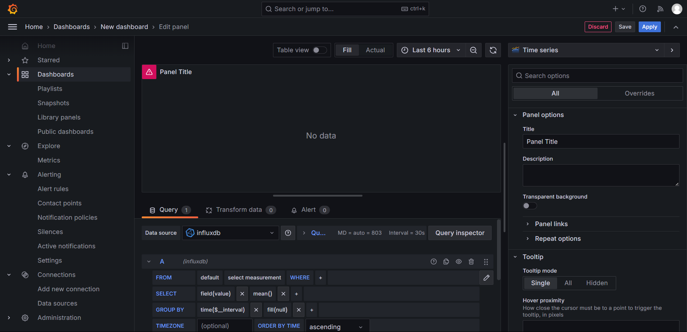

​	2. 终于还是查不到任何数据，不干了，这里主要还是联系 docker compose的使用，cig 监控管理平台以后用到再说(可能还是版本依赖的原因)。


#### docker代理

1. 之前对wsl的改动情况:之前在配置 wsl 的网络时，有这样一步,在C:\Users\<your_username>目录下创建一个.wslconfig文件，然后在文件中写入如下内容:具体可以参考[官方文档](https://learn.microsoft.com/zh-cn/windows/wsl/networking)

   ```toml
   [experimental]
   autoMemoryReclaim=gradual  
   networkingMode=mirrored
   dnsTunneling=true
   firewall=true
   autoProxy=true
   ```

2. 这里只是配置一下docker Daemon 的代理配置（`docker pull` 是由 dockerd 守护进程执行），其他一些代理设置，用到再说：[文档](https://docs.docker.com/engine/cli/proxy/)。此外对于docker Daemon 的代理配置，官方提供两种方式，对于配置配置文件的方式，这里未使用，参考:[文档](https://docs.docker.com/engine/daemon/proxy/)。

3. 我是在windows中开启代理软件，故在配置代理之前，需要解决一个重要问题，那就是 wsl 如何使用 windows 主机代理(当然也可以尝试在 wsl 中开启代理，对于linux而言 dae/daed 使用起来还不错)。


##### 方式一

1. 首先对于前言中提到的改动，启用了 `autoProxy=true`，这会导致 WSL 会自动继承 Windows 主机的代理设置,我们可以在 wsl 直接查看代理配置:

   ```bash
   echo $HTTP_PROXY
   echo $HTTPS_PROXY
   echo $NO_PROXY
   ```

2. 显然此时代理信息可以直接在环境变量中获取，这就很方便。配置`vim ~/.zshrc`( bash 则配置 `~/.bashrc`)，启动时生成 docker 代理的自定义配置文件(其实这里是一个 EnvironmentFile )，配置完成后不要忘记 `source ~/.zshrc`:你可以将自己的镜像加速排除在外。

   ```bash
   # 指定配置文件的位置: ~/.docker_proxy.env
   docker_proxy_env="$HOME/.docker_proxy.env"
   
   # 删除遗留配置文件(放置后续没有获取代理信息时沿用遗留的配置)
   rm -f ${docker_proxy_env}
   
   # 根据 windows 是否开启代理动态生成配置文件。
   if [ -n "$HTTP_PROXY" ] && [ -n "$HTTPS_PROXY" ]; then  
     echo "HTTP_PROXY=\"${HTTP_PROXY}\"" > ${docker_proxy_env}
     echo "HTTPS_PROXY=\"${HTTPS_PROXY}\"" >> ${docker_proxy_env}
     echo "NO_PROXY=\"${NO_PROXY},docker.dreamsea.top\"" >> ${docker_proxy_env}
   fi
   ```

   > 这里顺便推荐一个搭建个人 docker 镜像加速的项目:https://github.com/cmliu/CF-Workers-docker.io

3. 手动创建 Docker 的 systemd 服务配置目录(若不存在), 然后创建或编辑 `http-proxy.conf` 文件,添加如下内容:

   ```bash
   sudo mkdir -p /etc/systemd/system/docker.service.d
   
   sudo vim /etc/systemd/system/docker.service.d/http-proxy.conf
   ```

4. `http-proxy.conf` 文件内容如下(这里没有采用官方的配置 Environment 环境变量，而是使用 EnvironmentFile 提供一个环境变量配置文件):

   ```toml
   [Service]
   EnvironmentFile=- /home/fish/.docker_proxy.env
   ```

   > EnvironmentFile 使用 `-` 在目录前，作用是忽略文件不存在。这样我们就可以根据主机的代理是否启动去动态的设置 docker 的代理。

5. 在配置好代理后，你需要重新加载 systemd 配置并重启 Docker 服务，以使更改生效：

   ```bash
   sudo systemctl daemon-reload
   sudo systemctl restart docker
   ```

6. 此时第一中配置方式就已经完成，使用 `docker info`来检查 Docker 是否已经使用了代理：

   ```bash
   $ docker info
   Client:
    Version:    27.3.1
    Context:    default
    Debug Mode: false
    Plugins:
     compose: Docker Compose (Docker Inc.)
       Version:  2.29.7
       Path:     /usr/lib/docker/cli-plugins/docker-compose
   
   Server:
    ...
    HTTP Proxy: http://127.0.0.1:10809
    HTTPS Proxy: http://127.0.0.1:10809
    ...
   ```

   > 我在写这篇博客时发现一个盲点，那就是若是 docker 的启动顺序 在我的 zsh(或者bash) 之前, 那么就会导致 docker 读取到遗留的配置文件，或者说读不到配置文件，这样就会导致代理配置错误:
   >
   > 1. 对此,chatgpt 提出几种解决措施:
   >
   >    1. 使用 `After`指令: 在 Docker 的 systemd 服务文件中，添加 `After=graphical.target` 或 `After=multi-user.target`，确保 Docker 在图形用户界面或多用户环境准备好后启动。
   >    2. 使用 `ExecStartPost`: 在 Docker 的服务文件中使用 `ExecStartPost`，执行一个脚本，确保用户的 shell 环境已经加载。
   >    3. 延迟启动 Docker: 可以创建一个系统服务，使用 `systemd` 的定时功能，延迟 Docker 启动。例如，使用 `WantedBy` 指定到某个目标下，并设置延迟启动。
   >    4. 手动控制启动： 在用户的 shell 配置文件（如 `~/.bashrc` 或 `~/.zshrc`）中添加命令，在登录后手动启动 Docker,运行`systemctl start docker` 来实现。
   >
   > 2. 先不着急行动，手动删除当前生成的docker自定义配置文件，(开启 windows 代理)然后关闭 wsl ，再启动 wsl 。使用 `docker info` 发现已经配置代理信息。也就是说 docker 的启动顺序在 zsh/bash 之后。
   >
   > 3. 以我目前的能力还很难去研究其具体的启动顺序,我们使用 `systemd-analyze blame` 大致看一下启动时间，发现` docker.service`在 `user@1000.service` 之后启动的。
   >
   >    ```bash
   >    $ systemd-analyze blame
   >    2min 159ms systemd-networkd-wait-online.service
   >         685ms docker.service
   >         398ms dev-sdc.device
   >         269ms systemd-resolved.service
   >         254ms user@1000.service
   >         196ms containerd.service
   >         144ms docker.socket
   >         133ms systemd-networkd.service
   >         127ms systemd-tmpfiles-setup-dev-early.service
   >         101ms systemd-logind.service
   >         ...
   >    ```
   >
   > 4. 这里的启动时间有时间再研究，待补。
   >
   > 5. docker 的系统服务文件位置 `/lib/systemd/system/docker.service`，若是存在启动问题，可参考上述内容。
   >
   > 6. 关于系统服务配置: 可以参考一下[博客](https://www.ruanyifeng.com/blog/2016/03/systemd-tutorial-part-two.html)


##### 方式二

1. 至于第二种配置方式(懒得配置测试，理论上可行，细节上可能会存在一些问题)，根据[官方文档](https://learn.microsoft.com/zh-cn/windows/wsl/networking):,我们可以直接通过`ip route show | grep -i default | awk '{ print $3}'` 获取到 windows 的 ip地址。

2. 那么接下来就很简单(同上):配置`vim ~/.zshrc`( bash 则配置 `~/.bashrc`)，启动时生成 docker 代理的自定义配置文件(其实这里是一个 EnvironmentFile )，配置完成后不要忘记 `source ~/.zshrc`:你可以将自己的镜像加速排除在外。

   ```bash
   # 指定配置文件的位置: ~/.docker_proxy.env
   docker_proxy_env="$HOME/.docker_proxy.env"
   
   # 获取 windows 的 ip 地址
   proxy_ip=$(ip route show | grep -i default | awk 'NR==2 {print $3}')
   
   # 删除遗留配置文件(放置后续没有获取代理信息时沿用遗留的配置)
   rm -f ${docker_proxy_env}
   
   # 这里的端口需要根据你的代理软件配置
   echo "HTTP_PROXY=\"${proxy_ip}:10808\"" > ${docker_proxy_env}
   echo "HTTPS_PROXY=\"${proxy_ip}:10809\"" >> ${docker_proxy_env}
   echo "NO_PROXY=\"localhost,127.0.0.1,<docker镜像加速地址>\"" >> ${docker_proxy_env}
   ```

3. 手动创建 Docker 的 systemd 服务配置目录(若不存在), 然后创建或编辑 `http-proxy.conf` 文件,添加如下内容:

   ```bash
   sudo mkdir -p /etc/systemd/system/docker.service.d
   
   sudo vim /etc/systemd/system/docker.service.d/http-proxy.conf
   ```

4. `http-proxy.conf` 文件内容如下(这里没有采用官方的配置 Environment 环境变量，而是使用 EnvironmentFile 提供一个环境变量配置文件):

   ```toml
   [Service]
   EnvironmentFile=- /home/fish/.docker_proxy.env
   ```

   > EnvironmentFile 使用 `-` 在目录前，作用是忽略文件不存在。这样我们就可以根据主机的代理是否启动去动态的设置 docker 的代理。

5. 在配置好代理后，你需要重新加载 systemd 配置并重启 Docker 服务，以使更改生效：

   ```bash
   sudo systemctl daemon-reload
   sudo systemctl restart docker
   ```

6. 此时第一中配置方式就已经完成，使用 `docker info`来检查 Docker 是否已经使用了代理，这种配置方式无法根据 windows 是否配置代理来动态设置 docker 代理。


##### 其他docker代理

1. Container 代理：在容器运行阶段，如果需要代理上网，则需要配置 `~/.docker/config.json`,以下配置:<font color=red>该配置仅适用于新容器和构建，不会影响现有容器([官方文档](https://docs.docker.com/engine/cli/proxy/))。然后需要 `sudo systemctl restart docker` 重启 docker 。</font>

   ```json
   {
    "proxies": {
      "default": {
        "httpProxy": "http://proxy.example.com:3128",
        "httpsProxy": "https://proxy.example.com:3129",
        "noProxy": "*.test.example.com,.example.org,127.0.0.0/8"
      }
    }
   }
   ```

2. 其他一些代理设置，用到再说：

   1. [文档1](https://docs.docker.com/engine/daemon/proxy/)
   2. [文档2](https://docs.docker.com/engine/cli/proxy/)

