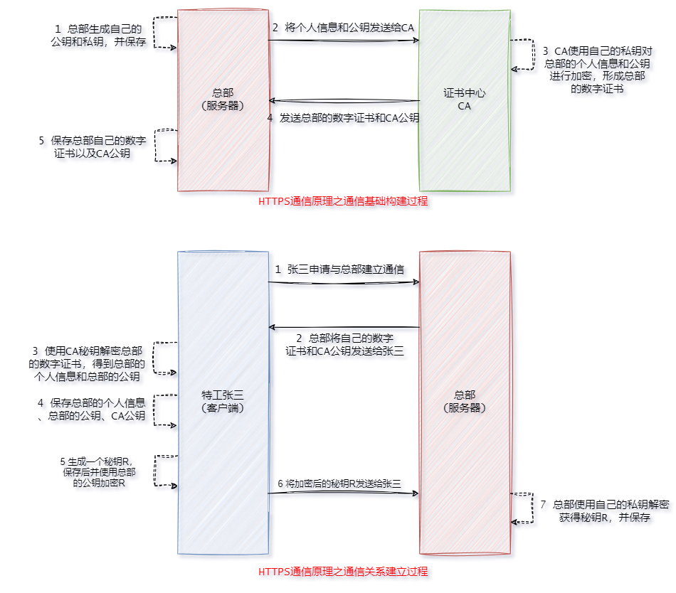

##### 网络模型

1. OSI七层网络模型:
   1. 应用层:提供网络服务给用户，处理应用程序和用户的交互,协议包括HTTP、FTP、SMTP、DNS等。例如:用户在浏览器中输入URL，通过HTTP协议访问网页。
   2. 表示层:处理数据的格式化和翻译，确保发送方和接收方能够理解数据,协议包括数据编码（如JPEG、MPEG、ASCII、EBCDIC等），例如数据压缩、加密和转换（如从XML转换为JSON）。
   3. 会话层:管理会话和连接，负责建立、维护和终止会话，协议包括RPC（远程过程调用）和SMB（服务器消息块），例如应用程序之间的对话管理，确保数据在会话中的传输。
   4. 传输层:确保数据在两个主机之间的可靠传输，负责数据分段、传输控制、错误检测和纠正，协议包括TCP（传输控制协议）和UDP（用户数据报协议），TCP提供可靠的连接，而UDP提供无连接的快速传输。
   5. 网络层:负责数据包的路由选择和传输，管理网络中设备之间的地址（IP地址），协议包括IP（互联网协议）、ICMP（互联网控制消息协议）等，路由器工作在这一层，例如通过IP地址实现不同网络间的通信。
   6. 数据链路层:提供节点之间的可靠数据传输，处理错误检测与纠正、帧的形成及流量控制，协议包括Ethernet、PPP（点对点协议）、ATM等。设备如交换机和网桥在此层工作，例如MAC地址的使用，数据帧的传输。
   7. 物理层:负责传输原始比特流，处理电气、机械、程序和功能方面的特性，包括电缆、集线器、交换机（工作在此层时），以及各种传输介质（如光纤、双绞线、无线信号等），例如电信号的传输，网络接口卡。
2. TCP、/IP五层网络模型:层之间的界限不如OSI模型那么严格，某些功能可能跨层实现。在TCP/IP模型中，表述层和会话层的功能被集成到应用层中，应用层协议负责处理数据的格式化和会话管理。
   1. 应用层
   2. 传输层
   3. 网际层
   4. 网络接口层(包含数据链路层和物理层)
   5. 结构示意图:<br>
3. 模拟数据在主机A与主机B之间传输的每个层次如何协同工作，更好的了解网络模型结构:
   1. A主机(发送数据):
      1. 应用层: 浏览器生成一个HTTP请求，内容为请求某个网页。
      2. 表示层: HTTP请求被转换为适合传输的格式，例如压缩或编码为UTF-8。
      3. 会话层: 建立会话，主机A与主机B之间的连接被创建，确保双方能够进行数据交换。
      4. 传输层: 请求被分段，每个段都有序号和校验码，以确保可靠传输。假设使用TCP。
      5. 网络层: 每个数据段被封装为IP数据包，添加源IP（主机A）和目标IP（主机B）的地址信息。
      6. 数据链路层: IP数据包被封装为数据帧，包含源和目标MAC地址，并进行错误检测。
      7. 物理层: 数据帧通过电缆、光纤或无线信号在网络中传输。
   2. B主机(接收数据):
      1. 物理层: 主机B通过物理介质接收数据帧。
      2. 数据链路层: 数据帧被解封装，进行错误检测，确认数据完整性。
      3. 网络层: 解封装后，IP数据包被提取，路由信息被使用，确保目标IP匹配。
      4. 传输层: 数据段被重组，确认所有段都已接收并按序组装。
      5. 会话层: 会话保持有效，确保持续的数据交换。
      6. 表示层:数据被转换回原始格式，准备供应用层使用。
      7. 应用层: 应用处理HTTP请求，返回所请求的网页内容。


##### 基本概念

1. 超文本传输协议（HTTP，HyperText Transfer Protocol）是互联网上应用最为广泛的一种网络协议。设计 HTTP 最初的目的是为了提供一种发布和接收 HTML 页面的方法。它可以使浏览器更加高效。HTTP 协议是以明文方式发送信息的，如果黑客截取了 Web 浏览器和服务器之间的传输报文，就可以直接获得其中的信息。HTTPS 是以安全为目标的 HTTP 通道，是 HTTP 的安全版,是通过 SSL/TLS 为数据加密，以保障数据的安全性。

2. 通常情况下，HTTP 会直接与运输层的 TCP 进行通信，默认使用 80 端口号。但在使用 SSL/TLS 协议的 HTTPS 后，就演变成了直接与运输层的 SSL/TLS 进行通信，再由 SSL/TLS 与 TCP 进行通信。即 HTTPS 是间接与 TCP 进行通信的,HTTPS 默认使用 443 端口号。

3. SSL（安全套接层）和TLS（传输层安全）是网络安全协议，旨在通过加密和身份验证保护数据在网络上的传输。TLS是SSL的继任者，功能更强大且更安全。<font color=red>在TCP/IP模型中没有正式的安全层，TLS位于应用层和传输层之间。它使用传输层提供的服务来建立一个安全的通道，然后应用层协议通过这个安全通道传输数据。TLS协议确保了数据的机密性、完整性和认证。</font>

   1. SSL: Secure Sockets Layer，安全套接字协议。
   2. TLS: Transport Layer Security，传输层安全协议。
   3. SSL/TLS的握手过程涉及多个步骤，以建立安全连接(后续具体演示)：
      1. 客户端Hello：客户端发送支持的协议版本、加密算法、随机数等信息。
      2. 服务器Hello：服务器选择协议版本和加密算法，并发送其数字证书给客户端。
      3. 证书验证：客户端验证服务器证书的有效性和合法性，确保服务器的身份。
      4. 密钥交换：客户端生成对称密钥，使用服务器的公钥加密后发送给服务器，服务器用其私钥解密，双方获得相同的对称密钥。
      5. 结束握手：双方发送握手完成消息，表明接下来使用对称密钥进行加密通信。

   <br>

4. http协议的风险:

   1. 被窃听的风险:数据在传输过程中未加密，攻击者可以通过网络嗅探工具捕获敏感信息（如密码、信用卡信息）。
   2. 被篡改的风险:数据在传输过程中可能被中间人攻击者篡改，导致用户接收到伪造的信息或文件。
   3. 被冒充的风险(钓鱼):攻击者可以伪装成合法网站，诱骗用户输入敏感信息，造成信息泄露。

5. <font color=red>HTTPS协议中的身份验证采用非对称加密的验证方式，传输采用对称加密的验证方式。</font>

6. 加密方式:

   1. 对称加密:使用相同的密钥进行数据的加密和解密。
      1. 发送方和接收方必须安全地共享密钥，密钥的安全性直接影响加密的安全性。
      2. 对称加密算法通常速度较快，适合加密大量数据。
      3. 应用:文件加密、数据存储加密，SSL/TLS中的数据传输加密。
   2. 非对称加密:非对称加密是一种加密方式，使用一对密钥(公钥和私钥)进行加密和解密。
      1. <font color=red>公钥是可以发放给其他扔得，而私钥仅由密钥的拥有者持有。</font>即使公钥被泄露，私钥仍然安全，保证了加密过程的安全性。
      2. 相较于对称加密，非对称加密速度较慢，适合加密少量数据（如密钥）。
      3. 应用：数字证书、SSL/TLS中的密钥交换、电子签名。
   3. <font color=red>信息加密和数字签名</font>:
      1. 公钥加密，私钥解密: 称为信息加密与解密。发送方使用接收方的公钥对信息进行加密，确保只有接收方（持有私钥）能够解密并读取信息。这是非对称加密的主要应用。
      2. 私钥加密，公钥解密: 称为数字签名与签名验证。发送方使用自己的私钥对信息进行签名，生成数字签名。接收方可以使用发送方的公钥验证数字签名的真实性，以确保消息的来源和完整性。

7. 数字证书，也称为 SSL/TLS 证书，是互联网通讯中标志通讯各方身份信息的一串数字。提供了一种在 Internet 上验证通信实体身份的方式。它是由 CA(Certificate Authority，证书权威认证机构，证书中心)颁发的一种身份证明。它里面包含了该通讯方的公钥、证书有效时间、域名及 CA 的数字签名等。数字证书的一个非常重要的作用就是“防钓鱼”。全球的 CA (权威证书中心)一共也没有几个，即全球可以颁发数字证书的机构并不多。而像我国阿里、腾讯等也都属于这些大的权威证书中心的代理机构。我们可以通过他们来申办证书，而他们本身并不具有生成证书的权限。

8. 数字证书是由 CA（Certificate Authority，证书权威认证机构，证书中心）颁发的一种身份证明，是通过 CA 私钥加密过的。所以，客户端必须具有 CA 公钥才能解密要访问平台服务器的数字证书。而<font color=red>这个 CA 公钥就被称为 CA 根证书，也称为根证书</font>。当然，数字证书除了权威证书中心可申请到外，也可自己生成。但自己生成的证书并没有在客户端系统中，这时就需要用户在客户端先安装数字证书，并将其添加到相应的“信任”状态才可。这就是我们平时如果要在本地电脑中打开网银平台对自己的电子银行进行操作之前，会先提示安装根证书的原因。这个安装根证书的提示，就包含网银的数字证书与 CA 根证书。

   > 客户端获取 CA 证书的方式主要包括以下几种：
   >
   > 1. 预装在操作系统: 大多数主流浏览器（如 Chrome、Firefox、Safari）会预装一组常见的 CA 根证书。
   > 2. 预装在浏览器: 大多数主流操作系统（如 Windows、macOS、Linux）会预装一组常见的 CA 根证书,这些证书用于验证 HTTPS 网站的安全性。
   > 3. 服务器发送: TLS 握手过程中在建立安全连接时，服务器会发送其数字证书，其中包含 CA 证书链。
   > 4. 手动安装: 对于使用自签名证书或不在默认信任列表中的 CA，客户端需要手动下载并安装这些 CA 证书，以信任该服务器。
   > 5. 在线下载: 一些组织或 CA 提供 CA 证书的下载链接，客户端可以从这些可信来源下载并安装所需的证书。
   > 6. 其他: 略。

9. 数字摘要: 将任意长度的消息变成固定长度的短消息。数字摘要就是利用了 Hash 函数的单向性，将需要加密的明文“摘要”成一串 128 位长度数字串。这个数字串又称为数字指纹。其单向性体现在：不同明文“摘要的结果”一定是不同的，相同明文“摘要的结果”必定是一致，但摘要结果无法计算出其原始明文。

10. 数字签名，是只有信息的发送者才能产生的别人无法伪造的一段数字串。它是一种类似写在纸上的手写物理签名，用于鉴别数字信息是否被篡改的方法。数字签名是非对称密钥技术与数字摘要技术的应用。使用私钥对明文的数字摘要加密，形成数字签名；使用公钥对数字签名解密，称为签名验证。


##### https原理

1. 为了更容易理解，我们使用特工张三来作为客户端，总部作为服务端，后续将使用这二者介绍信息传递的过程。

2. 明文通信过程:对于下面的明文通信方式，第一步中若是包含一些张三的位置信息，一旦被敌军劫持，张三就非常危险的。甚至敌军可能会篡改总部指令或者直接冒充总部向张三下达指令,那特工张三后续作战就完全暴露在敌军眼下。<br>

3. 使用数字签名加密通信:对于这种通信，由于私钥只有总部有，因此张三的信息无法被敌军获取，由于签名的存在敌军无法篡改总部回复的消息。但是敌军任然可以冒充总部对张三下达指令(敌军只需要偷换张三的公钥等操作,如下图所示)，此外敌军也可以截获总部对张三下达的指令(教程说由于数字签名附加的位置不确定和数字签名的原始数据不一定[从某些位置截取数据进行加密得到数字签名]导致无法截获)。<br><br>

4. 使用数字证书通信:CA证书由受信任的证书颁发机构签发，提供了一个信任链，使通信双方能够验证彼此的身份。对于上面提到的钓鱼问题，尽管钓鱼网站可以尝试伪装，但获取有效的CA证书非常困难，并且现代安全机制（如证书透明性和严格的身份验证）使得这种攻击更加困难。<br><br>

5. <font color=red>需要说明的是，在上述过程中，服务器的返回消息并未加密，服务器只是使用私钥生成了数字签名(并且实际上并不是对完整的返回消息进行私钥加密得到数字签名，一般而言首先会对返回消息进行哈希值计算等操作)，以防止响应数据被篡改。故而我们提出下面的通信方式。</font>

6. 混合通信方式(HTTPS):上述通信过程，需要通过CA证书对服务器身份进行验证，这里使用的是非对称加密，效率是狠毒的。进而提出身份验证采用非对称加密的验证方式，传输采用对称加密的验证方式的HTTPS协议。<br><br>

7. 在使用对称加密秘钥进行后续通信时，通常不需要每个消息都附加数字签名，但在重要场合和敏感数据传输时，附加数字签名仍然可以增强安全性，提供身份验证和数据完整性保护(此时一般使用私钥构建数字签名，附加到返回消息中，然后一起使用秘钥R加密，将得到结果返回给客户端)。


##### TLS握手

1. 实际上秘钥 R 的产生并没有上述描绘的那么简单，并且秘钥R也不是完全有客户端生成的。
2. 其过程大致分为如下:
   1. 客户端向服务器发送 `ClientHello` 消息，包含以下信息:支持的 TLS 版本、支持的加密套件列表（包括对称加密算法和哈希算法）、生成的随机数（Client Random）、数据压缩方法。
   2. 服务器回复 `ServerHello` 消息，选择以下信息:选择的 TLS 版本、选择的加密套件、生成的随机数（Server Random）。
   3. <font color=red>注意:到这里，服务端和客户端都已经拥有两个随机数，并确定加密算法。</font>
   4. 服务器将其数字证书（由受信任的 CA 签发）发送给客户端,证书中包含服务器的公钥和身份信息。
   5. 客户端对服务器的数字证书进行验证。
   6. 客户端生成一个预主密钥（pre-master secret），并使用服务器的公钥对其进行加密，然后发送给服务器,只有服务器能够使用其私钥解密。
   7. <font color=red>注意:到这里，服务端和客户端都已经拥有三个随机数，且第三个随机数保密程度很高！！！</font>
   8. 客户端和服务器使用预主密钥和之前交换的随机数，生成会话密钥（session keys），用于后续的对称加密。
   9. 客户端发送 `ChangeCipherSpec` 消息，指示后续的消息将使用新生成的会话密钥进行加密。
   10. 客户端发送 `Finished` 消息，确认握手已成功完成，并使用会话密钥对该消息进行加密。
   11. 服务器发送 `ChangeCipherSpec` 消息，指示后续的消息将使用新生成的会话密钥进行加密。
   12. 服务器发送 `Finished` 消息，确认握手已成功完成，并使用会话密钥对该消息进行加密。
3. 总的来说，最终的回话秘钥 R 是由客户端和服务端共同约定产生的。


##### 证书生成和验证流程

1. 首先，需要区分一些基本概念：
   1. 服务器证书：
      1. 用于验证服务器的身份。它确保客户端（如浏览器或其他应用）与真正的服务器进行通信，而不是与冒充者进行通信。
      2. 签发：通常由 CA 签发。服务器证书包含服务器的公钥和相关的身份信息（如域名、组织等）。
      3. 使用场景：主要用于 HTTPS 网站，以加密传输数据并验证服务器身份。
   2. CA 证书：
      1. 目的：用于建立信任链。它是用于签发其他证书（包括服务器证书和客户端证书）的根证书。
      2. 签发：CA 自己签发。CA 证书的公钥用于验证由该 CA 签发的所有证书的有效性。
      3. 使用场景：在 SSL/TLS 通信中，CA 证书用于客户端验证服务器证书的真实性，确保该证书是由可信的 CA 签发的。
   3. 证书链: 证书链是由多个证书组成的链条，用于验证一个特定证书的信任度。它通常包含服务器证书、一个或多个中间证书，以及最终的根证书。根证书位于链的顶部，由 CA 签发，通常是预先安装在客户端信任存储中的。中间证书则用于连接根证书和服务器证书。(<font color=red>根证书的详细定义:根证书（root certificate）是属于根证书颁发机构（CA）的公钥证书，是在公开密钥基础建设中，信任链的起点。</font>)
2. CA 机构生成服务器证书的过程
   1. 生成私钥和证书签名请求 (CSR):服务器管理员在其服务器上生成一对密钥，包括一个私钥（.key 文件）和一个公钥。然后，管理员使用私钥生成证书签名请求 (CSR)，该请求包含组织信息（如国家、州、城市、组织名、部门名和公钥），并且请求中必须指定一个通用名称（CN），通常是服务器的域名。
   2. 提交 CSR 给 CA:管理员将 CSR 提交给 CA，CA 将根据 CSR 中的信息进行验证。
   3. CA 验证请求:CA 验证请求中的信息，可能包括域名验证（确保请求者拥有该域名）和组织验证（确保请求者为合法组织）。
   4. 生成服务器证书:一旦验证通过，CA 会使用自己的私钥对 CSR 进行签名，生成服务器证书（.crt 文件）。证书中包含公钥及其他信息，并包含 CA 的签名。
   5. 生成证书链（如果适用）:如果 CA 使用中间证书，它会生成一个证书链，包括中间证书和根证书。根证书通常是公认的，客户端会预先安装。
   6. 扩参考后续搭建私人镜像中心中使用 openssl 生成服务器证书的操作流程。
3. 客户端获取服务器证书后的验证过程
   1. SSL/TLS 握手:客户端（如浏览器）向服务器发起 SSL/TLS 握手请求，服务器会返回其证书链，通常包括服务器证书和中间证书。
   2. 验证服务器证书:
      - 客户端收到服务器证书后，首先检查证书的有效性，包括有效期和撤销状态。
      - 此外客户端将服务器证书的签名与其上级证书的公钥进行比对，以验证服务器证书的完整性和真实性。
   3. 逐级验证证书链:
      - 客户端会逐级验证证书链，从服务器证书开始，向上验证每个中间证书，直到找到根证书。
      - 具体步骤包括：
        - 使用每个证书的公钥验证其下级证书的签名。
        - 检查每个证书是否在有效期内，并未被撤销。
   4. 根证书匹配:
      - 客户端会将链中的根证书与其信任存储中的根证书进行比较，以确认该根证书是受信任的。
      - 如果根证书是受信任的，客户端就信任整个证书链。
   5. 建立安全连接:
      - 如果所有验证都成功，客户端将建立安全的 SSL/TLS 连接，开始加密通信。
      - 如果验证失败，客户端会显示安全警告，并可能拒绝连接。


##### tcp

1. 都研究到这里，顺带学习一下tcp的三次握手和四次挥手。

2. 三次握手: 一开始，客户端和服务端都处于 `CLOSED` 状态。客户端主动打开连接，服务端被动打卡连接，结束`CLOSED` 状态，开始监听，进入 `LISTEN`状态。

   1. 一次握手: 客户端发起连接
      - 客户端随机初始化一个序列号（`client_isn`），并将其放入 TCP 报文的序号字段中。
      - 将 SYN 标志位置为 1，表示这是一个连接请求的 SYN 报文。
      - 发送该 SYN 报文给服务器，此报文不包含应用层数据。
      - 客户端进入 **SYN-SENT** 状态，等待服务器的响应。
   2. 二次握手: 服务器响应连接请求
      - 服务器收到客户端的 SYN 报文后，随机初始化自己的序列号（`server_isn`），并将其放入 TCP 报文的序号字段中。
      - 将 TCP 报文的确认应答号字段设置为 `client_isn + 1`，以确认收到客户端的请求。
      - 同时，将 SYN 和 ACK 标志都设置为 1，表示这是一个 SYN-ACK 报文。
      - 发送该报文给客户端，报文不包含应用层数据。
      - 服务器进入 **SYN-RCVD** 状态，等待客户端的确认。
   3. 三次握手: 客户端确认连接
      - 客户端收到服务器的 SYN-ACK 报文后，准备发送最后一个确认报文。
      - 设置 ACK 标志为 1，并将确认应答号字段设置为 `server_isn + 1`，确认收到服务器的序列号。
      - 发送该 ACK 报文给服务器，<font color=red>此时可以携带应用层数据</font>。
      - 客户端进入 **ESTABLISHED** 状态，表示连接已建立。

   > 1. 第一次挥手客户端发送建立连接请求发送`client_isn`，第二次握手服务端响应`client_isn+1`，此时客户端可以知道服务器正常接收到数据，同时客户端将服务端的`server_isn + 1`发送回去，告诉服务端自己也可以正常接收数据。
   > 2. 不妨以打电话举例:
   >    1. A: 这里是A，B听得见吗(`client_isn`)？
   >    2. B: 听得见(`client_isn+1`)，这里是B，A能听见吗(`server_isn`)？
   >    3. A: 我也听得见(`server_isn + 1`),我跟你说啊…bala..bala

3. 四次挥手:

   1. 第一次挥手: 客户端发送 FIN
      - 主动关闭连接的一方（通常是客户端）发送一个 FIN（结束）报文(标志位置1)，表示它希望关闭连接。
      - FIN 报文中包含客户端的序列号，且不携带应用层数据。
      - 客户端进入 **FIN-WAIT-1** 状态。
   2. 第二次挥手: 服务器确认 FIN
      - 服务器接收到客户端的 FIN 报文后，发送一个 ACK（确认）报文以确认收到 FIN。
      - 此 ACK 报文的确认号设置为客户端的序列号 + 1。
      - 服务器此时仍然可以继续发送数据，进入 **CLOSE-WAIT** 状态。
      - 客户端收到 ACK 后，进入 **FIN-WAIT-2** 状态。
   3. 第三次挥手: 服务器发送 FIN
      - 当服务器完成数据传输后，发送一个 FIN 报文给客户端，表示它也准备关闭连接。
      - 该 FIN 报文中包含服务器的序列号。
      - 服务器进入 **LAST-ACK** 状态。
   4. 第四次挥手: 客户端确认 FIN
      - 客户端接收到服务器的 FIN 报文后，发送一个 ACK 报文以确认。
      - 此 ACK 报文的确认号设置为服务器的序列号 + 1。
      - 客户端进入 **TIME-WAIT** 状态，等待一段时间以确保服务器收到 ACK。
      - 服务器在收到该 ACK 后，进入 **CLOSED** 状态。
   5. 连接关闭: 最终关闭连接
      - 在客户端的 TIME-WAIT 状态结束后，客户端也进入 **CLOSED** 状态，连接彻底关闭。

   > 不妨以打电话举例:
   >
   > 1. A:我没啥要说的了，over！(A:`FIN-WAIT-1`)
   > 2. B:哦，你等会，我还没说完,你听我说啊…bala…bala！(B:`CLOSE-WAIT`,A:`FIN-WAIT-2`)
   > 3. B:我也说完了，over！(B:`LAST-ACK`)
   > 4. A:知道了，那我挂电话了！(A:`TIME-WAIT`->(一段时间)->A、B:`CLOSED`)


##### MD5加密的salt(之前面试遇到)

1. MD5 是一种广泛使用的哈希函数，但单独使用 MD5 进行密码存储时存在安全风险，例如易受到暴力破解和碰撞攻击。为了解决这些问题，通常会结合使用 salt（盐）来增强安全性。

2. 通过使用 salt，MD5 在存储和验证密码时的安全性得到了显著提升。然而，由于 MD5 本身已被认为不够安全（如碰撞攻击），建议在处理密码时使用更安全的哈希算法，例如 bcrypt、scrypt 或 Argon2，这些算法设计上更适合于密码哈希和存储，并且内置了 salt 的生成机制。

3. Salt 的作用:

   1. 防止彩虹表攻击: 彩虹表是预计算的哈希值与原始密码的映射表。通过使用独特的 salt，可以使每个用户的哈希值不同，即使他们使用相同的密码。这有效阻止了使用彩虹表进行攻击。
   2. 增加密码的复杂性: Salt 是一个随机生成的字符串，通常与密码结合后进行哈希。这增加了破解密码所需的计算量，因为攻击者需要对每个 salt 进行单独的计算。
   3. 唯一性: 每个用户的 salt 应该是唯一的，确保相同密码的哈希值在不同用户之间也不同。

4. Salt 的工作步骤

   1. 生成盐值: 在用户注册时，生成一个随机的 salt，通常为一定长度的字符串（例如 16 字节）。

   2. 结合密码和盐: 将 salt 与用户输入的密码结合，例如通过拼接或其他方式。可以采用如下方法:`hashed_password = MD5(password + salt)`。

   3. 存储:将生成的哈希值和对应的 salt 一起存储在数据库中。通常会存储 salt 和哈希值，例如:

      ```bash
       user_id | salt        | hashed_password
      ---------|-------------|----------------
      1        | random_salt | hash_value
      ```

   4. 验证密码: 在用户登录时，首先检索存储的 salt，然后将用户输入的密码与 salt 结合，计算哈希值，最后与存储的哈希值进行比较。

5. 常见密码破解方式:

   1. 暴力破解: 攻击者通过尝试所有可能的密码组合来获取目标系统的访问权限。这种方法不依赖于任何密码特征或信息，纯粹依靠计算能力和时间。
   2. 碰撞攻击: 攻击者试图找到两个不同的输入（通常是不同的消息或密码），它们的哈希值相同。这种情况被称为“碰撞”。哈希函数的设计目标是使得不同输入产生不同的哈希值。然而，由于哈希函数的输出有限（例如，MD5 输出 128 位哈希值），而输入空间是无限的，理论上总会存在多个输入产生相同的哈希值。这种现象称为哈希碰撞。
   3. 彩虹表攻击: 攻击者首先创建一个包含大量常见密码和其哈希值的表。为了减少存储空间，彩虹表通常使用链表和降维技术，即将多个哈希值和密码的映射压缩为一条链。当攻击者获取到哈希值（例如从数据库泄露中），他们可以在彩虹表中查找该哈希值。如果找到匹配的哈希值，攻击者就可以得到对应的明文密码。

6. 尝试使用  Hashcat、Hydra(九头蛇) 等工具模拟密码破译以加深理解: 待补。