#### 镜像推送

##### docker hub

1. 准备一个镜像，这里我使用自己编写的一个镜像。

2. 首先需要创建一个 docker hub 账号，对于 dockerhub ，存在两种登录方式:(需要网络保障)

   1. 运行`docker login`然后打开验证链接，输入验证码即可。
   2. 运行`docker login -u`指定登录账号，然后输入密码即可。

3. 登录账号后需要通过 `docker tag` 命令可以对原有镜像进行复制并重命名。这个重命名的镜像的 repository 中必须采用`<username>/<software-name>`格式，且username 必须是登录 Docker Hub 的用户名。例如:

   ```bash
   docker tag random-image-api:latest dreamfishyx/random-image-api:1.0
   ```

4. 使用 `docker push`将对应镜像推送到镜像中心。例如:

   ```bash
   $ docker push dreamfishyx/random-image-api:1.0
   The push refers to repository [docker.io/dreamfishyx/random-image-api]
   e879f5b8746e: Pushed
   b5becf2d59f9: Pushed
   b6138c1f34d1: Pushed
   0c1dc0e3e9c1: Pushed
   b37145d52b36: Mounted from library/python
   5b2bbb7d3a14: Mounted from library/python
   1eae3090c894: Mounted from library/python
   8d853c8add5d: Mounted from library/python
   1.0: digest: sha256:a13f6d097591a4cce76b80d0f20ec140ba72131181b1d860ec89885f3404b0ae size: 1997
   ```

4. 通过 `docker logout` 命令可以从 Docker 引擎中退出登录的 Docker Hub 账号。

   


##### 阿里云镜像中心

1. 关于阿里云镜像中心和 docker hub 的对比，阿里云不同于docker hub 使用用户名，而是改用命名空间，可以很好的保护用户隐私。<br><br>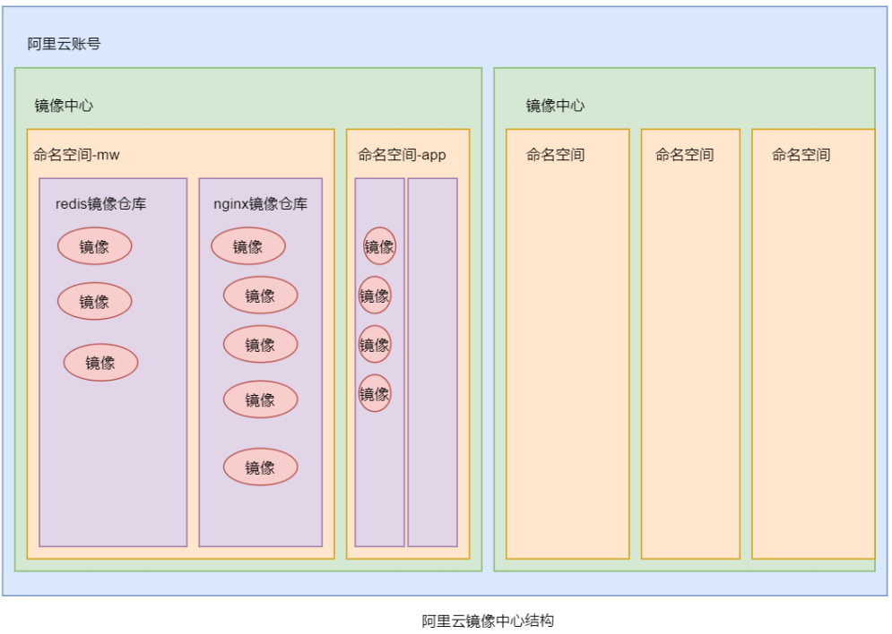
2. 阿里云这里对个人用户是有免费的使用额度的。
   1. 首先需要一个已经实名的阿里云账号
   2. 登录阿里云后，打开阿里云的容器镜像服务的控制台,找到“实例列表”并创建个人实例:<br>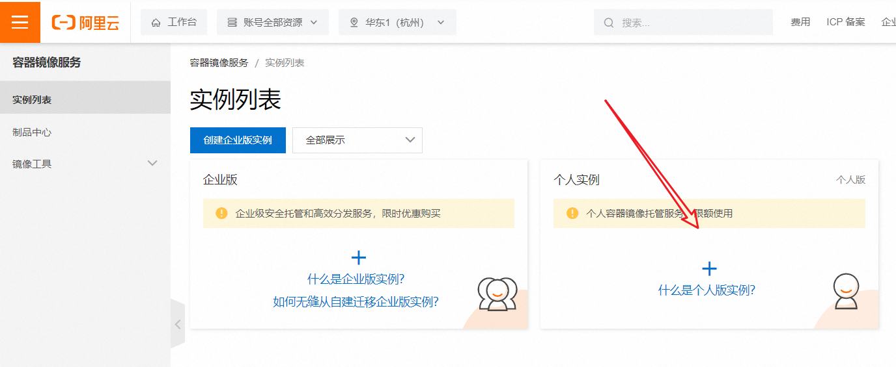
   3. 设置密码:<br>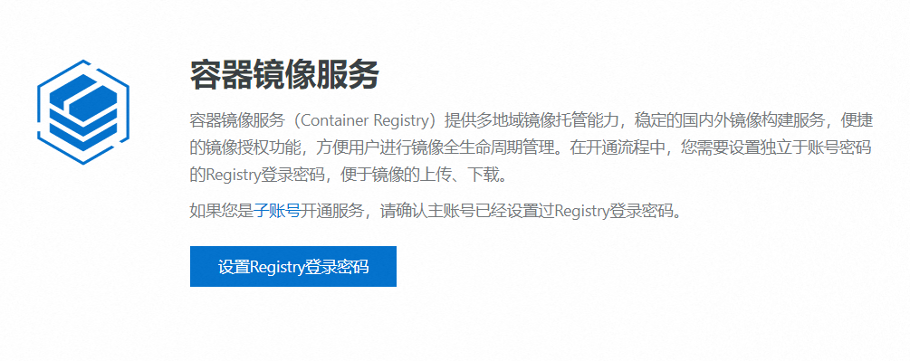
   4. 先创建命名空间:<br>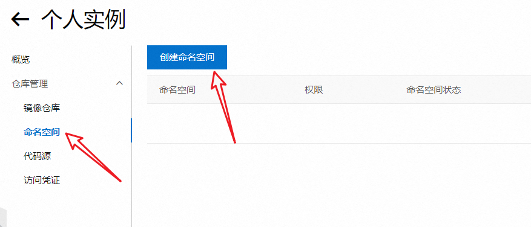
   5. 后创建镜像仓库(镜像仓库也可以不创建，在创建命名空间时开启自动创建命名空间即可):<br>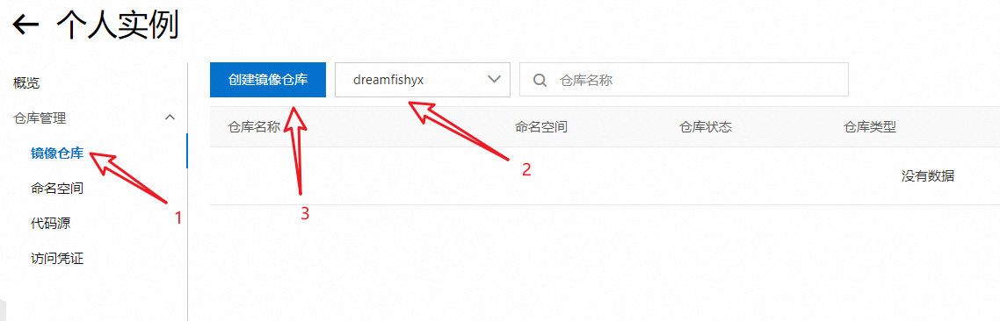
   6. 后面在镜像仓库的基本信息中存在登录和推送教程。
3. 登录到阿里云镜像:` docker login --username=<user_name> <url>`,用户名是阿里云账户的名称。
4. 登录账号后需要通过 `docker tag` 命令可以对原有镜像进行复制并重命名。这个重命名的镜像的 repository 中必须采用`<namespace>/<software-name>`格式，且 namespace 必须是创建的命名空间。
5. 推送:`docker pull xxx`。
6. 退出:`docker logout`。


#### https和http

##### 网络模型

1. OSI七层网络模型:
   1. 应用层:提供网络服务给用户，处理应用程序和用户的交互,协议包括HTTP、FTP、SMTP、DNS等。例如:用户在浏览器中输入URL，通过HTTP协议访问网页。
   2. 表示层:处理数据的格式化和翻译，确保发送方和接收方能够理解数据,协议包括数据编码（如JPEG、MPEG、ASCII、EBCDIC等），例如数据压缩、加密和转换（如从XML转换为JSON）。
   3. 会话层:管理会话和连接，负责建立、维护和终止会话，协议包括RPC（远程过程调用）和SMB（服务器消息块），例如应用程序之间的对话管理，确保数据在会话中的传输。
   4. 传输层:确保数据在两个主机之间的可靠传输，负责数据分段、传输控制、错误检测和纠正，协议包括TCP（传输控制协议）和UDP（用户数据报协议），TCP提供可靠的连接，而UDP提供无连接的快速传输。
   5. 网络层:负责数据包的路由选择和传输，管理网络中设备之间的地址（IP地址），协议包括IP（互联网协议）、ICMP（互联网控制消息协议）等，路由器工作在这一层，例如通过IP地址实现不同网络间的通信。
   6. 数据链路层:提供节点之间的可靠数据传输，处理错误检测与纠正、帧的形成及流量控制，协议包括Ethernet、PPP（点对点协议）、ATM等。设备如交换机和网桥在此层工作，例如MAC地址的使用，数据帧的传输。
   7. 物理层:负责传输原始比特流，处理电气、机械、程序和功能方面的特性，包括电缆、集线器、交换机（工作在此层时），以及各种传输介质（如光纤、双绞线、无线信号等），例如电信号的传输，网络接口卡。
2. TCP、/IP五层网络模型:层之间的界限不如OSI模型那么严格，某些功能可能跨层实现。在TCP/IP模型中，表述层和会话层的功能被集成到应用层中，应用层协议负责处理数据的格式化和会话管理。
   1. 应用层
   2. 传输层
   3. 网际层
   4. 网络接口层(包含数据链路层和物理层)
   5. 结构示意图:<br>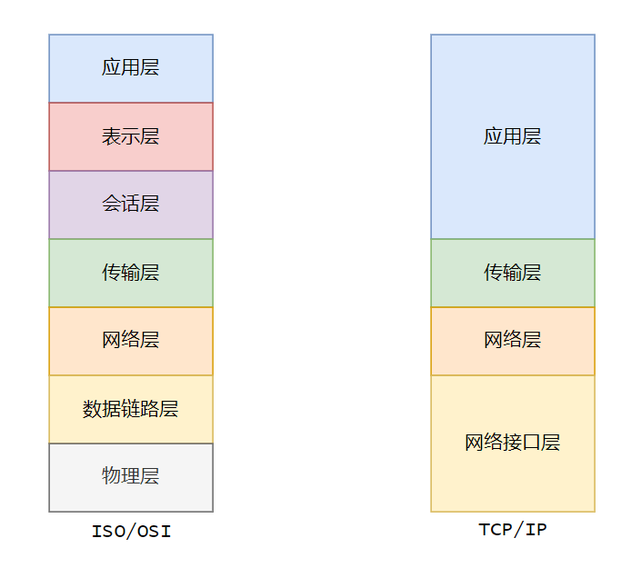
3. 模拟数据在主机A与主机B之间传输的每个层次如何协同工作，更好的了解网络模型结构:
   1. A主机(发送数据):
      1. 应用层: 浏览器生成一个HTTP请求，内容为请求某个网页。
      2. 表示层: HTTP请求被转换为适合传输的格式，例如压缩或编码为UTF-8。
      3. 会话层: 建立会话，主机A与主机B之间的连接被创建，确保双方能够进行数据交换。
      4. 传输层: 请求被分段，每个段都有序号和校验码，以确保可靠传输。假设使用TCP。
      5. 网络层: 每个数据段被封装为IP数据包，添加源IP（主机A）和目标IP（主机B）的地址信息。
      6. 数据链路层: IP数据包被封装为数据帧，包含源和目标MAC地址，并进行错误检测。
      7. 物理层: 数据帧通过电缆、光纤或无线信号在网络中传输。
   2. B主机(接收数据):
      1. 物理层: 主机B通过物理介质接收数据帧。
      2. 数据链路层: 数据帧被解封装，进行错误检测，确认数据完整性。
      3. 网络层: 解封装后，IP数据包被提取，路由信息被使用，确保目标IP匹配。
      4. 传输层: 数据段被重组，确认所有段都已接收并按序组装。
      5. 会话层: 会话保持有效，确保持续的数据交换。
      6. 表示层:数据被转换回原始格式，准备供应用层使用。
      7. 应用层: 应用处理HTTP请求，返回所请求的网页内容。


##### 基本概念

1. 超文本传输协议（HTTP，HyperText Transfer Protocol）是互联网上应用最为广泛的一种网络协议。设计 HTTP 最初的目的是为了提供一种发布和接收 HTML 页面的方法。它可以使浏览器更加高效。HTTP 协议是以明文方式发送信息的，如果黑客截取了 Web 浏览器和服务器之间的传输报文，就可以直接获得其中的信息。HTTPS 是以安全为目标的 HTTP 通道，是 HTTP 的安全版,是通过 SSL/TLS 为数据加密，以保障数据的安全性。

2. 通常情况下，HTTP 会直接与运输层的 TCP 进行通信，默认使用 80 端口号。但在使用 SSL/TLS 协议的 HTTPS 后，就演变成了直接与运输层的 SSL/TLS 进行通信，再由 SSL/TLS 与 TCP 进行通信。即 HTTPS 是间接与 TCP 进行通信的,HTTPS 默认使用 443 端口号。

3. SSL（安全套接层）和TLS（传输层安全）是网络安全协议，旨在通过加密和身份验证保护数据在网络上的传输。TLS是SSL的继任者，功能更强大且更安全。<font color=red>在TCP/IP模型中没有正式的安全层，TLS位于应用层和传输层之间。它使用传输层提供的服务来建立一个安全的通道，然后应用层协议通过这个安全通道传输数据。TLS协议确保了数据的机密性、完整性和认证。</font>

   1. SSL: Secure Sockets Layer，安全套接字协议。
   2. TLS: Transport Layer Security，传输层安全协议。
   3. SSL/TLS的握手过程涉及多个步骤，以建立安全连接(后续具体演示)：
      1. 客户端Hello：客户端发送支持的协议版本、加密算法、随机数等信息。
      2. 服务器Hello：服务器选择协议版本和加密算法，并发送其数字证书给客户端。
      3. 证书验证：客户端验证服务器证书的有效性和合法性，确保服务器的身份。
      4. 密钥交换：客户端生成对称密钥，使用服务器的公钥加密后发送给服务器，服务器用其私钥解密，双方获得相同的对称密钥。
      5. 结束握手：双方发送握手完成消息，表明接下来使用对称密钥进行加密通信。

   <br>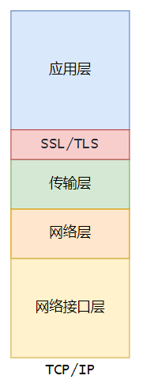

4. http协议的风险:

   1. 被窃听的风险:数据在传输过程中未加密，攻击者可以通过网络嗅探工具捕获敏感信息（如密码、信用卡信息）。
   2. 被篡改的风险:数据在传输过程中可能被中间人攻击者篡改，导致用户接收到伪造的信息或文件。
   3. 被冒充的风险(钓鱼):攻击者可以伪装成合法网站，诱骗用户输入敏感信息，造成信息泄露。

5. <font color=red>HTTPS协议中的身份验证采用非对称加密的验证方式，传输采用对称加密的验证方式。</font>

6. 加密方式:

   1. 对称加密:使用相同的密钥进行数据的加密和解密。
      1. 发送方和接收方必须安全地共享密钥，密钥的安全性直接影响加密的安全性。
      2. 对称加密算法通常速度较快，适合加密大量数据。
      3. 应用:文件加密、数据存储加密，SSL/TLS中的数据传输加密。
   2. 非对称加密:非对称加密是一种加密方式，使用一对密钥(公钥和私钥)进行加密和解密。
      1. <font color=red>公钥是可以发放给其他扔得，而私钥仅由密钥的拥有者持有。</font>即使公钥被泄露，私钥仍然安全，保证了加密过程的安全性。
      2. 相较于对称加密，非对称加密速度较慢，适合加密少量数据（如密钥）。
      3. 应用：数字证书、SSL/TLS中的密钥交换、电子签名。
   3. <font color=red>信息加密和数字签名</font>:
      1. 公钥加密，私钥解密: 称为信息加密与解密。发送方使用接收方的公钥对信息进行加密，确保只有接收方（持有私钥）能够解密并读取信息。这是非对称加密的主要应用。
      2. 私钥加密，公钥解密: 称为数字签名与签名验证。发送方使用自己的私钥对信息进行签名，生成数字签名。接收方可以使用发送方的公钥验证数字签名的真实性，以确保消息的来源和完整性。

7. 数字证书，也称为 SSL/TLS 证书，是互联网通讯中标志通讯各方身份信息的一串数字。提供了一种在 Internet 上验证通信实体身份的方式。它是由 CA(Certificate Authority，证书权威认证机构，证书中心)颁发的一种身份证明。它里面包含了该通讯方的公钥、证书有效时间、域名及 CA 的数字签名等。数字证书的一个非常重要的作用就是“防钓鱼”。全球的 CA (权威证书中心)一共也没有几个，即全球可以颁发数字证书的机构并不多。而像我国阿里、腾讯等也都属于这些大的权威证书中心的代理机构。我们可以通过他们来申办证书，而他们本身并不具有生成证书的权限。

8. 补充:


##### https原理

1. 为了更容易理解，我们使用特工张三来作为客户端，总部作为服务端，后续将使用这二者介绍信息传递的过程。

2. 明文通信过程:对于下面的明文通信方式，第一步中若是包含一些张三的位置信息，一旦被敌军劫持，张三就非常危险的。甚至敌军可能会篡改总部指令或者直接冒充总部向张三下达指令,那特工张三后续作战就完全暴露在敌军眼下。<br>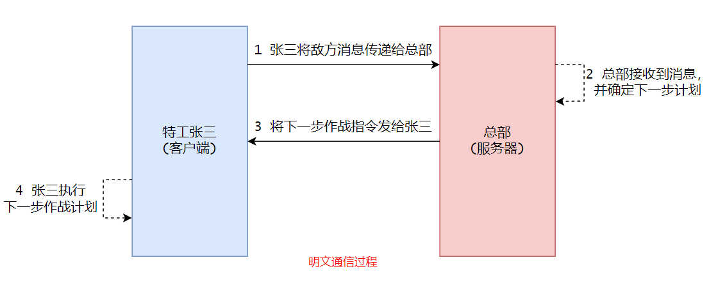

3. 使用数字签名加密通信:对于这种通信，由于私钥只有总部有，因此张三的信息无法被敌军获取，由于签名的存在敌军无法篡改总部回复的消息。但是敌军任然可以冒充总部对张三下达指令(敌军只需要偷换张三的公钥等操作,如下图所示)，此外敌军也可以截获总部对张三下达的指令(教程说由于数字签名附加的位置不确定和数字签名的原始数据不一定[从某些位置截取数据进行加密得到数字签名]导致无法截获)。<br>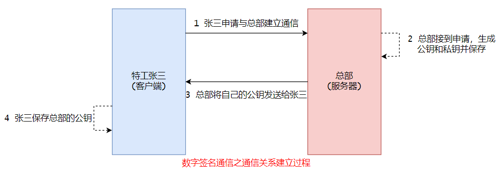<br>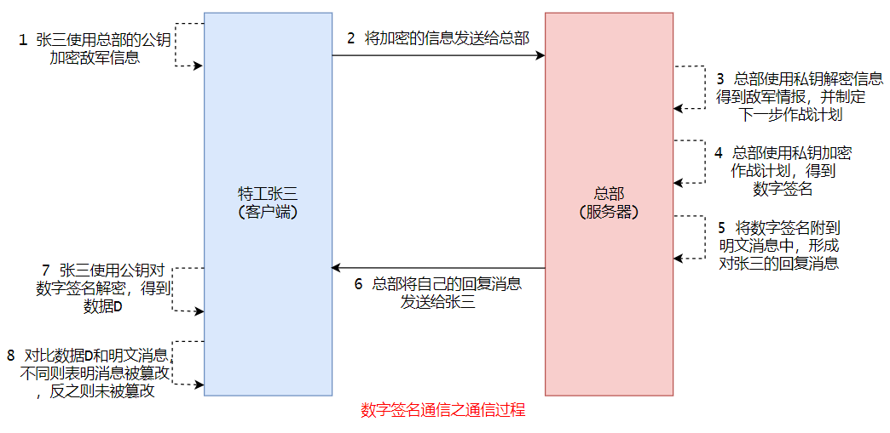<br>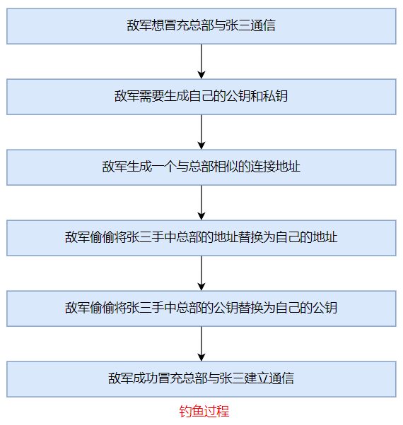

4. 使用数字证书通信:CA证书由受信任的证书颁发机构签发，提供了一个信任链，使通信双方能够验证彼此的身份。对于上面提到的钓鱼问题，尽管钓鱼网站可以尝试伪装，但获取有效的CA证书非常困难，并且现代安全机制（如证书透明性和严格的身份验证）使得这种攻击更加困难。<br>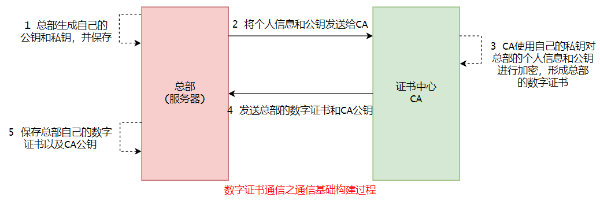<br>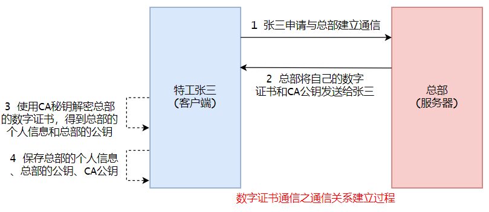<br>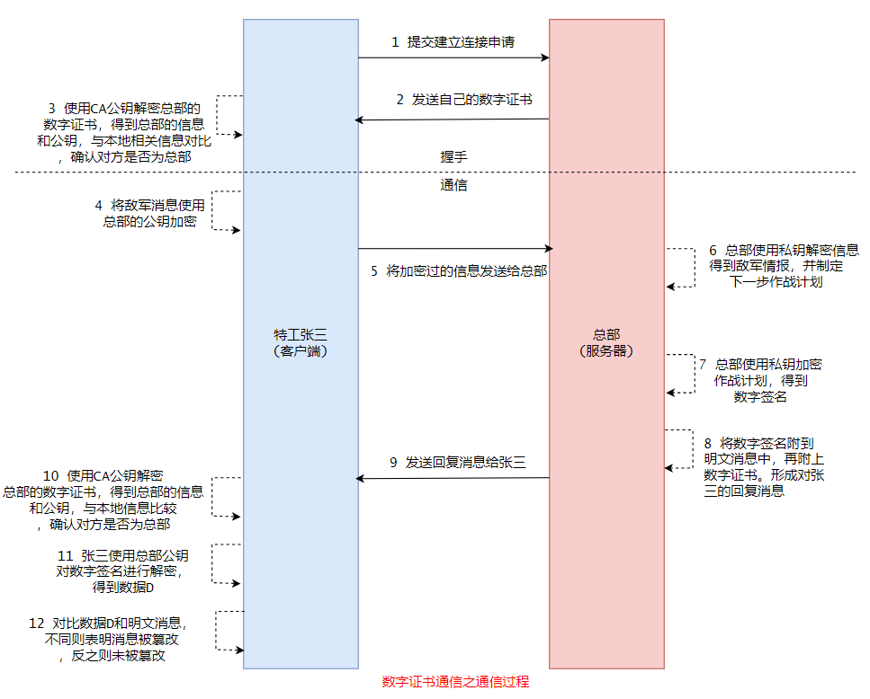

5. <font color=red>需要说明的是，在上述过程中，服务器的返回消息并未加密，服务器只是使用私钥生成了数字签名(并且实际上并不是对完整的返回消息进行私钥加密得到数字签名，一般而言首先会对返回消息进行哈希值计算等操作)，以防止响应数据被篡改。故而我们提出下面的通信方式。</font>

6. 混合通信方式(HTTPS):上述通信过程，需要通过CA证书对服务器身份进行验证，这里使用的是非对称加密，效率是狠毒的。进而提出身份验证采用非对称加密的验证方式，传输采用对称加密的验证方式的HTTPS协议。<br>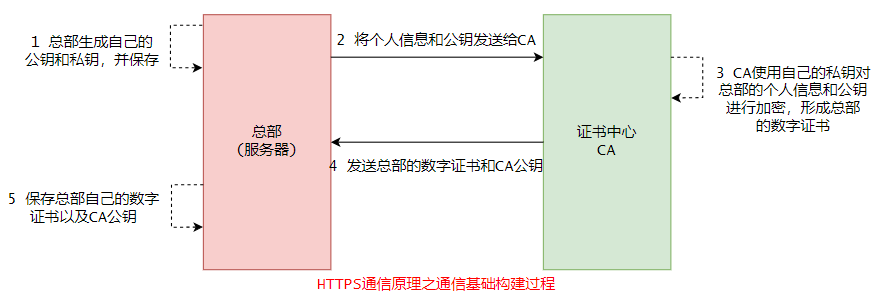<br>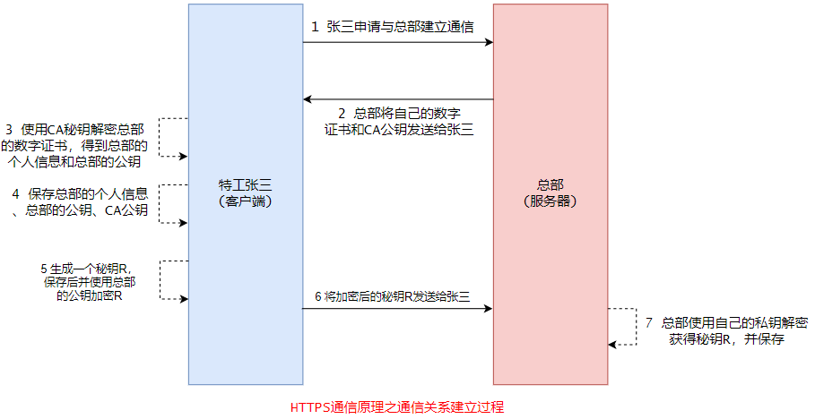<br>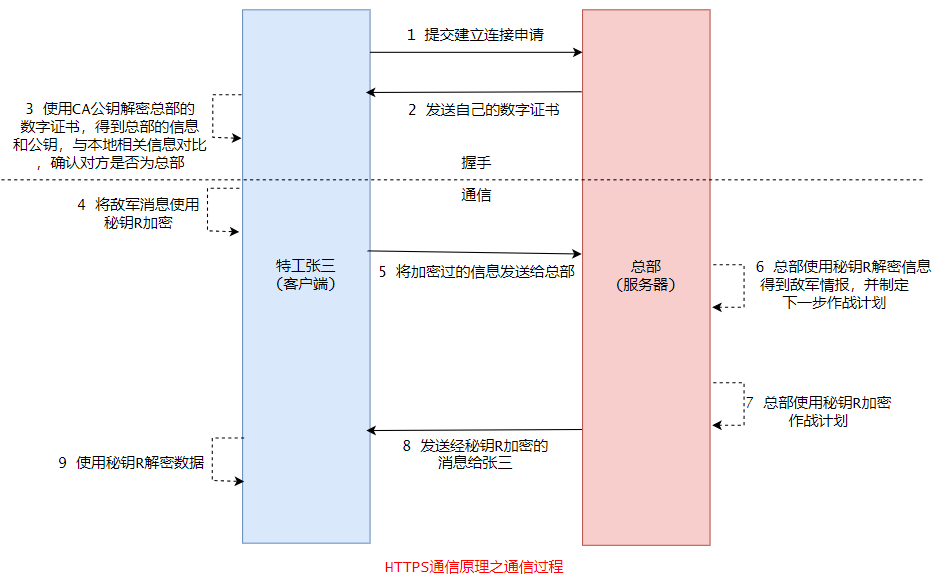

7. 在使用对称加密秘钥进行后续通信时，通常不需要每个消息都附加数字签名，但在重要场合和敏感数据传输时，附加数字签名仍然可以增强安全性，提供身份验证和数据完整性保护(此时一般使用私钥构建数字签名，附加到返回消息中，然后一起使用秘钥R加密，将得到结果返回给客户端)。

   

##### TLS握手

1. 实际上秘钥 R 的产生并没有上述描绘的那么简单，并且秘钥R也不是完全有客户端生成的。
2. 其过程大致分为如下:
   1. 客户端向服务器发送 `ClientHello` 消息，包含以下信息:支持的 TLS 版本、支持的加密套件列表（包括对称加密算法和哈希算法）、生成的随机数（Client Random）、数据压缩方法。
   2. 服务器回复 `ServerHello` 消息，选择以下信息:选择的 TLS 版本、选择的加密套件、生成的随机数（Server Random）。
   3. <font color=red>注意:到这里，服务端和客户端都已经拥有两个随机数，并确定加密算法。</font>
   4. 服务器将其数字证书（由受信任的 CA 签发）发送给客户端,证书中包含服务器的公钥和身份信息。
   5. 客户端对服务器的数字证书进行验证。
   6. 客户端生成一个预主密钥（pre-master secret），并使用服务器的公钥对其进行加密，然后发送给服务器,只有服务器能够使用其私钥解密。
   7. <font color=red>注意:到这里，服务端和客户端都已经拥有三个随机数，且第三个随机数保密程度很高！！！</font>
   8. 客户端和服务器使用预主密钥和之前交换的随机数，生成会话密钥（session keys），用于后续的对称加密。
   9. 客户端发送 `ChangeCipherSpec` 消息，指示后续的消息将使用新生成的会话密钥进行加密。
   10. 客户端发送 `Finished` 消息，确认握手已成功完成，并使用会话密钥对该消息进行加密。
   11. 服务器发送 `ChangeCipherSpec` 消息，指示后续的消息将使用新生成的会话密钥进行加密。
   12. 服务器发送 `Finished` 消息，确认握手已成功完成，并使用会话密钥对该消息进行加密。
3. 总的来说，最终的回话秘钥 R 是由客户端和服务端共同约定产生的。


##### tcp

1. 都研究到这里，顺带学习一下tcp的三次握手和四次挥手:
2. 关于详细内容，参考[博客](https://www.cnblogs.com/three-fighter/p/14802786.html)


##### MD5加密

md5加密的salt的原理:

