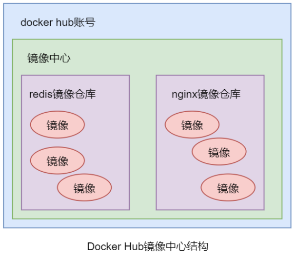

#### 镜像推送

##### docker hub

1. 准备一个镜像，这里我使用自己编写的一个镜像。

2. 首先需要创建一个 docker hub 账号，对于 dockerhub ，存在两种登录方式:(需要网络保障)

   1. 运行`docker login`然后打开验证链接，输入验证码即可。
   2. 运行`docker login -u`指定登录账号，然后输入密码即可。

3. 登录账号后需要通过 `docker tag` 命令可以对原有镜像进行复制并重命名。这个重命名的镜像的 repository 中必须采用`<username>/<software-name>`格式，且username 必须是登录 Docker Hub 的用户名。例如:

   ```bash
   docker tag random-image-api:latest dreamfishyx/random-image-api:1.0
   ```

4. 使用 `docker push`将对应镜像推送到镜像中心。例如:

   ```bash
   $ docker push dreamfishyx/random-image-api:1.0
   The push refers to repository [docker.io/dreamfishyx/random-image-api]
   e879f5b8746e: Pushed
   b5becf2d59f9: Pushed
   b6138c1f34d1: Pushed
   0c1dc0e3e9c1: Pushed
   b37145d52b36: Mounted from library/python
   5b2bbb7d3a14: Mounted from library/python
   1eae3090c894: Mounted from library/python
   8d853c8add5d: Mounted from library/python
   1.0: digest: sha256:a13f6d097591a4cce76b80d0f20ec140ba72131181b1d860ec89885f3404b0ae size: 1997
   ```

5. 通过 `docker logout` 命令可以从 Docker 引擎中退出登录的 Docker Hub 账号。

   


##### 阿里云镜像中心

1. 关于阿里云镜像中心和 docker hub 的对比，阿里云不同于docker hub 使用用户名，而是改用命名空间，可以很好的保护用户隐私。<br><br>
2. 阿里云这里对个人用户是有免费的使用额度的。
   1. 首先需要一个已经实名的阿里云账号
   2. 登录阿里云后，打开阿里云的容器镜像服务的控制台,找到“实例列表”并创建个人实例:<br>
   3. 设置密码:<br>
   4. 先创建命名空间:<br>
   5. 后创建镜像仓库(镜像仓库也可以不创建，在创建命名空间时开启自动创建命名空间即可):<br>
   6. 后面在镜像仓库的基本信息中存在登录和推送教程。
3. 登录到阿里云镜像:` docker login --username=<user_name> <url>`,用户名是阿里云账户的名称。
4. 登录账号后需要通过 `docker tag` 命令可以对原有镜像进行复制并重命名。这个重命名的镜像的 repository 中必须采用`<namespace>/<software-name>`格式，且 namespace 必须是创建的命名空间。
5. 推送:`docker pull xxx`。
6. 退出:`docker logout`。


#### 前置知识

##### htpasswd

1. htpasswd命令是Apache的Web服务器内置工具，用于创建和更新储存用户名、域和用户基本认证的密码文件。registry 私有镜像中心中默认是没有用户认证功能的，可通过 htpasswd 来实现用户认证。

2. htpasswd 命令在 Linux 中默认是没有的，需要先行安装。而该工具在 httpd-tools 工具包中，所以需要先安装该工具包。

   ```bash
   # centos8
   yum install -y httpd-tools
   
   # archlinux
   pacman -S apache-tools
   ```

3. 使用参数：

   1. -c 创建一个加密文件。
   2. -n 不更新加密文件，只将加密后的用户名密码显示在标准输出。
   3. -m 默认采用MD5算法对密码进行加密(默认)。
   4. -2 强制对密码进行 SHA-256 哈希处理（安全）。
   5. -5 强制对密码进行 SHA-512 哈希处理（安全）。
   6. -B 强制对密码进行 bcrypt 哈希处理（非常安全）。
   7. -d 采用CRYPT算法对密码进行加密。
   8. -p 不对密码进行进行加密，即明文密码。
   9. -s 采用SHA算法对密码进行加密。
   10. -b 在命令行中一并输入用户名和密码而不是根据提示输入密码。
   11. -D 删除指定的用户。
   12. -i 从标准输入读取密码而不进行验证（用于脚本使用）。
   13. -v 验证指定用户的密码。

4. 使用举例:

   1. 我们在用户目录下创建一个 auth 目录，在其中存放生成的认证文件`htpasswd.user`。

      ```bash
      # 创建目录
      mkdir ~/auth
      
      # 进入目录
      cd ~/auth
      
      # 生成认证文件
      htpasswd -Bbc htpasswd.user dreamfish abc123
      
      # 查看生成的认证文件                                                                               15:48:44
      cat htpasswd.user
      ```

   2. 向文件中再次加入用户 fish :

      ```bash
      htpasswd -Bb htpasswd.user fish abc123
      ```

   3. 修改 fish 的密码: 修改密码与添加密码使用方式相同：若指定的用户名不存在，则为添加；若指定的用户名存在，则为密码修改。

      ```bash
      htpasswd -Bb htpasswd.user fish ABC123
      ```

   4. 删除用户:

      ```bash
      htpasswd -D htpasswd.user fish
      ```

   5. 此外:实际上我们还可以通过 -n 选项配合重定向符号将用户密码写入认证文件，而修改或者添加时则使用 追加重定向符号。

      ```bash
      # 创建
      htpasswd -Bbn dreamfish abc123 > htpasswd.user
      
      # 删除
      htpasswd -Bbn fish abc123 >> htpasswd.user
      ```

> 其实在 httpd-tools 工具包中还存在一个压力测试的工具` ab` ，例如`ab -n 100 -c 10 http://localhost:8080/`发送100个请求，每次发送10次，进行压力测试。

