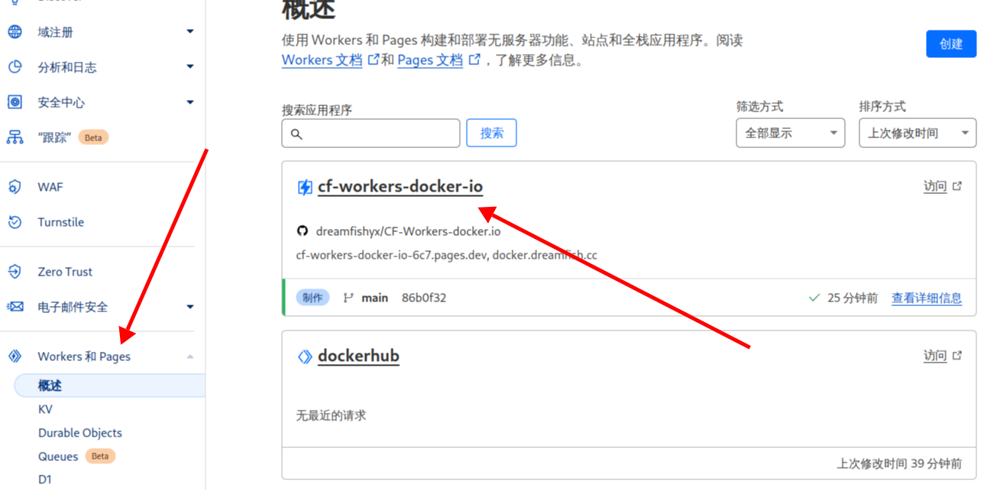
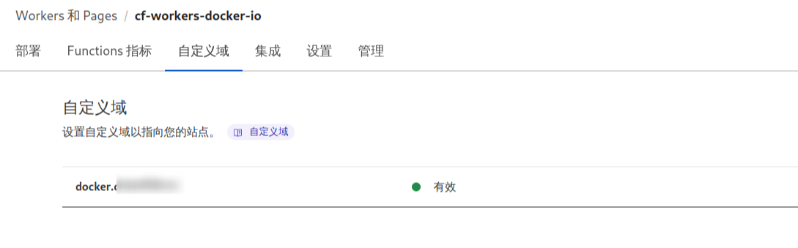

1. 注册帐号:[cloudflare](https://dash.cloudflare.com/)

2. 拉取githubin项目到自己仓库：[CF-Workers-docker.io](https://github.com/cmliu/CF-Workers-docker.io?tab=readme-ov-file)

3. 配置cloudflare的Workers和Pages

4. 导入仓库CF-Workers-docker:

   <br>

5. 配置自定义域名,建议使用子域名。

   <br>

6. 修改docker配置文件,使用个人镜像加速并重启docker服务：

   ```bash
   # 配置镜像
   sudo vim /etc/docker/daemon.json
   
   # 重启服务
   sudo systemctl restart docker.service
   ```

7. 参考教程：[配置教程](https://www.lincol29.cn/cloudflaretodocker)

   