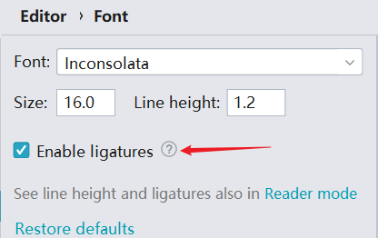
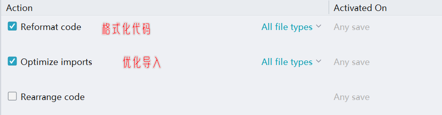
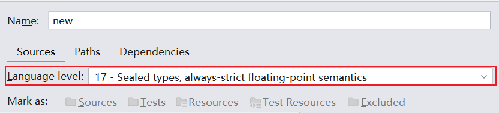
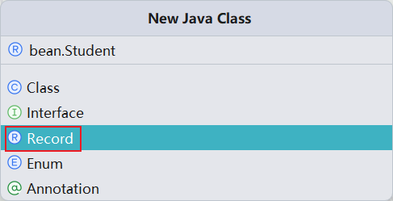
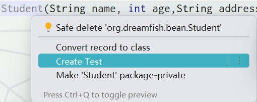
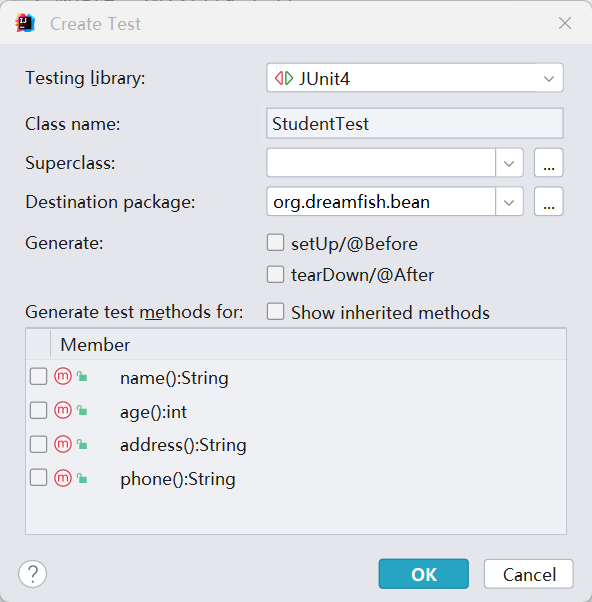
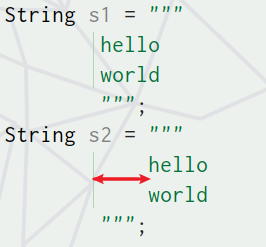
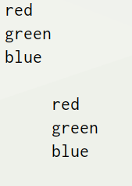

#### ps:

1.   对于idea，在`settings->Editir->Font`中勾选`Enable ligatures`启用连字体验效果更好(例如`>=`的显示)<br>

2.   在`settings->Tools->Action on Save`中配置保存行为：<br>

3.   使用`FileReader`来读取文件，`FileReader`默认使用系统的默认字符编码，如果你的文件不是使用这种编码保存的，那么读取时就可能出现乱码。推荐`reader = new InputStreamReader(new FileInputStream(file), StandardCharsets.UTF_8)`。

     

     


#### 1-Java Record

##### a-简介

1.   首先强调一点，创建idea项目后,记得修改项目jdk版本、编码、maven仓库等配置(也可以直接为新建项目创建一个配置模板)。
2.   Java Record是Java 14中的预览函数，引入的一种特殊的Java类，用于定义不可变的数据类。Java Record实例可以用于保存从数据库查询返回的记录、从远程服务调用返回的记录、从CSV文件读取的记录或类似类型的用例。
3.   Java Record具有简洁的语法，用于定义仅包含数据的不可变类，可以定义为final类。Java编译器会生成equals、hashCode和toString方法，以及私有、final字段和公共构造函数。
4.   Java Record 避免上述的样板代码，如下特点：
     1.   带有全部参数的构造方法。
     2.   public访问器。
     3.   `toString()`,`hashCode()`,`equals()`。
     4.   无 set，get 方法。没有遵循Bean的命名规范。
     5.   final 类，不能继承 Record，Record 为隐式的final类，除此之外与普通类一样。
     6.   不可变类，通过构造创建 Record。
     7.   final属性，不可修改。
     8.   不能声明实例属性，能声明static成员。


##### b-创建java record、方法

1.   首先需要确保项目的语言级别是java14及其之上(在项目配置中设置),不然后面不会出现创建java record选项。<br>

2.   这里由于之前配置过maven的jdk版本为1.8，需要在maven安装目录下配置文件中修改（`"D:\Environment\apache-maven-3.9.0\conf\settings.xml"`）。

     ```xml
     <profiles>
         <profile>
             <id>jdk-17</id>
             <activation>
                 <activeByDefault>true</activeByDefault>
                 <jdk>17</jdk>
             </activation>
             <properties>
                 <maven.compiler.source>17</maven.compiler.source>
                 <maven.compiler.target>17</maven.compiler.target>
                 <maven.compiler.compilerVersion>17</maven.compiler.compilerVersion>
             </properties>
         </profile>
     </profiles>
     ```

3.   新建java文件，选择record,输入类的名称(我的是bean包下的Student类)。<br>

4.   编写Student类如下：

     ```java
     public record Student(String name, int age,String address,String phone) {
     
     }
     ```

5.   测试Student类，首先在maven的pom.xml中添加junit的依赖：

     ```xml
     <dependencies>
             <dependency>
                 <groupId>junit</groupId>
                 <artifactId>junit</artifactId>
                 <version>4.13.1</version>
                 <scope>test</scope>  <!-- 依赖范围,test代表测试时使用,编译时不使用 -->
             </dependency>
         </dependencies>
     ```

6.   编写测试类，快捷方式光标放在Student类名上，`ALT+ENTER`选择创建测试：<br><br><br>

7.   编写运行测试类(可以使用`ALT+INSERT`快速创建测试方法)：

     ```java
     public class StudentTest {
     
         @Test
         public void test1() {
             Student student = new Student("Dream fish", 18, "China", "123456789");
     
             // java record没有get、set方法，但是可以通过public访问器访问(属性不可更改)
             String name = student.name();
     
             // java record可以通过toString()方法打印
             System.out.println(student.toString());
     
             // java record可以通过equals()方法比较
             Student student1 = new Student("Dream fish", 18, "China", "123456789");
             System.out.println(student.equals(student1));
     
             // java record可以通过hashCode()方法获取哈希值
             System.out.println(student.hashCode());
     
             // java record可以通过copy()方法复制
             Student student2 = student.withName("Dream fish2");
             System.out.println(student2.toString());
     
         }
     
     
     }
     ```

8.   java recorrd还可以定义方法、静态方法：

     ```java
     public record Student(String name, int age,String address,String phone) {
         
         //实例方法
         public String contact() {
             // String.format()方法用于格式化字符串
             return String.format("name: %s, age: %d, address: %s, phone: %s", name, age, address, phone);
         }
         
         //静态方法
         public static String nameUpperCase(String name) {
             // Optional.ofNullable()方法用于判断是否为空
             // Optional.orElse()方法用于判断是否为空，如果为空则返回指定的值
             return Optional.ofNullable(name).orElse("no name").toUpperCase();
         }
     }
     ```

     


##### c-三种构造方法

1.   可以在 Record 中添加构造方法， 有三种类型的构造方法分别：

     1.  紧凑型构造方法(`Compact Constructor`)：没有任何参数，甚至没有括号(用来进行参数校验的)。
     2.  规范构造方法：以所有成员作为参数，这是由编译器自动生成的。
     3.  定制构造方法：自定义参数个数。

     ```java
     public record Student(String name, Integer age,String address,String phone) {
     
         //紧凑型构造方法(Compact Constructor)
         public Student {
             if (name == null || name.isEmpty()) {
                 throw new IllegalArgumentException("name is null or empty");
             }
             if (age < 0 || age > 200) {
                 throw new IllegalArgumentException("age is illegal");
             }
             if (address == null || address.isEmpty()) {
                 throw new IllegalArgumentException("address is null or empty");
             }
             if (phone == null || phone.isEmpty()) {
                 throw new IllegalArgumentException("phone is null or empty");
             }
         }
     
     
         // 定制构造方法
         public Student(String name, int age) {
             this(name, age, "China", null);
         }
     
     }
     ```

2.   下面编写出测试代码会发现，在执行规范构造方或者定制构造方法前会执行紧凑型构造方法：

     ```java
     public class StudentTest {
         @Test
         public void test() {
             //报错java.lang.IllegalArgumentException: age is illegal
             Student s_f = new Student("Dream fish", 1118, "China", "123456789");
     
             //报错java.lang.IllegalArgumentException: name is null or empty
             Student s_c = new Student(null, 18);
         }
     }
     ```

3.   下面我们看一下编译后的class文件(借助idea的反编译)：

     ```java
     //
     // Source code recreated from a .class file by IntelliJ IDEA
     // (powered by FernFlower decompiler)
     //
     
     package org.dreamfish.bean;
     
     public record Student(String name, Integer age, String address, String phone) {
         public Student(String name, Integer age, String address, String phone) {
             if (name != null && !name.isEmpty()) {
                 if (age >= 0 && age <= 200) {
                     if (address != null && !address.isEmpty()) {
                         if (phone != null && !phone.isEmpty()) {
                             this.name = name;
                             this.age = age;
                             this.address = address;
                             this.phone = phone;
                         } else {
                             throw new IllegalArgumentException("phone is null or empty");
                         }
                     } else {
                         throw new IllegalArgumentException("address is null or empty");
                     }
                 } else {
                     throw new IllegalArgumentException("age is illegal");
                 }
             } else {
                 throw new IllegalArgumentException("name is null or empty");
             }
         }
     
         public Student(String name, int age) {
             this(name, age, "China", (String)null);
         }
     
         public String name() {
             return this.name;
         }
     
         public Integer age() {
             return this.age;
         }
     
         public String address() {
             return this.address;
         }
     
         public String phone() {
             return this.phone;
         }
     }
     
     ```

4.   通过上述class文件，我们可以发现在编译时，会自动把<span style="color:red">紧凑型构造方法</span>的逻辑包裹在<span style="color:red">规范构造方法</span>外实现参数校验，并且<span style="color:red">定制构造方法</span>需要间接调用<span style="color:red">规范构造方法</span>实现参数校验。并且在编译时创建`public`访问器。

5.   但是同样的，通过class文件发现并没有`toString()`等方法，那么猜测可能是继承父类的。通过下面代码得知其父类为`java.lang.Record`：

     ```java
     Student s_f = new Student("Dream fish", 118, "China", "123456789");
     //获取父类
     Class<? super Student> superclass = Student.class.getSuperclass();
     //Class<?> superclass = s_f.getClass().getSuperclass();
     System.out.println(superclass);
     //class java.lang.Record
     ```

6.   idea中使用`import java.lang.Record`研究Record类，发现父类提供`toString()、equals()、hashCode()`。


##### d-实现接口

1.   Record还可以实现一个接口，但是不能继承其他类(默认继承`java.lang.Record`)。

2.   例如下面存在一个Person接口：

     ```java
     public interface Person { 
     
         // 思考
         void think(); 
     
         // 存在
         void exist();
     }
     ```

3.   创建一个Record记录类DreamFish实现它：

     ```java
     public record DreamFish(String name, Integer age) implements Person{
     
         @Override
         public void think() {
             System.out.println("I am thinking!");
         }
     
         @Override
         public void exist() {
             System.out.println("I am existing!");
         }
     }
     ```


##### e-局部、嵌套recod

1.   Record 可以作为局部对象使用。在代码块中定义并使用 Record。例如下面我在Dream类中创建一个`local record`名为Fish。

     ```java
     public class Dream {
         
         public void startDream() {
             
             record Fish(String name, Integer age){}
             
             Fish fish = new Fish("Dream fish", 18);
             
             System.out.println("I am dreaming about a fish named " + fish.name());
             
         }
     }
     ```

2.   Record也可以嵌套使用，用于表示复杂的数据类型对象。如下：

     ```java
     public record Person(String name, List<Thing> things){}  // 人
     
     public record Thing(String name, String description) {}  // 物品
     ```

     ```java
     public class StudentTest {
         @Test
         public void test(){
             ArrayList<Thing> things = new ArrayList<>();
             things.add(new Thing("dream", "星河梦..."));
     
             Person person = new Person("Dream fish", things);
         }
     }
     ```

     


##### f-instance of

1.   首先提一嘴，`instance of`在jdk14时进行了改善。在jdk14之前，使用`instance of`后如果使用被判断的对象，需要手动转换类型。

     ```java
     Object obj = new ArrayList<>();
     
     if (obj instanceof ArrayList) {
         ArrayList list = (ArrayList)obj;
         list.add("something is adding!");
     }
     ```

2.   但是在jdk14开始，可以在`instance of`判断类型时指定变量名称进行类型转换。

     ```java
     Object obj = new ArrayList<>();
     
     if (obj instanceof ArrayList list) {  // 提供list变量名
         list.add("something is adding!");
     }
     ```

3.   那么下面的内容就很好理解了：`instance of `能够与 Java Record 一起使用，编译器知道记录组件的确切数量和类型。

     ```java
     public record Cat(String name, Integer age, String color) {
         
         //是否是黑猫
         public static boolean isBlack(Object cat) {
             if (cat instanceof Cat c) {
                 return "black".equals(c.color());  
             } else {
                 return false;
             }
         }
         
     }
     
     ```

4.   在jdk19时又新增一个关于Record类的增强的模式匹配，可以在`instance of、switch`等判断中自动获取属性(个人觉得类似于python的`match-case`模式匹配)。它需要你指明在判断Record类型时接受属性值的变量名称。<span style="color:red">但是注意变量个数需要和属性个数一致，不然报错。</span>(这里也可提供一个变量名接收类型转换后的对象，没必要)

     ```java
     public record Cat(String name, Integer age, String color) {
     
         //是否是黑猫
         public static boolean isBlack(Object cat) {
             if (cat instanceof Cat(String name, Integer age, String color)) {  // 变量个数需要匹配属性个数
                 return "black".equals(color);  // 直接使用color
             } else {
                 return false;
             }
         }
     }
     ```

     ```java
     // 二者结合
     public record Cat(String name, Integer age, String color) {
     
         public static boolean isBlack(Object cat) {
             if (cat instanceof Cat(String name, Integer age, String color) c) {
                 return "black".equals(color);  
                 // return "black".equals(c.color());
             } else {
                 return false;
             }
         }
     }
     ```


##### 补充

1.   abstract 类 `java.lang.Record `是所有 Record 的父类。

2.   有对于 `equals()`，`hashCode()`，`toString()`方法的定义说明。

3.   Record 类能够实现` java.io.Serializable` 序列化或反序列化。

4.   Record 支持泛型，例如` record Gif<T>( T t ) { }`

5.   `java.lang.Class` 类与 Record 类有关的两个方法：

     1.   `boolean isRecord()` : 判断一个类是否是 Record 类型。
     2.   `RecordComponent[] getRecordComponents()`：Record 的数组，表示此记录类的所有记录组件。

6.   具体举例如下：<br>

     ```java
     public record Cat(String name, Integer age, String color) {}
     ```

     ```java
     public class StudentTest {
         @Test
         public void test_f(){
             Cat cat = new Cat("Tom", 2, "black");
     
             boolean res = cat.getClass().isRecord();
             
             System.out.println("cat的类型是否为Record:"+res);
         }
     
         @Test
         public void test_s(){
             Cat cat = new Cat("Tom", 2, "black");
             // 获取所有的RecordComponent,RecordComponent是Record的组成部分
             for (RecordComponent component : cat.getClass().getRecordComponents()) {
                 System.out.println(component);
             }
     
         }
     }
     ```

     


##### g-对比

1.   Java Record 是创建不可变类且减少样板代码的好方法。Lombok 是一种减少样板代码的工具。两者有表面上的重叠部分。可能有人会说 Java Record 会代替 Lombok. 两者是有不同用途的工具。

2.   Lombok 提供语法的便利性，通常预装一些代码模板，根据您加入到类中的注解自动执行代码模板。这样的库纯粹是为了方便实现 POJO 类。通过预编译代码。将代码的模板加入到 class 中。

3.   Java Record 是语言级别的，一种语义特性，为了建模而用，数据聚合。简单说就是提供了通用的数据类，充当"数据载体"，用于在类和应用程序之间进行数据传输。

4.   下面补充一下`lombok`的使用：

     1.   引入lombok依赖（springboot提供依赖管理，无需设置版本；若是其他可能需要）

          ```xml
          <!--lombok依赖-->
          <dependency>
              <groupId>org.projectlombok</groupId>
              <artifactId>lombok</artifactId>
              <version>1.18.12</version>
          </dependency>
          ```

     2.   idea安装lombok插件，(不报错可忽略当此步设置，但是一般idea会在报错时自动提醒你打开，没必要手动去开启)`file–>setting–>build,excecution,deployment–>compiler–>annotation processors`勾选上` enable annotation processing`,并重启idea。<br>

     3.   在相关类上标记注解，在编译时帮助生成相关代码（一部分）

     1.  1.  `@Setter`：注解在类时为所有字段生成setter方法，注解在字段上时为该字段生成setter方法。
         2.  `@Getter` ：使用方法同上，区别在于生成的是getter方法。
         3.  `@ToString `：注解在类，添加toString方法。还可以加其他参数，例如`@ToString(exclude="id")`排除 id 属性。
         4.  `@EqualsAndHashCode` ：注解在类，生成hashCode和equals方法。
         5.  `@NoArgsConstructor` ：注解在类，生成无参的构造方法。
         6.  `@AllArgsConstructor` ：注解在类，生成包含类中所有字段的构造方法。
         7.  ``@Data`` ：注解在类，生成setter/getter、equals、canEqual、hashCode、toString方法，如为final属性，则不会为该属性生成setter方法。
         8.  `@Slf4j `：注解在类，生成log变量，严格意义来说是常量。`private static final Logger  log = LoggerFactory.getLogger(UserController.class);`

     2.  ```java
         //示例1
         @ToString(exclude = "age")
         @Getter
         @Setter
         @ConfigurationProperties(prefix = "my.cat")
         @AllArgsConstructor
         public class Cat {
             private String name;
             private int age;
         
         }
         
         //示例2
         @Slf4j  //生成名为log的变量
         @RestController
         public class HelloController {
         
             @RequestMapping("/")
             public String sayHello(){
                 String s="该方法已被调用！";
                 log.info(s);  // log.info()用于输出日志
                 return "Hello world!";
         
             }
         }
         ```

         


##### h-Option补充

1.   首先要知道Option是jdk8的内容(jdk10补充)，用于处理java中的`null`。

2.   创建Option的方法如下：

     ```java
     //创建空的Optional
     Optional<String> empOpt = Optional.empty();
     
     //创建不为空的Optional,此时若传为null，则抛空指针异常
     Optional<String> opt = Optional.of("hello");
     
     //创建可以为空的Optional
     Optional<String> nullOpt = Optional.ofNullable(null);
     ```

3.   `get()`用来得到Optional实例中的值,有值则将其返回，否则抛出`NoSuchElementException`。

4.   `isPresent()`用来判断Optional实例中值存在与否，值存在返回`true`，否则返回`false`。

     ```java
     public class Main {
         public static void main(String[] args) {
             Optional<String> optional = Optional.of("Dream fish");
     
             if (optional.isPresent()) {  // 判断optional是否有值
                 System.out.println(optional.get()); // 获取optional的值
             }
         }
     }
     ```

5.   `ifPresent()`如果Optional实例有值则为其调用consumer接口(Consumer类包含一个抽象方法对传入的值进行处理，但没有返回值)，否则不做处理。

     ````java
     public class Main {
         public static void main(String[] args) {
             Optional<Dog> dog = Optional.of(new Dog("Tom", 2, "black"));
     
             dog.ifPresent((d) -> System.out.println(d));
             //如果dog不为空，则执行ifPresent中的代码，否则不执行
         }
     }
     ````

6.   `orElse()`如果有值则将其返回，否则返回指定的其它值。

7.   `orElseGet`与`orElse`方法类似，区别在于得到的默认值。orElse方法将传入的字符串作为默认值，orElseGet方法可以接受Supplier接口的实现用来生成默认值。示例如下:

8.   `orElseThrow()`如果有值则将其返回，否则抛出supplier接口创建的异常。

9.   `map()`如果有值，则对其执行调用mapping函数得到返回值。如果返回值不为null，则创建包含mapping返回值的Optional作为map方法返回值，否则返回空Optional。

10.   `flatMap()`如果有值，为其执行mapping函数返回Optional类型返回值，否则返回空Optional。flatMap与map(Funtion)方法类似，区别在于flatMap中的mapper返回值必须是Optional。

11.   `filter`个方法通过传入限定条件对Optional实例的值进行过滤。如果有值并且满足断言条件返回包含该值的Optional，否则返回空Optional。

12.   函数式接口：

      1.   消费型接口: `Consumer< T> void accept(T t)`、有参数、无返回值的抽象方法。
      2.   供给型接口: `Supplier < T> T get() `、无参、有返回值的抽象方法。
      3.   断定型接口: `Predicate<T> boolean test(T t)`、有参，但是返回值类型是固定的boolean。
      4.   函数型接口: `Function<T,R> R apply(T t)`、有参、有返回值的抽象方法；

13.   方法引用、构造器引用：

      1.   使用方法引用的时候 需要保证引用方法的参数列表、返回值类型与我们当前所要实现的函数式接口方法的参数列表、返回值类型保持一致。

      2.   方法引用可以看做是Lambda表达式深层次的表达。换句话说，方法引用就是Lambda表达式，也就是函数式接口的一个实例，通过方法的名字来指向一个方法，可以认为是Lambda表达式的一个语法糖。

      3.   格式：使用操作符 `::` 将类(或对象) 与 方法名分隔开来。

      4.   如下三种主要使用情况(含构造器)(引用的构造器、方法是可以存在参数的)：

           1.   `对象::实例方法名`
           2.   `类::静态方法名`
           3.   `类::实例方法名`

      5.   举例如下：

           ```java
           @Data
           @Log
           @NoArgsConstructor  //lombok无参构造
           @AllArgsConstructor //lombok全参构造
           @ToString
           public class Dog {
               private String name;
               private Integer age;
               private String color;
           
               public void say(){
                   log.info("汪汪汪");
               }
           
           }
           ```

           ```java
           public class Main {
               public static void main(String[] args) {
                   Optional<Dog> dog = Optional.of(new Dog("Tom", 2, "black"));
           
                   dog.ifPresent(Dog::say);
                   //如果dog不为空，则执行dog.say
               }
           }
           ```

           ```java
           public class Main {
               public static void main(String[] args) {
                   Optional<Object> empty = Optional.empty();
           
                   //如果empty不为空，则返回empty中的对象，否则返回orElse中的对象
                   Object o = empty.orElseGet(Dog::new);
           
               }
           }
           ```

           


#### 2-switch表达式

##### a-简介

1.   `switch`表达式带来的不仅仅是编码上的简洁、流畅，也精简了`switch`语句的使用方式，同时也兼容之前的`switch`语句的使用。

2.   `switch `语句一般使用冒号` ：`来作为语句分支代码的开始。而 `switch` 表达式则提供了新的分支切换方式，即` ->` 符号右则表达式方法体在执行完分支方法之后，自动结束 `switch `分支，同时 `-> `右则方法块中可以是表达式、代码块或者是手动抛出的异常。

3.   `case ->` 与 `case ：`不能混用,一个 switch 语句块中使用一种语法格式。

4.   举例如下：

     ```java
     public static void main(String[] args) {
         int week = 7;
         String memo = "";
         switch (week){
             case 1 -> memo = "星期日，休息";
             case 2,3,4,5,6-> memo="工作日";
             case 7 -> memo="星期六，休息";
             default -> throw new IllegalArgumentException("无效的日期：");
         }
         System.out.println(memo);
     }
     ```

     


##### b-yeid返回值

1.   `yeild `让 `switch `作为表达式，能够存在返回值。并且`switch`表达式的返回值就是执行的`yield`后面跟的值。

2.   类似于`return`，执行完`yield`会跳出`switch`块。

     ```java
     public static void main(String[] args) {
         int week = 2;
         String memo = switch (week){
             case 1: yield "星期日，休息";
             case 2,3,4,5,6: yield "工作日";
             case 7: yield "星期六，休息";
             default: yield "无效日期";
         };
         System.out.println(memo);
     }
     ```


##### c-代码块

1.   `switch`表达式中也可以执行代码块，其中也可以使用`yield`返回值(不使用返回`null`)。

     ```java
     public static void main(String[] args) {
         int week = 1;
         
         String memo = switch (week){
             case 1 ->{
                 System.out.println("week=1 的 表达式部分");
                 yield "星期日，休息";
             }
             case 2,3,4,5,6 ->{
                 System.out.println("week=2,3,4,5,6 的 表达式部分");
                 yield "工作日";
             }
             case 7 -> {
                 System.out.println("week=7 的 表达式部分");
                 yield "星期六，休息";
             }
             default -> {
                 System.out.println("其他语句");
                 yield "无效日期";
             }
         };
         System.out.println(memo);
     }
     ```

     


##### d-匹配模式

1.   在jdk17中，如同 `instanceof` 一样，`switch` 也增加了类型匹配自动转换功能。<br>

      

2.   此外，jdk17中也添加了`switch`对`null`的匹配判断。

3.   只需要在`case`后面的匹配类型后提供一个变量名就可以了，具体举例如下：

     ```java
     public class StudentTest {
         @Test
         public void test(){
             Object obj = new Dog("Tom", 2, "black");
     
             switch (obj){
                 case Dog d -> System.out.println(d);
                 case Cat c -> System.out.println(c);
                 case null -> System.out.println("null");
                 default -> System.out.println("未知类型");
             }
         }
     }
     ```

4.   此外，还有就是jdk19的对于Record类型的增强型匹配模式，同前面`instance of`一样，可以在`switch-case`中自动获取属性(个人觉得类似于python的`match-case`模式匹配)。你需要指明在Record判断类型时接受属性值的变量名。<span style="color:red">但是注意变量个数需要和属性个数一致，不然报错。</span>(这里也可提供一个变量名接收类型转换后的对象，没必要)

     ```java
     public class StudentTest {
         @Test
         public void test(){
             Object obj = new Cat("Tom", 2, "black");
             switch (obj){
                 case Cat(String name,Integer age,String color) -> System.out.println(name);
                 case Dog d -> System.out.println(d);
                 case null -> System.out.println("null");
                 default -> System.out.println("未知类型");
             }
         }
     }
     ```


#### 3-文本块(text block)

##### a-简介

1.   Text Block 处理多行文本十分方便，省时省力，无需连接 `+`,单引号，换行符等。当Text Block 可以提高代码的清晰度时，推荐使用。比如代码中嵌入 SQL 语句。此外多行字符串，应该使用 Text Block。<br>

2.   语法：使用三个双引号字符括起来的字符串。

3.   要求：

     1.   文本块以三个双引号字符开始，后跟一个行结束符。
     2.   不能将文本块放在单行上。
     3.   文本块的内容也不能在没有中间行结束符的情况下跟随三个开头双引号。

4.   具体实例如下：

     ```java
     String s1 = """  //正确
         hello
         world
         """;
         
     String s2 = """  //正确
         hello
         world""";
     
     String s3 = """hello world"""  //错误,不能将文本块放在单行上
     
     String s4 = """hello  //错误,文本块的内容也不能在没有中间行结束符的情况下跟随三个开头双引号
         world
         """;
     ```


##### b-空白、字符串方法

1.   Text Block 使用方式与普通字符串一样，`==`，`equals `比较，调用 `String `类的方法。

2.   关于文本块空格：

     1.   Text Block 中的缩进会自动去除，左侧和右侧的。 
     2.   要保留左侧的缩进，空格。将文本块的内容向左移动(tab 键)。<br>

3.   `indent(int space)`包含缩进,space 空格的数量。

     ```java
     public class StudentTest {
         @Test
         public void test() {
             String colors = """
                     red
                     green
                     blue
                     """;
             System.out.println(colors);
     
             String indent = colors.indent(5);
             System.out.println(indent);
         }
     }
     ```

     <br>

4.   `String formatted()`用于格式化文本块。

     ```java
     public void test() {
            String info = """
                    Name:%s
                    Phone:%s
                    Age:%d
                    """.formatted("dream", "123456789", 20);
            System.out.println("info = " + info);
        }
     ```

5.   `String stripIndent()`：删除每行开头和结尾的空白。

6.   `String translateEscapes() `：转义序列转换为字符串字面量。


##### c-转义字符

1.   新的转义字符`\`，表示隐士换行符，这个转义字符被 Text Block 转义为空格(但是不显示，不知道为啥)。

2.   通常用于拆分非常长的字符串文本 ，串联多个较小子字符串，包装为多行生成字符串。

     ```java
     public class StudentTest {
         @Test
         public void test() {
             String w = """
                     hello world \
                     and bye!      
                     """;
             //这里\表示换行，输出时变成空格
                 
             String c = """
                     \"blue\" 
                     \"red\"     
                     """;
             //这里\"表示转义字符，输出时变成"
         }
     }
     ```

     


#### 4-var

1.   在 JDK 10 及更高版本中，可以使用 `var` 标识符声明具有非空初始化式的局部变量，这可以帮助您编写简洁的代码，消除冗余信息使代码更具可读性，谨慎使用。

2.   `var `特点:

     1.   `var `是一个保留字，不是关键字(可以声明 `var `为变量名)。
     2.   方法内声明的局部变量，必须有初值。
     3.   每次声明一个变量，不可复合声明多个变量。 `var s1="Hello", age=20; //Error`
     4.   `var `动态类型是编译器根据变量所赋的值来推断类型。
     5.   `var `代替显示类型，代码简洁，减少不必要的排版，混乱。

3.   `var`使得代码简洁和整齐，但是也降低了程序的可读性(无强类型声明)。

4.   `var`使用的时机：

     1.  简单的临时变量。
     2.  复杂，多步骤逻辑，嵌套的表达式等，简短的变量有助理解代码。
     3.  能够确定变量初始值。
     4.  变量类型比较长时。

5.   举例如下：

     ```java
     public class StudentTest {
         @Test
         public void test() {
             var s="hello";  //有初始化值
     
             for (var i = 0; i < 5; i++) {  //简单的临时变量
                 System.out.println(i);
             }
     
             var list=new ArrayList<String>();  //避免重复的泛型
         }
     }
     ```

     


#### 5-sealed

<br>

##### a-简介

1.   sealed 翻译为密封，密封类(Sealed Classes)的首次提出是在 Java15 的 JEP360 中，并在 Java16 的 JEP397 再次预览，而在Java17的 JEP409 成为正式的功能。
2.   Sealed Classes 主要特点是限制继承(之前都是使用`final`修饰类不能被继承、`private `限制私有类)。
3.   `sealed `作为关键字可在 `class `和 `interface `上使用，结合 `permits` 关键字，用于定义限制继承的密封类。


##### b-密封类

1.   格式：`sealed class 类名 permits 子类1,...,类N{}`，其中`permits `表示允许的子类(一个或多个)。

2.   对于密封类的子类有三种情况：

     1.   `final `终结，依然是密封的，无法继续被继承。
     2.   `sealed `是密封类，可以被允许的子类继续继承(递归下去，最后以`final`或者`non-sealed`结束)。
     3.   `non-sealed` 非密封类，扩展使用，继承不受限(不指名子类类型，默认)。

3.   具体实例：

     ```java
     public sealed class Shape permits Circle, Square, Rectangle {
         private Integer width;
         private Integer height;
     }
     ```

     ```java
     //final终结
     public final class Circle extends Shape {
     }
     ```

     ```java
     //sealed密封类
     public sealed class Square extends Shape permits RoundSquare {
     }
     
     //密封类的子类的子类
     public final class RoundSquare extends Square{
     }
     ```

     ```java
     //非密封类(放弃密封)可以被扩展。
     public non-sealed class Rectangle extends Shape {
     }
     //继承非密封类
     public class Line extends Rectangle{
     }
     ```

     


##### c-密封接口

1.   密封接口与密封类差不多，限制实现类。

2.   格式：`sealed interface 接口名 permits 实现类1,...,实现类N{}`，其中`permits `表示允许的实现类(一个或多个)。

3.   具体实例：

     ```java
     public sealed interface SomeService permits SomeServiceImpl {
         void doThing();
     }
     ```

     ```java
     public final class SomeServiceImpl implements SomeService {
         @Override
         public void doThing() {
             System.out.println("just do something!");
         }
     }
     ```

     