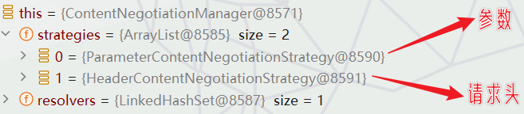

#### 1-web场景

##### a-自动配置回顾

1.   所以的场景启动器(例如`spring-boot-starter-web`)除了会导入相关功能依赖，还会导入一个`spring-boot-starter`，是所有`starter`的`starter`，即基础核心`starter`。

2.   而`spring-boot-starter`导入了一个包 `spring-boot-autoconfigure`。包里面都是各种场景的`AutoConfiguration`自动配置类。

3.   `@SpringBootApplication`本质上是有三个注解组成，这其中一个便是`@EnableAutoConfiguration`即启用自动配置注解。而这个`@EnableAutoConfiguration`注解中又使用了`@Import(AutoConfigurationImportSelector.class)`用来批量注册。

4.   批量注册的组件类名称是配置在`META-INF/spring/org.springframework.boot.autoconfigure.AutoConfiguration.imports`中的。通过查看可知一共146个。

5.   其中与web相关的几个如下：

     ```tex
     org.springframework.boot.autoconfigure.web.client.RestTemplateAutoConfiguration
     org.springframework.boot.autoconfigure.web.embedded.EmbeddedWebServerFactoryCustomizerAutoConfiguration
     ===响应式，暂时不是重点===
     org.springframework.boot.autoconfigure.web.reactive.HttpHandlerAutoConfiguration
     org.springframework.boot.autoconfigure.web.reactive.ReactiveMultipartAutoConfiguration
     org.springframework.boot.autoconfigure.web.reactive.ReactiveWebServerFactoryAutoConfiguration
     org.springframework.boot.autoconfigure.web.reactive.WebFluxAutoConfiguration
     org.springframework.boot.autoconfigure.web.reactive.WebSessionIdResolverAutoConfiguration
     org.springframework.boot.autoconfigure.web.reactive.error.ErrorWebFluxAutoConfiguration
     org.springframework.boot.autoconfigure.web.reactive.function.client.ClientHttpConnectorAutoConfiguration
     org.springframework.boot.autoconfigure.web.reactive.function.client.WebClientAutoConfiguration
     ======
     org.springframework.boot.autoconfigure.web.servlet.DispatcherServletAutoConfiguration
     org.springframework.boot.autoconfigure.web.servlet.ServletWebServerFactoryAutoConfiguration
     org.springframework.boot.autoconfigure.web.servlet.error.ErrorMvcAutoConfiguration
     org.springframework.boot.autoconfigure.web.servlet.HttpEncodingAutoConfiguration
     org.springframework.boot.autoconfigure.web.servlet.MultipartAutoConfiguration
     org.springframework.boot.autoconfigure.web.servlet.WebMvcAutoConfiguration
     ```

6.   在这些自动配置类中大致使用了几个属性类，属性配置前缀如下，这也是以后学习的重点：

     1.   SpringMVC的所有配置---> `spring.mvc`。
     2.   Web场景通用配置---> `spring.web`。
     3.   文件上传配置--- >`spring.servlet.multipart`。
     4.   服务器的配置(比如：编码方式)--->`server`。


##### 2-默认效果(后面详细叙述)

1.  默认配置：
    1.  包含了` ContentNegotiatingViewResolver` 和 `BeanNameViewResolver `组件，方便视图解析。
    2.  默认的静态资源处理机制： 静态资源放在 `static `文件夹下即可直接访问。
    3.  自动注册了 `Converter`,``GenericConverter``,`Formatter`组件，适配常见数据类型转换和格式化需求。
    4.  支持 `HttpMessageConverters`，可以方便返回`json`等数据类型。
    5.  注册 `MessageCodesResolver`，方便国际化及错误消息处理。
    6.  支持 静态 `index.html`。
    7.  自动使用`ConfigurableWebBindingInitializer`，实现消息处理、数据绑定、类型转化、数据校验等功能。

2.   重点：
     1.   如果想保持 boot mvc的默认配置，并且自定义更多的 mvc 配置，如：`interceptors`,`formatters`,`view controllers`等。可以使用`@Configuration`注解添加一个 `WebMvcConfigurer`类型的配置类，并不要标注`@EnableWebMvc`
     2.   如果想保持 boot mvc 的默认配置，但要自定义核心组件实例，比如：`RequestMappingHandlerMapping`,`RequestMappingHandlerAdapter`, 或`ExceptionHandlerExceptionResolver`，给容器中放一个`WebMvcRegistrations`组件即可。
     3.   如果想全面接管 Spring MVC，`@Configuration` 标注一个配置类，并加上`@EnableWebMvc`注解，实现`WebMvcConfigurer`接口。

----


#### 2-WebMvcAutoConfiguration原理

##### a-生效条件

1.   说一句题外话，idea的书签功能用来读源码真的舒服。

2.   我们直接看源码`WebMvcAutoConfiguration`自动配置类的源码：

     ```java
     @AutoConfiguration(
         after = {DispatcherServletAutoConfiguration.class, TaskExecutionAutoConfiguration.class, 
                  ValidationAutoConfiguration.class} //在这些自动配置之后
     )
     @ConditionalOnWebApplication(
         type = Type.SERVLET  //如果是web应用且类型为SERVLET就生效。补充:REACTIVE 响应式web
     )
     @ConditionalOnClass({Servlet.class, DispatcherServlet.class, WebMvcConfigurer.class}) // 存在类
     @ConditionalOnMissingBean({WebMvcConfigurationSupport.class}) //容器中没有这个Bean，才生效。默认就是没有
     @AutoConfigureOrder(-2147483638)//优先级
     @ImportRuntimeHints({WebResourcesRuntimeHints.class})
     public class WebMvcAutoConfiguration {}
     ```

     


##### 2-添加组件

1.   我们继续研究`WebMvcAutoConfiguration`自动配置类的源码：

     ```java
     @Bean
     @ConditionalOnMissingBean({HiddenHttpMethodFilter.class})
     @ConditionalOnProperty(
         prefix = "spring.mvc.hiddenmethod.filter",
         name = {"enabled"}
     )
     public OrderedHiddenHttpMethodFilter hiddenHttpMethodFilter() {
         return new OrderedHiddenHttpMethodFilter();
     }
     
     @Bean
     @ConditionalOnMissingBean({FormContentFilter.class})
     @ConditionalOnProperty(
         prefix = "spring.mvc.formcontent.filter",
         name = {"enabled"},
         matchIfMissing = true
     )
     public OrderedFormContentFilter formContentFilter() {
         return new OrderedFormContentFilter();
     }
     
     
     @Configuration(proxyBeanMethods = false)
     	@Import(EnableWebMvcConfiguration.class) //额外导入了其他配置
     	@EnableConfigurationProperties({ WebMvcProperties.class, WebProperties.class })
     	@Order(0)
     	public static class WebMvcAutoConfigurationAdapter implements WebMvcConfigurer, ServletContextAware {
             
         }
     ```

2.   我们发现它向ioc容器中配置两个Filter过滤器：

     1.   `HiddenHttpMethodFilter`：用于页面表单提交Restful请求(`GET`、`POST`、`PUT`、`DELETE`)。
     2.   `FormContentFilter`： 表单内容Filter，GET(数据放URL后面）、POST(数据放请求体)请求可以携带数据，但是PUT、DELETE 的请求体数据会被忽略。这个过滤器就是解决这个问题的。

3.   它还给容器中放了`WebMvcConfigurer`组件(也就是`WebMvcAutoConfigurationAdapter`)，这个主要是给SpringMVC添加各种定制功能。

     1.   通过`@EnableConfigurationProperties`注解我们知道：所有的功能最终会和配置文件进行绑定。并且进一步深入可知：
          1.   `WebMvcProperties`属性类对应着配置文件`spring.mvc`前缀。
          2.   `WebProperties`属性类对应着配置文件`spring.web`前缀。

     2.   点击跳转`WebMvcConfigurer`接口，通过快捷键`Alt+7`(显示当前类或接口的所有成员，包括方法)或者`CTRL+F12`(显示当前打开文件的结构视图),我们大致知道可以通过实现`WebMvcConfigurer`接口定制以下配置：<br>


##### c-静态资源源码

1.   继续上面阅读源码，在`WebMvcConfigurer`接口中存在一个`addResourceHandlers`方法，通过文档我们可以知道其作用是：添加处理程序以从 Web 应用程序根目录、类路径等下的特定位置提供静态资源，例如图像、js 和 css 文件。

     ```java
     public interface WebMvcConfigurer {
         default void addResourceHandlers(ResourceHandlerRegistry registry) {
         }
     }
     ```

2.   而`WebMvcAutoConfiguration`自动配置类配置的`WebMvcAutoConfigurationAdapter`中恰好实现了这个方法：

     ```java
     @Override
     public void addResourceHandlers(ResourceHandlerRegistry registry) {
         // 判断静态资源是否开启
         if (!this.resourceProperties.isAddMappings()) {  
             logger.debug("Default resource handling disabled");
             return;
         }
         // 规则一:
         addResourceHandler(registry, 
                            this.mvcProperties.getWebjarsPathPattern(),  // 通过源码知道值为:/webjars/**
                            "classpath:/META-INF/resources/webjars/"
                           );
         // 规则二:
         addResourceHandler(registry, 
                            this.mvcProperties.getStaticPathPattern(),  // 通过源码知道值为:/**
                            (registration) -> {
             registration.addResourceLocations(this.resourceProperties.getStaticLocations()
     //"classpath:/META-INF/resources/","classpath:/resources/", "classpath:/static/", "classpath:/public/" 
                                              );
                                
             if (this.servletContext != null) {
                 ServletContextResource resource = new ServletContextResource(
                     this.servletContext, 
                     SERVLET_LOCATION
                 );
                 registration.addResourceLocations(resource);
             }
         });
     }
     ```

3.   `addResourceHandlers`方法中大量使用了`addResourceHandler`添加资源路径匹配规则，我们进一步查看`addResourceHandler`方法(期间涉及到重载方法相互调用部分略过)：

     ```java
     private void addResourceHandler(ResourceHandlerRegistry registry, String pattern,
                                     Consumer<ResourceHandlerRegistration> customizer
                                    ) {
         if (registry.hasMappingForPattern(pattern)) {
             return;
         }
         ResourceHandlerRegistration registration = registry.addResourceHandler(pattern);
         customizer.accept(registration);
         
         // ===缓存相关配置,配置是从resourceProperties获取的===
         registration.setCachePeriod(getSeconds(
             this.resourceProperties.getCache().getPeriod())
                                    );
         
         registration.setCacheControl(
             this.resourceProperties.getCache().getCachecontrol().toHttpCacheControl()
         );
     
         registration.setUseLastModified(
             this.resourceProperties.getCache().isUseLastModified()
         );
         // ======================================
         customizeResourceHandlerRegistration(registration);
     }
     ```

4.   通过上述分析，我们大致知道了静态资源的路径匹配规则：

     1.   规则一：访问`/webjars/**`路径就去 `classpath:/META-INF/resources/webjars/`下找资源。
     2.   规则二：访问 `/**`路径就去静态资源默认的四个位置找资源：
          1.   `classpath:/META-INF/resources/`
          2.   `classpath:/resources/`
          3.   `classpath:/static/`
          4.   `classpath:/public/`

     3.   规则三：静态资源默认都有缓存规则的设置。
          1.   所有缓存的设置，直接通过配置文件：`spring.web`可以设置。为什么这么说，继续深入研究上述代码不难知道，缓存的相关配置是通过`resourceProperties`获取的。而`resourceProperties`的类型是`Resources`，是`webProperties`属性类的一个子类。而`webProperties`属性类和配置文件 `spring.web`绑定的。其实按照源码更准确的说，缓存部分配置是以`spring.web.resources`为前缀的。
          2.   `cachePeriod`： 缓存周期； 多久不用找服务器要新的。 默认没有，以s为单位
          3.   `cacheControl`： [HTTP缓存控制](https://developer.mozilla.org/zh-CN/docs/Web/HTTP/Caching#概览)，似乎是对缓存进行更精确控制(不确定，参考源码)。
          4.   `useLastModified`：是否使用最后一次修改，配合HTTP Cache规则。其实就是比较浏览器记录的静态资源的最后一次修改时间与服务器记录的最后一次修改时间是否一致，一致则静态资源最近没有修改，可以使用浏览器中缓存的数据。

5.   关于缓存的解释：如果浏览器访问了一个静态资源 `index.js`，如果服务这个资源没有发生变化，下次访问的时候就可以直接让浏览器用自己缓存中的东西，而不用给服务器发请求。


##### d-EnableWebMvcConfiguration

1.   继续扒源码,`WebMvcAutoConfiguration`自动配置类配置了一个`EnableWebMvcConfiguration`。而`EnableWebMvcConfiguration`中配置了大量的`xxxHandlerMapping`(处理器映射器，根据请求路径找对应`handler`处理请求)。其中就包含一个叫做欢迎页处理器映射器。

     ```java
     //
     //SpringBoot 给容器中放 WebMvcConfigurationSupport 组件。
     //我们如果自己放了 WebMvcConfigurationSupport 组件，Boot的WebMvcAutoConfiguration都会失效。
     @Configuration(proxyBeanMethods = false)
     @EnableConfigurationProperties(WebProperties.class)
     public static class EnableWebMvcConfiguration extends DelegatingWebMvcConfiguration implements ResourceLoaderAware {
     
         // ===欢迎页处理器映射器===
         @Bean
         public WelcomePageHandlerMapping welcomePageHandlerMapping(
             ApplicationContext applicationContext,
             FormattingConversionService mvcConversionService, 
             ResourceUrlProvider mvcResourceUrlProvider) {
     
             return createWelcomePageHandlerMapping(
                 applicationContext, 
                 mvcConversionService, 
                 mvcResourceUrlProvider,                    
                 WelcomePageHandlerMapping::new);
         }
         
         // ===创建WelcomePageHandlerMapping===
         private <T extends AbstractUrlHandlerMapping> T createWelcomePageHandlerMapping(
             ApplicationContext applicationContext,
             FormattingConversionService mvcConversionService,
             ResourceUrlProvider mvcResourceUrlProvider,
             WelcomePageHandlerMappingFactory<T> factory) {  
             // ===通过方法调用知道factory参数就是WelcomePageHandlerMapping::new===
     
             TemplateAvailabilityProviders templateAvailabilityProviders = new TemplateAvailabilityProviders(
                 applicationContext);
     
             String staticPathPattern = this.mvcProperties.getStaticPathPattern(); //===静态资源的路径模式===
             T handlerMapping = factory.create(
                 templateAvailabilityProviders,  // ===模板可用性提供器===
                 applicationContext, 
                 getIndexHtmlResource(),   // ===获取欢迎页资源===          
                 staticPathPattern);		//===静态资源的路径模式,默认为/**===
     
             handlerMapping.setInterceptors(getInterceptors(mvcConversionService, mvcResourceUrlProvider));
             handlerMapping.setCorsConfigurations(getCorsConfigurations());
             return handlerMapping;
         }
     
         //===遍历查找欢迎页资源(1)===
         private Resource getIndexHtmlResource() {
             for (String location : this.resourceProperties.getStaticLocations()) {  // ===获取遍历静态资源路径===
                 Resource indexHtml = getIndexHtmlResource(location); //=== 在静态资源路径中找欢迎页资源===
                 if (indexHtml != null) {
                     return indexHtml;
                 }
             }
             ServletContext servletContext = getServletContext();
             if (servletContext != null) {
                 return getIndexHtmlResource(new ServletContextResource(servletContext, SERVLET_LOCATION));
             }
             return null;
         }
     	
         // ===找欢迎页资源(2)===
         private Resource getIndexHtmlResource(String location) {
             //===通过资源加载器resourceLoader加载静态资源目录===
             return getIndexHtmlResource(this.resourceLoader.getResource(location)); 
         }
     	
         // ===找欢迎页资源(3)===
         private Resource getIndexHtmlResource(Resource location) {
             try {
                 Resource resource = location.createRelative("index.html");
                 if (resource.exists() && (resource.getURL() != null)) {  // ===判断index.html是否存在===
                     return resource;
                 }
             }
             catch (Exception ex) {
             }
             return null;
         }
     
     }
     ```

2.   首先，不知道是否还记得，`WebMvcAutoConfiguration`自动配置类生效的一个条件就是不存在`WebMvcConfigurationSupport`类型组件。恰巧的是`EnableWebMvcConfiguration`就是一个`WebMvcConfigurationSupport`类型组件，因为它的继承关系是`EnableWebMvcConfiguration-->DelegatingWebMvcConfiguration-->WebMvcConfigurationSupport`。其实这就是springboot地精髓，如果我们放置了自定义`WebMvcConfigurationSupport `组件，springboot的`WebMvcAutoConfiguration`都会失效,从而使用我们自己的配置。

3.   好了，回到源码部分。下面的部分有些难啃，和尚硅谷视频教程的源码不一样，更新太快了！<br>

4.   在`WelcomePageHandlerMapping`中除了准备参数，就是调用了`createWelcomePageHandlerMapping`去创建欢迎页处理器映射器。而在`createWelcomePageHandlerMapping`中又调用`getIndexHtmlResource`获取欢迎页资源。然后就是重构方法的相互调用。总之最后我们知道，它找的欢迎页资源其实就是`index.html`,并且还是在静态资源路径下找的。

5.   关于这个资源加载器`resourceLoader`,我们进一步研究一下：通过上述代码，我们追根溯源不难知道`resourceLoader`是在`EnableWebMvcConfiguration`构造器中出现的，而`resourceLoader`是一个配置组件，实例化是springboot管理的。那么我们可以基本确定`resourceLoader`是一个ioc容器中的组件。

     1.   `ResourceLoader`是一个策略接口，Spring 提供了多个实现类来处理不同的场景，比如`DefaultResourceLoader`、`FileSystemResourceLoader`以及`ClasspathResourceLoader`。此外`ApplicationContext`接口扩展了`ResourceLoader`接口，这意味着所有的Spring应用上下文都可以作为`ResourceLoader`使用。这也是获取应用上下文资源最常用的方式。

     2.   `ResourceLoader`的主要方法是 `Resource getResource(String location)`，这个方法会根据提供的位置字符串 `location `返回一个 `Resource `对象。`Resource`是Spring中另一个重要的接口，它对底层资源提供了更丰富的接口。例如, Resource接口提供了 `exists()`、`isOpen()`、`getURL()`、`getFile()`、`getInputStream()`和其他功能。来自不同地方的资源需要通过不同的方式打开和读取。

     3.   `DefaultResourceLoader`: Spring默认的ResourceLoader实现,对于大部分情况来说都是足够的。这个类的`getResource()`方法会根据资源路径的前缀来决定返回哪种Resource实现：

          1.   路径以`classpath:`开头，返回`ClassPathResource`。
          2.   路径以`file:`开头，返回`FileSystemResource`。
          3.   路径以`http:`或`https:`开头，返回`UrlResource`。
          4.   如果没有特定的前缀，也返回`ClassPathResource`。

     4.   在spring中我们可以使用这儿玩意儿加载文件(前面一堆废话)：

          ```java
          import org.springframework.core.io.Resource;
          import org.springframework.core.io.ResourceLoader;
          import org.springframework.stereotype.Service;
          import java.io.InputStream;
          import java.util.Properties;
          
          @Service
          public class MyService {
          
              private final ResourceLoader resourceLoader;
          
              // Spring会自动为resourceLoader赋值
              public MyService(ResourceLoader resourceLoader) {
                  this.resourceLoader = resourceLoader;
              }
          
              public void loadResource() throws Exception {
                  // 读取classpath下资源
                  Resource resource = resourceLoader.getResource("classpath:application.properties");
                  if (resource.exists()) {
                      InputStream stream = resource.getInputStream();// 读取资源内容
                      // 读取properties文件内容
                      Properties properties = new Properties();
                      properties.load(stream);
                      System.out.println(properties.getProperty("name"));
          
                  } else {
                      System.out.println("资源未找到");
                  }
              }
          }
          ```

6.   而`createRelative(String path)`是Spring Framework 的`org.springframework.core.io.Resource`接口提供的一个核心方法。这个方法的作用是在当前`Resource`基础上创建一个相对路径的新`Resource`。当你在程序中使用一个资源（如文件或者URL）并且你需要获取该资源路径下的另一个资源时，就可以使用`createRelative`方法。例如：

     1.   如果你的`Resource`对象表示的是一个URL，比如`http://example.com/foo/`，并且你想要获取`foo`下的`bar.html`资源。你可以调用`resource.createRelative("bar.html")`来直接得到`http://example.com/foo/bar.html` 的`Resource`对象。
     2.   如果你有一个文件系统中的`Resource`，比如`/etc/config/`，并且你想要获取`config`目录下的`app.conf`文件。你可以调用`resource.createRelative("app.conf")`来获取`/etc/config/app.conf`的`Resource`对象。

7.   但是还没完哦，我们继续深入一下分析：在`createWelcomePageHandlerMapping`中通过`factory.create(templateAvailabilityProviders, applicationContext, getIndexHtmlResource(),staticPathPattern)`创建`handlerMapping `。实际上我们知道这个`factory`是`WelcomePageHandlerMapping`类型。其源码如下：

     ```java
     final class WelcomePageHandlerMapping extends AbstractUrlHandlerMapping {
     
         private static final Log logger = LogFactory.getLog(WelcomePageHandlerMapping.class);
     
         private static final List<MediaType> MEDIA_TYPES_ALL = Collections.singletonList(MediaType.ALL);
     
         WelcomePageHandlerMapping(
             TemplateAvailabilityProviders templateAvailabilityProviders,                     
             ApplicationContext applicationContext,
             Resource indexHtmlResource,
             String staticPathPattern) {
             setOrder(2);
             WelcomePage welcomePage = WelcomePage.resolve(  // ===欢迎页解析===
                 templateAvailabilityProviders, 
                 applicationContext,                                    
                 indexHtmlResource, 
                 staticPathPattern);
             
             if (welcomePage != WelcomePage.UNRESOLVED) {
                 logger.info(LogMessage.of(() -> (!welcomePage.isTemplated()) ? "Adding welcome page: " 
                                           + indexHtmlResource
                                           : "Adding welcome page template: index"));
                 ParameterizableViewController controller = new ParameterizableViewController();
                 controller.setViewName(welcomePage.getViewName());
                 setRootHandler(controller);
             }
         }
     ```

8.   而在这个欢迎页解析方法中才是最后的逻辑，其实想说的就是下面的一个问题，修改`staticPathPattern`(静态资源的路径模式)会导致`index.html`欢迎页失效(后面自定义配置时可能会修改)！

     ```java
     final class WelcomePage {
     	static final WelcomePage UNRESOLVED = new WelcomePage(null, false);
     
     	static WelcomePage resolve(TemplateAvailabilityProviders templateAvailabilityProviders,
     			ApplicationContext applicationContext, Resource indexHtmlResource, String staticPathPattern) {
     		if (indexHtmlResource != null && "/**".equals(staticPathPattern)) {
                 //如果静态HTML资源不为null并且staticPathPattern(静态资源的路径模式)等于"/**"
     			return new WelcomePage("forward:index.html", false);
     		}
     		if (templateAvailabilityProviders.getProvider("index", applicationContext) != null) {
                 //遍历所有已注册的模板可用性提供者，看哪个提供者可以处理给定的视图名称。如果存在符合条件就返回此提供者实例。
                 //这里是调用模板可用性提供器的getProvider方法检查是否存在一个能被解析的名为"index"的模板视图例如:index.jsp等
     			return new WelcomePage("index", true);
     		}
     		return UNRESOLVED;
     	}
     
     }
     ```


##### e-WebMvcConfigurer底层配置原理

1.   在`WebMvcAutoConfiguration`自动配置类其实有两个非常重要的组件：

     1.   `WebMvcConfigurerAdapter`:是一个类型为`WebMvcConfigurer `的组件，而`WebMvcConfigurer `主要用于注册一些自定义的Spring MVC的功能，如消息转化器，视图解析，`Interceptor`，`Formatter`等，其作用主要以回调方式提供自定义配置。
     2.   `EnableWebMvcConfiguration`：Spring MVC中的关键配置类。它是通过`@EnableWebMvc`注解被调用到的，该注解就像是一个开关一样，用来启动Spring MVC的默认配置。

2.   下面我们将详细说一下`EnableWebMvcConfiguration`类型组件:

     1.   `WebMvcAutoConfiguration`自动配置类中的`EnableWebMvcConfiguration`类型组件部分源码如下：

          ```java
          @Configuration(proxyBeanMethods = false)
          @EnableConfigurationProperties(WebProperties.class)
          public static class EnableWebMvcConfiguration extends DelegatingWebMvcConfiguration implements ResourceLoaderAware {
          }
          ```

     2.   通过代码我们知道`EnableWebMvcConfiguration`继承自`DelegatingWebMvcConfiguration`，同时`DelegatingWebMvcConfiguration`又继承自`WebMvcConfigurationSupport`，也就是说`EnableWebMvcConfiguration`组件其实也是1`EnableWebMvcConfiguration`类型:

          ```java
          @Configuration(proxyBeanMethods = false)
          public class DelegatingWebMvcConfiguration extends EnableWebMvcConfiguration {
          
              @Autowired(required = false) 
              public void setConfigurers(List<WebMvcConfigurer> configurers) {
                  // ===通过自动装配获取了所有的WebMvcConfigurer组件。
                  if (!CollectionUtils.isEmpty(configurers)) {
                      this.configurers.addWebMvcConfigurers(configurers);
                  }
              }
          
              @Override
              protected void addResourceHandlers(ResourceHandlerRegistry registry) {
                  //===底层是遍历执行所有的WebMvcConfigurer组件的对应方法===
                  this.configurers.addResourceHandlers(registry);
              }
          }
          ```

     3.   在`DelegatingWebMvcConfiguration`类的构造器中，它干了一件事，通过自动装配获取了所有的`WebMvcConfigurer`组件(包括它默认的和你自己配置的)。此后它的方法中底层都是遍历执行所有的`WebMvcConfigurer`组件的对应方法。这也就是为什么你配置的自定义`WebMvcConfigurer`组件能够生效。

     4.   但是，我们还得说一个注解`@EnableWebMvc`，这个玩意干了一件事导入了一个`DelegatingWebMvcConfiguration`类型组件。`DelegatingWebMvcConfiguration`又继承自`WebMvcConfigurationSupport`，也就是说它使得容器中存在`WebMvcConfigurationSupport`类型组件:

          ```java
          @Retention(RetentionPolicy.RUNTIME)
          @Target(ElementType.TYPE)
          @Documented
          @Import(DelegatingWebMvcConfiguration.class)
          public @interface EnableWebMvc {
          }
          ```

     5.   在Spring Boot中，自动配置类总是最后被加载的，这意味着自定义的配置类会优先被加载。

     6.   那么问题来了，不知道是否还记得，在`WebMvcAutoConfiguration`上存在这样一个生效条件`@ConditionalOnMissingBean(WebMvcConfigurationSupport.class)`。那么真像大白了，由于`@EnableWebMvc`会导致默认的`WebMvcAutoConfiguration`自动配置类失效。


----


#### 3-静态资源

##### classpath(补充)

1.   首先，提一点无关知识，我们可以使用`jar xvf 文件名.jar `(解压到当前目录)或者`unzip 文件名.jar -d 解压到的目录`可以解压`.jar`文件(不加位置，它给我解压到c盘，用`everything`才找到!)。

2.   关于`classpath`：

     1.   在Java应用程序中，`classpath`是一个环境变量，它告诉JVM和Java应用程序在哪里查找类(`.class`文件)和应用程序库(`lib`)。

     2.   `classpath`指向的就是打`war`包之后的`classes`的位置。而classes文件夹下就是我们原项目的`java`文件和`resources`文件夹里面的内容。

     3.    参考下面的ssm项目war目录结构， 在标准的Java web应用中，包含在`src/main/resources`的所有资源文件，在编译的时候会被复制到`WEB-INF/classes`目录中。而你的项目`.java`文件编译而成的`.class`文件也会在`WEB-INF/classes`中，从某种意义上说`classpath`就是`WEB-INF/classes`！

          ```tex
          myapp.war
          │
          ├── META-INF/
          │   ├── MANIFEST.MF
          │   └── ...
          │
          ├── WEB-INF/
          │   ├── classes/
          │   │   ├── com/                  -- 存放编译后的 .class 文件
          │   │   │    └── dreamfish/xx
          │   │   ├── applicationContext.xml   -- Spring 配置文件
          │   │   ├── spring-mvc.xml           -- Spring MVC 配置文件
          │   │   ├── mybatis-config.xml       -- MyBatis 配置文件
          │   │   └── ...                      -- 其他位于 src/main/resources 的资源文件
          │   ├── lib/                         -- 存放项目依赖的所有 JAR 包
          │   └── web.xml                      -- web 应用的部署描述文件
          │
          └──  ...                             -- 静态资源文件（如 JSP, CSS, JS, images 等）
          ```

     4.   顺便提一嘴，springboot打包类型为`jar`后目录可能略有差别，但是还是这样理解的(可以使用前面提到的`jar`命令解压看看)。

3.   关于`classpath*`：默认情况下，正如大部分类加载器行为，`"classpath:"` 只会选取一个路径。如果是一个目录，那么它将搜索整个目录。但是，如果有多个同名的资源在`classpath`中，通常只会使用其中的一个，而剩余的资源将被忽略。为了解决这个问题，Spring 提供了 `"classpath*:"` 作为前缀，用于指示 Spring 查找所有匹配的资源，而不仅仅是找到的第一个资源。假设你有多个 JAR 文件，它们都包含相同名称的配置文件，你需要读取这些配置文件中的所有内容，你可以使用` "classpath*:"`。

4.   在idea中配置`classpath`的几种类别:

     1.   `Source Folders` (通常位于` src/main/java`): 里面包含了项目中的主要Java源代码。IDEA在构建项目时，会将此目录中的 `.java `文件编译为 `.class `文件。同时IDEA为此文件夹中的类型提供代码完成功能、导航和其他开发工具功能。此文件夹会被放入`classpath`。
     2.   `Test Source Folders`(通常位于 `src/test/java`): 此文件夹包含项目中的测试源码，一般为单元测试(例如JUnit)或者集成测试的代码。在运行测试时，IDEA会解析并运行此文件夹中的测试代码。同时，IDEA提供了测试覆盖率和其他与测试相关的功能。此文件夹会被放入`classpath`。
     3.   `Resources Folders `(通常位于 `src/main/resources` 和 `src/test/resources`): 资源文件夹用于存储应用需要的资源，如配置文件，图片，静态网页等。此文件夹的内容在构建时会被复制到构建输出的目录，并会被包含到`classpath`。
     4.   `Excluded Folders`: 排除的文件夹，IDEA在索引项目或构建项目时会完全忽略这些文件夹，不会分析或复制里面的内容。一般指出你的项目使用的构建工具(maven、gradle等)的构建输出目录(target或者build目录)，IDE的工作目录(.idea目录)，或者其他不需要IDEA处理的目录。这些目录不放入`classpath`。

5.   具体在idea中，通过`"File -> Project Structure -> Modules"`，可以在Projects设置中查看和编辑这些文件夹的配置:<br>

6.   当然其实还有其他设置方式：`右键文件夹-->选择Mark Directory as-->选择类型`即可。<br><br>


##### a-静态资源映射

1.    通过上述源码研究，我们就很容易知道静态资源的映射规则!!!

1.    访问`/webjars/**`路径就去 `classpath:/META-INF/resources/webjars/`下找资源。下面距离说明：

      1.    我门先去[webjars依赖查询网站](https://www.webjars.org/)查询一下依赖，例如vue3：<br>

      1.    添加vue3相关依赖：

            ```xml
            <dependency>
                <groupId>org.webjars.npm</groupId>
                <artifactId>he-tree__vue3</artifactId>
                <version>1.2.9</version>
            </dependency>
            ```

      1.    下面我门看一下vue3的webjars的目录结构：<br>

      1.    假如我需要访问`META-INF\resources\webjars\he-tree__vue3\1.2.9\dist\he-tree-vue3.js`那么依照规则我应该访问`/webjars/he-tree__vue3/1.2.9/dist/he-tree-vue3.js`也就是`http://localhost:8080/webjars/he-tree__vue3/1.2.9/dist/he-tree-vue3.js`。

      1.    当然，其实这中间似乎有一个遍历所有的webjars的JAR文件、查找并读取资源的过程。

1.   访问 `/**`路径就去静态资源默认的四个位置找资源：`classpath:/META-INF/resources/`、`classpath:/resources/`、`classpath:/static/`、`classpath:/public/`。

     1.     例如我在默认的静态资源文件夹下放置`1.png`。<br>
     1.     那么我可以直接通过`http://localhost:8080/1.png`访问。
     1.     当然你也可以作妖，自定义一个`Resources`类型的目录, 随便起个名叫做`myResources`，在里面配置静态资源目录也行。访问方式不变！<br>


##### b-缓存

1.   前面，我们分析源码的时候，已经提到过，springboot会在配置静态资源路径时，设置缓存。

2.   所有静态资源都定义了缓存规则。【浏览器访问过一次，就会缓存一段时间】，但此功能参数无默认值。

     1.   `period`： 缓存间隔， 默认 0S。
     2.   `cacheControl`：缓存控制， 默认无。
     3.   `useLastModified`：最后一次更新，空置是否使用`lastModified`头， 默认 false。

3.   我们下面将具体分析如何缓存的相应配置(缓存配置是以`spring.web.resources`为前缀的)：

     1.   下面是一些常用缓存配置及其解释：

          ```properties
          # 服务端口
          server.port=9000
          
          # 项目跟路径,默认是/,访问时需要加上项目根路径
          server.servlet.context-path=/myboot
          
          #spring.web配置：
          # 1.配置国际化的区域信息
          # 2.静态资源策略(开启、处理链、缓存)
          
          # 设置静态资源的缓存过期时间,单位秒
          spring.web.resources.cache.period=3600
          
          # 是否开启默认的静态资源的映射路径
          spring.web.resources.add-mappings=true
          
          # 设置静态资源的缓存过期时间,单位秒
          spring.web.resources.cache.cachecontrol.max-age=3600
          
          # 使用资源 last-modified 时间，来对比服务器和浏览器的资源是否相同没有变化。相同返回 304
          spring.web.resources.cache.use-last-modified=true
          
          # 不论缓存状态或响应头字段，任何中间代理服务器都不得缓存这些响应
          spring.web.resources.cache.cachecontrol.no-store=true
          
          # 响应消息每次都要经过新鲜度检测。所以，无论这个资源的种类是什么，客户端在使用服务器返回的缓存副本之前，必须先询问服务器这个缓存副本是否仍然可用。
          spring.web.resources.cache.cachecontrol.must-revalidate=true
          
          # 一旦资源过期，强制向服务器发送验证请求，如果资源未修改，使用服务器返回的304来更新缓存的过期时间，否则返回新的资源。
          spring.web.resources.cache.cachecontrol.proxy-revalidate=true
          
          # 在公共缓存和私有缓存中保存响应。共享缓存包括像代理服务器这样的中间网络设备。表示响应可以被任何对象（包括：发送请求的客户端，代理服务器，等）缓存
          spring.web.resources.cache.cachecontrol.cache-public=true
          ```
     
     2.   `spring.web.resources.cache.period` 和 `spring.web.resources.cache.cachecontrol.max-age` 这两个属性都定义了资源的缓存时间，如果你同时配置了这两个属性，那么` spring.web.resources.cache.cachecontrol.max-age `会覆盖 `spring.web.resources.cache.period` 的设置。因为在Spring Boot中，`cachecontrol.max-age` 的优先级更高。
     
     3.   如果你希望为静态资源设置缓存控制，推荐使用 `spring.web.resources.cache.cachecontrol` 进行更为细粒度的控制。同时，能避免出现冲突或者配置覆盖的问题。
     
     4.   对于`spring.web.resources.cache.use-last-modified`配置选项可以启用或禁用`Last-Modified/If-Modified-Since `校验。当这个选项被设置为`true`时，Spring会在响应头中添加`Last-Modified`标头，该标头用于表示资源的最后修改时间。同时，它也会处理请求中的`If-Modified-Since`标头，如果资源的最后修改时间是在此标头的时间之后，那么服务器会返回一个完整的响应，包括资源的内容；如果资源自`If-Modified-Since`标头的时间以来没有被修改，服务器则只需返回一个`304 Not Modified`响应，表示该静态资源的缓存可以继续使用。<br><br><br>


##### c-欢迎页

1.   通过源码分析，我们可以知道springboot会在静态资源路径下面查找一个`index.html`作为欢迎页！！！
2.   详情可以参考上面源码！！！


##### d- Favicon

1.   浏览器会自动发一个申请`favicon.ico`的请求，会在静态资源目录下找对应文件。我们把对应文件放在静态资源目录，删除`target`目录，然后rebuild重新构建一下项目即可。
2.   `favicon.ico`还是不显示最终浏览器`CTRL+F5`强制刷新，实在不行清理一下idea的历史缓存。
3.   补充一个生成`favicon`图标文件的工具网站：[here](https://tool.lu/favicon/)。

---


#### 4自定义静态资源配置

##### a-文件配置

1.    通过前面一大段的源码分析，其实我们很容易知道静态资源的属性类有：

     1.   `WebMvcProperties`对应配置文件`spring.mvc`：配置静态资源访问前缀路径。
          1.   `resources.static-locations`：静态资源路径(大驼峰`staticLocations`改为`static-locations`)。
          2.   `resources.add-mappings`：开启默认静态资源路径映射，默认为`true`。
          3.   `resources.cache.period`:设置缓存
     2.   `WebProperties`对应配置文件`spring.web`：配置静态资源目录或者静态资源缓存策略。
          1.   `static-path-pattern`：配置静态资源的路径模式，或者说是前缀(大驼峰命名改为`-`拼接)。
          2.   `webjars-path-pattern`：配置webjars类型静态资源的路径模式，或者说是前缀(大驼峰命名改为`-`拼接)。

2.   这些设置其实都可以在对应的属性类或者源码中找到用法。当然你也可以在`spring-boot-autoconfigure`下的`\META-INF\spring-configuration-metadata.json`找到相关解释。

3.   下面演示一下用法：

     1.   修改配置文件如下：

          ```properties
          # 修改默认的静态资源路径(数组)
          spring.web.resources.static-locations= classpath:/things/,classpath:/others/
          
          # 修改静态资源路径的模式(前缀),默认为/**
          spring.mvc.static-path-pattern=/dream/**
          
          # 修改webjars的路径模式(前缀),默认为/webjars/**
          spring.mvc.webjars-path-pattern=/wj/**
          
          
          # (补充,不知道该放哪儿)项目跟路径,默认是/,访问时需要加上项目根路径
          server.servlet.context-path=/myboot
          ```
     
     2.   这时我的静态资源目录有一张`2.png`。<br>
     
     3.   那么访问它，url应为`http://localhost:8080/dream/2.png`。此外`favicon.ico`文件也应该放在自定义静态资源目录下面。


##### b-代码模式(重点)

1.   除了使用配置的方式实现自定义，我们还可以使用代码的方式。一般我们在主程序下面新建一个`config`包存放配置类。

2.   在自定义配置类中，我们向ioc容器中放置一个`WebMvcConfigurer`就可以实现大多数配置。

     1.   代码配置的部分类似于spring的全注解配置。

     2.   注意使用`@EnableWebMvc`注解会导致springboot的默认配置失效(原因见源码)。

     3.   写法一：让自定义配置类继承`WebMvcConfigurer`(配置类本身就是一个组件)：`CTRL+O`快速重写类方法！！！

          ```java
          @SpringBootConfiguration
          //@EnableWebMvc
          public class MyConfig  implements WebMvcConfigurer {
          
              @Override
              public void addResourceHandlers(ResourceHandlerRegistry registry) {
                  // 默认静态资源处理器
                  WebMvcConfigurer.super.addResourceHandlers(registry);
          
                  // 自定义静态资源处理器
                  registry.addResourceHandler("/fish/**")  // 请求路径模式
                          .addResourceLocations("classpath:/fish/")  // 静态资源存放路径
                          .setCacheControl(CacheControl.maxAge(1, TimeUnit.HOURS));
              }
          }
          ```

     4.   写法二：通过`@Bean`注册组件，返回一个`WebMvcConfigurer`的匿名实现类的匿名对象：

          ```java
          //登陆拦截器
          public class LoginInterceptor implements HandlerInterceptor {
          
              @Override
              public boolean preHandle(HttpServletRequest request, HttpServletResponse response, Object handler)
                  throws Exception {
                  HttpSession session = request.getSession();
          
                  // 检查用户是否登录，这里仅以 "user" 属性是否存在作为示例
                  if (session.getAttribute("user") == null) {
                      response.sendRedirect("/login");  // 未登录，重定向到登录页
                      return false;
                  }
          
                  return true;
              }
          }
          ```

          ```java
          //添加自定义拦截器
          @Configuration
          //@EnableWebMvc
          public class MyConfig  implements WebMvcConfigurer {
              
              @Bean
              public WebMvcConfigurer webMvcConfigurer(){
                  return new WebMvcConfigurer() {
                      @Override
                      public void addInterceptors(InterceptorRegistry registry) {
                          // 默认拦截器
                          WebMvcConfigurer.super.addInterceptors(registry);
          
                          // 添加拦截器
                          registry.addInterceptor(new LoginInterceptor())
                                  .addPathPatterns("/**")  // 拦截所有请求
                                  .excludePathPatterns("/index.html","/","/user/login","/static/**");  
                          		// 排除请求
                      }
                  }
              }
          }
          ```

----


#### 5-路径匹配

##### a-ant风格路径

1.   Ant 风格的路径模式语法具有以下规则：
     1.   `*`：表示任意数量的字符。
     2.   `?`：表示任意一个字符。
     3.   `**`：表示任意数量的目录。
     4.   `{}`：表示一个命名的模式占位符。
     5.   `[]`：表示字符集合，例如`[a-z]`表示小写字母。
2.   举例：
   1.   `*.html` 匹配任意名称，扩展名为`.html`的文件。
   2.   `/folder/*/*.java` 匹配在`folder`目录下的任意两级目录下的`.java`文件。
   3.   ` /folder/**/*.jsp` 匹配在`folder`目录下任意目录深度的`.jsp`文件。
   4.     `/{type}/{id}.html` 匹配任意文件名为`{id}.html`，在任意命名的`{type}`目录下的文件。

3.   注意：Ant 风格的路径模式语法中的特殊字符需要转义，如：
   1.   要匹配文件路径中的星号，则需要转义为`\\*`。
   2.   要匹配文件路径中的问号，则需要转义为`\\?`。


##### b-模式切换

1.    `AntPathMatcher `与 `PathPatternParser`:

     1.   `PathPatternParser `在 jmh基准测试下，有 6~8 倍吞吐量提升，降低 30%~40%空间分配率。
     2.   `PathPatternParser `兼容 `AntPathMatcher`语法，并支持更多类型的路径模式。
     3.   但是注意：`PathPatternParser`的`\**`多段匹配的支持仅允许在模式末尾使用。

2.   模式切换方式(配置文件中)：

     ```properties
     # ant_path_matcher: 老版策略；
     # path_pattern_parser: 新版策略；
     spring.mvc.pathmatch.matching-strategy=ant_path_matcher
     ```

3.   一般来说，我们使用默认的路径匹配规则，即`PathPatternParser  `提供的。如果路径中间需要有` **`，替换成ant风格路径即可。

4.   这玩意也是配置在`WebMvcAutoConfiguration`自动配置类的`WebMvcConfigurer`组件中的`configurePathMatch`方法：

     ```java
     @Configuration(proxyBeanMethods = false)
     @Import(EnableWebMvcConfiguration.class)
     @EnableConfigurationProperties({ WebMvcProperties.class, WebProperties.class })
     @Order(0)
     public static class WebMvcAutoConfigurationAdapter implements WebMvcConfigurer, ServletContextAware {
         @Override
         public void configurePathMatch(PathMatchConfigurer configurer) {
             if (this.mvcProperties.getPathmatch()
                 .getMatchingStrategy() == WebMvcProperties.MatchingStrategy.ANT_PATH_MATCHER) {
                 configurer.setPathMatcher(new AntPathMatcher());  // ===添加AntPathMatcher===
                 this.dispatcherServletPath.ifAvailable((dispatcherPath) -> {
                     String servletUrlMapping = dispatcherPath.getServletUrlMapping();
                     if (servletUrlMapping.equals("/") && singleDispatcherServlet()) {
                         UrlPathHelper urlPathHelper = new UrlPathHelper(); //===处理路径匹配的组件(后面介绍)====
                         urlPathHelper.setAlwaysUseFullPath(true);
                         configurer.setUrlPathHelper(urlPathHelper);
                     }
                 });
             }
         }
     }
     ```

     <br>

5.   如果想要使用代码方式自定义，也可以自己放个`WebMvcConfigurer`组件。但是剩下的其余配置可能有点难搞。

---


#### 6-idea的http Client

##### a-安装插件

1.   通常情况下，我们一般使用`postman`或者`apifox`对接口进行测试。但是其实idea专业版中也存在这种功能，那就是`HTTP Client`。

2.   如果没有安装，则需要先安装插件`HTTP Client`插件。

3.   安装完成打开`tools`,就可以找到对应的功能入口进行使用(但是一般采用后面的方式，即使用请求文件)：<br>

     <br>


##### b-请求文件

1.   我们一般会在项目的根目录下创建一个`http`目录存放对应的`HTTP Client`的请求文件。这类文件以`.http`后缀结尾。
2.   创建请求文件时，我们右键`http`文件夹，选择新建`new`，然后选择`HTTP Request`文件类型：<br>
3.   接下来输入文件名称即可。<br>


##### c-编写请求文件

1.   创建请求：<br>

2.    当然你也可以手动创建请求：<br>

     <br>

3.   此外，还可以创建`rest`风格的请求，但是好像只能手动书写。

4.   此外在`settings->Editor->Live Template`中包含一大推的请求文件模板，当然你也可以配置自己的自定义模板。<br>


##### d-配置环境变量

1.   设置变变量，并选中：<br>

     ```json
     {
         "dev": {  //开发环境(去除注释)
             "host": "http://localhost:8080",
             "name": "dream fish",
             "age": "20"
         },
         "prod": {  //生产环境(去除注释)
             "host": "http://localhost:8080",
             "name": "dream fish",
             "age": "20"
         }
     }
     ```

2.   选中对于的环境配置，即可在请求文件中通过`{{}}`使用环境中的变量：<br>

>开发环境（Development Environment）和生产环境（Production Environment）是软件开发过程中两种不同的环境，它们之间存在许多区别。开发环境通常使用较新的硬件和软件工具，以提高开发和调试性能。生产环境可能使用较旧的硬件和软件工具，以保持兼容性和稳定性。

---


#### 7-内容协商

##### a-简介

1.  内容协商(Content Negotiation) 是一种机制，允许客户端和服务器在响应中交换的表示形式上达成一致。

2.  在 Web 开发中，这通常指的是决定应该返回哪种媒体类型(如 HTML、XML、JSON 或其他任何可用的格式)。

3.  基于请求头内容协商：（默认开启）

    1.  客户端向服务端发送请求，携带HTTP标准的Accept请求头。
    2.  Accept: `application/json`、`text/xml`、`text/yaml`
    3.  服务端根据客户端请求头期望的数据类型进行动态返回

4.  基于请求参数内容协商：（需要开启）

    1.  发送请求 携带参数`format=xxx `指明期望的数据类型。
    2.  匹配到处理器方法后。根据参数协商，优先返回`xxx`类型数据。默认优先返回 json 类型数据【需要开启参数匹配设置】

5.  开启基于请求参数内容协商:

    ```properties
    # 开启基于请求参数的内容协商功能,默认参数名:format,默认此功能不开启
    spring.mvc.contentnegotiation.favor-parameter=true
    
    # 指定内容协商时使用的参数名,默认是format
    spring.mvc.contentnegotiation.parameter-name=type
    
    # 指定扩展名对应的媒体类型(fomat="json"->application/json(自带)、fomat="secret"->application/xml)
    spring.mvc.contentnegotiation.media-types.json=application/json 
    spring.mvc.contentnegotiation.media-types.secret=application/xml
    ```

6.  springboot默认提供的拓展名与媒体类型的映射(通过后面源码知道并非都生效)，关于媒体类型我们可以查看`org.springframework.http.MediaType `：

    ```tex
    atom = application/atom+xml
    json = application/json
    xml = application/xml
    ...
    ```

7.  拓展名与媒体类型的映射这里还有其他的配置方式，这一点我们其实很容易通过后面的源码原理部分知道，就是自己添加一个基于请求参数的策略,但是不推荐，这会导致默认配置的策略失效：

    ```java
    @Configuration
    public class MyConfig implements WebMvcConfigurer {
    
        @Override
        public void configureContentNegotiation(ContentNegotiationConfigurer configurer) {
            WebMvcConfigurer.super.configureContentNegotiation(configurer);
    
            //基于请求头的内容协商策略(springboot默认配置的会失效,需要手动配置)
            var headerStrategy = new HeaderContentNegotiationStrategy();
    
            //配置拓展名与MediaType的映射关系
            Map<String, MediaType> mediaTypes = Map.of( //of方法是jdk9的新特性,用于创建不可变的集合
                "json", MediaType.APPLICATION_JSON,
                "xml", MediaType.APPLICATION_XML,
                "x-yaml", MediaType.valueOf("application/x-yaml") 
                //MediaType.valueOf()方法可以将字符串转换为MediaType对象
            );
    
            //基于请求参数的内容协商策略(传入映射关系)
            var parameterStrategy = new ParameterContentNegotiationStrategy(mediaTypes);
    
            //将两种策略添加到ContentNegotiationConfigurer中
            configurer.strategies(List.of(headerStrategy, parameterStrategy)); //jdk9的新特性,用于创建不可变的集合
    
            //configurer.strategies(Arrays.asList(headerStrategy, parameterStrategy));
            //jdk9以下版本使用这种方式,创建不可变的集合
    
        }
    }

8.  其实上面也给我们提了一个醒，有时候我们配置的自定义规则可能导致springboot的默认规则不生效。需要注意，必要时debug。

9.  下面就是自动配置的原理部分，话不多说还是来到`WebMvcAutoConfiguration`总配置类的`WebMvcAutoConfigurationAdapter`。

    1.  在其下面存在一个`configureContentNegotiation`方法配置内容协商管理器及其内部策略：这里先从`WebMvcProperties.class`获相关配置，最后设置到参数`ContentNegotiationConfigurer`中。而`ContentNegotiationConfigurer`是一个配置类，用于自定义`ContentNegotiationManager`的设置。

        ```java
        @Configuration(proxyBeanMethods = false)
        @Import(EnableWebMvcConfiguration.class)
        @EnableConfigurationProperties({ WebMvcProperties.class, WebProperties.class })
        @Order(0)
        public static class WebMvcAutoConfigurationAdapter implements WebMvcConfigurer, ServletContextAware {
            
            @Override
            // 定义一个configureContentNegotiation方法，接受一个 ContentNegotiationConfigurer 对象作为参数
            public void configureContentNegotiation(ContentNegotiationConfigurer configurer) {
                // 获取应用程序的contentnegotiation配置
                WebMvcProperties.Contentnegotiation contentnegotiation = this.mvcProperties.getContentnegotiation();
                
                //===配置内容谈判策略是否应优先考虑请求参数===
                configurer.favorParameter(contentnegotiation.isFavorParameter());
                // 检查配置的parameterName是否为null
                if (contentnegotiation.getParameterName() != null) {
                    //===为ContentNegotiationConfigurer设置parameterName(默认是format)===
                    configurer.parameterName(contentnegotiation.getParameterName());
                }
                // 从mvcProperties获取已配置的媒体类型映射(配置文件中的)
                Map<String, MediaType> mediaTypes = this.mvcProperties.getContentnegotiation().getMediaTypes();
                
                // 将每个媒体类型映射添加到ContentNegotiationConfigurer配置中
                mediaTypes.forEach(configurer::mediaType);
            }
        }
        ```

    2.  通过上面不难看出这部分其实就是从属性类中读取配置而已，而属性类由于配置文件绑定(`spring.mvc.contentnegotiation`)：

        ```java
        @ConfigurationProperties(prefix = "spring.mvc")
        public class WebMvcProperties {
            private final Contentnegotiation contentnegotiation = new Contentnegotiation();
        
            public static class Contentnegotiation {
        		//===优先考虑(开启)基于参数的内容协商===
        		private boolean favorParameter = false;
        		//===文件扩展名到媒体类型的映射的映射表===
        		private Map<String, MediaType> mediaTypes = new LinkedHashMap<>();
        		//===用于指定哪个请求参数应该被用于做内容协商。如果favorParameter设置为true，参数名默认format===
        		private String parameterName;
                //...
            }
            
        }
        ```

    3.  实际上，上述`configureContentNegotiation`方法会被`DelegatingWebMvcConfiguration`调用：

        ```java
        @Configuration(proxyBeanMethods = false)
        public class DelegatingWebMvcConfiguration extends WebMvcConfigurationSupport {
            @Override
            protected void configureContentNegotiation(ContentNegotiationConfigurer configurer) {
                this.configurers.configureContentNegotiation(configurer);
            }
        }
        ```

    4.  接着调用`configureContentNegotiation`使所有的`WebMvcConfigurer`中的配置生效： 

        ```java
        class WebMvcConfigurerComposite implements WebMvcConfigurer {
            @Override
        	public void configureContentNegotiation(ContentNegotiationConfigurer configurer) {
                //===遍历所有WebMvcConfigurer的configureContentNegotiation===
        		for (WebMvcConfigurer delegate : this.delegates) {
        			delegate.configureContentNegotiation(configurer);
        		}
        	}
        }
        ```

    5.    这里还是要提一下，我们自定义的配置是直接生成了策略，调用`configurer.strategies`方法。<span style="color:red">如下，最终会将我们的自定义策略放在`configurer.factory.strategies`中。</span>

        ```java
        public void strategies(@Nullable List<ContentNegotiationStrategy> strategies) {
            this.factory.setStrategies(strategies);
        }
        ```

        ```java
        public void setStrategies(@Nullable List<ContentNegotiationStrategy> strategies) {
            this.strategies = (strategies != null ? new ArrayList<>(strategies) : null);
        }
        ```

        <br>

    6.  实际上最终这个会被`mvcContentNegotiationManager`调用，用于创建内容协商管理器组件：

        ```java
        public class WebMvcConfigurationSupport implements ApplicationContextAware, ServletContextAware {
        
            @Bean
            public ContentNegotiationManager mvcContentNegotiationManager() {
                if (this.contentNegotiationManager == null) {
                    //===创建内容协商配置类对象===
                    ContentNegotiationConfigurer configurer = new ContentNegotiationConfigurer(this.servletContext);
                    //===设置默认的拓展名与媒体类型映射===
                    configurer.mediaTypes(getDefaultMediaTypes());
                    //===读取WebMvcConfigurer中配置===
                    configureContentNegotiation(configurer);
                    //===创建内容协商管理器===
                    this.contentNegotiationManager = configurer.buildContentNegotiationManager();
                }
                return this.contentNegotiationManager;
            }
        	
            //===按照你的实际导包添加拓展名与媒体类型的映射===
            protected Map<String, MediaType> getDefaultMediaTypes() {
                Map<String, MediaType> map = new HashMap<>(4);
                if (romePresent) {
                    map.put("atom", MediaType.APPLICATION_ATOM_XML);
                    map.put("rss", MediaType.APPLICATION_RSS_XML);
                }
                if (jaxb2Present || jackson2XmlPresent) {
                    map.put("xml", MediaType.APPLICATION_XML);
                }
                if (jackson2Present || gsonPresent || jsonbPresent || kotlinSerializationJsonPresent) {
                    map.put("json", MediaType.APPLICATION_JSON);
                }
                if (jackson2SmilePresent) {
                    map.put("smile", MediaType.valueOf("application/x-jackson-smile"));
                }
                if (jackson2CborPresent || kotlinSerializationCborPresent) {
                    map.put("cbor", MediaType.APPLICATION_CBOR);
                }
                return map;
            }
        }
        ```

    7.  最终就是在`buildContentNegotiationManager`方法：

        ```java
        protected ContentNegotiationManager buildContentNegotiationManager() {
            //===将mediaTypes属性中所有映射复制到factory属性的mediaTypes中(如下)===
            this.factory.addMediaTypes(this.mediaTypes);
            return this.factory.build();//===精髓部分===
        }
        ```

        ```java
        public void addMediaTypes(@Nullable Map<String, MediaType> mediaTypes) {
            if (mediaTypes != null) {
                mediaTypes.forEach(this::addMediaType);
            }
        }
        ```

        ```java
        public ContentNegotiationManager build() {
            //存储各种ContentNegotiationStrategy
            List<ContentNegotiationStrategy> strategies = new ArrayList<>();
        
            //===如果已经有预设的策略，那么直接添加到strategies中===
            if (this.strategies != null) {
                strategies.addAll(this.strategies);
            }//===否则，springboot默认添加===
            else {
                //favorPathExtension为true，则添加一个PathExtensionContentNegotiationStrategy策略
                if (this.favorPathExtension) {
                    PathExtensionContentNegotiationStrategy strategy;
                    if (this.servletContext != null && !useRegisteredExtensionsOnly()) {
                        strategy = new ServletPathExtensionContentNegotiationStrategy(this.servletContext, this.mediaTypes);
                    }
                    else {
                        strategy = new PathExtensionContentNegotiationStrategy(this.mediaTypes);
                    }
                    strategy.setIgnoreUnknownExtensions(this.ignoreUnknownPathExtensions);
                    if (this.useRegisteredExtensionsOnly != null) {
                        strategy.setUseRegisteredExtensionsOnly(this.useRegisteredExtensionsOnly);
                    }
                    strategies.add(strategy);
                }
        
                // 如果favorParameter设置为true，则添加一个ParameterContentNegotiationStrategy策略
                if (this.favorParameter) {
                    ParameterContentNegotiationStrategy strategy = new ParameterContentNegotiationStrategy(this.mediaTypes);
                    strategy.setParameterName(this.parameterName);
                    if (this.useRegisteredExtensionsOnly != null) {
                        strategy.setUseRegisteredExtensionsOnly(this.useRegisteredExtensionsOnly);
                    }
                    else {
                        strategy.setUseRegisteredExtensionsOnly(true);  //为兼容以前的版本，默认设置为true
                    }
                    strategies.add(strategy);
                }
        
                // 如果ignoreAcceptHeader不是true，则添加一个HeaderContentNegotiationStrategy 策略
                if (!this.ignoreAcceptHeader) {
                    strategies.add(new HeaderContentNegotiationStrategy());
                }
        
                // 如果有默认的策略，则添加到策略列表
                if (this.defaultNegotiationStrategy != null) {
                    strategies.add(this.defaultNegotiationStrategy);
                }
            }
        
            //===实例化ContentNegotiationManager并传入策略列表===
            this.contentNegotiationManager = new ContentNegotiationManager(strategies);
        
            //如果有媒体类型映射且既不以路径扩展也不以参数策略为主，则添加文件扩展名解析器到ContentNegotiationManager
            if (!CollectionUtils.isEmpty(this.mediaTypes) && !this.favorPathExtension && !this.favorParameter) {
                this.contentNegotiationManager.addFileExtensionResolvers(
                    new MappingMediaTypeFileExtensionResolver(this.mediaTypes));
            }
        
            //返回构造的ContentNegotiationManager实例(是foctory的一个属性)
            return this.contentNegotiationManager;
        }
        ```

    8.  从上面方法中，我们就知道，如果有自定义的策略，springboot就不会为我们添加任何默认策略，这就导致默认策略的失效。

    9.  根据上面源码按道理说，应该还能通过配置文件配置`HeaderContentNegotiationStrategy`、`PathExtensionContentNegotiationStrategy`。但是springboot3中并没有提供这些配置，至于springboot2就不晓得。springboot3中创建的`ContentNegotiationConfigurer configurer`就已经设置好默认的值。<br>

        ```java
        public class ContentNegotiationConfigurer {
        
            private final ContentNegotiationManagerFactoryBean factory = new ContentNegotiationManagerFactoryBean();
        
            //===构造器===
            public ContentNegotiationConfigurer(@Nullable ServletContext servletContext) { 
                if (servletContext != null) {
                    this.factory.setServletContext(servletContext);
                }
            }
        
            //=========================用于自定义配置=========================
            public ContentNegotiationConfigurer favorParameter(boolean favorParameter) {
                this.factory.setFavorParameter(favorParameter);
                return this;
            }
        
            public ContentNegotiationConfigurer parameterName(String parameterName) {
                this.factory.setParameterName(parameterName);
                return this;
            }
        
            public ContentNegotiationConfigurer ignoreAcceptHeader(boolean ignoreAcceptHeader) {
                this.factory.setIgnoreAcceptHeader(ignoreAcceptHeader);
                return this;
            }
        
            @Deprecated
            public ContentNegotiationConfigurer favorPathExtension(boolean favorPathExtension) {
                this.factory.setFavorPathExtension(favorPathExtension);
                return this;
            }
        
            public ContentNegotiationConfigurer mediaTypes(@Nullable Map<String, MediaType> mediaTypes) {
                if (mediaTypes != null) {
                    this.mediaTypes.putAll(mediaTypes);
                }
                return this;
            }
            //=====================================================
        }
        ```

        ```java
        public class ContentNegotiationManagerFactoryBean
            implements FactoryBean<ContentNegotiationManager>, ServletContextAware, InitializingBean {
        
            @Nullable
            private List<ContentNegotiationStrategy> strategies;
        
            //=========================属性=========================
            private boolean favorParameter = false;
            private String parameterName = "format";
            private boolean favorPathExtension = false;
            private boolean ignoreAcceptHeader = false;
            //=====================================================
        
            private final Map<String, MediaType> mediaTypes = new HashMap<>();
        
            @Nullable
            private ContentNegotiationStrategy defaultNegotiationStrategy;
        
            @Nullable
            private ContentNegotiationManager contentNegotiationManager;
        
            //=========================setter=========================
            public void setMediaTypes(Properties mediaTypes) {
                if (!CollectionUtils.isEmpty(mediaTypes)) {
                    mediaTypes.forEach((key, value) ->
                                       addMediaType((String) key, MediaType.valueOf((String) value)));
                }
            }
        
            public void setParameterName(String parameterName) {
                Assert.notNull(parameterName, "parameterName is required");
                this.parameterName = parameterName;
            }
            public void setFavorParameter(boolean favorParameter) {
                this.favorParameter = favorParameter;
            }
        
            @Deprecated
            public void setFavorPathExtension(boolean favorPathExtension) {
                this.favorPathExtension = favorPathExtension;
            }
        
            public void setIgnoreAcceptHeader(boolean ignoreAcceptHeader) {
                this.ignoreAcceptHeader = ignoreAcceptHeader;
            }
            //=====================================================
        }
        ```

    10.  但是好的是，`ContentNegotiationManagerFactoryBean`提供了`setter`方法，并且`ContentNegotiationConfigurer`提供了对应的方法去使用这些`ContentNegotiationManagerFactoryBean`内部的`setter`。那么我们可以这样自定义配置(但是上面方法使用了`@Deprecated`标记型注解，通常用来标记那些不再建议使用的方法)，不建议这样配置：

         ```java
         @Configuration
         public class MyConfig implements WebMvcConfigurer {
             
             @Override
             public void configureContentNegotiation(ContentNegotiationConfigurer configurer) {
                 WebMvcConfigurer.super.configureContentNegotiation(configurer);
                 configurer.ignoreAcceptHeader(false); // 是否忽略请求头
                 configurer.favorParameter(true);
                 configurer.parameterName("format");
                 configurer.favorPathExtension(true);
         
                 //配置拓展名与MediaType的映射关系
                 Map<String, MediaType> mediaTypes = Map.of(
                         "json", MediaType.APPLICATION_JSON,
                         "xml", MediaType.APPLICATION_XML,
                         "x-yaml", MediaType.valueOf("application/x-yaml")
                 );
                 configurer.mediaTypes(mediaTypes);
             }
         }
         
         ```

         

    

    

##### b-xml类型

1.   引入支持写出xml内容依赖:

     ```xml
     <dependency>
         <groupId>com.fasterxml.jackson.dataformat</groupId>
         <artifactId>jackson-dataformat-xml</artifactId>
     </dependency>
     ```

2.   使用`@JacksonXmlRootElement`注解标注对应实体类型：当你将一个带 `@JacksonXmlRootElement `注解的对象序列化成 XML 时，Jackson 会使用这个注解提供的`localName`参数作为生成的 XML 文档的根元素名称。不配置`localName`则默认使用类名作为 XML 文档的根元素名称。

     ```java
     @JacksonXmlRootElement(localName = "user")   // 可以写出为xml文档
     @Data
     @NoArgsConstructor
     public class User {
         private String name;
         private int age;
         private Pet pet;
     }
     ```

3.   这里提一下，关于不使用`@JacksonXmlRootElement`，似乎没啥区别嘛(使用对象类型的类名)！！！

     ```xml
     <!--配置@JacksonXmlRootElement(localName = "user")-->
     <user>
         <name>dream fish</name>
         <age>20</age>
         <pet/>
     </user>
     
     <!--配置@JacksonXmlRootElement-->
     <User>
         <name>dream fish</name>
         <age>20</age>
         <pet/>
     </User>
     
     <!--不配置@JacksonXmlRootElement-->
     <User>
         <name>dream fish</name>
         <age>20</age>
         <pet/>
     </User>
     ```

4.   配置配置文件：

     ```properties
     # 开启基于请求参数的内容协商功能,默认参数名:format,默认此功能不开启
     spring.mvc.contentnegotiation.favor-parameter=true
     
     # 指定内容协商时使用的参数名,默认是format
     spring.mvc.contentnegotiation.parameter-name=type
     
     # 指定扩展名对应的媒体类型(fomat="secret"->application/xml)
     spring.mvc.contentnegotiation.media-types.secret=application/xml
     ```

5.   `HTTP CLieant`编写测试请求：

     ```http
     POST {{host}}/hello?type=secret&name={{name}}&age={{age}}
     ```

     


##### c-原理(源码)

1.    前置知识：源码分析的返回值处理部分。

2.    在后一章源码分析的返回值处理部分，实际上已经浅谈过内容协商。也就是在`writeWithMessageConverters`方法中：

      ```java
      protected <T> void writeWithMessageConverters(
          @Nullable T value,
          MethodParameter returnType,                               
          ServletServerHttpRequest inputMessage, 
          ServletServerHttpResponse outputMessage)
          throws IOException, HttpMediaTypeNotAcceptableException, HttpMessageNotWritableException {
      
          //====================================================<内容协商>=====================================================
      
          //初始化选择的媒体类型
          MediaType selectedMediaType = null;
          //从响应的header中获取内容类型
          MediaType contentType = outputMessage.getHeaders().getContentType();
          //判断内容类型是否早就已经设定好了
          boolean isContentTypePreset = contentType != null && contentType.isConcrete();
      
          if (isContentTypePreset) {
              if (logger.isDebugEnabled()) {
                  logger.debug("Found 'Content-Type:" + contentType + "' in response");
              }
              selectedMediaType = contentType; //若内容类型已设定，直接使用
          }
          else {  // 如果内容类型没有设定
              HttpServletRequest request = inputMessage.getServletRequest();
              List<MediaType> acceptableTypes;
      
              try {
                  //======从HttpServletRequest中获取客户端可接受的媒体类型(浏览器、postman等)======
                  acceptableTypes = getAcceptableMediaTypes(request);
              }
              catch (HttpMediaTypeNotAcceptableException ex) {
                  //异常处理
              }
      
              //======获取服务端可生产的媒体类型======
              List<MediaType> producibleTypes = getProducibleMediaTypes(request, valueType, targetType);
      
              List<MediaType> compatibleMediaTypes = new ArrayList<>();
              //======获取两者之间兼容的媒体类型(客户端可接受的媒体类型、服务端可生产的媒体类型)======
              determineCompatibleMediaTypes(acceptableTypes, producibleTypes, compatibleMediaTypes);
      
              //======将兼容的媒体类型根据优先级排序======
              MimeTypeUtils.sortBySpecificity(compatibleMediaTypes);
      
              // 从已排序的媒体类型中选取第一个作为 selectedMediaType，打印选取的信息
              for (MediaType mediaType : compatibleMediaTypes) {
                  if (mediaType.isConcrete()) {
                      selectedMediaType = mediaType;
                      break;
                  }
              }
          }
      
          //================================================================================================================
      
          //====================================================<消息转换>=====================================================
          // 找到可以写入的HttpMessageConverter
          for (HttpMessageConverter<?> converter : this.messageConverters) {
              //类型转换
              GenericHttpMessageConverter genericConverter =
                  (converter instanceof GenericHttpMessageConverter ghmc ? ghmc : null);
      
              // 检查是否有可以写入选中媒体类型的converter转换器
              if (genericConverter != null ?
                  ((GenericHttpMessageConverter) converter).canWrite(targetType, valueType, selectedMediaType) :
                  converter.canWrite(valueType, selectedMediaType)) {
      
                  //======使用消息转化器写入======
                  genericConverter.write(body, targetType, selectedMediaType, outputMessage);
      
                  return;
              }
      
          }
          //================================================================================================================
      }
      ```

      <br>

3.   最开始，springboot会判断当前响应头中是否已经有确定的媒体类型，因为之前可能已经处理过部分请求，媒体类型已经设定，那么就直接使用之前的媒体类型。若是不存在，那么就要进行内容协商。

4.   首先就是`getAcceptableMediaTypes(request)`通过`HttpServletRequest`中获取客户端可接受的媒体类型:

     1.    关于`getAcceptableMediaTypes`方法：这里使用了`contentNegotiationManager`内容协商管理器解析媒体类型。

           ```java
           private List<MediaType> getAcceptableMediaTypes(HttpServletRequest request)
           			throws HttpMediaTypeNotAcceptableException {
           
           		
           		// 将HttpServlet请求对象包装成ServletWebRequest对象，
           		// 调用contentNegotiationManager对象的resolveMediaTypes方法获取请求中接受的媒体类型
           		return this.contentNegotiationManager.resolveMediaTypes(new ServletWebRequest(request));
           	}
           ```

     2.    关于这个内容协商管理器：是Spring MVC框架中的一个组件，用于处理内容协商。他可以通过请求头的`Accept`字段(`Accept:pplication/json`响应json)、媒体类型参数(`/user?format=json`响应json)、RL的文件扩展名(`/user.json`响应json)、自定义决定策略等等帮助服务端确定哪种媒体类型最适合用来对请求进行响应。

           1.    `HeaderContentNegotiationStrategy`：它是一种具体的内容协商策略，仅仅基于请求头中的`Accept`字段来确定响应的媒体类型。也就是说, 如果客户端在请求头中带有`Accept`字段，那么服务端会参考此字段来决定响应格式。
           2.    `ParameterContentNegotiationStrategy`：基于查询参数来确定媒体类型的协商策略。
           3.    `PathExtensionContentNegotiationStrategy`：基于请求URL的路径扩展名来确定媒体类型的协商策略。
           4.    当然你还可以自定义参数协商策略。
           5.    一般来说，默认就只有`HeaderContentNegotiationStrategy`,但是开启了请求参数内容协商后会添加`ParameterContentNegotiationStrategy`。<br>

     3.    之后内部就是遍历资源管理器中的资源策略`strategies`去解析`request`获取媒体资源类型：

           ```java
           @Override
           public List<MediaType> resolveMediaTypes(NativeWebRequest request) throws HttpMediaTypeNotAcceptableException {
           
               // 遍历所有的内容协商策略
               for (ContentNegotiationStrategy strategy : this.strategies) {
                   //===使用策略解析请求得到一个媒体类型的列表===
                   List<MediaType> mediaTypes = strategy.resolveMediaTypes(request);//===这儿===
                   //===如果得到的是所有媒体都匹配的结果就跳过(不是最优)===
                   if (mediaTypes.equals(MEDIA_TYPE_ALL_LIST)) {
                       continue;
                   }
                   return mediaTypes;
               }
               // 如果所有的策略都无法给出明确的结果，那么就返回一个所有媒体都匹配的结果
               return MEDIA_TYPE_ALL_LIST;
           }
           ```

     4.    下面粗略看一下：

           ```java
           @Override
           public List<MediaType> resolveMediaTypes(NativeWebRequest request)
                   throws HttpMediaTypeNotAcceptableException {
           
               // 获取请求头中的"Accept"字段，这个字段描述了客户端愿意接收的内容类型
               String[] headerValueArray = request.getHeaderValues(HttpHeaders.ACCEPT);
               // 如果没有获取到Accept字段，返回表示所有媒体类型的列表
               if (headerValueArray == null) {
                   return MEDIA_TYPE_ALL_LIST;
               }
           
               // 将获取到的Accept字段的内容转换为集合
               List<String> headerValues = Arrays.asList(headerValueArray);
           
               try {
                   // 解析这个集合中每一个值所代表的媒体类型，返回一个媒体类型的列表
                   List<MediaType> mediaTypes = MediaType.parseMediaTypes(headerValues);
                   // 按照特性对解析到的媒体类型列表进行排序
                   MimeTypeUtils.sortBySpecificity(mediaTypes);
                   // 如果解析出来的列表不为空，则返回这个列表，否则返回表示所有媒体类型的列表
                   return !CollectionUtils.isEmpty(mediaTypes) ? mediaTypes : MEDIA_TYPE_ALL_LIST;
               }
               // 如果在解析的过程中遇到无效的媒体类型格式，抛出相应异常
               catch (InvalidMediaTypeException ex) {
                   throw new HttpMediaTypeNotAcceptableException(
                           "Could not parse 'Accept' header " + headerValues + ": " + ex.getMessage());
               }
           }
           ```

     5.    下面粗略看一下：

           ```java
           @Override
           	public List<MediaType> resolveMediaTypes(NativeWebRequest webRequest)
           			throws HttpMediaTypeNotAcceptableException {
           		//===getMediaTypeKey(webRequest)获取媒体类型参数值。然后解析媒体类型===	
           		return resolveMediaTypeKey(webRequest, getMediaTypeKey(webRequest));
           	}
           ```

           ```java
           @Override
           @Nullable
           protected String getMediaTypeKey(NativeWebRequest request) {
               //===getParameterName()获取媒体类型参数字段名称,然后从request中获取值===
               return request.getParameter(getParameterName());
           }
           ```

           ```java
           public List<MediaType> resolveMediaTypeKey(NativeWebRequest webRequest, @Nullable String key)
               throws HttpMediaTypeNotAcceptableException {
           
               if (StringUtils.hasText(key)) {
                   
                   //===其实就是通过拓展名找与其映射媒体类型,例如json->application/json===
                   MediaType mediaType = lookupMediaType(key);
                   if (mediaType != null) {
                       handleMatch(key, mediaType);
                       return Collections.singletonList(mediaType);
                   }
                   mediaType = handleNoMatch(webRequest, key);
                   if (mediaType != null) {
                       addMapping(key, mediaType);
                       return Collections.singletonList(mediaType);
                   }
               }
               return MEDIA_TYPE_ALL_LIST;
           }
           ```

           ```java
           @Nullable
           protected MediaType lookupMediaType(String extension) {
               //===在mediaTypes集合获取拓展名对应的媒体类型===
               //===默认2条映射:xml->appllication/xml  json->appllication/json
               return this.mediaTypes.get(extension.toLowerCase(Locale.ENGLISH));
           }
           
           ```

           <br>

5.   接下来了就是通过是`getProducibleMediaTypes(request, valueType, targetType)`获取服务端可生产的媒体类型:我们可以参照对应的接口来看，更加清晰。此外还需提一点，就是`request.getAttribute(HandlerMapping.PRODUCIBLE_MEDIA_TYPES_ATTRIBUTE)`有点类似于缓存但不是。
     Spring框架在请求映射期间计算可生成的`MediaTypes`，并存在`HttpServletRequest`的属性中。这个过程更多的像是保存了请求过程中的中间状态信息，而这个信息只在当前这个请求过程中有效。简而言之，Spring MVC在这里保存了每个请求过程中的上下文或状态信息，而不是常规意义上的"缓存"。这样做是为了避免在同一个请求过程中多次执行相同的计算，以提高性能。

     ```java
     //valueClass 参数表示要转换的对象的实际类型，它是要写出（序列化）的Java对象的类(不是最终返回的媒体类型)。
     //targetType参数表示要转换的目标类型。这通常是valueClass参数的超类或接口(不是最终返回的媒体类型)。
     protected List<MediaType> getProducibleMediaTypes(
         HttpServletRequest request, Class<?> valueClass, @Nullable Type targetType) {
     
         // 从请求中获得PRODUCIBLE_MEDIA_TYPES_ATTRIBUTE属性，该属性保存了可生产的媒体类型(没必要每次遍历找)
         Set<MediaType> mediaTypes =
             (Set<MediaType>) request.getAttribute(HandlerMapping.PRODUCIBLE_MEDIA_TYPES_ATTRIBUTE);
     
         // 检查获取的属性是否为空，如果不为空，则返回这个属性值
         if (!CollectionUtils.isEmpty(mediaTypes)) {
             return new ArrayList<>(mediaTypes);
         }
     
         // 如果request没有提供可生产的媒体类型，则创建一个新的set来收集可能的媒体类型
         Set<MediaType> result = new LinkedHashSet<>();
         // 遍历所有的messageConverters
         for (HttpMessageConverter<?> converter : this.messageConverters) {
             // 如果converter是GenericHttpMessageConverter类型，并且有指定targetType
             if (converter instanceof GenericHttpMessageConverter<?> ghmc && targetType != null) {
                 //检查是否能写出targetType类型的数据
                 if (ghmc.canWrite(targetType, valueClass, null)) {
                     // 如果能写出，则获取该converter支持的媒体类型并添加到结果集
                     result.addAll(converter.getSupportedMediaTypes(valueClass));
                 }
             }
             // 如果converter不是GenericHttpMessageConverter类型，但仍可以写出指定类型的数据，则获取支持的媒体类型并添加到结果集
             else if (converter.canWrite(valueClass, null)) {
                 result.addAll(converter.getSupportedMediaTypes(valueClass));
             }
         }
         // 如果结果集为空，则表示接受任何媒体类型，否则返回结果集
         return (result.isEmpty() ? Collections.singletonList(MediaType.ALL) : new ArrayList<>(result));
     }
     ```

     ```java
     public interface HttpMessageConverter<T> {
     
         /**
          * 检查此转换器是否可以将提供的类类型的消息内容（可能是基于给定的媒体类型）反序列化。
          *
          * @param clazz 需要反序列化的Java类型。
          * @param mediaType 媒体类型（可以为null）。
          * @return 如果此转换器可以执行反序列化，则返回true，否则返回false。
          */
         boolean canRead(Class<?> clazz, @Nullable MediaType mediaType);
     
         /**
          * 检查此转换器是否可以将提供的类类型的消息内容（可能基于给定的媒体类型）序列化。
          *
          * @param clazz 需要反序列化的Java类型。
          * @param mediaType 媒体类型（可以为null）。
          * @return 如果此转换器可以执行序列化，则返回true，否则返回false。
          */
         boolean canWrite(Class<?> clazz, @Nullable MediaType mediaType);
     
         /**
          * 返回此转换器支持的媒体类型列表。
          *
          * @return 支持的媒体类型列表。
          */
         List<MediaType> getSupportedMediaTypes();
     
         /**
          * 基于给定的类，返回此转换器支持的媒体类型列表。
          *
          * @param clazz The class for which the media types should be checked.
          * @return 支持的媒体类型列表或者为空的列表。
          */
         default List<MediaType> getSupportedMediaTypes(Class<?> clazz) {
             return (canRead(clazz, null) || canWrite(clazz, null) ?
                     getSupportedMediaTypes() : Collections.emptyList());
         }
     
         /**
          * 将传入的HTTP输入消息的主体反序列化为Java类型对象。
          *
          * @param clazz 需要反序列化的Java类型。
          * @param inputMessage HTTP输入消息。
          * @return 反序列化的Java对象。
          * @throws IOException 如果发生I/O错误。
          * @throws HttpMessageNotReadableException 如果消息内容无法读取。
          */
         T read(Class<? extends T> clazz, HttpInputMessage inputMessage)
                 throws IOException, HttpMessageNotReadableException;
     
         /**
          * 将传入的Java对象序列化为HTTP输出消息的主体。
          *
          * @param t 需要序列化的Java对象。
          * @param contentType 内容的媒体类型。
          * @param outputMessage HTTP输出消息。
          * @throws IOException 如果发生I/O错误。
          * @throws HttpMessageNotWritableException 如果消息内容无法写入。
          */
         void write(T t, @Nullable MediaType contentType, HttpOutputMessage outputMessage)
                 throws IOException, HttpMessageNotWritableException;
     
     }
     ```

     ```java
     public interface GenericHttpMessageConverter<T> extends HttpMessageConverter<T> {
     
     	boolean canRead(Type type, @Nullable Class<?> contextClass, @Nullable MediaType mediaType);
     
     	T read(Type type, @Nullable Class<?> contextClass, HttpInputMessage inputMessage)
     			throws IOException, HttpMessageNotReadableException;
     
     	boolean canWrite(@Nullable Type type, Class<?> clazz, @Nullable MediaType mediaType);
     
     	void write(T t, @Nullable Type type, @Nullable MediaType contentType, HttpOutputMessage outputMessage)
     			throws IOException, HttpMessageNotWritableException;
     
     ```

6.   最后就是通过`determineCompatibleMediaTypes`获取两者之间兼容的媒体类型(客户端可接受的媒体类型、服务端可生产的媒体类型)。其实就是逐个匹配，最终得到二者的交集`mediaTypesToUse`。

     ```java
     private void determineCompatibleMediaTypes(
             List<MediaType> acceptableTypes, List<MediaType> producibleTypes, List<MediaType> mediaTypesToUse) {
     
         // 遍历客户端（例如浏览器）可以接受的媒体类型
         for (MediaType requestedType : acceptableTypes) {
             // 遍历服务器可以生成的媒体类型
             for (MediaType producibleType : producibleTypes) {
                 // 如果客户端接受的媒体类型与服务器可以生成的媒体类型兼容
                 if (requestedType.isCompatibleWith(producibleType)) {
                     // 则将最具体的媒体类型（也就是两者中更详细的一种）添加到用于存储最终结果的列表中
                     mediaTypesToUse.add(getMostSpecificMediaType(requestedType, producibleType));
                 }
             }
         }
     }
     ```

7.   最终通过对`mediaTypesToUse`进行优先级排序，得到第一个，也就是最佳的返回媒体类型。


##### d-默认消息转换器

1.    前面提到过`WebMvcAutoConfiguration`自动配置类配置了一个`EnableWebMvcConfiguration`。而这个`EnableWebMvcConfiguration`继承`DelegatingWebMvcConfiguration`。在这个类中提供了两个方法让我们添加自己的消息转换器。

      ```java
      @Configuration(proxyBeanMethods = false)
      public class DelegatingWebMvcConfiguration extends WebMvcConfigurationSupport {
      
          private final WebMvcConfigurerComposite configurers = new WebMvcConfigurerComposite();
          
          @Override
          protected void configureMessageConverters(List<HttpMessageConverter<?>> converters) {
              this.configurers.configureMessageConverters(converters);
          }
      
          @Override
          protected void extendMessageConverters(List<HttpMessageConverter<?>> converters) {
              this.configurers.extendMessageConverters(converters);
          }
      }
      ```

2.    而实际上这些方法都是在`configurers`中被调用：

      ```java
      class WebMvcConfigurerComposite implements WebMvcConfigurer {
          @Override
          public void configureMessageConverters(List<HttpMessageConverter<?>> converters) {
              for (WebMvcConfigurer delegate : this.delegates) {
                  delegate.configureMessageConverters(converters);
              }
          }
      
          @Override
          public void extendMessageConverters(List<HttpMessageConverter<?>> converters) {
              for (WebMvcConfigurer delegate : this.delegates) {
                  delegate.extendMessageConverters(converters);
              }
          }
      }
      ```

3.    此外`DelegatingWebMvcConfiguration`继承`WebMvcConfigurationSupport`，而`WebMvcConfigurationSupport`实际上这里就配置了大量的消息转换器。特别是`addDefaultHttpMessageConverters`通过判断添加大量默认消息转换器：

      ```java
      public class WebMvcConfigurationSupport implements ApplicationContextAware, ServletContextAware {
          @Nullable
          private List<HttpMessageConverter<?>> messageConverters;
      	
          //=========获取消息转换器=========
          protected final List<HttpMessageConverter<?>> getMessageConverters() {
              if (this.messageConverters == null) {
                  this.messageConverters = new ArrayList<>();
                  configureMessageConverters(this.messageConverters);
                  if (this.messageConverters.isEmpty()) {
                      addDefaultHttpMessageConverters(this.messageConverters);
                  }
                  extendMessageConverters(this.messageConverters);
              }
              return this.messageConverters;
          }
      	
          //=========添加默认的消息转换器=========
          protected final void addDefaultHttpMessageConverters(List<HttpMessageConverter<?>> messageConverters) {
              messageConverters.add(new ByteArrayHttpMessageConverter());
              messageConverters.add(new StringHttpMessageConverter());
              messageConverters.add(new ResourceHttpMessageConverter());
              messageConverters.add(new ResourceRegionHttpMessageConverter());
              messageConverters.add(new AllEncompassingFormHttpMessageConverter());
      
              if (romePresent) {
                  messageConverters.add(new AtomFeedHttpMessageConverter());
                  messageConverters.add(new RssChannelHttpMessageConverter());
              }
      
              if (jackson2XmlPresent) {
                  Jackson2ObjectMapperBuilder builder = Jackson2ObjectMapperBuilder.xml();
                  if (this.applicationContext != null) {
                      builder.applicationContext(this.applicationContext);
                  }
                  messageConverters.add(new MappingJackson2XmlHttpMessageConverter(builder.build()));
              }
              else if (jaxb2Present) {
                  messageConverters.add(new Jaxb2RootElementHttpMessageConverter());
              }
      
              if (kotlinSerializationCborPresent) {
                  messageConverters.add(new KotlinSerializationCborHttpMessageConverter());
              }
              if (kotlinSerializationJsonPresent) {
                  messageConverters.add(new KotlinSerializationJsonHttpMessageConverter());
              }
              if (kotlinSerializationProtobufPresent) {
                  messageConverters.add(new KotlinSerializationProtobufHttpMessageConverter());
              }
      
              if (jackson2Present) {
                  Jackson2ObjectMapperBuilder builder = Jackson2ObjectMapperBuilder.json();
                  if (this.applicationContext != null) {
                      builder.applicationContext(this.applicationContext);
                  }
                  messageConverters.add(new MappingJackson2HttpMessageConverter(builder.build()));
              }
              else if (gsonPresent) {
                  messageConverters.add(new GsonHttpMessageConverter());
              }
              else if (jsonbPresent) {
                  messageConverters.add(new JsonbHttpMessageConverter());
              }
      
              if (jackson2SmilePresent) {
                  Jackson2ObjectMapperBuilder builder = Jackson2ObjectMapperBuilder.smile();
                  if (this.applicationContext != null) {
                      builder.applicationContext(this.applicationContext);
                  }
                  messageConverters.add(new MappingJackson2SmileHttpMessageConverter(builder.build()));
              }
              if (jackson2CborPresent) {
                  Jackson2ObjectMapperBuilder builder = Jackson2ObjectMapperBuilder.cbor();
                  if (this.applicationContext != null) {
                      builder.applicationContext(this.applicationContext);
                  }
                  messageConverters.add(new MappingJackson2CborHttpMessageConverter(builder.build()));
              }
          }
      }
      ```

      >   `EnableWebMvcConfiguration`通过 `addDefaultHttpMessageConverters`添加了默认的`MessageConverter`；如下：
      >
      >   1.  `ByteArrayHttpMessageConverter`： 支持字节数据读写
      >   2.  `StringHttpMessageConverter`： 支持字符串读写
      >   3.  `ResourceHttpMessageConverter`：支持资源读写
      >   4.  `ResourceRegionHttpMessageConverter`: 支持分区资源写出
      >   5.  `AllEncompassingFormHttpMessageConverter`：支持表单xml/json读写
      >6.  `MappingJackson2HttpMessageConverter`： 支持请求响应体json读写

4.   还是提一下，`WebMvcConfigurationSupport`的`addDefaultHttpMessageConverters`方法通过判断添加大量默认消息转换器，那么最终是如何被调用的：

     1.   实际上在`WebMvcAutoConfiguration`自动配置类配置了一个`WebMvcAutoConfigurationAdapter`,这是一个`WebMvcConfigurer`就不用多说。但是其中有一个`configureMessageConverters`方法调用`getConverters()`方法获取消息解析器：

          ```java
          @Configuration(proxyBeanMethods = false)
          @Import(EnableWebMvcConfiguration.class)
          @EnableConfigurationProperties({ WebMvcProperties.class, WebProperties.class })
          @Order(0)
          public static class WebMvcAutoConfigurationAdapter implements WebMvcConfigurer, ServletContextAware {
          
              @Override
              public void configureMessageConverters(List<HttpMessageConverter<?>> converters) {
                  this.messageConvertersProvider
                      .ifAvailable((customConverters) -> converters.addAll(customConverters.getConverters()));
              }
          }
          ```

     2.   `getConverters`实际上是`HttpMessageConverter`类中的一个方法，到这其实就明了了：

          ```java
          public class HttpMessageConverters implements Iterable<HttpMessageConverter<?>> {
          
              private final List<HttpMessageConverter<?>> converters;
          
              //===构造器===
              public HttpMessageConverters(
                  boolean addDefaultConverters,
                  Collection<HttpMessageConverter<?>> converters) {
                  //======调用获取默认消息解析器======
                  List<HttpMessageConverter<?>> combined = getCombinedConverters(
                      converters,                                                         
                      addDefaultConverters ? getDefaultConverters() : Collections.emptyList());
          
                  combined = postProcessConverters(combined);
                  this.converters = Collections.unmodifiableList(combined);
              }
          
              //======获取默认消息解析器======
              private List<HttpMessageConverter<?>> getDefaultConverters() {
                  List<HttpMessageConverter<?>> converters = new ArrayList<>();
                  if (ClassUtils.isPresent(
                      "org.springframework.web.servlet.config.annotation.WebMvcConfigurationSupport",        
                      null)) {
                      //======通过WebMvcConfigurationSupport获取其默认的消息解析器======
                      converters.addAll(new WebMvcConfigurationSupport() {
          
                          public List<HttpMessageConverter<?>> defaultMessageConverters() {
                              return super.getMessageConverters();
                          }
          
                      }.defaultMessageConverters());
                  }
                  else {
                      converters.addAll(new RestTemplate().getMessageConverters());
                  }
                  reorderXmlConvertersToEnd(converters);
                  return converters;
              }
          
              //===这儿===
              public List<HttpMessageConverter<?>> getConverters() {
                  return this.converters;
              }
          }
          ```

     3.   `WebMvcAutoConfiguration`是一个`WebMvcConfigurer`,最终会同其他`WebMvcConfigurer`一同在`WebMvcConfigurerComposite`中被调用！！！

     


##### e-自定义yaml消息转化器

1.   首先引入`yaml`依赖：

     ```xml
     <dependency>
         <groupId>com.fasterxml.jackson.dataformat</groupId>
         <artifactId>jackson-dataformat-yaml</artifactId>
     </dependency>
     ```

2.   编辑配置文件：配置`yaml->text/yaml`的映射，这主要是为基于请求参数内容协商服务的(前面有细讲)。

     ```properties
     #新增一种媒体类型
     spring.mvc.contentnegotiation.media-types.yaml=text/yaml
     # text/yaml也可以写为application/x-yaml、application/yaml(跟后面配置有关,自定义但别太离谱)
     ```

     >   1.   `application/x-yaml `是一种媒体类型，用于在internet协议(如 HTTP)中标识文档的性质和格式。其中`application`表示这是一个应用程序类型的数据。`x-yaml`表明这份数据是 YAML 类型。`x-` 是一个非标准类型的前缀，它允许用户定义自己的文档类型。
     >   2.   一般我们自定义文档类型都会使用`x-`前缀，所以还是推荐使用`application/x-yaml`或`text/x-yaml`。
     >   3.     `application/json`和`text/json`二者区别：
     >        1.   `application/json`：此MIME类型表明发送或请求的内容应被视为json数据。json数据格式是轻量级的数据交换格式，易于人阅读和编写，同时也易于机器解析和生成。
     >        2.   `text/json`：此MIME类型虽然可以用来表示json数据，但并不推荐。因为`text/`类型通常用于表示人类可直接读取的数据，而json数据应视为一个结构化的数据对象。此外，`text/json`也不是官方MIME类型标准，可能不会被所有应用程序和浏览器支持。

3.   自定义yaml消息转换器：一般不是直接实现`HttpMessageConverter<T>`接口，而是实现`AbstractHttpMessageConverter<T>`<br>

     1.   一般在主程序目录下会新建一个`component`包存储自定义组件。<br>

     2.   方式一：这个似乎不用添加依赖这一步，不知道是不是springboot自带的

          ```java
          //这里的泛型是表示支持对所有的类型转换
          public class YamlHttpMessageConverter extends AbstractHttpMessageConverter<Object> {
          
              public YamlHttpMessageConverter() {
                  //需要与配置文件对应,例如写text/yaml,那么大类型就是text，小类型就是yaml
                  //这里是调用父类的构造方法，设置当前的converter支持的媒体类型、字符编码等
                  super(new MediaType("application", "x-yaml"));
                  //super(Charset.forName("UTF-8"), new MediaType("application", "x-yaml"));
                  //super(StandardCharsets.UTF_8, new MediaType("application", "x-yaml"));
              }
          
              //这里是重写父类的方法，表示支持对所有的类型转换
              @Override
              protected boolean supports(Class<?> clazz) {
          
                  // return clazz.isAssignableFrom(User.class);
                  // isAssignableFrom方法在运行时检查类是否实例化自某个类或接口。
          
                  return true; // 只要是对象类型，不是基本类型
              }
          
              //将yaml格式的数据转换为对象,对应@RequestBody注解
              @Override
              protected Object readInternal(
                  Class<? extends Object> clazz, 
                  HttpInputMessage inputMessage) throws IOException {
          
                  Yaml yaml = new Yaml();
                  // 这里的try(){}表示自动关闭流
                  try (InputStream inputStream = inputMessage.getBody()) {  // 通过流的方式读取请求的数据
                      return yaml.load(inputStream);
                  }
              }
          
              //将对象转换为yaml格式的数据,对应@ResponseBody注解
              @Override
              protected void writeInternal(Object obj, HttpOutputMessage outputMessage) throws IOException {
                  Yaml yaml = new Yaml();
                  // 这里的try(){}表示自动关闭流
                  try (OutputStream outputStream = outputMessage.getBody()) {// 通过流的方式写出响应的数据
                      outputStream.write(yaml.dump(obj).getBytes());
                  }
              }
          }
          
          ```

     3.   方式二：需要添加依赖

          ```java
          //这里的泛型是表示支持对所有的类型转换
          public class YamlHttpMessageConverter extends AbstractHttpMessageConverter<Object> {
          
              private ObjectMapper objectMapper = null; //把对象转成yaml
          
              public YamlHttpMessageConverter() {
          
                  //告诉SpringBoot这个MessageConverter支持哪种媒体类型  //媒体类型
                  super(new MediaType("text", "yaml", Charset.forName("UTF-8")));
          
                  //配置YAMLFactory不写出YAML文档的开始标记
                  YAMLFactory factory = new YAMLFactory()
                      .disable(YAMLGenerator.Feature.WRITE_DOC_START_MARKER);
          
                  //创建ObjectMapper对象
                  this.objectMapper = new ObjectMapper(factory);
              }
          
              @Override
              protected boolean supports(Class<?> clazz) {
                  
                  //return clazz.isAssignableFrom(User.class);
                  //isAssignableFrom方法在运行时检查类是否实例化自某个类或接口。
                  
                  return true;//只要是对象类型，不是基本类型
              }
          
              @Override  //@RequestBody
              protected Object readInternal(
                  Class<?> clazz, 
                  HttpInputMessage inputMessage) throws IOException, HttpMessageNotReadableException {
          
                  //try-with写法，自动关流
                  try (InputStream is = inputMessage.getBody()) {
                      return this.objectMapper.readValue(is, clazz);
                  }
              }
          
              @Override //@ResponseBody
              protected void writeInternal(
                  Object methodReturnValue, 
                  HttpOutputMessage outputMessage) throws IOException, HttpMessageNotWritableException {
          
                  //try-with写法，自动关流
                  try (OutputStream os = outputMessage.getBody()) {
                      this.objectMapper.writeValue(os, methodReturnValue);
                  }
          
              }
          }
          ```

4.   将自定义消息转换器配置到springboot中：

     ```java
     @Configuration
     public class MyConfig implements WebMvcConfigurer {
     
         // 方式一(推荐)
         @Override
         public void configureMessageConverters(List<HttpMessageConverter<?>> converters) {
             WebMvcConfigurer.super.configureMessageConverters(converters);
             converters.add(new YamlHttpMessageConverter());
         }
     
         // 方式二
         @Override
         public void extendMessageConverters(List<HttpMessageConverter<?>> converters) {
             WebMvcConfigurer.super.extendMessageConverters(converters);
     
         }
     }
     
     ```

5.   ​	使用`HTTP Client`编写测试(`.http`)，参数参数类型和返回类型均为`text/yaml`:

     ```java
     @Controller
     public class HelloController {
     
         @RequestMapping("/hello")
         @ResponseBody //=======需要使用@ResponseBody注解将数据响应数据=======
         public User hello(@RequestBody User user) { // @RequestBody接收json数据、yaml数据
             return user;
         }
     }
     ```

     ```http
     ### 测试参数类型为yaml
     POST {{host}}/hello
     Content-Type: text/yaml
     Accept: text/yaml
     
     name: {{name}}
     age: {{age}}
     pet:
       name: "小白"
       age: 2
     ```

6.   其他类型的配置也是类似的。

---


#### 8-thymeleaf

<br>

##### a-模板引擎

1.   由于SpringBoot使用了嵌入式 Servlet 容器。所以JSP默认是不能使用的。

2.   如果需要服务端页面渲染，优先考虑使用模板引擎。

3.   SpringBoot包含以下模板引擎的自动配置

     1.   FreeMarker
     2.   Groovy
     3.   Thymeleaf
     4.   Mustache

4.   最常用的就是`Thymeleaf`：[官网](https://www.thymeleaf.org/ )。

5.   要使用`thymeleaf`,需要引入`thymeleaf`的场景启动器：

     ```xml
     <dependency>
         <groupId>org.springframework.boot</groupId>
         <artifactId>spring-boot-starter-thymeleaf</artifactId>
     </dependency>
     ```

6.   然后就是在`html`页面中的`<html>`标签中添加`thymeleaf`的命名空间，最后就可以使用`thymeleaf`语法：

     ```html
     <!DOCTYPE html>
     <!--添加thymeleaf命名空间:xmlns:th="http://www.thymeleaf.org"-->
     <html lang="en" xmlns:th="http://www.thymeleaf.org">
         <head>
             <meta charset="UTF-8">
             <title>Title</title>
         </head>
         <body>
         </body>
     </html>
     ```

7.   `thymeleaf`默认配置都在`org.springframework.boot.autoconfigure.thymeleaf.ThymeleafAutoConfiguration`中。

     1.   其中部分原如下(`CTRL+N`搜索)：

          ```java
          @AutoConfiguration(after = { WebMvcAutoConfiguration.class, WebFluxAutoConfiguration.class })
          @EnableConfigurationProperties(ThymeleafProperties.class) //===属性类===
          @ConditionalOnClass({ TemplateMode.class, SpringTemplateEngine.class })
          @Import({ TemplateEngineConfigurations.ReactiveTemplateEngineConfiguration.class,
                   TemplateEngineConfigurations.DefaultTemplateEngineConfiguration.class })
          public class ThymeleafAutoConfiguration {
          }
          ```

     2.   通过上述代码，可以知道对应的属性类为`ThymeleafProperties`:

          ```java
          @ConfigurationProperties(prefix = "spring.thymeleaf")
          public class ThymeleafProperties {
          
              private static final Charset DEFAULT_ENCODING = StandardCharsets.UTF_8;
              public static final String DEFAULT_PREFIX = "classpath:/templates/";
              public static final String DEFAULT_SUFFIX = ".html";
          
              //===前缀(模板位置)===
              private String prefix = DEFAULT_PREFIX;
          
              //===后缀(模板文件类型后缀)===
              private String suffix = DEFAULT_SUFFIX;
          
              //===字符编码===
              private Charset encoding = DEFAULT_ENCODING;
          
              //===是否开启缓存(建议:开发环境关闭,生产环境开启)===
              private boolean cache = true;
          
              //===是否开启Thymeleaf视图解析===
              private boolean enabled = true;
          
              //===是否在渲染模板前检查模板文件是否存在(不存在报异常)===
              private boolean checkTemplate;
          
              //===在应用启动的时候检查模板路径(prefix)是否存在(不存在报异常)===
              private boolean checkTemplateLocation;
          
              //===模板的内容类型，支持HTML、XML、TEXT、JAVASCRIPT、CSS、RAW===
              private String mode = "HTML";
              
              //...
          }
          ```

     3.   通过上述属性类的研究，我们知道`thymeleaf`默认会在 `classpath:/templates/`(`prefix`)下面找找后缀名为`.html`的模板页面。并且我们大致可以知道在配置文件中配置`thymeleaf`模板引擎(前缀`spring.thymeleaf`)：

          ```properties
          # 模板前缀
          spring.thymeleaf.prefix=classpath:/templates/
          
          # 模板后缀
          spring.thymeleaf.suffix=.html
          
          # 模板编码
          spring.thymeleaf.encoding=UTF-8
          
          # 模板缓存(开发时关闭、生产环境打开)
          spring.thymeleaf.cache=false
          
          # 模板检查(生产环境可关闭)(开启响应会变慢)
          spring.thymeleaf.check-template=true
          ```

8.   这时你可以直接在controller方法中返回视图模板名称即可，模板解析器会解析出完整名称：

     ```java
     @Controller
     public class HelloController {
     
         @RequestMapping("/hello")
         public String hello(Model model) {
     
             model.addAttribute("name", "Hello, SpringBoot!");
     
             //模板解析:prefix+模板名称返回值+suffix
             //最终结果：classpath:/templates/hello.html
             return "hello";// 返回的是模板文件的名称
         }
     }
     ```

     


##### b-基础语法：

1.   参考[官网](https://www.thymeleaf.org/ )。

2.   `th:xx`：动态渲染指定的 html 标签属性值、或者th指令（遍历、判断等）：

   1.   `th:text`：替换标签体内容，会转义html标签。

   2.   `th:utext`：替换标签体内容，不会转义html标签，显示为`html`原本的样子。

   3.   `th:属性`：标签指定属性渲染。

   4.   `th:attr`：标签任意属性渲染,多个属性`,`隔开。

   5.   `th:if`：判断。

   6.   `th:each`：遍历。

   7.   `th:object`：声明变量，一般和`*{}`一起配合使用

   8.   `th:insert`：代码块引入，类似的还有`th:replace`和`th:include`，三者的区别较大。

   9.   `th:fragment`：定义代码块，方便被`th:insert`引用。

        ```html
        <input th:value="${value}">
        <input th:attr="value=${value},name=${name}">
        ```

3.   表达式：用来动态取值
   1.   `${}`：变量取值，但是注意当从`request`或者`model`(其实是一个东西)中取值时，`${}`可以省略。
   2.   `@{}`：url路径。`thymeleaf`会自动在url路径添加域名、端口、项目根路径(`server.servlet.context-path`可配置)。
   3.   `#{}`：国际化消息。
   4.   `~{}`：片段引用。
   5.   `*{}`：变量选择：需要配合`th:object`绑定对象。

4.   行内写法，直接在`[[...]]`(转义) 或者` [(...)]`(不转义)中使用表达式。`Script`片段中一般就是使用这种方式。

     ```html
     <span>[[${#strings.toUpperCase(name)}]]</span>
     <!--等价于-->
     <span th:text="${#strings.toUpperCase(name)}"></span>
     ```

5.   系统工具&内置对象：[详细文档](https://www.thymeleaf.org/doc/tutorials/3.1/usingthymeleaf.html#appendix-a-expression-basic-objects)

     1.   `param`：请求参数对象
     2.   `session`：session对象
     3.   `application`：application对象
     4.   `#execInfo`：模板执行信息
     5.   `#messages`：国际化消息
     6.   `#uris`：uri/url工具
     7.   `#conversions`：类型转换工具
     8.   `#dates`：日期工具，是`java.util.Date`对象的工具类
     9.   `#calendars`：类似#dates，只不过是`java.util.Calendar`对象的工具类
     10.   `#temporals`： JDK8+ `**java.time**` API 工具类
     11.   `#numbers`：数字操作工具
     12.   `#strings`：字符串操作,例如：`<span th:text="${#strings.toUpperCase(name)}"></span>`。
     13.   `#objects`：对象操作
     14.   `#bools`：bool操作
     15.   `#arrays`：array工具
     16.   `#lists`：list工具
     17.   `#sets`：set工具
     18.   `#maps`：map工具
     19.   `#aggregates`：集合聚合工具（sum、avg）
     20.   `#ids`：id生成工具

6.   访问对应值：

     1.   对象属性：`obj.xxx`
     2.   List集合、数组：`arr[index]`
     3.   Map集合：`map.key`或者`map['key']`或者`map.get('key')`
     4.   对象方法：`obj.xxx()`或者`obj.xxx(param)`

7.   在html的JavaScript中获取thymeleaf的数据(使用`th:inline="javascript"`)：

     ```html
     <script th:inline="javascript">
         var diaryByMonth = /*[[${diaryCountByMonth}]]*/ [];
         var diaryByMood = /*[[${diaryCountByMood}]]*/ [];
         var path = /*[[@{/}]]*/ "";
         //获取项目根路径,一般设置为/
     </script>
     ```

8.   此外提一嘴，项目根路径默认为`/`,也可以在配置文件中配置：

     ```properties
     server.servlet.context-path=/myboot
     ```

     

     

     

##### c-基本运算：

1.   取反操作：`!`或者`not`。

2.   二进制运算：`and`或者`or`。

3.   常见类型：文本、数字、布尔、null、变量。

     ```html
     <!--这里的name是变量,thymeleaf会从model(request)中取出name的值-->
     <span th:text="name"></span>
     
     <!--这里的name是字符串字面量,thymeleaf会直接输出name-->
     <span th:text="'name'"></span>
     ```

4.   比较运算：

     1.   比较：`>`、`<`、`<=`、`>=`（`gt`、`lt`、`ge`、`le`）
     2.   等值运算：`==`、`!=`（`eq`、`ne`）

5.   条件运算：

     1.   `(if)?(then):(else)`：三元运算符。

     2.   三元运算符可以嵌套使用，但是需要使用`()`包裹加以区分。

     3.    `(value)?:(defaultValue)`：`value`为空则使用默认值`defaultValue`。

          ```html
          <span th:text="${name=='admin'?'管理员':'普通用户'}"></span>
          <span th:text="${age?:'18'}"></span>
          
          <!--三元运算符嵌套-->
          <span th:text="${gender?'':(gender=='1'?'男':'女')}"></span>
          ```

6.   字符串拼接：

     ```html
     <span th:text="|你好，${user.name}|"></span>
     
     <span th:text="'你好,'+${user.name}"></span>
     
     <span th:text="${'你好,'+user.name}"></span>
     ```

7.   这里补充一下，url拼接的几种方式：

     1.   普通请求路径拼接：

          ```java
          <body>
          <a th:href="@{/userList?id=9527}"></a> <!-- idea中会报错-->
          <a th:href="@{'/userList?id='+${useId}}">click</a>
          <a th:href="|@{/userList}?name=${name}|">hello</a>
          <a th:href="@{/userList(id=9527,name=华安)}">click</a>
          <a th:href="@{/userList(id=9527,name=${userName})}">click</a>
          </body>
          ```

     2.   `restful`风格

          ```html
          <a th:href="@{/{id}(id=${user.userId})}">click</a>
          
          <a th:href="@{/{id}/{name}(id=${user.userId},name=${user.name})}">click</a>
          ```

8.   嵌套使用：

     ```html
     <a th:href="|@{/userList}?name=${name}|">hello</a>
     
     
     ```


##### d-判断与迭代

1.   `th:if`判断：可以配置`#lists`对象一起使用判断是否为空，当然也可以使用比较运算

     ```html
     <!--anEmptyList对象isEmpty方法判断集合整体是否为空-->
     <span th:if="${#lists.isEmpty(aNotEmptyList)}">无数据</span>
     
     <!--anEmptyList对象isEmpty方法判断集合整体是否为非空anEmptyList：-->
     <span th:if="${not #lists.isEmpty(anEmptyList)}">有数据</span>

2.   关于`th:if`表达式值的补充说明：

3.   1.  如果表达式结果为布尔值，则为 `true `或者 `false`。
     2.  如果表达式的值为 `null`，`th:if `将判定此表达式为 `false`。
     3.  如果值是数字，为 `0 `时，判断为 `false`；不为零时，判定为 `true`。
     4.  如果 `value `是 `String`，值为 `false`、`off`、`no` 时，判定为 `false`，否则判断为 `true`，字符串为空时，也判断为 `true`。
     5.  如果值不是布尔值，数字，字符或字符串的其它对象，只要不为 `null`，则判断为 `true`。

4.   `th:if`、`th:unless`(对其紧跟着的`th:if`生效)一起使用，类似于if-else。

     ```html
     <table>
         <tr>
             <th>员工编号</th>
             <th>员工姓名</th>
             <th>员工工资</th>
         </tr>
         <tr th:if="${#lists.isEmpty(employeeList)}">
             <td colspan="3">抱歉！没有查询到你搜索的数据！</td>
         </tr>
         <!--th:unless紧跟最近的th:if-->
         <tr th:unless="${#lists.isEmpty(employeeList)}">
             <td colspan="3">有数据！</td>
         </tr>
     </table>
     ```

5.   `th:case`判断：

     ```html
     <div th:switch="${user.role}">
       <p th:case="'admin'">administrator</p>
       <p th:case="#{roles.manager}">manager</p>
       <p th:case="*">User is some other thing</p>
     </div>
     ```

6.   使用`th:each`迭代，语法为`th:each="元素名,迭代状态 : ${集合}"`,其中迭代状态可以省。

     ```html
     <tr th:each="prod : ${prods}">
         <td th:text="${prod.name}">Onions</td>
         <td th:text="${prod.price}">2.41</td>
         <td th:text="${prod.inStock}? #{true} : #{false}">yes</td>
     </tr>
     
     <tr th:each="prod,iterStat : ${prods}" th:class="${iterStat.odd}? 'odd'">
         <td th:text="${prod.name}">Onions</td>
         <td th:text="${prod.price}">2.41</td>
         <td th:text="${prod.inStock}? #{true} : #{false}">yes</td>
     </tr>
     ```

7.   关于迭代状态`iterStat `有以下属性：

     1.   `index`：当前遍历元素的索引，从0开始
     2.   `count`：当前遍历元素的索引，从1开始
     3.   `size`：需要遍历元素的总数量
     4.   `current`：当前正在遍历的元素对象
     5.   `even`/`odd`：是否偶数/奇数行
     6.   `first`：是否第一个元素
     7.   `last`：是否最后一个元素


##### e-优先级

`thymeleaf`语法的属性优先级如下：

| Order | Feature          | Attributes                                       |
| ----- | ---------------- | ------------------------------------------------ |
| 1     | 片段包含         | `th:insert`、 `th:replace`                       |
| 2     | 遍历             | `th:each`                                        |
| 3     | 判断             | `th:if`  、`th:unless` 、`th:switch`、 `th:case` |
| 4     | 定义本地变量     | `th:object`、 `th:with`                          |
| 5     | 通用方式属性修改 | `th:attr`、` th:attrprepend `、`th:attrappend`   |
| 6     | 指定属性修改     | `th:value `、`th:href `、`th:src` ...            |
| 7     | 文本值           | `th:text `、`th:utext`                           |
| 8     | 片段指定         | `th:fragment`                                    |
| 9     | 片段移除         | `th:remove`                                      |


##### f-变量选择

1.   使用需要`th:object`声明变量。

2.   然后就可以子标签中使用`*{}`语法获取变量属性值。

3.   例如：

     ```html
     <div th:object="${session.user}">
         <p>Name: <span th:text="*{firstName}">Sebastian</span>.</p>
         <p>Surname: <span th:text="*{lastName}">Pepper</span>.</p>
         <p>Nationality: <span th:text="*{nationality}">Saturn</span>.</p>
     </div>
     
     <!--等同于-->
     <div>
         <p>Name: <span th:text="${session.user.firstName}">Sebastian</span>.</p>
         <p>Surname: <span th:text="${session.user.lastName}">Pepper</span>.</p>
         <p>Nationality: <span th:text="${session.user.nationality}">Saturn</span>.</p>
     </div
     ```

     


##### g-模板布局

1.   首先需要使用`th:fregment`定义一个公共片段。例如下面的`base.html`。

     ```html
     <!--base.html-->
     <!DOCTYPE html>
     <html lang="en" xmlns:th="http://www.thymeleaf.org">
         <head>
             <meta charset="UTF-8">
             <title>base</title>
         </head>
         <body>
     
             <!--使用th:fregment定义片段,common为片段名称-->
             <div th:fragment="common" th:attr="fish='exit'">
                 <div>公共部分</div>
             </div>
     
         </body>
     </html>
     ```

2.   然后我们就可以通过下面方式引入片段：要引入片段可以通过`html位置::片段名`定位，当然也可以使用`~{html位置::片段名}`。其实通过官方文档知道还可以使用`~{templatename::selector}`定位，也就是选择器(一般用`id`选择器)。

     1.   `th:insert`：将代码块片段整个插入到使用了`th:insert`的HTML标签中。
     2.   `th:replace`：将代码块片段整个替换使用了`th:replace`的HTML标签中。
     3.   `th:include`：将代码块片段包含的内容插入到使用了`th:include`的HTML标签中。

3.   引入：

     ```html
     <!--hello.html-->
     <!DOCTYPE html>
     <!--添加thymeleaf命名空间-->
     <html lang="en" xmlns:th="http://www.thymeleaf.org">
         <head>
             <meta charset="UTF-8">
             <title>Title</title>
         </head>
         <body>
     
             <div th:replace="base :: common">
             </div>
     
             <div th:include="~{base :: common}">
             </div>
     
             <div th:insert="base :: common">
             </div>
     
         </body>
     </html>
     ```

     ```html
     <!--最终渲染结果-->
     <!DOCTYPE html>
     <html lang="en">
         <head>
             <meta charset="UTF-8">
             <title>Title</title>
         </head>
         <body>
     
             <div fish="exit">
                 <div>公共部分</div>
             </div>
     
             <div>
                 <div>公共部分</div>
             </div>
     
             <div>
                 <div fish="exit">
                     <div>公共部分</div>
                 </div>
             </div>
     
         </body>
     </html>
     ```

     


##### h-devtools

1.     使用`devtools`后，修改页面后可直接使用`ctrl+F9`热启动刷新效果，而无需重启项目。

2.   但是注意，如果修改`java`代码后使用`devtools`热启动可能会引起一些bug(没有刷新等)，难以排查。~~如果你非要非要非要使用请删除`target`目录。~~不要热加载，请重启！！！

3.   引入依赖：

     ```xml
     <dependency>
         <groupId>org.springframework.boot</groupId>
         <artifactId>spring-boot-devtools</artifactId>
     </dependency>
     ```

---


#### 9-国际化

##### a-配置

1.   需要先配置`properties`文件编码：<br>

2.   国际化的自动配置参照`MessageSourceAutoConfiguration`：配置文件前缀为`spring.messages`

     ```java
     @AutoConfiguration
     @ConditionalOnMissingBean(name = AbstractApplicationContext.MESSAGE_SOURCE_BEAN_NAME, search = SearchStrategy.CURRENT)
     @AutoConfigureOrder(Ordered.HIGHEST_PRECEDENCE)
     @Conditional(ResourceBundleCondition.class)
     @EnableConfigurationProperties
     public class MessageSourceAutoConfiguration {
         @Bean
         @ConfigurationProperties(prefix = "spring.messages")
         public MessageSourceProperties messageSourceProperties() {
             return new MessageSourceProperties();
         }
     }
     ```

3.   Spring Boot 在类路径`classpath:`下查找`messages`资源绑定文件,文件名为：`messages.properties`。

4.   我们可以在配置文件中配置资源绑定文件位置：

     1.   使用`spring.messages.basename`(默认值`classpath:`)配置国际化资源文件，多个使用`,`隔开。

     2.   一般来说国际化资源文件习惯放在`classpath:i18n/`下。

          ```properties
          # 配置国际化资源文件,多个文件用逗号分隔
          # 此外这里的messages、error并不是文件名,而是文件名的前缀
          # 这里使用的是相对路径
          spring.messages.basename=i18n/messages,i18n/errors
          ```

5.   多语言可以定义多个消息文件，命名为`messages_区域代码.properties`。如：

     1.  `messages.properties`：默认，似乎必须存在该文件但可以为空。
     2.  `messages_zh_CN.properties`：中文简体。
     3.  `messages_zh_TW.properties`：中文繁体。
     4.  `messages_en_US.properties`：英语。

6.   (待验证)此外可能还需要配置配置 `LocaleResolver `和 `LocaleChangeInterceptor`(不确定)。

     1.   配置一个 `LocaleResolver`。它的作用是根据一定的策略解析出客户端需要的语言。在 Spring Boot 中，我们通常使用 `SessionLocaleResolver `或者 `CookieLocaleResolver`。

     2.   添加一个拦截器来实时改变 Locale。拦截器可以捕获请求参数中的语言参数并改变 `Locale`。例如当你访问时携带参数` lang=zh_CN `，拦截器可以捕获 `lang `参数并将 `Locale `设置为对应的 `Locale`(此例中为 `zh_CN`)。

          ```java
          @Configuration
          public class MyConfig implements WebMvcConfigurer {
          
              @Bean
              public LocaleChangeInterceptor localeChangeInterceptor() {
                  //配置一个拦截器,用于拦截请求头中的国际化参数
                  LocaleChangeInterceptor lci = new LocaleChangeInterceptor();
                  lci.setParamName("lang"); // 设置参数名
                  return lci;
              }
          
              @Bean
              public LocaleResolver localeResolver() {
                  //配置一个解析器,用于解析请求头中的国际化参数
                  SessionLocaleResolver localeResolver = new SessionLocaleResolver();
                  localeResolver.setDefaultLocale(Locale.CHINA); // 默认语言: 中文
                  return localeResolver;
              }
          
          }
          ```


##### b-controller中使用

1.   在处理器方法中可以通过自动注入配置一个`MessageSource `。这里有一点很早就想提了，springboot现在不建议使用`@Autowired`注解，而是推荐使用构造器注入。

     ```java
     @Controller
     public class HelloController {
     
         private MessageSource messageSource;
     
         public HelloController(MessageSource messageSource) {
             this.messageSource = messageSource;
         }
     
         @RequestMapping("/hello")
         @ResponseBody
         public String hello(String name,HttpServletRequest request) {
     
             Locale locale = request.getLocale(); // 获取本地化对象(根据请求头中的'Accept-Language'字段确定)
     
             //获取国际化信息,三个参数分别是：国际化信息的key，参数数组，本地化对象
             String message = messageSource.getMessage("welcome",new Object[]{name} , locale); // 获取国际化信息
     
             return message;
         }
     }
     
     ```

2.   编辑配置文件，表面资源绑定文件位置：

     ```properties
     spring.messages.basename=i18n/messages,i18n/errors
     ```

3.   在对应位置配置资源绑定文件：其实可以快速创建资源绑定文件,`右键文件夹->new->Resource Bundle`即可<br>

     <br>

4.   此外，资源绑定文件中还可以使用`{n}`(`n`从0开始)作为占位符，获取第`n`个参数。~~还可以使用`{key}`作为占位符获取名为`key`的参数。~~

     ```properties
     # messages.properties(文件必需存在,内容可以为空)
     
     ```

     ```properties
     # messages_zh_CN.properties
     welcome=欢迎,{0}!
     ```

     ```properties
     #  messages_en_US.properties
     welcome=welcome,{0}!
     ```

5.   最后测试，改变浏览器置顶语言(非美式英语无效，需为`en_US`)：<br>


##### c-thymeleaf中使用

1.   `thymeleaf`中直接使用`#{}`获取消息文件内容，同样的可以通过`#{xxxx(param)}`的形式传参。

2.   例如创建资源文件为：

     ```properties
     # messages.properties(文件必需存在,内容可以为空)
     
     ```

     ```properties
     # messages_zh_CN.properties
     login=登录
     click=点击
     msg=你好,{0}!
     ```

     ```properties
     #  messages_en_US.properties
     login=login
     click=click
     msg=hello,{0}!
     ```

3.   创建处理器方法：

     ```java
     @Controller
     public class HelloController {
     
         @RequestMapping("/hello")
         public String hello(@ModelAttribute("name") String name) {
             //@ModelAttribute注解会将name放到Model中
             return "hello";
         }
     }
     ```

4.   编写页面：

     ```html
     <!DOCTYPE html>
     <!--添加thymeleaf命名空间-->
     <html lang="en" xmlns:th="http://www.thymeleaf.org">
         <head>
             <meta charset="UTF-8">
             <title>Title</title>
         </head>
         <body>
     
             <span>[[#{msg(${name})}]]</span>
             <a th:href="@{/hello}" th:text="#{login}"></a>
             <a th:href="@{/hello}" th:text="#{click}"></a>
     
         </body>
     </html>
     ```

5.   测试:可以使用`HTTP Client`测试，但是时不时失效(国际化设置通常根据HTTP请求的`Accept-Language`头字段决定)。

     ```http
     ### zh-CN
     POST {{host}}/hello?name={{name}}
     Accept-Language: zh-CN,zh;q=0.9,en-US;q=0.8,en-GB;q=0.7,en;q=0.6
     ### en-US
     POST {{host}}/hello?name={{name}}
     Accept-Language: en-US,en;q=0.9,zh-CN;q=0.8,zh;q=0.7,en-GB;q=0.6
     ```

     

