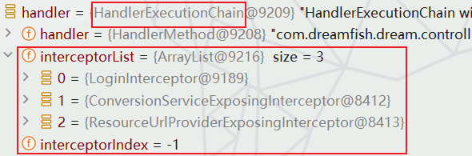
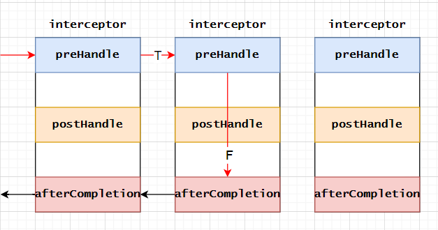
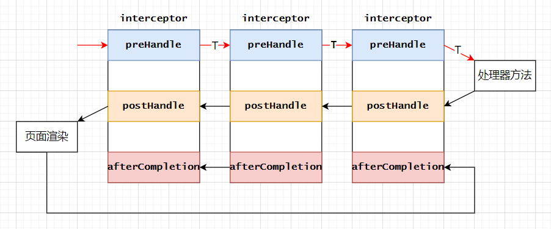
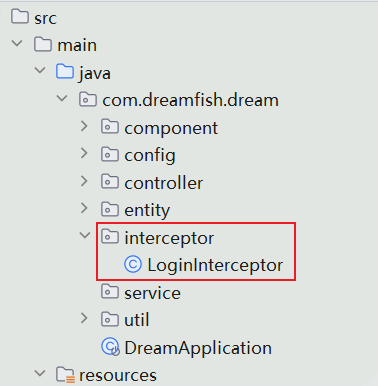
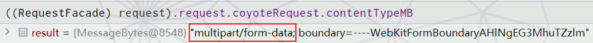
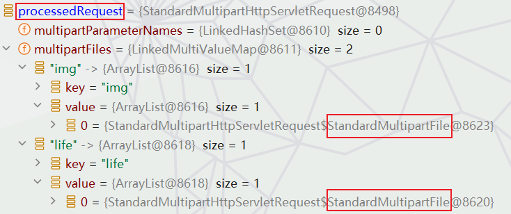
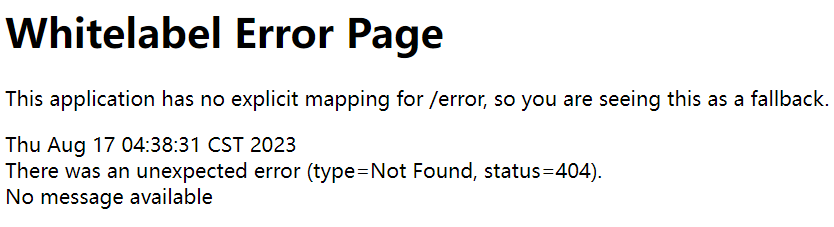
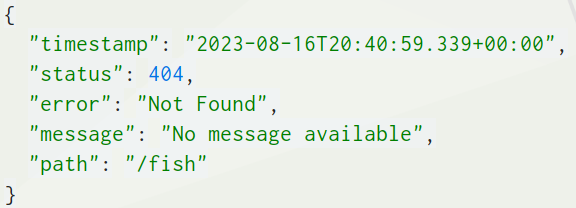
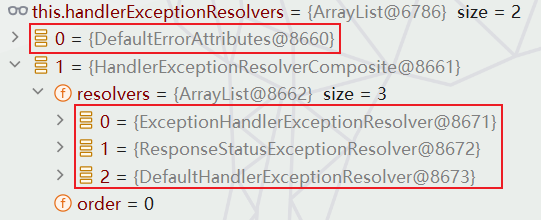
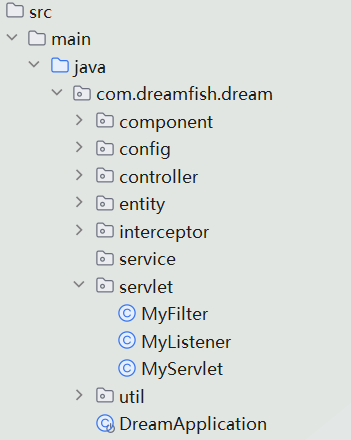

#### 1-拦截器

##### a-简介

1.   springboot中拦截器主要就是实现拦截器接口`HandlerInterceptor`：

     ```java
     public interface HandlerInterceptor {
     
         default boolean preHandle(HttpServletRequest request, HttpServletResponse response, Object handler)
             throws Exception {
             return true;
         }
         default void postHandle(
             HttpServletRequest request,
             HttpServletResponse response,
             Object handler,     
             @Nullable ModelAndView modelAndView) throws Exception {
         }
     
         default void afterCompletion(
             HttpServletRequest request,
             HttpServletResponse response,
             Object handler,   
             @Nullable Exception ex) throws Exception {
         }
     
     }
     ```

2.   三个方法功能如下：

     1.   `preHandle()`：这个方法在处理请求之前调用。该方法可以返回`true`或`false`。如果返回`true`，则继续调用后续的拦截器和处理器。如果返回`false`，则不会调用其他的拦截器或处理器。这个方法可以用来进行一些预处理工作，如验证用户是否登录、记录访问日志等。
     2.   `postHandle()`：这个方法是在处理请求完成，即`Controller`方法调用之后执行，但在视图被渲染之前执行。因此，我们可以在这个方法中尝试添加或修改`ModelAndView`参数，或处理其他一些在请求完成后需要进行的处理。
     3.   `afterCompletion()`：这个方法是在整个请求处理完毕，视图也渲染完毕后进行的后置处理，当请求处理时发生异常，也会执行此方法。主要用于进行资源清理工作。


##### b-源码

1.   主要还是研究`DispatcherServlet`类的`doDispatch`方法：

     ```java
     protected void doDispatch(HttpServletRequest request, HttpServletResponse response) throws Exception {
         //从HttpServletRequest获取HttpRequest对象
         HttpServletRequest processedRequest = request;
         //定义HandlerExecutionChain，用于管理HttpRequest相应的处理器(Handler)和处理器的拦截器集合
         HandlerExecutionChain mappedHandler = null;
         //定义一个标志位，用于标记multipart请求是否已经解析
         boolean multipartRequestParsed = false;
     
         //获取HttpRequest的异步上下文管理器
         WebAsyncManager asyncManager = WebAsyncUtils.getAsyncManager(request);
     
         try {
             //定义ModelAndView对象，用于返回Html模板和相关数据
             ModelAndView mv = null;
             //定义异常对象
             Exception dispatchException = null;
     
             try {
                 //检查HttpRequest是否包含multipart数据，如有则进行解析
                 processedRequest = checkMultipart(request);
                 multipartRequestParsed = (processedRequest != request);
     
                 // 从已配置的handler映射中，通过HttpRequest查找与其对应的Handler
                 mappedHandler = getHandler(processedRequest);
                 if (mappedHandler == null) {
                     //如果找不到对应的Handler，返回404
                     noHandlerFound(processedRequest, response);
                     return;
                 }
     
                 //======================获取当前Handler对应的HandlerAdapter=========================
                 HandlerAdapter ha = getHandlerAdapter(mappedHandler.getHandler());
     
                 //请求方法是GET或HEAD就会处理最后修改头
                 String method = request.getMethod();
                 boolean isGet = HttpMethod.GET.matches(method);
                 if (isGet || HttpMethod.HEAD.matches(method)) {
                     long lastModified = ha.getLastModified(request, mappedHandler.getHandler());
                     if (new ServletWebRequest(request, response).checkNotModified(lastModified) && isGet) {
                         return;
                     }
                 }
     
                 //==============================执行拦截器中的预处理方法================================
                 if (!mappedHandler.applyPreHandle(processedRequest, response)) {
                     return;
                 }
     
                 //使用HandlerAdapter执行Handler
                 mv = ha.handle(processedRequest, response, mappedHandler.getHandler());
     
                 // 如果请求采用异步处理，则直接返回
                 if (asyncManager.isConcurrentHandlingStarted()) {
                     return;
                 }
                 //为视图名设置默认值
                 applyDefaultViewName(processedRequest, mv);
     
                 //================================调用拦截器的后处理方法=================================
                 mappedHandler.applyPostHandle(processedRequest, response, mv);
             }
             //异常处理
             catch (Exception ex) {
                 dispatchException = ex;
             }
             catch (Throwable err) {
                 dispatchException = new ServletException("Handler dispatch failed: " + err, err);
             }
             //==================处理派发结果(含mappedHandler.triggerAfterCompletion)====================
             processDispatchResult(processedRequest, response, mappedHandler, mv, dispatchException);
         }
         catch (Exception ex) {
             //==============================调用拦截器的afterCompletion方法==============================
             triggerAfterCompletion(processedRequest, response, mappedHandler, ex);
         }
         catch (Throwable err) {
             //==============================调用拦截器的afterCompletion方法==============================
             triggerAfterCompletion(processedRequest, response, mappedHandler,
                                    new ServletException("Handler processing failed: " + err, err));
         }
         finally {
             //如果是异步处理，则调用异步处理的关闭方法
             if (asyncManager.isConcurrentHandlingStarted()) {
                 if (mappedHandler != null) {
                     mappedHandler.applyAfterConcurrentHandlingStarted(processedRequest, response);
                 }
             }
             else {
                 //如果是multipart请求，清理相关资源
                 if (multipartRequestParsed) {
                     cleanupMultipart(processedRequest);
                 }
             }
         }
     }
     ```

2.   首先`getHandler`中除了获取处理器外，之前没提，其实还获取拦截器列表：

     1.   `getHandler`源码如下,遍历所有的处理器映射(器)尝试是否能找到处理该请求的处理器:这里还是提一下，这些处理器映射器中其实已经配置了拦截器列表：

          ```java
          @Nullable
          protected HandlerExecutionChain getHandler(HttpServletRequest request) throws Exception {
              if (this.handlerMappings != null) {  //===获取所有的处理器映射(器)===
                  for (HandlerMapping mapping : this.handlerMappings) { //===遍历所有的处理器映射(器)===
                      //===尝试是否能找到处理该请求的处理器===
                      HandlerExecutionChain handler = mapping.getHandler(request); 
                      if (handler != null) {
                          return handler; //===适配的返回处理器===
                      }
                  }
              }
              return null;
          }
          ```

          <br>

     2.   这里其实是其父类`AbstractHandlerMapping`的`getHandler`。然后再里面调用各个处理器映射器的`getHandlerInternal`获取处理器。最终封装为`HandlerExecutionChain`返回。

          ```java
          public final HandlerExecutionChain getHandler(HttpServletRequest request) throws Exception {
              
              // 通过请求拿到处理器
              Object handler = getHandlerInternal(request);
          
          	// 确保在拦截器和其他处理器中，request 包含已经缓存的 lookupPath
          	if (!ServletRequestPathUtils.hasCachedPath(request)) {
          		initLookupPath(request);
          	}
          
          	// 对处理器进行封装成handler执行链
          	HandlerExecutionChain executionChain = getHandlerExecutionChain(handler, request);
          
          	return executionChain;
          }
          ```

          <br> 

     3.   `HandlerExecutionChain`方法中把`adaptedInterceptors`中拦截器添加到`HandlerExecutionChain`对象中。注意参考上文，这里的`adaptedInterceptors`属性是处理器适配中的。

          ```java
          protected HandlerExecutionChain getHandlerExecutionChain(Object handler, HttpServletRequest request) {
              
              HandlerExecutionChain chain = (
                  handler instanceof HandlerExecutionChain handlerExecutionChain
                  ? handlerExecutionChain : new HandlerExecutionChain(handler));
          
              //遍历adaptedInterceptors中的每一个HandlerInterceptor
              for (HandlerInterceptor interceptor : this.adaptedInterceptors) {
                  // 如果当前拦截器是MappedInterceptor的实例
                  if (interceptor instanceof MappedInterceptor mappedInterceptor) {
                      // 检查当前的HTTP请求是否匹配此拦截器的映射策略
                      if (mappedInterceptor.matches(request)) {
                          // 如果匹配，把当前拦截器添加到HandlerExecutionChain中
                          chain.addInterceptor(mappedInterceptor.getInterceptor());
                      }
                  }
                  else {
                      // 如果当前拦截器不是MappedInterceptor的实例，直接把拦截器添加到HandlerExecutionChain中
                      chain.addInterceptor(interceptor);
                  }
              }
              // 返回HandlerExecutionChain对象
              return chain;
          }
          ```

3.   到这里我们就获取了处理器、拦截器列表。在执行`HandlerAdapter ha = getHandlerAdapter(mappedHandler.getHandler())`后就获取了处理器适配器。之后就是通过处理器(`HandlerExecutionChain`类型)的`applyPreHandle`执行拦截器的`preHandle`方法。一旦任何一个拦截器返回`false`后面的处理器方法将无法执行！

     ```java
     if (!mappedHandler.applyPreHandle(processedRequest, response)) {
         return;
     }
     ```

     1.   其中`applyPreHandle`的具体逻辑：这里面很明显就是正序遍历，并且需要注意这里使用`interceptorIndex`记录执行到的拦截器索引。

          ```java
          boolean applyPreHandle(HttpServletRequest request, HttpServletResponse response) throws Exception {
              //直接正序遍历拦截器
              for (int i = 0; i < this.interceptorList.size(); i++) {
                  //获取索引为i的拦截器
                  HandlerInterceptor interceptor = this.interceptorList.get(i);
                  
                  //调用preHandle方法预处理请求
                  if (!interceptor.preHandle(request, response, this.handler)) {
                      //===如果preHandle方法返回false,调用triggerAfterCompletion方法触发处理完成后的操作===
                      triggerAfterCompletion(request, response, null);
                      // 返回false，表示预处理未通过。
                      return false;
                  }
                  //===记录拦截器索引,继续处理下一个拦截器===
                  this.interceptorIndex = i;
              }
              //所有拦截器都成功执行预处理
              return true;
          }
          ```

     2.   此外上述代码中可以知道，一旦某个拦截器的`preHandle`返回`false`,就不会继续执行后面的处理器。而是转而执行`triggerAfterCompletion`方法。而`triggerAfterCompletion`方法逻辑如下，就是倒序遍历已经执行的处理器，调用他们的`afterCompletion`方法：

          ```java
          void triggerAfterCompletion(
              HttpServletRequest request,
              HttpServletResponse response,
              @Nullable Exception ex) {
          
              //通过interceptorIndex索引倒序遍历拦截器
              for (int i = this.interceptorIndex; i >= 0; i--) {
                  //获取索引为i的拦截器
                  HandlerInterceptor interceptor = this.interceptorList.get(i);
                  try {
                      //调用afterCompletion方法
                      interceptor.afterCompletion(request, response, this.handler, ex);
                  }
                  catch (Throwable ex2) {
                      logger.error("HandlerInterceptor.afterCompletion threw exception", ex2);
                  }
              }
          }
          ```

     3.   大致就是如下过程：<br>

4.   之后就是执行`mv = ha.handle(processedRequest, response, mappedHandler.getHandler())`返回`ModelAndView`。然后就是通过处理器(`HandlerExecutionChain`类型)的`applyPostHandle`执行拦截器的`postHandle`方法。

     ```java
     void applyPostHandle(HttpServletRequest request, HttpServletResponse response, @Nullable ModelAndView mv)
         throws Exception {
         //直接倒序遍历拦截器
         for (int i = this.interceptorList.size() - 1; i >= 0; i--) {
             //获取索引为i的拦截器
             HandlerInterceptor interceptor = this.interceptorList.get(i);
             //调用拦截器的postHandle方法
             interceptor.postHandle(request, response, this.handler, mv);
         }
     }
     ```

5.   之后会执行`processDispatchResult(processedRequest, response, mappedHandler, mv, dispatchException)`处理派发结果。而拦截器的方法调用就藏在这里面：

     1.   首先`processDispatchResult`源码如下：在通过`render`渲染处理完视图，就会通过处理器(`HandlerExecutionChain`类型)的`triggerAfterCompletion`执行拦截器的`afterCompletion`方法:

          ```java
          private void processDispatchResult(
              HttpServletRequest request, 
              HttpServletResponse response,
              @Nullable HandlerExecutionChain mappedHandler,
              @Nullable ModelAndView mv,
              @Nullable Exception exception) throws Exception {
          
              //==============================渲染视图//==============================
              render(mv, request, response);
          
              if (mappedHandler != null) {
                  //=====================调用拦截器的afterCompletion方法========================
                  mappedHandler.triggerAfterCompletion(request, response, null);
              }
          }
          ```

     2.   `triggerAfterCompletion`逻辑如下：

          ```java
          void triggerAfterCompletion(HttpServletRequest request, HttpServletResponse response, @Nullable Exception ex) {
              //通过interceptorIndex索引倒序遍历拦截器
              for (int i = this.interceptorIndex; i >= 0; i--) {
                  //获取索引为i的拦截器
                  HandlerInterceptor interceptor = this.interceptorList.get(i);
                  try {
                      //调用afterCompletion方法
                      interceptor.afterCompletion(request, response, this.handler, ex);
                  }
                  catch (Throwable ex2) {
                      logger.error("HandlerInterceptor.afterCompletion threw exception", ex2);
                  }
              }
          }
          ```

     3.   大致过程如下：<br>

6.   此外还需要说的一点就是，通过`doDispatch`我们知道，当上述过程中出现异常错误时(<span style="color:red">其实详细看了源码后，个人感觉应该具体应该是指页面渲染过程中出现异常错误时。因为其他的错误都被里面那层`try-catch`捕获，只有处理派发结果部分是外面那层`try-catch`</span>)，会调用`triggerAfterCompletion`。里面其实也是通过处理器(`HandlerExecutionChain`类型)的`triggerAfterCompletion`执行拦截器的`afterCompletion`方法:

     ```java
     private void triggerAfterCompletion(
         HttpServletRequest request,
         HttpServletResponse response,       
         @Nullable HandlerExecutionChain mappedHandler, 
         Exception ex) throws Exception {
     
         if (mappedHandler != null) {
             mappedHandler.triggerAfterCompletion(request, response, ex);
         }
         throw ex;
     }
     ```

     >   小结：
     >
     >   1.   根据当前请求，找到`HandlerExecutionChain`(可以处理请求的`handler`以及`handler`的所有拦截器)。
     >2.   先来顺序执行 所有拦截器的 `preHandle`方法：
     >        1.   如果当前拦截器`prehandler`返回为`true`。则执行下一个拦截器的`preHandle`。
     >        2.   如果当前拦截器返回为`false`。直接倒序执行所有已经执行了的拦截器的`afterCompletion。`
     >
     >   3.   如果任何一个拦截器返回`false`，直接跳出不执行目标方法。
     >4.   所有拦截器都返回`true`，则执行目标方法。
     >   5.   倒序执行所有拦截器的`postHandle`方法。
     >6.   页面成功渲染完成以后，也会倒序触发 `afterCompletion`。
     >   7.   前面的步骤有任何异常都会直接倒序触发 `afterCompletion`。


##### c-自定义拦截器

1.   主程序下创建一个目录`interceptor`放置自定义拦截器：<br>

2.   创建自定义拦截器`LoginInterceptor`实现`HandlerInterceptor`接口：

     ```java
     public class LoginInterceptor implements HandlerInterceptor {//CTRL+O快速重写方法
     
         @Override
         public boolean preHandle(
             HttpServletRequest request,
             HttpServletResponse response,
             Object handler) throws Exception {
     
             Object user = request.getSession().getAttribute("user");//登录检查
             if (user == null) {
                 request.setAttribute("msg", "没有权限，请先登录");
                 request.getRequestDispatcher("/login").forward(request, response);
                 //session.setAttribute("msg", "没有权限，请先登录");
                 //response.sendRedirect("/login");
                 return false;
             }
             return true;
         }
     
         @Override
         public void postHandle(
             HttpServletRequest request,
             HttpServletResponse response,
             Object handler,
             ModelAndView modelAndView) throws Exception {
     
             HandlerInterceptor.super.postHandle(request, response, handler, modelAndView);
         }
     
         @Override
         public void afterCompletion(
             HttpServletRequest request,
             HttpServletResponse response,
             Object handler, Exception ex) throws Exception {
     
             HandlerInterceptor.super.afterCompletion(request, response, handler, ex);
         }
     }
     ```

3.   添加自定义拦截器到springboot中：

     ```java
     @Configuration
     public class MyConfig implements WebMvcConfigurer {
     
         @Override
         public void addInterceptors(InterceptorRegistry registry) {
             WebMvcConfigurer.super.addInterceptors(registry);
             LoginInterceptor loginInterceptor = new LoginInterceptor();
             registry.addInterceptor(loginInterceptor)
                 .addPathPatterns("/**") //拦截所有请求
                 .excludePathPatterns( //排除无需拦截的请求(登录、静态资源、错误)
                 "/login", "/css/**",
                 "/js/**", "/img/**",
                 "/webjars/**", "/error/**");
         }
     }
     ```

4.   关于放行静态资源的另一种形式：

     1.   配置文件中修改静态资源访问路径模式(前缀)：

          ```properties
          # 配置静态资源路径,但是会导致欢迎页失效(源码可知)
          spring.mvc.static-path-pattern=/static/**
          ```

     2.   添加自定义拦截器到springboot中：

          ```java
          @Configuration
          public class MyConfig implements WebMvcConfigurer {
          
              @Override
              public void addInterceptors(InterceptorRegistry registry) {
                  WebMvcConfigurer.super.addInterceptors(registry);
                  LoginInterceptor loginInterceptor = new LoginInterceptor();
                  registry.addInterceptor(loginInterceptor)
                      .addPathPatterns("/**") //拦截所有请求
                      .excludePathPatterns( //排除无需拦截的请求(登录、静态资源、错误)
                      "/login","/static/**",
                      "/webjars/**","/error/**");
              }
          }
          ```


---


#### 2-文件上传

##### a-实例

1.   编写一个文件上传页面：文件上传需要添加`enctype="multipart/form-data"`,且请求方式为`post`。对于单文件上传使用`file`类型的`input`标签，而多文件上传则在此基础上加一个`multiple="multiple"`(属性名与属性值一致，属性值可以省略)。

     ```html
     <!DOCTYPE html>
     <html lang="en" xmlns:th="http://www.thymeleaf.org">
         <head>
             <meta charset="UTF-8">
             <title>upload</title>
         </head>
         <body>
             <!--文件上传需要添加enctype="multipart/form-data",且请求方式为post-->
             <form th:action="@{/upload}" method="post" enctype="multipart/form-data">
     
                 <!--单文件上传-->
                 <input type="file" name="img"><br>
     
                 <!--多文件上传-->
                 <input type="file" name="life" multiple><br>
     
                 <input type="submit" value="上传">
             </form>
         </body>
     </html>
     ```

2.   创建控制器方法：`@RequestPart` 注解常用于访问那些 `multipart/form-data` 类型的请求中的特定部分，尤其在处理文件上传的情况中非常有用(其实也可以不用或者干脆使用`@RequestParam`注解)(主要是用作区分)。

     ```java
     @Controller
     public class OtherController {
     
         @GetMapping("/upload.html")
         public String uploadPage(Model model) {
             return "upload";
         }
     
         @PostMapping("/upload") //注意一定要允许post请求
         @ResponseBody
         public Object upload(
             @RequestPart("img") MultipartFile img,
             @RequestPart("life") List<MultipartFile> life //也可以用数组
         ) throws IOException {
     
             String path="D:\\upload\\";
     
             if (!img.isEmpty()) {
                 String filename = img.getOriginalFilename(); //获取原始文件名(包含后缀)
     
                 //保存文件
                 img.transferTo(new File(path + filename));
     
             }
     
             if (!life.isEmpty()) {
                 for (MultipartFile multipartFile : life) {
                     if (!multipartFile.isEmpty()) {
                         String filename = multipartFile.getOriginalFilename(); //获取原始文件名(包含后缀)
     
                         //保存文件
                         multipartFile.transferTo(new File(path + filename));
                     }
                 }
             }
             return Result.success();
         }
     ```

3.   关于`MultipartFile`接口的一些方法如下：

     ```java
     public interface MultipartFile extends InputStreamSource {
     
         //返回表单中参数的名称(name属性)
         String getName();
     
         //返回客户端文件系统中的原始文件名(名字是由客户端提供的，需要谨慎使用)(包含后缀)
         @Nullable
         String getOriginalFilename();
     
         //返回文件的内容类型，如果未定义或者在表单中没有文件被选择，则返回null。
         @Nullable
         String getContentType();
     
         //返回是否上传的文件为空,部分表单中没有文件被选择或者所选文件没有内容。
         boolean isEmpty();
     
         //返回文件的大小，以字节为单位，如果文件为空则返回0。
         long getSize();
     
         // 以字节数组形式返回文件的内容，如果文件为空则返回空字节数组。
         byte[] getBytes() throws IOException;
     
         // 返回一个输入流以从中读取文件内容。用户有责任关闭这个返回的流。
         @Override
         InputStream getInputStream() throws IOException;
     
         // 返回这个MultipartFile的Resource表示
         default Resource getResource() {
             return new MultipartFileResource(this);
         }
     
         // 将接收到的文件传送到给定的目标文件。
         //用于件系统中移动文件，复制文件，或者将内存中的内容保存到目标文件中。如果目标文件已经存在，它会首先被删除。
         void transferTo(File dest) throws IOException, IllegalStateException;
     
         // 将接收到的文件传送到给定的目标文件。该默认实现简单地复制文件输入流。
         default void transferTo(Path dest) throws IOException, IllegalStateException {
             FileCopyUtils.copy(getInputStream(), Files.newOutputStream(dest));
         }
     }
     ```

4.   配置配置文件：

     ```properties
     # 上传文件总的最大值
     spring.servlet.multipart.max-request-size=30MB
     
     # 单个文件的最大值
     spring.servlet.multipart.max-file-size=10MB
     ```

     


##### b-原理

1.   文件上传对应的配置都在`MultipartAutoConfiguration`中：

     ```java
     @AutoConfiguration
     @ConditionalOnClass({ Servlet.class, StandardServletMultipartResolver.class, MultipartConfigElement.class })
     @ConditionalOnProperty(prefix = "spring.servlet.multipart", name = "enabled", matchIfMissing = true)
     @ConditionalOnWebApplication(type = Type.SERVLET)
     @EnableConfigurationProperties(MultipartProperties.class)//======这儿=======
     public class MultipartAutoConfiguration {
     
         private final MultipartProperties multipartProperties;
     
         public MultipartAutoConfiguration(MultipartProperties multipartProperties) {
             this.multipartProperties = multipartProperties;
         }
     
         //相关配置
         @Bean
         @ConditionalOnMissingBean(MultipartConfigElement.class)
         public MultipartConfigElement multipartConfigElement() {
             return this.multipartProperties.createMultipartConfig();
         }
     
         //配置标准Servlet多部分解析器
         @Bean(name = DispatcherServlet.MULTIPART_RESOLVER_BEAN_NAME)
         @ConditionalOnMissingBean(MultipartResolver.class)
         public StandardServletMultipartResolver multipartResolver() {
             StandardServletMultipartResolver multipartResolver = new StandardServletMultipartResolver();
             multipartResolver.setResolveLazily(this.multipartProperties.isResolveLazily());
             return multipartResolver;
         }
     
     }
     
     ```

2.   通过上面源码知道其对应到的属性类为`MultipartProperties`,对应配置文件的前缀`spring.servlet.multipart`：

     ```java
     @ConfigurationProperties(prefix = "spring.servlet.multipart", ignoreUnknownFields = false)
     public class MultipartProperties {
     
         //是否启用multipart上传的支持
     
         private boolean enabled = true;
     
         //上传文件的中间位置
         private String location;
     
         //最大文件大小
         private DataSize maxFileSize = DataSize.ofMegabytes(1);
     
         //最大请求大小
         private DataSize maxRequestSize = DataSize.ofMegabytes(10);
     
         //文件的阈值，大于此阈值的文件将被写入到磁盘
         private DataSize fileSizeThreshold = DataSize.ofBytes(0);
     
         //是否在文件或参数访问时懒加载multipart请求
         private boolean resolveLazily = false;
     
         public MultipartConfigElement createMultipartConfig() {
             MultipartConfigFactory factory = new MultipartConfigFactory();
             PropertyMapper map = PropertyMapper.get().alwaysApplyingWhenNonNull();
             // 将属性的值设置给factory
             map.from(this.fileSizeThreshold).to(factory::setFileSizeThreshold);
             map.from(this.location).whenHasText().to(factory::setLocation);
             map.from(this.maxRequestSize).to(factory::setMaxRequestSize);
             map.from(this.maxFileSize).to(factory::setMaxFileSize);
             return factory.createMultipartConfig();
             // 返回一个使用这些属性配置的新的MultipartConfigElement实例
         }
     }
     ```

3.   下面我们对之前的实例debug。从`DispatcherServlet`类的`doDispatch`方法具体研究一下文件上传参数是如何处理的。大致就是判断当前请求是不是文件上传请求，是则进行封装：

     ```java
     protected void doDispatch(HttpServletRequest request, HttpServletResponse response) throws Exception {
     
         HttpServletRequest processedRequest = request;
     
         //初始化mappedHandler，包含handler和interceptor列表的对象
         HandlerExecutionChain mappedHandler = null;
     
         //===标记是否已解析文件上传请求===
         boolean multipartRequestParsed = false;
     
         // 检查是否是multipart类型的请求（例如文件上传），并对其进行解析
         processedRequest = checkMultipart(request);
         // 检查经过处理后的请求(可能进行了multipart处理)是否与原始请求不同,不同说明文件上传请求已解析
         multipartRequestParsed = (processedRequest != request);
     
         mappedHandler = getHandler(processedRequest);
         HandlerAdapter ha = getHandlerAdapter(mappedHandler.getHandler());
         processDispatchResult(processedRequest, response, mappedHandler, mv, dispatchException);
     }
     ```

4.   那么`checkMultipart`具体如何检查是不是文件上传请求：其实就是通过`request`里面的某些字段判断是不是文件上传，是则对`request`进行一层封装为`StandardMultipartHttpServletRequest`:

     ```java
     protected HttpServletRequest checkMultipart(HttpServletRequest request) throws MultipartException {
     
         // 如果存在multipart解析器并且请求是multipart类型
         if (this.multipartResolver != null && this.multipartResolver.isMultipart(request)) {
     
             // 尝试解析multipart请求，如果成功就返回解析后的请求
             return this.multipartResolver.resolveMultipart(request);
     
         }
         // 如果没有multipart内容，继续用原始请求进行处理。
         return request;
     }
     ```

     <br>

5.   进一步查看就明白了：

     ```java
     public boolean isMultipart(HttpServletRequest request) {
         return StringUtils.startsWithIgnoreCase(
             request.getContentType(),                                 
             (this.strictServletCompliance ? MediaType.MULTIPART_FORM_DATA_VALUE : "multipart/"));
     }
     
     @Override
     public MultipartHttpServletRequest resolveMultipart(HttpServletRequest request) throws MultipartException {
         return new StandardMultipartHttpServletRequest(request, this.resolveLazily); //包装为xxxxRequest
     }
     ```

6.   但是还有一点很重要，就是封装`request`为`StandardMultipartHttpServletRequest`的过程：其实这个过程姮好理解，就是把所有文件参数创建`MultipartFile`对象，放到`MultiValueMap`中，最后包装为`StandardMultipartHttpServletRequest`。

     ```java
     public StandardMultipartHttpServletRequest(HttpServletRequest request, boolean lazyParsing)
         throws MultipartException {
     
         super(request);
         if (!lazyParsing) {
             parseRequest(request); //===解析请求===
         }
     }
     
     private void parseRequest(HttpServletRequest request) {
         try {
             // 从HTTP请求中获取所有部分，每个部分代表一个文件或表单字段
             Collection<Part> parts = request.getParts();
             // 初始化一个存放参数名的LinkedHashSet，参数名表示文件或表单字段的名字
             this.multipartParameterNames = new LinkedHashSet<>(parts.size());
             // 初始化一个MultiValueMap，键为String类型表示文件或表单字段的名字，值为MultipartFile类型表示文件数据
             MultiValueMap<String, MultipartFile> files = new LinkedMultiValueMap<>(parts.size());
             // 遍历每个部分
             for (Part part : parts) {
                 // 从部分的头部信息中获取“Content-Disposition”字段的值
                 String headerValue = part.getHeader(HttpHeaders.CONTENT_DISPOSITION);
                 // 解析“Content-Disposition”字段的值，获取文件或表单字段的属性信息
                 ContentDisposition disposition = ContentDisposition.parse(headerValue);
                 // 从属性信息中获取文件名
                 String filename = disposition.getFilename();
                 // 如果文件名不为空，则认为这个部分是一个文件，将其添加到files中
                 if (filename != null) {
                     files.add(part.getName(), new StandardMultipartFile(part, filename));
                 }
                 // 如果文件名为空，则认为这个部分是一个表单字段，将其名字添加到multipartParameterNames中
                 else {
                     this.multipartParameterNames.add(part.getName());
                 }
             }
             // 将解析得到的文件数据设置到当前对象的属性中
             setMultipartFiles(files);
         }
         // 如果在处理过程中产生了异常，则调用handleParseFailure方法处理这个异常
         catch (Throwable ex) {
             handleParseFailure(ex);
         }
     }
     ```

7.   也就可以认为经过上述步骤，文件部分都已经创建好保存在新的`processedRequest`中，而后面解析参数用的就是这个`processedRequest`：<br>

8.   之后就是参数解析流程，中间部分直接跳过，最终是由`RequestPartMethodResolver`解析参数，而其中调用了`resolveMultipartArgument`,然后从`request`也就是上文`processedRequest`中直接通过名称获取文件参数。省略部分源码！！！

     ```java
     @Override
     public Object resolveArgument(MethodParameter parameter, @Nullable ModelAndViewContainer mavContainer,
                                   NativeWebRequest request, @Nullable WebDataBinderFactory binderFactory) throws Exception {
     
         // 从 request 中获取 HttpServletRequest 对象
         HttpServletRequest servletRequest = request.getNativeRequest(HttpServletRequest.class);
     
         // 获取请求参数的名字
         String name = getPartName(parameter, requestPart);
         // 如果参数是 Optional 类型，则获取其内层参数
         parameter = parameter.nestedIfOptional();
         // 初始化 arg 对象为空
         Object arg = null;
     
         // 通过 MultipartResolutionDelegate 解析 multipart 请求参数
         Object mpArg = MultipartResolutionDelegate.resolveMultipartArgument(
             name,
             parameter,
             servletRequest);
     
         // 判断解析结果，如果解析成功，arg 赋值为解析的结果
         if (mpArg != MultipartResolutionDelegate.UNRESOLVABLE) {
             arg = mpArg;
         }
     
         // 如果 arg 需要适配，则进行适配后返回，否则直接返回 arg
         return adaptArgumentIfNecessary(arg, parameter);
     }
     ```

     ```java
     @Nullable
     public static Object resolveMultipartArgument(
         String name,
         MethodParameter parameter,
         HttpServletRequest request)
         throws Exception {
     
         MultipartHttpServletRequest multipartRequest =
             WebUtils.getNativeRequest(request, MultipartHttpServletRequest.class);
     
         return multipartRequest.getFile(name); //===从请求中获取文件===
     }
     ```

     <br>

9.   ok!<br>

---


#### 3-Resource与ResourceLoader

##### a-ResourceLoader

1.   `ResourceLoader `是 Spring Framework 提供的一个接口，用于加载文件资源。以下是一个 `ResourceLoader `接口的定义：

     ```java
     public interface ResourceLoader {
     
         String CLASSPATH_URL_PREFIX = "classpath:";
     
         Resource getResource(String location);
     }
     ```

2.   `ResourceLoader`的主要方法是 `Resource getResource(String location)`，这个方法会根据提供的位置字符串 `location`返回一个 `Resource`对象。

3.   `ResourceLoader`是一个策略接口，Spring 提供了多个实现类来处理不同的场景：

     1.   `DefaultResourceLoader`：Spring默认的`ResourceLoader`实现，后面详细介绍。

     2.   `FileSystemResourceLoader`：当资源的位置字符串不带任何特定的前缀时，它将返回一个 `FileSystemResource`。这个实现类不会处理以 `"classpath:" `开头的资源。

     3.   `ClassPathResourceLoader`：无论资源的位置字符串是否带有 `"classpath:"` 前缀，它都会返回一个 `ClassPathResource`。

     4.   `ServletContextResourceLoader`：这个实现类是为 Web 应用设计的，它会返回一个 `ServletContextResource`。资源的位置字符串会被解释为 `ServletContext `的路径。这哥们继承并拓展了`DefaultResourceLoader`。

     5.   spring的`ApplicationContext`底层拓展了`ResourceLoader`接口，这意味着所有的Spring应用上下文都可以作为`ResourceLoader`使用。这也是获取应用上下文资源最常用的方式。

          ```tex
          ApplicationContext extends EnvironmentCapable, ListableBeanFactory, HierarchicalBeanFactory, MessageSource, ApplicationEventPublisher, ResourcePatternResolver
          
          ResourcePatternResolver extends ResourceLoader
          
          AbstractApplicationContext extends DefaultResourceLoader, implements ApplicationContext, Lifecycle
          
          ClassPathXmlApplicationContext extends AbstractApplicationContext
          
          FileSystemXmlApplicationContext extends AbstractApplicationContext
          ```

          ```java
          ApplicationContext ctx = new ClassPathXmlApplicationContext();
          Resource resource = ctx.getResource("classpath:com/example/config.xml");
          ```

4.   `DefaultResourceLoader`: Spring默认的`ResourceLoader`实现,对于大部分情况来说都是足够的。这个类的`getResource`方法会根据资源路径的前缀来决定返回哪种Resource实现：

     1.  路径以`classpath:`开头，返回`ClassPathResource`。
     2.  路径以`http:`、`https:`、`file:`、`ftp:`、`jar`等协议开头，返回`UrlResource`。
     3.  如果没有特定的前缀，认为是文件，返回`FileSystemResource`。


##### b-Resource

1.   `Resource`是Spring框架中用于抽象底层资源的一个接口，资源可以是文件、类路径下的资源、HTTP资源、数据库资源等。

2.   `Resource`接口源码如下：

     ```java
     //定义一个表示资源的接口，这个接口继承了InputStreamSource接口
     public interface Resource extends InputStreamSource {
     
     	//判断该资源是否在物理上存在，如文件是否真的在硬盘上
     	boolean exists();
     
     	//判断该资源是否可以读，它默认是调用exists()方法来实现的
     	default boolean isReadable() {
     		return exists();
     	}
     
     	//判断该资源是否为打开的资源流
     	default boolean isOpen() {
     		return false;
     	}
     
     	//判断该资源是否代表一个文件系统中的文件
     	default boolean isFile() {
     		return false;
     	}
     
     	//返回该资源的URL句柄
     	URL getURL() throws IOException;
     
     	//返回该资源的URI句柄
     	URI getURI() throws IOException;
     
     	//返回该资源的文件句柄
     	File getFile() throws IOException;
     
     	//方法八：返回一个ReadableByteChannel，每次调用都会创建一个新的通道
     	default ReadableByteChannel readableChannel() throws IOException {
     		return Channels.newChannel(getInputStream());
     	}
     
     	//返回该资源内容的字节数组形式
     	default byte[] getContentAsByteArray() throws IOException {
     		return FileCopyUtils.copyToByteArray(getInputStream());
     	}
     
     	//将该资源的内容以字符串形式返回，使用指定的字符集进行解码
     	default String getContentAsString(Charset charset) throws IOException {
     		return FileCopyUtils.copyToString(new InputStreamReader(getInputStream(), charset));
     	}
     
     	//返回这个资源的内容长度
     	long contentLength() throws IOException;
     
     	//返回该资源的最后修改时间戳
     	long lastModified() throws IOException;
     
     	//根据相对路径在该资源下创建一个新的资源
     	Resource createRelative(String relativePath) throws IOException;
     
     	//返回该资源的文件名，通常是路径的最后部分
     	@Nullable
     	String getFilename();
     
     	//返回描述该资源的字符串，通常用于在与资源一起工作时用来输出错误消息
     	String getDescription();
     }
     ```

     ```java
     public interface InputStreamSource {
     
         //返回基础资源内容的InputStream对象，每次调用都会创建一个新的流。
         InputStream getInputStream() throws IOException;
     
     }
     ```

3.   对于`createRelative`方法是根据相对路径在该资源下创建一个新的资源：

     1.   如果你的`Resource`对象表示的是一个URL，比如`http://example.com/foo/`，并且你想要获取`foo`下的`bar.html`资源。你可以调用`resource.createRelative("bar.html")`来直接得到`http://example.com/foo/bar.html` 的`Resource`对象。
     2.   如果你有一个文件系统中的`Resource`，比如`/etc/config/`，并且你想要获取`config`目录下的`app.conf`文件。你可以调用`resource.createRelative("app.conf")`来获取`/etc/config/app.conf`的`Resource`对象。
     3.   返回一个新的资源`Resource`对象。

4.   区分：假设我们有一个资源，它是一个位于网络服务器上的文件，URL 是 `http://www.example.com/docs/resource.txt`。

     1.   使用`getURL()` 返回的就是资源的网络位置，将返回一个表示此 URL 的 URL 对象：这告诉你可以通过 HTTP 协议在 `www.example.com `的服务器上访问到位于` /docs/ `目录下的` resource1.txt `文件。

          ```java
          URL resourceUrl = resource.getURL();
          System.out.println(resourceUrl.toString()); //http://www.example.com/docs/resource.txt
          ```

     2.   使用 `getURI()` 返回的是一个 `URI `对象，用于唯一标识资源，也就是资源的标识符：这个标识符也告诉你这是一个网络上的资源，但是并没有说明如何访问它。

          ```java
          URI resourceUri = resource.getURI();
          System.out.println(resourceUri.toString()); //http://www.example.com/docs/resource.txt
          ```

     3.   使用 `getFile()` 返回的是一个 `File `对象，用于表示在本地系统的文件系统中的文件。但是因为这个例子中的资源是网络上的，所以不适合用 `getFile()`，如果强行使用，可能会抛出异常。一般来说，当资源是文件系统中的文件，如` C:\\docs\\resource1.txt` 时，`getFile() `会返回如下的` File `对象：这个路径表示的是在你的本地文件系统下，`C` 盘的 `/docs/ `目录下的 `resource1.txt` 文件。
          ```java
          File resourceFile = resource.getFile();
          System.out.println(resourceFile.getPath()); // C:\docs\resource.txt
          ```

5.   实现类：

     1.   `FileSystemResource`：是针对`java.io.File`的`Resource`实现类。
     2.   `ClassPathResource`：是类路径下资源的`Resource`实现。它通过`ClassLoader`或`Class`来加载资源。
     3.   `UrlResource`：是`java.net.URL`的`Resource`实现类，用来访问`URL`可以正常访问的任意对象。其内部封装了URL对象，因此，它支持`http`、`https`、`file`、`ftp`、`jar`等协议
     4.   `InputStreamResource`：把一个`InputStream`封装为`Resource`。
     5.   `ByteArrayResource`：把字节数组封装为`Resource`。

---


#### 4-异常处理

<br>

##### a-自动配置原理

1.   springboot默认提供了`/error`请求的处理过程：

2.   关于异常处理的自动配置都在`ErrorMvcAutoConfiguration`自动配置类:

     ```java
     @AutoConfiguration(before = WebMvcAutoConfiguration.class)
     @ConditionalOnWebApplication(type = Type.SERVLET)
     @ConditionalOnClass({ Servlet.class, DispatcherServlet.class })
     @EnableConfigurationProperties({ ServerProperties.class, ServerProperties.class })
     public class ErrorMvcAutoConfiguration {
     }
     ```

3.     通过上述代码可知错误处理对应的属性类为`ServerProperties`、`ServerProperties`，那么对应的配置文件就很好知道了。

4.   接下来就是逐个分析`ErrorMvcAutoConfiguration`自动配置类的配置： 

5.   `DefaultErrorAttributes`组件：

     1.   先看源码，就是直接放了个`DefaultErrorAttributes`组件：

          ```java
          @Bean
          @ConditionalOnMissingBean(value = ErrorAttributes.class, search = SearchStrategy.CURRENT)
          public DefaultErrorAttributes errorAttributes() {
              return new DefaultErrorAttributes();
          }
          ```

     2.   那么这个组件到底是干嘛的：

          ```java
          @Order(Ordered.HIGHEST_PRECEDENCE)
          public class DefaultErrorAttributes implements ErrorAttributes, HandlerExceptionResolver, Ordered {
          
              //定义常量ERROR_INTERNAL_ATTRIBUTE，用作HTTP请求的属性名。
              private static final String ERROR_INTERNAL_ATTRIBUTE = 
                  DefaultErrorAttributes.class.getName() 
                      + ".ERROR";
          
              // 当控制器或者处理程序方法抛出异常的时候，该方法将被调用。把异常信息存储到请求中，并返回null
              @Override
              public ModelAndView resolveException(
                  HttpServletRequest request, 
                  HttpServletResponse response, Object handler,
                  Exception ex) {
                  storeErrorAttributes(request, ex);
                  return null;
              }
          
              // 将异常信息存储在请求的属性中。
              private void storeErrorAttributes(HttpServletRequest request, Exception ex) {
                  request.setAttribute(ERROR_INTERNAL_ATTRIBUTE, ex);
              }
          
              // 根据选项获取异常属性。这里先获取包含所有属性的Map，然后根据选项删除不需要的属性。
              @Override
              public Map<String, Object> getErrorAttributes(
                  WebRequest webRequest,
                  ErrorAttributeOptions options) {
                  Map<String, Object> errorAttributes = getErrorAttributes(
                      webRequest,
                      options.isIncluded(Include.STACK_TRACE));
                  if (!options.isIncluded(Include.EXCEPTION)) {
                      errorAttributes.remove("exception");
                  }
                  if (!options.isIncluded(Include.STACK_TRACE)) {
                      errorAttributes.remove("trace");
                  }
                  if (!options.isIncluded(Include.MESSAGE) && errorAttributes.get("message") != null) {
                      errorAttributes.remove("message");
                  }
                  if (!options.isIncluded(Include.BINDING_ERRORS)) {
                      errorAttributes.remove("errors");
                  }
                  return errorAttributes;
              }
          
              //获取错误属性的核心方法.它生成LinkedHashMap来存储错误属性，并填充基本的属性，如时间戳、状态、错误详细信息和路径。
              private Map<String, Object> getErrorAttributes(WebRequest webRequest, boolean includeStackTrace) {
                  Map<String, Object> errorAttributes = new LinkedHashMap<>();
                  errorAttributes.put("timestamp", new Date());
                  addStatus(errorAttributes, webRequest);
                  addErrorDetails(errorAttributes, webRequest, includeStackTrace);
                  addPath(errorAttributes, webRequest);
                  return errorAttributes;
              }
              ... // addStatus, addErrorDetails, addPath方法的实现略过，它们是填充错误属性在LinkedHashMap的具体实现。
          }
          ```

     3.   大致上这个组件存在两条主线方法：

          1.   调用`resolveException`解析异常，然后`resolveException`内部调用`storeErrorAttributes`将异常信息存储到请求域。最终无论如何返回`null`。
          2.   调用`getErrorAttributes`获取异常属性信息，而它内部其实是调用重构方法`getErrorAttributes`获取时间戳、状态、错误详细信息和路径等错误相关性息，返回根据实际情况(`options`选项)排除筛选(这其实就是响应服务器的json错误数据)。

6.   `basicErrorController`控制器组件：

     1.   先看源码，就是不存在`ErrorController`就放了个组件：

          ```java
          @Bean
          @ConditionalOnMissingBean(value = ErrorController.class, search = SearchStrategy.CURRENT)
          public BasicErrorController basicErrorController(
              ErrorAttributes errorAttributes,
              ObjectProvider<ErrorViewResolver> errorViewResolvers) {
              
              return new BasicErrorController(errorAttributes, this.serverProperties.getError(),
                                              errorViewResolvers.orderedStream().toList());
          }
          ```

     2.     这个组件想都不用想，应该是用来处理异常请求的：并且他处理里的请求路径是`${server.error.path:${error.path:/error}}`，默认情况下就是使用默认值`/error`。

          ```java
          @Controller
          @RequestMapping("${server.error.path:${error.path:/error}}") 
          public class BasicErrorController extends AbstractErrorController {
          
              @RequestMapping(produces = MediaType.TEXT_HTML_VALUE) // 处理接收媒体类型为 TEXT_HTML的请求
              public ModelAndView errorHtml(HttpServletRequest request, HttpServletResponse response) { 
                  HttpStatus status = getStatus(request); // 获取请求的状态
                  Map<String, Object> model = Collections // 获取错误属性，并将其放入model中
                      .unmodifiableMap(
                      getErrorAttributes(
                          request, 
                          getErrorAttributeOptions(request, MediaType.TEXT_HTML)));
                  response.setStatus(status.value()); // 设置响应的状态为请求的状态
                  //===解析错误视图===
                  ModelAndView modelAndView = resolveErrorView(request, response, status, model); 
                  //===如果解析得到的错误视图为空，则新建一个error的ModelAndView===
                  return (modelAndView != null) ? modelAndView : new ModelAndView("error", model); 
              }
          
              @RequestMapping // 处理其他类型的请求
              public ResponseEntity<Map<String, Object>> error(HttpServletRequest request) { 
                  HttpStatus status = getStatus(request); // 获取请求的状态
                  if (status == HttpStatus.NO_CONTENT) { // 如果状态为HttpStatus.NO_CONTENT
                      return new ResponseEntity<>(status); // 返回状态
                  }
                  Map<String, Object> body = // 获取错误属性，并将其放入 body 中
                      getErrorAttributes(request, getErrorAttributeOptions(request, MediaType.ALL));
                  return new ResponseEntity<>(body, status); // 返回错误的应答
              }
          
              @ExceptionHandler(HttpMediaTypeNotAcceptableException.class) //处理媒体类型不被接受的错误的函数
              public ResponseEntity<String> mediaTypeNotAcceptable(HttpServletRequest request) { 
                  HttpStatus status = getStatus(request); 
                  return ResponseEntity.status(status).build();
              }
          }
          ```

     3.   其实到这，也就能猜到：

          1.   处理服务器请求的异常就用`error`方法，返回一个`ResponseEntity`。

          2.   处理浏览器请求的异常就用`errorHtml`方法，返回`ModelAndView`,最终是响应一个错误页面。至于`ModelAndView`怎么得到的：

               1.   首先是调用`resolveErrorView`尝试解析视图：

                    ```java
                    protected ModelAndView resolveErrorView(
                        HttpServletRequest request, 
                        HttpServletResponse response,
                        HttpStatus status,                                   
                        Map<String, Object> model) {
                        //获取所有的ErrorViewResolver错误视图解析器解析视图
                        for (ErrorViewResolver resolver : this.errorViewResolvers) {
                            ModelAndView modelAndView = resolver.resolveErrorView(request, status, model);
                            if (modelAndView != null) {
                                return modelAndView;
                            }
                        }
                        return null;
                    }
                    ```

               2.   但是实际上，默认情况下这里只有一个错误视图解析器`DefaultErrorViewResolver`，也就是后面要说的`conventionErrorViewResolver`组件:这里就不详细介绍，<a  href="#conventionErrorViewResolver">click</a>。

                    ```java
                    public class DefaultErrorViewResolver implements ErrorViewResolver, Ordered {
                    }
                    ```

               3.   如果解析不到视图，那就是` new ModelAndView("error", model)`:其实这里也还有两种情况：

                    1.   找`classpath:/templates`的`error.html`。
                    2.   直接通过`beanNameViewResolver`找到默认配置的名为`error`的`view`。

          3.   此外还有一点，就是无论`error`还是`errorHtml`方法都调用`getErrorAttributes`方法获取错误数据：但是实际上底层就是调用之前提到的`ErrorController`组件的`getErrorAttributes`方法获取错误数据。

               ```java
               public abstract class AbstractErrorController implements ErrorController {
               
                   private final ErrorAttributes errorAttributes;
               
                   protected Map<String, Object> getErrorAttributes(
                       HttpServletRequest request, 
                       ErrorAttributeOptions options) {
               
                       WebRequest webRequest = new ServletWebRequest(request);
                       //===ErrorAttributes组件的getErrorAttributes方法===
                       return this.errorAttributes.getErrorAttributes(webRequest, options);
                   }
               }
               ```

     4.   错误视图解析器`conventionErrorViewResolver`组件：

          1.   具体如下，在`DefaultErrorViewResolverConfiguration`配置类组件中添加一些配置，并且添加一个很重要的东西`conventionErrorViewResolver`默认的错误视图解析器组件。

               ```java
               @Configuration(proxyBeanMethods = false)
               @EnableConfigurationProperties({ WebProperties.class, WebMvcProperties.class })
               static class DefaultErrorViewResolverConfiguration {
               
                   private final ApplicationContext applicationContext;
               
                   private final Resources resources;
               
                   DefaultErrorViewResolverConfiguration(  //===一些配置===
                       ApplicationContext applicationContext, 
                       WebProperties webProperties) {
                       this.applicationContext = applicationContext;
                       this.resources = webProperties.getResources();
                   }
               
                   @Bean
                   @ConditionalOnBean(DispatcherServlet.class)
                   @ConditionalOnMissingBean(ErrorViewResolver.class)
                   DefaultErrorViewResolver conventionErrorViewResolver() { //===默认错误视图解析器===
                       return new DefaultErrorViewResolver(this.applicationContext, this.resources);
                   }
               
               }
               ```

          2.   具体的默认视图解析器逻辑：<a id="conventionErrorViewResolver"></a>

               ```java
               public class DefaultErrorViewResolver implements ErrorViewResolver, Ordered {
               
                   private static final Map<Series, String> SERIES_VIEWS;
               
                   static {
                       Map<Series, String> views = new EnumMap<>(Series.class);
                       views.put(Series.CLIENT_ERROR, "4xx");
                       views.put(Series.SERVER_ERROR, "5xx");
                       SERIES_VIEWS = Collections.unmodifiableMap(views);
                   }
               
                   @Override
                   public ModelAndView resolveErrorView(
                       HttpServletRequest request,
                       HttpStatus status, 
                       Map<String, Object> model) {
                       //===用精确的状态码(404、500)作为视图名找html页面===
                       ModelAndView modelAndView = resolve(String.valueOf(status.value()), model);
               
                       if (modelAndView == null && SERIES_VIEWS.containsKey(status.series())) {
                           //===用模糊的状态码(4xx、5xx)作为视图名找html页面===
                           modelAndView = resolve(SERIES_VIEWS.get(status.series()), model);
                       }
                       return modelAndView;
                   }
               
                   private ModelAndView resolve(String viewName, Map<String, Object> model) {
                       //===/error/+参数viewName(/error/404.html、/error/5xx.html)===
                       String errorViewName = "error/" + viewName;
                       TemplateAvailabilityProvider provider = this.templateAvailabilityProviders.
                           getProvider(
                           errorViewName,
                           this.applicationContext);
                       if (provider != null) {
                           return new ModelAndView(errorViewName, model);
                       }
                       return resolveResource(errorViewName, model);
                   }
               
                   private ModelAndView resolveResource(String viewName, Map<String, Object> model) {
                       //在静态资源目录下找名为参数viewName的html(404.html、5xx.html)===
                       for (String location : this.resources.getStaticLocations()) {
                           try {
                               Resource resource = this.applicationContext.getResource(location);
                               resource = resource.createRelative(viewName + ".html");
                               if (resource.exists()) {
                                   return new ModelAndView(new HtmlResourceView(resource), model);
                               }
                           }
                           catch (Exception ex) {
                           }
                       }
                       return null;
                   }
               }
               ```

          3.   其实上述逻辑大致就是：

               1.   首先去`classpath:/templates/error/`找`404.html`、`500.html`。
               2.   找不到再去静态资源目录找`404.html`、`500.html`。
               3.   还找不到，去`classpath:/templates/error/`找`4xx.html`、`5xx.html`。
               4.   最后去去静态资源目录找`4xx.html`、`5xx.html`。

     5.   默认的错误视图`error`及其配套的视图解析器`beanNameViewResolver`

          1.      自动配置了名为`error`的默认错误视图(`StaticView`)、`beanNameViewResolver`视图解析器。

               ```java
               @Configuration(proxyBeanMethods = false)
               @ConditionalOnProperty(prefix = "server.error.whitelabel", name = "enabled", matchIfMissing = true)
               @Conditional(ErrorTemplateMissingCondition.class)
               protected static class WhitelabelErrorViewConfiguration {
               
                   private final StaticView defaultErrorView = new StaticView(); //===默认的静态错误视图===
               
                   @Bean(name = "error")
                   @ConditionalOnMissingBean(name = "error")
                   public View defaultErrorView() { //==配置错误视图组件===
                       return this.defaultErrorView;
                   }
               
                   @Bean
                   @ConditionalOnMissingBean
                   public BeanNameViewResolver beanNameViewResolver() { //===配置beanNameViewResolver视图解析器===
                       BeanNameViewResolver resolver = new BeanNameViewResolver();
                       resolver.setOrder(Ordered.LOWEST_PRECEDENCE - 10);
                       return resolver;
                   }
               
               }
               ```

          2.   关于这个视图解析器，其实我们在之前也见过，它解析视图其实就是在ioc容器中找一个`viewName`的组件：

               ```java
               public class BeanNameViewResolver extends WebApplicationObjectSupport 
                   implements ViewResolver, Ordered {
               
                   @Override
                   @Nullable
                   public View resolveViewName(String viewName, Locale locale) throws BeansException {
                       ApplicationContext context = obtainApplicationContext();
                       if (!context.containsBean(viewName)) {
                           return null;
                       }
                       if (!context.isTypeMatch(viewName, View.class)) {
                           if (logger.isDebugEnabled()) {
                               logger.debug("Found bean named '"
                                            + viewName 
                                            + "' but it does not implement View");
                           }
                           return null;
                       }
                       //===直接从上下文(ioc容器)中获取名为viewName的bean===
                       return context.getBean(viewName, View.class);
                   }
               
               }
               
               ```

          3.   但是巧的是，这里不是刚放了一个叫做`error`的`StaticView`，而它的渲染方法其实就是返回一个静态html页面，错误白页。

               ```java
               private static class StaticView implements View {
               
                   @Override
                   public void render(
                       Map<String, ?> model,
                       HttpServletRequest request, 
                       HttpServletResponse response)
               
                       throws Exception {
                       if (response.isCommitted()) {
                           String message = getMessage(model);
                           logger.error(message);
                           return;
                       }
                       response.setContentType(TEXT_HTML_UTF8.toString());
                       StringBuilder builder = new StringBuilder();
                       Object timestamp = model.get("timestamp"); //===错误信息===
                       Object message = model.get("message");
                       Object trace = model.get("trace");
                       if (response.getContentType() == null) {
                           response.setContentType(getContentType());
                       }
                       builder.append("<html><body><h1>Whitelabel Error Page</h1>")
                           .append("<p>This application has no explicit mapping for /error,"
                                   +" so you are seeing this as a fallback.</p>")
                           .append("<div id='created'>")
                           .append(timestamp)
                           .append("</div>")
                           .append("<div>There was an unexpected error (type=")
                           .append(htmlEscape(model.get("error")))
                           .append(", status=")
                           .append(htmlEscape(model.get("status")))
                           .append(").</div>");
                       if (message != null) {
                           builder.append("<div>").append(htmlEscape(message)).append("</div>");
                       }
                       if (trace != null) {
                           builder.append("<div style='white-space:"
                                          +"pre-wrap;'>").append(htmlEscape(trace)).append("</div>");
                       }
                       builder.append("</body></html>");
                       response.getWriter().append(builder.toString());
                   }
               }
               ```

     6.   其他组件略过，我们将上述过程串一串，对于`/error`的错误会交给`basicErrorController`处理：

          1.   如果是浏览器请求，交给`errorHtml`方法处理：
               1.   使用`errorAttributes`获取错误信息，存放`model`中。
               2.   首先尝试使用默认错误视图解析器`conventionErrorViewResolver`解析：
                    1.   首先去`classpath:/templates/error/`找`404.html`、`500.html`。
                    2.   找不到再去静态资源目录找`404.html`、`500.html`。
                    3.   还找不到，去`classpath:/templates/error/`找`4xx.html`、`5xx.html`。
                    4.   最后去去静态资源目录找`4xx.html`、`5xx.html`。
               3.   解析不到就返回`new ModelAndView("error", model)`最后去解析视图：
                    1.   若`classpath:/templates/error.html`存在，则视图被`thymeleaf`视图解析器解析返回
                    2.   反之，最后被`beanNameViewResolver`解析，返回配置的默认错误视图`error`。最终会调用该视图的`render`渲染方法返回错误白页。<br>
          2.   如果是其他请求，交给`error`方法处理：
               1.   使用`errorAttributes`获取错误信息，返回json数据。
               2.   效果如下：<br>


##### b-异常处理过程

1.   我们以下面的控制器方法进行debug调试：

     ```java
     @Controller
     public class HelloController {
     
         @RequestMapping("/hello")
         @ResponseBody
         public String hello() {
             int a = 1 / 0; //抛出异常java.lang.ArithmeticException: / by zero
             return "hello";
         }
     }
     ```

2.   首先还是回到`DispatcherServlet`类的`doDispatch`方法:

     ```java
     protected void doDispatch(HttpServletRequest request, HttpServletResponse response) throws Exception {
     
         try {
             Exception dispatchException = null;
             try {
                 mappedHandler = getHandler(processedRequest);
     
                 HandlerAdapter ha = getHandlerAdapter(mappedHandler.getHandler());
     
                 mv = ha.handle(processedRequest, response, mappedHandler.getHandler());
             }
             catch (Exception ex) {
                 dispatchException = ex; //保存错误
             }
             catch (Throwable err) {
                 dispatchException = new ServletException("Handler dispatch failed: " + err, err);
             }
             //===处理派发结果(传入dispatchException)===
             processDispatchResult(processedRequest, response, mappedHandler, mv, dispatchException);
         }
         catch (Exception ex) {}
         catch (Throwable err) {}
         finally {}
     }
     ```

3.   其实从上述方法中可以看出一些端倪，那就是如果在渲染视图之前出现任何异常都会被里面的那层`try-catch`捕捉，将错误存储在`dispatchException`变量中，之后会将`dispatchException`变量传入处理派发结果的过程中。

4.   而就在`processDispatchResult`处理派发结果时进行了异常处理：其中判断了之前过程是否出现错误，如果出现错误，则调用`processHandlerException`处理错误。

     ```java
     private void processDispatchResult(HttpServletRequest request, HttpServletResponse response,
                                        @Nullable HandlerExecutionChain mappedHandler, @Nullable ModelAndView mv,
                                        @Nullable Exception exception) throws Exception {
     
         boolean errorView = false;
     
         if (exception != null) { //===判断传入参数exception异常是否为空===
             if (exception instanceof ModelAndViewDefiningException mavDefiningException) {
                 logger.debug("ModelAndViewDefiningException encountered", exception);
                 mv = mavDefiningException.getModelAndView();
             }
             else {
                 Object handler = (mappedHandler != null ? mappedHandler.getHandler() : null);
                 //===调用processHandlerException处理异常，返回ModelAndView对象mv===
                 mv = processHandlerException(request, response, handler, exception);
                 errorView = (mv != null);
             }
         }
         if (mv != null && !mv.wasCleared()) {
             render(mv, request, response);
             if (errorView) {
                 WebUtils.clearErrorRequestAttributes(request);
             }
         }
     }
     ```

5.   `processHandlerException`的具体逻辑：又是熟悉的逻辑，遍历所有的处理器异常解析器去解析异常，直到返回一个`ModelAndView`对象为止。

     ```java
     // 使用注解标记该方法可能返回null
     @Nullable
     // 定义一个名为processHandlerException的函数，用于处理handler异常
     protected ModelAndView processHandlerException(HttpServletRequest request, HttpServletResponse response,
                                                    // @Nullable表示handler和ex可能为空
                                                    @Nullable Object handler, Exception ex) throws Exception {
     
         // 删除一些request属性
         request.removeAttribute(HandlerMapping.PRODUCIBLE_MEDIA_TYPES_ATTRIBUTE);
     
         ModelAndView exMv = null;
         if (this.handlerExceptionResolvers != null) {
             //===遍历处理器异常解析器===
             for (HandlerExceptionResolver resolver : this.handlerExceptionResolvers) {
                 //解析异常
                 exMv = resolver.resolveException(request, response, handler, ex);
                 if (exMv != null) { //===直到获取ModelAndView为止===
                     break;
                 }
             }
         }
         // 返回包含错误视图和数据的ModelAndView
         return exMv;
     }
     throw ex;
     }
     ```

6.   那么默认情况下，异常解析器有一下4个：<br>

7.   但是其实说实话上面几个处理器异常解析器都没啥用，`DefaultHandlerExceptionResolver`、`ResponseStatusExceptionResolver`、`ExceptionHandlerExceptionResolver`这三个异常解析器不起作用(后面会提到)。而默认的异常解析器`DefaultErrorAttributes`确实起作用，但是前面我们已经看过了，它返回`null`而不是`ModelAndView`对象：

     ```java
     public class DefaultErrorAttributes implements ErrorAttributes, HandlerExceptionResolver, Ordered {
     
         @Override
         public ModelAndView resolveException(
             HttpServletRequest request,
             HttpServletResponse response, 
             Object handler,
             Exception ex) {
     
             storeErrorAttributes(request, ex); //===向request中放入异常信息===
             return null; //===返回null===
         }
     
         private void storeErrorAttributes(HttpServletRequest request, Exception ex) {
             request.setAttribute(ERROR_INTERNAL_ATTRIBUTE, ex);
         }
     }
     ```

8.   当然你也可以验证一下，在`HandlerExceptionResolver`的`resolveException`方法中就会遍历`DefaultHandlerExceptionResolver`、`ResponseStatusExceptionResolver`、`ExceptionHandlerExceptionResolver`这三个异常解析器，你可以尝试是否可以解析：

     ```java
     @Override
     @Nullable
     public ModelAndView resolveException(
         HttpServletRequest request, HttpServletResponse response, @Nullable Object handler, Exception ex) {
     
         if (this.resolvers != null) {
             for (HandlerExceptionResolver handlerExceptionResolver : this.resolvers) {
                 ModelAndView mav = handlerExceptionResolver.resolveException(request, response, handler, ex);
                 if (mav != null) {
                     return mav;
                 }
             }
         }
         return null;
     }
     ```

9.   所以上述异常处理器无法处理异常，异常继续抛出，最后在底层，会由tomcat会发送一个`/error`的请求。所以最终错误还是由`basicErrorController`处理，而具体的处理逻辑之前已经看过了。


##### c-处理异常的方式

1.   (一)使用`@ExceptionHandler`注解处理`Controller`层的局部异常:

     ```java
     @Controller
     public class HelloController {
     
         @RequestMapping("/hello")
         @ResponseBody
         public String hello() {
             int a = 1 / 0; //抛出异常java.lang.ArithmeticException: / by zero
             return "hello";
         }
     
         //@ExceptionHandler表示该方法可以处理异常，参数为要处理的异常类型数组
         @ExceptionHandler(value = {java.lang.ArithmeticException.class})
         public ModelAndView handlerException(Exception e) {
             ModelAndView modelAndView = new ModelAndView("/error/404");
             modelAndView.addObject("exception", e.getMessage());
             return modelAndView;
             //return "/error/404";
         }
     }
     ```

2.   (二)使用`@ControllerAdvice`注解+`@ExceptionHandler`注解创建一个全局异常处理类(只对`Controller`层级生效)：`@ControllerAdvice`注解值得研究一下！！！

     ```java
     @ControllerAdvice //控制器增强
     public class MyErrorController {
         
         @ExceptionHandler(value = {java.lang.ArithmeticException.class})
         public String handlerException(Exception e, Model model) {
             model.addAttribute("exception", e.getMessage());
             return "/error/404";
         }
     }
     ```

3.   对于上面两个方式的异常处理，其实内部是由之前提到的`ExceptionHandlerExceptionResolver`异常处理器处理的：最终处理后得到`ModelAndView`对象，后面就是继续渲染视图。

     ```java
     @Override
     public ModelAndView resolveException(
         HttpServletRequest request, 
         HttpServletResponse response, 
         @Nullable Object handler, 
         Exception ex) {
     
         //判断该异常是否应用于给定的处理器和请求
         if (shouldApplyTo(request, handler)) {
             prepareResponse(ex, response);
             //执行异常解析，返回一个ModelAndView对象
             ModelAndView result = doResolveException(request, response, handler, ex);
     
             return result;
         }
     }
     ```

     ```java
     protected final ModelAndView doResolveException(
         HttpServletRequest request,
         HttpServletResponse response, 
         @Nullable Object handler, 
         Exception ex) {
     	//===转型===
         HandlerMethod handlerMethod = (handler instanceof HandlerMethod hm ? hm : null);
         //执行处理处理器方法异常
         return doResolveHandlerMethodException(request, response, handlerMethod, ex);
         
     }
     ```

     ```java
     @Override
     @Nullable
     protected ModelAndView doResolveHandlerMethodException(
         HttpServletRequest request,               
         HttpServletResponse response,
         @Nullable HandlerMethod handlerMethod,
         Exception exception) {
     
         //===获取错误处理的controller方法===
         ServletInvocableHandlerMethod exceptionHandlerMethod = getExceptionHandlerMethod(
             handlerMethod, 
             exception);
     
         //===调用错误处理的方法(内部就是执行处理器方法逻辑:参数、返回值之类的)===
         exceptionHandlerMethod.invokeAndHandle(webRequest, mavContainer, arguments);
     
         if (mavContainer.isRequestHandled()) {
             return new ModelAndView();
         }
         else {
             //===封装为ModelandView===
             ModelMap model = mavContainer.getModel();
             HttpStatusCode status = mavContainer.getStatus();
             ModelAndView mav = new ModelAndView(mavContainer.getViewName(), model, status);
             mav.setViewName(mavContainer.getViewName());
             return mav;
         }
     }
     ```

4.   (三)`@ResponseStatus`注解常常与自定义异常类一起使用，以实现对特定的HTTP状态码和错误信息的返回。这样，当这种特定的异常被抛出时，Spring会自动使用该状态码作为HTTP响应的状态码，并返回相关的错误信息。

     ```java
     //原因、状态码(此处为404)
     @ResponseStatus(reason = "用户太多", value = org.springframework.http.HttpStatus.NOT_FOUND)
     public class ToManyUserException extends RuntimeException { //===自定义异常===
         public ToManyUserException(String msg) {
             super(msg);
     
         }
     }
     ```

     ```java
     @Controller
     public class HelloController {
     
         @RequestMapping("/hello")
         @ResponseBody
         public String hello() throws Exception {
             throw new ToManyUserException("用户太多"); //抛出自定义使用@ResponseStatus注解的异常
         }
     }
     ```

5.   上面这种异常处理方式最后是由`ResponseStatusExceptionResolver`处理的：

     ```java
     @Override
     public ModelAndView resolveException(
         HttpServletRequest request, 
         HttpServletResponse response, 
         @Nullable Object handler, 
         Exception ex) {
     
         //判断该异常是否应用于给定的处理器和请求
         if (shouldApplyTo(request, handler)) {
             prepareResponse(ex, response);
             //执行异常解析，返回一个ModelAndView对象
             ModelAndView result = doResolveException(request, response, handler, ex);
     
             return result;
         }
     }
     ```

     ```java
     @Override
     @Nullable
     protected ModelAndView doResolveException(
         HttpServletRequest request,
         HttpServletResponse response,
         @Nullable Object handler, Exception ex) {
     
         try {
             //=======其实从着看，自定义异常还可以继承ResponseStatusException======
             if (ex instanceof ResponseStatusException rse) {
                 return resolveResponseStatusException(rse, request, response, handler);
             }
     
             ResponseStatus status = 
                 AnnotatedElementUtils.findMergedAnnotation(ex.getClass(), ResponseStatus.class);
             if (status != null) {
                 //=======这儿=======
                 return resolveResponseStatus(status, request, response, handler, ex);
             }
     
             return null;
         }
     
         protected ModelAndView resolveResponseStatus(
             ResponseStatus responseStatus, 
             HttpServletRequest request,      
             HttpServletResponse response,
             @Nullable Object handler, Exception ex) throws Exception {
     
             int statusCode = responseStatus.code().value(); //===获取状态码===
             String reason = responseStatus.reason();//===获取原因===
             return applyStatusAndReason(statusCode, reason, response); //===应用===
         }
     
         protected ModelAndView applyStatusAndReason(
             int statusCode, 
             @Nullable String reason,
             HttpServletResponse response)
             throws IOException {
     
             if (!StringUtils.hasLength(reason)) {
                 response.sendError(statusCode); //===这儿才是重点====
             }
             else {
                 String resolvedReason = (
                     this.messageSource != null ?
                                          
                     this.messageSource.getMessage(
                         reason, null, 
                         reason, 
                         LocaleContextHolder.getLocale()) :
                                          reason);
                 response.sendError(statusCode, resolvedReason);
             }
             return new ModelAndView(); //===返回空的ModelAndView对象===
         }
     
     ```

6.   调用`response.sendError()`方法时(后面其实就不会执行)，底层的Servlet容器(如Tomcat)会发送`/error`请求，最终被`basicErrorController`处理。

7.   (四)Spring底层的异常，如参数类型转换异常会由`DefaultHandlerExceptionResolver `处理框架底层的异常。底层就是一堆的判断是哪一种底层异常，最后还是`sendError`。

     ```java
     @Override
     @Nullable
     protected ModelAndView doResolveException(
         HttpServletRequest request, HttpServletResponse response, @Nullable Object handler, Exception ex) {
     
         try {
             // ErrorResponse exceptions that expose HTTP response details
             if (ex instanceof ErrorResponse errorResponse) {
                 ModelAndView mav = null;
                 if (ex instanceof HttpRequestMethodNotSupportedException theEx) {
                     mav = handleHttpRequestMethodNotSupported(theEx, request, response, handler);
                 }
                 else if (ex instanceof HttpMediaTypeNotSupportedException theEx) {
                     mav = handleHttpMediaTypeNotSupported(theEx, request, response, handler);
                 }
                 else if (ex instanceof HttpMediaTypeNotAcceptableException theEx) {
                     mav = handleHttpMediaTypeNotAcceptable(theEx, request, response, handler);
                 }
                 else if (ex instanceof MissingPathVariableException theEx) {
                     mav = handleMissingPathVariable(theEx, request, response, handler);
                 }
                 else if (ex instanceof MissingServletRequestParameterException theEx) {
                     mav = handleMissingServletRequestParameter(theEx, request, response, handler);
                 }
                 else if (ex instanceof MissingServletRequestPartException theEx) {
                     mav = handleMissingServletRequestPartException(theEx, request, response, handler);
                 }
                 else if (ex instanceof ServletRequestBindingException theEx) {
                     mav = handleServletRequestBindingException(theEx, request, response, handler);
                 }
                 else if (ex instanceof MethodArgumentNotValidException theEx) {
                     mav = handleMethodArgumentNotValidException(theEx, request, response, handler);
                 }
                 else if (ex instanceof NoHandlerFoundException theEx) {
                     mav = handleNoHandlerFoundException(theEx, request, response, handler);
                 }
                 else if (ex instanceof AsyncRequestTimeoutException theEx) {
                     mav = handleAsyncRequestTimeoutException(theEx, request, response, handler);
                 }
     
                 return (mav != null ? mav :
                         handleErrorResponse(errorResponse, request, response, handler));
             }
     
             // Other, lower level exceptions
     
             if (ex instanceof ConversionNotSupportedException theEx) {
                 return handleConversionNotSupported(theEx, request, response, handler);
             }
             else if (ex instanceof TypeMismatchException theEx) {
                 return handleTypeMismatch(theEx, request, response, handler);
             }
             else if (ex instanceof HttpMessageNotReadableException theEx) {
                 return handleHttpMessageNotReadable(theEx, request, response, handler);
             }
             else if (ex instanceof HttpMessageNotWritableException theEx) {
                 return handleHttpMessageNotWritable(theEx, request, response, handler);
             }
             else if (ex instanceof BindException theEx) {
                 return handleBindException(theEx, request, response, handler);
             }
         }
         catch (Exception handlerEx) {
             if (logger.isWarnEnabled()) {
                 logger.warn("Failure while trying to resolve exception [" 
                             + ex.getClass().getName() 
                             + "]", handlerEx);
             }
         }
     
         return null;
     }
     
     ```

     ```java
     protected ModelAndView handleTypeMismatch(
         TypeMismatchException ex,        
         HttpServletRequest request, 
         HttpServletResponse response,
         @Nullable Object handler) throws IOException {
     
         response.sendError(HttpServletResponse.SC_BAD_REQUEST);
         return new ModelAndView();
     }
     ```

8.   (五)自定义实现 `HandlerExceptionResolver `处理异常,可以作为默认的全局异常处理规则。但是需要设置最高优先级，以处理所有异常(不设置默认最后解析，无法做到处理所有)。

     ```java
     @Component // 注册到Spring容器中
     @Order(value = Ordered.HIGHEST_PRECEDENCE) // 优先级最高(最先执行)(值越小优先级越高)
     public class MyHandlerExceptionResolver implements HandlerExceptionResolver {
         @Override
         public ModelAndView resolveException(HttpServletRequest request, HttpServletResponse response, Object handler, Exception ex) {
     
             try {
                 response.sendError(404, "你的错误,爷包了！");
             } catch (IOException e) {
                 throw new RuntimeException(e);
             }
             return new ModelAndView();
             //return new ModelAndView("404");
         }
     }
     ```

9.   (六)(不建议)实现`ErrorViewResolver  `实现自定义处理异常。

10.   (七)(不建议，默认的配置会失效)实现`ErrorController`接口，定义全局的异常处理页面:

      ```java
      @Controller
      public class MyErrorController implements ErrorController {
      
          private static final String PATH = "/error";
      
          @RequestMapping(PATH)
          public String handleError() {
              // 你可以在这里添加你的具体处理逻辑，如返回具体的错误页面等
              return "404";
          }
      
          @Override
          public String getErrorPath() {
              // 你需要告诉Spring Boot，当遇到错误时应该转到哪个URL上，通常设置为 "/error"
              return PATH;
          }
      }
      ```


##### d-最佳实战

1.  前后分离：后台发生的所有错误，`@ControllerAdvice + @ExceptionHandler`进行统一异常处理。
2.  服务端页面渲染
3.  不可预知的一些，HTTP码表示的服务器或客户端错误
      1.  给`classpath:/templates/error/`下面，放常用精确的错误码页面。`500.html`，`404.html`
      2.  给`classpath:/templates/error/`下面，放通用模糊匹配的错误码页面。 `5xx.html`，`4xx.html`

4.  发生业务错误
      1.  核心业务，每一种错误，都应该代码控制，跳转到自己定制的错误页。
      2.  通用业务，`classpath:/templates/error.html`页面，显示错误信息。


---


#### 5-原生组件注入

##### a-servlet的优先级

1.   `Servlet`的优先级主要是由其映射到`URL`的模式决定的。当一个HTTP请求到达服务器时，服务器会根据请求的URL找到能够处理该请求的Servlet。如果有多个Servlet与该URL匹配，那么服务器将会使用以下优先级规则来确定哪一个Servlet应该处理这个请求：
     1.   精确匹配。例如，`Servlet` A的URL模式是`/exactMatch`，那么对于URL` /exactMatch`的请求，`Servlet `A将会被选定为处理该请求。
     2.   最长路径匹配。例如，对于URL `/long/match`，如果Servlet B的URL模式是`/long/`，而`Servlet `C的URL模式是`/long/match/`，那么`Servlet `C将会被选定为处理该请求，因为它的URL模式路径更长。
     3.   扩展名匹配。例如，`Servlet `D的URL模式是`*.do`，那么它可以处理所有扩展名为`.do`的请求。
     4.   默认`Servlet`。如果以上三个规则都不能找到有能力处理该请求的`Servlet`，那么默认的`Servlet`将会处理这个请求。
2.   这种优先级规则是`Tomcat`和其他`Servlet`容器通常遵循的规则，但它并不是`Servlet`规范的一部分，因此，不同的`Servlet`容器可能会有一些微妙的差别。


##### b-注解实现原生组件注入

1.   首先在主程序下建一个`servlet`包放置原生组件：<br>

2.   默认情况下对于Servlet API的组件，如`Servlet`、`Filter`、`Listener`等，Spring Boot默认不会装配。此时我们需要使用`@ServletComponentScan`注解来让Spring Boot扫描并装配Servlet API的组件。如果你的类不在主类的子包下，你需要指定扫描的包路径`@ServletComponentScan(basePackages ="xxx") `：

     ```java
     // @ServletComponentScan("com.dreamfish.dream.servlet")
     @ServletComponentScan
     @Configuration
     public class MyConfig implements WebMvcConfigurer {}
     ```

3.   注入Servlet组件需要使用`@WebServlet`注解：

     ```java
     @WebServlet(urlPatterns = "/hello") //urlPatterns 是一个数组,表示要拦截的请求路径
     public class MyServlet extends HttpServlet {
     
         @Override // 重写doGet方法
         protected void doGet(
             HttpServletRequest req,
             HttpServletResponse resp) throws ServletException, IOException {
             
             super.doGet(req, resp);
             resp.getWriter().write("Hello MyServlet");
         }
     }
     ```

4.   注入Filter组件需要使用`@WebFilter`注解:`interceptor`使用`/**`,表示拦截所有请求,`filer`使用`/*`,表示拦截所有请求

     ```java
     @WebFilter(urlPatterns = "/hello/*") //urlPatterns 是一个数组,表示要拦截的请求路径
     @Slf4j
     public class MyFilter implements Filter {
         @Override
         public void init(FilterConfig filterConfig) throws ServletException {
             Filter.super.init(filterConfig);
             log.info("MyFilter init");
         }
     
         @Override
         public void doFilter(
             ServletRequest servletRequest,
             ServletResponse servletResponse, 
             FilterChain filterChain) throws IOException, ServletException {
     
             log.warn("MyFilter doFilter");
             filterChain.doFilter(servletRequest, servletResponse); 
             // 这里是过滤器的核心，不调用这个方法，请求不会继续向下传递
         }
     
         @Override
         public void destroy() {
             Filter.super.destroy();
             log.info("MyFilter destroy");
         }
     }
     ```

5.   注入Listener组件需要使用`@WebListener`注解:

     ```java
     @WebListener
     @Slf4j
     public class MyListener implements ServletContextListener {
         @Override
         public void contextInitialized(ServletContextEvent sce) {
             ServletContextListener.super.contextInitialized(sce);
             log.info("监听到项目初始化完成");
         }
     
         @Override
         public void contextDestroyed(ServletContextEvent sce) {
             ServletContextListener.super.contextDestroyed(sce);
             log.info("监听到项目销毁");
         }
     }
     ```

     


##### c-使用RegistrationBean注入

1.   分别使用`ServletRegistrationBean`、 `FilterRegistrationBean`、 `ServletListenerRegistrationBean`注入`Servlet`、`Filter`、`Listener`等组件：

     ```java
     @Configuration(proxyBeanMethods = true) //一般来说最好是proxyBeanMethods设置为true,保证每次调用该方法都是单例的
     public class MyConfig implements WebMvcConfigurer {
         @Bean
         public ServletRegistrationBean myServlet() {
             MyServlet myServlet = new MyServlet();
             return new ServletRegistrationBean(myServlet, "/my", "/hello");
         }
     
     
         @Bean
         public FilterRegistrationBean myFilter() {
             MyFilter myFilter = new MyFilter();
             FilterRegistrationBean filterRegistrationBean = new FilterRegistrationBean(myFilter);
             filterRegistrationBean.setUrlPatterns(Arrays.asList("/my", "/css/*"));
             return filterRegistrationBean;
         }
     
         @Bean
         public ServletListenerRegistrationBean myListener() {
             var myListener = new MyListener();
             return new ServletListenerRegistrationBean(myListener);
         }
     }
     ```


##### d-DispatcherServlet注入原理

1.   在`DispatcherServletAutoConfiguration`中自动配置`DispatcherServlet`。

     ```java
     @AutoConfigureOrder(Ordered.HIGHEST_PRECEDENCE)
     @AutoConfiguration(after = ServletWebServerFactoryAutoConfiguration.class)
     @ConditionalOnWebApplication(type = Type.SERVLET)
     @ConditionalOnClass(DispatcherServlet.class)
     public class DispatcherServletAutoConfiguration {
     
         @Configuration(proxyBeanMethods = false)
         @Conditional(DefaultDispatcherServletCondition.class)
         @ConditionalOnClass(ServletRegistration.class)
         @EnableConfigurationProperties(WebMvcProperties.class)
         protected static class DispatcherServletConfiguration {}
     }
     ```

2.   在其中你可以找到这样一个东西`DispatcherServletRegistrationBean`:

     ```java
     public class DispatcherServletRegistrationBean extends ServletRegistrationBean<DispatcherServlet>
         implements DispatcherServletPath {}
     ```

3.   所以啊，`DispatcherServlet`也是使用`ServletRegistrationBean`注册的。

4.   而且我们一般可以使用`spring.mvc.servlet.path`配置`DispatcherServlet`处理的请求路径前缀。

---


#### 6-嵌入式容器

##### a-自动配置原理

1.   SpringBoot 默认嵌入`Tomcat`作为Servlet容器。其自动配置类是`ServletWebServerFactoryAutoConfiguration`，`EmbeddedWebServerFactoryCustomizerAutoConfiguration`：

     ```java
     @AutoConfiguration
     @AutoConfigureOrder(Ordered.HIGHEST_PRECEDENCE)
     @ConditionalOnClass(ServletRequest.class)
     @ConditionalOnWebApplication(type = Type.SERVLET)
     @EnableConfigurationProperties(ServerProperties.class)
     @Import({ ServletWebServerFactoryAutoConfiguration.BeanPostProcessorsRegistrar.class,
              ServletWebServerFactoryConfiguration.EmbeddedTomcat.class,
              ServletWebServerFactoryConfiguration.EmbeddedJetty.class,
              ServletWebServerFactoryConfiguration.EmbeddedUndertow.class })
     public class ServletWebServerFactoryAutoConfiguration {
     
     }
     ```

2.   `ServletWebServerFactoryAutoConfiguration` 自动配置了嵌入式容器场景。

3.   绑定了`ServerProperties`配置类，所有和服务器有关的配置`server`。

4.   `ServletWebServerFactoryAutoConfiguration` 导入了 嵌入式的三大服务器 `Tomcat`、`Jetty`、`Undertow`。

     1.   导入 `Tomcat`、`Jetty`、`Undertow` 都有条件注解。系统中有这个类才行(也就是导了包)。
     2.   默认  `Tomcat`配置生效。给容器中放 `TomcatServletWebServerFactory`。
     3.   都给容器中 `ServletWebServerFactory`放了一个 web服务器工厂(造web服务器的)。
     4.   web服务器工厂 都有一个功能，`getWebServer`获取web服务器。
     5.   `TomcatServletWebServerFactory `创建了 `tomcat`。

5.  `ServletWebServerFactory `什么时候会创建 `webServer`出来。

6.  `ServletWebServerApplicationContext`ioc容器，启动的时候会调用创建`web`服务器

7.  `Spring`容器刷新(启动)的时候，会预留一个时机，刷新子容器。`onRefresh()`

8.  `refresh()` 容器刷新 十二大步的刷新子容器会调用 `onRefresh()`；

    ```java
    @Override
    protected void onRefresh() {
        super.onRefresh();
        try {
            createWebServer();
        }
        catch (Throwable ex) {
            throw new ApplicationContextException("Unable to start web server", ex);
        }
    }
    ```


##### b-自定义

1.   和修改默认日志类似，排除默认依赖，引入新的依赖：

     ```xml
     <properties>
         <servlet-api.version>3.1.0</servlet-api.version>
     </properties>
     <dependency>
         <groupId>org.springframework.boot</groupId>
         <artifactId>spring-boot-starter-web</artifactId>
         <exclusions>
             <!--排除Tomcat依赖-->
             <exclusion>
                 <groupId>org.springframework.boot</groupId>
                 <artifactId>spring-boot-starter-tomcat</artifactId>
             </exclusion>
         </exclusions>
     </dependency>
     
     <!--使用Jetty替换-->
     <dependency>
         <groupId>org.springframework.boot</groupId>
         <artifactId>spring-boot-starter-jetty</artifactId>
     </dependency>
     ```

2.   修改`server`前缀下的相关配置就可以修改服务器参数。

3.   甚至说，我们可以给容器中放一个`ServletWebServerFactory`，来禁用掉SpringBoot默认放的服务器工厂，实现自定义嵌入任意服务器。

---


#### 7-全面接管springboot

##### a-WebMvcAutoConfiguration 自动配置

1.  `WebMvcAutoConfiguration`web场景的自动配置类配置了如下所有默认行为(部分):
    1.  支持RESTful的filter：`HiddenHttpMethodFilter`
    1.  支持非POST请求，请求体携带数据：`FormContentFilter`
    1.  导入`EnableWebMvcConfiguration`：
        1.  `RequestMappingHandlerAdapter`
        1.  `WelcomePageHandlerMapping`： 欢迎页功能支持（模板引擎目录、静态资源目录放index.html），项目访问/ 就默认展示这个页面.
        1.  `RequestMappingHandlerMapping`：找每个请求由谁处理的映射关系
        1.  `ExceptionHandlerExceptionResolver`：默认的异常解析器 
        1.  `LocaleResolver`：国际化解析器
        1.  `ThemeResolver`：主题解析器
        1.  `FlashMapManager`：临时数据共享
        1.  `FormattingConversionService`： 数据格式化 、类型转化
        1.  `Validator`： 数据校验`JSR303`提供的数据校验功能
        1.  `WebBindingInitializer`：请求参数的封装与绑定
        1.  `ContentNegotiationManager`：内容协商管理器

    1.  `WebMvcAutoConfigurationAdapter`配置生效，它是一个`WebMvcConfigurer`，定义`mvc`底层组件
        1.  定义好 `WebMvcConfigurer` 底层组件默认功能；所有功能详见列表
        1.  视图解析器：`InternalResourceViewResolver`
        1.  视图解析器：`BeanNameViewResolver`,视图名（controller方法的返回值字符串）就是组件名
        1.  内容协商解析器：`ContentNegotiatingViewResolver`
        1.  请求上下文过滤器：`RequestContextFilter`: 任意位置直接获取当前请求
        1.  静态资源链规则
        1.  `ProblemDetailsExceptionHandler`：错误详情

        1.  SpringMVC内部场景异常被它捕获：

1.  定义了MVC默认的底层行为: `WebMvcConfigurer`。


##### b-WebMvcConfigurer 功能

| 提供方法                                    | 核心参数                              | 功能                                                         | 默认                                                         |
| ------------------------------------------- | ------------------------------------- | ------------------------------------------------------------ | ------------------------------------------------------------ |
| addFormatters                               | FormatterRegistry                     | **格式化器**：支持属性上@NumberFormat和@DatetimeFormat的数据类型转换 | GenericConversionService                                     |
| getValidator                                | 无                                    | **数据校验**：校验 Controller 上使用@Valid标注的参数合法性。需要导入starter-validator | 无                                                           |
| addInterceptors                             | InterceptorRegistry                   | **拦截器**：拦截收到的所有请求                               | 无                                                           |
| configureContentNegotiation                 | ContentNegotiationConfigurer          | **内容协商**：支持多种数据格式返回。需要配合支持这种类型的HttpMessageConverter | 支持 json                                                    |
| configureMessageConverters                  | List<HttpMessageConverter<?>>         | **消息转换器**：标注@ResponseBody的返回值会利用MessageConverter直接写出去 | 8 个，支持byte，string,multipart,resource，json              |
| addViewControllers(`<mvc:view-controller>`) | ViewControllerRegistry                | **视图映射**：直接将请求路径与物理视图映射。用于无 java 业务逻辑的直接视图页渲染 | 无                                                           |
| configureViewResolvers                      | ViewResolverRegistry                  | **视图解析器**：逻辑视图转为物理视图                         | ViewResolverComposite                                        |
| addResourceHandlers                         | ResourceHandlerRegistry               | **静态资源处理**：静态资源路径映射、缓存控制                 | ResourceHandlerRegistry                                      |
| configureDefaultServletHandling             | DefaultServletHandlerConfigurer       | **默认 Servlet**：可以覆盖 Tomcat 的DefaultServlet。让DispatcherServlet拦截/ | 无                                                           |
| configurePathMatch                          | PathMatchConfigurer                   | **路径匹配**：自定义 URL 路径匹配。可以自动为所有路径加上指定前缀，比如 /api | 无                                                           |
| configureAsyncSupport                       | AsyncSupportConfigurer                | **异步支持**：                                               | TaskExecutionAutoConfiguration                               |
| addCorsMappings                             | CorsRegistry                          | **跨域**：                                                   | 无                                                           |
| addArgumentResolvers                        | List<HandlerMethodArgumentResolver>   | **参数解析器**：                                             | mvc 默认提供                                                 |
| addReturnValueHandlers                      | List<HandlerMethodReturnValueHandler> | **返回值解析器**：                                           | mvc 默认提供                                                 |
| configureHandlerExceptionResolvers          | List<HandlerExceptionResolver>        | **异常处理器**：                                             | 默认 3 个 ExceptionHandlerExceptionResolver ResponseStatusExceptionResolver DefaultHandlerExceptionResolver |
| getMessageCodesResolver                     | 无                                    | **消息码解析器**：国际化使用                                 | 无                                                           |


##### c-使用方式

1.   前后分离模式： `@RestController `响应JSON数据。
2.   前后不分离模式：`@Controller` +` Thymeleaf`模板引擎。
3.   三者使用方式：`@EnableWebMvc`使默认配置失效在源码中讲过，其实就是配了个`DelegatingWebMvcConfiguration`组件(`WebMvcConfigurationSupport`)。而`WebMvcAutoConfiguration`有一个核心的条件注解：`@ConditionalOnMissingBean(WebMvcConfigurationSupport.class)`，即容器中没有`WebMvcConfigurationSupport`，`WebMvcAutoConfiguration`才生效.

| 方式         | 用法                                                         | 效果                         |                                                           |
| ------------ | ------------------------------------------------------------ | ---------------------------- | --------------------------------------------------------- |
| **全自动**   | 直接编写控制器逻辑                                           |                              | 全部使用**自动配置默认效果**                              |
| **手自一体** | `@Configuration` +   配置`WebMvcConfigurer`+ 配置 `WebMvcRegistrations` | **不要标注** `@EnableWebMvc` | **保留自动配置效果** **手动设置部分功能** 定义MVC底层组件 |
| **全手动**   | `@Configuration` +   配置`WebMvcConfigurer`                  | **标注** `@EnableWebMvc`     | **禁用自动配置效果** **全手动设置**                       |

---


#### 8-新特性与补充

##### a-视图映射(补)

`WebMvcConfigurer`接口存在一个`addViewControllers`一个方法，它用于注册视图控制器。视图控制器用于建立从页面请求到页面跳转的映射，而没有实际的业务逻辑处理。

```java
@Configuration
public class MyConfig implements WebMvcConfigurer {

    @Override // 添加视图控制器
    public void addViewControllers(ViewControllerRegistry registry) {
        WebMvcConfigurer.super.addViewControllers(registry);

        // 浏览器发送 / 请求来到 index.html
        registry.addViewController("/").setViewName("index");

        // 浏览器发送 /login.html 请求来到 login.html
        registry.addViewController("/login.html").setViewName("login");
    }
}
```


##### b-RequestContextFilter(补)

1.   在`WebMvcAutoConfiguration`自动配置类的`WebMvcAutoConfigurationAdapter`中配置了`RequestContextFilter`：

     ```java
     public static class WebMvcAutoConfigurationAdapter implements WebMvcConfigurer, ServletContextAware {
     
         @Bean
         @ConditionalOnMissingBean({ RequestContextListener.class, RequestContextFilter.class })
         @ConditionalOnMissingFilterBean(RequestContextFilter.class)
         public static RequestContextFilter requestContextFilter() {
             return new OrderedRequestContextFilter();
         }
     }
     
     ```

2.   `RequestContextFilter`是Spring Web MVC框架中的一个过滤器，它的作用是将请求`request`和响应`response`对象绑定到当前线程，以便能够在应用程序的其他任何地方(主要是离控制器方法很远的地方，如Service层或DAO层)获取到这些对象。这一切的实现都是通过使用`RequestContextHolder`类。

3.   `RequestContextFilter`的工作流程大致如下：

     1.   当一个HTTP请求达到`RequestContextFilter`时，这个过滤器首先会创建一个`ServletRequestAttributes`实例(实际上就是用当前的`HttpServletRequest`和`HttpServletResponse`创建的实例)。
     2.   然后它使用`RequestContextHolder`将这个`ServletRequestAttributes`实例绑定到当前的线程。
     3.   在请求处理完成后(在`doFilter`中的`finally`块中），`RequestContextFilter`将清除线程的绑定并恢复原有的`RequestAttributes`实例。

4.   `RequestContextFilter`源码如下：

     ```java
     public class RequestContextFilter extends OncePerRequestFilter {
     
         @Override
         protected void doFilterInternal(
             HttpServletRequest request, HttpServletResponse response, FilterChain filterChain)
             throws ServletException, IOException {
     
             //创建一个ServletRequestAttributes对象(包含request和response)
             ServletRequestAttributes attributes = new ServletRequestAttributes(request, response);
     
             //调用了initContextHolders函数,这个函数会设置请求的属性和本地化相关的内容。
             initContextHolders(request, attributes);
     
             try {
                 //放行
                 filterChain.doFilter(request, response);
             }
             finally {
                 // 最终清除与当前线程绑定的Request以及Locale的Context
                 resetContextHolders();
     
                 // 请求结束，清理请求属性
                 attributes.requestCompleted();
             }
         }
     
         // 此方法用于初始化方法上下文持有者，包括请求和回复的各属性值。
         private void initContextHolders(
             HttpServletRequest request,
             ServletRequestAttributes requestAttributes) {
     
             // 设置当前线程的Locale（本地化设置），使用request的Locale
             LocaleContextHolder.setLocale(request.getLocale(), this.threadContextInheritable);
     
             // 将创建的ServletRequestAttributes对象绑定到当前线程中
             RequestContextHolder.setRequestAttributes(requestAttributes, this.threadContextInheritable);
         }
     
         // 这个函数的功能是清除Hold住Context，包括LocaleContext以及RequestAttributes
         private void resetContextHolders() {
     
             // 清除当前线程的locale设定
             LocaleContextHolder.resetLocaleContext();
     
             // 清除当前线程的request attributes
             RequestContextHolder.resetRequestAttributes();
         }
     
     }
     ```

5.   使用举例：在`service`层获取`request`和`response`对象。

     ```java
     @Service
     public class HelloService {
     
         public void getRequset() {
     
             //获取ServletRequestAttributes对象
             var attributes = (ServletRequestAttributes) RequestContextHolder.getRequestAttributes();
     
             HttpServletRequest request = attributes.getRequest(); //获取请求对象
             HttpServletResponse response = attributes.getResponse(); //获取响应对象
     
         }
     }
     ```


##### c-Problemdetails(新)

1.   自动配置类`WebMvcAutoConfiguration`的`EnableWebMvcConfiguration`的`ProblemDetailsErrorHandlingConfiguration`中配置了`problemDetailsExceptionHandler`组件：

     ```java
     @Configuration(proxyBeanMethods = false)
     @EnableConfigurationProperties(WebProperties.class)
     public static class EnableWebMvcConfiguration 
         extends DelegatingWebMvcConfiguration implements ResourceLoaderAware {
     
         @Configuration(proxyBeanMethods = false)
         @ConditionalOnProperty(prefix = "spring.mvc.problemdetails", name = "enabled", havingValue = "true")
         static class ProblemDetailsErrorHandlingConfiguration {
     
             @Bean
             @ConditionalOnMissingBean(ResponseEntityExceptionHandler.class)
             ProblemDetailsExceptionHandler problemDetailsExceptionHandler() {
                 return new ProblemDetailsExceptionHandler();
             }
     
         }
     }
     ```

2.   `ProblemDetailsExceptionHandler `是一个 `@ControllerAdvice`集中处理系统异常。当出现以下请求时它会出手：

     ```java
     
     ```

     ```java
     public abstract class ResponseEntityExceptionHandler implements MessageSourceAware {
         @ExceptionHandler({
             HttpRequestMethodNotSupportedException.class,
             HttpMediaTypeNotSupportedException.class,
             HttpMediaTypeNotAcceptableException.class,
             MissingPathVariableException.class,
             MissingServletRequestParameterException.class,
             MissingServletRequestPartException.class,
             ServletRequestBindingException.class,
             MethodArgumentNotValidException.class,
             NoHandlerFoundException.class,
             AsyncRequestTimeoutException.class,
             ErrorResponseException.class,
             ConversionNotSupportedException.class,
             TypeMismatchException.class,
             HttpMessageNotReadableException.class,
             HttpMessageNotWritableException.class,
             BindException.class
                 })
         @Nullable
         public final ResponseEntity<Object> handleException(Exception ex, WebRequest request) 
             throws Exception {}
     }
     ```

3.   `problemDetailsExceptionHandler`是一个定制的`ExceptionHandler`，用于根据`RFC 7807`规范生成`ProblemDetails`响应。`RFC 7807`定义了一种`problem detail`为HTTP API返回错误的标准方式。

4.   但是值得注意的是它是默认关闭的(自动配置源码可知)，开启方式如下：

     ```properties
     spring.mvc.problemdetails.enabled=true
     ```

5.   比较：

     1.   未开启：返回默认json：

          ```json
          {
              "timestamp": "2023-04-18T11:13:05.515+00:00",
              "status": 405,
              "error": "Method Not Allowed",
              "trace": "xxxxxxx一大堆",
              "message": "Method 'POST' is not supported.",
              "path": "/list"
          }
          ```

     2.   开启：使用新的媒体类型`Content-Type: application/problem+json`+ 额外扩展返回：

          ```json
          {
              "type": "about:blank",
              "title": "Method Not Allowed",
              "status": 405,
              "detail": "Method 'POST' is not supported.",
              "instance": "/list"
          }
          ```


##### d-函数式web(新)

1.   核心类：

     1.   `RouterFunction`:接口，其实例负责处理来自`ServerRequest`的请求和生成`ServerResponse`的响应。您可以使用`RouterFunctions.route()`工具方法创建这些实例，并将请求路由到 `HandlerFunction`。
     2.   `RequestPredicate`:请求谓语，用来匹配`ServerRequest`的函数接口。例如，一个`RequestPredicate`可能会检查HTTP请求的方法类型或检查URL是否符合特定模式。然后，这个RequestPredicate可以作为RouterFunction的部分用于决定是否处理请求
     3.   `ServerRequest`:接口,代表了一个传入的HTTP请求。它提供了查询请求属性的方法，如头信息，`cookies`等。与此同时，它还提供方法解析请求的`body`。
     4.   `ServerResponse`:接口代表一个HTTP响应。它提供方法设置响应属性，如状态码和头信息。与此同时，它还提供方法用于指定请求的`body`。

2.   代码举例：

     1.   配置`handler`处理函数，一般使用注解标注，表示服务逻辑与控制器逻辑合并：

          ```java
          @Service
          public class UserHandler {
          
              public ServerResponse getUserById(ServerRequest serverRequest) {
                  //获取请求路径中的id参数
                  Integer id = Integer.valueOf(serverRequest.pathVariable("id"));
          
                  User user = new User();
                  user.setId(id);
          
                  return ServerResponse.ok().body(user); //返回响应,ok()表示状态码200,body()用于构建响应体
          
              }
          
              public ServerResponse saveUser(ServerRequest serverRequest) throws ServletException, IOException {
                  User user = serverRequest.body(User.class); //获取请求体,并转换为User对象
          
                  return ServerResponse.ok().body(user); //返回响应
              }
          
              public ServerResponse updateUser(ServerRequest serverRequest) throws ServletException, IOException {
                  User user = serverRequest.body(User.class); //获取请求体,并转换为User对象
          
                  return ServerResponse.ok().build(); //返回响应,build()用于构建响应
              }
          
              public ServerResponse deleteUser(ServerRequest serverRequest) {
                  Integer id = Integer.valueOf(serverRequest.pathVariable("id"));
          
                  return ServerResponse.ok().build(); //返回响应
              }
          }
          
          ```

     2.   配置配置类，注入路由对象：

          ```java
          @Configuration //配置类
          public class MyRoutingConfiguration {
          
              @Bean //处理user的路由器函数
              public RouterFunction<ServerResponse> routerFunction(UserHandler userHandler) {
                  return RouterFunctions.route()  //路由函数
                      .GET(
                      "/user/{id}",
                      // 匹配接收所有的请求
                      RequestPredicates.accept(MediaType.ALL), 
                      userHandler::getUserById)
                      .POST("/user",
                            //匹配接收json格式的请求
                            RequestPredicates.accept(MediaType.APPLICATION_JSON). 
                            //并且请求参数param的值为value 
                            and(RequestPredicates.param("param", "value")), 
                            userHandler::saveUser)
                      .PUT("/user",
                           RequestPredicates.accept(MediaType.APPLICATION_JSON),
                           userHandler::updateUser)
                      .DELETE("/user/{id}",
                              //匹配接收json格式的请求
                              RequestPredicates.accept(MediaType.APPLICATION_JSON). 
                              //并且请求体为json格式 
                              and(RequestPredicates.contentType(MediaType.APPLICATION_JSON)), 
                              userHandler::deleteUser)
                      .build(); //构建
              }
          
          }
          ```

     3.   `RouterFunctions`的方法用于构建`RouterFunction`对象。`RequestPredicates`的方法用于构建`RequestPredicate`对象。

     4.   此外，还有一种形式创建`RouterFunction`对象：

          ```java
          @Configuration //配置类
          public class MyRoutingConfiguration {
          
              @Bean //处理user的路由器函数
              public RouterFunction<ServerResponse> routerFunction(UserHandler userHandler) {
                  return RouterFunctions
                      .route(RequestPredicates.GET("/user/{id}")
                             .and(RequestPredicates.accept(MediaType.APPLICATION_JSON)),
                             userHandler::getUserById) //处理"/user/{id}"的GET请求
                      .andRoute(RequestPredicates.POST("/user")
                                .and(RequestPredicates.accept(MediaType.APPLICATION_JSON)),
                                userHandler::saveUser) //处理"/user"的POST请求
                      .andRoute(RequestPredicates.PUT("/user")
                                .and(RequestPredicates.accept(MediaType.APPLICATION_JSON)),
                                userHandler::updateUser) //处理"/user"的PUT请求
                      .andRoute(RequestPredicates.DELETE("/user/{id}")
                                .and(RequestPredicates.accept(MediaType.APPLICATION_JSON)),
                                userHandler::deleteUser); //处理"/user/{id}"的DELETE请求
              }
          
          }
          ```

          


