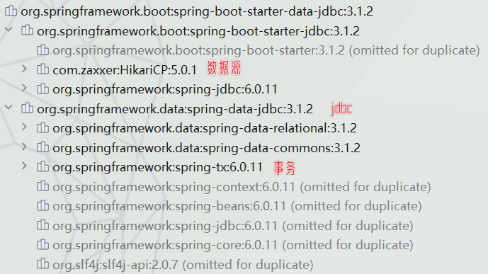
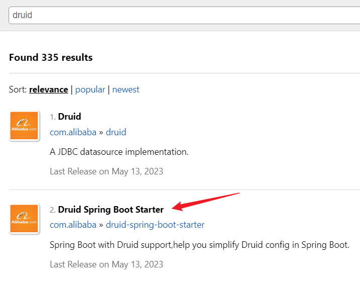
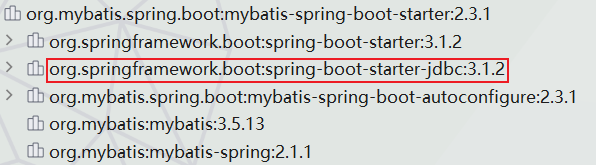
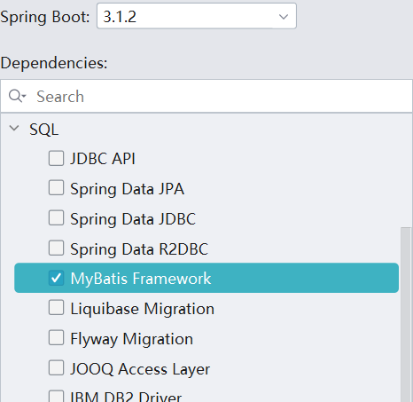
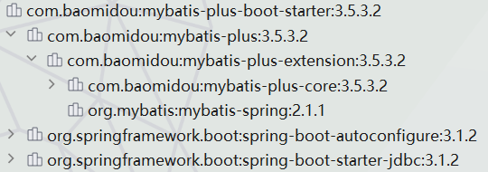
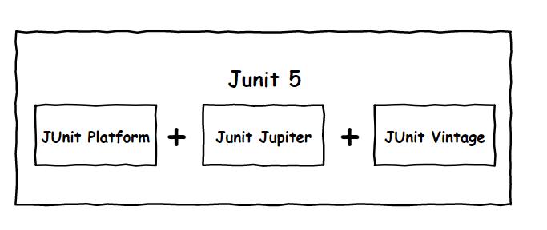
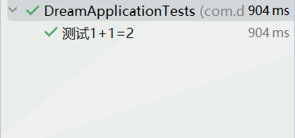

#### 1-默认配置

##### a-jdbc

1.   导入`jdbc`场景启动器依赖：

     ```xml
     <dependency>
         <groupId>org.springframework.boot</groupId>
         <artifactId>spring-boot-starter-data-jdbc</artifactId>
     </dependency>
     ```

2.   其中默认导入了这些：<br>

3.   导入MySQL驱动依赖：

     1.   注意依赖版本与数据库要匹配，例如5.x的数据库不能使用8.x的依赖：

          ```xml
          <dependency>
              <groupId>com.mysql</groupId>
              <artifactId>mysql-connector-j</artifactId>
          </dependency>
          ```

     2.   版本不匹配：

          1.   直接依赖引入具体版本(maven的就近依赖原则)：

               ```xml
               <dependency>
                   <groupId>com.mysql</groupId>
                   <artifactId>mysql-connector-j</artifactId>
                   <version>5.1.49</version>
               </dependency>
               ```

          2.   重新声明版本(maven的属性的就近优先原则):

               ```xml
               <properties>
                   <java.version>1.8</java.version>
                   <mysql.version>5.1.49</mysql.version> <!--声明版本-->
               </properties>
               
               <dependencies>
                   <dependency>
                       <groupId>com.mysql</groupId>
                       <artifactId>mysql-connector-j</artifactId>
                   </dependency>
               </dependencies>
               ```


##### b-默认配置

1.   `DataSourceAutoConfiguration`:数据源的自动配置

     1.   在这个自动配置类中，配置了数据源的基本配置：

          ```java
          @AutoConfiguration(before = SqlInitializationAutoConfiguration.class)
          @ConditionalOnClass({ DataSource.class, EmbeddedDatabaseType.class })
          @ConditionalOnMissingBean(type = "io.r2dbc.spi.ConnectionFactory")
          @EnableConfigurationProperties(DataSourceProperties.class)
          @Import(DataSourcePoolMetadataProvidersConfiguration.class)
          public class DataSourceAutoConfiguration {
          
          	@Configuration(proxyBeanMethods = false)
          	@Conditional(PooledDataSourceCondition.class)
          	@ConditionalOnMissingBean({ DataSource.class, XADataSource.class })
              //引入了数据源配置组件
          	@Import({ DataSourceConfiguration.Hikari.class, DataSourceConfiguration.Tomcat.class,
          			DataSourceConfiguration.Dbcp2.class, DataSourceConfiguration.OracleUcp.class,
          			DataSourceConfiguration.Generic.class, DataSourceJmxConfiguration.class })
          	protected static class PooledDataSourceConfiguration {
          
          		@Bean
          		@ConditionalOnMissingBean(JdbcConnectionDetails.class)
          		PropertiesJdbcConnectionDetails jdbcConnectionDetails(DataSourceProperties properties) {
          			return new PropertiesJdbcConnectionDetails(properties);
          		}
          
          	}
          }
          ```

     2.   其实通过上面可以看出：

          1.   据库连接池的配置，是自己容器中没有`DataSource`才自动配置的。

          2.   关于数据源的相关配置都是在`DataSourceProperties`属性类,其对应配置文件前缀`spring.datasource`:

               ```java
               @ConfigurationProperties(prefix = "spring.datasource")
               public class DataSourceProperties implements BeanClassLoaderAware, InitializingBean {
               
               	//声明一个私有变量classLoader，其类型是ClassLoader，用于加载类。
               	private ClassLoader classLoader;
               
               	//其默认值为true，表示是否生成一个随机的数据源名称。
               	private boolean generateUniqueName = true;
               
               	//"generate-unique-name"为false，将使用此数据源名称。使用嵌入式数据库时，默认为"testdb"，否则为null。
               	private String name;
               
               	//数据源的类型。默认情况下将从类路径自动检测连接池实现类的全限定名。
               	private Class<? extends DataSource> type;
               
               	//JDBC驱动程序的全限定名称。默认情况下，根据URL自动检测。
               	private String driverClassName;
               
               	//数据库的JDBC URL。
               	private String url;
               
               	//数据库的登陆用户名。
               	private String username;
               
               	//数据库的登陆密码。
               	private String password;
               
               	//表示数据源的JNDI位置。当设置此变量时，类、url、用户名和密码将被忽略。
               	private String jndiName;
               }
               ```

     3.   此外我们具体看一看配置了哪个数据库连接池：底层配置了大量数据库连接池，但是实际上生效的只有`HikariDataSource`。并且都是建立在不存在`DataSource`类组件的基础上。

          ```java
          abstract class DataSourceConfiguration {
          
              @SuppressWarnings("unchecked")
              private static <T> T createDataSource(
                  JdbcConnectionDetails connectionDetails, 
                  Class<? extends DataSource> type,
                  ClassLoader classLoader) {
                  return (T) DataSourceBuilder.create(classLoader)
                      .type(type)
                      .driverClassName(connectionDetails.getDriverClassName())
                      .url(connectionDetails.getJdbcUrl())
                      .username(connectionDetails.getUsername())
                      .password(connectionDetails.getPassword())
                      .build();
              }
          
              // Tomcat Pool DataSource configuration.
              @Configuration(proxyBeanMethods = false)
              @ConditionalOnClass(org.apache.tomcat.jdbc.pool.DataSource.class)
              @ConditionalOnMissingBean(DataSource.class)
              @ConditionalOnProperty(
                  name = "spring.datasource.type", 
                  havingValue = "org.apache.tomcat.jdbc.pool.DataSource",
                  matchIfMissing = true)
              static class Tomcat {
          
              }
          
              //Hikari DataSource configuration.
              @Configuration(proxyBeanMethods = false)
              @ConditionalOnClass(HikariDataSource.class)
              @ConditionalOnMissingBean(DataSource.class)
              @ConditionalOnProperty(
                  name = "spring.datasource.type", 
                  havingValue = "com.zaxxer.hikari.HikariDataSource",                   
                  matchIfMissing = true)
              static class Hikari {}
          
              // DBCP DataSource configuration.
              @Configuration(proxyBeanMethods = false)
              @ConditionalOnClass(org.apache.commons.dbcp2.BasicDataSource.class)
              @ConditionalOnMissingBean(DataSource.class)
              @ConditionalOnProperty(
                  name = "spring.datasource.type",
                  havingValue = "org.apache.commons.dbcp2.BasicDataSource",
                  matchIfMissing = true)
              static class Dbcp2 {
              }
          
              // Oracle UCP DataSource configuration.
              @Configuration(proxyBeanMethods = false)
              @ConditionalOnClass({ PoolDataSourceImpl.class, OracleConnection.class })
              @ConditionalOnMissingBean(DataSource.class)
              @ConditionalOnProperty(
                  name = "spring.datasource.type", 
                  havingValue = "oracle.ucp.jdbc.PoolDataSource",
                  matchIfMissing = true)
              static class OracleUcp {}
          
              // Generic DataSource configuration.
              @Configuration(proxyBeanMethods = false)
              @ConditionalOnMissingBean(DataSource.class)
              @ConditionalOnProperty(name = "spring.datasource.type")
              static class Generic {}
          }
          ```

2.   `DataSourceTransactionManagerAutoConfiguration`： 事务管理器的自动配置。

3.   `JdbcTemplateAutoConfiguration`： `JdbcTemplate`的自动配置，可以来对数据库进行`crud`。

     1.   可以看到，其属性类是`JdbcProperties`,其对应着配置文件的`spring.jdbc`前缀：

          ```java
          @AutoConfiguration(after = DataSourceAutoConfiguration.class)
          @ConditionalOnClass({ DataSource.class, JdbcTemplate.class })
          @ConditionalOnSingleCandidate(DataSource.class)
          @EnableConfigurationProperties(JdbcProperties.class)
          // 也是这里，导入JdbcTemplateConfiguration
          @Import({ DatabaseInitializationDependencyConfigurer.class, JdbcTemplateConfiguration.class,
                   NamedParameterJdbcTemplateConfiguration.class })
          public class JdbcTemplateAutoConfiguration {
          
          }
          ```

          ```java
          @ConfigurationProperties(prefix = "spring.jdbc")
          public class JdbcProperties {
              public static class Template {
          
                  //表示从数据库获取更多行时应获取的行数。使用-1表示使用JDBC驱动的默认配置。
                  private int fetchSize = -1;
          
                  // 表示最大行数。使用-1表示使用JDBC驱动的默认配置。
                  private int maxRows = -1;
              }
          }
          ```

     2.   此外，看`JdbcTemplateConfiguration`源码，我们知道它往容器中放置了一个`jdbcTemplate`。而这个组件恰好就是前面提到的spring进行`curd`的。以后我们要使用，可以使用依赖注入获取。

          ```java
          @Configuration(proxyBeanMethods = false)
          @ConditionalOnMissingBean(JdbcOperations.class)
          class JdbcTemplateConfiguration {
          
              @Bean
              @Primary
              JdbcTemplate jdbcTemplate(DataSource dataSource, JdbcProperties properties) {
                  JdbcTemplate jdbcTemplate = new JdbcTemplate(dataSource);
                  JdbcProperties.Template template = properties.getTemplate();
                  jdbcTemplate.setFetchSize(template.getFetchSize());
                  jdbcTemplate.setMaxRows(template.getMaxRows());
                  if (template.getQueryTimeout() != null) {
                      jdbcTemplate.setQueryTimeout((int) template.getQueryTimeout().getSeconds());
                  }
                  return jdbcTemplate;
              }
          
          }
          ```

4.   `JndiDataSourceAutoConfiguration`： `jndi`的自动配置。

5.   `XADataSourceAutoConfiguration`： 分布式事务相关的。

6.   最终举例：

     1.   配置数据源：

          ```yaml
          spring:
            datasource:
              url:jdbc:mysql://localhost:3306/fish
              username:root
              password:123456
              # 默认type
              type:com.zaxxer.hikari.HikariDataSource 
              driver-class-name:com.mysql.cj.jdbc.Driver
          ```

     2.   使用`jdbcTemplate`操作数据库：
     
          ```java
          @Service
          @Slf4j
          public class StudentService {
              private final JdbcTemplate jdbcTemplate;
          
              public HelloService(JdbcTemplate jdbcTemplate) { //构造器注入,不建议使用@Autowired
                  this.jdbcTemplate = jdbcTemplate;
              }
          
              public void getStudentSize() {
                  Long aLong = jdbcTemplate.queryForObject("select count(*) from stu", Long.class);
                  log.info("记录总数：{}", aLong);
              }
          }
          ```


---


#### 2-Druid数据源

>   配置整合第三方技术的两种方式：
>
>   1.   参照官方文档，自定义配置。
>   2.   找`starter`，即场景启动器。
>        1.   去官方找。
>        2.   去依赖网站找：https://mvnrepository.com/。<br>


##### a-手动配置

1.   参考官网：[druid](https://github.com/alibaba/druid)。

2.   导入`druid`依赖：

     ```xml
     <dependency>
         <groupId>org.springframework.boot</groupId>
         <artifactId>spring-boot-starter-data-jdbc</artifactId>
     </dependency>
     
     <dependency>
         <groupId>com.alibaba</groupId>
         <artifactId>druid</artifactId>
         <version>1.2.18</version>
     </dependency>
     ```

3.   配置数据源：这里其实就是参照官方文档，将`xml`配置注册改为`@Bean`注解注册，然后配置组件的属性。

     ```java
     @Configuration
     public class DataSourceConfig {
     
         @Bean
         public DataSource dataSource() {  //配置数据源
             DruidDataSource druidDataSource = new DruidDataSource();
             druidDataSource.setUrl("jdbc:mysql://localhost:3306/fish");
             druidDataSource.setUsername("root");
             druidDataSource.setPassword("123456");
             druidDataSource.setDriverClassName("com.mysql.cj.jdbc.Driver");
             return druidDataSource;
         }
     }
     ```

4.   但是其实配置的`DruidDataSource`与springboot的数据源配置一致，可以直接使用：

     ```java
     @Configuration
     public class DataSourceConfig {
     
         @Bean
         @ConfigurationProperties(prefix = "spring.datasource")  //配置数据源前缀
         public DataSource dataSource() throws SQLException {
             DruidDataSource druidDataSource = new DruidDataSource();
             return druidDataSource;
         }
     }
     ```

5.   配置`StatViewServlet`,其用途包括：提供监控信息展示的html页面、提供监控信息的JSON API：

     1.   官方文档演示：

          ```xml
          <!-- 配置 Druid 监控信息显示页面 -->  
          <servlet>  
              <servlet-name>DruidStatView</servlet-name>  
              <servlet-class>com.alibaba.druid.support.http.StatViewServlet</servlet-class>  
              <init-param>  
                  <!-- 允许清空统计数据 -->  
                  <param-name>resetEnable</param-name>  
                  <param-value>true</param-value>  
              </init-param>  
              <init-param>  
                  <!-- 用户名 -->  
                  <param-name>loginUsername</param-name>  
                  <param-value>druid</param-value>  
              </init-param>  
              <init-param>  
                  <!-- 密码 -->  
                  <param-name>loginPassword</param-name>  
                  <param-value>druid</param-value>  
              </init-param>  
          </servlet>  
          <servlet-mapping>  
              <servlet-name>DruidStatView</servlet-name>  
              <url-pattern>/druid/*</url-pattern>  
          </servlet-mapping>  
          ```

     2.   我们的配置：但是这里其实遇到了问题，是springboot3版本过高的问题，待后续解决。

          ```java
          @Configuration
          public class DataSourceConfig {
          
              @Bean
              public ServletRegistrationBean statViewServlet() {
                  StatViewServlet statViewServlet = new StatViewServlet();
                  ServletRegistrationBean<StatViewServlet> registrationBean = 
                      new ServletRegistrationBean(statViewServlet, "/druid/*");
          
                  // 添加初始化参数：druid监控页面的登录密码
                  registrationBean.addInitParameter("loginUsername", "admin");
                  registrationBean.addInitParameter("loginPassword", "123456"); 
                  registrationBean.addInitParameter("resetEnable", "false"); // 禁用HTML页面上的“Reset All”功能
                  return registrationBean;
              }
          ```

     3.   使用：访问项目的`/druid/index.html`即可。

6.   配置`StatFilter`：用于统计监控信息；如SQL监控、URI监控

     1.   官方文档演示：

          ```xml
          <bean id="stat-filter" class="com.alibaba.druid.filter.stat.StatFilter">
              <property name="slowSqlMillis" value="10000" />
              <property name="logSlowSql" value="true" />
          </bean>
          <bean id="dataSource" class="com.alibaba.druid.pool.DruidDataSource"
                init-method="init" destroy-method="close">
              ... ...
              <property name="filters" value="log4j" />
              <property name="proxyFilters">
                  <list>
                      <ref bean="stat-filter" />
                  </list>
              </property>
          </bean>
          ```

     2.   我们的配置：

          ```java
          @Configuration
          public class DataSourceConfig {
          
              @Bean 
              @ConfigurationProperties(prefix = "spring.datasource") 
              public DataSource dataSource() throws SQLException {  
                  DruidDataSource druidDataSource = new DruidDataSource();
          
                  druidDataSource.setFilters("stat,log4j"); //配置监控统计拦截的filters
                  return druidDataSource;
              }
          
          }
          ```

     3.   `druid`中所有`filter`：

          | 别名          | Filter类名                                              |
          | ------------- | ------------------------------------------------------- |
          | default       | com.alibaba.druid.filter.stat.StatFilter                |
          | stat          | com.alibaba.druid.filter.stat.StatFilter                |
          | mergeStat     | com.alibaba.druid.filter.stat.MergeStatFilter           |
          | encoding      | com.alibaba.druid.filter.encoding.EncodingConvertFilter |
          | log4j         | com.alibaba.druid.filter.logging.Log4jFilter            |
          | log4j2        | com.alibaba.druid.filter.logging.Log4j2Filter           |
          | slf4j         | com.alibaba.druid.filter.logging.Slf4jLogFilter         |
          | commonlogging | com.alibaba.druid.filter.logging.CommonsLogFilter       |


6.   配置防火墙：防止`sql`注入

     1.   官方示例：

          ```xml
          <bean id="dataSource" class="com.alibaba.druid.pool.DruidDataSource" init-method="init" destroy-method="close">
              ...
              <property name="filters" value="wall"/>
          </bean>
          ```

     2.   我们配置：

          ```java
          @Configuration
          public class DataSourceConfig {
          
              @Bean 
              @ConfigurationProperties(prefix = "spring.datasource") 
              public DataSource dataSource() throws SQLException {  
                  DruidDataSource druidDataSource = new DruidDataSource();
          
                  druidDataSource.setFilters("wall"); //配置防火墙,防止sql注入
                  return druidDataSource;
              }
          
          }
          ```

          


##### b-使用场景启动器

1.   导入场景启动器依赖：

     ```xml
     <dependency>
         <groupId>com.alibaba</groupId>
         <artifactId>druid-spring-boot-starter</artifactId>
         <version>1.2.18</version>
     </dependency>
     
     <dependency>
         <groupId>org.springframework.boot</groupId>
         <artifactId>spring-boot-starter-data-jdbc</artifactId>
     </dependency>
     ```

2.   我们看一下其`DruidDataSourceAutoConfigure`自动配置类：

     1.   `DruidDataSourceAutoConfigure`配置数据源，可以看到该自动配置通过`@AutoConfigureBefore`注解使其在springboot自动配置之前。

          ```java
          @Configuration
          @ConditionalOnClass(DruidDataSource.class)
          @AutoConfigureBefore(DataSourceAutoConfiguration.class) // 在springboot自动配置之前
          @EnableConfigurationProperties({DruidStatProperties.class, DataSourceProperties.class})
          @Import({DruidSpringAopConfiguration.class,
                   DruidStatViewServletConfiguration.class,
                   DruidWebStatFilterConfiguration.class,
                   DruidFilterConfiguration.class})
          public class DruidDataSourceAutoConfigure {
              private static final Logger LOGGER = LoggerFactory.getLogger(DruidDataSourceAutoConfigure.class);
          
              @Bean(initMethod = "init")
              @ConditionalOnMissingBean
              public DataSource dataSource() {
                  LOGGER.info("Init DruidDataSource");
                  return new DruidDataSourceWrapper();
              }
          }
          ```

     2.   相关属性类：`DataSourceProperties`、`DruidStatProperties`分别对应配置文件前缀：`spring.datasource`、`spring.datasource.druid`。而这二者分别用于配置数据源、监控信息。

          ```java
          @ConfigurationProperties(prefix = "spring.datasource")
          public class DataSourceProperties implements BeanClassLoaderAware, InitializingBean {
          
              // 定义类加载器类型的私有变量
              private ClassLoader classLoader;
          
              //表示是否生成一个随机的数据源名称，默认为true
              private boolean generateUniqueName = true;
          
              private String name;
          
              //配置数据库连接池的全路径名称，在默认情况下，它会从classpath中自动检测连接池的实现类
              private Class<? extends DataSource> type;
          
              // 配置的是JDBC驱动的全路径名称，默认情况下，它会根据数据库URL自动检测驱动类名
              private String driverClassName;
          
              // 配置的是数据库的JDBC URL
              private String url;
          
              //配置的是登录数据库的用户名
              private String username;
          
              //配置的是登录数据库的密码
              private String password;
          
              //配置的是数据源的JNDI位置。
              private String jndiName;
          }
          ```

          ```java
          @ConfigurationProperties("spring.datasource.druid")
          public class DruidStatProperties {
              public static class StatViewServlet {
                  /**
                   * Enable StatViewServlet, default false.
                   */
                  private boolean enabled;
                  private String urlPattern;
                  private String allow;
                  private String deny;
                  private String loginUsername;
                  private String loginPassword;
                  private String resetEnable;
              }
              public static class WebStatFilter {
                  /**
                   * Enable WebStatFilter, default false.
                   */
                  private boolean enabled;
                  private String urlPattern;
                  private String exclusions;
                  private String sessionStatMaxCount;
                  private String sessionStatEnable;
                  private String principalSessionName;
                  private String principalCookieName;
                  private String profileEnable;
              }
          }
          ```

3.   `DruidSpringAopConfiguration`配置类,   监控SpringBean的，配置文件前缀`spring.datasource.druid.aop-patterns`。

4.   `DruidStatViewServletConfiguration`自动配置类, 监控页的配置：`spring.datasource.druid.stat-view-servlet`默认开启。

5.    `DruidWebStatFilterConfiguration`配置类, web监控配置,：`spring.datasource.druid.web-stat-filter`默认开启。

6.   `DruidFilterConfiguration`配置类,所有`Druid`自己`filter`的配置。

     ```java
     private static final String FILTER_STAT_PREFIX = "spring.datasource.druid.filter.stat";
     private static final String FILTER_CONFIG_PREFIX = "spring.datasource.druid.filter.config";
     private static final String FILTER_ENCODING_PREFIX = "spring.datasource.druid.filter.encoding";
     private static final String FILTER_SLF4J_PREFIX = "spring.datasource.druid.filter.slf4j";
     private static final String FILTER_LOG4J_PREFIX = "spring.datasource.druid.filter.log4j";
     private static final String FILTER_LOG4J2_PREFIX = "spring.datasource.druid.filter.log4j2";
     private static final String FILTER_COMMONS_LOG_PREFIX = "spring.datasource.druid.filter.commons-log";
     private static final String FILTER_WALL_PREFIX = "spring.datasource.druid.filter.wall";
     private static final String FILTER_WALL_CONFIG_PREFIX = FILTER_WALL_PREFIX + ".config";
     ```

7.   最终配置文件演示：

     ```yaml
     spring:
       datasource:
         url: jdbc:mysql://localhost:3306/db_account
         username: root
         password: 123456
         driver-class-name: com.mysql.jdbc.Driver
     
         druid:
           aop-patterns: com.atguigu.admin.*  #监控SpringBean
           filters: stat,wall     # 底层开启功能，stat（sql监控），wall（防火墙）
     
           stat-view-servlet:   # 配置监控页功能
             enabled: true
             login-username: admin
             login-password: yx198973
             resetEnable: false
     
           web-stat-filter:  # 监控web
             enabled: true
             urlPattern: /*
             exclusions: '*.js,*.gif,*.jpg,*.png,*.css,*.ico,/druid/*'
     
     
           filter:
             stat:    # 对上面filters里面的stat的详细配置
               slow-sql-millis: 1000
               logSlowSql: true
               enabled: true
             wall:
               enabled: true
               config:
                 drop-table-allow: false
     
     ```

---


#### 3-mybatis

##### a-场景启动器

1.   官网：https://github.com/mybatis。

2.   导入场景启动器依赖，其中内置`jdbc`场景启动器依赖(无需导入)：注意为第三方依赖，且springboot没设置默认版本。

     ```xml
     <dependency>
         <groupId>org.mybatis.spring.boot</groupId>
         <artifactId>mybatis-spring-boot-starter</artifactId>
         <version>2.3.1</version>
     </dependency>
     ```

     <br>

3.   此外，还可以在创建项目时配置：<br>

4.   此外提一个插件`MyBatisX`:<br>


##### b-配置模式

1.   首先就是看自动配置类`MybatisAutoConfiguration`源码：

     ```java
     @Configuration
     @ConditionalOnClass({SqlSessionFactory.class, SqlSessionFactoryBean.class})
     @ConditionalOnSingleCandidate(DataSource.class)
     @EnableConfigurationProperties({MybatisProperties.class})
     @AutoConfigureAfter({DataSourceAutoConfiguration.class, MybatisLanguageDriverAutoConfiguration.class})
     public class MybatisAutoConfiguration implements InitializingBean {
     }
     ```

2.   可以知道其属性类为`MybatisProperties`,并且与配置文件`mybatis`前缀绑定:

     ```java
     @ConfigurationProperties(prefix = MybatisProperties.MYBATIS_PREFIX)
     public class MybatisProperties {
         //公开的常量，定义Mybatis 的前缀
         public static final String MYBATIS_PREFIX = "mybatis";
     
         //配置文件的位置
         private String configLocation;
         // Xxxmapper.xml文件的位置
         private String[] mapperLocations;
     
         //类型别名的包名。
         private String typeAliasesPackage;
     
         //类型别名
         private Class<?> typeAliasesSuperType;
     
         // 类型处理器的包名
         private String typeHandlersPackage;
     
         //是否检查配置文件的位置
         private boolean checkConfigLocation = false;
     
         //执行器类型
         private ExecutorType executorType;
     
         //默认的脚本语言驱动
         private Class<? extends LanguageDriver> defaultScriptingLanguageDriver;
     
         // Java 属性对象，包含一系列的属性设置，用于 Mybatis 的配置
         private Properties configurationProperties;
     
         // Configuration类本身是Mybatis的一个设置类，内部有许多配置信息
         @NestedConfigurationProperty
         private Configuration configuration;
     }
     ```

3.   此外`Configuration`类中也有许多配置：

     ```java
     public class Configuration {
         protected Environment environment;
         protected boolean safeRowBoundsEnabled;
         protected boolean safeResultHandlerEnabled;
         protected boolean mapUnderscoreToCamelCase;
         //...
     }
     ```

4.   此外自动配置类`MybatisAutoConfiguration`还配置了一些东西：

     1.   `SqlSessionFactory`:自动配置了 `SqlSessionTemplate `组合了`SqlSession`。
     2.   `AutoConfiguredMapperScannerRegistrar`：只要我们写的操作MyBatis的接口标注`@Mapper `就会被自动扫描进来。

5.   配置文件模式演示：

     1.   配置配置文件：

          ```yaml
          mybatis:
            config-location: classpath:mybatis/mybatis-config.xml  #全局配置文件位置
            mapper-locations: classpath:mybatis/mapper/*.xml  #sql映射文件位置
          ```

     2.   配置mybatis配置文件：

          ```xml
          <!--classpath:mybatis/mybatis-config.xml-->
          <?xml version="1.0" encoding="UTF-8" ?>
          <!DOCTYPE configuration
            PUBLIC "-//mybatis.org//DTD Config 3.0//EN"
            "http://mybatis.org/dtd/mybatis-3-config.dtd">
          <configuration>
          </configuration>
          ```

     3.   编写接口,注意需要使用`@Mapper`注解标注

          ```java
          @Mapper
          public interface UserMapper{
              public Account getUser(Long id);
          }
          ```

     4.   配置mybatis映射文件：

          ```xml
          <!--classpath:mybatis/mapper/UserMapper.xml-->
          <?xml version="1.0" encoding="UTF-8" ?>
          <!DOCTYPE mapper
                  PUBLIC "-//mybatis.org//DTD Mapper 3.0//EN"
                  "http://mybatis.org/dtd/mybatis-3-mapper.dtd">
          <mapper namespace="com.dreamfish.dream.mapper.UserMapper">
              <!--    public User getUser(Long id); -->
              <select id="getUser" resultType="com.dreamfish.dream.bean.Account">
                  select * from  user where  id=#{id}
              </select>
          </mapper>
          ```

6.   此外提一点，可以使用`@MapperScan("xxx") `指定扫描给定包下的所有接口，该包下的`Mapper`接口类就可以不用标注`@Mapper`注解:

     ```java
     @SpringBootApplication
     @MapperScan("com.dreamfish.dream.mapper")
     public class DreamApplication {
     
         public static void main(String[] args) {
             SpringApplication.run(DreamApplication.class, args);
         }
     }
     ```

     


##### c-混合模式

1.   除了使用配置文件配置外，有时候全注解很难执行复杂数据库操作。此时可以使用混合模式。

2. 但是注意，`mybatis.config-location`与`mybatis.configuration`不能同时存在：

   ```yaml
   # 配置mybatis规则
   mybatis:
   #  config-location: classpath:mybatis/mybatis-config.xml
     mapper-locations: classpath:mybatis/mapper/*.xml
     configuration:
       map-underscore-to-camel-case: true
     type-aliases-package: com.dream.fish.book_manager.entity
       
    # 可以不写全局；配置文件，所有全局配置文件的配置都放在configuration配置项中即可
   ```

3.   具体配置参考前面提到的`configuration`类：

     ```java
     public class Configuration {
         // 表示MyBatis的运行环境，通常用于区分开发、测试和生产等环境
         protected Environment environment;  
     
         // 是否开启安全的分页查询，默认是关闭的。
         protected boolean safeRowBoundsEnabled;
     
         // 是否开启安全模式，默认是关闭的。如果开启，MyBatis 会对执行的 SQL 进行更为严格的检查。
         protected boolean safeResultHandlerEnabled;
     
         // 是否将数据库列名下划线样式改为 Java 实体类驼峰式命名，默认关闭，即数据库哪样，Java实体哪样。
         protected boolean mapUnderscoreToCamelCase;
     
         // 是否开启激进的延迟加载，默认是关闭的。如果开启，则所有关联都设置为延迟加载
         protected boolean aggressiveLazyLoading;
     
         // 是否允许多结果集返回，默认是关闭的。如果开启，则可以在单次数据库调用时返回多个结果集
         protected boolean multipleResultSetsEnabled;
     
         // ...
     }
     ```

     


##### d-注解模式

1. 使用`mybatis.configuration`配置：

   ```yaml
   mybatis:
     configuration:
       map-underscore-to-camel-case: true
     type-aliases-package: com.dream.fish.book_manager.entity
       # ...
   ```

2.   使用`@Mapper`或者`@MapperScan`指定接口。

3.   使用mybatis注解实现操作数据库(下面代码由ai生成，未验证):

     1.   `@Select`：注解标签用于读操作，可以理解为select语句。

          ```java
          @Select("SELECT * FROM Users WHERE id = #{id}")
          User findById(int id);
          ```

     2.   `@Insert`：注解标签用于插入操作，可以理解为insert语句。

          ```java
          @Insert("INSERT INTO Users(name, age) values(#{name}, #{age})")
          void insertUser(User user);
          ```

     3.   `@Update`：注解标签用于修改操作，可以理解为update语句。

          ```java
          @Update("UPDATE Users SET name=#{name} WHERE id =#{id}")
          void updateUser(User user);
          ```

     4.   `@Delete`：注解标签用于删除操作，可以理解为delete语句。

          ```java
          @Delete("DELETE FROM Users WHERE id =#{id}")
          void deleteUser(int id);
          ```

     5.   `@Results` 和 `@Result`：这两个注解标签在结果集映射中使用，`@Results`用于更高级的结果集映射`，@Result`用在`@Results`中配置映射关系。

          ```java
          @Results(id = "userResultMap", value ={
              @Result(property = "id", column = "ID", id = true),
              @Result(property = "name", column = "NAME")
          })
          @Select("SELECT * FROM Users WHERE id = #{id}")
          User findById(int id);
          ```

     6.   `@Param`：用于传入多个参数，并且指定参数名称，用于在SQL语句中引用。

          ```java
          @Select("SELECT * FROM Users WHERE id = #{id} AND name = #{name}")
          User findByIdAndName(@Param("id") int id, @Param("name") String name);
          ```

     7.   `@Options`：插入新行后，`@Options `可用于获取自动生成的键（如数据库自动递增列）。它常用于插入，并获取在插入过程中由数据库自动生成的主键。

          ```java
          @Insert("INSERT INTO Users(name, age) VALUES(#{name}, #{age})")
          @Options(useGeneratedKeys=true, keyProperty="id")
          void insertUser(User user);
          ```

     8.   `@Mapper`：表示一个 MyBatis 的 mapper 接口。

          ```java
          @Mapper
          public interface UserMapper {
              @Select("SELECT * FROM Users")
              List<User> getAllUsers();
          }
          ```

     9.   `@ResultMap`：用于引用XML定义的映射关系。

          ```java
          @Select("SELECT * FROM users WHERE id = #{id}")
          @ResultMap("com.example.mapper.UserMapper.UserResultMap")
          User getUser(int id);
          ```

     10.   `@InsertProvider`、`@UpdateProvider`、`@DeleteProvider`和`@SelectProvider`：这些注解用于动态SQL，它们会调用一个方法构造出最终要执行的SQL。

           ```java
           @InsertProvider(type = SqlProvider.class, method = "insertUser")
           int insertUser(User user);
           
           public class SqlProvider {
               public String insertUser(User user) {
                   return new SQL()
                       .INSERT_INTO("users")
                       .VALUES("name", "#{name}")
                       .VALUES("email", "#{email}")
                       .toString();
               }
           }
           ```

     11.   `@One `和 `@Many`：处理一对一和一对多的关联映射。

           ```java
           public class Order {
               private int id;
               private Date date;
               private List<OrderItem> items;
               // getters and setters...
           }
           
           public class OrderItem {
               private int id;
               private Product product;
               // getters and setters...
           }
           
           public class Product {
               private int id;
               private String name;
               // getters and setters...
           }
           
           @Results({
               @Result(property="id", column="id"),
               @Result(property="date", column="date"),
               @Result(property="items", 
                       javaType=List.class,
                       column="id", 
                       many=@Many(select="getOrderItemsByOrderId"))
           })
           @Select("SELECT * FROM orders WHERE user_id = #{userId}")
           List<Order> getOrdersByUserId(@Param("userId") int userId);
           
           @Results({
               @Result(property="id", column="id"),
               @Result(property="product", 
                       javaType=Product.class, 
                       column="product_id", 
                       one=@One(select="getProductById"))
           })
           @Select("SELECT * FROM order_items WHERE order_id = #{orderId}")
           List<OrderItem> getOrderItemsByOrderId(@Param("orderId") int orderId);
           
           @Results({
               @Result(property="id", column="id"),
               @Result(property="name", column="name")
           })
           @Select("SELECT * FROM products WHERE id = #{productId}")
           Product getProductById(@Param("productId") int productId);
           ```

     12.   `@ConstructorArgs`和`@Arg`：这两个注解用于处理结果集，与`@Results`和`@Result`的功能相同，但用于处理使用构造函数创建的不可变Java类。

           ```java
           @ConstructorArgs({
               @Arg(column = "id", javaType = Integer.class),
               @Arg(column = "name", javaType = String.class),
               @Arg(column = "email", javaType = String.class)
           })
           @Select("SELECT * FROM users WHERE id = #{id}")
           User getUser(int id);
           ```

     13.   其他...。

4.   演示：

     ```java
     @Mapper
     public interface UserMapper{
     
         @Options(useGeneratedKeys = true, keyProperty = "id") // 自增key，主键为id
         @Insert("insert into t_user values(#{id},#{username},#{password})")
         Integer insertUser(User user);
     }
     ```

---


#### 4-mybatis-plus

##### a-场景启动器

1.   官网:[MyBatis-Plus ](https://baomidou.com/)。
2.   安装一个插件`MyBatisX`:<br>

2.   引入场景启动器依赖：

     ```xml
     <dependency>
         <groupId>com.baomidou</groupId>
         <artifactId>mybatis-plus-boot-starter</artifactId>
         <version>3.5.3.2</version>
     </dependency>
     ```

     <br>

3.   自动配置：

     1.   `MybatisPlusAutoConfiguration `配置类，`MybatisPlusProperties `配置项绑定。而`MybatisPlusProperties`对应的

          ```java
          @Configuration(proxyBeanMethods = false)
          @ConditionalOnClass({SqlSessionFactory.class, SqlSessionFactoryBean.class})
          @ConditionalOnSingleCandidate(DataSource.class)
          @EnableConfigurationProperties({MybatisPlusProperties.class})
          @AutoConfigureAfter({DataSourceAutoConfiguration.class, MybatisPlusLanguageDriverAutoConfiguration.class})
          public class MybatisPlusAutoConfiguration implements InitializingBean {}
          ```

          ```java
          @ConfigurationProperties(prefix = "mybatis-plus")
          public class MybatisPlusProperties {
              private String configLocation;
              private String[] mapperLocations = new String[]{"classpath*:/mapper/**/*.xml"};
              private String typeAliasesPackage;
              private Class<?> typeAliasesSuperType;
              private String typeHandlersPackage;
              private boolean checkConfigLocation = false;
              private ExecutorType executorType;
              private Class<? extends LanguageDriver> defaultScriptingLanguageDriver;
              private Properties configurationProperties;
              @NestedConfigurationProperty
              private MybatisConfiguration configuration;
          }
          ```

          

     2.   `SqlSessionFactory `自动配置好，底层是容器中默认的数据源。

     3.   `mapperLocations` 自动配置好的。有默认值。`classpath*:/mapper/**/*.xml`即任意包的类路径下的所有`mapper`文件夹下任意路径下的所有`xml`都是`sql`映射文件。  建议以后`sql`映射文件，放在 `mapper`下。

     4.   容器中也自动配置好了 `SqlSessionTemplate`。

     5.   `@Mapper` 标注的接口会被自动扫描，但是建议直接` @MapperScan("xxx") `批量扫描就行。


##### b-使用

1.   参考官网使用。

2.   配置实体类与数据库的映射：

     ```java
     @Data
     @NoArgsConstructor
     @TableName("user")  //设置与实体类对应的表(如果不设置,默认表名为类名)
     public class User {
     
         @TableField(exist = false)  // 表示该属性不为数据库表字段
         private String password;
     
         @TableField(exist = false)  // 表示该属性不为数据库表字段
         private String account;
     
         @TableId(value = "id") // 标明主键
         private int id;
     
         @TableId(value = "name") 
         private String name;
     
         @TableId(value = "age")
         private int age;
     }
     ```

3.   配置Mapper，`mybatis-plus`提供一个`BaseMapper`接口，我们可以直接继承这个接口就可以实现基本的增删改查：

     ```java
     public interface UserMapper extends BaseMapper<User> {}
     ```

4.   此外`Service`、`ServiceImpl`也是一样的，继承`mybatis-plus`提供的接口：

     ```java
     public interface UserService extends IService<User> {}
     ```

     ```java
     @Service //ServiceImpl<mapper接口类,实体类>
     public class UserServiceImpl extends ServiceImpl<UserMapper,User> implements UserService {}
     ```

5.   使用`@MapperScan`注解配置扫描`mapper`接口：

     ```java
     @SpringBootApplication
     @MapperScan("com.dreamfish.dream.mapper")
     public class DreamApplication {
     
         public static void main(String[] args) {
             SpringApplication.run(DreamApplication.class, args);
         }
     }
     ```

6.   后面就可以使用`mybatis-plus`提供的方法进行大多数数据库操作。


##### c-分页

1.   参照官网，需要先配置插件：

     ```java
     @Configuration
     @MapperScan("scan.your.mapper.package")
     public class MybatisPlusConfig {
     
     
         @Bean
         public MybatisPlusInterceptor mybatisPlusInterceptor() {
             MybatisPlusInterceptor interceptor = new MybatisPlusInterceptor();
             interceptor.addInnerInterceptor(new PaginationInnerInterceptor(DbType.H2));
             return interceptor;
         }
     
         //新的分页插件,一缓和二缓遵循mybatis的规则,需要设置 MybatisConfiguration#useDeprecatedExecutor = false 
         // 避免缓存出现问题(该属性会在旧插件移除后一同移除)
         @Bean
         public ConfigurationCustomizer configurationCustomizer() {
             return configuration -> configuration.setUseDeprecatedExecutor(false);
         }
     }
     ```

2.   分页插件还可以设置一些属性配置：

     |  属性名  |   类型   | 默认值 |                             描述                             |
     | :------: | :------: | :----: | :----------------------------------------------------------: |
     | overflow | boolean  | false  | 溢出总页数后是否进行处理(默认不处理,参见 `插件#continuePage` 方法) |
     | maxLimit |   Long   |        |  单页分页条数限制(默认无限制,参见 `插件#handlerLimit` 方法)  |
     |  dbType  |  DbType  |        | 数据库类型(根据类型获取应使用的分页方言,参见 `插件#findIDialect` 方法) |
     | dialect  | IDialect |        |          方言实现类(参见 `插件#findIDialect` 方法)           |

3.   `mybatis-plus`默认的操作数据库方法中就有分页的方法`page()`：

     ```java
     @GetMapping("/user")
     public String dynamic_table(@RequestParam(value="pn",defaultValue = "1") Integer pn,Model model){
     
         //构造分页参数                (页码,每页数据数)
         Page<User> page = new Page<>(pn, 2);
     
         //调用page进行分页
         Page<User> userPage = userService.page(page, null);
     
         model.addAttribute("users",userPage);
     
         return "user";
     }
     ```

4.   最后就是在页面中构造分页，完整代码略：

     ```html
     <ul>
         <li> 上一页</li>
         <li th:each="num:${#numbers.sequence(1.users.pages)}">
             <a th:href="xxx">[[xx]]</a>
         </li>
         <li> 下一页</li>
     </ul>
     ```

---


#### 5-No sql

#####  a-场景启动器

1.   官网：[Redis](https://redis.io/)、[Redis中文网](https://www.redis.net.cn/)。

2.   引入启动器依赖：

     ```xml
     <dependency>
         <groupId>org.springframework.boot</groupId>
         <artifactId>spring-boot-starter-data-redis</artifactId>
     </dependency>
     ```

3.   `RedisAutoConfiguration `自动配置类,对应`RedisProperties `属性类：对应配置文件前缀`spring.data.redis`：

     ```java
     @AutoConfiguration
     @ConditionalOnClass(RedisOperations.class)
     @EnableConfigurationProperties(RedisProperties.class)
     @Import({ LettuceConnectionConfiguration.class, JedisConnectionConfiguration.class })
     public class RedisAutoConfiguration {}
     ```

     ```java
     @ConfigurationProperties(prefix = "spring.data.redis")
     public class RedisProperties {}
     ```

4.   连接工厂是准备好的:`LettuceConnectionConfiguration`、`JedisConnectionConfiguration`

5.   自动注入了`RedisTemplate<Object, Object> `。

6.   自动注入了`StringRedisTemplate`：`key`、`value`都是`String`。

7.   底层只要我们使用 `StringRedisTemplate`、`RedisTemplate`就可以操作`redis`。


##### b-使用jedis客户端

1.   导入依赖，排除原本的`lettuce`依赖：

     ```xml
     <dependency>
         <groupId>org.springframework.boot</groupId>
         <artifactId>spring-boot-starter-data-redis</artifactId>
         <exclusions>
             <exclusion>
                 <groupId>io.lettuce</groupId>
                 <artifactId>lettuce-core</artifactId>
             </exclusion>
         </exclusions>
     </dependency>
     
     <!--导入jedis-->
     <dependency>
         <groupId>redis.clients</groupId>
         <artifactId>jedis</artifactId>
     </dependency>
     ```

2.   配置文件使用`client-type`指明使用`jedis`:

     ```properties
     spring:
       redis:
           host: r-bp1nc7reqesxisgxpipd.redis.rds.aliyuncs.com
           port: 6379
           password: dream:yx198973
           client-type: jedis
           jedis:
             pool:
               max-active: 10
     ```

---


#### 6-junit5

##### a-简介

1.   作为最新版本的JUnit框架，JUnit5与之前版本的Junit框架有很大的不同。由三个不同子项目的几个不同模块组成。即`JUnit 5 = JUnit Platform + JUnit Jupiter + JUnit Vintage`

     1.   JUnit Platform: Junit Platform是在JVM上启动测试框架的基础，不仅支持Junit自制的测试引擎，其他测试引擎也都可以接入。
     2.   JUnit Jupiter: JUnit Jupiter提供了JUnit5的新的编程模型，是JUnit5新特性的核心。内部 包含了一个测试引擎，用于在Junit Platform上运行。
     3.   JUnit Vintage: 由于JUint已经发展多年，为了照顾老的项目，JUnit Vintage提供了兼容JUnit4.x,Junit3.x的测试引擎。<br>

2.   SpringBoot 2.4 以上版本移除了默认对 `Vintage `的依赖(无法使用junit4的功能 `@Test`)。如果需要兼容junit4需要自行引入:

     ```xml
     <dependency>
         <groupId>org.junit.vintage</groupId>
         <artifactId>junit-vintage-engine</artifactId>
         <scope>test</scope>
         <exclusions>
             <exclusion>
                 <groupId>org.hamcrest</groupId>
                 <artifactId>hamcrest-core</artifactId>
             </exclusion>
         </exclusions>
     </dependency>
     <!-- @SpringBootTest + @RunWith(SpringTest.class) -->
     ```

3.   使用`junit5`:

     1.   导入依赖：

          ```xml
          <dependency>
              <groupId>org.springframework.boot</groupId>
              <artifactId>spring-boot-starter-test</artifactId>
              <scope>test</scope>
          </dependency>
          ```

     2.   使用`@SpringBootTest`、`@Test`(junit5)注解：

          ```java
          @SpringBootTest
          class Boot05WebAdminApplicationTests {
              @Test
              void contextLoads() {}
          }
          ```

     3.   Junit5测试类具有Spring的功能，l例如：`@Autowired`、` @Transactional `标注测试方法测试完成后自动回滚。


##### b-常用注解

1.   具体参考官网：[junit5](https://junit.org/junit5/docs/current/user-guide/#writing-tests-annotations)。

2.   常用注解：

     1.   `@Test` :表示方法是测试方法。但是与JUnit4的`@Test`不同，他的职责非常单一不能声明任何属性，拓展的测试将会由Jupiter提供额外测试。
     2.   `@ParameterizedTest `:表示方法是参数化测试，下方会有详细介绍。
     3.   `@RepeatedTest` :表示方法可重复执行，下方会有详细介绍。
     4.   `@DisplayName` :为测试类或者测试方法设置展示名称。
     5.   `@BeforeEach` :表示在每个单元测试之前执行。
     6.   `@AfterEach `:表示在每个单元测试之后执行。
     7.   `@BeforeAll` :表示在所有单元测试之前执行，似乎需要为静态方法。
     8.   `@AfterAll `:表示在所有单元测试之后执行，似乎需要为静态方法。
     9.   `@Tag `:表示单元测试类别，类似于JUnit4中的`@Categories`。
     10.   `@Disabled `:表示测试类或测试方法不执行，类似于JUnit4中的`@Ignore`。
     11.   `@Timeout` :表示测试方法运行如果超过了指定时间将会返回错误。
     12.   `@ExtendWith` :为测试类或测试方法提供扩展类引用。

3.   下面具体演示说明一下：

     1.   `@DisplayName`:

          ```java
          @SpringBootTest
          class DreamApplicationTests {
          
              @Test
              @DisplayName("测试1+1=2")
              void test() {
                  if (1 + 1 == 2) System.out.println("测试成功");
                  else System.out.println("测试失败");
              }
          }
          ```

          <br>

     2.   `@ExtendWith` :其实`SpringBootTest`注解就包含`@ExtendWith`注解:

          ```java
          @Target({ElementType.TYPE})
          @Retention(RetentionPolicy.RUNTIME)
          @Documented
          @Inherited
          @BootstrapWith(SpringBootTestContextBootstrapper.class)
          @ExtendWith({SpringExtension.class})
          public @interface SpringBootTest {}
          ```


##### c-断言

1.   常用断言方法如下：

     | 方法              | 说明                                 |
     | ----------------- | ------------------------------------ |
     | assertEquals      | 判断两个对象或两个原始类型是否相等   |
     | assertNotEquals   | 判断两个对象或两个原始类型是否不相等 |
     | assertSame        | 判断两个对象引用是否指向同一个对象   |
     | assertNotSame     | 判断两个对象引用是否指向不同的对象   |
     | assertTrue        | 判断给定的布尔值是否为 true          |
     | assertFalse       | 判断给定的布尔值是否为 false         |
     | assertNull        | 判断给定的对象引用是否为 null        |
     | assertNotNull     | 判断给定的对象引用是否不为 null      |
     | assertArrayEquals | 数组断言                             |
     | assertAll         | 组合断言                             |
     | assertThrows      | 异常断言                             |
     | assertTimeout     | 超时断言                             |
     | fail              | 快速失败                             |

2.   举例说明：

     ```java
     @Test
     @DisplayName("异常测试")
     public void exceptionTest() {
         ArithmeticException exception = Assertions.assertThrows(
             //扔出断言异常
             ArithmeticException.class, () -> System.out.println(1 % 0));
     }
     ```

     ```java
     @Test
     @DisplayName("fail")
     public void shouldFail() {
      fail("This should fail");
     }
     ```

     ```java
     @Test
     @DisplayName("simple assertion")
     public void simple() {
         int hope = 1 + 2
             assertEquals(4, hope, "1+2不等于4");
     }
     ```

3.   断言一旦失败，该断言后面的代码将都不会执行。有些断言后面还可以接一个`msg`字符串参数，指明断言验证失败显示的信息。

4.   这些断言方法都是 `org.junit.jupiter.api.Assertions` 的静态方法，所有的测试运行结束以后，会有一个详细的测试报告。


##### d-前置条件(assumptions)

1.    `assumingThat (boolean assumption, Executable executable)`的参数是表示条件的布尔值和对应的 Executable 接口的实现对象。只有条件满足时，`Executable `对象才会被执行；当条件不满足时，测试执行并不会终止(与断言方法的主要区别)。            

2.   举例说明如下：

     ```java
     import static org.junit.jupiter.api.Assumptions.assumingThat;
     
     public class AssumptionsExampleTest {
     
         @Test
         void assumingThatTest() {
             String environment = System.getenv("ENV");
     
             assumingThat("DEV".equals(environment),
                          () -> {
                              // 此段代码仅在"DEV"环境下执行
                              System.out.println("Running test under DEV environment");
                          });
     
             // 无论环境如何，这段代码总会被执行
             System.out.println("This test always runs");
         }
     }
     ```


##### e-嵌套测试

1.   JUnit 5可以通过Java中的内部类和`@Nested` 注解实现嵌套测试，从而可以更好的把相关的测试方法组织在一起。在内部类中可以使用`@BeforeEach` 和`@AfterEach` 注解，而且嵌套的层次没有限制。

2.   但是注意：

     1.   外部类的`@BeforeEach`等方法对内部类起作用。
     2.   内部类的`@BeforeEach`等方法对内部类无效。

3.   演示如下：

     ```java
     public class NestedTest1 {
     
         @Test
         @BeforeEach  //外部类的@BeforeEach等方法对内部类起作用
         public void test() {
             System.out.println("the outer before each");
         }
     
         @Test
         public void test2() {
             System.out.println("the outer test ");
             /*
             the outer before each
             the outer test
              */
         }
     
         @Nested
         public class NestedTest2 {
     
             @Test
             @BeforeEach
             public void test() { //内部类的@BeforeEach等方法对内部类无效
                 System.out.println("the inner before each");
             }
     
             @Test
             public void test2() {
                 System.out.println("the inner test ");
                 /*
                 the outer before each
                 the inner before each
                 the inner test
                  */
             }
     
         }
     }
     ```

     


##### f-参数化设置

1.   参数化测试是JUnit5很重要的一个新特性，它使得用不同的参数多次运行测试成为了可能，也为我们的单元测试带来许多便利。

2.   常用参数化测试：

     1.   `@ValueSource`: 为参数化测试指定入参来源，支持八大基础类以及String类型,Class类型
     2.   `@NullSource`: 表示为参数化测试提供一个null的入参
     3.   `@EnumSource`: 表示为参数化测试提供一个枚举入参
     4.   `@CsvFileSource`：表示读取指定CSV文件内容作为参数化测试入参
     5.   `@MethodSource`：表示读取指定方法的返回值作为参数化测试入参(注意方法返回需要是一个流)

3.   当然如果参数化测试仅仅只能做到指定普通的入参还达不到让我觉得惊艳的地步。让我真正感到他的强大之处的地方在于他可以支持外部的各类入参。如:CSV,YML,JSON 文件甚至方法的返回值也可以作为入参。只需要去实现`ArgumentsProvider`接口，任何外部文件都可以作为它的入参。

4.   注意参数化测试使用`@ParameterizedTest`注解标注，而不是`@Test`注解。

5.   演示：

     ```java
     public class MyTest {
     
         @ParameterizedTest
         @ValueSource(ints = {1,2,3})
         public void testInt(int a) {
             System.out.println(a);
         }
     
         @ParameterizedTest
         @ValueSource(strings = {"1","2","3"}) // @ValueSource注解参数名称就是方法参数类型小写+s
         public void testString(String a) {
             System.out.println(a);
         }
     }
     ```

     ```java
     @ParameterizedTest
     @MethodSource("method")    //指定方法名
     public void testWithExplicitLocalMethodSource(String name) {
         System.out.println(name);
         Assertions.assertNotNull(name);
     }
     
     static Stream<String> method() {
         return Stream.of("apple", "banana");
     }
     ```

     


##### g-迁移指南

在进行`junit4->junit5`迁移时需要注意如下的变化：

1.   注解在 `org.junit.jupiter.api` 包中，断言在` org.junit.jupiter.api.Assertions` 类中，前置条件在 `org.junit.jupiter.api.Assumptions` 类中。
2.   把`@Before `和`@After` 替换成`@BeforeEach` 和`@AfterEach`。
3.   把`@BeforeClass` 和`@AfterClass` 替换成`@BeforeAll` 和`@AfterAll`。
4.   把`@Ignore` 替换成`@Disabled`。
5.   把`@Category` 替换成`@Tag`。
6.   把`@RunWith`、`@Rule `和`@ClassRule` 替换成`@ExtendWith`。

 
