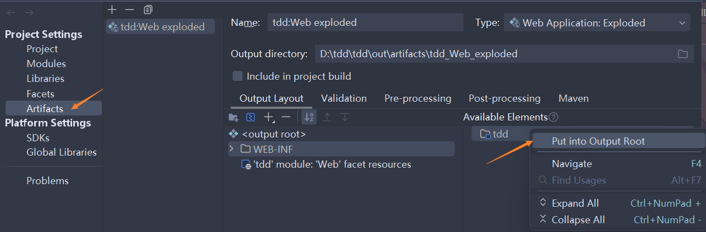

#####  1-一个或多个listeners启动失败，更多详细信息查看对应的容器日志文件

>   1.   这可能是自己删除了原有的`Web Application:Exploded`，然后自己兴建了一个。
>   2.   但是这可能会导致打包时，漏掉了`jar`包。
>   3.   解决措施：<br>


##### 2-mybatis返回的影响行数为-2147482646

>   1.   这里是`spring.xml`(spring配置文件中的配置导致的)。
>   2.   如果给MyBatis设置了`defaultExecutorType`为`BATCH`，那么MyBatis将使用批处理执行器来执行数据库操作。在这种情况下，当您执行插入、更新或删除操作时，MyBatis将返回`Statement.SUCCESS_NO_INFO`（-2147482646），表示无法确定操作影响的行数。
>   3.   如果您希望在使用批处理执行器的同时获取操作影响的行数，可以考虑在执行完批处理操作后，使用`SELECT`语句来查询影响的行数。例如，您可以在插入数据后，使用`SELECT COUNT(*) FROM table WHERE ...`语句来查询插入的行数。

```xml
<!--配置一个可以批量处理的sqlSession-->
<bean id="sqlSession" class="org.mybatis.spring.SqlSessionTemplate">
    <constructor-arg name="sqlSessionFactory" ref="sqlSessionFactory"/>
    <constructor-arg name="executorType" value="BATCH"/>
    <!--这里使用BATCH模式，可以批量处理sql语句，但是会导致返回影响行数时返回-2147482646-->
    <!-- 可以使用SIMPLE模式，但是不能批量处理sql语句，但是可以返回影响行数-->
</bean>
```

```xml
<!--在insert元素中设置了executorType="SIMPLE"，告诉MyBatis对于这个操作使用简单执行器而不是批处理执行器。-->
<insert id="insertUser" executorType="SIMPLE">
    INSERT INTO users (username, email)
    VALUES (#{username}, #{email})
</insert>
```

