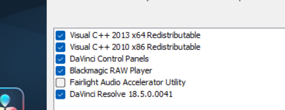

关于非maven项目的ssm配置文件位置：

1.   如果你的项目不是Maven项目，那么你可以在项目的src目录下创建一个名为resources的文件夹，然后将配置文件放在这个文件夹中。这样你就可以像使用Maven项目一样管理你的配置文件了。
2.   但是，你需要确保在项目的classpath中包含了这个resources文件夹，这样才能让项目在运行时找到这些配置文件。
3.   如果你的项目是由Maven构建的，那么Java代码会放在src/main/java路径下，而资源（如配置文件）会放在src/main/resources路径下。当构建jar包或war包时，JVM虚拟机会自动编译Java文件为class文件并存放在target/classes目录下，而resources目录下的文件会原封不动地拷贝一份到target/classes目录下。因此，我们一般取的classpath就是target/classes目录。
4.   在IntelliJ IDEA中，你可以通过以下步骤将resources文件夹添加到classpath中：
     1.  在项目的Project视图中，找到你的resources文件夹。
     2.  右键点击resources文件夹，然后选择“Mark Directory as”。
     3.  在弹出的菜单中，选择“Resources Root”。
5.   这样，IntelliJ IDEA就会将resources文件夹标记为蓝色，表示它被认定为包含在classpath中。当你使用类似"classpath:applicationContext.xml"的形式提供文件位置时，IDEA会从classpath中查找该文件。


验证码功能：

```java
public class VerifyCode {

    public static String drawRandomText(int width, int height, BufferedImage verifyImg) {

        Graphics2D graphics = (Graphics2D) verifyImg.getGraphics();
        graphics.setColor(Color.WHITE);//设置画笔颜色-验证码背景色
        graphics.fillRect(0, 0, width, height);//填充背景
        graphics.setFont(new Font("微软雅黑", Font.BOLD, 40));

        //数字和字母的组合
        String baseNumLetter = "123456789abcdefghijklmnopqrstuvwxyzABCDEFGHJKLMNPQRSTUVWXYZ";

        StringBuilder builder = new StringBuilder();
        int x = 10;  //旋转原点的 x 坐标
        String ch;
        Random random = new Random();

        for (int i = 0; i < 4; i++) {
            graphics.setColor(getRandomColor());

            //设置字体旋转角度
            int degree = random.nextInt() % 30;  //角度小于30度
            int dot = random.nextInt(baseNumLetter.length());

            ch = baseNumLetter.charAt(dot) + "";
            builder.append(ch);

            //正向旋转
            graphics.rotate(degree * Math.PI / 180, x, 45);
            graphics.drawString(ch, x, 45);

            //反向旋转
            graphics.rotate(-degree * Math.PI / 180, x, 45);
            x += 48;
        }

        //画干扰线
        for (int i = 0; i < 6; i++) {
            // 设置随机颜色
            graphics.setColor(getRandomColor());

            // 随机画线
            graphics.drawLine(random.nextInt(width), random.nextInt(height),
                    random.nextInt(width), random.nextInt(height));

        }

        //添加噪点
        for (int i = 0; i < 30; i++) {
            int x1 = random.nextInt(width);
            int y1 = random.nextInt(height);

            graphics.setColor(getRandomColor());
            graphics.fillRect(x1, y1, 2, 2);
        }
        return builder.toString();
    }

    /**
     * 随机取色
     */
    private static Color getRandomColor() {
        Random ran = new Random();
        return new Color(ran.nextInt(256),
                ran.nextInt(256), ran.nextInt(256));

    }
}
```


登录拦截器：

1.   在springmvc中配置：

     ```xml
     <mvc:interceptors>
         <mvc:interceptor>
             <mvc:mapping path="/**"/>
             <mvc:exclude-mapping path="/login"/> <!--可配置多个-->
             <bean class="com.example.LoginInterceptor"/> <!--拦截器位置-->
         </mvc:interceptor>
     </mvc:interceptors>
     
     ```

     此外还可以多个拦截器使用同一套规则：

     ```xml
     <bean id="excludeUrls" class="java.util.ArrayList">
         <constructor-arg>
             <list>
                 <value type="java.lang.String">/login</value>
                 <value type="java.lang.String">/register</value>
                 <value type="java.lang.String">/error</value>
             </list>
         </constructor-arg>
     </bean>
     
     <mvc:interceptors>
         <mvc:interceptor>
             <mvc:mapping path="/**"/>
             <bean class="com.example.MyInterceptor1">
                 <property name="excludeUrls" ref="excludeUrls"/>
             </bean>
         </mvc:interceptor>
         <mvc:interceptor>
             <mvc:mapping path="/**"/>
             <bean class="com.example.MyInterceptor2">
                 <property name="excludeUrls" ref="excludeUrls"/>
             </bean>
         </mvc:interceptor>
     </mvc:interceptors>
     
     ```

     但是这时拦截器也需要修改：

     ```java
     public class LoginInterceptor implements HandlerInterceptor {
     
         private List<String> excludeUrls;  //排除url
     
         @Override
         public boolean preHandle(
             HttpServletRequest request,
             HttpServletResponse response,
             Object handler) throws Exception {
     
             // 排除url规则配置在springmvc.xml中。
             String requestURI = request.getRequestURI();
             for (Object excludeUrl : excludeUrls) {
                 if (excludeUrl.equals(requestURI)) {
                     return true;
                 }
             }
     
             HttpSession session = request.getSession();
             Object user = session.getAttribute("user");
             Object admin = session.getAttribute("admin");
             if (user == null || admin == null) { // 用户未登录,管理员未登录
                 response.sendRedirect(request.getContextPath() + "/user/to/login"); // 重定向到登录页面
                 return false;
             }
             return true;
         }
     
         public void setExcludeUrls(List<String> excludeUrls) {  // 依赖注入
             this.excludeUrls = excludeUrls;
         }
     }
     ```

     

     

2.   此外，也可以直接在拦截器中配置：

     ```java
     public class LoginInterceptor implements HandlerInterceptor {
         @Override
         public boolean preHandle(HttpServletRequest request, HttpServletResponse response, Object handler) throws Exception {
             String uri = request.getRequestURI();  // 获取请求路径
             if (uri.contains("/login")) {
                 return true;
             }
             HttpSession session = request.getSession();
             Object user = session.getAttribute("user");
             if (user == null) {
                 response.sendRedirect(request.getContextPath() + "/login");
                 return false;
             }
             return true;
         }
     }
     
     ```

     

静态资源：

`<mvc:default-servlet-handler/>`元素和`<mvc:resources>`元素都可以用来配置静态资源的处理规则，但它们的工作方式不同。

`<mvc:default-servlet-handler/>`元素用于配置Spring MVC的默认Servlet处理器。当Spring MVC接收到一个请求时，它会检查是否有任何一个处理器映射能够处理这个请求。如果没有，它会将这个请求交给默认Servlet处理器来处理。默认Servlet处理器会将这个请求转发给Web容器的默认Servlet来处理。这样，Web容器就可以按照它自己的规则来处理这个请求。

`<mvc:resources>`元素用于显式地配置静态资源的处理规则。你可以使用这个元素来指定静态资源的URL模式和存储位置。当Spring MVC接收到一个请求时，它会检查这个请求是否匹配`<mvc:resources>`元素中指定的URL模式。如果匹配，Spring MVC会在指定的存储位置中查找对应的静态资源文件并返回给客户端。

总之，`<mvc:default-servlet-handler/>`元素和`<mvc:resources>`元素都可以用来配置静态资源的处理规则，但它们的工作方式不同。`<mvc:default-servlet-handler/>`元素依赖于Web容器的默认Servlet来处理静态资源请求，而`<mvc:resources>`元素则允许你显式地配置静态资源的处理规则。

```xml
<mvc:resources mapping="/static/**" location="/static/"/>
```


关于@requestParam:

在控制器方法中使用了`@RequestParam`注解来绑定一个名为`carId`的请求参数，该参数的类型为`int`（即基本类型）。但是，当请求中没有提供`carId`参数时，Spring无法将其转换为`null`值，因为基本类型不能表示`null`值。

```java
@RequestMapping("/somePath")
public String someMethod(@RequestParam(value = "carId", required = false) int carId) {
    // ...
}
```

要解决这个问题，您可以将控制器方法中的`carId`参数的类型更改为`Integer`（即基本类型`int`的包装类）。这样，当请求中没有提供`carId`参数时，Spring就可以将其转换为`null`值。

```java
@RequestMapping("/somePath")
public String someMethod(@RequestParam(value = "carId", required = false) Integer carId) {
    // ...
}
```

