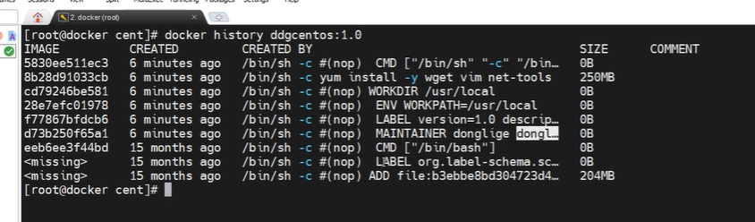

*   FROM：指定基础镜像，必须是第一个指令。
*   RUN：在镜像中执行命令，可以有多个RUN指令，每个RUN会创建一个新的镜像层。
*   COPY：从上下文目录中复制文件或者目录到容器里指定路径。
*   ADD：类似于COPY，但是可以自动解压缩tar文件，或者从URL下载文件。
*   CMD：为启动的容器指定默认要运行的程序，只能有一个CMD指令，如果有多个，则只有最后一个生效。
*   ENTRYPOINT：类似于CMD，但是不会被docker run的命令行参数覆盖，而是将这些参数作为ENTRYPOINT的参数。可以配合CMD使用，CMD作为ENTRYPOINT的默认参数。
*   ENV：设置环境变量。
*   EXPOSE：声明容器运行时提供的服务端口。
*   VOLUME：定义匿名卷，或者与主机共享目录。
*   WORKDIR：指定工作目录，可以多次使用，后续的命令会在最后一个WORKDIR指定的目录中执行。
*   USER：指定运行容器时的用户名或UID。
*   ARG：定义变量，在docker build时传递参数给Dockerfile。
*   LABEL：添加元数据标签到镜像中。
*   STOPSIGNAL：设置停止容器时发送的信号值。
*   HEALTHCHECK：设置容器健康检查命令。

再次构建镜像，原来的镜像会变为悬虚镜像

需要先删除悬虚镜像的容器。

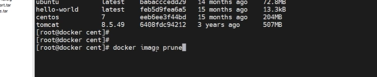

docker system prune不用。

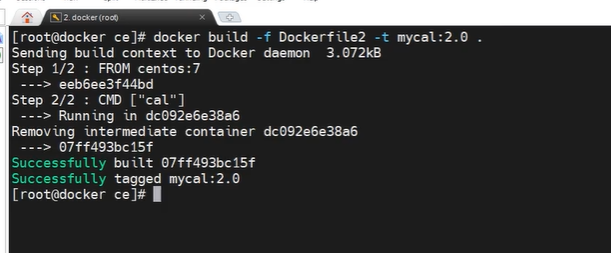

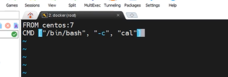

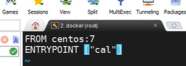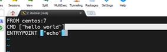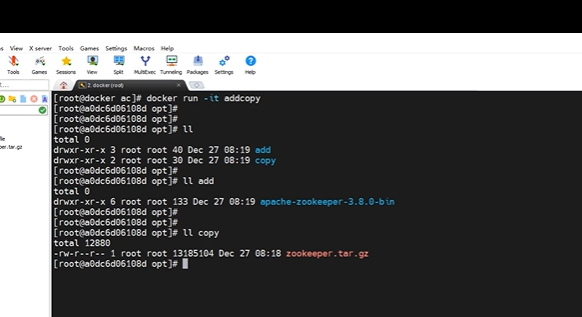

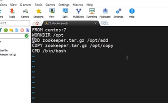

一个是目录，一个重命名。

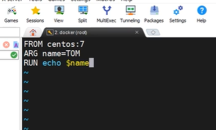

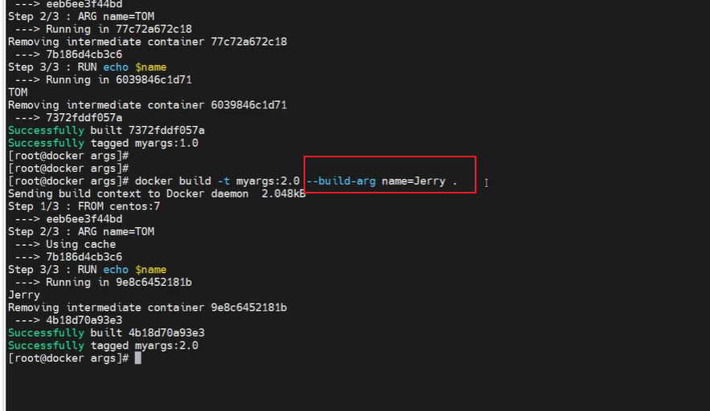

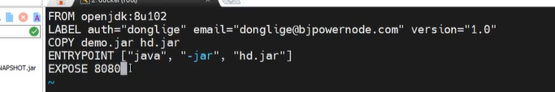
