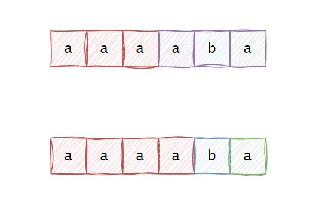
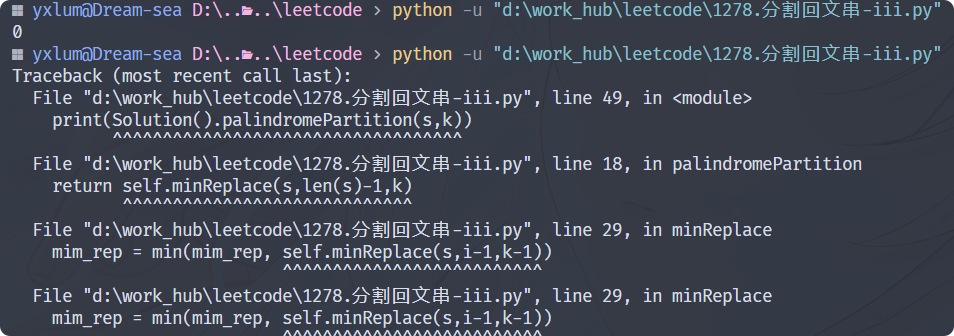
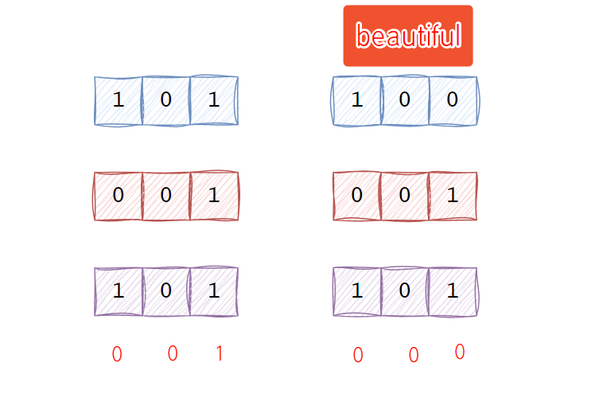
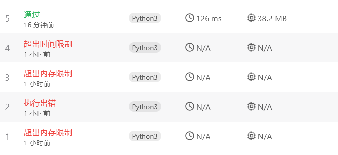
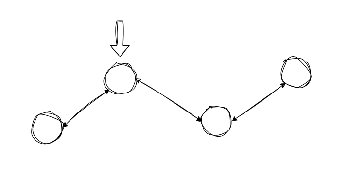
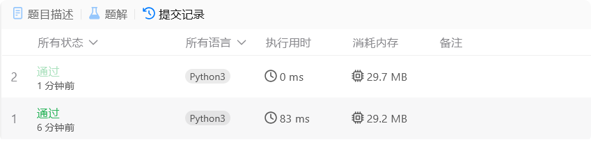
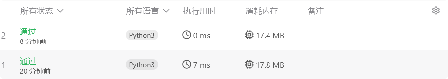
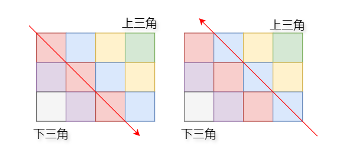
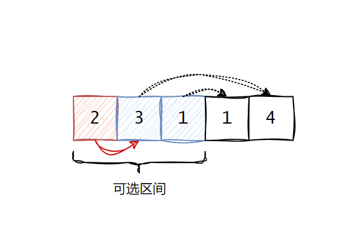

**将零星的星火沉淀为银河，是文字赋予思考的温柔仪式———Deepseek**


#### 二月

##### 2.25

[189.轮转数组](https://leetcode.cn/problems/rotate-array/)(非每日一题)

> - 考虑特殊情况，k大于arr.length时，需要忽略完整圈数
> - 对于 python 切片，很容易就实现 `nums[:] = nums[num - k:] + nums[:num - k] `，这一解法演变出最后面的结题方式。

首先一般数组移位的题目，一般都是涉及到双指针的问题，而轮转又往往涉及到取余实现循环遍历。

最简单的还是所谓的空间换时间大法，直接创建一个新的数组:时间复杂度$O(n)$,空间复杂度$O(n)$

```python
class Solution:
    def rotate(self, nums: List[int], k: int) -> None:
        num = len(nums)
        arr = [0] * num
        for i in range(num):
            arr[(i+k) % num] = nums[i]

        for i in range(num):
            nums[i] = arr[i]   
```

是否能继续改进？简单模拟一下实现过程，其实很容易发现这个过程其实不存在重复问题，即某一个位置只会有一个正确元素。我们直接参照快排挖坑的方式，<font color=red>拆东墙补西墙</font>。当然在实际测试过程中忽略了一次循环无法遍历完的情况，后续已经完善:时间复杂度$O(n)$,空间复杂度$O(1)$

```python
class Solution:
    def rotate(self, nums: List[int], k: int) -> None:
        num = len(nums)
        i = 0 # 作为0号坑(存放待填坑的土)
        j = (i+k) % num # 挖个坑(第一个待填的位置)
        if j == i:
            return
        count = 0 # 填坑数
        while count < num: # 一共要填坑num次
            nums[i], nums[j] = nums[j], nums[i] # 填坑(并把土收集起来放到0号坑)
            count += 1 
            j = (j+k) % num # 挖坑(下一个待填的位置)
            if j == i: # 一个循环结束
                nums[i], nums[j] = nums[j], nums[i]
                count += 1
                i += 1
                j = (i+k) % num
```

后面查看题解的时候，也得到一种很好的解法：其实所谓数组轮状本质上就是将后 $k$ 个元素移动到最前面。我们记整个数组序列为$ S $，后面 $k$ 个元素组成序列为 $B$ ，剩余部分就是 $A$，即 $S = A + B$。这里我们记$ \overline{S} $为对$S $序列逆转操作。显然我们需要得到的结果是 $B + A$,其实也就是先得到 $\overline{S} = \overline{B} + \overline{A}$,然后分别执行$ B $、$ A $的逆转即可得到$ B + A $,还是很妙的解法。

```python
class Solution:
    def rotate(self, nums: List[int], k: int) -> None:
        n = len(nums)
        k = k % n  # 去掉完整圈数
        self.reverse(nums, 0, n - 1)
        self.reverse(nums, 0, k - 1)
        self.reverse(nums, k, n - 1)

    def reverse(self, nums: List[int], start: int, end: int) -> None:
        while start < end:
            nums[start], nums[end] = nums[end], nums[start]
            start += 1
            end -= 1
```


##### 2.26

[1472.设计浏览器历史记录](https://leetcode.cn/problems/design-browser-history)

> - Python 中没有专门的栈数据结构，但可以用 list 来实现栈，list 提供 append() 和 pop() 方法，可以方便地用来模拟栈的操作。
> - Python 的 list 是动态数组，可以根据需要自动调整大小。
> - 顺便回顾一下 python 语法，Python中的切片访问默认为左闭右开。

其实在看到设计浏览器历史时，就应该想到数据结构中的栈，但是在使用 传统数组和 list 之间犯难。若是采用其他语言刷题，或许需要根据题目设置 5000 长度数组(为啥是5000，题目说每种方法调用次数最多5000)。但是Python 的 list 是动态数组，可以根据需要自动调整大小，就可以无需考虑这个问题。

但是很多时候想法很好的，但是实际操作起来还是会发生很多问题。由于 python 的切片操作可以很方便的对数组和列表进行截取操作，切片在本题中实现连续弹出是很方便的。但是方便都是有代价的，由于切片操作不改变原来数组，那么不难猜测其底层应该会存在复制操作，这就必然会损耗时间。而对于栈，其实我们并没有必要直接删除，直接采用逻辑删除，入栈覆盖的方式，就省去了底层复制的时间。

其实到这里还没有引入关键问题，那就是在本题中，我想将 list 和 逻辑删除 结合。但是list 不能像数组那样直接通过索引插入元素。如果你尝试在一个特定索引位置插入元素，而该位置超出了当前列表的长度，会引发 IndexError。在本题的 visit 方法中，我们若是逻辑删除，就需要判断是采用覆盖的方式，还是采用 append 的方式，这其实是无法判断的(当然前提是你不增加其他标志，如 list 已使用的最大长度，但是这会打乱代码逻辑)。

> 补充:可以在每次 visit 时，使用 append 方法对 list 进行拓容，然后通过索引插入元素。

遇到的坑大致就是这些，下面给出逻辑删除和切片截取的代码实现:

采用原始数组实现，通过栈顶指针 index 实现逻辑删除，size 记录总数据

```python
class BrowserHistory:

    def __init__(self, homepage: str):
        # 初始化栈
        self.stack = [0 for _ in range(5000)] 
        self.stack[0] = homepage
        # index: 栈顶指针, size: 记录的总数
        self.index, self.size = 0, 1

    def visit(self, url: str) -> None:
        # 删除前进记录(逻辑上的删除)
        self.index += 1
        self.size  = self.index + 1
        # 添加新的历史记录(覆盖)
        self.stack[self.index] = url

    def back(self, steps: int) -> str:
        # 在第 index+1 条记录，最多只能回退 index -1 步(除去当前和最初)
        self.index = max(0, self.index - steps)
        return self.stack[self.index]
            
    def forward(self, steps: int) -> str:
        # 在第 index+1 条记录，最多只能前进 size-index 步(除去当前和最后)
        self.index = min(self.size-1, self.index + steps)
        return self.stack[self.index]
```

采用 list 和 切片实现,代码简洁许多，但是实际上切片中可能存在复制行为，会损耗一定时间。

```python
class BrowserHistory:

    def __init__(self, homepage: str):
        self.stack = [homepage]
        self.index = 0

    def visit(self, url: str) -> None:
        self.index += 1
        # 直接截取
        self.stack[self.index:] = [url] 

    def back(self, steps: int) -> str:
        # 最多只能推到 0
        self.index = max(0, self.index - steps)
        return self.stack[self.index]
            
    def forward(self, steps: int) -> str:
        # 最多只能推到 len(stack) - 1
        self.index = min(len(self.stack) - 1, self.index + steps)
        return self.stack[self.index]
```


##### 2.27

[2296.设计一个文本编辑器](https://leetcode.cn/problems/design-a-text-editor)

> - list 中`extend()` 将一个可迭代对象中的所有元素添加到列表的末尾。
> - 在切片操作中，索引越界是允许的。
> - str( list )并不是将 list 元素拼接成字符串，而是将整个结构作为字符串，就很抽象。

设计文本编辑器，涉及大量的中间删除操作，数组是不合适的，显然会想到链表。但是这里还是存在一些顾虑，链表由于需要存储指针，数据存储密度不高，尤其是编辑器这种按字符存储，所以不打算将链表作为第一选择。

但是数组处理中间插入、删除操作十分麻烦，需要频繁的移动。于是我们想到复制，对于插入一串字符，直接复制比移动来的简单快捷。显然 list 就很合适。但是其实对于编辑器而言，每次插入、删除时复制一遍，效率也是很低的。结果就是<font color=red>emmm……测试超时了!!!</font>

```python
class TextEditor:

    def __init__(self):
        self.text = []
        # cursor光标是虚拟的，并不会占用字符位
        self.cursor = 0 # 光标位置(其实也就是光标右侧的字符数)

    def addText(self, text: str) -> None:
        # self.text.extend(text)
        self.text = self.text[:self.cursor] + list(text) + self.text[self.cursor:]
        self.cursor += len(text)

    def deleteText(self, k: int) -> int:
        k = min(self.cursor, k)
        self.text = self.text[:self.cursor - k] + self.text[self.cursor:]
        self.cursor -= k
        return k

    def cursorLeft(self, k: int) -> str:
        k = min(self.cursor, k)
        self.cursor -= k
        return ''.join(self.text[self.cursor-min(10, self.cursor):self.cursor])

    def cursorRight(self, k: int) -> str:
        k = min(len(self.text) - self.cursor, k)
        self.cursor += k
        return ''.join(self.text[self.cursor-min(10, self.cursor):self.cursor])
```

显然，还是回归到链表设计，由于插入、删除都是在光标左侧进行操作，~~其实单向链表，左指针似乎就行~~，左右移动操作无法通过单链表操作，还是需要双链表。在删除操作时，显然一个个遍历删除比较耗时，于是还是采用整段删除比较好，下面给出完整代码:

```python
class Node:
    def __init__(self, val=''):
        self.val = val
        self.pre = None
        self.next = None

    def l_insert(self, node):
        # 尽量最后修改self.pre不然会导致前面的节点丢失
        node.next = self
        node.pre = self.pre
        if self.pre:
            self.pre.next = node
        self.pre = node
    
    def continuous_delete(self, goal):
        # 向左删除
        if goal.pre:
            goal.pre.next = self
            self.pre = goal.pre
        else:
            self.pre = None
    
    def get_l_text(self,len=10):
        res = []
        cursor = self
        while len > 0 and cursor.pre:
            cursor = cursor.pre
            res.append(cursor.val)
            len -= 1
        return ''.join(res[::-1]) # 逆序输出!!!


class TextEditor:
    def __init__(self):
       self.text = Node()
       self.cursor = self.text

    def addText(self, text: str) -> None:
        for c in text:
            node = Node(c)
            self.cursor.l_insert(node)
            # self.cursor = node(不需要移动光标)

    def deleteText(self, k: int) -> int:
        #删除区间:[goal, self.cursor)
        res = 0
        goal = self.cursor
        while k > 0 and goal.pre:
            goal = goal.pre
            k -= 1
            res += 1
        if res != 0:
            self.cursor.continuous_delete(goal)
        return res


    def cursorLeft(self, k: int) -> str:
        for _ in range(k):
            if self.cursor.pre:
                self.cursor = self.cursor.pre
            else:
                break
        return self.cursor.get_l_text()
    
    def cursorRight(self, k: int) -> str:
        for _ in range(k):
            # cursor是虚拟节点,不占用空间
            if self.cursor.next:
                self.cursor = self.cursor.next
            else:
                break
        return self.cursor.get_l_text()
```

实际上在整段删除时，最初考虑的是都是开区间，也就是 goal 不会被删除，但是处理上略麻烦，不同如下:

```python
class Node:
    # ...
    def continuous_delete(self, goal):
        # 向左删除
        if goal:
            goal.next = self
            self.pre = goal
        else:
            self.pre = None

class TextEditor:
    # ...
    def deleteText(self, k: int) -> int:  
        if k == 0 or not self.cursor.pre:
            return 0
        else:
            # 删除区间为开区间 (goal, self.cursor)
            goal = self.cursor.pre
        res = 0
        while k > 0 and goal:
            goal = goal.pre
            k -= 1
            res += 1
        if res:
        	self.cursor.continuous_delete(goal) 
        return res
```

> `get_l_text`一定不要忘记反转！！！
>
> 虽然熟悉链表的原理，但是实际使用的时候还是有一堆的细节没有考虑完全，例如一些边界问题。

查看官方题解提供一个双栈解法(以光标划分)，想不到啊！！！代码简便，逻辑清晰，这应该就是最优解了吧。

```python
class TextEditor:
    def __init__(self):
        self.left = []
        self.right = []

    def addText(self, text: str) -> None:
        self.left.extend(text)

    def deleteText(self, k: int) -> int:
        count = min(k, len(self.left))
        del self.left[-count:] # 使用负数索引删除光标左侧的字符
        return count

    def cursorLeft(self, k: int) -> str:
        for _ in range(min(k, len(self.left))):
            self.right.append(self.left.pop()) #左栈弹出，右栈压入
        return ''.join(self.left[-10:])

    def cursorRight(self, k: int) -> str:
        for _ in range(min(k, len(self.right))):
            self.left.append(self.right.pop()) #右栈弹出，左栈压入
        return ''.join(self.left[-10:])
```

<br>


##### 2.28

[2353. 设计食物评分系统](https://leetcode.cn/problems/design-a-food-rating-system)，话说咋最近一直是设计题啊

> - 对于有序链表的排序，其实就是一个个比较，我们只需要实现一个比较的代码，后续直接递归调用即可。
> - 对于有序链表的维护，删除就不说了，插入也简单，唯独更新时需要删除节点重新插入。<font color=red>但是注意重新插入的结点一定要将前后指针置空，不然插入到端点位置会导致循环。</font>
> - 在 2.26 思考的 list 逻辑删除时导致插入需要使用 append 为 list 拓容的想法，也是在最后手动实现堆中得到了运用。

这题关键就两个 修改分数 和 按照分数排序 ，最关键的算法还是排序。对于该系统而言，在内部动态的维护一个排序序列比每次获取时排序要好得多，动态维护的方式只需要在添加、修改、删除的时候动态更新，而获取时可以直接使用。

但是，还是要试一下每次 highestRated 时排序获取，<font color=red>结果也是不出意外的超时了…</font>

```python
from typing import List

class FoodRatings:

    def __init__(self, foods: List[str], cuisines: List[str], ratings: List[int]):
        self.foods = foods
        self.cuisines = cuisines
        self.ratings = ratings

    def changeRating(self, food: str, newRating: int) -> None:
        # 找到 food 的索引
        food_index = self.foods.index(food)
        # 修改 food 的评分
        self.ratings[food_index] = newRating

    def highestRated(self, cuisine: str) -> str:
        # 找到所有 cuisine 的索引
        cuisine_index = [i for i, c in enumerate(self.cuisines) if c == cuisine]
        # 找到评分最高的 food
        max_rating = -1
        max_food = ""
        for i in cuisine_index:
            if self.ratings[i] > max_rating:
                max_rating = self.ratings[i]
                max_food = self.foods[i]
            elif self.ratings[i] == max_rating:
                if self.foods[i] < max_food:
                    max_food = self.foods[i]
        return max_food
```

对于动态维护的方式，由于是按照烹饪方式进行排序，不妨建立一个 map ，key 为烹饪方式，value 时一个动态维护的分数排序链表(频繁地插入删除操作)。但是这样的话，在修改评分的时候就麻烦了，我需要遍历所有的结点，于是在此基础上我又建立一个 map 按照食物名称存储其烹饪方式(为啥不直接将烹饪方式存储在结点中？可是我就是要找到结点啊！！！)，这样我们在更新有序链表时更新分数。<font color=red>结果也是出意外的超时了…</font>

```python
from typing import List

class Food:
    def __init__(self, name: str, rating: int):
        self.name = name
        # self.cuisine = cuisine
        self.rating = rating
        self.next = None
    
    def insert(self, food) -> None:
        if self.next is None: 
            self.next = food
        elif self.next.rating < food.rating: 
            food.next = self.next
            self.next = food
        elif self.next.rating == food.rating:
            if self.next.name > food.name:
                food.next = self.next
                self.next = food
            else:
                self.next.insert(food) # 递归插入
        else:
            self.next.insert(food)


class FoodRatings:

    def __init__(self, foods: List[str], cuisines: List[str], ratings: List[int]):
        self.map = {}
        self.cui = {} #方便修改评分
        # 为方便插入，有序链表含头结点
        for i in range(len(foods)):
            food = Food(foods[i],ratings[i])
            self.cui[foods[i]] = cuisines[i]
            # 如果cuisine不存在，则创建一个新的链表
            if cuisines[i] not in self.map:
                self.map[cuisines[i]] = Food("", -1)
            # 拿到头结点，插入数据
            self.map[cuisines[i]].insert(food)

    def changeRating(self, food: str, newRating: int) -> None:
        # 获取烹饪方式
        cuisine = self.cui[food]
        # 维护有序链表(删除+插入)
        cursor = self.map[cuisine]
        while cursor.next is not None:
            if cursor.next.name == food:
                break
            cursor = cursor.next
        # 删除节点
        temp = cursor.next
        cursor.next = cursor.next.next
        # 修改评分并重新插入 
        temp.next = None # 若是尾节点,会导致循环！！！
        temp.rating = newRating 
        self.map[cuisine].insert(temp)

    def highestRated(self, cuisine: str) -> str:
        # 由于一定存在(题目)，直接返回
        return self.map[cuisine].next.name
```

我还测试了两遍，全是超时，不干了，退了。<br><br>

应该还是初始化有序链表和后续维护有序链表效率太低了，需要遍历。也就是排序算法的问题，对于数组我们可以使用二分法插入，但是数组的插入是一种代价较高的操作，那么链表是否能二分？一般来说不能，但是树可以，但是排序树emmm…就很麻烦。

查看官方的题解，使用有序集合 SortedList ，查了一下底层并不是我猜想的树形结构，而是数组。这时候就不得不提到我一开始就弃用数组的原因，修改时需要移动大量元素。但是在 `SortedList` 中，数据被分成多个段，每个段的大小是 O(√n)。插入新元素时，只需要在某个段内部移动元素，移动的次数最多是 O(√n)。

```python
from collections import defaultdict
from typing import List

from sortedcontainers import SortedList

class FoodRatings:

    def __init__(self, foods: List[str], cuisines: List[str], ratings: List[int]):
        self.map = defaultdict(SortedList) 
        self.food_map = {}
        for i in range(len(foods)):
            food = foods[i]
            cuisine = cuisines[i]
            rating = ratings[i]
            self.food_map[food] = (cuisine, rating)
			# 使用负数，从而rating按照从大到小排序
            self.map[cuisine].add((-rating, food))

    def changeRating(self, food: str, newRating: int) -> None:
        cuisine, oldRating = self.food_map[food]
        # 删除旧的
        self.map[cuisine].remove((-oldRating, food))
        # 添加新的
        self.map[cuisine].add((-newRating, food))
        # 更新
        self.food_map[food] = (cuisine, newRating)

    def highestRated(self, cuisine: str) -> str:
        return self.map[cuisine][0][1]
```

> 感觉没有昨天的题解惊艳，还是忘不了昨天的双栈！！！不过 SortedList 通过分块的方式减少插入、删除时元素的移动，还是很巧妙的，既保留数组二分查找的优点，又减缓数组插入的缺点。
>
> 此外，`TreeSet` 是 Java 标准库中的一个有序集合类，基于红黑树实现。它始终保持元素的有序性，并且支持高效的插入、删除和查找操作。

还有一个官方题解，使用堆，说实话自从学了数据结构，这还是第一次遇到堆。堆不支持快速的随机删除与修改操作，因此为了维护堆顶数据的有效性，可以采用懒删除的方法，将维护操作推迟到查询时才进行。<font color=red>也就是在更新的时候插入一个新的食物(同名但是分数不同)，然后再获取最高分数的时候，判断是不是旧的，若是，则删除堆顶元素，重新获取，也是很妙啊</font>！！！堆的实现还是比较简单的，尝试手动实现一下，代码如下:

```python
from typing import List

class Heap:

    def __init__(self,arr:List[int]):
        self.arr = arr
        self.size = len(arr)
        self.buildMinHeap() # 构建最小堆
    
    def buildMinHeap(self):
        # 大元素不断下沉，最后得到递增序列
        for i in range(self.size//2,-1,-1):
            self.minHeapify(i)

    def minHeapify(self,i): 
        temp = self.arr[i]  # 保存当前节点的值
        k = 2*i+1
        while k < self.size:
            # 选取左右孩子中较小的一个(相等时选左孩子)
            if k+1 < self.size and self.arr[k] > self.arr[k+1]:
                k += 1
            if self.arr[k] < temp:
                self.arr[i] = self.arr[k]
                i = k # 继续调整子树
                k = 2*i + 1
            else: # 当前节点值小于左右孩子的最小值，不需要调整
                break
        self.arr[i] = temp

    def siftUp(self,i):
        while i > 0:
            parent = (i-1)//2
            if self.arr[parent] > self.arr[i]: # 父节点大于子节点，交换
                self.arr[parent],self.arr[i] = self.arr[i],self.arr[parent]
                i = parent # 继续上浮调整
            else:
                break
    
    def add(self,value):
        # 这里不能append(pop是逻辑删除，不是真正删除)但是也不能使用索引赋值，因为可能会越界
        # 但是有一个方式一定不会越界，先append拓容，再赋值
        self.arr.append(value)
        self.arr[self.size] = value
    
        self.size += 1
        self.siftUp(self.size-1)  # 新加入的元素上浮
    
    def pop(self):
        if self.size == 0:
            return None
        self.arr[0] = self.arr[self.size-1]
        self.size -= 1
        self.minHeapify(0)

    def top(self):
        if self.size == 0:
            return None
        return self.arr[0]
        

class FoodRatings:

    def __init__(self, foods: List[str], cuisines: List[str], ratings: List[int]):
        self.foods_map = {}
        self.cuisines_map = {}
        for i in range(len(foods)):
            food = foods[i]
            cuisine = cuisines[i]
            rating = ratings[i]
            self.foods_map[food] = (cuisine,rating)
            if cuisine not in self.cuisines_map:
                self.cuisines_map[cuisine] = []
            self.cuisines_map[cuisine].append((-rating,food))
        for cuisine in self.cuisines_map:
            self.cuisines_map[cuisine] = Heap(self.cuisines_map[cuisine])

    def changeRating(self, food: str, newRating: int) -> None:
        cuisine,rating = self.foods_map[food]
        self.foods_map[food] = (cuisine,newRating)
        self.cuisines_map[cuisine].add((-newRating,food))

        
    def highestRated(self, cuisine: str) -> str:
        heap = self.cuisines_map[cuisine]
        while heap.size > 0:
            rating,food = heap.top()
            if  self.foods_map[food][1] == -rating:
                return food
            heap.pop()
        return ""
```

> 还是遇到一点小问题，之前学习数据结构的时候，构建堆时，0 号位置是不放置树节点的，那么根结点 i 的子结点是 2i 和 2i+1。但是现在 0 号位置存储元素，根结点 a 的子结点就是 2a+1 和 2a+2。

<br>


#### 三月

##### 3.1

[131. 分割回文串](https://leetcode.cn/problems/palindrome-partitioning)

> 默认参数在函数定义时就被创建，并在所有函数调用之间共享。对于递归函数中的可变类型参数，若是使用默认参数，可能会导致一些问题。但是其实在本题中无关大雅，只会在第一次调用时使用默认参数。

如何判断一个字符串是回文串？倒序遍历的结果与正序一致或者从两端向中间遍历，每次遍历字符一致。

```python
def adjust(self, head: int, tail: int) -> bool:
    while head < tail:
        if self.s[head] != self.s[tail]:
            return False
        head += 1
        tail -= 1
    return True

def adjust(self, head: int, tail: int) -> bool:
    s = self.s[head:tail+1]
    return s == s[::-1]
```

此外，对于返回全部方案，是否存在这样一种情况，在 A 方案中，我们判断 xxx 是回文串，那么到 B 方案中，我们如何避免再次判断？

那么具体如何解决这个问题，其实稍微尝试一下，大致可以知道对于每一个结果集的下一个结果，是存在多种可能的，类似一种树形结构，对此我还是通过 dfs + 回溯完成:

```python
from typing import List

class Solution:
    def partition(self, s: str) -> List[List[str]]:
        self.s = s
        p = 0 # 遍历指针
        self.res_list = []
        self.dfs(s, p, [])
        return self.res_list


    def dfs(self, s: str, p:int, res: List[str])->None:
        if p == len(s):
            # 可变对象，传参传的是引用
            self.res_list.append(res[:])
            return
        # [p, i] 是回文串?
        for i in range(p, len(s)):
            if self.adjust(p, i):
                res.append(s[p:i+1])
                self.dfs(s, i+1, res)
                res.pop() # 回溯
    
    def adjust(self, head: int, tail: int) -> bool:
        while head < tail:
            if self.s[head] != self.s[tail]:
                return False
            head += 1
            tail -= 1
        return True
```

回到刚开始的问题，是否能避免每次重复判断某个子串是否为回文子串？牺牲空间换时间，设置一个二维数组:

```python
from typing import List

class Solution:
    def partition(self, s: str) -> List[List[str]]:
        self.s = s
        p = 0 # 遍历指针
        self.res_list = [] # 结果集
        # 判断记录
        self.judge = [[0 for _ in range(len(s))] for _ in range(len(s))] 
        self.dfs(s, p, [])
        return self.res_list


    def dfs(self, s: str, p:int, res: List[str])->None:
        if p == len(s):
            # 可变对象，传参传的是引用
            self.res_list.append(res[:])
            return
        # [p, i] 是回文串?
        for i in range(p, len(s)):
            if self.adjust(p, i):
                res.append(s[p:i+1])
                self.dfs(s, i+1, res)
                res.pop() # 回溯
    
    def adjust(self, head: int, tail: int) -> bool:
        # 从判断记录中找结果
        if self.judge[head][tail] == 1:
            return True
        elif self.judge[head][tail] == -1:
            return False
        # 没有判断过
        while head < tail:
            if self.s[head] != self.s[tail]:
                self.judge[head][tail] = -1 # 记录
                return False
            head += 1
            tail -= 1
        self.judge[head][tail] = 1 # 记录
        return True
```

满心欢喜的提交，但是从力扣执行结果而言，提升并不明显，甚至还慢了!!!<br>
<br>

那么暴力遍历是否能解决这个问题呢，哪怕代价极高？俺不知道也不想知道。但是在查看官方题解的时候，发现官方对于回文串的判断使用动态规划，例如对于一个串 abcba 我们想知道它是不是回文串，我们只要知道两件事就可以判断：去掉两端的子串 bcb 是不是回文串，以及两端是否相等(a=a?)。

但是我有一个问题，这也是我每次遇到动态规划都会想半天的东西，那就是我的子问题一定会在此之前得到答案吗？也就是说 bcb 是否为回文串这个答案一定会在我判断 abcba 之前知道吗？我又如何确保？这是每次使用动态规划都会遇到的难点！！！(自底向上、自顶向下)

动态规划这种方法，想明白就简单方便，想不明白，emm…越看越觉得它在忽悠我。


##### 3.2

[132. 分割回文串 II](https://leetcode.cn/problems/palindrome-partitioning-ii)

看到最小次数，emmm…我直接贪心，每次保证取得最长回文子串。贪心问题一般需要考虑三个问题: 想贪、咋贪、凭啥贪。但是这题emmm…不敢贪，好吧，自娱自乐一下。贪心问题最重要的是找到局部最优解，并且局部最优要直接导向全局最优。但是这题，若是我们每次取最长回文子串，其实会导致一个问题:会影响后面的回文串结构，导致原本可以组成回文的串被迫拆为多个<br>

那么，老老实实来吧，昨天的回文串我们已经找到所有的分割方式，那所有的都找了，最小分割不也就有了，无非就是时间代价有点大。当然还是解决一下昨天的遗留问题，动态规划，在昨天的问题中得到 `f[i][j] = (s[i] == s[j]) and f[i + 1][j - 1]`,显然通过表达式知道 i 需要从大到小算，而 j 需要从小到大算，那么前提已经研究清楚，结果也是超时了:

```python
class Solution:
    def minCut(self, s: str) -> int:
        self.s = s
        self.n = len(s)
        self.dp = [[True] * self.n for _ in range(self.n)]
        # 动态规划预处理
        for i in range(self.n - 1, -1, -1):
            for j in range(i + 1, self.n):
                # 忽略 i=j 的情况
                if j - i == 1:
                    self.dp[i][j] = s[i] == s[j]
                else:
                    self.dp[i][j] = self.dp[i + 1][j - 1] and (s[i] == s[j])
        # 初始化最小回文串分割次数
        self.min_cut = self.n - 1 
        self.dfs(0, 0)
        return self.min_cut
    
    def dfs(self, start, cut):
        if start == self.n:
            # 越界，此时cut记录的是分割段数，需要减1才是分割次数
            self.min_cut = min(self.min_cut, cut - 1)
            return   
        if cut >= self.min_cut: # 剪枝(不是最小分割次数，没必要继续)
            return  
        for i in range(start, self.n):
            if self.dp[start][i]:
                self.dfs(i + 1, cut + 1) 
```

贪心贪不了，dfs 又超时……哪怕知道是使用动态规划也是毫无头绪。

根据官方的方法，我们依次求出 [0:n] 状态下的最优解(最短分割),然后对于 [0:m] (m > n) 状态，我们尝试在之前的最优解的基础上( 以 n 为跳板 )继续寻求最优，最后取最小值记作当前状态的最优解。一句话说，整体的解(没说最优)是如何组成的？是由末尾回文子串+前面部分分割方案组成，而这种组成不唯一，我们取最优的那一个，即前面部分分割最优，进而根据末尾回文子串的选取不同得到一个个子问题。

```python
class Solution:
    def minCut(self, s: str) -> int:
        self.s = s
        self.n = len(s)
        self.dp = [[True] * self.n for _ in range(self.n)]
        # 动态规划预处理
        for i in range(self.n - 1, -1, -1):
            for j in range(i + 1, self.n):
                # 忽略 i=j 的情况
                if j - i == 1:
                    self.dp[i][j] = s[i] == s[j]
                else:
                    self.dp[i][j] = self.dp[i + 1][j - 1] and (s[i] == s[j])
        # 记录[0, i]的最小分割次数
        self.min_cut = [0] * self.n

        for i in range(1, self.n):
            # 回文串，无需分割
            if self.dp[0][i]:
                self.min_cut[i] = 0
            else:
                # 取最坏情况
                self.min_cut[i] = self.min_cut[i - 1] + 1
                for j in range(1, i):
                    if self.dp[j][i]: # 取末尾回文子串
                        # 根据末尾回文子串的选取,计算各个情况下的最小分割次数，取最小值
                        self.min_cut[i] = min(self.min_cut[i], self.min_cut[j - 1] + 1)
        return self.min_cut[-1]
```

这个动态规划的方式与昨天(上面的解法)不同的是，父问题的解依赖一群子问题的解，无法判断当前状态是从哪一个子状态转化而来，这种状态转移对我来说还是有点难想。贪心和动态规划也算是力扣上的”黑白无常“了，拼尽全力无法与之匹敌！刷题嘛，慢慢来吧！！！<br>


##### 3.3

[1278. 分割回文串 III](https://leetcode.cn/problems/palindrome-partitioning-iii)

参照前两天的题，其实也猜到了今天依旧是动态规划，首先肯定分析问题，尝试将其数学化，定义状态并确定状态方程。下面我们忽略边界的开闭，简单整理一下思路:对于一个字符串S,我们将其分为 k 个回文串修改最小次数记为 $f(n,k)$,那么其实接下来的思路就和昨天的回文串II类似，我们向前推一个子串$(n-k,n]$那么得到一个子问题$f(n-k,k-1)$，那么记$(n-k,n]$转换为回文串的最小代价为$m$,那么显然$f(n,k)=min(f(n-k,k-1)+m)$。描述的有些粗糙，但是大致是这个意思,写出以下代码，<font color=red>但是很遗憾超时了</font>。

```python
class Solution:
    def palindromePartition(self, s: str, k: int) -> int:
        self.dp = [[True]*len(s) for _ in range(len(s))]
        self.len = len(s)
        for i in range(len(s)-1,-1,-1):
            for j in range(i+1,len(s)):
                self.dp[i][j] = self.dp[i+1][j-1] and s[i] == s[j]
        return self.minReplace(s,len(s)-1,k)

    def minReplace(self, s: str, end: int, k: int) -> int:
        mim_rep = self.len # 用于记录最小替换次数
        if k == 0 and end == -1: #此时恰好分为k个回文串
            return 0
        elif k == 0 or end == -1: # 此时不可能分为k个回文串,设为len让其无法被选中
            return self.len
        for i in range(end,-1,-1):
            if self.dp[i][end]:
                mim_rep = min(mim_rep, self.minReplace(s,i-1,k-1))
            else:
                mim_rep= min(mim_rep, self.minReplace(s,i-1,k-1) + self.replace(s,i,end))
        return mim_rep


    def replace(self, s: str, start: int, end: int) -> int:
        count = 0
        while start < end:
            if s[start] != s[end]:
                count += 1
            start += 1
            end -= 1
        return count
```

动态规划结题，有时会涉及重复调用问题，此时就要考虑记忆搜索，避免多次计算相同子问题。这里最关键的无非是$n、k$,我们将其作为键去存储计算结果，每次先去记录中找，找不到再计算，并把结果保存到记录中。当然其实在前几次的官方题解中，可以学到一招叫做 `@cache`,给出如下代码:

```python
from functools import cache

class Solution:
    def palindromePartition(self, s: str, k: int) -> int:
        self.dp = [[True]*len(s) for _ in range(len(s))]
        self.len = len(s)
        for i in range(len(s)-1,-1,-1):
            for j in range(i+1,len(s)):
                self.dp[i][j] = self.dp[i+1][j-1] and s[i] == s[j]
        return self.minReplace(s,len(s)-1,k)

    @cache
    def minReplace(self, s: str, end: int, k: int) -> int:
        mim_rep = self.len # 用于记录最小替换次数
        if k == 0 and end == -1: #此时恰好分为k个回文串
            return 0
        elif k == 0 or end == -1: # 此时不可能分为k个回文串,设为len让其无法被选中
            return self.len
        for i in range(end,-1,-1):
            if self.dp[i][end]:
                mim_rep = min(mim_rep, self.minReplace(s,i-1,k-1))
            else:
                mim_rep= min(mim_rep, self.minReplace(s,i-1,k-1) + self.replace(s,i,end))
        return mim_rep


    def replace(self, s: str, start: int, end: int) -> int:
        count = 0
        while start < end:
            if s[start] != s[end]:
                count += 1
            start += 1
            end -= 1
        return count
```

其实还是有点好奇，满足(n,k)挺难的吧，真的会那么多次命中记录？我尝试在本地运行代码:第一个使用缓存基本秒出答案，第二个没用缓存等半天手动终止了<br>

其实回过头来仔细想想，当$n、k$比较大时，由于我们每次取末尾子串的情况足够复杂，多次取不同长度子串，最后导致不同取法所得结果(依赖的子问题)的$n、k$一致的概率(命中缓存记录)还是很大的。

当然还是老样子，看一下官方的题解，官方使用的是循环实现，这本身问题不大(只是递归对我而言熟悉一些)，但是在官方的第二种结题方式中使用预处理，提前计算了各个子串变为回文串的最小代价。为什么要这样做？回看我的代码，其实它仍有不完善的地方，$self.replace(s,i,end))$显然也是可以缓存的，也存在重复计算的情况，此外也不难看出这又是一个动态规划问题，而且和判断回文串其实差别不大，于是重新优化代码:

```python
from functools import cache

class Solution:
    def palindromePartition(self, s: str, k: int) -> int:
        self.len = len(s)
        self.dp = [[0]*len(s) for _ in range(len(s))]
        # 预处理
        for i in range(self.len-1,-1,-1):
            for j in range(i+1,self.len):
                if s[i] == s[j]:
                    self.dp[i][j] = self.dp[i+1][j-1]
                else:
                    self.dp[i][j] = self.dp[i+1][j-1] + 1
                # self.dp[i][j] = self.dp[i+1][j-1] + (1 if s[i] != s[j] else 0)
        return self.minReplace(s,len(s)-1,k)

    @cache
    def minReplace(self, s: str, end: int, k: int) -> int:
        mim_rep = self.len # 用于记录最小替换次数
        if k == 0 and end == -1: #此时恰好分为k个回文串
            return 0
        elif k == 0 or end == -1: # 此时不可能分为k个回文串,设为len让其无法被选中
            return self.len
        for i in range(end,-1,-1):
            mim_rep = min(mim_rep,self.minReplace(s,i-1,k-1)+self.dp[i][end])
        return mim_rep
```


##### 3.4

[1745. 分割回文串 IV](https://leetcode.cn/problems/palindrome-partitioning-iv)

判断一个字符串能否分割为三个非空回文子串，三个子串，两个分割点，两层循环即可:

```python
class Solution:
    def checkPartitioning(self, s: str) -> bool:
        self.s = s
        self.n = len(s)
        # 不符合参赛要求
        if self.n < 3:
            return False
        # 动态规划预处理
        self.dp = [[True] * self.n for _ in range(self.n)]
        for i in range(self.n - 1, -1, -1):
            for j in range(i + 1, self.n):
                # 当j-1 > i+1(j=i+1)时，默认值为True
                self.dp[i][j] = self.dp[i + 1][j - 1] and s[i] == s[j]
        
        # 分三段找两个分割点[0,i-1], [i,j-1], [j,n-1]
        # i的取值范围[1, n-2]（保证三段都有字符）
        for i in range(1, self.n - 1): 
            # j的取值范围[i+1, n-1](保证第二、三段有字符)
            for j in range(i + 1, self.n): 
                if self.dp[0][i - 1] and self.dp[i][j - 1] and self.dp[j][self.n - 1]:
                    return True
        return False
```

标个困难题吓唬我是吧！！！<br>


##### 3.5

[1328. 破坏回文串](https://leetcode.cn/problems/break-a-palindrome)

首先题目提到一个无法做到的情况，对于任意一个长度大于 1 的字符串，都是可以存在返回值的(其实写到后面才知道没有懂题目的意图，啥情况下无论修改字符都是回文串？奇数中间)。其次那么我们是否需要每次重新判断是否回文串？不需要，~~对于长度大于 1 回文串我们改动任意字符都会使其不再满足回文~~，对于回文串我们改动任意字符(不包含奇数长度的最中间字符)都会使其不再满足回文。要修改后的字典最小，那就尽量从左向右，尽量将字母改小->非a改a，是a的改不了，下一位。当然由于回文串的特性，我们只需要改一半就行(对称)。<font color=red>当所给回文串是奇数长度，修改中间字符后仍是回文串，不满足题意！！！！！！</font>

```python
class Solution:
    def breakPalindrome(self, palindrome: str) -> str:
        if len(palindrome) == 1:
            return ""
        # 从左到右遍历，找到第一个不是a的字符，将其改为a
        for i in range(len(palindrome) // 2):
            if palindrome[i] != 'a':
                return palindrome[:i] + 'a' + palindrome[i + 1:]
        # 如果全是a，将最后一个字符改为b
        return palindrome[:-1] + 'b'
```

看了下官方题解，说这就叫贪心，我都没往贪心那儿想。emmm……难道说贪心是人的本能？不要啊大锅，俺想做个好人！！！<br>


##### 3.6

[2588. 统计美丽子数组数目](https://leetcode.cn/problems/count-the-number-of-beautiful-subarrays)

今天的题，怎么说呢，看懂了就会发现，这不是消消乐嘛！所谓选两个数减去${2^k}$,其实就是$k+1$位上两个 1 抵消了，通过异或操作很容易满足的。所谓美丽子数组，其实子数组内所有元素各个二进制位上的 1 两两一抵消，最后结果为 0 (所有元素异或即可)。<br>

 就是于是给出以下代码，但是不幸的是，<font color=red>内存超出限制</font>！！！

```python
class Solution:
    def beautifulSubarrays(self, nums: List[int]) -> int:
        res = 0
        dp = [[0]*len(nums) for _ in range(len(nums))]
        for i in range(len(nums)):
            for j in range(i, len(nums)):
                if j ==i:
                    dp[i][j] = nums[j]
                else:
                    dp[i][j] = dp[i][j-1] ^ nums[j]
                res += 1 if dp[i][j] ==0 else 0
        return res
```

没事内存大了应该是 dp 数组的原因，稍微想一想，异或一个数两次等于没异或，而且异或运算具有交换性，于是只需要一个数组记录上一轮。后续只需要再异或一遍某个元素，消除影响即可。但第一轮需要手动处理一遍，嗯……代码感觉很不优雅！！！并且，<font color=red>这代码它超时了！！！</font>

```python
class Solution:
    def beautifulSubarrays(self, nums: List[int]) -> int:
        res = 0
        # dp[j] 表示上一轮次到j的异或值
        dp = [0] * len(nums)
        
        dp[0] = nums[0]
        res += 1 if dp[0] == 0 else 0

        for i in range(1,len(nums)): # 第一轮处理
            dp[i] = dp[i-1] ^ nums[i]
            res += 1 if dp[i] == 0 else 0

        for i in range(1,len(nums)):
            for j in range(i, len(nums)):
               # 取消上一轮的首位异或值
               dp[j] = dp[j] ^ nums[i-1]
               res += 1 if dp[j] == 0 else 0
        return res
```

能想到撤销前面一个的影响，为啥就想不到撤销前面一群呢？！我真傻,真的，我单想到可以…没想到…

```python
from collections import defaultdict
from typing import List

class Solution:
    def beautifulSubarrays(self, nums: List[int]) -> int:
        res = 0
        prefix_count = defaultdict(int)
        # 初始认为异或结果为0的个数为1,这样后续异或结果为0的时候，可以直接加上这个个数
        prefix_count[0] = 1 
        curr_xor = 0
        for num in nums:
            curr_xor ^=num
            #curr_xor异或一些数结果仍为curr_xor，说明这些数异或结果为0(即得到一个美丽子数组)
            res += prefix_count[curr_xor]
            prefix_count[curr_xor] += 1
        return res
```

吐了，昨晚睡觉之前没忍住看了一眼今天的每日一题，稍微一看，我去这不稳了嘛。emmm……结果确实稳了，躺的稳稳地！！！也算是集齐了力扣常见提交结果了！！！<br><br>


##### 3.7

[2597. 美丽子集的数目](https://leetcode.cn/problems/the-number-of-beautiful-subsets)

本来想的是，使用一个字典存储各个数字出现的频率，然后使用排列组合的方式计算，但是实际编写代码的时候发现不太好处理：我似乎需要判断i-k,i+k存在与否，并依次计算组合方式，关键是如何保证不重复计算(当然实际上后面看到官方解法得到启发，排序，然后每次只处理前面的，后面的不管，但是这样计算排列组合也是很麻烦的，依旧存在重复，a 和 b 的组合方式，会影响到 b 和 c 的选取组合)？花了很长时间，最后废弃了！！！<br>

但是经过排列组合的分析，我有一个新的想法。对于选择问题而言，无非就是选和不选两个选择，使用 dfs + 回溯还是很好解决的，唯一需要注意的是数字可以是重复的，处理逻辑上可能就需要发生一些变化,最终成品代码如下:

```python
from collections import defaultdict
from typing import List

class Solution:
    def beautifulSubsets(self, nums: List[int], k: int) -> int:
        self.res = 0
        self.nums = nums
        self.k = k
        self.len = len(nums)
        visited = defaultdict(bool) # 默认为False
        self.dfs(0, visited)
        # 去掉空集
        return self.res - 1

    def dfs(self, start: int, visited: defaultdict) -> None:
        if start == self.len:
            self.res += 1
            return
            
        # 不选择当前数字
        self.dfs(start + 1, visited)
        
        # 判断是否可以选择当前数字
        curr = self.nums[start]
        if not visited[curr - self.k] and not visited[curr + self.k]:
            # 判断以前是否选择过相同的数字
            if not visited[curr]: 
                # 选择当前数字
                visited[curr] = True
                self.dfs(start + 1, visited)
                # 回溯，撤销选择()
                visited[curr] = False
            else:
                # 选择当前数字
                self.dfs(start + 1, visited)
```

> 在回溯的时候，脑子没反应过来，就一直觉得后面没有执行代码，回不回溯没啥影响。但是 python 参数传递的是引用，虽然影响不了后面，但是回影响前面(在此次选择之前的选择)，:expressionless:。

依照习俗，感受一下来自算法之神——力扣官方的威压，第一个解法回溯没问题，第二个解法…oh…tomato，啊不是，动态规划。**考虑将每个数根据模 k 的结果进行分组，如果模 k 不同余，那么它们一定不相差 k**。其实大致解释一下官解思路，就是对元素计数之后，按照 k 取模进行分组，这样就可以将相差 k 的若干倍的元素分到一组，此时相差 k 的元素必然在同一组，此时我们再对分组进行排序，那么相差 k 的元素必然在分组中相邻，此时我们只需要对相邻元素进行分析。而最后结果就是所有分组取法的乘积。

```python
from collections import defaultdict
from typing import List

class Solution:
    def beautifulSubsets(self, nums: List[int], k: int) -> int:
        group = defaultdict(dict)
        for num in nums:
            # 将元素计数，按照num % k分组
            # 每个分组中元素之间的差值为k的倍数
            group[num % k][num] = group[num % k].get(num, 0) + 1

        ans = 1

        for g in group.values():
            sorted_g = sorted(g.keys()) # 组内按照元素大小排序
            l = len(sorted_g)
            # i表示元素在sorted_g的位置，j表示是否选取，f[i][j]当前方案数
            f = [[0]*2 for _ in range(l)]
            f[0][0] = 1
            f[0][1] = (1 << g[sorted_g[0]]) - 1
            for i in range(1,l):
                # 当前元素不选取，前面一个元素随意选取
                f[i][0] = f[i-1][0] + f[i-1][1]
                # 首先我们需要知道，当前元素存在 g[sorted_g[i]] 个
                # 至少选一个就是2 ** g[sorted_g[i]] - 1种选择
                if sorted_g[i] - sorted_g[i-1] == k:
                    # 此时，前一个元素不能选
                    f[i][1] = f[i-1][0] * ((1 << g[sorted_g[i]]) - 1)
                else:
                    # 前面一个元素随意选取
                    f[i][1] = (f[i-1][0] + f[i-1][1])* ((1 << g[sorted_g[i]]) - 1)
            ans *= f[l-1][0] + f[l-1][1] # 选取和不选取的方案数相加
        return ans - 1 # 不选取空集
```

> 在Python中，位移运算符 `<<` 的优先级低于减法运算符 `-`。


##### 3.8

[2234. 花园的最大总美丽值](https://leetcode.cn/problems/maximum-total-beauty-of-the-gardens)

~~摆烂一天，待补！！！~~首先找最接近种满的花园把它种满，找花数最少的花园以提高最小值，这肯定是没问题的。但是最初的时候我尝试贪心，我比较把花园种满和提高最小值这两种方式的性价比，我选取最高的那种方式，最后直至无法种植。但是这种方式存在很明显的误区，就是我可能导致后一种方式无法执行，例如原本我可以两次提高最小值，但是由于前一次选择把花园种满的性价比高于提高一次最小值，于是选择种满花园，但是结果导致后面可种植花数不够，但是可能实际两次提高最小值要优于一次种满花园。其实本质上就是性价的代价比难以判断，对于种满花园而言，其代价并不止当前种满改花园所需花数，还包括后面因为该选择浪费的花数，提升最小值的方式同理。

实际上，上面的思路困住我许久…

当然最后还是参照官解思路，其实很简单，种满花园的时候找花数最多的，我们遍历种满若干花园的方式，然后尽可能提高最小值，最后取最大的结果。对于可以填满所有花园的情况，感觉可以直接返回,没必要继续判断:

```python
from typing import List

class Solution:
    def maximumBeauty(self, flowers: List[int], newFlowers: int, target: int, full: int, partial: int) -> int:
        n = len(flowers)
        # 降序排列各个花园的美丽值，超过target的部分全部变为target
        flowers = sorted([min(x, target) for x in flowers], reverse=True)
        total = sum(flowers)
        ans = 0

        # 如果newFlowers足够填满所有花园，那么就初始化为full * n
        # 其实这里是对下面的循环进行了补充,下面循环其实并没有考虑到newFlowers填满所有n个花园的情况(i<n)
        if target * n - total <= newFlowers:
            # ans = full * n
            return max(full * n,full * (n - 1) + partial * (target - 1)) if target * n-total != 0 else full * n
        
        pre = ptr = 0
        for i in range(n):
            if i != 0:
                pre += flowers[i - 1]
            if flowers[i] == target:
                continue
            # 将前面i个花园([0,i-1])中种满花朵，剩余的花朵数为rest
            rest = newFlowers - (target * i - pre)
            if rest < 0:
                break
            # 不妨记ptr为j
            # 找到最小的j(其实就是找最大的flowers[j]，从而使最小值尽可能大)，使得flowers[j] * (n - j) - total <= rest
            while not (ptr >= i and flowers[ptr] * (n - ptr) - total <= rest):
                total -= flowers[ptr]
                ptr += 1
            
            rest -= flowers[ptr] * (n - ptr) - total
            #  尝试将剩余的rest分配给flowers[ptr]，flowers[ptr + 1]...flowers[i]
            #  同时要避免超过target
            ans = max(ans, full * i + partial * (min(flowers[ptr] + rest // (n - ptr), target - 1)))
    
        return ans
```

其实我感觉，我似乎对遍历这种方式存在“偏见”，对于遍历这种方式，我无法通过一种很确切的方式取解释它，它对于我而言似乎只有最后的执行结果是确定的(不知道该如何描述这种感觉)。因此对于一个问题，我总是尝试去贪心、去动态规划、去使用数学方法等等，而对应遍历、模拟这种最好理解的方式最容易忽视。


##### 3.9

[2070. 每一个查询的最大美丽值](https://leetcode.cn/problems/most-beautiful-item-for-each-query)

比昨天的题要简单些，无非就是排序，就前面最大美丽值，然后查找。写完这道题，关于二分查找这部分的理解加深了很多，发现之前学数据结构的时候，自己写的一些代码实现存在很多的问题(主要还是死循环问题)。给出如下代码:

```python
from typing import List

class Solution:
    def maximumBeauty(self, items: List[List[int]], queries: List[int]) -> List[int]:
        # 从小到大排序
        items = sorted(items, key=lambda x: x[0])

        # 计算前缀
        n = len(items)
        max_beauty = 0
        max_list = [0] * n
        for i in range(n):
            max_beauty = max(max_beauty, items[i][1])
            max_list[i] = max_beauty
        

        # 二分查找，返回最后一个小于等于target的位置
        def binary_search(left, right, target):
            while left < right:
                mid = left + (right - left) // 2
                if items[mid][0] <= target: 
                    left = mid + 1
                else:
                    right = mid
            return left  if items[left][0] <= target else left - 1

        # 二分查找获取结果
        ans = []
        left = 0
        right = n - 1
        pre_ans = -1
        for i in range(len(queries)):
            if pre_ans == -1: # 无法使用前一次的结果
                idx = binary_search(left, right, queries[i])
            else:
                # 感觉等于的可能性不大，就不单独处理了
                if queries[i] <= queries[i-1]:
                    idx = binary_search(left, pre_ans, queries[i])
                else:
                    idx = binary_search(pre_ans, right, queries[i])
                
            # 保存前一次的位置和结果
            if idx >= 0:
                pre_ans = idx
                ans.append(max_list[idx])
            else:
                pre_ans = -1
                ans.append(0)

        return ans
```

实际上还是有点不服气，我在二分查找的时候想到，是否可以根据前一次的结果缩短下一次查找的区间，我也确实这样做了，测试结果也是过来，但是实际时间消耗比不优化的时候明显增大了，开摆！！！<br>


##### 3.10

[2269. 找到一个数字的 K 美丽值](https://leetcode.cn/problems/find-the-k-beauty-of-a-number)

简简单单一道滑动窗口题,然后就是简单的获取一个整数的高位和低位的问题，结果如下:

```python
class Solution:
    def divisorSubstrings(self, num: int, k: int) -> int:
        n = len(str(num))
        num_bak = num
        if n < k:
            return 0
        ans = 0
        s = 0 # 记录当前的数字
        low = 0
        for high in range(n):
            s = s * 10 + num // (10 ** (n - high - 1)) # 设置s的低位
            if high >= k - 1:
                s %= 10 ** k # 删除s高位
                if  s!= 0 and num_bak % s == 0:
                    ans += 1
                low += 1
            num %= 10 ** (n - high - 1) # 删除num高位
            
        
        return ans
    
```

看了一下官方的题解，大差不差，枚举然后截取转整形。


##### 3.11

[2012. 数组美丽值求和](https://leetcode.cn/problems/sum-of-beauty-in-the-array)

依旧是比较简单的一道题，遍历一次循环，维护前缀最大值和后缀最小值，第二遍循环计算美丽值的和，代码如下:

```python
from typing import List


class Solution:
    def sumOfBeauties(self, nums: List[int]) -> int:
        n = len(nums)
        left_max = [0] * n
        right_min = [0] * n
        left_max[0] = nums[0]
        right_min[n - 1] = nums[n - 1]
        for i in range(1, n - 1):
            left_max[i] = max(nums[i], left_max[i - 1]) # 计算左边的最大值
            right_min[n - i - 1] = min(nums[n - i - 1], right_min[n - i]) # 计算右边的最小值

        ans = 0
        for i in range(1, n - 1):
            if left_max[i - 1] < nums[i] < right_min[i + 1]:
                ans += 2
            elif nums[i - 1] < nums[i] < nums[i + 1]:
                ans += 1
        
        return ans
```


##### 3.12

[3305. 元音辅音字符串计数 I](https://leetcode.cn/problems/count-of-substrings-containing-every-vowel-and-k-consonants-i)

简简单单遍个历，代码如下:

```python
class Solution:
    def countOfSubstrings(self, word: str, k: int) -> int:
        vowels = 'aeiou'
        n = len(word)
        ans = 0
        for i in range(n):
            set_vowels = set() # 元音字母的集合
            cnt = 0  # 辅音字母的个数
            for j in range(i, n):
                if word[j] in vowels:
                    set_vowels.add(word[j])
                else:
                    cnt += 1 

                if len(set_vowels) == 5 and cnt == k:
                    ans += 1
                elif cnt > k:
                    break
        return ans
```

老习俗，学习方法结题思路，不出意外后续几天可能都是这个元音辅音字符串计数了。令 count(k) 表示每个元音字母<font color=red>至少</font>出现一次，并且至少包含 k 个辅音字母的子字符串的总数，那么本问题的答案等于 count(k)−count(k+1)。对于 count(k)，我们可以使用滑动窗口来求解。

```python
class Solution:
    def countOfSubstrings(self, word: str, k: int) -> int:
        t = "aeiou"

        def count(m: int) -> int:
            n = len(word)
            ans, j, cnt = 0, 0, 0
            occur = {}
            # [i, j)
            for i in range(n):
                # 扩展j
                while j < n and (cnt < m or len(occur) < 5):
                    if word[j] in t:
                        occur[word[j]] = occur.get(word[j], 0) + 1
                    else:
                        cnt += 1
                    j += 1

                if cnt >= m and len(occur) == 5:
                    ans += n - j + 1 # 以i开头的符合要求子串的个数

                if word[i] in t: # 移动i，并消除之前的影响
                    occur[word[i]] -= 1
                    if occur[word[i]] == 0:
                        del occur[word[i]]
                else:
                    cnt -= 1

            return ans

        return count(k) - count(k + 1)   
```

有点难想，还是得多练!!!


##### 3.13

[3306. 元音辅音字符串计数 II](https://leetcode.cn/problems/count-of-substrings-containing-every-vowel-and-k-consonants-ii)

其实就是昨天的题，但是时间要求更高了点，只能使用滑动窗口了，代码如下:

```python
class Solution:
    def countOfSubstrings(self, word: str, k: int) -> int:
        t = "aeiou"

        def count(m: int) -> int:
            cnt = 0 # 记录辅音字母的个数
            n = len(word)
            ans, j = 0, 0
            occur = {} # 记录元音字母的出现次数
            # [i, j)
            for i in range(n):
                # 扩展j
                while j < n and (cnt < m or len(occur) < 5):
                    if word[j] in t:
                        occur[word[j]] = occur.get(word[j], 0) + 1
                    else:
                        cnt += 1
                    j += 1
                
                if cnt >= m and len(occur) == 5:
                    ans += n - j + 1 # 以i开头的符合要求子串的个数
                
                if word[i] in t: # 移动i，并消除之前的影响
                    occur[word[i]] -= 1
                    if occur[word[i]] == 0:
                        del occur[word[i]]
                else:
                    cnt -= 1

            return ans
        
        return count(k) - count(k + 1)
```

今天的题和昨天的一样，就是测试条件复杂了一点，完全就是昨天的官解在写一遍。emmm…再找一道贪心的题写写，但是这道题似乎几年前写过(心血来潮刷了一段时间):[11. 盛最多水的容器](https://leetcode.cn/problems/container-with-most-water/),很简单的一道题(可能是因为做过，下意识的)。从两边遍历容器内壁的高度，然后选取高度低的那一侧替换(若是相同则均替换)。至于为啥是这样的替换规则，两边向中间遍历的话，容器宽度一定会减少，只有高度增加才可能导致容积变大。代码如下:

```python
class Solution:
    def maxArea(self, height: List[int]) -> int:
        i = 0
        j = len(height) - 1
        volume = 0
        while i < j:
            volume = max(volume, min(height[i], height[j]) * (j - i))
            # 移动较短的那一边,一样的话都移动
            if height[i] < height[j]: #
                i += 1
            elif height[i] > height[j]:
                j -= 1
            else:
                i += 1
                j -= 1
        return volume
```


若是真的存在命运，我想如今的我也会坦然拥抱它吧。虽然偶尔可能心血来潮妄想反抗一下，中二地喊一句我命由我;就像一条窒息的鱼一样，偶尔挣扎反抗一下，然后陷入长久地沉默之中。但可惜的是，命运存在于过去、存在于未来，却从不曾出现在现在！


##### 3.14

[3340. 检查平衡字符串](https://leetcode.cn/problems/check-balanced-string)

比较简单的一道题，没有必要计算奇数和偶数位的和然后比较，直接一加一减，判断是否为 0 即可:

```python
class Solution:
    def isBalanced(self, num: str) -> bool:
        res = 0
        for i in range(len(num)):
            # 偶数位加，奇数位减
            res += int(num[i]) if i % 2 == 0 else -int(num[i])
        return res == 0
```

看了一下官方解法，使用变量 sign (初始为 1 ) 作为符号，每次乘以 -1 即可实现切换，还是很妙的！！！


##### 3.15

[3110. 字符串的分数](https://leetcode.cn/problems/score-of-a-string)

今天依旧是比较简单的一道题，代码如下:

```python
class Solution:
    def scoreOfString(self, s: str) -> int:
        ans = 0
        for i in range(1,len(s)):
            ans += abs(ord(s[i]) - ord(s[i-1]))
        return ans
```

每日一题比较简单，找一道贪心题做一做，这道题也是很久之前做过一次:[55. 跳跃游戏](https://leetcode.cn/problems/jump-game/)。当能跳到某一个位置时，其前面的位置我们也一定可以到达。故只需要遍历，记录最远可以到达的位置即可。

```python
from typing import List

class Solution:
    def canJump(self, nums: List[int]) -> bool:
        max_pos = 0
        for i, num in enumerate(nums):
            if i > max_pos: # 当前位置已经超过了最大位置
                return False
            max_pos = max(max_pos, i + num) # 更新最远能到达的位置
    
        return True
```


##### 3.16

[2272. 最大波动的子字符串](https://leetcode.cn/problems/substring-with-largest-variance/)

前几天全是简单题，周末放大招？？对于长度小于等于 2 的无需处理，直接返回 0 ，其他情况遍历,不用想也知道回超时！！！

```python
class Solution:
    def largestVariance(self, s: str) -> int:
        n = len(s)
        if n <= 2: return 0

        max_diff = 0
        self.max_char, self.min_char = "", ""

        for i in range(n - 1):
            self.max_char, self.min_char = s[i], s[i]
            map = {}
            for j in range(i, n):
                # 统计字符出现次数
                map[s[j]] = map.get(s[j], 0) + 1
                if len(map) == 1: continue
                # 更新min、max
                self.updateMap(map)
                # 更新最大波动
                max_diff = max(max_diff, map[self.max_char] - map[self.min_char])
        return max_diff
    
    def updateMap(self, map:dict):
        for k in map.keys():
            if map[k] > map[self.max_char]:
                self.max_char = k
            if map[k] < map[self.min_char]:
                self.min_char = k
```

投降，看官解！！！每个子字符串的的波动值只取决于最多和最少的字符(由于全是小写字符，组合情况是有限的)，对此我们可以遍历这些字符串的情况。那么接下来的情况就只需要集中注意到这两个字符上，我们记录最多的字符(假设为a)为1，最少(假设为b)的为-1(由于组合情况已经包含谁多谁少的情况，无需考虑)。那么最后的问题来了，一个子字符串的波动值等于其元素之和，从而进一步成为一个动态规划问题！！！但是若是只存在a、或者b的情况下，波动值是不予计算的，当然若是只存在b，此时波动值为负数无需考虑。

```python
class Solution:
    def largestVariance(self, s: str) -> int:
        n = len(s)
        chars = set(s) # 获取字符串中的字符集合
        ans = 0
        for a in chars:
            for b in chars:
                if a == b: continue 
                i = 0
                f0 = 0 # 以i结尾的最大子数组和(不一定含有 b)
                f1 = float('-inf') # 以i结尾的含有 b 的最大子数组和(一定含有 b)

                while i < n:
                    if s[i] == a:
                        f0, f1 = max(f0,0) + 1, f1 + 1
                    elif s[i] == b:
                        f0, f1 = max(f0, 0) - 1, max(f1,f0,0) - 1
                    # else: continue
                    ans = max(ans, f1)
                    i += 1
        return ans
```

为啥 f1 要初始化为 `float('-inf')` ? f1 一定要包含 b ，若是初始化为任意负数，若是遇到 a 可能会导致 f1 变为正数，此时是不合法的(这时 f1 不应该存在值)。或者可以理解为`-inf` 是一种标志值，表示当前值不存在或者不合法，只有当其中出现 b 之后标志位才会被清理(很巧妙)！！！

当然其实官解更妙些，没有遍历字符串，而是使用字典记录各个字符的位置，后续就没必要全部遍历！！！


##### 3.17

[1963. 使字符串平衡的最小交换次数](https://leetcode.cn/problems/minimum-number-of-swaps-to-make-the-string-balanced)

其实上述题目看起来挺吓人的，最初的时候以为可以使用递归判断，但是这不是一个判断题，递归不太方便。其实仔细理解题目，大致可以知道最基础的平衡字符串有三种:`""、[]、[][]`，其他都是在此基础之上进行嵌套。到这里其实问题就明朗了，就是个括号匹配问题。下面给出最初的代码，<font color=red>但是实际上这个代码是错误的！！！</font>

```python
class Solution:
    def minSwaps(self, s: str) -> int:
        right_size = 0 # 未匹配的右括号数量
        need_swap = 0 # 需要交换的次数
        for c in s:
            if c == '[':  
                # 遇到左括号，未匹配的右括号数量加1
                right_size += 1
            else:
                # 遇到右括号，未匹配的右括号数量减1
                if right_size > 0:
                    right_size -= 1
                else:
                    # 未匹配的右括号数量为0，需要交换
                    need_swap += 1
        return need_swap
```

在上述代码中，我们遇到无法匹配的右括号就认为需要交换，这没有问题。但是交换后实际上会导致后面的某个`[`变为`]`，并且当前`]`变为`[`。但是这点我们并没有体现。更改代码如下:

```python
class Solution:
    def minSwaps(self, s: str) -> int:
        right_size = 0 # 未匹配的右括号数量
        need_swap = 0 # 需要交换的次数
        for c in s:
            if c == '[':  
                # 遇到左括号，未匹配的右括号数量加1
                right_size += 1
            else:
                # 遇到右括号，未匹配的右括号数量减1
                if right_size > 0:
                    right_size -= 1
                else:
                    # 未匹配的右括号数量为0，需要交换
                    need_swap += 1
        # 没有实际交换，导致后续不匹配情况翻倍
        return (need_swap + 1) >> 1
```

```python
class Solution:
    def minSwaps(self, s: str) -> int:
        right_size = 0 # 未匹配的右括号数量
        need_swap = 0 # 需要交换的次数
        for c in s:
            if c == '[':  
                # 遇到左括号，未匹配的右括号数量加1
                right_size += 1
            else:
                # 遇到右括号，未匹配的右括号数量减1
                if right_size > 0:
                    right_size -= 1
                else:
                    # 未匹配的右括号数量为0，需要交换
                    need_swap += 1
                    # 将当前 ] 换为 [
                    right_size +=1
        return need_swap
```

```python
class Solution:
    def minSwaps(self, s: str) -> int:
        right_size = 0 # 未匹配的右括号数量
        for c in s:
            if c == '[':  
                # 遇到左括号，未匹配的右括号数量加1
                right_size += 1
            else:
                # 遇到右括号，未匹配的右括号数量减1
                if right_size > 0:
                    right_size -= 1
        # 多余的右括号数其实就是 need_swap
        return (right_size + 1) >> 1
```

其实上交换后实际上会导致后面的某个`[`变为`]`，并且当前`]`变为`[`，但若是没有交换，会导致啥呢？会导致后一个`]`本来在交换后可以匹配却无法匹配(但是这一点对交换最后一个`]`无影响)(这也就是`(need_swap + 1) >> 1`的由来)。此时若是我们在交换时执行`right_size +=1`,自然就消除了该影响。

但是其实还存在一个最重要的问题，那就是为啥这样交换次数是最小的？其实在写代码时并没有仔细想过这个问题，我们每次并没有真正交换，而是在尽可能匹配的前提下交换。不妨考虑这样一个问题，那就是我们只交换`]`为`[`,却并没有改`[`为`]`,是否会影响后续匹配，导致交换后不可以匹配的部分错误的匹配了呢？其实答案很简单，若是导致这种情况，那我们不会换掉这个`[`,这不是最优的！！！在尽可能匹配的前提下交换从而得到最小交换次数！！！


##### 3.18

[2614. 对角线上的质数](https://leetcode.cn/problems/prime-in-diagonal)

一道很简单的判断质数的题，代码如下:

```python
from typing import List


class Solution:
    def diagonalPrime(self, nums: List[List[int]]) -> int:
        n = len(nums)
        res = 0
        def is_prime(num: int)-> bool:
            if num < 2:
                return False
            for i in range(2, int(num**0.5) + 1):
                if num % i == 0:
                    return False
            return True

        for i in range(0, n):
            if is_prime(nums[i][i]) and  nums[i][i] > res:
                res = nums[i][i]
            if is_prime(nums[i][n-i-1]) and nums[i][n-i-1] > res:
                res = nums[i][n-i-1]
        return res
```

感觉上述代码的主要时间消耗还是在判断是否为质数上，每次都要遍历完所有的对角线元素才能得到结果。于是想到先对对角线元素降序排序，然后遍历找到第一个质数，此时该质数就是最大的！！！代码如下:

```python
class Solution:
    def diagonalPrime(self, nums: List[List[int]]) -> int:
        # 记录对角线上的数
        num_list = []
        n = len(nums)
        res = 0
        def is_prime(num: int)-> bool:
            if num < 2:
                return False
            for i in range(2, int(num**0.5) + 1):
                if num % i == 0:
                    return False
            return True

        for i in range(0, n):
            num_list.append(nums[i][i])
            if i != n - i - 1:
                num_list.append(nums[i][n - i - 1])

        # 排序
        num_list.sort(reverse=True)

        #找第一个质数
        for i in num_list:
            if is_prime(i):
                res = i
                break

        return res
```

效果还行…<br>

看了一下官解评论下一堆人说啥线性筛选法，emmm…看不懂噻！！！<br>


##### 3.19

[2610. 转换二维数组](https://leetcode.cn/problems/convert-an-array-into-a-2d-array-with-conditions)

比较简单的一道题，可以直接在第一次遍历时记录个元素个数和最大分组数，后续直接填充即可，代码如下:

```python
from typing import List

class Solution:
    def findMatrix(self, nums: List[int]) -> List[List[int]]:
        n = len(nums)
        max_size = 0 # 元素最大出现次数
        num_map = {} # 记录元素出现次数
        for i in range(n):
            num_map[nums[i]] = num_map.get(nums[i], 0) + 1
            max_size = max(max_size, num_map[nums[i]]) 
        
        res = [[] for _ in range(max_size)]
        for k in num_map.keys():
            for i in range(num_map[k]):
                res[i].append(k) # 依次向各分组中填充
        
        return res
```

但是上述方法感觉不够优雅，除了计数能将相同元素聚集到一起外，排序其实也可以做到！！！只不过这时候没法在填充之前搭建起结果列表的结构(不知道最大分组数)，就只好动态拓展，分组不够时新建分组，代码如下:

```python
from typing import List

class Solution:
    def findMatrix(self, nums: List[int]) -> List[List[int]]:
        # 排序:使相同的数字相邻
        nums.sort()

        res = [] # 结果
        now = 0 # 正在分组的数字(题目说元素大于等于1)
        group_size = 0 # 当前分组数
        point = 0 # 正在填充的分组位置
        
        for num in nums:
            if num != now: 
                # 如果当前数字不等于now,开始为新的数字分组
                now = num
                point = 0
            
            if point == group_size:
                # 如果当前分组已经满了,则新建一个分组
                res.append([num])
                group_size += 1
            else:
                res[point].append(num)

            point += 1

        return res
```

<br>

但是其实这里还是存在一个疑问，那就是对一个含有大量重复元素的列表排序真的好吗？待定…

老规矩看一下官方题解:哈希表计数(Counter)，然后多次循环遍历哈希表，每次将存在余量的元素分成一组，若是元素告罄删除对应键，最终得到所有分组。

```python
from collections import Counter
from typing import List

class Solution:
    def findMatrix(self, nums: List[int]) -> List[List[int]]:
        cnt = Counter(nums)
        ans = []
        
        while cnt: 
            arr = []
            for key in list(cnt.keys()):
                cnt[key] -= 1
                arr.append(key)
                if cnt[key] == 0:
                    del cnt[key]
            ans.append(arr)
        
        return ans
```

又学会一个 Counter 用法……<br>


##### 3.20

[2612. 最少翻转操作数](https://leetcode.cn/problems/minimum-reverse-operations)

其实仔细分析之后，感觉和无向图的最短路径类似，使用 bfs 遍历代码如下，但是很遗憾超时！！！

```python
from collections import deque

class Solution:
    def minReverseOperations(self, n: int, p: int, banned: List[int], k: int) -> List[int]:
        res = [-1] * n
        res[p] = 0

        banned = set(banned) # 记录已经访问过的位置
        banned.add(p)

        q = deque()
        q.append(p)

        while q:
            cur = q.popleft()
            # 翻转子数组的左边界取值范围
            left_min = max(0, cur - k + 1)
            left_max = min(n - k, cur)
            for i in range(left_min, left_max + 1):
                # 计算 cur 翻转后的新位置[根据翻转规则:(i)+(i+k-1)=(p)+(new_pos)]
                new_pos = 2 * i + k - 1 - cur
                # 检查新位置是否有效且未被禁止或访问
                if 0 <= new_pos < n and new_pos not in banned:
                    res[new_pos] = res[cur] + 1
                    q.append(new_pos)
                    banned.add(new_pos)
        return res
```

看了一些题解说，由于遍历时访问大量无关元素，导致时间浪费。因此每次判断是否访问太耗时间，可以维护一个未访问集合，避免没有必要的访问。此外可以对集合进行排序，这样我们就可以快速知道一个元素是否在未访问集合中(基于查找的优化)！！！

此外，当我们翻转一个子数组时，位置 `cur` 会变为位置  `2i + k - 1 - cur`，其中 `i` 是子数组的左边界,实际上这个表达式的奇偶性是固定的(至于变量`i`相关)，此时我们可以将查找集合分为奇偶两部分，进而进一步减少查找，其实这也就是官方的第一种解法:

```python
from typing import List
from collections import deque
import sortedcontainers

class Solution:
    def minReverseOperations(self, n: int, p: int, banned: List[int], k: int) -> List[int]:
        # 初始化结果数组
        res = [-1] * n
        res[p] = 0
        
        # 创建两个有序集合，分别存储未访问的奇数和偶数位置
        not_visited_odd = sortedcontainers.SortedSet()
        not_visited_even = sortedcontainers.SortedSet()
        banned_set = set(banned)
        for i in range(n):
            if i != p and i not in banned_set:
                if i % 2 == 1:
                    not_visited_odd.add(i)
                else:
                    not_visited_even.add(i)
        
        q = deque([p])
        
        while q:
            cur = q.popleft()
            
            # 计算可通过翻转到达的位置范围
            left_min = max(0, cur - (k - 1))
            left_max = min(n - k, cur)
            
            # 翻转后可能的最小和最大位置
            min_new_pos = 2 * left_min + k - 1 - cur
            max_new_pos = 2 * left_max + k - 1 - cur
            
            # 根据当前位置的奇偶性选择对应的集合
            positions = not_visited_odd if min_new_pos % 2 == 1 else not_visited_even
            
            # 查找范围内的所有可达位置
            to_remove = []
            
            for idx in positions.irange(min_new_pos, max_new_pos):
                res[idx] = res[cur] + 1
                q.append(idx)
                to_remove.append(idx)
            
            # 从未访问集合中移除已访问的位置
            for pos in to_remove:
                positions.remove(pos)
        
        return res
```

当然第一种方式理解了，第二种并查集俺的方式其实也就好理解一些，只是将有序集合改为并查集,未遍历集合改为已遍历集合。如果要删除一个元素，可以将它与下一个元素合并，从而在下次访问时跳过已删除的元素(并查集每次查找都返回根节点，非根会被自动忽略，这也是为啥初始化为自己的原因):

```python
from typing import List
from collections import deque

class Solution:
    def minReverseOperations(self, n: int, p: int, banned: List[int], k: int) -> List[int]:
        # 初始化结果数组
        res = [-1] * n
        res[p] = 0
        
        # 并查集(初始化为自己),用于记录已访问的位置
        # 此处需要 n + 2 的原因是，后续删除第 n 个元素时，需要访问第 n + 2 个元素
        f = [[i for i in range(n + 2)] for _ in range(2)]
        for i in banned:
            # 将 i 加入到 i + 2 的集合中,由于 i 不是根节点，后续无法再次访问
            # 注意由于奇偶的区分，i+1在并查集中属于无效位置！！！
            self.merge(f[i % 2],i,i + 2)
        
        # BFS
        q = deque()
        q.append(p)
        self.merge(f[p % 2],p,p + 2)

        while q:
            cur = q.popleft()
            left_min = max(0, cur - k + 1)
            left_max = min(n - k, cur)
            pos_min = 2 * left_min + k - cur - 1
            pos_max = 2 * left_max + k - cur - 1

            j = pos_min
            while j <= pos_max:
                # 找到下一个未访问的位置
                fi = self.find(f[pos_min % 2],j)
                if  fi > pos_max:
                    break
                res[fi] = res[cur] + 1
                q.append(fi)
                self.merge(f[pos_min % 2],fi,fi + 2) # 设为已访问(由于fi不是根节点，后续无法再次访问)
                j = fi + 2
        return res

    
    def find(self,f:List[int],target:int)->int:
        # 路径压缩
        if f[target] != target:
            f[target] = self.find(f,f[target])
        return f[target]
    
    def merge(self,f:List[int],a:int,b:int):
        fa = self.find(f,a)
        fb = self.find(f,b)
        if fa != fb:
            f[fa] = fb
```

并查集能这么用也是绝了，此外分奇偶优化、大量数据时选用已处理或未处理数组记录从而避免全部遍历的方法都很妙，有点撑了！！！<br>


##### 3.21

[2680. 最大或值](https://leetcode.cn/problems/maximum-or/)

其实本质上就是尽可能保证二进制位 1 的数量多，并且位数靠左。对于位移 k 次而言，若是存在一个元素的最高位比其他元素高一位，此时 k 次全部给它无疑是最优解(直接导致结果翻倍，二进制前一位表示值是后一位的 2 倍)；而对于多个并列长度(二进制) ，当选择一个数位移后，就会导致上一种情况；故而 k 次位移必然作用在一个元素上。

在给出最终代码之前，记录一下之前的一个误区，那就是本题的结果不是对最大值进行 k 次位移，因为当存在同一位数的多个元素时，位移最大的元素实际上可能会大致某些位由 1 变 0，此时反而不是最优，如下:

```bash
1 1 0 1       1 1 0 1 0		     1 1 0 1
1 0 1 1   --->  1 0 1 1    --->  1 0 1 1
1 0 0 1			1 0 0 1		   1 0 0 1 0
			  1 1 0 1 1		   1 1 1 1 1
```

最终给出代码如下:一次遍历记录后缀或运算的值，第二次遍历记录前缀或运算的值，并维护最大结果。

```python
from typing import List

class Solution:
    def maximumOr(self, nums: List[int], k: int) -> int:
        ans = 0
        n = len(nums)

        # suffix_or[i] 表示 nums[i] 到 nums[n-1] 的或值
        suffix_or = [0] * (n+1) 
        for i in range(n - 1, -1, -1):
            suffix_or[i] = nums[i] | suffix_or[i+1]

        pre_or = 0
        for i in range(n):
            ans = max(ans, pre_or | (nums[i] <<k) | suffix_or[i + 1])
            pre_or |= nums[i]
        return ans
```

而对于官方解法其实也是比较好理解，对于某个元素 a 它参与了或运算和没参加有啥区别？参与或运算，它的 1 位会导致运算结果 or_sum 某些 0 位变 1 。此时若是知道是哪些位置的 0 ，那就可以将 or_sum 复原，消除该元素 a 参与运算的影响(相当于没参与)。这是可能会想，我们假设该元素 a 的所有 1 位都对结果 or_sum 有影响，此时我们只需要将结果与该元素异或运算即可消除。但是实际上这是不合理的，可能 or_sum 原本的某些 1 位( 1 or 1 也为 1 )也会误删，此时我们还需要补救，将这些 1 位补回来(或运算)。最后一个问题，如和找到这些误删的 1 位？由于 or_sum 中该位为 1 ，且会被误删则 a 中该位为 1，则该位 1 至少存在两次才可能被误删(不一定会被删)，此外哪怕没有误删，我们补回来又不会有任何影响，还是 1 。

```python
from typing import List

class Solution:
    def maximumOr(self, nums: List[int], k: int) -> int:
        or_sum = 0
        twices = 0
        for num in nums:
            # 计算出现两次以及以上1的位置
            twices |=  or_sum & num
            or_sum |= num
        
        return max([(or_sum ^ num) | (num << k) | twices for num in nums])
```


##### 3.22

[2643. 一最多的行](https://leetcode.cn/problems/row-with-maximum-ones/)

比较简单的一道题，代码如下:

```python
from typing import List


class Solution:
    def rowAndMaximumOnes(self, mat: List[List[int]]) -> List[int]:
        index = 0
        max_ones = 0
        for i,arr in enumerate(mat):
            total = sum(arr)
            if total > max_ones:
                max_ones = total
                index = i
        return [index, max_ones]
```


##### 3.23

[2116. 判断一个括号字符串是否有效](https://leetcode.cn/problems/check-if-a-parentheses-string-can-be-valid)

显然又是一个括号匹配问题，最初我参考之前[1963. 使字符串平衡的最小交换次数](https://leetcode.cn/problems/minimum-number-of-swaps-to-make-the-string-balanced)写出如下代码，但是是存在问题的:

```python
class Solution:
    def canBeValid(self, s: str, locked: str) -> bool:
        left_num = 0 # (数量
        right_available = 0 # 可变为(的)数量
        for i, c in enumerate(s):
            if c == '(':
                left_num += 1
            if c == ')':
                if left_num > 0:
                    left_num -= 1
                else:
                    if right_available == 0:
                        if locked[i] == '1':
                            return False
                        else:
                            left_num += 1
                    else:
                        right_available -= 1
                        left_num += 1
                        if locked[i] == '0':
                            right_available += 1
        return left_num == 0
```

这道题左右括号数不一定(基本上)不相等，而 1963 经过交换是必然可以匹配的，但是这题不一定。上述代码没有考虑到若是最后剩余`(`该如何处理，于是又得出如下代码，但是很遗憾还是错误的:

```python
class Solution:
    def canBeValid(self, s: str, locked: str) -> bool:
        # 检查长度是否为奇数
        if len(s) % 2 == 1:
            return False
        
        left_num = 0
        free = 0
        for i, c in enumerate(s):
            if locked[i] == '0':
                free += 1
            elif c == '(':
                left_num += 1
            else:
                if left_num > 0:
                    left_num -= 1
                else:
                    if free > 0:
                        free -= 1
                    else:
                        return False
        # 尝试使用多余的free来匹配左括号
        return (free - left_num) % 2 == 0 if free >= left_num else False
```

其实上面最后使用 free 匹配存在很严重的问题，那就是 free 所代表的字符若是在剩余的 left_num 前面呢，如下:你会发现倒数第三个`(`永远不可能被匹配！！！但是上述代码执行的结果却是可以匹配，原因就是`)(`的存在被认为合法了！！！

```bash
))) (()) (()
000 1111 111
```

所以上述处理剩余 left_num 的操作就不合法,emmm…确定这不是困难题吗!？<br>

看来只能使用组合拳解题法:不会，开摆，看官解。官方题解的思路，即字符串分数化，那有效括号字符串等效于: 字符串分数为0，且字符串任意前缀的分数大于等于0。那么思路知晓了，如何去实现呢？对于一个锁定的字符，直接就是 `(` 记作 1，`)`记作 -1 即可。但是对于未锁定的字符串，其实存在两种选择，即记作 1 或者   -1,那么其实我们可以遍历所有情况，找到其过程中一直满足大于等于 0 且最终分数为 0 的一个，那么此时就证明存在某种情况可以使得括号字符串有效。

那么不妨继续分析，那就是其过程中要一直满足大于等于 0,需要不断地删除不合法的数据的部分，那么什么是不合法的呢？对于一个`**`我们知道它的最小合法值是`()`也就是0，对于`***`最小合法值为 1 ，也就是`()(`或者`(()`,其他的情况都是不合法的。至于为啥需要立即删除，因为此后`(`的出现可能导致其被误认为合法，例如`())(`对于`())`而言不合法，但是`())(`为 0 被误认为合法，但是`)(`是不被认可的。

不妨具体模拟体会一下，`(***)*`,其中以`*`表示未锁定，其计算过程如下:最终显然存在一种方式导致方案分数为 0 ，使得字符串合法！！！

| 索引 | 字符 | 分数情况           | 备注                   |
| ---- | ---- | ------------------ | ---------------------- |
| 0    | `(`  | {1}                | 锁定，+1               |
| 1    | `*`  | {0,2}              | 各种结果分别考虑+1、-1 |
| 2    | `*`  | ~~{-1,1,3}~~ {1,3} | -1 不合法              |
| 3    | `*`  | {0,2,4}            | 各种结果分别考虑+1、-1 |
| 4    | `)`  | ~~{-1,1,3}~~ {1,3} | -1 不合法              |
| 5    | `*`  | {0,2,4}            | 各种结果分别考虑+1、-1 |

继续分析，是否需要将所有合法情况记录为一个数组？没必要，我们记录大致范围即可，反正我们最后是要判断是否有 0 这种方案。于是给出代码：

```python
class Solution:
    def canBeValid(self, s: str, locked: str) -> bool:
        # 奇数长度一定不匹配
        if len(s) % 2 == 1:
            return False
        
        min_score = 0
        max_score = 0
        for is_locked, c in zip(locked, s):
            if is_locked == '1':
                if c == '(':
                    diff = 1
                else:
                    diff = -1
                max_score += diff
                min_score = max(0, min_score + diff)
            else:
                max_score +=1
                min_score = max(0, min_score - 1)
            if max_score < min_score: # 集合为空,不存在合法方案
                return False
            
        return min_score == 0
```

> 力扣测试确实全部通过，但是还是存在一些逻辑上难以解释的问题(对比官方题解少了`(i + 1) % 2`)，这一点在下面分析叙述。

首先需要知道的是偶数个 1 或 -1 相加结果一定是偶数，从而推导出奇数个 1 和 -1 相加是奇数。当 min_score 小于 0 时，其实…好吧一步步来，若是`min_score = -1`，啥情况？显然当前是第奇数个字符，此时它的下一种方案一定是 1(方案分数一定是奇数，且由上一个方案分化而来的两个子方案，一定分数连续)。若是`min_score = -2`呢？是否为第偶数个字符？但是这是不可能的，奇数位的最小合法分数为 1，偶数位就不可能通过 -1 达到 -2。由此我们其实也就知道一件事，在保证奇数位合法的情况下，偶数位不可能不合法(不会执行 `max` 函数)，由此上面的代码自然可以通过(先奇后偶)。最后给出力扣官方解法:

```python
class Solution:
    def canBeValid(self, s: str, locked: str) -> bool:
        n = len(s)
        if n % 2 == 1:
            return False
        
        min_score = 0
        max_score = 0
        for i in range(n):
            if locked[i] == '1':
                if s[i] == '(':
                    diff = 1
                else:
                    diff = -1
                max_score += diff
                min_score = max((i + 1) % 2, min_score + diff)
            else:
                max_score += 1
                min_score = max((i + 1) % 2, min_score - 1)
            if max_score < min_score:
                return False
            
        return min_score == 0
```

此外根据上面的理论，我们其实还可以提出另一种结题方式:字符串分数为0，且字符串任意前缀的分数大于等于 0 ,其实也就等效于: 字符串任意前缀的分数大于等于 0 ，且字符串任意后缀的分数小于等于 0 ，目前姑且这样理解吧(总感觉这种想法不够清晰)…

```python
class Solution:
    def canBeValid(self, s: str, locked: str) -> bool:
        # 检查长度是否为奇数
        if len(s) % 2 == 1:
            return False
        
        # 任意前缀的分数大于等于0
        balance = 0
        for i in range(len(s)):
            if locked[i] == '0' or s[i] == '(':
                balance += 1 
            else:
                balance -= 1 
            
            if balance < 0:
                return False
        
        # 任意后缀的分数小于等于0
        balance = 0
        for i in range(len(s)-1, -1, -1):
            if locked[i] == '0' or s[i] == ')':
                balance += 1 
            else:
                balance -= 1 
            
            if balance < 0:
                return False
        
        return True
```

> 不妨将括号字符串分为三种字符:`(`、`*`、`)`
>
> 第一次正向遍历可以得出结论:`(_num + *_num >= )_num`(整个字符串也是前缀)
>
> 第二次逆向遍历可以得出结论:任意后缀存在`)_num + *_num >= (_num`(整个字符串也是后缀)
>
> 那其实一定可以通过合理的分配`*`可以使得`(_num + *_num_a = )_num + *_num_b`即`sum_num_( == sum_num_)`，且`*_num_a + *_num_b = *_num`，即满足字符串分数为 0 的条件。但是如何证明这种分配方式一定可以满足任意前缀大于等于 0 呢？采用贪心策略构造，从左到右遍历，优先将 `*` 作为左括号，直到**全局**中左括号总数达到 `(_num + *_num_a`,此时根据前面的两次遍历的结果可以发现满足条件，左边一定满足有效且存在`(`剩余，右边一定有效且可能存在`)`剩余，且整个字符串分数为零，此时左边的`(`可以和右边的`)`匹配，括号字符串合理。
>
> 当然其实在`*_num_a + *_num_b = *_num`这一步，可能会想会不会存在小数？实际上使用数学分析会发现，若是存在小数，必然是`a + 奇数c >= a + 偶数d`或者`a + 偶数c >= a + 奇数d`( c >= d)的情形，此时字符串长度为奇数，不可能(在此之前已经被处理)！
>
> 好像这种思路也没有想象中的那么**显然**:expressionless:!!!

<br>


##### 3.24

[2255. 统计是给定字符串前缀的字符串](https://leetcode.cn/problems/count-prefixes-of-a-given-string)

一道很基础的简单题，代码如下:

```python
from typing import List

class Solution:
    def countPrefixes(self, words: List[str], s: str) -> int:
        return sum(1 if s.startswith(w) else 0 for w in words )
```


##### 3.25

[2711. 对角线上不同值的数量差](https://leetcode.cn/problems/difference-of-number-of-distinct-values-on-diagonals)

比较简单的一道题，直接遍历各个位置，分别求解做上对角线和右下对角线，求值即可,代码如下:

```python
class Solution:
    def differenceOfDistinctValues(self, grid: List[List[int]]) -> List[List[int]]:
        m, n = len(grid), len(grid[0])
        res = [[0] * n for _ in range(m)]

        for i in range(m):
            for j in range(n):
                topLeft = set()
                bottomRight = set()
                # 从(i, j)出发，向左上角遍历,不包含(i, j)
                # 所在方阵的宽度是min(i, j) + 1,k的范围是[1, min(i, j)]
                for k in range(1,min(i, j) + 1):
                    topLeft.add(grid[i - k][j - k])
                # 从(i, j)出发，向右下角遍历,不包含(i, j)
                # 所在方阵的宽度是min(m - 1 - i, n - 1 - j) + 1，也就是min(m - i, n - j),k的范围是[1, min(m - i, n - j) - 1]
                for k in range(1,min(m - i, n - j)):
                    bottomRight.add(grid[i + k][j + k])
                res[i][j] = abs(len(topLeft) - len(bottomRight))
        return res
```

当然上述代码的问题其实也是很明显的，对于处于同一个对角线上的元素，其实没必要每次都从头开始计算和从尾部开始计算，其实只需要两次遍历即可，只不过这种遍历方式与往常不同而已，是斜向遍历。<br>

> 实际上在写代码时犯了一个错误，不妨以计算 topLeft 过程中遍历上三角为例，我错误的认为结束条件为 `j==n `,也就是错误的以为越界一定是发生在右边。但是实际上这不是一个方阵，如上图实际上还可能从下方越界，也就是结束一条对角线遍历的条件是`j==n or i==m` ，其他遍历也是同理！！！

最终代码如下:

```python
from typing import List

class Solution:
    def differenceOfDistinctValues(self, grid: List[List[int]]) -> List[List[int]]:
        m, n = len(grid), len(grid[0])
        res = [[0] * n for _ in range(m)]

        topLeft = set()
        bottomRight = set()

        # 遍历上三角,沿着对角线遍历计算topLeft
        for k in range(n):
            # 重置i,j
            i, j = 0, k
            # 只会从右边或者下边越界，即i=m或者j=n
            while j < n and i < m:
                # 记录topLeft的值
                res[i][j] = len(topLeft)
                # 将当前元素加入topLeft
                topLeft.add(grid[i][j])
                # 向右下移动
                i += 1
                j += 1
            # 当前对角线结束，清空topLeft
            topLeft.clear()

        # 遍历下三角,沿着对角线遍历计算topLeft
        for k in range(1, m):
            i, j = k, 0
            # 只会从右边或者下边越界，即i=m或者j=n
            while i < m and j < n:
                res[i][j] = len(topLeft)
                topLeft.add(grid[i][j])
                i += 1
                j += 1
            topLeft.clear()

        # 遍历下三角,沿着对角线遍历计算bottomRight
        for k in range(n):
            i, j = m - 1, k
            # 只会从左边或者上边越界，即i=-1或者j=-1
            while j >= 0 and i >= 0:
                # 计算结果 |topLeft - bottomRight|
                res[i][j] = abs(res[i][j] - len(bottomRight))
                bottomRight.add(grid[i][j])
                i -= 1
                j -= 1
            bottomRight.clear()

        # 遍历上三角,沿着对角线遍历计算bottomRight
        for k in range(0, m - 1):
            i, j = k, n - 1
            # 只会从左边或者上边越界，即i=-1或者j=-1
            while i >= 0 and j >= 0:
                # 计算结果 |topLeft - bottomRight|
                res[i][j] = abs(res[i][j] - len(bottomRight))
                bottomRight.add(grid[i][j])
                i -= 1
                j -= 1
            bottomRight.clear()
        
        return res
```

总体来说还是比较简单的一道题，但是让我回忆起学数据结构是被矩阵压缩支配的恐惧，感觉那玩意计算位置比这要复杂一些！！！<br>


##### :apple:3.26

[2829. k-avoiding 数组的最小总和](https://leetcode.cn/problems/determine-the-minimum-sum-of-a-k-avoiding-array)

依旧是比较简单的一道题，估计又是周末放大招，哎~

显然对于一个数  `k` 可以分解为 `k = a + b` ，不妨假设 `a<=b` ,由此根据题意只能选择 `a` 而抛弃 `b`。进一步可以知道$[1,k/2]$和$[k,+\infty]$是可以选择的区间，而$[k/2+1,k-1]$是要舍弃的部分。故而代码如下:

```python
class Solution:
    def minimumSum(self, n: int, k: int) -> int:
        half = k // 2
        if n <= half:
            # [1,k/2]足够填满前n个数
            return sum(range(1, n + 1))
        else:
            # [1,k/2]填满前k/2个数，[k+1,n-k/2]填满后n-k/2个数
            return sum(range(1, half + 1)) + sum(range(k, n -half + k))
```

当然其实这就是等差数列求和，没必要使用 `sum` 函数累加，直接使用求和公式即可，代码如下：

```python
class Solution:
    def minimumSum(self, n: int, k: int) -> int:
        half = k // 2
        return (1 + n) * n // 2 \
            if n <= half else \
                (1 + half) * half // 2 + (k + n - half + k - 1) * (n - half) // 2
```

老规矩写一道贪心问题:[跳跃游戏 II](https://leetcode.cn/problems/jump-game-ii/)

每次跳跃时都有一个可供跳跃的区间范围，可以在区间中选择一个跳的最远的位置，这样保证每次跳跃都使可到达距离最远，从而得到最少跳跃次数。例如下图中在 0 处下一步的可选跳跃区间为[1,2],选择 1 位置时下次可以跳跃的区间为 [3,4];但是选择位置 2 则下一次可跳跃区间只有 [3]。显然 1 是局部最优解。<br>

最终给出代码如下:

```python
from typing import List

class Solution:
    def jump(self, nums: List[int]) -> int:
        n = len(nums)
        max_reach = nums[0]
        res = 1 if n > 1 else 0 # 最后一步跳跃额外计算
        pos = 0
        while max_reach < n - 1:
            # 遍历可到达的位置，选择可以跳的最远的位置
            for i in range(pos + 1, max_reach + 1):
                if i + nums[i] > max_reach:
                    max_reach = i + nums[i]
                    pos = i
            res += 1

        return res
```

上述代码在处理长度为 1 的情况时不够优雅，因为需要兼顾最后一次跳跃的情况(`max_reach < n - 1`的存在导致不会执行)。实际上会依次遍历前面所有位置(直到可以到达后直接退出)，所以官解给出的代码很优雅(但是其实最后一段没有必要遍历,会有一些额外时间支出)：

```python
from typing import List

class Solution:
    def jump(self, nums: List[int]) -> int:
        n = len(nums)
        max_reach = 0  
        step = 0
        # 记录当前可已选择的最远位置
        # 每次更新表示进入新的跳跃区间,需要增加跳跃次数
        end = 0
        for i in range(n - 1):
            max_reach = max(max_reach, i + nums[i])
            if i == end:
                step += 1
                end = max_reach
        return step
```

当然官方还给出了一种逆向查找的思路，从终点开始，找最远的可到达当前位置的位置 p 作为前一个位置，依次分析。其实在最初接触这个思路时，脑子中冒出一个想法，要是我选的这个最远的位置 p 无法被到达(如 `[1,0,2,1,1]` )，那是不是需要退而求其次？其实仔细一想就发现，若是这个最远位置 p 无法到达，那么此次跳跃无论如何都无法到达终点，因为在 跳跃游戏I 中就已经分析出当可以到达某个位置时其前面的位置一定可以到达！！！给出代码:

```python
from typing import List

class Solution:
    def jump(self, nums: List[int]) -> int:
        pos = len(nums) - 1
        step = 0
        while pos > 0:
            # 找最远的能到达pos的点
            for i in range(pos):
                if i + nums[i] >= pos:
                    pos = i
                    step += 1
                    break

        return step 
```


##### :maple_leaf:3.17

[2712. 使所有字符相等的最小成本](https://leetcode.cn/problems/minimum-cost-to-make-all-characters-equal)

感觉刷题就跟解数学题似的，方向错了咋都写不出来。最刚开始的时候想到了动态规划，不妨记`cost{ 0,...i } = cost[i]`,我最初认为它应该是和`cost[i-1]`之间存在某种关系，例如部分情况`cost[i] = i + cost[i-1] + (i - 1)`。但是后面发现这是不对的，这其实底层相当于先将靠近两侧的元素先修正然后再修正中间，但是修正中间时可能导致两边又要多次修正，这样明显不是最优的，于是我放弃了动态规划。那么由此一来就知道先要从远的(使用某种方式修正时，距离边界远的一方)开始修正才是正确的，但是这个远是多远无法把握，或许只能通过遍历实现，姑且不说能否实现，代码逻辑一定很复杂(由于上面没有找的动态规划的状态转移方程)。但是我可以推断出一中前缀的递推思路:不妨分析一下使用第一种方式的`cost[i]`(假设将所有元素转换为 0 ),对于第`i`个元素而言，假设其不为 0,则必进行一次前缀翻转，此时仅仅记单个的第`i`个元素代价为 1 ，此时对于`i - 1` 个元素而言由于第`i`个元素翻转一次，则其需要继承它的代价，并进一步维护自己的代价(这一步其实很简单的)，然后依次类推即可，但是很麻烦，放弃了！！！

老老实实看官解，emmm…动态规划…我…服了…,目前对动态规划的经验之谈:

1. 不一定是从一个固定转态转移到下一个转态，也就是一个问题肯能依赖一圈问题的解。
2. <font color=red>不一定是单个转态集合之间的转变，可能是不同转态集合之前来回切换。</font>
3. 有是可以对记忆数组进行优化，注意转态的构建顺序。

不放将前缀转为全 0 记作`cost_0[i]`,同理将前缀全转为 1 记作`cost_1[i]`,其实`cost_1[i] = cost_0[i-1] + i`，哎，上面的动态规划还是没有想到点子上。不放记 `abc...ef0` 这样一个 `i` 位二进制序列，计算一下它的`cost_0[i]`,显然根据上面分析知道需要从最右边开始修正，此时将 1 修正为 0，需要代价 `i` ,但是部分 `abc...ef` 会被取反记作`-abc...ef`。那么`cost_0[i] = i + cost{-abc...ef}`,其中`cost{-abc...ef}`表示将`abc...ef`取反后转为全 0 的代价，其实就等于`cost_1[i-1]`,即将`abc..ef`转为全 0 的代价，这一定很容易理解。此时就可以构建前缀状态转移方程:对于 `cost_0` 而言:若是`char[i] = 0`,则`cost_0[i]=cost_0[i-1]`,反之等于`cost_0[i] = i + cost_1[i-1]`。同理对于 `cost_1` 而言:若是`char[i] = 1`,则`cost_1[i]=cost_1[i-1]`,反之等于`cost_1[i] = i + cost_0[i-1]`。后缀同理，给出代码如下:

```python
class Solution:
    def minimumCost(self, s: str) -> int:
        n = len(s)
        # 前缀状态转移
        pre_dp =[[0] * (n + 1) for _ in range(2)]
        for i in range(1, n + 1):
            if s[i-1] == '1':
                pre_dp[0][i] = pre_dp[1][i - 1] + i 
                pre_dp[1][i] = pre_dp[1][i - 1]
            else:
                pre_dp[0][i] = pre_dp[0][i - 1]
                pre_dp[1][i] = pre_dp[0][i - 1] + i
        
        # 后缀状态转移
        suf_dp = [0] * 2
        ans = float('inf')
        for i in range(n - 1, -1, -1):
            if s[i] == '1':
                suf_dp[0] = suf_dp[1] + (n - i)
                suf_dp[1] = suf_dp[1]
            else:
                suf_dp[0] = suf_dp[0] 
                suf_dp[1] = suf_dp[0] + (n - i)
            # 计算最小值(尝试全转化为1或者0)
            ans = min(ans, pre_dp[0][i] + suf_dp[0], pre_dp[1][i] + suf_dp[1])

        return ans
```

> 想到了，却又没想到关键，这种惊鸿一瞥的遗憾带来的失落感真难受！！！

同样的官方还给出贪心的解法,当不关心字符最终会变成 0 还是 1，就只要它们相等即可,当两个字符不相等时我们一定需要一次转换，此时需要比较两种转化方式哪种更优。这里的理解关键在于:相邻字符一起反转并不改变它们的相同性,例如存在这样一串字符`...010101`,其中对于第一个 1 而言若是将其转换为 0 ，则需要代价为 5，且原来字符变为`...001010`,此时后面计算将新字符串中 1 变为 0 的代价其实就是原字符串中将 0 变为 1 的代价，这也就说明这种累加方式计算反转次数的合理性。

```python
class Solution:
    def minimumCost(self, s: str) -> int:
        n = len(s)
        ans = 0
        for i in range(1,n):
            if s[i] != s[i-1]:
                # i 是将{0,...,i-1 }变为全 s[i-1]的代价
                # n-i 是将 s[i-1] 变成 s[i] 的代价
                ans += min(i, n-i) 
        return ans  
```

> 其实上述贪心代码和动态规划代码思路上存在交集，`cost[i]`等于`cost[i-1] + i`，且其中`cost[i-1]`所修正后的字符与`cost[i]`修正后的字符不同(一个 1 一个 0)，而相同是不作处理，从而可以通过递加求解代价！！！
>
> 说实话根据上面的代码是不是说明两种方式的选取是以中间作为分界线的？或者不必那么精确的讨论一下两种方式的选择是否存在一个分界？这其实也是在动态规划问题中被默认的一点，未曾思考过的细节！！！
>
> 其实若是可以理解两种方式的选择存在一个明确的分界，那么贪心就很好理解，只需要判别当前字符属于第一种方式还是第二种方式(此时只关注 0\~i 修正,选择代价最小的一种方式)，此时各自的代价就是`i`和`n-i`(这一点通过动态规划部分的分析很容易理解)，但是这一点恰恰是最难理解的部分！！！
>
> 不妨举这样一个例子`AabB`(大写字母表示字符序列，小写字母表示一个字符)，对于`B`采用第二种方式最优，而`A`采用第一种方式最优。假设第一种和第二种方式存在交叉，即`a`使用第二种方式，`b`使用第一种方式:若是`a!=b`此时你会发现无论如何无法使二者相同(每一次反转都会影响另外一个)。若是`a==b`,此时其实只要对 `a` 第二种方式或者`b`第一种方式即可使二者相等，此时所需的代价一定是小于交叉式的(稍微一想就能明白,交叉完全就是浪费代价，因为一次交叉反转等效于等本没转！！！)。故而最优情况下两种方式不存在交叉，也就一定存在一个分界。
>
> <font color=red>经历上述分析过程后，我们不再以整体的视角去看待代价问题，而是从每个字符的角度去审视代价。我们知道一个字符必定属于一种方式，而由于选择存在明确分界线。对于某个前缀和后缀，可以通过 `i` 或者 `n-i` 的代价使得该字符与其前缀或者后缀实现统一(字符全部相同)。</font>

涉及贪心的解题思路难想也难懂！！！又是后劲比较大的一道题，又是自闭的一天，不过好在对动态规划的理解又加深了些:eyes:…!!!<br>


##### :heart:3.28

[2716. 最小化字符串长度](https://leetcode.cn/problems/minimize-string-length/)

比较简单的一道题，逢二减一即可，代码如下:

```python
class Solution:
    def minimizedStringLength(self, s: str) -> int:
        num_map = {}
        res = len(s)
        for c in s:
            num_map[c] = num_map.get(c, 0) + 1
            if num_map[c] == 2:
                res -= 1
                num_map[c] -= 1
        
        return res
```

其实就是所有的字符只能留下一个(不关系到底是如何删去重复元素的,因为总是可以删掉的)，可以直接使用 set 去重，答案如下:

```python
class Solution:
    def minimizedStringLength(self, s: str) -> int:  
        return len(set(s))
```

今天的题比较简单，开始刷一下 leetcode100 : [1. 两数之和](https://leetcode.cn/problems/two-sum/)

其实就是一个查找题，对于`nums[i]`,需要在数组中查找`target - nums[i]`，此时查找就有很多方式，例如排序 + 二分等等。但是这题的主要时间就在查找这儿，可是还有什么比哈希表查找快的呢？

```python
from typing import List

class Solution:
    def twoSum(self, nums: List[int], target: int) -> List[int]:
        map = {}
        for i, num in enumerate(nums):
            if target - num in map:
                return [map[target - num], i]
            # 记录当前数字及其索引
            map[num] = i
            
        return []
```

其实这样更像是，先找到`target - k`(但是你不知道,于是存入哈希表中)，后找到 k,这种方式还是比较常见的！！！


##### :art:3.29

[2360. 图中的最长环](https://leetcode.cn/problems/longest-cycle-in-a-graph)

比较简单的一道题，直接 dfs 即可。但是题目中其实提到，两个节点直接最多只有一个有向边，那么可以知道以下推论:

- 若是当前节点向后遍历，最终无法形成环，那么这些节点必定不可能出现在某个环中。
- 若是当前节点向后遍历可以形成环，则形成环的节点必定不可能出现在一个新环中。

至此，可以知道某个节点要么不会在环中，要么只会在一个唯一的环中，即求解过程中每个节点仅仅需要访问一次即可。考虑到从当前节点开始向下遍历形成环时，存在两种情况，即整体环(该次遍历中所有节点组成环)和局部环(该次遍历中所有节点的一部分组成环)。对于部分环的情况，要想计算长度，可以借鉴偏移量 offset 的方式计算。给出代码如下:

```python
from typing import List

class Solution:
    def longestCycle(self, edges: List[int]) -> int:
        # 记录每个节点访问顺序
        visited_map = {}
        # 记录最长环的长度
        res = -1
        for i in range(len(edges)):
            # 如果节点已经访问过，则跳过
            if i in visited_map:
                continue
            offset = 0
            while i != -1 :
                # 存储当前节点的偏移量
                visited_map[i] = offset
                offset += 1
                i = edges[i]
                # 存在环,则计算环的长度
                if i in visited_map:
                    res = max(res, offset - visited_map[i])
                    break
        return res
```

但是上述代码在 `[-1,4,-1,2,0,4]` 测试时错误。根源是没有考虑整体环和局部环中环重复的情况，只需要判断一次，否则第二次会由于第一次的数据遗留导致误以为形成新环从而出错(第一次的时候将某些节点标记为已访问转态)。

对此，其实也很好处理。将上述代码的相对偏移量改为绝对偏移量，若是某个节点已访问，则需要判断是否为当次遍历访问，若是则表明找到新环；若不是，表明当前节点已经处理过，直接结束当次遍历，代码如下:

```python
from typing import List

class Solution:
    def longestCycle(self, edges: List[int]) -> int:
        # 记录每个节点访问顺序
        visited_map = {}
        # 记录最长环的长度
        res = -1
        offset = 0
        for i in range(len(edges)):
            # 如果节点已经访问过，则跳过
            if i in visited_map:
                continue
            # 记录当次遍历的最小偏移量
            min_offset = offset
            while i != -1 :
                # 存储当前节点的偏移量
                visited_map[i] = offset
                offset += 1
                i = edges[i]
                # 存在环
                if i in visited_map:
                    if visited_map[i] >= min_offset:
                        # 之前未访问过的节点，说明是新环,则计算环的长度
                        res = max(res, offset - visited_map[i])
                    break
        return res
```

老规矩，刷一道 hot 100:[2. 两数相加](https://leetcode.cn/problems/add-two-numbers)

比较简单的一道题，其实就是模拟多位整数的加法运算，设置一个进位变量即可。一些细节问题如:两个整数位数不一致、最后一位计算完存在进位可能需要稍微注意。为了方便链表的创建，可以设置一个头结点，并在最后返回结果时去掉即可。

```python
from typing import Optional

class Solution:
    def addTwoNumbers(self, l1: Optional[ListNode], l2: Optional[ListNode]) -> Optional[ListNode]:
        # 定义进位
        carry = 0
        # 定义头结点和指针p
        res = p =  ListNode(0)
        while l1 or l2 or carry:
            # 取出当前节点的值
            x = l1.val if l1 else 0
            y = l2.val if l2 else 0

            # 计算当前位和
            total = x + y + carry
            carry = total // 10

            # 创建新节点
            p.next = ListNode(total % 10)
            p = p.next

            # l1和l2后移
            if l1:
                l1 = l1.next 
            if l2:
                l2 = l2.next

        # 去掉初始的头结点并返回结果
        return res.next  
```

