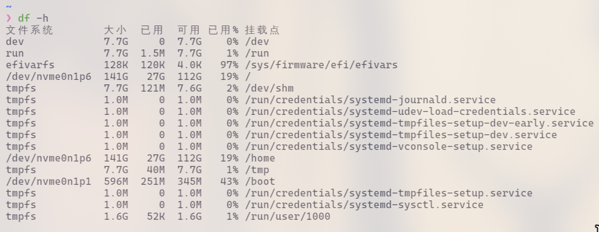
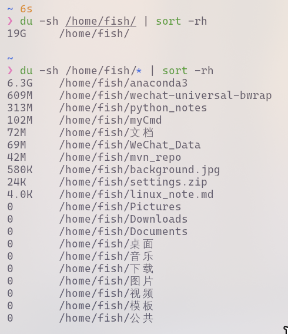
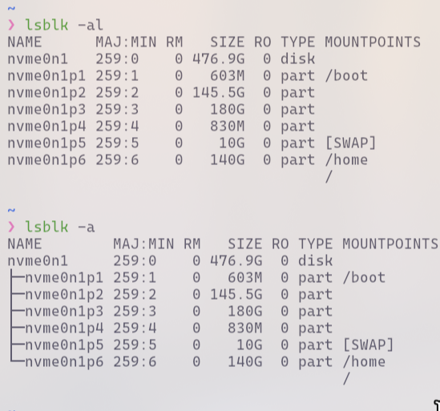

#### 入门

1. windows的win键就是Linux的super键
2. 输入法：super+空格切换输入法；shift切换语言
3. 单击tab:补全，双击tab:提示。
4. ↑ ↓：快速切换历史命令
5. `CTRL+D`:退出终端；`CTRL+L`：清屏(`clear`，命令)；`CTRL+C`：终止执行。
6. `history`:查看历史命令
7. `Ctrl + s`:暂停该终端; `Ctrl + q `:让终端继续运行
8. `exit`命令登出
9. linux执行多行命令，中间用；隔开。
10. 参考文档：
    1. [掘金](https://juejin.cn/post/6844903930166509581#heading-62)
    2. [linux命令大全](https://www.linuxcool.com/)

> Linux的启动流程可以分为几个主要阶段,每个阶段都有特定的任务和目的。以下是详细的 Linux启动流程：
>
> 1. BIOS/UEFI阶段
>
> - 电源开机:计算机接通电源后,BIOS(基本输入输出系统)或 UEFI(统一可扩展固件接口)开始运行。
> - 自检:BIOS/UEFI执行POST(电源自检),检查硬件组件是否正常。
> - 引导选择:BIOS/UEFI查找并加载引导加载程序(Boot Loader),通常从硬盘的引导扇区(MBR或GPT)中读取。
>
> 2. 引导加载程序阶段
>
> - GRUB(或其他引导加载程序):GRUB(GRand Unified Bootloader)是最常用的Linux引导加载程序。它加载并显示启动菜单,允许用户选择操作系统或内核。
> - 加载内核:GRUB读取并加载Linux内核到内存中,并传递控制权给内核。
>
> 3. 内核阶段
>
> - 内核初始化：Linux内核开始初始化,检测硬件,加载驱动程序,并进行内存管理。
> - 文件系统挂载：内核挂载根文件系统(root filesystem),通常是从初始化的磁盘分区或镜像文件中挂载。
> - 执行初始化进程：内核启动第一个用户空间进程,通常是 `init`(或在较新的系统中是`systemd`)。
>
> 4. 初始化进程阶段
>
> - init或systemd：init是传统的初始化进程,负责启动其他系统服务和进程。systemd是现代系统中较常用的初始化系统,负责服务管理和并发启动。
> - 加载系统服务：systemd或init加载并启动系统服务(如网络、登录、图形界面等),根据配置文件(如`/etc/systemd/system`或`/etc/init.d`)进行管理。
>
> 5. 用户空间初始化阶段
>
> - 运行级别或目标：根据系统的运行级别(如传统的 SysV init)或目标(在`systemd`中,如`graphical.target`),系统进入多用户模式,并启动相应的服务和应用程序。
> - 登录提示：系统启动完成后,提供登录提示,允许用户登录到系统。
>
> 6. 用户登录
>
> - 用户登录：用户通过终端、图形界面或网络远程登录系统。
> - 会话启动：用户登录后，启动用户会话，并运行用户的默认桌面环境或终端会话。

---

#### 标准输入流

##### -

1. 在shell中,`-` 通常用作特殊标识符，表示标准输入(stdin)或标准输出(stdout)的位置,具体取决于所使用的命令和上下文。

2. 使用实例：

   ```bash
   # 从标准输入读取内容并显示
   echo "Hello" | cat - 
   
   # 压缩mydir并将创建的tar文件输出到标准输出,然后通过管道传递给 ssh 连接，将其保存为backup.tar.gz
   tar -czf - mydir/ | ssh user@host 'cat > backup.tar.gz'
   
   # ssh使用
   ssh user@host "cat > remote_file" < local_file
   
   # 其他(待补)
   grep "pattern" file.txt | grep -v "exclude_pattern" -
   cat file.txt | gzip - > file.txt.gz
   ```


##### xargs

1. `xargs` 读取标准输入中的数据,并将这些数据作为参数传递给指定的命令,常用于批处理。

2. 选项：

   - `-n`：指定每次传递给命令的参数个数,如`-n 1` 表示一次只传递一个参数
   - `-d`：选项可以自定义一个定界符
   - `-t`：打印命令到标准错误输出,并执行它，这对于调试非常有用
   - `-I {}`：指定一个替代符(如 `{}`),`xargs`会用标准输入中的每个参数来替换这个符号

3. 使用实例：

   ```bash
   # 传递文件名给命令
   echo "test1.txt test2.txt" | xargs touch
   
   # 从文件中读取文件名并删除
   cat file_list.txt | xargs rm
   
   # 与find命令配合使用
   find . -name "*.log" | xargs rm
   
   
   # 依次输出
   echo "file1 file2 file3" | xargs -n 1 echo
   echo "file1;file2;file3" | xargs -d ";" -I {} echo {}
   ```

   

---


#### 帮助命令

##### man

1. 一部分基础功能的系统命令是直接内嵌在shell中的，系统加载启动之后会随着shell一起加载，常驻系统内存中。这部分命令被称为“内置（built-in）命令”；相应的其它命令被称为“外部命令”。注：`q`退出查看。

2. 使用实例：

   ```bash
   # 判断内置还是外部命令
   type [命令]				
   
   # 获得外部命令帮助信息
   man [外部命令/文件]		
   
   # 获得内置命令有关信息
   man -f [内置命令]		
   ```

3. archlinux安装man手册

   ```bash
   sudo pacman -S man 
   ```

   

##### help

`help  [内置命令]`:获得内置部分信息


##### --help

`[命令] --help`:获得外部命令帮助信息	


----


#### 文件目录操作

##### ls

1. ls 命令不仅可以查看 linux 文件夹包含的文件而且可以查看文件权限(包括目录、文件夹、文件权限)查看目录信息等等。
2. 命令格式:`ls [选项][目录名]`
3. 常用参数

- -l ：列出长数据串，包含文件的属性与权限数据等
- -a ：列出全部的文件，连同隐藏文件（开头为.的文件）一起列出来（常用）
- -d ：仅列出目录本身，而不是列出目录的文件数据
- -h ：将文件容量以较易读的方式（GB，kB等）列出来
- -R ：连同子目录的内容一起列出（递归列出），等于该目录下的所有文件都会显示出来

4. 使用实例

   ```bash
   # 列出home目录下的所有文件和目录的详细资料。
   ls -a -l /home
   ls -al /home
   
   # 列出当前目录下所有以"d"开头的文件目录详情内容。
   ls -l d*
   ```

   


##### cd

1. 最基本的命令语句，其他的命令语句要进行操作，都是建立在使用 cd 命令上的。用于切换当前目录至dirName。

2. 命令格式：`cd[目录名]`

3. 使用实例：

   ```bash
   # 回到自己的家目录（root用户：回到/root ; 其他用户：回到home下对应文件夹；可用pwd查看）
   cd ~
   cd
   
   # 回到上一次所在目录
   cd -	
   
   # 回到当前目录的上一级目录
   cd ..	
   
   # 跳转到实际物理路径，而非快捷方式路径
   cd -P	
   
   # 把上个命令的参数作为cd参数使用。
   cd !$
   ```

   


##### pwd

1. 查看"当前工作目录"的完整路径。
2. 命令格式：`pwd [选项]`
3. 常用参数：

- -P :显示实际物理路径，而非使用连接（link）路径
- -L :当目录为连接路径时，显示连接路径

4. 使用实例：

   ```bash
   pwd
   ```


##### mkdir

1. 用来创建指定的名称的目录，要求创建目录的用户在当前目录中具有写权限，并且指定的目录名不能是当前目录中已有的目录。
2. 命令格式: `mkdir [选项] 目录`
3. 常用参数

- -m, --mode=模式，设定权限<模式> (类似 chmod)，而不是 rwxrwxrwx 减 umask
- -p, --parents 可以是一个路径名称。此时若路径中的某些目录尚不存在,加上此选项后,系统将自动建立好那些尚不存在的目录,即一次可以建立多个目录;
- -v, --verbose 每次创建新目录都显示信息
- --help 显示此帮助信息并退出
- --version 输出版本信息并退出

4. 使用实例

   ```bash
   # 创建空目录(多个目录h使用空格隔开)
   mkdir test
   
   # 递归创建多个目录。
   mkdir test/test1
   
   # 创建权限为777的目录。
   mkdir -m 777 test2
   
   # 创建目录都显示信息。
   mkdir -v test4
   ```

   


##### rm

1. 删除一个目录中的一个或多个文件或目录，如果没有使用-r选项，则rm不会删除目录。如果使用 rm 来删除文件，通常仍可以将该文件恢复原状。
2. 命令格式:`rm [选项] 文件`
3. 常用参数

- -f, --force 忽略不存在的文件，从不给出提示。
- -i, --interactive 进行交互式删除
- -r, -R, --recursive 指示rm将参数中列出的全部目录和子目录均递归地删除。
- -v, --verbose 详细显示进行的步骤
- --help 显示此帮助信息并退出
- --version 输出版本信息并退出

4. 使用实例

   ```bash
   # 删除文件 test.txt,系统会提示是否删除。
   rm test.txt
   
   # 强制删除 test.txt，系统不再提示。
   rm -f test.txt
   
   # 将test子目录及目录中所有档案删除。
   rm -r test
   
   # 强制递归删除
   rm -rf test
   
   # 删除 test下所有
   rm -r ./test/*
   ```


##### rmdir

1. 该命令从一个目录中删除一个或多个子目录项，删除某目录时也必须具有对父目录的写权限。
2. 命令格式:`rmdir [选项] 目录`
3. 常用参数

- -p 递归删除目录dirname，当子目录删除后其父目录为空时，也一同被删除。如果整个路径被删除或者由于某种原因保留部分路径，则系统在标准输出上显示相应的信息。
- -v, --verbose 显示指令执行过程

4. 使用实例

   ```bash
   # 删除空目录test1，非空目录无法删除。
   rmdir test1
   
   # 当子目录被删除后使它也成为空目录的话，则顺便一并删除(test目录下仅有test2)
   rmdir -p test2 
   ```

   

   

##### mv

1. 可以用来移动文件或者将文件改名。当第二个参数类型是文件时，mv命令完成文件重命名。当第二个参数是已存在的目录名称时，源文件或目录参数可以有多个，mv命令将各参数指定的源文件均移至目标目录中。
2. 命令格式:`mv [选项] 源文件或目录 目标文件或目录`
3. 常用参数

- -b ：若需覆盖文件，则覆盖前先行备份
- -f ：force 强制的意思，如果目标文件已经存在，不会询问而直接覆盖
- -i ：若目标文件 (destination) 已经存在时，就会询问是否覆盖
- -u ：若目标文件已经存在，且 source 比较新，才会更新(update)
- -t ： --target-directory=DIRECTORY move all SOURCE arguments into DIRECTORY，即指定mv的目标目录，该选项适用于移动多个源文件到一个目录的情况，此时目标目录在前，源文件在后

4. 使用实例

   ```bash
   # 将test1.txt重命名为test2.txt。
   mv test1.txt test2.txt
   
   # 移动文件 test1.txt 到目录 test2
   mv test1.txt test2
   
   # 将文件 test1.txt、test2.txt、test3.txt 移动到目录 test3。
   mv test1.txt test2.txt test3.txt test3
   ```

   


##### cp

1. 将源文件复制至目标文件，或将多个源文件复制至目标目录。
2. 命令格式:`cp [选项] 源文件 目录 或 cp [选项] -t 目录 源文件`
3. 常用参数

- -t --target-directory 指定目标目录
- -r 复制目录及目录内所有项目
- -i --interactive 覆盖前询问（使前面的 -n 选项失效）
- -n --no-clobber 不要覆盖已存在的文件（使前面的 -i 选项失效）
- -f --force 强行复制文件或目录，不论目的文件或目录是否已经存在
- -u --update 使用这项参数之后，只会在源文件的修改时间较目的文件更新时，或是对应的目的文件并不存在，才复制文件

4. 使用实例

   ```bash
   # 复制文件test1.txt到test1目录(文件存在会提示是否覆盖,若不存在直接完成复制)
   cp test1.txt test1 	
   
   # 复制 test1整个目录到test2
   cp -a test1 test2
   
   ```

   


##### touch 

1. touch命令参数可更改文档或目录的日期时间，包括存取时间和更改时间。
2. 命令格式:`touch [选项] 文件`
3. 常用参数

- -a 或--time=atime或--time=access或--time=use  只更改存取时间
- -c 或--no-create  不建立任何文档
- -d  使用指定的日期时间，而非现在的时间
- -f  此参数将忽略不予处理，仅负责解决BSD版本touch指令的兼容性问题
- -m 或--time=mtime或--time=modify只更改变动时间
- -r  把指定文档或目录的日期时间，统统设成和参考文档或目录的日期时间相同-t 使用指定的日期时间，而非现在的时间

4. 使用实例

   ```bash
   # 创建不存在的文件test.txt
   touch test.txt
   
   # 更新test.txt的实践和test1.txt时间戳相同
   touch -r test.txt test1.txt
   ```

   


#### 文件查看

##### cat 

1. 用来显示文件内容，或者将几个文件连接起来显示，或者从标准输入读取内容并显示，它常与重定向符号配合使用。
2. 命令格式：`cat [选项] [文件]`
3. 常用参数

- -A, --show-all 等价于 -vET
- -b, --number-nonblank 对非空输出行编号
- -e 等价于 -vE
- -E, --show-ends 在每行结束处显示 $
- -n, --number 对输出的所有行编号,由1开始对所有输出的行数编号
- -s, --squeeze-blank 有连续两行以上的空白行，就代换为一行的空白行
- -t 与 -vT 等价
- -T, --show-tabs 将跳格字符显示为 ^I
- -u (被忽略)
- -v, --show-nonprinting 使用 ^ 和 M- 引用，除了 LFD 和 TAB 之外

4. 使用实例

   ```bash
   # 把test.log的文件内容加上行号后覆盖到test1.log这个文件里。
   cat -n test.log  > test1.log
   ```


##### nl 

1. 输出的文件内容自动的加上行号！其默认的结果与`cat -n`有点不太一样， nl可以将行号做比较多的显示设计，包括位数与是否自动补齐0等的功能。
2. 命令格式：`nl [选项] [文件]`
3. 常用参数

- -b ：指定行号指定的方式，主要有两种：
  - -b a ：表示不论是否为空行，也同样列出行号(类似 cat -n)
  - -b t ：如果有空行，空的那一行不要列出行号(默认值)
- -n ：列出行号表示的方法，主要有三种：
  - -n ln ：行号在萤幕的最左方显示
  - -n rn ：行号在自己栏位的最右方显示，且不加 0
  - -n rz ：行号在自己栏位的最右方显示，且加 0
- -w ：行号栏位的占用的位数

4. 使用实例

   ```bash
   # 用nl列出test.log的内容。
   nl test.log
   
   # 用nl列出test.log的内容，空本行也加上行号。
   nl -b a test.log
   ```

   

   

##### more 

1. more命令和cat的功能一样都是查看文件里的内容，但有所不同的是more可以按页来查看文件的内容，还支持直接跳转行等功能。

2. 命令格式:` more [-dlfpcsu ] [-num ] [+/ pattern] [+ linenum] [file ... ]`
3. 常用参数

- +n 从笫n行开始显示
- -n 定义屏幕大小为n行
- +/pattern 在每个档案显示前搜寻该字串（pattern），然后从该字串前两行之后开始显示
- -c 从顶部清屏，然后显示
- -d 提示“Press space to continue，’q’ to quit（按空格键继续，按q键退出）”，禁用响铃功能
- -l 忽略Ctrl+l（换页）字符
- -p 通过清除窗口而不是滚屏来对文件进行换页，与-c选项相似
- -s 把连续的多个空行显示为一行
- -u 把文件内容中的下画线去掉

4. 操作指令

- Enter：向下n行，需要定义。默认为1行
- Ctrl+F：向下滚动一屏
- 空格键：向下滚动一屏
- Ctrl+B：返回上一屏
- = ：输出当前行的行号
- ：f ：输出文件名和当前行的行号
- V ：调用vi编辑器
- !命令 ：调用Shell，并执行命令
- q ：退出more

5. 使用实例

   ```bash
   # 显示文件test.log第3行起内容。
   more +3 test.log
   
   # 从文件 test.log 查找第一个出现“day3”字符串的行，并从该处前2行开始显示输出。
   more +/day3 test.log
   
   # 设置每屏显示行数
   more -5 test.log
   ```

   


##### less 

1. less 与 more 类似，但使用 less 可以随意浏览文件，而 more 仅能向前移动，却不能向后移动，而且 less 在查看之前不会加载整个文件。
2. 命令格式: `less [参数] 文件`
3. 常用参数

- -b <缓冲区大小> 设置缓冲区的大小
- -e 当文件显示结束后，自动离开
- -f 强迫打开特殊文件，例如外围设备代号、目录和二进制文件
- -g 只标志最后搜索的关键词
- -i 忽略搜索时的大小写
- -m 显示类似more命令的百分比
- -N 显示每行的行号
- -o <文件名> 将less 输出的内容在指定文件中保存起来
- -Q 不使用警告音
- -s 显示连续空行为一行
- -S 行过长时间将超出部分舍弃
- -x <数字> 将“tab”键显示为规定的数字空格

4. 操作命令

- /字符串：向下搜索“字符串”的功能
- ?字符串：向上搜索“字符串”的功能
- n：重复前一个搜索（与 / 或 ? 有关）
- N：反向重复前一个搜索（与 / 或 ? 有关）
- b 向后翻一页
- d 向后翻半页
- h 显示帮助界面
- Q 退出less 命令
- u 向前滚动半页
- y 向前滚动一行
- 空格键 滚动一行
- 回车键 滚动一页
- [pagedown]： 向下翻动一页
- [pageup]： 向上翻动一页

5. 使用实例

   ```bash
   # 查看文件test.log。
   less test.log
   ```

   


##### head

1. head 用来显示档案的开头至标准输出中，默认head命令打印其相应文件的开头10行。
2. 命令格式:`head [参数] [文件]`
3. 常用参数

- -q 隐藏文件名
- -v 显示文件名
- -c<字节> 显示字节数
- -n<行数> 显示的行数

4. 使用实例

   ```bash
   # 显示文件test.log的前5行
   head -n 5 test.log
   
   # 显示文件test.log前20个字节
   head -c 20 test.log
   ```


##### tail

1. 显示指定文件末尾内容，不指定文件时，作为输入信息进行处理。常用查看日志文件。
2. 命令格式:`tail [必要参数] [选择参数] [文件]`
3. 常用参数

- -f 循环读取
- -q 不显示处理信息
- -v 显示详细的处理信息
- -c<数目> 显示的字节数
- -n<行数> 显示行数
- --pid=PID 与-f合用,表示在进程ID,PID死掉之后结束.
- -q, --quiet, --silent 从不输出给出文件名的首部
- -s, --sleep-interval=S 与-f合用,表示在每次反复的间隔休眠S秒

4. 使用实例

   ```bash
   # 显示文件test.log最后5行内容。
   tail -n 5 test.log
   
   # 循环查看文件内容
   tail -f test.log
   ```

   

---

#### 文件查找

##### which

1. which指令会在PATH变量指定的路径中，搜索某个系统命令的位置，并且返回第一个搜索结果。
2. 命令格式:`which 可执行文件名称`
3. 常用参数

- -n  指定文件名长度，指定的长度必须大于或等于所有文件中最长的文件名
- -p  与-n参数相同，但此处的包括了文件的路径
- -w  指定输出时栏位的宽度
- -V  显示版本信息

4. 使用实例

   ```bash
   # 查找文件、显示命令路径。
   which pwd
   
   # 查找hpyton
   which python
   ```

   


##### whereis

1. whereis命令是定位可执行文件、源代码文件、帮助文件在文件系统中的位置。
2. 命令格式：`whereis [-bmsu] [BMS 目录名 -f ] 文件名`
3. 常用参数

- -b 定位可执行文件
- -m 定位帮助文件
- -s 定位源代码文件
- -u 搜索默认路径下除可执行文件、源代码文件、帮助文件以外的其它文件
- -B 指定搜索可执行文件的路径
- -M 指定搜索帮助文件的路径
- -S 指定搜索源代码文件的路径

4. 使用实例

   ```bash
   # 将和svn文件相关的文件都查找出来。
   whereis svn
   
   # 只将二进制文件查找出来。
   whereis -b svn
   ```

5. `which`命令是查找命令是否存在，以及命令的存放位置在哪儿。`whereis`命令只能用于搜索程序名，而且只搜索二进制文件（参数-b）、man说明文件（参数-m）和源代码文件（参数-s）。如果省略参数，则返回所有信息。

   

##### locate 

1. 可以很快速的搜寻档案系统内是否有指定的档案。
2. 命令格式:`locate [选择参数] [样式]`
3. 常用参数

- -e 将排除在寻找的范围之外。
- -1 如果 是1则启动安全模式。在安全模式下，使用者不会看到权限无法看到 的档案。这会始速度减慢，因为 locate 必须至实际的档案系统中取得档案的 权限资料。
- -f 将特定的档案系统排除在外，例如我们没有到理要把 proc 档案系统中的档案 放在资料库中。
- -q 安静模式，不会显示任何错误讯息。
- -n 至多显示 n个输出。
- -r 使用正规运算式做寻找的条件。
- -o 指定资料库存的名称。
- -d 指定资料库的路径
- -b 仅匹配文件名
- -c 不输出文件名 
- -S 显示数据库的统计信息 
- -d 设置数据库所在目录
- -w 匹配完整的文件路径
- -i 忽略大小写 
- -l 限制最大查找数量 

4. 注意:<font color=red>为了保证速度，需要定期更新数据库`sudo updatedb`</font>

4. 使用实例

   ```bash
   # 查找和pwd相关的所有文件。
   locate pwd
   
   # 搜索etc目录下，所有以m开头的文件。
   locate /etc/m
   ```

   

##### find

1. 主要作用是沿着文件层次结构向下遍历，匹配符合条件的文件，并执行相应的操作。
2. 命令格式:`find [选项] [搜索路径] [表达式]`
3. 常用参数

- -print find命令将匹配的文件输出到标准输出

- -name 按照文件名查找文件

- -type 查找某一类型的文件

  | `f`  | 一个普通文件 |
  | ---- | ------------ |
  | `d`  | 目录         |
  | `l`  | 符号链接     |
  | `c`  | 字符设备     |
  | `b`  | 块设备       |
  | `p`  | FIFO         |
  | `s`  | socket 文件  |

- -nouser 匹配无所属主的文件 

- -perm 匹配文件权限

  | 权限         | 文件                         | 目录                                                         |
  | ------------ | ---------------------------- | ------------------------------------------------------------ |
  | r(4)读权限   | 是否可以查看文件内容         | 是否能够列出ls目录内容                                       |
  | w(2)写权限   | 是否可以编辑文件内容         | 是否能够创建、删除、复制、移动文档                           |
  | x(1)执行权限 | 可执行权限就是能够执行该文件 | 是否可以进入目录和获得目录下文件的列表，要对目录下存在的文件进行读取和修改,必须要能进入目录,所以必须要目录有执行权限 |

- -nogroup 匹配无所属组的文件 

- -user 匹配文件所属主 

- -newer 匹配比指定文件更新的文件 

- -group 匹配文件所属组 

- -mtime 匹配最后修改文件内容时间，单位天

- -size 匹配文件大小 

- -atime 匹配最后读取文件内容时间 ，单位天

- -prune 不搜索指定目录 

- -ctime 匹配最后修改文件属性时间 ，单位天

- -exec…… {}\; 进一步处理搜索结果

4. 使用实例

   ```bash
   # 按照名称查获找：
   find . -name "*.jpg"
   
   # 排除单个目录：
   find . -path "./background" -prune -o -name "*.jpg"
   find . -name "*.jpg" -not -path "./background"
   
   # 排除多个目录：
   find . \( -path ./background -o -path ./picture \) -prune -o -name "*.jpg"
   
   # 反向查找：
   find . -not -name "*.jpg"
   find . ! -name "*.jpg"
   
   # 查找并执行删除：
   find ./ -name "*.jpg" -exec rm {} \;
   
   
   # 打印当前目录文件目录列表。
   find . -print
   
   
   # 打印当前目录下所有权限为777的py文件。
   find . -type f -name "*.py" -perm 777
   
   ```

5. 常用正则：

   1. `[aeiou]` 匹配字符串 "google runoob taobao" 中所有的 e o u a 字母

   2. `[^aeiou]` 匹配字符串 "google runoob taobao" 中除了 e o u a 字母的所有字符。

   3. `[A-Z]` 表示一个区间，匹配所有大写字母

   4. `[a-z]` 表示所有小写字母。

   5. `[0-9]`匹配任意一个阿拉伯数字（0 到 9）。等价于 `\d`

   6. `\d`匹配字母和数字，相当于`[A-Za-z0-9_]`

   7. 特殊符号

      |      |                                                              |
      | ---- | :----------------------------------------------------------- |
      | $    | 匹配输入字符串的结尾位置,要匹配 $ 字符本身，请使用 `\$`。    |
      | ( )  | 标记一个子表达式的开始和结束位置。子表达式可以获取供以后使用。要匹配这些字符，请使用 \( 和 \)。 |
      | *    | 匹配前面的子表达式零次或多次。要匹配*字符请使用 `\*`。       |
      | +    | 匹配前面的子表达式一次或多次。要匹配+字符请使用 `\+`。       |
      | .    | 匹配除换行符 \n 之外的任何单字符。要匹配.字符请使用 `\.` 。  |
      | [    | 标记一个中括号表达式的开始。要匹配 [，请使用 \[。            |
      | ?    | 匹配前面的子表达式零次或一次，或指明一个非贪婪限定符。要匹配 ? 字符，请使用 `\?`。 |
      | \    | 将下一个字符标记为或特殊字符、或原义字符、或向后引用、或八进制转义符。例如， 'n' 匹配字符 'n'。'\n' 匹配换行符。序列 '\\' 匹配 "\"，而 '\(' 则匹配 "("。 |
      | ^    | 匹配输入字符串的开始位置，除非在方括号表达式中使用，当该符号在方括号表达式中使用时，表示不接受该方括号表达式中的字符集合。要匹配 ^ 字符本身，请使用 \^。 |
      | {    | 标记限定符表达式的开始。要匹配 {，请使用 \{。                |
      | \|   | 指明两项之间的一个选择。要匹配\|请使用`\|`                   |

   8. [菜鸟教程](https://www.runoob.com/regexp/regexp-syntax.html)


##### fzf

1. fzf 是一个非常流行的模糊搜索工具，广泛用于在文件系统中查找文件、目录、历史记录等。它可以与 zsh 、bash 等命令行工具进行集成。

2. 安装:

   ```bash
   sudo pacman -S fzf
   sudo apt install fzf
   ```

   


##### rg

1. ripgrep 是一个超快速的文件内容搜索工具，支持正则表达式，可以快速查找大文件或目录中的文本内容。

2. 安装:

   ```bash
   sudo pacman -S ripgrep
   sudo apt install ripgrep
   ```

3. 使用:

   ```bash
   # 搜索目录中的文本
   rg "search_text" .
   
   # 搜索特定类型的文件
   rg "search_text" --type js   # 搜索 JavaScript 文件
   rg "search_text" --type py   # 搜索 Python 文件
   ```

   

##### fd

1. fd 是一个简单的、快速的命令行文件查找工具,作为 find 的替代品，支持正则表达式、文件类型过滤等。

2. 安装:

   ```bash
   sudo pacman -S fd
   sudo apt install fd-find
   ```

3. 使用


##### ag

1. ag 是另一个非常快速的文件内容搜索工具，通常比 grep 和 find 快，尤其适合在大项目中查找文本。

2. 安装:

   ```bash
   sudo pacman -S the_silver_searcher
   sudo apt install silversearcher-ag
   ```

3. 使用


---

#### 文件压缩解压

##### tar

1. 用来压缩和解压文件。tar本身不具有压缩功能。他是调用压缩功能实现的。

2. 命令格式: `tar [必要参数] [选择参数] [文件]`

3. 常用参数

   1. 必要参数：

   - -A 新增压缩文件到已存在的压缩

   - -B 设置区块大小

   - -c 建立新的压缩文件

   - -d 记录文件的差别

   - -r 添加文件到已经压缩的文件

   - -u 添加改变了和现有的文件到已经存在的压缩文件

   - -x 从压缩的文件中提取文件

   - -t 显示压缩文件的内容

   - -z 支持gzip解压文件

   - -j 支持bzip2解压文件

   - -Z 支持compress解压文件

   - -v 显示操作过程

   - -l 文件系统边界设置

   - -k 保留原有文件不覆盖

   - -m 保留文件不被覆盖

   - -W 确认压缩文件的正确性

   2. 可选参数：

   - -b 设置区块数目

   - -C 切换到指定目录

   - -f 指定压缩文件

   - --help 显示帮助信息

   - --version 显示版本信息
   - --exclude 排除指定的文件不压缩 
   - --remove-files 操作完成后删除源文件

4. 使用实例

   ```bash
   # 使用gzip压缩格式对指定目录进行打包操作，显示压缩过程，压缩包规范后缀为.tar.gz
   tar -czvf test.tar.gz test.log
   
   # 用bzip2压缩格式对某个目录进行打包操作，显示压缩过程，压缩包规范后缀为.tar.bz2：
   tar -cjvf test.tar.bz2 test.log
   
   # 将当前工作目录内所有以.jpg为后缀的文件打包，不进行压缩
   tar -cvf test.tar *.jpg
   
   # 解压.tar文件到指定目录
   tar -xvf test.tar -C /home
   
   # 使用gzip压缩格式解压.tar.gz文件
   tar -xzvf test.tar.gz test.log
   
   # 使用bzip2压缩格式解压.tar.bz2文件
   tar -xjvf test.tar.gz test.log
   ```


##### xz

1. XZ Utils 是为 POSIX 平台开发具有高压缩率的工具。它使用 LZMA2 压缩算法，生成的压缩文件比 POSIX 平台传统使用的 gzip、bzip2 生成的压缩文件更小，而且解压缩速度也很快。
2. 命令格式：`xz [option] [file]`
3. 常用参数:
   - -z, --compress 强制压缩
   - -d, --decompress, --uncompress:forcedecompression
   - -t, --test 测试压缩文件的完整性
   - -l, --list 列出有关.xz文件的信息
   - -k, --keep  保留（不要删除）输入文件
   - -f, --force 强制覆盖输出文件和（解）压缩链接
   - -c, --stdout, --to-stdout 写入标准输出，不要删除输入文件
   - -0 ... -9 压缩预设,默认为6,取压缩机\*和\*,使用7-9之前解压缩内存使用量考虑在内！
   - -e, --extreme 尝试通过使用更多的CPU时间来提高压缩比,要求不影响解压缩存储器
   - -T, --threads=NUM 最多使用NUM个线程,默认值为1
   - -q, --quiet       抑制警告; 指定两次以抑制错误
   - -v, --verbose     冗长; 指定两次更详细
   - -h, --help        显示这个简洁的帮助并退出

4. 使用用例

   ```bash
   # 压缩一个文件test.txt，压缩成功后生成test.txt.xz, 原文件会被删除。
   xz test.txt
   
   # 解压test.txt.xz 文件，并使用参数-k保持原文件不被删除
   xz -d -k test.txt.xz
   
   # 解压.tar.xz文件(分开解压)
   xz -d test.tar.zx
   tar -xvf test.tar
   
   # 创建.tar.xzai文件
   tar -cvf test.tar ./*
   xz -z test.tar
   ```

   


##### gzip

1. 使用广泛的压缩程序，文件经它压缩过后，其名称后面会多出".gz"的扩展名。
2. 命令格式: `gzip [参数] [文件或者目录]`
3. 常用参数

- -a或--ascii  使用ASCII文字模式。
- -c或--stdout或--to-stdout  把压缩后的文件输出到标准输出设备，不去更动原始文件。
- -d或--decompress或----uncompress  解开压缩文件。
- -f或--force  强行压缩文件。不理会文件名称或硬连接是否存在以及该文件是否为符号连接。
- -h或--help  在线帮助。

4. 使用实例

   ```bash
   # 把test目录下的每个文件压缩成.gz文件
   gzip ./test/*
   ```


##### zip


##### rar

1. 安装:`sudo pacman -S unrar`和`yay -S rar`(不知道为啥冲突)
2. 常用参数：
   - a : 添加到压缩文件
   - r : 递归处理
   - x : 以绝对路径解压文件
3. 解压:`unrar x <file_name>.rar`
4. 附带密码解压:`unrar x -p <password> <file_name>.rar`
5. 递归压缩文件：`rar a -r test.rar <file>`


---


#### 文件权限

##### chmod 

1. 用于改变linux系统文件或目录的访问权限。
2. 命令格式:`chmod [-cfvR] [--help] [--version] mode file`

3. 常用参数

   1. 必要参数：

   - -c 当发生改变时，报告处理信息

   - -f 错误信息不输出

   - -R 处理指定目录以及其子目录下的所有文件

   - -v 运行时显示详细处理信息

   - 选择参数：

   - --reference=<目录或者文件> 设置成具有指定目录或者文件具有相同的权限

   - --version 显示版本信息

   - <权限范围>+<权限设置> 使权限范围内的目录或者文件具有指定的权限

   - <权限范围>-<权限设置> 删除权限范围的目录或者文件的指定权限

   - <权限范围>=<权限设置> 设置权限范围内的目录或者文件的权限为指定的值(删除未提到的权限)

   2. 权限范围：

   - u ：目录或者文件的当前的用户

   - g ：目录或者文件的当前的群组

   - o ：除了目录或者文件的当前用户或群组之外的用户或者群组

   - a ：所有的用户及群组

   3. 权限代号：

   - r：读权限，用数字4表示

   - w：写权限，用数字2表示

   - x：执行权限，用数字1表示

   - -：删除权限，用数字0表示

     | 权限         | 文件                         | 目录                                                         |
     | ------------ | ---------------------------- | ------------------------------------------------------------ |
     | r(4)读权限   | 是否可以查看文件内容         | 是否能够列出ls目录内容                                       |
     | w(2)写权限   | 是否可以编辑文件内容         | 是否能够创建、删除、复制、移动文档                           |
     | x(1)执行权限 | 可执行权限就是能够执行该文件 | 是否可以进入目录和获得目录下文件的列表，要对目录下存在的文件进行读取和修改,必须要能进入目录,所以必须要目录有执行权限 |

4. 使用实例

   ```bash
   # 增加文件所有用户组可执行权限
   chmod a+x test.log
   
   # 删除所有用户的可执行权限
   chmod a-x test.log
   chmod a=  test.log
   
   # 添加脚本可执行权限
   chmod u+x auto_save.sh
   ```

   


##### chgrp 

1. 可采用群组名称或群组识别码的方式改变文件或目录的所属群组。

2. 命令格式:`chgrp [选项] [组] [文件]`

3. 常用参数

   1. 必要参数:

   - -c 当发生改变时输出调试信息

   - -f 不显示错误信息

   - -R 处理指定目录以及其子目录下的所有文件

   - -v 运行时显示详细的处理信息

   - --dereference 作用于符号链接的指向，而不是符号链接本身

   - --no-dereference 作用于符号链接本身

   2. 选择参数:

   - --reference=<文件或者目录>

   - --help 显示帮助信息

   - --version 显示版本信息

4. 使用实例

   ```bash
   # 改变文件的群组所有者为wheel
   chgrp -v wheel test.log
   chgrp wheel test.log
   
   # 改变文件test1.log的群组属性，使得文件test1.log的群组属性和参考文件test.log的群组属性相同
   chgrp --reference=test.log test1.log
   
   # 将/usr/fish及其子目录下的所有文件的用户组改为wheel
   chgrp -R wheel /usr/meng
   ```

   


##### chown

1. 通过chown改变文件的拥有者和群组。

2. 命令格式:`chown [选项] [所有者] [:[组]] 文件`

3. 常用参数

   1. 必要参数:

   - -c 显示更改的部分的信息

   - -f 忽略错误信息

   - -h 修复符号链接

   - -R 处理指定目录以及其子目录下的所有文件

   - -v 显示详细的处理信息

   - -deference 作用于符号链接的指向，而不是链接文件本身

   2. 选择参数:

   - --reference=<目录或文件> 把指定的目录/文件作为参考，把操作的文件/目录设置成参考文件/目录相同拥有者和群组

   - --from=<当前用户：当前群组> 只有当前用户和群组跟指定的用户和群组相同时才进行改变

   - --help 显示帮助信息

   - --version 显示版本信息

4. 使用实例

   ```bash
   # 改变拥有者和群组
   chown fish:wheel test.log
   
   # 将目录/usr/meng及其下面的所有文件、子目录的文件主改成 fish：
   chown -R fish /usr/meng
   ```

   


---

#### 磁盘存储

#####  df 

1. 显示指定磁盘文件的可用空间。

2. 命令格式:`df [选项] [文件]`

3. 常用参数

4. 必要参数：

   - -a 全部文件系统列表

   - -h 方便阅读方式显示

   - -H 等于“-h”，但是计算式，1K=1000，而不是1K=1024

   - -i 显示inode信息

   - -k 区块为1024字节

   - -l 只显示本地文件系统

   - -m 区块为1048576字节

   - --no-sync 忽略 sync 命令

   - -P 输出格式为POSIX

   - --sync 在取得磁盘信息前，先执行sync命令

   - -T 文件系统类型

   2. 选择参数：

   - --block-size=<区块大小> 指定区块大小

   - -t<文件系统类型> 只显示选定文件系统的磁盘信息

   - -x<文件系统类型> 不显示选定文件系统的磁盘信息

   - --help 显示帮助信息

   - --version 显示版本信息

4. 使用实例

   ```bash
   # 显示指定磁盘使用情况
   df -t ext3
   
   # 查看系统磁盘
   df -h
   
   # 查看全部文件系统
   df -ah
   ```

   <br/>


##### du

1. 显示每个文件和目录的磁盘使用空间。
2. 命令格式: `du [选项] [文件]`
3. 常用参数

- -a或-all 显示目录中个别文件的大小。
- -b或-bytes 显示目录或文件大小时，以byte为单位。 -- -c或--total 除了显示个别目录或文件的大小外，同时也显示所有目录或文件的总和。
- -k或--kilobytes 以KB(1024bytes)为单位输出。
- -m或--megabytes 以MB为单位输出。
- -s或--summarize 仅显示总计，只列出最后加总的值。
- -h或--human-readable 以K，M，G为单位，提高信息的可读性。
- -x或--one-file-xystem 以一开始处理时的文件系统为准，若遇上其它不同的文件系统目录则略过。
- -L<符号链接>或--dereference<符号链接> 显示选项中所指定符号链接的源文件大小。
- -S或--separate-dirs 显示个别目录的大小时，并不含其子目录的大小。
- -X<文件>或--exclude-from=<文件> 在<文件>指定目录或文件。
- --exclude=<目录或文件> 略过指定的目录或文件。
- -D或--dereference-args 显示指定符号链接的源文件大小。
- -H或--si 与-h参数相同，但是K，M，G是以1000为换算单位。
- -l或--count-links 重复计算硬件链接的文件。

4. 使用实例

   ```bash
   # 显示指定目录或文件所占空间
   du -sh test # 目录
   du -sh test.log # 文件
   
   
   # 显示目录文件，h按照大小排列
   du -sh test/* | sort -rh
   ```

   <br/>


##### free

1. 可以显示当前系统未使用的和已使用的内存数目，还可以显示被内核使用的内存缓冲区。

2. 命令格式：`free [options]`

3. 常用参数：

   - -b 以Byte为单位显示内存使用情况
   - -k 以KB为单位显示内存使用情况
   - -m 以MB为单位显示内存使用情况
   - -g 以GB为单位显示内存使用情况
   - -h 自动调整合适的显示单位
   - -o 不显示缓冲区调节列
   - -s<间隔秒数> 持续观察内存使用状况
   - -t 显示内存总和列
   - -V 显示版本信息。

4. 使用实例

   ```bash
   # 显示内存占用
   free -h
   
   # 每10s更新一次
   free -hs 10
   ```

   

##### lsblk

1. 用于列出所有可用块设备的信息，而且还能显示他们之间的依赖关系，但是它不会列出RAM盘的信息。块设备有硬盘，闪存盘，cd-ROM等等。

2. 命令格式：

3. 常用参数：

   - -a, --all            显示所有设备。
   - -b, --bytes          以bytes方式显示设备大小。
   - -d, --nodeps         不显示 slaves 或 holders。
   - -D, --discard        print discard capabilities。
   - -e, --exclude <list> 排除设备 (default: RAM disks)。
   - -f, --fs             显示文件系统信息。
   - -h, --help           显示帮助信息。
   - -i, --ascii          use ascii characters only。
   - -m, --perms          显示权限信息。
   - -l, --list           使用列表格式显示。
   - -n, --noheadings     不显示标题。
   - -o, --output <list>  输出列。
   - -P, --pairs          使用key="value"格式显示。
   - -r, --raw            使用原始格式显示。
   - -t, --topology       显示拓扑结构信息。

4. 使用实例：

   ```bash
   # 显示所有块设备(表格形式列出)
   lsblk -al
   ```

   <br/>


---

#### 分区和挂载

##### 分区

1. 运行命令`fdisk -l`(`fdisk [选项] -l [<磁盘>...]`列出指定磁盘分区表)，查看当前硬盘的分区情况。

2. 选择一块磁盘，运行命令fdisk [disk_name]，进入fdisk交互式界面。然后进行创建(w保存)、删除分区。

3. 格式化分区：

   ```bash
   # 将分区格式化为ext4文件系统
   mkfs.ext4 /dev/xxx
   
   # 将分区格式化为XFS文件系统
   mkfs.xfs /dev/xxx
   
   # 将分区格式化为Btrfs文件系统
   mkfs.btrfs /dev/xxx。
   ```

   

4. 挂载：

   ```bash
   # 挂载设备（重启断开）
   mount [-tvfstype] [-ooptions] device  dir		
   
   # 卸载设备
   umount 设备文件名/挂载点					
   ```

   


---

#### 性能监听和优化

##### top

1. 显示当前系统正在执行的进程的相关信息，包括进程ID、内存占用率、CPU占用率等。
2. 命令格式: `top [参数]`
3. 常见参数

- -b 批处理
- -c 显示完整的治命令
- -I 忽略失效过程
- -s 保密模式
- -S 累积模式
- -i<时间> 设置间隔时间
- -u<用户名> 指定用户名
- -p<进程号> 指定进程
- -n<次数> 循环显示的次数

4. 使用实例

   ```bash
   # 显示进程信息(q退出)
   top
   
   # fish用户进程
   top | grep fish
   
   ```

   

##### vmstat(待补)

1. 用来显示虚拟内存的信息。
2. 常见参数

- -a：显示活跃和非活跃内存
- -f：显示从系统启动至今的fork数量
- -m：显示slab信息
- -n：只在开始时显示一次各字段名称
- -s：显示内存相关统计信息及多种系统活动数量
- delay：刷新时间间隔。如果不指定，只显示一条结果
- count：刷新次数。如果不指定刷新次数，但指定了刷新时间间隔，这时刷新次数为无穷
- -d：显示磁盘相关统计信息
- -p：显示指定磁盘分区统计信息
- -S：使用指定单位显示。参数有 k 、K 、m 、M ，分别代表1000、1024、1000000、1048576字节（byte）。默认单位为K（1024 bytes）

3. 使用实例

   ```bash
   # 显示活跃和非活跃内存。
   vmstat -a 5 5 # 5秒时间内进行5次采样
   ```

   

##### iostat

1. 通过iostat方便查看CPU、网卡、tty设备、磁盘、CD-ROM 等等设备的活动情况, 负载信息。
2. 命令格式:`iostat [参数] [时间] [次数]`
3. 常见参数

- -C 显示CPU使用情况
- -d 显示磁盘使用情况
- -k 以 KB 为单位显示
- -m 以 M 为单位显示
- -N 显示磁盘阵列(LVM) 信息
- -n 显示NFS 使用情况
- -p[磁盘] 显示磁盘和分区的情况
- -t 显示终端和CPU的信息
- -x 显示详细信息

4. 使用实例

   ```bash
   # 定时显示所有信息,每隔2秒刷新显示，且显示3次
   iostat 2 3 
   ```

   


##### lsof 

1. 用于查看你进程开打的文件，打开文件的进程，进程打开的端口(TCP、UDP)。

2. 命令格式:` lsof [参数] [文件]`
3. 常见参数

- -a 列出打开文件存在的进程
- -c<进程名> 列出指定进程所打开的文件
- -g 列出GID号进程详情
- -d<文件号> 列出占用该文件号的进程
- +d<目录> 列出目录下被打开的文件
- +D<目录> 递归列出目录下被打开的文件
- -n<目录> 列出使用NFS的文件
- -i<条件> 列出符合条件的进程。（4、6、协议、:端口、 @ip ）
- -p<进程号> 列出指定进程号所打开的文件
- -u 列出UID号进程详情

4. 使用实例

   ```bash
   # 查看指定端口相关的进程：
   lsof -i :<port>
   
   # 查看谁正在使用bash文件，也就是说查找某个文件相关的进程
   lsof /bin/bash
   
   # 显示所有网络连接
   lsof -i
   ```

   

---

#### 网络

##### ipconfig

1. 用来查看和配置网络设备。

2. 命令格式:` ifconfig [网络设备] [参数]`

3. 常见参数

- up 启动指定网络设备/网卡
- down 关闭指定网络设备/网卡。
- arp 设置指定网卡是否支持ARP协议
- -promisc 设置是否支持网卡的promiscuous模式，如果选择此参数，网卡将接收网络中发给它所有的数据包
- -allmulti 设置是否支持多播模式，如果选择此参数，网卡将接收网络中所有的多播数据包
- -a 显示全部接口信息
- -s 显示摘要信息（类似于 netstat -i）
- add 给指定网卡配置IPv6地址
- del 删除指定网卡的IPv6地址

4. 使用实例

   ```bash
   #处于激活状态的网络接口
   ifconfig  
   
   # 所有配置的网络接口，不论其是否激活
   ifconfig -a 
   
   #显示eth0的网卡信息
   ifconfig eth0  
   
   # 启动关闭指定网卡：
   ifconfig eth0 up
   ifconfig eth0 down
   
   # 为网卡配置和删除IPv6地址：
   ifconfig eth0 add 33ffe:3240:800:1005::2/64    #为网卡eth0配置IPv6地址
   ifconfig eth0 del 33ffe:3240:800:1005::2/64    #为网卡eth0删除IPv6地址
   
   #用ifconfig修改MAC地址：
   ifconfig eth0 hw ether 00:AA:BB:CC:dd:EE
   
   #配置IP地址：
   ifconfig eth0 192.168.2.10
   ifconfig eth0 192.168.2.10 netmask 255.255.255.0
   ifconfig eth0 192.168.2.10 netmask 255.255.255.0 broadcast 192.168.2.255
   
   # 启用和关闭arp协议：
   ifconfig eth0 arp    #开启网卡eth0 的arp协议
   ifconfig eth0 -arp   #关闭网卡eth0 的arp协议
   
   # 设置最大传输单元：
   ifconfig eth0 mtu 1500    #设置能通过的最大数据包大小为 1500 bytes
   ```

   


##### route 

1. 命令格式:`route [-f] [-p] [Command [Destination] [mask Netmask] [Gateway] [metric Metric]] [if Interface]]`

2. 常见参数

- -c 显示更多信息
- -n 不解析名字
- -v 显示详细的处理信息
- -F 显示发送信息
- -C 显示路由缓存
- -f 清除所有网关入口的路由表。
- -p 与 add 命令一起使用时使路由具有永久性。
- add:添加一条新路由。
- del:删除一条路由。
- -net:目标地址是一个网络。
- -host:目标地址是一个主机。
- netmask:当添加一个网络路由时，需要使用网络掩码。
- gw:路由数据包通过网关。注意，你指定的网关必须能够达到。
- metric：设置路由跳数。
- Command 指定您想运行的命令 (Add/Change/Delete/Print)。
- Destination 指定该路由的网络目标。

3. 使用实例

   ```bash
   # 显示当前路由
   route -n
   
   # 添加网关/设置网关：
   route add -net 224.0.0.0 netmask 240.0.0.0 dev eth0    #增加一条到达224.0.0.0的路由。
   
   # 屏蔽一条路由：
   route add -net 224.0.0.0 netmask 240.0.0.0 reject     #增加一条屏蔽的路由，目的地址为224.x.x.x将被拒绝。
   
   # 删除路由记录：
   route del -net 224.0.0.0 netmask 240.0.0.0
   route del -net 224.0.0.0 netmask 240.0.0.0 reject
   
   # 删除和添加设置默认网关：
   route del default gw 192.168.120.240
   route add default gw 192.168.120.240
   ```

   

##### ping

1. 确定网络和各外部主机的状态；跟踪和隔离硬件和软件问题；测试、评估和管理网络。

2. 命令格式:`ping [参数] [主机名或IP地址]`

3. 常见参数

- -d 使用Socket的SO_DEBUG功能
- -f 极限检测。大量且快速地送网络封包给一台机器，看它的回应
- -n 只输出数值
- -q 不显示任何传送封包的信息，只显示最后的结果
- -r 忽略普通的Routing Table，直接将数据包送到远端主机上。通常是查看本机的网络接口是否有问题
- -R 记录路由过程
- -v 详细显示指令的执行过程
- -c 数目：在发送指定数目的包后停止
- -i 秒数：设定间隔几秒送一个网络封包给一台机器，预设值是一秒送一次 -I 网络界面：使用指定的网络界面送出数据包 -l 前置载入：设置在送出要求信息之前，先行发出的数据包 -p 范本样式：设置填满数据包的范本样式 -s 字节数：指定发送的数据字节数，预设值是56，加上8字节的ICMP头，一共是64ICMP数据字节 -t 存活数值：设置存活数值TTL的大小

4. 使用实例

   ```bash
   ping 192.168.120.1
   ping www.bilibili.com
   ```


##### traceroute

1. 让你追踪网络数据包的路由途径，预设数据包大小是40Bytes，用户可另行设置。
2. 命令格式: `traceroute [参数] [主机]`
3. 常见参数

- -d 使用Socket层级的排错功能
- -f 设置第一个检测数据包的存活数值TTL的大小
- -F 设置勿离断位
- -g 设置来源路由网关，最多可设置8个
- -i 使用指定的网络界面送出数据包
- -I 使用ICMP回应取代UDP资料信息
- -m 设置检测数据包的最大存活数值TTL的大小
- -n 直接使用IP地址而非主机名称
- -p 设置UDP传输协议的通信端口
- -r 忽略普通的Routing Table，直接将数据包送到远端主机上
- -s 设置本地主机送出数据包的IP地址
- -t 设置检测数据包的TOS数值
- -v 详细显示指令的执行过程
- -w 设置等待远端主机回报的时间
- -x 开启或关闭数据包的正确性检验

4. 使用实例

   ```bash
   traceroute www.baidu.com
   ```

   

##### netstat

1. 用于显示与IP、TCP、UDP和ICMP协议相关的统计数据，一般用于检验本机各端口的网络连接情况。
2. 命令格式:`netstat [-acCeFghilMnNoprstuvVwx] [-A<网络类型>] [--ip]`

3. 常见参数

- -a或–all 显示所有连线中的Socket
- -A<网络类型>或–<网络类型> 列出该网络类型连线中的相关地址
- -c或–continuous 持续列出网络状态
- -C或–cache 显示路由器配置的快取信息
- -e或–extend 显示网络其他相关信息
- -F或–fib 显示FIB
- -g或–groups 显示多重广播功能群组组员名单
- -h或–help 在线帮助
- -i或–interfaces 显示网络界面信息表单
- -l或–listening 显示监控中的服务器的Socket
- -M或–masquerade 显示伪装的网络连线
- -n或–numeric 直接使用IP地址，而不通过域名服务器
- -N或–netlink或–symbolic 显示网络硬件外围设备的符号连接名称
- -o或–timers 显示计时器
- -p或–programs 显示正在使用Socket的程序识别码和程序名称
- -r或–route 显示Routing Table
- -s或–statistice 显示网络工作信息统计表
- -t或–tcp 显示TCP传输协议的连线状况
- -u或–udp 显示UDP传输协议的连线状况
- -v或–verbose 显示指令执行过程
- -V或–version 显示版本信息
- -w或–raw 显示RAW传输协议的连线状况
- -x或–unix 此参数的效果和指定”-A unix”参数相同
- –ip或–inet 此参数的效果和指定”-A inet”参数相同

4. 使用实例

   ```bash
   netstat -a     #列出所有端口
   netstat -at    #列出所有tcp端口
   netstat -au    #列出所有udp端口                             
   ```


---

#### 其他


##### |

`|`是Linux管道命令操作符，简称管道符。使用此管道符`|`可以将两个命令分隔开，`|`左边命令的输出就会作为`|`右边命令的输入，此命令可连续使用，第一个命令的输出会作为第二个命令的输入，第二个命令的输出又会作为第三个命令的输入，依此类推。


##### sed

1. 流文本操作

2. 命令格式:`sed [-hnV][操作][文本文件]`

3. 参数

   - `-n`：使用安静（silent）模式。在一般的`sed`用法中，所有来自`stdin`的数据一般都会被列出到屏幕上，但如果加上`-n`参数后，则只有经过`sed`选择的那些行才会被列出来。
   - `-e`：使`sed`的操作结果由屏幕输出，而不改变原有文件（默认已选该参数, 与`-i`的直接修改文件相反）。
   - `-f`：从一个文件内读取将要执行的`sed`操作，`-f filename`可以执行`filename`中写好的`sed`操作。
   - `-r`：`sed`的操作使用的是扩展型正则表达式的语法（默认是基础正则表达式语法）。`
   - `-i`：直接修改读取的文件内容，而不是由屏幕输出。

4. 操作：

   - `a`：新增，`a`的后面可以接字符，这些字符将被添加在`n1`/`n2`的下一行；
   - `c`：替换，`c`的后面可以接字符，这些字符可以替换`n1`，`n2`之间的行；
   - `d`：删除，因为是删除，所以`d`后面通常不需要接任何东西；
   - `i`：插入，`i`的后面可以接字符，这些字符将被添加在`n1`/`n2`的上一行；
   - `p`：打印，亦即将某些选择的行打印出来。通常`p`会与参数`sed -n`一起运行。
   - `s`：替换，可以直接进行替换的工作，通常这个`s`的操作可以搭配正则表达式。

5. 使用

   ```bash
   # 查看/etc/passwd文件的内容并且在每一行前面加上行号，同时将2-5行删除。
    cat -n /etc/passwd | sed '2,5d'
    
   # 向test.txt的第2行后面加2行hello和world 
    cat -n /etc/passwd | sed '2a hello \ world' # 每一行之间都必须要以反斜杠\来进行新行标记
    
    
   # 搜索testfile有oo关键字的行:
   cat -n /etc/passwd | sed -n '/oo/p'
   
   
   # 删除testfile所有包含oo的行，其他行输出
   cat -n /etc/passwd | sed  '/oo/d'
   
   
   #搜索testfile，找到oo对应的行，执行后面花括号中的一组命令，每个命令之间用分号分隔，这里把oo替换为kk，再输出这行：
   cat -n /etc/passwd | sed -n '/oo/{s/oo/kk/;p;q}'  # q是退出
   
   # sed 的查找与替换的与 vi 命令类似，语法格式如下：
   sed 's/要被取代的字串/新的字串/g'
   ```

   


##### awk(略)


##### ln

1. 为某一个文件在另外一个位置建立一个同步的链接.当我们需要在不同的目录，用到相同的文件时，我们不需要在每一个需要的目录下都放一个必须相同的文件，我们只要在某个固定的目录，放上该文件，然后在 其它的目录下用ln命令链接（link）它就可以，不必重复的占用磁盘空间。

2. 命令格式：`ln [参数] [源文件或目录] [目标文件或目录]`

3. 常用参数

   1. 必要参数:

   - -b 删除，覆盖以前建立的链接

   - -d 允许超级用户制作目录的硬链接

   - -f 强制执行

   - -i 交互模式，文件存在则提示用户是否覆盖

   - -n 把符号链接视为一般目录

   - -s 软链接(符号链接)

   - -v 显示详细的处理过程

   2. 选择参数:

   - -S “-S<字尾备份字符串> ”或 “--suffix=<字尾备份字符串>”

   - -V “-V<备份方式>”或“--version-control=<备份方式>”

4. 软链接和硬链接

   1. 索引节点：在Linux的文件系统中，保存在磁盘分区中的文件，不管是什么类型，系统都会给它分配一个编号，这个编号被称为索引节点编号（Inode Index），它是该文件或者目录在linux文件系统中的唯一标识。有了这个编号值，就可以查到该文件的详细内容。
   2. Linux系统还规定，可以允许多个文件名同时指向同一个索引节点（Inode），这就是硬链接。这样设计有一个好处就是，只要文件的索引节点还存在一个以上的链接，删除其中一个链接并不影响索引节点本身和其他的链接（也就是说该文件的实体并未删除），而只有当最后一个链接被删除后，且此时有新数据要存储到磁盘上，那么被删除的文件的数据块及目录的链接才会被释放，存储空间才会被新数据所覆盖。因此，该机制可以有效的防止误删操作。硬链接只能在同一类型的文件系统中进行链接，不能跨文件系统。同时它只能对文件进行链接，不能链接目录。
   3. 软链接：软链接（也叫符号链接），类似于windows系统中的快捷方式，与硬链接不同，软链接就是一个普通文件，只是数据块内容有点特殊，文件用户数据块中存放的内容是另一文件的路径名的指向，通过这个方式可以快速定位到软连接所指向的源文件实体。软链接常用来解决空间不足的问题，比如某个文件文件系统空间已经用完了，但是现在必须在该文件系统下创建一个新的目录并存储大量的文件，那么可以把另一个剩余空间较多的文件系统中的目录链接到该文件系统中。软链接可以跨文件系统而链接，也可以同时对文件或目录进行链接。

5. 使用实例

   ```bash
   # 为test.log文件创建软链接linktest。
   ln -s test.log  .\linktest
   
   # 为test.log创建硬链接lntest。
   ln test.log .\lntest
   ```

   


##### diff

1. 比较单个文件或者目录内容。

2. 命令格式: `diff [参数] [文件1或目录1] [文件2或目录2]`
3. 常用参数

- -c 上下文模式，显示全部内文，并标出不同之处
- -u 统一模式，以合并的方式来显示文件内容的不同
- -a 只会逐行比较文本文件
- -N 在比较目录时，若文件 A 仅出现在某个目录中，预设会显示：Only in 目录。若使用 -N 参数，则 diff 会将文件 A 与一个空白的文件比较
- -r 递归比较目录下的文件

4. 使用实例

   ```bash
   # 显示test1.txt和test2.txt两个文件差异。
   diff test1.txt test2.txt
   ```

   


##### grep

1. 一种强大的文本搜索工具，它能使用正则表达式搜索文本，并把匹 配的行打印出来。

2. 命令格式:` grep [option] pattern file`
3. 常用参数

- -c 计算找到‘搜寻字符串’（即 pattern）的次数
- -i 忽略大小写的不同，所以大小写视为相同
- -n 输出行号
- -v 反向选择，打印不匹配的行
- -r 递归搜索
- --color=auto 将找到的关键词部分加上颜色显示

4. 使用实例

   ```bash
   # 将/etc/passwd文件中出现root的行取出来，关键词部分加上颜色显示。
   grep "root" /etc/passwd --color=auto
   cat /etc/passwd | grep "root" --color=auto
   
   # 将/etc/passwd 文件中没有出现root和nologin的行取出来。
   grep -v "root" /etc/passwd | grep -v "nologin"
   ```

   

##### wc

1. 用来显示文件所包含的行、字和字节数。

2. 命令格式: `wc [选项] [文件]`
3. 常用参数

- -c 统计字节数
- -l 统计行数
- -m 统计字符数，这个标志不能与 -c 标志一起使用
- -w 统计字数，一个字被定义为由空白、跳格或换行字符分隔的字符串
- -L 打印最长行的长度

4. 使用实例

   ```bash
   # 统计文件的字节数、行数和字符数。
   wc -c test.txt
   wc -l test.txt
   wc -m test.txt
   
   # 统计文件的字节数、行数和字符数，只打印数字，不打印文件名。
   cat test.txt | wc -c
   cat test.txt | wc -l
   cat test.txt | wc -m
   ```

   

##### ps

1. 用来显示当前进程的状态。
2. 命令格式: `ps[参数]`
3. 常用参数

- a 显示所有进程
- -a 显示同一终端下的所有程序
- -A 显示所有进程
- c 显示进程的真实名称
- -N 反向选择
- -e 等于“-A”
- e 显示环境变量
- f 显示程序间的关系
- -H 显示树状结构
- r 显示当前终端的进程
- T 显示当前终端的所有程序
- u 指定用户的所有进程
- -au 显示较详细的资讯
- -aux 显示所有包含其他使用者的行程
- -C<命令> 列出指定命令的状况
- --lines<行数> 每页显示的行数
- --width<字符数> 每页显示的字符数

4. 使用实例

   ```bash
   # 显示所有进程信息。
   ps -A
   
   # 显示指定用户信息。
   ps -u root
   
   # 显示所有进程信息，连同命令行。
   ps -ef
   
   # 杀死进程
   kill -9 pid
   ```

   


##### watch

1. 可以将命令的输出结果输出到标准输出设备，多用于周期性执行命令/定时执行命令。
2. 命令格式: `watch [参数] [命令]`
3. 常用参数

- -n或--interval watch缺省每2秒运行一下程序，可以用-n或-interval来指定间隔的时间。
- -d或--differences 用-d或--differences 选项watch 会高亮显示变化的区域。 而-d=cumulative选项会把变动过的地方(不管最近的那次有没有变动)都高亮显示出来。
- -t 或-no-title 会关闭watch命令在顶部的时间间隔,命令，当前时间的输出。
- -h, --help 查看帮助文档

4. 使用实例

   ```bash
   # 每隔一秒高亮显示网络链接数的变化情况
   watch -n 1 -d netstat -ant
   
   # 每隔一秒高亮显示http链接数的变化情况
   watch -n 1 -d 'pstree|grep http'
   ```

   


#####  at 

1. 在一个指定的时间执行一个指定任务，只能执行一次。（需开启atd进程）
2. 命令格式:`at [参数] [时间]`
3. 常用参数

- -m 当指定的任务被完成之后，将给用户发送邮件，即使没有标准输出
- -l atq的别名
- -d atrm的别名
- -v 显示任务将被执行的时间
- -c 打印任务的内容到标准输出
- -V 显示版本信息
- -q<列队> 使用指定的列队
- -f<文件> 从指定文件读入任务而不是从标准输入读入
- -t<时间参数> 以时间参数的形式提交要运行的任务

4. 注意：<font color=red>需要先运行`systemctl enable atd`服务</font>

5. 使用实例

   ```bash
   # 三天后的下午5点锺执行/bin/ls：
   [root@localhost ~]# at 5pm+3 days
   at> /bin/ls
   at> <EOT>(ctrl+d即可，无需输入)
   job 7 at 2013-01-08 17:00
   
   # 明天17点钟，输出时间到指定文件内：
   [root@localhost ~]# at 17:20 tomorrow
   at> date >/root/2013.log
   at> <EOT>(ctrl+d即可，无需输入)
   job 8 at 2013-01-06 17:20
   
   # 计划任务设定后，在没有执行之前我们可以用atq命令来查看系统没有执行工作任务：
   [root@localhost ~]# atq
   8       2013-01-06 17:20 a root
   7       2013-01-08 17:00 a root
   
   # 显示已经设置的任务内容：
   [root@localhost ~]# at -c 8
   #!/bin/sh
   # atrun uid=0 gid=0
   # mail     root 0
   umask 22此处省略n个字符
   date >/root/2013.log
   
   # 删除已经设置的任务：
   [root@localhost ~]# atq
   8       2013-01-06 17:20 a root
   7       2013-01-08 17:00 a root
   
   [root@localhost ~]# atrm 7
   [root@localhost ~]# atq
   8       2013-01-06 17:20 a root
   ```

   


##### crontab

1. 在固定的间隔时间执行指定的系统指令或 shell script脚本。时间间隔的单位可以是分钟、小时、日、月、周及以上的任意组合。(需开启crond服务)

2. 命令格式
   - `crontab [-u user] file `
   - `crontab [-u user] [ -e | -l | -r ]`

3. 常用参数

- -u user：用来设定某个用户的crontab服务，例如，“-u ixdba”表示设定ixdba用户的crontab服务，此参数一般有root用户来运行。
- file：file是命令文件的名字,表示将file做为crontab的任务列表文件并载入crontab。如果在命令行中没有指定这个文件，crontab命令将接受标准输入（键盘）上键入的命令，并将它们载入crontab。
- -e：编辑某个用户的crontab文件内容。如果不指定用户，则表示编辑当前用户的crontab文件。
- -l：显示某个用户的crontab文件内容，如果不指定用户，则表示显示当前用户的crontab文件内容。
- -r：从/var/spool/cron目录中删除某个用户的crontab文件，如果不指定用户，则默认删除当前用户的crontab文件。
- -i：在删除用户的crontab文件时给确认提示。

4. 启动服务

   ```bash
   systemctl reload crond.service # 重新载入
   systemctl start crond.service 
   systemctl stop crond.service
   systemctl restart crond.service 
   
   
   # 查看crontab服务是否已设置为开机启动，执行命令：
   ntsysv
   
   # 加入开机自动启动：
   chkconfig –level 35 crond on
   ```

   

5. archlinux不存在

   1. 安装：`sudo pacman -S cronie`

   2. 启动服务：

      ```bash
      systemctl reload cronie.service # 重新载入
      systemctl start cronie.service 
      systemctl status cronie.service
      systemctl stop cronie.service
      systemctl restart cronie.service 
      
      # 开机自启动
      systemctl restart cronie.service
      ```

   3. 配置系统默认文本编辑器`vim /etc/profile`添加下述内容，并运行`source /etc/profile`使h配置文件生效

      ```bash
      EDITOR='vim'
      export EDITOR
      ```

   4. 编辑配置文件，一般在` 3`中，添加如下(使用`/bin/zsh`)：

   ```bash
   SHELL=/bin/zsh
   PATH=/sbin:/bin:/usr/sbin:/usr/bin
   MAILTO=""
   HOME=/
   ```

6. 使用说明

   1. 系统周期性所要执行的工作，比如写缓存数据到硬盘、日志清理等。在`/etc`目录下有一个crontab文件，这个就是系统任务调度的配置文件`/etc/crontab`文件包括下面几行：

      ```bash
      SHELL=/bin/bash
      PATH=/sbin:/bin:/usr/sbin:/usr/bin
      MAILTO=""
      HOME=/
      
      # run-parts
      51 * * * * root run-parts /etc/cron.hourly
      24 7 * * * root run-parts /etc/cron.daily
      22 4 * * 0 root run-parts /etc/cron.weekly
      42 4 1 * * root run-parts /etc/cron.monthly
      ```

      

   2. 前四行是用来配置`crond`任务运行的环境变量，第一行`SHELL`变量指定了系统要使用哪个`shell`，这里是`bash`，第二行`PATH`变量指定了系统执行命令的路径，第三行`MAILTO`变量指定了`crond`的任务执行信息将通过电子邮件发送给`root`用户，如果MAILTO变量的值为空，则表示不发送任务执行信息给用户，第四行的`HOME`变量指定了在执行命令或者脚本时使用的主目录。

   3. 用户定期要执行的工作，比如用户数据备份、定时邮件提醒等。用户可以使用 crontab 工具来定制自己的计划任务。所有用户定义的crontab文件都被保存在`/var/spool/cron`目录中。其文件名与用户名一致，使用者权限文件如下：

      ```bash
      /etc/cron.deny     该文件中所列用户不允许使用crontab命令
      /etc/cron.allow    该文件中所列用户允许使用crontab命令
      /var/spool/cron/   所有用户crontab文件存放的目录,以用户名命名
      ```

      

   4. `crontab`文件的含义：用户所建立的`crontab`文件中，每一行都代表一项任务，每行的每个字段代表一项设置，它的格式共分为六个字段，前五段是时间设定段，第六段是要执行的命令段，格式如下：

      ```bash
      minute   hour   day   month   week   command     顺序：分 时 日 月 周
      ```

      其中：

      - minute： 表示分钟，可以是从0到59之间的任何整数。
      - hour：表示小时，可以是从0到23之间的任何整数。
      - day：表示日期，可以是从1到31之间的任何整数。
      - month：表示月份，可以是从1到12之间的任何整数。
      - week：表示星期几，可以是从0到7之间的任何整数，这里的0或7代表星期日。
      - command：要执行的命令，可以是系统命令，也可以是自己编写的脚本文件。

      在以上各个字段中，还可以使用以下特殊字符：

      - 星号（*）：代表所有可能的值，例如month字段如果是星号，则表示在满足其它字段的制约条件后每月都执行该命令操作。
      - 逗号（,）：可以用逗号隔开的值指定一个列表范围，例如，“1,2,5,7,8,9”
      - 中杠（-）：可以用整数之间的中杠表示一个整数范围，例如“2-6”表示“2,3,4,5,6”
      - 正斜线（/）：可以用正斜线指定时间的间隔频率，例如“0-23/2”表示每两小时执行一次。同时正斜线可以和星号一起使用，例如*/10，如果用在minute字段，表示每十分钟执行一次。

   7. 实例

      运行`crontab -e`添加任务，编辑文件添加任务。<font color=red>注意脚本中`sudo`需要使用`-S`参数从标准输入读取密码。</font>

      ```bash
      SHELL=/bin/bash
      PATH=/sbin:/bin:/usr/sbin:/usr/bin
      MAILTO="xxx@gmail.com"
      HOME=/
      
      
      # 每1分钟执行一次command
      * * * * * command
      
      
      # 每小时的第3和第15分钟执行
      3,15 * * * * command
      
      
      # 每星期六的晚上11:00 pm重启smb 
      0 23 * * 6 /etc/init.d/smb restart
      
      
      # 通过日志查看执行情况
      tail -500f /var/log/cron
      
      
      # 每天8-22点的整点都运行一次自定义脚本
      0 8-22 * * * /home/fish/myCmd/notes_save.sh
      0 8-22 * * * /home/fish/myCmd/auto_clean.sh
      ```

> 1. 运行`tail -500f /var/log/cron`发现无法查看日志,archlinux没有安装`rsyslog`日志系统(CentOS6以后的系统使用的日志系统,用来管理、记录日志的程序),查阅的解决方式无效。本来打算安装一个,但是查看archlinux wiki发现:`systemd`提供了自己的日志系统,称为journal。使用systemd日志，无需额外安装日志服务(syslog),使用 [`journalctl`](https://man.archlinux.org/man/journalctl.1) 命令读取日志。ArchLinux 中,默认情况下 `/etc/systemd/journald.conf`中的`Storage=auto`,`systemd` 会将日志记录写入 `/var/log/journal`。若被删除,`systemd`不会自动创建此目录，而是将日志写入 `/run/log/journal`，重启时内容会消失。如果 `journald.conf` 中的 `Storage=persistent`,则`systemd-journald.service` 重启或系统重启时会重新创建 `/var/log/journal/`。
> 2. 查看`cronie`日志：`journalctl -u cronie`但是这个日志有点难懂,还不如编写脚本时,自己弄一个日志。
> 3. <font color=red>crontab会定期检查时间并执行任务。如果计算机在设定的时间未开机,crontab不会执行错过的任务。crontab任务只能按设定的时间间隔执行,并不会自动补偿错过的时间点。</font>


##### journalctl

1. 命令来自英文词组`journal control`的缩写,其功能是查看指定的日志信息。在RHEL7/CentOS7及以后版本的Linux系统中,systemd服务统一管理了所有服务的启动日志，带来的好处就是可以只用`journalctl`一个命令来查看全部的日志信息了。 
2. 常用参数： 

- -a 显示所有字段信息  
- -o 设置日志条目格式 
- -b 显示本次系统启动的日志信息 
- -p 依据优先级筛选 
- -c 从指定位置开始显示条目 
- -q 静默执行模式 
- -D 设置目录路径 
- -r 反选内容后再显示 
- -f 追踪日志内容 
- -u 显示指定服务的日志 
- -k 显示内核日志 
- --help 显示帮助信息 
- -m 显示所有可用日志 
- --version 显示版本信息 
- -n 设置日志条数   

3. 使用实例：

   ```bash
   # 查看cronie日志：
   journalctl -u cronie
   
   
   # 清理日志
   sudo rm -rf /var/log/journal/* 
   
   journalctl --vacuum-size=100M # 清理日志使总大小小于100M
   
   journalctl --vacuum-time=2weeks # 清理最早两周前的日志
   ```

   


##### history

在命令行中，可以使用符号`!`执行指定序号的历史命令。例如，要执行第2个历史命令，则输入`!2`。关闭终端后，历史列表将被写入历史文件`~/.bash_history`。

```bash
# 显示最近使用的5条历史命令
history 5

# 清空历史记录
history -c

# 删除制定的行
history -d <指定行号>

# 执行第 n 条历史命令
!n
```


##### echo

1. 输出指定的字符串或者变量

2. 常用参数

   - -e：启用转义字符。
   - -E: 不启用转义字符（默认）
   - -n: 结尾不换行

3. 使用

   ```bash
   # 输出字符串
   echo hello
   
   # 输出变量
   a='hello'
   echo ${a},world!
   ```

   


##### 输出重定向和追加

1. 使用说明

   1. `>`重定向(覆盖)
   2. `>!`重定向(强制覆盖)
   3. `>>`追加

2. 使用实例

   ```bash
   ls -al > list.txt
   
   ls -al >! list.txt
   
   ls -al >> list.txt
   ```

   


---


#### 时间

##### date

1. 显示或设置系统时间与日期

2. 命令格式：

   - `date [OPTION]... [+FORMAT]`
   - `date [-u|--utc|--universal] [MMDDhhmm[[CC]YY][.ss]]`

3. 常用参数

   - -d, --date=STRING          解析字符串并按照指定格式输出，字符串不能是'now'
   - --debug                    注释已解析的日期，并将有疑问的用法发送到标准错误
   - -f, --file=DATEFILE        类似于--date; 一次从DATEFILE处理一行
   - -I[FMT], --iso-8601[=FMT]  按照ISO8601格式输出，FMT可以为'date'(默认)，'hours'，'minutes'，'seconds'，'ns'。例如：2006-08-14T02:34:56-06:00 
   - -R, --rfc-email            按照RFC5322格式输出，例如: Mon, 14 Aug 2006 02:34:56 -0600 --rfc-3339=FMT             按照RFC 3339格式输出，FMT可以为'date', 'seconds','ns'中的一个，例如：2006-08-14 02:34:56-06:00 
   - -r, --reference=FILE       显示文件的上次修改时间。 
   - -s, --set=STRING           根据字符串设置系统时间。
   - -u, --utc, --universal     显示或设置世界协调时(UTC)

4. formatns参数

   ```tex
   %%   输出字符 %
   %a   星期几的缩写 (Sun..Sat)
   %A   星期的完整名称(Sunday..Saturday)。 
   %b   缩写的月份名称（例如，Jan）
   %B   完整的月份名称（例如，January）
   %c   本地日期和时间（例如，Thu Mar  3 23:05:25 2005）
   %C   世纪，和%Y类似，但是省略后两位（例如，20）
   %d   日 (01..31)
   %D   日期，等价于%m/%d/%y
   %e   一月中的一天，格式使用空格填充，等价于%_d
   %F   完整的日期；等价于 %Y-%m-%d
   %g   ISO 标准计数周的年份的最后两位数字
   %G   ISO 标准计数周的年份，通常只对%V有用
   %h   等价于 %b
   %H   小时 (00..23)
   %I   小时 (01..12)
   %j   一年中的第几天 (001..366)
   %k   小时，使用空格填充 ( 0..23); 等价于 %_H
   %l   小时, 使用空格填充 ( 1..12); 等价于 %_I
   %m   月份 (01..12)
   %M   分钟 (00..59)
   %n   新的一行，换行符
   %N   纳秒 (000000000..999999999)
   %p   用于表示当地的AM或PM，如果未知则为空白
   %P   类似 %p, 但是是小写的
   %r   本地的 12 小时制时间(例如 11:11:04 PM)
   %R   24 小时制 的小时与分钟; 等价于 %H:%M
   %s   自 1970-01-01 00:00:00 UTC 到现在的秒数
   %S   秒 (00..60)
   %t   插入水平制表符 tab
   %T   时间; 等价于 %H:%M:%S
   %u   一周中的一天 (1..7); 1 表示星期一
   %U   一年中的第几周，周日作为一周的起始 (00..53)
   %V   ISO 标准计数周，该方法将周一作为一周的起始 (01..53)
   %w   一周中的一天（0..6），0代表星期天
   %W   一年中的第几周，周一作为一周的起始（00..53）
   %x   本地的日期格式（例如，12/31/99）
   %X   本地的日期格式（例如，23:13:48）
   %y   年份后两位数字 (00..99)
   %Y   年
   %z   +hhmm 格式的数值化时区格式（例如，-0400）
   %:z  +hh:mm 格式的数值化时区格式（例如，-04:00）
   %::z  +hh:mm:ss格式的数值化时区格式（例如，-04:00:00）
   %:::z  数值化时区格式，相比上一个格式增加':'以显示必要的精度（例如，-04，+05:30）
   %Z  时区缩写 （如 EDT）
   ```

5. 使用

   ```bash
   # 格式化输出：
   date +"%Y-%m-%d"
   
   # 输出昨天日期：
   date -d "1 day ago" +"%Y-%m-%d"
   
   # 2秒后输出：
   date -d "2 second" +"%Y-%m-%d %H:%M.%S"
   
   # 设置系统时间
   date  -s  "2017-06-19 20:52:18"
   ```

   


##### cal

1. 显示日历

2. 语法：`cal [ -mjy ] [ 月份 ] [ 年份 ]`

3. 选项

   - -l 显示单月输出；
   - -3 显示临近三个月的日历；
   - -s 将星期日作为月的第一天；
   - -m 显示星期一作为一周的第一天..  (缺省为星期日.)
   - -j 显示儒略历的(Julian)日期 (以 1 为基的天数, 从 1 月 1 日开始计数) .
   - -y 显示当前年份的日历

4. 使用

   ```bash
   # 显示本月日历
   cal
   
   # 显示本年日历
   cal -y
   
   # 显示本月前后共n月日历
   cal -n
   
   # 显示某年日历
   cal <year>
   ```

   

---

#### 用户和用户组

##### useradd

1. 创建的新的系统用户

2. 命令格式:`useradd [options] <username>`

3. 常用参数

   - -c comment 指定一段注释性描述。
   - -d 目录 指定用户主目录，如果此目录不存在，则同时使用-m选项，可以创建主目录。
   - -g 用户组 指定用户所属的用户组。
   - -G 用户组，用户组 指定用户所属的附加组。
   - -s Shell文件 指定用户的登录Shell。
   - -r 　建立系统帐号。
   - -u 用户号 指定用户的用户号，如果同时有-o选项，则可以重复使用其他用户的标识号。

4. 使用

   ```bash
   useradd -G admin -g xx -s /bin/zsh -m dream
   
   useradd -r -s /bin/bash -m fish
   ```
   
   


##### userdel

1. 删除用户，通常使用`-r`参数连同主目录一起删除。
2. 常用参数：
   - -f：强制删除用户，即使用户当前已登录；
   - -r：删除用户的同时，删除与用户相关的所有文件。


##### usermod

1. 修改用户基本信息

2. 常用参数

   - -c<备注>：修改用户帐号的备注文字；
   - -d<登入目录>：修改用户登入时的目录，只是修改/etc/passwd中用户的家目录配置信息，不会自动创建新的家目录，通常和-m一起使用；
   - -m<移动用户家目录>:移动用户家目录到新的位置，不能单独使用，一般与-d一起使用。
   - -e<有效期限>：修改帐号的有效期限；
   - -f<缓冲天数>：修改在密码过期后多少天即关闭该帐号；
   - -g<群组>：修改用户所属的群组；
   - -G<群组>；修改用户所属的附加群组；
   - -l<帐号名称>：修改用户帐号名称；
   - -L：锁定用户密码，使密码无效；
   - -s<shell>：修改用户登入后所使用的shell；
   - -u<uid>：修改用户ID；
   - -U:解除密码锁定。

3. 使用实例

   ```bash
   # 将newuser添加到组staff中：
   usermod -G staff newuser
   
   # 修改newuser的用户名为newuser1：
   usermod -l newuser1 newuser
   
   # 锁定账号newuser1：
   usermod -L newuser1
   
   # 解除对newuser1的锁定：
   usermod -U newuser1
   ```

   


##### passwd

1. 用户修改密码
2. 常用参数:
   - -d：删除密码，仅有系统管理者才能使用；
   - -f：强制执行；
   - -k：设置只有在密码过期失效后，方能更新；
   - -l：锁住密码；
   - -s：列出密码的相关信息，仅有系统管理者才能使用；
   - -u：解开已上锁的帐号。
3. 使用：`passwd fish`


##### su

1. 用于切换当前用户身份到其他用户身份，变更时须输入所要变更的用户帐号与密码。

2. 命令格式：`su [option] <user>` 

3. 常用参数

   - -c<指令>或--command=<指令>：执行完指定的指令后，即恢复原来的身份；
   - -f或——fast：适用于csh与tsch，使shell不用去读取启动文件；
   - -l或——login：改变身份时，也同时变更工作目录，以及HOME,SHELL,USER,logname。此外，也会变更PATH变量；
   - -m,-p或--preserve-environment：变更身份时，不要变更环境变量；
   - -s<shell>或--shell=<shell>：指定要执行的shell；
   - --help：显示帮助；
   - --version；显示版本信息。

4. 使用

   ```bash
   # 变更帐号为test并改变工作目录至test的家目录：
   su - test
   ```

   


##### whoami

显示当前登录用户名称


##### groupadd

1. 用于创建一个新的工作组，新工作组的信息将被添加到系统文件中。
2. 语法:`groupadd [option] <group_name>`
3. 选项
   - -g：指定新建工作组的id；
     -r：创建系统工作组，系统工作组的组ID小于500；
     -K：覆盖配置文件“/etc/login.defs”；
     -o：允许添加组ID号不唯一的工作组。

4. 实例

   ```bash
   # 建立一个新组，并设置组ID加入系统：
   groupadd -g 344 jsdigname
   ```

   


##### groupdel

`groupdel <group_name>` 删除工作组


##### groupmod

1. 更改群组识别码或名称。需要更改群组的识别码或名称时，可用groupmod指令来完成这项工作。
2. 语法:`groupmod [option] <group_name>`
3. 常用参数
   - -g<群组识别码>：设置欲使用的群组识别码；
   - -o：重复使用群组识别码；
   - -n<新群组名称>：设置欲使用的群组名称。

---

#### 娱乐

1.  水族馆`sudo pacman -S asciiquarium`后运行`xasciiquarium`即可
2.  lolcat彩色渐变字体`sudo pacman -S lolcat`
3.  oneko领养小猫:`sudo pacman -S oneko`
4.  炫酷linux资源管理器：`sudo pacman -S btop`


---


#### 用户资源限制

1. 编辑 `vim /etc/security/limits.conf` 文件,添加或修改以下行：(由于docker运行tomcat容器报错引起,但未得到解决)

   ```bash
   * soft nofile 65536
   * hard nofile 65536
   * soft nproc 131072
   * hard nproc 131072
   ```

   > 1. `limits.conf` 文件用于配置用户和进程的资源限制。这些限制帮助控制系统资源的使用,以避免单个用户或进程消耗过多资源,进而影响系统的稳定性和性能。主要包括：
   >    1. 文件描述符数 (`nofile`): 控制每个进程可以打开的文件数量。
   >    2. 进程数(`nproc`): 限制每个用户可以创建的进程数量。
   >    3. 内存使用(`memlock`): 限制进程锁定的内存量。
   > 2. 设置这些限制有助于防止资源滥用，确保系统资源在多个用户和进程间公平分配，同时保护系统免受可能的故障和攻击。
   > 3. 在`/etc/security/limits.conf`文件中,`soft`和 `hard`是用于设置资源限制的两种类型：
   >    1. `soft`：这是系统在正常情况下使用的限制。用户可以在不超出`hard`限制的情况下调整 `soft` 限制。`soft` 限制的目的是提供一个灵活的、相对宽松的阈值，用户和应用程序可以在这些限制内自由操作。
   >    2. `hard` 限制：这是系统允许的绝对上限,不能被普通用户超过。`hard` 限制是用于设置一个严格的上限，系统会强制执行这些限制，以防止单个用户或进程消耗过多的资源。

2. 然后重启系统或重新登录,以使更改生效。验证新设置`ulimit -n`

   > `ulimit -n` 命令用于显示或设置当前用户可以打开的最大文件描述符数量。这是一个重要的系统限制，影响每个进程能够同时打开的文件、套接字、管道等对象的数量。如果一个进程尝试打开超过这个数量的文件，操作系统将返回错误。
   >
   > 1. 显示当前限制：`ulimit -n` 会显示当前会话中设置的最大文件描述符数量。
   > 2. 设置限制：可以用 `ulimit -n <value>` 来设置新的限制(需要合适的权限)。
   > 3. 此外`ulimit`命令还可以使用其他参数查看或设置其他限制。

3. 上述操作未生效,执行一下操作：修改 `/etc/systemd/system.conf` 文件：

   ```bash
   DefaultLimitNOFILE=65536:65536
   ```

4. 重新加载 `systemd` 并重启系统：`sudo systemctl daemon-reload`和`reboot`。


---


#### su与sudo

1. `su`切换用户
2. `sudo` 提权


---

#### systemd

##### 自定义service

1. 每一个服务在Linux有它自己的对应的配置文件，这个文件可以通过文本编辑器编辑，扩展名为`xxx.servive`(xxx为服务名称)。这些文件位于`/usr/lib/systemd/system`目录下。

2. 在这个目录下新建service文件即可创建我们的服务。文件的内容结构如下：

   ```bash
   [Unit]
   Description=服务描述
   After=(服务依赖,这些服务后启动本服务)(多个空格隔开)
   Before=(这些服务前启动本服务)(多个空格隔开)
    
   [Service]
   Type=服务类型
   ExecStart=启动命令
   ExecStop=终止命令
   ExecReload=重启命令
    
   [Install]
   WantedBy=服务安装设置
   ```

3. 可见服务配置文件分为`[Unit]`、`[Service]`和`[Install]`三大部分。

4. `[Unit]`:`After`的值一般是：`network.target network-online.target remote-fs.target nss-lookup.target`。

   ```tex
   network.target：表示网络已经准备好,但不保证网络连接完全正常。通常用于需要网络连接的服务,确保网络服务已经启动。
   
   network-online.target: 是一个更高级的目标单元,表示网络连接已经完全可用。不仅网络接口已经启动,还保证网络配置已完成并可以访问网络。
   
   remote-fs.target：表示远程文件系统已经挂载完成。用于那些需要访问远程文件系统(如 NFS、SMB)的服务。
   
   nss-lookup.target：表示Name Service Switch(NSS)解析功能已经就绪。NSS负责解析主机名、服务名等。适用于需要DNS或其他名称解析服务的服务。
   ```

   | Description   | 对当前服务的简单描述                                         |
   | ------------- | ------------------------------------------------------------ |
   | After         | 可以指定在哪些服务之后进行启动                               |
   | Before        | 可以指定在哪些服务之前进行启动                               |
   | Requires      | 可以指定服务依赖于哪些服务(这种依赖是"强依赖"，一旦所依赖的服务异常，当前的服务也随之停止) |
   | Wants         | 可以指定服务依赖于哪些服务(这种依赖是"弱依赖"，即使所依赖的服务的启动情况不影响当前的服务是否启动) |
   | Conflicts     | 定义`units`间的冲突关系                                      |
   | Documentation | 指定服务相关的文档链接。                                     |

5. `[Service]`:

   | 可选项                        | 描述                                                         |
   | ----------------------------- | ------------------------------------------------------------ |
   | EnvironmentFile               | 环境配置文件，用来指定当前服务启动的环境变量                 |
   | ExecStart                     | 指定服务启动时执行的命令或脚本(绝对路径)                     |
   | ExecStartPre                  | 指定服务启动前执行的命令或脚本(绝对路径)                     |
   | ExecStartPost                 | 指定服务启动后执行的命令或脚本(绝对路径)                     |
   | ExecStop                      | 指明停止服务要运行的命令或脚本(绝对路径)                     |
   | ExecStopPost                  | 指定服务停止之后执行的命令或脚本(绝对路径)                   |
   | RestartSec                    | 指定服务在重启时等待的时间，单位为秒                         |
   | ExecReload                    | 指明重启服务要运行的命令或脚本                               |
   | TimeoutStopSec                | 服务停止时的超时时间。如果服务在此时间内未停止，将被强制终止。 |
   | TimeoutStartSec               | 服务启动时的超时时间。如果服务在此时间内未成功启动，将视为启动失败。 |
   | TimeoutSec                    | 设置服务启动、停止和其他操作的超时时间,可以代替TimeoutStartSec和TimeoutStopSec |
   | Restart                       | 当设定Restart=1 时，则当次daemon服务意外终止后，会再次自动启动此服务，具体看下列类型 |
   | PrivateTmp                    | 设定为yes时，会在生成/tmp/systemd-private-UUID-NAME.service-XXXXX/tmp/目录 |
   | Group                         | 指定服务运行的组                                             |
   | User                          | 指定服务运行的用户                                           |
   | WorkingDirectory              | 指定服务启动时的工作目录                                     |
   | Environment                   | 设置服务的环境变量,如：Environment="VAR1=value1" "VAR2=value2" |
   | EnvironmentFile               | 从指定文件中加载环境变量                                     |
   | StandardOutput和StandardError | 设置标准输出和错误的处理方式,常见选项有： journal发送到系统日志、syslog发送到 syslog、tty发送到终端、 null丢弃输出 |
   | KillMode                      | 指定停止的方式，具体见下面                                   |
   | Restart                       | 指定重启时的类型，具体见下面                                 |
   | Type                          | 指定启动类型，具体见下面                                     |
   | PIDFile                       | 指定服务进程ID文件的位置,用于标识主进程的PID                 |

   > 关于这个 `EnvironmentFile` 需要说一下(可以参考一下 docker 代理里面的配置)，其实就相当于多个 `Environment` 配置， 关于环境配置文件:
   >
   > 1. 环境配置文件中配置 key=value 的形式存在，必要时 value 可以使用双引号`“ ”`包裹。
   > 2. 可以通过`EnvironmentFile=` 指定一个文件。文件使用`;` 和 `#` 作为行注释符号，符合 `VAR=VALUE` 的 shell 变量赋值语法，行尾的`\` 视为续行符，同样可以使用双引号处理空格等字符。
   > 3. 如果环境变量的值包含等号或空格，需要使用双引号标记，如 `Environment="VAR12=foo =bar"`。单元文件中广泛使用的替换符（`%` 连接一个字符，例如 `%H` 表示系统的 `hostname`）会被解析，因此如果传递的值含有 `%`，需要转换为 `%%`。
   > 4. `EnvironmentFile=` 接受绝对路径，在路径前加上 `-` 前缀表示忽略文件不存在的情况，读取的环境变量会覆盖 `Environment=` 以及之前的 `EnvironmentFile=` 配置中 中设置的同名变量。

   `Type`的可选值:般来说我们的程序是应用程序前台使用就用`simple`，后台/守护进程一般是`forking`。

   | Type可选项 | 描述                                                         |
   | ---------- | ------------------------------------------------------------ |
   | simple     | 指定了ExecStart设置后，simple就是默认的Type设置除非指定Type。simple使用ExecStart创建的进程作为服务的主进程，在此设置下systemd会立即启动服务。 |
   | forking    | ExecStart的脚本启动后会调用fork()函数创建一个进程作为其启动的一部分。当初始化完成，父进程会退出。子进程会继续作为主进程执行。 |
   | oneshot    | 类似simple,但是在systemd启动之前,进程就会退出,只执行一次。可能还需要设置RemainAfterExit=yes，以便systemd认为j进程退出后仍然处于激活状态。 |
   | notify     | 与simple相似的配置,该设置会在守护进程启动的时候发送推送消息。 |
   | idle       | 等其他任务结束后才运行                                       |

   `Restart`的可选值:

   | Restart可选项 | 描述                                     |
   | ------------- | ---------------------------------------- |
   | no            | 退出后不会重启                           |
   | on-success    | 当进程正常退出时(退出码为0) 执行重启     |
   | on-failure    | 当进程不正常退出时(退出码不为0) 执行重启 |
   | on-abnormal   | 当被信号终止和超时执行重启               |
   | on-abort      | 当收到没有捕捉到的信号终止时执行重启     |
   | on-watchdog   | 当看门狗超时时执行重启                   |
   | always        | 一直重启                                 |

   `KillMode`可选值

   | KillMode可选项 | 描述                                               |
   | -------------- | -------------------------------------------------- |
   | control-group  | 杀掉当前进程中所有的进程                           |
   | process        | 杀掉当前进程的主进程                               |
   | mixed          | 主进程将收到 SIGTERM 信号，子进程收到 SIGKILL 信号 |
   | none           | 不杀掉任何进程                                     |

6. `[Install]`:

   | Install可选项 | 描述                                        |
   | ------------- | ------------------------------------------- |
   | Alias         | 别名，可使用systemctl command Alias.service |
   | RequiredBy    | 被哪些`units`所依赖，强依赖                 |
   | WantedBy      | 被哪些`units`所依赖，弱依赖                 |
   | Also          | 安装本服务的时候还要安装别的相关服务        |
   | Install       | 一般填为`WantedBy=multi-user.target`        |

7. 对于新创建的`unit`文件，或者修改了的`unit`文件，要通知`systemd`重载此配置文件,而后可以选择重启,使用命令`systemctl daemon-reload`

8. 自定义脚本启动执行服务：

   ```bash
   [Unit]
   Description=My some tasks
   After=network.target network-online.target remote-fs.target nss-lookup.target
   
    
   [Service]
   Type=simple
   ExecStart=/home/fish/myCmd/tasks.sh
   User=fish
   TimeoutStartSec=60s
   Restart=no
   StandardOutput=journal
   StandardError=journal
   
   
   [Install]
   WantedBy=multi-user.target
   ```
   
   


##### timer定时器

1. 在Linux系统中,systemd提供了强大的定时器功能,可以用于定期执行任务。systemd的定时器单元(`*.timer`文件)与服务单元(`*.service`文件)结合使用,可以实现各种定时任务。

3. systemd的定时器单元`*.timer`文件用于定期触发服务单元`*.service`文件,它提供了丰富的配置选项，可以帮助你精确控制任务的执行时间和频率。以下是`systemd`定时器单元文件的所有主要配置项的详细说明：

   1. 创建一个定时器单元文件来控制服务单元的执行时间,你可以创建一个名为 `/etc/systemd/system/my-service.timer` 的文件,其格式如下：

      ```bash
      [Unit]
      Description=描述信息
      
      [Timer]
      OnBootSec=
      OnUnitActiveSec=
      OnUnitInactiveSec=
      OnCalendar=
      Persistent=
      
      [Install]
      WantedBy=
      ```

   2. `[Unit]`:Description提供定时器单元的描述信息,对管理和记录日志有帮助。

   3. `[Timer]`:

      |                    |                                                              |
      | ------------------ | ------------------------------------------------------------ |
      | OnBootSec          | 设置系统启动后的延迟时间,单位为秒s、分钟min、小时h、天d。`OnBootSec=5min`表示系统启动后5分钟触发定时器。 |
      | OnUnitActiveSec    | 设置自上次服务单元激活以来的时间间隔。指定的时间间隔到达时,定时器将触发。如`OnUnitActiveSec=1h`表示每隔1小时触发一次。 |
      | OnUnitInactiveSec  | 设置自上次服务单元非激活以来的时间间隔。类似于`OnUnitActiveSec`,但计时从服务单元不活动时开始。如`OnUnitInactiveSec=30min`表示每隔30分钟触发一次,只要服务单元处于非激活状态。 |
      | OnCalendar         | 使用日历时间格式进行触发。你可以指定特定的日期和时间、重复的时间模式等, |
      | Persistent         | 设置是否在上次触发丢失(如系统停机)后继续触发。如`Persistent=true`系统在预定触发时间内未运行,定时器将在系统启动时立即触发以弥补错过的时间。 |
      | Unit               | 配置定时单元对应触发的服务单元                               |
      | RandomizedDelaySec | 设置触发时间的随机延迟，以避免同时触发多个定时器             |

      `OnCalendar`配置:

      |                              |                                        |                                         |
      | ---------------------------- | -------------------------------------- | --------------------------------------- |
      | `YYYY-MM-DD HH:MM:SS`        | 指定具体的年月日时分秒。               | `OnCalendar=2024-08-21 10:00:00`        |
      |                              |                                        |                                         |
      | `daily`                      | 每天触发一次。                         | `OnCalendar=daily`                      |
      | `weekly`                     | 每周触发一次。                         | `OnCalendar=weekly`                     |
      | `monthly`                    | 每月触发一次。                         | `OnCalendar=monthly`                    |
      | `yearly`                     | 每年触发一次。                         | `OnCalendar=yearly`                     |
      | `hourly`                     | 每小时触发一次。                       | `OnCalendar=hourly`                     |
      | `minutely`                   | 每分钟触发一次。                       | `OnCalendar=minutely`                   |
      |                              |                                        |                                         |
      | `Mon *-12:00:00`             | 每周一中午 12 点触发。                 | `OnCalendar=Mon *-12:00:00`             |
      | `Tue *-12:00:00`             | 每周二中午 12 点触发。                 | `OnCalendar=Tue *-12:00:00`             |
      | `1 12 *-01:00:00`            | 每月 1 日中午 12 点触发。              | `OnCalendar=1 12 *-01:00:00`            |
      | `1st Wed *-12:00:00`         | 每月的第一个星期三中午 12 点触发。     | `OnCalendar=1st Wed *-12:00:00`         |
      |                              |                                        |                                         |
      | `Mon 03:00:00`               | 每周一早上 3 点触发。                  | `OnCalendar=Mon 03:00:00`               |
      | `Mon 03:00:00, Fri 05:00:00` | 每周一早上 3 点和每周五早上 5 点触发。 | `OnCalendar=Mon 03:00:00, Fri 05:00:00` |
      | `2024-08-21 10:00:00`        | 在特定的日期和时间触发。               | `OnCalendar=2024-08-21 10:00:00`        |
      | `@hourly`                    | 每小时触发一次（等同于 `hourly`）。    | `OnCalendar=@hourly`                    |
      | `@daily`                     | 每天触发一次（等同于 `daily`）。       | `OnCalendar=@daily`                     |
      | `@weekly`                    | 每周触发一次（等同于 `weekly`）。      | `OnCalendar=@weekly`                    |
      | `@monthly`                   | 每月触发一次（等同于 `monthly`）。     | `OnCalendar=@monthly`                   |
      | `@yearly`                    | 每年触发一次（等同于 `yearly`）。      | `OnCalendar=@yearly`                    |

   4. `[Install]`:

      |              |                                                              |                                |
      | ------------ | ------------------------------------------------------------ | ------------------------------ |
      | `WantedBy`   | 定义在启动时启用定时器单元的目标。通常设置为`timers.target`表示定时器单元将在`timers.target`启动时自动启用。 | `WantedBy=timers.target`       |
      | `RequiredBy` | 定义如果此定时器单元需要其他单元，则在启动时还要启动这些单元。 | `RequiredBy=multi-user.target` |
      | `Alias`      | 设置定时器单元的别名。用于简化命令行操作或使定时器更易识别。 | `Alias=my-hourly.timer`        |

   5. 每当你创建或修改 `systemd` 单元文件后，你都需要重新加载 `systemd` 配置以使更改生效：`sudo systemctl daemon-reload`

   6. 启用定时器：

      ```bash
      # 系统启动时自动启动
      sudo systemctl enable my-service.timer
      
      # 启动定时器
      sudo systemctl start my-service.timer
      
      # 检查定时器的状态，确保它正在运行并了解其下次触发的时间
      sudo systemctl list-timers
      
      # 查看特定定时器的详细状态
      sudo systemctl status my-service.timer
      
      # 查看日志
      journalctl -u my-service.service
      ```

      

   7. 假设我们希望创建一个定时器,每天触发一次(过期立即执行),同时设置一个随机延迟，以防多个定时器同时触发：

      1. 创建服务单元文件 `/etc/systemd/system/my_tasks.service`:<font color=red>不需要手动启用或启动服务单元,因为它们是由定时器单元调度的,服务单元会被定时器单元自动启动。</font>

         ```bash
         [Unit]
         Description=My some tasks
         After=network.target network-online.target remote-fs.target nss-lookup.target
         
          
         [Service]
         Type=simple
         ExecStart=/home/fish/myCmd/tasks.sh
         User=fish
         TimeoutStartSec=60s
         Restart=no
         StandardOutput=journal
         StandardError=journal
         
         
         [Install]
         WantedBy=multi-user.target
         ```
      
      2. 定时器单元文件 `/etc/systemd/system/my_tasks.timer`:
      
         ```bash
         [Unit]
         Description=Run my tasks every day
         
         [Timer]
         OnCalendar=daily
         RandomizedDelaySec=1min
         Unit=my_tasks.service
         Persistent=true
         
         [Install]
         WantedBy=timers.target
         ```
      
      3. 重新加载 `systemd` 配置以使更改生效：`sudo systemctl daemon-reload`
      
      4. 启动定时器:
      
         ```bash
         # 系统启动时自动启动
         sudo systemctl enable my_tasks.timer
         
         # 启动定时器
         sudo systemctl start my_tasks.timer
         
         # 检查定时器的状态，确保它正在运行并了解其下次触发的时间
         sudo systemctl list-timers
         
         # 查看特定定时器的详细状态
         sudo systemctl status my_tasks.timer
         
         # 查看日志
         journalctl -u my_tasks.service
         ```
      
         


##### 弹窗

1. 在ArchLinux上,以使用以下工具来显示弹窗，每个工具适用于不同的桌面环境和需求：

2. zenity: 一个常用的工具，适用于GNOME桌面环境，但也可以在其他桌面环境中使用,安装`sudo pacman -S zenity`

   ```bash
   # 信息弹窗
   zenity --info --text="这是一个信息弹窗"
   
   # 警告弹窗
   zenity --warning --text="这是一个警告弹窗"
   
   # 错误对话框
   zenity --error --text="这是一个错误对话框"
   
   # 问题确认框(返回值：0表示确定,1表示取消/否)
   zenity --question --text="你确定要继续吗？"
   
   # 输入框
   result=$(zenity --entry --text="请输入您的名字")
   echo "name is: $result"
   
   # 密码输入框
   password=$(zenity --password --title="请输入密码" --text="请输入您的密码")
   
   # 文件选择器
   file=$(zenity --file-selection --title="选择一个文件")
   echo "file is: $file"
   ```

   

3. yad: 一个功能更强大的对话框工具，适用于各种桌面环境，提供了更多的对话框类型和选项,安装`sudo pacman -S yad`

   ```bash
   # 信息弹窗
   yad --info --text="这是一个信息弹窗"
   
   # 警告弹窗
   yad --warning --text="这是一个警告弹窗"
   
   # 输入框
   result=$(yad --entry --text="请输入您的名字")
   echo "name is: $result"
   
   # 文件选择器
   file=$(yad --file-selection --title="选择一个文件")
   echo "file is: $file"
   ```

   

4. kdialog: 是KDE桌面环境中的对话框工具。如果你使用KDE Plasma桌面环境,这个工具是一个很好的选择,安装`sudo pacman -S kdialog`

   ```bash
   # 信息弹窗
   kdialog --msgbox "这是一个信息弹窗"
   
   # 警告弹窗
   kdialog --warningyesno "这是一个警告弹窗"
   
   # 输入框
   result=$(kdialog --inputbox "请输入您的名字")
   echo "name is: $result"
   
   # 文件选择器
   file=$(kdialog --getopenfilename)
   echo "file is: $file"
   ```

> 对于`Hyprland`存在一个插件`mako`,是一个为Wayland打造的轻量级的通知Daemon。尽管mako非常轻量级,但却依然有许多可以配置的地方。
>
> ```bash
>  notify-send '世事漫随流水,算来一梦浮生' -u normal
> ```


---

#### 远程

##### 文件传递

1. scp ,即 Secure Copy Protocol ，用于在本地和远程主机之间安全地复制文件或目录，基于 SSH，传输过程中数据被加密。
   1. 从本地复制到远程:`scp localfile user@remote_ip:/path/to/destination`
   2. 从远程复制到本地：`scp user@remote_ip:/path/to/remotefile /local/destination`
   3. 简单易用，适合快速文件传输。支持递归复制目录（使用 `-r` 选项）。不支持增量传输，复制时会完全传输文件。
2.  rcp ,即 Remote Copy Protocol ，用于在本地和远程主机之间复制文件，不安全，传输过程中数据未加密。
   1. 速度快，但不如 `scp` 安全，通常不推荐使用，也支持递归复制，但大多数现代系统已不再推荐使用 `rcp`，因为它被认为不安全，一般在较旧的系统中可用，现代系统多用 `scp` 或 `rsync` 代替。
3. rsync ， 用于在本地和远程主机之间高效同步文件和目录，可通过 SSH 使用，传输过程可以加密。
   1. 从本地复制到远程：`rsync -avz localfile user@remote_ip:/path/to/destination`
   2. 从远程复制到本地：`rsync -avz user@remote_ip:/path/to/remotefile /local/destination`
   3. 支持增量传输，只传输改变的部分，节省带宽和时间。支持多种选项，如压缩（`-z`）、详细输出（`-v`）、递归复制（`-r`）等。可以通过 `--delete` 选项同步时删除目标中不再存在的文件。非常适合备份和镜像文件夹。

> 1. `scp` 和 `rsync`（通过 SSH）安全，`rcp` 不安全。
> 2. `rsync` 高效，支持增量传输，`scp` 和 `rcp` 进行全量复制。
> 3. `scp` 适合快速安全的文件复制，`rsync` 适合大规模的文件同步和备份，`rcp` 已不推荐使用。


---

#### bash脚本


##### start

1. 脚本的拓展名一般为`.sh`

2. 脚本首行为`#! /bin/bash`

3. 获取hx执行权限`hmod +x ./xxx.sh`

4. 执行脚本

   - `./xxx.sh`
   - `bash xxx.sh`
   - `. xxx.sh`
   - `source xxx.sh`

5. 脚本路径前加 `. `或者`source`的运行方式，可以使脚本内容在当前shell里执行，而无需打开子shell。这也是为什么我们每次要修改完`/etc/profile`文件以后，需要`source`一下的原因。开子shell与不开子shell的区别就在于，环境变量的继承关系，如在子shell中设置的当前变量，父shell是不可见的。

6. 脚本一行执行多个命令，中间用 `; `隔开即可。

7. inux命令能够直接执行是因为其目录在PATH下；我们可以将脚本路径添加到PATH下，此时可当做命令运行:

   1. 运行下述命令：当前用户有效，且终端关闭后失效

      ```bash
      export PATH=<shell_path>:$PATH
      
      # or
      
      export PATH=$PATH:<shell_path>
      ```

      

   2. 编辑`.zshrc`(bash就是`.bashrc`),添加如下内容u后执行`source ~/.zshrc`：当前用户有效，永久有效。

      ```bash
      export PATH=<shell_path>:$PATH
      
      # or 
      
      export PATH=$PATH:<shell_path>
      ```

      

   3. 编辑`/etc/zshrc`(bash为`/etc/bashrc`)添加如下内容u后执行`source /etc/zshrc`：所有用户有效，永久有效。

      ```bash
      export PATH=<shell_path>:$PATH
      
      # or 
      
      export PATH=$PATH:<shell_path>

   4. 编辑`/etc/profile`添加如下内容u后执行`source /etc/profile`：所有用户有效，永久有效。

      ```bash
      export PATH=<shell_path>:$PATH
      
      # or 
      
      export PATH=$PATH:<shell_path>
      ```

      

   5. 编辑`/etc/environment`添加如下内容u后执行`source /etc/profile`：所有用户有效，永久有效。

      ```bash
      export PATH=<shell_path>:$PATH
      
      # or 
      
      export PATH=$PATH:<shell_path>
   
   6. 环境变量加载顺序：`/etc/environment `、`/etc/profile `、`/etc/bashrc`、`~/.profile`、`~/.bashrc`


##### 变量

1. 系统变量：

   1. 系统常用变量：`$HOME`、`$PWD`、`$SHELL`、`$USER`等
   2. 查看变量：`echo $变量名`
   3. 查看系统环境变量：`env`
   4. 查看所有变量：`set`

> `$HOME`是一个环境变量，指向当前用户的主目录。在 Linux 系统中，它通常是 `/home/用户名`。在脚本或命令中使用 `$HOME` 可以方便地引用用户的主目录。在一个 fish 用户登录，但是 root 执行的文件中 $HOME 似乎是指 root (不确定) 。

1. 自定义变量：

   1. 定义变量：`变量名=变量值`
   2. 撤销变量：`unset 变量名`
   3. 声明静态变量：`readonly 变量名=变量值`
   4. 变量提升为全局变量：`export  变量名`
   5. 变量定义规则：
      1. 变量名称可以由字母、数字和下划线组成，但是不能以数字开头，环境变量名建议大写。
      2. <font color=red>等号两侧不能有空格</font>
      3. 在bash中，变量默认类型都是字符串类型，无法直接进行数值运算。
      4. 变量的值如果有空格，需要使用双引号或单引号括起来。
      5. <font color=red>静态的变量不能unset</font>

2. 变量类型

   1. shell变量通常被视为字符串，你可以使用单引号或双引号来定义字符串。但是双引号`""`里面的变量可以被解析,无法实现转义。单引号`''`里面的变量不能被解析,可以实现转义。不使用引号，变量也会被解析。

      ```bash
      string="abcd"
      
      # 输出字符串长度
      echo ${#string[0]}
      echo ${#string}
      ```

      

   2. shell支持数组，允许你在一个变量中存储多个值。如：

      ```bash
      my_array=(1 2 3 4 5)
      
      # 输出数组元素
      echo ${my_array[1]}
      
      # 取得数组元素的个数
      length=${#my_array[@]}
      length=${#my_array[*]}
      
      # 取得数组单个元素的长度
      length=${#my_array[n]}
      
      declare -A associative_array
      associative_array["name"]="John"
      associative_array["age"]=30
      ```

      

3. 特殊变量：

   1. `$n`：脚本的参数变量，`n`为数字，`$0`代表该脚本名称，`$1-$9`代表第一到第九个参数，十以上的参数，十以上的参数需要用大括号包含，如`${10}`。
   2. `$#`：获取所有输入参数个数，常用于循环,判断参数的个数是否正确以及加强脚本的健壮性
   3. `$*`：这个变量代表命令行中所有的参数，`$*`把所有的参数看成一个整体
   4. `$@`：这个变量也代表命令行中所有的参数，不过`$@`把每个参数区分对待
   5. `$?`：最后一次执行的命令的返回状态。如果这个变量的值为0，证明上一个命令正确执行；如果这个变量的值为非0（具体是哪个数，由命令自己来决定），则证明上一个命令执行不正确了。

4. 注释：

   ```bash
   # first
   
   :'second'
   ```

5. `$*`和`$@`：`${colors[@]}`将数组中的每个元素扩展为一个单独的参数；数组元素中的空格得以保留。

   ```bash
   colors=(red yellow "dark blue")
   
   printf "+ %s\n" ${colors[*]}
   # Output:
   # + red
   # + yellow
   # + dark
   # + blue
   
   printf "+ %s\n" "${colors[@]}"
   # Output:
   # + red
   # + yellow
   # + dark blue
   ```

   ```bash
   # 数组扩充元素
   # ${colors[@]} 扩展为整个数组，并被置换到复合赋值语句中，接着，对数组colors的赋值覆盖了它原来的值。
   colors=(white "${colors[@]}" green black)
   
   # 数组删除元素
   unset colors[0]
   ```

   


##### 分支语句

```bash
if [ 条件测试 ] # 条件测试左右必须要有空格
then
	...
fi # 结束符


if [ 条件测试 ]; then
	...
fi  


if [ 条件测试 ]
then
	...
else
	...
fi


if [ 条件测试1 ]
then
 ....
elif [ 条件测试2 ]
then
	...
else
	...
fi  
```

```bash
case 值 in
模式1)
    command1
    command2
    ...
    commandN
    ;;
模式2)
    command1
    command2
    ...
    commandN
    ;;
*)
	default_command
	;;
esac
```


##### 循环语句

支持使用`break`和`continue`。

```bash
while [ 条件测试 ]
do
	...
done # 结束  


until [ 条件测试 ] # 条件测试为假会执行do，条件测试为真是结束循环
do
	...
done # 结束


for 变量 in '值1' '值2' '值3' '值4'
do
	...
done  
```


##### 函数

`Shell` 的函数可以返回一个状态，也用的是 `return` 关键字

```bash
#!/bin/bash

print_something(){
    echo "Hello $1" # 接收参数
    local a='haha' # 局部变量
    return 1
}

print_something Lion

echo "函数的返回值是 $?" # $? 获取到的是上一个函数的返回值
```

可以用函数来实现命令的重载，也就是说把函数的名字取成与我们通常在命令行用的命令相同的名字，重载需要用到 `command` 关键字。

```bash
#!/bin/bash

ls (){
    command ls -lh
}

ls
```


##### 条件测试

1. `$((运算式))`或`$[运算式]`是执行语句。

   ```bash
   time=$(date "+%Y-%m/%d %H:%M:%S")
   
   a=6
   b=6
   ans=$(a + b)
   ```

   

2. `[表达式]`前后要用空格。

3. 注意：条件非空即为true，[atguigu]返回true，[]返回false

4. 比较符号前后要用空格的原因：紧挨着linux会认为是一个非空整体，直接返回0（true）

5. 表示多个条件可以用`&&`或者`||`，例如`[  ]&&[  ]`。如果要写在一个括号里，则要用`-a`（and）和`-o`（or），例如`[  -o    -a    ]`

6. 三元运算符：`[  表达式  ] &&  命令1  ||  命令2`

7. `test [表达式]`  test 命令用于检查某个条件是否成立,test命令中列出的条件成立，test命令就会退出并返回退出状态码0。

8. 测试字符串：

- `$string1 = $string2` 表示两个字符串是否相等。
- `$string1 != $string2` 表示两个字符串是否不相等。
- `-z $string` 表示字符串 `string` 是否为空。
- `-n $string` 表示字符串 `string` 是否不为空。

8.  测试数字：

- `$num1 -eq $num2` `equal` 的缩写，表示两个数字是否相等。
- `$num1 -ne $num2` `not equal` 的缩写，表示两个数字是否不相等。
- `$num1 -lt $num2` `lower than` 的缩写，表示 `num1` 是否小于 `num2` 。
- `$num1 -le $num2` `lower or equal` 的缩写，表示 `num1` 是否小于或等于 `num2` 。
- `$num1 -gt $num2` `greater than` 的缩写，表示 `num1` 是否大于 `num2` 。
- `$num1 -ge $num2` `greate or equal` 的缩写，表示 `num1` 是否大于或等于 `num2` 。

9.  测试文件：

- `-e $file` exist的缩写，表示文件是否存在。
- `-d $file` directory的缩写，表示文件是否为一个目录。
- `-f $file` file的缩写，表示文件是否是一个文件。
- `-L $file` Link的缩写，表示链接。
- `-r $file` readable缩写，表示文件是否可读。
- `-w $file` writable缩写，表示文件是否可写。
- `-x $file` executable的缩写，表示文件是否可执行。
- `$file1 -nt $file2` 表示文件file1是否比file2更新。
- `$file1 -ot $file2` 表示文件file1是否比file2更旧。

10. 同时测试多个条件：

- `&&` 表示逻辑与，只要有一个不为真，整个条件测试为假。
- `||` 表示逻辑或，只要有一个为真，整个条件测试就为真。
- `!` 表示反转测试条件。

11. 判断变量为空

    ```bash
    para=  
    
    
    if [ ! -n "$para" ]; then  
      echo "IS NULL"  
    else  
      echo "NOT NULL"  
    fi    
    
    
    if [ ! $para ]; then  
      echo "IS NULL"  
    else  
      echo "NOT NULL"  
    fi    
    
    
    if test -z "$para"  
    then  
      echo "IS NULL"  
    else    
      echo "NOT NULL" 
    fi 
    
    if [ "$para" = "" ]  
    then  
      echo "IS NULL"  
    else    
      echo "NOT NULL" 
    fi   
    ```

    


##### 常用命令

1. `shift` 命令来挪移变量值。

   ```bash
   # shift.sh
   #!/bin/bash
   echo "第一个参数是 $1"
   shift
   echo "第一个参数是 $1"
   
   # 控制台
   ./shift.sh p1 p2 p3
   第一个参数是 p1
   第一个参数是 p2
   ```

   

2. 脚本引用：`.`或者`source`引用其他脚本文件

   ```bash
   #!/bin/bash
   
   #使用 . 号来引用test1.sh 文件
   . ./test1.sh
   
   # or 
   
   source ./test1.sh
   ```

   

3. `read` 命令读取到的文本会立即被存储在一个变量里。

   1. `-p `参数，提示词。
   2. `-n` 参数可以限制用户输入的字符串的最大长度（字符数）
   3. `-t` 参数可以限定用户的输入时间（单位：秒）超过这个时间，就不读取输入。
   4. `-s` 参数可以隐藏输入内容，在用户输入密码时使用。

   ```bash
   read oneName towName
   echo "hello $oneName $towName !"
   
   read -p "请输入您的姓名：" name
   echo "hello $name !"
   
   read -p "请输入密码：" -s password
   ```


##### 运行py脚本

1. shell调用pyton：

   ```bash
   # 运行python文件并传递参数
   python main.py $params
   
   # 运行python命令并获取返回值
   res=`python -c 'import math; math.floor(2.33)'`  
   # or
   res=$(python -c 'import math; math.floor(2.33)')  
   
   ```

2. python调用shell：

   ```python
   import os
   res = os.system('sh main.sh')
   ```

   


##### 变量作用域

1. Shell 变量的作用域可以分为三种：
   1. 有的变量可以在当前Shell会话中使用,这叫做全局变量(global variable):就是指变量在当前的整个Shell会话中都有效。每个Shell会话都有自己的作用域,彼此之间互不影响。在Shell中定义的变量，默认就是全局变量。
   2. 有的变量只能在函数内部使用,这叫做局部变量(local variable):在Shell函数中定义的变量默认也是全局变量，它和在函数外部定义变量拥有一样的效果。
   3. 而有的变量还可以在其它Shell中使用,这叫做环境变量(environment variable):环境变量被创建时所处的Shell被称为父Shell，如果在父 Shell中再创建一个Shell，则该Shell被称作子Shell。当子Shell产生时，它会继承父Shell的环境变量为自己所用，所以说环境变量可从父 Shell传给子Shell。注意，环境变量只能向下传递而不能向上传递，即"传子不传父"
2. 在编写脚本时,我曾为多个脚本创建`readonly`全局变量,但是这些脚本同时运行就产生一些错误。故而尽可能少用`readonly`定义同名变量,避免出错。若出错,可能导致同名变量无法使用,重新登录。


##### 自定义脚本

>1. 使用`chmod +x xxxx.sh`为脚本添加可执行权限。
>2. 可将脚本添加到环境中,使其方便执行。

判断文件、文件所在目录是否存在,不存在则创建：

```bash
#!/bin/bash

# 定义文件路径
log_file="./cache/log/my_shell.log"

# 获取文件所在的目录
dir=$(dirname "${log_file}")  

# 检查目录是否存在
if [ ! -d "$dir" ]; then
    echo "${dir} not exist,creating..."
    mkdir -p "$dir"  # 创建目录，包括必要的父目录
fi

# 检查文件是否存在
if [ ! -f "$log_file" ]; then
    echo "${log_file} not exist,creating..."
    touch "$log_file"  # 创建文件
fi
```


git上传脚本

```bash
#! /bin/bash

log_file=~/work_hub/cmd/log/auto_save.log
dir=$(dirname "${log_file}")

if [ ! -e "$dir" ]; then
  echo "${dir} not exist,creating..."
  mkdir -p "$dir"
fi

if [ ! -e "$log_file" ]; then
  echo "${log_file} not exist,creating..."
  touch "$log_file"
fi

time=$(date "+%Y-%m/%d %H:%M:%S")
echo "${time} auto_save executed" >>$log_file

cd /home/fish/ || exit
cd ./work_hub/my_notes/ || exit
git add .
git commit -m "archlinux auto save"
git push my_notes main
```


每日一言脚本：

```python
import requests

def get_one_word():
    # 获取每日一句
    res = requests.get("https://api.xygeng.cn/openapi/one")

    # 解析json数据
    data = res.json()
    content = data['data']['content']
    origin = data['data']['origin']
    print(f'{content}---{origin}')
```

```bash
#! /bin/bash

cd 
cd ./myCmd/word
python -c 'import one_word;one_word.get_one_word()'
```


archlinux系统清理脚本：为了使用自动运行,<font color=red>脚本中`sudo`需要使用`-S`参数从标准输入读取密码。</font>

```bash
#! /bin/bash

log_file=~/work_hub/cmd/log/auto_clean.log
dir=$(dirname "${log_file}")
# passwd="******"(使用明文,不安全,改为弹窗获取密码)
passwd=$(zenity --password --title="password" --text="请输入您的密码")
time=$(date "+%Y-%m/%d %H:%M:%S")

# 文件创建
if [ ! -d "$dir" ]; then
  echo "${time} ${dir} not exist,creating..." >>$log_file
  mkdir -p "$dir"
fi
if [ ! -f "$log_file" ]; then
  echo "${time} ${log_file} not exist,creating..." >>$log_file
  touch "$log_file"
fi

# 更新
# echo 'y' | (echo $passwd | sudo -S pacman -Syu)
echo "$passwd" | sudo -S pacman -Syu --noconfirm

# 更新日志
update_status=$?
if [ $update_status -eq 0 ]; then
  echo "${time} auto_clean has update system successfully" >>$log_file
else
  echo "${time} auto_clean update system failed" >>$log_file
fi

# 获取删除列表并判空
list=$(echo "$passwd" | sudo -S pacman -Qtdq)
echo -e "\n" # 换行
if [ -n "$list" ]; then
  echo "pacman -Qtdq is not null,cleaning..." >>$log_file
  # echo 'y' | sudo pacman -Rns "$list"
  sudo pacman -Rns "$list" --noconfirm
else
  echo "pacman -Qtdq is null..." >>$log_file
fi
echo -e "\n" # 换行

#sudo pacman -Rns $(pacman -Qtdq)
sudo pacman -Sc --noconfirm
sudo pacman -Scc --noconfirm

clean_status=$?

if [ $clean_status -eq 0 ]; then
  echo "auto_clean has clean system successfully" >>$log_file
else
  echo "auto_clean clean system failed" >>$log_file
fi

paccache -r

rm -rf ~/.cache/yay
rm -rf ~/.cache/paru
```

> 对于`pacman`命令自动同意的方式有一下两种：
>
> ```bash
> # 使用参数
> sudo pacman -Syu --noconfirm
> 
> 
> # 自动确认所有提示
> echo 'y' | sudo pacman -Syu
> ```


设置随机欢迎用语,然后配置到环境中。

```bash
#!/bin/bash

# 定义包含长字符串的数组
motto=(
    "世事漫随流水,算来一梦浮生。"
    "人们相互蔑视，又相互奉承，人们各自希望自己高于别人，又各自匍匐在别人面前。"
    "昨日种种,皆成今我;今日种种,皆成新我。"
    "种一棵树最好的时间是在十年前,其次是现在。"
)

# 获取数组长度
len=${#motto[@]}

# 计算随机数，范围是从 0 到 len-1
randnum=$(( RANDOM % len ))

# 打印随机选择的数组元素
notify-send "${motto[$randnum]}" -u normal
```


##### sudo读取密码

在脚本中使用`sudo`,有时无法手动输入密码,此时需要使用`—S`参数从标准输入流读取

```bash
# (1)
echo "password" | sudo -S ls

# (2)
sudo -s ls << EOF 
password
EOF

# (3)
cat password.txt | sudo -S ls
```

此外还有一种方式,直接设置当前用户执行`sudo`无需密码,但是不推荐：在终端中，运行[`visudo`](https://cloud.tencent.com/developer/tools/blog-entry?target=http%3A%2F%2Fmanpages.ubuntu.com%2Fmanpages%2Ftrusty%2Fen%2Fman8%2Fvisudo.8.html&source=ask&objectId=117009913)命令来编辑`sudoers`文件(位于`/etc/sudoers`),添加如下内容：

```bash
username ALL = NOPASSWD : ALL
```


#### path路径

1. 可以通过`echo $PATH`在终端中运行以下命令来查看当前的PATH列表。
2. 常见path路径：
   1. `/usr/local/bin/`:用于本地用户安装的软件包、脚本的目录。通常在编译和安装程序时(如手动编译`make install`),可执行文件会被安装到这个目录。
   2. `/usr/bin/`:大多数标准命令和二进制文件的存储位置。系统的许多用户级别命令,如 `grep`、`ls`、`vim`等都在这个目录。
   3. `/bin/`:存放一些基本的、最常用的系统命令,如 `cat`、`cp`、`mv` 等,与 `/usr/bin/`类似，但主要用于系统启动过程中所需的命令。
   4. `/sbin/`:存放系统管理员使用的命令,通常是与系统管理、维护相关的工具,比如 `ifconfig`、`reboot` 等,普通用户通常不会直接调用这些命令。
   5. `/usr/sbin/`:存放系统管理员相关的二进制文件,类似于`/sbin/`，但这里的程序主要与系统管理和维护有关,普通用户不会直接使用这些命令。
   6. `/usr/local/sbin/`:类似于`/usr/local/bin/`,但它是专门存放系统管理员使用的本地安装命令。
   7. `/home/username/.local/bin/`:用户可以在自己的主目录下安装一些程序和脚本,而不需要使用超级用户权限。许多现代工具会将用户级别的二进制文件放在这个目录下。
   8. `/opt/`:通常用来存储一些第三方的应用程序。它不总是出现在默认的`$PATH`中，但如果你安装了某些软件，可以将其可执行文件手动链接到`$PATH`中的其他目录。
3. 在Shell配置文件(如`.bashrc`或`.zshrc`)中添加`export PATH=$PATH:/your/custom/path`,从而添加自己的路径到PATH。之后运行`source ~/.bashrc`或`source ~/.zshrc`使更改生效。
