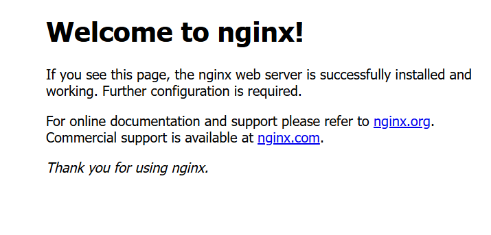

##### 简介

1. Nginx是一个 轻量级/高性能的反向代理Web服务器，它是由C语言写的，所以速度非常快、性能非常优秀。它的主要功能就是反向代理、负载均衡、配置SSL证书、防盗链、解决跨域问题、缓存、限流、动静资源分离等等。
2. 由俄罗斯的程序设计师Igor Sysoev所开发。


##### 版本介绍

1. [Nginx 开源版](https://nginx.org/)：适合一般的 Web 服务器和反向代理需求，功能强大且免费。
2. [Nginx Plus 商业版](https://www.nginx.com)：提供额外的企业级功能和支持，如负载均衡、监控和故障恢复等，适合需要高级功能的企业用户。
3. [OpenResty](https://openresty.org/cn/)：基于 Nginx 的一个完整的 Web 应用服务器，支持 Lua 脚本，可以扩展 Nginx 的功能，适合需要高度定制化的场景。
4. [Tengine](https://tengine.taobao.org/)：由淘宝团队维护的一个 Nginx 分支，添加了一些额外的功能和性能优化，主要用于高流量网站。


##### 安装

1. 先从开源版本开始学习:[下载](https://nginx.org/en/download.html)。

2. 我们通过源码编译并安装 nginx (其他一些安装参数参考[官方文档](https://nginx.org/en/docs/configure.html)):

   ```bash
   # 复制下载链接,使用wget下载
   wget https://nginx.org/download/nginx-1.26.2.tar.gz
   
   # 解压
   tar -zxvf nginx-1.26.2.tar.gz
   
   # 进入文件目录
   cd ./nginx-1.26.2
   
   # 准备编译环境并生成Makefile文件
   # 安装参数:--prefix=/usr/local/nginx 指定安装位置
   ./configure --prefix=/usr/local/nginx
   
   # 编译源代码
   make
   
   # 将编译后的文件安装到指定的目录。
   make install
   ```

3. 实际上在上述准备编译环境的过程中，会报一些错误，我们需要根据错误提示安装一些依赖库:

   1. `./configure: error: C compiler cc is not found`需要安装 gcc 。
   2. `./configure: error: the HTTP gzip module requires the zlib library`需要安装 zlib 库。
   3. `./configure: error: the HTTP rewrite module requires the PCRE library` 需要安装 pcre 库。

4. 后续需要通过`/usr/local/webserver/nginx/sbin/nginx`去启停 nginx,很麻烦。我们直接为其创建一个软连接到 `/usr/bin/` 下，后续就可以直接使用:

   ```bash
   # 创建链接
   ln -s /usr/local/nginx/sbin/nginx /usr/bin/
   
   # 测试: 查看 nginx 版本
   nginx -v
   ```

5. nginx 的启停命令:(<font color=red>需要在超级用户权限下执行</font>)

   1. `nginx`: 启动
   2. `nginx -s stop`: 快速停止。
   3. `nginx -s quit`: 优雅关闭，在退出前完成已经接受的连接请求。
   4. `nginx -s reload`: 重新加载配置。
   5. `nginx -c filename`: 以指定的配置文件启动 Nginx 。

   > `nginx: [error\] open() “/usr/local/nginx/logs/nginx.pid“ failed (2: No such file or directory)` 的解决措施:
   >
   > 1. 编辑配置文件: `vim /usr/local/nginx/conf/nginx.conf`,取消 `pid      logs/nginx.pid;` 的注释:
   > 2. 使用指定的配置文件启动 Nginx:`sudo /usr/local/nginx/sbin/nginx -c /usr/local/nginx/conf/nginx.conf`。

6. 查看 nginx 进程: `ps -ef | grep nginx`(杀死进程`sudo kill -9 <PID>`)

7. 配置防火墙:

   1. firewalld:

      ```bash
      # 关闭防火墙
      systemctl stop firewalld.service
      
      # 禁止防火墙开机启动
      systemctl disable firewalld.service
      
      # 放行 nginx 端口
      firewall-cmd --zone=public --add-port=80/tcp --permanent
      firewall-cmd --zone=public --add-port=443/tcp --permanent
      
      # 重启防火墙
      firewall-cmd --reload
      ```

   2. ufw:

      ```bash
      # 启用 ufw
      sudo ufw enable
      
      # 放行 Nginx 端口（HTTP 和 HTTPS）：
      sudo ufw allow 80/tcp
      sudo ufw allow 443/tcp
      
      # 查看状态和规则
      sudo ufw status
      ```

   3. 其他: 略

8. 浏览器访问:[http://localhost/](http://localhost/)<br>

9. 安装为服务,设置开机自启:

   1. 创建服务脚本 `vi /usr/lib/systemd/system/nginx.service`:

      ```bash
      [Unit]
      Description=nginx - web server
      After=network.target remote-fs.target nss-lookup.target
      [Service]
      Type=forking
      PIDFile=/usr/local/nginx/logs/nginx.pid
      ExecStartPre=/usr/local/nginx/sbin/nginx -t -c /usr/local/nginx/conf/nginx.conf
      ExecStart=/usr/local/nginx/sbin/nginx -c /usr/local/nginx/conf/nginx.conf
      ExecReload=/usr/local/nginx/sbin/nginx -s reload
      ExecStop=/usr/local/nginx/sbin/nginx -s stop
      # ExecQuit=/usr/local/nginx/sbin/nginx -s quit
      ExecKill=/usr/local/nginx/sbin/nginx -s quit  # 优雅停止
      PrivateTmp=true
      [Install]
      WantedBy=multi-user.target
      ```

      > 目前systemed 不在支持 `ExecQuit=/usr/local/nginx/sbin/nginx -s quit` 写法，尝试改为 `ExecKill=/usr/local/nginx/sbin/nginx -s quit`

   2. 重新加载系统服务: `sudo systemctl daemon-reload`。

   3. nginx 服务命令:

      ```bash
      # 启动
      sudo systemctl start nginx.service
      
      # 关闭
      sudo systemctl stop nginx.service
      
      # 开启自启
      sudo systemctl enable nginx.service
      
      # 开机自启并立即启动nginx
      sudo systemctl enable --now nginx.service
      
      # 关闭开机自启
      sudo systemctl disable nginx.service
      
      # 状态
      sudo systemctl status nginx.service
      ```

      ```bash
      # 重新加载
      sudo systemctl reload nginx.service
      
      # 优雅退出
      # sudo systemctl quit nginx.service(不在支持)
      sudo systemctl kill nginx.service
      ```

      > 1. 如果提供的名称唯一且可以明确指向某个服务，`systemctl` 会自动推断后缀。如 `sudo systemctl start nginx` ,这里的 `nginx` 已经可以唯一识别出 `nginx.service`。
      > 2. 其他类型的单位( `socket`、`timer` 等)也可以省略后缀。如果你只要启动一个定时器，可以使用 `sudo systemctl start mytimer` 而不必写成 `mytimer.timer`。
      > 3. 但如果存在同名的不同类型单位，建议使用完整的单位名称以避免混淆。在大多数情况下，省略后缀可以提高命令的简洁性和可读性。

10. 在启动 nginx 服务后，我们运行 `journalctl -xeu nginx.service` 查看与nginx 相关 systemd 日志的命令，防止服务文件配置有误。

    1. `journalctl`: 用于访问 systemd 日志的命令行工具。
    2. `-x`: 显示额外的上下文信息，帮助更好地理解日志条目的内容。
    3. `-e`: 跳转到日志的最后一页，可以快速查看最新的日志条目。
    4. `-u nginx.service`: 指定只查看与 `nginx.service` 相关的日志。


##### 端口号占用

1. 查看端口号是否被占用: `sudo netstat -tuln | grep :80`

   ```bash
   $ sudo netstat -tuln | grep :80
   tcp        0      0 0.0.0.0:80              0.0.0.0:*               LISTEN
   tcp6       0      0 :::80                   :::*                    LISTEN
   ```

2. 查看是谁占用: `sudo lsof -i :80`(`sudo pacman -S lsof`)

   ```bash
   $ sudo lsof -i :80
   COMMAND   PID USER FD   TYPE DEVICE SIZE/OFF NODE NAME
   docker-pr 839 root 4u  IPv4  22321      0t0  TCP *:http (LISTEN)
   docker-pr 873 root 4u  IPv6  23260      0t0  TCP *:http (LISTEN)
   ```

3. 运行 `sudo kill <pid>` 优雅退出或者使用 `sudo kill -9 <pid>` 杀死进程。我这里知道是 docker 容器，我直接把容器停掉就行。

