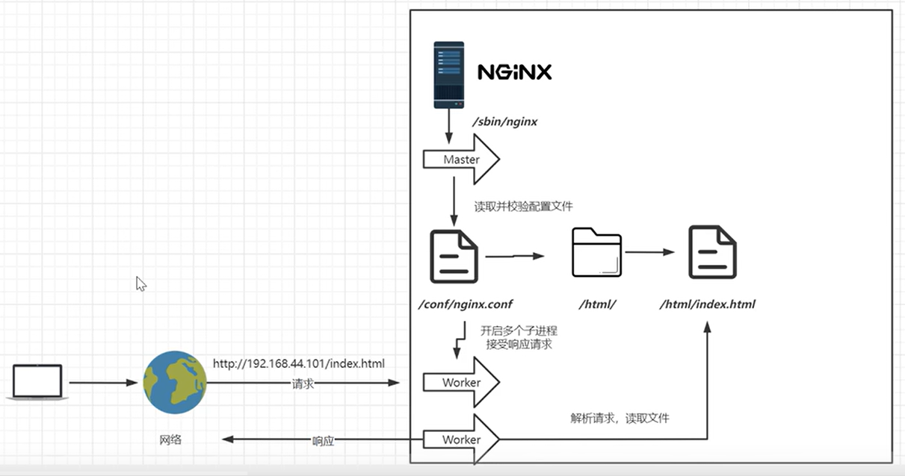
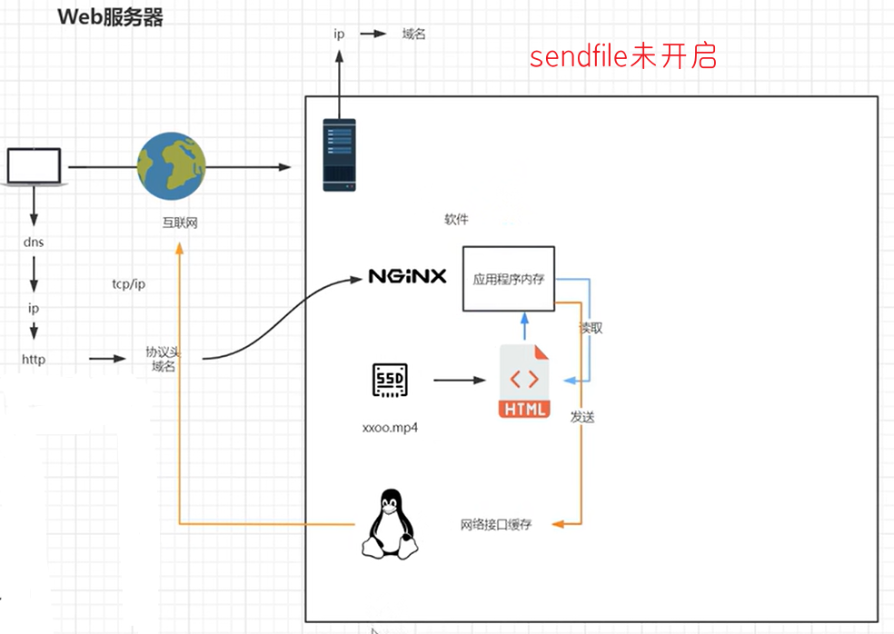

##### 目录结构

1. 使用 `tree /usr/local/nginx` 查看一下项目的文件结构,其对应功能解释如下:

   ```bash
   /usr/local/nginx 
   ├── conf  # 配置文件目录
   │   │	  # 第一大类: cgi 相关配置
   │   ├── fastcgi.conf              # fastcgi 配置文件
   │   ├── fastcgi.conf.default      # fastcgi.conf 的备份文件
   │   ├── fastcgi_params            # fastcgi 参数配置文件
   │   ├── fastcgi_params.default    # fastcgi_params 的备份文件
   │   ├── scgi_params               # scgi 参数配置文件
   │   ├── scgi_params.default       # scgi_params 的备份文件
   │   ├── uwsgi_params              # uwsgi 参数配置文件
   │   ├── uwsgi_params.default      # uwsgi_params 的备份文件
   │   │	  # 第二大类: 编码转换相关配置
   │   ├── koi-utf                   # koi8 编码的 UTF-8 转换配置
   │   ├── koi-win                   # koi8 编码的 Windows 编码转换配置
   │   ├── win-utf                   # windows 编码的 UTF-8 转换配置
   │   │     # 第三大类: 核心配置文件
   │   ├── mime.types                # mime 类型配置文件
   │   ├── mime.types.default        # mime.types 的备份文件
   │   ├── nginx.conf                # nginx 主配置文件
   │   └── nginx.conf.default        # nginx.conf 的备份文件
   ├── html  # 默认站点的静态文件目录
   │   ├── 50x.html                  # 500 错误页面
   │   └── index.html                # 默认首页
   ├── logs  # 日志文件目录
   │   ├── access.log                # 访问日志文件
   │   ├── error.log                 # 错误日志文件
   │   └── nginx.pid                 # nginx 进程 id 文件
   └── sbin  # nginx 可执行文件目录
       └── nginx                     # nginx 可执行文件
   ```

2. 实际上使用上述命令看到的文件树并不是上述所示，在 nginx 运行后还会产生一些 `*_temp`临时目录存放临时文件。

   ```bash
   client_body_temp 	fastcgi_temp 	proxy_temp 	scgi_temp 		uwsgi_temp
   ```


##### 基本运行原理

1. Nginx 的进程模型采用经典的 Master-Worker 模型，主要包括一个 master 进程和多个 worker 进程。
2. Master 进程
   1. 管理功能: 负责管理 worker 进程，包括接收和处理来自外界的信号。并且监控 worker 进程的运行状态，并在 worker 进程异常退出时自动重启新的 worker 进程。
   2. 配置管理: 读取并验证配置文件，在重启或重新加载配置时，平滑过渡到新配置。
3. Worker 进程
   1. 并发处理: 每个 worker 进程独立处理多个并发连接，采用事件驱动模型(如 epoll 或 kqueue)。进程之间没有共享内存，确保高并发情况下的稳定性和安全性。
   2. 请求处理: 一个请求只可能在一个 worker 进程中处理，worker 进程之间互不干扰。
4. 关于 worker 进程数量设置: 通常将 worker 进程数设置为与 CPU 核数一致(例如：`worker_processes auto;`)，以最大化利用系统资源。此外可以使用 `worker_connections` 指令可以进一步控制每个 worker 进程所能处理的最大连接数。
5. 信号处理: Master 进程能够响应外部信号，例如使用 `SIGUSR1` 进行日志轮换，方便运维人员的管理和维护。
6. 负载均衡: 多个 worker 进程可以有效地平衡负载，提高整体的处理能力和响应速度。<br>


##### nginx.conf解读

1. nginx.conf 是 nginx 的一个核心配置文件,其总体归纳为三个主要模块：全局块、events 块和 http 块。

   1. 全局块: 主要配置影响 Nginx 全局的指令，例如:设置运行 Nginx 服务器的用户组、指定 Nginx 进程 PID 文件的存放路径、定义日志存放路径、引入其他配置文件、配置 worker 进程的数量等。

   2. events 块: 主要配置影响 Nginx 服务器或与用户的网络连接，例如: 设置每个进程的最大连接数、选择事件驱动模型(如 epoll)来处理连接请求、配置是否允许同时接受多个网络连接，开启多个网络连接序列化等。

   3. http 块: 可以嵌套多个 server，配置代理、缓存、日志定义等,例如: 文件引入、MIME 类型定义、日志自定义、配置是否使用 sendfile 传输文件、连接超时时间、单连接请求数等。

   4. server 块: 配置虚拟主机的相关参数,每个 http 块中可以有多个 server 块，定义不同的虚拟主机。

   5. location 块: 配置请求的路由及页面的处理情况, 指定如何处理特定 URI 的请求。

      ```bash
      # 区局块
      
      # events块
      events {
      }
      
      #http块
      http {
      
      	# server块
          server {
          
          	# location块
              location [...] {
              }
          }
      }
      ```

2. 对于 nginx.conf，存在一个默认的备份文件，即 nginx.conf.default 。

3. 为方便研究，我们暂且去掉 nginx.conf 其中注释，研究其最小配置版本。

   ```bash
   worker_processes  1;  # 设置 Nginx 启动的工作进程数量，这里设置为 1 个。
   
   pid        logs/nginx.pid;  # 指定 Nginx 主进程的 PID 文件存放路径。
   
   events {
   	# 每个工作进程允许的最大连接数，这里设置为 1024。
       worker_connections  1024;  
   }
   
   http {
   	# 引入 MIME 类型配置文件， 即文件扩展名与文件类型映射表
       include       mime.types;  
        # 默认文件类型，未匹配 MIME 类型时使用此类型，默认使用二进制流的方式传输
       default_type  application/octet-stream; 
   	# 启用高效文件传输，允许使用 sendfile 系统调用。
       sendfile        on;  
   	# 客户端保持连接的超时时间，单位为秒。
       keepalive_timeout  65;  
   	#虚拟主机的配置
       server {
       	# 监听 HTTP 端口 80。
           listen       80;  
           # 服务器或者ip，可以有多个，用空格隔开
           server_name  localhost;  
   		# 配置根目录以及默认页面
           location / {
           	# 设置根目录，静态文件的存放位置。
               root   html; 
               # 默认首页文件，当请求目录时使用。
               index  index.html index.htm;  
           }
   		 # 定义错误页面，当发生500~504错误时返回 50x.html。
           error_page   500 502 503 504  /50x.html; 
           # 配置/50x.html 的处理规则
           location = /50x.html {
               root   html;  # 指定 50x.html 错误页面的存放位置。
           }
       }
   }
   
   ```

   > 1. 通过 listen 和 server_name 形成的集合体，需要有唯一性。
   > 2. 在 localhost 中的 root 用于设置当前路径匹配规则的根目录，当其为相对路径，是相对于nginx 的安装目录，即 `/usr/local/nginx/`,当然这里也可以填写绝对路径。

4. `include`代表导入一个配置文件，不仅可以导入 types 类型的文件，也可以导入conf 文件，例如将 server 虚拟主机配置封装为一个单独的配置文件导入。

   1. 例如在主配置文件中，你可以这样使用 `include`：

      ```bash
      http {
          include /etc/nginx/mime.types;  # 导入 mime 类型文件
          include /etc/nginx/conf.d/*.conf;  # 导入所有的 .conf 文件
      }
      ```

   2. 当然，假设有一个虚拟主机配置文件 `example.conf`：

      ```bash
      server {
          listen 80;
          server_name example.com;
          root /var/www/example;
      
          location / {
              try_files $uri $uri/ =404;
          }
      }
      ```

   3. 就可以在主配置文件中引入这个虚拟主机配置文件：

      ```bash
      http {
          include /etc/nginx/mime.types;  # 导入 mime 类型文件
          include  /etc/nginx/sites-enabled/example.conf;  # 导入单独的虚拟主机配置
          # ...(other configuration)
      }
      ```

5. mime.types 文件:

   1. 用于定义 MIME 类型(媒体类型)，它告诉服务器如何处理不同类型的文件。
   2. 在 HTTP 协议中，MIME 类型用于指示文件的内容类型，以便浏览器或客户端知道如何处理接收到的文件。例如，当服务器发送一个 .html 文件时，它会设置相应的 MIME 类型为 text/html，浏览器就会将其作为网页进行渲染。类似地，对于图像文件（如 .jpg、.png），MIME 类型分别为 image/jpeg 和 image/png。
   3. 在 Nginx 的配置中，`include mime.types;` 语句会将该文件的内容引入到 Nginx 配置中，使得 Nginx 在处理请求时能够根据文件扩展名自动识别并设置正确的 MIME 类型。这样有助于确保文件能够被正确地传输和处理。

6. 默认类型 `application/octet-stream` 就是以数据留的形式传输，浏览器得知后会自动开始下载。对于 mime.types 不存在的映射，除了使用默认类型，也可以尝试在 mime.types 添加自己的映射。

7. 关于 sendfile :

   1. 指定 nginx 是否调用 sendfile 函数使用零拷贝(Zero Copy)来输出文件。
   2. 传统的文件传输通常需要将文件从内核空间读到用户空间，然后再将其发送到网络，这涉及到多个内存拷贝。使用 sendfile，数据直接从内核空间发送到网络套接字，减少了内存拷贝，提高了效率。
   3. 在正常情况下，建议将其设置为 on，以获得最佳性能。但在一些特定情况下，例如处理大量并发连接时，也可以考虑将其设置为 off 以平衡系统资源的使用。<br><br>


##### 虚拟主机

1. 虚拟主机是将一台物理服务器划分成多个“虚拟”服务器的技术，使得一台服务器能够同时承载多个网站或应用。这种技术广泛应用于 Web 服务器，尤其是 Nginx 和 Apache 等。

2. 虚拟主机主要有三种类型

   1. 基于域名的虚拟主机: 通过域名来区分不同的网站。所有的网站共享同一个 IP 地址，服务器根据请求中的域名来决定将请求转发给哪个网站。

      ```bash
      server {
          listen 80;
          server_name dreamfish.com;
          root /var/www/web1;
      }
      
      server {
          listen 80;
          server_name dreamfish.cn;
          root /var/www/web2;
      }
      ```

   2. 基于 IP 的虚拟主机: 主机配置多个ip，每个网站(虚拟主机)逻辑上分配一个独立的 IP 地址，服务器根据 ip 来决定将请求转发给哪个网站。

      ```bash
      server {
          listen 80;
          server_name 192.168.40.10;
          root /var/www/web1;
      }
      
      server {
          listen 80;
          server_name 192.168.40.11;
          root /var/www/web2;
      }
      ```

   3. 基于端口的虚拟主机：通过不同的端口号来区分虚拟主机，每个虚拟主机监听特定的端口，例如 HTTP 通常使用 80 端口，而 HTTPS 使用 443 端口，用户可以通过指定端口来访问不同的服务。

      ```bash
      server {
          listen 80;
          server_name 192.168.40.10;
          root /var/www/web1;
      }
      
      server {
          listen 443;
          server_name 192.168.40.10;
          root /var/www/web2;
      }
      ```

      


##### 域名解析

[dns解析和域名解析](../base/DNS解析和域名解析.md)


##### hosts文件

1. hosts 是一个没有扩展名的系统文件，其基本作用就是将一些常用的网址域名与其对应的 IP 地址建立一个关联数据库。

2. <font color=red>当用户在浏览器中输入一个需要登录的网址时，系统会首先自动从 hosts 文件中寻找对应的 IP 地址，一旦找到，系统就会立即打开对应网页，如果没有找到，则系统会将网址提交 DNS 域名解析服务器进行 IP 地址的解析。</font>

3. hosts 文件的作用:

   1. 加快域名解析: 对于经常访问的网站，我们可以通过在 hosts 文件中配置域名和 IP 的映射关系，提高域名的解析速度。由于有了映射关系，当我们输入域名后，计算机就能够快速解析出 IP 地址，而不用请求网络上的 DNS 服务器。
   2. 构建映射关系: 在很多单位中，都会有自己局域网，而且还会有不同的服务器提供给公司的成员使用。但由于局域网中一般很少架设 DNS 服务器，因此在访问这些服务器时，就需要输入难记的 IP 地址，这对大家来说相当麻烦。因此，我们可以分别给这些服务器取个容易记住的名字，然后在 hosts 文件中建立 IP 映射。
   3. 屏蔽垃圾网站: 现在有很多网站，在不经过我们同意的时候，就将各种各样的插件安装到我们的计算机中，其中不乏病毒和木马。对于这些网站，我们就可以利用 hosts 文件把这些网站的域名映射到一个错误的 IP 或本地计算机的 IP 地址上，这样就可以达到禁止访问的目的了。

4. 修改 hosts 文件的方式:

   1. windows: hosts 文件存在于`C:\Windows\System32\drivers\etc`目录，可以先将hosts文件复制到桌面，进行修改后复制回去，再替换掉原本的 hosts (当然右键给当前用户添加编辑权限，修改后在撤销授权，稍显麻烦)。
   2. linux: `sudo vim /etc/hosts`即可 (顺便复习一下 `/ext/hostname` 中保存主机名)。

5.  hosts 文件的格式：

   1. 使用 `#`作为注释。

   2. 在 `hosts` 文件中，你可以为一个 IP 地址指定多个主机名，只需在同一行中用空格分隔它们。

      ```bash
      192.168.66.66		dreamfish.cc blog.dreamfish.cc
      192.168.99.99		dreamsea.top
      ```

      


##### 三个技术架构

1. 多用户二级域名: 允许多个用户使用二级域名，例如 `user1.example.com` 和 `user2.example.com`。每个用户可以有自己的子域名，通过 DNS 记录进行配置。通常会使用 wildcard DNS 记录或动态 DNS 服务来支持自动分配。
2. 短网址: 将长网址转换为短网址，通常用于社交媒体或需要分享的链接。短网址服务通常包含一个 URL 映射数据库，用户请求短网址时，后端会查找并重定向到原始长网址。可以使用数据库管理短链接的生成和访问统计。
3. httpdns: 一种通过 HTTP 协议进行 DNS 查询的方式，可以绕过传统的 DNS 解析过程，增强了 DNS 查询的安全性和可控性。使用 HTTP DNS 可以避免 DNS 污染，并在某些网络环境中提供更好的解析速度。
