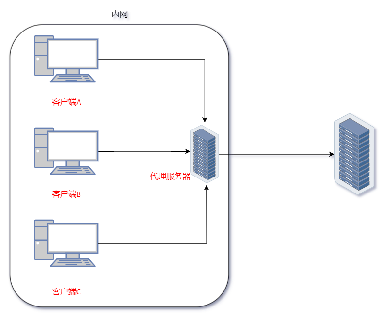
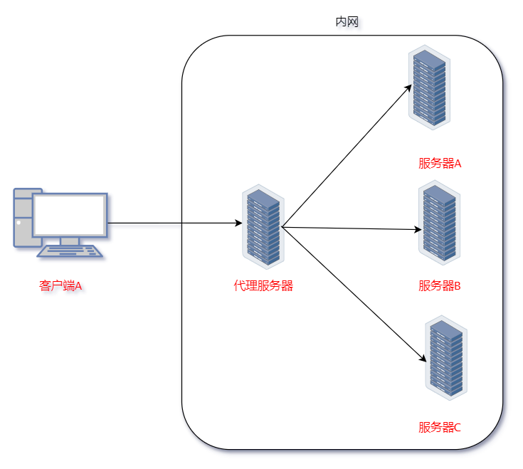

#### 虚拟主机配置

##### 常用配置

1. nginx 中使用 serve 配置虚拟主机:
   1. listen ：指定 Nginx 监听的端口。
   2. server_name ：指定虚拟主机的域名，可以用空格分隔多个域名。
   3. root ：定义网站的根目录 (也可以在 location  配置) 。
   4. index ：指定默认的首页文件 (也可以在 location  配置) 。
   5. location ：用于定义请求的匹配规则和处理方式 (重点) 。
   6. try_files ：尝试查找文件，如果找不到则返回404错误 (也可以在 location  配置) 。
   7. error_page ：自定义错误页面 (也可以在 location  配置) 。
2. listen 和 server_name 形成的集合体，需要有唯一性，不然就会出问题。


##### server_name 匹配

1. server_name 可以配置多个，中间以空格=分割即可。

2. 对于 server_name ,存在多种匹配规则：

   1. 完全匹配: 如果请求的主机名完全与 server_name 中的某个条目匹配，Nginx 将选择该 server 块处理请求。
   2. 通配符匹配: 可以使用 `*`通配符进行匹配
      1.  在前面使用 `*`(如 `*.example.com` )表示匹配该域名下的所有子域名。
      2. 在后面使用 `*`(如 `example.*` )表示匹配所有后缀的 example 域名。
   3. 正则表达式匹配: 使用 `~` 符号来定义正则表达式。例如，`server_name ~^www\.(.*)$;` 可以匹配以 `www.` 开头的任意域名。

3.  server_name 的多种匹配规则存在一个匹配优先级:

   1. 完全匹配(最高优先级): 完全匹配的 server_name 将优先被选中。

   2. 通配符匹配：

      1. 以 `*` 开头的通配符(如 `*.example.com` )的优先级高于以 `*` 结尾的通配符(如 `example.*` )。
      2. 当有多个通配符匹配时，按照它们的声明顺序来决定优先级。

   3. 正则表达式匹配(最低优先级)：

      1. 在上述匹配未命中但是正则匹配命中时，正则表达式匹配的 server 块将被选中。
      2. 在正则匹配选中的前提下，当存在多个正则表达式匹配时，Nginx 会根据定义的顺序选择第一个匹配的 server 块。

   4. 若是都不匹配:

      1. 优先选择 `listen` 配置项后有 `default` 或 `default_server` 的 `server` 块(即兜底配置)。

      2. 不存在兜底配置，按照配置文件中的定义顺序匹配，匹配到的第一个符合 listen 端口的 `server` 块即生效。

         > 所以，大部分情况下可以放一个通用的 server 块在所有 server 块的最上边来处理无任何匹配的请求，如返回 404 。

4. 关于 default server 配置：

   1. nginx 配置中没有 server_name 则会自动设置成 server_name ""，它不会匹配任何域名，导致 nginx 会优先将请求交给其它 server 处理。如果其它 server 不处理，则还是交给该 server 处理。

      ```bash
      server {
          listen 80;
          # 隐式的 default_server
          location / {
              return 404;  # 返回404错误
          }
      }
      ```

      ```bash
       server {
              listen 80 default_server;  
              # 显式声明为默认服务器
              server_name _; 
      
              location / {
                  return 404;  # 返回404错误
              }
      }
      ```

   2. server_name "" | server_name _ | server_name $ | server_name @ : [参考](https://nestealin.com/49c24897/#toc-heading-2)

5. 不妨具体测试一下:


---


#### 反向代理

##### 反向代理与正向代理

1. 网关(Gateway): 网关是一个网络节点，充当不同协议或网络之间的翻译者,通常用于连接两个不同的网络，也可以处理不同协议之间的转换，允许不同类型的网络设备进行通信( HTTP 网关可以将 HTTP 请求转换为其他协议 FTP 、SMTP 协议)。

   1. 网关又称网间连接器、协议转换器。默认网关在网络层以上实现网络互连，是最复杂的网络互连设备，仅用于两个高层协议不同的网络互连。网关的结构也和路由器类似，不同的是互连层。网关既可以用于广域网互连，也可以用于局域网互连。

      > 1. 就像从一个房间走到另一个房间，必然要经过一扇门。同样，从一个网络向另一个网络发送信息，也必须经过一道关口，这道关口就是网关。顾名思义，网关 Gateway 就是一个网络连接到另一个网络的关口。
      > 2. 由于历史的原因，许多有关 TCP/IP 的文献曾经把网络层使用的路由器称为网关，在今天很多局域网采用都是路由来接入网络，因此通常指的网关就是路由器的 IP 。

   2. 在OSI中，网关有两种：一种是面向连接的网关，一种是无连接的网关。当两个子网之间有一定距离时，往往将一个网关分成两半，中间用一条链路连接起来，我们称之为半网关。此外按照不同的分类标准，网关也有很多种，而 TCP/IP 协议里的网关是最常用的。

   3. 网关实质上是一个网络通向其他网络的 IP 地址。比如有网络 A 和网络 B ，网络 A 的 IP 地址范围为 192.168.1.1\~192.168.1.254 ，子网掩码为 255.255.255.0 ；网络 B 的 IP 地址范围为 192.168.2.1\~192.168.2.254 ，子网掩码为 255.255.255.0 。在没有路由器的情况下，两个网络之间是不能进行 TCP/IP 通信的，即使是两个网络连接在同一台交换机(或集线器)上，TCP/IP 协议也会根据子网掩码与主机的 IP 地址作 “与” 运算的结果不同判定两个网络中的主机处在不同的网络里。而要实现这两个网络之间的通信，则必须通过网关。如果网络 A 中的主机发现数据包的目的主机不在本地网络中，就把数据包转发给它自己的网关，再由网关转发给网络 B 的网关，网络 B 的网关再转发给网络 B 的某个主机。这就是网络 A 向网络 B 转发数据包的过程。

2. 正向代理(Forward Proxy): 正向代理是位于客户端和服务器之间的代理服务器，客户端通过它来访问外部网络资源。

   1. 隐藏客户端的真实 IP 地址，可以访问被限制或屏蔽的内容，用于缓存常见请求以提高访问速度。
   2. 企业环境中，正向代理可以用于监控和控制员工的网络访问。<br>

3. 反向代理(Reverse Proxy): 反向代理位于服务器前端，客户端将请求发送到反向代理，而不是直接发送到目标服务器。

   1. 隐藏真实服务器的 IP 地址, 提供负载均衡、SSL 终止、缓存等功能,可用于提升安全性和性能。
   2. 在大型网站中，反向代理可以用于分发请求到多台后端服务器，确保高可用性和响应速度。<br>

> 相同点:
>
> - 正向代理和反向代理都位于客户端和真实服务器之间，它们的主要功能都是将客户端的请求转发给服务器，然后再将服务器的响应转发给客户端。
> - 两者都能通过缓存机制提高访问速度。当客户端请求某个资源时，如果代理服务器已经缓存了该资源，就可以直接从缓存中提供，而无需再次从原始服务器获取，从而节省了时间和带宽。
>
> 不同点: 
>
> - 正向代理是为客户端提供代理服务，即服务器不知道真正的客户端是谁。而反向代理则是为服务器提供代理服务，即客户端不知道真正的服务器是谁。
> - 正向代理通常是由客户端架设的，而反向代理则是由服务器架设的。
> - 正向代理的主要用途是为在防火墙内的局域网客户端提供访问Internet的途径，侧重于解决访问限制问题。而反向代理的主要用途是将防火墙后面的服务器提供给 Internet 用户访问，其目的在于实现负载均衡、安全防护等。
> - 在正向代理中，服务器不知道真正的用户是谁；而在反向代理中，用户不知道真正的服务器是谁。


##### 具体实现

1. 


---


#### 负载均衡

##### LVS

1. LVS(Linux Virtual Server)是一个用于实现负载均衡的解决方案，能够在网络流量高峰期将请求分配到多台后端服务器，从而提高系统的可用性和扩展性。LVS 提供了多种负载均衡模型，其中包括 DR 模型和隧道式模型。
2. DR 模型(Direct Routing): 在 DR 模型中，LVS 通过直接将请求转发到后端服务器来实现负载均衡。
   1. 工作方式: 
      1. 客户端的请求首先到达 LVS 负载均衡器，LVS 根据负载均衡算法选择一台后端服务器。
      2. LVS 将请求的目标 IP 地址直接替换为后端服务器的 IP 地址，然后将请求转发。
      3. 返回的响应直接从后端服务器返回给客户端，而不经过 LVS。
   2. 优点: 
      1. 减少了负载均衡器的负担，因为响应不通过 LVS。
      2. 适合于高流量场景。
3. 隧道式模型(Tunneling): 在隧道式模型中，LVS 将请求转发到后端服务器，并使用 IP 隧道进行封装。
   1. 工作方式: 
      1. 客户端请求先到 LVS，LVS 选择后端服务器并将请求封装在一个隧道中转发给后端服务器。
      2. 后端服务器处理请求后，将响应返回给 LVS，然后 LVS 将响应转发给客户端。
   2. 优点: 
      1. 可以隐藏后端服务器的真实 IP 地址，提高安全性。
      2. 适合需要加密的通信场景。

> 除了 DR 模型和隧道式模型，LVS 还支持：
>
> - NAT 模型: 负载均衡器通过网络地址转换 (NAT) 将请求转发到后端服务器，适合小型或中型负载均衡场景。
> - IPVS(IP Virtual Server): LVS 的实现，使用内核模块提供负载均衡功能。


##### 负载均衡和高可用性

1. 负载均衡和高可用性是网络和系统架构中两个重要的概念，它们各自具有不同的功能和目标，但在实现高效、可靠的服务时往往是相辅相成的。
2. 负载均衡(Load Balancing): 负载均衡是将网络流量或请求分配到多台服务器上的一种技术，以确保没有单一服务器因过载而导致性能下降或崩溃。
   1. 作用: 
      1. 分散负载: 通过将请求均匀地分配到多台服务器上，减少单个服务器的负载。
      2. 提高响应时间: 将请求导向最有能力处理的服务器，从而减少用户的等待时间。
      3. 提高资源利用率: 确保所有服务器得到充分利用，避免资源浪费。
   2. 实现方式: 负载均衡可以通过硬件设备(如专用负载均衡器)或软件(如 Nginx、HAProxy、LVS)来实现。
3. 高可用性(High Availability, HA): 高可用性指的是系统、应用程序或服务在一定时间内保持可用状态的能力，通常通过冗余和故障转移机制来实现。
   1. 作用: 
      1. 减少停机时间: 通过自动故障转移和冗余设计，确保服务在部分组件故障时仍能正常运行。
      2. 确保服务连续性: 确保用户在遇到故障时仍能访问系统或服务，而不会出现长时间的不可用状态。
   2. 实现方式: 
      1. 冗余: 部署多个冗余组件(如服务器、网络设备)以确保在一个组件故障时，其他组件可以接管其功能。
      2. 故障检测和转移: 监测系统状态，并在检测到故障时自动将流量切换到备用组件。

> 关系: 
>
> - 负载均衡可以作为高可用性架构的一部分，帮助分散流量并提高系统的整体可用性。
> - 高可用性系统通常会使用负载均衡器将流量分配到多个冗余服务器，以确保即使某些服务器宕机，服务仍然可用。
>
> 区别: 
>
> - 负载均衡: 主要关注性能和资源利用率，旨在通过分散负载来提高响应速度和系统吞吐量。
> - 高可用性: 主要关注系统的可靠性和连续性，旨在通过冗余和故障转移来确保服务在故障情况下的可用性。


##### 模式

1. 权重 weight (最有用)(轮询是啥)
2. down(默认为up)
3. backup : 备用服务器 

(weight 除外)实际上用处不是很大，来不及，而且不找出原因，还会宕机


轮询无法保持回话，ip_hash 但是 ip 会变化

least_conn 与权重相矛盾,一般不使用

(干货很多，重新摸索…待补)

流量倾斜

Springboot Session 实现session 共享

cookie session 原理 token

下发session(加密…)

##### 具体实现

1. 还是说明一下，目前存在四台服务器，其相关信息如下:
2. 