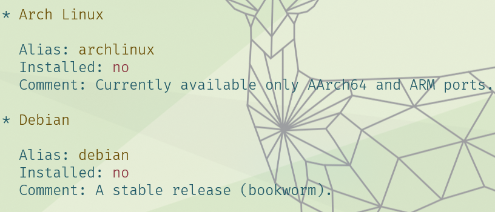
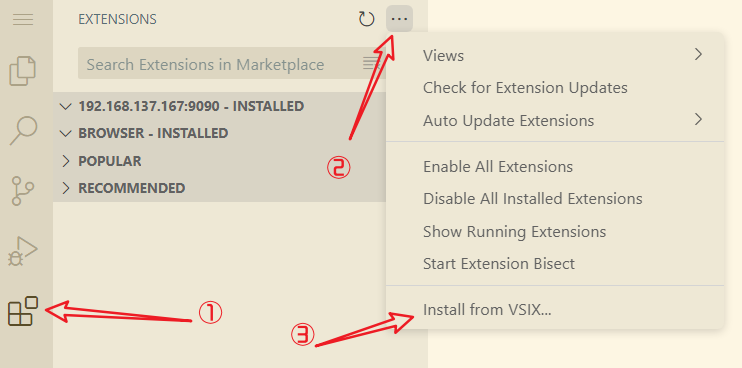
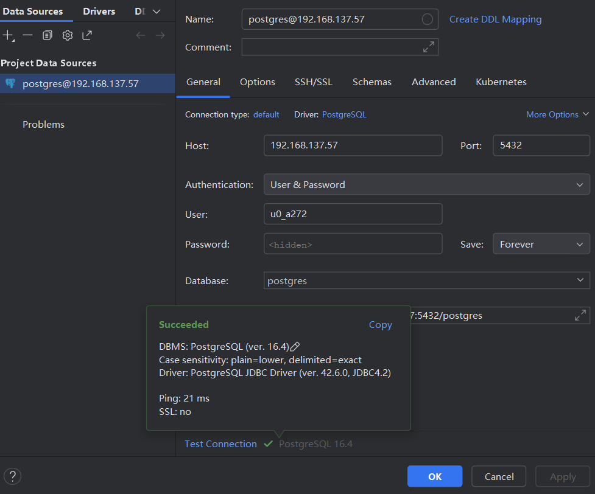

> 注：
>
> 1. 下述多数操作，建议使用局域网连接电脑和平板(电脑给平板开热点即可)，然后使用ssh连接，在电脑的终端进行操作。
> 2. 建议全程开启代理。
> 3. 多看文档：[Termux Wiki](https://wiki.termux.com/wiki/Main_Page)

##### 安装termux

1. Termux是 Android 平台上的一个终端模拟器，之所以称它为模拟器而非虚拟机，是因为它并非像 PC 端的 VirtualBox 等虚拟机软件那样，在宿主机中虚拟出一个完全独立且完整的系统环境，而只是提供一个接口，以安装和运行面向新环境交叉编译后的程序。

2. （参考后面转战neovim中介绍的安装方式）~~可以通过GitHub来下载：[github下载](https://github.com/termux/termux-app)。当然也可以通过官网下载。~~

   >   1.   `armeabi-v7a`和`arm64-v8a`是Android设备的CPU架构类型。
   >   2.   `armeabi`: 第5代、第6代的ARM处理器，早期的手机用的比较多。
   >   3.   `armeabi-v7a`: 第7代及以上的 ARM 处理器。
   >   4.   `arm64-v8a`(我的选择): 第8代、64位ARM处理器，2016年之后中高端的手机，比如骁龙8系列，麒麟9系列，联发科1000+等。
   >   5.   `x86`: 平板、模拟器用得比较多。
   >   6.   `x86_64`: 64位的平板。

3. 换源，参考[清华源]():

   1.   直接运行`termux-change-repo`,在图形界面引导下，使用自带方向键可上下移动。第一步使用空格选择需要更换的仓库，之后在第二步选择 TUNA/BFSU 镜像源。确认无误后回车，镜像源会自动完成更换。

   2.   或者安装`vim`之后，编辑文件`$PREFIX/etc/apt/sources.list`:

        ```tex
        # The termux repository mirror from TUNA:
        deb https://mirrors.tuna.tsinghua.edu.cn/termux/apt/termux-main stable main
        ```

4. `apt`换源使用如下命令行替换官方源为 TUNA 镜像源：

   ```bash
   sed -i 's@^\(deb.*stable main\)$@#\1\ndeb https://mirrors.tuna.tsinghua.edu.cn/termux/apt/termux-main stable main@' $PREFIX/etc/apt/sources.list
   apt update && apt upgrade
   ```

5. root权限：

   1.   (不推荐，需要手机已经root)安装`pkg install tsu`安装tsu，后面执行`tsu`代替`su`。

   2.   或者安装`pkg install proot`，执行`termux-chroot`进入root环境。

6. `termux`运行`termux-setup-storage`访问手机存储区,获取权限后,在 home 目录下会有一个 `storage` 文件夹, 可以通过这个文件夹访问手机储存(就类似于wsl的`/mnt`)。<span style="color:red">一定要在手机的 Termux 软件中执行，不要用任何远程连接软件。</span>

7. 换源之后记得运行`pkg update -y && pkg updrade -y`更新一下，不然可能无法使用`passwd`等命令。

8. 运行`pkg install termux-auth`后使用`passwd`设置密码。

   > 想使用termux刷题：目前存在两种选择：
   >
   > 1. neovim
   > 2. jupyter：`pip install jupyter`然后运行`jupyter notebook`即可。

   

---


##### ssh远程连接(密码连接)

1.   将手机与电脑连接在同一个局域网，或者手机开热点给电脑连接。

2.   运行下面命令安装并启动`openssh`。

     ```bash
     # 更新源
     pkg update
     
     # 安装ssh
     pkg install openssh
     
     # 启动ssh(默认端口号8022)
     sshd
     
     # 查看ip
     ifconfig
     ```

3.   运行`whoami`查询当前用户名，若需设置用户密码则需使用`passwd`命令。

4.   通过`ssh 用户名@ip -p 8022`连接`termux`即可。

5.   以后每次重启`mutex`客户端的时候，都需要输入`sshd`命令来开启ssh服务，不然连不上。

6.   关于`ssh`连接经常断开的问题：

     1.   方式一(推荐)：在安卓系统上打开设置搜索应用启动管理关闭自动管理，打开后台启动。<br>

     2.   方式二(不推荐)：使用`ssh -o ServerAliveInterval=10 用户名@IP地址 -p 端口`，ssh连接时设置`ServerAliveInterval`参数，该参数表示多少秒向服务器发送一个空包，以保持连接。
     
     3.   方式三(未验证)：运行`termux-wake-lock`。
     
          

---


##### ssh链接(秘钥)(没必要，直接局域网连接即可)

1.   windows电脑运行`ssh-keygen -t rsa `生成秘钥(已有则无许生成)。
2.   `termux`运行`termux-setup-storage`访问手机存储区,获取权限后,在 home 目录下会有一个 `storage` 文件夹, 可以通过这个文件夹访问手机储存(就类似于wsl的`/mnt`)。<span style="color:red">一定要在手机的 Termux 软件中执行，不要用任何远程连接软件。</span>
3.   把电脑端生成的key文件内容粘贴到termux的 `~/.ssh/authorized_keys` 文件中。
4.   重启termux的ssh，即运行`sshd`。
5.   通过`ssh 用户名@ip -p 8022`连接`termux`即可。

>公钥与私钥是通过加密算法得到的一个密钥对（即一个公钥和一个私钥，也就是非对称加密方式）。 公钥可对会话进行加密、验证数字签名，只有使用对应的私钥才能解密会话数据，从而保证数据传输的安全性。 公钥是密钥对外公开的部分，私钥则是非公开的部分，由用户自行保管。


---


##### 安装ubuntu

1. 首先运行`apt install proot-distro`安装`proot-distro`(一个bash脚本，用于在`termux`中管理与安装`proot`下的linux发行版)。

2. 查看可用的linux发行版,运行`proot-distro list`即可：<br>

3. 运行` proot-distro install xxx`安装linux发行版，例如我安装` proot-distro install ubuntu`(可能需要挂个梯子)。

4. 当然如果要删除的话使用`proot-distro remove xxx`即可。

5. 运行`proot-distro login ubuntu`进入对应的linux环境中。进入后运行`passwd`为`root`用户设置密码。

6. 运行`useradd -m xxx-s /bin/bash`创建新用户，并运行`passwd xxx`创建用户密码。

   


---


##### 配置code-server

1. 首先进行上述合适操作，保证termux能够在后台运行和访问本地文件(便于后续安装拓展)。

2. 运行`termux-change-repo`，选择清华镜像源。

3. 运行命令，安装code-server

   ```bash
    pkg install tur-repo
    
    pkg install code-server
    
    code-server
   ```

4. 安装vim编辑器`apt install vim`。

5. 配置密码和连接：`vim ~/.config/code-server/config.yaml`

   ```tex
   bind-addr: 0.0.0.0:9090                 #code-server的ip和port,设为0.0.0.0以使得局域网内都可访问
   auth: password                          #验证方式，可选password或none
   password: passwordForCodeServer         #设置密码
   cert: false
   ```

6. 重新打开`code-server`,浏览器访问即可。

7. `code-server`需要手动安装拓展插件，访问[官网](https://marketplace.visualstudio.com/)即可，后下载所需的插件文件。

8. 手动安装插件即可：<br>

9. 前面通过命令获取了系统文件权限，直接找到对应插件文件即可：`/data/data/com.termux/files/home/storage/shared/...`。

10. 配置，打开vscode配置文件，添加下面配置设置主题和支持ab键并使用键盘快捷键：

    ```json
    {
        "workbench.colorTheme": "Solarized Light",
        "keyboard.dispatch": "keyCode"
    }
    ```

11. 由于某些原因经常断开连接，弃坑转战neovim。

    

-----


##### 问候语和系统信息

1. ~~~安装`apt install neofetch`。~~~参考子系统笔记

2. 配置文件`vim ~/.config/neofetch/config.conf ` 编辑配置文件：参考window子系统相关配置。

3. 在.bashrc中配置:

   ```bash
   neofetch | lolcat
   ```

4. 修改Termux的问候语，` vi $PREFIX/etc/motd`:

   ```tex
   <凭栏长羡人来取,我梦不曾在此中>
   
   欢迎使用梦鱼的termux:
    * 搜索: pkg search <query>
    * 安装: pkg install <package>
    * 更新: pkg upgrade
    * 编辑: vi/vim/lvim <fileName>
   
   ```

5. 重启termux即可。

------


##### archlinux

1. 首先运行`apt install proot-distro`安装`proot-distro`(一个bash脚本，用于在`termux`中管理与安装`proot`下的linux发行版)。

2. 查看可用的linux发行版,运行`proot-distro list`即可：<br>

3. 运行` proot-distro install archlinux`(可能需要挂个梯子),当然如果要删除的话使用`proot-distro remove archlinux`即可。

4. 运行`proot-distro login archlinux`进入对应的`linux`环境中。进入后运行`passwd`为`root`用户设置密码。

5. 运行`useradd -m xxx-s /bin/bash`创建新用户，并运行`passwd xxx`创建用户密码。

6. 换源`vim /etc/pacman.d/mirrorlist `(没有安装使用`pacman -S vim`)

   ```bash
   Server = https://mirrors.ustc.edu.cn/archlinux/$repo/os/$arch 
   Server = https://mirrors.tuna.tsinghua.edu.cn/archlinux/$repo/os/$arch 
   Server = https://repo.huaweicloud.com/archlinux/$repo/os/$arch 
   Server = http://mirror.lzu.edu.cn/archlinux/$repo/os/$arch 
   ```

7. 更新`pacman -Syu`

----


##### frp

> 其实之前也尝试过使用ipv6实现(包括cloudflare的dns动态解析)但是校园网不支持ipv6且平板端没有root，故而计划失败。

1. 项目地址：[frp](https://github.com/fatedier/frp)

2. 据说是国人开发的，果然方便很多:[中文文档]([frp (gofrp.org)](https://gofrp.org/zh-cn/))

3. 在云服务器上安装好docker配置好镜像。使用`docker pull snowdreamtech/frps`命令拉去镜像。

4. 在服务器的某个文件夹创建`frps.toml`文件，这里我选择`/frps/frps.toml`:

   ```toml
   [common]
   bind_port = 7000  # frps 绑定的端口
   dashboard_port = 7500  # 控制面板的端口
   dashboard_addr = 0.0.0.0  # 控制面板可以在所有 IP 地址上访问
   dashboard_user = dreamfish  # 控制面板的用户名
   dashboard_pwd = yx198973  # 控制面板的密码
   vhost_http_port = 8888  # HTTP 虚拟主机端口
   vhost_https_port = 9999  # HTTPS 虚拟主机端口
   log_file = ./frps.log  # 日志文件路径
   log_level = info  # 日志记录级别
   log_max_days = 2  # 日志保存的天数
   authentication_timeout = 900  # 认证超时时间，单位秒
   token = 123123123  # 客户端与服务端之间的安全令牌
   max_pool_count = 50  # 代理池的最大连接数
   max_ports_per_client = 0  # 每个客户端允许的最大端口数，0 表示无限制
   token = 123123123 # 验证令牌
   ```

5. 使用如下命令创建并启动容器：其中`6005:6005`的端口映射是为了后面能访问服务器。但是实际上这种端口逐个映射很不方便，我们不采用。<font color=red>此外`7000、7500、6005`以及后续客户端使用的端口需要在用户组中开放</font>：

   ```bash
   # 一般方式
   docker run -d --name frps -p 7000:7000 -p 7500:7500  -p 6005:6005 -v /frps/frps.toml:/frp/frps.toml snowdreamtech/frps -c /frp/frps.toml
   
   # 使用主机网络：(有风险,待测试)
   docker run -d --name frps --network 3host -v /frps/frps.toml:/frp/frps.toml snowdreamtech/frps -c /frp/frps.toml
   
   # 映射端口范围:(不建议,docker崩了)
   docker run -d --name frps -p 6000-7500:6000-7500 -v /frps/frps.toml:/frp/frps.toml snowdreamtech/frps -c /frp/frps.toml
   ```

   

6. 客户端安装：我的是termux，选择如下版本，右键复制下载链接。

   <br>

7. 安装以来并下载客户端：

   ```bash
   pkg update && pkg install tar wget		# 安装wget、tar
   
   pkg install nginx  						# 安装nginx
   
   wget <url>								# 下载frp压缩包,<url>为复制的下载链接
   
   tar -zxvf frp_xxxxx_linux_arm64.tar.gz  # 解压frp
   
   cd <frp_xxxxx_linux_arm64> 				# 进入文件夹
   ```

8. 在解压的目录中创建配置客户端配置文件`frpc.toml`:

   ```toml
   [common]
   server_addr = xxx.xxx.xxx.xxx 	# 服务端ip
   server_port = 7000 				# 服务端监听端口
   token = 123123123 				# 验证令牌
   
   [nginx]
   type = tcp 						# 类型
   local_ip = 127.0.0.1 			# 本地ip
   local_port = 8080 				# 本地端口(这里是我的nginx的端口)
   remote_port = 6000 				# 服务端端口
   ```

9. 启动`./frpc -c ./frpc.toml`客户端。

10. 通过`http://<server_addr>:6000`访问客户端的nginx。

---


##### docker

1. 写在前面：启动虚拟机系统巨慢，docker也卡。

2. 由于安卓的linux内核缺少很多依赖，找了很多方法都无法使用。但是最终还是让我找到解决方法，[博客](https://stageguard.top/2019/08/15/run-docker-on-qemu-alpine/)。

3. 安装QEMU虚拟机(可以使用`pkg search qemu`搜索一下有哪些，我这里安装headless，该版本运行时不包含图形界面)：

   ```bash
   pkg update && pkg upgrade
   
   # pkg install qemu-system-x86-64-headless qemu-utils proot pulseaudio -y
   pkg install qemu-system-x86-64-headless qemu-utils proot -y
   
   ```

4. 下载Alpine Linux的镜像文件。你可以从官方镜像站点获取Alpine Linux ISO文件(我选择标准版)：[下载 |Alpine Linux](https://alpinelinux.org/downloads/)

   ```bash
   wget https://dl-cdn.alpinelinux.org/alpine/v3.20/releases/x86_64/alpine-standard-3.20.3-x86_64.iso
   ```

5. 使用qemu-img创建一个虚拟硬盘文件来安装Alpine Linux：

   ```bash
   qemu-img create -f qcow2 alpine-disk.qcow2 20G
   ```

   > 1. `qemu-img`:QEMU的磁盘镜像工具，用于创建、转换和修改虚拟机磁盘映像。
   > 2. `create`:创建新磁盘映像的命令。
   > 3. `-f qcow2`:指定虚拟磁盘文件的格式为qcow2。qcow2是QEMU的第二代磁盘映像格式，它支持动态分配空间(即，磁盘映像文件开始时很小，只在需要时增长到最大大小)，并且支持快照和压缩等功能。
   > 4. `alpine-disk.qcow2`: 这是要创建的虚拟磁盘文件的名称。你可以选择任何合适的文件名，这个文件将用于存储虚拟机的磁盘内容。
   > 5. `4G`: 指定虚拟磁盘的大小为4GB。这意味着虚拟机的虚拟硬盘在使用时最多可以扩展到4GB。

6. 使用以下命令启动QEMU并从iso启动AlpineLinux安装程序：启动后会进入Alpine Linux的安装程序，跟随屏幕上的指引进行安装。

   ```bash
   qemu-system-x86_64 \
     -m 1024M \
     -smp 2 \
     -boot d \
     -cdrom alpine-standard-3.20.3-x86_64.iso \
     -hda alpine-disk.qcow2 \
     -net nic \
     -net user,hostfwd=tcp::2222-:22 \
     -nographic
   ```

   > 1. `-m 1024M` 表示为虚拟机分配1024MB的内存
   > 2. `-smp` 给分配内核数
   > 3. `-net nic` 配置网络接口卡
   > 4. `-hda` : 启动的虚拟硬盘
   > 5. `-net user,hostfwd=tcp::2222-:22` 置网络和端口转发(主机端口2222与虚拟机端口22相映射)
   > 6. `-cdrom` : 启动的光盘镜像文件(相当于用光盘安装windows)
   > 7. `-boot` : 启动槽位，d表示从光盘引导。因为安装系统的ISO文件是通过虚拟光驱加载的，所以这里设置为d。
   > 8. `-nographic` : 无图像模式，直接在控制台输出，禁用图形界面。

7. 使用root登录后运行`setup-alpine`安装系统：镜像版本不同略有不同，但是大差不差，大不了选默认。

   ```bash
   # 设置主机名
    Hostname
   ----------
   Enter system hostname (fully qualified form, e.g. 'foo.example.org') [localhost] fish
   
   # 设置网络(回车默认)
    Interface
   -----------
   Available interfaces are: eth0.
   Enter '?' for help on bridges, bonding and vlans.
   Which one do you want to initialize? (or '?' or 'done') [eth0]
   Ip address for eth0? (or 'dhcp', 'none', '?') [dhcp]
   Do you want to do any manual network configuration? (y/n) [n]
   
   # 设置密码
    Root Password
   ---------------
   Changing password for root
   New password:
   Retype password:
   passwd: password for root changed by root
   
   # 设置时区
   Which timezone are you in? [UTC] Asia
   What sub-timezone of 'Asia' are you in? Shanghai
   
   # 设备代理(回车默认)
    Proxy
   -------
   HTTP/FTP proxy URL? (e.g. 'http://proxy:8080', or 'none') [none]
   
   # 网络时间协议客户端(默认)
   Which NTP client to run? ('busybox', 'openntpd', 'chrony' or 'none') [chrony]
    * service chronyd added to runlevel default
    * Caching service dependencies ...
    [ ok ]
   
   # 设置更新源：f是自动测试并选择最快的源
    APK Mirror
   ------------
    (f)    Find and use fastest mirror
    (s)    Show mirrorlist
    (r)    Use random mirror
    (e)    Edit /etc/apk/repositories with text editor
    (c)    Community repo enable
    (skip) Skip setting up apk repositories
   Enter mirror number or URL: [1] f
   
   # 设置用户和ssh服务
    User
   ------
   Setup a user? (enter a lower-case loginname, or 'no') [no] no
   Which ssh server? ('openssh', 'dropbear' or 'none') [openssh]
   Allow root ssh login? ('?' for help) [prohibit-password] yes # 设置允许root远程登陆
   Enter ssh key or URL for root (or 'none') [none] none
   
   
   # 设置磁盘
    Disk & Install
   ----------------
   Available disks are:
     fd0   (0.0 GB  )
     sda   (21.5 GB ATA      QEMU HARDDISK   )
   Which disk(s) would you like to use? (or '?' for help or 'none') [none] sda
   The following disk is selected:
     sda   (21.5 GB ATA      QEMU HARDDISK   )
   How would you like to use it? ('sys', 'data', 'crypt', 'lvm' or '?' for help) [?] sys
   WARNING: The following disk(s) will be erased:
     sda   (21.5 GB ATA      QEMU HARDDISK   )
   WARNING: Erase the above disk(s) and continue? (y/n) [n] y
   Creating file systems...
   Installing system on /dev/sda3:
   /mnt/boot is device /dev/sda1
   ...
   ```

8. 后续启动虚拟机：自行编写shell脚本。

   ```bash
   qemu-system-x86_64 -m 1024M -smp 2 -hda alpine-disk.qcow2 -net nic -net user,hostfwd=tcp::2222-:22 -nographic
   ```

   > 后续把其他端口映射到主机例如：`-net user,hostfwd=tcp::8080-:80`

9. 在termux中使用`ssh root@localhost -p 2222`连接虚拟机。

10. 编辑`vi /etc/network/interfaces`后运行`/etc/init.d/networking restart`重启网络

   ```bash
   auto lo
   iface lo inet loopback
   auto eth0
   iface eth0 inet dhcp
   ```

11. 修改dns解析：`vi /etc/resolv.conf`

    ```bash
    nameserver 8.8.8.8
    ```

12. 换源`vi /etc/apk/repositories`

    ```bash
    https://mirrors.tuna.tsinghua.edu.cn/alpine/v3.20/main
    https://mirrors.tuna.tsinghua.edu.cn/alpine/v3.20/community
    http://mirrors.aliyun.com/alpine/v3.20/main
    http://mirrors.aliyun.com/alpine/v3.20/community
    ```

13. 安装docker：

    ```bash
    apk update
    apk add docker
    ```

14. 服务：

    ```bash
    #使docker开机启动
    rc-update add docker
    
    #开启docker服务
    service docker start
    
    #后台启动
    setsid containerd
    setsid dockerd
    ```

15. 后续是不是可以将docker端口映射到虚拟机，将虚拟机端口映射到termux，将termux通过frp内网穿透暴露到公网，无限套娃？

---


##### nginx安装

1. 安装`pkg install nginx`
2. 查看端口号：`vim /data/data/com.termux/files/usr/etc/nginx/nginx.conf`

---


##### 服务

1. 文档:[Termux 服务 - Termux Wiki](https://wiki.termux.com/wiki/Termux-services)，可以参考文档配置自己的服务。

2. 安装：

   ```bash
   # 安装
   pkg install termux-services
   
   # 服务自启
   sv-enable <service>
   
   # 禁止服务自启
   sv-disable <service>
   
   # 启动服务
   sv up <service>
   
   # 关闭服务
   sv down <service>
   ```

3. 开启一些服务：

   ```bash
   # ssh
   sv-enable sshd
   
   # nginx
   sv-enable nginx
   ```

---


##### postgresql

1. 文档：[Postgresql - Termux Wiki](https://wiki.termux.com/wiki/Postgresql)

2. 安装：

   ```bash
   # 安装
   pkg install postgresql
   
   # 建立数据库工作区文件夹
   mkdir -p $PREFIX/var/lib/postgresql
   
   # 初始化工作区
   initdb $PREFIX/var/lib/postgresql
   
   # 启动服务端(两种启动方式)
   pg_ctl start -D $PREFIX/var/lib/postgresql 			# 用于管理PgSQL服务器的控制工具，可以用它来启动、停止或重启服务器，推荐。
   postgres -D $PREFIX/var/lib/postgresql/          	# postgres是PgSQL数据库的主服务器进程，直接运行这个命令会启动数据库服务器。
   
   # 关闭
   pg_ctl stop -D $PREFIX/var/lib/postgresql
   pg_ctl stop -D $PREFIX/var/lib/postgresql -m smart 		# 等待所有连接关闭后关闭(默认)
   pg_ctl stop -D $PREFIX/var/lib/postgresql -m fast		# 快速关闭服务器，取消所有未处理的事务，并强制断开所有连接。
   pg_ctl stop -D $PREFIX/var/lib/postgresql -m immediate 	# 立刻关闭服务器，终止所有进程，不等待任何操作完成。
   
   
   
   # 后台启动
   nohup postgres -D $PREFIX/var/lib/postgresql/ &
   nohup pg_ctl start -D $PREFIX/var/lib/postgresql &
   
   # 客户端登录
   whoami   # 获取用户名
   psql -U your_name -d postgres  # 登录
   
   psql -U $(whoami) -d postgres 
   
   
   # 修改用户密码(登陆后)
   \password
   ```

2. 配置远程链接

   1. 编辑配置文件:`vim $PREFIX/var/lib/postgresql/postgresql.conf`

      ```bash
      #listen_addresses = 'localhost'
      # 改为允许监听所有ip地址
      listen_addresses = '*'
      ```

   2. 编辑身份验证文件：`vim $PREFIX/var/lib/postgresql/pg_hba.conf`末尾添加如下内容：

      ```bash
      host    all             all             0.0.0.0/0               md5
      ```

   3. 重启数据库：`pg_ctl restart -D $PREFIX/var/lib/postgresql`

   4. 我这里使用idea远程连接测试：端口号默认5432

      <br>

3. pgsql的一些命令：

   ```tex
   \? 					所有命令帮助
   \password 			设置密码
   \q					退出
   \l 					列出所有数据库
   \d 					列出数据库中所有表
   \dt 				列出数据库中所有表
   \d [table_name] 	显示指定表的结构
   \di 				列出数据库中所有index
   \dv 				列出数据库中所有view
   \h 					sql命令帮助,如\h select
   \c [database_name]  切换到指定的数据库
   \c 					显示当前数据库名称和用户
   \conninfo 			显示客户端的连接信息
   \du 				显示所有用户
   \dn 				显示数据库中的schema
   \encoding 			显示字符集
   select version(); 	显示版本信息
   select now(); 		查看时间
   \i XXX.sql 			执行XXX.sql 文件
   \o /XXX.txt 		将下一条sql执行结果保存到XXX.txt中
   ```

4. 接下来就是内网穿透然后远程连接：略。


##### neovim

`pkg install clang make binutils`
