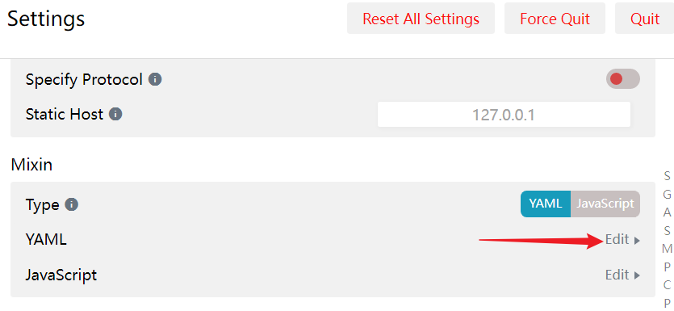

#### 1-clash配置代理规则

##### a-安装

1.   [github](https://github.com/Fndroid/clash_for_windows_pkg)下载对应版本，安装即可(`windows 64bit`)：<br>


##### b-bing AI

clash右键选择预处理配置：<br>

```yaml
parsers: # array
	# 个人订阅地址
    - url: https://my.overwall.run/api/v1/client/subscribe?token=xxxxxx
      yaml:
        prepend-rules:
          - DOMAIN-SUFFIX,bing.com,GLOBAL
          - DOMAIN-SUFFIX,auth.grazie.ai,GLOBAL
          - DOMAIN-SUFFIX,grazie.aws.intellij.net,GLOBAL
          - DOMAIN-SUFFIX,grazie.ai,GLOBAL
          # bing.com是要匹配的域名
```

>   *   DOMAIN-SUFFIX：域名后缀匹配
>   *   DOMAIN：域名匹配
>   *   DOMAIN-KEYWORD：域名关键字匹配
>   *   IP-CIDR：IP段匹配
>   *   SRC-IP-CIDR：源IP段匹配
>   *   GEOIP：GEOIP数据库（国家代码）匹配
>   *   DST-PORT：目标端口匹配
>   *   SRC-PORT：源端口匹配
>   *   PROCESS-NAME：源进程名匹配
>   *   RULE-SET：Rule Provider规则匹配
>   *   MATCH：全匹配

>   使用`DIRECT`，`GLOBAL`，`REJECT`。`DIRECT`表示不走代理，即不通过代理节点直接连接。`GLOBAL`则是走全局代理节点。`REJECT`则表示禁止连接，使用`REJECT`后，将会屏蔽对应网站。当然这里你似乎还可以指定其使用某一个分组策略的节点(甚至你也可以指定走某一个具体的节点)。<br>


##### c-idea的ai助手

1.  首先idea的账号中地区改为美国，不知道是否必要。然后将idea更新到最新，安装插件AI Assistant。<br>

2.  其次需要有一个代理软件，我使用的是clash for windows。然后为其配置预处理配置：

    1.  右键clash for windows中的节点配置文件。选择预处理配置。<br>

    2.  添加如下配置，更新节点文件。这些配置是每次更新节点配置文件时添加下面规则，让这些网站走全局模式。这样就不需要使用全局模式了，它会默认走全局(第一个是new bing的规则，可省略)。

        ```yaml
        parsers: # array
            - url: 你的节点链接...
              yaml:
                prepend-rules:
                  - DOMAIN-SUFFIX,bing.com,GLOBAL
                  - DOMAIN-SUFFIX,auth.grazie.ai,GLOBAL
                  - DOMAIN-SUFFIX,grazie.aws.intellij.net,GLOBAL
                  - DOMAIN-SUFFIX,grazie.ai,GLOBAL
        ```

    3.  注意，你的全局节点选择要合适，最好选择美国节点。但是你当前clash for window可以选择规则模式(遇倒这些匹配网站默认会走全局)。

    4.  关于这些配置含义参考上面。

3.  配置idea代理：

    1.  在设置中搜索代理。
    2.  如下配置，端口号填写自己的clash端口。
    3.  必要时需要开启防火墙(参照上一篇window子系统配置)。

4.  最后登录你的idea账号，就可以使用AI Assistant了。效果展示：<br>


##### d-微软商店无法连接

1.    微软商店属于原因是这些是UWP应用，默认不允许loopback代理。

2.   解决措施：

     1.   点击常规，后选择UWP应用联网限制解除工具。<br>

     2.   勾选微软商店即可,这样微软商店即可正常使用！<br>

---


#### 2-tun模式

##### a-三种模式

1.    Clash For Windows的TUN、TAP、系统代理三种模式。
2.   Clash Tap虚拟网卡模式和tun模式，都可以让所有的流量走虚拟网卡，实现真正的全局翻墙模式，实现所有软件代理。但是Windows下TUN 模式性能比TAP模式好，推荐使用TUN模式。
3.   三种代理模式开启一种即可。例如开启了TUN模式，就不要再将System Proxoy(系统代理)打开。


##### b-开启tun模式

1.   一般而言使用这种方式就够了，没必要使用混合模式开启tun模式。
2.   点击General中Service Mode右边Manage，在打开窗口中安装服务模式，安装完成应用会自动重启，Service Mode 右边地球图标变为绿色即安装成功。<br>
3.   服务模式有两种运行方式：使用`winsw`或`schtasks`：
     1.   `winsw`是一个包装器可执行文件，可以将任何可执行文件作为Windows服务运行。
     2.   `schtasks`是一个命令行工具，使管理员能够在本地或远程计算机上创建、删除、查询、更改、运行和结束计划任务。

4.   关闭系统代理，打开TUN模式开关，使用其自带的默认配置(也可以自定义混合模式配置文件，开启混合模式)。<br>
5.   混合模式YAM配置正确且开关打开，检查是否成功。<br>
6.   如果安装过TAP网络适配器，则必须卸载掉（TUN和TAP不能共存），卸载后会看到网络连接那只有Clash的电脑图标，TAP模式的虚拟网络cwf-tap图标消失。
7.   后续，默认dns一定要加上CloudFlare的dns(`1.1.1.1`  、`1.0.0.1`)，个人博客就是CloudFlare解析的，结果发现无法加载。当然也可以配置`hosts`添加博客网站与其ip的映射，看个人喜好。


##### c-混合模式

1.   混合模式是指同时使用多种代理协议，例如HTTP、SOCKS5、Shadowsocks等。在Clash for Windows中，您可以通过Mixin来实现混合模式的配置。Mixin是一种在配置文件中注入公共属性设置的方法。

2.   Mixin，你可以理解为临时覆写，或者可以理解为临时混合配置文件。Mixin的实质是在Clash核心读取完配置文件后对其进行临时修改而不对本地的原配置文件进行改动利用这个特性，我们可以轻松实现TUN/TAP的临时开关。也就是说混合模式规则会覆盖原有的配置规则，这点需要注意。

3.   通过配置混合模式开启tun模式步骤：

     1.   点击General中Service Mode右边Manage，在打开窗口中安装服务模式，安装完成应用会自动重启。同上述配置略。
     2.   进入Settings页面。
     3.   滚动至Profile Mixin栏。
     4.   点击YAML右边Edit小字打开编辑界面。
     5.   在修改编辑界面内容，添加配置(注意上方的类型Type字段要选择yaml类型而不是js)。<br>

4.   具体配置如下：

     ```yaml
     mixin: # 注意下面缩进
       hosts: # 字段用于设置域名和 IP 地址的映射关系
         'xxxx' 192.xxx.xx.xxx
         'xxxx' 192.xxx.xx.xxx
     	   
       dns:
         enable: true # 是否启用 DNS 功能。
         
         default-nameserver: # 默认的 DNS 服务器地址。解析非IP的dns用的dns服务器,只支持纯IP(最新版已解决)
           - 223.5.5.5   # 阿里的DNS服务器，另一个223.6.6.6
           - 119.29.29.29 # 腾讯
           - 1.0.0.1     # CloudFlare的DNS服务器
           - 119.29.29.29 # DNSPOD 公共 DNS
           #- https://dns.adguard-dns.com/dns-query # AdGuard DNS 拦截广告和跟踪器。
           
         ipv6: false #是否启用 IPv6
         
         enhanced-mode: fake-ip  # 增强模式,TAP模式更推荐使用 redir-host 模式
         
         nameserver:  # DNS 服务器地址列表
           - 223.6.6.6  # 阿里
           - https://doh.pub/dns-query   # DNSPod DoH
           - https://1.1.1.1/dns-query   # Cloudflare DoH
           - https://dns.adguard-dns.com/dns-query # AdGuard DNS 拦截广告和跟踪器。
           - 114.114.114.114 # 中国电信(据说不靠谱)
           
         fallback: # 备用 DNS 服务器地址列表
           - https://dns.alidns.com/dns-query  # 阿里 DoH
           - https://dns.google/dns-query    # Google DoH
           - 8.8.8.8 # 谷歌
           #- https://1.0.0.1/dns-query   # Cloudflare DoH 
           
         fake-ip-filter: # 当enhanced-mode设置为fake-ip，会出现系统检测到网卡无法联网，微软系APP无法登陆等问题
           # === Microsoft Windows Serivice ===
           - "*.msftncsi.com"
           - "*.msftconnecttest.com"
           # === 其他 ===
           - +.stun.*.*
           - +.stun.*.*.*
           - +.stun.*.*.*.*
           - +.stun.*.*.*.*.*
           - "*.n.n.srv.nintendo.net"
           - +.stun.playstation.net
           - xbox.*.*.microsoft.com
           - "*.*.xboxlive.com"
           - WORKGROUP
           # === Local ===
           - "*.lan"
           - "*.local" 
           
         fallback-filter: # 备用DNS服务器过滤器,指定使用备用DNS服务器
           geoip: true # 是否启用地理位置过滤
           ip-cidr: # IP地址段过滤规则，240.0.0.0/4表示保留地址、0.0.0.0/32表示本机地址、127.0.0.1/32表示回环地址。
             - 240.0.0.0/4
             - 127.0.0.1/8
             - 0.0.0.0/32
           domain: # 指定域名过滤规则，其中+表示匹配该域名及其子域名。
             - +.google.com
             - +.github.com
             - +.facebook.com
             - +.twitter.com
             - +.youtube.com
             - +.xn--ngstr-lra8j.com
             - +.google.cn
             - +.googleapis.cn
             - +.googleapis.com
             - +.gvt1.com
             
       rules: # 规则
         - "DOMAIN-SUFFIX,bing.com,GLOBAL"
         # 在mixin部分中添加与原配置相同的规则，会覆盖原有规则。如果想添加新的规则而不是替换，可以使用parser预处理配置。
         
       tun:  # tun模式
         enable: true
         stack: system # 使用系统栈 or gvisor
         dns-hijack: # 域名劫持重定向到指定的 DNS 服务器
           - 198.18.0.2:53  # 本地劫持DNS地址，无需修改
           #也可以用- any:53指定所有域名、且端口号为53都会被劫持止
         auto-route: true # 自动路由
         auto-detect-interface: true # 自动检测出口网卡
     ```

5.   接下来，就可以打开混合模式开关，进入tun模式(此时无需开启tun模式、系统代理)。<br>

7.   当然你也可以使用混合模式开启tap模式，过程略。


##### d-dns匹配通配符

1.   在某些情况下，您需要与通配符域匹配。例如，在设置 Clash DNS时，您可能希望与 的所有子域进行匹配。Clash确实支持在DNS配置中匹配不同级别的通配符域，而语法定义如下：
2.   使用星号`*`与单级通配符子域匹配。

| 表达匹配           | 匹配                            | 不匹配                     |
| :----------------- | :------------------------------ | :------------------------- |
| `*.google.com`     | `www.google.com`                | `google.com`               |
| `*.bar.google.com` | `foo.bar.google.com`            | `bar.google.com`           |
| `*.*.google.com`   | `thoughtful.sandbox.google.com` | `one.two.three.google.com` |

3.   使用点符号 `.` 与多级通配符子域匹配。

| 表达          | 匹配                            | 不匹配       |
| :------------ | :------------------------------ | :----------- |
| `.google.com` | `www.google.com`                | `google.com` |
| `.google.com` | `thoughtful.sandbox.google.com` | `google.com` |
| `.google.com` | `one.two.three.google.com`      | `google.com` |

4.   `+`通配符的工作方式类似于域后缀，您可以一次快速匹配多级。

| 表达           | 匹配                            |
| :------------- | :------------------------------ |
| `+.google.com` | `google.com`                    |
| `+.google.com` | `www.google.com`                |
| `+.google.com` | `thoughtful.sandbox.google.com` |
| `+.google.com` | `one.two.three.google.com`      |


#### 3-clash verge

#####  a-基本安装

1.   服务安装：需要根据自己的程序安装目录，找到`clash-verge-service.exe`，应该是在`安装目录/resources/clash-verge-service.exe`。然后替换上面`binpath`的值。

     ```bat
     sc create clash_verge_service binpath="D:\\apps\\clash verge\\resources\\clash-verge-service.exe" type=own start=AUTO displayname="Clash Verge Service"
     
     sc start clash_verge_service
     # sc delete clash_verge_service 删除服务
     ```

2.   配置个人定制文件：

     ```yaml
     prepend-rules:
         - DOMAIN-SUFFIX,bing.com,GLOBAL
         - DOMAIN-SUFFIX,auth.grazie.ai,GLOBAL
         - DOMAIN-SUFFIX,grazie.aws.intellij.net,GLOBAL
         - DOMAIN-SUFFIX,grazie.ai,GLOBAL
         - DOMAIN-SUFFIX,chat.openai.com,GLOBAL
         
     prepend-proxies:
     
     prepend-proxy-groups:
     
     append-rules:
     
     append-proxies:
     
     append-proxy-groups:
     
     tun:
     ```
     
     

##### b- 增强模式

1. 参考链接：https://github.com/zzzgydi/clash-verge/wiki/使用指南#profiles-enhanced-mode-增强模式

2. 目前支持4种类型的配置文件，分别是Remote、Local、Script、Merge。其中，Remote和Local类型为 主配置文件，Script和Merge类型为 增强配置文件，用于修改主配置文件的。点`New`可以创建这些配置文件（如下图），对于Remote类型的，也可以直接输入url import即可。 *（备注：该模式主要参考了CFW的实现）*


3. Remote 远程配置：目前仅支持clash格式的配置链接，即响应体数据是符合clash配置格式的（utf8编码）。如果响应头中存在`Subscription-Userinfo`字段，则其对应的流量信息会展示出来。远程配置可以点击右上角的更新按键自动更新。

4.   Local 本地配置：新建本地配置之后，`右键 - File` 即可打开对应的本地配置文件（默认会用VScode打开，如果找不到执行程序则用`open`打开）。在编写完本地配置之后`右键 - select`即可刷新该配置。

5.   Merge 合并处理：该配置类型用于对主配置进行字段增加的操作，文件格式是yaml。该idea源于 CFW 配置预处理中的简便方法。目前仅支持6种操作类型。启用方法：`右键 - enable`，在修改了文件之后，点击刷新触发配置变更。

     *   prepend-rules：类型和`clash rules`配置一致，内容合并到rules **前**

     *   append-rules：类型和`clash rules`配置一致，内容合并到rules **后**

     *   prepend-proxies：类型和`clash proxies`配置一致，内容合并到proxies **前**

     *   append-proxies：类型和`clash proxies`配置一致，内容合并到proxies **后**

     *   prepend-proxy-groups：类型和`clash proxy-groups`配置一致，内容合并到proxy-groups **前**

     *   append-proxy-groups：类型和`clash proxy-groups`配置一致，内容合并到proxy-groups **后**

     *   其他clash的字段：5个默认使用的字段（`rules`， `proxies`， `proxy-groups`， `proxy-providers`， `rule-providers`）以及其他clash/clash meta支持的字段，直接设置这些字段将**直接覆盖**profile对应字段的内容。

​		**注意**：需要使用其他字段时，例如dns,tun等，需要在设置页 - Clash Field(Clash 字段)里勾选对应的字段，不勾选的字段将被忽略。


#### 4-v2aryN

1.   配置规则:

     ```yaml
     [
       {
         "outboundTag": "proxy",
         "domain": [
           "#以下三行是GitHub网站，为了不影响下载速度走代理",
           "github.com",
           "githubassets.com",
           "githubusercontent.com"
         ]
       },
       {
         "outboundTag": "block",
         "domain": [
           "#阻止CrxMouse鼠标手势收集上网数据",
           "mousegesturesapi.com"
         ]
       },
       {
         "outboundTag": "direct",
         "domain": [
           "bitwarden.com",
           "bitwarden.net",
           "baiyunju.cc",
           "letsencrypt.org",
           "adblockplus.org",
           "safesugar.net",
           "#下两行谷歌广告",
           "googleads.g.doubleclick.net",
           "adservice.google.com",
           "#【以下全部是geo预定义域名列表】",
           "#下一行是所有私有域名",
           "geosite:private",
           "#下一行包含常见大陆站点域名和CNNIC管理的大陆域名，即geolocation-cn和tld-cn的合集",
           "geosite:cn",
           "#下一行包含所有Adobe旗下域名",
           "geosite:adobe",
           "#下一行包含所有Adobe正版激活域名",
           "geosite:adobe-activation",
           "#下一行包含所有微软旗下域名",
           "geosite:microsoft",
           "#下一行包含微软msn相关域名少数与上一行微软列表重复",
           "geosite:msn",
           "#下一行包含所有苹果旗下域名",
           "geosite:apple",
           "#下一行包含所有广告平台、提供商域名",
           "geosite:category-ads-all",
           "#下一行包含可直连访问谷歌网址，需要替换为加强版GEO文件，如已手动更新为加强版GEO文件，删除此行前面的#号使其生效",
           "#geosite:google-cn",
           "#下一行包含可直连访问苹果网址，需要替换为加强版GEO文件，如已手动更新为加强版GEO文件，删除此行前面的#号使其生效",
           "#geosite:apple-cn"
         ]
       },
       {
         "type": "field",
         "outboundTag": "proxy",
         "domain": [
           "#GFW域名列表",
           "geosite:gfw",
           "geosite:greatfire"
         ]
       },
       {
         "type": "field",
         "port": "0-65535",
         "outboundTag": "direct"
       }
     ]
     ```

     
