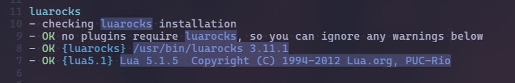

#### neovim配置

##### 安装neovim

1. ubuntu运行如下命令添加仓库并下载安装：

   ```bash
   sudo add-apt-repository ppa:neovim-ppa/stable # 稳定版(选一个)
   sudo sudo add-apt-repository ppa:neovim-ppa/unstable #开发版(选一个)
   # 报错add-apt-repository 找不到 apt-get install software-properties-common
   sudo apt-get update
   sudo apt-get install neovim
   # 删除仓库源 sudo add-apt-repository -r ppa:neovim-ppa/stable
   # 删除仓库源 sudo sudo add-apt-repository -r ppa:neovim-ppa/unstable
   ```

2. 若上述过程中出现报错找不到 `add-apt-repository` 命令，运行如下命令安装对应包后，再次安装：

   ```bash
   sudo apt-get install software-properties-common
   ```

3. 运行`nvim -v`查看版本，检查是否安装成功。

5. 编辑` nvim ~/.bashrc`文件使用`neovim`替换原本的`vim`:

   ```bash
   # alias vim='nvim'(不建议,neovim崩了你连vim都用不了)(若上述情况发生,切换root然后修改环境变量)
   alias vi='nvim'
   alias v='nvim'
   ```

6. windows中也可以安装neovim(用wsl方便些)。

7. archlinux安装neovim`sudo pacman -S neovim`

   

##### 配置

1. 配置文件树：

   ```tex
   .
   ├── assets
   │   ├── image-20240922144414253.png
   │   ├── image-20240922144613283.png
   │   ├── image-20240922144729935.png
   │   └── image-20240922144746235.png
   ├── init.lua
   ├── lazy-lock.json
   ├── lazyvim.json
   ├── lua
   │   ├── config
   │   │   ├── autocmds.lua
   │   │   ├── keybindings.lua
   │   │   ├── lazy.lua
   │   │   └── options.lua
   │   └── plugins
   │       ├── autopairs.lua
   │       ├── blankline.lua
   │       ├── bufferline.lua
   │       ├── catppuccin.lua
   │       ├── cmp-cmdline.lua
   │       ├── colorizer.lua
   │       ├── Comment.lua
   │       ├── flash.lua
   │       ├── goto-preview.lua
   │       ├── hlchunk.lua
   │       ├── image.lua
   │       ├── leetcode.lua
   │       ├── rest.lua
   │       ├── SmoothCursor.lua
   │       ├── telescope.lua
   │       ├── toggleterm.lua
   │       └── venv-selector.lua
   └── readme.md
   ```
   
2. 其中基本配置`~/.config/nvim/lua/config/options.lua`:完成后进入命令模式输入`:w`保存，最后输入`:source %`更新并执行当前文件(`%`是表示当前文件的路径,`source`命令是用来读取并执行一个文件)。

   1.   `vim.g.{name}`: 全局变量

   2.   `vim.b.{name}`: 缓冲区变量
   3.   `vim.w.{name}`: 窗口变量
   4.   `vim.bo.{option}`: buffer-local 选项
   5.   `vim.wo.{option}`: window-local 选项

3. `~/.config/nvim/lua/config/options.lua`这样的分类初看上去是有些混乱的，有些时候想设置一个变量，确实很难判断应该放在哪个分类里。一般来说，全部设置在 `vim.opt` 下也是可以的，例如 `vim.opt.number = true` 也是有效的，只是我们上边设置到了比较详细位置而已，具体每个变量的分类可以在 `:help` 文档中查看。

   ```lua
   -- 显示模式(关闭)
   vim.o.showmode = false
   
   -- utf8：设置编码为UTF-8
   vim.g.encoding = "UTF-8"
   vim.o.fileencoding = 'utf-8'
   
   -- jkhl 移动时光标周围保留8行
   vim.o.scrolloff = 8
   vim.o.sidescrolloff = 8
   
   -- 使用相对行号
   vim.wo.number = true
   vim.wo.relativenumber = true
   
   -- 高亮所在行
   vim.wo.cursorline = true
   
   -- 显示左侧图标指示列
   vim.wo.signcolumn = "yes"
   
   -- 右侧参考线，超过表示代码太长了，考虑换行
   -- vim.wo.colorcolumn = "80"
   
   -- 缩进4个空格等于一个Tab
   vim.o.tabstop = 4
   vim.bo.tabstop = 4
   vim.o.softtabstop = 4
   vim.o.shiftwidth = 4 --每次自动缩进的空格数
   vim.o.shiftround = true
   
   -- >> << 时移动长度
   vim.o.shiftwidth = 2
   vim.bo.shiftwidth = 2
   
   -- 新行对齐当前行，空格替代tab
   --vim.o.expandtab = true
   --vim.bo.expandtab = true
   
   -- 新行对齐当前行
   vim.o.autoindent = true
   vim.bo.autoindent = true
   vim.o.smartindent = true
   
   -- 搜索大小写不敏感，除非包含大写
   vim.o.ignorecase = true
   vim.o.smartcase = true
   
   -- 当文件被外部程序修改时，自动加载
   vim.o.autoread = true
   vim.bo.autoread = true
   
   -- 自动缩进
   vim.o.autoindent = true
   vim.bo.autoindent = true
   
   -- 搜索不要高亮
   vim.o.hlsearch = false
   
   -- 边输入边搜索
   vim.o.incsearch = true
   
   -- 使用增强状态栏后不再需要vim的模式提示
   --vim.o.showmode = false
   
   -- 命令行高为2，提供足够的显示空间
   vim.o.cmdheight = 2
   
   -- 当文件被外部程序修改时，自动加载
   vim.o.autoread = true
   vim.bo.autoread = true
   
   -- 禁止折行
   vim.o.wrap = false
   vim.wo.wrap = false
   
   -- 行结尾可以跳到下一行
   vim.o.whichwrap = 'b,s,<,>,[,],h,l'
   
   -- 允许隐藏被修改过的buffer
   vim.o.hidden = true
   
   -- 鼠标支持
   vim.o.mouse = "a"
   
   -- 禁止创建备份文件
   vim.o.backup = false
   vim.o.writebackup = false
   vim.o.swapfile = false
   
   -- smaller updatetime 
   vim.o.updatetime = 300
   
   -- 设置 timeoutlen 为等待键盘快捷键连击时间500毫秒，可根据需要设置
   vim.o.timeoutlen = 500
   
   -- split window 从下边和右边出现
   vim.o.splitbelow = true
   vim.o.splitright = true
   
   -- 自动补全不自动选中(自动补全插件会用到)
   vim.g.completeopt = "menu,menuone,noselect,noinsert"
   
   -- 样式(dark/light)
   vim.o.background = "light" --dark干扰主题配置
   vim.o.termguicolors = true
   vim.opt.termguicolors = true
   
   -- 不可见字符的显示，这里只把空格显示为一个点（space:·）
   vim.o.list = true
   vim.o.listchars = "space:·"
   
   -- 补全增强
   vim.o.wildmenu = true
   
   -- 补全最多显示10行
   vim.o.pumheight = 10
   
   -- Dont' pass messages to |ins-completin menu|
   vim.o.shortmess = vim.o.shortmess .. 'c'
   
   -- 永远显示 tabline
   vim.o.showtabline = 2
   
   -- 光标颜色
   vim.cmd('highlight Cursor gui=NONE guifg=bg guibg=#ffb6c1')
   -- 设置不同模式下的光标样式
   vim.opt.guicursor = {
   	"n:hor20-Cursor/lCursor",
   	"i-ci-ve:ver25-Cursor/lCursor",
   	"r-cr-o:ver25-Cursor/lCursor",
   }
   vim.cmd([[
     highlight Cursor guifg=#FFFFFF guibg=#00BFFF
     highlight lCursor guifg=#FFFFFF guibg=#00BFFF
     highlight CursorLine guibg=#2e2e2e
     highlight CursorLineNr guifg=#FFD700
   ]])
   
   -- 当前行高亮
   vim.opt.cursorline = true  
   
   
   -- 使用系统剪切板(安装sudo pacman -S xclip)
   vim.cmd[[set clipboard+=unnamedplus]]
   
   -- 缩进展示
   --vim.opt.list = false
   --vim.opt.listchars:append(".")
   
   -- 不创建交换文件
   vim.o.swapfile = false
   --删除交换文件
   vim.cmd [[set noswapfile]] 
   
   ```

3. 配置`~/.config/nvim/init.lua`

   ```lua
   require("confioptions")
   ```

   

##### 软件仓库

1. (archlinux)下载[Nerd font](https://www.nerdfonts.com/)。创建文件夹`/usr/share/fonts/myFonts`,将载的字体`ttf`文件复制到`/usr/share/fonts`下,运行下述命令：

   ```bash
   sudo pacman -S unzip
   sudo unzip FiraCode.zip -d /usr/share/fonts/myFonts
   
   sudo mkfontscale
   sudo mkfontdir
   sudo fc-cache
   
   # 查看是否安装成功
   fc-list | grep 'myFonts'
   ```

2. 参考官网配置[lazy.nvim](https://lazy.folke.io/installation)配置lazy。

3. 新增`~/.config/nvim/lua/config/lazy.lua`如下：

   ```lua
   -- Bootstrap lazy.nvim
   local lazypath = vim.fn.stdpath("data") .. "/lazy/lazy.nvim"
   if not (vim.uv or vim.loop).fs_stat(lazypath) then
       local lazyrepo = "https://github.com/folke/lazy.nvim.git"
       local out = vim.fn.system({ "git", "clone", "--filter=blob:none", "--branch=stable", lazyrepo, lazypath })
       if vim.v.shell_error ~= 0 then
           vim.api.nvim_echo({
                   { "Failed to clone lazy.nvim:\n", "ErrorMsg" },
                   { out, "WarningMsg" },
                   { "\nPress any key to exit..." },
               }, true, {})
           vim.fn.getchar()
           os.exit(1)
       end
   end
   vim.opt.rtp:prepend(lazypath)
   
   
   vim.opt.spell = false
   -- Make sure to setup `mapleader` and `maplocalleader` before
   -- loading lazy.nvim so that mappings are correct.
   -- This is also a good place to setup other settings (vim.opt)
   vim.g.mapleader = " "
   vim.g.maplocalleader = " "
   
   -- Setup lazy.nvim
   require("lazy").setup({
           spec = {
               -- import your plugins
               { "LazyVim/LazyVim", import = "lazyvim.plugins" },
               -- import/override with your plugins
               { import = "plugins" },
           },
           -- Configure any other settings here. See the documentation for more details.
           -- colorscheme that will be used when installing plugins.
           -- (改)install = { colorscheme = { "habamax" } },"tokyonight",
           install = { colorscheme = { "tokyonight" } },
           -- automatically check for plugin updates
           checker = { enabled = true },
       })
   ```

4. 在`~/.config/nvim/init.lua`中配置：

   ```lua
   require("config.lazy")
   ```

5. 直接在`~/.config/nvim/lua/config/lazy.lua`中添加插件不符合规范，我们新建一个文件目录`~/.config/nvim/lua/plugins/`存放插件配置,目录中的每个文件都应返回一个包含您要安装的插件的表或者插件配置对象。插件一般就是github的仓库去掉github域名即可。

   ```lua
   return {
       -- import your plugins
       --"folke/neodev.nvim",
       --"folke/which-key.nvim",
       --{ "folke/neoconf.nvim", cmd = "Neoconf" },
   }
   ```

6. 创建`~/.config/nvim/lua/plugins/`文件夹存放插件配置。


##### 快捷键

1.   快捷键配置格式：`map('mode','lhs','rhs',opt)`

     1.   `mode`是配置映射生效的模式
          1.   `n`: `NORMAL`模式
          2.   `i`: `INSERT`模式
          3.   `v`: `VISUAL`模式
     2.   `lhs`是`Left-hand-side`的缩写，理解为按键
     3.   `rhs`是`Right-hand-side`的缩写，e理解为对应功能
     4.   `opt`是参数配置

2.   可以通过 `:h key-notations` 看到所有的键位说明

     | 标记法                                         | 描述                                                |
     | ---------------------------------------------- | --------------------------------------------------- |
     | `<Nul>`                                        | 0                                                   |
     | `<BS>`                                         | 退格键                                              |
     | `<Tab>`                                        | tab键                                               |
     | `<NL>`                                         | 换行                                                |
     | `<CR>` `<Return>` `<Enter>`                    | 回车                                                |
     | `<Esc>`                                        | esc 键                                              |
     | `<Space>`                                      | 空格键                                              |
     | `<lt>`                                         | 小于号                                              |
     | `<Bslash>`                                     | \                                                   |
     | `<Bar>`                                        | \|                                                  |
     | `<Del>`                                        | delete 键                                           |
     | `<CSI>`                                        | 主要用于检测terminal类型                            |
     | `<EOL>`                                        | 根据系统不同可以是`<CR>`, `<NL>` 或者 `<CR>` `<NL>` |
     | `<Ignore>`                                     | 取消字符等待功能                                    |
     | `<NOP>`                                        | no-op: 什么都不做                                   |
     | `<Up>` `<Down>` `<Left>` `<Right>`             | 光标上下左右移动键                                  |
     | `<S-Up>` `<S-Down>` `<S-Left>` `<S-Right>`     | shift键 + 光标上下左右移动键                        |
     | `<C-Left>` `<C-Right>`                         | ctrl键 + 光标左右移动键                             |
     | `<F1>` - `<F12>`                               | 功能键 F1 到 F12                                    |
     | `<S-F1>` - `<S-F12>`                           | shift键 + 功能键 F1 到 F12                          |
     | `<Help>` `<Undo>` `<Insert>`                   | 帮助、重做、插入键                                  |
     | `<Home>` `<End>`                               | home、end 键                                        |
     | `<PageUp>` `<PageDown>`                        | 翻页键                                              |
     | `<kUp>` `<kDown>` `<kLeft>` `<kRight>`         | 小键盘对应键位                                      |
     | `<kHome>` `<kEnd>` `<kOrigin>`                 | 小键盘对应键位                                      |
     | `<kPageUp>` `<kPageDown>` `<kDel>`             | 小键盘对应键位                                      |
     | `<kPlus>` `<kMinus>` `<kMultiply>` `<kDivide>` | 小键盘对应键位                                      |
     | `<kPoint>` `<kComma>` `<kEqual>` `<kEnter>`    | 小键盘对应键位                                      |
     | `<k0>` - `<k9>`                                | 小键盘对应键位                                      |
     | `<S-…>`                                        | shift键 + 任意键                                    |
     | `<C-…>`                                        | ctrl键 + 任意键                                     |
     | `<M-…>` `<A-…>`                                | alt键 + 任意键                                      |
     | `<D-…>`                                        | command键 + 任意键                                  |

3.   快捷键配置如下`~/.config/nvim/lua/config/keybindings.lua`：

     ```lua
     -- 设置leader键为空格
     --vim.g.mapleader = " "
     --vim.g.maplocalleader = " "
     -- 保存本地变量
     local map = vim.api.nvim_set_keymap
     -- 复用参数
     local opt = {noremap = true, silent = true }
     
     
     -- map('模式','按键','映射为XX',opt)
     
     -- Alt + hjkl 在窗口之间跳转
     map('n', '<A-h>', '<C-w>h', opt)
     map('n', '<A-j>', '<C-w>j', opt)
     map('n', '<A-k>', '<C-w>k', opt)
     map('n', '<A-l>', '<C-w>l', opt)
     
     -- dw删除当前光标所在单词
     vim.api.nvim_set_keymap("n", "dw", "diw", {noremap = true, silent = true})
     
     
     -- H 移动到行首，L 移动到行尾
     map('n', 'H', '^', opt)
     map('n', 'L', 'g_', opt)
     
     -- 一键退出
     map('n', 'q', ':q<CR>', opt)
     map('n', 'qq', ':q!<CR>', opt)
     
     
     -- insert 模式下，跳到行首行尾
     map("i", "<C-h>", "<ESC>I", opt)
     map("i", "<C-l>", "<ESC>A", opt)
     
     
     -- 上下滚动浏览
     map('n', '<C-j>', '4j', opt)
     map('n', '<C-k>', '4k', opt)
     -- 修改 Ctrl-u 和 Ctrl-d 的移动幅度 从默认的移动半瓶改为移动 9 行
     map('n', '<C-u>', '9k', opt)
     map('n', '<C-d>', '9j', opt)4
     ```
     
4.   neovim配置文件`~/.config/nvim/init.lua`:

     ```lua
     -- 基本配置
     require("config.options")
     
     -- lazy.nvim
     require("config.lazy")
     
     -- 快捷键(vim.g.maplocalleader配置需要先于lazy.nvim加载)(但是要防止其他自定义快捷键配覆盖)
     require("config.keybindings")
     
     -- 防止被覆盖
     vim.o.background = "light"
     vim.cmd.colorscheme("catppuccin")
     
     -- 关闭缩进展示
     vim.opt.list = false
     ```


##### tokyonight

主题：在`~/.config/nvim/lua/plugins/`添加主题tokyonight插件文件`tokyonight.lua`,注意禁用其他主题插件。

```lua
return {
    "folke/tokyonight.nvim",
    -- enabled=false(禁用插件)
    lazy = false,
    version = false, -- 使用最新版
    style = "day", --  storm, moon, night, and day主题
    config = function()
        vim.cmd[[colorscheme tokyonight-day]]
    end,
    opts = {
        transparent = true,
        styles = {
            sidebars = "transparent",
            floats = "transparent",
        }
    },
}
```


##### catppuccin

主题：在`~/.config/nvim/lua/plugins/`添加主题catppuccin插件文件`catppuccin.lua`,注意禁用其他主题插件。

```lua
return{
    "catppuccin/nvim", 
    name = "catppuccin", 
    -- enabled=false(禁用插件)
    priority = 1000,
    config = function()
        require("catppuccin").setup({
                --flavour = "auto",
                background = { 
                    light = "latte",
                    dark = "mocha",
                },
                transparent_background = true, 
            })
    end
}
```

PS:[主题透明插件](https://github.com/xiyaowong/transparent.nvim?tab=readme-ov-file)不好用,直接想办法配置` vim.o.background = "light"`

```lua
return { "xiyaowong/transparent.nvim" }
```


##### Telescope

1. 模糊搜索：创建`./.config/nvim/lua/plugins/telescope.lua`
1. (lazy.nvim默认配置,无需)


##### nvim-cmp

1. 自动补全，新建文件`~/.config/nvim/lua/plugins/nvim-cmp.lua`

2. (lazy.nvim默认配置,无需)


##### LSP

1. mason:lazy默认配置了一下插件，略。按`i`安装。

2. (lazy.nvim默认配置,无需)`~/.config/nvim/lua/plugins/nvim-lspconfig.lua`

   


##### SmoothCursorn

光标特效：配置`~/.config/nvim/lua/plugins/SmoothCursor.lua`

```lua
return { 'gen740/SmoothCursor.nvim',
    config = function()
        require('smoothcursor').setup({
                autostart = true,  -- 自动启动光标动画
                cursor = "",      -- 自定义光标符号
                texthl = "SmoothCursor",  -- 设置光标的高亮组
                fancy = {
                    enable = true,  -- 启用Fancy效果
                    head = { cursor = "●", texthl = "SmoothCursor" },  -- 设置头部样式
                    body = {
                        { cursor = "●", texthl = "SmoothCursorBody" },
                        { cursor = "●", texthl = "SmoothCursorBody" },
                        { cursor = "•", texthl = "SmoothCursorBody" },
                        { cursor = ".", texthl = "SmoothCursorBody" },
                    },
                    tail = { cursor = ".", texthl = "SmoothCursorTail" },  -- 设置尾部样式
                },
                speed = 15,  -- 光标移动速度
                intervals = 25,  -- 光标刷新间隔
                priority = 10,  -- 动画的优先级
                threshold = 2,  -- 停止移动的阈值
            })

    end
}
```


##### 快速注释

配置`~/.config/nvim/lua/plugins/Comment.lua`

```lua
return{
    'numToStr/Comment.nvim',
    config = function() require("Comment").setup() end,
}
```

```tex
`gcc` - 通过行注释切换当前行
`gbc` - 通过块注释切换当前行
`[count]gcc` - 用行注释切换前缀计数指定的行数
`[count]gbc` - 用块注释切换前缀计数指定的行数
`gc[count]{motion}` - （操作待定）用行注释切换区域(motion移动：jk\方向键)
`gb[count]{motion}` - （操作待定）用块注释切换区域(motion移动：jk\方向键)
```


##### codeium

ai助手：配置`~/.config/nvim/lua/plugins/codeium.lua`,neovim 执行安装命令：`:checkhealth`插件显示安装成功之后，打开 Neovim 执行命令：`:Codeium Auth`配置即可

```lua
return{
    "Exafunction/codeium.nvim",
    dependencies = {
        "nvim-lua/plenary.nvim",
        "hrsh7th/nvim-cmp",
    },
    event = 'BufEnter',
    build = ":Codeium Auth",
    config = function()
        require("codeium").setup({
        })
    end
},
```

为了在状态行中显示它，请将以下行添加到`.vimrc`：

```
set statusline+=\{…\}%3{codeium#GetStatusString()}
```

但是`lazy.nvim`有默认配置,只需要使用命令`:LazyExtras`然后启用即可。


##### leetcode

1. 首先配置`~/.config/nvim/lua/plugins/leetcode.lua`：

   ```lua
   return {
       "kawre/leetcode.nvim",
       build = ":TSUpdate html",
       dependencies = {
           "nvim-telescope/telescope.nvim",
           "nvim-lua/plenary.nvim", -- required by telescope
           "MunifTanjim/nui.nvim",
   
           -- optional
           "nvim-treesitter/nvim-treesitter",
           "rcarriga/nvim-notify",
           "nvim-tree/nvim-web-devicons",
       },
       opts = {
           lang = "python3",		-- 默认编程语言
           cn = {					-- leetcode.cn
               enabled = true, 
               translator = true,
           },
           image_support  = true, -- 显示图片
       },
   }
   ```

2. 参照官方启动方式`nvim leetcode.nvim`，打开`leetcode`登录后通过浏览器开发者工具搜索`graphql`获取`cookie`

3. 添加图片支持：`~/.config/nvim/lua/plugins/image.lua`：(在markdown中使用第一行无法显示图片，目前未修复)

   ```lua
   return 
   {
       "3rd/image.nvim",
       config = function()
           -- default config
           require("image").setup({
                   backend = "kitty",
                   integrations = {
                       markdown = {
                           enabled = true,
                           clear_in_insert_mode = false,
                           download_remote_images = true,
                           only_render_image_at_cursor = false,
                           filetypes = { "markdown", "vimwiki" }, 
                       },
                       neorg = {
                           enabled = true,
                           clear_in_insert_mode = false,
                           download_remote_images = true,
                           only_render_image_at_cursor = false,
                           filetypes = { "norg" },
                       },
                       html = {
                           enabled = false,
                       },
                       css = {
                           enabled = false,
                       },
                   },
                   max_width = nil,
                   max_height = nil,
                   max_width_window_percentage = nil,
                   max_height_window_percentage = 50,
                   window_overlap_clear_enabled = false, 
                   window_overlap_clear_ft_ignore = { "cmp_menu", "cmp_docs", "" },
                   editor_only_render_when_focused = false, 
                   tmux_show_only_in_active_window = false,
                   hijack_file_patterns = { "*.png", "*.jpg", "*.jpeg", "*.gif", "*.webp", "*.avif" }, 
               })
       end
   }
   ```
   
   > 这里需要安装:
   >
   > 1. archlinux:
   >    1. `sudo pacman wget curl`
   >    2. `sudo pacman -Syu imagemagick`,然后`paru -S luarocks` 和 `sudo luarocks --lua-version=5.1 install magick`
   >    3. 使用`:checkhealth`查看：<br>
   > 2. termux:目前暂时无法使用
   >    1. `pkg install imagemagick wget curl`
   >    2. `pkg install luarocks`
   >    3. `luarocks --lua-version=5.1 install magick`
   > 3. 提一下，下面两种安装方式的按照位置不同，可以通过报错信息选择按照方式。此外查看`luarocks list`
   >    1. `luarocks --local --lua-version=5.1 install magick`
   >    2. `sudo luarocks --lua-version=5.1 install magick`


##### goto-preview

代码的引用、定义的预览：`~/.config/nvim/lua/plugins/goto-preview.lua`

```lua
return {
  "rmagatti/goto-preview",
  event = "BufEnter",
  config = true, 
}
```

```bash
nnoremap gpd <cmd>lua require('goto-preview').goto_preview_definition()<CR>
nnoremap gpt <cmd>lua require('goto-preview').goto_preview_type_definition()<CR>
nnoremap gpi <cmd>lua require('goto-preview').goto_preview_implementation()<CR>
nnoremap gpD <cmd>lua require('goto-preview').goto_preview_declaration()<CR>
nnoremap gP <cmd>lua require('goto-preview').close_all_win()<CR>
nnoremap gpr <cmd>lua require('goto-preview').goto_preview_references()<CR>
```


##### toggleterm

终端`~/.config/nvim/lua/plugins/toggleterm.lua`

```lua
return {
    'akinsho/toggleterm.nvim',
    version = "*",
    opts={
        cmd = { "ToggleTerm", "TermExec" },
        direction='float',
        shading_factor = 2,
        size = 10,
        highlights = {
            Normal = { link = "Normal" },
            NormalNC = { link = "NormalNC" },
            NormalFloat = { link = "NormalFloat" },
            FloatBorder = { link = "FloatBorder" },
            StatusLine = { link = "StatusLine" },
            StatusLineNC = { link = "StatusLineNC" },
            WinBar = { link = "WinBar" },
            WinBarNC = { link = "WinBarNC" },
        },
        float_opts = { border = "rounded" },
    }
}
```

`~/.config/nvim/lua/config/keybindings.lua`中添加快捷键：

```lua
-- python
map("n", "<leader>tp", '<cmd>TermExec cmd="python %"<cr>', { desc = "Run python codes" })

--lazygit
map("n", "<leader>tg", ":TermExec cmd='lazygit' direction=float<CR>", { desc = "Run lazygit" })

-- 开启shell
-- map("n", "<leader>tt", "<cmd>ToggleTerm<cr>", { desc = "open term" })
-- map("n", "<leader>tt", '<cmd>TermExec cmd="clear"<cr>', { desc = "open term" })
map("n", "<leader>tt", '<cmd>lua open_terminal()<cr>', { desc = "open term", noremap = true, silent = true })
function open_terminal()
  -- 执行TermExec命令
  vim.cmd('TermExec cmd="clear"')
  -- 确保缓冲区是可修改的(vim.bo表示当前缓冲区)
  vim.bo.modifiable = true
end
```


##### autopairs

括号匹配：`~/.config/nvim/lua/plugins/autopairs.lua`

```lua
return {
    'windwp/nvim-autopairs',
    event = "InsertEnter",
    opts = {}, -- this is equalent to setup({}) function
}
```


##### bufferline

目录：`~/.config/nvim/lua/plugins/bufferline.lua`

```lua
return {
    {
        'akinsho/bufferline.nvim',
        version = "*", 
        config = function()
            -- 启用真彩色支持
            vim.opt.termguicolors = true
            require("bufferline").setup{
                options = {
                    -- 自定义显示缓冲区编号的方式
                    diagnostics_indicator = function(count, level)
                        local icon = level:match("error") and " " or " "
                        return " " .. icon .. count
                    end,

                    numbers = function(opts)
                        -- 显示当前标签页编号和缓冲区序号
                        return string.format(' %s/%s', vim.fn['tabpagenr'](), opts.ordinal)
                    end,

                    -- 左侧偏移，用于腾出空间显示侧边栏插件
                    offsets = {{
                            filetype = "NvimTree",  -- 为 NvimTree 插件预留空间
                            text = "File Explorer",  -- 显示的文本为 File Explorer
                            highlight = "Directory",  -- 设置文本高亮组为 Directory
                            text_align = "left"  -- 将文本对齐到左侧
                        },
                    }
                }
            }
        end
    }
}
```


##### flash

移动插件：`~/.config/nvim/lua/plugins/flash.lua`

```lua
return {
    "folke/flash.nvim",
    event = "VeryLazy",
    ---@type Flash.Config
    opts = {},
    -- stylua: ignore
    keys = {
        -- 搜索跳转
        { "s", mode = { "n", "x", "o" }, function() require("flash").jump() end, desc = "Flash" },
        -- 语法结构上跳转，利用 Treesitter 的功能更加精确地导
        { "S", mode = { "n", "x", "o" }, function() require("flash").treesitter() end, desc = "Flash Treesitter" },
        -- 远程位置执行跳转
        { "r", mode = "o", function() require("flash").remote() end, desc = "Remote Flash" },
        -- Treesitter 的语法分析能力进行精确搜索
        { "R", mode = { "o", "x" }, function() require("flash").treesitter_search() end, desc = "Treesitter Search" },
        -- 行模式下用于打开或关闭 Flash 搜索功能
        { "<c-s>", mode = { "c" }, function() require("flash").toggle() end, desc = "Toggle Flash Search" },
    },
}
```

> 据说`leap.nvim`、`hop.nvim`和`flit.nvim`也不错。

```lua
map("n", "l", ":FlashLine<cr>", { silent = true })
```


##### hlchunk

高亮缩进线:`~/.config/nvim/lua/plugins/hlchunk.lua`

```lua
return {
    "shellRaining/hlchunk.nvim",
    event = { "BufReadPre", "BufNewFile" },
    config = function()
        require('hlchunk').setup({
                chunk = {
                    enable = true
                },
                indent = {
                    enable = false,  -- 导致leetcode.nvim界面错乱
                    chars = {"┊"}
                },
                line_num = {
                    enable = true
                },
                blank = {
                    enable = true
                },
            })
    end
},
```

`lazy.nvim`自带一个`indent-blankline`,leetcode正常显示:

```lua
return {
    "lukas-reineke/indent-blankline.nvim",
    main = "ibl",
    config = function()
        require("ibl").setup({
            indent = { char = "┊" },
        })
    end
}
```


##### nvim-dap

调试：安装`sudo pacman -S gdb`并配置文件`~/.config/nvim/lua/plugins/nvim-dap.lua`

```lua
return {
    -- nvim-dap: Debug Adapter Protocol
    {
        "mfussenegger/nvim-dap",
        dependencies = {
            -- nvim-dap-ui: 用户界面
            "rcarriga/nvim-dap-ui",
            -- nvim-nio: 新的依赖
            "nvim-neotest/nvim-nio",
            -- mason: 安装DAP适配器
            -- "williamboman/mason.nvim",
            "jay-babu/mason-nvim-dap.nvim",
        },
        config = function()
            local dap = require("dap")
            local dapui = require("dapui")

            -- 启动 nvim-dap-ui
            dapui.setup()

            -- 当调试会话开始时，自动打开 UI，结束时自动关闭 UI
            dap.listeners.after.event_initialized["dapui_config"] = function()
                dapui.open()
            end
            dap.listeners.before.event_terminated["dapui_config"] = function()
                dapui.close()
            end
            dap.listeners.before.event_exited["dapui_config"] = function()
                dapui.close()
            end

            -- 配置 C++ 调试

            local dap = require("dap")
            dap.adapters.gdb = {
                type = "executable",
                command = "gdb",
                args = { "--interpreter=dap", "--eval-command", "set print pretty on" }
            }

            dap.configurations.cpp = {
                {
                    name = "gdb debug",
                    type = "gdb",
                    request = "launch",
                    program = function()
                        return vim.fn.input('Path to executable: ', vim.fn.getcwd() .. '/', 'file')
                    end,
                    cwd = "${workspaceFolder}",
                    stopAtBeginningOfMainSubprogram = false,
                }
            }

            -- c
            dap.configurations.c = dap.configurations.cpp

            -- 配置 Python 调试
            dap.adapters.py = {
                type = "executable",
                command = "/opt/anaconda/bin/python", -- 修改为你系统中的 Python 路径
                args = { "-m", "debugpy.adapter" },
            }

            dap.configurations.python = {
                {
                    name = "python debug",
                    type = "python",
                    request = "launch",
                    program = "${file}",
                    pythonPath = function()
                        return "/opt/anaconda/bin/python" -- 修改为实际的 Python 路径
                    end,
                },
            }

            -- 安装 C++ 和 Python 的 DAP 适配器
            require("mason").setup()
            require("mason-nvim-dap").setup({
                    ensure_installed = { "cppdbg", "debugpy" },
                    automatic_installation = true,
                })
        end,
    },
}

```

```lua
-- 快捷键
map('n', '<F5>', ':lua require("dap").continue()<CR>', { noremap = true, silent = true, desc = "Start/Continue Debugging" })
map('n', '<F10>', ':lua require("dap").step_over()<CR>', { noremap = true, silent = true, desc = "Step Over" })
map('n', '<F11>', ':lua require("dap").step_into()<CR>', { noremap = true, silent = true, desc = "Step Into" })
map('n', '<S-F11>', ':lua require("dap").step_out()<CR>', { noremap = true, silent = true, desc = "Step Out" })
map('n', '<F9>', ':lua require("dap").toggle_breakpoint()<CR>', { noremap = true, silent = true, desc = "Toggle Breakpoint" })
map('n', '<F4>', ':lua require("dapui").toggle()<CR>', { noremap = true, silent = true, desc = "Toggle DAP UI" })
map('n', '<F8>', ':lua require("dap").terminate()<CR>', { noremap = true, silent = true, desc = "Terminate Debugging" })
map('n', '<leader>dr', ':lua require("dap").toggle_breakpoint()<CR>', { noremap = true, silent = true, desc = "Add/Remove Breakpoint" })
map('n', '<leader>da', ':lua add_breakpoint()<CR>', { noremap = true, silent = true, desc = "Set Conditional Breakpoint" })

-- 设置条件断点函数
function add_breakpoint()
    require('dap').set_breakpoint(vim.fn.input('Breakpoint condition: '))
end
```

> 直接使用lazy.nvim配置好的`dap.core`


##### venv-selector

python虚拟环境选择，需要安装`sudo pacman -S fd`

```lua
return {
    'linux-cultist/venv-selector.nvim',
    dependencies = { 'neovim/nvim-lspconfig', 'nvim-telescope/telescope.nvim', 'mfussenegger/nvim-dap-python' },
    config = function()
        require('venv-selector').setup {
            anaconda_base_path = '/opt/anaconda',
            anaconda_envs_path = '/home/fish/.conda/envs',
        }
    end,
    event = 'VeryLazy', -- Optional: needed only if you want to type `:VenvSelect` without a keymapping
    keys = {
        -- Keymap to open VenvSelector to pick a venv.
        { '<leader>vs', '<cmd>VenvSelect<cr>' },
        -- Keymap to retrieve the venv from a cache (the one previously used for the same project directory).
        { '<leader>vc', '<cmd>VenvSelectCached<cr>' },
    },
}
```

配置启动时自动使用缓存中的虚拟环境：`~/.config/nvim/lua/config/autocmds.lua`

```lua
vim.api.nvim_create_autocmd('VimEnter', {
        desc = 'Auto select virtualenv Nvim open',
        pattern = '*',
        callback = function()
            local venv = vim.fn.findfile('pyproject.toml', vim.fn.getcwd() .. ';')
            if venv ~= '' then
                require('venv-selector').retrieve_from_cache()
            end
        end,
        once = true,
    })
```

目前在使用中出现了一些问题：anaconda的curl和系统的curl冲突：在`~/.zshrc`指定证书位置(`sudo find / -name "ca-certificates.crt" `):

```bash
export CURL_CA_BUNDLE=/etc/ssl/certs/ca-certificates.crt
```


##### cmp-cmdline

命令自动提示

```lua
return {
	"hrsh7th/cmp-cmdline",
	config = function()
		local cmp = require("cmp")
		cmp.setup.cmdline(":", {
			mapping = cmp.mapping.preset.cmdline({
				["<C-y>"] = {
					c = cmp.mapping.confirm({ select = false }),
				},
			}),
			sources = cmp.config.sources({
				{ name = "path" },
			}, {
				{ name = "cmdline" },
			}),
			matching = { disallow_symbol_nonprefix_matching = false },
		})
	end,
}

```


##### nvim-colorizer

```lua
return {
	"norcalli/nvim-colorizer.lua",
	config = function()
		require("colorizer").setup({
			"css",
			"javascript",
			html = {
				mode = "foreground",
			},
		})
	end,
}
```


##### telescope

`sudo pacman -S rg`后续可以使用`--iglob`正则和`-t`类型查找，但是此时查找内容需要使用双引号。

```lua
return  {
    "nvim-telescope/telescope.nvim",
    dependencies = {
        { 
            "nvim-telescope/telescope-live-grep-args.nvim" ,
        },
    },
    config = function()
        local telescope = require("telescope")
        telescope.setup({
                defaults = {
                    dynamic_preview_title = true
                }
            })
        telescope.load_extension("live_grep_args")
    end
}
```

```lua
map("n", "<leader>/", ":lua require('telescope').extensions.live_grep_args.live_grep_args()<CR>",{desc = "live Frep(Args)"})
```


##### rest

使用方式和idea的http client差不多，新建一个`.http`文件即可编写接口测试。

```lua
return{
    "rest-nvim/rest.nvim",
}
```

```bash
:TSInstall http
```

还有另一种安装方式但是不适合`lazy.nvim`

```lua
{ "nvim-neorocks/rocks.nvim" },
```

```bash
:Rocks install rest.nvim
:Rocks install tree-sitter-http dev
```

> `lazy.nvim`里面有个`util.rest`，但没有这个返回数据显示的详细


##### 其他插件

> 直接在lazy.nvim中启用即可

1. outline

> termux:
>
> ```bash
> Checking external dependencies ~
> - OK rg: found ripgrep 14.1.1
> - OK fd: found fd 10.2.0
> 
> pkg update
> pkg install ripgrep
> ```
>
> 


#### 命令

1. `:<line_number>` 跳转对应行号。
2. `:source %`  更新并执行当前文件(`%`是表示当前文件的路径,`source`命令是用来读取并执行一个文件)。
3. `:w ` 保存。
4. `:q` 退出。
5. `:h xxx`命令查看帮助文档，例如`:h vim.o `、`:h number`等等，使用`:q`退出帮助文档。
6. `wqall`保存并退出全部
7. `qall`不保存退出全部
8. 在 neovim 中输入 `:help key-notation` 来查看快捷键的符号表示

   在 neovim 中输入 `:help index` 来查看所有的快捷键和命令

   在 neovim 中输入 `:map` 或 `:nmap` 来查看你自定义的快捷键


#### 快捷键

1.    `r` 撤销。
2.    `i`: 在光标前插入。
3.    `a`: 在光标后插入。
4.    `A`: 到末尾插入。
5.    `I`: 到首插入。
6.    `s`: 删当前字符并进入插入模式。
7.    `ctrl + u/d`: 上下滚动 9 行。
8.    `ctrl + j/k`: 上下跳 4 行。
9.    `u`: 撤销上一次代码修改/undo。
10.    `ctrl + r`: 与` u` 相反/redo。


#### lua入门

1.   `lua`是一门编程语言，在线运行`lua`的网站:[click](https://wiki.luatos.com/_static/luatos-emulator/lua.html)。

2.   注释：

     ```lua
     -- 单行注释
     
     --[[
     多行注释
     --]]
     ```

3.   创建变量：`lua`中创建变量与`python`类似，但是默认是全局变量(其他文件中也可以使用)。如果要创建局部变量，需要使用`local`关键字

     ```lua
     -- 全局变量
     a = 1  
     
     -- 局部变量
     local b = 1 
     
     -- 输出
     print(a)
     ```

4.   `lua`中没有声明的变量的值为`nil`类似于`none`:

     ```lua
     print(c)
     -- nil
     ```

5.   `lua`类似于python支持多赋值语句：

     ```lua
     a,b = 1,3
     ```

6.   其他语言中`int`、`bool`、`double`等在`lua`中都作为数值型`number`:

     ```lua
     a = true
     b = 12.5
     c = 0x11  -- 十六进制
     d = 2e10  -- 科学计数法
     e = 2^5   -- 幂运算
     ```

7.   `lua`中字符串使用`""`或者`''`包裹。而长字符串使用`[[]]`包裹，其中可以使用转义字符但是会认作普通字符串(`\n`不再换行)。此外`lua`中字符串拼接使用`..`而不是`+`:

     ```lua
     a = "hello "
     b = "lua"
     c = a..b -- 拼接
     
     d = [[
         aaaa
         /n
     bbb
     ]]
     ```

8.   使用`tonumber`、`tostring`实现数值与字符串之间的转换，但是转换失败会返回`nil`。可以使用`#`获取字符串的长度。

     ```lua
     a = "10"
     b = tonumber(a) -- str->number
     c = tostring(b) -- number->str
     len = #a  -- 获取字符串长度
     
     print(b,len)
     ```

9.   `lua`函数：

     ```lua
     f = function(a,b,c)
         return a,b --多返回值
     end
     
     local a,b = f(1,2) --c参数为nil
     
     
     function h(a,b,c)
         return nil -- 返回nil
     end
     
     print(h(1,2,3))
     ```

10.   `lua`表(类似于数组)：

      ```lua
      a = {
          1,
          "a",
          {},
          function (a,b)
              return a+b
          end,
      }
      
      table.insert(a,'b') --插入
      table.insert(a,2,'c') --在索引2位置插入(索引从1开始)
      local c = table.remove(a,2) --删除并返回
      len = #a --获取元素个数
      print(a[1]) --(索引从1开始)
      ```

11.   `lua`表(类似于集合)：

      ```lua
      a = {
          a = 1,
          b = {},
          c = function(a,b)
              return a
          end,
          [",,."] = 123 
          --不符合命名规范需要使用[]包裹
      }
      
      print(a["a"]) --key使用""
      print(a.b) --符合命名规范获取
      print(a[",,."]) --不符合命名规范获取
      ```

12.   `_G`是一个全局表，里面保存有全局变量。此外`table`也是一个全局变量，里面保存有一些方法(如"insert")：

      ```lua
      a = 1
      print(_G["a"])
      
      print(_G["table"]["insert"])
      ```

13.   `lua`中只有`nil`和`false`为假，`0`是真。

14.   `lua`中可以使用比较运算符,但是表示不等于用`~=`。

      ```lua
      a = 12 ~= 13
      ```

15.   `lua`中可以使用`and`、`or`、`not`，但只有`not`返回严格的`true`或`false`：

      ```lua
      a = nil --假
      b = 0  --真
      print(a and b) -- nil
      print(a or b) -- 0
      print(not a) -- true
      
      
      print(b > 10 and "yes" or "no")  --短路语句实现三元运算
      ```

16.   判断语句：

      ```lua
      a = 5
      
      if a > 10 then
          print("a > 10")
      elseif a < 5 then
          print("a < 5")
      else
          print("5<=a<10")
      end
      ```

17.   循环(三种)：

      ```lua
      for i=10,1,-1 do
          if i == 5 then break end
          i = 9 --不允许修改循环变量i,会创建新变量
      end
      
      
      a = 10
      repeat
          print(a)
          a = a + 1 -- 不存在a++,a+=1
      until(a >15)
      
      
      b = 10
      while n >0 do 
          if n == 5 then break end
          n = n - 1
      end
      ```

18.   迭代器：

      ```lua
      a = {
          "1",
          "2"
      }
      for key,value in ipairs(a) do
          print(key,value)
      end
      ```

      


