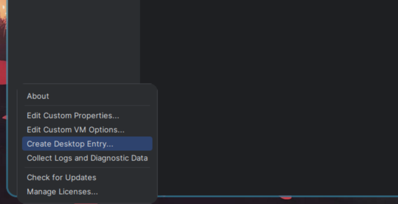

##### 安装archlinux

1. [安装教程](https://arch.icekylin.online/guide/)

> 装系统阶段，有一步操作是禁用`reflector`。但是在禁用之前,我们可以先使用其换个源：
>
> 1. archLinux在安装时提供了这个命令,但在安装好的系统中并没有它。若需要安装使用`sudo pacman -S reflector`
>
> 2. 可以用这个命令直接通过选项指定国家、按速率排序、协议、数量来更换镜像源：查询国内支持`https`协议的镜像源，安装速率选择最快的6个镜像地址,然后保存到`/etc/pacman.d/mirrorlist`镜像配置文件
>
>    ```bash
>    sudo reflector \
>        --country China \
>        --sort rate \
>        --protocol https \
>        --latest 6 \
>        --save /etc/pacman.d/mirrorlist
>    ```


##### hyprland

1. `sudo pacman -S hyprland`安装然后自个慢慢配置。(复制配置文件`sudo cp /usr/share/hyprland/hyprland.conf ~/.config/hypr/`)
2. [脚本一键安装](https://github.com/prasanthrangan/hyprdots)

> 1. 默认使用`pavucontrol`作为声音配置UI+`pipewire-pulse`(不兼容本机)


##### 代理

1. clash-verge-rev：`yay -S clash-verge-rev-bin`，然后需要配置`/etc/environment`

   ```bash
   http_proxy=127.0.0.1:7899
   https_proxy=127.0.0.1:7899
   socks_proxy=127.0.0.1:7898
   ```

2. 当然你也可以参照官方的按照过程：[官网](https://www.clashverge.dev/install.html#__tabbed_2_3)

   1. 安装 `paru`。

      1. 在`/etc/pacman.conf` 文件中写入下列内容。

      ```bash
      [archlinuxcn]
      Server = https://mirrors.ustc.edu.cn/archlinuxcn/$arch
      Server = https://mirrors.tuna.tsinghua.edu.cn/archlinuxcn/$arch
      Server = https://mirrors.hit.edu.cn/archlinuxcn/$arch
      Server = https://repo.huaweicloud.com/archlinuxcn/$arch
      ```

      2. 在终端运行下列命令。

      ```bash
      sudo pacman-key --lsign-key "farseerfc@archlinux.org"
      sudo pacman -S archlinuxcn-keyring
      sudo pacman -S archlinux-keyring # 顺带提一嘴
      sudo pacman -S paru
      ```

   2. 安装clash-verge-rev-bin:`paru -S clash-verge-rev-bin`

3. 但是目前clash-verge-rev不是很好用,使用另一个软件：

   ```bash
   sudo pacman -S v2ray v2raya
   sudo systemctl enable --now v2raya
   ```

4. 上述软件虽然很好,但是我用大白鹅daed(非常快)：安装完成后，浏览器打开`localhost:2023`后除用户名和密码之外，其他配置建议默认。

   ```bash
   sudo pacman -S dae daed
   sudo systemctl enable --now daed
   ```

5. 参考博客：

   1. [proxy](https://absx.pages.dev/articles/proxy/)
   2. [archlinux](https://arch.icekylin.online/guide/rookie/transparent#v2raya)


##### daed

1. 项目地址：[daed](https://github.com/daeuniverse/daed),虽然默认的配置已经很好用，但是还是稍微配置一下
3. 配置：待补


##### tmux

1. `sudo pacman -S tmux`

2. 安装插件管理器：`git clone https://github.com/tmux-plugins/tpm ~/.tmux/plugins/tpm`

3. 创建配置文件：`nvim ~/.tmux.conf`然后更新配置文件`tmux source ~/.tmux.conf`

   ```bash
   set -g @plugin 'tmux-plugins/tpm'
   set -g @plugin 'tmux-plugins/tmux-sensible'
   
   # 主题
   set -g @plugin 'catppuccin/tmux#latest' 
   set -g @plugin 'tmux-plugins/tpm'
   set -g @catppuccin_flavor 'mocha'
   
   run '~/.tmux/plugins/tpm/tpm'
   
   
   # image.nvim配置
   set -gq allow-passthrough on
   set -sg escape-time 10
   
   set -g default-terminal "tmux-256color"
   set -g mouse on
   set -g base-index 1
   set -g pane-base-index 1  # 设置pane编号从1开始
   set -g renumber-windows on  # 保证window编号连续
   
   
   # 快捷键
   unbind C-b
   set -g prefix C-M   # 设置tmux前缀
   
   set -g mouse on  # 开启鼠标
   set-window-option -g mode-keys vi  # 设置窗口模式为vi模式
   bind -T copy-mode-vi v send-keys -X begin-selection  # 设置vi模式下v键开始选择
   bind -T copy-mode-vi y send-keys -X copy-selection-and-cancel  # 设置vi模式下y键复制选择内容
   bind -T copy-mode-vi MouseDragEnd1Pane send-keys -X copy-selection-and-cancel  # 设置鼠标选择内容后复制
   
   # 刷新配置文件
   bind r source-file ~/.tmux.conf \; display "Reloaded config"
   
   # 关闭状态栏
   set -g status off
   ```

4. 常用命令：

   ```bash
   #启动新session：
   $ tmux [new -s 会话名 -n 窗口名]
   
   # 分离session
   tmux detach
   
   #恢复session：
   tmux at [-t 会话名]
   
   # 切入session
   tmux attach -t <session-name/session-id>
   
   #列出所有sessions
   tmux ls
   
   #关闭session
   tmux kill-session -t <sessiom-name/session-id>
   
   # 重命名session
   tmux rename-session -t 0 <new-name>
   
   #关闭整个tmux服务器：
   tmux kill-server
   
   # 列出所有快捷键，及其对应的 Tmux 命令
   tmux list-keys
   
   # 列出所有 Tmux 命令及其参数
   tmux list-commands
   
   # 列出当前所有Tmux会话的信息
   tmux info
   
   # 重新加载当前的 Tmux 配置
   tmux source-file ~/.tmux.conf
   ```

   

5. 快捷键

   | 快捷键           | 说明                                       |
   | ---------------- | ------------------------------------------ |
   | ?                | 所有快捷键，q退出                          |
   | :new sessionName | 创建新会话                                 |
   | s                | 切换会话                                   |
   | $                | 重命名当前会话                             |
   | d                | 离开会话返回shell（与tmux detach功能相同） |
   | Ctrl+z           | 挂起会话，返回shell                        |

   ### 窗口常用快捷操作

   | 快捷键 | 说明               |
   | ------ | ------------------ |
   | c      | 创建新窗口         |
   | w      | 显示窗口           |
   | 数字键 | 选择对应窗口       |
   | p      | 前一个窗口         |
   | n      | 后一个窗口         |
   | f      | 查找窗口           |
   | ,      | 重命名窗口         |
   | &      | 关闭窗口（带提示） |

   ### 窗格常用快捷键

   | 快捷键      | 说明                                        |
   | ----------- | ------------------------------------------- |
   | %           | 垂直分割                                    |
   | ”           | 水平分割                                    |
   | o           | 切换窗格                                    |
   | x           | 关闭窗格                                    |
   | space       | 切换窗格布局                                |
   | q           | 显示窗格编号，按对应数字选择窗格            |
   | {           | 与上一个窗格调换位置                        |
   | }           | 与下一个窗格调换位置                        |
   | z           | 当前窗格最大化                              |
   | !           | 取消所有窗口保留当前窗口                    |
   | Ctrl+方向键 | 以1个单元格为单位移动边缘以调整当前窗格大小 |
   | Alt+方向键  | 以5个单元格为单位移动边缘以调整当前窗格大小 |


##### pura


##### vim无法复制

找到`/usr/share/vim/vim91/defaults.vim`(`vim91`文件夹名称可能略有不同):当然临时复制可以使用`:set mouse-=a`

```bash
if has('mouse')
  if &term =~ 'xterm'
    set mouse-=a   # 改set mouse=a为set mouse-=a
  else
    set mouse=nvi
  endif
endif
```


##### 声卡驱动

```bash
sudo pacman -S sof-firmware
sudo pacman -S alsa-ucm-conf

# 通用(selected)
sudo pacman -S xf86-video-vesa
# intel
sudo pacman -S xf86-video-intel
# 英伟达：
sudo pacman -S nvidia
# ATI：
sudo pacman -S x_archlinux

# 重启
reboot

sudo pacman -S alsa-utils   
# 查看声卡信息
aplay -l

# 但是出现闪屏(pipewire-pulse似乎与sof-firmware不兼容),换pulseaudio
sudo pacman -Rns pipewire-pulse
sudo pacman -S pulseaudio
```

> 对于使用Intel和NVIDIA双显卡的系统，通常使用`nvidia`驱动和`xf86-video-intel`驱动,你可以这样操作：
>
> 1. 安装NVIDIA驱动：`sudo pacman -S nvidia nvidia-utils`
>
> 2. 安装Intel驱动：`sudo pacman -S xf86-video-intel`
>
> 3. 在UI中切换集成显卡和独立显卡间轻松切换:`yay -S optimus-manager optimus-manager-qt`、`sudo systemctl enable optimus-manager.service`(没啥用,无法启动)
>
> 4. 安装 `nvidia-prime`(用于切换显卡)：`sudo pacman -S nvidia-prime`
> 
>    ```bash
>    # 通过以下命令请将 %command% 替换为要运行的命令以使用NVIDIA独立显卡运行程序：
>    prime-run %command%
>   
>    # 运行steam游戏：
>    prime-run steam steam://rungameid/570 # 运行 Dota 2
>    prime-run steam steam://rungameid/730 # 运行 CS:GO
>    ```
> 
> 5. (可选)安装`nvidia-settings`进行配置：`sudo pacman -S nvidia-settings`
> 
> 6. 重启系统：`reboot`


##### grub美化

1. 查找`grub theme`
2. 略


##### sddm美化

1. 查找`sddm theme`
2. 略


##### vscode无法使用输入法

1. 添加启动参数`--enable-wayland-ime`
2. 或者可以直接配置`/usr/share/applications/code.desktop`(更新后会被重置)


##### 解决滚挂

1. 安装timeshift快照：`sudo pacman -S timeshift`
2. 安装之后，如果 Timeshift 没有自动备份，需要手动开启`cronie`服务：`sudo systemctl enable --now cronie.service`
3. Timeshift GUI无法在Wayland上启动,需要使用Xwayland：`sudo pacman -S xorg-xhost`。
4. 启动软件`Timeshift`,选择`btrfs`格式、存储位置、执行周期、包含`\home`即可。
5. 经常性滚动：`sudo pacman -Syu`


##### 磁盘清理

1. 常用清理命令,编写脚本如下:

   ```bash
   # $(pacman -Qtdq)为空会报错
   sudo pacman -Rns $(pacman -Qtdq) # 如上文所述，删除孤立软件包（常用）
   
   
   sudo pacman -Sc # 删除当前未安装的所有缓存包和未使用的同步数据库（可选）
   sudo pacman -Scc # 从缓存中删除所有文件，这是最激进的方法，不会在缓存文件夹中留下任何内容（一般不使用）
   paccache -r # 删除已安装和未安装包的所有缓存版本，但最近 3 个版本除外
   
   rm -rf ~/.cache/yay  # 使用yay来安装AUR中的软件包的话，可以选择清理yay的缓存
   rm -rf ~/.cache/paru 
   ```

   ```bash
   #! /bin/bash
   
   log_file=./log/auto_clean.log
   dir=$(dirname "${log_file}")
   # passwd="******"(使用明文,不安全,改为弹窗获取密码)
   password=$(zenity --password --title="password" --text="请输入您的密码")
   time=$(date "+%Y-%m/%d %H:%M:%S")
   
   # 文件创建
   if [ ! -d "$dir" ]; then
     echo "${time} ${dir} not exist,creating..." >>$log_file
     mkdir -p "$dir"
   fi
   if [ ! -f "$log_file" ]; then
     echo "${time} ${log_file} not exist,creating..." >>$log_file
     touch "$log_file"
   fi
   
   # 更新
   # echo 'y' | (echo $passwd | sudo -S pacman -Syu)
   echo "$passwd" | sudo -S pacman -Syu --noconfirm
   
   # 更新日志
   update_status=$?
   if [ $update_status -eq 0 ]; then
     echo "${time} auto_clean has update system successfully" >>$log_file
   else
     echo "${time} auto_clean update system failed" >>$log_file
   fi
   
   # 获取删除列表并判空
   list=$(echo "$passwd" | sudo -S pacman -Qtdq)
   echo -e "\n" # 换行
   if [ -n "$list" ]; then
     echo "pacman -Qtdq is not null,cleaning..." >>$log_file
     # echo 'y' | sudo pacman -Rns "$list"
     sudo pacman -Rns "$list" --noconfirm
   else
     echo "pacman -Qtdq is null..." >>$log_file
   fi
   echo -e "\n" # 换行
   
   #sudo pacman -Rns $(pacman -Qtdq)
   sudo pacman -Sc --noconfirm
   sudo pacman -Scc --noconfirm
   
   clean_status=$?
   
   if [ $clean_status -eq 0 ]; then
     echo "auto_clean has clean system successfully" >>$log_file
   else
     echo "auto_clean clean system failed" >>$log_file
   fi
   
   paccache -r
   
   rm -rf ~/.cache/yay
   ```

2. 设置日志大小`sudo journalctl --vacuum-size=50M`

3. 安装可视化磁盘空间工具`sudo pacman -S filelight`,打开`filelight`即可。


##### 输入法安装

1. 安装中文字体:

   ```bash
   sudo pacman -S adobe-source-han-sans-cn-fonts adobe-source-han-serif-cn-fonts noto-fonts-cjk wqy-microhei wqy-microhei-lite wqy-bitmapfont wqy-zenhei ttf-arphic-ukai ttf-arphic-uming noto-fonts noto-fonts-cjk noto-fonts-emoji noto-fonts-extra
   ```

2. 安装fcitx5:`sudo pacman -S fcitx5-im fcitx5-chewing fcitx5-qt fcitx5-gtk fcitx5-chinese-addons`

3. 安装rime输入法：`sudo pacman -S fcitx5-rime`

4. 环境配置：`sudo vim /etc/environment`

   ```bash
   INPUT_METHOD=fcitx
   XIM=fcitx
   XIM_PROGRAM=fcitx
   # GTK_IM_MODULE=fcitx
   QT_IM_MODULE=fcitx #(官方说不需要，但是会导致chrome中中文无法聚焦)
   XMODIFIERS=@im=fcitx
   SDL_IM_MODULE=fcitx
   GLFW_IM_MODULE=fcitx
   ```

5. 安装主题：[sougou](https://github.com/sxqsfun/fcitx5-sogou-themes)

   ```bash
   git clone --depth 1 https://github.com/sxqsfun/fcitx5-sogou-themes.git
   cd ./fcitx5-sogou-themes
   
   cp -r xxxx ~/.local/share/fcitx5/themes/ 
   ```

6. 在`~/.config/hypr/hyprland.conf `配置：

   ```bash
   exec-once=fcitx5 --replace -d
   ```
   
7. 检查输入法`fcitx5-diagnose`。

8. 输入法错乱(后续未说明则已经解决)：嗯，确实解决了，直接改用搜狗输入法`yay -S fcitx5-sogou`，略有缺陷(属性面板打不开)，但是可以使用。

9. 目前解决措施：采用拼音输入法和英语输入法(目前一切完美,在附加组件中配置拼音,然后启用云拼音并设置为Baidu),上述输入法或多或少存在一些问题待解决。最大的输入法问题解决后,这个系统就是完美的！！！


##### 电源管理

1. 安装`tlp-rdw`以及可选安装图形界面`tlpiu`：

   ```bash
   sudo pacman -S tlp tlp-rdw
   
   yay -S tlpui
   ```

2. 启动服务：

   ```bash
   sudo systemctl enable tlp.service
   sudo systemctl enable NetworkManager-dispatcher.service
   sudo systemctl mask systemd-rfkill.service # 屏蔽以下服务以避免冲突，确保 TLP 无线设备的开关选项可以正确运行
   sudo systemctl mask systemd-rfkill.socket
   ```

3. 第一次手动启动软件：`sudo tlp start`。

4. 若安装了 TLPUI 可在图形界面进行相关配置。语言可在菜单栏 `Language` 处更改。

5. 相关命令：

   ```bash
   sudo tlp-stat -b # 显示电池信息
   sudo tlp-stat -d # 显示磁盘信息
   sudo tlp-stat -e # 显示 PCI 设备信息
   sudo tlp-stat -g # 显示 GPU 信息
   sudo tlp-stat -p # 显示 CPU 信息
   tlp-stat -s # 显示系统数据信息 / 验证 TLP 服务运行状况
   ```

   


##### 包管理

1. 在archlinux上安装的软件都通过Pacman来进行管理,为了使用额外命令需要安装`pacman-contrib` ：`sudo pacman -S pacman-contrib`

2. Pacman进行软件的安装、删除、查询等：

   ```bash
   sudo pacman -S package_name # 安装软件包
   pacman -Ss # 在同步数据库中搜索包，包括包的名称和描述
   sudo pacman -Syu # 升级系统。 -y:标记刷新、-yy：标记强制刷新、-u：标记升级动作（一般使用 -Syu 即可）
   sudo pacman -Rns package_name # 删除软件包，及其所有没有被其他已安装软件包使用的依赖包
   sudo pacman -R package_name # 删除软件包，保留其全部已经安装的依赖关系
   pacman -Qi package_name # 检查已安装包的相关信息。-Q：查询本地软件包数据库
   pacman -Qdt # 找出孤立包。-d：标记依赖包、-t：标记不需要的包、-dt：合并标记孤立包
   sudo pacman -Rns $(pacman -Qtdq) # 删除孤立包
   sudo pacman -Fy # 更新命令查询文件列表数据库
   pacman -F some_command # 当不知道某个命令属于哪个包时，用来在远程软件包中查询某个命令属于哪个包（即使没有安装）
   pactree package_name # 查看一个包的依赖树
   ```

3. `yay`的用法和Pacman是基本一样的,有额外几条常用命令：

   ```bash
   yay # 等同于 yay -Syu
   yay package_name # 等同于 yay -Ss package_name && yay -S package_name
   yay -Ps # 打印系统统计信息
   yay -Yc # 清理不需要的依赖
   ```

> PS:`yay`的安装：
>
> 1. 开启32位支持库与ArchLinux中文社区仓库archlinuxcn
>
>    1. 编辑`vim /etc/pacman.conf`：
>
>       ```bash
>       # 取消注释
>       [multilib]
>       Include = /etc/pacman.d/mirrorlist
>       
>       # 添加镜像源(选一个即可)
>       [archlinuxcn]
>       Server = https://mirrors.ustc.edu.cn/archlinuxcn/$arch # 中国科学技术大学开源镜像站
>       Server = https://mirrors.tuna.tsinghua.edu.cn/archlinuxcn/$arch # 清华大学开源软件镜像站
>       Server = https://mirrors.hit.edu.cn/archlinuxcn/$arch # 哈尔滨工业大学开源镜像站
>       Server = https://repo.huaweicloud.com/archlinuxcn/$arch # 华为开源镜像站
>       ```
>
>    2. 更新数据库：`pacman -Syyu`
>
> 2. 安装`archlinuxcn`源和`yay`
>
>    ```bash
>    pacman-key --init
>                                                                                                                                                                                        
>    sudo pacman -S archlinux-keyring  # (可选,archlinux源签名)
>                                                                                                                                                                                        
>    sudo pacman -S archlinuxcn-keyring # cn源中的签名(archlinuxcn-keyring在archlinuxcn)
>    sudo pacman -S yay # yay 命令可以让用户安装 AUR 中的软件(yay 在 archlinuxcn)
>    ```


##### 编程软件

1. 温馨提示: 为防止软件安装位置遗忘，建议在用户目录下编写一个文档。

2. java：

   ```bash
   # 官网下载linux安装包
   sudo pacman -S wget
   wget https://download.oracle.com/java/17/latest/jdk-17_linux-x64_bin.tar.gz
   
   # 解压
   sudo mkdir -p /usr/local/java
   sudo tar -zxvf jdk-17_linux-x64_bin.tar.gz -C /usr/local/java
   
   # 配置环境变量
   echo 'export PATH=$PATH:/usr/local/java/jdk-17.0.12/bin' >> /etc/profile && source /etc/profile
   ```

3. annaconda：[清华镜像](https://mirrors.tuna.tsinghua.edu.cn/anaconda/archive/),实际上若是linux官方存在自己的软件发行版，最好安装官方的，适配要好一点。

   ```bash
   # 安装
   sudo pacman -S anaconda
   
   # 配置环境
   echo 'export PATH=$PATH:/opt/anaconda/bin' >> /etc/profile && source /etc/profile
   
   # pip换源
   pip config set global.index-url https://pypi.tuna.tsinghua.edu.cn/simple
   
   # 创建虚拟环境
   conda create -n ai python=3.10
   
   # conda换源(添加如下内容)
   vim ~/.condarc
   
   channels:
    - https://mirrors.tuna.tsinghua.edu.cn/anaconda/pkgs/main
    - https://mirrors.tuna.tsinghua.edu.cn/anaconda/pkgs/r
    - https://mirrors.tuna.tsinghua.edu.cn/anaconda/pkgs/msys2
    - defaults
   ```
   
4. mysql：[参考](https://blog.csdn.net/qq_40829735/article/details/120825048)

   ```bash
   # 更新源
   sudo pacman -Syy
   
   # 查看mysql包信息
   sudo pacman -Si mysql
   
   # 安装
   sudo pacman -S mysql
   
   # 初始化(注意初始用户名和密码)
   sudo mysqld --initialize --user=mysql --basedir=/usr --datadir=/var/lib/mysql
   
   # 启动服务
   sudo systemctl start mysqld.service
   sudo systemctl enable mysqld.service
   
   # 登录
   mysql -u root -p
   
   # 修改密码
   alter  user 'root'@'localhost' identified  by '123456';
   ```

   > 报错：ERROR 2002 (HY000): Can't connect to local MySQL server through socket '/tmp/mysql.sock' (2):
   >
   > 1. 这个`mysql.sock`应该是mysql的主机和客户机在同一host(物理服务器)上的时候，使用unix domain socket做为通讯协议的载体，它比tcp快。
   >
   > 2. 解决方式(1):使用`mysql -u root -h 127.0.0.1 -p`而非`mysql -u root -h localhost -p`,或者直接使用`-S`参数指定`sock`文件位置。
   >
   > 3. 解决方式(2):
   >
   >    1. 运行`mysql_config --socket` 命令，它会输出`mysql`用于连接的默认`sock`文件位置。
   >
   >    2. 配置`my.cnf`:
   >
   >       1. 通过`sudo find / -name my.cnf`找到对应的文件
   >
   >       2. 编辑文件`/etc/mysql/my.cnf `(可能i位置不一样)
   >
   >          ```bash
   >          [mysqld]
   >          datadir=/var/lib/mysql
   >          # socket=/run/mysqld/mysqld.sock
   >          # 配置成上述sock文件地址
   >          socket=/tmp/mysql.sock
   >          ```
   >
   >    3. 但是由于`PrivateTmp=true`为目录名称中提到的服务启用了安全temp系统功能,还是无法定位sock文件：
   >
   >       1. 通过`sudo find / -name mysql.sock`找到的是：`/tmp`目录下出现`system-private`文件夹
   >
   >          ```bash
   >          sudo find / -name mysql.sock         
   >          /tmp/systemd-private-a39c23720e4245c19eb02657e83e14a0-mysqld.service-5vYhrX/tmp/mysql.sock
   >          ```
   >       
   >       2. `grep -R PrivateTmp /etc/systemd/`找到`mysql.service`
   >
   >          ```bash
   >          $ grep -R PrivateTmp /etc/systemd/
   >          /etc/systemd/system/multi-user.target.wants/mysqld.service:PrivateTmp=false
   >          /etc/systemd/system/dbus-org.bluez.service:PrivateTmp=true
   >          /etc/systemd/system/bluetooth.target.wants/bluetooth.service:PrivateTmp=true
   >          /etc/systemd/system/dbus-org.freedesktop.timesync1.service:PrivateTmp=yes
   >          /etc/systemd/system/sysinit.target.wants/systemd-timesyncd.service:PrivateTmp=yes
   >          ```
   >       
   >       3. 修改找到的`/etc/systemd/system/multi-user.target.wants/mysqld.service`,关闭`PrivateTmp=false`
   >       
   >       4. 由于修改`service`文件,要通知`systemd`重载此配置文件,而后可以选择重启,使用命令`systemctl daemon-reload`
   >       
   >       5. 使用`sudo rm -rf /tmp/*`删除临时文件后重启`mysql`服务：`sudo systemctl restart mysqld.service`

5. maven:

   1. 安装`sudo pacman -S maven`

   2. 配置环境：`/etc/profile`，配置完成后运行`mvn-v`测试

      ```bash
      export MAVEN_HOME=/usr/share/java/maven
      export PATH=$PATH:$MAVEN_HOME/bin
      ```

   3. 修改maven配置：`vim /usr/share/java/maven/conf/settings.xml `

      ```xml
      <localRepository>~/.mvn_repo</localRepository>
      
      <mirror>
          <id>nexus-aliyun</id>
          <mirrorOf>central</mirrorOf>
          <name>Nexus aliyun</name>
          <url>http://maven.aliyun.com/nexus/content/groups/public</url>
      </mirror>
      ```

6. git：`sudo pacman -S git`

7. idea:

   1. 官方下载：[idea](https://www.jetbrains.com/idea/download/?section=linux#section=linux-version)

      ```bash
      wget https://www.jetbrains.com/idea/download/download-thanks.html?platform=linux
      tar -xvf ideaIU-2024.2.1.tar.gz 
      mkdir /opt/idea
      mv ./idea-IU-242.21829.142  /opt/idea
      
      # 启动
      cd /opt/idea/idea-IU-242.21829.142/bin
      ./idea.sh
      ```

   2. 配置快捷方式：

      <br>

   3. 插件:

      1. Translation
      2. Maven Helper
      3. Material Theme UI
      4. MyBatisX
      5. CodeGlance Pro
      6. Alibaba Java Code Guidelines
      7. Nord
      8. LeetCode Editor
      9. GitToolBox
      10. Key Promoter X
      11. Codeium
      12. Power Mode II
      13. Background Image Plus +
      14. .ignore
      15. RESTFul-Tool
      16. Github Copilot
      17. CodeGeeX
      18. iBlog
      19. IdeaVim
      20. Json Parser
      21. Statistic

8. pycharm:同上

9. picgo:

   1. [github-picgo](https://github.com/Molunerfinn/PicGo/releases)下载`appimage`格式软件

   2. 赋予运行权限：`chmod +x your_file.appimage`

   3. 运行appimage格式文件：`./your_file.appimage`

   4. 可能发现无法运行提示,安装fuse2:`sudo pacman -S fuse2`

      ```vhdl
      dlopen(): error loading libfuse.so.2
      
      AppImages require FUSE to run. 
      You might still be able to extract the contents of this AppImage 
      if you run it with the --appimage-extract option. 
      See https://github.com/AppImage/AppImageKit/wiki/FUSE 
      ```

10. typora:`yay -S typora pandoc`

11. drawio: 

    1. [github下载`appimage`格式](https://github.com/jgraph/drawio-desktop)

    2. 赋予运行权限：`chmod +x your_file.appimage`

    3. 通过`your_file.appimage`运行,可以配置一个别名实现快速启动。

12. vsdode:`yay -S visual-studio-code-bin`

13. neovim:参考之前笔记

14. node.js:` sudo pacman -S nodejs npm `后运行`node -v`查看是否安装成功。 (此外：`yay -S nvm `)

15. docker:

    1. 安装docker: `sudo pacman -S docker`

    2. 安装docker compose: `sudo pacman -S docker-compose`

    3. 配置启动服务：
    
       ```bash
       sudo systemctl enable --now docker.service
       
       sudo systemctl start docker.service
       
       sudo systemctl status docker.service
       
       sudo systemctl stop docker.service
       ```

    4. 添加当前用户到用户组,以便使用`docker`命令：
    
       ```bash
       sudo gpasswd -a $USER docker
       
       # 重启
       reboot
       ```

    5. 配置镜像加速:编辑文件(可能需要先创建文件夹)`sudo vim /etc/docker/daemon.json`配置清华镜像加速
    
       ```json
       {
           "registry-mirrors": ["https://docker.mirrors.ustc.edu.cn"]
       }
       ```

    6. 重启服务：
    
       ```bash
       sudo systemctl daemon-reload
       sudo systemctl restart docker.service
       ```

       
    
       


##### 其他软件

1. chrome：`yay -S google-chrome`

2. qq:`yay -S linuxqq`

3. qq音乐:`yay qqmusic-electron`

4. 微信:`yay -electronic-wechat-uos-bin`(好像也行)

   ```bash
   git clone https://aur.archlinux.org/wechat-universal-bwrap.git
   cd wechat-universal-bwrap
   makepkg -si
   ```

5. wps:`yay -S wps-office-cn ttf-wps-fonts`。若wps打开pdf卡死,尝试安装`yay -S libtiff5`。

6. 百度网盘:`sudo pacman -Sy baidunetdisk-bin`


##### dns解析

使用`sudo vim /etc/resolv.conf`编辑配置文件,编辑完成后运行`sudo systemctl restart NetworkManager`重启网络服务。

```bash
# v2rayA DNS hijack

# aliyun
nameserver 223.6.6.6

# tengxun
nameserver 119.29.29.29

#中国互联网网络信息中心CNNIC
nameserver 114.114.114.114

# google
nameserver 8.8.8.8
nameserver 8.8.4.4

# Cloudflare
nameserver 1.1.1.1 
nameserver 1.0.0.1

# 微软DNS
nameserver 4.2.2.1
nameserver 4.2.2.2
```

但是上述操作在wsl中不起作用，wsl的文件是自动生成的，每次启动会被覆盖。修改`sudo vim /etc/wsl.conf`后重启wsl:

```bash
[boot]
systemd=true

[automount]
enabled = true
options = "metadata"
mountFsTab = true

# 配置不自动生成dns解析配置
[network]
generateResolvConf = false
```

运行`cat /etc/resolv.conf`查看配置是否生效，显然没有生效,这里它提示我们`/etc/resolv.conf`是指向` /run/systemd/resolve/stub-resolv.conf`的一个链接：

```tex
# This is /run/systemd/resolve/stub-resolv.conf managed by man:systemd-resolved(8).
# Do not edit.
#
# This file might be symlinked as /etc/resolv.conf. If you're looking at
# /etc/resolv.conf and seeing this text, you have followed the symlink.
#
# This is a dynamic resolv.conf file for connecting local clients to the
# internal DNS stub resolver of systemd-resolved. This file lists all
# configured search domains.
#
# Run "resolvectl status" to see details about the uplink DNS servers
# currently in use.
#
# Third party programs should typically not access this file directly, but only
# through the symlink at /etc/resolv.conf. To manage man:resolv.conf(5) in a
# different way, replace this symlink by a static file or a different symlink.
#
# See man:systemd-resolved.service(8) for details about the supported modes of
# operation for /etc/resolv.conf.
```

于是乎，我们之前已经关闭自动生成，现在直接删除链接，让`/etc/resolv.conf`摆脱命运的控制：

```bash
# 假死脱身
sudo rm /etc/resolv.conf
sudo vim /etc/resolv.conf
```


##### sudo密码不对(未经验证)

当在Linux系统中使用sudo命令时如果持续提示密码错误,可能是因为当前用户未被添加到sudoers列表。要解决此问题,需以root权限编辑`/etc/sudoers`文件,将用户添加到允许使用sudo的列表中。执行`sudo visudo `或者`sudo vim /etc/sudoers`

```bash
username ALL=(ALL)  ALL
```


##### git配置

1. 基本信息配置：

   ```bash
   git config --global user.name "xx" # 这里是 github 注册的账号（用户名）
   git config --global user.email "xx@xx.com" # github 注册的邮箱
   
   # 查看 git 账号信息
   git config user.name
   git config user.email
   
   # 或者直接使用以下命令就可以看到整个账户信息
   git config --list
   ```

2. 配置公钥：`ssh-keygen -t rsa -C "xxx@xxx.com"`生成ssh key,并配置到github。

3. 配置端口号：`ssh`阻塞了`22`号端口,给它换一个端口即可。编辑文件`vim  ~/.ssh/config `

   ```bash
   # 在末尾加入以下内容
   Host github.com  
       User myarch  
       Hostname ssh.github.com 
       PreferredAuthentications publickey  
       IdentityFile ~/.ssh/id_rsa 
       Port 443
   ```

4. 测试链接`ssh -vT git@github.com`


##### 软件卡死

1. 获取软件进程：` ps aux | grep wps`(wps为例)
2. 使用`kill -9 <pid>`杀死进程


##### rar解压

1. 安装:`sudo pacman -S unrar`
2. 常用参数：
   - a : 添加到压缩文件
   - r : 递归处理
   - x : 以绝对路径解压文件
3. 解压:`unrar x <file_name>.rar`
4. 附带密码解压:`unrar x -p <password> <file_name>.rar`
5. 递归压缩文件：`rar a -r test.rar <file>`


##### wsl

1. 下载安装包：[arch.zip](https://github.com/yuk7/ArchWSL),解压后运行exe文件(注意在合适的位置)。

2. 运行`wsl`启动，使用`passwd`设置root用户密码。

3. 设置root默认编辑器：`vim ~/.bash_profile`

   ```bash
   export EDITOR='vim'
   ```

4. 换源和安装yay：

   1. `vim /etc/pacman.d/mirrorlist`添加如下源：

      ```tex
      # 中国科学技术大学开源镜像站
      Server = https://mirrors.ustc.edu.cn/archlinux/$repo/os/$arch 
      # 清华大学开源软件镜像站
      Server = https://mirrors.tuna.tsinghua.edu.cn/archlinux/$repo/os/$arch 
      # 华为开源镜像站
      Server = https://repo.huaweicloud.com/archlinux/$repo/os/$arch 
      # 兰州大学开源镜像站
      Server = http://mirror.lzu.edu.cn/archlinux/$repo/os/$arch 
      ```

   2. 开启32位支持库与ArchLinux中文社区仓库archlinuxcn。编辑`vim /etc/pacman.conf`：

      ```bash
      # 取消注释
      [multilib]
      Include = /etc/pacman.d/mirrorlist
      
      # 添加镜像源(选一个即可)
      [archlinuxcn]
      Server = https://mirrors.ustc.edu.cn/archlinuxcn/$arch # 中国科学技术大学开源镜像站
      Server = https://mirrors.tuna.tsinghua.edu.cn/archlinuxcn/$arch # 清华大学开源软件镜像站
      Server = https://mirrors.hit.edu.cn/archlinuxcn/$arch # 哈尔滨工业大学开源镜像站
      Server = https://repo.huaweicloud.com/archlinuxcn/$arch # 华为开源镜像站
      ```

   3. 配置签名：

      ```bash
      sudo pacman-key --init
      
      sudo pacman-key --populate
      
      sudo pacman -Syy archlinux-keyring # archlinux源签名
      
      sudo pacman -Syyu
      ```

   4. 安装`archlinuxcn`源和`yay`

      ```bash
      sudo pacman -S archlinuxcn-keyring # cn源中的签名(archlinuxcn-keyring在archlinuxcn)
      sudo pacman -S yay # yay 命令可以让用户安装 AUR 中的软件(yay 在 archlinuxcn)
      ```

5. 创建新用户：

   1. `useradd -m -G wheel -s /bin/bash myusername`创建用户

   2. `passwd myusername`设置密码

   3. `EDITOR=vim visudo`打开配置，设置用户组权限：

      ```bash
      # 取消注释
      %wheel ALL=(ALL:ALL) ALL
      ```

   4. 退出wsl，设置启动时默认用户:`./Arch.exe config --default-user {username}`

6. 安装字体：

   ```bash
   sudo pacman -S adobe-source-han-sans-cn-fonts adobe-source-han-serif-cn-fonts noto-fonts-cjk wqy-microhei wqy-microhei-lite wqy-bitmapfont wqy-zenhei ttf-arphic-ukai ttf-arphic-uming noto-fonts noto-fonts-cjk noto-fonts-emoji noto-fonts-extra
   ```

7. 修改编码：

   1. `vim /etc/locale.gen`去掉`en_US.UTF-8 UTF-8`以及`zh_CN.UTF-8 UTF-8`行前的注释符号。
   2. 运行`locale-gen`。
   3. `echo 'LANG=en_US.UTF-8'  > /etc/locale.conf`

8. 显示信息：`pacman -S fastfetch`

9. 基本软件安装：`sudo pacman -S base base-devel git curl wget neofetch net-tools dnsutils inetutils`

10. wsl:检测到localhost代理配置，但未镜像到WSL。NAT模式下的WSL不支持localhost代理。C:\Users\<your_username>目录下创建一个.wslconfig文件，然后在文件中写入如下内容:

    ```bash
    [experimental]
    autoMemoryReclaim=gradual  
    networkingMode=mirrored
    dnsTunneling=true
    firewall=true
    autoProxy=true
    ```

11. 配置zsh:

    1. ` sudo pacman -S zsh`安装。

    2. 配置为当前用户的默认shell：`chsh -s /bin/zsh`或者`chsh -s $(which zsh)`(若不存在which先安装基本软件`pacman -S base-devel`)，`echo $SHELL`查看当前默认shell。其他用户登录时，可能会有一个选项，选择0生成`~/.zshrc`配置文件即可。

    3. 安装`oh-my-zsh`:`sh -c "$(curl -fsSL https://raw.githubusercontent.com/ohmyzsh/ohmyzsh/master/tools/install.sh)"`

    4. 定装一个powerlevel10k:`git clone --depth=1 https://gitee.com/romkatv/powerlevel10k.git ${ZSH_CUSTOM:-$HOME/.oh-my-zsh/custom}/themes/powerlevel10k`

    5. 装完后使用 `vim ~/.zshrc`配置好 `ZSH_THEME="powerlevel10k/powerlevel10k"`，运行`p10k configure`配置自定义设置。

    6. 安装几个插件(仅对当前用户生效)：

       ```shell
       # ubuntu安装git
       sudo apt update
       sudo apt install git
       
       # zsh-syntax-highlighting:终端命令语法高亮
       git clone https://github.com/zsh-users/zsh-syntax-highlighting ~/.oh-my-zsh/plugins/zsh-syntax-highlighting
       
       
       # zsh-autosuggestions:自动补全
       git clone https://github.com/zsh-users/zsh-autosuggestions ~/.oh-my-zsh/plugins/zsh-autosuggestions
       
       ```

    7. `vim ~/.zshrc`编辑文件，添加插件：

       ```text
       plugins=(
       ...  # 之前已经声明的插件名称
       zsh-autosuggestions
       zsh-syntax-highlighting
       )
       ```

    8. 运行`source ~/.zshrc`重新加载配置文件。

12. root 下 vim 无法复制: 编辑`/usr/share/vim/vim91/defaults.vim`(`vim91`文件夹名称可能略有不同):当然临时复制可以使用`:set mouse-=a`

    ```bash
    if has('mouse')
      if &term =~ 'xterm'
        set mouse-=a   # 改set mouse=a为set mouse-=a
      else
        set mouse=nvi
      endif
    endif
    ```

13. 配置几个命令别名`vim ~/.zshrc`编辑文件：

    ```bash
    # my config
    fastfetch
    cd
    alias ..="cd ../"
    alias ...="cd ../../"
    alias ll="ls -al"
    alias vi='nvim'
    alias v='nvim'
    alias leetcode="nvim leetcode.nvim"
    alias d="cd /mnt/d/"
    ```

    

    
