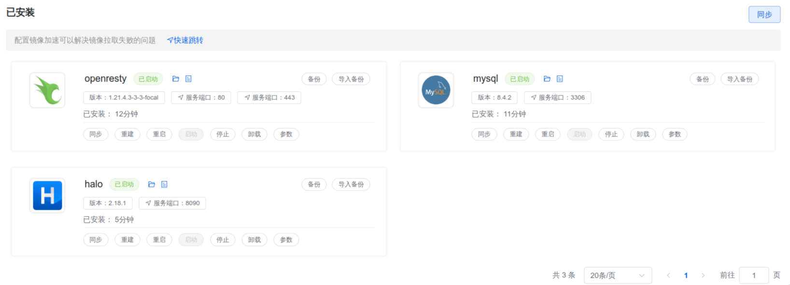
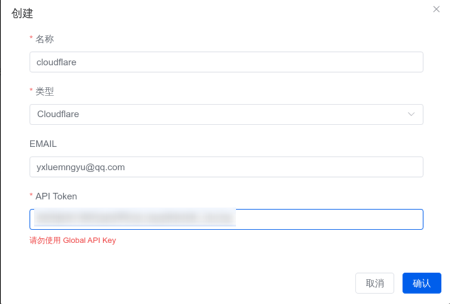

##### ssh连接终端色彩

1. 本人使用`kitty`本地终端,u服务器为ubuntu22.04。

2. 查看终端：

   ```bash
   $ echo $TERM
   xterm-kitty
   ```

3. 配置：`vim ~/.bashrc`,配置完成后`souce ~/.bashrc`重新加载配置文件使其生效。

   ```bash
   # force_color_prompt=yes(下面设置了,没必要打开)
   
   # 添加
   if [ -n "$PS1" ]; then
     if [ "$TERM" = "xterm-kitty" ]; then
       export TERM=xterm-256color
     fi
     force_color_prompt=yes
     if [ -n "$force_color_prompt" ]; then
       PS1='${debian_chroot:+($debian_chroot)}\[\033[01;32m\]\u@\h\[\033[00m\]:\[\033[01;34m\]\w\[\033[00m\]\$ '
     fi
   fi
   ```


##### 创建新用户

1. 购买云服务器后,创建新用户`fish`

   ```bash
   useradd -r -s /bin/bash -m fish
   
   passwd fish
   ```

2. 配置用户,使之可以使用`sudo`命令：`vim /etc/sudoers`添加

   ```bash
   fish    ALL=(ALL:ALL) ALL
   ```


##### 安装docker

1. 在安装1panel会自动安装`docker`和`docker-compose`,不需要手动安装。

2. 删除和安装依赖：

   ```bash
   #安装前先卸载操作系统默认安装的docker，
   sudo apt-get remove docker docker-engine docker.io containerd runc
   
   #安装必要支持
   sudo apt install apt-transport-https ca-certificates curl software-properties-common gnupg lsb-release
   
   ```

3. 配置阿里镜像、安装docker-ce：

   ```bash
   # 阿里源（推荐使用阿里的gpg KEY）
   curl -fsSL https://mirrors.aliyun.com/docker-ce/linux/ubuntu/gpg | sudo gpg --dearmor -o /usr/share/keyrings/docker-archive-keyring.gpg
   
   #添加 apt 源:
   #阿里apt源
   echo "deb [arch=$(dpkg --print-architecture) signed-by=/usr/share/keyrings/docker-archive-keyring.gpg] https://mirrors.aliyun.com/docker-ce/linux/ubuntu $(lsb_release -cs) stable" | sudo tee /etc/apt/sources.list.d/docker.list > /dev/null
   
   
   #更新源
   sudo apt update
   sudo apt-get update
   
   # 安装
   sudo apt install docker-ce docker-ce-cli containerd.io
   
   #查看Docker版本
   sudo docker version
   
   #查看Docker运行状态
   sudo systemctl status docker
   
   # 添加当前用户到docker组
   sudo usermod -aG docker $USER
   ```

4. 报错：`The package hostguard needs to be reinstalled, but I can't find an archive for it.`解决措施：编辑`/var/lib/dpkg/status`删除对应包的信息。

5. 安装 docker-compose：`apt install docker-compose`。


##### 1panel

1. 安装[1panel面板](https://1panel.cn/docs/installation/online_installation/): 会在在线安装`docker`和`docker-compose`

   ```tex
   安装目录:		默认即可
   端口：			 默认即可,后续需要在安全组中开放
   面板安全入口：	   后续登录的url的部分,可修改
   用户名：
   密码：
   ```

   > ` 1pctl user-info`命令可获取安全入口

2. 配置云服务器安全组,开放所需端口。

   <br>

3. 参考docker笔记搭建自定义`docker hub`镜像加速网站。

4. 配置容器设置,添加自建docker镜像加速网址：

   <br>

5. 配置服务器主机地址：

   <br>


##### Halo框架

1. 采用`1panel`面板安装`Halo`：

   <br>

2. 配置安全组,开放`Halo`所需端口：

   <br>

3. 访问`Halo`安装主题插件：注意安装`Halo`时配置客户端外部访问！！！

   <br>

   


##### ~~反向代理~~(不采用)

1. 由于无法对`ip:port`配置域名解析,只能为`ip`进行域名解析,需要使用

2. 当然也可以在`docker`中配置`nginx`,但是略显麻烦,h暂时不考虑

3. 安装`nginx`:

   ```bash
   sudo apt-get update
   sudo apt-get install nginx
   ```

4. 配置文件通常位于`/etc/nginx/nginx.conf` 或 `/etc/nginx/sites-available/default`,你可以在该文件中配置反向代理:

   ```bash
   http{
       # ...
       server {
           listen 80;  # 监听 80 端口，处理 HTTP 请求
           server_name example.com;  # 指定处理的域名
   
           location / {
               proxy_pass http://123.45.67.89:8080;  # 将请求转发到目标 IP 和端口
               proxy_set_header Host $host;  # 保持主机头信息
               proxy_set_header X-Real-IP $remote_addr;  # 保持客户端的真实 IP 地址
               proxy_set_header X-Forwarded-For $proxy_add_x_forwarded_for;  # 转发客户端的 IP
               proxy_set_header X-Forwarded-Proto $scheme;  # 转发协议（http 或 https）
           }
       }
   }
   ```

   ```bash
   http{
       # ...
       server {
           listen 80;
           server_name blog.dreamfish.cc; 
   
           location / {
               proxy_pass http://localhost:8080;  
               proxy_set_header Host $host; 
               proxy_set_header X-Real-IP $remote_addr;
               proxy_set_header X-Forwarded-For $proxy_add_x_forwarded_for;
               proxy_set_header X-Forwarded-Proto $scheme;
           }
       }
   }
   ```

5. 通过`sudo nginx -t`命令来测`Nginx`配置是否正确,如果配置正确，你会看到 `syntax is ok` 和 `test is successful` 的消息。

6. 测试成功后，运行`sudo systemctl reload nginx`重新加载`Nginx`以应用新的配置。

   ```bash
   sudo systemctl enable nginx
   sudo systemctl start nginx
   sudo systemctl status nginx.service
   ```

   


##### openresty

1. 不使用`ngnix`配置反向代理,直接使用之前的`openresty`配置:由于配置过一次,无法演示,应用选择halo然后填入自己的域名即可。

   <br>

   

2. 在`cloudflare`配置域名解析到服务器主机：不要配置代理,不然会出错,仅`DNS`就好！！！

   <br>

   > `nslookup blog.dreamfish.cc`查看网站主机地址,`archlinux`安装`sudo pacman -S sudo bind`即可。若使用了`cloudflare`代理得到的可能不是你的主机地址。可以在上述配置中关闭代理改为仅`DNS`即可。

3. 此时访问会发现显示`此网站无法提供安全连接blog.dreamfish.cc 发送的响应无效。 ERR_SSL_PROTOCOL_ERROR`。

4. 接下来就是为网站申请证书：

   1. 建ACME账户：密钥算法默认。

      <br>

      <br>

   2. 创建Cloudflare API Token:

      ```tex
      登录到你的Cloudflare账户。
      在右上角转到“我的个人资料” > “API令牌” > “创建令牌”。
      找到第一行“API 令牌模板”中的“编辑区域 DNS”模板，点击使用模板。
      在编辑模板中找到“区域资源”，选择你的域。
      点击“继续以显示摘要“，继续”创建令牌“
      保存生成的Token，稍后在1Panel中会用到
      ```

   3. `1Panel`中添加你的`Cloudflare DNS`账户:类型选择`cloudflare`,邮箱是`cloudflare`的注册邮箱：

      <br><br>

   4. 申请证书：密钥算法与之前一致

      <br><br>

5. 配置`HTTPS`：

   <br><br>

6. 修改`halo`的参数配置,配置外访地址为自定义域名,不然后面h生成的站点地图的url不正确

   <br>


##### 配置Halo


