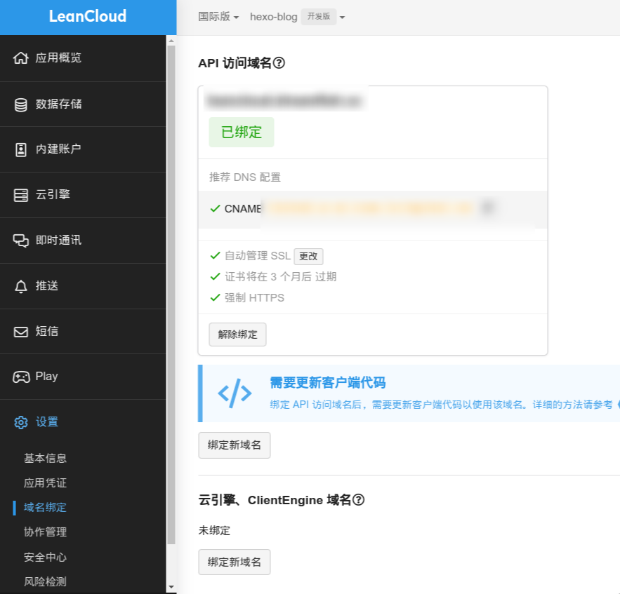

> 1. halo博客的一些自定义配置，本人采用`1panel`搭建halo博客，主题为`Butterfly` 。由于主题不同、搭建环境不同会导致配置不一致，需要自行斟酌，修改或者配置之前建议备份原文件(手动复制一份)。此外下述自定义文件最好保留一份，暂时并不知晓主题更新是否会覆盖对应目录。
> 2. 对于下面提到和使用的一些js和css文件可以下载下来上传到halo附件中然后在页面中引用，之前使用官方的cdn加速链接访问，加载很慢甚至有时候访问不上导致页面无法正常加载。


------

#### 折腾配置

##### 社交图标

1. bilibili：`<i class="fa-brands fa-bilibili"></i>`
2. Rss：`<i class="fa fa-rss"></i>`
3. home: `<i class="fas fa-home"></i>`
4. archives: `<i class="fas fa-archive"></i>`
5. tags: `<i class="fas fa-tags"></i>`
6. categories: `<i class="fas fa-folder-open"></i>`
7. 娱乐: `<i class="fa-solid fa-gamepad"></i>`

8. artitalk: `<i class="fa fa-comments"></i>`、`<i class="fa-regular fa-message"></i>`

9. music: `<i class="fas fa-music"></i>`
10. about: `<i class="fa-solid fa-meteor"></i>`、`<i class="fa-brands fa-meta"></i>`、`<i class="fa-regular fa-face-meh-blank"></i>`
11. link: `<i class="fa-solid fa-link"></i>`

> 菜单中配置菜单项(归档、主页等)图标只需要填写class属性的值。主题的社交项中配置图标需要自行斟酌。[图标网站](https://fontawesome.com/)


##### **配置音乐播放器**

1. 官网：[MetingJS](https://github.com/metowolf/MetingJS)

2. 配置过程：在Halo的设置里配置代码注入：

   1. 在全局head注入配置：

      ```html
      <link rel="stylesheet" href="https://cdn.jsdelivr.net/npm/aplayer/dist/APlayer.min.css">
      <script src="https://cdn.jsdelivr.net/npm/aplayer/dist/APlayer.min.js"></script>
      <!-- require MetingJS -->
      <script src="https://cdn.jsdelivr.net/npm/meting@2/dist/Meting.min.js"></script>
      ```

   2. 在全局页脚配置：

      ```html
      <meting-js
          server="netease" 
          type="playlist"  
          id="你的歌单id"  
          fixed="true"     
          mini="true"     
          autoplay="true">
      </meting-js>
      ```


##### 主题插入随机图片api

1. docker搭建自己的随机图片api：[random-](http://60.204.217.126:8090/archives/dockerda-jian-ge-ren-sui-ji-tu-pian-api)[image](https://dreamfish.cc/archives/dockerda-jian-ge-ren-sui-ji-tu-pian-api)[-api](http://60.204.217.126:8090/archives/dockerda-jian-ge-ren-sui-ji-tu-pian-api)(博客中的自定义部分待补)
2. 在butterfly主题配置中填入api地址即可。
3. 如果不希望每次刷新都调用api刷新图片，可以在应用市场安装静态缓存插件。只在每次更新缓存时刷新图片，其他时候不会调用，这样避免图片一直变动。


##### Live2d看板娘

1. 安装插件：应用市场搜索live2d看板娘
2. 在插件设置中配置自己的Live2d模型地址 ：[docker](https://dreamfish.cc/archives/dockerda-jian-live2d-api)[搭](https://dreamfish.cc/dockerda-jian-live2d-api)[建](https://dreamfish.cc/archives/dockerda-jian-live2d-api)[live2d api](https://dreamfish.cc/dockerda-jian-live2d-api)


##### 音乐播放页

1. 进入Halo博客主题的目录,在`themes`文件夹(我的是`/opt/1panel/apps/halo/halo/data/themes/`)中找到当前使用的主题`Butterfly`。

2. 同样使用[MetingJS](https://github.com/metowolf/MetingJS)

3. 此前建议先阅读一下主题作者配置的模板和官方的[Halo开发者文档](https://docs.halo.run/developer-guide/theme/template-route-mapping)，一般位于主题目录的`templates`目录下,我找到`page.html`(应该是该主题的独立页模板)：

   ```html
   <!DOCTYPE html>
   <html
         xmlns:th="https://www.thymeleaf.org"
         th:replace="~{modules/layout :: layout (
                     page = 'single',
                     title = ${singlePage.spec.title},
                     head = ~{::head},
                     above = ~{::above},
                     content = ~{::content},
                     js = ~{::js}
                     )}">
       >
       <th:block th:fragment="head">
           <style th:inline="css"
                  th:with="above_background= ${is_body_bg_http ? '' : 'url(' + (#strings.isEmpty(singlePage.spec.cover )  ? theme.config.index.above_background : singlePage.spec.cover )+ ')'}">
               .above {
                   --above-background: /*[(${above_background})]*/ transparent;
               }
           </style>
           <link rel="preload stylesheet" as="style" th:href="${assets_link+'/plugins/fancybox/fancybox.min.css'}">
           <th:block th:if="${theme.config.code.enable}">
               <link rel="preload stylesheet" as="style" th:href="${assets_link+'/plugins/prism/prism.min.css'}">
               <link rel="alternate stylesheet" onload="this.rel='stylesheet'"
                     data-code-theme="light"
                     disabled
                     th:href="${assets_link+ '/plugins/prism/themes/prism-'+theme.config.code.theme_light+'.css'}">
               <link rel="alternate stylesheet" onload="this.rel='stylesheet'"
                     data-code-theme="dark"
                     disabled
                     th:href="${assets_link+'/plugins/prism/themes/prism-'+theme.config.code.theme_dark+'.css'}">
               <script type="text/javascript" th:src="${assets_link+'/plugins/prism/prism.min.js'}"></script>
           </th:block>
           <link rel="stylesheet" th:href="${assets_link+'/css/single.min.css' + theme_version}">
           <script id="single-script" th:inline="javascript">
               window.PageConfig = {
                   code:/*[[${theme.config.code}]]*/ {},
               };
               document.getElementById('single-script').remove();
           </script>
       </th:block>
   
       <section
                th:fragment="above"
                th:if="${theme.config.single.enable_above}"
                class="above relative w-100">
           <h1 class="absolute above-public-title font-weight-400 margin-0 left-0 right-0 text-center"
               th:text=" ${singlePage.spec.title}"></h1>
       </section>
   
       <th:block th:fragment="content">
           <section class="container card">
   
               <article th:utext="${singlePage.content.content}"
                        th:class="'render-html animated fadeIn single_code_select '+${ theme.config.code.enable_line ? 'line-numbers' : ''} + ${ !theme.config.single.enable_h_title ? ' enable_h_title' : ''}"></article>
           </section>
   
           <th:block th:replace="~{modules/public:: aside}"></th:block>
       </th:block>
   
       <th:block th:fragment="js">
           <script type="text/javascript" th:src="${assets_link+'/js/single.min.js' + theme_version}"></script>
       </th:block>
   </html>
   ```

4. `templates`目录下新增一个自定义`music.html`模板并沿用主题作者的页面配置，并在其中合适位置加入所需配置：

   ```html
   <!DOCTYPE html>
   <html
         xmlns:th="https://www.thymeleaf.org"
         th:replace="~{modules/layout :: layout (
                     page = 'single',
                     title = ${singlePage.spec.title},
                     head = ~{::head},
                     above = ~{::above},
                     content = ~{::content},
                     js = ~{::js}
                     )}">
       >
       <th:block th:fragment="head">
           <!--========================================================-->
           <link rel="stylesheet" href="https://cdn.jsdelivr.net/npm/aplayer/dist/APlayer.min.css">
           <script src="https://cdn.jsdelivr.net/npm/aplayer/dist/APlayer.min.js"></script>
           <!-- require MetingJS -->
           <script src="https://cdn.jsdelivr.net/npm/meting@2/dist/Meting.min.js"></script>
           <!--========================================================-->
           <style th:inline="css"
                  th:with="above_background= ${is_body_bg_http ? '' : 'url(' + (#strings.isEmpty(singlePage.spec.cover )  ? theme.config.index.above_background : singlePage.spec.cover )+ ')'}">
               .above {
                   --above-background: /*[(${above_background})]*/ transparent;
               }
           </style>
           <link rel="preload stylesheet" as="style" th:href="${assets_link+'/plugins/fancybox/fancybox.min.css'}">
           <th:block th:if="${theme.config.code.enable}">
               <link rel="preload stylesheet" as="style" th:href="${assets_link+'/plugins/prism/prism.min.css'}">
               <link rel="alternate stylesheet" onload="this.rel='stylesheet'"
                     data-code-theme="light"
                     disabled
                     th:href="${assets_link+ '/plugins/prism/themes/prism-'+theme.config.code.theme_light+'.css'}">
               <link rel="alternate stylesheet" onload="this.rel='stylesheet'"
                     data-code-theme="dark"
                     disabled
                     th:href="${assets_link+'/plugins/prism/themes/prism-'+theme.config.code.theme_dark+'.css'}">
               <script type="text/javascript" th:src="${assets_link+'/plugins/prism/prism.min.js'}"></script>
           </th:block>
           <link rel="stylesheet" th:href="${assets_link+'/css/single.min.css' + theme_version}">
           <script id="single-script" th:inline="javascript">
               window.PageConfig = {
                   code:/*[[${theme.config.code}]]*/ {},
               };
               document.getElementById('single-script').remove();
           </script>
       </th:block>
   
       <section
                th:fragment="above"
                th:if="${theme.config.single.enable_above}"
                class="above relative w-100">
           <h1 class="absolute above-public-title font-weight-400 margin-0 left-0 right-0 text-center"
               th:text=" ${singlePage.spec.title}"></h1>
       </section>
   
       <th:block th:fragment="content">
           <section class="container card">
               <!--删除文章内容显示-->
               <!--========================================================-->
               <!--注意开启互斥,防止与右下角播放器一同播放-->
               <meting-js server="netease" type="playlist" id="你的歌单id" mutex="true" list-max-height="600px" </meting-js>
               <!--========================================================-->
           </section>
           <th:block th:replace="~{modules/public:: aside}"></th:block>
       </th:block>
   
       <th:block th:fragment="js">
           <script type="text/javascript" th:src="${assets_link+'/js/single.min.js' + theme_version}"></script>
       </th:block>
   </html>
   ```

5. 配置在 `theme-butterfly`主题文件夹下配置`theme.yaml`，在`spec`节点下添加自定义模板的配置，其中`type`模板类型，目前支持 `post\page\category`。

   ```yaml
   spec:
       customTemplates:
         page:
           - name: 音乐页
             description: 个人音乐页
             screenshot:
             file: music.html
   ```

6. 在主题设置中(一次不行就多来几次，不要点错点到重置了啊)：删除主题模板缓存、重载主题配置文件。

   

7. 在菜单和页面设置中配置好页面即可：

   

   


##### artitalk说说

1. 参考官网:[artitalk](https://artitalk.js.org/)和[leancloud](https://www.leancloud.cn/)

2. `templates`目录下新增一个自定义`artitalk.html`模板并沿用主题作者的页面配置，并在其中合适位置加入所需配置：

   ```html
   <!DOCTYPE html>
   <html
         xmlns:th="https://www.thymeleaf.org"
         th:replace="~{modules/layout :: layout (
                     page = 'single',
                     title = ${singlePage.spec.title},
                     head = ~{::head},
                     above = ~{::above},
                     content = ~{::content},
                     js = ~{::js}
                     )}">
       >
       <th:block th:fragment="head">
           <style th:inline="css"
                  th:with="above_background= ${is_body_bg_http ? '' : 'url(' + (#strings.isEmpty(singlePage.spec.cover )  ? theme.config.index.above_background : singlePage.spec.cover )+ ')'}">
               .above {
                   --above-background: /*[(${above_background})]*/ transparent;
               }
           </style>
           <link rel="preload stylesheet" as="style" th:href="${assets_link+'/plugins/fancybox/fancybox.min.css'}">
           <th:block th:if="${theme.config.code.enable}">
               <link rel="preload stylesheet" as="style" th:href="${assets_link+'/plugins/prism/prism.min.css'}">
               <link rel="alternate stylesheet" onload="this.rel='stylesheet'"
                     data-code-theme="light"
                     disabled
                     th:href="${assets_link+ '/plugins/prism/themes/prism-'+theme.config.code.theme_light+'.css'}">
               <link rel="alternate stylesheet" onload="this.rel='stylesheet'"
                     data-code-theme="dark"
                     disabled
                     th:href="${assets_link+'/plugins/prism/themes/prism-'+theme.config.code.theme_dark+'.css'}">
               <script type="text/javascript" th:src="${assets_link+'/plugins/prism/prism.min.js'}"></script>
           </th:block>
           <link rel="stylesheet" th:href="${assets_link+'/css/single.min.css' + theme_version}">
           <script id="single-script" th:inline="javascript">
               window.PageConfig = {
                   code:/*[[${theme.config.code}]]*/ {},
               };
               document.getElementById('single-script').remove();
           </script>
       </th:block>
   
       <section
                th:fragment="above"
                th:if="${theme.config.single.enable_above}"
                class="above relative w-100">
           <h1 class="absolute above-public-title font-weight-400 margin-0 left-0 right-0 text-center"
               th:text=" ${singlePage.spec.title}"></h1>
       </section>
   
       <th:block th:fragment="content">
           <section class="container card">
   
               <!--========================================================-->
               <!--删除文章内容显示-->
               <!-- 引用 artitalk -->
               <script type="text/javascript" src="https://cdn.jsdelivr.net/gh/dreamfishyx/mycdn/js/artitalk.js"></script>
               <!-- 存放说说的容器 -->
               <div id="artitalk_main"></div>
   
               <script>
                   new Artitalk({
                       serverURL:"leanCloud设置中绑定域名解决跨域问题",  
                       appId: "你的appId",
                       appKey: "你的appKey",
                       avatarPla: '你的头像',
                       shuoPla: "说点什么吧~",
                       atEmoji: {
                           baiyan: "https://cdn.jsdelivr.net/gh/Artitalk/Artitalk-emoji/baiyan.png",
                           bishi: "https://cdn.jsdelivr.net/gh/Artitalk/Artitalk-emoji/bishi.png",
                           bizui: "https://cdn.jsdelivr.net/gh/Artitalk/Artitalk-emoji/bizui.png",
                           chan: "https://cdn.jsdelivr.net/gh/Artitalk/Artitalk-emoji/chan.png",
                           daku: "https://cdn.jsdelivr.net/gh/Artitalk/Artitalk-emoji/daku.png",
                           dalao: "https://cdn.jsdelivr.net/gh/Artitalk/Artitalk-emoji/dalao.png",
                           dalian: "https://cdn.jsdelivr.net/gh/Artitalk/Artitalk-emoji/dalian.png",
                           dianzan: "https://cdn.jsdelivr.net/gh/Artitalk/Artitalk-emoji/dianzan.png",
                           doge: "https://cdn.jsdelivr.net/gh/Artitalk/Artitalk-emoji/doge.png",
                           facai: "https://cdn.jsdelivr.net/gh/Artitalk/Artitalk-emoji/facai.png",
                           fadai: "https://cdn.jsdelivr.net/gh/Artitalk/Artitalk-emoji/fadai.png",
                           fanu: "https://cdn.jsdelivr.net/gh/Artitalk/Artitalk-emoji/fanu.png"
                       },
                       pageSize: 7
                   })
               </script>
               <!--========================================================-->
           </section>
   
           <th:block th:replace="~{modules/public:: aside}"></th:block>
       </th:block>
   
       <th:block th:fragment="js">
           <script type="text/javascript" th:src="${assets_link+'/js/single.min.js' + theme_version}"></script>
       </th:block>
   </html>
   ```

3. 配置在 `theme-butterfly`主题文件夹下配置`theme.yaml`，在`spec`节点下添加自定义模板的配置，其中`type`模板类型，目前支持 `post\page\category`。

   ```yaml
   spec:
       customTemplates:
         page:
           - name: 说说页
             description: 个人说说
             screenshot:
             file: artitalk.html
   ```

4. 在主题设置中(一次不行就多来几次，不要点错点到重置了啊)：删除主题模板缓存、重载主题配置文件。

5. 在菜单和页面设置中配置好页面即可。<br>
   
   <br>

6. 配置好leancloud域名(配置当前网站子域名即可)：<br>

> 顺便提一下：
>
> 1. 使用github配置cdn加速：
>    1. jsDelivr是一个CDN(内容分发网络)，它在全球范围内部署了多个节点,通过将文件缓存到这些节点上，jsDelivr能够大大缩短用户的加载时间。无论用户在哪里，jsDelivr都可以从离他们最近的节点提供文件，从而加速加载速度。其主要通过社区和开源支持运作，致力于为开发者提供高效且免费的资源分发服务。jsDelivr利用GitHub的API来访问公开的GitHub仓库中的文件，该API允许jsDelivr检索和获取GitHub仓库中的内容，因此jsDelivr可以直接从GitHub提供静态文件。
>    2. 首先配置一个`github`仓库，将需要加速的内容放在其中。然后设置软件发布，并配置版本等信息。
>    3. 此后就可以通过`https://cdn.jsdelivr.net/gh/你的用户名/你的仓库名@发布的版本号/文件路径`访问你的文件。访问路径中的版本号`@xxx`不是必需的，是为了区分新旧资源，如果不使用版本号，将会直接引用最新资源。
>
> 2. 使用`picgo`+`github`配置个人图床。


---

#### 原理(待完善)

##### 自定义文件模板

> 若是使用主题插件,最好复制主题的对应模板进行修改,防止样式不匹配。

在Halo博客系统中，自定义页面模板可以帮助你创建个性化的页面布局和样式。以下是如何创建自定义页面模板的基本步骤：

1. 进入Halo博客主题的目录,在 `themes` 文件夹中找到当前使用的主题。

2. 在主题的 `templates` 目录下，创建一个新的 HTML 文件。例如创建 `my-template.html`,并编写HTML模板代码。例如：

   ```html
   <!DOCTYPE html>
   <html xmlns:th="http://www.thymeleaf.org"><!-- 使用thymeleaf解析 -->
       <head>
           <meta charset="UTF-8">
           <title th:text="${post.title}">Custom Post</title>
           <meta th:utext="${my_head_html}">
       </head>
       <body>
           <div th:utext="${my_content_html}"></div>
       </body>
   </html>
   ```

3. 如果需要自定义样式，你可以在`css`目录下创建一个新的`css`文件，例如 `my-template.css`，并在模板中引入它。同样，如果需要自定义 `JavaScript`，你可以创建并引入一个新的`JS`文件。

4. 进入Halo博客后台管理界面，创建或编辑一个页面。在页面的设置中，选择你创建的自定义模板（如 `my-template`）。

5. 可以学习一下默认模板的配置，以便更好地配置自己的模板。

6. 在主题的 `theme.yml` 文件中,添加一个配置项将你刚才创建的`my-template.html`注册为文章模板：

   ```yaml
   spec:
       customTemplates:
         类型:
           - name: 页面名
             description: 描述
             screenshot:
             file: 模板文件名
   ```

   


##### 自定义模板引用元数据

1. 在Halo博客系统中，使用元数据`metadata`可以帮助你在模板中插入页面的额外信息，例如自定义字段、页面属性或额外的数据。这些元数据可以用于调整页面的显示内容或提供额外的上下文。

2. 首先，在Halo博客后台创建或编辑页面时，可以在页面的设置中添加自定义元数据。例如：

   ```markdown
   title					页面标题
   description 			页面描述
   keywords 				页面关键字
   customcss/customjs	自定义CSS或JS代码
   ```

3. 在自定义模板中，可以通过 `Thymeleaf` 的语法来获取和使用这些元数据。假设你已经在后台设置了这些元数据，可以使用以下方法在模板中调用它们。

   ```html
   <!DOCTYPE html>
   <html xmlns:th="https://www.thymeleaf.org">
       <head>
           <meta charset="UTF-8">
           <title th:text="${meta.title}">Default Title</title>
           <meta name="description" th:content="${meta.description}"/>
           <meta name="keywords" th:content="${meta.keywords}"/>
   
           <!-- 如果定义了自定义 CSS，则插入 -->
           <style th:if="${meta.customCss != null}" th:utext="${meta.customcss}"></style>
   
           <!-- 预加载通用的 CSS 文件 -->
           <link rel="stylesheet" th:href="${assets_link + '/css/common.css'}"/>
       </head>
       <body>
           <!-- 页面内容 -->
           <h1 th:text="${meta.title}"></h1>
           <p th:text="${meta.description}"></p>
   
           <!-- 如果定义了自定义 JS，则插入 -->
           <script th:if="${meta.customJs != null}" th:utext="${meta.customjs}"></script>
   
           <!-- 加载通用的 JS 文件 -->
           <script th:src="${assets_link + '/js/common.js'}"></script>
       </body>
   </html>
   ```

   


##### js访问元数据

可以在 Halo 博客的模板中将元数据或其他动态数据传递给 `JavaScript`，以便在前端进行交互或操作：

1. 方式一：你可以将元数据直接嵌入到`JavaScript` 中，通常通过将数据嵌入到一个 `<script>` 标签内，以便在页面加载时使用这些数据：

   ```html
   <!DOCTYPE html>
   <html xmlns:th="https://www.thymeleaf.org">
       <head>
           <title th:text="${pageTitle}">Default Title</title>
       </head>
       <body>
           <!-- 在 HTML 中嵌入元数据到 JavaScript 变量 -->
           <script th:inline="javascript">
               var pageMeta = {
                   title: /*[[${title}]]*/ 'Default Title',
                   description: /*[[${description}]]*/ 'Default Description',
                   keywords: /*[[${keywords}]]*/ 'keyword1, keyword2'
               }; 
           </script>
       </body>
   </html>
   
   ```

2. 方式二：将元数据存储在 HTML 元素的 `data-` 属性中，然后通过 `JavaScript`访问这些数据：

   ```html
   <!DOCTYPE html>
   <html lang="en">
       <head>
           <meta charset="UTF-8">
           <title>my page</title>
       </head>
       <body>
           <!-- 在 HTML 元素中使用标签属性存储元数据 -->
           <div id="meta_date" 
                data-title="${title}"
                data-author="${author}"
                data-published-date="${published_date}"
                data-keywords="${keywords}">
               <h1>Article Title</h1>
               <p>Content of the article goes here...</p>
           </div>
       </body>
   </html>
   ```

   ```javascript
   // 获取元素
   const meta_elem = document.getElementById('meta_date');
   
   // 访问 data-* 属性中的元数据
   const title = meta_elem.dataset.title;
   const author = meta_elem.dataset.author;
   const publishedDate = meta_elem.dataset.publishedDate;
   const keywords = meta_elem.dataset.keywords;   
   ```

3. 知道上述内容就可以进行一些骚操作，如通过 `JavaScript` 基于元数据更改页面的样式或内容。

4. 如果元数据中包含特殊字符(如引号)，确保在传递给`JavaScript` 时正确转义，防止语法错误或安全问题。避免直接在`JavaScript`中执行用户输入的内容，防止`XSS`攻击。

