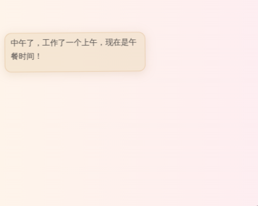
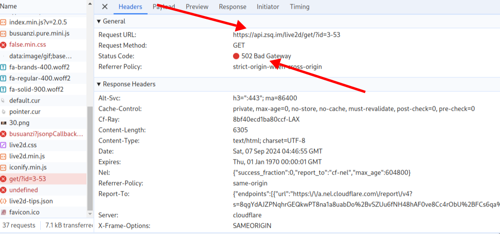
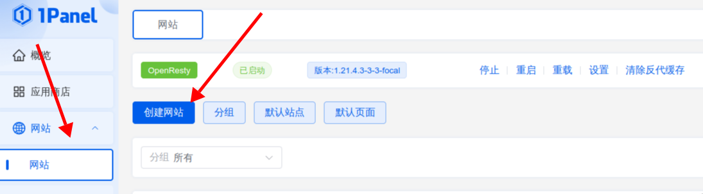
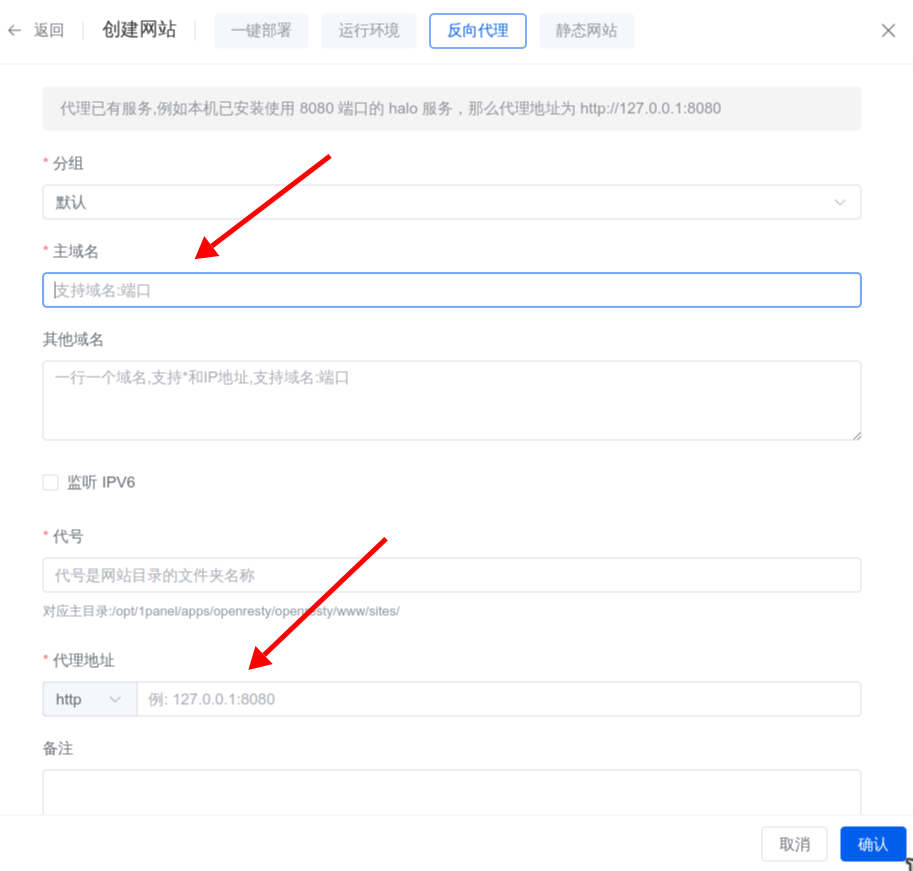
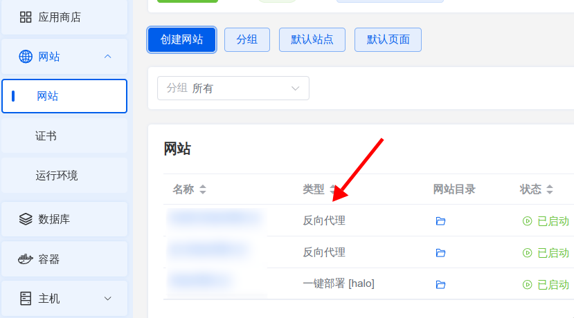
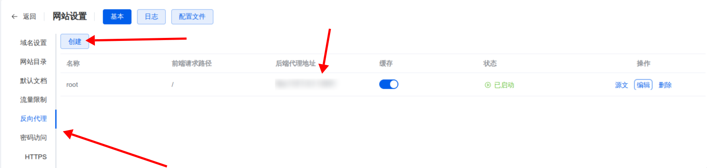
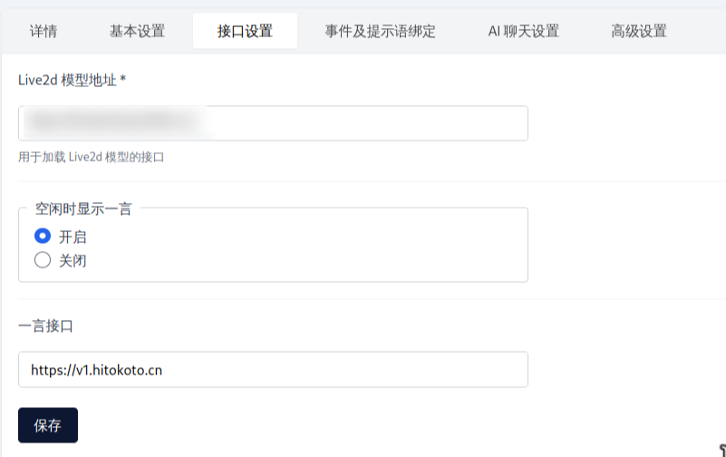

#### 搭建自己的live2D

1. 之前在插件仓库中看中了一个好玩的看板娘插件(直接搜live2d看板娘)[Live2d_Plugin_for_Halo](https://github.com/LIlGG/plugin-live2d)，本来用的好好的，但是今天突然不显示了。

   <br>

2. 通过浏览器开发者工具，找到原因：插件作者搭建的`api`崩了。

   <br>

3. 不知道啥时候恢复，此外作者大大的接口很多人用，可能不太稳定。于是尝试搭建自己`api`接口。通过查看插件作者大大的文档，找到`api`接口项目的地址：[live2d_api](https://github.com/fghrsh/live2d_api)。

4.  目前万事具备，开始着手搭建自己的`api`。首先就是克隆`api`接口的项目：

   ```bash
   git clone https://github.com/fghrsh/live2d_api
   
   cd live2d_api
   ```

5. 进入`live2d_api`中创建`dockerfile`，尝试使用docker(刚好最近在学)搭建api：由于对php不太了解(一点不会)，请教`chatgpt`使用那个基础镜像以及安装那些依赖(期间删除一些明确不需要的依赖，gpt无法通过链接读取github项目，配了一大堆依赖)。

   ```dockerfile
   # 使用官方PHP镜像和Apache
   FROM php:7.4-apache
   
   # 更换apt源为阿里云的Debian源
   RUN sed -i 's|http://deb.debian.org/debian|http://mirrors.aliyun.com/debian|g' /etc/apt/sources.list \
       && sed -i 's|security.debian.org|mirrors.aliyun.com/debian-security|g' /etc/apt/sources.list \
       && apt-get update \
       && apt-get install -y \
       libzip-dev \
       libonig-dev \
       && docker-php-ext-install \
       json \
       zip
   
   # 复制应用到Apache的默认目录
   COPY . /var/www/html/
   
   # 设置工作目录
   WORKDIR /var/www/html/
   
   # 配置Apache以支持.htaccess文件(?)
   RUN a2enmod rewrite
   
   # 暴露Apach的端口
   EXPOSE 80
   ```

6. 构建镜像和启动容器：

   ```bash
   docker build -t live2d .
   
   docker run -d -p 5001:80 --name live2d_api live2d
   ```

   

7. 服务器安全组中开放5001端口后，访问`http://localhost:5001/get/?id=3-53` 即可。


#### 解决跨域问题

1. 在配置域名后，添加到博客的`live2d` 看板娘插件的配置中，但是仍然无法访问。使用开发者工具发现是跨域问题(其实这里的报错已经把解决方式说出来,响应头缺少`Access-Control-Allow-Origin`，想办法加上去)：

   ```tex
   Access to XMLHttpRequest at 'https://xxxxxxxxx/get/?id=3-53' from origin 'http://xxxxxxx:xxxx' has been blocked by CORS policy: No 'Access-Control-Allow-Origin' header is present on the requested resource.
   ```

2. 此时我联想到之前leancloden添加子域名解析的方式，于是误以为主域名向子域名发送请求不会发生跨域，于是换成子域名解析live2d api。但是失败了。实际上：跨域是指从一个域名去请求另一个域名的资源。严格来说，只要域名、协议、端口任何一个不同，就视为跨域。

3. 故而上述方法不可行，下面提供两种可行方式，其中第二中由于不太了解`ngnix`或`openStry`，配置上可能存在一些问题，但是思路是没问题的。


##### 1panel

1. 由于我是采用`1panel`搭建的halo博客，故而我采用这种方式(其实就是openResty)。

2.  进入`1panel`面板，选择网络然后创建网络：

   <br>

3. 选择创建反向代理：主域名填写想访问当前api接口的域名(一般选子域名),代理地址填写api访问地址的`ip`+`port`。

   <br>

4. 选择你创建的反向代理：

   <br>

5. 配置一条反向代理规则：其中后端代理地址填写api访问地址的`ip`+`port`。

   <br>

6. 编辑反向代理规则的操作，选择原文，添加下面配置插入响应头字段：

   ```json
   location ^~ / {
       proxy_pass xxxx; 
       proxy_set_header Host $host; 
       proxy_set_header Access-Control-Allow-Origin '*';
       #------------------------添加---------------------------
       add_header 'Access-Control-Allow-Origin' '*';
       add_header 'Access-Control-Allow-Methods' 'GET, POST, OPTIONS';
       add_header 'Access-Control-Allow-Headers' 'Authorization, Content-Type';
       add_header 'Access-Control-Allow-Credentials' 'true';
       #------------------------------------------------------
       proxy_set_header X-Real-IP $remote_addr; 
       proxy_set_header X-Forwarded-For $proxy_add_x_forwarded_for; 
       proxy_set_header REMOTE-HOST $remote_addr; 
       proxy_set_header Upgrade $http_upgrade; 
       proxy_set_header Connection $http_connection; 
       proxy_set_header X-Forwarded-Proto $scheme; 
       proxy_http_version 1.1; 
       add_header X-Cache $upstream_cache_status; 
       if ( $uri ~* "\.(gif|png|jpg|css|js|woff|woff2)$" ) {
           expires 1m; 
       }
       proxy_ignore_headers Set-Cookie Cache-Control expires; 
       proxy_cache proxy_cache_panel; 
       proxy_cache_key $host$uri$is_args$args; 
       proxy_cache_valid 200 304 301 302 10m; 
       proxy_ssl_server_name off; 
       add_header Strict-Transport-Security "max-age=31536000"; 
   }
   ```

7. 清除反向代理缓存，然后在live2d看板娘插件配置中配置你访问接口域名(live2d模型地址)：<br>


##### nginx/OpenResty

1. 安装`nginx`或者`OpenResty`(安装完最好了解一下使用)：

   ```bash
   sudo apt-get update && apt-get install -y openresty
   
   # or
   sudo apt-get update && apt-get install -y nginx
   ```

   

2. 配置反向代理：编辑在OpenResty或者nginx的配置文件中，通常位于 `/usr/local/openresty/nginx/conf/nginx.conf` 或 `/etc/nginx/nginx.conf`(docker的话，配置文件在容器里)，添加一个反向代理配置来处理api请求：

   ```json
   http {  
       # 添加位置:http内
       server {
           listen 80;
           server_name xxxxxxx.xx; # 访问api的域名
           location  ^~ / {
               proxy_pass 127.0.0.1:5001;  # api的目标服务器
               proxy_set_header Host $host;
               proxy_set_header X-Real-IP $remote_addr;
               proxy_set_header X-Forwarded-For $proxy_add_x_forwarded_for;
               proxy_set_header X-Forwarded-Proto $scheme;
               # 需要支持 CORS
               add_header 'Access-Control-Allow-Origin' '*';  # 如果只允许特定域,可以替换'*'为具体域名
               add_header 'Access-Control-Allow-Methods' 'GET, POST, OPTIONS';
               add_header 'Access-Control-Allow-Headers' 'Authorization, Content-Type';
               add_header 'Access-Control-Allow-Credentials' 'true';
               if ($request_method = 'OPTIONS') {
                   return 204;
               }
           }
       }
   }
   ```

3. 重启服务：

   ```bash
   sudo systemctl restart openresty
   
   or 
   
   sudo systemctl restart nginx
   ```

4. 然后在live2d看板娘插件配置中配置你访问接口域名(live2d模型地址)


