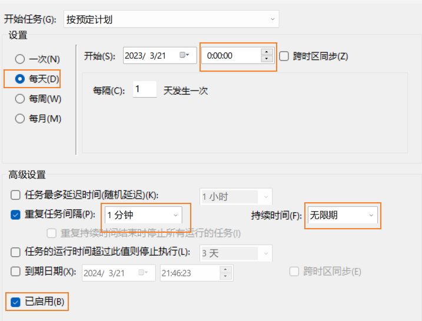
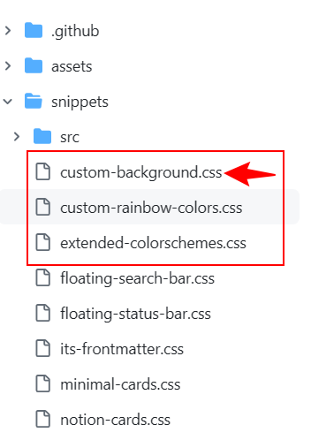

#### 1-typora下载

> 1. 官网：
>    1. [typora](https://typora.io/) 
>    2. [中文网址](https://typoraio.cn/)
> 2. 配置：
>    1. 打开自动保存。
>    2. 配置主题。
> 3. typora好用主题：[Themes Gallery — Typora](https://theme.typora.io/)
>    1. Drake
>    2. vue
>    3. maize
>    4. dyzj
>    5. scrolls
>    6. Cement
>    7. Rainbow

&nbsp;

#### 2-github上传配置 

&nbsp;

> 1. 创建github账号,创建一个仓库存储笔记并复制SSH链接。
>
> 2. git运行`ssh-keygen -t rsa -C "邮箱地址"`，然后三次回车即可。通过`cat`命令查看`public key`并将其复制上传到github的`ssh keys`。
>
> 3. git合适位置运行`git clone 仓库ssh链接`克隆笔记仓库到本地。
>
> 4. git在本地仓库运行`git remote add github仓库别名 github仓库ssh链接`将本地仓库和github仓库连接起来。
>
>    1. 可以在当前本地仓库下运行`git remote -v`查看。
>    2. 可以在本地仓库下运行`git remote remove 别名`删除。
>
> 5. 创建一个`.bat`格式window脚本文件，实现本地仓库与github仓库同步，文件内容如下：
>
>    ```txt
>    @echo off
>    d:                  	 //进入本地仓库所在盘 
>    cd 	/python_notes					//本地仓库地址
>    git add .
>    git commit -m "auto save"
>    git push -u 别名 main      // 加个-f参数强制执行
>    ```
>
>    1. 脚本执行前，需要先进入相应盘，并进入相应文件夹。
>    2. `"auto save"`是自定义的版本信息。
>    3. `main`是分支名称。(git主分支为master而github主分支main，可能需要修改git主分支名称)
>
> 6. 打开window的控制面板，转换为小图标找到window工具，并找到任务计划程序(也可以直接搜索)。
>
> 7. 打开任务计划程序，新建任务：
>
>    1. 在`触发器`,选择新建，并按下图设置所示设置。
>
>       
>
>    2. 在`操作`,选择新建。并填写脚本位置(不要填写双引号)，设置为启动程序。
>
>    3. 在`条件`,勾选在网络连接下启动，关闭在交流电下才启动。
>
>    4. 在`设置`,下拉框选择并行运行新实例。(防止出现错误：操作员或系统管理员拒绝了请求)
>
>    5. 此外必要时，可以在`常规`中给予最高执行权限。
>
> 8. 为了以防万一，最好每次结束记笔记后手动运行一次脚本，手动上传。

> windows 中 $github$连接超时：cmd运行` ipconfig /flushdns`。

#### 3-快捷键

&nbsp;

> `ctrl + /`:切换源码、渲染
>
> `ctrl + tab`:Typora内部窗口焦点切换
>
> `Ctrl+Shift+N`:新建窗口
>
> `Ctrl+Shift+1`:大纲视图
>
> `Ctrl+Shift+2`:文档列表视图
>
> `Ctrl+Shift+3`:文件树视图
>
> `Ctrl+Z`:撤销
>
> `Ctrl+Y`:重做
>
> `Ctrl+X`:剪切
>
> `Ctrl+C`:复制
>
> `Ctrl+V`:粘贴
>
> `Ctrl+]`:增加缩进
>
> `Ctrl+[`:减少缩进
>
> `Ctrl+L`:选中当前行或当前句
>
> `Ctrl+D`:选中当前词
>
> `Ctrl+Shift+Home`:跳转到文首
>
> `Ctrl+Shift+End`:跳转到文末

<br>

#### 4-typora配置

&nbsp;

> * 打开偏好设置，在通用设置中勾选：
>   1. 自动保存
>   2. 开启调试模式
>   3. 发送匿名使用数据
>   4. typora服务使用国内服务器
> * 外观设置中勾选允许折叠和展开侧边栏的大纲视图。
> * 编辑器设置中打开复制剪切未选中默认操作一行。
> * 图像设置中配置图片保存位置和规则应用。
> * markdown设置打开拓展markdown语法。

&nbsp;

#### 5-typora背景设置

> 1. 保存主题配置文件(`.css`),作为备份。
> 1. 在主题文件夹下创建`image`文件夹保存背景图片。
> 1. 打开css样式文件，在`write{}`下添加背景图设置：(开着办吧)

```css
#write{
    background-image:url(./image/xx.jpg)
    background-repeat: no-repeat
    background-size:100%
}
```


#### 6- 安卓替代

1. `netion`似乎不太顺手。
2. 安卓或者平板端使用`Obsidian`+`MGit`实现笔记编辑和笔记上传的功能。当然也可以使用`termux`+`git`代替`MGit`。
3. 推荐主题`AnuPpuccin`。注意为了能够设置背景，需要再github中下载额外的文件导入到`obsidian`中。<br>
4. `obsidian`的一些插件：
   1. `Pandoc Plugin`
   2. `Paste image rename`：必需，上传图片重命名。
   3. `Quiet Outline`：必需，右侧大纲。
   4. `Typewritter Scroll`：必需，打字机模式。
   5. `Easy Typing`
   6. `Excalidraw`
   7. `File Tree ALternative`：必需，文件树。
   8. `Fullscreen mode plugin`：全屏模式。
   9. `Git`
   10. `Image Magician`
   11. `Mind map`：思维导图。
   12. `Calender`：必需，右侧日历。
   13. `Clear Block Enhancer`：官方已有，会与官方冲突。
   14. `Clear Unused Images`：清除未引用图片，慎用。
   15. `Collapse All`
   16. `Dictionary`：字典。
   17. `Display Relative Path Img`：提供html的``标签支持，用于适配`typora`。
   18. `Style Settings`:设置样式。
   19. `Hover Editor`：悬浮编辑，可以用于样式编辑展示。
   20. `Hider`：隐藏
   21. `File Explorer Count`
   22. `Linter`：必装，自动更正列表序号。
   23. `Advanced Tables`：必装，快速制作表格。
   24. `commander`：自定义按钮位置

