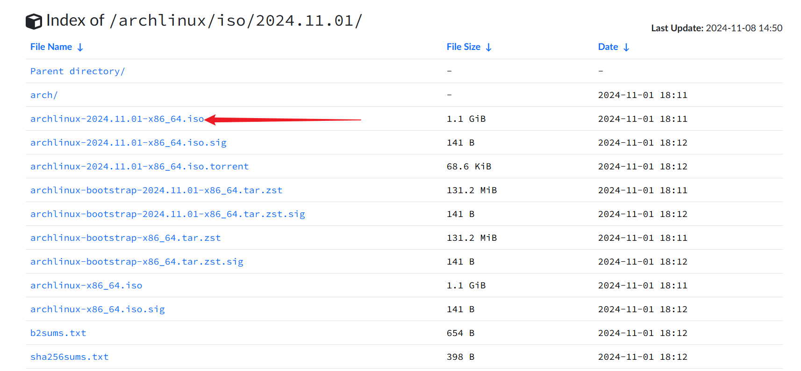
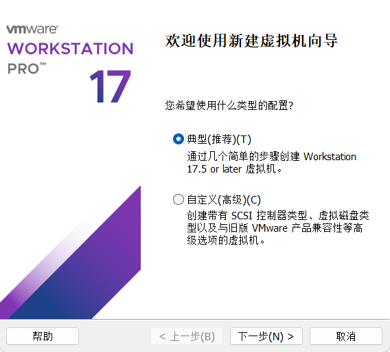
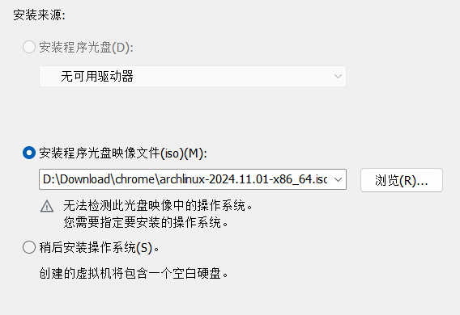
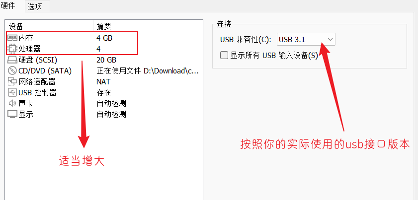
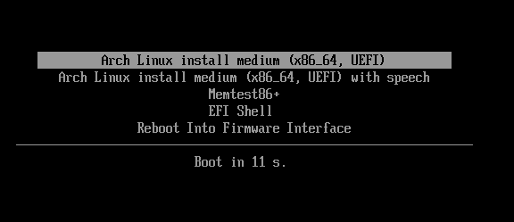
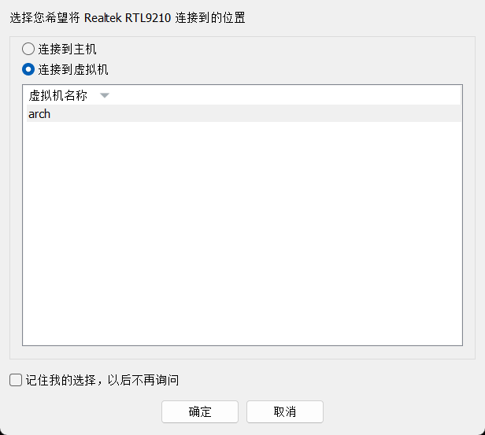
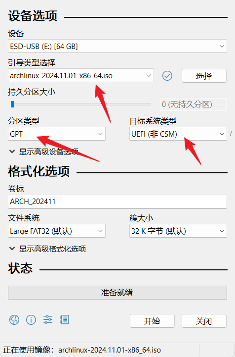

> 1. 首先需要声明:这里使用移动硬盘+VMware的方式安装，其他方式也是类似。
> 2. 已经从 archlinux 换回 win11 一段时间，但是体验上还是 hyprland 的平铺式对我的胃口。对于 fctix5 输入法框架的问题，我查阅许多教程并没有出现我的问题，因此我怀疑是我使用脚本安装 hyprland 的原因，脚本中可能有些软件冲突或者影响了输入法，因此这次打算手动安装配置 hyprland 环境。


#### Archlinux安装


##### 准备

1. 第一步肯定就下载安装镜像文件，官网其实提供多种下载路线可供选择[download](https://archlinux.org/download/#download-mirrors)，当然这里选择常用的[清华镜像](https://mirrors.tuna.tsinghua.edu.cn/archlinux/iso/)。这里就不使用种子直接通过浏览器下载最新版本:<br>

2. 实际上 archlinxu 的安装和后面的环境配置还是比较麻烦的，尤其是后面还要安装 hyprland ，需要频繁地查看文档说明，这里就采用 VMware 的方式进行安装。当然前提是在移动硬盘里面安装。因此这里需要提前安装好 [VMware](https://www.vmware.com/) 虚拟机平台(目前 VMware 对于个人开发者已经免费，但是下载起来较之前可能麻烦一些)。


##### VMware 环境准备

1. 首先使用 VMware 配置一个虚拟机，这里没必要自定义，后续我们安装时不会使用这些配置:<br>
2. 选中准备工作中下载好的 ios 镜像文件:<br>
3. 给虚拟机命名，然后设置一下存储位置:<br>
4. 这里的磁盘打大小随意，后续不会使用:<br>
5. 配置一下虚拟机配置，点击配置硬件后: 内存和处理器可以适当增大(后续配置的话还是在 VMware 中进行，方便一些)，usb版本安按照实际选择<br>
6. 点击选项配置，关闭侧通道缓解并设置启动方式为 UEFI :<br>
7. 然后启动虚拟机,选择默认，回车即可:<br>
8. 将移动硬盘插入电脑，这里会询问连接位置，我们选择连接到当前的虚拟机:<br>
9. 使用 `fdisk -l`就可以看见移动硬盘,记住它:<br>


##### 制作启动盘

1. https://rufus.ie/zh/
2. 示意图:<br>


###### 开始安装

> archlinux 并不建议初学者使用官方的安装脚本 `archinstall`走捷径。此外安装的话这里只是记录一下流程，具体的安装步骤其实网络上存在大量教程

1. 安装步骤参考:

   1. 参考文档1: 官方安装指导https://wiki.archlinux.org/title/Installation_guide

      参考文档2: archlinux安装教程https://arch.icekylin.online/guide/

2. 配置一下永久禁用蜂鸣器内核模块, 创建并编辑 `/etc/modprobe.d/blacklist.conf`，即执行命令 `sudoedit /etc/modprobe.d/blacklist.conf` ,并在文件中添加 `blacklist pcspkr`。

3. 执行命令 `ls /sys/firmware/efi/efivars` 查看是否为 UEFI 模式，会看到许多输出变量。

4. 由于是使用的 VMware，直接跳过繁琐的联网步骤，直接使用 `ping bilibili.com`查看网络是否连接(若是没有，则需要使用 iwctl 连接网络,参考文档2)。

5. 使用 `timedatectl` 命令检查系统时间是否准确。

6. 配置系统分区,不太会使用 fdisk进行分区，还是老老实实使用 cfdisk 。
7. 换源。
8. 安装系统引导程序
9. 安装系统基本软件：


##### archlinux配置

1. 使用 `chsh -s $(whick zsh)` 设置 root 用户的默认 shell 为 zsh。

2. 创建新用户 `useradd -m -G wheel -s $(whick zsh) <username>` ，设置分组为 wheel 。使用 `passwd <username>` 为新用户创建密码。

3. 为 wheel 用户组添加 sudo 权限，即编辑 sudoers 文件(运行`vim /etc/sudoers` 或者`EDITOR=vim visudo`)添加 `%wheel ALL=(ALL:ALL) ALL` 。

4. 安装 yay 或者 pura:

   1. 开启32位支持库与ArchLinux中文社区仓库archlinuxcn:

      1. 编辑`vim /etc/pacman.conf`：

         ```bash
         # 取消注释
         [multilib]
         Include = /etc/pacman.d/mirrorlist
         
         # 添加镜像源(选一个即可)
         [archlinuxcn]
         Server = https://mirrors.ustc.edu.cn/archlinuxcn/$arch # 中国科学技术大学开源镜像站
         Server = https://mirrors.tuna.tsinghua.edu.cn/archlinuxcn/$arch # 清华大学开源软件镜像站
         Server = https://mirrors.hit.edu.cn/archlinuxcn/$arch # 哈尔滨工业大学开源镜像站
         Server = https://repo.huaweicloud.com/archlinuxcn/$arch # 华为开源镜像站
         ```

      2. 更新数据库：`pacman -Syyu`

   2. 安装`archlinuxcn`源和`yay`

      ```bash
      pacman-key --init
      
      sudo pacman -S archlinux-keyring  # (可选,archlinux源签名)
      
      sudo pacman -S archlinuxcn-keyring # cn源中的签名(archlinuxcn-keyring在archlinuxcn)
      sudo pacman -S yay # yay 命令可以让用户安装 AUR 中的软件(yay 在 archlinuxcn)
      ```

   3. 

      


##### linux分区(补充)

1. 分区表:

   分区表是存储磁盘分区结构和信息的一个数据结构，负责描述磁盘如何被分割为多个逻辑部分（分区）。不同的操作系统和硬件环境支持不同类型的分区表。最常见的两种类型是 MBR（Master Boot Record）和 GPT（GUID Partition Table）。以下是两种分区表的介绍和相关知识：

   ### 1. **MBR（Master Boot Record）分区表**
      - **历史背景**：MBR 是传统的分区表类型，最早由 IBM 在 1983 年引入，用于 32 位系统和 BIOS 启动。
      - **分区数量**：MBR 支持最多四个主分区，或者三个主分区加一个扩展分区。扩展分区中可以创建多个逻辑分区。
      - **磁盘大小限制**：MBR 的最大支持磁盘大小为 2TB。如果磁盘大小超过 2TB，MBR 无法正确管理磁盘空间。
      - **结构**：MBR 分区表位于磁盘的第一个扇区（第一个 512 字节），包括引导代码（启动扇区）和分区表数据。分区表存储了磁盘分区的起始位置、大小、类型等信息。
      - **缺点**：由于其结构的局限性，MBR 不支持超过 2TB 的大磁盘，也不支持更多的分区。

   ### 2. **GPT（GUID Partition Table）分区表**
      - **背景**：GPT 是较新的分区表类型，它是 UEFI（Unified Extensible Firmware Interface）启动模式的标准分区表格式。GPT 可以支持比 MBR 更大的磁盘和更多的分区。
      - **分区数量**：GPT 支持最多 128 个主分区，不需要扩展分区和逻辑分区。
      - **磁盘大小限制**：GPT 可以支持超过 2TB 的磁盘，理论上可以支持到 9.4ZB（Zettabytes），远远超过当前硬件的需求。
      - **结构**：GPT 分区表包括保护 MBR（用于兼容旧系统）、GPT 主分区表（存储分区信息）和备份分区表（提高数据安全性）。GPT 还为每个分区提供一个唯一的 GUID（全球唯一标识符）来标识分区。
      - **优势**：
        - 支持更大磁盘和更多分区。
        - 具备更好的冗余性，因为 GPT 会保存主分区表的备份副本。
        - 更强的扩展性和可靠性，能够支持 UEFI 启动和更复杂的分区结构。
      - **缺点**：GPT 不兼容旧的 BIOS 启动，需要 UEFI 固件支持。如果硬盘要在旧版 BIOS 系统下使用，则需要额外的启动管理器或工具。

   ### 3. **分区表比较**

   | 特性             | MBR                                  | GPT                      |
   | ---------------- | ------------------------------------ | ------------------------ |
   | 最大支持磁盘大小 | 2TB                                  | 9.4ZB（理论上）          |
   | 最大支持分区数量 | 4个主分区，或者3个主分区+1个扩展分区 | 最多128个主分区          |
   | 支持的启动方式   | BIOS（传统）                         | UEFI（现代）             |
   | 冗余性与备份     | 没有备份                             | 支持备份分区表           |
   | 兼容性           | 兼容旧系统（32位和BIOS）             | 仅支持UEFI（需现代硬件） |

   ### 4. **选择分区表的考虑因素**
      - **硬盘容量**：如果你的硬盘大于 2TB，或者你计划在未来扩展磁盘，选择 GPT 更为合适。
      - **启动模式**：对于启用 UEFI 启动的现代操作系统，GPT 是必选的分区表格式；而对于传统的 BIOS 启动，则可以使用 MBR。
      - **操作系统兼容性**：现代操作系统（如 Windows 10/11、Linux、macOS）都支持 GPT，而较旧的操作系统可能只支持 MBR。

   ### 5. **常见的分区表类型和适用场景**
      - **MBR**：适用于较老的硬件和操作系统，尤其是没有 UEFI 启动的环境，或者磁盘小于 2TB 的情况。
      - **GPT**：适用于大容量硬盘、UEFI 启动的系统，支持现代操作系统的环境，具有更好的数据保护和冗余机制。

   总之，现代计算机和操作系统推荐使用 GPT 分区表，尤其是对于较大磁盘和 UEFI 启动系统。而 MBR 分区表适用于较旧的硬件和小于 2TB 的磁盘。

2. 


##### HYprland 安装

1. 本人系统存在双CPU ，参考官方文档，选择


####


##### 输入法配置

