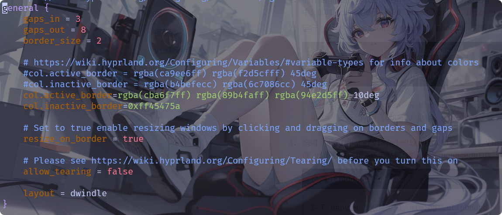
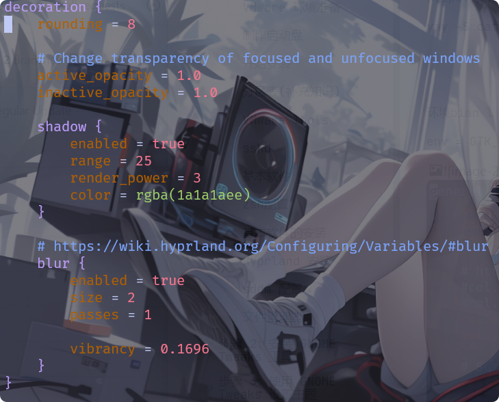

> 1. 已经从 archlinux 换回 win11 一段时间，但是体验上还是 hyprland 的平铺式对我的胃口。对于 fctix5 输入法框架的问题，我查阅许多教程并没有出现我的问题，因此我怀疑是我使用脚本安装 hyprland 的原因，脚本中可能有些软件冲突或者影响了输入法，因此这次打算手动安装配置 hyprland 环境。
> 2. 此前其实还尝试过 ubuntu24 搭配 gnome，虽然 gnome 的插件很好用，界面也很美观但是还是没有 hyprlnad 平铺式来的舒服。此外习惯了 archlinux 的 paru ，再去使用 ubuntu 安装软件就有一些繁琐。
> 3. **待完善**


> ctrl+H显示隐藏文件

#### Archlinux安装

##### 准备

1. 第一步肯定就下载安装镜像文件，官网其实提供多种下载路线可供选择[download](https://archlinux.org/download/#download-mirrors)，当然这里选择常用的[清华镜像](https://mirrors.tuna.tsinghua.edu.cn/archlinux/iso/)。这里就不使用种子直接通过浏览器下载最新版本:<br>

2. 实际上 archlinux 的安装和后面的环境配置还是比较麻烦的，尤其是后面还要安装 hyprland ，需要频繁地查看文档说明，这里就采用 VMware 的方式进行安装。当然前提是在移动硬盘里面安装。因此这里需要提前安装好 [VMware](https://www.vmware.com/) 虚拟机平台(目前 VMware 对于个人开发者已经免费，但是下载起来较之前可能麻烦一些)。


##### VMware 环境准备

> 最初还是需要在虚拟机上研究，后续再在硬盘中安装。下面其实是使用 vmware 在移动硬盘安装系统的教程，但是也包含了 vmware 安装 archlinux。

1. 首先使用 VMware 配置一个虚拟机，这里没必要自定义，后续我们安装时不会使用这些配置:<br>
2. 选中准备工作中下载好的 ios 镜像文件:<br>
3. 选择一下系统类型:<br>
4. 给虚拟机命名，然后设置一下存储位置:<br>
5. 这里的磁盘打大小随意，后续不会使用:<br>
6. 配置一下虚拟机配置，点击配置硬件后: 内存和处理器可以适当增大(后续配置的话还是在 VMware 中进行，方便一些)，usb版本安按照实际选择<br>
7. 点击选项配置，关闭侧通道缓解并设置启动方式为 UEFI :<br>
8. 然后启动虚拟机,选择默认，回车即可:<br>
9. 将移动硬盘插入电脑，这里会询问连接位置，我们选择连接到当前的虚拟机:<br>
10. 使用 `fdisk -l`就可以看见移动硬盘,记住它:<br>


##### 制作启动盘

1. https://rufus.ie/zh/
2. 示意图:<br>


##### 开始安装

> archlinux 并不建议初学者使用官方的安装脚本 `archinstall`走捷径。此外安装的话这里只是记录一下流程，具体的安装步骤其实网络上存在大量教程

1. 安装步骤参考:

   1. 参考文档1: 官方安装指导https://wiki.archlinux.org/title/Installation_guide

      参考文档2: archlinux安装教程https://arch.icekylin.online/guide/

2. 配置一下永久禁用蜂鸣器内核模块。

3. 查看是否为 UEFI 模式。

4. 联网，若是使用 VMware，直接跳过繁琐的联网步骤。

5. 检查系统时间是否准确。

6. 配置系统分区,使用 cfdisk。若是一块新磁盘需要重新创建分区表，使用 parted 工具。

7. 换源。

8. 安装 GRUB 到 EFI 分区：若是安装在移动硬盘，则需要添加`--removable`参数。

   `````bash
   grub-install --target=x86_64-efi --efi-directory=/boot --bootloader-id=ARCH  # --removable
   `````


##### 分区表(补充知识)

1. 分区表:分区表是存储磁盘分区结构和信息的一个数据结构，负责描述磁盘如何被分割为多个逻辑部分（分区）。不同的操作系统和硬件环境支持不同类型的分区表。最常见的两种类型是 MBR（Master Boot Record）和 GPT（GUID Partition Table）。

2. MBR 分区表:

      1. MBR 是传统的分区表类型，最早由 IBM 在 1983 年引入，用于 32 位系统和 BIOS 启动。
      2. 支持最多四个主分区，或者三个主分区加一个扩展分区。扩展分区中可以创建多个逻辑分区。
      3. MBR 的最大支持磁盘大小为 2TB。如果磁盘大小超过 2TB，MBR 无法正确管理磁盘空间。
      4. MBR 分区表位于磁盘的第一个扇区（第一个 512 字节），包括引导代码（启动扇区）和分区表数据。分区表存储了磁盘分区的起始位置、大小、类型等信息。
      5. **缺点**：由于其结构的局限性，MBR 不支持超过 2TB 的大磁盘，也不支持更多的分区。

3. GPT 分区表:

      1. GPT 是较新的分区表类型，它是 UEFI（Unified Extensible Firmware Interface）启动模式的标准分区表格式。GPT 可以支持比 MBR 更大的磁盘和更多的分区。
      2. GPT 支持最多 128 个主分区，不需要扩展分区和逻辑分区。
      3. GPT 可以支持超过 2TB 的磁盘，理论上可以支持到 9.4ZB（Zettabytes），远远超过当前硬件的需求。
      4. GPT 分区表包括保护 MBR（用于兼容旧系统）、GPT 主分区表（存储分区信息）和备份分区表（提高数据安全性）。GPT 还为每个分区提供一个唯一的 GUID（全球唯一标识符）来标识分区。
      5. **优势**：
         - 支持更大磁盘和更多分区。
         - 具备更好的冗余性，因为 GPT 会保存主分区表的备份副本。
         - 更强的扩展性和可靠性，能够支持 UEFI 启动和更复杂的分区结构。
      6. **缺点**：GPT 不兼容旧的 BIOS 启动，需要 UEFI 固件支持。如果硬盘要在旧版 BIOS 系统下使用，则需要额外的启动管理器或工具。

4. 分区表比较

   | 特性             | MBR                                  | GPT                      |
   | ---------------- | ------------------------------------ | ------------------------ |
   | 最大支持磁盘大小 | 2TB                                  | 9.4ZB（理论上）          |
   | 最大支持分区数量 | 4个主分区，或者3个主分区+1个扩展分区 | 最多128个主分区          |
   | 支持的启动方式   | BIOS（传统）                         | UEFI（现代）             |
   | 冗余性与备份     | 没有备份                             | 支持备份分区表           |
   | 兼容性           | 兼容旧系统（32位和BIOS）             | 仅支持UEFI（需现代硬件） |

5. 适用场景

      1. MBR适用于较老的硬件和操作系统，尤其是没有 UEFI 启动的环境，或者磁盘小于 2TB 的情况。
      2. GPT适用于大容量硬盘、UEFI 启动的系统，支持现代操作系统的环境，具有更好的数据保护和冗余机制。
      3. 现代计算机和操作系统推荐使用 GPT 分区表，尤其是对于较大磁盘和 UEFI 启动系统。而 MBR 分区表适用于较旧的硬件和小于 2TB 的磁盘。现代操作系统（如 Windows 10/11、Linux、macOS）都支持 GPT，而较旧的操作系统可能只支持 MBR。


#####  VMware Tools

> 仅虚拟机需要安装，其他类型虚拟机也是一样的，不然无法使用主机的剪贴板，从而无法复制粘贴。

1. 2007 年，VMware 将 [VMware Tools](https://kb.vmware.com/kb/340) 中的大部分代码以 LGPL 协议发布，这就是 Open-VM-Tools。官方的 VMware Tools 不再单独向 Arch Linux 提供。[open-vm-tools](https://archlinux.org/packages/?name=open-vm-tools)包 软件包里包括如下工具：

   - `vmtoolsd` - 负责汇报虚拟机状态的服务。

   - `vmware-checkvm` - 用于检测虚拟机中是否在运行着某程序的工具。

   - `vmware-toolbox-cmd` - 用于收集宿主系统信息的工具。

   - `vmware-user` - 用来在宿主机和虚拟机之间共享剪切板（复制/粘贴）的工具。

   - `vmware-vmblock-fuse` - 文件系统工具。基于 FUSE 实现了宿主/客机之间拖拽文件的功能。

   - `vmware-xferlogs` - 向虚拟机的日志文件输出日志与调试信息。

   - `vmhgfs-fuse` - 挂载 HGFS 共享目录的工具。

2. 安装 open-vm-tools 包。然后启动并启用 vmtoolsd.service 和 vmware-vmblock-fuse.service。

   ```bash
   # 安装工具包
   sudo pacman -S open-vm-tools
   
   #启动服务 
   systemctl start vmtoolsd.service
   systemctl start vmware-vmblock-fuse.service
   #设置开机启动
   systemctl enable vmtoolsd.service
   systemctl enable vmware-vmblock-fuse.service
   ```

3.安装完成重启虚拟机。


##### sshd

1. 安装 openssh : `pacman -S openssh`。

2. 开启 sshd : `systemctl enable --now sshd.service`。

3. 配置 sshd 文件:` vim /etc/ssh/sshd_config`,然后添加如下内容

   ```bash
   PermitRootLogin yes
   ```

   


##### 基本软件

1. 安装 yay 或者 pura:

   1. 开启32位支持库与ArchLinux中文社区仓库archlinuxcn:

      1. 编辑`vim /etc/pacman.conf`：

         ```bash
         # 取消注释
         [multilib]
         Include = /etc/pacman.d/mirrorlist
         
         # 添加镜像源(选一个即可)
         [archlinuxcn]
         Server = https://mirrors.ustc.edu.cn/archlinuxcn/$arch # 中国科学技术大学开源镜像站
         Server = https://mirrors.tuna.tsinghua.edu.cn/archlinuxcn/$arch # 清华大学开源软件镜像站
         Server = https://mirrors.hit.edu.cn/archlinuxcn/$arch # 哈尔滨工业大学开源镜像站
         Server = https://repo.huaweicloud.com/archlinuxcn/$arch # 华为开源镜像站
         ```

      2. 更新数据库：`pacman -Syyu`

   2. 安装`archlinuxcn`源和`yay`( paru 也可 )

      ```bash
      pacman-key --init
      
      # pacman -Syyu (之前没有更新需要更新)
      
      sudo pacman -S archlinux-keyring  # (可选,archlinux源签名)
      
      sudo pacman -S archlinuxcn-keyring # cn源中的签名(archlinuxcn-keyring在archlinuxcn)
      sudo pacman -S yay # paru/yay 命令可以让用户安装 AUR 中的软件
      ```

2. 安装字体:

   ```bash
   sudo pacman -S adobe-source-han-sans-cn-fonts adobe-source-han-serif-cn-fonts noto-fonts-cjk wqy-microhei wqy-microhei-lite wqy-bitmapfont wqy-zenhei ttf-arphic-ukai ttf-arphic-uming noto-fonts noto-fonts-cjk noto-fonts-emoji noto-fonts-extra
   ```

3. 一些基本软件:

   ```bash
   sudo pacman -S git firafox
   
   ```

   

4. 


##### zsh配置

1. 使用 `chsh -s $(which zsh)` 设置 root 用户的默认 shell 为 zsh。

2. 创建新用户 `useradd -m -G wheel -s $(which zsh) <username>` ，设置分组为 wheel 。使用 `passwd <username>` 为新用户创建密码。

3. 为 wheel 用户组添加 sudo 权限，即编辑 sudoers 文件(运行`vim /etc/sudoers` 或者`EDITOR=vim visudo`)添加 `%wheel ALL=(ALL:ALL) ALL` 。

4. 配置 zsh 的插件:

   ```bash
   ```

   


##### 基本软件的安装

1. 安装系统基本软件: zsh
2. 字体


#


##### Hyprland 安装

1. 注意 hyprland 要想在 vmware虚拟及中使用，需要开启虚拟机的 3d 加速:<br>

   > 哪怕开启 3d 加速，还是无法在虚拟机中 kitty 无法使用，需要改用 foot。

2. 安装:切换到非 root 用户后执行下面安装命令

   ```bash
   # 安装 release 版本
   sudo pacman -S hyprland
   
   # 安装最新
   yay -S hyprland-git
   ```

3. 参照官方文档，对于 Nvidia，参照[官方文档](https://wiki.hyprland.org/Nvidia/)安装一些必要驱动软件:

   ```bash
   sudo pacman -S nvidia nvidia-utils egl-wayland
   ```

4. 本人系统存在双CPU ，参考官方文档，选择

5. 复制默认配置文件：

   ```bash
   mkdir -p ~/.config/hypr/
   sudo cp /usr/share/hypr/hyprland.conf ~/.config/hypr/
   ```

6. 

7. 配置基环境变量：

   ```bash
   # 工具包后端环境变量
   env = GDK_BACKEND=wayland;x11
   env = QT_QPA_PLATFORM=wayland;xcb
   env = SDL_VIDEODRIVER=wayland
   env = CLUTTER_BACKEND=wayland
   # XDG 相关环境变量
   env = XDG_CURRENT_DESKTOP=Hyprland
   env = XDG_SESSION_TYPE=wayland
   env = XDG_SESSION_DESKTOP=Hyprland
   # Qt 相关环境变量
   env = QT_AUTO_SCREEN_SCALE_FACTOR=1
   env = QT_QPA_PLATFORM=wayland;xcb
   env = QT_WAYLAND_DISABLE_WINDOWDECORATION=1
   env = QT_QPA_PLATFORMTHEME=qt5ct
   
   
   # 个人配置
   env = GTK_THEME=Catppuccin-Macchiato
   ```

   

> sudo pacman -S xorg-xwayland  sudo pacman -S xdg-desktop-portal  
>
> yay -S qt5c


`qt5ct` 是一个用来配置 **Qt5** 应用程序外观和行为的工具。在使用 **Wayland** 和 **X11** 时，特别是对于使用 **Qt** 的应用程序，`qt5ct` 可以帮助你设置应用程序的主题、字体、图标以及其他一些界面元素的样式。


##### sddm 配置

1. 安装并启用: 

   `````bash
   # 安装
   sudo pacman -S sddm
   
   # 启用
   sudo systemctl enable sddm
   `````

2. 下载主题：

   1. [主题网站](https://store.kde.org/p/1458914/),下载的主题解压到 `/usr/share/sddm/themes` 中，最好找到原项目的地址，因为可能期间会需要安装一些依赖。
   2. github 中搜找主题。
   3. 还可以直接在 archlinx [官方仓库](https://aur.archlinux.org/packages?O=0&SeB=nd&K=sddm&outdated=&SB=p&SO=d&PP=50&submit=GoZ)中找主题。

3. 这里使用 github 上找的的一个主题[sddm-astronaut-theme](https://github.com/Keyitdev/sddm-astronaut-theme)。

   1. 根据文档安装依赖:

      ```bash
      sudo pacman -S qt6-svg
      ```

   2. 安装主题:

      ```bash
      sudo git clone https://github.com/keyitdev/sddm-astronaut-theme.git /usr/share/sddm/themes/sddm-astronaut-theme
      sudo cp /usr/share/sddm/themes/sddm-astronaut-theme/Fonts/* /usr/share/fonts/
      ```

   3. 对主题进行修改: 不太喜欢模糊遮挡，直接关闭

      ```bash
      cd /usr/share/sddm/themes/sddm-astronaut-theme
      
      # PartialBlur="true" 改为 PartialBlur="" 
      ```

4. 配置 hyprland : SDDM 的配置文件路径可能是 /etc/sddm.conf 或者在 /etc/sddm.conf.d 目录下的某个配置文件。一般而言需要自己创建：

   ```bash
   sudo mkdir -p /etc/sddm.conf.d
   sudo vim default.conf
   ```

   ```bash
   [General]
   Session=hyprland
   Language=zh_CN.UTF-8
   
   [Theme]
   Current=sddm-astronaut-theme
   EnableAvatars=true
   ```

   > `journalctl -u sddm` 查看 SDDM 的所有 systemd 日志。
   >
   > `journalctl -u sddm -e` 查看最新日志。
   >
   > `sudo systemctl restart sddm` 重启 sddm 。

5. sddm 安装后，可能会卡死，此时则需要安装 `sudo pacman -S xf86-video-intel` 和 `sudo pacman -S xf86-video-nouveau` 。

 


##### 文件管理器

1. 参考[官方文档](https://wiki.hyprland.org/Useful-Utilities/File-Managers/),可以选择 Nautilus、Dolphin、Nemo、Thunar 等文档管理器。这里我选择 nautilus 和 yazi:

   ```bash
   yay -S nautilus nautilus-admin-gtk4 nautilus-image-converter nautilus-open-any-terminal
   
   sudo pacman -S yazi
   ```

2. 运行 nautilus 启动,修改 hyprland 配置添加 `nautilus -q  & nautilus` 相关配置。

3. 配置主题:

4. 

美化: 安装主题 https://aur.archlinux.org/packages?K=gtk-theme

https://www.gnome-look.org/browse?cat=135&ord=latest

yay -S catppuccin-gtk-theme-macchiato


环境bian l

env = GTK_THEME=Catppuccin-Macchiato






参考:https://github.com/iamhrigved/Hyprdots


1. **安装 GNOME 主题和 GTK 主题包**：

   在 Arch Linux 上，可以安装一些流行的 GNOME 主题，例如 **Adwaita**（默认主题）或者第三方主题如 **Arc**、**Pop!_OS**、**Materia** 等。你可以通过 **pacman** 或 **AUR** 安装。

   示例：

   - 安装 GNOME 默认主题（Adwaita）：

     ```
     bash
     
     
     复制代码
     sudo pacman -S adwaita-gtk-theme
     ```

   - 安装第三方主题（例如 Arc）：

     ```
     bash
     
     
     复制代码
     yay -S arc-gtk-theme
     ```

   - 安装 Pop!_OS 主题：

     ```
     bash
     
     
     复制代码
     yay -S pop-gtk-theme
     ```

   - 安装 Materia 主题：

     ```
     bash
     
     
     复制代码
     yay -S materia-gtk-theme
     ```

### 步骤 2：安装 GNOME Tweaks 工具

**GNOME Tweaks** 是一个非常有用的工具，可以帮助你修改 GNOME 桌面环境的主题设置，包括 **Nautilus** 的主题。

1. **安装 GNOME Tweaks**：

   如果你没有安装 **GNOME Tweaks**，可以通过 **pacman** 安装：

   ```
   bash
   
   
   复制代码
   sudo pacman -S gnome-tweaks
   ```

### 步骤 3：使用 GNOME Tweaks 设置主题

1. **启动 GNOME Tweaks**：

   在终端中运行 `gnome-tweaks`：

   ```
   bash
   
   
   复制代码
   gnome-tweaks
   ```

2. **设置 GTK 主题**：

   在 **GNOME Tweaks** 中，转到 **Appearance**（外观）选项卡，你会看到 **Themes**（主题）部分。

   - **Application**：选择你想要的 GTK 主题，这会影响 Nautilus 和其他 GTK 应用程序的外观。
   - **Icons**：选择你想要的图标主题。可以选择 **Adwaita** 或者其他图标包


```bash
https://github.com/theCode-Breaker/riverwm/tree/main/waybar/river
```


缩放比例不等于1时，如 Chrome，VSCode 等 xwayland 上的软件会出现模糊的情况，暂时的解决方案是对 xwayland 强制禁用缩放：

xwayland {
  force_zero_scaling = true
}

然后对 xwayland 单独设置缩放：

exec-once = echo 'Xft.dpi:144' | xrdb -merge

https://tea-in-the-snow.github.io/p/hyprland-%E5%AE%89%E8%A3%85%E4%B8%8E%E9%85%8D%E7%BD%AE%E8%AE%B0%E5%BD%95/


##### rofi启动器

1. https://github.com/davatorium/rofi
2. 安装 `sudo pacman -S rofi`
3. 生成默认配置文件：`mkdir -p ~/.config/rofi/`和`rofi -dump-config > ~/.config/rofi/config.rasi`
   1. https://github.com/adi1090x/rofi 需要使用作者的脚本启动

4. 配置启动键

这有几种不同的提示模式。 `drun` 只匹配并显示那些在你的机器上有 `Desktop` 条目的程序（就是有 `.desktop` 文件的程序），而不是你的 `PATH` 上的所有程序。 事实上，不这样做会产生性能问题，是一个已知的问题。


https://github.com/newmanls/rofi-themes-collection?tab=readme-ov-file 

参考文件自行修改配置自己的rofi


##### waybar

参考配置:https://github.com/Anik200/dotfiles/tree/main 和 https://github.com/theCode-Breaker/riverwm/tree/main/waybar/river

1. https://github.com/Agonie0/file_fw/tree/main

https://github.com/Alexays/Waybar/wiki/Examples

如果您使用 `waybar` 作为状态栏，可以通过 `alsa` 或 `pulse` 模块显示和控制音量。

`````bash
# 安装官方版本
 sudo pacman -S waybar
 # 安装 Hyprland 工作区修复版本
 paru -S waybar-hyprland
`````


模块：https://github.com/Alexays/Waybar/wiki

```json
{
	"layer": "top",
	"modules-left": ["custom/launcher","cpu","memory","custom/media","tray"],
	"modules-center": ["river/tags"],
	"modules-right": ["custom/updates","custom/wallpaper","backlight","pulseaudio","clock", "battery","custom/power"],
	
	"pulseaudio": {
		"tooltip": false,
		"scroll-step": 5,
		"format": "{icon} {volume}%",
		"format-muted": "{icon} {volume}%",
		"on-click":"pactl set-sink-mute @DEFAULT_SINK@ toggle",
		"format-icons": {
			"default": ["", "", ""]
		}
	},

    "river/tags": {
		"num-tags": 6
    },
	"network": {
		"tooltip": false,
		"format-wifi": "  {essid}",
		"format-ethernet": ""
	},
	"backlight": {
		"tooltip": false,
		"format": " {}%",
		"interval":1,
        "on-scroll-up": "light -A 5",
		"on-scroll-down": "light -U 5"
	},
    "battery": {
        "states": {
            "good": 95,
            "warning": 30,
            "critical": 20
        },
        "format": "{icon}  {capacity}%",
        "format-charging": " {capacity}%",
        "format-plugged": " {capacity}%",
        "format-alt": "{time} {icon}",
        "format-icons": ["", "", "", "", ""]
    },
	"tray":{
		"icon-size":18,
		"spacing": 10
	},
    "clock": {
        "format": "{: %I:%M %p   %d/%m/%Y}"
    },
    "cpu": {
        "interval": 15,
        "format": " {}%",
        "max-length": 10
    },
    "memory": {
        "interval": 30,
        "format": " {}%",
        "max-length": 10
    },
    "custom/media": {
        "interval": 30,
        "format": "{icon} {}",
        "return-type": "json",
        "max-length": 20,
        "format-icons": {
            "spotify": " ",
            "default": " "
        },
        "escape": true,
        "exec": "$HOME/.config/system_scripts/mediaplayer.py 2> /dev/null",
        "on-click": "playerctl play-pause"
    },
    "custom/launcher":{
        "format": " ",
        "on-click": "rofi -show drun",
        "on-click-right": "killall rofi"
    },
    "custom/power":{
        "format": " ",
        "on-click": "bash ~/.config/rofi/leave/leave.sh",
    },
    "custom/updates":{
        "format": "{} Update(s)",
        "exec": "checkupdates | wc -l",
        "exec-if": "[[ $(checkupdates | wc -l) != 0 ]]",
        "interval": 15,
        "on-click": "alacritty -e paru -Syu && notify-send 'The system has been updated' "
    },
    "custom/wallpaper":{
        "format":" ",
        "on-click": "bash ~/.config/system_scripts/pkill_bc"
    }
}
```


##### kitty

cp /usr/share/doc/kitty/kitty.conf ~/.config/kitty/kitty.conf

```bash
# 配置字体
font_family      Fira Code
bold_font        auto
italic_font      auto
font_size        14.0

# 配置窗口外观
background_opacity  0.8
window_padding_width 10
dynamic_background_opacity yes


# 设置光标形状，block块、underline下划线）、beam。
cursor_shape  block
# 启用或禁用光标闪烁。
cursor_blink  yes
# 启用 `URL` 检测，允许点击链接直接在浏览器中打开。
detect_urls   yes
```


为了使用oh-my-zsh,字体后期肯定要修改


**Cava**（Console-based Audio Visualizer for ALSA/OSS）是一款基于命令行的音频可视化工具，能够在终端（TTY）中显示音频频谱图和波形图。它的名字 “Cava” 来源于 “Console-based Audio Visualizer” 的缩写。

### 主要特点：

1. **命令行界面**：Cava 是一个轻量级的终端应用程序，使用 ASCII 或 Unicode 字符在终端中展示音频数据的实时可视化效果。
2. **支持 ALSA 和 PulseAudio**：Cava 主要与 **ALSA**（Advanced Linux Sound Architecture）和 **PulseAudio** 配合工作，可以从这些音频系统中获取音频数据并进行可视化。
3. **音频频谱显示**：Cava 能够实时展示音频的频谱图，通常用于显示音乐、视频或其他音频文件的频率分布情况。
4. **高度可配置**：Cava 提供了很多配置选项，可以调整显示样式、频率范围、颜色以及可视化效果的其他方面，用户可以根据自己的需求进行定制。
5. **低资源消耗**：作为一个基于文本的可视化工具，Cava 的资源占用非常低，适合在资源受限的环境中使用，例如在终端或没有图形界面的系统中运行。

### 使用场景：

- **音乐可视化**：Cava 常用于 Linux 系统中的音乐播放器中，比如与 **mpd**、**mpc** 等音乐播放器配合使用，提供音频的实时频谱显示。
- **终端爱好者**：它非常适合喜欢在终端中操作的用户，能够在没有图形化界面的情况下享受音频可视化的乐趣。
- **系统监控工具**：由于其低资源消耗，Cava 还可以作为一种轻量级的系统监控工具，在系统中播放音频时查看实时的频率响应。

### 安装

在 **Arch Linux** 中，Cava 可以通过 **AUR** 安装：

```
bash


复制代码
yay -S cava
```

在 **Debian** 或 **Ubuntu** 系统中，你可以使用以下命令来安装：

```
bash


复制代码
sudo apt install cava
```

### 配置

Cava 的配置文件通常位于 `~/.config/cava/config`，你可以根据自己的需求修改配置，例如调整颜色、图形显示的方式、频率范围等。

### 使用示例

安装并配置好 Cava 后，可以在终端中直接运行：

```
bash


复制代码
cava
```

然后，Cava 会开始从默认的音频源（如 PulseAudio 或 ALSA）获取音频数据并显示频谱图。如果你想指定音频源，Cava 也支持通过配置文件或命令行参数来选择不同的音频设备。


##### 光标

1. 其实archlinux wiki （https://wiki.archlinuxcn.org/wiki/%E5%85%89%E6%A0%87%E4%B8%BB%E9%A2%98）提供一些 https://www.gnome-look.org/browse?cat=107&ord=latest

2. https://www.gnome-look.org/p/2135234

3. nice： https://www.gnome-look.org/p/2135234

   

```
sudo pacman -S unzip

unzip catppuccin-macchiato-blue-cursors.zip -d ~/.local/share/icons
```


```
find /usr/share/icons ~/.local/share/icons ~/.icons -type d -name "cursors"
```

参考官方文档 

`hyprctl setcursor catppuccin-macchiato-blue-cursors 32` （光标名称、光标大小）

或者

```bash
env = HYPRCURSOR_THEME,catppuccin-macchiato-blue-cursors
env = HYPRCURSOR_SIZE,32
env = CURSOR_THEME,catppuccin-macchiato-blue-cursors
env = XCURSOR_SIZE,32
```

但是实际上其他软件无法生效

如果想要*为指定用户*配置,创建并编辑 `~/.icons/default/index.theme`;如果想要*系统范围*配置,编辑 `/usr/share/icons/default/index.theme`。

```
~/.icons/default/index.theme
[icon theme] 
Inherits=cursor_theme_name
```

然后你应该编辑 `~/.config/gtk-3.0/settings.ini`, 将 `*cursor_theme_name*` 替换为你选择的主题:

```
~/.config/gtk-3.0/settings.ini
[Settings]
gtk-cursor-theme-name=cursor_theme_name
```

重启 X 以应用更改。


(pavucontrol:16237): Gdk-WARNING **: 22:54:13.711: ../gtk/gdk/wayland/gdkcursor-wayland.c:210 cursor image size (32) not an integer multiple of theme size (25)


###### ChatGPT 说：

ChatGPT

这个警告表明您的鼠标指针的图标大小（32x32）与当前设置的主题大小（25x25）不匹配。`pavucontrol` 是 GTK 应用程序，它在使用 Wayland 时会在 GDK 中处理鼠标光标。如果光标的图标大小与主题大小不成整数倍，GDK 会发出警告。

### 解决方案

1. **调整鼠标指针大小**： 如果您不介意调整鼠标光标的大小，您可以修改光标主题的大小，确保它与 GTK 应用程序兼容。您可以通过设置 `HYPRCURSOR_SIZE` 环境变量来调整光标的大小。

   在 `~/.bashrc` 或 `~/.zshrc` 文件中添加以下行：

   ```
   bash
   
   
   复制代码
   export HYPRCURSOR_SIZE=32
   ```

   然后重新加载 shell 配置：

   ```
   bash
   
   
   复制代码
   source ~/.bashrc  # 或 source ~/.zshrc
   ```

   这样可以将光标大小调整为 32，匹配 pavucontrol 的默认光标大小。

2. **调整主题大小**： 如果您想保持 25 的大小，您可以调整您使用的光标主题，以便它包含 25x25 的光标图标。可以尝试选择一个不同的光标主题，或者手动修改当前主题中的图标文件来适应该大小。

   您可以在 `/usr/share/icons` 或 `~/.icons` 目录下查找您的光标主题，并查看是否可以找到适合 25x25 的图标。如果没有，您也可以尝试重新选择适合您的屏幕和需求的光标主题。

3. **忽略警告**： 如果这个警告对您并不影响实际使用，您也可以选择忽略它，继续使用现有的设置。

### 总结：

- 调整光标大小 (`HYPRCURSOR_SIZE`) 或选择合适的光标主题可以解决这个警告。
- 该警告主要是与 GTK 图形界面程序和光标主题设置不匹配引起的。


###### 文件管理器

Nautilus、Dolphin、Nemo、Thunar

https://wiki.hyprland.org/Useful-Utilities/File-Managers/

```bash
yay -S nautilus nautilus-admin-gtk4 nautilus-image-converter nautilus-open-any-terminal
```

运行 nautilus 启动

美化: 安装主题 https://aur.archlinux.org/packages?K=gtk-theme

yay -S catppuccin-gtk-theme-macchiato


环境bian l

env = GTK_THEME=Catppuccin-Macchiato


nautilus -q  & nautilus


##### 蓝牙功能

### 步骤 1: 安装所需软件包

运行以下命令以安装蓝牙相关的软件包：

```
bash


复制代码
sudo pacman -S bluez bluez-utils blueman
```

- **`bluez`**：提供蓝牙协议栈。
- **`bluez-utils`**：包含常用的命令行工具，如 `bluetoothctl`。
- **`blueman`**：图形化蓝牙管理器，可以方便地管理蓝牙设备。

### 步骤 2: 启用蓝牙服务

启动并启用 `bluetooth` 服务，使其在系统启动时自动运行：

```
bash复制代码sudo systemctl enable bluetooth
sudo systemctl start bluetooth
```

### 步骤 3: 使用 `bluetoothctl` 进行设备管理

使用以下命令进入交互模式以管理蓝牙设备：

```
bash


复制代码
bluetoothctl
```

在 `bluetoothctl` 中，可以使用如下命令：

- `power on`：打开蓝牙适配器。
- `agent on`：启用代理以支持配对。
- `scan on`：开始扫描可用设备。
- `pair <MAC 地址>`：与指定设备配对。
- `connect <MAC 地址>`：连接已配对的设备。
- `trust <MAC 地址>`：信任设备以便自动连接。

### 步骤 4: 配置 Hyprland 启动蓝牙

可以在 Hyprland 的启动脚本或启动配置文件中添加 `blueman-applet` 以提供图形化托盘管理：

```
bash


复制代码
blueman-applet &
```

### 其他注意事项

- 确保您的用户已添加到 

  ```
  lp
  ```

   组以访问蓝牙设备：

  ```
  bash
  
  
  复制代码
  sudo usermod -aG lp $USER
  ```

- 使用 

  ```
  rfkill
  ```

   检查蓝牙设备是否被屏蔽：

  ```
  bash
  
  
  复制代码
  rfkill list
  ```

  如果设备被软阻止，可以运行 

  ```
  rfkill unblock bluetooth
  ```


在 Arch Linux 上，如果您已经安装了 `blueman`（图形化蓝牙管理器），可以通过以下命令打开蓝牙图形化界面：

```
bash


复制代码
blueman-manager
```

此命令将启动 Blueman 的管理器窗口，您可以在其中搜索设备、配对、连接和管理蓝牙设备。

### 其他相关命令

- 启动 Blueman 托盘应用

  ：它会在系统托盘中提供一个蓝牙图标，方便快速访问和管理蓝牙设备。

  ```
  bash
  
  
  复制代码
  blueman-applet &
  ```

您可以将 `blueman-applet` 添加到您的窗口管理器或桌面环境的启动项中，以便系统启动时自动加载。对于 Hyprland，可以在启动脚本或配置文件中添加：

```
bash


复制代码
exec-once = blueman-applet &
```

这样，每次启动 Hyprland 时都会自动运行 `blueman-applet` 并提供托盘图标。


##### 声音

https://wiki.hyprland.org/Useful-Utilities/Must-have/

```
pacman -S pipewire wireplumber pipewire-pulse pipewire-alsa
```

 sudo pacman -S pipewire wireplumber

sudo  pacman -S sof-firmware alsa-ucm-conf

```
systemctl status --user pipewire  pipewire.socket wireplumber  pipewire-pulse.socket pipewire-pulse
```

### 1. 使用 `pavucontrol`

`pavucontrol` 是一个 PulseAudio 音量控制器，带有图形用户界面，方便用户调整音量和管理音频设备。

**安装命令**：

```
bash


复制代码
sudo pacman -S pavucontrol
```

**启动**：

```
bash


复制代码
pavucontrol &
```

### 2. 使用 `pipewire` 和 `wireplumber`

`pipewire` 是现代的音频和视频服务器，逐渐替代 PulseAudio 和 JACK，`wireplumber` 是其会话管理器。

**安装 `pipewire` 和 `wireplumber`**：

```
bash


复制代码
sudo pacman -S pipewire pipewire-pulse wireplumber
```

**启动并启用服务**：

```
bash


复制代码
sudo systemctl enable --now pipewire pipewire-pulse wireplumber
```

### 3. 使用键盘快捷键控制音量

您可以通过 `pamixer` 和键盘快捷键实现快捷音量控制。

**安装 `pamixer`**：

```
bash


复制代码
sudo pacman -S pamixer
```

**配置快捷键**： 在 Hyprland 配置文件中添加音量控制快捷键，例如：

```
ini复制代码bind = MOD, F10, exec,pamixer --decrease 5
bind = MOD, F11, exec,pamixer --increase 5
bind = MOD, F12, exec,pamixer --toggle-mute
```

这将允许您使用键盘上的 F10、F11 和 F12 键来调节音量和静音。

### 4. 使用 `waybar` 音量模块

如果您使用 `waybar` 作为状态栏，可以通过 `alsa` 或 `pulse` 模块显示和控制音量。

`````bash
# 安装官方版本
 sudo pacman -S waybar
 # 安装 Hyprland 工作区修复版本
 paru -S waybar-hyprland
`````


**示例配置**：

```
json复制代码"pulseaudio": {
    "format": "{volume}% ",
    "scroll-step": 5,
    "format-muted": "Muted 婢"
}
```

将其添加到 `~/.config/waybar/config` 文件中，然后重启 `waybar`。

### 5. 命令行控制音量

```
yay -S libcanberra-pulse plasma-pa pulseaudio pulseaudio-alsa
```

**使用 `amixer`**（适用于 ALSA 用户）：

```
bash复制代码amixer set Master 5%+
amixer set Master 5%-
amixer set Master toggle
```

**使用 `pamixer`**：

```
bash复制代码pamixer --increase 5
pamixer --decrease 5
pamixer --toggle-mute
```

这些方法可以帮助您在 Hyprland 上实现方便的声音控制。


##### 网络

1. `NetworkManager` 是一个非常流行的网络管理工具，它支持 Wi-Fi、以太网、VPN 和其他网络接口的管理。它的图形界面通常通过 `nm-applet` 提供。

安装 NetworkManager 和图形界面（nm-applet）

```
bash


复制代码
sudo pacman -S networkmanager network-manager-applet
```

启用 NetworkManager 服务

```
bash


复制代码
sudo systemctl enable --now NetworkManager
```

启动 nm-applet（图形界面）

1. `nm-applet` 是一个系统托盘图标，您可以通过运行以下命令来启动它：

   ```
   bash
   
   
   复制代码
   nm-applet &
   ```

2. 如果使用 `wayland`，某些桌面环境可能默认没有显示系统托盘图标。确保桌面环境支持系统托盘图标，或者使用像 `waybar` 等工具来显示托盘。

3. 启动后，您可以通过任务栏的网络图标访问 Wi-Fi、以太网和 VPN 设置。


##### 剪贴板


##### 输入法


##### oh-my-zsh

字体安装


###### 


从你提供的日志来看，有几个关键问题和提示：

### 1. **网络模块相关问题**
日志中没有直接显示 `network` 模块的错误，但是可能存在与 `network` 模块相关的隐性问题。

### 2. **`checkupdates: command not found`**
```
sh: line 1: checkupdates: command not found
```
这个错误说明缺少 `checkupdates` 命令，这可能影响 `Waybar` 的某些模块（例如用于显示更新信息的模块）。你可以通过以下命令安装 `checkupdates`：
```bash
sudo pacman -S pacman-contrib
```
这将安装 `checkupdates` 命令。

### 3. **`clock` 模块格式错误**
```
[2024-11-09 21:27:32.969] [error] clock: chrono format error: no '%' at start of chrono-specs
```
这个错误表明 `clock` 模块的时间格式不正确。在 `~/.config/waybar/config` 中的 `clock` 配置项，时间格式字符串需要以 `%` 开头。确保时间格式是合法的，例如：
```jsonc
"clock": {
  "format": "{:%Y-%m-%d %H:%M:%S}"
}
```
改正后，日志中的这个错误应该会消失。

### 4. **`river_status_manager_v1 not advertised`**
```
[2024-11-09 21:27:32.846] [error] river_status_manager_v1 not advertised
```


##### 输入法配置


编辑 `~/.bashrc` 或 `~/.profile` 文件，添加：

```
export GTK_IM_MODULE=fcitx
export QT_IM_MODULE=fcitx
export XMODIFIERS="@im=fcitx"
```

f**citx5** 输入法框架自带了一个检查工具，用于帮助用户诊断和检查输入法相关配置是否正确。你可以使用以下命令来运行 **Fcitx5** 的诊断工具：

```
bash


复制代码
fcitx5-diagnose
```


```bash
sudo pacman -S fcitx5 fcitx5-qt5 fcitx5-gtk fcitx5-qt6

```


dsa


##### 图形界面协议

**X11**、**Wayland**、**GTK** 和 **Hyprland** 是一些与图形用户界面（GUI）和窗口管理相关的概念，理解它们之间的区别有助于更好地理解现代 Linux 图形栈以及如何管理应用程序的显示和窗口行为。下面详细解释每个术语的含义、区别和如何区分程序使用哪种图形环境。

### 1. **X11 (X Window System)**

**X11** 是一种图形窗口系统，历史悠久，广泛用于 Unix 类系统（包括 Linux）。它负责图形界面的显示、鼠标与键盘输入的管理、窗口的创建与管理等基本功能。

- **功能**：提供窗口管理、事件处理、图形渲染等。

- **历史**：X11 是一个相对老旧的系统，自 1980 年代以来一直存在，已成为 Unix-like 系统的标准图形显示协议。

- 优点

  ：

  - 广泛兼容，支持大量的应用程序。
  - 支持网络透明，意味着可以在远程计算机上运行应用程序并将窗口显示在本地。

- 缺点

  ：

  - 繁琐、低效，尤其是在现代硬件上，性能和资源管理较差。
  - 安全性较差，容易受到 X11 协议上的攻击。

### 2. **Wayland**

**Wayland** 是 X11 的一个现代替代方案，它旨在解决 X11 的缺陷，提供更高效、安全和简洁的图形协议。Wayland 由 **Wayland 服务器**和 **Wayland 客户端** 组成，其中 Wayland 服务器负责显示和输入事件处理，而客户端是实际的应用程序。

- **功能**：和 X11 类似，Wayland 处理窗口显示、输入事件、图形渲染等，但在设计上更加现代、简洁和高效。

- 优点

  ：

  - 更好的性能和资源管理，减少了 X11 中冗余的代码。
  - 更强的安全性，减少了窗口间的权限问题。
  - 更简单的协议，减少了传统 X11 中的复杂性。

- 缺点

  ：

  - 兼容性较差，一些旧的应用程序可能无法直接运行，或者需要额外的兼容层（如 **XWayland**）。
  - 并非所有的桌面环境和应用程序都支持 Wayland，目前仍在过渡阶段。

### 3. **GTK (GIMP Toolkit)**

**GTK** 是一个广泛使用的图形用户界面工具包，尤其在 **GNOME** 桌面环境中使用。它提供了一组用于创建图形界面的库和组件，如按钮、窗口、标签等。

- **功能**：GTK 提供了一个跨平台的 GUI 开发框架，可以用于开发桌面应用程序。

- 与 X11/Wayland 的关系

  ：

  - **GTK** 可以在 **X11** 或 **Wayland** 上运行，它通过后端协议（例如 `X11` 或 `Wayland`）与图形系统交互。具体使用哪种协议，取决于系统配置和运行时的图形环境。
  - 在 **Wayland** 上运行时，GTK 会自动使用 **Wayland 后端**，但如果系统是基于 **X11**，它会使用 **X11 后端**。

### 


###### 中文

https://wiki.archlinuxcn.org/wiki/%E7%AE%80%E4%BD%93%E4%B8%AD%E6%96%87%E6%9C%AC%E5%9C%B0%E5%8C%96

##### 配置全局 locale (可选)[[编辑](https://wiki.archlinuxcn.org/wzh/index.php?title=简体中文本地化&veaction=edit&section=5) | [编辑源代码](https://wiki.archlinuxcn.org/wzh/index.php?title=简体中文本地化&action=edit&section=5)]

首先设置一个英文的全局 locale。这并不是必须的，只是为了防止 TTY 中出现豆腐块（见下方注意）：

```
$ cat /etc/locale.conf
LANG=en_US.UTF-8
```

`LANG` 这个环境变量代表默认的区域设置，具体的含义见 [Locale#LANG：默认的区域设置](https://wiki.archlinuxcn.org/wiki/Locale#LANG：默认的区域设置)

**注意：** 不推荐在 `/etc/locale.conf` 里把全局的 LANG locale 设置成中文 `LANG=zh_CN.UTF-8`，因为 TTY 下没有 CJK 字体，这样设置会导致 TTY 中显示豆腐块（除非你使用的内核打了 cjktty 补丁能绘制中文字体，比如[linux-lily](https://github.com/archlinuxcn/repo/tree/master/archlinuxcn/linux-lily)CNRepo）。

每个用户单独的 locale 可以在 `~/.bashrc`、`~/.xinitrc` 或 `~/.xprofile` 中设置：
