> 1. 已经从 archlinux 换回 win11 一段时间，但是体验上还是 hyprland 的平铺式对我的胃口。对于 fctix5 输入法框架的问题，我查阅许多教程并没有出现我的问题，因此我怀疑是我使用脚本安装 hyprland 的原因，脚本中可能有些软件冲突或者影响了输入法，因此这次打算手动安装配置 hyprland 环境。
> 2. 此前其实还尝试过 ubuntu24 搭配 gnome，虽然 gnome 的插件很好用，界面也很美观但是还是没有 hyprlnad 平铺式来的舒服。此外习惯了 archlinux 的 paru ，再去使用 ubuntu 安装软件就有一些繁琐。
> 3. 一些 hyprland 的一件键安装脚本 (更多参考官方示例):
>    1. [prasanthrangan/hyprdots](https://github.com/prasanthrangan/hyprdots)
>    2. [flickowoa/dotfiles](https://github.com/flickowoa/dotfiles/tree/master?tab=readme-ov-file)
>    3. [end-4/dots-hyprland](https://github.com/end-4/dots-hyprland/tree/main)


##### iso

1. 第一步肯定就下载安装镜像文件，官网其实提供多种下载路线可供选择[download](https://archlinux.org/download/#download-mirrors)，当然这里选择常用的[清华镜像](https://mirrors.tuna.tsinghua.edu.cn/archlinux/iso/)。这里就不使用种子直接通过浏览器下载最新版本:<br>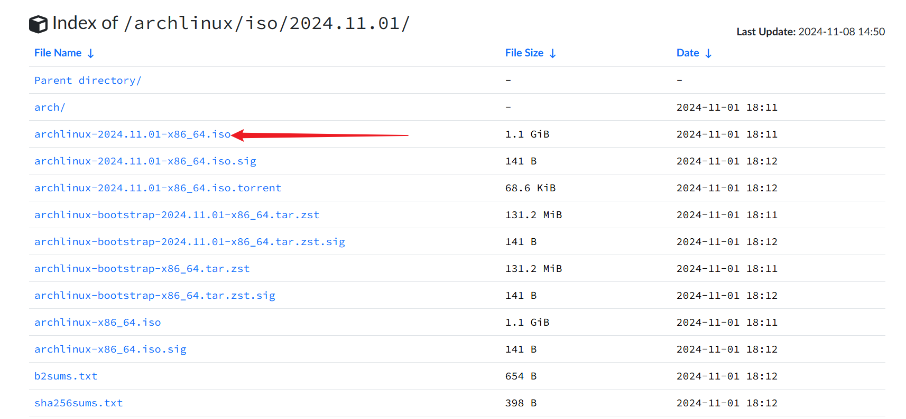

2. 实际上 archlinux 的安装和后面的环境配置还是比较麻烦的，尤其是后面还要安装 hyprland ，需要频繁地查看文档说明，这里就采用 VMware 的方式进行安装。当然前提是在移动硬盘里面安装。因此这里需要提前安装好 [VMware](https://www.vmware.com/) 虚拟机平台(目前 VMware 对于个人开发者已经免费，但是下载起来较之前可能麻烦一些)。


##### VMware 准备

> 最初还是需要在虚拟机上研究，后续再在硬盘中安装。下面其实是使用 vmware 在移动硬盘安装系统的教程，但是也包含了 vmware 安装 archlinux。

1. 首先使用 VMware 配置一个虚拟机，这里没必要自定义，后续我们安装时不会使用这些配置:<br>
2. 选中准备工作中下载好的 ios 镜像文件:<br>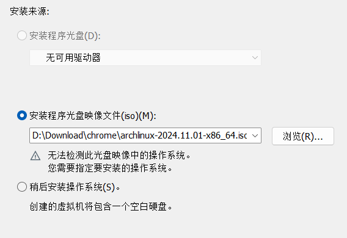
3. 选择一下系统类型:<br>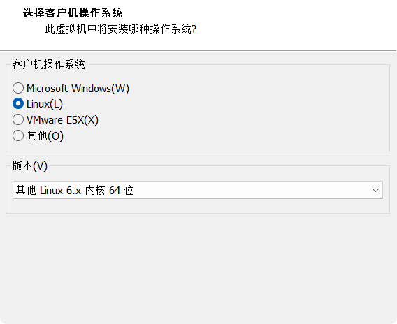
4. 给虚拟机命名，然后设置一下存储位置:<br>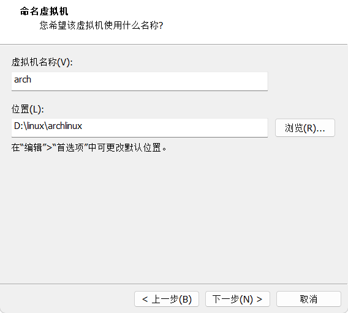
5. 这里的磁盘打大小随意，后续不会使用:<br>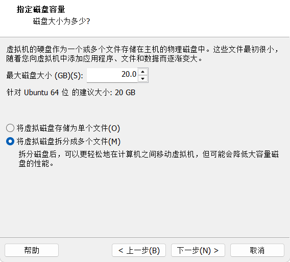
6. 配置一下虚拟机配置，点击配置硬件后: 内存和处理器可以适当增大(后续配置的话还是在 VMware 中进行，方便一些)，usb版本安按照实际选择<br>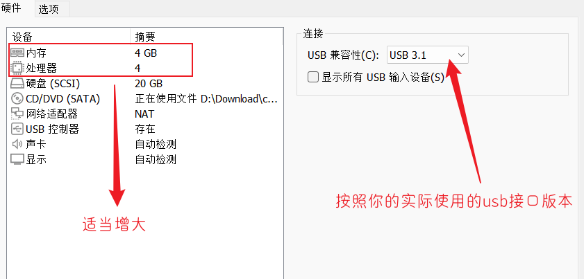
7. 点击选项配置，关闭侧通道缓解并设置启动方式为 UEFI :<br>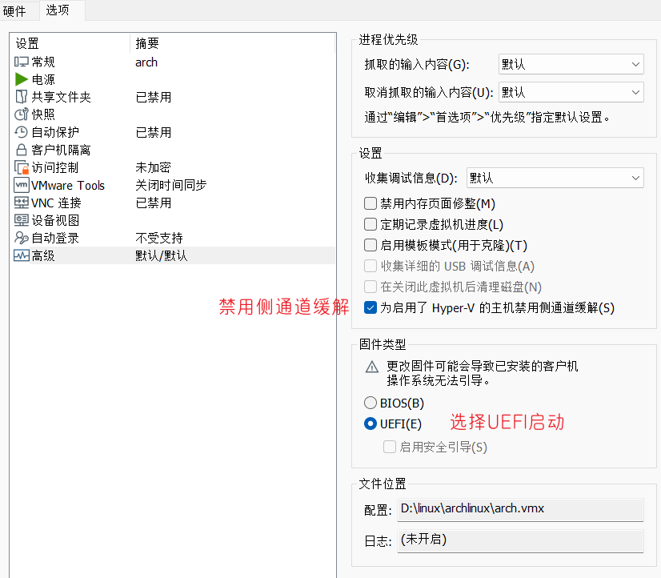
8. 然后启动虚拟机,选择默认，回车即可:<br>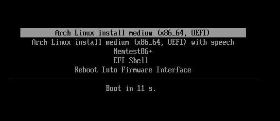
9. 将移动硬盘插入电脑，这里会询问连接位置，我们选择连接到当前的虚拟机:<br>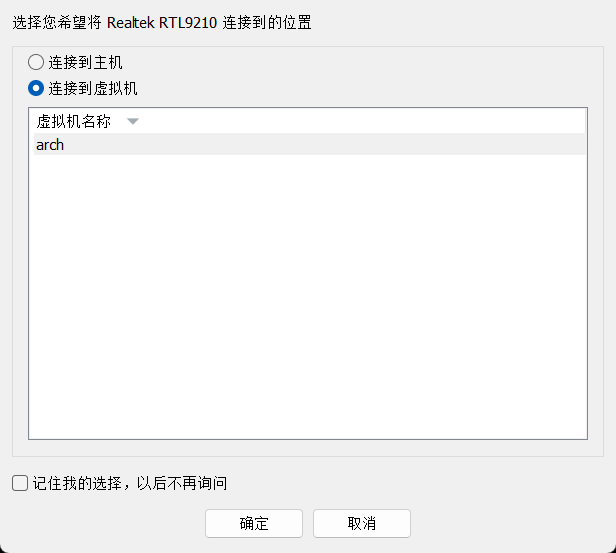
10. 使用 `fdisk -l`就可以看见移动硬盘,记住它:<br>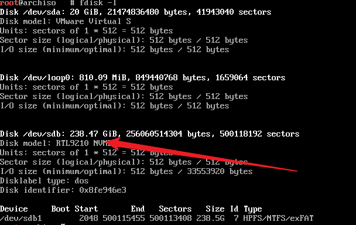


##### 制作启动盘

1. https://rufus.ie/zh/
2. 示意图:<br>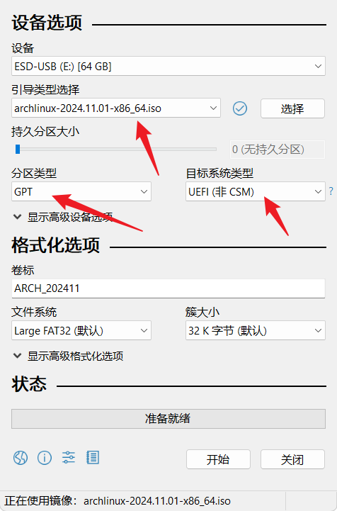


##### 开始安装

> archlinux 并不建议初学者使用官方的安装脚本 `archinstall`走捷径。此外安装的话这里只是记录一下流程，具体的安装步骤其实网络上存在大量教程

1. 安装步骤参考:

   1. 参考文档1: 官方安装指导https://wiki.archlinux.org/title/Installation_guide

      参考文档2: archlinux安装教程https://arch.icekylin.online/guide/

2. 配置一下永久禁用蜂鸣器内核模块。

3. 查看是否为 UEFI 模式。

4. 联网，若是使用 VMware，直接跳过繁琐的联网步骤。

5. 检查系统时间是否准确。

6. 配置系统分区,使用 cfdisk。若是一块新磁盘需要重新创建分区表，使用 parted 工具。

7. 换源。

8. 安装 GRUB 到 EFI 分区：若是安装在移动硬盘，则需要添加`--removable`参数。

   `````bash
   grub-install --target=x86_64-efi --efi-directory=/boot --bootloader-id=ARCH  # --removable
   `````

9. 有一点需要提一下,不要在安装时设置位中文( LANG=zh_CN.UTF-8),这回导致 tty 显示异常。后续安装完成桌面之后再修改全局的 LANG locale 设置成中文。但是需要说明的是,后续若是使用 tty 还是会出现字体显示异常( tty 中没有字体):

   ```bash
   # 设置中文: LANG=zh_CN.UTF-8
   cat /etc/locale.conf
   ```

   


##### 分区表(gpt补充)

1. 分区表:分区表是存储磁盘分区结构和信息的一个数据结构，负责描述磁盘如何被分割为多个逻辑部分（分区）。不同的操作系统和硬件环境支持不同类型的分区表。最常见的两种类型是 MBR（Master Boot Record）和 GPT（GUID Partition Table）。

2. MBR 分区表:

      1. MBR 是传统的分区表类型，最早由 IBM 在 1983 年引入，用于 32 位系统和 BIOS 启动。
      2. 支持最多四个主分区，或者三个主分区加一个扩展分区。扩展分区中可以创建多个逻辑分区。
      3. MBR 的最大支持磁盘大小为 2TB。如果磁盘大小超过 2TB，MBR 无法正确管理磁盘空间。
      4. MBR 分区表位于磁盘的第一个扇区（第一个 512 字节），包括引导代码（启动扇区）和分区表数据。分区表存储了磁盘分区的起始位置、大小、类型等信息。
      5. **缺点**：由于其结构的局限性，MBR 不支持超过 2TB 的大磁盘，也不支持更多的分区。

3. GPT 分区表:

      1. GPT 是较新的分区表类型，它是 UEFI（Unified Extensible Firmware Interface）启动模式的标准分区表格式。GPT 可以支持比 MBR 更大的磁盘和更多的分区。
      2. GPT 支持最多 128 个主分区，不需要扩展分区和逻辑分区。
      3. GPT 可以支持超过 2TB 的磁盘，理论上可以支持到 9.4ZB（Zettabytes），远远超过当前硬件的需求。
      4. GPT 分区表包括保护 MBR（用于兼容旧系统）、GPT 主分区表（存储分区信息）和备份分区表（提高数据安全性）。GPT 还为每个分区提供一个唯一的 GUID（全球唯一标识符）来标识分区。
      5. **优势**：
         - 支持更大磁盘和更多分区。
         - 具备更好的冗余性，因为 GPT 会保存主分区表的备份副本。
         - 更强的扩展性和可靠性，能够支持 UEFI 启动和更复杂的分区结构。
      6. **缺点**：GPT 不兼容旧的 BIOS 启动，需要 UEFI 固件支持。如果硬盘要在旧版 BIOS 系统下使用，则需要额外的启动管理器或工具。

4. 分区表比较

   | 特性             | MBR                                  | GPT                      |
   | ---------------- | ------------------------------------ | ------------------------ |
   | 最大支持磁盘大小 | 2TB                                  | 9.4ZB（理论上）          |
   | 最大支持分区数量 | 4个主分区，或者3个主分区+1个扩展分区 | 最多128个主分区          |
   | 支持的启动方式   | BIOS（传统）                         | UEFI（现代）             |
   | 冗余性与备份     | 没有备份                             | 支持备份分区表           |
   | 兼容性           | 兼容旧系统（32位和BIOS）             | 仅支持UEFI（需现代硬件） |

5. 适用场景

      1. MBR适用于较老的硬件和操作系统，尤其是没有 UEFI 启动的环境，或者磁盘小于 2TB 的情况。
      2. GPT适用于大容量硬盘、UEFI 启动的系统，支持现代操作系统的环境，具有更好的数据保护和冗余机制。
      3. 现代计算机和操作系统推荐使用 GPT 分区表，尤其是对于较大磁盘和 UEFI 启动系统。而 MBR 分区表适用于较旧的硬件和小于 2TB 的磁盘。现代操作系统（如 Windows 10/11、Linux、macOS）都支持 GPT，而较旧的操作系统可能只支持 MBR。


#####  VMware Tools

> 仅虚拟机需要安装，其他类型虚拟机也是一样的，不然无法使用主机的剪贴板，从而无法复制粘贴。

1. 2007 年，VMware 将 [VMware Tools](https://kb.vmware.com/kb/340) 中的大部分代码以 LGPL 协议发布，这就是 Open-VM-Tools。官方的 VMware Tools 不再单独向 Arch Linux 提供。[open-vm-tools](https://archlinux.org/packages/?name=open-vm-tools)包 软件包里包括如下工具：

   - `vmtoolsd` - 负责汇报虚拟机状态的服务。

   - `vmware-checkvm` - 用于检测虚拟机中是否在运行着某程序的工具。

   - `vmware-toolbox-cmd` - 用于收集宿主系统信息的工具。

   - `vmware-user` - 用来在宿主机和虚拟机之间共享剪切板（复制/粘贴）的工具。

   - `vmware-vmblock-fuse` - 文件系统工具。基于 FUSE 实现了宿主/客机之间拖拽文件的功能。

   - `vmware-xferlogs` - 向虚拟机的日志文件输出日志与调试信息。

   - `vmhgfs-fuse` - 挂载 HGFS 共享目录的工具。

2. 安装 open-vm-tools 包。然后启动并启用 vmtoolsd.service 和 vmware-vmblock-fuse.service。

   ```bash
   # 安装工具包
   sudo pacman -S open-vm-tools
   
   #启动服务 
   systemctl start vmtoolsd.service
   systemctl start vmware-vmblock-fuse.service
   #设置开机启动
   systemctl enable vmtoolsd.service
   systemctl enable vmware-vmblock-fuse.service
   ```

3.安装完成重启虚拟机。


##### sshd

1. 安装 openssh : `pacman -S openssh`。

2. 开启 sshd : `systemctl enable --now sshd.service`。

3. 配置 sshd 文件:` vim /etc/ssh/sshd_config`,然后添加如下内容

   ```bash
   PermitRootLogin yes
   ```

   


##### 基本软件

1. 安装 yay 或者 pura:

   1. 开启32位支持库与ArchLinux中文社区仓库archlinuxcn:

      1. 编辑`vim /etc/pacman.conf`：

         ```bash
         # 取消注释
         [multilib]
         Include = /etc/pacman.d/mirrorlist
         
         # 添加镜像源(选一个即可)
         [archlinuxcn]
         Server = https://mirrors.ustc.edu.cn/archlinuxcn/$arch # 中国科学技术大学开源镜像站
         Server = https://mirrors.tuna.tsinghua.edu.cn/archlinuxcn/$arch # 清华大学开源软件镜像站
         Server = https://mirrors.hit.edu.cn/archlinuxcn/$arch # 哈尔滨工业大学开源镜像站
         Server = https://repo.huaweicloud.com/archlinuxcn/$arch # 华为开源镜像站
         ```

      2. 更新数据库：`pacman -Syyu`

   2. 安装`archlinuxcn`源和`yay`( paru 也可 )

      ```bash
      pacman-key --init
      
      # pacman -Syyu (之前没有更新需要更新)
      
      sudo pacman -S archlinux-keyring  # (可选,archlinux源签名)
      
      sudo pacman -S archlinuxcn-keyring # cn源中的签名(archlinuxcn-keyring在archlinuxcn)
      sudo pacman -S yay # paru/yay 命令可以让用户安装 AUR 中的软件
      ```

2. 安装字体:

   ```bash
   sudo pacman -S adobe-source-han-sans-cn-fonts adobe-source-han-serif-cn-fonts noto-fonts-cjk wqy-microhei wqy-microhei-lite wqy-bitmapfont wqy-zenhei ttf-arphic-ukai ttf-arphic-uming noto-fonts noto-fonts-cjk noto-fonts-emoji noto-fonts-extra
   ```

3. 一些基本软件:

   ```bash
   sudo pacman -S git firafox
   
   # 浏览器( zen、firefox 二选一即可)
   sudo pacman -S firefox
   sudo pacman -S zen-browser 
   sudo pacman -S zen-browser-i18n-zh-cn # 中文版
   
   # 图片查看软件
   sudo pacman -S shotwell
   
   # 图片修复软件
   sudo pacman -S imagemagick
   convert damaged_image.jpg output.png
   ```


##### Hyprland配置

1. 注意 hyprland 要想在 vmware虚拟及中使用，需要开启虚拟机的 3d 加速:<br>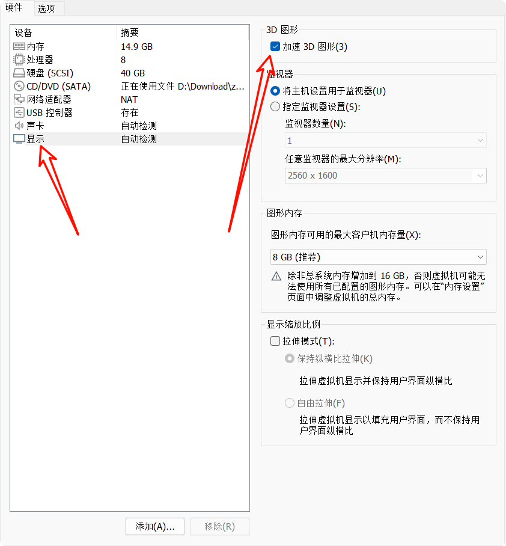

   > 哪怕开启 3d 加速，还是无法在虚拟机中 kitty 无法使用，需要改用 foot。

2. 安装:切换到非 root 用户后执行下面安装命令

   ```bash
   # 安装 release 版本
   sudo pacman -S hyprland
   
   # 安装最新
   yay -S hyprland-git
   ```

3. 本人系统存在双GPU ( intel 和 navidia ),参照官方文档，对于 Nvidia，参照[官方文档](https://wiki.hyprland.org/Nvidia/)安装一些必要驱动软件

   1. 对于 intel 显卡:

      ```bash
      sudo pacman -S mesa lib32-mesa vulkan-intel lib32-vulkan-intel 
      
      # 查看使用
      sudo pacman -S intel-gpu-tools
      sudo intel_gpu_top
      ```

   2. 对于 nividia 配置:

      ```bash
      # 安装驱动
      sudo pacman -S libva-nvidia-driver nvidia-dkms nvidia-utils egl-wayland  nvidia-settings
      
      # 查看使用情况
      nvidia-smi
      ```

      > 对于双显卡,我不知道是否应该配置 hyprland 中关于 nividia 的相关内容([wiki](https://wiki.hyprland.org/Nvidia/)),目前位置一直使用 intel 。后续我尝试配置该部分,在执行 `sudo mkinitcpio -P` 时报错 `nvidia nvidia_modeset nvidia_uvm nvidia_drm` 没有找到: 我没有安装安装内核头文件: 运行 `sudo pacman -S linux-headers` 安装并执行 `pacman -Q linux linux-headers` 确认内核头文件版本是否匹配。完成后,重新执行 `sudo mkinitcpio -P` 更新 initramfs 镜像。**<font color=red>按照操作修改配置文件后， nividia 驱动挂掉了，sddm 登录成功后无法进入桌面,暂时还未找到解决方法…</font>**

   3. 设置使用 intel 集成显卡

      ```bash
      ❯ lspci | grep -E 'VGA|3D'
      00:02.0 VGA compatible controller: Intel Corporation TigerLake-LP GT2 [Iris Xe Graphics] (rev 01)
      03:00.0 3D controller: NVIDIA Corporation GP108M [GeForce MX330] (rev a1)
      
      ❯ ls -l /dev/dri/by-path
      总计 0
      lrwxrwxrwx 1 root root  8 12月30日 23:57 pci-0000:00:02.0-card -> ../card1
      lrwxrwxrwx 1 root root 13 12月30日 23:57 pci-0000:00:02.0-render -> ../renderD128
      lrwxrwxrwx 1 root root  8 12月30日 23:57 pci-0000:03:00.0-card -> ../card0
      lrwxrwxrwx 1 root root 13 12月30日 23:57 pci-0000:03:00.0-render -> ../renderD129
      
      # intel 对应  pci-0000:00:02.0-card -> ../card1
      # 配置环境变量
      env = AQ_DRM_DEVICES,/dev/dri/card1:/dev/dri/card0
      
      ```

   4. 一些 cpu 数据显示工具:

      1. nvtop:专为 NVIDIA GPU 设计,可以实时查看显存使用率、GPU 负载和功耗,支持多显卡监控。

         ```bash
         # 安装
         sudo pacman -S nvtop
         
         # 使用
         sudo nvtop
         ```

      2. btop:直观且美观的终端工具，显示 CPU、内存、磁盘、网络和部分 GPU 的使用情况。

         ```bash
         # 安装使用
         sudo pacman -S btop
         sudo btop # 查看 intel 需要 sudo（https://github.com/aristocratos/btop)
         
         # 安装 catppuccin 主题( btop自带许多内置主题 )
         cd ~/Downloads && git clone https://github.com/catppuccin/btop.git
         mkdir -p  /usr/share/btop/themes/
         sudo cp -r ./btop/themes/*  /usr/share/btop/themes/ ( 不建议安装在 ~/.config/btop/themes/ )  
         # 重新打开 btop,按 M 进入菜单，选择 Options > Themes,使用左右键选择主题( catppuccin_macchiato 不错)。
         ```

4. 复制默认配置文件：

   ```bash
   mkdir -p ~/.config/hypr/
   sudo cp /usr/share/hypr/hyprland.conf ~/.config/hypr/
   ```

5. 配置基环境变量：

   ```bash
   env = XDG_CURRENT_DESKTOP,Hyprland
   env = XDG_SESSION_TYPE,wayland
   env = XDG_SESSION_DESKTOP,Hyprland
   env = QT_QPA_PLATFORM,wayland;xcb
   env = QT_QPA_PLATFORMTHEME,qt6ct
   env = QT_WAYLAND_DISABLE_WINDOWDECORATION,1
   env = QT_AUTO_SCREEN_SCALE_FACTOR,1
   env = MOZ_ENABLE_WAYLAND,1
   env = GDK_SCALE,1
   
   # fcitx
   env = INPUT_METHOD,fcitx
   env = XIM,fcitx
   env = XIM_PROGRAM,fcitx
   env = GTK_IM_MODULE,fcitx
   env = QT_IM_MODULE,fcitx
   env = XMODIFIERS,@im=fcitx
   env = SDL_IM_MODULE,fcitx
   env = GLFW_IM_MODULE,fcitx
   
   # qt/GTK theme
   env = GTK2_RC_FILES,/usr/share/themes/Adwaita/gtk-2.0/gtkrc
   env = GTK_THEME,Adwaita
   env = QT_STYLE_OVERRIDE,Adwaita
   env = QT_QPA_PLATFORMTHEME,qt5ct
   
   
   # 选择合适的显卡驱动
   env = NVD_BACKEND,direct
   env = __GLX_VENDOR_LIBRARY_NAME, nvidia
   env = LIBVA_DRIVER_NAME, nvidia   
   # env = GBM_BACKEND, nvidia-drm (似乎会导致强制使用 nividia 而非 intel )
   env = WLR_NO_HARDWARE_CURSORS, 1 
   env = __GL_VRR_ALLOWED, 1         
   env = ELECTRON_OZONE_PLATFORM_HINT,auto
   ```

6. 安装一些W ayland 环境下运行图形应用所需的组件，确保应用程序能够在 Wayland 显示服务器上正确渲染和交互。

   ```bash
   sudo pacman -S xorg-xwayland qt5-wayland qt6-wayland glfw-wayland xdg-desktop-portal wayland-protocols
   
   yay -S qt6c
   
   # 二选一(其实好像已经预装了)
   yay -S xdg-desktop-portal-hyprland-git
   sudo pacman xdg-desktop-portal-hyprland
   ```

   > qt5ct、qt5ct是一个用来配置 Qt 应用程序外观和行为的工具。在使用 Wayland 和 X11 时，特别是对于使用 Qt 的应用程序，qt5ct 可以设置应用程序的主题、字体、图标以及其他一些界面元素的样式。

7. 修改配置文件后,重新加载运行 `hyprctl reload` 即可。

8. 统一 Qt 和 GTK 应用程序的外观:参考[wiki](https://wiki.archlinuxcn.org/wiki/%E7%BB%9F%E4%B8%80_Qt_%E5%92%8C_GTK_%E5%BA%94%E7%94%A8%E7%A8%8B%E5%BA%8F%E7%9A%84%E5%A4%96%E8%A7%82)

   1. 安装主题:

      ```bash
      # 安装 Qt 5 Adwaita 主题
      yay -S adwaita-qt5 adwaita-qt6
      
      # 安装 GTK 3 和 GTK 2 的 Adwaita 主题
      sudo pacman -S gtk3 gnome-themes-extra
      ```

   2. 配置环境变量:

      ```bash
      # 设置 GTK 2 主题为 Adwaita
      env = GTK2_RC_FILES,/usr/share/themes/Adwaita/gtk-2.0/gtkrc
      
      # 设置 GTK 3 主题为 Adwaita
      env = GTK_THEME,Adwaita
      
      # 设置 Qt 主题为 Adwaita
      env = QT_STYLE_OVERRIDE,Adwaita
      
       # 或qt6ct:使用qt5ct来配置 Qt 主题
      env = QT_QPA_PLATFORMTHEME,qt5ct 
      ```

9. 样式修改:

   ```bash
   general {
       gaps_in = 3
       gaps_out = 8
       border_size = 2
   
       # https://wiki.hyprland.org/Configuring/Variables/#variable-types for info about colors
       col.active_border = rgba(cba6f7ff) rgba(89b4faff) rgba(94e2d5ff) 10deg
       col.inactive_border = 0xff45475a
   
       # Set to true enable resizing windows by clicking and dragging on borders and gaps
       resize_on_border = true
   
       # Please see https://wiki.hyprland.org/Configuring/Tearing/ before you turn this on
       allow_tearing = false
       layout = dwindle
   }
   
   # https://wiki.hyprland.org/Configuring/Variables/#decoration
   decoration {
       rounding = 8
   
       # Change transparency of focused and unfocused windows
       active_opacity = 1.0
       inactive_opacity = 1.0
   
       shadow {
           enabled = true
           range = 25
           render_power = 3
           color = rgba(1a1a1aee)
       }
   
       # https://wiki.hyprland.org/Configuring/Variables/#blur
       blur {
           enabled = true
           size = 3
           passes = 1
           vibrancy = 0.1696
       }
   }
   ```

11. 放缩配置:

    ```bash
    # 放缩
    monitor=,1920x1080@59.93Hz,auto,1.25
    
    # xwayland 强制禁用缩放：
    xwayland {
      force_zero_scaling = true
    }
    
    # xwayland 单独设置缩放
    exec-once = echo 'Xft.dpi:120' | xrdb -merge
    
    # exec-once = dbus-update-activation-environment --systemd WAYLAND_DISPLAY XDG_CURRENT_DESKTOP
    exec-once = dbus-update-activation-environment --systemd --all # for XDPH
    exec-once = systemctl --user import-environment WAYLAND_DISPLAY XDG_CURRENT_DESKTOP # for XDPH
    
    env = XDG_CURRENT_DESKTOP,Hyprland
    env = XDG_SESSION_TYPE,wayland
    env = XDG_SESSION_DESKTOP,Hyprland
    #env = QT_QPA_PLATFORM,wayland;xcb
    env = QT_QPA_PLATFORM,wayland
    env = QT_WAYLAND_DISABLE_WINDOWDECORATION,1
    env = QT_AUTO_SCREEN_SCALE_FACTOR,0
    env = MOZ_ENABLE_WAYLAND,1
    env = MOZ_QT_SCALE_FACTOR,1.25
    env = GDK_SCALE,1
    env = GDK_DPI_SCALE,1.25
    # 0.625 * 2 = 1.25 UI放大2倍 字体缩小为 0.625
    env = GTK_USE_PORTAL,1
    env = QT_SCALE_FACTOR,1.25       
    # env = QT_FONT_DPI,96   
    
    
    env = GDK_BACKEND,wayland
    env = SDL_VIDEODRIVER,wayland
    env = CLUTTER_BACKEND,wayland
    
    env = QT_AUTO_SCREEN_SCALE_FACTOR,0
    env = QT_ENABLE_HIGHDPI_SCALING,0
    ```
    
    > 1. 调整 `QT_SCALE_FACTOR` 会改变字体的显示大小，因为它是全局的缩放参数。如果只想单独调整字体大小而不影响其他 UI 元素，可以使用 `QT_FONT_DPI` 或直接在应用程序设置中修改字体大小。
    > 2. `GDK_SCALE` ( 仅支持整数缩放 )的确会改变字体的显示大小，因为它调整了整个 GTK 应用的缩放比例，可以配合使用 `GDK_DPI_SCALE` 单独调整字体。
    > 3. `GDK_SCALE`会把整个 UI 包括字体、图标、窗口的所有元素一起放大。为了平衡字体大小，可以使用 `GDK_DPI_SCALE`来调整字体的缩放比例。
    > 4. `QT_AUTO_SCREEN_SCALE_FACTOR`控制 Qt 应用程序是否根据显示器的 DPI 自动调整缩放比例。我希望希望手动控制缩放比例,不开启。
    > 5. 上述配置任在摸索验证中,可能存在问题…


```bash
general {
    gaps_in = 3  # 设置内部窗口之间的间隙为 3 像素
    gaps_out = 8  # 设置外部窗口之间的间隙为 8 像素

    border_size = 2  # 设置窗口边框的大小为 2 像素

    # 设置活动窗口的边框颜色，使用 RGBA 格式和渐变
    col.active_border = rgba(cba6f7ff) rgba(89b4faff) rgba(94e2d5ff) 10deg

    # 设置非活动窗口的边框颜色
    col.inactive_border = 0xff45475a

    # 启用点击并拖动边框和间隙来调整窗口大小
    resize_on_border = true

    # 启动“允许撕裂”可能会影响显示效果，通常建议关闭，除非你了解具体后果
    allow_tearing = false

    # 设置窗口布局为 "dwindle"（窗口逐渐堆叠的布局）
    layout = dwindle
}

# 设置窗口装饰相关配置
decoration {
    rounding = 8  # 设置窗口的圆角半径为 8 像素

    # 设置聚焦和非聚焦窗口的透明度
    active_opacity = 1.0  # 聚焦窗口的透明度为 1.0（完全不透明）
    inactive_opacity = 1.0  # 非聚焦窗口的透明度为 1.0（完全不透明）

    shadow {
        enabled = true  # 启用窗口阴影
        range = 25  # 设置阴影的模糊范围为 25 像素
        render_power = 3  # 设置阴影渲染强度为 3
        color = rgba(1a1a1aee)  # 设置阴影的颜色为 rgba(26, 26, 26, 0.93)
    }

    # 启用窗口模糊效果
    blur {
        enabled = true  # 启用模糊效果
        size = 3  # 设置模糊的大小为 3 像素
        passes = 1  # 设置模糊渲染的次数为 1

        vibrancy = 0.1696  # 设置 vibrancy（模糊背景的亮度）的强度
    }
}

input {
    kb_layout = us  # 设置键盘布局为美国英语 (US)
    follow_mouse = 1  # 启用鼠标跟随功能，鼠标移动时光标位置跟随

    touchpad {
        natural_scroll = no  # 禁用触摸板的自然滚动（即滚动方向不与触摸方向一致）
    }

    sensitivity = 0  # 设置输入灵敏度为 0，表示默认灵敏度
    force_no_accel = 1  # 禁用加速，确保按键或鼠标移动的速度与输入一致
    numlock_by_default = true  # 默认开启 NumLock 键
}

device {
    name = epic mouse V1  # 设置设备名称为 "epic mouse V1"
    sensitivity = -0.5  # 设置鼠标灵敏度为 -0.5，负值表示较低的灵敏度
}

gestures {
    workspace_swipe = true  # 启用工作区滑动手势
    workspace_swipe_fingers = 3  # 设置滑动手势需要 3 根手指
}

misc {
    vrr = 0  # 设置 VRR (变刷新率) 为 0，表示禁用 VRR
    disable_hyprland_logo = true  # 禁用 Hyprland 的 logo 显示
    disable_splash_rendering = true  # 禁用启动时的 splash 渲染
    force_default_wallpaper = 0  # 强制使用默认壁纸，0表示不强制
}

xwayland {
    force_zero_scaling = true  # 强制设置 XWayland 的缩放为 0，表示禁用缩放
}

```


##### sddm

1. 安装并启用 sddm: 

   `````bash
   # 安装
   sudo pacman -S sddm
   
   # 启用
   sudo systemctl enable sddm
   
   # 依赖
   sudo pacman -S layer-shell-qt5
   `````

2. 下载主题：

   1. [主题网站](https://store.kde.org/p/1458914/),下载的主题解压到 `/usr/share/sddm/themes` 中，最好找到原项目的地址，因为可能期间会需要安装一些依赖。
   2. github 中搜找主题。
   3. 还可以直接在 archlinx [官方仓库](https://aur.archlinux.org/packages?O=0&SeB=nd&K=sddm&outdated=&SB=p&SO=d&PP=50&submit=GoZ)中找主题。

3. 这里使用 github 上找的的一个主题[sddm-astronaut-theme](https://github.com/Keyitdev/sddm-astronaut-theme)。

   1. 根据文档安装依赖:

      ```bash
      sudo pacman -S qt6-svg
      ```

   2. 安装主题:

      ```bash
      sudo git clone https://github.com/keyitdev/sddm-astronaut-theme.git /usr/share/sddm/themes/sddm-astronaut-theme
      sudo cp /usr/share/sddm/themes/sddm-astronaut-theme/Fonts/* /usr/share/fonts/
      ```

   3. 对主题进行修改: 不太喜欢模糊遮挡，直接关闭

      ```bash
      cd /usr/share/sddm/themes/sddm-astronaut-theme
      
      # PartialBlur="true" 改为 PartialBlur="" 
      ```

4. 配置 hyprland : SDDM 的配置文件路径可能是 /etc/sddm.conf 或者在 /etc/sddm.conf.d 目录下的某个配置文件。一般而言需要自己创建：

   ```bash
   sudo mkdir -p /etc/sddm.conf.d
   sudo vim default.conf
   ```

   ```bash
   [General]
   Session=hyprland  # 设置默认会话为 Hyprland
   Language=zh_CN.UTF-8  # 设置语言为简体中文
   DisplayServer=wayland  # 使用 Wayland 作为显示服务器
   GreeterEnvironment=QT_WAYLAND_SHELL_INTEGRATION=layer-shell  
   # 通常用于 Qt 应用程序与 Wayland 合成器的交互。
   
   
   [Theme]
   Current=sddm-astronaut-theme  # 选择主题
   # EnableAvatars=true  # 启用头像显示
   
   [Wayland]
   CompositorCommand=Hyprland -c /etc/sddm.conf.d/hypr/hyprland.conf  # 设置启动的合成器为 Hyprland
   # CompositorCommand=kwin_wayland --drm --no-lockscreen --no-global-shortcuts --locale1 ( wayland config)  
   #EnableHiDPI=true
   SessionCommand=/usr/share/sddm/scripts/wayland-session  # 确保脚本存在
   SessionDir=/usr/local/share/wayland-sessions,/usr/share/wayland-sessions  # 确保 hyprland.desktop 存在
   SessionLogFile=.local/share/sddm/wayland-session.log
   
   [X11]
   Enable=false  # 确保禁用 X11 支持
   ```

   ```bash
   # /etc/sddm.conf.d/hypr/hyprland.conf
   #monitor=DP-1 , auto , 0x0 , auto
   #monitor= , disable
   misc {
       disable_hyprland_logo = true
       disable_splash_rendering = true
       force_default_wallpaper = 0
   }
   
   windowrulev2 = float, maximize, pin, stayfocused, decorate 0, noanim, noborder, nodim, norounding, noshadow, class:^(sddm-greeter)$
   ```

   > 关于上述文件的讨论(没有可能会无法登陆而是直接显示桌面然后黑屏):[issues](https://github.com/hyprwm/Hyprland/issues/820)

   > `journalctl -u sddm` 查看 SDDM 的所有 systemd 日志。
   >
   > `journalctl -u sddm -e` 查看最新日志。
   >
   > `sudo systemctl restart sddm` 重启 sddm 。

5. sddm 安装后，可能会卡死，此时则需要安装 `sudo pacman -S xf86-video-intel` 和 `sudo pacman -S xf86-video-nouveau` 。

6. 若是配置失误导致无法进入桌面，需要进入 tty ，快捷键为 CTRL+ALT+F1~F8 。当然这其中有一些是返回图形界面，需要自行尝试。

 


```bash
[General]
Session=hyprland  
Language=zh_CN.UTF-8 
DisplayServer=wayland  
GreeterEnvironment=QT_WAYLAND_SHELL_INTEGRATION=layer-shell  

[Theme]
Current=sddm-astronaut-theme  # 选择主题

[X11]
Enable=false  # 确保禁用 X11 支持
```


##### 输入法

1. 安装中文字体:

   ```bash
   sudo pacman -S adobe-source-han-sans-cn-fonts adobe-source-han-serif-cn-fonts noto-fonts-cjk wqy-microhei wqy-microhei-lite wqy-bitmapfont wqy-zenhei ttf-arphic-ukai ttf-arphic-uming noto-fonts noto-fonts-cjk noto-fonts-emoji noto-fonts-extra
   ```

2. 安装 fcitx5 输入法框架和 rime 输入法:`sudo pacman -S fcitx5-im fcitx5-chinese-addons`。

   ```bash
   sudo pacman -S fcitx5-im fcitx5-chinese-addons
   
   sudo pacman -S fcitx5-rime
   ```

3. 环境配置：~~`sudo vim /etc/environment`~~( hyprland 似乎更推荐配置在 hyprland.conf 中)

   ```bash
   INPUT_METHOD=fcitx
   XIM=fcitx
   XIM_PROGRAM=fcitx
   GTK_IM_MODULE=fcitx
   QT_IM_MODULE=fcitx 
   XMODIFIERS=@im=fcitx
   SDL_IM_MODULE=fcitx
   GLFW_IM_MODULE=fcitx
   ```

4. 安装主题：[sougou ](https://github.com/sxqsfun/fcitx5-sogou-themes)、[Psionics-Remix](https://github.com/xTpx/Psionics-Remix)，然后运行 `fcitx5-configtool` 配置输入法主题。

   ```bash
   git clone --depth 1 https://github.com/sxqsfun/fcitx5-sogou-themes.git
   cd ./fcitx5-sogou-themes
   
   cp -r xxxx ~/.local/share/fcitx5/themes/ 
   ```

   > 或者也可以使用`pacman -S fcitx5-material-color`

5. 在`~/.config/hypr/hyprland.conf `配置：

   ```bash
   exec-once=fcitx5 --replace -d
   ```

6. 检查输入法`fcitx5-diagnose`。

7. 改用搜狗输入法`yay -S fcitx5-sogou`，略有缺陷(属性面板打不开)，但是可以使用。

   > 1. 解决 typora 在wayland 下输入法的问题:`typora --enable-features=UseOzonePlatform --ozone-platform=wayland --enable-wayland-ime`
   >    1. `--enable-wayland-ime`这个选项用于启用 Wayland 输入法 (IME)支持，它使得输入法框架(fcitx5**、**ibus) 在 Wayland 环境中能够正常工作。
   >    2. `--ozone-platform=wayland` 告诉 Chromium 使用 Wayland 作为显示服务器平台，而不是 X11。默认情况下，Chromium 使用 X11 作为显示协议，但如果你运行在 Wayland 环境下（例如 GNOME 或 KDE 环境），这个选项可以强制 Chromium 使用 Wayland，而非 X11。
   >    3. `--enable-features=UseOzonePlatform`，你告诉 Chromium 或 Chrome 在底层使用 Ozone 平台，而不是传统的 X11 或 Wayland 后端。
   > 2. Typora 采用了 Web 技术 来呈现编辑界面，但它本身并不是基于 Chromium。它是一个独立的应用程序，主要使用 Electron 框架构建。Electron 是一个允许开发者使用 Web 技术构建桌面应用程序的框架，它内嵌了一个 Chromium 引擎来渲染界面。
   > 3. 对于 chrome 在 wayland 下的问题，解决方式应该是一致的。


##### kitty

1. 安装 kitty (在安装 hyprland 之前): `sudo pacman -S kitty` 

2. 配置 kitty 配置文件:

   ```bash
   mkdir -p ~/.config/kitty/
   
   cp /usr/share/doc/kitty/kitty.conf ~/.config/kitty/kitty.conf
   ```

3. 修改配置文件: `vim ~/.config/kitty/kitty.conf`

   ```bash
   # 配置字体
   font_family      Fira Code
   bold_font        auto
   italic_font      auto
   font_size        14.0
   
   # 配置窗口外观
   background_opacity  0.8
   window_padding_width 10
   # 动态透明度
   dynamic_background_opacity yes
   # 关闭背景模糊度
   background_blur 0
   
   
   # 设置光标形状，block块、underline下划线、beam竖线。
   cursor_shape  block
   cursor_beam_thickness 2
   # 未聚焦时样式
   cursor_shape_unfocused underline
   
   # 启用或禁用光标闪烁。
   cursor_blink  yes
   # 启用URL检测，允许点击链接直接在浏览器中打开。
   detect_urls   yes
   
   # 光标尾迹强度(https://sw.kovidgoyal.net/kitty/conf/#opt-kitty.cursor)
   cursor_trail 3
   # 光标尾迹衰减时间
   cursor_trail_decay 0.1 0.4
   
   
   # 关闭提示音
   enable_audio_bell no
   
   # 初始化
   placement_strategy center
   initial_window_width  120
   initial_window_height 90
   ```

4. 配置 kitty 主题:

   1. 使用命令 `kitty +kitten themes` 打开主题菜单选择主题或是使用命令通过主题名字指定需要使用的主题 `kitty +kitten themes --reload-in=all <theme>`。

   2. 安装其他主题，例如[catppuccin](https://github.com/catppuccin/kitty):

      ```bash
      # 下载
      cd ./Downloads && git clone https://github.com/catppuccin/kitty.git 
      
      # 安装
      mkdir -p ~/.config/kitty/themes/ 
      cp ./kitty/themes/*  ~/.config/kitty/themes/ 
      
      # 设置主题: Catppuccin-Latte、Catppuccin-Frappe、Catppuccin-Macchiato、Catppuccin-Mocha
      kitty +kitten themes --reload-in=all Catppuccin-Macchiato
      ```

5. 安装字体: [nerdfonts](https://www.nerdfonts.com/font-downloads)

   1. 下载完成后，将字体文件拷贝到  `/usr/share/fonts/` (全局安装)或 `~/.local/share/fonts` (当前用户安装)文件夹中，最后在字体文件夹执行：`fc-cache`。

      ```bash
      # 下载字体
      wget https://github.com/ryanoasis/nerd-fonts/releases/download/v3.3.0/FiraCode.zip
      
      # 安装
      sudo pacman -S unzip
      sudo mkdir -p /usr/share/fonts/my-fonts/
      sudo unzip FiraCode -d /usr/share/fonts/my-fonts/
      
      # 刷新
      fc-cache 
      
      # 查看已安装字体
      fc-list 
      fc-list | grep Fira
      ```

   2. 修改 kitty 终端字体:

      ```bash
      # 修改配置文件
      vim ~/.config/kitty/kitty.conf 
      
      # 设置字体为 FiraCode Nerd Font Propo
      font_family      FiraCode Nerd Font Propo
      ```

6. 关于 kitty 的初始化大小问题: 以 float 启动即可,还可以使用 -e 参数提供启动时运行命令。

   ```bash
   exec-once=[float] kitty
   ```

   


##### fastfetch

1. fastfetch 是一个快速的系统信息显示工具，类似于 neofetch,它允许高度自定义输出样式。安装:

   ```bash
   # 安装
   sudo pacman -S fastfetch
   
   # 生成默认配置文件( ~/.config/fastfetch/config.conf )
   fastfetch --gen-config
   ```

2. 自己配置嫌麻烦,可以选择直接复制:[prasanthrangan/hyprdots](https://github.com/prasanthrangan/hyprdots/tree/main/Configs/.config/fastfetch),将作者的配置复制到 ~/.config/fastfetch/ ，然后按照自己的意愿修改。

   ```bash
   cd ~/Downloads && git clone --depth=1 https://github.com/prasanthrangan/hyprdots.git
   
   cp -r ./hyprdots/Configs/.config/fastfetch ~/.config/
   ```

3. 此外也可以尝试以下 neofetch :

   ```bash
   # 安装
   sudo pacman -S neofetch
   
   # 配置
   vim ~/.config/neofetch/config.conf
   ```

   


##### zsh

1. 使用 `chsh -s $(which zsh)` 设置 root 用户的默认 shell 为 zsh。

2. 创建新用户 `useradd -m -G wheel -s $(which zsh) <username>` ，设置分组为 wheel 。使用 `passwd <username>` 为新用户创建密码。

3. 为 wheel 用户组添加 sudo 权限，即编辑 sudoers 文件(运行`vim /etc/sudoers` 或者`EDITOR=vim visudo`)添加 `%wheel ALL=(ALL:ALL) ALL` 。

4. 安装 oh-my-zsh 和 powerlevel10k:

   ```bash
   # 安装oh-my-zsh
   sh -c "$(curl -fsSL https://raw.githubusercontent.com/ohmyzsh/ohmyzsh/master/tools/install.sh)"
   # 安装powerlevel10k
   git clone --depth=1 https://gitee.com/romkatv/powerlevel10k.git ${ZSH_CUSTOM:-$HOME/.oh-my-zsh/custom}/themes/powerlevel10k
   ```
   
6. 装完后使用 `vim ~/.zshrc`配置好 `ZSH_THEME="powerlevel10k/powerlevel10k"`，运行`p10k configure`配置自定义设置。

7. 安装几个插件(仅对当前用户生效)：

   ```shell
   
   # zsh-syntax-highlighting:终端命令语法高亮
   git clone https://github.com/zsh-users/zsh-syntax-highlighting ~/.oh-my-zsh/plugins/zsh-syntax-highlighting
   
   
   # zsh-autosuggestions:自动补全
   git clone https://github.com/zsh-users/zsh-autosuggestions ~/.oh-my-zsh/plugins/zsh-autosuggestions
   ```

8. `vim ~/.zshrc`编辑文件，添加插件：

   ```text
   plugins=(
   ...  # 之前已经声明的插件名称
   zsh-autosuggestions
   zsh-syntax-highlighting
   )
   ```

8. 运行`source ~/.zshrc`重新加载配置文件。


##### Nautilus

1. 参考[官方文档](https://wiki.hyprland.org/Useful-Utilities/File-Managers/),文档管理器可以选择 Nautilus、Dolphin、Nemo、Thunar 等文档管理器。我选择 nautilus 和 yazi:

   ```bash
   sudo pacman -S ntfs-3g # 使系统可以识别 NTFS 格式的硬盘
   
   yay -S nautilus 
   sudo pacman -S yazi
   ```

2. 安装 Nautilus 拓展，具体参考[wiki](https://wiki.archlinux.org/title/GNOME/Files)

   ```bash
   yay -S nautilus-admin-gtk4 nautilus-image-converter nautilus-open-any-terminal 
   yay -S nautilus-launch sushi nautilus-hide
   ```

3. 运行 nautilus 启动,修改 hyprland 配置添加 `nautilus` 相关配置。

   ```bash
   bind = $mainMod, E, exec, nautilus --new-window
   windowrulev2 = float, class:org.gnome.Nautilus
   
   # 或者
   bind = $mainMod, E, exec, [float] nautilus --new-window
   ```

   > 关于 nautilus 对应的 class 可以使用 hyprctl clients 命令查看,这一点在 hyprland 的 wiki 中有介绍。

4. 配置主题:这里并不推荐,不利于保持 qt/GTK的一致性,前面在 hyprland 安装中已经提到过。

   1. 安装其他主题如 catppuccin(`yay -S catppuccin-gtk-theme-macchiato`) 以及一些主题网站:

      1. [gnome-look](https://www.gnome-look.org/browse?cat=135&ord=latest)
      2. [aur](https://aur.archlinux.org/packages?K=gtk-theme)

   2. 安装 gtk 工具: GNOME Tweaks 是一个非常有用的工具，可以帮助你修改 GNOME 桌面环境的主题设置

      ```bash
      # 安装
      sudo pacman -S gnome-tweaks
      
      # 启动 GNOME Tweaks
      gnome-tweaks
      ```

5. 解决报错:PolicyKit 身份验证系统不可用。: Not authorized to perform operation

   1. 安装(若未安装) polkit :`sudo pacman -S polkit`。

   2. 参考[wiki](https://wiki.archlinux.org/title/Polkit#Authentication_agents),需要安装一些个 Authentication_agents ,我这里选择`sudo pacman -S polkit-gnome`

   3. 然后需要在登陆后执行 `/usr/lib/polkit-gnome/polkit-gnome-authentication-agent-1`,及在 hyprland 中配置:

      ```bash
      exec-once = /usr/lib/polkit-gnome/polkit-gnome-authentication-agent-1
      ```

      > 这里选择 hyprpolkitagent-gitAUR 然后执行 /usr/lib/hyprpolkitagent 也可以,但是 polkit-gnome 颜值高。

6. 关于 nautilus-open-any-terminal 插件无法适用于非 gnome 原生终端,参考[官方文档](https://gitcode.com/gh_mirrors/na/nautilus-open-any-terminal/overview?utm_source=outstanding_ugc_gitcode&index=bottom&type=card&webUrl)解决( kitty 也可以换成其他终端):

   ```bash
   gsettings set com.github.stunkymonkey.nautilus-open-any-terminal terminal kitty
   ```

> 大多数文件管理器都会影藏一些配置文件，尤其是以点`.`开头的文件，这些文件通常是配置文件或系统文件。在大多数文件管理器中可以通过快捷键 `Ctrl + H` 可以切换显示或隐藏隐藏文件。


##### hyprpaper

1. 安装 `sudo pacman -S hyprpaper`(已经包含在 hyprland-git ),参考[hyprland wiki](https://wiki.hyprland.org/Hypr-Ecosystem/hyprpaper/)。其实还有其他一些壁纸软件，例如 swww、swaybg 等。

2. 在 `~/.config/hypr/hyprpaper.conf` 中 配置壁纸:(`monitor`可以留空以设置为所有没有设置壁纸的监视器)

   ```bash
   # 启动时将其加载到内存
   preload = /home/dreamfish/wallpaper/dreamfish_9.jpg
   
   # 设置壁纸
   wallpaper = , /home/dreamfish/wallpaper/dreamfish_9.jpg
   ```

3. 在 hyprland.conf 中启动 hyprpaper:

   ```bash
   # 启动 hyprpaper
   exec-once = hyprpaper
   ```

   


##### hyprcursor

1. [gnome-look](https://www.gnome-look.org/p/1197198/)下载光标放在 `/usr/share/icons`(所有用户) 或者 `~/.icons`(当前用户) 中,但是其实 aur 里有:

   ```bash
   # 安装
   yay -S  bibata-cursor-theme 
   
   # 查看光标名称
   ls -al /usr/share/icons
   ```

2. 按照[官方](https://wiki.hyprland.org/Hypr-Ecosystem/hyprcursor/)建议，我们需要在 hyprland.conf 配置以下环境变量:

   ```bash
   env=XCURSOR_THEME,Bibata-Modern-Ice
   env = XCURSOR_SIZE,24
   
   env=HYPRCURSOR_THEME,Bibata-Modern-Ice
   env = HYPRCURSOR_SIZE,24
   ```

3. 同时还需要执行以下命令设置 gtk 的光标:

   ```bash
   gsettings set org.gnome.desktop.interface cursor-theme Bibata-Modern-Ice
   gsettings set org.gnome.desktop.interface cursor-size 24
   ```

   > 其实配置环境变量 `env = GTK_CURSOR_THEME,Bibata-Modern-Ice`和 `env= GTK_CURSOR_SIZE,24` 似乎也是可以的。


##### grub主题

1. 直接前往[主题网站](https://www.gnome-look.org/p/2206122/)下载主题,对于下载的主题有些提供安装脚本( install.sh )，直接运行即可，而有些需要手动安装。

2. 对于手动安装，我们需要将下载的主题放置到主题文件夹中,一般常使用一下两个:

   ```bash
   /usr/share/grub/themes/		# 使用 ./install.sh 大多数会把主题安装在该文件夹
   /boot/grub/themes/
   ```

3. 配置 grub 配置文件: 运行 `vim /etc/default/grub` 编辑配置文件 (建议修改前先备份)，在其中配置 GRUB_THEME，其值为主题下的 theme.txt 文件的完整路径。

   ```\
   GRUB_THEME=/boot/grub/themes/xxx/theme.txt
   ```

4. 更新 GRUB 启动加载器配置文件:

   ```bash
   grub-mkconfig -o /boot/grub/grub.cfg
   ```

5. 重启系统。


##### waybar

1. 如果您使用 `waybar` 作为状态栏，可以通过 `alsa` 或 `pulse` 模块显示和控制音量。

   `````bash
   # 安装稳定版本
   sudo pacman -S waybar
   
   # 安装开发版本
   yay -S waybar-git
   `````

2. 在 hyprland.conf 中配置启动

   ```bash
   exec-once = waybar
   ```

3. 从以下位置复制配置文件 `/etc/xdg/waybar/`到`~/.config/waybar/` ,然后配置`~/.config/waybar/config`即可。


##### ags

1. 参照[官网](https://marble-shell.pages.dev/)

https://github.com/Aylur/ags

https://aylur.github.io/ags-docs/

安装 https://aylur.github.io/ags-docs/config/installation/


检查 Waybar 日志

Waybar 会在运行时输出日志信息，可以查看这些日志以发现潜在问题。
方法

    直接启动 Waybar 并查看终端输出：

waybar

检查是否有错误信息，例如配置文件问题、模块加载失败等。

检查系统日志： 如果 Waybar 是通过 Display Manager（如 SDDM）启动的，可以通过以下命令查看相关日志：

journalctl --user-unit waybar.service -e

启用调试模式： 在运行 waybar 时使用 --log-level 参数启用更详细的日志：

    waybar --log-level trace
    
    这将输出更多调试信息，有助于定位问题。


##### rofi

 exec-once=swaybg -i $(find $wallpaper_dir -type f | shuf -n 1) -m fill


yay -S clash-verge-rev-bin  


```bash
# Variables
$proxy_socks5 = socks5://localhost:1080
$proxy_http = http://localhost:1081

env = ALL_PROXY, $proxy_socks5
env = HTTP_PROXY, $proxy_http
env = HTTPS_PROXY, $proxy_http
env = all_proxy, $proxy_socks5
env = http_proxy, $proxy_http
env = https_proxy, $proxy_http
socks_proxy=127.0.0.1:7891
env = NO_PROXY, 127.0.0.0/8,10.0.0.0/8,172.16.0.0/12,192.168.0.0/16

```


参考:https://github.com/iamhrigved/Hyprdots

```bash
https://github.com/theCode-Breaker/riverwm/tree/main/waybar/river
```

https://tea-in-the-snow.github.io/p/hyprland-%E5%AE%89%E8%A3%85%E4%B8%8E%E9%85%8D%E7%BD%AE%E8%AE%B0%E5%BD%95/


##### rofi启动器

1. https://github.com/davatorium/rofi
2. 安装 `sudo pacman -S rofi`
3. 生成默认配置文件：`mkdir -p ~/.config/rofi/`和`rofi -dump-config > ~/.config/rofi/config.rasi`
   1. https://github.com/adi1090x/rofi 需要使用作者的脚本启动

4. 配置启动键

这有几种不同的提示模式。 `drun` 只匹配并显示那些在你的机器上有 `Desktop` 条目的程序（就是有 `.desktop` 文件的程序），而不是你的 `PATH` 上的所有程序。 事实上，不这样做会产生性能问题，是一个已知的问题。


https://github.com/newmanls/rofi-themes-collection?tab=readme-ov-file 

参考文件自行修改配置自己的rofi


##### waybar

参考配置:https://github.com/Anik200/dotfiles/tree/main 和 https://github.com/theCode-Breaker/riverwm/tree/main/waybar/river

1. https://github.com/Agonie0/file_fw/tree/main

https://github.com/Alexays/Waybar/wiki/Examples


模块：https://github.com/Alexays/Waybar/wiki

```json
{
	"layer": "top",
	"modules-left": ["custom/launcher","cpu","memory","custom/media","tray"],
	"modules-center": ["river/tags"],
	"modules-right": ["custom/updates","custom/wallpaper","backlight","pulseaudio","clock", "battery","custom/power"],
	
	"pulseaudio": {
		"tooltip": false,
		"scroll-step": 5,
		"format": "{icon} {volume}%",
		"format-muted": "{icon} {volume}%",
		"on-click":"pactl set-sink-mute @DEFAULT_SINK@ toggle",
		"format-icons": {
			"default": ["", "", ""]
		}
	},

    "river/tags": {
		"num-tags": 6
    },
	"network": {
		"tooltip": false,
		"format-wifi": "  {essid}",
		"format-ethernet": ""
	},
	"backlight": {
		"tooltip": false,
		"format": " {}%",
		"interval":1,
        "on-scroll-up": "light -A 5",
		"on-scroll-down": "light -U 5"
	},
    "battery": {
        "states": {
            "good": 95,
            "warning": 30,
            "critical": 20
        },
        "format": "{icon}  {capacity}%",
        "format-charging": " {capacity}%",
        "format-plugged": " {capacity}%",
        "format-alt": "{time} {icon}",
        "format-icons": ["", "", "", "", ""]
    },
	"tray":{
		"icon-size":18,
		"spacing": 10
	},
    "clock": {
        "format": "{: %I:%M %p   %d/%m/%Y}"
    },
    "cpu": {
        "interval": 15,
        "format": " {}%",
        "max-length": 10
    },
    "memory": {
        "interval": 30,
        "format": " {}%",
        "max-length": 10
    },
    "custom/media": {
        "interval": 30,
        "format": "{icon} {}",
        "return-type": "json",
        "max-length": 20,
        "format-icons": {
            "spotify": " ",
            "default": " "
        },
        "escape": true,
        "exec": "$HOME/.config/system_scripts/mediaplayer.py 2> /dev/null",
        "on-click": "playerctl play-pause"
    },
    "custom/launcher":{
        "format": " ",
        "on-click": "rofi -show drun",
        "on-click-right": "killall rofi"
    },
    "custom/power":{
        "format": " ",
        "on-click": "bash ~/.config/rofi/leave/leave.sh",
    },
    "custom/updates":{
        "format": "{} Update(s)",
        "exec": "checkupdates | wc -l",
        "exec-if": "[[ $(checkupdates | wc -l) != 0 ]]",
        "interval": 15,
        "on-click": "alacritty -e paru -Syu && notify-send 'The system has been updated' "
    },
    "custom/wallpaper":{
        "format":" ",
        "on-click": "bash ~/.config/system_scripts/pkill_bc"
    }
}
```


##### bluetooth

1. 安装声音固件：

   ```bash
   $ sudo pacman -S alsa-utils alsa-plugins alsa-firmware sof-firmware alsa-ucm-conf
   ```

   > - alsa-utils 是一组实用程序，用于配置和控制 ALSA 音频设备，提供了音量控制工具(如 alsamixer 和 amixer )。
   > - alsa-plugins 提供 ALSA 音频系统的额外插件，增强了与其他音频系统(如 PulseAudio 和 PipeWire)的兼容性。
   > - alsa-firmware 包含与 ALSA 音频驱动程序相关的固件文件，这些固件是确保某些音频设备正常工作的必需文件。
   > - sof-firmware 是针对 SOF 项目的固件包，SOF 是一种开放源代码的音频固件，广泛用于现代的 Intel 音频设备。
   > - alsa-ucm-conf 提供了 ALSA 用户配置文件。

2. pipewire-pulse 和 pulseaudio 都是 Linux 系统上常见的音频服务器。

   1. PulseAudio 是一个传统的音频服务器，广泛应用于各种 Linux 发行版中，它主要关注音频流的管理，并能够处理多个音频设备的输出、音量控制、设备切换等。其设计稍显较老，虽然稳定，但可能在某些高性能需求的场合（如低延迟）上表现不佳。
   2. PipeWire 是一个相对较新的音频和视频处理框架，旨在替代 PulseAudio 和 JACK（低延迟音频）的工作。它不仅支持音频流管理，还可以处理视频流。PipeWire 设计为低延迟和高性能，适合多种用途，包括桌面音频、视频流、专业音频和视频应用。

3. pulseaudio (二选一):

   1. 安装 pulseaudio 和其与 pulseaudio 兼容的模块:

      ```bash
      sudo pacman -S pulseaudio pavucontrol pulseaudio-alsa pipewire-media-session
      ```

      > - pulseaudio : PulseAudio 音频服务
      > - pavucontrol : PulseAudio 控制工具，图形界面管理音频设备
      > - pulseaudio-alsa : 将 PulseAudio 与 ALSA 兼容的包
      > - pipewire-media-session : 一个会话管理器

   2. 启用 pulseaudio 服务：

      ```bash
      systemctl --user enable pulseaudio.service
      systemctl --user enable --now pipewire-media-session
      ```

   3. 使用 pavucontrol 来选择音频输出设备。

   4. 使用 PulseAudio 管理蓝牙音频，首先需要安装相关的包: bluez 和 bluez-utils 用于管理蓝牙设备。pulseaudio-bluetooth 使 PulseAudio 支持蓝牙音频设备。

      ```bash
      sudo pacman -S bluez bluez-utils pulseaudio-bluetooth
      ```

   5. 启动蓝牙服务：

      ```bash
      sudo systemctl enable --now bluetooth.service
      ```

   6. 使用 bluetoothctl 命令来管理蓝牙设备：

4. PipeWire (二选一):

   1. 安装 PipeWire 和其与 PulseAudio 兼容的模块:

      ```bash
      sudo pacman -S pipewire pipewire-pulse pipewire-alsa pipewire-jack pavucontrol wireplumber 
      ```

      > - pipewire : 主 PipeWire 包。
      > - pipewire-pulse : 让 PipeWire 兼容 PulseAudio。
      > - pipewire-alsa : ALSA 与 PipeWire 的兼容模块。
      > - pipewire-jack : 提供与 JACK 音频服务器的兼容性。
      > - WirePlumber : PipeWire 的默认会话管理器。

   2. 启动 PipeWire 服务，并确保它在系统启动时自动启动: pipewire-pulse 是 PipeWire 中的一个模块，提供与 PulseAudio 的兼容性，使得应用程序依然可以与 PulseAudio 配合使用。

      ```bash
      systemctl --user enable --now pipewire
      systemctl --user enable --now pipewire-pulse
      systemctl --user enable --now wireplumber
      ```

   3. 使用 pavucontrol 来选择音频输出设备。

   4. 安装 PipeWire 和蓝牙相关的包：

      ```bash
      sudo pacman -S bluez bluez-utils
      ```

   5. PipeWire 支持蓝牙音频，并且通常会在你安装了 pipewire-pulse 后会自动启用: 

      ```bash
      sudo systemctl enable --now bluetooth.service
      ```

5. 可以检查当前音频服务器是 PulseAudio 还是 PipeWire : 输出中包含 Server Name: PulseAudio ，说明你使用的是 PulseAudio。如果显示 Server Name: PipeWire，则说明你使用的是 PipeWire。

   ```bash
   pactl info
   ```

6. PAMixerm 是一个用于控制音量的命令行工具，适用于 PulseAudio 和 PipeWire(使用 pipewire-pulse 模块实现兼容)。使用键盘快捷键控制音量可以通过 pamixer 和键盘快捷键实现快捷音量控制。

   1. 安装:`sudo pacman -S pamixer`。

   2. 一些使用命令:

      ```bash
      # 查看当前音量
      pamixer --get-volume
      
      # 设置音量为特定值,如 50%
      pamixer --set-volume 50
      
      # 增加音量,如增加5%
      pamixer --increase 5
      
      #减少音量,如减少5%
      pamixer --decrease 5
      
      # 静音/取消静音：
      pamixer --mute  # 静音
      pamixer --unmute  # 取消静音
      pamixer --toggle-mute # 切换静音设置
      ```

   3. 配置 hyprland 快捷键:

      ```bash
      bind = $MOD, F10, exec,pamixer --decrease 5
      bind = MOD, F11, exec,pamixer --increase 5
      bind = MOD, F12, exec,pamixer --toggle-mute
      ```

7. Blueman 是一个基于 GTK+ 的图形化蓝牙管理工具，旨在提供简单易用的蓝牙设备管理和控制功能。

   1. 介绍:
      1. Blueman 是基于 BlueZ 构建的，提供了一些增强的功能和更友好的用户界面,允许用户方便地管理和连接各种蓝牙设备，包括耳机、鼠标、键盘、手机、打印机等。
      2. 它可以扫描周围的蓝牙设备，并显示设备的列表，用户可以选择要连接的设备，支持常见的配对方式，包括 PIN 码配对和身份验证。
      3. 相比于直接使用命令行工具(如 bluetoothctl )，Blueman 提供了一个图形化界面，操作直观，适合大多数用户。
   2. 安装: `sudo pacman -S blueman`
   3. 安装完成后，可以通过启动器或命令行运行 blueman-manager 启动 Blueman：

   3. blueman-applet 是 Blueman 工具中的一个小型应用程序，它提供了一个系统托盘图标,运行时会显示在系统托盘(或任务栏)上，用于管理和控制蓝牙设备。可以在hyprland中配置启动

      ```bash
      exec-once = blueman-applet &
      ```

      > `&`将该命令放入后台执行，允许用户继续在终端中执行其他命令。在你使用 `&` 启动的命令后台运行时，它会成为一个 后台进程。你可以通过 `jobs` 命令查看当前终端中的后台任务列表。如果需要将后台任务带回前台，可以使用 `fg` 命令。


##### Cava

1. Cava是一款基于命令行的音频可视化工具，能够在终端（TTY）中显示音频频谱图和波形图。它的名字来源于 Console-based Audio Visualizer 的缩写。安装完成后运行 cava 即可。

   ```bash
   yay -S cava
   sudo pacman -S cava
   ```

2. Cava 主要与 ALSA 和 PulseAudio 配合工作，可以从这些音频系统中获取音频数据并进行可视化，PipeWire 并不直接支持。如果正在使用 PipeWire，可以安装 pipewire-pulse 其是 PipeWire 提供的 PulseAudio 兼容层，它允许应用程序仍然通过 PulseAudio 的 API 来访问音频设备。

3.  cava 配置: [flickowoa/dotfiles](https://github.com/flickowoa/dotfiles/tree/dreamy/config/cava)直接抄作业！！！


##### NetworkManager

1. NetworkManager 是一个非常流行的网络管理工具，它支持 Wi-Fi、以太网、VPN 和其他网络接口的管理。

   ```bash
   # 安装
   sudo pacman -S networkmanager
   
   # 配置服务自启并立即启动
   sudo systemctl enable --now NetworkManager
   
   # 连接网络
   nmtui
   ```

2. network-manager-applet 是 NetworkManager 的图形化前端应用程序，通常用于桌面环境，它提供了一个图标和简单的界面，便于用户在桌面环境中管理网络连接。它通常通过托盘图标显示在桌面环境的顶部或底部面板中，允许用户轻松地连接或断开网络、查看网络状态以及配置网络设置。

   ```bash
   # 安装 
   sudo pacman -S network-manager-applet
   
   # 启动
   nm-applet &
   
   # 在 hyprland 中配置
   exec-once = nm-applet &
   ```


##### Lutris

> Lutris 和 NonSteamLaunchers Wine 与 Proton


##### proxy

1. daed: 配置完成访问[localhost:2023](http://localhost:2023)完成相应配置即可,当然也可以采用局域网访问。

   ```bash
   # 安装
   sudo pacman -S daed
   
   # 配置自启动
   sudo systemctl enable --now daed.service
   ```

2. clash dev rev:

   1. 安装:`sudo pacman -S clash-verge-rev`

   2. 配置环境变量:

      1. 大多数现代命令行工具和应用程序会自动读取环境变量并根据它们来配置代理，但有些程序可能需要额外的配置或不同的设置方法。

      2. 编辑配置文件 `vim ~/.zshrc`,配置完成后 `source ~/.zshrc` :

         ```bash
         # 设置代理
         alias set_proxy='
         nohup clash-verge &>/dev/null &
         export all_proxy="http://127.0.0.1:7897"
         export socks_proxy="socks5://127.0.0.1:7898"
         export http_proxy="http://127.0.0.1:7899"
         export https_proxy="https://127.0.0.1:7899"
         export ALL_PROXY="http://127.0.0.1:7897"
         export SOCKS_PROXY="socks5://127.0.0.1:7898"
         export HTTP_PROXY="http://127.0.0.1:7899"
         export HTTPS_PROXY="https://127.0.0.1:7899"
         '
         
         # 取消代理并优雅关闭 clash-verge
         alias unset_proxy='
         pkill -SIGINT clash-verge
         sleep 3
         unset all_proxy
         unset socks_proxy
         unset http_proxy
         unset https_proxy
         unset ALL_PROXY
         unset SOCKS_PROXY
         unset HTTP_PROXY
         unset HTTPS_PROXY
         '
         ```

         > 1. all_proxy 会覆盖其他代理变量,为防止覆盖,需要先设置。
         > 2. 使用 nohup 命令启动 clash-verge，并将输出重定向到 `/dev/null`，使得程序可以在后台继续运行，即使终端关闭也不会中断。
         >    - `&>/dev/null` 表示将所有标准输出和错误输出都重定向到 `/dev/null`，也就是不显示任何输出。
         >    - `&` 表示将程序放入后台运行。
         > 3. nohup是 Unix 和 Linux 系统中一个非常有用的命令，它的作用是让一个进程在后台运行，并且即使退出当前的 shell (例如关闭终端)时，进程也会继续运行。nohup 的全称是 no hang up，意味着它会忽略挂起信号 SIGHUP，让进程在退出终端后保持活跃。
         > 4. 关闭终端时，通常会发送一个 SIGHUP 信号给所有前台进程，导致它们终止。如果你希望程序继续运行，可以使用 nohup 来忽略这个信号，从而使程序继续运行，哪怕你退出了当前的 shell。

      3. 之后既可以 通过 set_proxy 和 unset_proxy 管理 clash,当然更优雅的就是创建一个服务。可以创建并编辑这个服务文件，路径为 `/etc/systemd/system/clash-verge.service`：<font color=red>待完善</font>

         ```bash
         [Unit]
         Description=Clash Verge Proxy
         After=network.target
         
         [Service]
         ExecStart=/usr/bin/clash-verge
         WorkingDirectory=/path/to/clash-verge/config  # 如果需要指定配置目录，修改为你的配置路径
         Restart=on-failure
         User=clash        # 运行服务的用户
         Group=clash       # 运行服务的用户组
         Environment="all_proxy=http://127.0.0.1:7897"
         Environment="socks_proxy=socks5://127.0.0.1:7898"
         Environment="http_proxy=http://127.0.0.1:7899"
         Environment="https_proxy=https://127.0.0.1:7899"
         Environment="ALL_PROXY=http://127.0.0.1:7897"
         Environment="SOCKS_PROXY=socks5://127.0.0.1:7898"
         Environment="HTTP_PROXY=http://127.0.0.1:7899"
         Environment="HTTPS_PROXY=https://127.0.0.1:7899"
         
         [Install]
         WantedBy=multi-user.target
         ```

         

         


