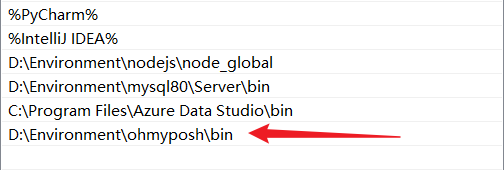

#### 1-windows terminal

>   1.   `CTRL+SHIFT+,`打开配置文件。
>
>   2.   终端专注模式：
>
>        1.   `CTRL+SHIFT+P`打开搜索切换专注模式(退出也是这种方式)。
>
>        2.   cmd输入`wt/f`也可进入专注模式(`win+R`也行)。
>
>        3.   直接在设置中为切换专注模式设置一个快捷键，例如`ALT+Z`即可。<br>
>
>   3. 一些命令:
>      1. 查看版本:`wt --version`。
>      2. 更新:`winget upgrade Microsoft.WindowsTerminal`(当然也可以在[github](https://github.com/microsoft/terminal/releases)下载)

##### a- powershell

1. 安装`oh-my-posh`，实际详细配置参考[官网](https://ohmyposh.dev/docs/installation/windows)。下面命令均使用管理员权限下的`powershell`运行。

1. `winget install JanDeDobbeleer.OhMyPosh -s winget --location xxx ` 安装`oh-my-posh`到指定位置。当然你也可以使用命令`winget upgrade JanDeDobbeleer.OhMyPosh -s winget --location xxx`更新。

1. 配置`oh-my-posh`环境。<br>

1. 安装推荐字体进入[Nerd Fonts](https://www.nerdfonts.com/)随便下载一款字体（但个人推荐`FiraCode Nerd Font`，`Caskaydia Cove Nerd Font`也还行），并在windows上安装。

1. 终端下使用 `CTRL + SHIFT + ,`打开配置文件，配置全局字体。当然也可以直接在 `windows terminal`设置中配置字体。(更推荐`FiraCode Nerd Font`)。<br>

1. 此外建议在`设置->呈现中`开启`windows terminal`文本呈现器。此外在`设置->外观`中开启亚力克材料效果。在各个配置文件的`外观->透明度`中启用亚力克材料。<br><br>

1. powershell运行`get-Poshthemes`查看所有主题。

1. powershell运行`notepad $profile`编辑powershell配置文件。其中`--config`后面接主题配置的文件位置(全部在`oh-my-posh`安装目录的`themes`目录下)。(`night-owl、neko、montys`不错)

   ```json
   oh-my-posh --init --shell pwsh --config "D:\Environment\oh-my-posh\themes\catppuccin_frappe.omp.json" | Invoke-Expression
   ```

   <br>

1. 运行`. $profile`使配置生效。

1. 使用如下命令，下载powershell美化终端的图标。<br>

   ```shell
   Install-Module -Name Terminal-Icons -Repository PSGallery
   ```

1. `notepad $profile`编辑powershell配置文件。

    ```shell
    Import-Module -Name Terminal-Icons
    oh-my-posh init pwsh --config "D:\Environment\oh-my-posh\themes\catppuccin_frappe.omp.json" | Invoke-Expression
    ```

    > 当然这里可以采用之前配置的环境变量配置，可以参考官方文档: `oh-my-posh init pwsh --config "$env:POSH_THEMES_PATH\jandedobbeleer.omp.json" | Invoke-Expression`。

1. 运行`. $profile`使配置生效。

1. 强调一下window终端下的一个配置，开启自动调整无法区分的文本的亮度可能会导致某些主题无法正常显示：<br>

1. 配置专注模式，直接建立快捷键即可(专注模式可以隐藏标签栏)。要想默认开启，可以在设置中配置启动参数的启动模式为专注模式。

   


##### b-cmd美化

1.   下载[clink](https://github.com/chrisant996/clink/releases)工具，安装一个已知位置。

2. 然后，进入clink安装目录，创建`oh-my-posh.lua`文件，添加如下内容：

   ```shell
   load(io.popen('oh-my-posh init cmd'):read("*a"))()
   ```

3.   或者使用指定主题：

     ```shell
     load(io.popen('oh-my-posh init cmd --config D:\\Environment\\oh-my-posh\\themes\\catppuccin_frappe.omp.json'):read("*a"))()
     ```


##### c-配色

1.   自定义配色很繁琐，而且很好费时间，最好的方法是用别人做好的配色。可以在github项目 [iTerm2-Color-Schemes](https://github.com/mbadolato/iTerm2-Color-Schemes))里找，有两百多方案，先在 Screenshots 里挑选好颜色，然后到 `windwosterminal` 目录对应的 json 文件复制样式。<br>

2.   将样式粘贴到windwos terminal配置文件的`schemes`数组中即可。

     ```json
     "schemes": 
     [
         {
             "background": "#F7F7F7",
             "black": "#090300",
             "blue": "#01A0E4",
             "brightBlack": "#5C5855",
             "brightBlue": "#807D7C",
             "brightCyan": "#CDAB53",
             "brightGreen": "#3A3432",
             "brightPurple": "#D6D5D4",
             "brightRed": "#E8BBD0",
             "brightWhite": "#F7F7F7",
             "brightYellow": "#4A4543",
             "cursorColor": "#4A4543",
             "cyan": "#B5E4F4",
             "foreground": "#4A4543",
             "green": "#01A252",
             "name": "3024 Day",  //配色方案名称
             "purple": "#A16A94",
             "red": "#DB2D20",
             "selectionBackground": "#A5A2A2",
             "white": "#A5A2A2",
             "yellow": "#FDED02"
         },
     ]
     ```

3.   之后通过`name`在windwosterminal设置中使用即可。

4.   其他[配色网站](https://windowsterminalthemes.dev/)。


##### d-隐藏启动信息

1.   windwosterminal打开powershell时，会有显示一些版本和加载信息。

2.   我们可以通过设置，对每个配置文件的的命令行配置中添加`-nologo`参数即可。

     ```text
     gsudo.exe %SystemRoot%\System32\cmd.exe -nologo
     ```

     <br>


##### e-gsudo

> 目前，window11已经集成sudo命令，在设置->系统->开发者选项中启用即可(为了舒适使用，配置为内联启动)。

1. 安装scoop：powershell中运行

   ```pow
   irm get.scoop.sh | iex
   
   
   ```

1. 安装 gsudo 只需要一条 Powershell 指令就行(或者也可以使用`scoop install gsudo`):

   ```shell
   PowerShell -Command "Set-ExecutionPolicy RemoteSigned -scope Process; iwr -useb https://raw.githubusercontent.com/gerardog/gsudo/master/installgsudo.ps1 | iex"
   ```

1. 安装过程中会问你是否要使用 `sudo`作为 `gsudo`的别名，我这里选择是。安装完后重启，环境变量生效后就可以使用 `sudo`来快速跳转到管理员级别的 Powershell 了。


##### scoop

1. [Scoop](https://scoop.sh/)是Windows下的一个包管理器，它与Mac下的brew是一个类似的工具。爽！！！

2. 在管理员下运行powershell：

   ```bash
   Set-ExecutionPolicy -ExecutionPolicy RemoteSigned -Scope CurrentUser
   
   irm get.scoop.sh | iex
   ```

3. 当然上述软件的安装位置使用默认，作为一个合格的系统管理员，这是极其难受的，参考官方[Scoop安装程序](https://github.com/ScoopInstaller/Install#readme)得到第二种安装方式:

   ```bash
   irm get.scoop.sh -outfile 'install.ps1'
   
   # 配置一下软件安装目录(不需要管理员下安装可以删除-RunAsAdmin)
   .\install.ps1 -ScoopDir 'D:\Scoop' -ScoopGlobalDir 'D:\Scoop\Global' -RunAsAdmin
   ```

4. 配置代理(不配置会报错：Remove-Item:找不到路径“D:\Scoop\apps\scoop\new”，因为该路径不存在)：`scoop config proxy 127.0.0.1:10809`和删除代理`scoop config rm proxy`。

5. 其他配置参考这篇:[Windows包管理工具Scoop安装及使用](https://www.mobaijun.com/posts/908521329.html)


#### 2-ubuntu子系统(wsl)

##### a-zsh和oh-my-zsh

1.   运行`apt-get install zsh`安装`zsh`。并用`zsh --version`检查是否安装成功 。

2.   运行`sudo vim /etc/passwd`将`zsh`设为当前用户默认(或者使用`chsh -s $(which zsh)`命令将当前用户的shell修改为`zsh`)，注意只需添加当前用户即可。

     ```text
     fish:x:1001:1001::/home/fish:/bin/zsh  
     ```

3.   安装`oh-my-zsh`，三种方式：

     ```shell
     # curl
     sudo apt install curl 
     sh -c "$(curl -fsSL https://raw.githubusercontent.com/ohmyzsh/ohmyzsh/master/tools/install.sh)"
     
     # wget
     sh -c "$(wget -O- https://raw.githubusercontent.com/ohmyzsh/ohmyzsh/master/tools/install.sh)"
     
     # fetch
     sh -c "$(fetch -o - https://raw.githubusercontent.com/ohmyzsh/ohmyzsh/master/tools/install.sh)"
     
     # 前几种不行,就手动安装(这里注意文件夹是oh-my-zsh,没有.)(建议使用国内镜像)
     git clone https://github.com/robbyrussell/oh-my-zsh	# 下载源码
     cd ~/oh-my-zsh/tools	# 执行安装命令
     sh install.sh	# 安装
     ls -a ~   # 查看.oh-my-zsh/目录
     
     uninstall_oh_my_zsh #卸载
     ```

4.   安装目录是`~/.oh-my-zsh/themes/`，可以使用`ls` 命令查看主题(`~`表示当前用户目录)。

5.   `vim ~/.zshrc `编辑文件设置喜欢的主题，其实就是修改` ZSH_THEME`，过程如下：

     ```shell
     ls ~/.oh-my-zsh/themes
     vim ~/.zshrc # 设置 ZSH_THEME="cloud" 
     ```

6.   运行`source ~/.zshrc`重新加载配置文件。

7.   当然你也可以在[官网](https://github.com/ohmyzsh/ohmyzsh/wiki/Themes)查看不同主题。

8.   由于 oh-my-zsh下主题的表现没有oh-my-posh的表现好，我决定装一个powerlevel10k，这款主题也是非常得受欢迎。`git clone --depth=1 https://gitee.com/romkatv/powerlevel10k.git ${ZSH_CUSTOM:-$HOME/.oh-my-zsh/custom}/themes/powerlevel10k`

9.   装完后使用 `vim ~/.zshrc`配置好 `ZSH_THEME="powerlevel10k/powerlevel10k"`

10.   重启终端你就可以看到配置界面(没有看到也可以使用 `p10k configure`指令手动调出)。其他一些命令：

      ```shell
      # 列出主题中包含的所有图标的名称
      get_icon_names
      
      # 禁用P9k/P10k
      prompt_powerlevel9k_teardown
      
      # 启用P9k/P10k
      prompt_powerlevel9k_setup
      
      # 配置p10k
      p10k configure
      ```

11.   `zsh`自带了很多的插件，相关的文件都放在了`~/.oh-my-zsh/plugins`目录中。默认使用Git插件，能提供 Git状态颜色编码和提示符。要想使用其他自带的插件，只需要编辑`~/.zshrc`文件，添加插件名称即可。

12.   安装几个插件：

      ```shell
      # ubuntu安装git
      sudo apt update
      sudo apt install git
      
      # zsh-syntax-highlighting:终端命令语法高亮
      git clone https://github.com/zsh-users/zsh-syntax-highlighting ~/.oh-my-zsh/plugins/zsh-syntax-highlighting
      
      
      # zsh-autosuggestions:自动补全
      git clone https://github.com/zsh-users/zsh-autosuggestions ~/.oh-my-zsh/plugins/zsh-autosuggestions
      
      ```

13.   `vim ~/.zshrc`编辑文件，添加插件：

      ```text
      plugins=(
      ...  # 之前已经声明的插件名称
      zsh-autosuggestions
      zsh-syntax-highlighting
      )
      ```

14.   运行`source ~/.zshrc`重新加载配置文件。

15.   提一下，上述配置只对当前用户生效，文件都在用户目录下。

>   1.   似乎使用`zsh`在配置环境变量方面有些不同，后续待补。
>   2.   可参考`https://zhuanlan.zhihu.com/p/166103184`。


##### b-oh-my-posh

1. 说实话`oh-my-zsh`太丑了。我发现`wsl`也是可以安装`oh-my-posh`的。

2. 先运行`sudo vim /etc/passwd`编辑文件，将用户的shell修改回为`bash`

3. 安装`oh-my-posh`(更新就重新下载，覆原文件夹)。

   ```shell
   sudo wget https://github.com/JanDeDobbeleer/oh-my-posh/releases/latest/download/posh-linux-amd64 -O /usr/local/bin/oh-my-posh
   sudo chmod +x /usr/local/bin/oh-my-posh
   ```

4. 下载主题：

   ```shell
   mkdir ~/.poshthemes
   wget https://github.com/JanDeDobbeleer/oh-my-posh/releases/latest/download/themes.zip -O ~/.poshthemes/themes.zip
   unzip ~/.poshthemes/themes.zip -d ~/.poshthemes
   chmod u+rw ~/.poshthemes/*.omp.*
   rm ~/.poshthemes/themes.zip
   ```

5. 其实参照官方，还存在其他安装方式[other](https://ohmyposh.dev/docs/installation/linux)。

6. 可以在`bash`的配置文件(`~/.bashrc`或 `~/.profile` 或`~/.bash_profile`)中配置一下，在最后一行加入喜欢的主题：

   ```shell
   eval "$(oh-my-posh --init --shell bash --config ~/.poshthemes/catppuccin_macchiato.omp.json)"
   ```

7. 运行`bash`生效(有的是运行`. ~/.profile `)。

8. 其他详细内容参考[官方文档](https://ohmyposh.dev/docs/installation/prompt)。


#### 3-window美化

##### a-鼠标样式

1.   ~~去[github下载](https://github.com/PSGitHubUser1/Windows-11-Cursor-Concept-Pro-v2.x)对应的鼠标样式。~~
2.   下载[致美化](https://zhutix.com/tag/cursors/),[目前正在使用](https://zhutix.com/ico/breeze-snow-hd-cus/)
3.   解压，选择喜欢的鼠标样式，右键`.inf`文件安装鼠标样式。


##### b-mybockfinder

1.   去`steam`安装`mybockfinder`，按照自己的喜好设置即可。
2.   为了保证开机自启，相关设置选择`服务`选项。


##### c-雨滴插件

1.   [官网安装](https://www.rainmeter.net/)。
2.   下载安装主题即可，推荐[致美化](https://zhutix.com/tag/rainmeter/)。


##### Nexus

1. [Winstep Nexus](https://www.winstep.net/nexus.asp)安装下载。
2. 自定义配置


##### d-Wallpaper Engine

1.  去`steam`安装壁纸引擎(Wallpaper Engine,收费)，按照自己的喜好设置壁纸。
2.  设置为开机自启。


#### window 安装fish

1. [MSYS2](https://www.msys2.org/):提供了一个模拟Linux的环境，使得我们可以在Windows上使用Linux的命令，而这些命令都是Windows的`exe`可执行文件形式。

2. [Cygwin](https://cygwin.com/install.html):提供运行于 Windows 平台的类 Unix 环境，Cygwin 提供了一套抽象层 dll，用于将部分 Posix 调用转换成 Windows 的 API 调用，实现相关功能。

3. 当然还有一些其他的像MinGW-w64(配置C语言环境用过，好像)，这里我选择MSYS2(建议下载完后断网安装),原因是我对 pacman 包管理工具比较熟悉。

4. 安装完成后需要更新源:在安装目录的`./etc/pacman.d/`目录中存在多个文件，进行如下修改。文件中默认配置很多镜像，我直接发给gpt让他保留国内的镜像加速源。

   ```bash
   # mirrorlist.ucrt64
   
   Server = https://mirrors.aliyun.com/msys2/mingw/ucrt64/
   Server = https://mirrors.bfsu.edu.cn/msys2/mingw/ucrt64/
   Server = https://mirrors.tuna.tsinghua.edu.cn/msys2/mingw/ucrt64/
   Server = https://mirrors.ustc.edu.cn/msys2/mingw/ucrt64/
   Server = https://mirror.nju.edu.cn/msys2/mingw/ucrt64/
   Server = https://mirror.iscas.ac.cn/msys2/mingw/ucrt64/
   Server = https://mirrors.cloud.tencent.com/msys2/mingw/ucrt64/
   ```

   ```bash
   # mirrorlist.msys(官方提供的加速源不对劲，手动访问修正一下)
   Server = http://mirrors.ustc.edu.cn/msys2/msys/$arch/
   Server = https://mirrors.aliyun.com/msys2/msys/$arch/
   Server = https://mirrors.bfsu.edu.cn/msys2/msys/$arch/
   Server = https://mirrors.tuna.tsinghua.edu.cn/msys2/msys/$arch/
   Server = https://mirrors.ustc.edu.cn/msys2/msys/$arch/
   Server = https://mirror.nju.edu.cn/msys2/msys/$arch/
   Server = https://mirrors.sjtug.sjtu.edu.cn/msys2/msys/$arch/
   Server = https://mirror.iscas.ac.cn/msys2/msys/$arch/
   Server = https://mirrors.cloud.tencent.com/msys2/msys/$arch/
   ```

   ```bash
   # mirrorlist.mingw64
   Server = https://mirrors.aliyun.com/msys2/mingw/x86_64/
   Server = https://mirrors.bfsu.edu.cn/msys2/mingw/x86_64/
   Server = https://mirrors.tuna.tsinghua.edu.cn/msys2/mingw/x86_64/
   Server = https://mirrors.ustc.edu.cn/msys2/mingw/x86_64/
   Server = https://mirror.nju.edu.cn/msys2/mingw/x86_64/
   Server = https://mirrors.sjtug.sjtu.edu.cn/msys2/mingw/x86_64/
   Server = https://mirror.iscas.ac.cn/msys2/mingw/x86_64/
   Server = https://mirrors.cloud.tencent.com/msys2/mingw/x86_64/
   ```

   ```bash
   # mirrorlist.mingw32
   Server = https://mirrors.aliyun.com/msys2/mingw/i686/
   Server = https://mirrors.bfsu.edu.cn/msys2/mingw/i686/
   Server = https://mirrors.tuna.tsinghua.edu.cn/msys2/mingw/i686/
   Server = https://mirrors.ustc.edu.cn/msys2/mingw/i686/
   Server = https://mirror.nju.edu.cn/msys2/mingw/i686/
   Server = https://mirrors.sjtug.sjtu.edu.cn/msys2/mingw/i686/
   Server = https://mirror.iscas.ac.cn/msys2/mingw/i686/
   Server = https://mirrors.cloud.tencent.com/msys2/mingw/i686/
   ```

   ```bash
   # mirrorlist.mingw
   Server = https://mirrors.aliyun.com/msys2/mingw/$repo/
   Server = https://mirrors.bfsu.edu.cn/msys2/mingw/$repo/
   Server = https://mirrors.tuna.tsinghua.edu.cn/msys2/mingw/$repo/
   Server = https://mirrors.ustc.edu.cn/msys2/mingw/$repo/
   Server = https://mirror.nju.edu.cn/msys2/mingw/$repo/
   Server = https://mirrors.sjtug.sjtu.edu.cn/msys2/mingw/$repo/
   Server = https://mirror.iscas.ac.cn/msys2/mingw/$repo/
   Server = https://mirrors.cloud.tencent.com/msys2/mingw/$repo/
   ```

   ```bash
   # mirrorlist.clang64
   Server = https://mirrors.aliyun.com/msys2/mingw/clang64/
   Server = https://mirrors.bfsu.edu.cn/msys2/mingw/clang64/
   Server = https://mirrors.tuna.tsinghua.edu.cn/msys2/mingw/clang64/
   Server = https://mirrors.ustc.edu.cn/msys2/mingw/clang64/
   Server = https://mirror.nju.edu.cn/msys2/mingw/clang64/
   Server = https://mirrors.sjtug.sjtu.edu.cn/msys2/mingw/clang64/
   Server = https://mirror.iscas.ac.cn/msys2/mingw/clang64/
   Server = https://mirrors.cloud.tencent.com/msys2/mingw/clang64/
   ```

   ```bash
   # mirrorlist.clang32
   Server = https://mirrors.aliyun.com/msys2/mingw/clang32/
   Server = https://mirrors.bfsu.edu.cn/msys2/mingw/clang32/
   Server = https://mirrors.tuna.tsinghua.edu.cn/msys2/mingw/clang32/
   Server = https://mirrors.ustc.edu.cn/msys2/mingw/clang32/
   Server = https://mirror.nju.edu.cn/msys2/mingw/clang32/
   Server = https://mirrors.sjtug.sjtu.edu.cn/msys2/mingw/clang32/
   Server = https://mirror.iscas.ac.cn/msys2/mingw/clang32/
   Server = https://mirrors.cloud.tencent.com/msys2/mingw/clang32/
   ```

   > 其实，清华镜像加速默认提供一种快速方式(没试过)，将清华镜像作为首选: 直接运行`sed -i "s#https\?://mirror.msys2.org/#https://mirrors.tuna.tsinghua.edu.cn/msys2/#g" /etc/pacman.d/mirrorlist*`。

5. 执行更新并安装必要软件:

   ```bash
   pacman -Syu
   
   pacman -S tree
   
   pacman -S vim
   
   pacman -S fish
   
   # 若是需要安装gcc
   $ pacman -S mingw-w64-ucrt-x86_64-gcc
   ```

6. MSYS2把 Windows 的各个盘符挂载到了根目录下的同名目录，也就是把C盘挂载到`/c`，把D盘挂载到了`/d`目录。但是似乎无法将 fish 设置自启 shell 。

7. 换 Cygwin ， 安装时安装 fish、python3、vim。可以参考这篇[博客](https://nekomoe.xyz/index.html?type=article&filename=hDa5T3wDjTRj.md)。

8. 比不上 wsl ，不建议折腾。


#### wezterm

1. 参考文档：[官网](https://wezfurlong.org/wezterm/index.html)

2. windows存在多种安装方式:这里直接官网下载exe安装程序直接安装(可以自定义安装目录)

   ```bash
   # winget安装或者更新
   winget install wez.wezterm
   winget upgrade wez.wezterm
   
   # scoop安装
   scoop bucket add extras
   scoop install wezterm
   ```

3. 新建配置文件:主目录中创建一个名为的文件`.wezterm.lua`(window就在用户目录下创建)

   ```lua
   -- 引入 wezterm 模块
   local wezterm = require 'wezterm'
   
   -- 创建配置表
   local config = {}
   
   -- 设置颜色方案
   --config.color_scheme = 'catppuccin-frappe'
   config.color_scheme = 'Tokyo Night'
   
   config.macos_window_background_blur = 30   -- macOS窗口背景模糊程度
   
   -- 窗口标签配置
   config.window_decorations = "RESIZE"        -- 窗口装饰
   config.use_fancy_tab_bar = false            -- 使用自定义标签栏
   -- config.hide_tab_bar_if_only_one_tab = false -- 只有一个标签时隐藏标签栏
   config.enable_tab_bar = true                -- 显示标签栏
   -- config.show_tab_index_in_tab_bar = false     -- 显示标签索引
   config.show_tabs_in_tab_bar = false         -- 显示标签
   config.show_new_tab_button_in_tab_bar = false    -- 显示新建标签按钮
   
   config.tab_bar_at_bottom = true             -- 标签栏位置底部
   
   
   -- wezterm.log_info("hello world! my name is " .. wezterm.hostname())
   
   -- 设置右下角状态栏，显示电量和时间
   wezterm.on('update-right-status', function(window, pane)
     -- "Wed Mar 3 08:14"
     local date = wezterm.strftime '%H:%M '
   
     local bat = ''
     for _, b in ipairs(wezterm.battery_info()) do
       bat = '🔋 ' .. string.format('%.0f%%', b.state_of_charge * 100)
     end
   
     window:set_right_status(wezterm.format {
       { Text = bat .. '   ' .. date },
     })
   end)
   
   -- 设置透明度
   config.window_background_opacity = 0.91
   config.text_background_opacity = 1.0
   
   -- 关闭提示音
   config.audible_bell = "Disabled"
   -- 开启自动重载配置
   config.automatically_reload_config = true
   
   -- 设置背景图片
   -- config.window_background_image = "D:\\background\\image\\dreamfish_106.jpg"
   -- config.window_background_image_hsb = {
   --     brightness = 0.38,   -- 亮度
   --     hue = 1.0,          -- 色调
   --     saturation = 1.0,   -- 饱和度
   --   }
   
   -- 设置字体
   config.font = wezterm.font("FiraCode Nerd Font Mono",{weight="Regular", stretch='Normal', style=Normal})
   config.font_size = 12.0
   
   
   -- 设置初始窗口大小
   config.initial_cols = 110
   config.initial_rows = 32
   
   -- 设置默认工作目录
   config.default_cwd = "D:\\"  
   -- 设置默认shell
   config.default_prog = {"cmd.exe"}
   
   
   config.inactive_pane_hsb = {
       brightness = 0.3,   -- 亮度
       hue = 1.0,          -- 色调
       saturation = 0.8,   -- 饱和度
     }
   
   -- 关闭时不进行确认
   config.window_close_confirmation = 'NeverPrompt'
   
   -------------------- 键盘绑定 --------------------
   local act = wezterm.action
   
   config.leader = { key = 'a', mods = 'CTRL', timeout_milliseconds = 1000 }
   config.keys = {
     { key = 'q',          mods = 'LEADER',         action = act.QuitApplication },
     
     { key = 'h',          mods = 'LEADER',         action = act.SplitHorizontal { domain = 'CurrentPaneDomain' } },
     { key = 'v',          mods = 'LEADER',         action = act.SplitVertical { domain = 'CurrentPaneDomain' } },
     { key = 'q',          mods = 'CTRL',           action = act.CloseCurrentPane { confirm = false } },
     
     { key = 'LeftArrow',  mods = 'SHIFT|CTRL',     action = act.ActivatePaneDirection 'Left' },
     { key = 'RightArrow', mods = 'SHIFT|CTRL',     action = act.ActivatePaneDirection 'Right' },
     { key = 'UpArrow',    mods = 'SHIFT|CTRL',     action = act.ActivatePaneDirection 'Up' },
     { key = 'DownArrow',  mods = 'SHIFT|CTRL',     action = act.ActivatePaneDirection 'Down' },
     
     -- CTRL + T 创建默认的Tab 
     { key = 't', mods = 'CTRL', action = act.SpawnTab 'DefaultDomain' },
     -- CTRL + W 关闭当前Tab
     { key = 'w', mods = 'CTRL', action = act.CloseCurrentTab { confirm = false } },
   
     -- CTRL + SHIFT + w 创建新wsl
     {
       key = 'w',
       mods = 'CTRL|SHIFT',
       action = act.SpawnCommandInNewTab {
         domain = 'DefaultDomain',
         args = {'wsl', '-d', 'ARCH'},
       }
     },
   
     -- CTRL + SHIFT + p 新建powershell
     {
       key = 'p',
       mods = 'CTRL|SHIFT',
       action = act.SpawnCommandInNewTab {
         domain = 'DefaultDomain',
         args = {'powershell.exe'},
       }
     },
   }
   
   for i = 1, 8 do
     -- CTRL + number to activate that tab
     table.insert(config.keys, {
       key = tostring(i),
       mods = 'CTRL',
       action = act.ActivateTab(i - 1),
     })
   end
   
   -------------------- 鼠标绑定 --------------------
   config.mouse_bindings = {
     -- copy the selection
     {
       event = { Up = { streak = 1, button = 'Left' } },
       mods = 'NONE',
       action = act.CompleteSelection 'ClipboardAndPrimarySelection',
     },
   
     -- Open HyperLink
     {
       event = { Up = { streak = 1, button = 'Left' } },
       mods = 'CTRL',
       action = act.OpenLinkAtMouseCursor,
     },
   }
   
   -- 返回配置表
   return config
   ```

4. 快速选择模式允许您快速突出显示与常见复制模式匹配的文本，通过键入一个或两个字符前缀来选择匹配项并将其复制到剪贴板。该`QuickSelect`按键用于进入快速选择模式；`CTRL-SHIFT-SPACE`默认情况下是绑定的。

   


#### win软件备份

1. everything
2. geek
3. cursor、vscode
4. snipaste
5. 7-zip file manager
6. v2rayn
7. potplayer
8. TranslucentTB
9. Flow Launcher
10. 火绒安全软件
11. 雨滴插件(Rainmeter)
12. zen Browser、chrome
13. OBS Studio
14. WinRAR
15. VMware
16. windows终端、WSL(wezterm、kitty、neovim)
17. obsidian
18. typora
19. draw.io
20. picgo
21. navicat
22. idea、pycharm、mysql/docker mysql、docker(wsl-archlinux)、nodejs、xshell、
23. steam、wallpaper
24. ASUS Battery Health Charging
25. idm/ndm


