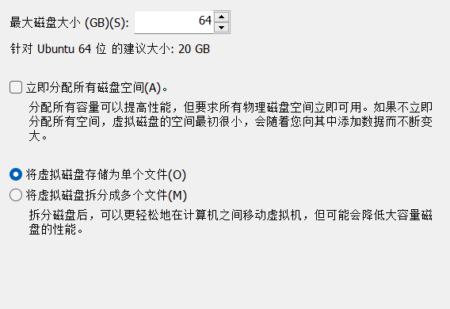
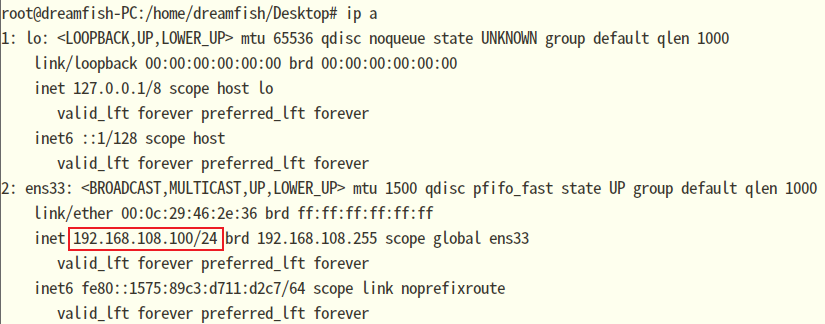

#### 1-安装虚拟机

##### a-前置工作

<br>

>   1.   下载`deepin linux`的`ios`镜像文件，[官方下载地址](https://www.deepin.org/zh/download/)。
>   2.   安装`VMware`，[官网地址](https://www.vmware.com/products/workstation-pro.html)。


##### b-安装虚拟机

<br>

1.   打开`VMware`，选择创建新的虚拟机。<br>

2.   选择自定义安装。<br>

3.   硬件兼容性默认即可，点击下一步。<br>
4.   安装程序光盘映像文件 浏览选择之前下载的`ios`镜像文件，点击下一步。<br>

5.   、客户机操作系统选择 `Linux `，版本选择 其他` Ubuntu 64 位`，点击下一步。<br>

7.   设置虚拟机名称、虚拟机文件位置，点击下一步。<br>
8.   处理器配置，按需求配置，配置完点击 下一步。这里需要说明:一般需要打开任务管理器查看，配置半数最佳(多了实体机卡，少了虚拟机卡)<br><br><br>

9.   设置虚拟内存大小，最佳`4GB`即可。<br>
10.   网络设置，选择网桥模式即可。<br>
11.   磁盘控制器默认即可，点击下一步。<br>
12.   磁盘类型默认即可，点击 下一步。<br>

13.   选择创建新虚拟磁盘 ，点击下一步。<br>
14.   最大磁盘大小，建议分配`128G`以上（`Deepin 20.9`建议磁盘大小`128G`以上，不能小于`64G`），点击下一步。自个玩玩，选单文件即可。<br>
15.   存储位置，默认也可以，点击下一步。这里我改了！<br>
16.   点击完成即可。<br>


##### c-deepin配置

1.   开启虚拟机，选择一个启动项，我这里选择了` Install Deepin 20.9 with kernel 5.18 desktop`。<br>
2.   选择语言j简体中文，勾选协议，点击 下一步。<br>
3.   虚拟机会有虚拟机的提醒，点击下一步即可。选中磁盘，点击 下一步。<br>
4.   点击继续安装即可。<br>

5.   漫长的等待，直至显示安装完成的提示界面，点击 立即重启。<br>
6.   重启后，还要选择语言，选择简体中文，勾选协议，点击下一步。<br>

7.   硬盘布局，选择简体中文即可，点击下一步。<br>

8.   选择时区，默认是北京，点击下一步。<br>
9.     创建账号，按要求输入，点击下一步。<br>
10.   优化系统配置，等待即可，会自动进入到登陆界面。<br><br>


##### d-虚拟机网络配置

<br>

>   1.   `VMware`虚拟机有三种网络模式，分别是`Bridged`(桥接模式)、`NAT`(网络地址转换模式)、`Host-only`(主机模式)。
>   2.   具体参考:https://segmentfault.com/a/1190000024580532
>   3.   下面我们将设置模式改为NAT模式。

1.   在`VMware`中打开虚拟网络编辑器：<br>

2.   点击更改设置：<br>

3.    选择Vmnet8，选择NAT模式，点击NAT设置。<br>

4.    记住子网掩码、网关IP，一会配置要用到。<br>

      

5.    打开虚拟机设置，选择网络连接为NAT模式。

6.   虚拟机终端运行`ifconfig -a`查看网卡名称。<br>

7.   打开虚拟机终端，运行命令`vim /etc/network/interfaces`。修改文件：

```text
#source-directory /etc/network/interfaces.d
# 一定要注释这一行内容。

# 静态ip
auto ens33
# ens33 是网卡名称
iface ens33 inet static
# static表示使用固定ip，dhcp表述使用动态ip
address 192.168.108.100
# 要设置的静态ip地址，没用过就行
netmask 255.255.255.0
# 子网掩码
gateway 192.168.108.2
# 网关
dns-nameserver 192.168.108.2
# dns地址
```

9.   设置完重启电脑后，`/etc/resolv.conf`文件中会自动添加 `nameserver 192.168.108.2`(你也可以手动编辑，最好手动添加一份，不然可能无法解析ip导致没网)。此后重启网络`sudo /etc/init.d/networking restart`。
10.   不起作用就在图形化界面，将原有网络配置删除。<br>
11.   或者通过`ip a`查看，删除多余`ipv4`的ip，命令为`ip addr del 192.168.108.100/24 dev ens33`。其中`ens33`是网卡名称，`192.168.108.100/24`是看到的要删除的ip。<br>


##### e-开启22端口

1.   deepin默认sshd服务是没有开启22端口的，我们需要手动开启。

2.   切换root用户，输入命令`lsof -i:22,`查看22端口是否开放。返回信息，则表示没有开放。

3.   使用vim命令编辑配置文件`vim /etc/ssh/sshd_config`，取消下面两行注释：

     ```text
     #Port 22
     #ListenAddress 0.0.0.0
     ```

4.   保存退出后，使用`/etc/init.d/ssh restart`命令重启ssh。

5.   再次使用命令查看端口是否开发`lsof -i:22,`。


##### f-补充

>   1.   `ip a` 查看ip。
>   2.   `ip address`查看ip地址。
>   3.   提一下，`ip`命令是`ifconfig`加强版。`ifconfig`已经过时了。
>   4.   `systemctl resyart network-manager`重启网络服务。
>   5.   `sudo su`切换管理员权限。


#### 2-软件安装

##### a-安装chrome

<br>

>   1.   更新依赖：`sudo apt-get update`
>
>   2.   使用`wget`来下载 Google Chrome `.deb` 软件包：
>
>        `wget https://dl.google.com/linux/direct/google-chrome-stable_current_amd64.deb`
>
>   3.   以 sudo 用户身份在你的系统上运行下面的命令来安装 Chrome `.deb`软件包：
>
>        `sudo apt install ./google-chrome-stable_current_amd64.deb`
>
>   4.   干掉自带浏览器：
>
>        `sudo apt purge org.deepin.browser`。


