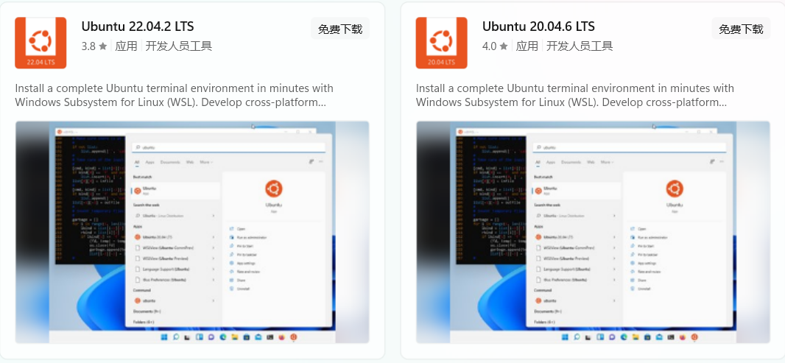

#### 1-安装ubuntu子系统

*   需要说明的是，安装windows子系统，需要开启`Hyper-V`，启动方式参考网上教程。
*   检查是否开启，打开任务管理器，选择任务一栏。<br>
*   但是，开启`Hyper-V`可能导致一些旧版本VMware等虚拟机无法使用，但是最新的虚拟机已经支持`Hyper-V`。

>   开启虚拟化：
>
>   1.  开机按`F12`或者`DEL`进入`Bios`（不同主板可能不一样）。
>   2.  点击`Advanced Mode `(F7)进入高级选项。
>   3.  点击`Advanced`，找到并点击` CPU Configuration`。
>   4.  下拉菜单找到`Intel Virtualization Technology`，在其子菜单下把选项改成`Enabled`。
>   5.  按`F10`保存并推出，CPU虚拟化开启成功。


<br>

##### a-启用WSL

1.   启用WSL，可以通过管理员运行powershell，运行命令`dism.exe /online /enable-feature /featurename:Microsoft-Windows-Subsystem-Linux /all /norestart`。但是不建议采用这种方式。后面似乎无法安装GUI。
2.   打开控制面板，选择程序后，选择启动或者关闭windows功能。<br>
3.   勾选适用于Linux的windows子系统和虚拟机平台，等待完成。之后会提醒重启，按要求重启更新即可。<br>
4.   打开windows设置，搜索开发者选项，勾选开发者模式。为之后的`ubuntu`安装程序做好配置。<br>


<br>

##### b-安装WLS和ubuntu。

1.   当然，你可以直接去微软商店搜索`ubuntu`，下载`ubuntu`的即可。但是我们不采用这种方式。<br>
2.   windows11已经简化了WLS安装方式，可以简单地用管理员权限打开一个命令提示符窗口，运行`wsl.exe --install`。一旦你点击回车键，这个过程将自动启用 `WSL `所需的可选功能，默认安装`Ubuntu`发行版，并在你的设备上安装最新的 `WSL Linux `内核版本。当它完成后，重新启动你设备，发行版会在你再次启动后启动，完成安装。但是我们也不采用这种方式。
3.   我们采取如下方式安装：
4.   管理员权限下，使用`cmd`运行命令`wsl --status`查看默认版本，由于后面安装GUI，所以推荐使用WSL2。可以使用`wsl --set-default-version 2`设置WSL版本。
5.   你需要运行`wsl --update`更新WSL，此外也你可以使用 `wsl --update rollback `来回滚到之前的WSL内核版本。
6.   `wsl --list --online`查看可安装的Linux发行版。这里提一下，不带版本号的`ubuntu`可以更新更高版本，带版本号的不能更新到更高版本。<br>
7.   运行`wsl --install <DistroName>`安装Linux发行版。例如安装`wsl --install Ubuntu-22.04`。此后等待一段时间后，会要求设置账户和密码(这里是普通账户)。<br>
8.   之后就可以在菜单中发现`ubuntu`的踪迹了。
9.   其实还默认创建了一个`root`用户，可以通过`sudo passwd root` 修改`root`用户密码。
10.   安装完成后，windows系统会存在一条命令即`ubuntu `+`版本号去掉小数点`。例如我的是`ubuntu-22.04`，那么对应的命令就是`ubuntu2204`。使用`win+R`输入该命令回车即可打开子系统。
11.   此外如果当前linux子系统是`wsl`默认子系统，可以直接使用`wsl`命令打开。

>   1.   提一嘴，若是需要从本地安装linux发行版，可以运行`wsl --install --no-distribution`，也即安装 WSL 时不安装发行版。


<br>

##### c-WSL常用命令

>   *   `wsl --list --online`：列出可用的 Linux 发行版。
>   *   `wsl --list --verbose`：列出已安装的 Linux 发行版。
>   *   `wsl --set-version <distribution name> <versionNumber>`：WSL 版本设置。
>   *   `wsl --distribution <Distribution Name> --user <User Name>`：通过PowerShell或cmd运行特定的Linux发行版。
>   *   `wsl -d <Distribution Name> -u <User Name>`：通过PowerShell或cmd运行特定的Linux发行版。
>   *   `wsl ~`：将目录更改为主页。
>   *   `wsl --help`：Help 命令。
>   *   `wsl --shutdown`：关闭wsl(会关闭所有子系统)。
>   *   `wsl -t <DistributionName>`  ：停止分发，关闭某个子系统。
>   *   `wsl --unregister <DistributionName>`：注销或卸载 Linux 发行版。
>   *   `wsl`启动默认linx子系统。


<br>

##### d-ubuntu迁移

1.   终止正在运行的WSL，即运行`wsl --shutdown`。

2.   将需要迁移的Linux，进行导出，运行`wsl --export <DistributionName> D:\xx.tar`。其中`<DistributionName>`是子系统名称，`D:/xx.tar`路径自定义，但是需要格式为`.tar`。

3.   导出完成之后，就需要将原有的分发进行卸载。`wsl --unregister <DistributionName>`。其中`<DistributionName>`是子系统名称。

4.   然后将导出的文件放到需要保存的地方，进行导入即可。即运行命令`wsl --import xxx D:\xx\ D:\xx.tar --version 2`。其中`--version 2`用于设置WSL版本。

5.   设置默认登录用户。即运行`Ubuntu2204 config --default-user {你的用户名}`。这里提一些安装非固定版本，直接使用`ubuntu`即可，特定固定版本使用`ubuntu `+`版本号去掉小数点`。

6.   删除`.tar`文件，运行`del D:\xx.tar`。

     ```shell
     wsl --shutdown  # 关闭wsl
     
     wsl --export Ubuntu-22.04 D:\ubuntu.tar  # 导出
     
     wsl --unregister Ubuntu-22.04  # 卸载原本子系统
     
     wsl --import Ubuntu-22.04 D:\Ubuntu\ D:\ubuntu.tar --version 2  # 导入
     
     Ubuntu2204 config --default-user dreamfish  # 设置默认账户
      
     wsl --list --verbose  # 查看已安装子系统
      
     del D:\ubuntu.tar  # 删除压缩包
     ```


<br>

##### e-安装GUI

1.    真实测试，最后带不动，远程连接连不上，电脑闪屏。

2.    目前通常使用两种GUI，即`xfce4`和`Gnone`。`xfce4`虽然确实是小巧方便，但是很丑，影响使用者情绪，弃之。

3.    首先运行`sudo apt update & sudo apt upgrade`更新源并升级安装包。

4.    强调一点，安装Gone先去换个源。

5.    之后便是安装`Gnone`，步骤如下(需要经历漫长等待：

      ```shell
      # 更新源
      sudo apt update
      
      # 运行下面,避免出现acpi-support直接卡死(我也不知道为啥)
      apt-get install -y acpid
      systemctl disable --now acpid.service acpid.socket acpid.path
      
      # 安装Gnone(二选一)
      sudo apt install -y ubuntu-desktop
      
      # 安装xfce(二选一)
      sudo apt install xubuntu-desktop
      ```

6.    安装`Xrdp`，`Xrdp `是一个微软远程桌面协议(RDP)的开源实现，它允许你通过图形界面控制远程系统。步骤如下：

      ```shell
      sudo apt install -y xrdp
      sudo systemctl status xrdp
      
      sudo adduser xrdp ssl-cert
      sudo systemctl restart xrdp
      
      # 查看一下配置文件中的端口（默认:3389）
      vim /etc/xrdp/xrdp.ini
      
      # 配置防火墙
      sudo ufw allow 3389
      ```

7.    但是似乎每次启动都需执行，`sudo systemctl restart xrdp`。可以试试开机自启。

8.    打开Windows自带的远程桌面工具可以远程操作。找不到就`win+s`搜索一下。注意端口号是`xrdp`而不是`ssh`的。<br>

9.   输入账户、密码即可。


<br>

##### f-新增用户

1.   实际上安装子系统是默认创建`root`用户并让我们按指引创建普通用户，我们平时使用并不需要折磨大的权限，就使用普通用户即可。此外我们还可以自己创建一个普通用户用于使用。
2.   `useradd -m xxx -s /bin/bash `创建新用户。
3.   `passwd xxx`创建或者修改用户密码。
4.   cmd或者powershell`ubuntu22.04 config --default-user xxx`设置默认用户。


##### g-终端信息输出

1.   可能有人觉得这除了装X没啥用，但个人觉得要努力把生活变成自己热爱的东西，只是它好看，我喜欢，这就够了。

2.   首先我们需要使用`apt install neofetch -y`安装`neofetch`。

3.   运行`neofetch -L`显示logo，当然你也可以运行`neofetch`显示logo和系统信息。<br>

4.   使用`gedit ~/.config/neofetch/config.conf ` 编辑配置文件，注销`#info "Packages" packages`，每次扫描包太费时间了！下面是一些其他配置:

     ```tex
     #info "Packages" packages
     #info "Theme" theme
     #info "Icons" icons
     
     info "Disk" disk
     
     memory_percent="on"  # 显示内存百分比
     
     info "Local IP" local_ip  # 显示ip信息
     info "Public IP" public_ip
     
     #image_source="auto"
     image_source="ascii文件路径"   # 这里填写自己的ASCII图像txt文件的路径
     ```

5.    好看的ASCII图像(一些查找生成网站：[banner生成](https://www.bootschool.net/ascii)、[文字转](http://patorjk.com/software/taag/))，复制保存到自己的txt文件中即可：？》

      ```tex
                      __                
                     / /\               
                    / / /\              
                   / / /\ \             
                  / / /\ \ \            
       __________/_/_/__\ \ \__________ 
      /\ \_______________\ \ \_________\
      \ \ \_______________\ \ \________/
       \ \ \  / / /        \ \ \  / / / 
        \ \ \/ / /          \ \ \/ / /  
         \ \/ / /            \ \/ / /   
          \/ / /              \/ / /    
          / / /\              / / /\    
         / / /\ \            / / /\ \   
        / / /\ \ \          / / /\ \ \  
       /_/_/__\ \ \________/_/_/__\ \ \ 
      /________\ \ \_______________\ \ \
      \_________\ \ \_______________\_\/
                 \ \ \  / / /           
                  \ \ \/ / /            
                   \ \/ / /  
                    \/ / /              
                     \/_/    
      ```

      ```tex
                          /\
                         //\\
                        ||##||
                       //####\\
                      //##**##\\
                     //###**###\\
                    //###****###\\
                   //####****####\\
                   ||####****####||
                   ||####****####||
                   |______________|
                   |   Dreamfish  |
                    \___ 梦 鱼 ___/
                     |          |
                    /|    /\    |\
                   /_|    || /\ |_\
                     |    || D F|
                     |       \/ |
                     |          |
                    /|    /\    |\
                   / |    ||    | \
                  /  |    ||    |  \
                 /  /\    ||    /\  \
                |__/  \   ||   /  \__|
                  /____\      /____\
                  |    |      |    |
                  |    |______|    |
                  |    | /--\ |    |
                  |____|/----\|____|
                   \||/ //##\\ \||/
                   /##\//####\\/##\
                  //##\\/####\//##\\
                 ||/::\||/##\||/::\||
                 \\\''///:**:\\\''///
                  \\\///\::::/\\\///
                   \\//\\\::///\\//
                    \/\\\\..////\/
                       \\\\////
                        \\\///
                         \\//
                          \/
      ```

      ```tex
                                   ,                                 
                                    \`-,                             
                                    |   `\                           
                                    |     \                          
                                 __/.- - -.\,__                      
                            _.-'`              `'"'--..,__           
                        .-'`                              `'--.,_    
                     .'`   _                         _ ___       `)  
                   .'   .'` `'-.                    (_`  _`)  _.-'   
                 .'    '--.     '.                 .-.`"`@ .-'""-,   
        .------~'     ,.---'      '-._      _.'   /   `'--'"""".-'   
      /`        '   /`  _,..-----.,__ `''''`/    ;__,..--''--'`      
      `'--.,__ '    |-'`             `'---'|     |                   
              `\    \                       \   /                    
               |     |                       '-'                     
                \    |                                               
                 `\  |                                               
                   \/   
      ```

      ```tex
             !         
             !         
             ^         
            / \        
           /___\       
          |=   =|      
          |     |      
          |     |      
          |     |      
          |     |      
          |     |      
          |     |      
          |     |      
          |     |      
          |     |      
         /|##!##|\     
        / |##!##| \    
       /  |##!##|  \   
      |  / ^ | ^ \  |  
      | /  ( | )  \ |  
      |/   ( | )   \|  
          ((   ))      
         ((  :  ))     
         ((  :  ))     
          ((   ))      
           (( ))       
            ( )        
             .         
             .         
             .   
      ```

      ```tex
           _                           __ _     _     
        __| |_ __ ___  __ _ _ __ ___  / _(_)___| |__  
       / _` | '__/ _ \/ _` | '_ ` _ \| |_| / __| '_ \ 
      | (_| | | |  __/ (_| | | | | | |  _| \__ \ | | |
       \__,_|_|  \___|\__,_|_| |_| |_|_| |_|___/_| |_|
      ```

      ```tex
      
      ________                                _____.__       .__     
      \______ \_______   ____ _____    ______/ ____\__| _____|  |__  
       |    |  \_  __ \_/ __ \\__  \  /     \   __\|  |/  ___/  |  \ 
       |    `   \  | \/\  ___/ / __ \|  Y Y  \  |  |  |\___ \|   Y  \
      /_______  /__|    \___  >____  /__|_|  /__|  |__/____  >___|  /
              \/            \/     \/      \/              \/     \/ 
      ```

      ```tex
      |￣￣￣￣￣￣￣￣￣￣￣￣￣￣|  
          I am a philosopher.     
      |＿＿＿＿＿＿＿＿＿＿＿＿＿＿|  
             \ (•◡•) /         
              \     /          
                ---            
               |   |           
      ```

      

6.   关于logo颜色，不太会设置，直接运行`sudo apt install lolcat`安装lolcat，然后运行`neofetch | lolcat`就可以出现渐变色。（termux中使用`pkg install ruby && gem install lolcat`）<br>

7.   个人效果图，打算直接使用`neofetch -L | lolcat`不显示系统信息：

     ```tex  
                     __                
                    / /\               
                   / / /\              
                  / / /\ \             
                 / / /\ \ \            
      __________/_/_/__\ \ \__________ 
     /\ \_______________\ \ \_________\
     \ \ \_______________\ \ \________/
      \ \ \  / / /        \ \ \  / / /   
       \ \ \/ / /          \ \ \/ / /    ________                                _____.__       .__    
        \ \/ / /            \ \/ / /     \______ \_______   ____ _____    ______/ ____\__| _____|  |__  
         \/ / /              \/ / /       |    |  \_  __ \_/ __ \\__  \  /     \   __\|  |/  ___/  |  \ 
         / / /\              / / /\       |    |   \  | \/\  ___/ / __ \|  Y Y  \  |  |  |\___ \|   Y  \
        / / /\ \            / / /\ \     /_______  /__|    \___  >____  /__|_|  /__|  |__/____  >___|  /
       / / /\ \ \          / / /\ \ \            \/            \/     \/      \/              \/     \/ 
      /_/_/__\ \ \________/_/_/__\ \ \ 
     /________\ \ \_______________\ \ \
     \_________\ \ \_______________\_\/
                \ \ \  / / /           
                 \ \ \/ / /            
                  \ \/ / /  
                   \/ / /              
                    \/_/    
     ```

8.   接下来就是使用`vim ~/.bashrc`编辑配置文件，加入`neofetch -L | lolcat`(显示系统信息则去掉-L参数)即可。也可以简化为：

     ```bash
     sudo echo 'neofetch -L | lolcat' >> ~/.bashrc
     ```

9.   运行`source ~/.bashrc`更新配置(`root`用户下所有配置需要在配置一遍)。

>   1.   补充一下：`apt install figlet`，figlet是一款能够将文字转换为放大艺术字的命令。
>        1.   关于`figlet`参数：
>             1.   `-f xx` 指明字体风格：`showfigfonts`命令可以查看字体风格列表。
>             2.   `-c`设置居中显示。
>        2.   演示：`figlet I love python -f standard -c | lolcat`<br>
>   2.   除了使用`neofetch`展示终端信息外，还可以使用`apt install screenfetch`，具体配置略。


---

<br>

#### 2-配置子系统

<br>

##### a-安装net-tools和openssh-server

1.   安装的子系统无法使用`ifconfig`命令(需要安装`net-tools`)，也无法通过SSH登录(需要安装`openssh-server`)。无法使用`ip`相关命令(需要安装`iproute2`)

2.   运行下面命令，安装：

     ```shell
     sudo apt install  net-tools
     sudo apt-get install openssh-server
     sudo apt-get update & apt-get install -y iproute2
     ```

3.   运行`sudo vim /etc/ssh/sshd_config`修改ssh配置文件，此前可以先备个份。

     ```text
     Port 2222	# 默认22端口，和windows端口冲突换成2222,最后大于1024
     AddressFamily any
     ListenAddress 0.0.0.0 # 如果需要指定监听的IP则去除最左侧的井号，并配置对应IP，默认即监听PC所有IP
     PasswordAuthentication yes # yes表示使用帐号密码方式登录
     AllowUsers username # 允许使用的用户名(多个空格分隔)，密码也是这个用户的密码
     PermitRootLogin yes  # 运行root用户登录(若配置AllowUsers,需包含root)
     ```

4.   运行`systemctl restart ssh`重启ssh。通过`systemctl start ssh`启动ssh。

5.   此后通过ssh登录`ssh 用户名@ip -p 端口号`即可(通过`-p`参数指定端口号)。注意这里的`ip`使用 `localhost`，`127.0.0.1`,``192.168.x.x` 等ip均可连接。

6.   此外如果有需要，可以配置防火墙。设置中打开windows安全中心，选择：防火墙和网络保护-->高级设置。<br>

7.   选择入站规则，点击右侧新建。之后选择：端口-->tcp-->特定端口-->填入配置的ssh端口号。

>   1.   如果ssh连接报错` WARNING: REMOTE HOST IDENTIFICATION HAS CHANGED!`。删除`C:\Users\yxlum\.ssh`下的所有`know-hosts`文件中的同样ip的秘钥即可。
>   1.   提一嘴，若想使用`ip`系列命令，可能需要安装`apt-get update & apt-get install -y iproute2`。


<br>

##### ssh端口被拒

1.   运行`sudo apt-get install ufw`安装防火墙。
2.   运行`sudo ufw enable`开启防火墙(一般运行`sudo systemctl enable ufw `设置防火墙自启！)。
3.   运行`sudo ufw allow 2222 `设置防火墙充许2222端口对外开放。
4.   通过`ssh`连接，运行`whoami`查看用户，以检查配置是否成功
5.   此外可使用命令查看端口是否开发`lsof -i:2222,`。


<br>

##### b-安装vim

1.   `ubuntu`系统不自带`vim`，需要手动安装。首先运行一下`sudo apt-get update`更新源。

2.   运行`sudo apt-get install vim-gtk`安装。

3.   刚下载的`vim`界面可能不友好，我们使用`sudo vim /etc/vim/vimrc`修改一下它的配置文件。

     ```text
      if has("syntax")
         syntax on
       endif
       "语法高亮，注释了就要放开
       
       "设置左侧行号
       set nu
       "设置tab键长度为4
       set tabstop=4
       "突出显示当前行
       set cursorline
       "在右下角显示光标位置的状态行
       set ruler
       "自动缩进
       set autoindent
       "覆盖文件时不备份
       set nobackup
     ```

4.   使用`:wq!`强制退出保存即可。

>   用不惯`vim`可以安装一个`sudo apt update && sudo apt install gedit`安装`gedit`，在较高版本中已经可以使用`gedit`文本编辑器。适用于Linux的Windows 子系统(wsl)现在支持在Windows上以完全集成的桌面体验运行Linux GUI应用程序。


<br>

##### c-启用systemd

1.   子系统中之前是无法运行`systemctl XX`命令的。但是如今WSL已经支持`systemd`命令。

2.   首先必须确保你的系统运行的是 0.67.6或更高版本的 WSL。运行`wsl --version`查看版本。可以试验`wsl --update`更新不符合的旧版本。

3.   运行`sudo vim /etc/wsl.conf`修改配置文件，我的好像默认开启了。

     ```text
     [boot]
     systemd=true               
     ```

4.   运行`wsl --shutdown`关闭WSL。


<br>

##### d-汉化

1.   安装中文语言包`sudo apt install language-pack-zh-hans`。

2.   设置locale，运行命令`sudo vi /etc/locale.gen`，在配置文件中找到`zh_CN.UTF-8 UTF-8 `并取消注释。

     ```shell
     # zh_CN.GBK GBK
     zh_CN.UTF-8 UTF-8                                                                     
     # zh_HK BIG5-HKSCS
     ```

3.   运行`sudo locale-gen`编译语言。

4.   运行命令`sudo vim /etc/default/locale`编辑配置文件，设置默认语言为中文。

     ```text
     LANG=zh_CN.UTF-8 
     ```

5.   ok，重启终端就行了。

6.   配置汉化man手册：`sudo apt install manpages-zh `即可。此后`man`命令或者`--help`就可以显示汉语了。

7.   此外，为了GUI的正常显示中文，还需要安装中文桌面环境：

     ```bash
     # 安装中文基础语言包(前面步骤中已安装,跳过)
     sudo apt install language-pack-zh-hans
     
     # 安装中文桌面语言包(gedit可以显示中文)
     sudo apt install language-pack-gnome-zh-hans
     sudo apt install language-pack-kde-zh-hans
     ```

8.   但是在GUI(例如`gedit`)中暂时无法使用中文输入法，需要执行`sudo apt install fonts-noto fcitx fcitx-pinyin`安装拼音输入法。

9.   最后需要运行`vim ~/.profile`,编辑内容如下：

     ```bash
     # 也可放在/etc/default/locale里面(这里省略,之前已经配置过了)
     export LANG=zh_CN.UTF-8
     
     # 也可放在/etc/environment里面
     export INPUT_METHOD=fcitx # wayland输入法
     export XMODIFIERS=@im=fcitx # x11输入法
     export GTK_IM_MODULE=fcitx # gtk输入法
     export QT_IM_MODULE=fcitx # qt输入法
     ```

10.   运行`fcitx& > /dev/null`运行`fcitix`即可。

11.   运行`fcitx-autostart`设置为开机自启。

12.   此外还可以运行`fcitx-config-gtk3`修改输入法快捷键等配置。


<br>

##### e-换源

1.   说实话，下载速度还行，就不换了。他喵的安装`Gnone`出问题了。

2.   首先运行命令确认一下`lsb_release -a`版本问题。其中`Codename`是版本代号。<br>

3.   运行命令`sudo cp /etc/apt/sources.list /etc/apt/sources.list.bak`，修改镜像源前先备份一下原来的镜像源。

4.   我们先运行``cat /etc/apt/sources.list``查看原来的镜像源文本。

     ```text
     # See http://help.ubuntu.com/community/UpgradeNotes for how to upgrade to
     # newer versions of the distribution.
     deb http://archive.ubuntu.com/ubuntu/ jammy main restricted
     # deb-src http://archive.ubuntu.com/ubuntu/ jammy main restricted
     
     ## Major bug fix updates produced after the final release of the
     ## distribution.
     deb http://archive.ubuntu.com/ubuntu/ jammy-updates main restricted
     # deb-src http://archive.ubuntu.com/ubuntu/ jammy-updates main restricted
     
     ## N.B. software from this repository is ENTIRELY UNSUPPORTED by the Ubuntu
     ## team. Also, please note that software in universe WILL NOT receive any
     ## review or updates from the Ubuntu security team.
     deb http://archive.ubuntu.com/ubuntu/ jammy universe
     # deb-src http://archive.ubuntu.com/ubuntu/ jammy universe
     deb http://archive.ubuntu.com/ubuntu/ jammy-updates universe
     # deb-src http://archive.ubuntu.com/ubuntu/ jammy-updates universe
     
     ## N.B. software from this repository is ENTIRELY UNSUPPORTED by the Ubuntu
     ## team, and may not be under a free licence. Please satisfy yourself as to
     ## your rights to use the software. Also, please note that software in
     ## multiverse WILL NOT receive any review or updates from the Ubuntu
     ## security team.
     deb http://archive.ubuntu.com/ubuntu/ jammy multiverse
     # deb-src http://archive.ubuntu.com/ubuntu/ jammy multiverse
     deb http://archive.ubuntu.com/ubuntu/ jammy-updates multiverse
     # deb-src http://archive.ubuntu.com/ubuntu/ jammy-updates multiverse
     
     ## N.B. software from this repository may not have been tested as
     ## extensively as that contained in the main release, although it includes
     ## newer versions of some applications which may provide useful features.
     ## Also, please note that software in backports WILL NOT receive any review
     ## or updates from the Ubuntu security team.
     deb http://archive.ubuntu.com/ubuntu/ jammy-backports main restricted universe multiverse
     # deb-src http://archive.ubuntu.com/ubuntu/ jammy-backports main restricted universe multiverse
     
     deb http://security.ubuntu.com/ubuntu/ jammy-security main restricted
     # deb-src http://security.ubuntu.com/ubuntu/ jammy-security main restricted
     deb http://security.ubuntu.com/ubuntu/ jammy-security universe
     # deb-src http://security.ubuntu.com/ubuntu/ jammy-security universe
     deb http://security.ubuntu.com/ubuntu/ jammy-security multiverse
     # deb-src http://security.ubuntu.com/ubuntu/ jammy-security multiverse
     ```

5.   几个常用的镜像源地址：

     ```text
     阿里云镜像源：http://mirrors.aliyun.com/ubuntu/
     网易镜像源：http://mirrors.163.com/ubuntu/
     清华大学镜像源：https://mirrors.tuna.tsinghua.edu.cn/ubuntu/
     中国科学技术大学镜像源：https://mirrors.ustc.edu.cn/ubuntu/
     ```

6.   我们将上述文件中的有效部分的`http://security.ubuntu.com/ubuntu/`换为镜像源，例如清华镜像`https://mirrors.tuna.tsinghua.edu.cn/ubuntu/`得：

     ```tex
     deb https://mirrors.tuna.tsinghua.edu.cn/ubuntu/ jammy main restricted
     
     deb https://mirrors.tuna.tsinghua.edu.cn/ubuntu/ jammy-updates main restricted
     
     deb https://mirrors.tuna.tsinghua.edu.cn/ubuntu/ jammy universe
     deb https://mirrors.tuna.tsinghua.edu.cn/ubuntu/ jammy-updates universe
     
     deb https://mirrors.tuna.tsinghua.edu.cn/ubuntu/ jammy multiverse
     deb https://mirrors.tuna.tsinghua.edu.cn/ubuntu/ jammy-updates multiverse
     
     deb https://mirrors.tuna.tsinghua.edu.cn/ubuntu/ jammy-backports main restricted universe multiverse
     
     deb https://mirrors.tuna.tsinghua.edu.cn/ubuntu/ jammy-security main restricted
     deb https://mirrors.tuna.tsinghua.edu.cn/ubuntu/ jammy-security universe
     deb https://mirrors.tuna.tsinghua.edu.cn/ubuntu/ jammy-security multiverse
     ```

     ```tex
     # 清华镜像源出了点问题改用中科大
     deb https://mirrors.ustc.edu.cn/ubuntu/ jammy main restricted
     
     deb https://mirrors.ustc.edu.cn/ubuntu/ jammy-updates main restricted
     
     deb https://mirrors.ustc.edu.cn/ubuntu/ jammy universe
     deb https://mirrors.ustc.edu.cn/ubuntu/ jammy-updates universe
     
     deb https://mirrors.ustc.edu.cn/ubuntu/ jammy multiverse
     deb https://mirrors.ustc.edu.cn/ubuntu/ jammy-updates multiverse
     
     deb https://mirrors.ustc.edu.cn/ubuntu/ jammy-backports main restricted universe multiverse
     
     deb https://mirrors.ustc.edu.cn/ubuntu/ jammy-security main restricted
     deb https://mirrors.ustc.edu.cn/ubuntu/ jammy-security universe
     deb https://mirrors.ustc.edu.cn/ubuntu/ jammy-security multiverse
     ```

7.   运行`sudo vim /etc/apt/sources.list`编辑，使用上述内容替换。`:wq!`保存。

8.   运行`sudo apt update`更新源，检查配置是否成功。<br>


<br>

##### f-配置子系统内存(不会待补)

>   1.   `.wslconfig`用于在 WSL上运行的所有已安装分发中全局配置设置。存储在目录中 `%UserProfile%` 。通常是用户配置文件 `C:\Users\<UserName>\.wslconfig`。
>   2.   `wsl.conf`用于为WSL上运行的Linux发行版配置每个发行版的设置。以unix文件的形式存储在 `/etc` 分发的目录中。
>   3.   但是我不会配置。

```shell
# .wslconfig文件
[wsl2]
memory=4GB #要分配给 WSL 2的内存量。如果不运行gui，不用太大，以免内存泄漏。

processors=2 #要分配给 WSL 2 VM 的处理器数量，不运行gui也可以不用太多，如果需要编译什么的话可以设置多个。

swap=4GB #虚拟内存，可以不需要。

swapfile=C:\\temp\\wsl-swap.vhdx #虚拟硬盘的绝对 Windows 路径

pageReporting=false #默认设置true允许Windows回收分配给 WSL 2 虚拟机的未使用的内存。
```

```shell
# wsl.conf文件
#磁盘自动装载设置
[automount]
enabled=true #true 固定驱动器（即 C:/ 或 D:/）自动装载到 DrvFs 中的 /mnt 下。 false 表示驱动器不会自动装载，但你仍可以手动或通过 fstab 装载驱动器。

#网络设置
[network]
generateHosts=true 
#true 将WSL设置为生成 /etc/hosts。 hosts 文件包含主机名对应的 IP 地址的静态映射
generateResolvConf=false 
#true 将WSL设置为生成 /etc/resolv.conf。 resolv.conf 包含能够将给定主机名解析为其 IP 地址的 DNS 列表。建议禁用

#互操作设置，可以跨文件系统工作。
[interop]
enabled = true  #设置此键可确定 WSL 是否支持启动 Windows 进程。比如windows的文件管理器explorer.exe
appendWindowsPath = true #设置此键可确定 WSL 是否会将 Windows 路径元素添加到 $PATH 环境变量。

#用户设置
[user]
default = xxx #设置此键指定在首次启动 WSL 会话时以哪个用户身份运行。

#启动设置
[boot]
command = genie -i #WSL 实例启动时运行的命令字符串。 此命令以根用户身份运行
```


<br>

#####  g-安装vscode

1.   首先在windows的主机上安装vs code(当然你也可以安装`insiders`版本)，并且配置环境变量。

2.     在vscode安装插件`Remote - WSL`。

3.   在wsl的linux子系统安装一些库：

     ```shell
     sudo apt-get update
     sudo apt-get install wget ca-certificates
     ```

4.   之后在wls中使用`code .`命令即可打开vscode。注意发行版vscode使用`code-insiders .`。


##### h-安装aria2

1.   推荐使用`motrix`:[Motrix](https://motrix.app/download)

2.   打开wsl的ubuntu子系统，运行`sudo apt-get update && sudo apt-get install aria2`安装aria2。

3.   创建aria2配置文件如下：

     ```bash
     sudo mkdir /etc/aria2    #新建文件夹 
     sudo touch /etc/aria2/aria2.session    #新建session文件
     sudo chmod 777 /etc/aria2/aria2.session    #设置aria2.session可写 
     sudo gedit /etc/aria2/aria2.conf    #创建配置文件
     ```

4.   运行`sudo vim /etc/aria2/aria2.conf`编辑配置文件：

     ```ini
     ## 全局设置 ## ============================================================
     # 日志
     #log-level=warn
     #log=/PATH/.aria2/aria2.log
     
     # 后台运行
     #daemon=true
     
     # 下载位置, 默认: 当前启动位置
     dir=/mnt/d/download/aria2
     
     # 从会话文件中读取下载任务(***)
     input-file=/etc/aria2/aria2.session
     
     # 在Aria2退出时保存`错误/未完成`的下载任务到会话文件(***)
     save-session=/etc/aria2/aria2.session
     
     # 定时保存会话, 0为退出时才保存, 需1.16.1以上版本, 默认:0
     save-session-interval=30
     
     # 断点续传
     continue=true
     
     # 启用磁盘缓存, 0为禁用缓存, 需1.16以上版本, 默认:16M
     #disk-cache=32M
     
     # 文件预分配方式, 能有效降低磁盘碎片, 默认:prealloc
     # 预分配所需时间: none < falloc ? trunc < prealloc
     # falloc和trunc则需要文件系统和内核支持
     # NTFS建议使用falloc, EXT3/4建议trunc, MAC 下需要注释此项
     file-allocation=none
     # 客户端伪装
     user-agent=Mozilla/5.0 (X11; Linux x86_64) AppleWebKit/537.36 (KHTML, like Gecko) Chrome/90.0.4430.93 Safari/537.36
     
     # 禁用IPv6, 默认:false
     disable-ipv6=true
     
     # 其他
     always-resume=true
     check-integrity=true
     
     ## 下载位置 ## ============================================================
     # 最大同时下载任务数, 运行时可修改, 默认:5
     max-concurrent-downloads=3
     
     # 同一服务器连接数, 添加时可指定, 默认:1
     max-connection-per-server=16
     
     # 最小文件分片大小, 添加时可指定, 取值范围1M -1024M, 默认:20M
     # 假定size=10M, 文件为20MiB 则使用两个来源下载; 文件为15MiB 则使用一个来源下载
     min-split-size=10M
     
     # 单个任务最大线程数, 添加时可指定, 默认:5
     split=64
     
     # 整体下载速度限制, 运行时可修改, 默认:0
     #max-overall-download-limit=0
     
     # 单个任务下载速度限制, 默认:0
     #max-download-limit=0
     
     # 整体上传速度限制, 运行时可修改, 默认:0
     #max-overall-upload-limit=0
     
     # 单个任务上传速度限制, 默认:0
     #max-upload-limit=0
     
     ## RPC设置 ## ============================================================
     # 启用RPC, 默认:false
     enable-rpc=true
     
     # 允许所有来源, 默认:false
     rpc-allow-origin-all=true
     
     # 允许非外部访问, 默认:false
     rpc-listen-all=true
     
     # 事件轮询方式, 取值:[epoll, kqueue, port, poll, select], 不同系统默认值不同
     #event-poll=select
     
     # RPC监听端口, 端口被占用时可以修改, 默认:6800
     rpc-listen-port=6800
     
     # 设置的RPC授权令牌, v1.18.4新增功能, 取代 --rpc-user 和 --rpc-passwd 选项
     #rpc-secret=<TOKEN>
     
     # 是否启用 RPC 服务的 SSL/TLS 加密,
     # 启用加密后 RPC 服务需要使用 https 或者 wss 协议连接
     #rpc-secure=true
     
     # 在 RPC 服务中启用 SSL/TLS 加密时的证书文件,
     # 使用 PEM 格式时，您必须通过 --rpc-private-key 指定私钥
     #rpc-certificate=/path/to/certificate.pem
     
     # 在 RPC 服务中启用 SSL/TLS 加密时的私钥文件
     #rpc-private-key=/path/to/certificate.key
     
     ## BT/PT下载相关 ## ============================================================
     # 当下载的是一个种子(以.torrent结尾)时, 自动开始BT任务, 默认:true
     #follow-torrent=true
     
     # BT监听端口, 当端口被屏蔽时使用, 默认:6881-6999
     listen-port=51413
     
     # 单个种子最大连接数, 默认:55
     #bt-max-peers=55
     
     # 打开DHT功能, PT需要禁用, 默认:true
     enable-dht=false
     
     # 打开IPv6 DHT功能, PT需要禁用
     #enable-dht6=false
     
     # DHT网络监听端口, 默认:6881-6999
     #dht-listen-port=6881-6999
     
     dht-file-path=/opt/var/aria2/dht.dat
     dht-file-path6=/opt/var/aria2/dht6.dat
     
     # 本地节点查找, PT需要禁用, 默认:false
     #bt-enable-lpd=false
     
     # 种子交换, PT需要禁用, 默认:true
     enable-peer-exchange=false
     
     # 每个种子限速, 对少种的PT很有用, 默认:50K
     #bt-request-peer-speed-limit=50K
     
     # 设置 peer id 前缀
     peer-id-prefix=-TR2770-
     
     # 当种子的分享率达到这个数时, 自动停止做种, 0为一直做种, 默认:1.0
     seed-ratio=0
     
     # 强制保存会话, 即使任务已经完成, 默认:false
     # 较新的版本开启后会在任务完成后依然保留.aria2文件
     #force-save=false
     
     # BT校验相关, 默认:true
     #bt-hash-check-seed=true
     
     # 继续之前的BT任务时, 无需再次校验, 默认:false
     bt-seed-unverified=true
     
     # 保存磁力链接元数据为种子文件(.torrent文件), 默认:false
     bt-save-metadata=true
     
     bt-max-open-files=16
     
     # Http/FTP 相关
     connect-timeout=120
     ```

5.   运行`sudo aria2c --conf-path=/etc/aria2/aria2.conf`检查安装是否完成。

6.   封装为服务，运行`sudo vim /etc/systemd/system/aria2c.service`添加自定义服务(如下，需要去注释)：

     ```bash
     [Unit]
     Description=Aria2c Service # 服务的描述
     After=network.target # 服务在网络可用后启动
     
     [Service]
     Type=simple # 服务的启动类型，simple 表示主进程就是执行命令
     User=nobody # 服务以 nobody 用户身份运行
     ExecStart=/usr/bin/aria2c --conf-path=/etc/aria2/aria2.conf --enable-rpc --rpc-listen-all # 服务的执行命令，指定配置文件和 RPC 参数
     [Install]
     WantedBy=multi-user.target # 服务属于多用户目标组，即图形界面模式
     ```

7.   运行并设置自启`sudo systemctl start aria2c && sudo systemctl enable aria2c`。

8.   配置`RPC`,加速下载`bt`磁力种子,配置`vim ./.bashrc`。

     ```bash
     list=`wget -qO- https://cf.trackerslist.com/best.txt|awk NF|sed ":a;N;s/\n/,/g;ta"`
     
     if [ -z "`grep "bt-tracker" /etc/aria2/aria2.conf`" ]; then
         sudo sed -i '$a bt-tracker='${list} /etc/aria2/aria2.conf
         echo add......
     else
         sudo sed -i "s@bt-tracker=.*@bt-tracker=$list@g" /etc/aria2/aria2.conf
         echo update......
     fi
     ```

     

9.   接下来安装web面板如 AriaNg、webui-aria2、yaaw 等，太麻烦。直接在浏览器装了个YAAM插件，开摆。<br>

     

>   `aria2c`一些常用的命令参数：
>
>   *   `-d`或者`--dir`：指定下载文件的目录。
>   *   `-o`或者`--out`：指定下载文件的文件名。
>   *   `-s`或者`--split`：指定每个文件使用的连接数。
>   *   `-x`或者`--max-connection-per-server`：指定每个服务器使用的最大连接数。
>   *   `-j`或者`--max-concurrent-downloads`：指定最大同时下载数。
>   *   `-c`或者`--continue`：继续下载部分下载的文件。
>   *   `--file-allocation`：指定文件分配方法，可以是none, prealloc, trunc或falloc。
>   *   `--input-file`：从指定的文件中读取下载URI列表。
>   *   `--conf-path`：指定配置文件的路径。
>   *   `--no-conf`：不读取配置文件，只使用命令行选项。
>   *   `--enable-rpc`：启用JSON-RPC/XML-RPC服务器。
>   *   `--rpc-listen-port`：指定JSON-RPC/XML-RPC服务器监听的端口号。
>   *   `--rpc-secret`：指定JSON-RPC/XML-RPC服务器的认证密钥。


##### i-安装jdk

1.   安装如下配置安装jdk，然后就能在idea和vscode中使用了。

```bash
# 安装
sudo apt update && sudo apt install openjdk-17-jdk
java -version

# 配置环境
vim ~/.bashrc  # 添加export JAVA_HOME=/usr/lib/jvm/java-17-openjdk-amd64/
source ~/.bashrc # 使配置生效
```


##### j-安装anaconda

1.   安装anaconda安装包，可以去[清华镜像](https://mirrors.tuna.tsinghua.edu.cn/anaconda/archive/?C=M&O=A)下载对应linux版本的安装包。当然也可以使用`weget`命令下载。<br>

2.   前往安装包所在位置，进行安装。

     ```bash
     cd /mnt/d/download/edge/  #进入安装包所在目录
     bash ./Anaconda3-2023.03-1-Linux-x86_64.sh  #安装,不需要修改配置,过程中输入yes即可
     echo 'export PATH="~/anaconda3/bin:$PATH"' >> ~/.bashrc # 配置环境(这里是默认安装位置)
     source ~/.bashrc  # 使环境配置生效
     ```

3.   运行`conda`检查安装是否成功。

4.   配置镜像源，这里还是选择清华镜像源。运行`conda config --set show_channel_urls yes`生成配置文件，并运行`vim ~/.condarc`编辑配置文件。

     ```tex
     channels:
       - defaults
     show_channel_urls: true
     default_channels:
       - https://mirrors.tuna.tsinghua.edu.cn/anaconda/pkgs/main
       - https://mirrors.tuna.tsinghua.edu.cn/anaconda/pkgs/r
       - https://mirrors.tuna.tsinghua.edu.cn/anaconda/pkgs/msys2
     custom_channels:
       conda-forge: https://mirrors.tuna.tsinghua.edu.cn/anaconda/cloud
       msys2: https://mirrors.tuna.tsinghua.edu.cn/anaconda/cloud
       bioconda: https://mirrors.tuna.tsinghua.edu.cn/anaconda/cloud
       menpo: https://mirrors.tuna.tsinghua.edu.cn/anaconda/cloud
       pytorch: https://mirrors.tuna.tsinghua.edu.cn/anaconda/cloud
       pytorch-lts: https://mirrors.tuna.tsinghua.edu.cn/anaconda/cloud
       simpleitk: https://mirrors.tuna.tsinghua.edu.cn/anaconda/cloud
       deepmodeling: https://mirrors.tuna.tsinghua.edu.cn/anaconda/cloud/
     ```

5.   运行 `conda clean -i` 清除索引缓存，保证用的是镜像站提供的索引。

6.   配置`pip`清华镜像源：`pip config set global.index-url https://pypi.tuna.tsinghua.edu.cn/simple`。

7.   好了，这就可以在pycharm中使用了。<br><br><br>


##### k-安装chrome

1.   适用于Linux的Windows 子系统(wsl)现在支持在Windows上以完全集成的桌面体验运行Linux GUI应用程序。

2.   Chrome 不是一个开源的浏览器，并且它不被包含在标准的ubuntu软件源中。我们将会从官方网站下载安装文件，并且通过命令行工具来安装它。

     ```bash
     wget https://dl.google.com/linux/direct/google-chrome-stable_current_amd64.deb 
     sudo apt-get update 
     sudo apt install ./google-chrome-stable_current_amd64.deb
     ```

3.   安装中文字体，不然chrome乱码：

     ```bash
     sudo apt install fonts-wqy-microhei ttf-wqy-zenhei # 安装中文字体 
     fc-list :lang=zh-cn # 查看已安装的中文字体
     ```

4.   运行`google-chrome`打开chrome浏览器。


##### l-git代理

1.   git下载有点慢，可以配置一下代理。

2.   全局代理，所有网址(不推荐)：

     ```bash
     #使用http代理 
     git config --global http.proxy http://127.0.0.1:58591
     git config --global https.proxy https://127.0.0.1:58591
     #使用socks5代理
     git config --global http.proxy socks5://127.0.0.1:51837
     git config --global https.proxy socks5://127.0.0.1:51837
     ```

3.   只对github代理(推荐)：

     ```bash
     #使用socks5代理（推荐）
     git config --global http.https://github.com.proxy socks5://127.0.0.1:51837
     #使用http代理（不推荐）
     git config --global http.https://github.com.proxy http://127.0.0.1:58591
     ```

4.   取消代理：

     ```bash
     # 取消全局代理
     git config --global --unset http.proxy
     git config --global --unset https.proxy
     
     # 取消github代理
     git config --global --unset http.https://github.com.proxy
     git config --global --unset http.http://github.com.proxy
     ```

5.   查看代理：

     ```bash
     git config --global --get http.proxy
     git config --global --get https.proxy
     
     git config --list # 查看git配置
     git config --global --edit #编辑git配置
     ```

6.   开启防火墙和代理端口号(非ubuntu)：

     1.   (非ubuntu)首先防火墙并设置为开机自启：`systemctl start firewalld`和`systemctl enable firewalld`。当然如果没有安装需要先安装`sudo apt install firewalld`。

     2.   (非ubuntu)关于端口号开放命令：`--zone` 指明作用域 、`--add-port=1935/tcp`添加端口，格式为：端口/通讯协议 、`--permanent` 永久生效，没有此参数重启后失效 。

          ```bash
          sudo firewall-cmd --zone=public --add-port=99999/tcp --permanent  # 开放单个端口
          
          sudo firewall-cmd --zone=public --add-port=20000-29999/tcp --permanent  # 开放多个端口
           
          sudo firewall-cmd --zone=public --remove-port=80/tcp --permanent # 关闭端口号
          
          sudo firewall-cmd --zone=public --query-port=80/tcp #查看端口号是否开放
          ```

     3.   注意`ubuntu`不适用上述配置，而是使用`sudo ufw allow 400`即可。

     4.   端口号查看命令：

          ```bash
          lsof -i:8888, # 查看端口号占用情况,无返回值则未启用(有逗号)
          
          netstat -tunlp|grep 8888  # 查看端口号进程情况
          ```

     5.   关于端口号分配：

          1.   公认端口（Well Known Ports）：`0-1023`之间的端口号，也叫Well Known ports。这些端口由 IANA 分配管理。IANA 把这些端口分配给最重要的一些应用程序，让所有的用户都知道，当一种新的应用程序出现后，IANA必须为它指派一个公认端口。
          2.   注册端口（Registered Ports）：`1024-49151`。是公司和其他用户向互联网名称与数字地址分配机构（ICANN）登记的端口号，利用因特网的传输控制协议（TCP）和用户数据报协议（UDP）进行通信的应用软件需要使用这些端口。在大多数情况下，这些应用软件和普通程序一样可以被非特权用户打开。
          3.   客户端使用的端口号：`49152~65535`。这类端口号仅在客户进程运行时才动态选择，因此又叫做短暂端口号。被保留给客户端进程选择暂时使用的。也可以理解为，客户端启动的时候操作系统随机分配一个端口用来和服务器通信，客户端进程关闭下次打开时，又重新分配一个新的端口。

7.   好了，搞笑的部分来了，上述配置在`wsl`没啥用。为了正常连接使用`github`，我们直接让`wsl`连接主机的代理软件：

     1.   windows下的代理软件要设置为允许LAN连接，也就是允许局域网连接。同时记住代理软件的端口号，并在防火墙中允许该clash内核。<br>

     2.   其次要知道通过在Linux分发版中运行以下命令来获取主机的`IP`地址：`cat /etc/resolv.conf`，主机`ip`就在`nameserver`字段中。

     3.   使用`vim ~/.bashrc`编辑配置文件，加入下面内容：

          ```bash
          hostip=$(cat /etc/resolv.conf |grep -oP '(?<=nameserver\ ).*')  # 获取ip地址
          proxyPort=端口号 # 获取端口号
          PROXY_HTTP="http://${hostip}:${proxyPort}" #git代理地址(http协议可改为socks5)
          # PROXY_HTTP="socks5://${hostip}:${proxyPort}"
          
          # 使用http协议(http、socks5协议二选一)
          export https_proxy="http://${hostip}:${proxyPort}"
          export http_proxy="http://${hostip}:${proxyPort}"
          # 端口号相同时可以写为一句:export all_proxy="http://${hostip}:${proxyPort}"
          
          # 使用socket5协议(http、socks5协议二选一)
          export https_proxy="socks5://${hostip}:${proxyPort}"
          export http_proxy="socks5://${hostip}:${proxyPort}"
          # 端口号相同时可以写为一句:export all_proxy="socks5://${hostip}:${proxyPort}"
          
          # git代理
          git config --global http.https://github.com.proxy ${PROXY_HTTP}
          git config --global https.https://github.com.proxy ${PROXY_HTTP}
          ```
     
     4.   但是上述关闭代理比较麻烦，我们可以使用`alias`创建别名命令，`proxy`启动代理、`unproxy`关闭代理、`echoproxy`查看代理。同理使用`vim ~/.bashrc`编辑配置文件，加入下面内容：
     
          ```bash
          hostip=$(cat /etc/resolv.conf |grep -oP '(?<=nameserver\ ).*') # 获取ip地址
          proxyPort=端口号
          PROXY_HTTP="http://${hostip}:${proxyPort}" #git代理地址(http协议可改为socks5)
          # PROXY_HTTP="socks5://${hostip}:${proxyPort}"
          
          alias proxy='
          # 使用http协议(http、socks5协议二选一)
          export https_proxy="http://${hostip}:${proxyPort}"
          export http_proxy="http://${hostip}:${proxyPort}"
          # 端口号相同时可以写为一句:export all_proxy="http://${hostip}:${proxyPort}"
          
          # 使用socket5协议(http、socks5协议二选一)
          export https_proxy="socks5://${hostip}:${proxyPort}"
          export http_proxy="socks5://${hostip}:${proxyPort}"
          # 端口号相同时可以写为一句:export all_proxy="socks5://${hostip}:${proxyPort}"
          
          # git代理
          git config --global http.https://github.com.proxy ${PROXY_HTTP}
          git config --global https.https://github.com.proxy ${PROXY_HTTP}
          '
          
          alias unproxy='
          unset https_proxy
          unset http_proxy
          # unset all_proxy
          git config --global --unset http.https://github.com.proxy
          git config --global --unset http.http://github.com.proxy
          '
          
          alias echoproxy='
          echo $https_proxy
          echo $http_proxy
          # echo all_proxy
          '
          # 开机自启代理
          proxy
          ```

     5.   执行`source ~/.bashrc`使配置生效。
     
     6.   运行`proxy`启动代理，运行`curl www.google.com`测试代理是否配置成功。
     
     7.   关于clash防火墙的问题：打开windows安全中心，选择防火墙和网络保护，点击运行应用通过防火墙，然后再弹出界面找到代理软件，勾选即可。<br><br>


##### j-postgresql

1.   [官网安装教程](https://www.postgresql.org/download/linux/ubuntu/)。

2.   参照官网，针对ubuntu的具体安装步骤：

     ```bash
     # 创建文件存储库配置
     sudo sh -c 'echo "deb http://apt.postgresql.org/pub/repos/apt $(lsb_release -cs)-pgdg main" > /etc/apt/sources.list.d/pgdg.list'
     
     # 导入存储库签名密钥
     wget --quiet -O - https://www.postgresql.org/media/keys/ACCC4CF8.asc | sudo apt-key add -
     
     # 安装
     sudo apt-get update
     sudo apt-get -y install postgresql
     ```

3.   默认创建一个新root用户`postgres`，使用`sudo passwd postgres`设置密码。

4.   切换`sudo -i -u postgres`用户，在`postgres`用户下输入`psql`打开数据库。

5.   接下来配置中如果出现错误：

     1.   `postgres `不在 `sudoers `文件中。此事将被报告。

          1.   切换到`root`用户，运行`chmod 640 /etc/sudoers`给予对该文件的写全权限。
          2.   使用`vim /etc/sudoers`编辑文件：

          ```bash
          # User privilege specification 用户权限规范
          root    ALL=(ALL:ALL) ALL
          postgres  ALL=(ALL:ALL) ALL 
          # Members of the admin group may gain root privileges 用户组
          %admin ALL=(ALL) ALL
          
          # Allow members of group sudo to execute any command 用户组
          %sudo   ALL=(ALL:ALL) ALL
          ```

     2.      用户 "postgres" Password 认证 失败:

          1.   `psql -U postgres`

6.   编辑`vim /etc/postgresql/15/main/pg_hba.conf`(15是版本),允许所有主机使用密码登录：

     ```bash
     host    all             all             0.0.0.0/0               md5
     ```

7.   编辑`vim /etc/postgresql/12/main/postgresql.conf`(15是版本)，查看端口：

     ```bash
     #listen_addresses = 'localhost'     # what IP address(es) to listen on;
     # comma-separated list of addresses;
     # defaults to 'localhost'; use '*' for all
     # (change requires restart)
     listen_addresses = '*'  # 添加
     port = 5432             # (change requires restart)
     max_connections = 100           # (change requires restart)                                  66 #superuser_reserved_connections = 3 # (change requires restart)
     ```

8.   `ubuntu`开放端口`5432`，即`sudo ufw allow 5432`。

9.   连接:`psql -U username -h hostname -p port -d dbname `。

10.   服务启关命令：

      ```bash
      sudo systemctl stop postgresql
      sudo systemctl start postgresql
      sudo systemctl status postgresql
      sudo systemctl restart postgresql
      ```

      


>   补充：
>
>   1.   ~~安装防病毒软件`clamav`:~~
>
>        1.   运行`sudo apt-get install clamav`安装软件。
>
>        1.   更新病毒库`sudo freshclam`。
>
>        
