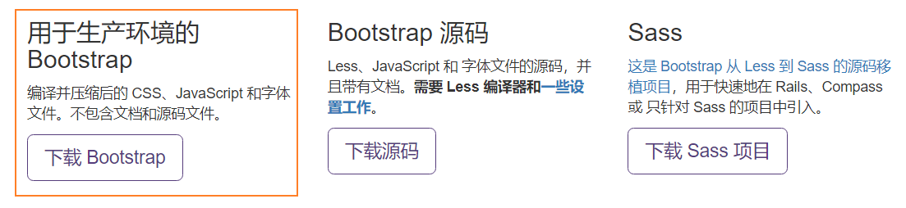
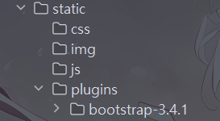
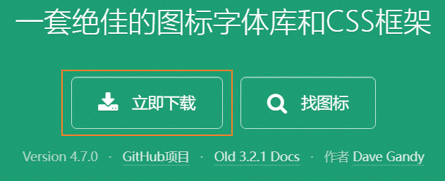
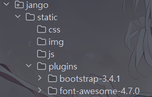

#### 1-flask框架

##### a-简单flask程序

<br>

> * `pip install flask`安装flask框架。

```python
import flask
from flask import Flask, render_template

app = Flask(__name__, template_folder='myTemplate')
# Flask是一个类，app是这个类的实例。
# flask的html文件默认放在项目的templates文件夹，可以通过template_folder设置。
# flask的静态文件默认放在项目的static文件夹，可以通过static_folder设置

@app.route('/info/name', methods=['POST', 'GET'])	# 装饰器
def my_fun():
    return render_template('index.html')	# 渲染页面


@app.route('/register')
def register():
    return flask.redirect('/info/name')	# 重定向


@app.route('/hello')
def send():
    return app.send_static_file('static.txt')	# 转发静态资源


if __name__ == '__main__':
    app.run(debug=True, port=8800, host='127.0.0.1')
    # 只能本本机的客户端访问，那么host设置成127.0.0.1，如果希望所有机器都能访问，需要设置成0.0.0.0
```


---


#### 2-[bootstrap](https://www.bootcss.com/)

<br>

> 1. 通过官网下载`bootstrap`。
>
>    <br>
>
> 2. `bootstrap`一般放在项目静态资源目录的plugins目录下。
>
>    <br>
>
> 3. 在html下引入`bootstrop`，js文件在`<body></body>`中引用，css文件在`<head></head>`中引用。
>
>    ```html
>    <!DOCTYPE html>
>    <html lang="en">
>        <head>
>            <meta charset="UTF-8">  <!--告诉浏览器html的编码-->
>            <title>fish</title>
>    
>            <!--开发版本(易于阅读)-->
>            <link rel="stylesheet" href="/static/plugins/bootstrap-3.4.1/css/bootstrap.css">
>            <!--生产版本(内部压缩,不易阅读)-->
>            <link rel="stylesheet" href="/static/plugins/bootstrap-3.4.1/css/bootstrap.min.css">
>        </head>
>        <body>
>            <!--引入jquery-->
>            <script src="/static/js/jquery-3.6.4.min.js"></script>
>            <script src="/static/plugins/bootstrap-3.4.1/js/bootstrap.min.js"></script>
>        </body>
>    
>    </html>
>    ```
>
> 4. 直接去文档中找想要的功能，直接添加，稍作修改即可。


---


#### 3-[图标-Font Awesome](https://fontawesome.dashgame.com/)

<br>

> 1. 从官网下载压缩包。并下载[jquery]()
>
>    <br>
>
> 2. 放在项目静态资源目录的plugins目录下。
>
>    <br>
>
> 3. 在html文件中引入。
>
>    ```html
>    <!DOCTYPE html>
>    <html lang="en">
>        <head>
>            <meta charset="UTF-8">  <!--告诉浏览器html的编码-->
>            <title>fish</title>
>            <!--开发版本(易于阅读)-->
>            <link rel="stylesheet" href="/static/plugins/font-awesome-4.7.0/css/font-awesome.css">
>            <!--生产版本(内部压缩,不易阅读)-->
>            <link rel="stylesheet" href="/static/plugins/font-awesome-4.7.0/css/font-awesome.min.css">
>        </head>
>        <body>
>        </body>
>    </html>
>    ```
>
> 4. 图标一般是`<i></i>`包裹，直接右键检查，找到对于标签复制使用即可。
> 5. 可以通过`color`设置图标颜色，`font-size`设置图标大小。


---


#### 4-js

<br>

> 见vue部分的js简单入门！

> 1. `<a>`标签的`target`属性规定在何处打开链接文档:
>    1. `"_self"`：将链接的画面内容，显示在目前的视窗中(默认)。
>    2. `"_blank"`：将链接的画面内容，在新的浏览视窗中打开。
>    3. `"_parent"`：将链接的画面内容，当成文件的上一个画面。
>    4. `"_top"`：将框架中链接的画面内容，显示在没有框架的视窗中（即除去了框架)。
