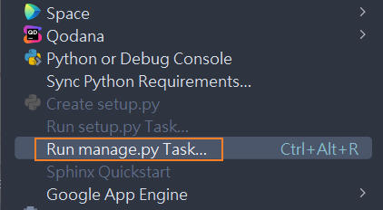
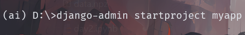
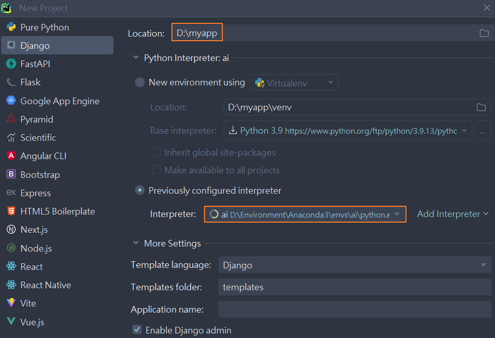
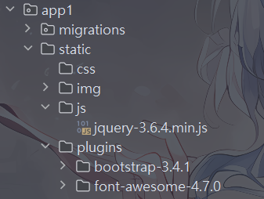

> 1. <kbd>CTRL</kbd>+<kbd>ALT</kbd>+<kbd>L</kbd>: 快速格式化代码。
>
> 2. pycharm运行django命令：在`Tools`菜单中，点击下图所示设置，在跳出的命令行中执行django命令可以省略`python manage.py`命令部分(而且有提示哦)。
>
>    <br>
>
> 1. 

#### 1-简介

<br>

> 1. Django的发音非常有趣，大写字母D不发音，正确的发音是“栈go”。
> 2. Django用于开发的服务器在需要的情况下会对每一次的访问请求重新载入一遍Python代码,你不需要为了让修改的代码生效而频繁的重新启动服务器。然而，一些动作，比如添加新文件，将不会触发自动重新加载，这时你得自己手动重启服务器。

##### a-安装django

<br>

> 1. 通过运行`pip install django`安装模块，除了会安装`django`源码外，还会安装一个`django-admin.exe`文件。
> 2. 当然也可以执行`pip install django=xxx`安装指定版本的模块。
> 3. 关于`django-admin.exe`文件位置：
>    1. 虚拟环境：`虚拟环境目录/Scripts/django-admin.exe`。
>    2. anaconda：`anaconda目录/Scripts/django-admin.exe`。
>    3. python环境：`python目录/Scripts/django-admin.exe`。


##### b-创建项目

<br>

> 终端(cmd)创建项目：
>
> 1. 打开cmd，进入到对应得目录。
>
> 2. 执行命令文件：
>
>    1. django-admin.exe未加入环境变量：`"django-admin.exe位置" startproject 项目名称。`
>
>    2. django-admin.exe加入环境变量(anaconda一般安装时都会加入)：`django-admin startproject 项目名称`。
>
>       <br>
>
> 3. 生成的项目结构(cmd下运行`tree /F`)：

```tex
D:\MYAPP
│  manage.py				(交互脚本，用于项目启动、管理、创建app、数据管理。)
│
└─myapp
        asgi.py				(一个基于ASGI的web服务器进入点，提供异步的网络通信功能，通常不用关心。)
        settings.py			(项目配置文件，经常修改。)
        urls.py				(路由文件，记录URL与函数的对应关系，经常修改。)
        wsgi.py				(一个基于WSGI的web服务器进入点，提供底层的网络通信功能，通常不用关心。)
        __init__.py
```

<br>

> Pycharm创建项目：
>
> 1. 打开pycharm，新建项目选择django：
>
>    ​	<br>
>
> 2. pycharm会默认将templates作为模板，我们可以将其删除。需要删除templates文件夹，并在`setting.py`中删除下面所示内容。

<a id="chuanshi1" ></a>

```python
# setting.py
TEMPLATES = [
    {
        "BACKEND": "django.template.backends.django.DjangoTemplates",
        "DIRS": [BASE_DIR / 'templates']  # 删除列表内元素,即改为[]
        ,
        "APP_DIRS": True,
        "OPTIONS": {
            "context_processors": [
                "django.template.context_processors.debug",
                "django.template.context_processors.request",
                "django.contrib.auth.context_processors.auth",
                "django.contrib.messages.context_processors.messages",
            ],
        },
    },
]
```

<br>

##### c-app

<br>

> 1. 在Django中，每一个应用都是一个Python包，并且遵循着相同的约定。Django自带一个工具，可以帮你生成应用的基础目录结构，这样你就能专心写代码，而不是创建目录了。
> 2. 命令行运行`python manage.py startapp app名称`即可创建app。
> 3. app的文件目录大致如下所示：

```tex
│  admin.py			(不动，django默认提供的admin后台管理)
│  apps.py			(不动，app启动类)
│  models.py		(重要，对数据库进行操作)
│  tests.py			(不动，单元测试)
│  views.py			(重要，视图函数)
│  __init__.py
│
└─migrations
```

<br>

##### d-快速入门

<br>

1. (注册app)将app下的apps中的XxxConfig类在项目的`settings.py`中注册,就是将XxxConfig的全类名添加到`settings.py`的`INSTERALLED_APPS`列表中。

   ```python
   # myapp.app1.apps.py
   # 声明:我的项目是myapp，app是app01
   
   from django.apps import AppConfig
   
   class App1Config(AppConfig):
       default_auto_field = "django.db.models.BigAutoField"
       name = "app1"
   ```

   ```python
   # myapp.myapp.settings.py
   INSTALLED_APPS = [
       "django.contrib.admin",
       "django.contrib.auth",
       "django.contrib.contenttypes",
       "django.contrib.sessions",
       "django.contrib.messages",
       "django.contrib.staticfiles",
       "app1.apps.App1Config"	# 项目下的全类名
   ]
   ```

   

2. (创建视图)在app下的`views.py`中创建创建视图函数，并且在项目的`urls.py`中配置URl匹配规则：

   ```python
   # myapp.app1.views.py
   
   from django.shortcuts import render, HttpResponse
   
   def index(request):
       return HttpResponse('欢迎使用')
   ```

   ```python
   # 
   from django.contrib import admin
   from django.urls import path
   
   from app1 import views	# 导入app1的视图模块
   urlpatterns = [
       path("index/", views.index),	# 添加url匹配规则
   ]
   ```

   > 1. `include()`待补。

3. (启动项目)启动django项目：

   1. 通过命令行启动：`python manage.py runserver`，还可以更复`python manage.py runserver 主机:端口号`
   2. 通过Pycharm直接运行。

---

#### 2-模板和静态文件

<br>

##### a-视图模板

<br>

1. django找视图模板的顺序：
   1. 优先去项目目录的`templates`中寻找，前提是`settings.py`中存在配置，也就是之前删除的配置,<a href="#chuanshi1">在这儿</a>。

      ```python
      # setting.py
      TEMPLATES = [
          {
              "BACKEND": "django.template.backends.django.DjangoTemplates",
              "DIRS": [BASE_DIR / 'templates']  # 之前删的配置
              ,
              "APP_DIRS": True,
              "OPTIONS": {
                  "context_processors": [
                      "django.template.context_processors.debug",
                      "django.template.context_processors.request",
                      "django.contrib.auth.context_processors.auth",
                      "django.contrib.messages.context_processors.messages",
                  ],
              },
          },
      ]
      ```

      

   2. 其次是去各个app下面的`templates`目录中寻找。

2. 跳转视图模板(html)，要在视图函数中返回`render(request,"xxx.html")`，`request`参数为必须。

   ```python
   # app1.views.py
   from django.shortcuts import render
   
   def user_list(request):
       return render(request, "user_list.html")
   ```

   

##### b-静态资源

<br>

1. 静态资源需要放在app的`static`目录下。

   <br>

2. django不推荐直接使用路径访问静态资源,而是通过django的模板语法``(加载不出来就清一下pycharm缓存)。

   ```html
   
   <!DOCTYPE html>
   <html lang="en">
       <head>
           <meta charset="UTF-8">
           <title>用户</title>
   
           <link rel="stylesheet" href="">
       </head>
       <body>
           <script src=""></script>
           <script src=""></script>
       </body>
   </html>
   ```

>1. 项目根目录下的`static`目录默认无效，需要在`settings.py`中配置。
>2. 猜测，应该先在根目录的`static`找，然后再去`app`下的`static`中找。

```python
STATIC_URL = "static/"
STATICFILES_DIRS = [
    os.path.join(BASE_DIR, "static")
]
```


<br>

---


#### 3-模板语法

> 1. 模板语法``中函数不允许使用`()`,无参函数直接去括号调用，有参函数尝试使用过滤器替换。

##### a-python传值html

<br>

> 1. python传值模板的方式一般只有两种：
>    1. 指名道姓：`return render(request,'xx.htm',{key: value, key:value})`
>    2. locals全给:`return render(request,'xx.html',locals())`。

<br>

##### b-变量访问

<br>

> 1. 模板访问一般的变量：
>    1. 直接通过`{{ 变量名 }}`访问。
> 2. 模板访问序列变量元素：只能通过`.index`或者`.key`的形式访问。
>    1. `{{ list.index}}、{{ tuple.index}}、{{ set.index}}`,例如`{{ name_list.0 }}`。
>    2. `{{dict.key}}`(key无需显示声明为字符串)，例如`{{ config_dict.user }}`。
> 3. 循环遍历:

```html
<!--list,tuple,set-->

	<span>{{ item }}</span>

```

```html
<!--dict-->

	<span>{{ k }}</span>



	<span>{{ v }}</span>



	<span>{{ k }}</span>

```

<br>

##### d-判断

<br>

> 1. 直接如下格式使用：

```html

	<span>执行语句</span>

	<span>执行语句</span>

	<span>执行语句</span>

```

<br>

##### e-注释

<br>

> 1. 通过`{# xxx #}`实现注释功能。

<br>

##### f-过滤

<br>

> 1. 使用管道符号`|`来应用过滤器。
> 2. `{{ name|lower }}`会将name变量应用lower过滤器之后再显示它的值。lower在这里的作用是将文本全都变成小写。 
> 3. 过滤器支持链式操作,即一个过滤器的输出作为另一个过滤器的输入`{{ name|...|...| }}`。
> 4. 过滤器可以接受参数，`|`左边的会当做过滤器的第一个参数 右边的会当做过滤器的第二个参数。如`{{ s|truncatewords:30 }}`显示s的前30个词。
> 5. 过滤器参数包含空格的话，必须用引号包裹起来。比如使用逗号和空格去连接一个列表中的元素，如`{{ list|join:', ' }} `。
> 6. `|`左右没有空格。

> 常用过滤函数：
>
> `|length`：返回值的长度，作用于字符串和列表。
>
> `|add `:加法运算。
>
> `|default`:如果一个变量是false或者为空，使用给定的默认值;否则，使用变量的值。
>
> `|default_if_none`:如果一个变量是None，使用给定的默认值;否则，使用变量的值。
>
> `|truncatechars`:截取字符串的长度。三个点也算，所有如果要截取5个长度，应该5+3=8的长度。
>
> `|truncatewords`:截取单词、词语，以空格为标识。
>
> `|filesizeformat`:把文件大小转换成人能看懂的,KB,GB。
>
> `|slice`:切片操作，例如`{{ list|slice:'0:8:2'}}`。
>
> `|date`:日期格式化，例如`{{ d|date:'Y年/m月/d日' }}`。
>
> `|safe`:取消转义操作,例如`{{ res| safe }}`。
>
> `|cut`:移除值中指定字符串,例如`{{ s|cut:' ' }}`。

<br>

##### g-自定义过滤器

<br>

> 自定义过滤函数：
>
> 1. 在app下面新建一个必须叫`templatetags`文件夹(内需含有`__init__.py`文件)。
> 2. 在该文件夹下，新建任意命名`xxx.py`文件。
> 3. 在py文件中自定义过滤器。
> 4. 在html中引入``引入改py文件，即可使用自定义过滤器。
> 5. 自定义过滤器可以在逻辑语句中使用。

```python
# templatetags.tag.py
from django.template import Library

register = Library()    # 实例化注册类


@register.filter(name='get_index')  # 注册,不指定过滤器名则默认函数名
def get_item_for_list(a_list, index):
    return a_list[index]
```

```html
	
{# 导入自定义过滤器文件 #}
<!DOCTYPE html>
<html lang="en">
<head>
    <meta charset="UTF-8">
    <title>用户</title>
</head>
<body>
    {# 使用自定义过滤器 #}
	<span>{{ name_list|get_index:0  }}</span>
</body>
</html>
```

> ps：如果编写只接收一个字符串作为第一个参数的模板过滤器，你可以使用`stringfilter`的装饰器。它会将参数自动转为字符串后传递给函数。

```python
from django import template
from django.template.defaultfilters import stringfilter	# 导入字符串过滤器

register = template.Library()	

@register.filter
@stringfilter
def lower(value):
    return value.lower()
```


##### h-标签

<br>

> 待补
>
> https://www.cnblogs.com/guyouyin123/p/12163248.html#%E6%A8%A1%E6%9D%BF%E8%AF%AD%E6%B3%95


##### I-自定义标签

<br>

https://www.liujiangblog.com/course/django/150


##### J-模板继承

> 1. django模板继承的作用：模板可以用继承的方式来实现复用，减少冗余内容。一般来说，一个网站里一般存在多个网页的头部和尾部内容都是一致的，我们就可以通过模板继承来实现复用。父模板用于放置可重复利用的内容，子模板继承父模板的内容，并放置自己的内容。
> 2. 父模板中定义子类重复内容，并通过`{{ block block_name}} {} `块定义自类需要补充部分(块内标签对子模块无影响)。
> 3. 子模板通过`{{ extends '父模块.html'}}`继承父模块，并通过`{{ block block_name}} {}`重写父模块内容。

```html
{# base.html 父模块 #}

<!DOCTYPE html>
<html lang="en">
    <head>
        <meta charset="UTF-8">
        
        <title>Title</title>
        
        <link rel="stylesheet" href="">
        <style>
            .navbar {
                border-radius: 0;
            }
        </style>
    </head>
    <body>
        <script src=""></script>
        <script src=""></script>
        
        
    </body>
</html>
```

```html
{# list.html 子模块 #}




<title> User </title>


<div>
    something!
</div>

```


---


#### 4-请求与响应

<br>

##### a-请求

<br>

> request常用API:
> 1. `request.method`:获取请求方式，得到对应字符串。
> 2. `request.GET`:获取get请求的参数，返回参数字典。(可以通过`request.GET.getlist()`获取所有同名参数的list)
> 3. `requst.POST`:获取post请求的参数，返回参数字典。
> 4. `request.path`:请求路径。
> 5. `request.user`:请求的用户对象
> 6. 修改`request.GET`或者`request.POST`(django.http.request.QueryDict类型)，djiango不允许修改，但是我们可以通过设置`_mutable=True`使其可修改(后面号可以改回来)。
> 7. 可以使用`urlencode()`将`request.GET`参数编码为url参数形式。

> PS：django的表单POST请求默认需要验证，可以使用``生成隐藏字段,用于判断是否为正常网页发送的请求。

> url路径获取：
>
> 1. `request.path_info`: 获取相对根目录的URL请求路径，不带参数、协议、域名和端口
> 2. `request.get_host()`:获取请求地址。
> 3. `request.path` :获取请求的path，不带参数、协议、域名和端口，大多数时候与`path_info`一致，不推荐使用。
> 4. `request.get_full_path()`: 获取完整参数路径。
> 5. `build_absolute_uri()`:获取绝对url路径。

```python
request.path_info
request.path
request.get_full_path()
request.get_host()
request.build_absolute_uri()

"""
/user/list/
/user/list/
/user/list/?page_num=2
127.0.0.1:8000
http://127.0.0.1:8000/user/list/?page_num=2
"""
```


##### b-响应

<br>

> 1. 重定向：`return redirect('/xx/xx')`。
> 2. 响应内容：`return HttpResponse('xx')`。
> 3. 视图渲染:`return render(request,'xx.html',{})`。

> 关于重定向：
>
> 1. `HttpResponseRedirect`:
>    1. `HttpResponseRedirect`只能使用硬编码连接，不能使用url名称，也无法传参(可以拼接)。
>    2. 若需要传参，需要配合`reverse()`使用。
> 2. `redirect`:支持使用url名称传参，也支持使用参数(关键字，位置传参均可)。实际上内部还是用的`reverse`。
> 3. `reverse`:对已命名的URL进行反向解析，还传递相应的参数(关键字，位置传参均可)；该方法位于`django.urls`模块。

```python
path('/user/<int:id>/<int:page_num>/list', views.user_show, name='user_list')
```

```python
return HttpResponseRedirect(reverse('user_list'), 3, 7)
return HttpResponseRedirect(f'/user/{3}/{7}/list')
return redirect('user_list', id=3, page_num=7)
return redirect('/user/<int:id>/<int:page_num>/list', id=3, page_num=7)
```


5-关于queryset和querydict
