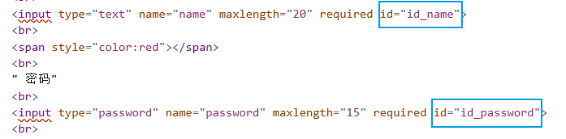

#### 1-modeform添加

> 1. `Model` :具有强大的数据库操作，弱小的数据验证。
> 2. `Form`:具有强大的数据验证，但是无法与数据库交互(无`save()`方法)；主要用于表单生成和表单数据验证。
> 3. `ModelForm`:二者结合，强大的数据验证，适中的数据库操作；在ModelForm是能够封装一个model对象。

##### a-form组件简介

<br>

1. 在传统的html中，我们要实现一个表单，一般格式如下：

   ```html
   <form action="#" method="post">
       <label> label_name </label>
       <input id="" type="" name="" value="">
       <input type="submit" value="提交">
   </form>
   ```

2. django中，我们可以使用`form`类简单实现上述表单。首先需要在app下新建`forms.py`(其实名称随意，太多可以弄个文件夹存储)。

3. 在`forms.py`新建类继承自`forms.Form`。

   ```python
   from django import forms
   
   class UserForm(forms.Form):
       name = forms.CharField(max_length=20, label='姓名', widget=forms.TextInput)
       age = forms.IntegerField(label='年龄', widget=forms.TextInput)
       
   """
   label:字段名称
   widget:输入框类型以及输入框样式属性
   error_message:错误信息
   required:是否允许为必须(不为空),默认为True
   help_texts:帮助提示信息
   """
   ```

4. 在`views.py`配置相关视图函数：

   ```python
   from app1 import forms
   from django.shortcuts import render
   
   def user_model_add(request):
       if request.method == "GET":
           form = forms.UserForm()  # 实例化UserForm
           return render(request,'user_model_add.html', {'form': form})
       else:
           pass
   ```

   

5. 在相关`html`文件遍历自定义`Userform`实例，生成表单输入框。

   ```html
   
   
       <title> modelAdd</title>
   
   
       <form action="" method="post">
           
           
               {{  f.label  }}		{# 输入框名称 #}
               {{ f }}				{# 输入框 #}
           
       </form>
   
   ```

   

##### b-modelform

<br>

1. 由于使用`form`需要对`model`中字段再定义一遍比较麻烦，我们可以使用更加方便的`modelform`；首先需要在app下新建`forms.py`(其实名称随意，太多可以弄个文件夹存储)。

2. 在`forms.py`创建自己的modelform继承`django.forms.ModelForm`。

   ```python
   class UserModelForm(ModelForm):
       other = forms.CharField(max_length=10)
   
       class Meta:
           model = UserInfo
           fields = ['name', 'password', 'sex', 'create_time', 'account', 'other', 'depart']
           labels = {'name': '姓名',
                     'password': '密码',
                     'sex': '性别',
                     'create_time': '入职时间',
                     'account': '账户',
                     'other': '其他',
                     'depart': '部门'
                    }
   ```

   1. `model`：关联的自定义model子类。
   2. `fields:list[str]`：设置需要包含的字段，`__all__`表示包含对应自定义model子类的全部字段。
   3. `exclude:list[str]`：设置需要排除的字段。
   4. `labels:dict`：表单字段名称，不提供默认使用model的`verbose_name`(没有，则使用字段属性名称)。
   5. `widgets:dict`：自定义插件，其实就是表单输入框类型以及其标签属性(`attrs`参数)，key为字段属性名。
   6. `error_messages:dict`：自定义错误信息。
   7. `help_texts:dict`：自定义帮助提示信息。
   8. 上述参数去掉复数形式，即可在`forms.xxxField`中使用，用法类似。

3. 在`views.py`中实例化，并作为页面渲染参数。

   ```python
   from django.shortcuts import render
   from app1 import forms
   def user_model_add(request):
       if request.method == "GET":
           form = forms.UserModelForm()  # 实例化UserForm
           return render(request, 'user_model_add.html', {'form': form})
   ```

4.   在`form`表单中直接遍历循环即可。

   ```html
   
   
       <title> modelAdd</title>
   
   
       <div class="container">
           <div class="col-xs-3"></div>
           <div class="col-xs-6">
               <form action="" method="post">
                   
                   
                       {{ field.label }}<br/>
                       {{ field }}<br/>
                   
                   <button type="submit">提交</button>
               </form>
           </div>
       </div>
   
   
   ```

5. 其实上述代码还存在一个问题，`depart`是外键，会自动查询输出(查询到的是一整条数据，或者说是`departInfo`对象)，我们需要重写他的`__str__`函数，使其输出显示为部门名称而非整个对象。

   ```python
   from django.db import models
   
   class DepartInfo(models.Model):
       name = models.CharField(max_length=15)
   
       def __str__(self):
           return self.name
   
   class UserInfo(models.Model):
       name = models.CharField(max_length=20)
       password = models.CharField(max_length=15)
       age = models.IntegerField(null=True)
       sex_type = (
           (1, '男'),
           (2, '女'),
       )
       sex = models.SmallIntegerField(default=1, choices=sex_type)
       account = models.DecimalField(max_digits=10, decimal_places=2, default=0)
       create_time = models.DateTimeField()
       # create_time = models.DateTimeField(auto_now_add=True)
       depart = models.ForeignKey(to=DepartInfo, to_field='id', 
                                  on_delete=models.SET_NULL, blank=True, null=True)
   ```

6. 此外顺嘴提一句，`DateTimeField`设置`auto_now`或者`auto_new_add`后，将不可编辑，否则报错。


##### c-表单样式

1. modelform表单设置样式存在两种方式，一种是直接赋值属性，另一种是重写`__init__`方法。

2. 直接赋值属性，一般通过`widgets`属性实现，在设置输入框类型时，提供`attrs`参数，设置其标签属性。

   ```python
   from django import forms
   from django.forms import ModelForm
   from app1.models import UserInfo
   
   class UserModelForm(ModelForm):
       other = forms.CharField(max_length=10)
       class Meta:
           model = UserInfo
           fields = ['name', 'password', 'sex', 'create_time', 'account', 'other', 'depart']
           labels = {'name': '姓名',
                     'password': '密码',
                     'sex': '性别',
                     'create_time': '入职时间',
                     'account': '账户',
                     'other': '其他',
                     'depart': '部门'
                    }
           widgets = {
               'name': forms.TextInput(
                   attrs={'type': "text", 'class': "form-control",
                          'id': "exampleInputEmail1"}),
               'password': forms.PasswordInput(
                   attrs={'type': "text", 'class': "form-control",
                          'id': "exampleInputEmail1"}),
               'sex': forms.RadioSelect(),
               'create_time': forms.DateInput(
                   attrs={'type': "text", 'class': "form-control",
                          'id': "exampleInputEmail1"}),
               'account': forms.NumberInput(
                   attrs={'type': "text", 'class': "form-control",
                          'id': "exampleInputEmail1"}),
               'other': forms.TextInput(
                   attrs={'type': "text", 'class': "form-control",
                          'id': "exampleInputEmail1"}),
               'depart': forms.Select(
                   attrs={'type': "text", 'class': "form-control",
                          'id': "exampleInputEmail1"})
           }
   ```

3. 也可以直接重写自定义modelform子类的`__init__`方法实现：

   ```python
   from django import forms
   from django.forms import ModelForm
   from app1.models import UserInfo
   
   class UserModelForm(ModelForm):
       other = forms.CharField(max_length=10)
   
       class Meta:
           model = UserInfo
           fields = ['name', 'password', 'sex', 'create_time', 'account', 'other', 'depart']
           labels = {'name': '姓名',
                     'password': '密码',
                     'sex': '性别',
                     'create_time': '入职时间',
                     'account': '账户',
                     'other': '其他',
                     'depart': '部门'
                    }
   
       def __init__(self, *args, **kwargs):
           super().__init__(*args, **kwargs)
   
           for name, field in self.fields.items():
               if field.widget.attrs:	# 存在标签属性，则添加而非覆盖
               	field.widget.attrs['type'] = 'text'
                   field.widget.attrs['class'] = 'form-control'
   				 field.widget.attrs['id'] = 'exampleInputEmail1'    
           	else:
               	field.widget.attrs = {'type': "text", 'class': "form-control",
                                     'id': "exampleInputEmail1"}
   ```


##### d-ModelForm封装父类

1. app建立一个`utils`文件夹，用于存放自定义封装组件。

2. 由于每次都需要对form或者model指定bootstrap样式，我们可以封装自己的`BootstrapModelForm`继承`forms.ModelForm`，后续我们的自定义modelform直接继承`BootstrapModelForm`即可。

   ```python
   from django.forms import ModelForm
   
   class BootstrapModelForm(ModelForm):
       def __init__(self, *args, **kwargs):
           super().__init__(*args, **kwargs)
   
           for name, field in self.fields.items():
               if field.widget.attrs:	# 保留存在标签属性，添加而非覆盖
                   field.widget.attrs['type'] = 'text'
                   field.widget.attrs['class'] = 'form-control'
                   field.widget.attrs['id'] = 'exampleInputEmail1'    
               else:
                   field.widget.attrs = {'type': "text", 'class': "form-control",
                                         'id': "exampleInputEmail1"}
   ```

   ```python
   form app1.utils.bootstrap import BootstrapModelForm
   
   class UserModelForm(BootstrapModelForm):
       other = forms.CharField(max_length=10)
   
       class Meta:
           model = UserInfo
           fields = ['name', 'password', 'sex', 'create_time', 'account', 'other', 'depart']
           labels = {'name': '姓名',
                     'password': '密码',
                     'sex': '性别',
                     'create_time': '入职时间',
                     'account': '账户',
                     'other': '其他',
                     'depart': '部门'
                    }
   ```

   

3. 但其实form或者modelform会自动为表单输入框提供标签id属性，且一般命名为`id_字段属性`。但是当我们自定义id，原本生成的id会由于字典更新而被覆盖。

   


##### e-检查和错误显示

1. 在`views.py`中实例化时，可以传递`data=request.POST`参数，然后调用`form.is_vialid`对表单参数进行校验(默认只会校验是否为空)。

   1. 若参数无碍，会将表单参数存储在`form.cleaned_data`中，可以通过`form.save()`保存到数据库。
   2. 若参数不合法，会将对应错误存储在`form.errors`中。

   ```python
   def user_model_add(request):
       if request.method == "GET":
           form = forms.UserModelForm()  # 实例化UserForm
           return render(request, 'user_model_add.html', {'form': form})
       else:
           form = forms.UserModelForm(data=request.POST)
           if form.is_valid():
               form.save()
               # print(form.cleaned_data)
           else:
               # print(form.errors)
               pass 
   ```

2. 测试django的表单参数检查，可以先关闭浏览器检查，在`<form novalidate></form>`使用`novalidate`关闭浏览器检查校验(不准)。

   ```html
   
   
   <title> modelAdd</title>
   
   
   <div class="container">
       <div class="col-xs-3"></div>
       <div class="col-xs-6">
           <form action="" method="post" novalidate>
               
               
               {{ field.label }}<br/>
               {{ field }}<br/>
               <span style="color:red">{{ field.errors.0 }}</span><br>
               {# 获得错误列表,只展现第一步 #}
               
               <button type="submit">提交</button>
           </form>
       </div>
   </div>
   
   ```

   

3. 在html模板中可以遍历显示错误信息(如上)。但是django默认错误提示为英文，可以修改`settings.py`配置，显示错误提示为中文。

   ```python
   # LANGUAGE_CODE = "en-us"
   LANGUAGE_CODE = "zh-hans"
   ```


#### 2-modelform编辑

##### a-前置

1. 创建modelform子类(可以与新增使用同一个，如果有些字段无需修改，也可以重写一个)：

1. 此外，可以在`forms.xxField`提供`disable=True`设置表单值不可编辑修改。

   ```python
   class UserModelForm(ModelForm):
       other = forms.CharField(max_length=10)
   
       class Meta:
           model = UserInfo
           fields = ['name', 'password', 'sex', 'create_time', 'account', 'other', 'depart']
           labels = {'name': '姓名',
                     'password': '密码',
                     'sex': '性别',
                     'create_time': '入职时间',
                     'account': '账户',
                     'other': '其他',
                     'depart': '部门'
                     }
           widgets = {
               'password': forms.PasswordInput()
           }
   
       def __init__(self, *args, **kwargs):
           super().__init__(*args, **kwargs)
   
           for name, field in self.fields.items():
               field.widget.attrs = {'type': "text", 'class': "form-control",
                                     'id': "exampleInputEmail1"}
               print(name, field.widget)
   ```


##### 2-重点

1. 通过查询获取当前修改对象的相关数据。

2. 将获取数据作为参数`data`，用于页面渲染。

3. 注意修改时，也需要通过`instance`参数指明要修改的实例，并将`data`参数数据更新到其中。

4.  对于一些无需修改的字段或者手动批量修改字段，还可以通过`form.instance.名称` 直接修改，然后再保存。

   ```python
   def user_model_edit(request, id):
       user = UserInfo.objects.filter(id=id).first()
       if request.method == "GET":
           form = forms.UserModelForm(instance=user)
           return render(request, "user_model_edit.html", {'form': form})
       else:
           form = forms.UserModelForm(data=request.POST, instance=user)
           form.instance.name = 'xxx'
           if form.is_valid():
               form.save()
               return redirect('/user/list')
           else:
               return render(request, 'user_model_edit.html', {'form': form})
   ```


#### 3-字段校验

##### 1-forms.XXfield校验

1. `forms.xxField`中含有参数`required`规定是否必须。

2. `forms.xxField`中含有参数`disable=True`设置表单字段不可编辑修改(一般不用，而是直接不包含相关字段)。

3. `forms.xxFireld`中含有参数`error_messages`设置不同校验的错误提示信息。

4. `form.xxField`还可以使用正则匹配，使用`validators`参数提供正则匹配列表，元素类型为`RegexValidator()`。

5. 关于`forms.CharField`，可以使用`max_length`、`min_length`设置长度校验。

   ```python
   from django import forms
   from django.core.validators import RegexValidator
   
   class OtherModelForm(ModelForm):
       name_error = {
           'max_length': '长度不超过20',
           'min_length': '长度不小于10',
           'required': '参数为必须,不能为空'
       }
       name = forms.CharField(min_length=10, max_length=20, 
                              required=True, error_messages=name_error)
       phone = forms.CharField(
           validators=[RegexValidator(r'^199[0-9]+$', '数字必须以199开头')]
       )
   ```

   


##### 2-方法校验

1. 表单系统会自动查找以`clean_`开头，以字段名结尾的方法(`clean_字段名`)，它会在验证字段合法性的过程中被调用。

2. 注意该校验方法若不通过则应抛出`django.core.exceptions.ValidationError`类型错误，此后可以在html中遍历显示。若校验通过，则需要返回当前校验字段值。

3. 此外由于编辑(以编辑为例)在实例化modelform子类时，提供了`instance`参数，故而可以通过`self.instance.pk`获取主键字段数据即id。

   ```python
   from django import forms
   from django.core.exceptions import ValidationError
   from django.core.validators import RegexValidator
   from app1.models import UserInfo
   
   class OtherModelForm(ModelForm):
       name_error = {
           'max_length': '长度不超过20',
           'min_length': '长度不小于10',
           'required': '参数为必须,不能为空'
       }
       name = forms.CharField(min_length=10, max_length=20, 
                              required=True, error_messages=name_error)
       phone = forms.CharField(
           validators=[RegexValidator(r'^199[0-9]+$', '数字必须以199开头')]
       )
   
       def clean_phone(self):
           pho = self.cleaned_data['phone']
   
           if len(pho) != 11:
               raise ValidationError('号码长度错误')  # 报错,django会自动收集
               
           if UserInfo.objects.exclude(id=self.instance.pk).filter(phone=pho).exists():
               # 判断是否存在(排除自身)
               raise ValidationError('号码已存在')
               
           return pho   # 校验后需返回当前字段值
   ```

   

#### 4-搜索

1. 其实就是获取url参数，然后执行查询就可以(一般使用`filter(xx_contains=x)`查询)。

   ```python
   def user_show(request):
       data_dict = {}
       value = request.GET.get('name', '')
       if value:
           data_dict['name__contains'] = value	 # 类似于模糊匹配
           
       users = models.UserInfo.objects.filter(**data_dict)  # 获取数据
       
       return render(request, 'user_list.html',{'users': users, 'search': value})
   	# 返回搜索数据以及value用于页面展示
   ```

   

#### 5-分页

##### a-手动实现

1. 获取url的页数参数，并对其进行一系列的有效判断。

2. 将获取的数据截取分页。

3. 构建页面分页跳转标签，通过`mark_safe`标记为安全，并在html中使用。

4. `mark_safe`：django从view向template传递HTML字符串的时候，django默认不渲染此HTML，原因是为了防止这段字符串里面有恶意攻击的代码。可以通过`mark_safe`标记字符串安全，交给django渲染。

5. 此外还补充`format_html`：本质还是调用`mark_safe`，不同在于可以使用`{}`占位符传参。

   ```python
   from django.utils.html import format_html
   
   html_s = format_html('<li><a href="?{}">{}</a></li>', self.url_params.urlencode(), i)
   ```

   

6. 此外，当前逻辑仍存在部分不足，会在封装部分(最终版本)解决。

   ```python
   from django.utils.safestring import mark_safe
   from django.shortcuts import render
   
   def user_show(request):
   
       data_dict = {}
       value = request.GET.get('name', '')
       if value:
           data_dict['name__contains'] = value
       users = UserInfo.objects.filter(**data_dict)
   
       data_size = len(users)  # 获取数据总条数
       page_size = 6  # 每页数据条数
       page_total = math.ceil(data_size / page_size)  # 总页数
   
       page_num = int(request.GET.get('page_num', '1'))
       if page_num < 0:  # 对浏览器页数参数进行验证
           page_num = 1
       elif page_num > page_total:
           page_num = page_total
   
       data_start = (page_num - 1) * page_size  # 截取当前页数据
       data_end = page_num * page_size
       users = users[data_start:data_end]
   
       page_start = page_num - 2  # 设置展示分页数(最多显示5分页)
       page_end = page_num + 2
       if page_start < 1:
           page_start = 1
       if page_end > page_total:
           page_end = page_total
   
       page_html = []
       for i in range(page_start, page_end + 1):
           page_html.append(mark_safe(
               f'<li><a href="?name = {value}&page_num={i}">{i}</a></li>'
           ))
   
       return render(request, 'user_list.html', 
                     {'users': users, 'search': value, 'page_html': page_html}
                    )
   
   ```


##### b-分页封装

1. 由于分页功能使用频繁，我们可以将其封装为一个类组件以更好的节省不必要代码。

2. 在app下创建`utils`文件夹，存放自定义`page.py`组件。

3. 我们修改`request.GET`或者`request.POST`(django.http.request.QueryDict类型)，djiango不允许修改，但是我们可以通过设置`_mutable=True`使其可修改(后面号可以改回来)。

4. 可以使用`urlencode()`将`request.GET`参数编码为url参数形式。

   ```python
   import copy
   import math
   from django.utils.safestring import mark_safe
   
   
   class Page(object):
   
       def __init__(self, request, queryset, param: str, page_size=5):
   
           self.page_size = page_size	# 每页数据大小
           self.page_param_name = param  # url的页面参数名称
           
           self.data_size = len(queryset)  # 获取数据总条数
           self.page_size = 6  # 每页数据条数
           self.page_total = math.ceil(self.data_size / self.page_size)  # 总页数
   
           value = request.GET.get(param, '1')  # 获取页数
           if value.isdigit():  # 判断是否为数字
               self.page_num = int(value)
           else:
               self.page_num = 1
           if self.page_num < 0:  # 对浏览器页数参数进行验证
               self.page_num = 1
           elif self.page_num > self.page_total:
               self.page_num = self.page_total
   
           self.url_params = copy.deepcopy(request.GET)  # 获取其他参数
           self.url_params._mutable = True  # 设置字典可更改
   
           data_start = (self.page_num - 1) * self.page_size  # 截取当前页数据
           data_end = self.page_num * self.page_size
           if data_size == 0:	# 防止数据库中不存在数据
               self.data = None
           else:
               self.data = queryset[data_start:data_end]	# None切片报错
   
       def html(self, show_size=5):
           page_start = self.page_num - int((show_size - 1) / 2)  # 设置展示分页跳转展示
           page_end = page_start + show_size - 1
           if page_start < 1:
               page_start = 1
           if page_end > self.page_total:
               page_end = self.page_total
   
           page_html = []
   
           for i in range(page_start, page_end + 1):
       		self.url_params.setlist(self.page_param_name, [i])
       		if self.page_num == i:  # 设置当前页样式
           		page_html.append(
                       mark_safe(f'<li class="active"><a href="{self.url_params.urlencode()}">{i}</a></li>'))
       		else:
           		page_html.append(
                       mark_safe(f'<li><a href="?{self.url_params.urlencode()}">{i}</a></li>'))
   
   		return page_html
   ```

   

5. 这样，在`views.py`就只需要实例化`Page`并调用`html()`方法即可。

   ```python
   from app1.utils.page import Page
   from django.shortcuts import render
   
   def user_show(request):
       """
       用户展示
       :param request:
       :return:
       """
       data_dict = {}
       value = request.GET.get('name', '')
       if value:
           data_dict['name__contains'] = value
       users = UserInfo.objects.filter(**data_dict)
   
       page = Page(request, users, 'page_num')
       page_html = page.html(5)
       return render(request, 'user_list.html', 
                     {'users': page.data, 'search': value, 'page_html': page_html})
   ```


#### 6-拆分

1. 当views.py内容过于繁琐，我们可以app下自定义`views`文件夹存放试图函数，并删除原有`views.py`文件。
2. 我们可以app下自定义文件夹`utils`，存放一些自定义封装组件。
3. 当modelform内容过于繁琐，可以不自定义`forms.py`改为在app下自定义`forms`文件夹，存放modelform自定义子类。
4. 注意，`models.py`一般不进行拆分，除非你很懂。
5. 关于模块导入，按顺序导入内置模块、第三方模块、自定义模块，中间换行隔开。
6. 关于添加、修改页面，也可以提取相同部分作为父模板，一些参数可以由视图函数传参。


#### 7-管理员(回顾)

##### a-创建数据库

1. 在app下面的`models.py`创建数据库类：

   ```python
   class AdminInfo(models.Model):
       password = models.CharField(max_length=35, verbose_name='密码')
       user = models.CharField(max_length=20, verbose_name='用户')
   
       class Meta:
           db_table = 't_admin'
   ```

   

2. 运行命令，创建数据库：(也可以使用pycharm的`tools`->`Run manage.py Task`)

   ```tex
   python manage.py  makemigrations
   python manage.py migrate
   ```


##### b-展示admin

1. 编写`views.py`中视图函数，并配置url路由匹配：

   ```python
   from app1.models import AdminInfo
   from django.shortcuts import render
   
   def admin_show(request):
       admins = AdminInfo.objects.all()
       page = Page(request, admins, 'page_num') # 使用自定义page实现分页
       page_html = page.html(5)	# 构建分页html
       return render(request, 'admin_list.html',
                     {'admins': page.data, 'page_html': page_html}
                    )
   ```

   ```python
   urlpatterns = [
       path('admin/show', views.admin_show, name='admin_show')
   ]
   ```

   

2. 由于密码私密性，只展示与`password`等长`*`，通过自定义过滤器实现：

   ```python
   from django.template import Library
   
   register = Library()  # 实例化注册类
   
   @register.filter(name='show_password')
   def show_password(s):
       return '*' * len(s)
   ```

   

3. 基于`base.html`构建视图：

   ```html
   
    {# 自定义过滤器 #}
   
       <title>adminShow</title>
   
   
       <div class="container">
           <div class="col-xs-6">
               <a class="btn btn-danger btn-xs" 
                  href="" role="button">新增
               </a>
           </div>
           <div class="panel panel-default" style="clear: both">
               <!-- Default panel contents -->
               <div class="panel-heading">admin列表</div>
               <!-- Table -->
               <table class="table">
                   <tr>
                       <th>ID</th>
                       <th>姓名</th>
                       <th>密码</th>
                       <th>操作</th>
                   </tr>
                   
                       <tr>
                           <td>{{ admin.id }}</td>
                           <td>{{ admin.user }}</td>
                           <td>{{ admin.password|show_password }}</td>
                           <td>
                               <a class="btn btn-primary btn-xs" href="#">重置</a>
                               <a class="btn btn-danger btn-xs" href="#">删除</a>
                           </td>
                       </tr>
                   
               </table>
           </div>
           <nav aria-label="Page navigation">
               <ul class="pagination">
                   <li>
                       <a href="#" aria-label="Previous">
                           <span aria-hidden="true">&laquo;</span>
                       </a>
                   </li>
                   
                       {{ page }}
                   
                   <li>
                       <a href="#" aria-label="Next">
                           <span aria-hidden="true">&raquo;</span>
                       </a>
                   </li>
               </ul>
           </nav>
       </div>
   
   ```


##### c-添加admin

1. 在app下的`utils`创建MD5加密工具类。

   ```python
   import hashlib
   
   from django.conf import settings
   
   def md5(data_str):
       salt = settings.SECRET_KEY  #使用settings.py中SECRET_KEY作为盐
       obj = hashlib.md5(salt.encode('utf-8'))
       obj.update(data_str.encode('utf-8'))
       return obj.hexdigest()
   ```

   

2. 编写modelform类，提供密码和确认密码的验证校验，`clean_xxx`的返回值会作为数据库字段的存储值。对于`forms.passwordInput`，设置`render_value=True`，这样校验出错时，页面仍会保留显示原错误密码。

   ```python
   from django import forms
   from django.core.exceptions import ValidationError
   from app1.models import AdminInfo
   from app1.utils.bootstrap import BootstrapModleForm
   from app1.utils.password import md5
   
   class AdminAddForm(BootstrapModleForm):
       confirm_password = forms.CharField(
           widget=forms.PasswordInput(render_value=True), label="确认密码"
                                         )
   
       class Meta:
           model = AdminInfo
           fields = ['user', 'password', 'confirm_password']
           widgets = {
               'password': forms.PasswordInput(render_value=True)
           }
   
       def clean_password(self):
           password = self.cleaned_data['password']
           return md5(password) # md5加密
   
       def clean_confirm_password(self):
           password = self.cleaned_data['password']
           confirm_password = md5(self.cleaned_data['confirm_password'])  # md5加密
   
           if password != confirm_password:
               raise ValidationError('两次密码不一致')
           else:
               return confirm_password
   ```

   

3. 创建添加函数、url匹配规则。

   ```python
   from app1.forms import AdminAddForm
   from django.shortcuts import render, redirect
   
   def admin_add(request):
       if request.method == 'GET':
           form = AdminAddForm()
           return render(request, 'admin_add.html', {'form': form})
       else:
           form = AdminAddForm(data=request.POST)
   
           if form.is_valid():  # 校验
               form.save()  # 存储
               return redirect('admin_show')
           else:
               return render(request, 'admin_add.html', {'form': form})
   ```

   ```python
   urlpatterns = [
       path('admin/add', views.admin_add, name='admin_add')
   ]
   ```

   

4. 创建html视图：

   ```html
   
   
       <title> modelAdd</title>
   
   
       <div class="container">
           <div class="col-xs-3"></div>
           <div class="col-xs-6">
               <form action="" method="post" novalidate>
                   
                   
                       {{ field.label }}<br/>
                       {{ field }}<br/>
                       <span style="color:red">{{ field.errors.0 }}</span><br>    
                   {# 获得错误列表,只展现第一步 #}
                   
                   <button type="submit">提交</button>
               </form>
           </div>
       </div>
   
   ```

   

##### d-重置密码

1. 与添加类似(其他部分省略)，可以添加一个与原密码是否相同的校验。

   ```python
   class AdminResetForm(BootstrapModleForm):
       confirm_password = forms.CharField(
           widget=forms.PasswordInput(render_value=True), label="确认密码"
                                         )
   
       class Meta:
           model = AdminInfo
           fields = ['user', 'password', 'confirm_password']
           widgets = {
               'password': forms.PasswordInput(render_value=True)
           }
   
       def clean_password(self):
           password = self.cleaned_data['password']
           # 判断与原来密码是否相同
           if AdminInfo.objects.filter(id=self.instance.pk, password=password).exists():
               raise ValidationError('不能与原密码一致')
               
           return md5(password) # md5加密
   
       def clean_confirm_password(self):
           password = self.cleaned_data['password']
           confirm_password = md5(self.cleaned_data['confirm_password'])  # md5加密
   
           if password != confirm_password:
               raise ValidationError('两次密码不一致')
               
           return confirm_password
   ```


##### e-MD5补充

> 1. python使用MD5，一般使用`hashlib.md5()`。
> 2. MD5不管多长的字符串,加密后长度都是一样长，通常用一个32位的16进制字符串表示。所以数据库的`password`字段长度至少要为32。
> 3. `md5.update()`:只接受二进制参数，更新哈希对象，并且是拼接而非直接覆盖。所以要加密字符串过长，可以分批多次调用`update`。
> 4. `md5.hexdigest()`:该方法将 `hash` 中的数据转换成数据格式。
> 5. MD5并非完全安全的，可能会被暴力破解，为了进一步提高 MD5 的安全性，往往选择"加盐"，其实就是在加密字符串前面或者后面拼接一个`salt`字符串。

```python
import hashlib

def md5(data_str):
    md5 = hashlib.md5()
    md5.update(data.encode('utf-8'))  # 二进制参数,执行拼接而非覆盖
    return md5.hexdigest()
```

```python
import hashlib

def md5(data_str):
    salt = 'sdfioediofhsefefwe'  # 设置一个盐
    md5 = hashlib.md5(salt.encode('utf-8'))
    md5.update(data.encode('utf-8'))
    return md5.hexdigest()
```

