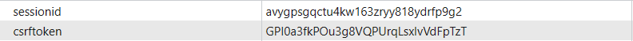

#### 1-cookie和session

<br>

> 1. HTTP协议是无状态的协议，所以服务端需要记录用户的状态时，就需要用某种机制来识具体的用户。
> 2. HTTP Cookie是服务器发送到用户浏览器并保存在本地的一小块数据，它会在浏览器下次向同一服务器再发起请求时被携带并发送到服务器上。通常用于告知服务端两个请求是否来自同一浏览器。
> 3. Session代表着服务器和客户端一次会话的过程。Session对象存储特定用户会话所需的属性及配置信息。当用户在应用程序的Web页之间跳转时，存储在Session对象中的变量将不会丢失，而是在整个用户会话中一直存在下去。当客户端关闭会话，或者Session超时失效时会话结束。
> 4. 二者区别：
>    1. 作用范围不同，Cookie 保存在客户端(浏览器)，Session 保存在服务器端。
>    2. 存取方式的不同，Cookie只能保存ASCII，Session可以存任意数据类型。
>    3. 有效期不同，Cookie可设置为长时间保持，比如默认登录功能功能，Session一般有效时间较短，客户端关闭或者Session超时都会失效。
>    4. 隐私策略不同，Cookie存储在客户端，信息容易被窃取;Session存储在服务端，相对安全一些。
>    5. 存储大小不同， 单个Cookie保存的数据不能超过4K，Session可存储数据远高于Cookie。
> 5. 禁用cookie的解决措施:
>    1. 方案一：拼接SessionId参数。在GET或POST请求中拼接SessionID。
>    2. 方案二：基于Token(令牌)。


#### 2-登录、注销需求

1. 由于不需要将数据存储到数据库中，所以采用`form`组件，而非`modelform`组件(也可以)。

   ```python
   from django import forms
   
   class LoginFrom(forms.Form):
       user = forms.CharField(
           required=True,
           widget=forms.TextInput(
               attrs={
                   'type': "email",
                   'class': "form-control",
                   'id': "inputEmail3",
                   'placeholder': "User"
               })
       )
       password = forms.CharField(
           required=True,	# 设为必须
           widget=forms.PasswordInput(
               render_value=True,
               attrs={
                   'type': "password",
                   'class': "form-control",
                   'id': "inputPassword3",
                   'placeholder': "Password"
               }
           )
       )
   
       def clean_password(self):
           password = self.cleaned_data.get('password')  # 密码MD5加密
           return md5(password)
   ```

   

2. 编写视图函数：`form.add_error(field,error_message)`为指定字段添加错误显示信息。`request.session`设置保存的session，django会自动生成sessionId，返回给浏览器。

   ```python
   from django.shortcuts import render, redirect
   from app1.models import AdminInfo
   from app1.forms import LoginFrom
   
   def login(request):
       if request.method == 'GET':
           form = LoginFrom()
           return render(request, 'login.html', {'form': form})
       else:
           form = LoginFrom(data=request.POST)
           if form.is_valid():  # 参数校验
               user = AdminInfo.objects.filter(**form.cleaned_data).first()  # 数据库验证
               if not user:
                   form.add_error('password', '用户名或密码错误')  # 手动添加错误
                   return render(request, 'login.html', {'form': form})
               request.session['info'] = {'id': user.id, 'user': user.user}  # 存入session
               return redirect('user_list')
           else:
               return render(request, 'login.html', {'form': form})
   ```

   

3. 在浏览器端查看cookie：

   

4. 在html中也可以使用session的信息：

   ```html
   <span>{{ request.session.info.user}}</span>
   <span>{{ request.session.info.d}}</span>
   ```

5. 实际上，session是存储在数据库的`django_session`表中。

6. 补充注销操作：

   ```python
   def logout(request):
       request.session.flush()
       return redirect('login')
   ```

   

> 关于session的API补充：
>
> 1. `request.session.set_expiry(value)`:设置session过期时间。
>    1. 如果过期时间的`value`是一个整数，则 `session`数据 将在`value`秒没有活动后过期。
>    2. 如果过期时间的`value`为`None`，那么会话永不过期。
>    3. 如果过期时间的`value`为`0`，那么用户会话的`Cookie`将在用户的浏览器关闭时过期。
> 2. `del request.session['键']`:删除session中的指定键及值。
> 3. `request.session.flush()`:删除session的整条数据。
> 4. `request.session.clear()`:在存储中删除session的值部分(session存在)
> 5. `requst.session[key]`:添加或者获取session的对应值
> 6. `request.session.get()`:获取session的对应值
>
> 关于django的session配置:待补。


#### 3-中间件

##### a-介绍

<br>

> 1. 中间件`middleware`允许您在一个浏览器的请求在到达`Django`视图之前处理它，以及在视图返回的响应到达浏览器之前处理这个响应，类似于ssm框架的过滤器。
> 2. 下面是中间件的几个钩子方法：
>    1. 按配置顺序正序执行：`process_request`、`process_view`。
>    2. 按配置顺序逆序执行：`process_exception`、`process_template_response`、`process_response`。

>1. `process_request(self,request)`:请求阶段执行视图前，若无返回值(None)则继续访问视图，若返回`HttpResponse、render、redirect`则拦截，执行返回值。

> 2. `process_view(self, request, view_func, view_args, view_kwargs)`：在Django调用真正的业务视图之前被执行，并且以正序执行。当`process_request()`正常执行完毕后，会进入urlconf路由阶段，并查找对应的视图，在执行视图函数之前，会先执行`process_view()` 中间件钩子。
>    1. `request`: HttpRequest对象。
>    2. `view_func`：真正的业务逻辑视图函数（不是函数的字符串名称）。
>    3. `view_args`：位置参数列表
>    4. `view_kwargs`：关键字参数字典

> 3. `process_exception(self, request, exception)`:视图函数中出现异常了自动执行，它返回的值可以是一个None也可以是一个HttpResponse对象。如果是HttpResponse对象，Django将调用模板和中间件中的process_response方法，并返回给浏览器，否则将默认处理异常。如果返回一个None，则交给下一个中间件的process_exception方法来处理异常。

> 4. `process_template_response(request, response)`:在视图函数执行完成后立即执行，但是它有一个前提条件，那就是视图函数返回的对象有一个`render()`方法（或者表明该对象是一个TemplateResponse对象)。该方法常用于向模板注入变量或则直接改变模板。

> 5. `process_response(self, request, response)`:响应阶段执行视图后，需返回`HttpResponse`对象。

> 1. 自定义组件，app下新建middleware文件夹存储中间件。
> 2. 中间件类需要继承自`django.utils.deprecation.MiddlewareMixin`。
> 3. 中间件要使用，需要在`settings.py`中`MIDDLEWARE`注册，此外中间件的执行顺序就是配置顺序：

```python
MIDDLEWARE = [
    "django.middleware.security.SecurityMiddleware",
    "django.contrib.sessions.middleware.SessionMiddleware",
    "django.middleware.common.CommonMiddleware",
    "django.middleware.csrf.CsrfViewMiddleware",
    "django.contrib.auth.middleware.AuthenticationMiddleware",
    "django.contrib.messages.middleware.MessageMiddleware",
    "django.middleware.clickjacking.XFrameOptionsMiddleware",
    "app1.middleware.login_redirect.LoginJudge"  # 自定义中间件的全类名
]
```


##### b-登录拦截

1. 当用户未登录时，我们不希望他访问一些重要页面，对此可以使用中间件实现。

2. app下新建middleware文件夹存储中间件，创建`LoginJudge`中间件。

   ```python
   from django.http import HttpRequest, HttpResponse
   from django.shortcuts import redirect
   from django.utils.deprecation import MiddlewareMixin
   # login_redirect.py
   
   class LoginJudge(MiddlewareMixin):
   
       def process_request(self, request: HttpRequest):
   
           if request.path_info == '/login/':  # 排除登录请求
               return
   
           info = request.session.get('info')
           if not info:  # 未登录
               return redirect('login')
   
           return
   
       def process_response(self, request, response: HttpResponse):
   
           return response
   
   ```

   

3. 注册中间件：

   ```python
   MIDDLEWARE = [
       "django.middleware.security.SecurityMiddleware",
       "django.contrib.sessions.middleware.SessionMiddleware",
       "django.middleware.common.CommonMiddleware",
       "django.middleware.csrf.CsrfViewMiddleware",
       "django.contrib.auth.middleware.AuthenticationMiddleware",
       "django.contrib.messages.middleware.MessageMiddleware",
       "django.middleware.clickjacking.XFrameOptionsMiddleware",
       "app1.middleware.login_redirect.LoginJudge"  # 自定义中间件的全类名
   ]
   ```


#### 4-验证码

##### a-pillow(略)

>1. cmd中运行`pip install pillow`安装pillow模块。

> Image创建：
>
> 1. `from PIL import Image`导入Image类，通过以下方法创建Image对象：
>    1. `im = Image.open(fp,mode="r")`:打开图片文件，创建Image对象。
>       1. `fp`：表示文件路径，字符串格式；
>       2. `mode`：可选参数，若出现该参数，则必须设置为 "r"，否则会引发 ValueError 异常。
>    2. `im=Image.new(mode,size,color)`:创建Image对象。
>       1. `mode`：图像模式，字符串参数，比如 RGB(真彩图像)、L(灰度图像)、CMYK(色彩图打印模式)等；
>       2. `size`：图像大小，元组参数(width, height)代表图像的像素大小；
>       3. `color`：图片颜色，默认为0表示黑色，参数值支持(R,G,B)三元组数字格式、颜色的十六进制值以及颜色英文单词。
> 2. `im.show()`展示图片。

> Image属性：
>
> 1. `im. size`：查看图像的尺寸。
> 2. `im.format`：查看图片的格式。
> 3. `im.readonly`：图片是否为只读
> 4. `im.info`：查看图片相关信息
> 5. `im.mode`：查看图像模式。

| mode  | 描述                                                      |
| ----- | --------------------------------------------------------- |
| 1     | 1 位像素（取值范围 0-1），0表示黑，1 表示白，单色通道。   |
| L     | 8 位像素（取值范围 0 -255），灰度图，单色通道。           |
| P     | 8 位像素，使用调色板映射到任何其他模式，单色通道。        |
| RGB   | 3 x 8位像素，真彩色，三色通道，每个通道的取值范围 0-255。 |
| RGBA  | 4 x 8位像素，真彩色+透明通道，四色通道。                  |
| CMYK  | 4 x 8位像素，四色通道，可以适应于打印图片。               |
| YCbCr | 3 x 8位像素，彩色视频格式，三色通道。                     |
| LAB   | 3 x 8位像素，L * a * b颜色空间，三色通道                  |
| HSV   | 3 x 8位像素，色相，饱和度，值颜色空间，三色通道。         |
| I     | 32 位有符号整数像素，单色通道。                           |
| F     | 32 位浮点像素，单色通道。                                 |

> 格式转换：
>
> 1. `Image.save(fp, format=None)`:保存图片。
>    1. `fp`：图片的存储路径，包含图片的名称，字符串格式。
>    2. `format`：可选参数，可以指定图片的格式。
> 2. `im.convert(mode,params)`:转换图像模式。
>    1. `mode`：要转换成的图像模式。
>    2. `params`：其他参数。
> 3. 非所有的图片格式都可以用`save()`方法转换完成，比如将PNG格式的图片保存为JPG格式，PNG和JPG 图像模式不一致。其中PNG是四通道RGBA模式，即红色、绿色、蓝色、Alpha透明色，JPG是三通道 RGB 模式。因此要想实现图片格式的转换，就要将PNG转变为三通道RGB模式。

```python
from PIL import Image
im = Image.open('/pic.png')

image = im.convert('RGB')  # 转换模式
image.save('/pic.jpg')  # 保存
```

> 图像缩放：略

> ImageDraw：
>
> 1. `draw = ImageDraw.Draw(im)`:创建一个ImageDraw对象。
> 2. `draw.rectangle(xy, fill=None, outline=None)`：绘制矩形。
> 3. `draw.text((x,y), text, font, fill)`:绘制文本。
>    1. `(x,y)`：图像左上角为坐标原点，(x,y) 表示添加文本的起始坐标位置；
>    2. `text`：字符串格式，要添加的文本内容；
>    3. `font`：ImageFont 对象；
>    4. `fill`：文本填充颜色。

> ImageFont：
>
> 1. `font = ImageFont.truetype(font, size)`:创建ImageFont对象。
>    1. `font`:字体路径
>    2. `size`：字体大小。


##### b-创建验证码

<br>

1. 无验证码，网站密码容易被暴力遍历破解。

1. 在app的`utils`文件夹创建自动生成验证码函数(看不懂，直接嫖)，字体文件放在项目根目录：

   ```python
   import random
   from PIL import Image, ImageDraw, ImageFont, ImageFilter
   
   
   def check_code(width=120, height=30, char_length=5, font_file='kumo.ttf', font_size=28):
       code = []
       img = Image.new(mode='RGB', size=(width, height), color=(255, 255, 255))
       draw = ImageDraw.Draw(img, mode='RGB')
   
       def rndChar():
           """
           生成随机字母
           :return:
           """
           return chr(random.randint(65, 90))
   
       def rndColor():
           """
           生成随机颜色
           :return:
           """
           return (random.randint(0, 255), random.randint(10, 255), random.randint(64, 255))
   
       # 写文字
       font = ImageFont.truetype(font_file, font_size)
       for i in range(char_length):
           char = rndChar()
           code.append(char)
           h = random.randint(0, 4)
           draw.text([i * width / char_length, h], char, font=font, fill=rndColor())
   
       # 写干扰点
       for i in range(40):
           draw.point([random.randint(0, width), random.randint(0, height)], fill=rndColor())
   
       # 写干扰圆圈
       for i in range(40):
           draw.point([random.randint(0, width), random.randint(0, height)], fill=rndColor())
           x = random.randint(0, width)
           y = random.randint(0, height)
           draw.arc((x, y, x + 4, y + 4), 0, 90, fill=rndColor())
   
       # 画干扰线
       for i in range(5):
           x1 = random.randint(0, width)
           y1 = random.randint(0, height)
           x2 = random.randint(0, width)
           y2 = random.randint(0, height)
   
           draw.line((x1, y1, x2, y2), fill=rndColor())
   
       img = img.filter(ImageFilter.EDGE_ENHANCE_MORE)
       return img, ''.join(code)
   ```

   

##### c- 登录验证功能

1. 先写一个视图函数，用于生成验证码图片，并且获取图片：

   ```python
   def get_code(request):
       im, data = check_code()
       stream = BytesIO()
       im.save(stream, 'png')  # 保存为二进制流
   
       request.session['code_image'] = data
       request.session.set_expiry(60)  # 设置session过期时间
   
       return HttpResponse(stream.getvalue())  # 返回图像
   
   # path('get/code/', views.get_code, name='get_code')
   ```

   ```html
   {{ form.code }}
   
   <br>
   <span style="color:red;">{{ form.code.errors.0 }}</span>
   ```

   

2. 重新编写LoginForm，添加验证码字段。

   ```python
   from django import forms
   
   class LoginFrom(forms.Form):
       user = forms.CharField(
           required=True,
           widget=forms.TextInput(
               attrs={
                   'type': "email",
                   'class': "form-control",
                   'id': "inputEmail3",
                   'placeholder': "User"
               })
       )
       password = forms.CharField(
           required=True,	# 设为必须
           widget=forms.PasswordInput(
               render_value=True,
               attrs={
                   'type': "password",
                   'class': "form-control",
                   'id': "inputPassword3",
                   'placeholder': "Password"
               }
           )
       )
   	code = forms.CharField(
           required=True,
           widget=forms.TextInput(
               attrs={
                   'type': "email",
                   'class': "form-control",
                   'id': "inputEmail3",
                   'placeholder': "code"
               }
           )
       )
       def clean_password(self):
           password = self.cleaned_data.get('password')  # 密码MD5加密
           return md5(password)
   ```

   

3. 修改中间件，放开获取验证码请求：

   ```python
   class LoginJudge(MiddlewareMixin):
   
       def process_request(self, request: HttpRequest):
           allow_path = ['/login/', '/get/code/']
           if request.path_info in allow_path:  # 排除允许请求
               return
   
           info = request.session.get('info')
           if not info:  # 未登录
               return redirect('login')
   
           return
   
       def process_response(self, request, response: HttpResponse):
   
           return response
   ```

   

4. 修改登录逻辑：

   1. 注意从`cleaned_data`获取`code`要使用`pop`，使在后面查询admin传参数时不含`code`。
   2. 判断验证码，需要使用字符串`upper()`，全转化为大写，再判断。
   3. 由于再`get_code`视图函数设置了session存储时间，因此保存用户登录session，需要再次设置回来。

   ```python
   def login(request):
       if request.method == 'GET':
           form = LoginFrom()
           return render(request, 'login.html', {'form': form})
       else:
           form = LoginFrom(data=request.POST)
           if form.is_valid():
               code = form.cleaned_data.pop('code')  # 获取并删除
               session_code = request.session.get('code', '')
               if code.upper() != session_code.upper():
                   form.add_error('code', '验证码错误')
                   return render(request, 'login.html', {'form': form})
   
               user = AdminInfo.objects.filter(**form.cleaned_data).first()
               if not user:
                   form.add_error('password', '用户名或密码错误')
                   return render(request, 'login.html', {'form': form})
               
               request.session['info'] = {'id': user.id, 'user': user.user}  # 存入session
               request.session.set_expiry(60 * 60 * 24)  # 重置session存留时间
               return redirect('user_list')
           else:
               return render(request, 'login.html', {'form': form})
   ```


##### d-注销

1. 注销视图如下：
	```python
   def logout(request):
    request.session.flush()
   
    return redirect('login')


##### e-urls.py

1. 笔记大部分省略了urls.py，由于大量使用url名称，所以在此贴出其内容：

   ```python
   urlpatterns = [
       path("depart/list/", views.depart_show),
       path("depart/<int:id>/edit/", views.depart_edit),
       path("depart/add/", views.depart_add),
       path("depart/<int:id>/delete/", views.depart_delete),
       path("user/list/", views.user_show, name='user_list'),
       path("user/<int:id>/edit/", views.user_edit),
       path("user/add/", views.user_add),
       path("user/<int:id>/delete/", views.user_delete),
       path('user/model/add', views.user_model_add, name='model_add'),
       path('user/model/<int:id>/edit', views.user_model_edit, name='model_edit'),
       path('admin/show', views.admin_show, name='admin_show'),
       path('admin/add', views.admin_add, name='admin_add'),
       path('login/', views.login, name='login'),
       path('get/code/', views.get_code, name='get_code'),
       path('logout/', views.logout, name='logout')
   ]

   
