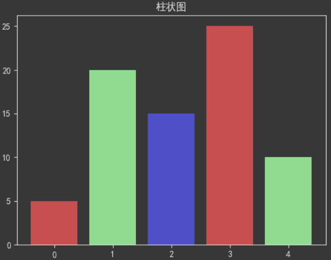
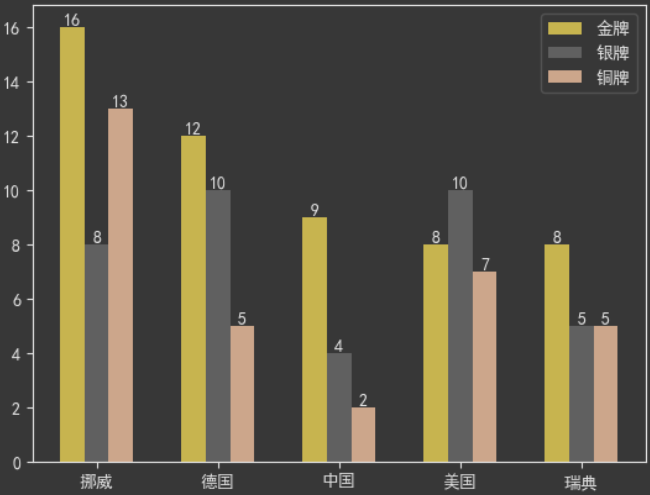
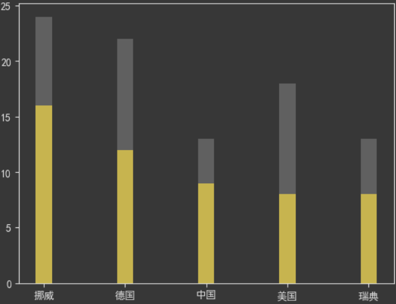
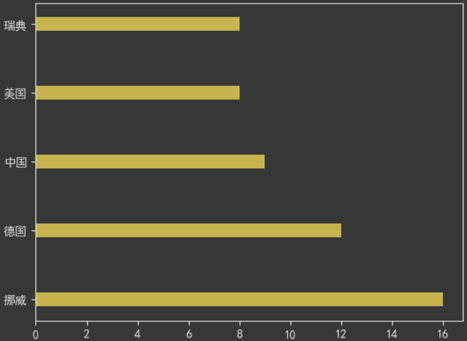

#### 1-柱状图

##### a-基本柱状图

<br>

> 1. `matplotlib.pyplot.bar(x, height, width: float=0.8, bottom=None, *, align: str= ‘center’, data=None, **kwargs)`:绘制基本柱状图。
>    1. `x`: 表示x坐标，数据类型为`float`类型，一般为`np.arange()`生成的固定步长列表
>    2. `height`: 表示柱状图的高度，也就是y坐标值，数据类型为`float`类型，一般为一个列表，包含生成柱状图的所有y值。
>    3. `width`: 表示柱状图的宽度，取值在`0~1`之间，默认值为0.8。
>    4. <font color='red'>`bottom`</font>: 柱状图的起始位置，也就是y轴的起始坐标，默认值为`None`。
>    5. `align`: 柱状图的中心位置，“center”，"lege"边缘，默认值为’center’。
>    6. `color`: 柱状图颜色，默认为蓝色
>    7. `alpha`: 透明度，取值在`0~1`之间，默认值为1。
>    8. `label`: 标签，设置后需要调用`plt.legend()`生成。
>    9. `edgecolor`: 边框颜色(缩写ec)。
>    10. `linewidth`：边框宽度，浮点数或类数组，默认为`None`(缩写lw)。
>    11. `tick_label`：柱子的刻度标签，字符串或字符串列表，默认值为None。
>    12. `linestyle` :线条样式(缩写ls)。
>
> 2. 关于`color`参数和`facecolor`:
>    1. `color`参数可以设置为颜色字符串列表形式，生成的柱状图按列表内颜色循环显示。
>    2. `facecolor`参数设置所有柱状图的颜色。

```python
x = np.arange(5)	#创建数据
data = [5, 20, 15, 25, 10]

plt.title('柱状图')
plt.rcParams['font.sans-serif'] = ["SimHei"]    # 设置字体
plt.rcParams['axes.unicode_minus'] = False  # 更正负号异常

plt.bar(x,data,color=['red', 'green', 'blue'])
```

<br>


##### b-同位置多柱状图

<br>

> 1. 由于需要同位置画多个柱状图，需要对`x`轴进行数值计算。所以先把`x`轴使用数值型。
> 2. 设置柱状图宽度`width`，每次画图都在前一次基础上设置`x`轴数字后移`width`。
> 3. 将刻度移到合适位置，替换显示为字符串刻度。

```python
# 国家
countries = ['挪威', '德国', '中国', '美国', '瑞典']
# 金牌个数
gold_medal = [16, 12, 9, 8, 8]
# 银牌个数
silver_medal = [8, 10, 4, 10, 5]
# 铜牌个数
bronze_medal = [13, 5, 2, 7, 5]

x = np.arange(len(countries))
width = 0.2  # 柱状图宽度

gold_x = x
silver_x = x + width
bronze_x = silver_x + width

plt.bar(gold_x, gold_medal,width=width, color='gold', label='金牌')
plt.bar(silver_x, silver_medal,width=width, color='silver',label='银牌')
plt.bar(bronze_x, bronze_medal,width=width, color='saddlebrown',label='铜牌')

plt.xticks(x+width, labels=countries)   # 替换国家刻度

for i in range(len(countries)):  # 设置数据说明
    plt.text(gold_x[i],gold_medal[i],gold_medal[i],va='bottom',ha='center')
    plt.text(silver_x[i],silver_medal[i],silver_medal[i],va="bottom",ha="center")
    plt.text(bronze_x[i],bronze_medal[i],bronze_medal[i],va="bottom",ha="center")

plt.legend()
```

<br>


##### c-堆叠柱状图

<br>

> 1. 使用`bottom`参数即可。

```python
# 国家
countries = ['挪威', '德国', '中国', '美国', '瑞典']

# 金牌个数
gold_medal = [16, 12, 9, 8, 8]
# 银牌个数
silver_medal = [8, 10, 4, 10, 5]
# 铜牌个数
bronze_medal = [13, 5, 2, 7, 5]
width = 0.2
plt.bar(countries, gold_medal,color="gold", width=width)
plt.bar(countries,silver_medal,bottom=gold_medal,color="silver", width=width)
```

<br>


##### d-水平柱状图

<br>

> 1. `plt.barh(y, width, height=0.8, left=None, *, align='center', **kwargs)`:水平柱状图。
>    1. `y`:y轴刻度数据。
>    2. `width`:柱状图的长度。
>    3. `height`:柱状图的宽度。
>    4. `left`:设置左侧的x坐标。类似于`bottom`参数。
>    5. `align`: 柱状图的中心位置，“center”，"lege"边缘，默认值为’center’。
>    6. `color`: 柱状图颜色，默认为蓝色
>    7. `alpha`: 透明度，取值在`0~1`之间，默认值为1。
>    8. `label`: 标签，设置后需要调用`plt.legend()`生成。
>    9. `edgecolor`: 边框颜色(缩写ec)。
>    10. `linewidth`：边框宽度，浮点数或类数组，默认为`None`(缩写lw)。
>    11. `tick_label`：柱子的刻度标签，字符串或字符串列表，默认值为None。
>    12. `linestyle` :线条样式(缩写ls)。

```python
countries = ['挪威', '德国', '中国', '美国', '瑞典']

gold_medal = np.array([16, 12, 9, 8, 8])  # 金牌个数

# y轴为国家,宽度为奖牌数
plt.barh(countries, width=gold_medal, height=0.2, color='gold')
```

<br>


#### 2-直方图

##### a-


#### 3-扇形图

##### a-扇形图

<br>

> 1. `pyplot.pie(x, explode=None, labels=None, colors=None, autopct=None)`
>
> - `x`:  数组序列，数组元素对应扇形区域的数量大小。
> - `labels`: 列表字符串序列，为每个扇形区域备注一个标签名字。
> - `colors`: 为每个扇形区域设置颜色，默认按照颜色周期自动设置。
> - `autopct`: 格式化字符串"fmt%pct"，使用百分比的格式设置每个扇形区的标签，并将其放置在扇形区内
>   - `%d%%`整数百分比
>   - `%0.1f`一位小数
>   - `%0.1f%%`一位小数百分比
>   - `%0.2f%%`两位小数百分比
>   - `%%`表示输出`%`,`%3.2%%`应该是格式化为`%3.2`再转为百分数。
> - `pctdistance`：设置百分比标签与圆心的距离；
> - `labeldistance`：设置各扇形标签（图例）与圆心的距离；
> - `explode`: 指定饼图某些部分的突出显示，即呈现爆炸式；
> - `shadow`：是否添加饼图的阴影效果。
> - `radius`：设置饼图的半径，默认为1。
>
> 2. `plt.legend()`通过`labels`绘制图例。

```python
#定义饼的标签，
labels = ['娱乐','育儿','饮食','房贷','交通','其它']

#每个标签所占的数量
x = [200,500,1200,7000,200,900]

#饼图距离圆心距离
explode = (0.03,0.05,0.06,0.04,0.08,0.1)

# 画图
plt.pie(x,labels=labels,autopct='%3.2f%%',explode=explode, labeldistance=1.35, pctdistance=1.2)

plt.legend()  # 绘制图例
```

