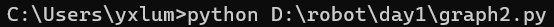
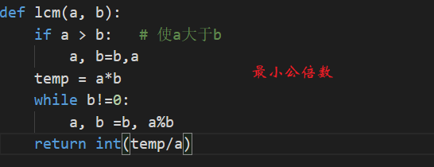
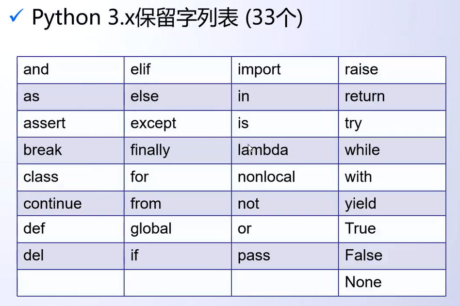
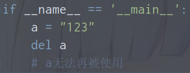

> 易忘：
> 1. `**`除了解包外，还可以用于幂运算。例如：`2**3 ---->表示2的次方`。
> 2. python 用反斜线`\` 作为续行符(换行符)，当代码语句过长时可以使用`\`分行写。
> 3. 当`not`和`and`及`or`在一起运算时，优先级为是`not > and > or`。
> 4. `help(fun)`查看函数文档和用法。


---

<br>

#### 1-简介

<br>

- Python语言采用严格的“缩进”来表明程序的格式框架。缩进指每一行代码开始前的空白区域，用来表示代码之间的包含和层次关系。
   - 1个缩进=4个空格
   - 缩进用以在Python中标明代码的层次关系
   - 缩进是Python语言中表明程序框架的唯一手段
- python变量命名规则：
> - 硬性规则：
>    - 变量名由字母、数字和下划线构成，数字不能开头。
>    - 大小写敏感。
>    - 不要跟关键字和系统保留字冲突。
> - PEP8要求：
>    - 用小写字母拼写，多个单词用下划线连接。
>    - 受保护的实例属性用单个下划线开头。
>    - 私有的实例属性用两个下划线开头。


---

<br>

#### 2-编码集设置

<br>

- python可以在文件头，采用注释方式声明文件编码。但其实python3默认编码就是UTF-8。而Python2的默认编码是ASCII。
```python
三种方式：
# -*- coding:utf-8 -*-	（推荐方式，-为减号而非_）	
# coding:utf-8
# coding=utf-8
```

---

<br>

#### 3-命令行执行py文件

<br>

- `**python+文件位置**`



---

<br>

#### 4-注释使用

<br>

- python中的注释分为单行注释，与多行注释：
```python
# hhh    单行注释，#号和注释内容一般建议以一个空格隔开

"""
hhh		 多行注释
"""

'''
hhh		多行注释(不推荐)
'''
```

---

<br>

#### 5-常用求最小公倍数、最大公因数

<br>

<br />

---

<br>

#### 6-保留字

<br>



---

&nbsp;

#### 7-同步赋值

&nbsp;

- 同步赋值：`<变量1>,<变量2>,...,<变量n> = <表达式1>,<表达式2>,...,<表达式n>`。将等号右边表达式按顺序赋值左边变量。
- 其他类型赋值：[运算符](./3.运算符.md)
```python
a, b = "long", 'short' 
```

---

<br>

#### 8-input()函数

<br>

- `input(prompt=None)`,其中prompt是提示信息。
- `input()`函数始终返回字符串类型。

---

<br>

#### 9-输出

<br>

- `print(*objects, sep=' ', end='\n', file=sys.stdout, flush=False)`
- 参数：
   - objects -- 复数，表示可以一次输出多个对象。输出多个对象时，需要用 , 分隔。
   - sep -- 用来间隔多个对象，默认值是一个空格。
   - end -- 用来设定以什么结尾。默认值是换行符 \n，我们可以换成其他字符串。
   - file -- 要写入的文件对象，默认为标准输出流sys.stdout。
   - flush -- 输出是否被缓存通常决定于 file，但如果 flush 关键字参数为 True，流会被强制刷新。
```python
if __name__ == '__main__':
	# 输出多个内容，中间#隔开
	print('a', 'b', 'c', sep='#')

	# 将file默认sys.stdout改为自定义文件流，将内容输出到文件中
	s = "hello world！"
	f = open("D:\\leetCode_P\\my\\test.txt", mode='r+', encoding='utf-8')
	print(s, file=f)
	f.close()

	# 不换行输出
	print('dd', end='')
```

---

<br>

#### 10-无穷大

<br>

- python中的`math.inf`表示正无穷大的浮点数，`-math.inf`表示负无穷大的浮点数。
- `math.isinf()`可用于判断一个数是不是无穷大浮点数。
- `math.inf`相相当于`float('inf')`。
```python
import math

if __name__ == '__main__':

	a = float('inf')
	b = math.inf
	print(a == b)   # True
	print(math.isinf(a))    # True
```

---

<br>

#### 11-evel函数

<br>

- 一般用法就是将字符串转为python语句（就是去掉" "）然后执行转化后的语句。
- 可用于计算表达式或者将字符串转为其他数据类型。常见用法：`eval(input("请输入数字"))`。
```python
if __name__ == '__main__':
	a = "98.99"
	b = 1
	c = eval("eval(a)+b")   
	# 首先去" ",执行eval(a)+b语句；其次eval(a)将a转为浮点型；最后进行加法计算
	print(c)    # 99.99
```

- `eval(source,globals = None,locals = None)`：globals和locals参数是可选的，如果提供了globals参数，那么它必须是dictionary类型；如果提供了locals参数，那么它可以是任意的map对象。
- python的全局命名空间存储在一个叫`globals()`的`dict`对象中，局部命名空间存储在一个名叫叫`locals()`的`dict`对象中。可以用`print (locals())`来查看该函数体内的所有变量名和变量值。
```python
if __name__ == '__main__':
	a = 2

	def fun():
		a = 5
		b = eval('a+1', locals())
		c = eval('a+1', globals())
		d = eval('a+1', globals(), locals())
		print("b:{}\nc:{}\nd:{}".format(b, c, d))
		# 6   3    6
	fun()
```

---

<br>

#### 12-id()、type()、isinstance()

<br>

- `id()`：用于返回对象内存地址。
- `type()`：获取变量类型,不认可子类时一种父类类型，_不考虑继承关系_。type是一个类，存在一个__name__属性。
- `isinstance(object, classinfo)`：object是对象，classinfo可以是直接或间接类名、基本类型或者由它们组成的元组认为子类是一种父类类型，_考虑继承关系_。

---

<br>

#### 13-删除变量

<br>

- 使用`del`关键字可以删除变量。


