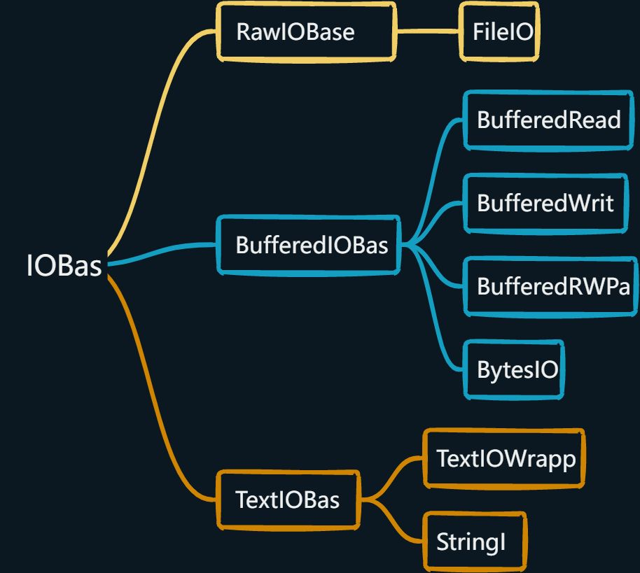

### 1-编码与路径

#### a-编码

<br>

> - 文件打开的原则是：以什么编码格式保存的，就以什么编码格式打开。
> - Python3的默认编码方式是以UTF-8，我们编译运行一个py文件的时候，Python编译器先对文件进行读取，然后默认对数据进行UTF-8的解码，然后编译运行，让程序跑起来。

> - 介绍一种判断文件原本编码方式的方法，使用`chardet`库，可以通过`pip、conda`安装。 具体步骤如下：  
>    1. 首先使用二进制格式读取文件数据。
>    2.  将读取到的二进制数据交由chardet识别，并返回对应信息。文件过小可能会导致判断失误。
>    3. 通过返回信息获取`encoding`，然后对二进制数据解码，或是使用获取的编码重新读取文件。

```python
# chardet识别文件编码
import chardet

with open('utf8.txt', 'rb') as f:	# 以二进制读取文件数据
	data = f.read()

info = chardet.detect(data)	 # 将二进制数据交给chardet识别		
# {'encoding': 'utf-8', 'confidence': 0.99, 'language': ''}
```

<br>

#### b-文件路径

<br>

> 1.  **绝对路径**：从根文件夹开始，Window 中以盘符(C、D)作为根文件夹，而OSX 或者Linux系统中以`/`作为根文件夹。
> 2.  **相对路径**：指的是文件相对于当前工作目录所在的位置。例如当前工作目录为 `"D：ai\test"`，若文件`info.txt`就位于这个test文件夹下，则 info.txt 的相对路径表示为 `".\info.txt"`，也可以直接写为`"info.txt"`。
> 3.  使用相对路径时，常用`.\`表示当前所在目录，用`..\`表示当前所在目录的上一层目录。  
> 4. 此外，注意window使用`\`作为路径分隔符，但是在python中`\`用作转义字符。所以python在使用window文件路径时，要使用`\\`。

<br>

#### c-路径拼接

<br>

见下文os

---

### 2-文件读取

<br>

> - python文件读取一般分为三步：
>    1. 打开文件
>    2. 读取文件
>    3. 关闭文件：必须执行，用`with`上下文管理器时这一步可以交给python控制。

<br>

#### a-打开文件

<br>

> 1. python打开文件可以使用`**open()**`方法，返回一个文件对象。
> 2. `open(file, mode='r', buffering=-1, encoding=None, errors=None, newline=None, closefd=True, opener=None)`：
>    1. file: 必需，文件路径。
>    2. mode: 可选，文件打开模式。
>    3. buffering: 设置缓冲。
>    4. encoding: 一般使用utf8，不传参默认系统编码。注意仅在文本模式有用。
>    5. errors: 处理编码、解码错误的策略，仅在文本模式可用。取值为 None 时相当于 'strict' ，会抛出异常
>    6. newline: 区分换行符。
>    7. closefd: 传入的file参数类型。
>    8. opener: 设置自定义开启器，开启器的返回值必须是一个打开的文件描述符。
> 3. 在上述多个参数中，常用到`file、mode、encoding`，但是当仅使用这三个参数时要注意到`encoding`不是第三个参数，无法位置传参。因此`encoding`需要使用关键字传参。
> 4. 常用到的`mode`模式(默认r模式)有：
>    1. `r`：(read)只读模式，文件不存在就报错。文件指针置于文件开头。
>    2. `w`：(write)打开文件只用于写入。文件指针置于文件开头，原有内容会被删除。文件不存在就创建。
>    3. `a`：(append)在原有内容的基础上追加内容。文件指针位于末尾，在末尾写入。文件不存在就创建。
>    4. `rb`：以二进制格式打开一个文件用于只读。文件指针置于文件开头。
>    5. `wb`：以二进制格式打开一个文件用于只写。文件指针置于文件开头，原有内容会被删除。文件不存在就创建。
>    6. `ab`：以二进制格式打开一个文件用于追加，文件指针位于末尾，在末尾写入。文件不存在就创建。
>    7. `+`：此外还可以在上述模式后添加`+`，表示支持读写双重模式。例如`r+`、`ab+`等。
>    8. `w+`模式，在读写之前都会清空文件的内容，建议不要使用。`a+`模式，永远只能在文件的末尾写入，无法读。
> 5. 对于非文本文件一般使用二进制格式读取。`encoding`参数无法在二进制模式下使用。
> 6. 以文本模式打开文件时，读写的数据必须为str类型。以二进制模式打开文件时，读写的数据必须为`bytes、bytearray`类型。
> 7. 遇到有些编码不规范的文件，可能会抛出`UnicodeDecodeError`异常，这表示在文件中可能夹杂了一些非法编码的字符。遇到这种情况，可以提供`errors='ignore'`参数，表示如果遇到编码错误后忽略。

> 1. 类 Unix 系统默认是`\n` ，Windows 系统中的换行符默认是`\r\n` ， mac系统则是`\r`。  
> 2. `open()`函数中，`newline`参数可取值：`None、''、'\n'、'\r'、'\r\n'`
>    1. `newline`无法在二进制格式下使用。
>    2. 默认为`newline=None`：
>       1. 读取文件时，会将文件中的 `'\r'、'\n'、'\r\n'`都识别成换行符，并且统一转换成 `'\n'`，再返回。
>       2. 写入文件时，会将待写文本中的`'\n'`都替换成当前平台的默认换行符，再写入文件。
>    3. 如果指定了`newline=''`：
>       1. 读取文件时，会将文件中的`'\r'、'\n'、'\r\n' `都识别成换行符但不做转换，然后返回该行文本。
>       2. 写入文件时，会直接写入。
>    4. 如果指定了`newline`等于其它值：
>       1. 读取文件时，只会识别指定的换行符但不做转换，然后返回该行文本。
>       2. 写入文件时，会将待写文本中的`'\n'`都替换成指定的换行符，再写入文件
> 3. 怎么理解识别换行符，就是在`readline、readlines`等会把对应字符作为一行的结束标志。但是不一定会把换行符转换成`\n`。

> 1. 开启缓存，读写数据时，会等数据累积一定字节数之后，再进行实际的磁盘IO操作。
> 2. `open()`函数中，`buffering`参数可取值：
>    1. `0`：取消缓冲，仅在二进制模式可用。
>    2. `1`：采用行缓冲，仅在文本模式可用。
>    3. `n > 0` ：采用 n 字节大小的缓冲区。
>    4. 默认不指定缓冲策略，如果文件为tty ，则采用行缓冲。其它文件采用系统默认大小的缓冲区，取决于 io.DEFAULT_BUFFER_SIZE ，通常为 8 KB 。

<br>

#### b-关闭文件

<br>

> - `f.close()`：关闭文件对象，解除文件占用。
> - 处理完一个文件后，通过调用`f.close()`来关闭文件并释放系统的资源。文件关闭后，如果尝试再次调用该文件对象，则会抛出异常。
> - 写入时忘记关闭文件对象可能导致数据可能只写了一部分到磁盘，甚至更糟糕。读取时忘记关闭文件对象，可能导致相关文件资源长时间被占用。
> - 当然使用`with`上下文管理器，就不需要写`close`语句了。

<br>

#### c-读取文件

<br>

> 1. `f.read(size)`：读取一定大小字符或字节的数据, 然后作为字符串或字节对象返回。
>    1. size用于指定读取的数据量(文本模式单位是字符，二进制格式单位为字节)。
>    2. 当size被忽略了或者为负值，那么会读取全部内容。
> 2. `f.readline(size)`：每次从文件中读取一行内容，包含换行符`\n`。
>    1. 如果返回一个空字符串，说明已经已经读取到最后一行。
>    2. size可选，用于指定读取每一行时，一次最多读取的字符(字节)数。如果一行没读完下次继续，但是一次最多只会读取一行。
>    3. 占用内存小，适合大文件。
> 3. `f.readlines(size)`：将文件按行全部读入一个列表，并返回这个列表。
>    1. 当size的长度没有超过当前行时，当前行的全部内容会被读取，如果size超过当前行小于后一行结尾，则当前行和后一行都读取。也就是说在保障整行读取的前提下，不超过size。
>    2. 读取大文件占大量内存，且一次性全部读入存在一定的风险。
>    3. 一般用于读取配置文件。
> 4. 文件对象同样是一个迭代器，可以使用for循环遍历。
> 5. 同样的，作为一个迭代器，文件对象也存在`next()`方法。
> 6. 文件读取时可以灵活运用字符串方法(`strip、split`等)对读取数据进行处理。

```python
# readline

f = open('.\\utf8.txt', encoding='utf-8')
while line := f.readline():
	print(line.strip('\n'))	 # 去除\n

f.close()	# 关闭
```
```python
# for

f = open('.\\utf8.txt', encoding='utf-8')
for line in f:
	print(line, end='')	 # 含\n,所以print不换行
	
f.close()	# 差点忘了
```
<br>

#### d-写入文件

<br>

> 1. `f.write()`：将字符串或bytes类型的数据写入文件内。
> 2. 多次重复进行`write()`动作，其实都是在内存中操作，并不会立刻写回硬盘，直到执行`close()`方法后，才会将所有的写入操作反映到硬盘上。因此一定要记得关闭文件对象。
> 3. `f.flush()`： 刷新缓冲区(存储到文件中)，同时清空缓冲区。对于某些重要数据，如果想将内存中的修改，立刻保存到硬盘上，可以刷新缓冲区。
> 4. `writelines(iterable)`：方法用于向文件中写入一序列的字符串。这一序列字符串可以是由迭代对象产生的。换行需要在字符串中使用换行符 `\n`。
> 5. 文件写入需要注意区分覆写和追加，同时不要忘记`close`、`flush`(`close`内置了`flush`)。

```python
# 示例
f = open('.\\test.txt', 'a', encoding='utf-8')

data = ('a', 'b', 'c',)
f.write('深林不隐鹿\n')
f.flush()	# 刷新缓冲区
f.write('江海不梦鱼\n')

f.close()
```


---

### 3-上下文管理器

<br>

> -  引入`with as`语句能让我们用简单的代码实现上下文的管理，省去`try/finally`的繁琐操作，让代码简化 。具体理解参考with语句的执行过程。
> - 上下文管理器以一种更加优雅的方式操作（创建/获取/释放）资源，如文件操作、数据库连接。同时可以更加优雅的处理异常；
> - 上下文还能用于计时器、过程监视的灵活场景。

<br>

#### a-简介

<br>

> 1.  上下文管理协议则是`__enter__`和`__exit__` ，别表示获取资源之前的动作、释放资源之后的动作。简单点说，一个类实现了`__enter__`和`__exit__`的方法，这个类的实例就是一个上下文管理器。  
> 2. 下文管理协议的一个强大之处在于：异常可以在`__exit__`进行捕获并由你决定如何处理，是抛出还是就地解决。在`__exit__ `里返回 True(没有return 就默认为 return False)，就相当于告诉 Python解释器，这个异常我们已经处理了，不用管了。返回False就相当于告诉解释器我没法处理，解释器会再次将该异常引发。在写`__exit__`函数时，需要注意的事，它必须要有这三个参数：
>    1. `exc_type`：异常类型
>    2. `exc_val`：异常值
>    3. `exc_tb`：异常的错误堆栈信息
>    4. 当主逻辑代码没有报异常时，这三个参数将都为None。

<br>

#### b-with执行过程

<br>

> 1. with关键字用于Python的上下文管理器机制，with执行语句基本格式见下方代码块：

```python
# 基本格式

with expression as target:
	suite
```
> 2. with语句执行过程：
>    1. 执行上下文表达式`expression`，获得上下文管理器。
>    2. 载入上下文管理器的`__enter__()`和`__exit__()`以便后续使用。
>    3. 调用上下文管理器的`__enter__()`方法。
>    4. 如果存在`as target`，则将`__enter__()`返回值赋值`target`。
>       1. 注: `with`语句会保证若`__enter__()`方法返回时未发生错误，则`__exit__()`将总是被调用。 因此，如果在对目标列表赋值期间发生错误，则会将其视为在语句体内部发生的错误。 参见下一步。
>    5. 执行语句体`suite`。
>    6. 调用上下文管理器的`__exit__()`方法。 如果语句体的退出是由异常导致的，则其类型、值和回溯信息将被作为参数传递给`__exit__()`。 否则的话，将提供三个 None 参数。
>    7. 在执行完`__exit__()`后：
>       1. 如果语句体的退出是由异常导致的，并且`__exit__()`返回值为假(相当于有异常，但是我们无法处理)，则该异常会被重新引发。 如果返回值为真(相当于有异常，但是我们处理过了)，则该异常会被抑制，并会继续执行`with`语句之后的语句。
>       2. 如果语句体由于异常以外的任何原因退出，则来自`__exit__()`的返回值会被忽略，并会在该类退出正常的发生位置继续执行。
> 3. 其实上面的执行过程大致相当于下面的代码：

```python
manager = (EXPRESSION)
enter = type(manager).__enter__	 # 加载方法
exit = type(manager).__exit__	# 加载方法
value = enter(manager)		# 执行__enter__
hit_except = False	# 初始化异常标记

try:
	target = value	# 将返回值赋给target
	suit	# 执行语句体
except:
	hit_except = True	# 标记发生异常
	if not exit(manager, *sys.exc_info()):	# 返回true,则处理了，不管
		raise	# 没有处理，抛出
finally:
	if not hit_except: 
		exit(manager, None, None, None)	 # 没发生异常
```

<br>

#### c-with语句写法：

<br>

```python
# 第一种:常规
with A() as a:
	suite

# 第二种：多开
with A() as a, B() as b:
    suite

# 第三种：python3.10支持
with (
    A() as a,
    B() as b,
):
    suite

# 第四种
with A() as a:
    with B() as b:
        suite
```
> - 其实后面三种功能都是一样的，同时开启A、B两个。
> - 下面实现一下自定义文件管理器：

```python
# 自定义文件管理器
class FileManager(object):

	def __init__(self, file_name, mode, encoding):
		self.file_name = file_name
		self.mode = mode
		self.encoding = encoding

	def __enter__(self):
		self.file = open(self.file_name, self.mode, encoding=self.encoding)
		return self.file

	def __exit__(self, exc_type, exc_val, exc_tb):
		self.file.close()


with FileManager('.\\test.txt', 'r', 'utf-8') as f:
	while line := f.readline():
		print(line, end='')      
```
> 参考with的执行过程，我们分析一下自定义文件管理器：
> 1. 首先遇到with后会执行后面的上下文表达式，也就是调用FileManager的构造器创建实例对象，还会加载`__enter__、__exit__`。同时也将实例对象赋值给f(由于`as f`的存在)，方便在语句体代码块中读写文件。此后就会执行语句体，最后调用`__exit__`方法。
> 2. 关于`__exit__`并未写返回值，则会默认返回false。相当于告诉python解释器，就算有异常我也无法处理。一旦执行体语句出现异常，执行完`__exit__`后相关异常会重新引发。
> 3. 此外有一点很重要，上下文管理器中的`__init__`、`__enter__`、`__exit__`方法中出现异常是不归上下文管理器管辖的。只有执行语句中的异常才归上下文管理器管辖。

<br>

#### d-contextlib 模块

<br>

> 1.  使用with语句的便捷功能需要实现上下文协议中的特殊方法。但是使Python标准库提供的 contextlib模块的`@contextmanager`装饰器可以快速将一个函数实现为上下文管理器。
> 2.  被装饰函数必须是一个生成器（带有yield），而yield之前的代码，就相当于`__enter__`里的内容。yield之后的代码，就相当于`__exit__`里的内容。  用于代码块语句体中读写文件。
> 3. 为了便于对异常处理，被装饰函数还可以使用`try -catch-finally`。
> 4. `contextlib.closing()`：有些类，并没有实现上下文管理协议则是`__enter__`和`__exit__` ，但是有`close()`方法，可以通过`contextlib.closing()`来使用with。`closing`类自身就是一个上下文管理器，它会将初始化时传入的参数对象作为自己的属性，在`__enter__`返回参数对象，并在`__enter__`中间接调用参数对象的`close()`方法。

```python
# @contextmanager装饰器使用
from contextlib import contextmanager

@contextmanager
def manger(file, mode, encode):
	man = open(file, mode, encoding=encode)
	try:

		yield man	# 生成器，暂停并返回

	except Exception as e:
		print(e)	# 捕捉处理
		# 当然也可以raise e

	finally:
		if not man:
			man.close()


with manger('test.txt', 'r', 'utf-8') as f:
	while line := f.readline():
		print(line, end='')
```
```python
# closing()使用
from contextlib import closing


class Manager(object):
	def __init__(self, file_name, mod, encode):
		self.operator = open(file_name, mod, encoding=encode)

	def close(self):
		print('was closed!')
		self.operator.close()


with closing(Manager('test.txt', 'r', 'utf-8')) as f:
	data = f.operator.read()

```
<br>

#### e-异步上下文管理器

<br>

> 待补：
> 1. @asynccontextmanager快速实现异步上下文管理器
> 2. 异步上下文管理器 是 上下文管理器 的一种，它能够在其 __aenter__ 和 __aexit__ 方法中暂停执行。


---

### 4-file其他方法

<br>

#### a-文件指针

<br>

> 1. 使用read读了多次，那么后面继续使用read读取的数据是从上次读完后的位置开始的。
> 2. `f.tell()`：返回文件指针当前的位置(当前位置已经读过)，即距离文件开头的字节数 。
> 3. `f.seekable()`：判断是否可以移动文件指针位置，取决于IO对象是否支持随机位置访问 。
> 4. `f.seek(offset, whence=0)`：改变文件指针的位置，然后返回文件指针当前的位置。
>    1. offset ：表示指针从wherece开始的偏移量，即移动几个字节。为正后移，为负前移
>    2. whence ：可选参数，表示移动指针的起始位置。可取值：
>       1. 0 ：文件首部，即`f.tell()=0`处。
>       2. 1 ：指针当前位置，即`f.tell()`的值。(仅二进制格式可选)
>       3. 2 ：文件尾部，最后一个字节处。(仅二进制格式可选)
>       4. 文本模式下仅支持0(即从文件首部开始)，不然报错`io.UnsupportedOperation`。
> 5. EOF，为End Of File的缩写，通常在文本的最后存在此字符表示资料结束。  
> 6. 使用`seek()`，注意是以字节为单位。但我们知道utf-8中，汉字是占多个字节的。这就很可能导致把某个汉字给截开，此时读取就会形成乱码。

<br>

#### b-其他方法

<br>

> 1. `f.truncate( [ size ])`：用于从文件的首行首字节开始截断，
>    1. 截断文件时，需要允许写入，即`f.writeable() == True`。
>    2. 如果不指定 size ，则会采用文件指针当前的位置，即`f.tell()`的值。
>       1. 如果指定的size比文件长度小，则会截断文件，删除文件尾部多余的字节。
>       2. 如果指定的size比文件长度大，则会扩展文件，在文件尾部填充一些NULL字节。
> 2. `f.isatty()`：如果文件连接到一个终端设备返回 True，否则返回 False。
> 3. `f.fileno()`：返回一个整型的文件描述符(file descriptor FD 整型), 可以用在如os模块的read方法等一些底层操作上。
> 4. `f.readable()`：文件是可读的，则返回True，否则返回 False。
> 5. `f.writeable()`：如果文件可写，则返回 True，否则返回False。如果使用 `'a'` 追加或使用 `'w'`写入来打开文件 ，则该文件是可写的。

<br>

### 5-IO

<br>

> 1. io模块提供了Python用于处理各种I/O类型的主要工具。三种主要的I/O类型分别为：文本I/O, 二进制I/O和原始I/O。
> 2.  IO在计算机中指Input/Output，也就是输入和输出。 
> 3. IO操作的对象称为流对象，可以像文件一样读写。
>    1. 流对象可能是只读、只写，或可读可写的。
>    2. 流对象可能支持顺序读写，或者随机位置读写。
> 4. `IOBase`类是所有IO类的抽象基类。通常使用它的子类：
>    1. `BytesIO`：用作字节流、二进制流，只能写入bytes类型的值。
>    2. `StringIO`：用作字符流，只能写入str类型的值。
> 5. 使用`open()`函数打开文件时，返回的文件对象是对IO对象的封装。因此文件对象与IO对象的大部分方法一致。
> 6. IO的继承关系大致如下：

<br>

<br>

#### a-StringIO

<br>

> - StringIO经常被用来作字符串的缓存。
> - 要读取StringIO，可以用一个str初始化StringIO，然后像读文件一样读取。当然也可以创建空对象，然后写入。
> - 当使用`read()`方法读取写入的内容时，则需要先用`seek()`方法让指针移动到最开始的位置，否则读取不到内容（写入后指针在最末尾）。想用`write()`在结尾追加内容时，需要指针位于结尾，可以采用`seek()`或者通过获取内容使指针位于末尾。
> - `getvalue()`：直接获得流的全部内容，开始前会将指针归0。
> - `close()`：关闭对象，之后就不能再进行读写操作了
> - 其他的一些方法和文件操作类似。

```python
import io

s = io.StringIO()
s.write('hello,python!')  # 写入

s.seek(0)  # 指针归零
print(s.getvalue())  # 获取内容

s.close()  # 关闭

```

<br>

#### b-BytesIO

<br>

> - 要操作二进制数据，就需要使用`BytesIO`。
> - BytesIO实现了在内存中读写bytes，写入的是经过编码的bytes；
> - 要读取BytesIO，可以用一个bytes初始化BytesIO，然后像读文件一样读取。当然也可以创建空对象，然后写入。
> - 当使用`read()`方法读取写入的内容时，则需要先用`seek()`方法让指针移动到最开始的位置，否则读取不到内容（写入后指针在最末尾）。想用`write()`在结尾追加内容时，需要指针位于结尾，可以采用`seek()`或者通过获取内容使指针位于末尾。
> - `getvalue()`：直接流的全部内容，开始前会将指针归0。
> - `close()`：关闭对象，之后就不能再进行读写操作了
> - 字符串前面加`b`表示这是一个bytes对象。字符串前面加`u`表示unicode字符串。字符串前面加`r`表示非转义的原始字符串。
> - 其他的一些方法和文件操作类似。

```python
import io

s = io.BytesIO(b'hello,python!')

s.read()   # 使指针位于末尾
print(s.tell())  # 输出指针位置 
s.write(b'hello,dreamfish')  # 追加

print(s.getvalue().decode('utf-8'))  # 获取内容并解码

s.close()  # 关闭
```

<br>

#### c-同步异步IO

<br>

待补

---

### 6-os
#### a-系统常量

<br>

| 方法和变量 | 用途 |
| --- | --- |
| `os.name` | 查看当前操作系统的名称。windows返回`nt`，Linux则返回`posix`。 |
| `os.environ` | 获取系统环境变量 |
| `os.sep` | 当前平台的路径分隔符。在windows下，为`\\`，在POSIX系统中，为`/`。 |
| `os.altsep` | 可替代的路径分隔符，在Windows中为`/`。 |
| `os.extsep` | 文件名和文件扩展名之间分隔的符号，在Windows下为`.`。 |
| `os.pathsep` | PATH环境变量中的分隔符，在POSIX系统中为`:`，在Windows中为`;`。 |
| `os.linesep` | 行结束符。在不同的系统中行尾的结束符是不同的，例如在Windows下为`\\r\\n`。 |
| `os.devnull` | 在不同的系统上null设备的路径，在Windows下为`nul`，在POSIX下为`/dev/null`。 |
| `os.defpath` | 当使用exec函数族的时候，如果没有指定PATH环境变量，则默认会查找`os.defpath`中的值作为子进程PATH的值。 |

<br>

#### b-文件目录

<br>

| 方法和变量                                                   | 用途                                                         |
| ------------------------------------------------------------ | ------------------------------------------------------------ |
| `os.getcwd()`                                                | 获取当前工作目录，即当前python脚本工作的目录路径(不是项目目录、也不是文件所在路径) |
| `os.chdir("dirname")`                                        | 改变当前脚本工作目录，相当于shell下`cd`                      |
| `os.curdir`                                                  | 返回当前目录(`.`)。                                          |
| `os.pardir`                                                  | 获取当前目录的父目录字符串名(`..`)。                         |
| `os.makedirs('dir1/dir2...')`                                | 可生成多层递归目录                                           |
| `os.removedirs('dirname1')`                                  | 递归删除空目录（要小心）                                     |
| `os.mkdir('dirname')`                                        | 生成单级目录                                                 |
| `os.rmdir('dirname')`                                        | 删除单级空目录，若目录不为空报错                             |
| `os.listdir('dirname')`                                      | 返回指定目录下的所有文件和子目录，包括隐藏文件               |
| `os.remove('filename')`                                      | 删除一个文件                                                 |
| `os.rename("oldname","new")`                                 | 重命名文件/目录                                              |
| `os.walk(top, topdown=True, onerror=None, followlinks=False)` | top必需参数，作为遍历的开始路径。默认会自上而下遍历，可以通过将topdown设置为False 来进行自下而上的遍历。onerror为将在错误发生时处理错误的函数。参数followlinks设置为true，它将遵循符号链接，默认为false。方法返回一个包含目录路径、目录名和文件名列表的 3 元组。 |
| `os.stat('path/filename')`                                   | 获取文件/目录信息                                            |
| `os.path.abspath(path)`                                      | 返回path规范化的绝对路径                                     |
| `os.path.split(path)`                                        | 将path分割成目录和文件名以二元元组返回                       |
| `os.path.dirname(path)`                                      | 返回path的目录。                                             |
| `os.path.basename(path)`                                     | 返回path最后的文件名。如果path以`\`、`/`结尾，那么就会返回空值。 |
| `os.path.exists(path | file)`                                | 如果path或者file存在，返回True；如果path不存在，返回False    |
| `os.path.isabs(path)`                                        | 如果path是绝对路径，返回True                                 |
| `os.path.isfile(path)`                                       | 如果path是一个存在的文件，返回True。否则返回False            |
| `os.path.isdir(path)`                                        | 如果path是一个存在的目录，则返回True。否则返回False          |
| `os.path.join(path,name])`                                   | 连接目录与文件名、目录。                                     |
| `os.path.getatime(path)`                                     | 返回path所指向的文件或者目录的最后存取时间                   |
| `os.path.getmtime(path)`                                     | 返回path所指向的文件或者目录的最后修改时间                   |
| `os.path.getsize(filename)`                                  | 返回文件包含的字符数量                                       |
| `os.path.splitext()`                                         | 分离文件名和扩展名                                           |
| `os.path.relpath(path,start=os.curdir)`                      | 以start为根目录，计算返回相对路径                            |

```python
# os.getcwd()
os.chdir('D://')
print(os.getcwd())  # D:\
```
```python
# 文件查找
import os


def find_file(path, file_name):

	try:
		os.chdir(path)
		all_file = os.listdir(os.curdir)  # 获取当前目录下所有文件、目录
		for each in all_file:
			if os.path.isdir(each):  # 判断是否为目录
				find_file(each, file_name)  # 递归查找
				os.chdir(os.pardir)  # 回溯上级目录
			else:
				if file_name in os.path.split(each)[1]:  # 获取文件名,判断
					print(os.getcwd()+os.sep+each)   # 拼接文件地址

	except Exception as e:
		print(e)


if __name__ == '__main__':
	find_file('D:\\AI', '.txt')
```

<br>

#### c-执行系统命令

<br>

> `os.system(command)`:运行操作系统命令，直接显示结果。但返回值是0或-1，不能获得显示在屏幕上的数据。 command是要执行的命令字符串。
> `os.popen(command, [mode, [bufsize]])`**:**开启一个子进程执行command参数指定的命令。


---

### 7-字节

<br>

> 1. 在Python3以后，str和bytes类型彻底分开了。
> 2. `bytes`和`str`除操作数据单元不同之外，它们支持的所有方法都基本相同，`bytes`也是不可变序列，但是`bytearray`可变。
>    1. 字符串`str`由多个字符组成，以字符为单位进行操作。
>    2. 字节串`bytes`由多个字节组成，以字节为单位进行操作。
> 3. `bytes`对象只负责以字节(二进制格式)序列来记录数据，至于这些数据到底表示什么内容，完全由程序决定。

<br>

#### a-bytes

<br>

> 1. `bytes([source[, encoding[, errors]]])`：即调bytes的构造方法，返回字节串。
>    1. 对于source参数：
>       1. `source`为整数，则返回一个长度为`source`的初始化数组；
>       2. `source`为字符串，则必须的`encoding`将字符串转换为字节序列；
>       3. `source`为可迭代类型，元素必须为[0 ,255] 中的整数，创建一个大小等于`iterable`数量的数组，并初始化为`iterable`元素
>       4. `source`为与buffer接口一致的对象，则此对象也可以被用于初始化`bytearray`。
>       5. 没有输入任何参数，默认就是初始化数组为0个元素。
>    2. `encoding`：`source`为字符串时，方可传参。
>    3. `errors`：`source`是字符串时，则编码转换失败时要采取的操作，详见`str.encode()`方法
>    4. 参数`errors`、`encoding`只有`source`为字符串时才有意义，且`encoding`此时必须提供。
> 2. 此外还可以在字符串前面加`b`表示这是一个`bytes`对象。
> 3. `bytes()`作为不可变序列，用于大多数序列的方法，同时也有str的多数方法。
> 4. 字节串`bytes`可以看作是一组二进制数值(0-255) 的`str`(不可变，元素均为一字节)。

```python
a = bytes('abcde', encoding='utf-8')

b = b'adc'

c = bytes(b'adv')

d = bytes(c)

e = bytes([1, 2, 3])

f = e[1:2]
```

<br>

#### b-bytearray

<br>

> 1. `bytearray([source[, encoding[, errors]]])`：返回一个新的byte(字节)数组。 bytearray类是一个可变序列。
>    1. source参数：
>       1. `source`为`str`，必须提供`encoding`参数，`bytearray()`会使用`str.encode()`方法来将string转变成bytes。
>       2. `source`为整形，会初始化大小为该数字的数组，并使用`null`字节填充。
>       3. `source`为与buffer接口一致的对象，该对象的只读缓冲区将被用来初始化字节数组。
>       4. `source`为`iterable`，元素范围是[0 ,255] 的整数，它会被用作数组的初始内容。
>       5. 如果没有实参，则创建大小为0的数组。
>    2. `encoding`：`source`为字符串时，方可传参。
>    3. `errors`：`source`是字符串时，则编码转换失败时要采取的操作，详见`str.encode()`方法
>    4. 参数`errors`、`encoding`只有`source`为字符串时才有意义，且`encoding`此时必须提供。
> 2. `bytearray()`作为不可变序列，用于大多数序列的方法，同时也有str的多数方法。
> 3. 字节数组`bytearray`可以看作是一组二进制数值(0-255) 的`list`(可变，元素均为一字节)。

```python
a = bytearray('abcde', encoding='utf-8')

c = bytearray(b'adv')

d = bytearray(c)

e = bytearray([1, 2, 3])

f = e[1:2]
```

<br>

#### c-编、解码

<br>

> 1. `str.encode([encoding='utf-8'][,errors='strict'])`：字符串转字节串。
>    1. `encoding`指定编码时采用的字符编码，默认采用utf-8格式。
>    2. `errors`指定错误处理方式，默认值为`strict`，其值可以是：
>       1. `strict`：遇到非法字符就抛出异常。
>       2. `ignore`：忽略非法字符。
>       3. `replace`：用`'?'`替换非法字符。
>       4. `xmlcharrefreplace`：使用xml的字符引用。
> 2. `bytes.decode([encoding="utf-8"][,errors="strict"])`：字节串转字符串。
>    1. `encoding`指定解码时采用的字符编码，默认采用utf-8格式。
>    2. `error`同上。
> 3. 编码：`str   --> bytes`，解码：`bytes --> str`
> 4. `bytes([source[, encoding[, errors]])`也可以实现字符串到字节串，参考上文。
> 5. `str(bytes, encoding[, errors]])`也可以实现字节串到字符串，encoding必传。

```python
str_a = 'abc'
byte_a = b'abc'

# 编码
byte_b = bytes(str_a, 'utf-8')
byte_c = str_a.encode('utf-8')

# 解码
str_b = str(byte_a, 'utf-8')
str_c = byte_a.decode('utf-8')
```

---

### 8-序列化
<br>

> 1. 序列化：将内存中的不可持久化和传输对象转换为可方便持久化和传输对象的过程。
> 2. 反序列化：将可持久化和传输对象转换为不可持久化和传输对象的过程。
> 3. Python中提供`pickle`和`json`两个模块来实现序列化与反序列化，`pickle`模块和`json`模块`dumps()`、`dump()`、`loads()`、`load()`这四个函数。
> 4. 序列化：`dumps()`、`dump()`。
> 5.  反序列化：`loads()`、`load()`。
> 6. 经过序列化、反序列化得到的python对象，但注意虽说存储信息一致，但已不是原来的对象。
> 7. 反序列化时，对应的类一定要有。

<br>

#### a-pickle

<br>

> 1. `dumps(obj, file,protocol=None, *, fix mports=True)`只是单纯得将对象序列化，得到二进制字节串。
> 2. `dump(data, *, fix_imports=True, encoding='ASCII', errors='strict')`会在序列化之后将结果写入到文件当中，文件要以二进制格式操作。
> 3. `loads(data, *, fix_imports=True, encoding='ASCII', errors='strict')`是对dumps的序列化结果进行反序列化，得到python对象。
> 4. `load(obj, file,protocol=None, *, fix mports=Trueobj, file,protocol=None, *, fix mports=True)`会从文件中读取内容进行反序列化，，件要以二进制格式操作，返回python对象。
> 5. 关于`protocol`参数：pickle的转码协议，取值为 0、1、2、3、4，其中 0、1、2 对应Python早期的版本，3和4则对应Python3.x版本及之后的版本。未指定情况下，默认为3。
> 6. 其它奇怪参数大多为了为了兼容Python 2.x 版本而保留的参数，Python 3.x 中可以忽略。

```python
#dumps、loads
import pickle


class Student(object):
	def __init__(self, name, age):
		self.name = name
		self.age = age

	def __repr__(self):
		return 'Student({!r},{!r})'.format(self.name, self.age)


s = Student('dreamfish', 19)
b = pickle.dumps(s)  # <class 'bytes'>

s_l = pickle.loads(b)  # <class '__main__.Student'>
```
```python
#dump、load
import pickle


class Student(object):
	def __init__(self, name, age):
		self.name = name
		self.age = age

	def __repr__(self):
		return 'Student({!r},{!r})'.format(self.name, self.age)


s = Student('dreamfish', 19)
with open('stu.data', 'wb') as f:
	pickle.dump(s, f)

with open('stu.data', 'rb') as read:
	s_l = pickle.load(read)

```

<br>

#### b-pickle深入

<br>

> - pickle的序列化和反序列化过程其实类似于见下面代码块。
> - 序列化 类实例 时会获取该实例的类和属性字典, 反序列化时直接更新实例属性而不是调用 `__init__`方法。
> - 但是对于某些类只是恢复自身的属性值是不够的，其状态还依赖于外部系统状态.。对于这些对象，可以通过实现`__getstate__`和`__setstate__`方法来定义它们的序列化行为。序列化时会调用`__getstate__`方法，反序列化时会调用`__setstate__`方法(可省)。如果 `__getstate__`与`__setstate__`都省略, 那么默认保存和加载对象的属性字典`__dict__`。

```python
# pickle类似原理：
def dumps(obj):
	return (obj.__class__, obj.__dict__)

def loads(cls, attributes):
	obj = cls.__new__(cls)
	obj.__dict__.update(attributes)
	return obj
```
> 1. `__getstate__`自定义对象被pickle时被存储的状态，而不使用对象的`__dict__`属性。 这个状态在对象被反pickle时会被`__setstate__`使用。
> 2. `__setstate__`当一个对象被反pickle时，如果定义了`__setstate__`，对象的状态会传递给这个魔法方法，而不是直接应用到对象的`__dict__`属性。该魔法方法和`__getstate__`相互依存。当这两个方法都被定义时，你可以在Pickle时使用任何方法保存对象的任何状态。
> 3. `__getstate__`和`__setstate__`可以用定制序列化、反序列化操作。那些不能被序列化的类可以定义这两个方法来返回实例在被序列化时的状态。 
> 4. `__getstate__`方法须返回一个包含该对象内部状态的对象。一种便捷的方式是使用字典，字典的值可以是任意可序列化对象。然后状态会被存储，当对象反序列化时将状态传递给`__setstate__`方法。

```python
import pickle


class Student(object):
	def __init__(self, name, age, gender):
		self.name = name
		self.age = age
		self.gender = gender

	def __getstate__(self):
		state = {'name': self.name, 'age': self.age}  # 剔除gender属性
		return state  # 自定义

	def __setstate__(self, state):
		self.name = state['name']
		self.age = state['age']
		pass  # 一些骚操作

	def __repr__(self):
		return 'Student{'+f'name={self.name},age={self.age}'+'}'


s = pickle.dumps(Student('梦鱼', 19, '男'))
stu = pickle.loads(s)  # Student{name=梦鱼,age=19}

```

<br>

#### c-json

<br>

> 1. json模块也提供了`dumps()`、`dump()`、`loads()`、`load()`则是个函数，且区别也与pickle中是一样的。
> 2. json模块不支持bytes类型，要先将bytes转换为str格式。
> 3. `json.dump(obj, fp, *, skipkeys=False, ensure_ascii=True, check_circular=True, allow_nan=True, cls=None, indent=None, separators=None, default=None, sort_keys=False, **kw)`
>    1. `obj`: 要序列化的对象。
>    2. `fp`: 文件描述符，将序列化的str保存到文件中。**文件对象需以文本形式，且可以写入**。
>    3. `skipkeys`: 默认为False。如果为True，则将跳过不是基本类型(`str，int，float，bool，None`)的dict键，不会引发TypeError。
>    4. `ensure_ascii`: 默认值为True，能将传入的非ASCII字符转义输出。若ensure_ascii为False，则这些字符将按原样输出。
>    5. `check_circular`:默认值为True,如果为False，则将跳过对容器类型的循环引用检查，循环引用将导致OverflowError。
>    6. `allow_nan`: 若为false，序列化超出范围的浮点值(`nan、inf、-inf`)，严格遵守JSON规范报错ValueError，而不是使用JavaScript等价值(`nan、Infinity、-Infinity`)。
>    7. `indent`: 设置缩进格式，默认None，即是最紧凑的表示。如果indent是非负整数或字符串，那么JSON使用该缩进级别进行输入；indent`0、负数、''`仅插入换行符；indent使用正整数缩进多个空格；如果indent是一个字符串（例如`\t`），则该字符串用于缩进每个级别。
>    8. `separators`: 定义分隔符，默认值为`(', ', ': ')`，这意味着使用逗号和空格分隔每个对象，使用冒号和空格将键与值分开。
>    9. `default`: 默认值为None，对象无法序列化时调用函数，应返回对象的JSON可编码版本或引发TypeError。如果未指定，则引发TypeError。
>    10. `sort_keys`：为True，则字典的输出将按键值排序。
> 4. `json.load(fp, *, cls=None, object_hook=None, parse_float=None, parse_int=None, parse_constant=None, object_pairs_hook=None, **kw)`
>    1. `fp`: 文件描述符，将fp反序列化为Python对象。**fp为包含JSON文档的可读文本文件或二进制文件。**
>    2. `object_hook`:可选函数， 默认值为None，用于实现自定义解码器。指定一个函数把反序列化后的基本类型对象转换成自定义类型的对象。
>    3. `parse_float`: 默认值为None，用来对JSON float字符串进行解码,这可用于为JSON浮点数使用另一种数据类型或解析器。
>    4. `parse_int`: 默认值为None，用来对JSON int字符串进行解码,这可以用于为JSON整数使用另一种数据类型或解析器。
>    5. `parse_constant`:默认值为None,如果指定了parse_constant,对-Infinity,Infinity,NaN字符串进行调用。如果遇到了无效的JSON符号，会引发异常。
> 5. `dumps()、loads()`略。
> 6. json序列化之后得到的是json格式字符串或者json文件的中文出现乱码，这是因为在对中文进行保存的时默认转化成了unicode编码。可以将`ensure_ascii`设置为False保留原始编码。
> 7. 上述参数太复杂，掌握常用即可。json与python类型对应关系如下表：

| **python类型** | **JSON类型** |
| --- | --- |
| int | int |
| float | float |
| bool（True，False） | bool（true，false） |
| None | null |
| str | str（必须双引号） |
| list、tuple | Array（[]） |
| dict | Object（{}，键必须是双引号） |

```python
import json

dict_a = {'name': '梦鱼', 'age': 19}
with open('dict.json', 'w', encoding='utf-8') as write:
	json.dump(dict_a, write, ensure_ascii=False)

with open('dict.json', 'rb') as read:
	dict_b = json.load(read)
	print(dict_b)
```
> json不像pickle可以直接对自定义对象进行序列化，需要自己定制：
> 1. 自定义对象转json：
>    1. 编写转换函数，传参default。
>    2. 传入对象内置属性`dict`。
> 2. json转自定义对象：通过`object_hook`指定自定义解码器。

```python
import json


class Student(object):
	def __init__(self, name, age):
		self.name = name
		self.age = age

	def __repr__(self):
		return f'Student name={self.name},age={self.age}'


# 自定义序列化函数
def student_encode(stu: Student):
	return {'name': stu.name, 'age': stu.age}


# 自定义反序列化函数
def student_decode(d):
	return Student(d['name'], d['age'])


s = Student('梦鱼', 19)

# 通过转换函数序列化自定义对象
a = json.dumps(s, ensure_ascii=False, default=student_encode)

# 传入内置属性dict序列化自定义对象
b = json.dumps(s, default=lambda x: x.__dict__)

# 反序列化
st = json.loads(b, object_hook=student_decode)
```
<br>

#### d-区别

<br>

> 1. pickle模块用于Python语言特有的类型和用户自定义类型与Python基本数据类型之间的转换。
> 2. json可以连续dump，但是不能连续load。因为load时会把多条数据一起识别，导致判定为非json格式并报错。
> 3. pickle可以连续dump和load，这是因为` pickle.dump`在写入的每条数据后都加上了一个标记，`pickle.load()`每次就只会读一条数据。
> 4.  json格式是一种安全的、人类可读的文本序列化格式，与pickle不同的是，pickle是一种不安全的、人类不可读的二进制序列化格式。
> 5. pickle模块并不安全，只能unpickling你信任的数据。黑客有可能构建恶意的pickled数据，然后在解压过程中执行任意代码。不要unpickle可能来自不信任的来源或可能被篡改的数据。如果你需要确保数据没有被篡改，请考虑用hmac签名。如果你正在处理不受信任的数据，更安全的序列化格式，那么 json可能更合适。
> 6.  json模块用于字符串和python数据类型间进行转换。json序列化得到字符串，pickle序列化得到二进制字节串。

```python
# json存储多对象
import json

with open('dict.json', 'w', encoding='utf-8') as w:
	json.dump({'name': '梦鱼', 'age': 19}, w)
	w.write('\n')
	json.dump({'name': 'dream', 'age': 18}, w)  # 多次dump
	w.write('\n')

with open('dict.json', 'r') as r:
	data = r.readlines()  # 按行读取
	for each in data:
		print(json.loads(each))  # 逐行反序列化
```

<br>

#### e-无法序列化的对象

<br>

> 1. 不是所有对象都可以被序列化的。如套接字、文件句柄、数据库连接或其他具有运行时状态的对象，可能依赖于操作系统或其他进程无法有效的存储下来。
> 2. `__getstate__`和`__setstate__`可以用定制序列化、反序列化操作。那些不能被序列化的类可以定义这两个方法来返回实例在被序列化时的状态。 
> 3. `dill`模块扩展了pickle的功能。根据官方文档，它可以让你序列化一些不太常见的类型，如带yield的函数、嵌套函数、lambdas和其他许多类型。当然需要通过`pip、conda`下载dill模块。

```python
import  dill

s = dill.dumps(lambda a: a+1)  # 序列化lambda表达式，<class 'bytes'>

my_fun = dill.loads(s)  # 返序列化

ans = my_fun(3)
```

---

### 9-文件压缩与解压

<br>

> 归档是将多个文件打包成一个文件的便捷方式。 两种最常见的存档类型是ZIP和TAR。 Python可以创建存档文件，读取存档文件和从存档文件中提取数据。 

<br>

#### a-zifile

<br>

> 1. zipfile模块是一个底层模块，是Python标准库的一部分。 zipfile具有可以轻松打开和提取ZIP文件的函数。 要读取ZIP文件的内容，首先要做的是创建一个ZipFile对象。
> 2. `ZipFile(file[, mode[, compression[, allowZip64]]])`
>    1. `file`：表示文件的路径或类文件对象。    
>    2. `mode`：打开文件的模式，默认为`r`。`r`(读)、`w`(写)、`a`(追加)。    
>    3. `compression`表示在写zip文档时使用的压缩方法：
>       1.  `zipfile.ZIP_STORED`存储模式，不会对文件进行压缩，默认值。
>       2. `zipfile.ZIP_DEFLATED`对文件进行压缩     
>    4. 操作的zip文件大小超过2G，应该将`allowZip64`设置为`True`。
> 3. `ZipFile.extract(member[, path[, pwd]])`将zip文档内的指定文件解压到当前目录。
>    1. member指定要解压的文件名称或对应的ZipInfo对象。
>    2. path指定解析文件保存的文件夹。
>    3. pwd解压密码。
> 4. `ZipFile.extractall([path[, members[, pwd]]])`解压zip文档中的所有文件到当前目录。
>    1. `path`指定一个要提取到的不同目录。
>    2. `pwd`是用于解密文件的密码。
>    3. `members`的默认值为zip文档内的所有文件名称列表，也可以自己设置，选择要解压的文件名称。。
> 5. `ZipFile.getinfo(name)`获取zip文档内指定文件的信息。返回一个`zipfile.ZipInfo`对象，它包括文件的详细信息。
> 6. `ZipFile.infolist()`获取zip文档内所有文件的信息，返回一个`zipfile.ZipInfo`的列表。
> 7. `ZipFile.namelist()`获取zip文档内所有文件的名称列表。
> 8. `ZipFile.setpassword(pwd)`：设置zip文档的密码。但是实际上它不支持将密码写入文件，也就是说没啥用，你依然可以随意打开zip文件。(莫得屁用)
> 9. `ZipFile.read(name[, pwd])`：获取zip文档内指定文件的二进制数据。
> 10. `ZipFile.is_zipfile(filename)`：判断文件是不是zip压缩文件。
> 11. `ZipFile.open(file,mode='r',pwd=None,*, force_zip64=False)`：可以直接对zip中的file进行读写操作。通过ZipFile实例对象调用，file为要操作的文件名。

```python
import zipfile

with zipfile.ZipFile('info.zip', 'w', zipfile.ZIP_DEFLATED) as z:
	z.write('info.txt')

with zipfile.ZipFile('info.zip', 'r') as z:
	z.extractall('../funny')
```
> - zipfile无法实现对zip文件加密，可以使用pyminizip，具体待补。

<br>

#### b-tarfile

<br>

> 待补


### 11-读取配置文件

<br>

#### a-yaml

<br>

> 参考：[第一个脚本](./15.第一个脚本.md)
