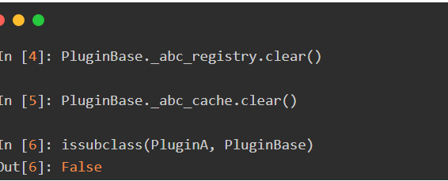

> python发出警报：通过调用winsound库的`beep(frequency, duration)`，其中`frequency`为音量，`duration`为持续时间。

```python
# 实例
import winsound
winsound.Beep(2000, 3000)
```
<br>

### 1-类

<br>

> - 类是抽象的模板，而实例是根据类创建出来的一个个具体的对象，每个对象都拥有相同的方法，但各自的数据可能不同。
> - 类名通常采用驼峰式命名方式，尽量让字面意思体现出类的作用，类名大写。
> - Python采用多继承机制，一个类可以同时继承多个父类(也叫基类、超类)，继承的基类有先后顺序，写在类名后的圆括号里。
> - 继承的父类列表可以为空，此时的圆括号可以省略。但在Python3中，即使你没有显式继承任何父类，它也默认继承object类。因为`object`是Python3中所有类的基类。
> - 类定义与函数定义(def语句)一样：只有在被执行才会起作用，在定义阶段只是语法检查。
> - 类的基本形式如下：

```python
# 经典类,python3默认继承object
class A:
    pass
    
# 新式类，继承A类
class B(A):
    pass
```

<br>

#### a-初始化方法与构造方法

<br>

> - `__init__`是类的初始化方法，所有类都有，它始终在启动类时自动执行。用于象属性赋值，或者在创建对象时需要执行的其他操作。
> - 类默认继承`object`中的`__init__`方法，可以不显示定义`__init__`方法。
> - 但其实Python中创建实例的方法(构造方法)是`__new__`。

> - `__new__(cls[, ...])`是在一个对象实例化时调用的第一个方法，在调用`__init__`初始化前，先调用`__new__`。
> - `__new__`至少要有一个参数`cls`，代表要实例化的类，此参数在实例化时由Python解释器自动提供，后面的参数直接传递给`__init__`。
> - `__new__`对当前类进行了实例化，并将实例返回，传给`__init__`的`self`。但是，执行了`__new__`，并不一定会进入`__init__`，只有`__new__`返回了当前类cls的实例，当前类的`__init__`才会进入。
> - 若`__new__`没有正确返回当前类`cls`的实例，那`__init__`是不会被调用的，即使是父类的实例也不行，将没有`__init__`被调用。
> - `__new__`方法主要是当你继承一些不可变的`class`时(比如int, str, tuple)， 提供给你一个自定义这些类的实例化过程的途径。
> - `__new__`可用于实现单例模式。

```python
class Student(object):
    def __new__(cls, *args, **kwargs):
        print(cls.__name__, str(args))
        return object.__new__(cls)  # __new__一定要有返回值

    def __init__(self, name):
        self.name = name  


if __name__ == '__main__':
    s = Student('Dream fish')
    print(s.name)   # Dream fish
```
```python
# 单例模式
class Singleton(object):
    __instance = None # 私有属性

    def __new__(cls, age, name):
        if not cls.__instance:
            cls.__instance = object.__new__(cls)
        return cls.__instance

    def __init__(self,age,name):
        self.age = age
        self.name = name
```

<br>

#### b-成员变量

<br>

> - 定义在类中，方法之外的变量，称作类变量。
> - 类变量是所有实例公有的变量，每一个实例(包括类本身)均可以访问、修改类变量。


> - 实例变量指的是实例本身拥有的变量，一般定义在`__init__`方法中。
> - 每个实例的变量在内存中都不一样。
> - 通过实例访问同名属性变量，实例属性变量访问优先级比类属性变量高，所以我们访问时优先访问实例属性变量。
> - 类属性变量与成员属性变量的关系可以类比全局变量与局部变量理解。

```python
class Student(object):
    name = '?'  # 类属性

    def __init__(self, name):
        self.name = name  # 成员属性


if __name__ == '__main__':
    s = Student('Dream fish')
    print(Student.name)  # ?
    s.name = '梦鱼'
    print(Student.name)  # ?
"""
1、上述在___init__中赋值name，其实是对成员属性name的初始化和赋值，创建了一个新变量。
而不是对类变量name的赋值。
2、此外通过实例修改与自身成员属性同名的类属性，修改的也是成员属性。
"""
```
```python
class Student(object):
    name = None


if __name__ == '__main__':
    s = Student()
    s.name = 'Dream fish'
    print(Student.name)  # None
    """
    通过实例对象.属性的方式修改类属性，其实是创建同名成员属性。
    通过实例对象.属性的方式可以访问类属性。
    """
```

<br>

#### c-类的方法

<br>

> 1. 类的方法分为三种，分别是类方法、实例方法和静态方法。
> 2. 实例方法：
>    1. 类成员方法必须提供一个`self`(也可用其他名称)参数，表示调用对象本身，该参数会自动传入。
>    2. 实例方法能由对象实例调用，也可以通过类调用(需要传入类实例对象)。其实就是实例对象的调用必须要实例对象。
> 3. 类方法：
>    1. 装饰器`@classmethod`标识的方法为类方法，方法参数由`self`变成了`cls`表示这个方法接收到的是一个类，而不是实例对象(当然cls是约定名称，可以自行更改)。
>    2. `cls`参数自动传入。
>    3. 缺失`@classmethod`，类方法会被认作实例方法。
>    4. 类方法可以通过类直接调用，当然也可以使用类的实例化对象调用(解释一下，python解释器会自动获取当前类作为参数)。
>    5. 参考：
> 4. 静态方法：
>    1. 静态方法的定义跟一个普通函数区别不大，只是在上面多了一个`@staticmethod`装饰器。
>    2. 方法既不接受`self`参数，也不接受`cls`参数，但可以接受任意数量的其他参数。
>    3. 静态方法既不能修改对象状态，也不能修改类状态。
>    4. 静态方法的调用，可以使用类名，也可以使用类对象。

```python
# 实例方法
def 方法名(self, param...)
	pass

# 类方法
@classmethod
def 方法名(cls, param...)
	pass

# 静态方法
@staticmethod
def 方法名(param...)
	pass
```
```python
class A(object):
    name = None

    def fun1(self):
        pass

    @classmethod
    def fun2(cls):
        pass

    @staticmethod
    def fun3():
        pass
```
<br>

#### d-内置类属性

<br>

> - `__dict__` : 包含一个由类属性组成的字典。
> - `__doc__` :类的文档字符串。
> - `__name__`: 类名。
> - `__module__`: 类定义所在的模块，如果类位于导入模块mymod中，那`类名.__module__`等于mymod。（当前运行类的模块是`__main__`）
> - `__bases__ `: 类的所有父类构成元素，包含了一个由所有父类组成的元组。

---


### 2-魔术方法

<br>

> - python中具有`__xx__`形式的类方法称为魔术方法(magic method)，常指的是双下划线在方法名前后的特殊方法。
> - 一般都不需要主动调用，而是常常在类或者对象触发某个事件自动执行。
> - 而如果需要定制特殊功能的类，则需要对指定的特殊方法进行重写。

<br>

#### a-富比较方法

> 略，参考[4.数据类型-⑪数据容器-自定义类对象排序](https://www.yuque.com/yxlumengyu/lf5ery/bzz0uo)

<br>

#### b-容器

<br>

> 略，参考[4.数据类型-⑧序列-自定义序列](https://www.yuque.com/yxlumengyu/lf5ery/bzz0uo)

<br>

#### c-运算符重载

<br>

> 要改变一个运算符的行为跟改变函数的行为一样，只需在类中定义好对应的特定方法，运算符就会按照设定的方式运行。其返回值即为计算结果，一般返回对应类实例。

> 算数运算：
> `__add__(self, other)`           		定义加法的行为：`+` 
> `__sub__(self, other)`           		定义减法的行为：`-`
> `__mul__(self, other)`           		定义乘法的行为：`*` 
> `__truediv__(self, other)`      	定义真除法的行为：`/`
>  `__floordiv__(self, other)`      	定义整数除法的行为：`//` 
> `__mod__(self, other) `          		定义取模算法的行为：`%` 
> `__divmod__(self, other)`        	定义当被`divmod()`调用时的行为 
> `__pow__(self, other[, modulo])` 	定义当被`power()`调用或`**`运算时的行为
> ` __lshift__(self, other)`        	定义按位左移位的行为：`<< `
> `__rshift__(self, other)`        	定义按位右移位的行为：`>>` 
> `__and__(self, other)`         		定义按位与操作的行为：`& `
> `__xor__(self, other)`           		定义按位异或操作的行为：`^` 
> `__or__(self, other)`            		定义按位或操作的行为：`|`

> 赋值运算：
> `__iadd__(self, other)`           		 定义赋值加法的行为：`+=`
> `__isub__(self, other)`             	定义赋值减法的行为：`-=`
> `__imul__(self, other) `            	定义赋值乘法的行为：`*=`
> `__itruediv__(self, other)`         	定义赋值真除法的行为：`/=`
> `__ifloordiv__(self, other) `      	定义赋值整数除法的行为：`//=`
> `__imod__(self, other)`             	定义赋值取模算法的行为：`%=`
> `__ipow__(self, other[, modulo])` 定义赋值幂运算的行为：`**=`
> `__ilshift__(self, other)`          	定义赋值按位左移位的行为：`<<=`
> `__irshift__(self, other)`          	定义赋值按位右移位的行为：`>>=`
> `__iand__(self, other)`            	定义赋值按位与操作的行为：`&=`
> `__ixor__(self, other)`             	定义赋值按位异或操作的行为：`^=`
> `__ior__(self, other)`             		定义赋值按位或操作的行为：`|=`

> 一元运算
> `__pos__(self)`      				定义正号的行为：`+x`
> `__neg__(self)`      				定义负号的行为：`-x` 
> `__abs__(self)`      				定义当被`abs()`调用时的行为 
> `__invert__(self)`   				定义按位求反的行为：`~x`

> 类型转换
> `__complex__(self)`      	定义当被`complex()`调用时的行为(需要返回恰当的值） 
> `__int__(self)`          		定义当被`int()`调用时的行为(需要返回恰当的值） 
> `__float__(self)`       	定义当被`float()`调用时的行为(需要返回恰当的值） 
> `__round__(self[, n])`   	定义当被`round()`调用时的行为(需要返回恰当的值） 
> `__index(self)__`       	略

```python
# 示例(定义一种数字)
class MyNumber(object):
	def __init__(self, num: list[int], flag=-1):
		self.nums = num
		self.flag = flag

	def __add__(self, other):
		return MyNumber(self.nums+other.nums)  # 返回一个新MyNumber

	def __iadd__(self, other):
		self.nums.extend(other.nums)
		return self  # 返回原MyNumber

	def __abs__(self):
		self.flag *= -1  # flag取反

	def __str__(self):
		return f'MyNumber(nums:{self.nums},flag:{self.flag})'


m = MyNumber([1, 2, 3])
n = MyNumber([6, 7, 8])
c = m + n
m += n
abs(m)
```
> 在使用python遇到一种情况，`list += tuple`不会报错，但是`result = list + tuple`会报错。个人觉得可能就是`list`的`__iadd__`中会将类型自动转为`list`。

<br>

#### d-上下文管理器

<br>

> 略，参考[10.文件IO-③上下文管理器](https://www.yuque.com/yxlumengyu/lf5ery/gy0qdc)

<br>

#### e-__call__

<br>

> 略，参考[7.语法糖-⑦装饰器-e.类装饰器](https://www.yuque.com/yxlumengyu/lf5ery/ws9tq4)

<br>

#### f-描述器部分

<br>

> 待补

<br>

#### g-其他

<br>

> - `pickle`：见文件IO
> - `__str__`和`__repr__`方法处理对象如何呈现为字符串，因此您需要确保在类定义中包含至少一个这些方法。如果必须选择一个，请使用`__repr__`，因为它可以代替`__str__`。


---

<br>

### 3-元类(Metaclass)

<br>

> - 在Python中，类本身也是一种对象，我们直接操作一个类，，这些操作都会反映到所有类的实例身上。

<br>

#### a-类型类

<br>

> - 类也是一种对象，也存在类型，类的类型就称作元类，即元类用于创建类对象。在Python中，默认的元类是`type`。
> - 我们可以利用`type`来创建类，就像我们利用类来创建实例一样。`type`接收三个参数来创建类，第一个是类名，第二个是基类元组，第三个是类属性。`type`创建类的过程，就是我们利用`class`关键字定义类后解释器内部所做的事请。
> - 可以认为：
>    1. 实例的类型是类。
>    2. 类的类型是元类。
>    3. 元类的类型是`type`。(`type`的类型也是`type`：`type(type) --><class 'type'>`)
> - 不管是使用`class`关键字还是`type()`创建类是，都可以通过`metaclass=...`指定元类。

```python
type(type)  # <class 'type'>
type(str)   # <class 'type'>
type(int)   # <class 'type'>
```

<br>

#### <元类方法>

<br>

> - `__new__(mcs,name,bases,dict)`：类似于类中的`__new__`，用于定义元类的创建行为。
> - `__init__(cls, name, bases, dict)`：类似于类中的`__init__`，用于初始化元类,创建类时会用到。
> - `__call__(cls, *args, **kwargs)`：定义类实例化时的行为。

> - `__prepare__(meta, name, bases)`：解释器调用元类的`__new__ `方法之前会先调用该方法，返回一个字典作为调用`__new__`方法的`dct`参数，再传给`__init__`。
>    1. `mata`：元类。
>    2. `name`：要创建的类名称。
>    3. `bases`：基类组成的元组。
> - 通常在元类中，它需要被定义成一个`@classmethod`。
> - `__prepare__`用于在类定义之前生成一个命名空间，之后类定义中的属性全部存储于该命名空间中。如果元类中没有定义该方法，会默认使用一个空字典项`dict()`。
> - 类创建完成后，`__prepare__`返回的命名空间会被拷贝到一个新的字典中，同时会产生一个只读的代理叫做`__dict__`。原先的命名空间将被丢弃，并且新的字典是原始dict。
> - 实际上，将`@classmethod`换为`@staticmethod`(甚至啥也不用)不会影响`__prepare__`的功能，这取决于`__prepare__`实际需要。若`__prepare__`要使用元类属性，或要利用`super()`，那么我们将不得不选择`@classmethod`。

```python
class MyMeta(type):
	@classmethod
	def __prepare__(mcs, name, bases):
		namespace = {   # 准备初始命名空间
			'msg': 'something'
		}
		return namespace

	def __new__(mcs, name, bases, dct):
		print(dct)	# 打印dct
		return super().__new__(mcs, name, bases, dct)

	def __call__(cls, *args, **kwargs):
		pass
		return super().__call__(*args, **kwargs)


class A(metaclass=MyMeta):
	def __init__(self):
		pass


a = A()
"""
{'msg': 'something', '__module__': '__main__', 
'__qualname__': 'A', '__init__': <function A.__init__ at 0x0000026DC8E4E5F0>}

"""
```

<br>

#### b-自定义元类

<br>

> - 自定义元类的主要目的是在创建类时，动态更改类的某些行为。当我们对`type`元类的某些行为不满意，但又无法修改`type`时，可以考虑自定义元类。
> - 自定义元类只需要继承`type` ，`type`是元类，继承它的子类也是元类。
> - 元类的`__new__(cls, name, bases, attrs)`会在创建类对象时调用，返回一个类对象，而非类实例对象。(内部调`type.__new__` 要传入`cls`参数。)
> - 类通过`metaclass`指定继承元类，并在创建类时自动传递参数到元类的`__new__`。

```python
class MyMata(type):	 # 定义元类

	def __new__(cls, name, bases, dct):
		print('Do something!')
		return super().__new__(cls, name, bases, dct)


class A(metaclass=MyMata):	# metaclass指定元类，定义类
	pass


print(A)    # Do something!
```

<br>

#### c-动态创建类

<br>

> - 动态语言和静态语言最大的不同，就是函数和类的定义，不是编译时定义的，而是运行时动态创建的。类也是对象，你可以在运行时动态的创建它们，就像其他任何对象一样。
> - 动态创建类：`type(name, bases, dict)`，创建类的元类是`type`。
>    1. 第一个参数name是指要创建类的名称。
>    2. 第二个参数bases是指需要继承父类的元组。
>    3. 第三个参数dict是类的属性(变量、方法等)。
> - 如何在动态创建对象时指定元类？

```python
def b_init(self, name):
    self.name = name


def b_str(self):
    return f'name:{self.name},age:{self.age}'

# 动态创建类B
B = type('B', (object,), {'__init__': b_init, 'age': 20, '__str__': b_str})
b = B('fish')	# name:fish,age:20
```

<br>

#### d-元类与类

<br>

> - 对于`__call__`方法，可以使对象可调用(`a()`的形式)。同样的，元类的`__call__`方法会使元类的实例也就是类可调用(`A()`的形式)，其实也就是类创建对象时。也就是说，元类的`__call__`会在类实例化时调用。
> - 而元类的`__new__`和`__init__`会在类创建时调用。
> - 根据上述，可以通过定制元类`__call__`、`__new__`(很少用)、`__init__`控制类及类的对象的创建。

```python
class MyMeta(type):  # 定义元类

    def __new__(mcs, name, bases, dct):     # 限制类的创建
        pass
        return super().__new__(mcs, name, bases, dct)

    def __init__(cls, name, bases, dct):    # 限制类的初始化
        super().__init__(name, bases, dct)

    def __call__(cls, *args, **kwargs):  # 限制类的实例化
        pass


class A(metaclass=MyMeta):
    pass


print(A.__class__)  # <class '__main__.MyMeta'>
```
> - 通过上述，我们知道`class A(metaclass=B): pass`中的`A(metaclass=B)`实际上可以认为是调用`B.__new__`。在`B.__new__`中也可以使用`key=default`设置默认参数。

```python
class MyMeta(type):

    def __new__(mcs, name, bases, dct, other=None):
        print(other)
        return super().__new__(mcs, name, bases, dct)


class A(metaclass=MyMeta, other='someMsg'):
    pass


print(A)  # someMsg
```

<br>

#### e-object与type

<br>

> - python面向对象存在两种关系：
>    1. 继承关系，表现为子类继承于父类。
>    2. 类型实例关系，表现为某个类型的实例化。
> - python一切皆`object`，所有对象都是从`object`继承而来的，`type`也继承自`object`，而`object`的类型是`type`，obejct和type是共生的关系。
> - 所有对象(包括`type`)都是继承自`object`。所有对象(包括`object`)的类型都源与`type`(元类)。

<br>

#### f-类的创建过程

<br>

> 1. 当Python见到`class`关键字时，会首先解析`class ...`中的内容。例如解析基类信息，最重要的是找到对应的元类信息(默认是`type`)。
> 2. 元类找到后，Python需要准备`namespace`(可以近似认为是`dict`参数）。如果元类实现了 `__prepare__`函数，则会调用它来得到`namespace`。
> 3. 之后是调用`exec`来执行类的`body`，包括属性和方法的定义，最后这些定义会被保存进 `namespace`。
> 4. 上述步骤结束后，就得到了创建类需要的所有信息，Python会调用元类的构造函数来真正创建类。

<br>

#### g-类型判断等应用

<br>

> - 类型判断：待补
> - 判断类是否包含指定方法。
> - 定制类实例化过程。
> - ：ORM

```python
class MyMeta(type):  # 定义元类

	def __new__(mcs, name, bases, dct):  # 限制类的创建
		if 'some' not in dct:
			raise RuntimeError(f'{name}缺失some属性！')
		return super().__new__(mcs, name, bases, dct)


class A(metaclass=MyMeta):

	def some(self):
		pass


class B(metaclass=MyMeta):
	some = None
	pass


class C(metaclass=MyMeta):
	pass


print(A)
print(B)
print(C)  # RuntimeError: C缺失some属性！
```
```python
class MyMeta(type):  # 定义元类

    def __new__(mcs, name, bases, dct):  # 限制类的创建
        if 'some' not in dct:
            raise RuntimeError(f'{name}缺失some属性！')
        return super().__new__(mcs, name, bases, dct)

    def __call__(cls, *args, **kwargs):
        pass  # 一些骚操作
        obj = object.__new__(cls)
        cls.__init__(obj, *args, **kwargs)  # 参数解包
        return obj
		# return super().__call__(*args, **kwargs)

class A(metaclass=MyMeta):
    def __init__(self, *args, **kwargs):
        pass

    def some(self):
        pass


a = A()
```
```python
待补
```

---

<br>

### 4-抽象基类

<br>

> - 抽象类型是指一类不可直接实例化，只可被继承的类。对应的，能够直接实例化的类称作具体类型。接口需要所有方法都是抽象方法，而抽象基类中有抽象方法，也有自己实现的方法。
> - Python中抽象类是以抽象基类(abstract base classes,简称ABC)的形式来实现的。通常在抽象基类中会定义一些抽象方法或抽象属性。
> - 继承于抽象基类的子类必须给出所有抽象方法和属性的具体实现，才可以进行正常的实例化。
> - Python中，抽象基类由标准库`abc`支持。`abc`提供了两个核心的用于抽象基类的类：`ABCMeta`和`ABC`，前者用于自定义抽象基类时指定为元类，而后者则提供了可以直接继承来使用的抽象基类。
> - Python标准库中abc模块实现了抽象基类，其实在Python中`collections`中也实现了抽象基类，`numbers`中也定义了有关数字对象的抽象基类。

<br>

#### a-@abstractmethod

<br>

> - `abc`也提供了`@abstractmethod`装饰器来指定抽象方法。只有将所有抽象方法均实现的子类，才可以实例化。除普通方法外，`@staticmethod`，`@classmethod`和`@property`都可以做成抽象方法。但`@abstractmethod`必须放在最下层。
> - 装饰器很简单就是给被装饰函数新增`__isabstractmethod__`的布尔型字段，标记该方法是否为抽象方法。

> - 可以将 `@abstractmethod()`和`@property()`结合来标出这个属性，实现抽象属性。

```python
import abc

class MyAbstract(abc.ABC):

	@property
	@abc.abstractmethod
	def age(self):
		pass

	@property
	@abc.abstractmethod
	def name(self):
		pass


class A(MyAbstract):
	name = None

	@property
	def age(self):
		return 20
```

<br>

#### b-ABCMeta

<br>

> - Python 标准库库中就有一个元类 abc.ABCMeta，该元类的作用可以定义抽象类。
> - ABCMeta的初始化就是缓存抽象方法到`cls.__abstractmethods__`。
> - 使用该元类以创建抽象基类。抽象基类可以直接被子类继承。你也可以将不相关的具体类和抽象基类注册为抽象子类。
> - `metaclass=abc.ABCMeta`可以和`abc.ABC`互换。

```python
import abc

class MyAbstract(metaclass=abc.ABCMeta):

    @abc.abstractmethod
    def do(self):
        pass

    @staticmethod
    @abc.abstractmethod
    def complete():
        pass

    def other(self):
        pass
```
<br>

#### c-ABC

<br>

> - `abc.ABC`的类型仍然是`ABCMeta`，因此继承`ABC`仍然需要关注元类使用中的注意事项，比如可能会导致元类冲突的多重继承。
> - `metaclass=abc.ABCMeta`可以和`abc.ABC`互换。
> - `abc.ABC`也存在属性`cls.__abstractmethods__`。

```python
import abc

class MyAbstract(abc.ABC):

    @abc.abstractmethod
    def do(self):
        pass

    @staticmethod
    @abc.abstractmethod
    def complete():
        pass

    def other(self):
        pass
```
<br>

#### d-注册与继承

<br>

> - 抽象基类实例化
>    1. 可以让一个类继承并实现抽象基类中所有的抽象方法。
>    2. 使用`register()`或者`@register`对一个类进行虚拟注册。
> - 使用 register 接口可以将某个类注册为某个抽象基类的虚拟子类。支持`抽象基类.register()`直接调用注册，或者使用`@register`装饰器方式注册。

```python
# 继承
import abc
class MyAbstract(abc.ABC):

	@abc.abstractmethod
	def do(self):
		pass

	@staticmethod
	@abc.abstractmethod
	def complete():
		pass

	def other(self):
		pass


class A(MyAbstract):

	def do(self):
		print('doing...')

	@staticmethod
	def complete():
		print('over...')
```
```python
# 虚拟注册
import abc
class MyAbstract(abc.ABC):

	@abc.abstractmethod
	def do(self):
		pass

	@staticmethod
	@abc.abstractmethod
	def complete():
		pass

	def other(self):
		pass

@MyAbstract.register	# 注册
class A(object):

	def do(self):
		print('doing...')

	@staticmethod
	def complete():
		print('over...')

class B(object):

	def do(self):
		print('doing...')

	@staticmethod
	def complete():
		print('over...')


MyAbstract.register(B)	# 注册
```

<br>

#### e-虚拟子类

<br>

> - 虚拟子类是指某个类提供了一个注册方法，可以指定某个其他类为自己的子类。
> - 虚拟子类除去在`issubclass()`判断时返回`True`，其他任何地方都和所谓的父类没有关系。
> - 在Python中，抽象基类提供了`register`方法，允许我们通过注册的方式指明子类的抽象类别。抽象基类还提供装饰器定义虚拟子类的方式`@register`。	
> - 虚拟子类也不会继承父类的何方法或属性，虚拟子类不需要实现抽象方法。

> - 这些类以及它们的子类会被内建函数 issubclass() 识别为对应的抽象基类的子类，但是该抽象基类不会出现在其 MRO（Method Resolution Order，方法解析顺序）中，抽象基类中实现的方法也不可调用（即使通过 super() 调用也不行）
> - 注册后，使用 isinstance 以及实例化时，解释器将不会对虚拟子类做任何方法检查
> - 虚拟子类不是子类，所以虚拟子类不会继承抽象基类的任何方法。
> - 效果:
>    - issubclass 和 isinstance 等函数都能识别继承关系，
> 
> - 检查:
>    - Python 不作检查，即便是在实例化时
>    - 被注册的类必须满足抽象基类对方法名称和签名的要求，最重要的是要满足底层语义契约
> - 取消注册：
> - __mro__:此类属性指定了类的继承关系，即方法解析顺序

> __subclasshook__
> - 作用: 子类检查的钩子，实现抽象基类的动态接口检查
> - 返回:
>    - True: 表示是抽象基类的子类
>    - NotImplemented: 让子类检查
> - 限制: 只限于抽象基类
> - 理解:
>    - 抽象基类的本质就是几个特殊方法，因此可以不继承或注册虚拟子类，而只要实现特定的方法即可
>    - 只要实现的特殊方法能让 __subclasshook__ 返回 True 就可以判定为抽象基类的子类
>    - 注意只有提供了 __subclasshook__ 方法的抽象基类才能这么做
> - __subclasscheck__

<br>

---

<br>

### 鹅与鸭

<br>

#### a-鸭子类型

<br>

> 

<br>

#### b-白鹅类型

<br>

> 

<br>

#### 协议与接口

<br>

> 


## (3)类关系
#### ①依赖、关联、组合

## 
#### ①继承

#### ②多继承（java不支持）

1. Python2 版本中，经典类的多继承方式是深度优先。所谓深度优先，即是从左到右，一条路走到底再走另一条路。新式类的多继承采用 mro 序列 (C3 算法)。
2. Python3版本中采用C3算法！
3. 调用mor( ) ,查看继承的顺序！
#### 
#### $C3算法（待补）
#### 
 $多继承的super（ 待补）


#### ③封装


#### ④多态

1. Java中多态性的表现： 多态性，可以理解为一个事物的多种形态。
2. python中也支持多态，但是是有限的的支持多态性，主要是因为python中变量的使用不用声明，所以不存在父类引用指向子类对象的多态体现，同时python不支持重载。在python中 多态的使用不如Java中那么明显，所以python中刻意谈到多态的意义不是特别大。


